= myValuesPdf
:toc: left
:toclevels: 3
:sectnums:

'''

== 5个最核心价值观

=== ★ 人是一个“活”的东西，有变化性，因此没有任何人能定义你！说死你.

- 在与日俱增的运营大军中，*更多人缺乏的是统观行业上下游的运营思维高度，以及跳出具体岗位外，对这个职业的想象力* (即: 这个事物的内涵, 其实也是个"筐", 它里面该包含什么内容, 它将来该怎么发展, 不是由别人定义的, 而是由你自己来定义的!)。

- 对新生事物, 你就有机会在它进化过程的每个阶段, 都能去重新定义它, 来塑造它的未来样子. (正如对婴儿) +
人工智能和机器人, 它到底长什么样子，谁也不知道。你就有机会去定义它的进化。并且定义(探索)它能解决问题的边界.

=== 概念(马甲)是个框, 什么都能往里装

- 对任何一个概念, 世上没有绝对唯的一定义, 定义内容是人赋予的, 每个人都有自己的定义. +
你要对它下一个明确的自己的定义 (而不是照搬别人的的定义. 因为别人的定义中打包的内核, 是别人想以的东西, 不一定是符合你所想要的). 别人的人生目标不是你的人生目标. 别人的 KPI 也不是你的 KPI,  如何找到你自己的正确的 KPI? 你要用你自己的指标(而非别人的), 你自己的营销目标的数据, 来进行解构分析.

- 对同一概念的多种定义, 即是一种更好的观察细微差别的方法. ( 不同的人为什么对同一概念会赋予不同的定义? 因为他们各自有想要"突出强调"的方面.)

.标题
====
- 悬崖上有一朵花，去摘百分百会死，你会去替我采吗？
很多女孩子都会拿这个问题去问男友。
其实可以反问: 如果你知道我会去替你采悬崖上的花，你还会让我去吗？
====

- *语言常常是困住思想的牢笼，改变语言的表达, 本身就会带来一种新的思考方式。*

=== ★ 有两种人 : 1.谋事的(脑), 2.成为工具人的(变成手)

[options="autowidth" cols="1a,1a"]
|===
|Header 1 |Header 2

|谋事者
|- *始终会关心更底层的逻辑, 即, 我做什么(how), 才能更好驱动自己生意的某个指标发展? 即, 你脑海中已经开始形成"对于业务进行拆解, 驱动, 和管理"的思维模型.*

- 中国古语"知之为知之, 不知为不知" , 从来不是谋事者的价值观. *谋事者从来不会以"自己并非那个专业出身的人士",而关闭自己大脑的主动分析判断能力, 来抑制自己观点的发表,* 盲从"专家". 谋事者绝不会"被动式的学习", 和"不加验证, 不加批判"的接收他人的说法. ( 具有独立思考能力, 和批判性思维.)  +
**掌握"结构化战略思维"的谋事者, 不会以“不懂”为拒绝思考的借口，他总是试图分解问题，**运用放之四海而皆准的方法 (太阳底下没有新鲜事), 来逐渐深化“切”好问题.

- **谋事者在内心中, 首先就是把自己定位成”解决问题的人”，**而不是"在一旁的看戏者, 吃瓜群众". *谋事者的性格中, 本身就对问题保持着亢奋的“进攻”状态。(你自己就是爱思考者，要建立自己的价值观方法论大树框架"的人. 项羽: 彼可取而代之.* 曹操: 若天下没有孤，不知有几人称帝几人称王.)

- 正像王立群所说, *人分为几种: 1. 琢磨事的, 2. 琢磨人的, 3. 琢磨钱的, 4. 琢磨人事钱三者的, 5. 琢磨"死物"的(设计, 工匠).*

- 淘宝网总裁孙彤宇有90%的时间都在考虑淘宝的发展.

|工具人
|- 只关注把手中的事情做完, 而不去想这件事的意义价值有多大, 要想驱动你公司业务的发展, 有没有更好的方式?
|===

=== 除了性格外, 人和人最大的差别是”认知”.

- 天下大势(决策)，归根到底其实就取决于"关键人的关键认知".

- 画面设计这种工作, 是没有内涵的, 你被花花绿绿的画面吸引一天, 看过即忘, 头脑依然空空. 因为画面不像看书一样对你有思想收获 (有精神食粮感)!

=== ★ 人在一生中的核心认识, 归根结底只有三种: 1.对人类构成的社会的认识(人性). 2.对具体某个人的认识(观人, 识人), 3.对如何做事的认识(方法论, 及对具体事态未来走势的判断)

=== ★ 建立你自己的"理论架构树"!

去看管理学的书,找出里面的所有模型, 把前人总结出来的模型， 用MECE法则, 来重新分析拆解,组装到你自己的"理论架构树"上.

=== ★ 对任何"事物"做出你自己的判断, 都要问4个问题

[options="autowidth" cols="1a,1a"]
|===
|Header 1 |Header 2

|1.它存在的意义和价值是什么?
|即, *它是为了解决什么问题, 而存在?* 为什么它必须要存在? *它(该理论, 该方法)的同类竞争对手有哪些?* 其他事物能替代它吗 ?

|2.它宣称能针对解决的问题, 这些问题重要吗? 价值度如何?
|

|3.它是如何做到的?
|方法是什么? *背后的原理是什么?* 底层逻辑是什么? 心理学依据是什么? *每个方法的ROI如何? 成功率如何? 优点和缺点分别是什么?* 使用场景的前提要求是什么?

|4.没有一个理论是完美无缺的.
|对同一个问题, 经常不同高人间的观点(所站角度), 也会彼此不同 (这在政治学领域很常见). 那么你就要特别注意**他们(即竞争性理论)彼此间的批判, 观点逻辑如何. 对对方理论的漏洞, 挖掘深度如何?** 犀利度如何, 一针见血吗? 令你拍案叫绝吗? 并以此来补足你的思考漏洞, 和理论框架.

理论的思想演变历史, 能让我们知道它一路在解决的缺点.
不迷信任何理论, 就去查看它一路演过来的思想史. (背后的逻辑演变链条, 前因后果, 渊源发展路径). *因为每一次发展更新, 都是它试图解决自己原先的缺陷.*

image:img/0007.svg[,]
|===

=== 权力与责任必须对等

.标题
====
- 消费者购买某产品, 必定要通过"用户之旅"的全过程. 所以不能让负责最前端内容推广的公关人, 直接承诺最后一个环节的销售成果.
====

'''

== 10大基本价值观 (如同经济学十大基本原理)

=== 年龄,时不我待, 把握住时间

- 无论你做不做，学不学，你都会活到那个年龄！

=== 网上的电子数据, 都只是虚拟的”获得”

- 你在网上寻找的“圆梦”行为, 都只是虚拟的“获得”. 因为你都没有实实在在的得到它们. (无论你在电子游戏中获得多少"财富"和"成就", *游戏或电子数据从硬盘上一删, 就都没了. 而你之前为之浪费的时间, 却是实实在在的损失.* 只有真正进到你现实口袋里的，才是你真正得到的！ +
所以, 人的一辈子活动, 无论你做什么, 最大的实实在在的实体物质遗留, 就是生儿育女传承下去! 其他都会化为烟云.
**时光会带走无形，留下的只有实体。**回忆, 无形, 只属于我们自己 (随着我们死亡而消散)，而实体(实物财富)才是你唯一能留给后代的东西。

- 能在脑子里想到最终效果的东西(如打游戏, ps图片)，就不要实际再去做它们，因为你只不过是把脑中已经知道的结果, 再在电脑前浪费时间重复了一遍，没有必要! 只是在浪费你当天的时间. 你完全可以把这段时间用在其他方面.

=== ★ 人生的任务, 是要去解决你生活中更多的问题，而不是只盯着一两个问题解决到最好(所以不要去追求完美的方法)

- 正如你一路长大, 都不是"恋爱专家","育儿专家", "教育专家", "父母专家", "买房专家", "买车专家", 但你却一路解决了很多人生大事. 这正是你的人生任务! 必须要完成的. 很多事情我们只需要赢，而并非必须做到完美。 +
因此, 你要追求去解决"更多问题"(成为事事60分的管理者, 而不是成为只能做一件事的100分的专家), 即, 不断向管理层上走, 向"上方"走, 而不是在"平行线"上走.

- 兴趣分两种，一种是**(狭窄的)技术类兴趣**（下棋，弹琴，画画，编程，武士），一种是**(具有综合能力锻炼的)事业类兴趣**（做生意，建帝国，赚大钱，诸侯之心）。(就可以将人分成"工具人"和"谋事者").

=== ★ 人最怕的是没有个性。你的差异性都没有了，客户怎么会选择你？

- 人最怕的是没有个性。 *没有个性，你就只能做别人的影子或者传声筒。都不用说你的优势在哪里了，你的差异性都没有了，客户怎么会选择你？*(我们要让别人, 无论他是客户, 朋友, 对象, 知道我们的独特，这一点非常重要。)

.标题
====
- 电视上每个主持人，如果都只是拷贝其他之前的主持人的讲话的方式，哪里会有这么多各式各样的主持风格来？大家都长一个样子，分不出谁是谁了。

- **同质化艺人过多，会降低每一个偶像的不可替代性，**最终导致粉丝社群的黏性下降，缩短每一个偶像产品的变现周期。
(所以“设计师主不要有自己的风格？“你只会变成可无缝替换的标准件螺丝！自我阉割。这句话完全是站在资本方立场做出的，对资方有利，而不利于设计师本人）

- 如果是千篇一律的作品，有什么必要存在？总是要有点不一样的内容.
====

- 这些路不是用来局限住你的，而只意味着提供你一些选择的途径. *没有创新精神的人, 永远也只能是一个执行者。*

- **遇到比你有钱的人，请不要自动的卑躬屈膝，**除非…他有要把他的钱给你… *而通常有钱人，并不会把钱送给随便就对他们卑躬屈膝的人。*

=== 我是谁 : 自我定位

[options="autowidth" cols="1a,1a"]
|===
|Header 1 |Header 2

|正确的自我站位:
|→ 面对陌生人，是站在他们的上有老下有小的家人之后。  +
→ 面对熟人，是站在他们的老公或老婆之后（时时刻刻想到他们家人关系网），而非仅你们两个人面对面的存在. +
唯如此，你才能超脱于"陷入与对方的情感纠葛”之外！*你要跳出来, 作为外人, 第三方旁观者, 你才能看清楚: 在外人看来”你和人家有家室的人”这一出是何等的狗血剧情.*

|*你与同事之间都没有情感欠债, 彼此都不欠什么, 轻松点好.*
|
|===

=== 追取晋升, 这恰恰是一个人雄心的反映

- 通过各种手段(与高管有联系)获得上升(晋升)没什么不好意思的, 这恰恰是一个人雄心的反映, 当前的低下"现状"不匹配自己的真正能力!

- *要是我不主动去做这件事，他们可能永远也不会给我这个机会。* +
注意这种巧妙的说话方式，把公司的利益放在首位. 你在讲出自己想要的工作调整的时候，无论是重新安排还是工作时间变动，都要强调这对你的雇主会有什么影响，而不是对你自己。不要说“我需要”，或者“我想”，要在老板还没有来得及说出他们关心的问题之前，就打消他们的顾虑：工作调整会损害到你的业绩吗？会给公司增加成本吗？你负责的客户和业务会受到损失吗？

- 即使是做运营工作, 如果一个公司它对运营的期待, 就是定期生产出标准的内容、做些活动、维护促活核心用户，*这类架构给予运营师的可操作性空间 (及对你个人的成长性), 就非常有限。*(所以刘备不会久居人下, 必须要有自己能自主的空间, 地盘.)

=== 不为自己的权利而战，你一生都将是个懦夫.

- *我们最终会被人的坚强性格能力所吸引, 他的艺倒是其次的.*  +
我们为什么会被郭德纲吸引? 因为他的奋斗精神, 当他陷入困境时(因私下报销而成被告事件,陷入抄袭网络段子事件)的强大的求生欲爬出来的精神, 与敌人战斗(嘴仗)不认输的精神. *在这种强烈的战斗精神下, 他的优秀才艺能力的吸引力, 反倒显得其次了, 黯然失色了.* 于是最终, 郭德纲就成了一个既有才艺能力, 又有不服输的性格魅力的人.

=== 孩子教育

- *你是否在很多情况下，担心其他事物，其程度要超过对自己或孩子成长及情感关系的重视？*

'''

== 人性, 心理需求

=== 人是不可能被说服的 (人只会被自己陷入的困境所打服).

- 屁股决定脑袋, 站位决定态度

[options="autowidth" cols="1a,1a"]
|===
|Header 1 |Header 2

|*有不虞之誉，有求全之毁.*
|虞：预料。有意料不到的赞誉，也有过分苛求的诋毁。所以毁誉不必太在意。

|*善操理者-不能有全功，善处身者-不能无过失。*
|善于处理事理, 尚且不能完全成功. 善于修身的人, 尚且不能没有过失。

|百善孝为先，论心不论迹，论迹贫家无孝子； +
万恶淫为首，论迹不论心，论心终古少完人。
|真正孝顺与否, 这个主要看心，不是看表面行为，不是说锦衣玉食给父母就是孝顺，假如这样的话，那么清贫的人家就没有孝子了。  +
真正好色与否, 这个主要看行为，不是看心，假如按心念论，世人都免不了面对美色动心，这样的话，世上就没有一个完美无缺的人了。
|===

=== 人的价值，在遭受诱惑的一瞬间被显现

[options="autowidth" cols="1a,1a"]
|===
|Header 1 |Header 2

|**权，然后知轻重；度，然后知长短。**物皆然，心为甚。
|权：本指秤锤，这里用作动词，指称物。  +
称一称才知道轻重，量一量才知道长短，什麽东西都是如此，人心更是这样。

|相形不如论心，*论心不如择术.*
|观察人的相貌, 不如考察他的思想; 考察他的思想, 不如鉴别他立身处世的方法。
|===

.标题
====
- 其实我并没有傻到每次约会都带女儿，我只是想试一下，他对我女儿的态度。
====

=== 一人难称百人心

[options="autowidth" cols="1a,1a"]
|===
|Header 1 |Header 2

|人上一百，形形色色shai。 人上一万，无边无沿.
|

|一路玩意 惊动一路主顾, 一路宴席 款待一路宾朋。
|
|===

=== 观人

=== “可预测性”是对”稳定性”的判断，“可展望性”，是对”成长性”的评估。

→ 如果你十次有八次把事情做到80分，两次做到60分，上司对你的预期就是80分；  +
→ 如果你十次有六次把事情做到100分，四次不及格，那上司对你没有稳定的预期。

=== 人际交往

==== 其实, 对方也在乎你对他们的看法.

- 台上表演者, 也希望台下观众能与自己互动越热情越好. 而不是收到冷场.

==== ★ 把社交看做吃饭、睡觉一样自然。不需要什么心理负担.

- 社交就像吃饭、睡觉一样重要，同样，也应该像吃饭、睡觉一样自然。*不要对它抱着过高的期待和目标，把它放低一点，让它成为你生命中一件自然而然的事情，把它跟你的形象、评价、标准松绑。*

'''

== ROI

=== 坑与坑是不一样的. 不是所有的失败都是成功之母.

- 坑与坑是不一样的. 有的坑(编程)你可以填平; 有的坑(设计)你只会陷死在里头, 并不会因你有多少决心和热情而能跨过.

- 不是所有的失败都是成功之母，那些"有价值"的失败, 它们必须具备3个前提条件:

[options="autowidth" cols="1a,1a"]
|===
|Header 1 |Header 2

|1.*必须具有清晰的评判标准,* 而非像艺术那样玄学, "文无第一武无第二".
|可量化.

- "运营"本身不是个具有"标准化"的职业. 那你就很难总结成"课程". 因为个人理论色彩浓厚的课程, 很难普世. (这和"设计"这种工作是一样的)

|2.可重复,*可复现, 可复盘*
|- 投资（炒股）行为有一个特点，赚了钱常常不知道是怎么赚的，亏钱也不知道是怎么亏的，或者说**总结的那些原因, 没有可重复性。无法从成功中总结经验，也无法从失败中总结教训，这只能叫"经历", 而非"教训"。**

|3.损失是可控的
|能实施“快速失败”策略的前提, 是你对失败的亏损, 能拥有"可控性". 否则, 该策略就会变成一个黑洞: 一开始以为只是一个小小的投入，最后却变成“葫芦娃救爷爷"，全部搭进去了.
|===

=== ★ 付出了代价, 就要拿到回报. 花了时间, 就要拿到收益 (ROI),(贼不走空). 反之, 如果不存在回报(或回报是虚拟的, 只会"转瞬即逝"), 就不要去投入.

- 学习中遇到的问题, 在你解决后, 必须将"解决过程中的思路, 和采坑教训"记录下来, 复盘. 即, *结果不重要, 如何想出"解决思路"的过程, 才是最有价值的! 如果没有复盘，你 90% 的功夫白费了 —— 你花了不少时间，读了不少代码，除了拿到一个结果外，并无太大的"掌握了解决问题的方式"收获。*

- 提高复盘频率: 在做事的当时，遇到各种问题，你做出过的各种失误, 就要立刻把"领悟"记录下来，随遇随记，用最小迭代法，最高频率的提升自己。

=== 做不同的事, 职业, 会带给你不同的投资回报率 ROI

- 两个骰子加起来:  +
→ 等于5点的概率, 是 1/9.  +
→ 等于2点和12点的概率最小, 是1/36.  +
→ 中间7点的概率最大, 是 1/6.  +
*我们发现, 这11种情况并不是等概率的.*

- 好的, 成功概率更高的专业和职业, 就是比低的职业更能上岸！

- 男怕如错行. *越是吃人深坑的入口处，越是铺满了最迷惑人的鲜花, 来引诱你陷进去.*

=== 不管是什么投资，只有在"风险"和"收益"配比的情况下("高风险"应该给你带来"高收益")，才会有人去玩。

- 刚成立的新公司值得去吗？其实这个问题的本质, 跟"刚成立的公司值不值得投资"(即"风险投资")是一个样的。 +
去刚成立的新公司，也是**风险投资, 要讲风险和收益配比的原则，你不能承担着巨大的风险(新创业公司)，但却只能获得明显很小的收益(低薪水).**

- 在风险不变的情况下扩大收益, 和在收益不变的情况下减小风险, 是一回事。

=== 二八定律决定了, 你80%的回报, 是由20%的地方带来的.

- *二八定律表明, 最后10%的功能, 往往需要90%的成本耗费, 在投入产出比是不合算的. 只要你舍弃最棘手的那10%的任务, 你肯定能更轻松的解决更有利润价值的90%的问题.* +
即使不计成本, 事实上也没有人能提供100%解决方案的软件. 你只能满足大多数人的需求中的大多数问题, 而不是全部. (同样, 不可能世界上所有人都喜欢你. 你也不是人民币, 能满足人见人爱.)

.标题
====
- 程序运行的80％的时间, 其实是花在20％的代码上，剩下80％的代码就算优化到速度无穷快，也没有意义。
- 很快就飞进垃圾桶的东西, 比如设计, 不需要你去打磨.
- 你的短视频也不是"做电影"要流传后世.
- 把用英文写文档, 说成是为了提高逼格，显然是很幼稚的看法。人的精力是有限的，当然要投入到收益最大的事情上面去。
- 穷人常常把钱花在昂贵的治疗上，而不是廉价的预防上。
====

=== ★ 捡芝麻捡得再勤劳，也捡不出西瓜的重量。

- 不要从垃圾堆(新闻,自媒体)里提炼黄金, 你直接从书里(教科书等)能得到的更多!你花n天几百个小时想从自媒体文章中提炼出的干货, 还不如你看几个小时的好书能从中得到的多. 所以, 放弃这些成堆的自媒体文章, 去阅读人家整理好的干货书籍, 才是使你"不浪费大量宝贵时间"的最好做法.

.标题
====
生活中捡芝麻的行为:  +
→ 为了省一元出租车钱，在路上多走 10 分钟。 +
→ 为了抢几元钱的红包，每隔三五分钟就看看微信。  +
→ 为了“双十一”抢货不睡觉。
====

=== 二八定律: 资源是稀缺的, 不能满足所有人的需求, 所以需要去抢的. 成为头部, 才能收取最大利益.

.标题
====
- 1%的电影拿下43%的电影票房，那么也就是说99%的影片去争夺57%的市场空间. (成为头部, 才能收取最大利益.)
====

=== ROI是对比出来的.

- 对roi的衡量, 不是从单方因素决定的. AI 对你的替代，不取决于(求职者)你的能力，而是取决于(资方)对AI的"使用成本"考量。

=== 算算账

- 双休和的单休，看起来只多了一天，但实际上是6:1和2.5:1（工作时间比休息时间）的差别: 5天工作/2天休息= 2.5/1

'''

== 过程和结果, 手段和目的, 战略和战术

=== ★ 路径依赖, 是没有目标的表现

- "因为以前这样做，所以现在也这样做..." 这个思考是错的。这样的路径不是根据目标来的，是**根据以往习惯来的(即路径依赖)，这是没有目标的表现。 (必须倒过来想, 以终为始. )**

.标题
====
- 对用户来说，他关心的是速度, 比如"扫描速度从20秒提升到10秒". 这个目标实现了，留存率自然就上来了。而不是公司一开始就把目标设计成"留存率"或用户"使用次数"，因为这只是"公司角度"的目标和需要, 而不是"用户"的目标和需要. 所以一定要站在用户的角度来考虑问题. *在“速度”这个目标下, 又能分解出很多个子目标.*
====

=== 各个"点"必须能够串联起来, 形成累加势能. +
所谓战略, 就是在你的大方向下, 各个"点"必须能够串联起来, 形成累加势能。 如果你在各种方向上布满了各种产品，*彼此却不能借力, 以至于每个单点都只能单独去与对手竞争, 你就会非常吃力.*  +
(这和人生是一样的, 你在人生中所做的任何事情, 必须对你的最终目标有累加推动效果. 即, 不要去积累你不想积累的, 对你"上岸"没有用的经验!)

=== ★ 政治里面有非常高层次的心理需求

- 对客户是需要引导的，你要启发 (如同古代的说客一样. 他不一定想到这些利害关系, 所以你要启发他们,就如同古代的说客一样)。*客户的需求是不一样的，不同的人他有不同的需求，*"三扣"是低层次的客户的低层次的需求。如果你无法启发客户的高层次的需求，那你就只好把自己混同于其他那些低层次的销售人员。*人往低处走一定比人往高处走要容易.* 做销售，如果你把自己混同于低层次的这种销售，最后你一定是做到了所有的客户全是低层次的客户。

- *政治里面有非常高层次的需求，你如果能够涉及到客户内部的高层次的这种政治利益的种种冲突，能发现很多机会* (想想中国历史, 三国志里面的政治斗争和说客游说)，而不是去简单的满足他一些基本上的需求而已。

- 我虽然反感商业的暧昧、灰色的、不体面的一面，但这恰恰是做成一个事业的必经之路。*不是说把自己变脏，而是说把自己弄得容忍度要大一些 (黑白通吃)，要不然你就没法运作一个很大的事情。*

'''

==  学习, 迭代

=== 认知带给你小步迭代升级, 而不存在一步登天的神药.

- 学习类, 思维升级的课程, 最好把它们看做是能给你启发(每次都比旧的你, 多知道一点点), 而不要把它们看做是灵丹妙药, 吃一颗就能直接让你跨一大步, 改变命运.

- 讲"抗压"的书，里面每一条, 你觉得作用都很小. 事实上这源于你的错误预期，幻想着有一个神招能一下子解决你的大问题. 其实世上不存在神药, 有的只是一个个心理小技巧，虽然它们每一个都作用微小，就像一条条蛛丝一样，但几十个小技巧合在一起，共同来起作用，就能像"结成的蛛网"一样，联合起来就有强大的力量了！

=== 人的想法, 是需要受刺激, 而启发出来的. 所以, 你必须多看, 才能受更多启发, 产出更多想法.

- 无论是行业, 还是政治(历史), 你需要不断的去思考对手, 和他们这样做背后的逻辑, 你才能对于这个行业形成越来越清晰的认知格局。

- 如果你能进入世界精英的大脑，他们眼睛所看到的东西你也能看到，他们耳朵所听到的东西你也能听到，他们**做过的事、成长与得到经验的历程、生存与斗争交手的细节，他们的情感动摇与意志抉择，他们的判断依据与价值观排序，**你都犹如和他们一体一般经历并知晓。遍观人、事、组织的生存历程本质之后，就等于你自己经历了这些一遍一样，你和他们就是拥有完全一样的思想见识与能力影响力。

=== ★ 人都非"生而知之", 而是"学而知之". 见多则识广。舜, 人也. 我, 亦人也. (彼可取而代之)

- 数学只分为三种: 你没见过的、你没理解的、你已经忘记的.

=== 专业化之后，要求"标准化"。要不断地分析自己工作的流程，以改善每一个流程。所谓细节，是指动作、步骤、做法的规范，统统规范出来。

=== 带着你的问题, 去查找(查书), 而非从头看到尾.

- 没有问题，就是最大的问题. 因为**没有问题，就意味着你不知道你的目标在哪里. 就不知道你的船真正应该往哪个方向去.** 所以你从头看到尾, 就是最大的浪费时间.(尤其看低含金量的自媒体文章时)

'''

== 结构化战略思维

=== 自上而下的"结构化战略思维”

- 不会因缺乏相关的专业知识和经验而纠结，往往直接从问题本身（“上”）着手: 用“切”的方法, 来分解问题. 并**用严谨的逻辑, 全面地提出假设，而后或通过对数据的采集与分析, 来证实假设，或证伪, 推翻已有假设, 并建立新的假设（“下”），如此循环, 而深入地验证假设。**不断探究深“挖”问题核心，以获取问题的最终解决方案。

.标题
====
- 你要想出, **通过何种方法，来验证这个观点? 为什么你的目标客户只能是年轻女性呢？**这是由什么造成的？是你产品的"设计现状"决定的么？改一改能吸引到其他用户么？因此, 随着问题的逐步分解和分析的深入，越来越多的业务细节会浮出水面。
====

- 只有你自己想出方法论，*你就能独立想出"任何世上还不存在的, 解决某个问题的方法论"*，就好像印度数学家独立证明出"西方数学家证明过的数学原理"一样，**你就会对自己的思考分析，建模能力很自信，**你就是一个真正的理论思想家，能创建出自己的理论体系, 和方法论架构.

=== 切 : MECE 原则 (Mutually Exclusive ， Collectively Exhaustive)

“切”是结构化拆分的通俗叫法，是结构化战略思维的基本功。结构化拆分, 就是在"自上而下"分析问题时，把问题逐层分解成更细节的部分，每次拆分, 都遵循MECE原则。最终得到一个树状的逻辑结构。

MECE原则,即 : +
1.子分类相互独立, 无重叠； +
2.子分类加起来, 穷尽全部可能。

如果缺乏结构化拆分能力，人们在思考时, 就往往会陷入"在各种毫无联系的单点思绪之间跳跃"的困境中, 浪费时间.

=== 切出来的每一块, 必须满足“具体可衡量”的客观标准

否则, 对切出来的每个子类的价值判断, 就会陷入"模棱两可"的窘境。如果双方对“好与坏”“对与错”“公正和不公正”的切分维度, 没有一致的具体可衡量的评判标准，必然会陷入分裂的"价值判断"争论中。

.标题
====
- 比如: 不要只简单的"定性"切成"好""坏"两块, 你要"明确量化", 什么是"好"? 什么是"坏"? 要把具体的评判标准, 清晰地列出来.

- 比如: 如果"公益捐赠"是个好的行为，那么它的评判标准是什么? +
-> 是金额吗? 还是频率吗? 那么什么金额或频率才算达标？能"量化"的衡量标准是什么? +
-> 是否跟个人财富总额成比例？如果是，比例应该是多少？ 能"量化"的衡量标准是什么? +
-> 除了捐赠, 其他类似的行为也算吗? 能"量化"的衡量标准是什么?

每个上层问题, 都会引出下一层更深的细节问题，都需要你去思考清楚。
====

=== 切出来的每一块, 彼此权重大小怎样? (28法则) . 各个因素彼此的重要性, 分别占多少比例？

- 维度清单, 和评判标准, 齐备之后，第三步是给每个维度赋予一定的权重值。比如"员工考核"问题的结构树, 假设最终的核心维度有ABCD四项，每项的最高分都是100分。A项占整体决策权重的50%，B项占30%，C项和D项各占10%，总和应该永远是100%。

=== 切, 至少有四种切法:

[options="autowidth" cols="1a,1a"]
|===
|Header 1 |Header 2

|1.数学公式法 (财务学, 经济学, 金融学, 自然科学中, 有大量的人类发现的"能分解世事"的数学公式)
|如: 利润=收入-成本. +
继续往下分解公式: +
收入公式 = ... +
成本公式 = ..

|2.子目录列举法 (即你自己用mece切分, 想出来的清单或公式)
|金字塔原理

|3.流程法 (时间维度)
|即流程步骤, 整个链条, 或"生命周期"上的每一阶段. 对其做分解.

|4.逻辑框架法
|
|===

切, 可以从不同的维度(视角)来切. 比如, 对于”判断项目优先级”这个问题, 可切的维度有很多：比如, 项目规模（收入/投入, ROI）、项目战略重要性 .... *在众多维度中，要找出两个跟"项目优先级"最相关的维度或属性，其组合(二轴模型)就可以定义"项目优先级"。*

.标题
====
- 择偶判断. “切”男性, 维度有 : 价值观, 事业能力, 情感能力(情商), 财富(财商), 智商, 工作职业, 年龄, 籍贯, 等等. 可以从中跳出2-3个变量, 来做成二轴图. 看潜在对象在四象限图上的分布位置, 就能一目了然好坏.
====

当然, 还**要思考这两个变量间有什么关系存在？是因果关系，还是相关关系，还是完全没有关系?** 没有关系的话，这个二轴图就完全没价值了. +
数据挖掘工具，如python, SPSS、SAS 等, 可以**做"数据回归"等分析, 帮我们寻找相关的维度。**你要学习统计学和数据分析.

切后, 挑选出不同数量的变量，就可以产生不同的模型. (最简单的就是 2个变量的"二轴模型"了)

=== 二轴矩阵

[options="autowidth" cols="1a,1a"]
|===
|Header 1 |Header 2

|两个维度, 就切分出4象限, 每个象限, 有各自的"可实施策略". (BCG波士顿矩阵亦然).
|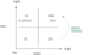
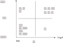

|3个维度: 比如第三个变量是净利润, 可以用圆圈面积来表示它.
|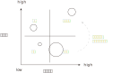

多维图谱, 有助于生成通俗易懂的分类, 和**对待每种分类的 应对战略或对策。**
|===

=== "结构化战略思维"的四个原则:

这4个原则, 它贯穿"新麦肯锡五步法"的全过程.

==== 原则1：用数字来说话 fact based

- 数字至关重要。但**数据本身并不能表达任何含义，只有数据与逻辑结合在一起时，我们才可能从中获得发现。**

- 数字常见的陷阱: +
1.没有经过验证的数字都是骗人的. +
2.*即使数字是客观的，但数字的产生、筛选和解读, 都能被人干预, 扭曲, 污染。*

- 误导手段有 :

[options="autowidth" cols="1a,1a"]
|===
|Header 1 |Header 2

|选择性提供数字，只选择对自己有利的数据点，误导人们推出与客观事实相反的结论。
|如, 在波动曲线中，如果有意只选择有利的数据点，就可以造出能符合任意"斜率"的上升趋势图. +
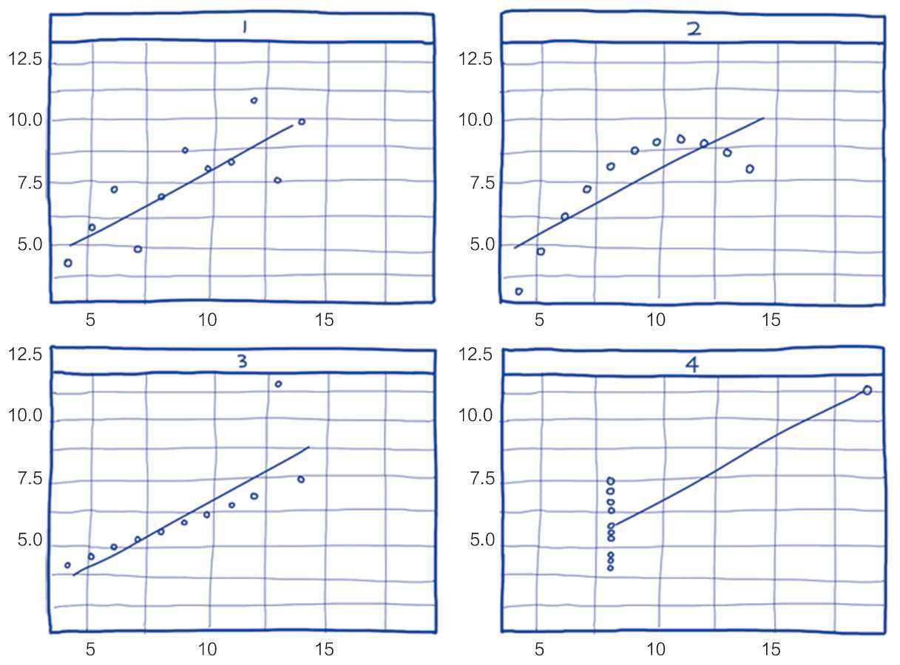

|偷换概念:
|某路演企业宣称 : “本公司营业收入连续三年增长20%以上，是健康且稳步增长的高科技企业。” +
这句话前半句是数字, 后半句是观点结论. 即使数字是真的, 但**这个数字并不一定能推导出“健康且稳步增长”的结论。因为收入只代表当前的单一一个变量, 还有其它很多关键性变量要审查. 即要全面分析该企业的基本面情况**(犹如你是医生, 对病人做全面体检)(财务上的, 竞争战略上的, 未来威胁上的. 利用 swot, 波特五力模型, 波士顿框架等等). 战术上成功, 战略上失败的例子比比皆是.
|===

==== 原则2: 洞见优于表象 insight driven

- 可以通过以下几个简单步骤, 来练习寻找洞见： +
(1) 寻找数字中的规律和趋势（Pattern） +
(2) 寻找极端的数字(极端的数据点包括: 最大值、最小值和数字0), 及其背后的涵义, 导致这些极端值的原因是什么? +
(3) 对比参照数据(同比, 环比, 与竞争对手互比), 并分析差异, 为何两者会有差异? +
(4) 寻求其他相关信息. 因为财务报表中的数据有限, 还需要其他市调, 访谈等来收集必需的数据. +
(5) 推演并提炼洞见。-> 新麦肯锡五步法, 就是在解决这个问题.

- 阐述你的观点时, 也要"洞见先行" -- 30秒电梯法则 : 先阐述自己的核心观点，也就是洞见，然后再辅以论据, 或分论点。(金字塔原理) +
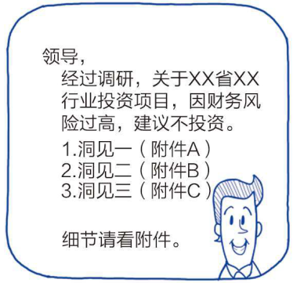

==== 原则3: MECE原则  MECE principle

- 在攻读MBA学位的时候，战略主修课教授, 会体系化地传授众多经典管理学理论。如波特五力模型等等. 但在麦肯锡从事战略咨询工作，**每个人都要根据实际情况，利用维度切分, 和MECE原则, 创造出多个用于解决实际问题的全新理论框架，并以此为整个项目的逻辑主线。**学习、创造并超越经典模型框架, 已经成了麦肯锡人的家常便饭。 +
每个经典的理论模型, 都是用来解决非常具体的商业问题的。 +
对谋事者而言，经典管理学理论, 同样遵守着维度切分和MECE原则。*掌握了结构化战略思维的基石，就可以复盘这些理论的生成过程，并创作出更符合时代要求的新框架.* “尽信书不如无书”, 对前人的成果, 我们都要持"批判性学习态度", 尊重前人, 挑战前人, 才能超越前人. (王侯将相宁有种乎? 彼可取而代之.)

==== -> 五力模型

五力模型并不完美, 用MECE原则来审视它, 会发现, 它遗漏了很多对企业同样会有影响的要素. 通过锲而不舍地“刨根问底”，你就能对波特五力模型的内容、功用, 和局限性, 都产生更深刻的认识。

==== -> SWOT模型

SWOT模型只是用了最简单的单一维度逻辑法切分。只用了一个变量: “内部vs外部”, 然后把它拉伸成带有"有利vs不利"这个价值度量.

从设计上看，**SWOT分析是粗线条地初步梳理思路的工具，而不应该成为呈现思考结果和洞见的方法。**企业管理外部和内部, 都应该有更细节、更深入的切分方法，如波特五力模型, 就在外部分析上, 比SWOT分析中的“机会”和“威胁”更有深度。

从内部分析角度看，SWOT好坏两极的逻辑也过于粗糙，跟麦肯锡7S模型, 和比较通用的企业战略画布等模型, 在细节层次上有很大差距。

==== -> 麦肯锡7S模型 <- 主要用来诠释公司各内部模块是如何相互作用的

麦肯锡7S模型, 把"共同价值观"放在所有要素的中间，凸显"价值观"是各个部分的核心黏合剂，所有要素都围绕着价值观。 +
*实操中，会把元素两两配对进行分析，把图谱转化成"比较矩阵"(即二轴模型)。*

作为训练有素的结构化思维“切”的专家，先习惯性地看一下7S模型中, 这7个要素是否符合MECE原则? 你会发现, 虽然它冠以“麦肯锡”的前缀，但这7个要素却不止一处违反了MECE原则！

**相对于麦肯锡7S模型，实操中有几个类似的模型框架更实用。**比如传统管理理论的“人、系统、流程”, 和阿里系提出新零售的“人、货、场”，都是相对符合MECE原则的对企业运营的“切”法。

==== -> BCG矩阵（即: 市场增长率 – 相对市场份额 矩阵. 是关于"企业产品战略"的评判框架. 1970年）

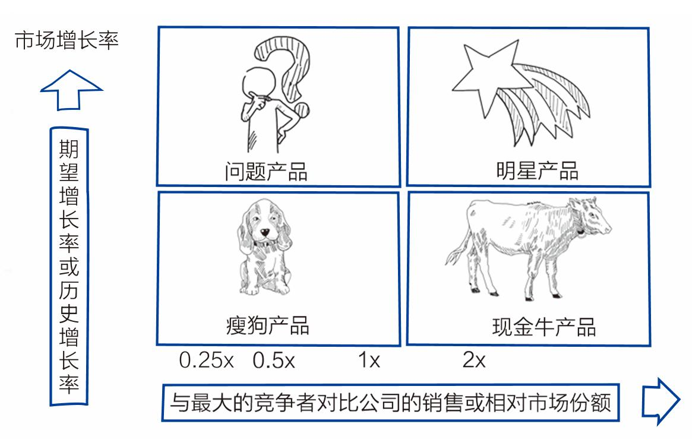 +
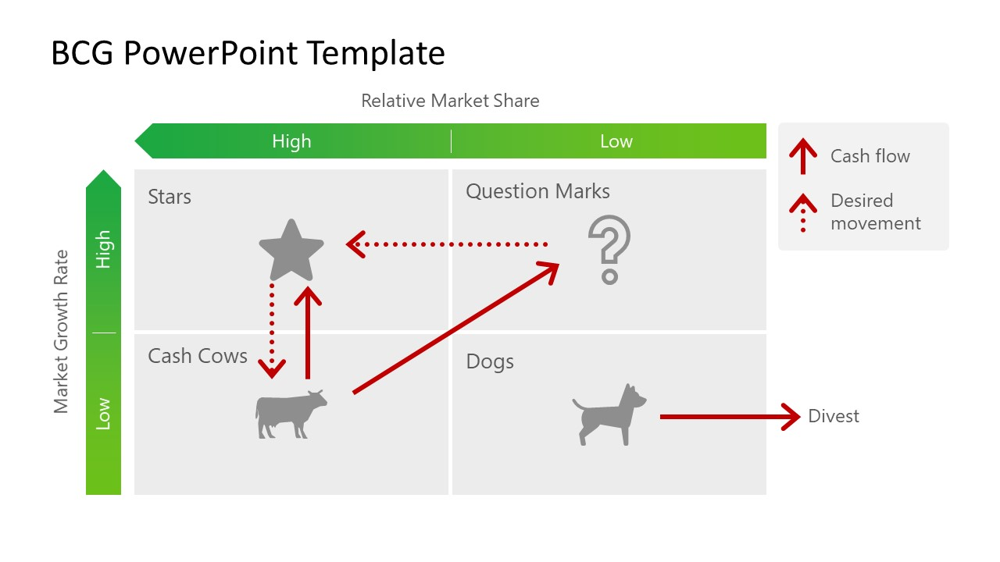

[options="autowidth"]
|===
|BCG矩阵|评判指标|简版

|Y轴 : 市场吸引力|市场"销售总额" 的增长率|细分市场"销售总额" 的增长率
|X轴 : 企业实力|"市场占有率", 技术, 设备, 资金利用能力等|单一产品"相对市场份额"
|===

公司的所有产品, 被划分到四个象限，这四个象限也可以称作“产品类型”. +
*BCG矩阵具有"多维图谱"战略指导的特性：把产品准确放在相应的象限中之后，产品的发展战略大方向, 就很自然地被确定了。*

[options="autowidth" ]
|===
||所处市场|战略方向

|现金牛产品
|处在"成熟市场"中, "产品市场占有率"高.  (如可口可乐)
|不需要太多投资了, 因为你已经是头部玩家了, 即使你投资了, 也增长不了多少市场份额了. 你现在的任务, 就是保持住这个大头市场份额, 从中赚到的钱, 用来给你公司的未来战略性产品, "明星产品", 去做它们的投资发展!

|明星产品
|处在高速发展的"增长市场"中，你产品的"市场占有率"也高. (如, 人工智能汽车领域的特斯拉)
|由于市场还在扩张增长, 所以你不能停下投资, 要用大量投资来保持住你同步增长的市场份额. 增长率别掉下来.

|问题产品
|处在在高速发展的增长市场，但你产品的当前的"市场占有率"低。
|你处在一个高增长的赛道，这就意味着资本和潜在玩家都会涌入。未来很美好, 现实很残酷. 你只有两种结果: 1.要么把你的"疑问产品"作为战略方向, 来加大投入, 转变成"明星产品". 2.要么放弃.

|瘦狗产品
|处在已经饱和, 或略萎缩的"成熟市场"中，你产品所占的"市场占有率"低。
|由于行业竞争大局已定, 头部玩家都跑出来了, 你处在长尾集团中. 行业的"生命周期"也过了增长阶段. 那么针对"瘦狗产品"，建议采用撤退战略，减少产能，逐渐撤退；对那些"销售增长率"和"市场占有率"均极低的产品，应适时淘汰。
|===

BCG矩阵诞生较早, 现在来看只是个"产品战略"讨论的起点框架。

**BCG矩阵的问题在于它存在着模糊性: 维度切分, 要求维度必须满足"具体可衡量"的客观标准。**

- 而以X轴为例，**瘦狗产品从哪一个具体数字点开始变成现金牛产品, 一直是争论的焦点。("定量"比"定性"更重要)**
- 如何确认产品在细分市场的份额, 也容易引发分歧。
- BCG矩阵近乎“一刀切”的产品战略, 非常武断 : 现实中产品战略的复杂度, 远远超越该框架的主要维度。就瘦狗产品这一品类而言，现实中大多数产品都会被划归到这个象限。然而，瘦狗产品有很多其他未被提及的维度功用，不能一概而论。比如在快消品行业里，瘦狗产品很可能是“多品牌战略”的一部分。在美国的早餐燕麦片市场， 头部企业如通用磨坊（ General Mills ） 和家乐氏（Kellogg's）, 就用大量瘦狗产品来占领货架空间，让其他中小竞争对手找不到货架而无处立身。

**对每一个理论模型框架，你要多了解对其后续的争议和发展。这和"政治学理论"是一样的，后人会不断完善前人理论的漏洞和不足, 并提出全新的更完善的理论.  同时, 实践是检验某理论是否是“真理”的唯一标准.**

==== -> 消费者感知图

"消费者感知图"的主要功能是: 细分消费者或购买者，并根据每个细分客户群体, 制定公司的产品战略。

消费者感知图也是由两个维度“切”分而成的：

[options="autowidth" cols="1a,1a"]
|===
|Header 1 |Header 2

|X轴 : 是消费者对价值的追求，也称为“价值感知”。
|"价值感知"数值越大, 意味着产品的质量、原材料、技术和包装等因素越优秀。

|Y轴 : 是消费者对品牌的追求，也称为“形象感知”。
|"形象感知"的数值越大, 表明产品品牌在消费者的思维空间中占比越大。(营销的"定位"理论中, 占据消费者心智的前三格)
|===

**这两个维度（变量，二轴）, 其实就是"表"和"里"，既要面子（品牌）, 又要里子（质量）.**

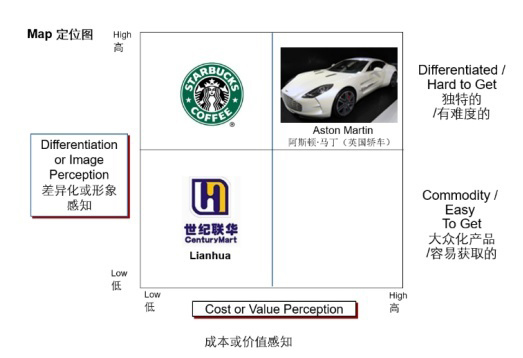

可将消费者, 划分到这四个象限中:

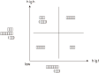

[options="autowidth"]
|===
|消费者的心理|面子 (对品牌的要求)|里子 (对性价比, 质量, 价值的要求)|消费者类型|企业的战略

|价格敏感型|要求低|要求低. |最主要的决策因素往往是"价格"|企业要降低成本, 形成价格优势
|实用型|要求低|要求高|这是一群懂行, 并追求"高性价比"的消费者。他们对于广告等营销方法相对不敏感，只看中物美价廉.
|追求极致型|要求高|要求高|如, Apple用户|广告投入和产品研发迭代, 缺一不可
|虚荣型|要求高|对产品价值要求相对不敏感|如, 星巴克用户|产品的品牌形象非常关键，厂家要重资布局市场及营销 (打造人设)。
|===

消费者感知图, 与BCG矩阵相似，都可以指导公司产品战略方向。每一个产品, 只聚焦服务一个或多个消费群体，而不是全部消费者。*把"产品"和"相对的细分市场群体"做匹配后，就可以根据每个细分客户群体不同的需求特色, 来指导产品战略。*

如果用结构化战略思维, 来审视这个模型，就会发现, "消费者感知图"的缺陷也比较明显 : 如“价格”这个维度, 没有被充分地量化体现。价格因素被包含在X轴和Y轴的因素中，如质量、原材料、技术、包装和品牌等，但比较难以量化。 +
要进一步精进这个图谱，可以将"价格因素"嵌入X轴，但会增加模型的复杂性；也可以把"价格"作为Z轴, 变成立体模型，但同样会增加展示复杂性. *你必须要在维度增多能带来好处(精确性增加), 和坏处(复杂性也同比增长)之间,做出权衡.*

==== -> 品类拓展可行性分析图谱

我们可以用两个指标(维度), 来画出这张二轴图. 选出的两个变量是: *1.新品类与你主营业务的相关性, 紧密程度如何?  2.你在新品类上, 拥有的"核心竞争优势"程度如何?*

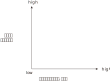

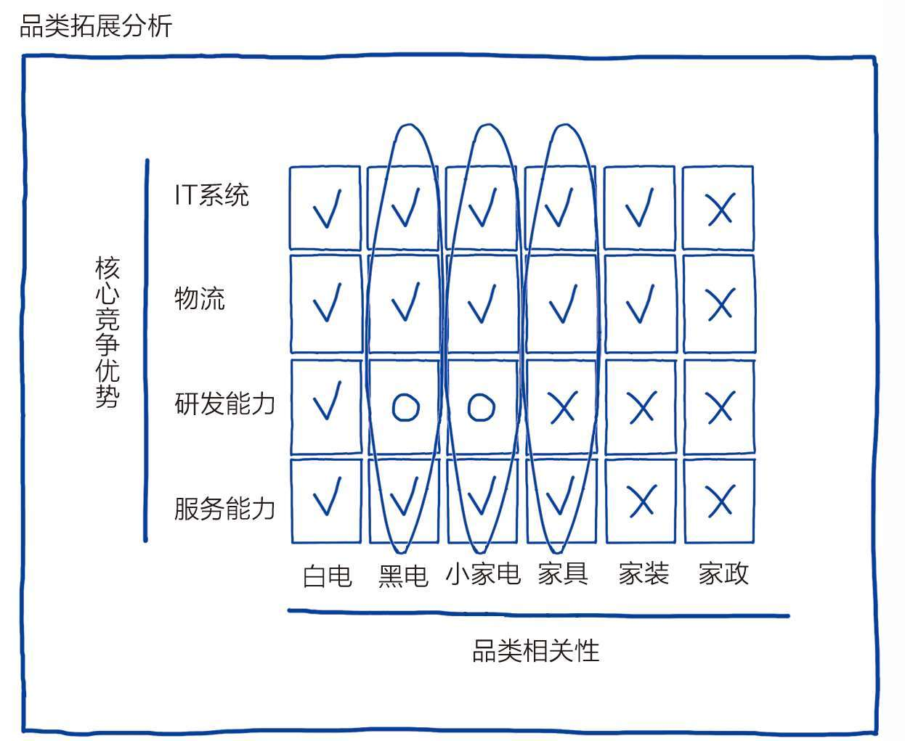

X轴品类, 要符合MECE原则, 并按照与白电核心产品的相关性大小, 做降序排列。也就是说，新品类离白电越近, 意味着与白电相关性越强，反之相关性就越弱。

这些直线彼此交汇, 就**构成了一个网状的方格矩阵。这时，每一个方格其实代表了一次判断：判断新品类与企业已有各核心竞争力, 能否匹配。**这个图谱是个不折不扣的关键图谱，*以该框架为基础, 可以引导初期的"品类拓展战略"的讨论。*

对每一个方格依次进行研讨。在图谱上用“√”, 来表示某个具体核心竞争力, 支持此新品类，而“╳”表示不支持，用“○”表示不确定。任何“√”多的品类, 都值得第一轮深入调研。你发现“黑电（电视）”“小家电”和“家具”, 与已有的核心竞争力比较匹配，值得第一轮深入调研。

下**一步就聚焦于这三个赛道市场有多大、竞争是否激烈、竞争对手是谁等问题，**看一下已有市场状况, 并关注有无需求变化。(煮酒论英雄，论天下大势，并制定出"制霸天下"战略的"隆中对"分析.) 如果决定做新品类，*要考虑公司还不具备哪些新的核心能力，需要在短时间内建立等。*

这个图谱还可以横向地进行观察，看看哪些能力, 可以作为单独的第三方服务输出。IT系统、物流和服务能力都是不错的候选项, 可深入探讨新业务拓展的可行性。

==== 原则4: 以假设为前提 hypothesis driven

*假设是有依据的猜测。*“以假设为前提”, 就是在决策过程中, *根据已有的有限数据, 先提出问题的动因, 或"解法"的假想，-> 然后以该假想为标靶, 去收集足够的数据, 来证实或证伪 (即: 大胆假设，仔细求证)；*-> 如果收集的数据, 并不能完全支持已提出的初步假想，就要及时调整假想, 或**提出新的假想，然后再次收集足够的数据进行验证，**进而形成一个从假设到验证的循环，如此反复直至假想被数据支持成为洞见。

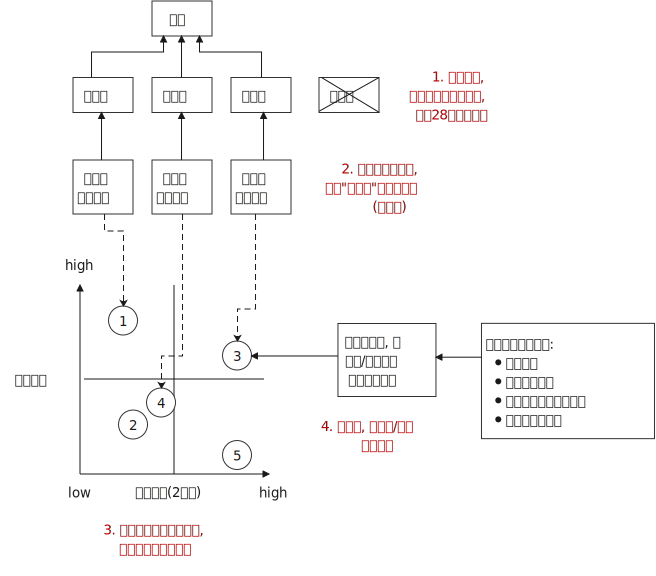

“以假设为前提”, 是结构化战略思维方法论的核心原则，*在流程上, 要形成从"提出假设"到"验证假设"的闭环.* +
事实上, 人类科学的研究和进步, 也是遵循这这个方法. 比如对量子力学的研究.

=== 新麦肯锡五步法 -> 用来解决战略问题

*常见的企业战略问题, 有: 企业发展战略、新产品战略、拓展战略, 和市场进入战略等. 每一个问题都会被麦肯锡视为一个战略项目.* 麦肯锡咨询师的主要工作, 就是解决这些战略项目问题。而这些解决战略项目问题的方法和流程, 非常值得学习和借鉴。 +
新麦肯锡五步法, 从项目管理的角度，串起**战略项目解决从开始到交付的5个关键步骤：定义问题、结构化分析、提出假设、验证假设, 和交付.**

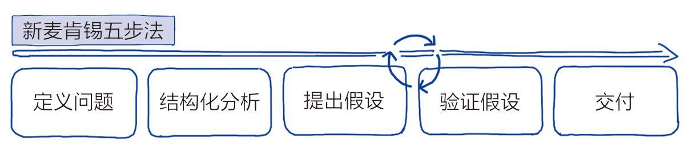

[options="autowidth" ]
|===
|新麦肯锡五步法|通常, 一个项目用时 8~10周 完成|用时

|1. 定义问题|要寻找"为什么该问题必须要解决"的本质原因. 背后的真实动因. 要一层层往前追溯. 而不要相信他人给出的表层借口.|第1周
|2. 结构化分析|<- MECE原则, 切. 一层层往下深入|第1周
|3. 提出假设|<- 以假设为前提|第2~7周 /或第9周
|4. 验证假设|<- 实地调研, 用数字说话, 洞见优于表象|第2~7周 /或第9周
|5. 交付结论|<- 谈判技巧, 30秒电梯法则, 金字塔表达原理|项目的最后一周, 即第8周或第10周
|===

==== (1).定义问题

**如何衡量是否“定义了正确的问题”？最直接的衡量标准就是，当这个正确的问题被解决后，相关的所有问题也会得到完全解决, 而没有后遗症。** 而不是“拆了东墙补西墙; 头痛医头,脚痛医脚”的暂时缓解。

问题定义工具箱: 该工具箱(相当于编程中的第三方库, 脚手架), 可以帮你在细节层面, 精准把握问题定义的框架。

最基础需要解决的问题, *定义不要太宽泛, 必须符合 smart原则* (SMART Goals): +
[options="autowidth" cols="1a,1a"]
|===
|Header 1 |Header 2

|S = Specific 具体
|Be as clear and specific as possible /with what you want to achieve. The more narrow your goal, the more you’ll understand the steps necessary to achieve it.

|M = Measurable 可衡量
|What evidence will prove you’re making progress toward your goal?

|A = Achievable 能落地
|Setting goals /you can reasonably accomplish /within a certain timeframe.

|R = Relevant 与你最终想实现的核心目的, 具有直接相关性.
|When setting goals for yourself, **consider whether or not they are relevant. Each of your goals should align with your values and larger, long-term goals.** If a goal doesn’t contribute toward your broader objectives, you might rethink it. Ask yourself why the goal is important to you, how achieving it will help you and **how it will contribute toward your long-term goals.**

|T = Time-based 有时限
|What is your goal time-frame? An end-date can help provide motivation and help you prioritize.
|===

在定义问题时: +
[options="autowidth" cols="1a,1a"]
|===
|Header 1 |Header 2

|1.要摸清问题的大背景，从全局角度看待这个具体问题。
|比如，这个问题出现时, 市场需求的变化、竞品的模式和成绩、有无创新性的科技潮流, 或替代品等。这些都有利于将问题复位到大的商业背景中，而不是孤立地看待问题(变成头痛医头, 脚痛医脚)。

|2.要定义"成功解决问题"的最终验证标准。
|验证的标准, 可以是财务上的指标，比如三年内收入增长100%；也可以是非财务的，比如品牌市场影响力一年内达到品类前三。

|3.明确问题的边界。
|因为在解决问题的过程中, 稍不留意，问题的范围就会悄然变化，也就是“范围蔓延”（Scope Creep）。*问题或项目范围的经常变化, 会导致团队缺乏聚焦，也会造成解决问题的周期超长，资源管理失控。*

|4.弄清楚解决问题时的限制条件。
|现实中并不是所有方案假设都能被接受.

|5.要明确问题解决的相关人员和责任人。
|可以借鉴项目管理的经典“责任矩阵RACI”（Responsibility Matrix）。责任矩阵将相关人员分为四类：R责任人、A负责人、C被咨询人, 和I被通知人。责权就相对清晰，容易追踪问题解决的进展.

-> 谁执行（R = Responsible），负责"执行任务"的角色，具体负责操控项目、解决问题。即干活的人，搬砖的, 乙方. +
-> 谁负责（A = Accountable），对任务"负全责"的角色，只有经其同意或签署之后，项目才能得以进行。即负责拍板的人，或者出钱的人, 甲方. +
-> 咨询谁（C = Consulted），在任务实施前、中, "提供指定性意见"的人员。 +
-> 告知谁（I = Informed），"及时被通知结果"的人员，对I, 我们不必向其咨询、不必征求他们的意见. 他们只需知道过程就行了, 没有发言权。 即被告知的人，邮件中的抄送者. +
-> 有时又成为RASCI矩阵，即多了一个S：S(Support)支持者：有钱出钱，有力出力.

|6.明确能调配的资源。
|资源分为内部资源和外部资源。外部资源包括专家、信息来源（例如专业数据库等）、专业服务商等。
|===

==== (2).结构化分析

即"切".

要注意几个陷阱:

[options="autowidth" cols="1a,1a"]
|===
|Header 1 |Header 2

|相关关系 ≠ 因果关系
|相关关系: 是指一个变量(var 1)变化的同时，另一个变量(var 2)也会随之发生变化，但不能确定var 1 变化是不是 var 2 变化的原因。 +
统计学教科书里教的第一件事就是: "相关关系"不是"因果关系"!

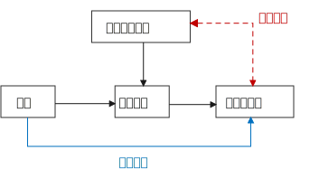

进来, "相关关系"成为大数据计算的核心算法之一，在市场营销等商业实践中备受追捧。因为"大数据分析"可以在完全不考虑"因果关系"的情况下，通过数据点的"相关性"和其他规律，精准地给出对下一个购买行为的预测分析。**商家不必纠结“因果”，仅用"相关关系", 就可预测大部分市场营销的需求。** (就好像你不需要知道量子物理学的具体原理，只需要知道它是有效的, 就能直接使用它.)

.标题
====
- 美国零售大户Target, 曾经利用消费者购买数据, 判断女性消费者的怀孕状态，并通过推送婴儿用品广告等方式, 进行精准市场营销。-- 如果发现女性消费者突然改变自己的消费习惯, 并开始新的消费行为，如购买无香的身体乳液，购买一系列如钙、镁和碘等维生素，购买育儿图书或杂志，或者注册了孩子的礼物名单等，商家内部客户管理系统（CRM）就会提升所谓“怀孕预测指数”。一旦指数达到设定标准，公司就会为此类消费者打上标签，并向这类消费者按不同孕期阶段, 进行促销，一次推送多达20多种孕期产品的介绍或样品。

- 美国零售门店经理们, 只需要知道每逢超级碗（Super Bowl）橄榄球决赛的时候，啤酒和尿不湿, 会同时卖得好，到那时, 把这两种货品并列摆放在门口, 就能卖得更多.
====

**虽然"相关关系"的确给我们提供了很多增加收益、降低成本的方法。但成也萧何败萧何 : "相关关系"是相对不稳定, 且易变的.**

|循环论证（Petitio Principii 或Begging the Question）
|**循环论证, 就是用问题的假设前提, 来回答问题本身，而没有深入探究真正的原因。**

如 : 为什么超人能飞起来？因为他是超人啊！为什么他是超人呢？因为他能飞啊. <- **论据只不过是在重复之前所做的假设，而完全没有提供支持的论点。**
|===

==== (3). 提出假设

==== (4). 验证假设

==== (5). 交付结论

=== ★ 用常识进行"快速推理, 计算"能力 (Back-of-the-envelop-calculation): 直译“信封背面的计算”，也就是粗略的估计。

类问题并不在于答案是什么, 而是重在训练你的推理逻辑 (自洽).

.标题
====
如, 如何推算波音737飞机里面能装多少个高尔夫球？ +
如何计算波音737飞机的重量？ +
如何测算新苹果手机本月的销量？
====

'''

== 古人云

=== 现实

[options="autowidth" cols="1a,1a"]
|===
|Header 1 |Header 2

|多情自古空余恨，好梦由来最易醒。
|

|世人都晓神仙好，只有儿孙忘不了；痴心父母古来多，孝顺儿孙谁见了。
|
|===

=== 光阴, 年龄

[options="autowidth" cols="1a,1a"]
|===
|Header 1 |Header 2

|自古美人如名将,不许人间见白头.
|
|===

