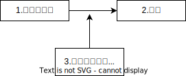

==== '如何分析问题'的方法论

比如, 问题: "最近公司业绩一直在下滑，你下一步打算怎么办？"

[options="autowidth" cols="1a,1a"]
|===
|Header 1 |Header 2

|*第1步, 先对'关键词概念', 做定义的明确化. 即量化它, 来得到"定性"认识.*
|本例中的关键词就是"业绩下滑". **只说"业绩下滑"是个很模糊的概念. 你要先对它给出具体定义: 怎么算下滑？目标业绩是多少？现在业绩是多少？下滑的比例是多少？**过去几个月具体是什么情况？ +

是原来做100万，现在变成30万？ +
还是原来做100万，现在下降到80万？ +
这两种下降幅度, 显然是不同的问题。一个是"断崖式下跌"性质，一个只是"业绩波动"性质. *问题性质不同, 解决方案当然也就截然不同。*

所以, 别急于给药方. 病重程度都没查清楚呢, 就开药. 不是所有的疼, 都是感冒, 或都是癌症.

差距 = 期望的目标值 - 现状值.

|第2步: 对"性质严重与否"的判断, 达成共识.
|相同的数字, 在每个人眼里, 性质不同. 比如, 20%的下跌，在他的眼里也许算正常波动，在你看来可能就认为比较严重。所以你们两个对同一个现象的性质判断, 没有共识.

|描述现状的时候，*应区分"事实"与"观点".*
|"今天好冷啊！" 是事实，还是观点？ -- 这句话是观点. "现在气温=0℃"，这个才是事实.

|对于目标的设立, 里遵循SMART原则:
|- S：Specific，明确的，具体的, 而非定义含混的

- M：Measurable，可衡量的. 可量化的.  +
比如, 目标是"让客户满意". 怎样才算是满意? 必须有数据维度(考核指标)来衡量, 比如总分在9.5分以上才算.

- A：Achievable，（自力）可达到的 +
你选择哪个来作为你的目标, 它一定得是你能自己控制的事物. 如果这个目标的达成, 很大程度上不受你的控制, 那就不能把它作为目标.

- R：Rewarding，完成后有满足感的 +
*太近、太容易的目标，即便完成，你也不会有愉悦感和满足感，那么这就不是一个好目标，会让你在过程中失去对它的渴求，也就没有了动力。*

- T：Time-bound，有时间限制的 +
一定得有时间限制，不然任何目标都没有意义。 +
*不同的时间限制，会导致你思考的方式、制定的计划完全不同。*

|注意区分"目标"和"手段". *我们是使用方法A,来达成目标B，而不要把A(方法)本身当成目标!*
|- 你读书的目的是什么? 不是为了读书而读书. 别忘了你是为了解决你遇到的问题的! -- 读书是手段，而不是你的目的本身。*读书不是目的, 从书中获得解决方法才是目的!*

- *你不能老是停留在"方法论"的学习上,* 要下泳池直接游泳! *要去实践它们, 检验它们的对错真理性!*

- 谈判中, 双方的"讨价还价"到何种程度只是手段, 背后的"目的"是要达到彼此更高利润(双赢)。

- 在你项目的关键节点时, 有一个重要人提出离职. 你现在要解决的真正问题, 不是如何挽留他(这只是手段), 而是如何保障住项目的进度(这才是真正目的).

*目标不对，什么都不对！ 战略的失败, 无法通过战术的成功来弥补.*

|你的计划, 实现不了你的目标, 原因可能出在解决过程的任何环节中:
| +

1.实现的方法手段, 本身有错误. +
*重复原有的方法，只能得到同样的结果. 想要有不同的结果，就需要用不同的方法。* +
2.目标期望值, 设置不当. +
3.过程中出现的各种新的变量影响 (计划不如变化快). +

|推理逻辑链
|"寻找问题"的一个基本思考框架(思考模型): 任何一个"现象"背后一定有"数据"，任何数据的变动，背后一定有"道理原因"。 +
换言之, **当你发现某个现象后，你要赶紧去找相关的数据，然后用数据来说明问题，**这可以让你对事情从"感性认知"变成"理性分析" (用数据说话, *用数据来衡量问题的严重程度, 即得到"定性".* 正如医生用化验数据来衡量你的疾病程度)。

面对一个客观问题，要避免使用“我感觉”这样的表述方式，比如：我感觉最近用户的投诉多了。这样的反馈没有任何意义，这只是你的"观点"，不是"事实". 你要用数据来说明 -- 比如： +
-> 上个月我们的销量是1000单，共接到2个投诉电话，投诉率为2‰； +
-> 这个月我们卖了3000单，却接到了20次投诉电话，投诉率为6.7‰，比上个月足足提高了3倍多，这个问题需要引起我们的重视。

这个数据够不够呢？不够，你要继续挖掘更细的数据，比如：这20个投诉电话，分别投诉了哪些内容？ +
然后你发现，其中有19个投诉了产品质量问题，有1个投诉了物流问题。 +
你还可以继续不断地追问下去(进行多次回溯, 连续追问n个为什么. 因果链回溯法)，比如具体是哪些部位的质量问题？占比各是多少？这些产品分别是什么时间生产的？等等。

总之，**把现象背后的数据分解的越细，看到的问题就会越精准。** +
有了明确的数据，我们才能寻找"导致数据变化"背后的原因道理是什么。

|===

