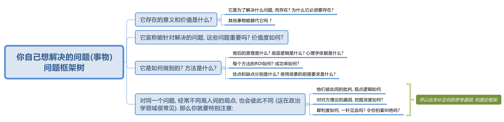

==== 对任何"事物"的判断, 都要问4个问题

1. 它存在的意义和价值是什么? 即, *它是为了解决什么问题, 而存在? 为什么它必须要存在? 其他事物能替代它吗 ?*

2. *它宣称能针对解决的问题, 这些问题重要吗? 价值度如何?*

3. *它是如何做到的? 方法是什么? 背后的原理是什么? 底层逻辑是什么? 心理学依据是什么? 每个方法的ROI如何? 成功率如何? 优点和缺点分别是什么? 使用场景的前提要求是什么?*

4. 没有一个理论是完美无缺的. 对同一个问题, 经常不同高人间的观点(所站角度), 也会彼此不同 (这在政治学领域很常见). 那么你就要特别注意**他们(即竞争性理论)彼此间的批判, 观点逻辑如何. 对对方理论的漏洞, 挖掘深度如何? **犀利度如何, 一针见血吗? 令你拍案叫绝吗? 并以此来补足你的思考漏洞, 和理论框架.

然后, 把你这4个问题类别, 建立起一个问题框架树 (清单填空题),  然后将书中的找到的答案, 一一填充进你的这个"框架树"填空题中. 这本书对"你自己的问题"的价值, 就榨干了.

