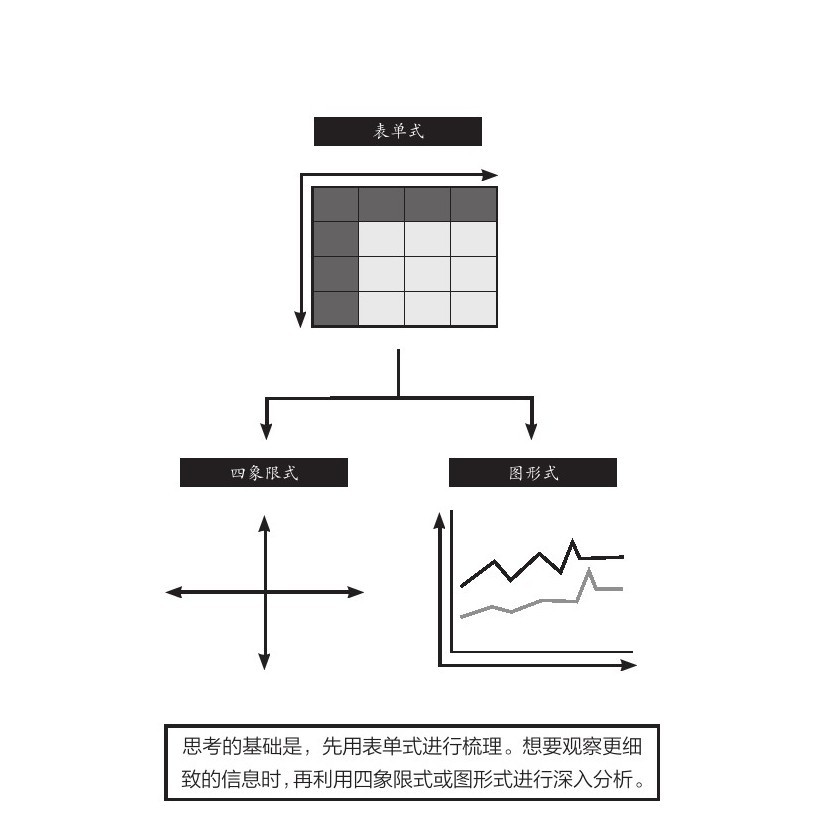
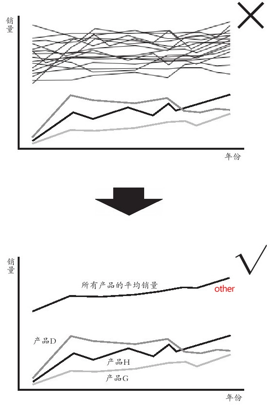
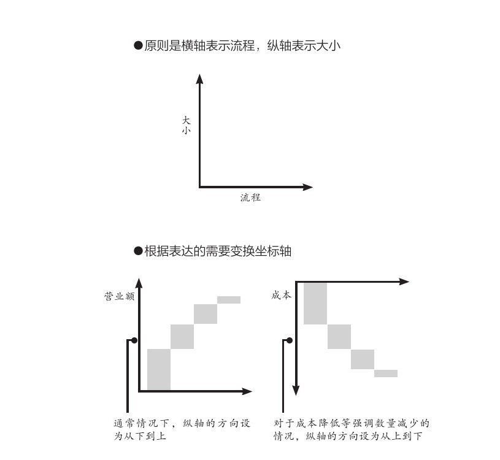
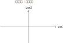
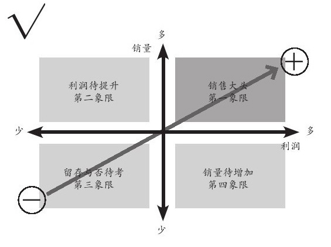

= 二轴模型思考方法
:sectnums:
:toclevels: 3
:toc: left

---

== 二轴模型

任何领域(自然科学, 社会科学, 商科)中, 人们创造出的各种"思维模型框架", 都是多变量关系建模. *从这些"多变量"中, 抽取出两个变量, 来进行不同组合, 就能得到各种"二轴模型".* 你可以自由创造任意(两个变量)的二轴模型. +
*但是要判断: 这两个变量, 之间是什么关系? 是因果关系, 相关关系, 还是完全没有关系？*

美资人士的口头禅是：“能不能用简图来表达？”

- 图中的说明性文字，只写单词，不写整句. 但凡还需要整句说明，就代表对元素的分解还不够彻底.
- 优秀的展示内容追求的, 并非是“一读(文字说明)就懂”，而是“一看(模型图)就懂”。

==== 从不同的角度去切分(选出不同的二轴变量), 去是从不同视角去分析事物

**就算是同一组数据，用不同类型的图形展示出来, 给人的感受也会完全不同。因此，实践当中, 经常会将同一组数据套入多种图形之中，分别从不同角度(维度)进行分析。** (从不同的维度对同一个事物进行观察)

对于一个事物，只有从各种不同的角度进行研究分析，才能尽可能地接近事实真相。

- 视角，是指从什么角度去看待事物；
- 视野，是指所看到事物的范围；
- 立场，则是指看待事物时的价值取向。

== 二轴模型可分为三种

==== (1).表格式 (多变量)

==== (2).笛卡尔xy坐标轴式 (可表时间动态)

原则：横轴表示时间或流程，纵轴表示数额大小

image:../img/0010.svg[,300]

流程（时间、进程）用横轴展示，最多不超过7项. 请务必将横向的要素精简至不超过7项。**需要细化的时候, 也不要增加项目，而是应该将这部分单独拿出来，做另一张图进行分解。** +
选出来的那些 obj 或 var, 要进行价值度优先排序 (权重, 28法则).

image:../img/0012.jpg[,500]

案例: 展示削减成本的效果

image:../img/0013.jpg[,300]

==== (3).四象限式(两个变量) (可表空间上的分布)

image:../img/0015.svg[,300]

image:../img/0016.jpg[,200]

案例: 对人员进行考评时, 如果只根据"总分"这个单一维度来进行排位，则每位成员的各项能力水平都被平均，无法看出其长处和短处. 所以要增加维度(如下图).

image:../img/0017.jpg[,500]

四象限式的特点:

- 能对凌乱分散的数据, 进行定位, 就能一目了然各个数据是如何分布在各象限上的.
- 纵轴和横轴的交叉点, 是在正中间，所以它的上与下、左与右所展示的含义是相反的。

image:../img/0018.jpg[,200]

按心理习惯, 右上因设为“优质元素”，左下设为“劣质元素”. 即, 位于"右上"的是最好的，位于"左下"的最差的。

切分地更细: 就是更多象限

- 在四象限的基础上, 再多画一条横线和一条竖线，就能得到九个象限。
- 象限越多, 优点是: 对数据的性质, 划分地越精细. 但缺陷是: 理解起来难度会同比增长.

image:../img/0020.jpg[,700]

==== 四象限(中心内外布局法)

就是依据坐标点到2轴的交叉点，即“到中心的距离”来划分区间。

image:../img/0021.jpg[,500]

==== 变量, 可分为"时间"的和"非时间"的. "定量"的和"定性"的

"轴"所代表的变量, 可分为两种类型:

- "静态"的变量(参数),
- "动态"的变量(时间, 流程步骤, 工序)

变量还可以分为两种属性:

- 1. "定量"的信息(数字),
- 2. "定性"的信息(非数字, 表价值观的, 好坏的)

[options="autowidth"]
|===
|Header 1 |优点|缺点

|定量信息
|数字是最客观的, 能不掺杂主观倾向
|收集不易

|定性信息
|执行上速度快
|极易代入主观倾向, 而判断不客观
|===

