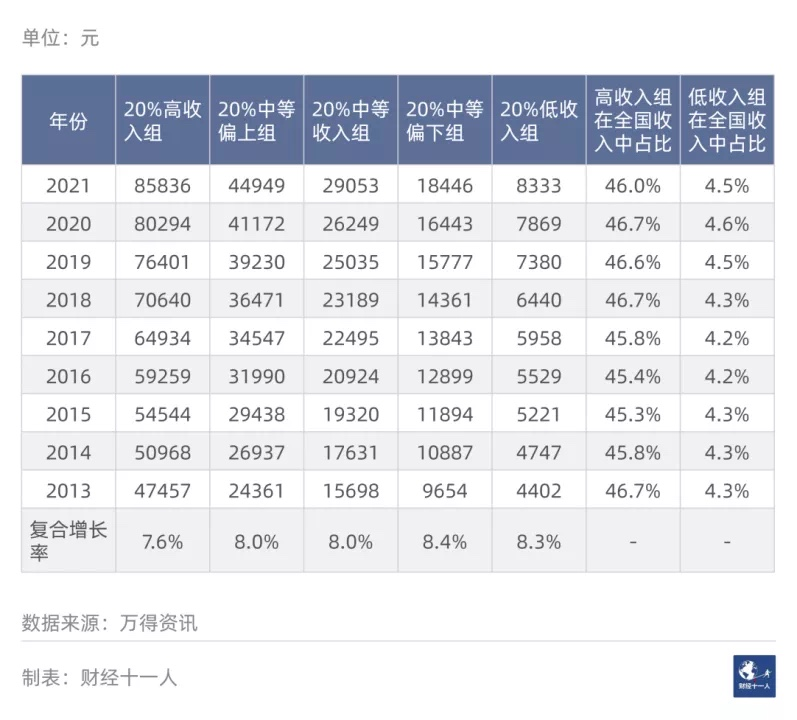
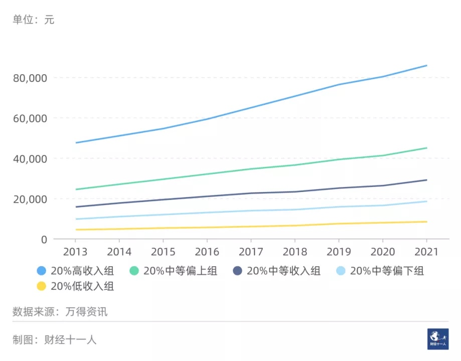
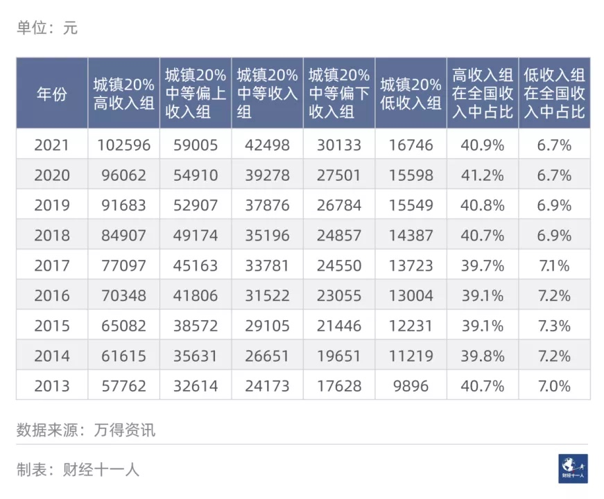

= my own
:toc: left
:toclevels: 3
:sectnums:

'''

== 看穿情绪

- 不好的感觉，过几天就好了，但既然时间能解决一切情绪，那为什么不一秒立马恢复呢？相当于你**把恢复期快速迭代到1秒完成。反正结果都是一样的，即恢复正常情绪，那你为什么还要拉长这个过程呢？** +
与其花十天时间恢复，不如就花一秒恢复。之后就再不受负面情绪影响。正如蜘蛛快速修复受损的蛛网一样。 +
所以，厚脸皮，没羞没臊，不是一个贬义词，它其实是“快速迭代到恢复“的优秀表现！

- 麦肯锡用人要求很高，你认为自己能“彼可取而代之”吗？把它看成是你早晚征服的对象（曹操看群雄，吾早晚必擒之），而非仰视的对象。把自己想象成原始人，在这个原始丛林（世界社会）中，发挥你的才智和想象力，思考力，一步步从无到有地锻炼出你的能力，建立起你的帝国.

- 你在马路上看到有相反政治理念的人，你会理睬他们吗？和他们吵架吗？那为何要在网络论坛上去与他们浪费呢自己的时间呢？而且你也不可能处理掉全天下的这类人。把时间用在真正能拯救自己的实实在在的run上，才是你唯一的每天要关注和做的事！

- 所以我这种职业习惯, 形成了思维惯性：判断一个人说话，首先从逻辑上判断对方能不能自洽，再从证据上判断是不是能够互相印证。

- 如果体力活儿是个dream job，那些写文章的人为啥还要在键盘上向你传达它的美好，他们应该奔跑在送外卖的路上啊。 +
*他们对入坑的美好极尽渲染，却对出坑的艰难闭口不谈。* +
干体力活，你不一定能减少作为劳动力的烦恼，但一定会增加对财力的烦恼。根据国家统计局编《中国统计年鉴2022》数据，按行业私营单位就业人员中，平均工资垫底的，全部是以体力活工作为主的行业。 +
无法摸鱼，手停口停。 +
除了传统认知里的天花板低，收入低，无上升通道等缺陷，体力活普遍采用的按时计酬和按件计酬方式，也代表着毫无积累意义的重复劳动。

临时性、阶段性工作已完成、合同已到期未再续聘的编外人员；

- 哈利·波特故事里的厄里斯魔镜（the Mirror of ERISED. “ERISED”其实就是英语单词“DESIRE”的镜像）。魔镜向人们“展示自己内心最深切、最强烈的渴望”。然而，“这面镜子不能教给我们知识，也不能告诉我们实情。人们在它面前虚度时日.  对于人工智能 gpt, 如果你怀有某种强烈的观点，LLM也将加深这种观点。

- 价格战有限时、限地、限量等多重限制，优惠幅度大的多是滞销车型。

- 科普的问题，就是讲浅显的东西。假如你给没见过汽车的人介绍汽车，他不需要知道汽车的扭矩是多少，也不需要知道电路的芯片类型这些细节，只要知道汽车是干什么的就可以了。 +
能做到通俗易懂当然是好事，但**很多的科学问题不是三言两语就能够解释清楚的。在大多数情况下，依靠科普构建完整的知识体系，是一个伪命题。科普只能够传递一些简单知识，想要真正做到精细化的科学训练，还需要依托于科学教育。（1000本科普书，都抵不上一本正规教材！）**

创作者仅靠写科普书, 基本上是生活不下去的。” 科普书的特点决定了它的销售总量和售价不可能很高，然而科普创作的难度却非常大，投入产出比低。

- 之所以会出现这种“35岁门槛”问题，是因为中国劳动力市场长期处于供大于求, 和人口红利较为充足状态。近些年来，虽然中国劳动力总量有所下降，但青年劳动力不仅数量庞大，而且稳中有升。根据第七次全国人口普查数据推算，中国目前16-35岁年龄段的青年劳动力有3.6亿多人，约占全部劳动年龄人口的42%，可见中国青年劳动力的总数依然众多。再加上创历史新高的上千万大学毕业生，劳动力市场处于 “供给充足”背景.

- 医生多点执业的问题: +
医生跟医院签的是劳动合同，医院对医生是要有考核的。如果多点执业，很多时间不在本医院工作，那肯定不行。 +
开诊所目前争议很大。从法律上来说确实可以，但是在外面开诊所的医生就可能把医院的资源，包括医疗资源、医疗器械，把病人分流出去，这些是很难规避的。 +

- 中国人口协会发布的《中国不孕不育现状调研报告》显示，中国育龄夫妇中，不孕不育患者超过5000万，占育龄人口的12.5%-15%。

- 字节跳动对人才筛选的方法论，通过NLP技术结构化提取信息，形成一个个标签，来完成对上百万份简历的迭代。

- 字节跳动内部，蔓延着“数据崇拜”。公司在做战略决策时，通常的做法是用算法模型测算项目的产出比，再通过数据来验证该项目是否要继续。在业务发展的巅峰期，算法部门的话语权很大，经常能决定产品的策略和功能，产品和业务部门很少介入。 +
在字节，稍微闲下来是一种危险信号，公司不可能接受只有投入，做不出成绩的项目，要么调整方向，要么换人，每天追着业务产值走才能有安全感。有的产品推出一个月后看不到太多成效，就会被踢出局。 +
随着业务条线的不断调整和变更，疯狂内卷产生的边际效益越来越低，反而身体健康屡次亮起红灯。 +
事实上，字节跳动也受到了算法(短视)的反噬，下一个爆款产品迟迟未来，而抖音成长的天花板多次被外界提及，字节跳动不得不攻入别人耕耘多年的腹地。

- 某养生茶品牌负责人雨萌见识过算法的无常和不确定性。后来，雨萌总结出了一个规律，不被抖音算法选中的产品都是无效推广，只有市面上有相似的爆款出现，才是入场的最佳时期。“有一款新茶饮在抖音上很火，我们也研发了相似品种，还是投入相同的推广费，第一周就卖了上百万。”

- GPT-4参加了多种基准考试测试，包括美国律师资格考试Uniform Bar Exam、法学院入学考试LSAT、“美国高考”SAT数学部分和证据性阅读与写作部分的考试.

- 居民可支配收入是其可以用来自由支配的全部收入，收入的来源可以是工资、经商，也可以是利息、房租、补贴或其他。收入的形式可以是货币，也可以是实物。 +
某个群体的人均收入是这个群体收入的“平均值”，而“平均值”不同于“中位数”。*“中位数”非常重要，如果你的收入超过了“中位数”，你的收入就高于一半的人。* 由于二八定律, 在一个地区，*财富必然会向少量富人集中，所以居民收入的“中位数”几乎必然小于“平均值”。*

2022年，全国居民可支配收入中位数31,370元，中位数是平均数的85.1%。其中，城镇居民可支配收入中位数45,123元，中位数是平均数的91.6%；农村居民可支配收入中位数17,734元，中位数是平均数的88.1%。

这可以利用国家统计局发布的全国居民可支配收入的五等分分组数据。每年的数据会在下一年的后半年发布。

全国居民收入五等分分组，是将所有被调查家庭按照家庭人均收入水平从高到低的顺序排列，然后平均分为五份。每组代表的人口约3亿。处于最高20%的家庭为高收入组，依此类推依次为中等偏上收入组、中等收入组、中等偏下收入组、低收入组。

万得数据库（Wind）收集了2013年以来的相关数据。表1给出了这五组人群的人均可支配收入、收入年复合增长率、高收入组和低收入组在中国居民总收入中的占比等信息。

表1：中国居民五等分分组人均年收入等数据
图片

从表1可以看到，2021年包含约3亿人的低收入家庭，人均可支配收入为8333元，折合每月694元；中等偏下收入家庭，人均可支配收入为18,446元，折合每月1537元。

占人口总数20%的高收入户，2021年人均可支配收入为85,836元，折合每月7153元。高收入组是低收入组的十倍多。

2021年，高收入组的总收入占中国收入总数的46%，而低收入户的占比为4.5%。从2013年以来，这两个占比都基本保持稳定。

如果某家庭只有一个人，他每月的可支配收入只要达到7153元，他就达到了最高20%的平均数。上文说过，在收入统计中，平均值会高于中位数。因此，他的收入也高于高收入组的中位数。因为高收入组占总人口的20%，这意味着7153元/月的收入可以排进全国前10%。

当然，当他结婚生娃，他的收入要被平均。考虑一个典型的三口之家，家里有一对工作的夫妻和一个不工作的孩子。如果要超过90%的家庭，这个家庭夫妻二人的收入之和需要超过21,459元（7153 * 3 = 21459）。

在大城市生活的读者，可能觉得这个标准非常容易达到。但这就是中国的实际情况。

2021年中国高收入组人均收入85,836元/年，而美国全体居民人均56,065美元/年。按照汇率美元：人民币为6.5：1，则美国人均为364,423元人民币。美国人均是我国最高20%组人均的4.2倍。

城镇和农村居民五等分数据

下面把全国居民数据分成城镇居民和农村居民分别来看。2021年城镇居民总数约为9亿人，农村居民总数约为5亿人。

先看城镇居民的收入情况。

表2：中国城镇居民五等分分组人均年收入等数据
图片

城镇居民高收入组的收入是低收入组的6.1倍。城镇居民低收入组人均收入16,746元/年，折合月收入不到1400元。一个三口之家，约为5000元/月

北京城市居民的收入分组数据在2018年之后不再公布。2018年全国城镇最高20%的人均收入为84,907元，北京最高20%为130,851元，北京是全国的1.54倍；2018年全国城镇最低20%为14,387元，北京为30,404元，北京是全国的2.11倍。

2015年-2018年，北京城市高收入组的人均收入一直是低收入组的四倍左右。北京的贫富差距小于全国情况。2010年-2015年，上海城市高收入组也一直是低收入组的四倍左右。（上海数据在2015年之后不再公布。）而且2010年广州农村居民数据显示，高收入组也是低收入组的四倍左右。（广州数据缺失，笔者仅找到了2010年农村数据。）

居民可支配收入五等分数据可以给我们四点启示。

第一，做大蛋糕并没有影响蛋糕的分配比例。

确切地说，做大蛋糕没有影响99%以上的人如何分配蛋糕。现代社会的进步往往来自于科技进步。这就不可避免地造就了一群人数很少但财富很多的人，比如马斯克、马云、马化腾、曾毓群等。

但很多美国的研究者都发现，美国的贫富差距拉大，不是前面10%的人收入发生飞跃，甚至不是前面那1%，而是最前面的0.1%，甚至是0.01%。

和2013年相比，中国居民收入几乎翻倍。但高收入组在总收入中的占比一直约为46%，低收入组占比一直约为4.3%，其他各组的占比也基本稳定。而且，这个结论单独放到城镇居民或农村居民身上也基本成立。

所以，对于99%以上的人来说，蛋糕的分配比例基本是稳定的。不用担心随着蛋糕做大，贫富差距会变大。

中国收入最低的40%家庭，人均收入为1100元/月。在如今的物价水平之下，他们的生活水平可想而知。

很多城市居民尤其是大城市的年轻人无法理解拼多多上9元20包的方便面，7元100片的卫生巾为何有那么多人购买。参考以上数据，这些就会变得非常容易理解。

和发达国家比，中国的收入水平很低。即便最高的20%，人均可支配收入还不到美国人均的四分之一。

尾注1: 居民可支配收入释义
可支配收入指调查户在调查期内获得的、可用于最终消费支出和储蓄的总和，即调查户可以用来自由支配的收入。可支配收入既包括现金，也包括实物收入。按照收入的来源，可支配收入包含四项，分别为工资性收入、经营净收入、财产净收入和转移净收入。
计算公式为:
可支配收入 = 工资性收入+经营净收入+财产净收入+转移净收入。
其中:
经营净收入 = 经营收入–经营费用–生产性固定资产折旧–生产税；
财产净收入 = 财产性收入–财产性支出；
转移净收入 = 转移性收入–转移性支出。

- 专本之间, 政府财政的它们的投入天差地别。公办大专的平均学费，一般比本科高校多出几千元. 如果是民办大专，平均学费甚至能高达一万多元。这说明，*专科和本科之间, 财政支持力度的差异较大。* +
据《2021年中国教育经费统计年鉴》显示，我国本科高校在2020年的财政性教育经费为6925亿元，而大专的则为1899亿元，前者是后者3.6倍之多。

行政领导等级, 也有差别。地方大专一般对应"副局级"，而大学本科高校则一般对应"正局级"甚至以上。

- 中国女性终生无孩率 ("中国国家卫健委"下属"中国人口与发展研究中心"统计数据)

[options="autowidth"]
|===
|中国女性终生无孩率 |Header 2

|2015年
|6%

|2020年
|10%
|===

[options="autowidth"]
|===
|中国育龄女性的生育意愿 |平均打算生育

|2017年
|1.76个孩子

|2019年
|1.73个

|2021年
|1.64个
|===

在一些生育率低的亚洲国家，比如新加坡、日本和韩国，虽然实际生育率与中国一样，都低于两个孩子，但在这些国家，大部分女性仍然有生育两个孩子的意愿。从这个意义上讲，中国属于异类，因为不仅"实际生育率"低，"生育意愿"也很低.

- **"磁共振成像"检查, 需要在强磁场环境下进行，这种磁场的强度, 可达地球磁场的数万倍。**在核磁仪面前，哪怕是一枚小小的曲别针都能变成子弹：在1.5特斯拉的磁场中，它可以达到大约18米/秒的飞行速度。氧气瓶、输液架、轮椅等医疗设备，都是核磁室事故中最常出现的“导弹”。*事实上，无论有没有在扫描成像，仪器强大的静磁场始终都处于开启状态。无论什么时候，将金属物品带入检查室都同样危险。*

- 研究显示，“什么都不做”本身，会让 10% 的人产生负罪感。*用忙碌回避需求的人，是一种“逃类型”的人。他们在逃避自我的真正需求 ——整天都在忙，就不用面对自己生活中的感情和需要问题了.*

如今的“竞争系统”, 本身会令大部分人处于永久焦虑状态。即使今天得了 100 分，工作评了 A+，也只能挣得暂时的喘息 ——因为人们认为"自己明天的价值, 不涉及过去的成就"。

*“只要努力，就会成功”这种逻辑背后, 隐藏着"危险并错误的因果推论"：如果失败或贫穷，就是因为你不努力、懒惰、不思进取.* ——如果地位等级是以功绩为基础的，那么逻辑推断就是，地位较高的人也必须比地位较低的人更有才能、更有价值、更努力，或者在其他方面更有功绩。 同时, 它还关乎我们对失败的态度，关乎我们如何看待那些表现不如我们的人。

Harris&Fiske（2006）的研究发现，*人们对于“最底层的人”所持的刻板印象甚至可以激活与厌恶相关的结构*（如脑岛）.

事实上, *“为自己打分”的行为, 实际上是一种非理性。因为没有客观的依据来决定一个人的价值，“准确或真实的自我打分似乎不可能实现”*（Ellis，1976）。

一项针对大学生的研究显示，自我物化会破坏女性社会能动性，阻碍人们对社会正义的追求（Calogero，2013）*。将自己视为被凝视的对象（而非主体），也会降低你在日常任务中的表现，让人不太可能尝试新事物。*

*这么做也会让人丢失幸福。因为你对自己的看法不稳定，你的自我主体叙事程度低，因而幸福感取决于“人们眼中你的形象是好是坏”。*

- 开药店的主要门槛在于法定代表人或者企业负责人，应该具备"执业药师资格"。需要办理《营业执照》, 《药品经营许可证》, 《食品经营许可证》, 《二类医疗器械经营备案凭证》等证照，一般店内配置3~5人，其中一名是执业中药师、一名是执业西药师。

如果加盟，一般120平米的药店，品牌方会要求店主配8000种药，可当中1000~2000种、甚至更多不会卖得很好，只有等着过期。品牌方追求的是品类大而全，至于经营如何，全靠店主自己。但如果是自己能主导的店，我选5000种药就够了，可以降低我的成本。

很多加盟药店挣的是返点的钱，**一年销售额需要达到品牌方相关要求才能返点。**达不到只好自己掏腰包去买，挤占现金流。

在营口一家100平米以上的店，一年销售额若以50万计，纯利率普遍只有10%左右，甚至更低，年纯利润大概在5万元左右.

在武汉，如果一家店的毛利率低于25%，大概率亏损；25%~30%之间，才有可能持平。发展在中线以下的连锁药店，一般40%都是亏钱、60%赚钱；如果是中线的连锁药店，一般赚钱与亏钱的店铺比在5:5。

国大药房的毛利率约为25%，而净利润率仅约为1%。

开药店**也不能单看利润率，还要看营业额。即便做到100%利润，但营业额每天只能做到1000元，房租每月却在2万以上，仍然挣不到钱。**如果要去人流量大的地方，比如医院旁边，营业额就算能上去，但势必成本也会大涨。*所以现在有一种说法，药品零售根本不是暴利行业，而是流通行业。*

药店**药品中真正有利润空间的药，多集中在儿童用药以及一些保健药品，而一些患者体量比较大的心脑血管用药，这个领域多是医保药、同时也有国家管控，所以基本上挣不到钱。**

大型医药连锁, 不得不扩张店，因为它们走的是资本逻辑，多开一家店，就能拿到资本市场去给每家店估值，通过规模化扩张提升销售额，做高股价，套现机会特别多.

*单店运营效率的高低, 直接体现在店铺的"日均坪效"上，即每天每一平米店面积可, 以产出多少营业收入。（跟种粮食一样）*

中国老龄化加剧，这是否也为中国药店零售带来市场助推? 对此，受访业者皆表示，未必。在很多地方，有经济实力的老年人并不如想象中多。再加上如今医保改革，打到这部分人群里的医保费少了很多，这也带来了不稳定因素。

- **在医学上35岁就是高龄产妇，**仅是高龄产妇就占到韩国2022年产妇的35.7%。*过高的一孩生育年龄, 意味着大多数生育过一孩的女性, 受生理条件限制, 已经很难生到第二个。*

- 韩国经济, 大企业尤其是财团主导经济的特色, 十分鲜明。以三星为代表的前四大财团, 占到全国GDP的1/3左右。然而，财团所能提供的就业十分有限。根据韩联社提供的数据，2021年，53家上市公司员工总数为66.6254万人，不到韩国劳动力人口规模的2%。

韩国5000多万人口，有一半聚集在以首尔为中心的首都圈里。作为首都圈的中心，首尔市以0.6%的面积，聚集了1/5左右的人口，创造了20%以上的经济总量。

- 中国职工医保制度

[options="autowidth" cols="1a,1a"]
|===
|Header 1 |Header 2

|个人账户
|-> 主要用于保障"普通门诊"和"购药"费用

- 对"慢性病", 最有效的治疗方式，就是通过门诊早诊早治。为此，民众要求报销"普通门诊"费用的呼声越来越高。
- 此次医保改革核心，是将部分划入"个人账户"的资金，置换为普通门诊"统筹报销额"。

|社会统筹账户
|-> 主要用于保障"住院"费用
|===

*未来10年间，中国将迎来史上最大“退休潮”，60后（指60岁退休以后）群体正以平均每年2000万人的速度退休。*

因为在1962至1971年，中国每年出生人口均高于2400万人。到了2022年，他们的年龄为52至60岁，正好切换到"退休"上。

在2021年，我国新出生人口只有1062万，但是我国从明年起，每年至少有2000万人要退休。出生人口和退休人员比例的极度失衡，养老压力显而易见。

国际上标准是，替代率在70%-85%，就是说到手的退休金，是退休前工资的70%以上，而且这个工资水平也要达到当前收入支出的中位数，生活水平才不会有明显的下降。

