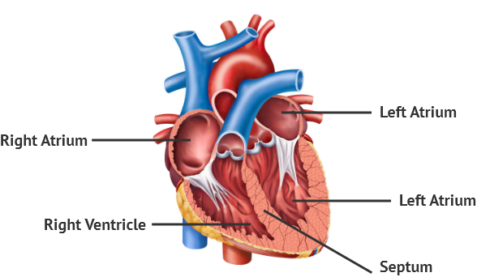

= A-fib 心房颤动
:toc: left
:toclevels: 3
:sectnums:
:stylesheet: ../myAdocCss.css

'''

==  A-fib —a Rapid, Irregular Heartbeat—Can Kill You, but New Tech Can Spot It 心房颤动——一种快速、不规则的心跳——可以杀死你，但新技术可以发现它

It was _atrial 心房的 fibrillation_ (纤维性颤动) 心房颤动, or A-fib 心房颤动, which *turns* a normal, regular heartbeat *into* a rapid, irregular 不规则的；无规律的；紊乱的 and dangerous stutter 口吃；结巴. A-fib occurs (v.) when electrical signals in the upper chambers of the heart —the atria 心房 —misfire 不起动；打不着火;不奏效；不起作用. The resulting _irregular heartbeat_ causes (v.) blood to pool (v.)积水成洼；（血液）在静脉中淤积;集中资源（或材料等） instead of being pumped out to the lower chambers.
 In addition to strokes, A-fib can bring on 引发，导致 heart attacks, cardiac 心脏的 failure 心力衰竭, blood clots and even dementia 痴呆；精神错乱.

[.my2]
心房颤动（A-fib），它会将正常、规律的心跳变成快速、不规则且危险的口吃。当心脏上腔室（心房）的电信号失灵时，就会发生房颤。由此产生的不规则心跳导致血液聚集，而不是被泵送到下室。除了中风之外，房颤还会导致心脏病、心力衰竭、血栓甚至痴呆。

[.my1]
.案例
====
.atrium

.misfire
====

'''

== A-fib—a Rapid, Irregular Heartbeat—Can Kill You, but New Tech Can Spot It

It was atrial fibrillation, or A-fib, which turns a normal, regular heartbeat into a rapid, irregular and dangerous stutter. A-fib occurs when electrical signals in the upper chambers of the heart—the atria—misfire. The resulting irregular heartbeat causes blood to pool instead of being pumped out to the lower chambers.
 In addition to strokes, A-fib can bring on heart attacks, cardiac failure, blood clots and even dementia.

'''
