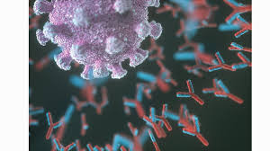
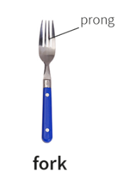
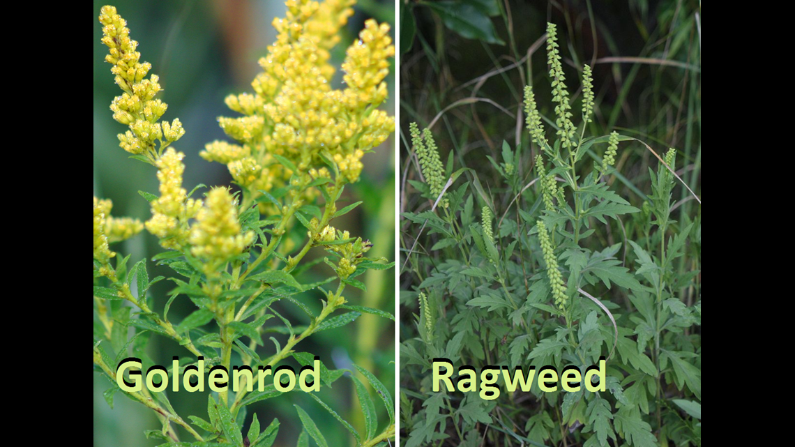
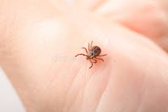

= Seasonal Allergies 季节性过敏
:toc: left
:toclevels: 3
:sectnums:
:stylesheet: ../myAdocCss.css

'''

== Why Seasonal Allergies 过敏；敏感 Are So Miserable 使难受的；使不舒服的；令人不快的.    为什么季节性过敏如此痛苦

[.my1]
.案例
====
.allergy
-> 词根alle, 相异，不同(电影异形 alien)。词根erg, 驱动，同urge, work.
====

Flowers and trees are in bloom —and so are _pollen 花粉 allergies_ 过敏；敏感.
The sneezes, _runny 流鼻涕的；流眼泪的;太稀的；水分过多的 noses_ and _itchy 发痒的 eyes_ that typically come with seasonal allergies /are both miserable and extremely common.  About _one in four_ U.S. adults /`谓` reported having _seasonal allergies_ in 2021, according to the U.S. Centers for Disease Control and Prevention. And symptoms are getting worse and lasting (v.) longer: climate change is lengthening (v.)（使）延长 the growing season （植物的）生长季节 /and *exposing* (v.) plants *to* higher _carbon dioxide_ levels, causing them to produce more pollen.

[.my2]
花草树木盛开，花粉过敏也是如此。季节性过敏通常会导致打喷嚏、流鼻涕, 和眼睛发痒. 根据美国疾病控制与预防中心的数据，2021 年约有四分之一的美国成年人报告患有季节性过敏。而且症状变得越来越严重，持续时间也越来越长：气候变化正在延长生长季节，使植物暴露在更高的二氧化碳水平下，导致它们产生更多的花粉。

A human immune system has two parts: One mounts (v.)准备；安排；组织开展 a general reaction 全身反应 to any foreign substance. Meanwhile the other *responds to* specific substances /that the body has encountered before. The immune system will remember and develop (v.) dedicated resources 专用资源 to fight off 击退 those previous threats /if the body *runs into* 遭遇，撞上，碰上 them again /in the future. Allergies are such a target-specific 目标明确的 immune response, and any substance that causes this kind of reaction /is dubbed (v.)把…戏称为；给…起绰号 an allergen 过敏原，变应原（能引起变态反应或过敏的物质）. “We can become allergic (a.)（对…）变态反应的，变应的，过敏的 to any protein, really,”

[.my2]
人体免疫系统由两部分组成：第一部分, 对"任何异物"产生一般反应。与此同时，另一种, 对"身体以前遇到过的特定物质"做出反应。如果身体将来再次遇到这些威胁，免疫系统将记住, 并开发专用资源来抵御以前的威胁。*过敏是一种针对特定目标的免疫反应，任何引起这种反应的物质都被称为"过敏原"。 “实际上，我们可能对任何蛋白质过敏."*

[.my1]
.案例
====
.mount
[ VN] to organize and begin sth准备；安排；组织开展  /登上；爬上；攀登 +
SYN arrange +
- to mount a protest/campaign/an exhibition 发起抗议╱运动；举办展览
====

How an allergy develops (v.) in the first place /is still a bit of a mystery 神秘的事物,谜 —but researchers have some solid 可靠的；可信赖的；坚实的 theories. Scientists know (v.)  babies aren’t born with specific allergies 敏感症,  and they can come and go 来来去去 throughout 自始至终；贯穿整个时期 someone’s life. Evidence also suggests /genetics plays a role: children of parents with allergies /are more likely to have them, too.

[.my2]
过敏最初是如何形成的, 仍然是一个谜，但研究人员有一些可靠的理论。科学家们知道, 婴儿并不是天生就有特定的过敏症，而且这些过敏症可能会在人的一生中出现或消失。有证据还表明，遗传因素也发挥了一定作用：父母患有过敏症的孩子, 也更有可能患有过敏症。

Allergy formation 组成；形成 is also determined (v.)决定；形成；支配；影响 by how reactive the immune system happens to be /during the first exposure to a substance. If the system is particularly reactive, it’s likely to deem (v.)认为；视为；相信 the substance a threat /*to watch out for* 戒备；小心提防 in the future. Different exposure routes 暴露途径 can also affect (v.) the likelihood of developing allergies. For example, a person’s immune system is more accustomed to seeing new substances *pass (v.) through* the gut, so it is less likely *to respond to* such substances #than# it might be to compounds (n.)混合物，化合物 后定 first encountered (v.) through the skin —which rarely *lets (v.) in* _outside material_.

[.my2]
**过敏的形成, 还取决于免疫系统在第一次接触某种物质时的反应程度。如果系统特别反应，它可能会认为该物质是未来需要警惕的威胁。** +
*不同的接触途径, 也会影响发生过敏的可能性。例如，一个人的免疫系统更习惯于看到新物质通过肠道，因此它对这些物质的反应可能性, 低于对首先通过皮肤遇到的化合物的反应——皮肤很少让外界物质进入。*

But why is the immune system so markedly 显著地，明显地 sensitive to pollen?
Pollen is difficult *to acclimate (v.)（使）习惯（新地方、新情况、新气候）；（使）服水土 to* /because it’s seasonal (a.)季节性的；随季节变化的 *rather than* consistently present (v.) in the environment. In addition 此外，另外, _the tiny 极小的；微小的；微量的, airborne 空气传播的 pollen grains_ 颗粒；细粒 that cause (v.) allergies /can easily make their way past the nose /and deeper into _the respiratory tract_ 呼吸道. In general, however, allergies develop (v.) /because the immune system is reactive when it first meets (v.) an allergen; the conditions don’t arise (v.)发生；产生；出现 from any specific characteristic 特性 of the pollen itself.

[.my2]
但为什么免疫系统对花粉如此明显敏感呢？花粉很难适应，因为它是季节性的，而不是持续存在于环境中。此外，引起过敏的空气传播的微小花粉粒很容易穿过鼻子，深入呼吸道。然而，一般来说，过敏的发生是因为免疫系统在第一次遇到过敏原时会做出反应。这些情况并不是由花粉本身的任何特定特征引起的。

[.my1]
.案例
====
.acclimatize
(v.)( NAmE alsoac·cli·mate ) *~ (yourself) (to sth)* : to get used to a new place, situation or climate（使）习惯（新地方、新情况、新气候）；（使）服水土
- Arrive two days early in order to acclimatize (v.). 提前两天到达以便适应新环境。

.respiratory
(a.) connected with breathing 呼吸的
- the respiratory system 呼吸系统 +
-> respire +‎ -atory
====

Environmental allergies are mediated (v.)影响…的发生；使…可能发生 by a protein called immunoglobulin 免疫球蛋白,抗体 E, or IgE. Such an allergy’s 过敏反应 initial development /`谓` triggers (v.) the production of _IgE molecules_ that are able to bind (v.) to the specific allergen.

When the immune system detects (v.) the allergen again, it *churns (v.) out* （粗制滥造地）大量生产，大量炮制 IgE proteins, which *bind to* the surface of the body’s protective _mast cells_ 肥大细胞 as scouts 侦察兵. When a scout IgE *binds to* the allergen, the _mast cell_ releases a cocktail （常指掺合不太相容的）混合物;鸡尾酒 of chemicals —including histamines 组（织）胺（遇组织受伤或过敏时释放） and other _inflammatory 炎症性的 substances_ that trigger (v.) the congestion 充血；淤血;（交通）拥塞；塞车, _watery (a.)含水的；水分很多的 eyes_ and sneezing 打喷嚏 that we *associate (v.)联想；联系 with* allergies.

An allergic response (n.) *tends (v.) to remain strongest* in the body part /where the allergen was mainly encountered (v.) —so _inhaling (v.) pollen_ 吸入花粉 might make your nose run (v.)流淌；流动, whereas （用以比较或对比两个事实）然而，但是，尽管 _getting it in your eyes_ might make them water.

[.my2]
环境过敏, 是由一种称为"免疫球蛋白" E（IgE）的蛋白质介导的。这种过敏的最初发展, 会触发能够与特定"过敏原"结合的 IgE 分子的产生。**当免疫系统再次检测到过敏原时，它会产生 IgE 蛋白，这些蛋白作为侦察兵, **与人体保护性"肥大细胞"表面结合。*当侦察 IgE 与"过敏原"结合时，"肥大细胞"会释放出多种化学物质，包括组胺和其他炎症物质，这些物质会引发充血、流泪和打喷嚏，这些都是我们与过敏相关的症状。过敏反应往往在主要遇到"过敏原"的身体部位保持最强，因此吸入花粉可能会流鼻涕，而进入眼睛可能会流泪。*

[.my1]
.案例
====
.mediate
[ VN] [ usually passive]( technical 术语) ( formal ) to influence sth and/or make it possible for it to happen影响…的发生；使…可能发生
- Educational success is mediated by economic factors.经济因素影响着教育的成功。

.immunoglobulin
n.免疫球蛋白；免疫血球素 +
*抗体（Antibody，Ab）又称免疫球蛋白（Immunoglobulin，Ig）.* 是一种主要由浆细胞分泌，**被免疫系统用来鉴别与中和外来物质如细菌、病毒等病原体的大型Y形蛋白质，**仅被发现存在于脊椎动物的血浆等细胞外液中，及其B细胞的细胞膜表面。抗体能通过其可变区唯一识别特定外来物的一个独特特征，该**外来目标, 被称为"抗原"。** +
image:../../img/immunoglobulin.jpg[,10%]

.churn
(v.) *~ (sth) (up)* : if water, mud, etc. churns (v.) , or if sth churns (v.) it (up) , it moves or is moved around violently剧烈搅动；（使）猛烈翻腾 +
- The water churned (v.) beneath the huge ship. 水在巨轮下面剧烈翻滚。

.mast
(n.)桅杆；船桅; 旗杆

.mast cell
肥大细胞；柱状细胞
*肥大细胞激活后，可以释放"炎症因子", 并募集"免疫细胞"。* 研究发现，**在肿瘤发生时期，"肥大细胞"是最先被募集到"肿瘤"附近的免疫细胞之一，**在肿瘤的不同时期"肥大细胞"富集程度具有明显的变化。肥大细胞受到刺激时, 能够释放多种活性分子、趋化因子, 和细胞因子。

.histamine
( medical 医) a chemical substance that is given out in the body /in response to an injury or an allergy 组（织）胺（遇组织受伤或过敏时释放） +
-> hist-,竖直，组织，amine,胺。用于化学名称组胺。

====

While it might be tempting (a.)吸引人的；诱人的；有吸引力的 to hate (v.) on IgE and _mast cells_, this branch of the immune system has a long history of protecting people from parasitic 寄生的 infections. Modern humans don’t encounter (v.)遭遇，遇到（尤指令人不快或困难的事） these threats as often, so it’s easy to paint (v.)把…描绘成 allergies as an overreaction 过度反应,反应过激.

[.my2]
虽然人们可能会讨厌 IgE 和肥大细胞，但免疫系统的这一分支, 在保护人们免受"寄生虫感染"方面有着悠久的历史。现代人类不会经常遇到这些威胁，因此很容易将过敏视为过度反应。

Allergies are your body’s immune system thinking that /it’s doing the right thing. The immune system is always trying to differentiate (v.)区分；区别；辨别 between self and not self. That’s what has kept us alive.

[.my2]
过敏是你身体的免疫系统认为自己正在做正确的事情。 免疫系统总是试图区分自我和非自我。这就是我们赖以生存的原因。

She, Weis and Jerath offer (v.) a three-pronged 有…齿的；分…方面的;（进攻、论点等的）方面 approach to living with allergies.

[.my2]
(过敏症专家)她、韦斯和杰拉斯, 提出了一种三管齐下的方法, 来应对过敏症。

[.my1]
.案例
====
.prong
(n.) each of the two or more long pointed parts of a fork 叉子齿 +

image:../../img/prong 2.png[,30%]

====

First, reduce (v.) exposure to known (a.) allergens /when possible. This can include monitoring (v.) local pollen levels /to determine (v.) when to spend (v.) time outside /and leaving your windows closed /to keep your house pollen-free. When you do have symptoms, antihistamines 抗组胺 and other over-the-counter 无需处方可买到的；非处方的 medicines can help manage itching 发痒, sneezing and watery eyes 流泪的眼睛.

[.my2]
首先，尽可能减少接触"已知过敏原"。这可以包括监测当地的花粉水平，以确定何时外出，并关闭窗户以保持房屋无花粉。当您确实出现症状时，"抗组胺药"和其他非处方药, 可以帮助控制瘙痒、打喷嚏和流泪。

If these approaches aren’t sufficient, consider (v.) talking to an allergist 过敏症专科医师 about immunotherapy 免疫疗法, which most commonly means _allergy shots_ 过敏疫苗注射. These shots contain a personalized 为某人特制的;使个性化 mixture of your allergens 过敏原 at low doses /and act (v.) to desensitize (v.)使不敏感；使麻木不仁 your immune system, teaching it to tolerate (v.) these materials *rather than* unleash (v.)发泄；突然释放；使爆发 _mast cells_ in their presence 存在；出现. In the U.S., immunotherapy is also available [in tablet 药片；片剂 form] for grass and ragweed 豚草 pollens, as well as dust mites 螨虫.

[.my2]
如果这些方法还不够，请考虑与过敏症专家讨论"免疫疗法"，这通常意味着"过敏注射"。**这些注射剂, 含有低剂量的个性化过敏原混合物，可以使您的免疫系统脱敏，教会它耐受这些物质，而不是在它们存在时释放肥大细胞。**在美国，针对草和豚草花粉以及尘螨的免疫疗法, 也有片剂形式。

[.my1]
.案例
====
.ragweed
[ U] a N American plant with small green flowers that contain a lot of pollen , which causes hay fever in some people豚草（北美植物，绿色小花含大量花粉，可引起枯草热） +
-> 来自 ragged,破布般的，粗糙的，weed,草，杂草。比喻用法。 +

.mite
1.a very small creature like a spider that lives on plants, animals, carpets, etc. 螨（状似蜘蛛的微小动物，在动植物、地毯等上生活） +

2.a small child or animal, especially one that you feel sorry for （可怜的）小孩子，小动物 +
- Poor little mite! 可怜的小家伙！

3.( old-fashioned) a small amount of sth 少量 +
- The place looked a mite (= a little) expensive. 这地方看上去稍微有点儿贵。
====

It does take time to see results: treatment with _allergy shots_ 过敏疫苗注射 can take about six months to improve symptoms /and five years to complete, Jerath says. Still, she says, this approach is an impressive way to actually diminish (v.)减少；（使）减弱，缩减；降低 allergies *instead of* just treating (v.) their symptoms. “It’s a little bit mind-blowing (a.)非常令人兴奋的；给人印象极深的；非常令人吃惊的,” she adds, “to think about the fact /that you can actually retrain (v.)（接受）重新培养，再教育，再培训 the immune system.”

[.my2]
杰拉斯说，确实需要时间才能看到结果：过敏注射治疗, 可能需要大约六个月的时间才能改善症状，五年才能完成。尽管如此，她说，这种方法是一种令人印象深刻的方法，可以真正减少过敏，而不仅仅是治疗症状。 “想到你实际上可以重新训练免疫系统，这有点令人兴奋，”她补充道。

'''

== (pure) Why Seasonal Allergies Are So Miserable

Flowers and trees are in bloom—and so are pollen allergies.
The sneezes, runny noses and itchy eyes that typically come with seasonal allergies are both miserable and extremely common.  About one in four U.S. adults reported having seasonal allergies in 2021, according to the U.S. Centers for Disease Control and Prevention. And symptoms are getting worse and lasting longer: climate change is lengthening the growing season and exposing plants to higher carbon dioxide levels, causing them to produce more pollen.

A human immune system has two parts: One mounts a general reaction to any foreign substance. Meanwhile the other responds to specific substances that the body has encountered before. The immune system will remember and develop dedicated resources to fight off those previous threats if the body runs into them again in the future. Allergies are such a target-specific immune response, and any substance that causes this kind of reaction is dubbed an allergen. “We can become allergic to any protein, really,”

How an allergy develops in the first place is still a bit of a mystery—but researchers have some solid theories. Scientists know babies aren’t born with specific allergies, and they can come and go throughout someone’s life. Evidence also suggests genetics plays a role: children of parents with allergies are more likely to have them, too.

Allergy formation is also determined by how reactive the immune system happens to be during the first exposure to a substance. If the system is particularly reactive, it’s likely to deem the substance a threat to watch out for in the future. Different exposure routes can also affect the likelihood of developing allergies. For example, a person’s immune system is more accustomed to seeing new substances pass through the gut, so it is less likely to respond to such substances than it might be to compounds first encountered through the skin—which rarely lets in outside material.

But why is the immune system so markedly sensitive to pollen?
Pollen is difficult to acclimate to because it’s seasonal rather than consistently present in the environment. In addition, the tiny, airborne pollen grains that cause allergies can easily make their way past the nose and deeper into the respiratory tract. In general, however, allergies develop because the immune system is reactive when it first meets an allergen; the conditions don’t arise from any specific characteristic of the pollen itself.

Environmental allergies are mediated by a protein called immunoglobulin E, or IgE. Such an allergy’s initial development triggers the production of IgE molecules that are able to bind to the specific allergen. When the immune system detects the allergen again, it churns out IgE proteins, which bind to the surface of the body’s protective mast cells as scouts. When a scout IgE binds to the allergen, the mast cell releases a cocktail of chemicals—including histamines and other inflammatory substances that trigger the congestion, watery eyes and sneezing that we associate with allergies. An allergic response tends to remain strongest in the body part where the allergen was mainly encountered—so inhaling pollen might make your nose run, whereas getting it in your eyes might make them water.

While it might be tempting to hate on IgE and mast cells, this branch of the immune system has a long history of protecting people from parasitic infections. Modern humans don’t encounter these threats as often, so it’s easy to paint allergies as an overreaction.

Allergies are your body’s immune system thinking that it’s doing the right thing. The immune system is always trying to differentiate between self and not self. That’s what has kept us alive.

She, Weis and Jerath offer a three-pronged approach to living with allergies.

First, reduce exposure to known allergens when possible. This can include monitoring local pollen levels to determine when to spend time outside and leaving your windows closed to keep your house pollen-free. When you do have symptoms, antihistamines and other over-the-counter medicines can help manage itching, sneezing and watery eyes.

If these approaches aren’t sufficient, consider talking to an allergist about immunotherapy, which most commonly means allergy shots. These shots contain a personalized mixture of your allergens at low doses and act to desensitize your immune system, teaching it to tolerate these materials rather than unleash mast cells in their presence. In the U.S., immunotherapy is also available in tablet form for grass and ragweed pollens, as well as dust mites.

It does take time to see results: treatment with allergy shots can take about six months to improve symptoms and five years to complete, Jerath says. Still, she says, this approach is an impressive way to actually diminish allergies instead of just treating their symptoms. “It’s a little bit mind-blowing,” she adds, “to think about the fact that you can actually retrain the immune system.”

'''
