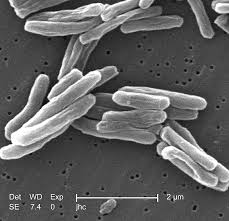

= Tuberculosis  结核病（尤指肺结核）
:toc: left
:toclevels: 3
:sectnums:
:stylesheet: ../myAdocCss.css

'''

== Tuberculosis 结核病（尤指肺结核） kills more people than any other pathogenic illness

IN 1882, WHEN Robert Koch discovered _Mycobacterium 分直杆菌属细菌 tuberculosis_ 肺结核；结核病, the microbe  微生物 that causes tuberculosis, the disease caused one in seven deaths in America and Europe.
Transmitted (v.) through droplets  小滴 from coughs 咳嗽, sneezes 打喷嚏 or just talking, `主` tuberculosis `谓` felled 击倒，打倒（某人）; 砍伐（树木） rich and poor alike.

[.my2]
1882 年，当罗伯特·科赫 (Robert Koch) 发现**"结核分枝杆菌"**（Mycobacterium tuberculosis）时，这**种微生物会导致"结核病"，**这种疾病导致美国和欧洲七分之一的死亡。**肺结核通过咳嗽、打喷嚏或只是说话时产生的飞沫传播，**无论贫富，都会受到肺结核的影响。

In the century that followed, `主` TB (as the illness is called for short 简略的；缩写的) `谓` beat (v.) a retreat （仓促）逃走；（慌忙）撤退 /thanks to antibiotics and a vaccine that protected infants 婴儿；幼儿.
By the 1990s `主` wiping 擦,拭,抹去（旧事） it out completely `谓` seemed tantalisingly 挑逗性地,撩人地 within reach. +
Since then, however, progress has been glacial (a.)冰河时代的,冰川的. New cases are falling by just 1-2% a year.
Today, M. tuberculosis kills more people than any other single pathogen 病原体 (see chart).

[.my2]
在接下来的一个世纪里，由于抗生素和保护婴儿的疫苗，结核病（这种疾病的简称）战胜了疾病。到 1990 年代，彻底消灭它似乎触手可及。
然而，从那以后，进展一直很缓慢。新病例每年仅下降 1-2%。
今天，*"结核分枝杆菌"杀死的人数, 超过任何其他单一病原体*（见图表）。

[.my1]
.标题
====
.mycobacterium
/ˌmaɪ-kəʊ-bæk-ˈtɪə-rɪəm/ (myco-bac-te-rium)⇒ myco- + bacterium
分枝杆菌 (myco-bac-te-rium) ⇒ 分枝杆菌 + 细菌 +
→ microbe ⇒ -micro-微,小 + -o- + be(-bi-)生命,生物

.tuberculosis
/tuːˌbɜːr-kjə-ˈloʊ-sɪs/

.Mycobacterium tuberculosis
结核杆菌

.tantalising
/ˈtæntəˌlaɪzɪŋ/ adj.诱人的（等于 tantalizing）；挑逗的

-> tantalize 一词也源出古希腊神话。Tantalus 被罚永世站在清澈的河中，河水恰恰深及下巴，每当他口渴难忍，俯身欲饮，河水立即消退；他头上是果实累累的果树，每当他腹饥欲食，伸手去摘果子，不是树枝立即升高，就是果子被风吹去。Tantalus 就是这样永远又饥又渴，忍受着可望而不可即的、难以言喻的痛苦。英语动词 tantalize 便是据Tantalus 产生的，有“逗引”或“逗弄”之意。

image:../img/tantalize.webp[,20%]
====

One reason TB has been hard to crack /is that M. tuberculosis has an unusual life cycle.
When someone inhales (v.) the bug /it is #either# killed by the immune system right away #or# takes up 进入，占据（位置） residence 住所；住房,居住；定居 in the lungs.
Instead of causing immediate symptoms, though, it usually remains dormant (a.)休眠的；蛰伏的；暂停活动的 — a state called _latent 潜伏的；隐藏的 infection_ 传染；感染 that is not contagious (a.)（疾病）接触传染的.
About a quarter of the world’s population has such latent TB. But only about 10% of those so infected ever 不断地；总是；始终 go on to develop (v.) symptoms. Often, those who do have weakened (a.)虚弱 immune systems.

[.my2]
结核病难以攻克的原因之一是, **"结核分枝杆菌"的生命周期不同寻常。**当有人吸入这种病毒时，它要么立即被免疫系统杀死，要么在肺部定居。不过，*它不会立即引起症状，而是通常保持休眠状态 ——这种状态称为潜伏感染，不会传染。全球大约有四分之一的人, 患有这种潜伏性结核病。但只有约10%的受感染者, 最终会出现症状。通常，这些人的免疫系统较弱。*

[.my1]
.案例
====
.ever
( rather formal ) all the time or every time; always 不断地；总是；始终 +
- the ever-growing problem 日趋严重的问题 +
- Their debts grew ever larger (= kept increasing) .他们的债务不断增加。
====

People infected with HIV are at particular risk. (about 40% of deaths among HIV-positive 阳性的；证明…存在的 individuals 个人 are caused by TB).
`主` Others 后定 with higher than average risk of becoming symptomatic /`系`  are the malnourished 营养不良的, smokers and alcoholics 酗酒者.

[.my2]
感染 HIV 的人, 处于特别危险之中（在HIV 阳性患者的死亡中, 大约 40%的人, 是由结核病引起的）。 其他的"出现症状的风险, 会高于平均水平"的人, 是那些营养不良者、吸烟者, 和酗酒者。

[.my1]
.标题
====
.glacial
/ˈɡleɪʃ(ə)l/ +
-> 来自拉丁文glacies, 冰，词源同cold.

.take up sth
to start or begin sth such as a job 开始从事 +
- He takes up his duties next week. 他下周就要开始履行职责。

to move into a particular position 进入，占据（位置） +
- I took up my position by the door. 我把住了门口。

.latent
/ˈleɪt(ə)nt/ (a.)潜在的；潜伏的；隐藏的 +
- latent disease 潜伏性疾病

.contagious
/kənˈteɪdʒəs/
-> con-加强意义 + -tag-接触 + -i- + -ous形容词词尾

.malnourished
/ˌmæl-ˈnɜːrɪʃt/ (a.)营养不良的 +
-> mal-,坏的，不良的，nourish,营养。
====

Two developments have complicated (v.)使复杂化 the fight against TB since the 1990s.
One is the spread of HIV. The other is the emergence 出现,显现,崭露头角 of antibiotic-resistant 耐抗生素的 strains （动、植物的）系，品系，品种；（疾病的）类型 of M. tuberculosis 结核病.  +
Nearly 500,000 of 2018’s new cases /were untreatable with standard first-line 首要(用)的 drugs.
And 6% of those cases are classed (v.)把…看作（或分类、归类） as extensively drug-resistant — meaning that few or no drugs work (v.) for them. In the end, the biggest hope for beating TB is a new vaccine.

[.my2]
2018 年的新病例中, 有近 50 万例, 无法用标准的一线药物治疗。

[.my1]
.标题
====
.strain
（动、植物的）系，品系，品种；（疾病的）类型 +
- This is only one of the many strains of the disease. 这种病有许多类型，这只是其中之一。

[.my2]
自 1990 年代以来，两项发展使抗击结核病的斗争变得复杂。一是艾滋病毒的传播。另一个是结核分枝杆菌耐药菌株的出现。 2018 年的新病例中有近 50 万例无法用标准一线药物治疗。其中 6% 的病例被归类为广泛耐药——这意味着很少或根本没有药物对他们有效。
====

The only one now available is BCG (Bacillus 杆菌（有些可致病） Calmette-Guerin), which goes back to 1921.
It is effective /in preventing the most severe forms of TB in children, such as brain inflammation 发炎；炎症.
But it is unreliable 不可靠的；不能信赖的 against TB of the lungs — the most common form of the illness in adults.

[.my2]
**现在唯一可用的是 BCG（卡介苗），**它的历史可以追溯到 1921 年。
*它可以有效预防儿童最严重的结核病，例如脑部炎症。但它对"肺结核"（成人最常见的疾病形式）并不可靠。*

[.my1]
.标题
====
.Bacillus
/bəˈsɪləs/ a type of bacteria. There are several types of bacillus , some of which cause disease. 杆菌（有些可致病）

.BCG (Bacillus Calmette-Guerin)
卡介苗.  +
1908年，细菌学家阿尔伯特·卡米特（Albert Calmette）和兽医卡米尔·介林（Camille Guerin）合作，探索开发一种疫苗来对抗结核病。

[.my2]
最后，战胜结核病的最大希望是新疫苗。现在唯一可用的是 BCG（卡介苗），它的历史可以追溯到 1921 年。它可以有效预防儿童最严重的结核病，例如脑部炎症。但它对肺结核（成人最常见的疾病形式）并不可靠。
====

'''

== <pure> Tuberculosis kills more people than any other pathogenic illness

IN 1882, WHEN Robert Koch discovered Mycobacterium tuberculosis, the microbe that causes tuberculosis, the disease caused one in seven deaths in America and Europe. Transmitted through droplets from coughs, sneezes or just talking, tuberculosis felled rich and poor alike. In the century that followed, TB (as the illness is called for short) beat a retreat thanks to antibiotics and a vaccine that protected infants. By the 1990s wiping it out completely seemed tantalisingly within reach.

Since then, however, progress has been glacial. New cases are falling by just 1-2% a year. Today, M. tuberculosis kills more people than any other single pathogen (see chart).

One reason TB has been hard to crack is that M. tuberculosis has an unusual life cycle. When someone inhales the bug it is either killed by the immune system right away or takes up residence in the lungs. Instead of causing immediate symptoms, though, it usually remains dormant — a state called latent infection that is not contagious. About a quarter of the world’s population has such latent TB. But only about 10% of those so infected ever go on to develop symptoms. Often, those who do have weakened immune systems. People infected with HIV are at particular risk (about 40% of deaths among HIV-positive individuals are caused by TB). Others with higher than average risk of becoming symptomatic are the malnourished, smokers and alcoholics.

Two developments have complicated the fight against TB since the 1990s. One is the spread of HIV. The other is the emergence of antibiotic-resistant strains of M. tuberculosis. Nearly 500,000 of 2018’s new cases were untreatable with standard first-line drugs. And 6% of those cases are classed as extensively drug-resistant—meaning that few or no drugs work for them.

In the end, the biggest hope for beating TB is a new vaccine. The only one now available is BCG (Bacillus Calmette-Guerin), which goes back to 1921. It is effective in preventing the most severe forms of TB in children, such as brain inflammation. But it is unreliable against TB of the lungs — the most common form of the illness in adults.

'''

== Mycobacterium tuberculosis 结核杆菌；[基医] 结核分支杆菌

[.small]
[options="autowidth" cols="1a,1a"]
|===
|Header 1 |Header 2

|病原体
|结核病（Tuberculosis，又称TB）**为"结核杆菌"感染引起**的疾病。

|伤害部位
|结核通常**造成"肺部"感染，**也会感染身体的其他部分。

|症状
|大多数感染者没有症状，此型态感染称为"潜伏结核感染"。如果此时没有适当治疗，*10%的潜伏感染患者, 会恶化为"开放性结核病"（Active tuberculosis），致死率为 50%。*  +
肺结核可能演变成慢性疾病，*并导致"上肺叶"产生大疤痕。*

|疾病传播方式
|"结核病"属于空气传播疾病。而"潜伏性结核病"患者则不会散布疾病。

|预防手段
|#*预防"肺结核", 可接种"卡介苗".*#
|===

