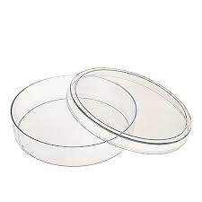
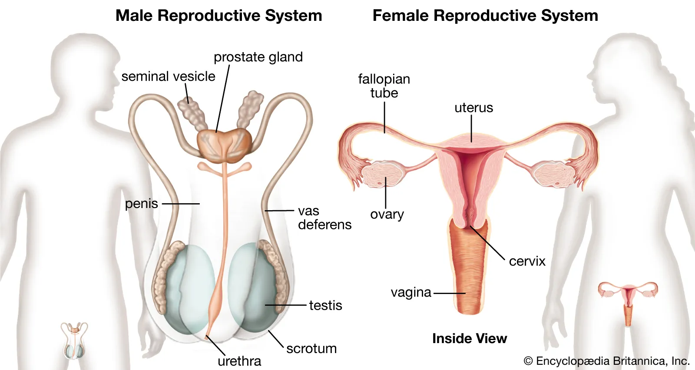

= lysozyme 溶解酵素,溶酶菌 (粘液中有)
:toc: left
:toclevels: 3
:sectnums:
:stylesheet: ../myAdocCss.css

'''

== Mucus Saves Your Life Every Day 粘液每天都在拯救你的生命

it was just on a whim 心血来潮；一时的兴致；突发的奇想 that he added some of his nasal 鼻的 mucus 粘液；黏液 to the _petri dish_ 有盖培养皿 of bacteria. Several weeks later he noticed that /the bacteria were being dissolved 使溶解，使溶化 by something that had come from his mucus 粘液；黏液. That something, Fleming soon discovered, was a protein that would be called lysozyme 溶解酵素；溶酶菌, which literally 按字面；字面上 means “an enzyme 酶 with power to dissolve.” It was an antibiotic —in his snot 鼻涕（有人认为是粗俗用语）! His discovery showed that mucus, this stuff commonly *thought of* as just gunk (n.)肮脏讨厌的黏性物质；黏糊糊的东西 and waste 废物，废弃物, was far from it.
Fleming soon found lysozyme 溶酶菌 in all sorts of human secretions 分泌物: spit 唾液；唾沫, blood serum 血清 and especially tears.

[.my2]
(1921年)他只是一时兴起将一些鼻粘液添加到细菌培养皿中。几周后，他注意到细菌被来自他粘液的东西溶解了。弗莱明很快发现，*这是一种被称为"溶菌酶"的蛋白质，字面意思是“一种具有溶解能力的酶”。* 那是一种抗生素——在他的鼻涕里！他的发现表明，粘液这种通常被认为只是垃圾和废物的东西远非如此。弗莱明很快**在各种人类分泌物中发现了"溶菌酶"：唾液、血清，尤其是眼泪。**

[.my1]
.title
====
.petri dish

.enzyme
( biology 生)a substance, produced by all living things, which helps a chemical change happen or happen more quickly, without being changed itself 酶 +

酶 Enzyme，又称酵素，**是一类大分子生物催化剂。酶能加快化学反应的速度（即具有催化作用）。**由酶催化的反应中，反应物称为"底物"，生成的物质称为"产物"。**几乎所有细胞内的代谢过程都离不开酶。酶能大大加快这些过程中各化学反应进行的速率，**使代谢产生的物质和能量能满足生物体的需求。

*目前已知酶可以催化超过5000种生化反应。大部分酶是蛋白质，有少部分酶是具有催化活性的RNA分子，这些酶被称为"核酶"。*

和所有的催化剂一样，酶通过降低反应激活能加快化学反应的速率。**一些酶可以将"底物"转化为"产物"的速率提高数百万倍。**一个比较极端的例子是乳清苷-5'-磷酸脱羧酶。该酶可以使在无催化剂条件下需要进行数百万年的化学反应, 在几毫秒内完成。

从化学原理上讲，酶和其它所有催化剂一样，反应不会使其物质量发生变化。酶亦不能改变化学平衡，这一点和其它催化剂也是一样的。**酶和其它催化剂的不同之处在于，它们的专一性要强得多。**

**一些分子可以影响酶的活性。如"酶抑制剂"能降低酶的活性，"酶激活剂"能提高酶的活性。许多药物及毒物是酶的"抑制剂"。** +
*当超出或小于适宜的温度和pH值后，酶的活性会显著下降。*

酶在工业和人们的日常生活中的应用也非常广泛。例如，药厂用特定的"合成酶"来合成抗生素；**洗衣粉中添加酶, 能加速附着在衣物上的蛋白质、淀粉或脂肪渍的分解；**嫩肉粉中加入"木瓜蛋白酶", 能将蛋白质分解为稍小的分子，使肉的口感更嫩滑。

.secretion
-> 来自 se-,分 开，cernere,分开，词源同 crisis,discern,critical.引申生理学词义分泌。

.serum
->  来自 PIE*ser,流动，词源同 stream,rheum.引申词义 血清。

.blood serum
image:../img/blood serum.jpg[,20%]
====

But lysozyme —and any more of mucus’s potential secrets —were overshadowed (v.)使显得逊色；使黯然失色 by a discovery 后定 Fleming made about seven years later: the much more potent (a.)有强效的；有力的 antibiotic penicillin.

[.my2]
但是溶菌酶——以及粘液的更多潜在秘密——被弗莱明大约七年后的一项发现所掩盖：更有效的抗生素"青霉素"。

Around the same time, scientists were learning that /mucus also seemed to have a potent ability to protect the body’s tissues. They experimentally 实验上；用实验方法 tested that by placing frog legs in acid 酸, and in the absence 缺席；不在 of mucus, they dissolved. They disintegrated (v.)碎裂；解体；分裂, basically.

[.my2]
大约在同一时间，科学家们发现, *粘液似乎也具有保护身体组织的强大能力。他们通过将青蛙腿放入酸中进行实验测试，在没有粘液的情况下，它们会溶解。他们基本上解体了。*

[.my1]
.案例
====
.disintegrate
-> dis-, 不，非，使相反。integrate, 连接，一体。
====

We are finding mucus is compromised （为达成协议而）妥协，折中，让步;危及，损害 in a number of diseases or conditions, including _inflammatory bowel disease_ 炎症性肠病, _cystic fibrosis_ 囊性纤维化, certain forms of _dental 牙齿的，牙科的 cavity 洞，腔；(牙齿的) 龋洞 formation_ 构成；形成, certain forms of infertility 不孕症；不肥沃，贫瘠. So there are a number of conditions that could *benefit* (v.)对（某人）有用，使受益, probably, *from* us being able to repair mucus.

[.my2]
*我们发现粘液在许多疾病或病症中受到损害，包括炎症性肠病、囊性纤维化、某些形式的牙洞形成、某些形式的不孕症。因此，我们修复粘液的能力, 可能会对许多疾病的治疗有益。*

[.my1]
.案例
====
.cystic fibrosis, CF
囊性纤维化. 是一种遗传疾病，此病症最常影响肺脏，但也常发生于胰脏、肝脏、肾脏，以及肠。*长期影响包含"肺部感染"所导致的"呼吸困难"以及"积痰".*

**"囊肿性纤维化"所产生的浓稠黏液, 会阻塞细小的气管，这些粘液在肺部成为细菌繁殖的场所，使得肺部反复受感染发炎, 而导致肺部组织的变化。早期的症状包括不断的咳嗽、大量的咳痰、**以及运动量的减少都很常见。*到了后期时，肺部组织的变化, 导致长期的呼吸困难。*

image:../img/cystic fibrosis.jpg[,80%]

*除了"肺脏"会累积黏液之外，负责分泌胰液的"胰脏", 同样也会累积浓稠的分泌物。这些过于浓稠的黏液, 会阻挡"胰脏消化液"进入肠道的管道，而这些堆积在胰脏内的消化液, 便会引起"胰脏炎"，进一步的对胰脏产生难以复原的伤害。*

**除了对胰脏产生的损害之外，消化道内也会因为缺乏胰脏的消化液, 而导致难以消化, 及吸收食物营养素，这会导致营养不良以及发育不良，**许多人体需要的营养素以及维生素都无法取得，例如维生素A、D、E、及K等脂溶性维生素

**同样受到浓稠的消化液分泌物影响的器官, 还有肝脏。由"肝脏"分泌以帮助消化脂肪的"胆汁"会堵塞"胆管"，进而对肝脏产生损坏。**长时间下来，可能会导致"肝硬化"使得肝脏失去去除身体内毒素以及制造重要蛋白质，例如凝血因子等，的能力。

**当胰脏受损时，其内部负责分泌"胰岛素"的"胰岛细胞", 也有可能会遭受损坏而死亡，进而导致"糖尿病"。**受影响的肠道吸收能力, 容易导致营养不良，例如对调节骨骼发育基本营养的钙与磷, 非常重要的维生素D, 如果吸收不良的话，可能会导致"骨质疏松"使得病患容易"骨折"。除此之外，在患者身上也可常见"手指脚趾肿大"的症状，这是因为此慢性病的影响, 以及"末梢骨骼长期缺氧"的结果。

"囊性纤维化"是欧洲人中最常见、无法治愈, 且缩短寿命的"体染色体"隐性遗传疾病。

.dental cavity
image:../img/dental cavity.jpg[,40%]
====

Mucus is mighty (a.)强而有力的 stuff. Based on _conservative 保守的 estimates_ 保守估计, it covers more than 1,000 square feet 平方英尺 of your lungs and gut 肠，肠道；内脏 alone. It's also part of _the film 薄薄的一层；薄膜 on your eyeballs_, the saliva 唾液 in your mouth and the coating (n.)（薄的）覆盖层，涂层 of your reproductive tract 生殖道. And producing it is a huge operation. Ribbeck says /we replenish (v.)补充；重新装满 those surfaces by making more than a quart 夸脱（液体单位） of mucus a day.

[.my2]
粘液是一种很强大的东西。根据保守估计，仅肺部和肠道就覆盖了 1,000 多平方英尺。它也是眼球薄膜、口腔唾液和生殖道涂层的一部分。生产它是一项巨大的工作。里贝克说，我们每天会产生超过一夸脱的粘液, 来补充这些表面。

[.my1]
.案例
====
.coating
(n.) a thin layer of a substance covering a surface（薄的）覆盖层，涂层 +
- a thin coating of chocolate 薄薄一层巧克力

.reproductive tract

.replenish
[ VN] *~ sth (with sth)* : ( formal ) to make sth full again by replacing what has been used 补充；重新装满 +
-> to replenish food and water supplies 补充食物和水
-> re-,再，重新，-plen,满的，词源同 fill,plenary.

.quart
( abbr. qt) a unit for measuring liquids, equal to 2 pints or about 1.14 litres in the UK and Canada, and 0.94 of a litre in the US夸脱（液量单位，在英国和加拿大等于2品脱, 或1.14升，在美国等于0.94升）

====

The basic _building blocks_ （方形平面）大块；立方体 of mucus 后定 that give mucus its gooey (a.)软而黏的；黏黏糊糊的 nature /are these threadlike 丝状的；细长的 molecules— they look like tiny bottle brushes 瓶刷 —that display lots and lots of sugar molecules on their backbone 脊梁骨；脊柱. And these sugar molecules —we call them glycans 聚糖；多糖— interact with molecules from the immune system and microbes 细菌，微生物 directly. And the exact configuration 布局；结构；构造 and density of these sugar molecules is really important for health.

[.my2]
赋予粘液"粘稠性质"的粘液的基本组成部分, 是这些线状分子——它们看起来像小瓶刷——在它们的骨架上显示出大量的糖分子。这些糖分子（我们称之为聚糖）直接与免疫系统和微生物的分子相互作用。这些糖分子的精确结构和密度, 对于健康非常重要。

[.my1]
.案例
====
.bottle brush
image:../img/bottle brush.webp[,10%]
====

in part, these sugar molecules entice (v.)诱使，引诱 microbes. These sugar molecules are special —they don’t exist in many other places in nature. That’s really important /because that now allows (v.) the mucus barrier 粘液屏障 *to attract* (v.) microbes 后定 that can selectively 有选择地 eat (v.) [and] metabolize (v.)使发生新陈代谢 these complex sugar molecules.

And this is how mucus can really collect (v.) and select microbes /后定 that *together* then *form* (v.) a microbiota 小型生物群，微生物区 that has specific functions that will support (v.) your body. In the gut, you’ll have a different combination of microbes 后定 that grow on you than in your mouth, for example, or in the vaginal (a.)阴道的 tract.
So it’s sort of advertising (v.)登广告,展现，宣传（自己的事） different things on its surface /to attract (v.) the community 后定 that is most beneficial for that part of the body.

[.my2]
这些糖分子在一定程度上会吸引微生物。这些糖分子很特殊——它们在自然界的许多其他地方都不存在。这非常重要，因为现在粘液屏障可以吸引微生物，这些微生物可以选择性地吃掉[并]代谢这些复杂的糖分子。这就是粘液如何真正收集和选择微生物的方式，然后形成一个微生物群，具有特定的功能，将支持你的身体。在肠道中，生长在你身上的微生物组合, 与在口腔或阴道中生长的微生物组合不同。所以它在它的表面宣传不同的东西, 来吸引对身体那部分最有益的群体.

When mucus is not produced in the right amounts /or the chemistry is not correct, then `主` certain pathogens 病原体；病原菌 that otherwise *are kept* in check /`谓` can now begin to outgrow (v.)比…长得高（或大、快）;长得穿不下（衣服）；增长得容不进（某地） the community and cause infections. And in other cases, #the anchor points# 锚定点 that certain microbes need (v.) to become residents /#are missing#, and then they will no longer reside (v.)居住，定居 on the body surface, and a number of microbes are really, really important for our health.

[.my2]
当粘液产生的数量不正确, 或化学成分不正确时，某些原本受到控制的病原体, 现在可能会开始超出社区范围并引起感染。在其他情况下，某些微生物需要成为居民的锚点缺失了，然后它们将不再居住在身体表面，许多微生物对我们的健康非常非常重要。

[.my1]
.案例
====
.keep in check
限制或控制某事物：指对某事物进行限制或控制，以防止其过度发展或失控。
====

'''

== (pure) Mucus Saves Your Life Every Day

it was just on a whim that he added some of his nasal mucus to the petri dish of bacteria. Several weeks later he noticed that the bacteria were being dissolved by something that had come from his mucus. That something, Fleming soon discovered, was a protein that would be called lysozyme, which literally means “an enzyme with power to dissolve.” It was an antibiotic—in his snot! His discovery showed that mucus, this stuff commonly thought of as just gunk and waste, was far from it.
Fleming soon found lysozyme in all sorts of human secretions: spit, blood serum and especially tears.

But lysozyme—and any more of mucus’s potential secrets—were overshadowed by a discovery Fleming made about seven years later: the much more potent antibiotic penicillin.

Around the same time, scientists were learning that mucus also seemed to have a potent ability to protect the body’s tissues. They experimentally tested that by placing frog legs in acid, and in the absence of mucus, they dissolved. They disintegrated, basically.

We are finding mucus is compromised in a number of diseases or conditions, including inflammatory bowel disease, cystic fibrosis, certain forms of dental cavity formation, certain forms of infertility. So there are a number of conditions that could benefit, probably, from us being able to repair mucus.

Mucus is mighty stuff. Based on conservative estimates, it covers more than 1,000 square feet of your lungs and gut alone. It's also part of the film on your eyeballs, the saliva in your mouth and the coating of your reproductive tract. And producing it is a huge operation. Ribbeck says we replenish those surfaces by making more than a quart of mucus a day.

The basic building blocks of mucus that give mucus its gooey nature are these threadlike molecules—they look like tiny bottle brushes—that display lots and lots of sugar molecules on their backbone. And these sugar molecules—we call them glycans—interact with molecules from the immune system and microbes directly. And the exact configuration and density of these sugar molecules is really important for health.

in part, these sugar molecules entice microbes. These sugar molecules are special—they don’t exist in many other places in nature. That’s really important because that now allows the mucus barrier to attract microbes that can selectively eat [and] metabolize these complex sugar molecules.
And this is how mucus can really collect and select microbes that together then form a microbiota that has specific functions that will support your body. In the gut, you’ll have a different combination of microbes that grow on you than in your mouth, for example, or in the vaginal tract.
So it’s sort of advertising different things on its surface to attract the community that is most beneficial for that part of the body.

When mucus is not produced in the right amounts or the chemistry is not correct, then certain pathogens that otherwise are kept in check can now begin to outgrow the community and cause infections. And in other cases, the anchor points that certain microbes need to become residents are missing, and then they will no longer reside on the body surface, and a number of microbes are really, really important for our health.

'''
