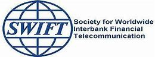

= 0029 The nuclear option
:toc: left
:toclevels: 3
:sectnums:

'''

== The nuclear option

Mr Trump has three main ways to constrain another country financially.  +
(1) He can refuse its banks access to CHIPS, a New York-based *clearing house* （银行）票据交换所，清算中心，结算所 (through which 95% of all *dollar transactions* （一笔）交易，业务，买卖;办理；处理 are routed 按某路线发送;为…规定路线). +
(2) He can try to force SWIFT, a Belgium-based *messaging system* which 11,000 banks worldwide *use to make cross-border payments*, to expel 把…开除（或除名） members (from the offending 有罪的；违法的;烦人的；令人不安的；惹麻烦的 state).  +
(3) And he can *slap （用手掌）打，拍，掴;啪地击打（或撞上） an embargo 禁止贸易令；禁运 on* its financial system, threatening to punish(v.) any foreign or domestic financial institution (that uses dollars) — *as virtually* 几乎；差不多；事实上；实际上 all do — but continues *to transact(v.)（与人或组织）做业务，做交易 with* the embargoed 禁止…的贸易；禁运 firms.

.标题
====
.clearing house
a central office that banks use in order to pay each other money and exchange cheques, etc. （银行）票据交换所，清算中心，结算所 +
an organization that collects and exchanges information on behalf of people or other organizations 信息交换机构；信息交流所

.transaction :
~ of sth ( formal ) the process of doing sth 办理；处理

- the transaction of government business 处理政府事务

.CHIPS :
clearing house interbank(a.)银行同业的 payment system “纽约清算所银行同业支付系统. 全球最大的私营支付清算系统之一，主要进行跨国美元交易的清算。

.SWIFT :
Society for Worldwide Interbank Financial Telecomm 环球银行金融电信协会. 是一个国际银行间非盈利性的国际合作组织，总部设在比利时的布鲁塞尔. 银行和其他金融机构通过它与同业交换电文（message）来完成金融交易。

特朗普有三种主要方式, 来限制另一个国家的财政。1.他可以拒绝该国的银行使用总部设在纽约的清算所CHIPS, 95%的美元交易都是通过CHIPS进行的。2.他可以试图迫使总部位于比利时的通讯系统SWIFT, 将来自于违规国家的成员(该国的银行), 驱逐出SWIFT组织。全球有1.1万家银行使用该系统进行跨境支付。3.他还可以对该国的金融系统, 实施禁令，对那些继续与被禁公司进行美元贸易的公司, 无论是美国国内还是国外的, 进行威胁惩罚. 事实上, 几乎所有的公司都需要进行美元交易.
====

'''

== <pure> The nuclear option

Mr Trump has three main ways [to constrain another country financially.

He can refuse its banks access to CHIPS, a New York-based clearing house [through which 95% of all dollar transactions are routed.

He can try to force SWIFT, a Belgium-based messaging system [which 11,000 banks worldwide `谓` use to make cross-border payments, to expel members from the offending state.

And he can slap an embargo on its financial system, threatening to punish any foreign or domestic financial institution [that uses dollars — as virtually all do — but continues to transact with the embargoed firms.

'''
