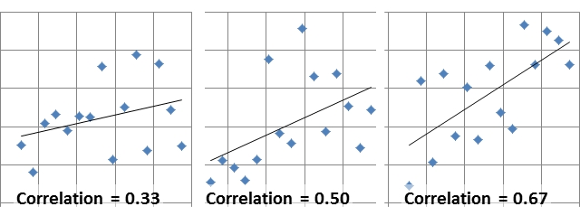

= Is Too Little Play Hurting Our Kids?
玩耍太少会伤害我们的孩子吗？
:toc: left
:toclevels: 3
:sectnums:

'''

== Is Too Little Play Hurting (v.) Our Kids? 玩耍太少会伤害我们的孩子吗？

A long-term decline in *unsupervised  无人监督的 activity* may be contributing to mental health declines in children and adolescents. +
无人监督活动的长期减少, 可能会导致儿童和青少年的心理健康状况下降。

It’s not just *moderate evidence*. It’s *overwhelming evidence* that if you *take away 夺走 children’s opportunities* for independent activity, *they’re not going to learn* how to be independent, and *that’s going to lead them to be* anxious and depressed, *fearful about the future* and all the things that we’re seeing now. +
这不仅仅是温和的证据。压倒性的证据表明，如果剥夺孩子独立活动的机会，他们就不会学会如何独立，这将导致他们焦虑和沮丧，对未来和我们正在经历的所有事情感到恐惧。

Play is how children pursue (v.) what’s fun for them. That’s *an immediate 立即的；立刻的 source* of mental health — `主` part of mental health `谓` really means “I’m happy” or “I’m most satisfied with my life right now.” +
Play and other independent activities also have far-reaching 影响深远的；广泛的 long-term effects on children’s mental health and resilience  快速恢复的能力；适应力;还原能力；弹力. +
游戏是孩子们追求乐趣的方式。这是心理健康的直接来源 ——心理健康的一部分, 实际上意味着“我很高兴”或“我对现在的生活最满意”。玩耍和其他独立活动, 也对儿童的心理健康和适应能力, 产生深远的长期影响。

*The real crisis is that* young people are losing a sense of, “I can solve problems, I can *deal with* bumps  碰撞（声）；撞击（声） in the road of life.” And `主` the way *the children learn to do these things* `系` is through play(n.) 后定 where they are responsible (a.)有责任；负责；承担义务 to solve their own problems. They negotiate with their peers. They *figure out* how to solve quarrels 口角；争吵；拌嘴 among themselves. If somebody gets hurt, they *figure out* what to do about being hurt. +
真正的危机是年轻人正在失去“我可以解决问题，我可以应对人生道路上的坎坷”的意识。孩子们学习做这些事情的方式是通过玩耍，他们负责解决自己的问题。他们与同行谈判。他们想出如何解决彼此之间的争吵。如果有人受伤，他们会想出如何处理受伤的情况。

When kids are allowed to make decisions and solve problems, they exercise (v.) what’s called their *internal locus （某事发生的）确切地点；（被视为某物的）中心，核心 of control*. They begin to feel *they have control (v.) over experiences and their lives*, rather than *experiences controlling (v.) them*.  +
当孩子们被允许做出决定和解决问题时，他们就会锻炼所谓的"内部控制点"。他们开始觉得自己可以控制经历和生活，而不是让经历控制他们。

.案例
====
.locus
(n.)( formal ) ( technical 术语) the exact place where sth happens or which is thought to be the centre of sth （某事发生的）确切地点；（被视为某物的）中心，核心
====

There’s evidence for people *of all ages* that `主` having a weak *internal locus control* `系` is predictive (a.)预测的；预言的；前瞻的 of future anxiety and depression. If you believe that *anything can happen at any time* and *you can’t do anything about it*, that’s a pretty anxiety-provoking (刺激的；令人生气的；激怒人的)引发焦虑的 view of life. +
有证据表明，对于所有年龄段的人来说，"内部轨迹控制"较弱, 可以预测未来的焦虑和抑郁。如果你相信任何事情随时都可能发生，而你却无能为力，这就是一种非常令人焦虑的人生观。

Control is also central to another set of established 著名的；成名的；公认的 research, called self-determination （个人）自主权，自主能力 theory. This research shows that children and adults have three basic psychological needs. If they’re not fulfilled 实现;履行；执行；符合；具备, we’re not happy.  +
控制也是另一组既定研究的核心，称为自决理论。这项研究表明，儿童和成人都具有三种基本的心理需求。如果他们没有得到满足，我们就会不高兴。

.案例
====
.fulfil
(v.)to do or achieve what was hoped for or expected 实现 +
• to fulfil your dream/ambition/potential 实现梦想╱抱负；发挥潜力
====

The first of those needs is autonomy 自主；自主权. The sense that we have some freedom to choose what we’re going to do, that we’re *in charge of* our own life. +
第一个需求是自治。我们有一定的自由, 来选择我们要做的事情，我们掌控自己的生活。

The second of these needs is competence 能力；胜任;技能；本领. *Not only* am I free to choose what I want to do, *but* I can do it. +
第二个需求是能力。我不仅可以自由选择我想做的事，而且我可以做到。

.案例
====
.competence
(n.)
[ UC] ( also less frequentalso com·pe·ten·cy ) *~ (in sth) |~ (in doing sth)* :the ability to do sth well 能力；胜任
====

And the third is relatedness 关联性；关系. It’s also important that *I have other people on my side on this*. `主` Connection with peers *by this theory*  `系` is an extremely important contributor to *the sense of well-being*  健康；安乐；康乐. +
第三是相关性。在这件事上有其他人支持我, 也很重要。根据这一理论，与同龄人的联系对于幸福感极其重要。

These ideas are *borne out* 证实；为…作证 in *indigenous (a.)本地的；当地的；土生土长的;土著 cultures*. These anthropological (a.)人类学的；人类学上的 findings suggest that from an evolutionary perspective, `主` independent activity, personal responsibility, and self-initiated 从自己开始的；自创的；自己发起的 exploration and learning `谓` ideally begin at an early age. +
这些想法在土著文化中得到了证实. 这些人类学发现表明，从进化的角度来看，独立活动、个人责任, 以及自我发起的探索和学习, 最好从很小的时候就开始。

.案例
====
.bear sb/sth←→ˈout
( especially BrE ) to show that sb is right or that sth is true 证实；为…作证 +
• The other witnesses *will bear me out*. 其他证人将给我作证。  +
• The other witnesses *will bear out what I say*. 其他证人将会证实我的话。

bear - bore -  borne
====

...
(上面目的变量的因果关系, 是被证明了的. 但还有一些其他变量也在考虑之中, 后面的这些变量... )

We need to be cautious (a.) about *drawing a causal (a.)因果关系的 connection* between those trends. And *it’s particularly*  特别；尤其, in my view, *unclear* (a.) how far we `谓` can *kind of* 稍微；有几分；有点儿 correlate (v.)相互关联影响；相互依赖 `宾` *broad 涉及各种各样的人（或事物）的；广泛的 social trends* 后定 in aspects *such as* independent play and mental health.  +
我们需要谨慎地在这些趋势之间建立因果关系。在我看来，尤其不清楚我们能在多大程度上, 将独立游戏和心理健康等方面的广泛社会趋势, 联系起来。

.案例
====
.kind of
用来表示一定程度上的不确定性或模糊性。 句子中, 说话者表示，我们在广泛的社会趋势（比如独立玩耍和心理健康）之间, 建立起明确关联的程度, 并不是完全的清晰或精确。

.correlate
(v.) +
[ V] if two or more facts, figures, etc. correlate or if a fact, figure, etc. correlates with another, *the facts are closely connected and affect (v.) or depend on each other* 相互关联影响；相互依赖 +
• The figures *do not seem to correlate*. 这些数字似乎毫不相干。  +
• A high-fat diet *correlates (v.) with* a greater risk of heart disease. 高脂肪饮食, 与增加心脏病发作的风险, 密切相关。  +

2.[ VN] to show that *there is a close connection* between two or more facts, figures, etc. 显示（两个或多个事实或数字等）的紧密联系 +
• Researchers *are trying to correlate (v.) the two sets of figures*. 研究人员正试图展示这两组数字的相关性。

====

Collishaw 人名 sees many changes *over time* that could be involved — school pressures, highly structured schedules, the mental health of parents and the rise of digital technology.  +
随着时间的推移，科利肖看到了许多可能涉及的变化——学校压力、高度结构化的日程安排、家长的心理健康以及数字技术的兴起。

It’s hard *to disentangle (v.)理顺，分清，清理出（混乱的论据、想法等） those* and *make a strong case* （在审判、讨论等中支持一方的）论据，理由，辩词 that one *has a causal (a.)因果关系的；前因后果的；原因的 effect* on the other. +
很难理清这些因素，并有力地证明"其中一个因素"对"另一个因素"有因果影响。

.案例
====
.disentangle
(v.)*~ sth (from sth)* : to separate different arguments, ideas, etc. that have become confused 理顺，分清，清理出（混乱的论据、想法等） +
--> dis-, 不，非，使相反。entangle, 卷入，混乱。即解开混乱，解释，理解。 +
• It's not easy *to disentangle the truth from* the official statistics. 从官方统计资料中理出真实情况并不容易
====

Twenge *sees another story* in the data — a *leveling off* 趋于稳定;(飞机降落前)水平飞行 in mental health declines(n.) starting in the 1990s, and *a huge increase* 15 years later. And `主` that rise `谓` **coincided (v.)同时发生 with** — the smartphone.  +
Twenge 在数据中看到了另一个故事——心理健康状况的下降从 20 世纪 90 年代开始趋于平稳，15 年后大幅上升。这种崛起与智能手机的出现同时发生。

.案例
====
.a *leveling off* in mental health declines(n.) starting in the 1990s
chatGpt : 在这个句子中，"declines" 是名词，表示精神健康的下降或减少。**使用"复数形式"的原因, 可能是因为作者想要强调"一系列的下降趋势"或"涉及不同方面的下降"。**复数形式有时可以用来表示一系列相关的事件或情况，而不仅仅是单一的下降。*在这里，它可能指的是"多个方面或类型的精神健康"下降趋势。*
====

Social media also became more visual *around this time*, Twenge says, as `主` smartphones *with front-facing cameras* `谓` were introduced  推行；实施；采用. Teens *spent (v.) less time together*(a.) and *less time sleeping*(a.)同住宿有关的; 睡觉的.  +
随着带有前置摄像头的智能手机的推出，社交媒体也在这个时候变得更加视觉化。青少年在一起的时间越来越少，睡觉的时间也越来越少。

So if you *put these three things together* — more time online, less time with friends face-to-face, less time sleeping — that’s a very bad recipe 方法；秘诀；诀窍;烹饪法；食谱 for mental health.  +
所以如果你把这三件事放在一起——更多的上网时间、更少的与朋友面对面的时间、更少的睡眠时间——这对心理健康来说是非常糟糕的。

Looking at the data, Twenge saw more than *a time sequence* 顺序；次序 后定 lining up 排成一行；站队；排队（等候）, but *a huge and fundamental change to* how teens spent (v.) their day-to-day lives—on-screen.  +
从数据来看，特温格看到的不仅仅是一个时间顺序序列，而是青少年在屏幕上的日常生活方式, 发生了巨大而根本的变化，

*Economics are actually improving* over that time. *The unemployment rate* was going down, the U.S. economy was finally starting to improve after the Great Recession.  +
那段时间经济实际上正在改善。失业率正在下降，美国经济在大衰退后终于开始好转。 +
(也就是说, 经济是好转的, 但青少年的精神问题却上升了, 这只能说明青少年的精神问题, 并非是经济萧条引起的, 而是其他原因引起的, 考虑到精神问题和手机社交网络是同时兴起的, 所以只能是手机社交平台的原因.)

*We also know* from several recent studies *that* `主` these increases in anxiety and loneliness among teens `系` are worldwide. That helps us *rule (v.) out*  把…排除在外；认为…不适合 a lot of *U.S.-based explanations* 解释；说明；阐述 around politics or *school shootings* or *any of these other things* because *we see very, very similar patterns* in other countries around the world.  +
我们还从最近的几项研究中得知，青少年焦虑和孤独感的增加是全球性的。这有助于我们排除许多基于美国的关于政治或校园枪击事件或其他任何事情的解释，因为我们在世界其他国家看到了非常非常相似的模式。

In one of *the best data sets* that we’ve got, `主` the correlation *between* hours of social media use a day *and* symptoms of depression among teen girls `系` is 0.2. `主` The correlation *between* childhood lead 铅 exposure *and* adult IQ `系` is 0.11 — about half the size. So again, I think *that really makes (v.) that case* that there are not small effects. +
在我们拥有的最佳数据集中之一，青少年女孩每天使用社交媒体的时间, 与抑郁症状之间的相关性, 为 0.2。儿童铅暴露, 与成人智商之间的相关性, 为 0.11，大约是成人智商的一半。再说一遍，我认为这确实说明了影响不小。

*Raise (v.) the age* (后定 to have a social media account) *to 16* and actually enforce (v.)强制执行，强行实施（法律或规定） age. That’s one of *the clearest, most straightforward  简单的；易懂的；不复杂的 things* that we can do. And it could potentially have a big impact. +
Twenge：将拥有社交媒体帐户的年龄, 提高到 16 岁，并切实执行年龄规定。这是我们能做的最清晰、最直接的事情之一。它可能会产生巨大的影响。

*We enforce (v.) age limits* for driving. *We enforce (v.) age limits* for voting. *We enforce (v.) age limits* for alcohol. *Why not do it* for social media? +
Twenge：我们强制规定驾驶年龄限制。我们强制执行投票年龄限制。我们对饮酒实行年龄限制。为什么不为社交媒体做呢？

`主` That meta-analysis 荟萃分析；元分析 about *secure (a.)可靠的；牢靠的；稳固的 attachment* 依恋；爱慕;信念；信仰；忠诚；拥护 `谓` showed that `主` *the greatest decline* and *the reason for the rise in insecurity* 不安全，无把握 `系` is *negative views* of other people.  +
① The loss of trust and ② the inability to **count (v.) on**依赖，依靠，指望（某人做某事）；确信（某事会发生）  or *depend on* others *to give you warm, trusting connection* — and I think that’s happening *not because* parents don’t care, it’s that they don’t *have enough time* and *encouragement*  鼓舞；鼓励；起激励作用的事物 and *support* and *spending that kind of quality time* to make those connections. +

关于安全依恋的那项荟萃分析显示，"安全依恋的显著下降"以及"不安全依恋增加"的原因在于 : 对他人的负面看法。信任的丧失, 以及无法依赖他人提供温暖、信任的联系 ——我认为, 这并不是因为父母不关心，而是因为他们没有足够的时间、鼓励、支持和花费那种质量的时间, 来建立这些联系。

*We’re increasingly believing that* young people are incompetent 无能力的；不胜任的；不称职的 and *can’t be trusted* to do things responsibly, and *it becomes a self-fulfilling （预言等）自我应验的，自我实现的 prophecy* (n.)预言 because we don’t allow them those opportunities, they don’t develop those opportunities. +
我们越来越相信年轻人没有能力，不能相信他们会负责任地做事，这成为一个自我实现的预言，因为我们不给他们这些机会，他们就不会发展这些机会。

.案例
====
.prophecy
(n.)[ C] a statement that sth will happen in the future, especially one made by sb with religious or magic powers 预言 +
-->  pro-前 + -phe-说 + -cy名词词尾 → 提前说出来 +
• to fulfil a prophecy (= make it come true) 实现预言 +
====
'''

== (pure) Is Too Little Play Hurting Our Kids?

A long-term decline in unsupervised activity may be contributing to mental health declines in children and adolescents. +

It’s not just moderate evidence. It’s overwhelming evidence that if you take away children’s opportunities for independent activity, they’re not going to learn how to be independent, and that’s going to lead them to be anxious and depressed, fearful about the future and all the things that we’re seeing now. +

Play is how children pursue what’s fun for them. That’s an immediate source of mental health—part of mental health really means “I’m happy” or “I’m most satisfied with my life right now.” +
Play and other independent activities also have far-reaching long-term effects on children’s mental health and resilience. +

The real crisis is that young people are losing a sense of, “I can solve problems, I can deal with bumps in the road of life.” And the way the children learn to do these things is through play where they are responsible to solve their own problems. They negotiate with their peers. They figure out how to solve quarrels among themselves. If somebody gets hurt, they figure out what to do about being hurt. +

When kids are allowed to make decisions and solve problems, they exercise what’s called their internal locus of control. They begin to feel they have control over experiences and their lives, rather than experiences controlling them.  +

There’s evidence for people of all ages that having a weak internal locus control is predictive of future anxiety and depression. If you believe that anything can happen at any time and you can’t do anything about it, that’s a pretty anxiety-provoking view of life. +

Control is also central to another set of established research, called self-determination theory. This research shows that children and adults have three basic psychological needs. If they’re not fulfilled, we’re not happy.  +

The first of those needs is autonomy. The sense that we have some freedom to choose what we’re going to do, that we’re in charge of our own life. +

The second of these needs is competence. Not only am I free to choose what I want to do, but I can do it. +

And the third is relatedness. It’s also important that I have other people on my side on this. Connection with peers by this theory  is an extremely important contributor to the sense of well-being. +

These ideas are borne out in indigenous cultures. These anthropological findings suggest that from an evolutionary perspective, independent activity, personal responsibility, and self-initiated exploration and learning ideally begin at an early age. +

...

We need to be cautious about drawing a causal connection between those trends. And it’s particularly, in my view, unclear how far we can kind of correlate broad social trends in aspects such as independent play and mental health.  +

Collishaw sees many changes over time that could be involved—school pressures, highly structured schedules, the mental health of parents and the rise of digital technology.  +

It’s hard to disentangle those and make a strong case that one has a causal effect on the other. +

Twenge sees another story in the data—a leveling off in mental health declines starting in the 1990s, and a huge increase 15 years later. And that rise coincided with—the smartphone.  +

Social media also became more visual around this time, Twenge says, as smartphones with front-facing cameras were introduced. Teens spent less time together and less time sleeping.  +

So if you put these three things together—more time online, less time with friends face-to-face, less time sleeping—that’s a very bad recipe for mental health.  +

Looking at the data, Twenge saw more than a time sequence lining up, but a huge and fundamental change to how teens spent their day-to-day lives—on-screen.  +

Economics are actually improving over that time. The unemployment rate was going down, the U.S. economy was finally starting to improve after the Great Recession.  +

We also know from several recent studies that these increases in anxiety and loneliness among teens are worldwide. That helps us rule out a lot of U.S.-based explanations around politics or school shootings or any of these other things because we see very, very similar patterns in other countries around the world.  +

In one of the best data sets that we’ve got, the correlation between hours of social media use a day and symptoms of depression among teen girls is 0.2. The correlation between childhood lead exposure and adult IQ is 0.11—about half the size. So again, I think that really makes that case that there are not small effects. +

Raise the age to have a social media account to 16 and actually enforce age. That’s one of the clearest, most straightforward things that we can do. And it could potentially have a big impact. +

We enforce age limits for driving. We enforce age limits for voting. We enforce age limits for alcohol. Why not do it for social media? +

That meta-analysis about secure attachment showed that the greatest decline and the reason for the rise in insecurity is negative views of other people. The loss of trust and the inability to count on or depend on others to give you warm, trusting connection—and I think that’s happening not because parents don’t care, it’s that they don’t have enough time and encouragement and support and spending that kind of quality time to make those connections. +

We’re increasingly believing that young people are incompetent and can’t be trusted to do things responsibly, and it becomes a self-fulfilling prophecy because we don’t allow them those opportunities, they don’t develop those opportunities. +

'''

