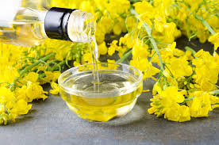
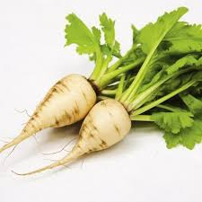

= gene mutation 基因突变
:toc: left
:toclevels: 3
:sectnums:
:stylesheet: ../myAdocCss.css

'''

== CRISPR Will Likely Not Solve Bird Flu. / CRISPR 可能无法解决禽流感问题

Recently, a group of scientists announced a breakthrough (n.)突破，重大进展 approach /to combat (v.) Highly Pathogenic 致病的；病原的；发病的 _Avian 鸟的；鸟类的 Influenza_ (bird flu or avian flu).
Their approach uses (v.) a gene-editing technique called CRISPR/Cas9. In general, this method changes (v.) defined segments 片段；段数 of an animal’s genetic code /to functionally alter (v.) what that code does. In this case, CRISPR was used (v.) to alter chickens’ genetic code /to make chickens more resistant (a.)抵抗的；有抵抗力的 to avian flu.

While this was a fascinating use of the technology, any time 任何时候,无论何时 scientific innovation affects (v.) the food we eat, it becomes a sensitive issue. *On top of* 除…之外 _philosophical concerns_ 哲学上关心的事 后定 regarding 关于；至于 the use of CRISPR within our food supply, we think /there are #too# many unpredictable outcomes 后定 *related to* combating (v.) _avian influenza_ with CRISPR-modified chickens /#to# expect 期待；盼望 this technology will be a solution to this destructive disease. (← 注意: 这句中用黄色高亮标出的 too...to... 是 "太...而不能"的意思.)

[.my2]
最近，一组科学家宣布了一种对抗高致病性"禽流感"（禽流感或禽流感）的突破性方法.
他们的方法使用了一种称为 CRISPR/Cas9 的基因编辑技术。一般来说，这种方法改变动物遗传密码的定义片段，以在功能上改变该代码的作用。在这个案例中，CRISPR被用来改变鸡的遗传密码，使鸡对禽流感有更强的抵抗力。虽然这是一项令人着迷的技术应用，但每当科学创新影响我们所吃的食物时，它就会成为一个敏感问题。除了对在我们的食品供应中使用 CRISPR 的哲学担忧之外，我们认为, *用 CRISPR 修饰的鸡对抗"禽流感", 会产生太多不可预测的结果，因此不能指望这项技术能够解决这种破坏性疾病。*

[.my1]
.title
====
.on top of sth/sb
(1) on, over or covering sth/sb在…上面；在…上方；覆盖着 +
• Books were piled on top of one another.书籍一本一本地摞在一起。 +
• Many people were crushed when the building collapsed on top of them.那座楼房倒塌时砸伤了下面许多人。 +

(2) in addition to sth 除…之外 +
• He gets commission on top of his salary.他除了薪金之外还拿佣金。 +

(3) very close to sth/sb 紧挨着；与…紧靠着 +
• We were all living on top of each other in that tiny apartment. 我们都挤着住在那套小小的公寓里。

(4) in control of a situation 控制着；掌握着 +
•Do you think he's really on top of his job? 你认为他真的能做好他的工作吗？
====

While CRISPR has created almost infinite opportunities to address (v.) some of the health-related challenges facing society, including recent therapies 治疗方法 for _sickle cell 镰状细胞 disease_ in humans, it’s not likely to be successful in controlling _avian influenza_. All _avian influenza viruses_ originate (v.)起源；发源；发端于 in waterfowl 水鸟；水禽（尤指鸭或鹅）, such as ducks, which *serve as* a constant source of potentially new viruses to infect (v.) poultry 家禽 populations (某种) 人群; 种群. Avian flu viruses also readily (ad.)快捷地；轻而易举地；便利地 change —or mutate —their genetic material, allowing the viruses to quickly *adapt to* different hosts 寄主，宿主 beyond poultry. This ability to quickly evolve (v.) also rapidly changes the way the virus spreads, making it #challenging# (a.)挑战性的；考验能力的 to control /and the impact of any intervention #difficult# (a.) to foresee.

[.my2]
尽管 CRISPR 创造了几乎无限的机会来解决社会面临的一些与健康相关的挑战，包括最近针对人类镰状细胞病的疗法，但它不太可能成功控制禽流感。*所有禽流感病毒都起源于水禽，例如鸭子，它们是感染家禽种群的潜在新病毒的持续来源。禽流感病毒也很容易改变或突变其遗传物质，使病毒能够快速适应家禽以外的不同宿主。这种快速进化的能力, 也迅速改变了病毒的传播方式，使其难以控制，并且任何干预措施的影响, 都难以预见。*

The 2022 virus has developed a different survival strategy by persisting (v.)维持；保持；持续存在 in waterfowl populations for longer periods /and over different life stages.
 The magnitude 巨大；重大；重要性 of these outbreaks would not have changed /if there had been CRISPR-modified chickens on farms /because the outbreaks *were and are likely to still be driven* by virus introductions 采用；引进；推行 后定 from wild ducks.

[.my2]
2022 *病毒, 通过在水禽种群中持续存在更长的时间和不同的生命阶段，制定了不同的生存策略。* (即使)农场里的鸡都是经过 CRISPR 改造的，疫情的严重程度(也)不会改变, 因为疫情的爆发, 在过去和现在很可能仍然是由野鸭引入的病毒引起的。

`主` This combination of genetic variability 可变性，变化性;变异性 and the wide variety 多样化，变化；种类，品种 of birds and mammals that can be infected with avian flu /`谓` will make it very difficult to predict the outcome of using CRISPR to increase the resistance of chickens to infection (n.) with avian flu.  +

There is a real chance for unintended 非计划的；无意的；无心的 or unpredictable consequences. For example, as soon as the virus has trouble 后定 infecting (v.) CRISPR-modified chickens, it will change and adapt. While most changes won’t help the virus survive, there might be _one among the billions of changes_ that will. Such a mutation could *lead to* a more deadly outbreak of avian flu in chickens, which could be catastrophic (a.)灾难性的；极糟的 for this segment of our food supply. And it’s possible /that `主` one of the billions of changes 后定 that make it easier for the virus to survive in CRISPR-modified chickens /`谓` could also make it more likely to be able to infect mammals 哺乳类；哺乳类动物 including humans.

[.my2]
**遗传变异性, 以及可能感染禽流感的鸟类和哺乳动物种类繁多，这使得预测使用 CRISPR 增强的鸡对"禽流感"感染的抵抗力的结果, 变得非常困难。**确实有可能出现意外或不可预测的后果。例如，**一旦病毒无法感染经过 CRISPR 修饰的鸡，它就会发生变化并适应。**虽然大多数变化不会帮助病毒生存，但**数十亿个变化中可能有一个可以帮助病毒生存。这种突变可能会导致鸡群中爆发更致命的禽流感，**这对我们食品供应的这一部分来说可能是灾难性的。使病毒更容易在 CRISPR 修饰的鸡中生存的数十亿个变化之一, *也可能使其(新获得感染人的能力, 反而演化得更强了) 更有可能感染包括人类在内的哺乳动物.*

So, even though we understand a lot about influenza viruses, there’s even more we don’t understand.

[.my2]
因此，尽管我们对流感病毒了解很多，但我们不了解的还有更多。

Finally, in addition to 除了……之外 all the virological 病毒学的 implications 暗示；蕴含，含义；（可能带来的）影响 of using CRISPR to alter _chickens’ susceptibility_ (n.)易受影响（或伤害等）的特性；敏感性；过敏性 to avian flu /we need to consider how people might perceive (v.)将…理解为；将…视为；认为 this technology within the food supply.  +
The companies that grow (v.) poultry 家禽；家禽肉 /`系` are #not only# experts #in# animal husbandry （尤指精心经营的）农牧业 and welfare （个体或群体的）幸福，安全与健康 #but also# #in# marketing and product differentiation ((n.)区分，差异化) 产品差异化, and sometimes use (v.) language that creates (v.) consumer confusion and misperception 误解，错误知觉.

For instance, in the U.S., it is illegal *to feed* (v.) hormones 激素；荷尔蒙 *to* poultry 家禽 or pigs, yet companies *label* (v.) their products *as* being “no hormones added” /in an attempt to suggest that /other companies might be doing so.  +
We can envision (v.)展望；想象 one company *advertising* (v.) their “influenza-resistant” chickens *as* more environmentally (ad.)有关环境方面 sustainable (a.)（对自然资源和能源的利用）不破坏生态平衡的，合理利用的;可持续的 /to sway (v.)（使）摇摆，摇动;说服；使相信；使动摇 consumers, while another company might respond (v.) by *warning* consumers *of* the dangers of _genetic engineering_ 基因工程 /to create the perception 知觉；感知 that their non–genetically engineered chickens are “safer” for human consumption.

Such marketing techniques are already in use (n.) around other genetically modified 基因改造的 (or, 如同 *as* they’*re now labeled*, “bioengineered” 生物工程（改造）的 ) agricultural products, such as corn, canola 芥花籽油,一种菜籽油, soybeans 大豆 and sugar beets 甜菜.

[.my2]
最后，除了使用 CRISPR 改变鸡对"禽流感"的易感性的所有病毒学影响之外，我们还需要考虑人们如何看待食品供应中的这项技术。饲养家禽的公司, 不仅是畜牧业和福利方面的专家，而且也是营销和产品差异化方面的专家，有时会使用造成消费者困惑和误解的语言。例如，在美国，"给家禽或猪喂激素"是违法的，但公司却将其产品贴上“不添加激素”的标签，试图暗示其他公司可能也会这样做。我们可以想象一家公司宣传其“抗流感”鸡更环保，以影响消费者，而另一家公司可能会通过警告消费者"基因工程的危险"来做出回应，以造成他们的非基因工程鸡“更安全”的印象供人类消费。这种营销技术, 已经在其他转基因（或者现在被称为“生物工程”）农产品中使用，例如玉米、油菜、大豆和甜菜。

[.my1]
.title
====
.husbandry +
-> 来自husband的古义，农夫，耕作者，-ry,名词后缀。后引申词义农牧业，畜牧业。

.canola

.soybeans
image:../img/soybean.jpg[,10%]

.sugar beet

====

We should use (v.) CRISPR to improve the environmental and economic sustainability of production, but `主` #any company or research group# 后定 using _genetic engineering techniques_ 基因工程技术 to modify the food we eat /`谓` #needs to be clear about# the effects of these innovations /to ensure public trust. We cannot create an opportunity for failure, or we will not have another chance.

[.my2]
我们应该利用 CRISPR 来改善生产的环境和经济可持续性，但任何使用基因工程技术来改变我们所吃的食物的公司或研究小组, 都需要清楚这些创新的效果，以确保公众的信任。*我们不能创造失败的机会，否则我们不会再有机会。(搞基因编辑, 收益与风险是双刃剑, 等价于是在玩火.)*

'''

== CRISPR Will Likely Not Solve Bird Flu CRISPR

Recently, a group of scientists announced a breakthrough approach to combat Highly Pathogenic Avian Influenza (bird flu or avian flu).
Their approach uses a gene-editing technique called CRISPR/Cas9. In general, this method changes defined segments of an animal’s genetic code to functionally alter what that code does. In this case, CRISPR was used to alter chickens’ genetic code to make chickens more resistant to avian flu. While this was a fascinating use of the technology, any time scientific innovation affects the food we eat, it becomes a sensitive issue. On top of philosophical concerns regarding the use of CRISPR within our food supply, we think there are too many unpredictable outcomes related to combating avian influenza with CRISPR-modified chickens to expect this technology will be a solution to this destructive disease.

While CRISPR has created almost infinite opportunities to address some of the health-related challenges facing society, including recent therapies for sickle cell disease in humans, it’s not likely to be successful in controlling avian influenza. All avian influenza viruses originate in waterfowl, such as ducks, which serve as a constant source of potentially new viruses to infect poultry populations. Avian flu viruses also readily change—or mutate—their genetic material, allowing the viruses to quickly adapt to different hosts beyond poultry. This ability to quickly evolve also rapidly changes the way the virus spreads, making it challenging to control and the impact of any intervention difficult to foresee.

The 2022 virus has developed a different survival strategy by persisting in waterfowl populations for longer periods and over different life stages.
 the magnitude of these outbreaks would not have changed if there had been CRISPR-modified chickens on farms because the outbreaks were and are likely to still be driven by virus introductions from wild ducks.

This combination of genetic variability and the wide variety of birds and mammals that can be infected with avian flu will make it very difficult to predict the outcome of using CRISPR to increase the resistance of chickens to infection with avian flu. There is a real chance for unintended or unpredictable consequences. For example, as soon as the virus has trouble infecting CRISPR-modified chickens, it will change and adapt. While most changes won’t help the virus survive, there might be one among the billions of changes that will. Such a mutation could lead to a more deadly outbreak of avian flu in chickens, which could be catastrophic for this segment of our food supply. And it’s possible that one of the billions of changes that make it easier for the virus to survive in CRISPR-modified chickens could also make it more likely to be able to infect mammals including humans.

So, even though we understand a lot about influenza viruses, there’s even more we don’t understand.

Finally, in addition to all the virological implications of using CRISPR to alter chickens’ susceptibility to avian flu we need to consider how people might perceive this technology within the food supply. The companies that grow poultry are not only experts in animal husbandry and welfare but also in marketing and product differentiation, and sometimes use language that creates consumer confusion and misperception. For instance, in the U.S., it is illegal to feed hormones to poultry or pigs, yet companies label their products as being “no hormones added” in an attempt to suggest that other companies might be doing so. We can envision one company advertising their “influenza-resistant” chickens as more environmentally sustainable to sway consumers, while another company might respond by warning consumers of the dangers of genetic engineering to create the perception that their non–genetically engineered chickens are “safer” for human consumption. Such marketing techniques are already in use around other genetically modified (or, as they’re now labeled, “bioengineered”) agricultural products, such as corn, canola, soybeans and sugar beets.

We should use CRISPR to improve the environmental and economic sustainability of production, but any company or research group using genetic engineering techniques to modify the food we eat needs to be clear about the effects of these innovations to ensure public trust. We cannot create an opportunity for failure, or we will not have another chance.

'''
