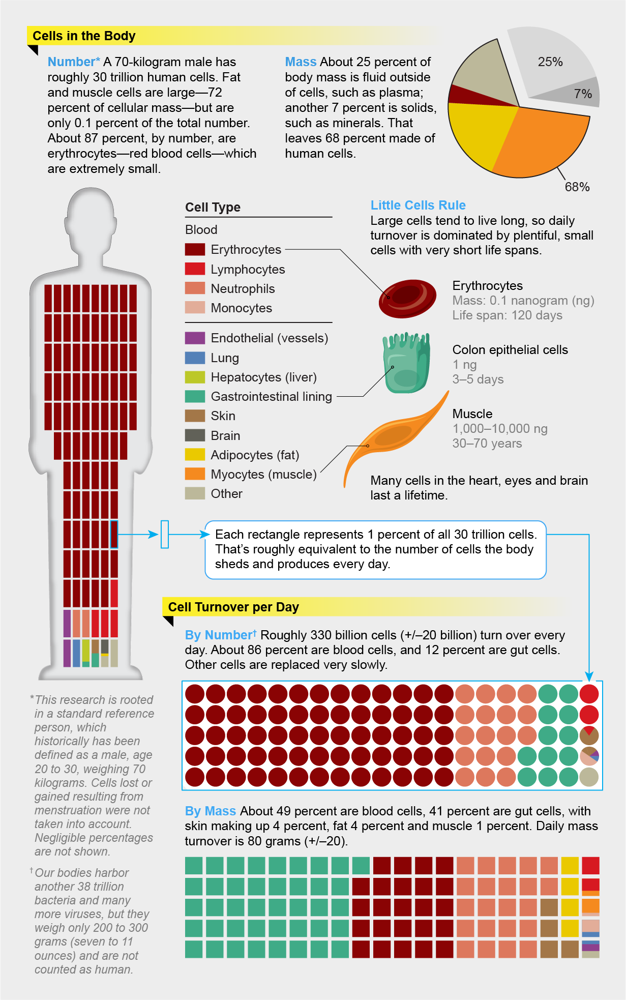

= 0055 Our Bodies Replace Billions of Cells Every Day
我们的身体每天更换数十亿个细胞
:toc: left
:toclevels: 3
:sectnums:

'''

== Our Bodies Replace Billions of Cells Every Day
我们的身体每天更换数十亿个细胞

The human body replaces its own cells regularly. Scientists at the Weizmann Institute of Science in Rehovot, Israel, have finally *pinned down* 按住；使动弹不得;确切说明（或理解） the speed and extent 程度；限度,大小；面积；范围 of this “turnover 人事变更率；人员调整率.”

About *a third* of our body mass /is fluid outside of our cells, such as plasma 血浆, plus solids, such as the calcium 钙 scaffolding 脚手架（组） of bones.

The remaining two thirds *is made up of* roughly 30 trillion 万亿；兆 human cells. About 72 percent of those, by mass, are fat and muscle, which last (v.)持续；继续；延续 an average of 12 to 50 years, respectively. But we have far more, tiny cells in our blood, which live only three to 120 days, and lining (v.)（在某物的内部）形成一层,（身体器官内壁的）膜 our gut 消化道；肠道, which typically live (v.) less than a week. Those two groups therefore *make up* the giant majority of the turnover.

About 330 billion cells are replaced daily, equivalent to about 1 percent of all our cells. In 80 to 100 days, 30 trillion will have replenished 补充；重新装满 — the equivalent of a new you.

[.my1]
.标题
====
.pin
(v.)（用大头钉等）固定，别上，钉住

.pin sb down
(1) to make sb unable to move by holding them firmly 按住；使动弹不得 +
Two men pinned him down until the police arrived. 两个人按住他直到警察赶来。 +

(2) to find sb and make them answer a question or tell you sth you need to know 找某人查问；使说清楚 +
I need the up-to-date sales figures but I can never pin him down at the office. 我需要最新的销售数字，可就是不能在办公室找到他问清楚。

.scaffolding
[ U] poles and boards that are joined together to make a structure for workers to stand on when they are working high up on the outside wall of a building 脚手架（组）；鹰架

image:../../img/scaffolding.jpg[,150px]

.trillion
1 000 000 000 000; one million million 万亿；兆

人体定期更换自己的细胞。以色列雷霍沃特魏茨曼科学研究所的科学家们终于确定了这种“转变”的速度和范围。我们体重的大约三分之一是细胞外的液体，例如血浆，加上固体，例如骨骼的钙支架。**剩下的三分之二由大约 30 万亿个人类细胞组成。**按质量计算，其中约 72% 是脂肪和肌肉，它们的平均寿命分别为 12 至 50 年。但是我们的血液中有更多的微小细胞，它们只能存活 3 到 120 天，而肠道内壁的细胞通常存活不到一周。因此，这两个群体构成了营业额的绝大部分。*每天大约有 3300 亿个细胞被更换，相当于我们所有细胞的大约 1%。在 80 到 100 天内，将补充 30 万亿——相当于一个新的你。*
====

'''

== Our Bodies Replace Billions of Cells Every Day

The human body replaces its own cells regularly. Scientists at the Weizmann Institute of Science in Rehovot, Israel, have finally pinned down the speed and extent of this “turnover.” About a third of our body mass is fluid outside of our cells, such as plasma, plus solids, such as the calcium scaffolding of bones. The remaining two thirds is made up of roughly 30 trillion human cells. About 72 percent of those, by mass, are fat and muscle, which last an average of 12 to 50 years, respectively. But we have far more, tiny cells in our blood, which live only three to 120 days, and lining our gut, which typically live less than a week. Those two groups therefore make up the giant majority of the turnover. About 330 billion cells are replaced daily, equivalent to about 1 percent of all our cells. In 80 to 100 days, 30 trillion will have replenished—the equivalent of a new you.

