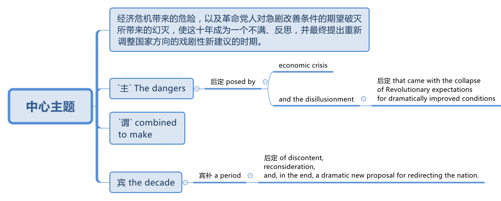
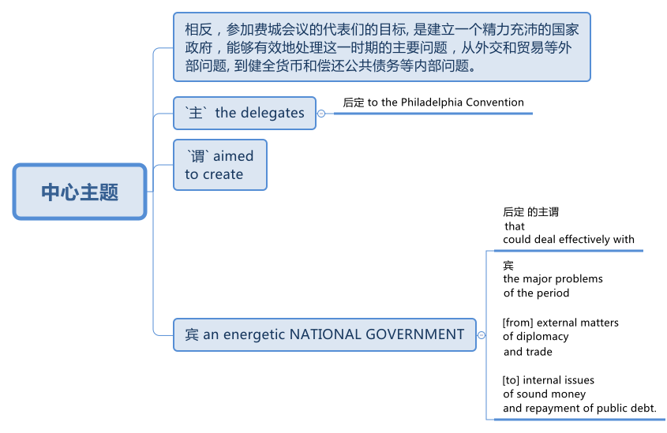
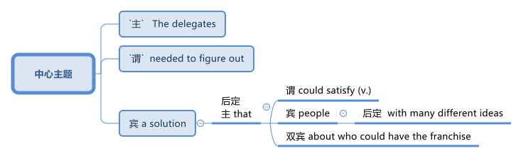

=  005 美国宪法的制定过程
:toc: left
:toclevels: 3
:sectnums:
:stylesheet: myAdocCss.css

'''

==  (解说) 美国宪法的制定过程

=== "如何制定宪法, 及宪法内容应该怎样"的各州实验

The states now *faced* serious and complicated questions /about how to make their rules. +
*What did it mean* /*to replace* (v.) royal authority *with* institutions *based on* popular rule? How was "POPULAR SOVEREIGNTY" 主权；最高统治权；最高权威 (the idea /that the people were the highest authority) *to be institutionalized* (v.)使成惯例；使制度化 in the new state governments? For that matter 就此而言；至于那个；说到那一点, who were "the people"?

[.my2]
各州现在面临着"如何制定规则"的严重而复杂的问题。用"基于民众统治的机构, 取代王权"意味着什么？ “人民主权”（人民是最高权力的观念）如何在新的州政府中被制度化？就此而言，谁是“人民”？

Every state *chose /to answer* these questions *in different ways* /*based on* distinctive 独特的；特别的；有特色的 local experiences, but *in most cases* colonial traditions *were continued*, but *modified*, *so that* the GOVERNOR (the executive （政府的）行政部门) lost significant power, while the ASSEMBLIES (the legislative branch, which *represented* the people *most directly*) became much more important. +
We'll *focus on* the new rules /created in three states /*to suggest* the range of answers to the question /about how to organize republican governments *based upon* popular rule.

[.my2]
每个州, 都根据当地独特的经验, 选择以不同的方式回答这些问题，但在大多数情况下，殖民传统得到延续，但有所修改，因此总督（行政部门）失去了重要权力，而议会（立法部门，代表最直接的人）变得更加重要。我们将重点关注三个州制定的新规则，以对"如何根据民众统治, 来组织共和政府"的问题, 提出一系列答案。

=====  Pennsylvania 州宪法

Pennsylvania *created* the most radical state constitution of the period. +
Following the idea of *popular rule* to its *logical conclusion*, Pennsylvania *created* a state government *with several distinctive features*. +
First, `主` the PENNSYLVANIA CONSTITUTION OF 1776 `谓` *abolished* PROPERTY REQUIREMENTS for *voting* /#as well as# for *holding office*. +
If you were an adult man /who paid taxes, then you *were allowed* /*to vote* (v.) or even *to run for* 竞选 office. +
This was *a dramatic expansion* of *who was considered a political person*, but `主` *other aspects of* the new state government `系` *were* even more radical. +
Pennsylvania also became *a "UNICAMERAL" 一院制的 government* /where the legislature *only had one body*. +
Furthermore, the office of the governor *was entirely eliminated* 根除. +
Radicals in Pennsylvania *observed 看到；注意到；观察到 #that#* /the governor *was really just like* a small-scale king /and #that# `主` *an upper legislative body* (like *the House of Lords* （英国）上议院，贵族院 in Parliament) `谓` *was supposed* （根据所知）认为，推断，料想 /*to represent* wealthy men and aristocrats. +
*Rather than* continue (v.) those forms of government, the Pennsylvania constitution *decided that* /`主` "the people" `谓` *could rule (v.) most effectively* 方式状 *through* a single body 后定 with complete *legislative power*.

[.my2]
宾夕法尼亚州制定了当时最激进的州宪法。遵循"人民统治"的理念及其逻辑结论，宾夕法尼亚州创建了一个具有几个鲜明特征的州政府。首先，1776 年《宾夕法尼亚州宪法》废除了"投票"和"担任公职"所需的财产要求。如果你是一个纳税的成年男子，那么你就可以投票，甚至可以竞选公职。这是对政治人物的大幅扩展，但新州政府的其他方面甚至更加激进。宾夕法尼亚州也成为“一院制”政府，立法机关只有一个机构。此外，总督的职位被完全取消。宾夕法尼亚州的激进分子认为，州长实际上就像一个小规模的国王，上层立法机构（如议会上议院）应该代表富人和贵族。宾夕法尼亚州宪法没有继续这些形式的政府，而是决定“人民”可以通过一个拥有完全立法权的单一机构, 最有效地进行统治。

Many conservative Patriots *met* (v.) Pennsylvania's new design *with horror* 震惊；恐惧；厌恶. +
When John Adams *described* the Pennsylvania constitution, he only *had bad things to say*. +
To him /it was "#so# democratical 平等的，有民主精神的；民主政体的 #that# it must *produce* (v.) confusion and every evil work." Clearly, popular rule *did not mean* sweeping (v.) democratic changes to all Patriots.

[.my2]
许多保守的爱国者, 对宾夕法尼亚州的新设计感到恐惧。当约翰·亚当斯描述宾夕法尼亚州宪法时，他只说了一些坏话。对他来说，它“是如此民主，以至于必然会产生混乱和各种邪恶的行为”。显然，"民众统治"并不意味着对所有爱国者进行彻底的民主变革。

===== SOUTH CAROLINA'S STATE 宪法

SOUTH CAROLINA'S STATE CONSTITUTION of 1778 *created new rules* /*at the opposite end of* the political spectrum /*from* Pennsylvania. +
In South Carolina, white men *had to possess* a significant amount of property /*to vote*, and they *had to own* even more property /*to be allowed* /*to run for* political office. +
In fact, these property requirements *were #so# high* /#that# 90 percent of all white adults *were prevented* /from *running for* political office!

[.my2]
南卡罗来纳州 1778 年的州宪法, 制定了与宾夕法尼亚州政治光谱相反的新规则。在南卡罗来纳州，白人必须拥有大量财产才能投票，而且他们必须拥有更多财产, 才能竞选政治职位。事实上，这些财产要求是如此之高，以至于 90% 的白人成年人都无法竞选政治职位！

`主` This dramatic limitation /of *who could be* an elected political leader /`谓` *reflected* a central tradition of 18th-century Anglo-American political thought. +
Only `主` individuals /who were financially independent /`谓` *were believed to have* the self-control /*to make* responsible and reasonable judgments *about* public matters. +
*As a result* /`主` poor white men, all women, children, and African Americans (*whether* free *or* slave) /`谓` *were considered* #too# dependent (a.) on others /*#to# exercise* reliable political judgment. +
While `主` most of these traditional *exclusions from political participation* /`谓` *have been ended* in America today, age limitations *remain*, *largely unchallenged* (a.)无人反对的；稳固的;不被怀疑的；完全接受的；没有异议的.

[.my2]
这种对当选政治领导人的严格限制, 反映了 18 世纪, 英美政治思想的核心传统。只有经济独立的个人, 才被认为具有自我控制能力，能够对公共事务做出负责任和合理的判断。结果，贫穷的白人、所有妇女、儿童和非裔美国人（无论是自由人还是奴隶）, 被认为过于依赖他人，无法做出可靠的政治判断。虽然当今美国大多数传统的政治参与排除已经结束，但年龄限制仍然存在，基本上没有受到挑战。

===== MASSACHUSETTS 州宪法

`主` The creation of the MASSACHUSETTS STATE CONSTITUTION of 1780 /`谓` *offered* yet another way /*to answer* (v.) some of the questions /about *the role of "the people"* /*in* creating a republican government. +
When the state legislature *presented* the voters 选民 *with* a proposed 被提议的，建议的 constitution in 1778, it *was rejected* /because the people *thought (v.) that* /this was *#too# important an issue* for the government /*#to# present to* the people. +
If the government *could make its own rules*, then *it could change them* /whenever 在任何…的时候；无论何时；在任何…的情况下 it wanted /and *easily take away* peoples' liberties. +
*Following through on* this logic, Massachusetts *held a special convention* （某职业、政党等成员的）大会，集会 /in 1780 /where `主` specially elected (a.) representatives `谓` *met (v.) /to decide on* the best framework *for* the new state government.

[.my2]
1780 年, 马萨诸塞州宪法的制定, 提供了另一种方式, 来回答有关“人民”在创建共和政府中的作用的一些问题。 1778年，当"州立法机关"向选民提交宪法草案时，该宪法被拒绝，因为人们认为, 这个问题太重要，不能由政府自己来起草, 向人民提出。如果政府可以制定自己的规则，那么它就可以随时改变它们，并轻易地剥夺人们的自由。遵循这一逻辑，马萨诸塞州于 1780 年召开了一次特别大会，特选出代表来开会, 由代表来决定新州政府的最佳框架。

`主` This idea of *a special convention* of the people /*to decide* important constitutional issues /`系` was part of *#a new way#* of thinking about *popular rule* 民众的统治 /#that# would *play a central role /in* the ratification 批准，认可 of *the national Constitution* in 1787-1788.

[.my2]
这种"由人民召开特别会议, 来决定重要宪法问题"的想法, 是一种关于"人民统治"的新思维方式的一部分，这种思维方式, 在 1787-1788 年国家宪法的批准中, 发挥了核心作用。

'''

=== 邦联章程

While the state constitutions *were being created*, the Continental Congress *continued /to meet* [as a general political body]. +
Despite *being* the central government, it was a loose confederation 联盟；联合体 /and `主` most significant power `谓` *was held* by the individual states. +
By 1777 /members of Congress *realized that* /they *should have* some clearly written rules /*for* how they were organized. +
As a result /the ARTICLES OF CONFEDERATION 邦联条例(美国宪法的前身) *were drafted and passed* by the Congress /in November.

[.my2]
在制定各州宪法的同时，大陆会议继续作为一个总体政治机构, 举行会议。尽管是中央政府，但它是一个松散的联邦，最重要的权力由各个州掌握。到 1777 年，国会议员意识到, 他们应该有一些明确的书面规则, 来规定他们的组织方式。结果，联邦条款于 11 月由国会起草, 并通过。

`主` This first national "constitution" /for the United States /`系` *was not particularly innovative* (a.)引进新思想的；采用新方法的；革新的；创新的, and mostly *put into written form* 书面形式 /how the Congress *had operated* since 1775.

[.my2]
美国的第一部国家“宪法”, 并没有什么特别的创新，主要是以书面形式记录了自1775年以来, 国会的运作方式。

[.my1]
.title
====
.put into written form
-  to put the details into a written form. 将细节以"书面形式"加以保存
- It’s hard *to put into written form* what I want to say about this book.
====

*Even though* `主` the Articles `系` *were rather modest* in their proposals, they *would not be ratified* by all the states /until 1781. +
Even this was accomplished largely because the dangers of war demanded greater cooperation.

[.my2]
尽管这些条款的建议相当温和，但直到 1781 年才得到所有州的批准。即便如此，很大程度上还是因为战争的危险需要加强合作。

*The purpose* of the central government *was clearly stated* in the Articles. +
The Congress *had control over* diplomacy, printing money, *resolving controversies* between different states, and, most importantly, *coordinating 使(v.)协调；使相配合 the war effort*. +
*The most important action* of the Continental Congress /*was* probably the creation (n.)创造；创建 and maintenance of the Continental Army. +
Even *in this area*, however, the central government's power *was quite limited*. +
While Congress *could call on* states /*to contribute* specific resources and numbers of men /*for* the army, it *was not allowed* /*to force* states /*to obey* the central government's request for aid.

[.my2]
中央政府的宗旨在《章程》中有明确规定。国会控制着外交、印钞、解决不同州之间的争议，最重要的是协调战争努力。大陆会议最重要的行动, 可能是"建立和维持大陆军"。然而，即使在这个领域，中央政府的权力也相当有限。虽然"国会"可以呼吁各州为军队提供特定的资源和人员数量，但不允许强迫各州服从中央政府的援助请求。

The organization of CONGRESS itself /`谓` *demonstrates* the primacy 首要；至高无上 of state power. +
Each state *had* one vote. +
Nine out of thirteen states *had to support a law* /for it *to be enacted*. +
Furthermore, any changes to the Articles themselves *would require* unanimous (决定或意见）一致的，一致同意的 agreement. +
In the ONE-STATE, ONE-VOTE RULE, state sovereignty *was given a primary place* /even *within* the national government. +
Furthermore, `主` the whole national government `谓` *consisted entirely of* the unicameral 一院制的 (one body) Congress /*with* no executive and no judicial organizations.

[.my2]
国会的组织本身, 就体现了"州权力"的首要地位。每个州有一票。十三个州中要获得九个州的支持后, 一项法律才能被颁布。此外，对条款本身的任何修改, 都需要一致同意。在"一州一票"规则下，即使在联邦政府内部，"州主权"也被赋予首要地位。此外，整个国家政府完全由"一院制国会"组成，没有行政机构和司法机构。

`主` The national Congress' limited power `系` *was especially clear* /when it *came to* money issues. +
Not surprisingly, *given that* 考虑到，鉴于 the Revolution's causes *had centered on* opposition to unfair taxes, the central government *had no power* /*to raise* its own revenues 财政收入；税收收入；收益 /*through* taxation. +
All it could do *was* request (v.) that /the states give it the money /necessary *to run the government* /and *wage (v.)开始，发动，进行，继续（战争、战斗等） the war*. +
By 1780, with `主` the outcome 结果；效果 of the war `谓` *still very much undecided*, `主` the central government `谓`  *had run out of money* and *was BANKRUPT*! As a result /`主` the paper money 后定 it issued `系` was basically worthless.

[.my2]
在金钱问题上，国会的有限权力尤其明显。毫不奇怪，鉴于革命的原因集中在源于"反对不公平的税收"上，中央政府无权通过税收, 来增加自己的收入。它所能做的, 就是请求各州为其提供管理政府和发动战争所需的资金。到了1780年，独立战争的结果仍然悬而未决，中央政府已经没钱了，破产了！结果，它发行的纸币基本上毫无价值。

`主` ROBERT MORRIS, who became *the Congress' superintendent 主管人；负责人；监管人；监督人 of finance* in 1781, `谓` *forged* (v.)艰苦干成；努力加强;锻造 a solution *to* this dire (a.)极其严重的；危急的 dilemma （进退两难的）窘境，困境. +
Morris *expanded* existing government power /and *secured* (v.)（尤指经过努力）获得，取得，实现 special privileges *for* the BANK OF NORTH AMERICA /*in an attempt /to stabilize (v.) the value of* the paper money /issued by the Congress. +
His actions *went beyond* the limited powers /*granted to* the national government /by the Articles of Confederation, but he *succeeded in* limiting (v.) runaway (a.)失控的 INFLATION /and *resurrecting (v.)起死回生；使复活 the fiscal stability* of the national government.

[.my2]
1781 年成为国会财务总监的罗伯特·莫里斯 (ROBERT MORRIS) , 为这一可怕的困境, 找到了解决方案。莫里斯扩大了现有的政府权力，并为"北美银行"争取了特权，试图稳定国会发行的纸币的价值。他的行动超出了《邦联条例》赋予中央政府的有限权力，但他成功地限制了失控的通货膨胀, 并恢复了中央政府的财政稳定。

*The central failure* of the Congress *was related to* its limited FISCAL POWER. +
Because it could not *impose* taxes *on* the states, `主` the national government's authority and effectiveness `系` *was severely limited*. +
*Given* this major encumbrance 妨碍者；累赘；障碍物, the accomplishments 成就；成绩 of the Congress *were quite impressive*. +
First of all, it *raised* the Continental Army, kept it in the field, and *managed to finance* (v.) the war effort 气力；努力；费力的事.

[.my2]
国会的主要失败, 与其"有限的财政权力"有关。由于不能向各州征税，中央政府的权威和效力, 受到严重限制。鉴于这一重大障碍，大会的成就是相当令人印象深刻的。首先，它组建了大陆军，将其留在战场上，并设法为战争提供资金。

While *granted* the western lands *from* the British, `主` actual ownership of this land /and how *to best settle* (v.) it /`系` was enormously controversial 有争议的，引发争论的. +
Although states *had ceded* (v.)割让；让给；转让 their own claim to western land *to* the national government /作为...的一部分 *as part of* their ratification
批准，认可 of *the Articles of Confederation* 联邦条例, this *threatened (v.) to reemerge* (v.)再度出现 as a postwar problem. +
Many Americans *had ignored legal restrictions* 后定 on western settlement /and simply *struck out （奋力朝某处）去；赶往（某处） for* new land /that they *claimed* [as their own] /by *right of occupation*. +
`主` *How could* a national Congress 后定 with limited financial resources /and no coercive (a.)用武力的；强制的；胁迫的 power /`谓` *deal with* this complex problem?

[.my2]
尽管英国授予了西部土地，但这片土地的实际所有权以, 及如何最好地解决它, 却存在巨大争议。尽管作为"各州认可《邦联条例》"的一部分，各州已将自己对西部土地的所有权, 割让给联邦政府，但这有可能再次成为战后的问题。许多美国人无视对西部定居的法律限制，只是简单地寻找新土地，并通过占领权, 声称自己拥有这些土地。一个财政资源有限、没有强制力的国会, 该如何处理这个复杂的问题呢？

[.my1]
.title
====
.strike ˈout (at sb/sth)
(1) to aim a sudden violent blow at sb/sth挥拳猛击；猛打

.strike ˈout (for/towards sth)
to move in a determined way (towards sth)（奋力朝某处）去；赶往（某处） +
- He struck out (= started swimming) towards the shore.他朝岸边游去。
====

The Congressional solution *was* a remarkable act of statesmanship 政治才能；治国才干 /that *tackled (v.)应付，解决（难题或局面） several problems* /and *did so* in a fair manner. +
The Congress *succeeded in* asserting (v.)主张，声明；断言 its ownership of the western lands /and *used* (v.) the profits from their sale /*to pay* the enormous expenses 费用；价钱;花钱的东西；开销 /后定 *associated with* settlement (construction of roads, military protection, etc.). +
Second, the Congress *established* a process *for* future states 后定 in this new area /*to join* the Confederation /on terms （协议、合同等的）条件，条款 *fully equal to* the original thirteen members. +
The new states *would be SOVEREIGN* 有主权的；完全独立的;掌握全部权力的；有至高无上的权力的 /and *not suffer* (v.)遭受；蒙受 secondary colonial status.

[.my2]
国会的解决方案是一项非凡的政治家之举，它以公平的方式解决了几个问题。国会成功地维护了其对西部土地的所有权，并利用出售这些土地所得的利润, 来支付与定居相关的巨额费用(修建道路、军事保护等)。
其次，国会为这一新地区未来的州, 建立了一个程序，以与最初的13个成员完全平等的条件, 加入联邦。
新的州将是主权州，而不是二级殖民地。

By *forbidding (v.) slavery* in the Northwest /*as* an inappropriate 不适当的；不合适的 institution （由来已久的）风俗习惯，制度 /for the future of the United States, `主` the Congress' achievements `谓`  *should be considered* quite honorable. +
At the same time, however, there were people /whose rights *were infringed (v.)侵犯，侵害（合法权益） upon* by this same western policy. +
`主` The control of land settlement /by the central government /`谓` *favored* wealthy large-scale land developers /*over* small-scale family farmers of ordinary means.

[.my2]
国会的西部政策, 将一些常常被忽视的最高革命理想, 付诸实践。通过禁止"西北地区的奴隶制"，认为这是对美国未来不合适的制度，国会的成就应该被认为是相当光荣的。但与此同时，也有人的权利受到同样的西方政策的侵犯。中央政府对土地安置的控制, 有利于富裕的大型土地开发商，而不是普通的小规模家庭农民。

[.my1]
.title
====
.infringe
(v.) *~ (on/upon) sth* : to limit sb's legal rights侵犯，侵害（合法权益）
====

Like *the contradictory 相互矛盾的；对立的；不一致的 elements* of the Revolution, `主` the record of first national government `谓` *includes achievements and failures*, and these two qualities *often could be found intertwined* (v.)（使）缠结，缠绕在一起 *within* the very same issue.

[.my2]
就像革命中的矛盾因素一样，第一届国民政府的记录包括成就和失败，而这两种品质常常在同一个问题中交织在一起。

'''

=== 战后经济问题

`主` The economic problems *faced* by the Congress `谓` *deeply touched* the lives of most Americans in the 1780s. +
The war *had disrupted* much of the American economy. +
On the *high seas* 公海 /the BRITISH NAVY *had great superiority* and *destroyed* most American ships, *crippling* (v.)使残废；使跛；使成瘸子;严重毁坏（或损害） the flow of trade. +
On land, where both armies *regularly stole* from local farms /in order to *find (v.) food*, `主` farmers `谓` *suffered tremendously* 非常地；可怕地；惊人地.

[.my2]
国会面临的经济问题, 深深触动了1780年代大多数美国人的生活。战争扰乱了美国经济的大部分。在公海，英国海军拥有巨大优势，摧毁了大部分美国船只，严重削弱了贸易流通。在陆地上，两军经常从当地农场偷窃以寻找食物，农民遭受了巨大痛苦。

When the fighting *came to an end* in 1781, the economy *was in a shambles* 混乱局面；无序的场面；凌乱不堪；一片狼藉. +
Exports to Britain *were restricted*. +
Further, British law *prohibited trade with* Britain's remaining SUGAR COLONIES in the Caribbean 加勒比地区. +
Thus, two *major sources* of colonial-era commerce *were eliminated* (v.)排除；清除；消除. +
`主` *A flood 大批，大量（的人或事物） of* cheap British manufactured (a.)制造的，已制成的 #imports# (n.) /that *sold cheaper than* comparable 类似的；可比较的 American-made goods /`谓` *#made#* the post-war economic slump (n.v.)（价格、价值、数量等）骤降，猛跌，锐减 *worse* (a.). +
Finally, `主` the high level of #debt# 后定 *taken on* 承担 by the states /to fund (v.) the war effort /`谓` *#added to#* the ECONOMIC CRISIS /by *helping to fuel* (v.) rapid inflation.

[.my2]
1781 年战争结束时，经济陷入混乱。对英国的出口受到限制。此外，英国法律禁止与英国在加勒比地区剩余的蔗糖殖民地进行贸易。因此，殖民时代商业的两个主要来源被消除了。大量廉价的英国制造进口商品的售价, 比美国制造的同类商品更便宜，这使得战后的经济衰退更加严重。最后，各国为战争提供资金而承担的高额债务, 助长了快速的通货膨胀，从而加剧了经济危机。

Most state legislatures *passed (v.) laws* /*to help* ordinary farmers *deal with* their high level of debt. +
Repayment 归还借款；偿还债务 terms 期；期限；任期 *were extended* /and imprisonment 监禁，关押 for debt *was somewhat relaxed*.

[.my2]
大多数州立法机构, 都通过了法律, 来帮助普通农民应对高额债务。还款期限得到延长，债务监禁也有所放松。

However, `主` the *range of* 一系列 favorable #debtor laws# /后定 *passed by* the state legislatures in the 1780s /`谓` *#outraged#* (v.)使震怒；激怒 those /who *expected to be paid* by debtors, *as well as* 和，以及 political conservatives 保守党，保守派. +
`主` #Political controversy# (n.)（公开的）争论，辩论，论战 /about *what represented* (v.) the proper economic policy /`谓` #*mounted* (v.)逐步增加 and *approached*# (v.)（在距离或时间上）靠近，接近 the boiling point 沸点;（某种状态的）爆发点. +
*As* James Madison of Virginia *noted*, the political struggles *were primarily* #between# "the class with, #and# [the] class without, property."  +
Just *as* the republican governments *had come into being* (存在；生存;)产生,出现 /and *rethought (v.)重新考虑 the meaning of* popular government 民主政府, `主` economic crisis `谓` *threatened* (v.) their future.

[.my2]
然而，在18世纪80年代，州立法机构通过的一系列有利于债务人的法律, 激怒了那些期望由债务人支付的人(即激怒了债权人)，以及政治保守派。关于什么是正确的经济政策的政治争论, 愈演愈烈，并接近沸点。正如弗吉尼亚的詹姆斯·麦迪逊所指出的，政治斗争主要发生在“拥有财产的阶级, 和没有财产的阶级”之间。正当共和政府初具雏形, 并重新思考人民政府的意义时，经济危机威胁着他们的未来。

[.my1]
.title
====
.to *come into being*
产生, 出现,形成
====

'''

=== 起草宪法

The 1780s *has often been termed* (v.)把…称为；把…叫做 the "CRITICAL PERIOD 一段时间；时期" for the new nation. +
`主` #The dangers# /后定 posed (v.) by economic crisis /and the disillusionment (n.)不再抱幻想；幻想破灭；醒悟 /that *came with* the collapse of Revolutionary expectations 期望；预期；期望值 /for *dramatically 剧烈地，明显地 #improved#* conditions / `谓` *combined to make* the decade 十年，十年期 a period of discontent 不满，不满足, reconsideration 再议；再考虑；再审查, and, in the end, *a dramatic 突然的；巨大的；令人吃惊的 new proposal* 提议；建议；动议 for *redirecting (v.)重新定向 the nation*. +
Just as the Revolution had been born of diverse and sometimes conflicting perspectives, even among the Patriots, so too, ideas about the future of the United States in the 1780s were often cast in dramatic opposition to one another.

[.my2]
1780 年代通常被称为新国家的“关键时期”。经济危机带来的危险，以及革命者对"条件大幅改善的期望破灭"带来的幻灭，使这十年成为不满、重新考虑的时期，并最终提出了一个戏剧性的新建议, 来重新调整国家的方向。正如革命诞生于"不同且有时相互冲突的观点"一样，即使在爱国者中也是如此，关于1780年代美国未来的想法, 也经常以戏剧性的"对立"方式出现。

[.my1]
.title
====
这句的主干是: 危险和幻灭, 使这十年成为一个...的时期.

====

The new plan for the nation /*was called* the FEDERAL CONSTITUTION. +
It *had been drafted* /by a group of national leaders in Philadelphia /in 1787, who then *presented* it *to* the general public 普通百姓；公众 for consideration. +
`主` The Constitution `谓` ① *amounted to* 总计；共计;等于；相当于 a whole new set of rules /后定 for *organizing* (v.) national government /② and *indicates* (v.)表明；显示 the intensity 强度；烈度;强烈；紧张；剧烈 of *political thought* in the era /*as well as* 和，以及，还有 how much *had changed* since 1776. +
`主` The proposed national framework `谓` *called for* a strong central government /that *would have authority* over the states. +
At the same time, the proposed Constitution *also centrally #involved#* the people /*#in#* deciding (v.) whether or not *to accept* (v.) the new plan [*through* a process 后定 *called* RATIFICATION 批准，认可].

[.my2]
国家的新计划被称为联邦宪法。它是由费城的一群国家领导人于 1787 年起草的，然后他们将其提交给公众审议。宪法相当于一套全新的组织国家政府的规则，表明了那个时代政治思想的强度, 以及自1776年以来发生了多大的变化。拟议的国家框架, 要求建立一个强大的中央政府，对各州拥有权力。同时，拟议的宪法, 还集中让人民通过一个称为“批准”的程序, 来决定是否接受新计划。

Many *were* strong nationalists 国家主义者 /who *thought* (v.) the Articles of Confederation *gave* too much power *to* the states /and *were especially concerned about* state governments' vulnerability 易损性，弱点 to powerful local interests. +
Instead, the delegates 代表 to the Philadelphia Convention *aimed /to create* an energetic NATIONAL GOVERNMENT /that *could deal effectively with* the major problems of the period /*#from#* *external 外部的；外面的 matters* of diplomacy and trade /*#to#* *internal issues* of *sound (a.)完好的；健康的；无损伤的；未受伤的 money* 稳定的货币 and *repayment of public debt*.

[.my2]
许多人是坚定的民族主义者，他们认为《邦联条例》赋予各州太多权力，并特别担心州政府容易受到强大地方利益的影响。相反，费城会议的代表们, 旨在建立一个充满活力的国家政府，能够有效地处理这一时期的主要问题，从"外交"和"贸易"的"外部问题", 到"稳健的货币"和"偿还公共债务"的"内部问题"。

[.my1]
.title
====

====

*In spite of* the common vision and status /that *linked* (v.)most of the delegates *to* the Philadelphia Convention, `主` no obvious route `谓` *existed* (v.) /for how to *revise* (v.)改变，修改（意见或计划） the Articles of Confederation /*to build* a stronger central government.

[.my2]
尽管大多数代表与费城会议有着共同的愿景和地位，但对于如何修改《邦联条例》以建立一个更强大的中央政府，并不存在明显的途径。

The meeting began /by deciding several important procedural 程序上的 issues /that were not controversial 有争议的，引发争论的 /and that significantly shaped /how the Convention operated. +
First, George Washington *was elected /as* the presiding 首席的;主持（会议等）；担任（会议）主席；负责 officer. +
They also decided /to continue the voting precedent 前例；先例 /followed by the Congress /where each state *got one vote*.

[.my2]
会议首先决定了几个重要的程序问题，这些问题没有争议，对《公约》的运作方式产生了重大影响。首先，乔治·华盛顿当选为主持人。他们还决定继续国会遵循的投票先例，每个州都有一票。

They also *agreed /to hold* their meeting *in secret*.

[.my2]
他们还同意秘密举行会议。

There *would be* no public *access (n.) to* the Convention's discussions /and the delegates *agreed /not to discuss* matters *with* the PRESS. +
The delegates *felt that* /`主` secrecy 面秘密，保密 `谓` would *allow* them *to explore* issues [with greater honesty] /#than# would *be possible* /if `主` everything 后定 that they said `谓` *became* public knowledge.

[.my2]
公众无法参与《公约》的讨论，代表们同意不与新闻界讨论问题。代表们认为，保密将使他们能够更诚实地探讨问题，而不是他们所说的一切都成为公众知识。

In fact, the public *knew almost nothing about* the actual proceedings of the Convention /until `主` James Madison's notes (n.) about it `谓` *were published* /after his death in the 1840s.

[.my2]
事实上，在詹姆斯·麦迪逊（James Madison）于1840年代去世后发表关于该公约的笔记之前，公众对《公约》的实际程序几乎一无所知。

The delegates also `谓` *made* a final crucial and sweeping early *decision* /about how to run the Convention （某职业、政党等成员的）大会，集会. +
They *agreed /to go beyond* the instructions of the Congress /by #not# merely *considering* (v.) revisions (n.)修改; 修正 to the Articles of Confederation, #but# *to try and construct* (v.) a whole new national framework.

[.my2]
代表们还就"如何举办大会", 做出了最后的关键和全面的早期决定。他们同意超越国会的指示，不仅考虑修改《邦联条例》，而且尝试构建一个全新的国家框架。

After still more deeply divided 分裂的，有分歧的 argument, a proposal *put forward* by delegates from Connecticut (a small population state ), *struck (v.)撞击；碰撞 a compromise* 后定 that *narrowly got approved*. +
They *suggested that* /representatives 后定 in each house of the proposed bicameral legislature *be selected through* different means. +
The UPPER HOUSE (or SENATE) *would reflect* the importance of state sovereignty /by *including* two people from each state /*regardless of* size. +
Meanwhile, the LOWER HOUSE (the HOUSE OF REPRESENTATIVES) *would have* different numbers of representatives from each state /后定 *determined by* population. +
Representation *would be adjusted* every ten years /*through* a federal census （官方的）统计；人口普查；人口调查 /that *counted* every person in the country.

[.my2]
在更深刻的争论之后，康涅狄格州（一个人口较少的州）的代表, 提出的一项提案达成了妥协，以微弱优势获得批准。他们建议, 通过不同的方式选出拟议的"两院制立法机构"两院的代表。上议院（或参议院）将通过包括"来自每个州的两个人", 来反映国家主权的重要性，无论大小。同时，下议院（众议院）将有不同数量的代表，每个州的代表人数由人口决定。代表性将每十年通过一次联邦人口普查进行调整，该人口普查将计算该国的每个人。

By *coming up with* 想出，提出 a mixed solution /that *balanced* (v.) state sovereignty *and* popular sovereignty 后定 *tied to* actual population, the Constitution *was forged* 锻造；制作 /状 *through* what *is known as* the CONNECTICUT COMPROMISE. +
In many respects /this compromise *reflected* a victory for small states, but *compared with* their dominance in the Congress *under* the Articles of Confederation /*it is clear that* negotiation produced (v.) something /that #both# small #and# large states *wanted*.

[.my2]
通过提出一个平衡"州主权"和与"实际人口"相关的"人民主权的混合解决方案"，宪法是通过所谓的"康涅狄格州妥协"而形成的。在许多方面，这种妥协反映了小州的胜利，但与它们在《邦联条例》下在国会中的主导地位相比，很明显，谈判产生了小州和大州都想要的东西。

Other major issues *still needed to be resolved*, however, and, once again, compromise 折中，妥协 *was required* on all sides. +
One of the major issues *concerned* elections themselves. +
Who *would be allowed* to vote (v.)? The different state constitutions *had created* different rules /*about* how much property *was required* /for white men to vote (v.). +
The delegates *needed to figure out* a solution /that *could #satisfy#* (v.)使满意；使满足 people 后定 *with* many different ideas /#about# who *could have* the franchise （公民）选举权 (that is, who *could be* a voter).

[.my2]
然而，其他重大问题仍然需要解决，而且再次需要各方作出妥协。其中一个主要问题涉及选举本身。谁可以投票？不同的州宪法对"白人投票需要多少财产", 制定了不同的规则。代表们需要找到一个解决方案，让有各种不同的想法人们, 对谁可以拥有选举权（即谁可以成为选民）, 都能满意。

[.my1]
.title
====

====

[.my1]
.title
====
.franchise
-> 来自古法语franc, 非奴役的，自由的，来自拉丁语francus, 法兰克人，自由人，词源同Frank. 其原词义即使享有自由权，后引申词义选举权，特许经销权等。
====

For the popular *lower house*, `主` any white man who paid taxes `谓` could vote. +
Thus, even those without property, could *vote (v.) for* who would represent them in the House of Representatives. +
This *expanded (v.) the franchise* （公民）选举权 in some states. +
To balance (v.) this opening 孔；洞；缺口, `主` the two Senators in the upper house of the national government `谓` would *be elected* by the STATE LEGISLATURES. +
Finally, `主` the PRESIDENT (that is, the executive branch) `谓` would *be elected* at the state level /方式状 *through* an ELECTORAL COLLEGE 选举团体 /whose numbers *reflected* representation in the legislature.

[.my2]
对于受欢迎的下议院来说，"任何纳税的白人"都可以投票。因此，即使是那些没有财产的人，也可以投票选出谁将在"众议院"代表他们。这扩大了某些州的"公民选举权"。为了平衡这一空缺，国家政府"上议院"的两名参议员, 将由"州立法机构"选举产生。最后，总统（即行政部门）将通过"选举团"在州一级选举产生，选举团的人数反映了立法机关的代表权。

After *hot summer months* of *difficult debate* in Philadelphia /*from* May *to* September 1787, the delegates *had fashioned (v.)（尤指用手工）制作，使成形，塑造 new rules* /*for* a stronger central government /that *extended* national power *well beyond* the scope of the Articles of Confederation. +
The Constitution *created a national legislature* /that #could# pass (v.) *the supreme law* 最高法律 of the land, #could# *raise taxes*, and *with greater control over* commerce. +
The proposed rules also *would restrict* state actions, especially *in regard to* 关于，就……而言 passing (v.) PRO-DEBTOR 亲债务人 LAWS. +
*At the end of* the long process of *creating the new plan*, `主` thirty-eight of the remaining (a.) forty-one delegates `谓`  *showed their support* /by *signing* the proposed Constitution. +
This small group of national superstars *had created* a major new framework 方式状 *through* hard work and compromise.

[.my2]
1787 年 5 月至 9 月，在费城进行了数月的炎热夏季艰难辩论后，代表们为更强大的中央政府, 制定了新的规则，将国家权力扩展到《邦联条例》的范围之外。宪法建立了一个国家立法机构，可以通过国家的最高法律，可以提高税收，并对商业进行更大的控制。拟议的规则, 还将限制州的行动，特别是在通过支持债务人的法律方面。在制定新计划的漫长过程结束时，剩下的41名代表中有38人, 签署了拟议的宪法，以表示支持。这一小群国家的超级巨星, 通过努力和妥协, 创造了一个重要的新框架。

===  各州议会, 对"是否批准国家宪法草案", 进行的博弈

Now another challenge *lay ahead*. +
Could they *#convince#* (v.)使确信；使相信；使信服;说服，劝说（某人做某事） the people in the states *#that#* this new plan was worth accepting?

[.my2]
现在，另一个挑战摆在面前。他们能说服各州的人民相信, 这个新计划值得接受吗？

A framework /for a new and stronger national government /`谓` had been crafted (v.)（尤指用手工）精心制作 /at the Philadelphia Convention /by *a handful 一把（的量）；用手抓起的数量;少数人（或物） of* leaders. +
But how could their proposed system be made into law?

[.my2]
在费城大会上，少数领导人为一个新的、更强大的国家政府, 制定了一个框架。但是，他们提出的制度, 如何成为法律呢？

Could they *convince* the public *that* /`主` the weak central government of the Articles of Confederation /`谓` needed to be strengthened?  +
The Articles *required #that#* /`主` any changes in constitutional law `谓` be presented to the state legislatures, and #that# `主` any successful alteration 改变；更改；改动 `谓` required unanimous （所有人）一致同意的 approval. +
Since the new proposal `谓` *increased (v.) the power of* the national government /*at the expense of* state sovereignty, *it was a certainty that* /`主` one, and probably several more, state legislatures `谓` would oppose (v.)反对（计划、政策等）；抵制；阻挠 the changes. +
Remember, that Rhode Island *had refused to* even *send a delegate to* the Philadelphia Convention /because it opposed (v.) any stronger revisions 修订，修改（的进行） in the Articles, *much less* 更不用说 the sweeping proposal /that *ended up* 最终成为 being produced there.

[.my2]
他们能否说服公众相信, 《邦联条例》中软弱的中央政府需要加强？这些条款要求对宪法的任何修改, 都必须提交给州立法机构，任何成功的修改, 都需要一致批准。由于新提案, 以牺牲国家主权为代价, 增加了国家政府的权力，因此可以肯定的是，一个，可能还有更多的州立法机构, 会反对这些变化。请记住，罗德岛州甚至拒绝派代表参加费城公约，因为, 它反对对条款进行任何更强有力的修改，更不用说最终在那里提出的全面提案了。

*Aware of* the major challenge before them, `主` the framers 制宪者；筹划者 of the new plan `谓` *crafted* a startling 惊人的；让人震惊的 new approach （待人接物或思考问题的）方式，方法，态度 [*through* a ratifying procedure] /that *went directly to* the people. +
By this method, the Constitution *would become law* /if nine of the thirteen states *approved it* /after *holding (v.)召开；举行；进行 special conventions* 大会，集会 /*to consider* (v.) the issue. +
*Building on* a model /后定 *adopted by* Massachusetts *in* passing its state constitution of 1780, the framers *suggested that* `谓` constitutional law `系` *was* of #such# sweeping significance #that# *it* would be inappropriate *to have it approved* [*though* ordinary political channels].

[.my2]
意识到摆在他们面前的重大挑战，新计划的制定者, 通过直接面向人民的批准程序，制定了一种令人吃惊的新方法。通过这种方法，如果13个州中有9个州, 在举行"特别会议"审议该问题后, 批准了该宪法的话，则该宪法将成为法律。在"马萨诸塞州通过1780年州宪法时采用的模式"的基础上，制定者认为, 宪法具有如此广泛的意义，以至于通过"普通政治渠道"获得批准, 是不合适的。

Instead, special conventions *should be held* for the people /*to evaluate*  (v.)估计；评价；评估such important changes. +
Politicians 政治家，政客 in Congress *were well aware of* the weaknesses of the current central government /and *shared the framers' sense* that the state legislatures *were very likely (a.) to oppose* the new plan, so Congress *approved* the new terms （协议、合同等的）条件，条款 of this unusual, and even illegal, ratification 批准，认可 route 途径；渠道. +
Surprisingly, *so too did* state legislatures /后定 that *began arranging for* the election of special delegates *to* the state ratification conventions.

[.my2]
相反，应该举行"特别大会"，让人民评估这些重要的变化。国会中的政客们很清楚当前中央政府的弱点，并同意制定者的感觉，即, 州立法机构很可能会反对新计划，因此国会批准了这一"不寻常, 甚至非法的"批准途径的新条款。令人惊讶的是，州立法机构也开始安排选举"特别代表", 参加"州批准大会"。

*A great debate* about the future of the nation `系` was about to begin.

[.my2]
一场关于国家未来的大辩, 论即将开始。

`主` *The supporters of* the proposed Constitution `谓` *called themselves* "FEDERALISTS 联邦党人."  +
`主` Their adopted (a.)收养的；领养的 name `谓` *implied a commitment to* a loose, decentralized 分散管理的;使分散；使分权 system of government. +
In many respects /"FEDERALISM" 联邦主义 — which *implies* a strong central government — was *the opposite of* the proposed plan 后定 that they supported. +
`主` A more accurate name *for* the supporters of the Constitution `系` would have been "NATIONALISTS." 民族主义者；国家主义者

[.my2]
拟议宪法的支持者, 称自己为“联邦主义者”。他们采用的名字, 暗示了对松散、分散的政府体系的承诺。在许多方面，“联邦制”——这意味着一个强大的中央政府——与他们支持的拟议计划相反。对于宪法的支持者来说，更准确的名称是, “民族主义者”。

The "nationalist" label, however, *would have been* a political liability 惹麻烦的人（或事）;（法律上对某事物的）责任，义务;欠债；负债；债务 in the 1780s. +
`主` Traditional political belief (n.) of the Revolutionary Era `谓` *held that* / `主` strong centralized authority 权力；威权；当权（地位）  `谓` *would inevitably 不可避免地；必然地 lead to* an abuse of power. +
The Federalists *were also aware that* /`主` that the problems of the country in the 1780s `谓` *stemmed from* the weaknesses of the central government 后定 *created by* the Articles of Confederation.

[.my2]
然而，“民族主义”标签, 在1780年代会成为一种政治负担。革命时期的传统政治信仰认为，强大的中央集权, 将不可避免地导致权力的滥用。联邦党人也意识到，1780年代国家的问题, 源于《邦联条例》造成的中央政府的弱点。

For Federalists, the Constitution *was required* /in order to safeguard (v.) the liberty and independence 后定 that the American Revolution had created. +
While the Federalists *definitely 确切地；明确地；清楚地 had developed* a new political philosophy, they *saw* their most import role *as* defending (v.) the social gains 社会收益 of the Revolution. +
*As* James Madison, one of the great Federalist leaders later *explained*, the Constitution *was designed /to be* a "republican remedy 疗法；治疗；药品;处理方法；改进措施；补偿 /*for the diseases* 后定 most incident (a.)由……产生的;发生的事情（尤指不寻常的或讨厌的） to republican government."

[.my2]
对于联邦党人来说，宪法是为了维护"美国革命所创造的自由和独立"。虽然联邦党人肯定已经发展了一种新的政治哲学，但他们认为, 他们最重要的作用是"捍卫革命的社会成果"。正如伟大的联邦党领袖之一, 詹姆斯·麦迪逊（James Madison）后来解释的那样，宪法旨在成为“共和党对'共和政府最常发生的疾病'的补救措施”。

The Federalists *had* more than an innovative 革新的，新颖的 political plan /and a well-chosen name /to aid (v.) their cause. +
`主` Many of *the most talented leaders* of the era /who *had the most experience* in national-level work /`系` were Federalists. +
For example /the only two national-level celebrities 名人；名流 of the period, Benjamin Franklin and George Washington, *favored* 支持,较喜欢；选择 the Constitution. +
*In addition to* 除了……之外 these impressive superstars, the Federalists *were well organized, well funded*, and made especially careful use (n.) of the printed word. +
Most newspapers *supported* the Federalists' political plan /and *published* articles and pamphlets 小册子；手册 /*to explain* why the people should approve the Constitution.

[.my2]
联邦党人不仅有一个创新的政治计划, 和一个精心挑选的名字, 来帮助他们的事业。那个时代许多最有才华、在国家级工作方面最有经验的领导人, 都是联邦党人。例如，当时仅有的两位国家级名人, 本杰明·富兰克林, 和乔治·华盛顿, 都支持宪法。除了这些令人印象深刻的超级巨星之外，联邦党人组织良好，资金充足，并且特别谨慎地使用印刷文字。大多数报纸, 都支持联邦党人的政治计划，并发表文章和小册子, 来解释为什么人民应该批准宪法。

*In spite of* this range of major advantages, the Federalists *still had a hard fight* in front of them. +
Their new solutions *were* a significant alteration of *political beliefs* in this period. +
Most significantly 有重大意义地；显著地；明显地, the Federalists *believed that* /`主` the greatest threat to the future of the United States `谓` *did #not# lie in* the abuse of central power, *#but# instead could be found* in what they *saw /#as#* the excesses 超过；过度；过分 of democracy *#as#* evidenced in popular disturbances 骚乱，动乱 like Shays' Rebellion and *the pro-debtor policies* of many states.

[.my2]
尽管有这一系列的主要优势，联邦党人仍然面临着一场艰苦的战斗。他们的新解决方案, 是这一时期政治信仰的重大改变。最重要的是，联邦党人认为，对美国未来的最大威胁, 不在于中央集权的滥用，而在于他们所认为的"过度民主"，这在谢伊斯叛乱等民众骚乱, 和许多州的亲债务政策中, 得到了证明。

*How could* the Federalists *convince* the undecided portion of the American people *that* /for the nation to thrive, democracy *needed to be constrained* /*in favor of* 赞同；支持 a stronger central government?

[.my2]
联邦党人如何说服犹豫不决的美国人民，为了让国家繁荣昌盛，民主需要受到限制，以支持更强大的中央政府？

The ANTIFEDERALISTS 反联邦主义者 were *a diverse 不同的，各式各样的 coalition of* people /who opposed ratification of the Constitution. +
Although less well organized *than* the Federalists, they also had an impressive group of leaders /who were especially prominent 重要的；著名的；杰出的 in state politics.

[.my2]
反联邦主义者, 是一个多元化联盟, 他们反对批准宪法。虽然不如联邦党人组织得那么好，但他们也有一群令人印象深刻的领导人，他们在州政治中特别突出。

*In spite of* the diversity (n.)差异（性）；不同（点） /后定 that *characterized* (v.) the Antifederalist opposition （强烈的）反对，反抗，对抗, they *did share (v.) a core view of* American politics. +
They *believed that* /`主` the greatest threat to the future of the United States `谓` *lay in* the government's potential (n.)可能性；潜在性 /*to become corrupt* /and *seize (v.) more and more power* /until its tyrannical 暴君的；专横的；残暴的 rule *completely dominated* the people. +
*Having just succeeded in* rejecting (v.) *what they saw as* the TYRANNY of British power, such threats *were seen as* a very real part of political life.

[.my2]
尽管反联邦主义反对派, 具有多样性，但他们确实对美国政治, 有着共同的核心观点。他们认为，对美国未来的最大威胁, 在于政府有可能变得腐败, 并夺取越来越多的权力，直到其专制统治, 完全控制人民。他们刚刚成功地拒绝了他们所认为的"英国权力的暴政"，这种威, 胁被视为政治生活中非常真实的一部分。

To Antifederalists /`主` the proposed Constitution `谓` *threatened /to lead* the United States *down* an all-too-familiar (a.)非常熟悉的，过于熟悉的 road of political CORRUPTION. +
All three branches of the new central government *threatened* Antifederalists' traditional belief /in the importance of *restraining (v.) government power*.

[.my2]
对于"反联邦主义者"来说，拟议的宪法, 有可能将美国引向一条再熟悉不过的政治腐败之路。新中央政府的所有三个分支, 都威胁到"反联邦主义者"对"限制政府权力"重要性的传统信念。

The President's vast new powers, especially a veto 否决权 that *could overturn* decisions of the people's representatives in the legislature, *were especially disturbing* (a.)引起烦恼的；令人不安的；引起恐慌的. +
*The court system* of the national government `谓` *appeared /likely to encroach (v.)侵占（某人的时间）；侵犯（某人的权利）；扰乱（某人的生活等） on* local courts 法院. +
Meanwhile, `主` the proposed *lower house* of the legislature `谓` *would have* #so# few members #that# only elites 精英 *were likely to be elected*. +
Furthermore, they *would represent* people 后定 from #such# a large area /如此...以致 #that# they *couldn't really know* their own constituents. +
`主` The fifty-five members of the proposed national *House of Representatives* 众议院 /`系` *was* quite a bit smaller /*than* most state legislatures in the period. +
Since the new legislature *was to have increased* fiscal 财政的；国库的 authority, especially the right 后定 *to raise taxes*, the Antifederalists *feared that* /before long `主` Congress `谓` would *pass* (v.) oppressive taxes /后定 that *they would enforce* by *creating* a standing national army.

[.my2]
总统拥有巨大的新权力，特别是可以推翻"立法机构中的人民代表决定的否决权"，尤其令人不安。国家政府的法院系统, 似乎有可能侵犯"地方法院"。与此同时，拟议的立法机关"下议院"的议员人数, 将非常少，只有精英才有可能当选。此外，他们将代表来自如此大地理范围的人，以至于他们无法真正了解自己的选民。拟议的"全国众议院"的55名议员, 比当时大多数州的立法机构要小得多。由于新的立法机构, 将增加财政权力，特别是提高税收的权利，"反联邦主义者"担心, 不久国会就会通过压迫性的税收，他们将通过建立一支常备的国家军队来执行(税收政策)。

[.my1]
.title
====
.be to have done
可以用于表示将来某个时间点之前, 已经计划或安排好的事情。

[.my3]
[options="autowidth" cols="1a,1a"]
|===
|He was to do it |He was to have done it

|"He *was to do it*" indicates that "it" still may be in the process or he will be doing it in the future. +
因此，“他要做这件事”表明“它”可能仍在进行中，或者他将来会这样做。
|"He *was to have done it*," on the other hand, indicates that it is in the past; he did not do what he was supposed to have done. +
另一方面，“他本该这么做的”，*表明那已经是过去的事情了。他没有做他应该做的事。*

|"He was to do it" needs a particular point of time, and the sentence indicates that he had to do the work at that time.  +
“He was to do it”需要一个特定的时间点，这句话表明他当时必须做这项工作。
|"He was to have done it" indicates that he had not do the work which should have been done before the time of speaking. +
“他本来应该做的”表明他没有做在说话之前应该做的工作。

|eg yesterday 9am, *he was to call me*: I expected the call at 9am +
例如昨天上午 9 点，他要给我打电话：我预计上午 9 点会打电话
|*he was to have called me* : I expected the call to have been completed and done, before 9am. +
我预计电话会在上午 9 点之前完成。
|===

====

This range of objections 反对的理由；反对；异议 *boiled down to* 概括；归纳；压缩 a central 最重要的；首要的；主要的 opposition *to* the sweeping new powers of the proposed central government. +
`主` George Mason, a delegate to the Philadelphia Convention /who refused to support the Constitution, `谓` explained, the plan was "totally subversive (a.)颠覆性的；暗中起破坏作用的 of every principle /which *has* hitherto
迄今，至今 *governed* (v.) us. +
This power *is calculated* (v.)计算；核算;预测；推测 *to annihilate (v.)消灭；歼灭；毁灭 totally* the state governments."  +
`主` The rise of national power *at the expense of* state power `系` was *a common feature* of Antifederalist opposition.

[.my2]
这一系列的反对意见, 归结为主要反对拟议的中央政府的广泛新权力。拒绝支持宪法的费城会议代表乔治·梅森（George Mason）解释说，该计划“完全颠覆了迄今为止统治我们的每一项原则。这种权力, 旨在彻底消灭"州政府"。以牺牲"州权力"为代价的"国家权力"的崛起, 是"反联邦主义的反对派"(即"联邦党人")的一个共同特征。

[.my1]
.title
====
.annihilate
-> 前缀an-同ad-. 词根nil, 零，词源同no，见nihilism, 虚无主义。
====

`主` The most powerful objection 反对的理由；反对；异议 raised by the Antifederalists, however, `谓` *hinged 给（某物）装铰链 on* 有赖于；取决于 the lack of protection for INDIVIDUAL LIBERTIES in the Constitution. +
Most of *the state constitutions* of the era *had built [on the Virginia model]* /that *included* an explicit 直截了当的；不隐晦的；不含糊的 protection of individual rights /that could not *be intruded 扰乱；侵扰 upon* by the state. +
This *was seen as* a central 最重要的；首要的；主要的 safeguard of people's rights /and *was considered* a major Revolutionary improvement *over* the unwritten protections of the British constitution.

[.my2]
然而，"反联邦主义者"提出的最有力的反对意见, 取决于宪法中缺乏对个人自由的保护。那个时代的大多数"州宪法", 都建立在"弗吉尼亚模式"的基础上，其中包括, 对个人权利的明确保护，这些权利不能被"州政府"侵犯。这被视为"人民权利"的核心保障，被认为是对"英国宪法中的不成文保护(条例)"的重大革命改进。

Why, then, *had* the delegates to the Philadelphia Convention *not #included#* a bill of rights *#in#* their proposed Constitution?  +
Most Antifederalists *thought that* /such protections *were not granted* /because the Federalists *represented* a sinister (a.)邪恶的；险恶的；不祥的；有凶兆的 movement *to roll back* 击退；使后退;降低，削减（价格等） the gains 后定 *made* for ordinary people during the Revolution.

[.my2]
那么，为什么费城会议的代表们, 没有在他们提议的宪法中, 包括"权利法案"呢？大多数"反联邦主义者"认为，之所以没有给予这种保护，是因为"联邦党人"代表了一场险恶的运动，旨在推翻"革命期间为普通民众取得的成果"。

The Antifederalists and Federalists *agreed on* one thing: the future of the nation *was at stake* 成败难料；得失都可能；有风险 in the contest 比赛；竞赛;（控制权或权力的）争夺，竞争 over the Constitution.

[.my2]
但"反联邦党人"和"联邦党人"在一件事上的看法, 是达成一致的：在"对宪法该制定什么内容"的竞争中，国家的未来命运岌岌可危。

The ratification process *started* /when the Congress *turned* the Constitution *over to* 移交给 the state legislatures *for* consideration /方式状  *through* 以；凭借；因为；由于 specially elected (a.) *state conventions* 大会，集会 of the people. +
Five state conventions *voted /to approve* the Constitution *almost immediately* (December 1787 to January 1788) /and *in all of them* the vote was unanimous (Delaware, New Jersey, Georgia) or lopsided (a.)一侧比另一侧低（或小等）的；向一侧倾斜的；不平衡的 (Pennsylvania, Connecticut). +
Clearly, the well-organized Federalists *began* the contest *in strong shape* /as they *rapidly secured* （尤指经过努力）获得，取得，实现;保护；保卫；使安全 five of the nine states 后定 *needed to make* the Constitution law. +
The Constitution seemed to have easy, broad, and popular support.

[.my2]
当国会将"宪法"移交给"州立法机构"，通过特别选举产生的"州人民大会", 进行审议时，批准程序就开始了。五个州议会, 几乎立即投票, 批准了宪法（1787 年 12 月 -  1788 年 1 月），在所有"州议会"中，投票都是一致的（特拉华州、新泽西州、佐治亚州）或不平衡的（宾夕法尼亚州、康涅狄格州）。显然，组织严密的联邦党人, 以强势的状态开始了这场竞争，因为他们迅速获得了制定宪法所需的九个州中的五个。宪法似乎得到了轻松、广泛和普遍的支持。

[.my1]
.title
====
.lopsided
-> lop,垂下，耷拉，side,边。即向一侧倾斜的。
====

However, `主` *a closer look at* who ratified 批准(v.) the Constitution in these early states /and how it was done /`谓` *indicates 表明；显示 that* /`主` the contest** was much closer /than** might appear *at first glance*. +
`主` Four of the five states to first ratify `系` were small states 后定 that *stood /to benefit from* a strong national government /that could *restrain abuses* by their larger neighbors.

[.my2]
然而，仔细观察在这些早期的州中, 谁批准了宪法，以及它是如何完成的，就会发现, 这场竞争比乍一看要输赢接近得多。在最先批准的五个州中，有四个是小州，它们将受益于一个强大的国家政府，该国家政府可以限制其较大邻国(临近的大州)的侵权行为。

The process in Pennsylvania, the one large early ratifier, was *nothing less than* 不亚于,完全是, (用于强调，表示事情让人吃惊或重要)简直，全然 corrupt. +
The PENNSYLVANIA STATE ASSEMBLY was about to *have* its term 期限；任期 *come to an end*, and *had begun to consider* calling (v.) a special convention on the Constitution, even before Congress *had forwarded* (v.)发送，寄（商品或信息） it *to* the states. +
Antifederalists 反联邦主义者 in the state assembly *tried to block this move* by *refusing to attend* the last two days of *the session*, since without them /there *would not be* enough members /*present (v.) for* the state legislature 州立法机构 /*to make* a binding (a.)必须遵守的；有法律约束力的 legal decision. +
As a result /extraordinarily coercive (a.)用武力的；强制的；胁迫的 measures *were taken /to force* Antifederalists *to attend*. +
Antifederalists *were found* at their boarding （学生的）寄宿 house /and then *dragged* through the streets of Philadelphia /and *deposited* (v.)寄放，寄存（贵重物品） in the Pennsylvania State House /with the doors *locked behind them*. +
The presence of these Antifederalists *against their will*, *created* the required number of members /*to allow* a special convention /*to be called* 下令举行；宣布进行 in the state, which eventually *voted* 46 to 23 *to accept* the Constitution.

[.my2]
宾夕法尼亚州的程序，一个大型的早期批准者，不亚于腐败。宾夕法尼亚"州议会"的任期即将结束，甚至在国会把宪法提交给各州之前，就已经开始考虑召开一次宪法特别会议。州议会中的反联邦主义者, 试图通过拒绝参加会议的最后两天的活动, 来阻止这一举动，因为没有他们，"州立法机构"将没有足够的成员出席, 以做出具有约束力的法律决定。结果，采取了非常强制性的措施, 来迫使反联邦主义者参加。反联邦主义者在他们的寄宿处被发现，然后被拖过费城的街道，并被关在宾夕法尼亚州议会大厦内。这些反联邦党人的出现, 违背了他们的意愿，但创造了必要数量的成员，以便在该州召开一次特别代表大会，最终以 46 比 23 票通过了宪法。

`主` The first real test of the Constitution /in an influential 有很大影响的；有支配力的 state /with both sides *prepared for* the contest /`谓` *came in Massachusetts* in January 1788. +
Here `主` *influential older Patriots* like GOVERNOR JOHN HANCOCK and Sam Adams /`谓` *led* the Antifederalists. +
Further, `主` *the rural western part* of the state, where Shays' Rebellion *had occurred* the previous year, `系` *was* an Antifederalist stronghold 堡垒；要塞；据点. +
A bitterly divided (a.)分裂的；有分歧的 month-long 为期一整个月的 #debate# *ensued* (v.)接着发生；因而产生 /后定 #that# *ended* 状 [with *a close vote* (187-168) in favor of the Constitution]. +
Crucial to this narrow victory was the strong support of artisans who favored the new commercial powers of the proposed central government that might raise tariffs (taxes) on cheap British imports that threatened their livelihood. +
The Federalists' narrow victory in Massachusetts rested on a cross-class alliance between elite nationalists and urban workingmen.

[.my2]
1788 年 1 月，在一个有影响力的州(马萨诸塞州)，双方都为竞争做好了准备，对宪法的第一次真正考验, 就发生在马萨诸塞州。在这里，有影响力的老一辈爱国者，如州长约翰·汉考克, 和山姆·亚当斯, 领导了反联邦主义者。此外，该州西部的农村地区, 是前一年发生谢伊斯叛乱的地方，是"反联邦主义者"的据点。一场激烈的争论持续了一个月，最终以投票结果(187票对168票)支持宪法而告终。这场险胜的关键是工匠们的大力支持，他们支持拟议中的中央政府的新商业力量，因为该政府可能会对威胁到他们生计的廉价英国进口产品, 提高关税。联邦党人在马萨诸塞州的险胜, 有赖于"精英民族主义者"和"城市工人"之间的跨阶级联盟。

[.my1]
.title
====
.ensue
[ V] ( formal ) to happen after or as a result of another event接着发生；因而产生
SYNfollow +
- An argument *ensued*. 紧接着的是一场争论。
====

By the spring conventions in the required nine states had ratified, and the Constitution could become law. +
But with powerful, populous, and highly divided Virginia and New York yet to vote, the legitimacy of the new national system had not yet been fully resolved.

[.my2]
到春天，所需的九个州的公约已经批准，宪法可以成为法律。但是，由于强大、人口众多、高度分裂的"弗吉尼亚州"和"纽约州"尚未投票，新的国家制度的合法性, 尚未完全尘埃落定(被解决)。

The convention in Virginia began its debate before nine states had approved the Constitution, but the contest was so close and bitterly fought that it lasted past the point when the technical number needed to ratify had been reached. +
Nevertheless, Virginia's decision was crucial to the nation. +
Who can imagine the early history of the United States if Virginia had not joined the union? What if leaders like George Washington, Thomas Jefferson, and James Madison had not been allowed to hold national political office? In the end Virginia approved the Constitution, with recommended amendments, in an especially close vote (89-79). +
Only one major state remained, the Constitution was close to getting the broad support that it needed to be effective.

[.my2]
在弗吉尼亚召开的全国代表大会上，在九个州还没有通过宪法之前，就开始了辩论。但是，双方的竞争非常激烈，以至于辩论一直持续到通过宪法所需的技术人数达到为止。然而，维吉尼亚州的决定, 对整个国家至关重要。如果弗吉尼亚没有加入联邦，谁能想象美国的早期历史会是怎样? 如果像乔治·华盛顿、托马斯·杰斐逊, 和詹姆斯·麦迪逊这样的领导人没有被允许担任国家政治职务，情况会怎样? 最后，弗吉尼亚州以一场势均力敌的投票(89比79), 通过了宪法和建议的修正案。这样, 就只剩下最后一个大州, (只要它通过)，宪法就接近"能够获得有效实施"所需要的广泛支持。

Perhaps no state was as deeply divided as New York, where the nationalist-urban artisan alliance could strongly carry New York City and the surrounding region, while more rural upstate areas were strongly Antifederalist. +
The opponents of the Constitution had a strong majority when the convention began and set a tough challenge for ALEXANDER HAMILTON, the leading New York Federalist. +
Hamilton managed a brilliant campaign that narrowly won the issue (30-27) by combining threat and accommodation. +
On the one hand, he warned that commercial down state areas might separate from upstate New York if it didn't ratify. +
On the other hand, he accepted the conciliatory path suggested by Massachusetts; amendments would be acceptable after ratification.

[.my2]
也许没有一个州像"纽约"那样分裂严重，那里的民族主义-城市工匠联盟, 可以强有力地支撑纽约市和周边地区，而更多的北部农村地区, 则强烈反对"联邦主义者"。大会开始时，宪法的反对者, 占据了绝对多数，并对纽约联邦党领袖, 亚历山大·汉密尔顿, 提出了严峻的挑战。汉密尔顿打出了一场精彩的比赛，通过"威胁"和"和解"相结合(恩威并施)，以微弱优势赢得了比赛（30-27）。一方面，他警告说，如果不批准，州内的商业区, 可能会与纽约州北部分离。另一方面，他接受了马萨诸塞州建议的和解道路。只要纽约州批准后, 该州提出的宪法修正案, 也将被联邦政府接受。

[.my1]
.案例
====
对新宪法的态度, "纽约州"和"纽约市"的诉求不一样。

纽约市(工商界) : 支持加入联邦. 理由:  +
- "联邦政府"将代替"州政府"统一管理"海关", 并征收"进出口税"。可以提高效率、降低营商成本. +
- 联邦还能提供一个统一的大市场.

纽约州 : 反对加入联邦. 理由:  +
- 没有了曼哈顿港口的"关税"收入，"纽约州"政府就失去了财政来源的支柱. 这必迫使州政府向其他领域征税，从而触及从事农业经营者们的利益.

(纽约市)汉密尔顿的策略: +
- 对宪法逐条审议
- 拖延时间, 等候其他州特别是"弗吉尼亚州的议会"表决结果. 他期望其他各州顺利通过表决，对纽约州议会形成压力。
- 如果"纽约州"坚持不接受宪法，"纽约市"就要从"纽约州"分离出去，以独立市的身份加入联邦.

(纽约州州长)乔治·克林顿提出的条件: +
- 接受宪法时, 附加了25个《权利法案》条款, 和35个修宪议案.

至此，最初从英国独立出去的13个北美殖民地, 变成了一个统一的新国家。
====

newspapers, which were co-written by Alexander Hamilton, James Madison, and JOHN JAY. +
Together they tried to assure the public of the two key points of the Federalist agenda. +
First, they explained that a strong government was needed for a variety of reasons, but especially if the United States was to be able to act effectively in foreign affairs. +
Second, it tried to convince readers that because of the "separation" of powers in the central government, there was little chance of the national government evolving into a tyrannical power. +
Instead of growing ever stronger, the separate branches would provide a "CHECK AND BALANCE" against each other so that none could rise to complete dominance.

[.my2]
纽约的辩论, 可能产生了对美国政治哲学最著名的探索，现在被称为《联邦党论文》。最初，它们是一系列 85 封写给报纸的匿名信，由亚历山大·汉密尔顿、詹姆斯·麦迪逊, 和约翰·杰伊共同撰写。他们共同努力, 向公众保证联邦党议程的两个关键点。首先，他们解释说，出于多种原因，需要一个强有力的政府，特别是如果美国要能够在外交事务中采取有效行动的话。其次，它试图让读者相信，由于中央政府执行“三权分立”，所以国民政府演变成"专制政权"的可能性很小。各个权力分支不会变得越来越强大，而是会相互“制衡”，这样, 任何一个分支就都无法达到完全的统治地位。

The influence of these newspaper letters in the New York debate is not entirely known, but their status as a classic of American political thought is beyond doubt. +
Although Hamilton wrote the majority of the letters, James Madison authored the ones that are most celebrated today, especially FEDERALIST, NUMBER 10.

[.my2]
这些报纸信件, 对纽约辩论的影响尚不完全清楚，但它们作为美国政治思想经典的地位, 是毋庸置疑的。尽管大部分信件都是汉密尔顿写的，但今天最著名的信件, 却是詹姆斯·麦迪逊写的，尤其是《联邦党人文集》第 10 封信。

Here Madison argued that a larger republic would not lead to greater abuse of power (as had traditionally been thought), but actually could work to make a large national republic a defense against tyranny. +
Madison explained that the large scope of the national republic would prevent local interests from rising to dominance and therefore the larger scale itself limited the potential for abuse of power. +
By including a diversity of interests (he identified agriculture, manufacturing, merchants, and creditors, as the key ones), the different groups in a larger republic would cancel each other out and prevent a corrupt interest from controlling all the others.

[.my2]
在这里，麦迪逊认为，一个更大的共和国, 不会导致更多的权力滥用（正如传统上所认为的那样），但实际上, 可以努力使一个大的民族共和国, 成为对抗暴政的防御手段。麦迪逊解释说，共和国范围扩大, 可以防止地方利益上升到主导地位，因此更大的规模本身, 能限制滥用权力的可能性。通过包容多种利益（他认为, 农业、制造业、商人, 和债权人, 是关键利益），一个更大的共和国中的不同群体,利益能相互抵消，由此能防止"腐败利益控制所有其他群体"。

Madison was one of the first political theorists to offer a profoundly modern vision of self-interest as an aspect of human nature that could be employed to make government better, rather than more corrupt. +
In this he represents a key figure in the transition from a traditional republican vision of America, to a modern LIBERAL one where self-interest has a necessary role to play in public life.

[.my2]
麦迪逊是最早提出一种深刻的现代视野的政治理论家之一，他将"利己主义"视为人性的一个方面，可以用来使政府变得更好，而不是更加腐败。在这方面，他代表了美国从"传统共和主义愿景", 向"现代自由主义愿景"转变的关键人物，在"现代自由主义愿景"中，"个人利益"在公共生活中, 发挥着必要的作用。

With the narrow approval of the Constitution in Virginia and New York, in June and July 1788, respectively, the Federalists seemed to have won an all-out victory. +
The relatively small states of North Carolina and Rhode Island would hold out longer, but with 11 states ratifying and all the populous ones among them, the Federalists had successfully waged a remarkable political campaign of enormous significance and sweeping change.

[.my2]
1788年6月和1788年7月，宪法分别在弗吉尼亚州和纽约州, 以微弱优势获得通过，"联邦党"似乎赢得了全面胜利。相对较小的北卡罗来纳州, 和罗德岛州, 会坚持更长时间，但随着 11 个州, 以及其中人口众多的州, 批准批准法案，联邦党成功地发起了一场意义重大、彻底变革的非凡政治运动。

The ratification process included ugly political manipulation as well as brilliant developments in political thought. +
For the first time, the people of a nation freely considered and approved their form of government. +
It was also the first time that people in the United States acted on a truly national issue. +
Although still deciding the issue state-by-state, everyone was aware that ratification was part of a larger process where the whole nation decided upon the same issue. +
In this way, the ratification process itself helped to create a national political community built upon and infusing loyalty to distinct states. +
The development of an American national identity was spurred on and closely linked to the Constitution.

[.my2]
批准过程, 既包括丑陋的政治操纵，也包括政治思想的辉煌发展。一个国家的人民, 第一次自由地考虑并批准了他们的政府形式。这也是美国人民第一次就真正的国家问题采取行动。尽管仍在逐州决定问题，但每个人都知道, "批准"是"整个国家就同一问题做出决定"的更大进程的一部分。通过这种方式，"批准"过程本身, 有助于创建一个建立在不同州基础上, 并为其注入忠诚的国家政治共同体。美国民族认同的发展, 受到宪法的推动, 并与之密切相关。

The Federalists' efforts and goals were built upon expanding this national commitment and awareness. +
But the Antifederalists even in defeat contributed enormously to the type of national government created through ratification. +
Their key objection challenged the purpose of a central government that didn't include specific provisions protecting individual rights and liberties. +
Since the new national government was even more powerful and even more distant from the people, why didn't it offer the kinds of individual protections in law that most state constitutions had come to include by 1776?

[.my2]
"联邦党人"的努力和目标, 建立在扩大国家承诺和意识的基础上。但"反联邦党人"即使失败了，也为"通过批准来建立国家政府"做出了巨大贡献。他们的主要反对意见, 挑战了中央政府的宗旨，因为中央政府没有包含"保护个人权利和自由"的具体规定。既然新的国家政府更加强大，也更加远离人民，为什么它没有在 1776 年之前在法律中, 提供大多数州宪法所包含的"个人保护"呢？

To the Antifederalists, the SEPARATION OF POWERS was far too mild a curb against the threat of government tyranny. +
As a result states beginning with Massachusetts ratified the Constitution, but called for further protections to be taken up by the new Congress as soon as it met. +
This loomed on the unresolved political agenda of the national Congress and the adoption of the BILL OF RIGHTS (the first ten AMENDMENTS to the Constitution) is a legacy of the victory-in-defeat of Antifederalists. +
Their continued participation in the political process even when they seemed to have lost on the more general issue had immense importance.

[.my2]
对于"反联邦党人"来说，"三权分立"对于遏制"政府暴政"的威胁来说, 太过温和。结果，从马萨诸塞州开始，各州批准了宪法，但呼吁新国会在开会后, 立即采取进一步的保护措施。这在国民议会悬而未决的政治议程中隐现，而《权利法案》（宪法的前十项修正案）的通过, 是"反联邦主义者"胜利与失败的遗产。即使他们似乎在更普遍的问题上失败了，他们继续参与政治进程, 也具有极其重要的意义。

'''

==  pure

=== "如何制定宪法, 及宪法内容应该怎样"的各州实验

The states now faced serious and complicated questions about how to make their rules. What did it mean to replace royal authority with institutions based on popular rule? How was "POPULAR SOVEREIGNTY" (the idea that the people were the highest authority) to be institutionalized in the new state governments? For that matter, who were "the people"?

Every state chose to answer these questions in different ways based on distinctive local experiences, but in most cases colonial traditions were continued, but modified, so that the GOVERNOR (the executive) lost significant power, while the ASSEMBLIES (the legislative branch, which represented the people most directly) became much more important. We'll focus on the new rules created in three states to suggest the range of answers to the question about how to organize republican governments based upon popular rule.

=====  Pennsylvania 州宪法

Pennsylvania created the most radical state constitution of the period. Following the idea of popular rule to its logical conclusion, Pennsylvania created a state government with several distinctive features. First, the PENNSYLVANIA CONSTITUTION OF 1776 abolished PROPERTY REQUIREMENTS for voting as well as for holding office. If you were an adult man who paid taxes, then you were allowed to vote or even to run for office. This was a dramatic expansion of who was considered a political person, but other aspects of the new state government were even more radical. Pennsylvania also became a "UNICAMERAL" government where the legislature only had one body. Furthermore, the office of the governor was entirely eliminated. Radicals in Pennsylvania observed that the governor was really just like a small-scale king and that an upper legislative body (like the House of Lords in Parliament) was supposed to represent wealthy men and aristocrats. Rather than continue those forms of government, the Pennsylvania constitution decided that "the people" could rule most effectively through a single body with complete legislative power.

Many conservative Patriots met Pennsylvania's new design with horror. When John Adams described the Pennsylvania constitution, he only had bad things to say. To him it was "so democratical that it must produce confusion and every evil work." Clearly, popular rule did not mean sweeping democratic changes to all Patriots.

===== SOUTH CAROLINA'S STATE 宪法

SOUTH CAROLINA'S STATE CONSTITUTION of 1778 created new rules at the opposite end of the political spectrum from Pennsylvania. In South Carolina, white men had to possess a significant amount of property to vote, and they had to own even more property to be allowed to run for political office. In fact, these property requirements were so high that 90 percent of all white adults were prevented from running for political office!

This dramatic limitation of who could be an elected political leader reflected a central tradition of 18th-century Anglo-American political thought. Only individuals who were financially independent were believed to have the self-control to make responsible and reasonable judgments about public matters. As a result poor white men, all women, children, and African Americans (whether free or slave) were considered too dependent on others to exercise reliable political judgment. While most of these traditional exclusions from political participation have been ended in America today, age limitations remain, largely unchallenged.

===== MASSACHUSETTS 州宪法

The creation of the MASSACHUSETTS STATE CONSTITUTION of 1780 offered yet another way to answer some of the questions about the role of "the people" in creating a republican government. When the state legislature presented the voters with a proposed constitution in 1778, it was rejected because the people thought that this was too important an issue for the government to present to the people. If the government could make its own rules, then it could change them whenever it wanted and easily take away peoples' liberties. Following through on this logic, Massachusetts held a special convention in 1780 where specially elected representatives met to decide on the best framework for the new state government.

This idea of a special convention of the people to decide important constitutional issues was part of a new way of thinking about popular rule that would play a central role in the ratification of the national Constitution in 1787-1788.

'''

=== 邦联章程

While the state constitutions were being created, the Continental Congress continued to meet as a general political body. Despite being the central government, it was a loose confederation and most significant power was held by the individual states. By 1777 members of Congress realized that they should have some clearly written rules for how they were organized. As a result the ARTICLES OF CONFEDERATION were drafted and passed by the Congress in November.

This first national "constitution" for the United States was not particularly innovative, and mostly put into written form how the Congress had operated since 1775.

Even though the Articles were rather modest in their proposals, they would not be ratified by all the states until 1781. Even this was accomplished largely because the dangers of war demanded greater cooperation.

The purpose of the central government was clearly stated in the Articles. The Congress had control over diplomacy, printing money, resolving controversies between different states, and, most importantly, coordinating the war effort. The most important action of the Continental Congress was probably the creation and maintenance of the Continental Army. Even in this area, however, the central government's power was quite limited. While Congress could call on states to contribute specific resources and numbers of men for the army, it was not allowed to force states to obey the central government's request for aid.

The organization of CONGRESS itself demonstrates the primacy of state power. Each state had one vote. Nine out of thirteen states had to support a law for it to be enacted. Furthermore, any changes to the Articles themselves would require unanimous agreement. In the ONE-STATE, ONE-VOTE RULE, state sovereignty was given a primary place even within the national government. Furthermore, the whole national government consisted entirely of the unicameral (one body) Congress with no executive and no judicial organizations.

The national Congress' limited power was especially clear when it came to money issues. Not surprisingly, given that the Revolution's causes had centered on opposition to unfair taxes, the central government had no power to raise its own revenues through taxation. All it could do was request that the states give it the money necessary to run the government and wage the war. By 1780, with the outcome of the war still very much undecided, the central government had run out of money and was BANKRUPT! As a result the paper money it issued was basically worthless.

ROBERT MORRIS, who became the Congress' superintendent of finance in 1781, forged a solution to this dire dilemma. Morris expanded existing government power and secured special privileges for the BANK OF NORTH AMERICA in an attempt to stabilize the value of the paper money issued by the Congress. His actions went beyond the limited powers granted to the national government by the Articles of Confederation, but he succeeded in limiting runaway INFLATION and resurrecting the fiscal stability of the national government.

The central failure of the Congress was related to its limited FISCAL POWER. Because it could not impose taxes on the states, the national government's authority and effectiveness was severely limited. Given this major encumbrance, the accomplishments of the Congress were quite impressive. First of all, it raised the Continental Army, kept it in the field, and managed to finance the war effort.

While granted the western lands from the British, actual ownership of this land and how to best settle it was enormously controversial. Although states had ceded their own claim to western land to the national government as part of their ratification of the Articles of Confederation, this threatened to reemerge as a postwar problem. Many Americans had ignored legal restrictions on western settlement and simply struck out for new land that they claimed as their own by right of occupation. How could a national Congress with limited financial resources and no coercive power deal with this complex problem?

The Congressional solution was a remarkable act of statesmanship that tackled several problems and did so in a fair manner. The Congress succeeded in asserting its ownership of the western lands and used the profits from their sale to pay the enormous expenses associated with settlement (construction of roads, military protection, etc.). Second, the Congress established a process for future states in this new area to join the Confederation on terms fully equal to the original thirteen members. The new states would be SOVEREIGN and not suffer secondary colonial status.

By forbidding slavery in the Northwest as an inappropriate institution for the future of the United States, the Congress' achievements should be considered quite honorable. At the same time, however, there were people whose rights were infringed upon by this same western policy. The control of land settlement by the central government favored wealthy large-scale land developers over small-scale family farmers of ordinary means.

Like the contradictory elements of the Revolution, the record of first national government includes achievements and failures, and these two qualities often could be found intertwined within the very same issue.

'''

=== 战后经济问题

The economic problems faced by the Congress deeply touched the lives of most Americans in the 1780s. The war had disrupted much of the American economy. On the high seas the BRITISH NAVY had great superiority and destroyed most American ships, crippling the flow of trade. On land, where both armies regularly stole from local farms in order to find food, farmers suffered tremendously.

When the fighting came to an end in 1781, the economy was in a shambles. Exports to Britain were restricted. Further, British law prohibited trade with Britain's remaining SUGAR COLONIES in the Caribbean. Thus, two major sources of colonial-era commerce were eliminated. A flood of cheap British manufactured imports that sold cheaper than comparable American-made goods made the post-war economic slump worse. Finally, the high level of debt taken on by the states to fund the war effort added to the ECONOMIC CRISIS by helping to fuel rapid inflation.

Most state legislatures passed laws to help ordinary farmers deal with their high level of debt. Repayment terms were extended and imprisonment for debt was somewhat relaxed.

However, the range of favorable debtor laws passed by the state legislatures in the 1780s outraged those who expected to be paid by debtors, as well as political conservatives. Political controversy about what represented the proper economic policy mounted and approached the boiling point. As James Madison of Virginia noted, the political struggles were primarily between "the class with, and [the] class without, property." Just as the republican governments had come into being and rethought the meaning of popular government, economic crisis threatened their future.

'''

=== 起草宪法

The 1780s has often been termed the "CRITICAL PERIOD" for the new nation. The dangers posed by economic crisis and the disillusionment that came with the collapse of Revolutionary expectations for dramatically improved conditions combined to make the decade a period of discontent, reconsideration, and, in the end, a dramatic new proposal for redirecting the nation. Just as the Revolution had been born of diverse and sometimes conflicting perspectives, even among the Patriots, so too, ideas about the future of the United States in the 1780s were often cast in dramatic opposition to one another.

The new plan for the nation was called the FEDERAL CONSTITUTION. It had been drafted by a group of national leaders in Philadelphia in 1787, who then presented it to the general public for consideration. The Constitution amounted to a whole new set of rules for organizing national government and indicates the intensity of political thought in the era as well as how much had changed since 1776. The proposed national framework called for a strong central government that would have authority over the states. At the same time, the proposed Constitution also centrally involved the people in deciding whether or not to accept the new plan through a process called RATIFICATION.

Many were strong nationalists who thought the Articles of Confederation gave too much power to the states and were especially concerned about state governments' vulnerability to powerful local interests. Instead, the delegates to the Philadelphia Convention aimed to create an energetic NATIONAL GOVERNMENT that could deal effectively with the major problems of the period from external matters of diplomacy and trade to internal issues of sound money and repayment of public debt.

In spite of the common vision and status that linked most of the delegates to the Philadelphia Convention, no obvious route existed for how to revise the Articles of Confederation to build a stronger central government.

The meeting began by deciding several important procedural issues that were not controversial and that significantly shaped how the Convention operated. First, George Washington was elected as the presiding officer. They also decided to continue the voting precedent followed by the Congress where each state got one vote.

They also agreed to hold their meeting in secret.

There would be no public access to the Convention's discussions and the delegates agreed not to discuss matters with the PRESS. The delegates felt that secrecy would allow them to explore issues with greater honesty than would be possible if everything that they said became public knowledge.

In fact, the public knew almost nothing about the actual proceedings of the Convention until James Madison's notes about it were published after his death in the 1840s.

The delegates also made a final crucial and sweeping early decision about how to run the Convention. They agreed to go beyond the instructions of the Congress by not merely considering revisions to the Articles of Confederation, but to try and construct a whole new national framework.

After still more deeply divided argument, a proposal put forward by delegates from Connecticut (a small population state ), struck a compromise that narrowly got approved. They suggested that representatives in each house of the proposed bicameral legislature be selected through different means. The UPPER HOUSE (or SENATE) would reflect the importance of state sovereignty by including two people from each state regardless of size. Meanwhile, the LOWER HOUSE (the HOUSE OF REPRESENTATIVES) would have different numbers of representatives from each state determined by population. Representation would be adjusted every ten years through a federal census that counted every person in the country.

By coming up with a mixed solution that balanced state sovereignty and popular sovereignty tied to actual population, the Constitution was forged through what is known as the CONNECTICUT COMPROMISE. In many respects this compromise reflected a victory for small states, but compared with their dominance in the Congress under the Articles of Confederation it is clear that negotiation produced something that both small and large states wanted.

Other major issues still needed to be resolved, however, and, once again, compromise was required on all sides. One of the major issues concerned elections themselves. Who would be allowed to vote? The different state constitutions had created different rules about how much property was required for white men to vote. The delegates needed to figure out a solution that could satisfy people with many different ideas about who could have the franchise (that is, who could be a voter).

For the popular lower house, any white man who paid taxes could vote. Thus, even those without property, could vote for who would represent them in the House of Representatives. This expanded the franchise in some states. To balance this opening, the two Senators in the upper house of the national government would be elected by the STATE LEGISLATURES. Finally, the PRESIDENT (that is, the executive branch) would be elected at the state level through an ELECTORAL COLLEGE whose numbers reflected representation in the legislature.

After hot summer months of difficult debate in Philadelphia from May to September 1787, the delegates had fashioned new rules for a stronger central government that extended national power well beyond the scope of the Articles of Confederation. The Constitution created a national legislature that could pass the supreme law of the land, could raise taxes, and with greater control over commerce. The proposed rules also would restrict state actions, especially in regard to passing PRO-DEBTOR LAWS. At the end of the long process of creating the new plan, thirty-eight of the remaining forty-one delegates showed their support by signing the proposed Constitution. This small group of national superstars had created a major new framework through hard work and compromise.

===  各州议会, 对"是否批准国家宪法草案", 进行的博弈

Now another challenge lay ahead. Could they convince the people in the states that this new plan was worth accepting?

A framework for a new and stronger national government had been crafted at the Philadelphia Convention by a handful of leaders. But how could their proposed system be made into law?

Could they convince the public that the weak central government of the Articles of Confederation needed to be strengthened? The Articles required that any changes in constitutional law be presented to the state legislatures, and that any successful alteration required unanimous approval. Since the new proposal increased the power of the national government at the expense of state sovereignty, it was a certainty that one, and probably several more, state legislatures would oppose the changes. Remember, that Rhode Island had refused to even send a delegate to the Philadelphia Convention because it opposed any stronger revisions in the Articles, much less the sweeping proposal that ended up being produced there.

Aware of the major challenge before them, the framers of the new plan crafted a startling new approach through a ratifying procedure that went directly to the people. By this method, the Constitution would become law if nine of the thirteen states approved it after holding special conventions to consider the issue. Building on a model adopted by Massachusetts in passing its state constitution of 1780, the framers suggested that constitutional law was of such sweeping significance that it would be inappropriate to have it approved though ordinary political channels.

Instead, special conventions should be held for the people to evaluate such important changes. Politicians in Congress were well aware of the weaknesses of the current central government and shared the framers' sense that the state legislatures were very likely to oppose the new plan, so Congress approved the new terms of this unusual, and even illegal, ratification route. Surprisingly, so too did state legislatures that began arranging for the election of special delegates to the state ratification conventions.

A great debate about the future of the nation was about to begin.

The supporters of the proposed Constitution called themselves "FEDERALISTS." Their adopted name implied a commitment to a loose, decentralized system of government. In many respects "FEDERALISM" — which implies a strong central government — was the opposite of the proposed plan that they supported. A more accurate name for the supporters of the Constitution would have been "NATIONALISTS."

The "nationalist" label, however, would have been a political liability in the 1780s. Traditional political belief of the Revolutionary Era held that strong centralized authority would inevitably lead to an abuse of power. The Federalists were also aware that that the problems of the country in the 1780s stemmed from the weaknesses of the central government created by the Articles of Confederation.

For Federalists, the Constitution was required in order to safeguard the liberty and independence that the American Revolution had created. While the Federalists definitely had developed a new political philosophy, they saw their most import role as defending the social gains of the Revolution. As James Madison, one of the great Federalist leaders later explained, the Constitution was designed to be a "republican remedy for the diseases most incident to republican government."

The Federalists had more than an innovative political plan and a well-chosen name to aid their cause. Many of the most talented leaders of the era who had the most experience in national-level work were Federalists. For example the only two national-level celebrities of the period, Benjamin Franklin and George Washington, favored the Constitution. In addition to these impressive superstars, the Federalists were well organized, well funded, and made especially careful use of the printed word. Most newspapers supported the Federalists' political plan and published articles and pamphlets to explain why the people should approve the Constitution.

In spite of this range of major advantages, the Federalists still had a hard fight in front of them. Their new solutions were a significant alteration of political beliefs in this period. Most significantly, the Federalists believed that the greatest threat to the future of the United States did not lie in the abuse of central power, but instead could be found in what they saw as the excesses of democracy as evidenced in popular disturbances like Shays' Rebellion and the pro-debtor policies of many states.

How could the Federalists convince the undecided portion of the American people that for the nation to thrive, democracy needed to be constrained in favor of a stronger central government?

The ANTIFEDERALISTS were a diverse coalition of people who opposed ratification of the Constitution. Although less well organized than the Federalists, they also had an impressive group of leaders who were especially prominent in state politics.

In spite of the diversity that characterized the Antifederalist opposition, they did share a core view of American politics. They believed that the greatest threat to the future of the United States lay in the government's potential to become corrupt and seize more and more power until its tyrannical rule completely dominated the people. Having just succeeded in rejecting what they saw as the TYRANNY of British power, such threats were seen as a very real part of political life.

To Antifederalists the proposed Constitution threatened to lead the United States down an all-too-familiar road of political CORRUPTION. All three branches of the new central government threatened Antifederalists' traditional belief in the importance of restraining government power.

The President's vast new powers, especially a veto that could overturn decisions of the people's representatives in the legislature, were especially disturbing. The court system of the national government appeared likely to encroach on local courts. Meanwhile, the proposed lower house of the legislature would have so few members that only elites were likely to be elected. Furthermore, they would represent people from such a large area that they couldn't really know their own constituents. The fifty-five members of the proposed national House of Representatives was quite a bit smaller than most state legislatures in the period. Since the new legislature was to have increased fiscal authority, especially the right to raise taxes, the Antifederalists feared that before long Congress would pass oppressive taxes that they would enforce by creating a standing national army.

This range of objections boiled down to a central opposition to the sweeping new powers of the proposed central government. George Mason, a delegate to the Philadelphia Convention who refused to support the Constitution, explained, the plan was "totally subversive of every principle which has hitherto governed us. This power is calculated to annihilate totally the state governments." The rise of national power at the expense of state power was a common feature of Antifederalist opposition.

The most powerful objection raised by the Antifederalists, however, hinged on the lack of protection for INDIVIDUAL LIBERTIES in the Constitution. Most of the state constitutions of the era had built on the Virginia model that included an explicit protection of individual rights that could not be intruded upon by the state. This was seen as a central safeguard of people's rights and was considered a major Revolutionary improvement over the unwritten protections of the British constitution.

Why, then, had the delegates to the Philadelphia Convention not included a bill of rights in their proposed Constitution? Most Antifederalists thought that such protections were not granted because the Federalists represented a sinister movement to roll back the gains made for ordinary people during the Revolution.

The Antifederalists and Federalists agreed on one thing: the future of the nation was at stake in the contest over the Constitution.

The ratification process started when the Congress turned the Constitution over to the state legislatures for consideration through specially elected state conventions of the people. Five state conventions voted to approve the Constitution almost immediately (December 1787 to January 1788) and in all of them the vote was unanimous (Delaware, New Jersey, Georgia) or lopsided (Pennsylvania, Connecticut). Clearly, the well-organized Federalists began the contest in strong shape as they rapidly secured five of the nine states needed to make the Constitution law. The Constitution seemed to have easy, broad, and popular support.

However, a closer look at who ratified the Constitution in these early states and how it was done indicates that the contest was much closer than might appear at first glance. Four of the five states to first ratify were small states that stood to benefit from a strong national government that could restrain abuses by their larger neighbors.

The process in Pennsylvania, the one large early ratifier, was nothing less than corrupt. The PENNSYLVANIA STATE ASSEMBLY was about to have its term come to an end, and had begun to consider calling a special convention on the Constitution, even before Congress had forwarded it to the states. Antifederalists in the state assembly tried to block this move by refusing to attend the last two days of the session, since without them there would not be enough members present for the state legislature to make a binding legal decision. As a result extraordinarily coercive measures were taken to force Antifederalists to attend. Antifederalists were found at their boarding house and then dragged through the streets of Philadelphia and deposited in the Pennsylvania State House with the doors locked behind them. The presence of these Antifederalists against their will, created the required number of members to allow a special convention to be called in the state, which eventually voted 46 to 23 to accept the Constitution.

The first real test of the Constitution in an influential state with both sides prepared for the contest came in Massachusetts in January 1788. Here influential older Patriots like GOVERNOR JOHN HANCOCK and Sam Adams led the Antifederalists. Further, the rural western part of the state, where Shays' Rebellion had occurred the previous year, was an Antifederalist stronghold. A bitterly divided month-long debate ensued that ended with a close vote (187-168) in favor of the Constitution. Crucial to this narrow victory was the strong support of artisans who favored the new commercial powers of the proposed central government that might raise tariffs (taxes) on cheap British imports that threatened their livelihood. The Federalists' narrow victory in Massachusetts rested on a cross-class alliance between elite nationalists and urban workingmen.

By the spring conventions in the required nine states had ratified, and the Constitution could become law. But with powerful, populous, and highly divided Virginia and New York yet to vote, the legitimacy of the new national system had not yet been fully resolved.

The convention in Virginia began its debate before nine states had approved the Constitution, but the contest was so close and bitterly fought that it lasted past the point when the technical number needed to ratify had been reached. Nevertheless, Virginia's decision was crucial to the nation. Who can imagine the early history of the United States if Virginia had not joined the union? What if leaders like George Washington, Thomas Jefferson, and James Madison had not been allowed to hold national political office? In the end Virginia approved the Constitution, with recommended amendments, in an especially close vote (89-79). Only one major state remained, the Constitution was close to getting the broad support that it needed to be effective.

Perhaps no state was as deeply divided as New York, where the nationalist-urban artisan alliance could strongly carry New York City and the surrounding region, while more rural upstate areas were strongly Antifederalist. The opponents of the Constitution had a strong majority when the convention began and set a tough challenge for ALEXANDER HAMILTON, the leading New York Federalist. Hamilton managed a brilliant campaign that narrowly won the issue (30-27) by combining threat and accommodation. On the one hand, he warned that commercial down state areas might separate from upstate New York if it didn't ratify. On the other hand, he accepted the conciliatory path suggested by Massachusetts; amendments would be acceptable after ratification.

newspapers, which were co-written by Alexander Hamilton, James Madison, and JOHN JAY. Together they tried to assure the public of the two key points of the Federalist agenda. First, they explained that a strong government was needed for a variety of reasons, but especially if the United States was to be able to act effectively in foreign affairs. Second, it tried to convince readers that because of the "separation" of powers in the central government, there was little chance of the national government evolving into a tyrannical power. Instead of growing ever stronger, the separate branches would provide a "CHECK AND BALANCE" against each other so that none could rise to complete dominance.

The influence of these newspaper letters in the New York debate is not entirely known, but their status as a classic of American political thought is beyond doubt. Although Hamilton wrote the majority of the letters, James Madison authored the ones that are most celebrated today, especially FEDERALIST, NUMBER 10.

Here Madison argued that a larger republic would not lead to greater abuse of power (as had traditionally been thought), but actually could work to make a large national republic a defense against tyranny. Madison explained that the large scope of the national republic would prevent local interests from rising to dominance and therefore the larger scale itself limited the potential for abuse of power. By including a diversity of interests (he identified agriculture, manufacturing, merchants, and creditors, as the key ones), the different groups in a larger republic would cancel each other out and prevent a corrupt interest from controlling all the others.

Madison was one of the first political theorists to offer a profoundly modern vision of self-interest as an aspect of human nature that could be employed to make government better, rather than more corrupt. In this he represents a key figure in the transition from a traditional republican vision of America, to a modern LIBERAL one where self-interest has a necessary role to play in public life.

With the narrow approval of the Constitution in Virginia and New York, in June and July 1788, respectively, the Federalists seemed to have won an all-out victory. The relatively small states of North Carolina and Rhode Island would hold out longer, but with 11 states ratifying and all the populous ones among them, the Federalists had successfully waged a remarkable political campaign of enormous significance and sweeping change.

The ratification process included ugly political manipulation as well as brilliant developments in political thought. For the first time, the people of a nation freely considered and approved their form of government. It was also the first time that people in the United States acted on a truly national issue. Although still deciding the issue state-by-state, everyone was aware that ratification was part of a larger process where the whole nation decided upon the same issue. In this way, the ratification process itself helped to create a national political community built upon and infusing loyalty to distinct states. The development of an American national identity was spurred on and closely linked to the Constitution.

The Federalists' efforts and goals were built upon expanding this national commitment and awareness. But the Antifederalists even in defeat contributed enormously to the type of national government created through ratification. Their key objection challenged the purpose of a central government that didn't include specific provisions protecting individual rights and liberties. Since the new national government was even more powerful and even more distant from the people, why didn't it offer the kinds of individual protections in law that most state constitutions had come to include by 1776?

To the Antifederalists, the SEPARATION OF POWERS was far too mild a curb against the threat of government tyranny. As a result states beginning with Massachusetts ratified the Constitution, but called for further protections to be taken up by the new Congress as soon as it met. This loomed on the unresolved political agenda of the national Congress and the adoption of the BILL OF RIGHTS (the first ten AMENDMENTS to the Constitution) is a legacy of the victory-in-defeat of Antifederalists. Their continued participation in the political process even when they seemed to have lost on the more general issue had immense importance.

'''

