= 托福(新东方) 01-500
:toc: left
:toclevels: 3
:sectnums:

'''

==== ▸ triangle  [1]   +
な/ˈtraɪˌæŋɡəl/   +

【N-COUNT】   A _triangle_ is an object, arrangement, or flat shape with three straight sides and three angles. 三角形 +
⇒  This design is in pastel colours with three rectangles and *three triangles*.  这个图案色彩柔和淡雅，有3个长方形和3个三角形。   +
⇒  Its outline roughly *forms an equilateral triangle*.  它的大致轮廓是一个等边三角形。   +

【N-COUNT】   The _triangle_ is a musical instrument that consists of a piece of metal shaped like a triangle. You play it by hitting it with a short metal bar. 三角铁 (一种打击乐器) +
⇒  My musical career consisted of *playing the triangle* in kindergarten.  我的音乐生涯包括在幼儿园演奏三角铁。   +

---

==== ▸ dismay  [2]   +
な/dɪsˈmeɪ/   +

【N-UNCOUNT】  _Dismay_ is a strong feeling of fear, worry, or sadness that is caused by something unpleasant and unexpected. 恐慌; 悲伤 +
⇒  Local politicians *have reacted with dismay and indignation*.  当地政客们作出了恐慌和愤慨的反应。   +

【V-T】   If you _are dismayed_ by something, it makes you feel afraid, worried, or sad. 使恐慌; 使悲伤 +
⇒  *The committee was dismayed* by what it had been told.  该委员会被所告知的情况搞得焦虑不安。   +

【ADJ】   恐慌的; 悲伤的 +
⇒  *He was dismayed at* the cynicism of the youngsters.  他对年轻人们的愤世嫉俗感到伤心焦虑。   +

---

==== ▸ deteriorate  [3]   +
な/dɪˈtɪərɪəˌreɪt/   +

【V-I】   If something _deteriorates_, it becomes worse in some way. 恶化 +
⇒  There are fears that *the situation might deteriorate into full-scale war*.  人们担心局势会恶化为全面战争。   +

【N-UNCOUNT】   恶化 +
⇒  ...concern about *the rapid deterioration in relations between the two countries*.  …对两国关系迅速恶化的担忧。   +

---

==== ▸ pedagogy  [4]   +
な/ˈpɛdəˌɡɒɡɪ/   +
--> pedo-,儿童，-agog,领导，词源同agent,demagogue.引申词义教师，多用于贬义。 +

【N-UNCOUNT】  _Pedagogy_ is the study and theory of the methods and principles of teaching. 教育学; 教学法 +

---

==== ▸ poetic  [5]   +
な/pəʊˈɛtɪk/   +

【ADJ】   Something that is _poetic_ is very beautiful and expresses emotions in a sensitive or moving way. 富有诗意的 +
⇒  Nikolai Demidenko *gave an exciting yet poetic performance*.  尼古拉·德米丹柯献上了一场激动人心而又富有诗意的演出。   +

【ADJ】  _Poetic_ means relating to poetry. 诗歌的 +
⇒  ...Keats' famous *poetic lines*.  …济慈的著名诗句。   +

---

==== ▸ curve  [6]   +
な/kɜːv/   +

【N-COUNT】   A _curve_ is a smooth, gradually bending line, for example, part of the edge of a circle. 曲线 +
⇒  ...*the curve of his lips*.  …他嘴唇的曲线。   +

【N-COUNT】   You can refer to a change in something as a particular _curve_, especially when it is represented on a graph. (图表中的) 曲线 +
⇒  Youth crime overall *is on a slow but steady downward curve*.  青年犯罪总体上呈一个缓慢但持续下降的曲线。   +

【V-T/V-I】   If something _curves_, or if someone or something _curves_ it, it has the shape of a curve. 使弯曲; 变弯 +
⇒  *Her spine curved*.  她的脊柱弯了。   +
⇒  ...a knife *with a slightly curving blade*.  …一把刀刃略弯的刀。   +

【V-I】   If something _curves_, it moves in a curve, for example, through the air. 沿曲线运动 +
⇒  The ball *curved strangely in the air*.  球在空中划出奇怪的弧线。   +

【PHRASE】   If someone _throws_ you _a curve_ or _throws_ you _a curve ball_, they surprise you by doing something that you do not expect. 给某人惊喜 +
⇒  At the last minute, *I threw them a curve ball* by saying, "We're going to bring spouses."  在最后一刻，我给了他们一个惊喜，说：“我们会带配偶。”   +

---

==== ▸ soothe  [7]   +
な/suːð/   +

【V-T】   If you _soothe_ someone who is angry or upset, you make them feel calmer. 使镇定 +
⇒  He would take her in his arms and *soothe her*.  他就会把她搂在怀里，使她镇定下来。   +

【ADJ】   抚慰的 +
⇒  Put on *some nice soothing music*.  放些柔和舒缓的音乐。   +

【V-T】   Something that _soothes_ a part of your body where there is pain or discomfort makes the pain or discomfort less severe. 缓和 (疼痛或不适) +
⇒  ...body lotion *to soothe dry skin*.  …减轻皮肤干燥的润肤露。   +

【ADJ】   缓和的 +
⇒  Cold tea *is very soothing for burns*.  冷茶对灼伤有镇痛作用。   +

---

==== ▸ disease  [8]   +
な/dɪˈziːz/   +

【N-VAR】   A _disease_ is an illness which affects people, animals, or plants, for example, one which is caused by bacteria or infection. 疾病 +
⇒  ...**the rapid spread of disease** in the area.  …疾病在这一地区的迅速传播。   +

---

==== ▸ ceramic  [9]   +
な/sɪˈræmɪk/   +
--> 可能来自词根crem, 燃烧，词源同carbon, cremate, hearth. +

【N-MASS】  _Ceramic_ is clay that has been heated to a very high temperature so that it becomes hard. 陶瓷 +
⇒  ...**ceramic tiles**.  …瓷砖。   +

【N-COUNT】  _Ceramics_ are ceramic ornaments or objects. 陶瓷制品 +
⇒  ...a collection of *Chinese ceramics*.  …中国陶瓷收藏品。   +

【N-UNCOUNT】  _Ceramics_ is the art of making artistic objects out of clay. 制陶艺术 +
⇒  ...**a degree in ceramics**.  …陶艺学学位。   +

---

==== ▸ media  [10]   +
な/ˈmiːdɪə/   +

【N-SING-COLL】   You can refer to television, radio, newspapers, and magazines as _the media_. 媒体 +
⇒  It is hard work and not a glamorous job as portrayed by the media.  这份工作很辛苦，并不是一份像媒体描述的那样令人向往的工作。   +
⇒  They are wondering whether *bias in the news media* contributed to the president's defeat.  他们正在想是否新闻媒体的偏见导致了总统的失败。   +

【ADJ】   of or relating to the mass media 公共媒体的; 与公共媒体有关的 +
⇒  *media hype*  媒体炒作   +

---

==== ▸ meridian  [11]   +
な/məˈrɪdɪən/   +

【N-COUNT】   A _meridian_ is an imaginary line from the North Pole to the South Pole. Meridians are drawn on maps to help you describe the position of a place. 经线 +

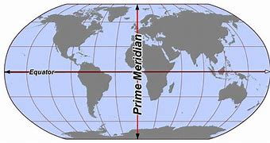

---

==== ▸ graph  [12]   +
な/ɡrɑːf/   +

【N-COUNT】   A _graph_ is a mathematical diagram which shows the relationship between two or more sets of numbers or measurements. 图表 +
⇒  ...**a graph showing that** breast cancer deaths rose about 20 percent from 1960 to 1985.  …一张显示1960至1985年间乳腺癌死亡人数上升了大约20%的图表。   +

---

==== ▸ consort  [13]   +
な /ˈkɒnsɔːt/  +
--> con-, 强调。-sort, 种类，类型，词源同series, sort. 即同类型的，相配的。 +

【V-I】   If you say that someone _consorts with_ a particular person or group, you mean that they spend a lot of time with them, and usually that you do not think this is a good thing. 勾勾搭搭   +
--> con-, 强调。-sort, 种类，类型，词源同series, sort. 即同类型的，相配的。 +
⇒  *He regularly consorted with* known drug-dealers.  他经常与毒品贩子勾勾搭搭。   +

---

==== ▸ emotional  [14]   +
な/ɪˈməʊʃənəl/   +

【ADJ】  _Emotional_ means concerned with emotions and feelings. 情感上的 +
⇒  I needed this man's love, and *the emotional support he was giving me*.  我那时需要这个男人的爱，以及他当时给予我的情感支持。   +

【ADV】   情感上地 +
⇒  Are you saying that *you're becoming emotionally involved with me?*  你是说你对我产生感情了吗？   +

【ADJ】   An _emotional_ situation or issue is one that causes people to have strong feelings. 引起情绪激动的 +
⇒  Abortion *is a very emotional issue*.  堕胎是个令人情绪十分激动的问题。   +

【ADV】   引起情绪激动地 +
⇒  *In an emotionally charged speech*, he said he was resigning.  在一次情绪激动的发言中，他说他要辞职。   +

【ADJ】   If someone is or becomes _emotional_, they show their feelings very openly, especially because they are upset. 易情绪激动的; 易动情的 +
⇒  *He is a very emotional man*.  他是个易动情的人。   +

---

==== ▸ prophet  [15]   +
な/ˈprɒfɪt/   +
--> 来自拉丁语propheta,预言家，先知，来自pro-,提前，-phet,说，来自PIE*bha,说，词源同fate,phone. +

【N-COUNT】   A _prophet_ is a person who is believed to be chosen by God to say the things that God wants to tell people. 先知 +
⇒  ...the sacred name of *the Holy Prophet of* Islam.  …伊斯兰教神圣先知之圣名。   +

---

==== ▸ hydrogen  [16]   +
な/ˈhaɪdrɪdʒən/   +

【N-UNCOUNT】  _Hydrogen_ is a colourless gas that is the lightest and commonest element in the universe. 氢 +

---

==== ▸ steep  [17]   +
な/stiːp/   +

【ADJ】   A _steep_ slope rises at a very sharp angle and is difficult to go up. 陡峭的 +
⇒  San Francisco is built on 40 hills and *some are very steep*.  旧金山建在40座山丘上，其中有些非常陡峭。   +

【ADV】   陡峭地 +
⇒  The road climbs steeply, with good views of Orvieto through the trees.  这条路陡直地向上延伸，透过树丛可以一览奥维多的景色。   +
⇒  ...**steeply terraced valleys**.  …陡峭的梯形山谷。   +

【ADJ】   A _steep_ increase or decrease in something is a very big increase or decrease. 急剧的 +
⇒  Consumers are rebelling at *steep price increases*.  消费者们正在抗议急剧的物价上涨。   +

【ADV】   急剧地 +
⇒  *Unemployment is rising steeply*.  失业率正在急剧上升。   +

【ADJ】   If you say that the price of something is _steep_, you mean that it is expensive. (价格) 高昂的 +
⇒  *The annual premium can be a little steep*, but will be well worth it if your dog is injured.  每年的保险费可能有点贵，但是如果您的狗受了伤就很值了。   +

【V】   to soak or be soaked in a liquid in order to soften, cleanse, extract an element, etc 浸; 泡 +
【V】   to saturate; imbue 使浸透   +
⇒  steeped in ideology     +

---

==== ▸ intricate  [18]   +
な/ˈɪntrɪkɪt/   +
-->  in-入,向内 + tric(trick)诡计,诀窍 + -ate形容词词尾 +

【ADJ】   You use _intricate_ to describe something that has many small parts or details. 复杂精细的 +
⇒  ...the production of carpets *with highly intricate patterns*.  …图案复杂精细的地毯的制作。   +

【ADV】   复杂精细地 +
⇒  ...**intricately carved sculptures**.  …一些精雕细刻的雕塑。   +

---

==== ▸ sphere  [19]   +
な/sfɪə/   +

【N-COUNT】   A _sphere_ is an object that is completely round in shape like a ball. 球体 +
⇒  Because the earth spins, *it is not a perfect sphere*.  因为地球旋转，所以它不是个完完全全的球体。   +

【N-COUNT】   A _sphere of_ activity or interest is a particular area of activity or interest. (活动、兴趣的) 领域 +
⇒  ...*the sphere of international politics*.  …国际政治领域。   +

---

==== ▸ scarf  [20]   +
な/skɑːf/   +
--> 词源不详，可能最终来自 PIE*sker,弯，转，编织，词源同 ring,crown,shrimp.引申词义围巾， 头巾。 +

【N-COUNT】   A _scarf_ is a piece of cloth that you wear around your neck or head, usually to keep yourself warm. 围巾 +
⇒  He reached up *to loosen the scarf around his neck*.  他伸出手松开围在脖子上的围巾。   +

---

==== ▸ disinterested  [21]   +
な/dɪsˈɪntrɪstɪd, -tərɪs-/   +

【ADJ】   Someone who is _disinterested_ is not involved in a particular situation or not likely to benefit from it and is therefore able to act in a fair and unselfish way. 不涉己利的; 客观的；无私的；公正的 +
⇒  The current sole superpower *is far from being a disinterested observer*.  当前惟一的超级大国远非一个公正的观察者。   +

【ADJ】   If you are _disinterested in_ something, you are not interested in it. Some users of English believe that it is not correct to use _disinterested_ with this meaning. 不感兴趣的 (有些英语使用者认为)(disinterested)(用作此意是不正确的) +
⇒  Lili had clearly regained her appetite *but Doran was disinterested in food*.  莉莉已经明显恢复了食欲，但多兰对食物还是不感兴趣。   +

---

==== ▸ oak  [22]   +
な/əʊk/   +

【N-VAR】   An _oak_ or an _oak tree_ is a large tree that often grows in forests and has strong, hard wood. 橡树 +
⇒  *Many large oaks were felled* during the war.  许多大橡树在那场战争期间被砍伐了。   +

【N-UNCOUNT】  _Oak_ is the wood of this tree. 橡木 +
⇒  *The cabinet was made of oak* and was hand-carved.  这个柜子是橡木做的，并且经手工雕刻而成。   +

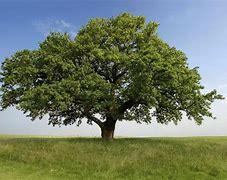

---

==== ▸ poetry  [23]   +
な/ˈpəʊɪtrɪ/   +

【N-UNCOUNT】   Poems, considered as a form of literature, are referred to as _poetry_. 诗歌 +
⇒  ...*Russian poetry*.  …俄罗斯诗歌。   +

【N-UNCOUNT】   You can describe something very beautiful as _poetry_. 富有诗意的东西 +
⇒  *His music is purer poetry than a poem* in words.  他的音乐比诗文更具诗意。   +

---

==== ▸ monarch  [24]   +
な/ˈmɒnək/   +
--> mon-,单个的，-arch,统治，管理，词源同anarchy.即单人统治，引申词义君主，帝王。 +

【N-COUNT】   The _monarch_ of a country is the king, queen, emperor, or empress. 君主 +

---

==== ▸ staggering  [25]   +
な/ˈstæɡərɪŋ/   +

【ADJ】   Something that is _staggering_ is very surprising. 令人震惊的 +
⇒  ...*a staggering $900 million* in short- and long-term debt.  …令人震惊的9亿美元的短长期债务。   +

---

==== ▸ tariff  [26]   +
な/ˈtærɪf/   +

【N-COUNT】   A _tariff_ is a tax that a government collects on goods coming into a country. (政府对进口货物征收的) 关税 +
⇒  America *wants to eliminate tariffs on items* such as electronics.  美国想要取消电子类产品的关税。   +

---

==== ▸ asymmetrical  [27]   +
な/ˌeɪsɪˈmɛtrɪkəl/   +

【ADJ】   Something that is _asymmetrical_ has two sides or halves that are different in shape, size, or style. 不对称的 +
⇒  ...*asymmetrical shapes*.  ...不对称的形状。   +

---

==== ▸ implore  [28]   +
な/ɪmˈplɔː/   +
--> im-,进入，使，-plor,哭泣，哀求，词源同explore,deplore. +

【V-T】   If you _implore_ someone _to_ do something, you ask them to do it in a forceful, emotional way. 恳求 +
--> im-,进入，使，-plor,哭泣，哀求，词源同explore,deplore. +
⇒  *We will implore both parties* to stay at the negotiating table.  我们将恳求双方留在谈判桌上。   +

---

==== ▸ lethal  [29]   +
な/ˈliːθəl/   +
--> 来自拉丁语letum,死亡，词源不详。可能同Lethe,冥河，地狱，引申词义死去的，致命的。 +

【ADJ】   A substance that is _lethal_ can kill people or animals. 致命的 +
⇒  ...*a lethal dose of* sleeping pills.  …安眠药的致命剂量。   +

【ADJ】   If you describe something as _lethal_, you mean that it is capable of causing a lot of damage. 危害极大的 +
⇒  Amorality and intelligence *is probably the most lethal combination* to be found within one personality.  缺乏道德却聪明智慧可能是同一人格中危害最大的组合。   +

---

==== ▸ digest  [30]   +
な/daɪˈdʒest/ +
--> di-分离,分开 + -gest-携带,运输 → 吸取精华,“送掉”糟粕 +

【V-T/V-I】   When food _digests_ or when you _digest_ it, it passes through your body to your stomach. Your stomach removes the substances that your body needs and gets rid of the rest. 消化   +
⇒  Do not undertake strenuous exercise for a few hours after a meal *to allow food to digest*.  饭后几小时内不要做剧烈运动，以让食物消化。   +
⇒  *She couldn't digest food properly*.  她无法正常消化食物。   +

【V-T】   If you _digest_ information, you think about it carefully so that you understand it. 领会 +
⇒  They learn well *but seem to need time to digest information*.  他们学得很好，但似乎需要时间来吃透这些知识。   +

【V-T】   If you _digest_ some unpleasant news, you think about it until you are able to accept it and know how to deal with it. 承受 (坏消息) +
⇒  All this has upset me. *I need time to digest it all*.  这一切让我心烦意乱。我需要时间来承受。   +

【N-COUNT】   A _digest_ is a collection of pieces of writing. They are published together in a shorter form than they were originally published. 文摘 +
⇒  ...the Middle East *Economic Digest*.  …中东经济文摘。   +

---

==== ▸ vary  [31]   +
な/ˈvɛərɪ/   +

【V-I】   If things _vary_, they are different from each other in size, amount, or degree. 各不相同 +
⇒  As they're handmade, *each one varies slightly*.  由于它们是手工制作的，每一件都会略有不同。   +
⇒  The text *varies from the earlier versions*.  这一文本有别于那些早期的版本。   +

【V-T/V-I】   If something _varies_ or if you _vary_ it, it becomes different or changed. 变化; 使变化 +
⇒  The cost of the alcohol duty *varies according to the amount of* wine in the bottle.  这项酒税的额度根据瓶中酒量的不同而变化。   +

---

==== ▸ primate  [32]   +
な/ˈpraɪmeɪt/   +

【N-COUNT】   A _primate_ is a member of the group of mammals that includes humans, monkeys, and apes. 灵长目动物 +
--> 来自prime,第一的，最初的，首要的，-ate,名词后缀。后用于指灵长类动物。 +
⇒  The woolly spider monkey *is the largest primate in the Americas*.  绒毛蛛猴是美洲最大的灵长目动物。   +

【ADJ】   of, relating to, or belonging to the order _Primates_ 大主教的; 首席主教的 +
【N-COUNT】  _The Primate of_ a particular country or region is the most important priest in that country or region. 大主教   +
⇒  ...*the Roman Catholic Primate* of All Ireland.  …全爱尔兰罗马天主教大主教。   +

---

==== ▸ anecdotal  [33]   +
な/ˌænɛkˈdəʊtəl/   +
--> 先说editor（编辑），它在词源上指的是将杂志、报纸分发、公布出去的人，所以e是前缀“向外”，dit是词根“给予”，即“向外给出的人”。anecdote的词根dot=dit表“给予”，an否定前缀，ec前缀“向外”，即“未向外给出、未公布的事”。 +

【ADJ】  _Anecdotal_ evidence is based on individual accounts, rather than on reliable research or statistics, and so may not be valid. 轶闻的 +
⇒  *Anecdotal evidence suggests that* sales in the Southwest have slipped.  传闻的证据表明西南部的销售量有所下滑。   +

---

==== ▸ undergraduate  [34]   +
な/ˌʌndəˈɡrædjʊɪt/   +

【N-COUNT】   An _undergraduate_ is a student at a university or college who is studying for a bachelor's or associate's degree. 大学本科生 +
⇒  *Economics undergraduates* are probably the brightest in the university.  经济学本科生很可能是该大学里最聪明的学生。   +

---

==== ▸ cumbersome  [35]   +
な/ˈkʌmbəsəm/   +

【ADJ】   Something that is _cumbersome_ is large and heavy and therefore difficult to carry, wear, or handle. 笨重的 +
--> 来自古英语combren,来自ber-,带来，承受，词源同bear,burden. +
⇒  *Although the machine looks cumbersome*, it is actually easy to use.  这机器虽然看起来笨重，其实使用起来很方便。   +

【ADJ】   A _cumbersome_ system or process is very complicated and inefficient. 不方便的; 缺乏效率的 +
⇒  ...*an old and cumbersome computer system*.  …陈旧而效率低下的计算机系统。   +

---

==== ▸ complicated  [36]   +
な/ˈkɒmplɪˌkeɪtɪd/   +

【ADJ】   If you say that something is _complicated_, you mean it has so many parts or aspects that it is difficult to understand or deal with. 复杂的 +
⇒  *The situation* in Lebanon *is very complicated*.  黎巴嫩的形势非常复杂。   +

---

==== ▸ integral  [37]   +
な/ˈɪntɪgrəl/   +

【ADJ】   Something that is an _integral_ part of something is an essential part of that thing. 构成整体所必需的 +
⇒  Rituals, celebrations, and festivals *form an integral part of every human society*.  仪式、庆典和节日是每个人类社会不可缺少的组成部分。   +

---

==== ▸ generic  [38]   +
な/dʒɪˈnɛrɪk/   +

【ADJ】   You use _generic_ to describe something that refers or relates to a whole class of similar things. 通用的 +
⇒  Parmesan *is a generic term* used to describe a family of hard Italian cheeses.  巴尔马干酪是一个用来描述一类坚硬的意大利奶酪的通用名称。   +

【ADJ】   A _generic_ drug or other product is one that does not have a trademark and that is known by a general name, rather than the manufacturer's name. 非注册商标的 (药等产品); 无厂家商标的；无商标的 +
⇒  *Doctors sometimes prescribe cheaper generic drugs* instead of more expensive brand names.  医生有时开比较便宜的非注册商标的药品，而不开比较昂贵的品牌药。   +

【N-COUNT】  _Generic_ is also a noun. 非注册商标的药品 +
⇒  The programme saved $11 million in 1988 *by substituting generics for brand-name drugs*.  这项计划以未注册商标的药品取代品牌药，在1988年节省了1100万美元。   +

---

==== ▸ supreme  [39]   +
な/sʊˈpriːm/   +
--> 来源于拉丁语介词super(上,超过)派生的形容词superus的最高级supremus。 super-上,超过 +

【ADJ】  _Supreme_ is used in the title of a person or an official group to indicate that they are at the highest level in a particular organization or system. 最高的 +
⇒  MacArthur was Supreme Commander for the allied powers in the Pacific.  麦克阿瑟是太平洋盟军的最高司令官。   +
⇒  ...*the Supreme Court*.  …最高法院。   +

【ADJ】   You use _supreme_ to emphasize that a quality or thing is very great. 极其的 +
⇒  Her approval *was of supreme importance*.  她的认可是极其重要的。   +

【ADV】   极其地 +
⇒  *She does her job supremely well*.  她工作得极其出色。   +

---

==== ▸ consideration  [40]   +
な/kənˌsɪdəˈreɪʃən/   +

【N-UNCOUNT】  _Consideration_ is careful thought about something. 仔细考虑 +
⇒  *There should be careful consideration about* the use of such toxic chemicals.  应有对这些有毒化学品的使用的慎重考虑。   +

【N-UNCOUNT】   If something is _under consideration_, it is being discussed. 在讨论中 +
⇒  *Several proposals are under consideration* by the state assembly.  几项提案正由州议会审议。   +

【N-UNCOUNT】   If you show _consideration_, you pay attention to the needs, wishes, or feelings of other people. 体贴 +
⇒  *Show consideration for* your neighbours.  要表示出对邻居们的体贴。   +

【N-COUNT】   A _consideration_ is something that should be thought about, especially when you are planning or deciding something. 考虑因素 +
⇒  *Price has become a more important consideration* for shoppers in choosing which shop to visit than it was before the recession.  比起经济萧条前，价格已成为购物者们选择光顾哪家商店的一个更重要的考虑因素。   +

【PHRASE】   If you _take_ something _into consideration_, you think about it because it is relevant to what you are doing. 考虑到某事物 +
⇒  Safe driving is good driving because *it takes into consideration the lives of other people*.  安全驾驶是良好驾驶，因为它顾及到了他人的生命。   +

---

==== ▸ depot [41]   +
な/ˈdɛpəʊ/   +

【N-COUNT】   A _depot_ is a bus station or train station. 公共汽车站; 火车站 +
⇒  She was reunited with her boyfriend *in the bus depot* of Ozark, Alabama.  她和她的男朋友在亚拉巴马州的奥扎克汽车站重新团聚了。   +

【N-COUNT】   A _depot_ is a place where large amounts of raw materials, equipment, arms, or other supplies are kept until they are needed. 仓库; 库房 +
⇒  ...*food depots*.  …食物储藏室。   +

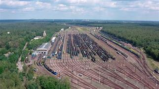

---

==== ▸ slight  [42]   +
な/slaɪt/   +

【ADJ】   Something that is _slight_ is very small in degree or quantity. 轻微的; 细微的 +
⇒  Doctors say *he has made a slight improvement*.  医生说他已经有些轻微的好转。   +
⇒  *He's not the slightest bit worried*.  他一点儿也不着急。   +

【ADJ】   A _slight_ person has a fairly thin and delicate looking body. 瘦小的; 纤细的 +
⇒  *She is smaller and slighter* than Christie.  她比克里斯蒂更瘦小更纤弱。   +

【ADV】   瘦小地; 纤细地 +
⇒  ...*a slightly built man*.  …一个身材瘦小的男人。   +

【V-T】   If you _are slighted_, someone does or says something that insults you by treating you as if your views or feelings are not important. 轻蔑; 怠慢 +
⇒  *They felt slighted* by not being adequately consulted.  因为没有充分地征求他们的意见，他们感到被怠慢了。   +

【N-COUNT】  _Slight_ is also a noun. 轻视; 冷落 +
⇒  It's difficult to persuade my husband that *it isn't a slight on him that* I enjoy my evening class.  很难劝说我丈夫相信我喜欢去上夜校课程并不是对他的冷落。   +

【PHRASE】   You use _in the slightest_ to emphasize a negative statement. (用于加强否定的陈述语气) 一点也 +
⇒  *That doesn't interest me in the slightest*.  那事儿一点也勾不起我的兴趣。   +

---

==== ▸ preliterate  [43]   +
な/priːˈlɪtərɪt/   +

【ADJ】   relating to a society that has not developed a written language 尚未使用文字的社会的 +

---

==== ▸ entreat  [44]   +
な/ɪnˈtriːt/   +
--> en-, 进入，使。treat, 处理，对待。可能是来自处理事情之艰难，因而引申该词义。 +

【V-T】   If you _entreat_ someone _to_ do something, you ask them very politely and seriously to do it. 恳求; 请求 +
⇒  *He entreated them* to delay their departure.  他恳求他们晚些再走。   +
⇒  "Call me Earl!" *he entreated*.  “叫我厄尔吧！”他恳切地说。   +

---

==== ▸ audible  [45]   +
な/ˈɔːdɪbəl/   +

【ADJ】   A sound that is _audible_ is loud enough to be heard. 听得见的 +
⇒  *The Colonel's voice was barely audible*.  上校的声音几乎听不见。   +

【ADV】   听得见地 +
⇒  Frank *sighed audibly*.  弗兰克出声地叹了口气。   +

---

==== ▸ financial  [46]   +
な/fɪˈnænʃəl, faɪ-/   +

【ADJ】  _Financial_ means relating to or involving money. 金融的; 财政的 +
⇒  The company *is in financial difficulties*.  这个公司处于财务困难之中。   +

【ADV】   金融上; 财政上 +
⇒  *She would like to be more financially independent*.  她想要在财政上更加独立。   +

---

==== ▸ outcome  [47]   +
な/ˈaʊtˌkʌm/   +

【N-COUNT】   The _outcome_ of an activity, process, or situation is the situation that exists at the end of it. 结果 +
⇒  Mr. Singh said *he was pleased with the outcome*.  西恩先生说他对此结果感到满意。   +
⇒  It's too early to know *the outcome of her illness*.  现在还不知道她的病情结果。   +

---

==== ▸ glacier  [48]   +
な/ˈɡlæsɪə/   +

【N-COUNT】   A _glacier_ is an extremely large mass of ice which moves very slowly, often down a mountain valley. 冰川 +

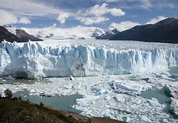

---

==== ▸ exterior  [49]   +
な/ɪkˈstɪərɪə/   +

【N-COUNT】   The _exterior_ of something is its outside surface. 外部 +
⇒  *The exterior of the building* was a masterpiece of architecture, elegant and graceful.  该建筑物在外观上是一项建筑杰作，精美雅致。   +

【N-COUNT】   You can refer to someone's usual appearance or behaviour as their _exterior_, especially when it is very different from their real character. 外表 +
⇒  According to Mandy, *Pat's tough exterior* hides a shy and sensitive soul.  据曼迪说，帕特坚强的外表下藏着一个害羞、敏感的灵魂。   +

【ADJ】   You use _exterior_ to refer to the outside parts of something or things that are outside something. 外面的 +
⇒  *The exterior walls* were made of preformed concrete.  外墙是用预制混凝土建造的。   +

---

==== ▸ hitch  [50]   +
な/hɪtʃ/   +
--> 来自中古英语icchen,猛拉，猝动，引申词义钩住。词义搭免费车缩写自hitchhike. +

【N-COUNT】   A _hitch_ is a slight problem or difficulty which causes a short delay. 小故障 +
⇒  *After some technical hitches* the show finally got under way.  几个小的技术故障后演出终于开始了。   +

【V-T/V-I】   If you _hitch_, _hitch_ a lift, or _hitch_ a ride, you hitchhike. 搭便车 +
⇒  There was no garage in sight, so *I hitched a lift into town*.  附近没有汽车修理厂，于是我搭便车进了城。   +

【V-T】   If you _hitch_ something _to_ something else, you hook it or fasten it there. 把…钩住; 把…拴住 +
⇒  Last night *we hitched the horse to the cart* and moved here.  昨天晚上我们把马拴在马车上，搬到了这里。   +

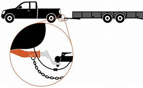

---

==== ▸ stanza  [51]   +
な/ˈstænzə/   +
--> 来自意大利语 stanza,诗节，段，词源同 stand,stance. +

【N-COUNT】   A _stanza_ is one of the parts into which a poem is divided. 诗节; （诗的）节，段 +

---

==== ▸ molten  [52]   +
な/ˈməʊltən/   +

【ADJ】  _Molten_ rock, metal, or glass has been heated to a very high temperature and has become a hot, thick liquid. 熔化的 +
⇒  *The molten metal* is poured into the mould.  这块熔化了的金属被倒入模子。   +

---

==== ▸ concentration  [53]   +
な/ˌkɒnsənˈtreɪʃən/   +

【N-UNCOUNT】  _Concentration_ on something involves giving all your attention to it. 专注 +
⇒  Neal kept interrupting, *breaking my concentration*.  尼尔不断打扰，打断我的注意力。   +

【N-VAR】   A _concentration of_ something is a large amount of it or large numbers of it in a small area. 集中 +
⇒  The area *has one of the world's greatest concentrations of wildlife*.  该地区有世界上野生生物最集中的区域之一。   +

【N-VAR】   The _concentration of_ a substance is the proportion of essential ingredients or substances in it. 浓度 +
⇒  pH is a measure of *the concentration of free hydrogen atoms* in a solution.  pH值是溶液中游离氢原子浓度的计量单位。   +

---

==== ▸ designate  [54]   +
な【V-T】   When you _designate_ someone or something _as_ a particular thing, you formally give them that description or name. 命名   +
⇒  ...a man interviewed in one of our studies *whom we shall designate as E*.  …一个我们在一项研究中采访过并会将其命名为E的男人。   +
⇒  There are efforts under way *to designate the bridge a historic landmark*.  在努力把这座桥定为历史地标。   +

【V-T】   If something _is designated for_ a particular purpose, it is set aside for that purpose. 指定 +
⇒  Some of the rooms *were designated as offices*.  其中一些房间是被指定用作办公室的。   +

【V-T】   When you _designate_ someone _as_ something, you formally choose them to do that particular job. 指派 +
⇒  *Designate someone as the spokesperson*.  指派某人为发言人。   +

【ADJ】  _Designate_ is used to describe someone who has been formally chosen to do a particular job, but has not yet started doing it. 已任命但未就职的 +
⇒  *Japan's prime minister-designate* is completing his cabinet today.  日本即将上任的首相今天将完成他的内阁组建。   +

---

==== ▸ influenza  [55]   +
な/ˌɪnflʊˈɛnzə/   +

【N-UNCOUNT】  _Influenza_ is the same as . 同flu.  流行性感冒；流感 +

---

==== ▸ inconvenient  [56]   +
な/ˌɪnkənˈviːnjənt/   +

【ADJ】   Something that is _inconvenient_ causes problems or difficulties for someone. 不方便的 +
⇒  Can you come at 10:30? *I know it's inconvenient, but I have to see you.*  你能10:30来吗？我知道这不方便，但是我必须要见你。   +

---

==== ▸ hypothesize  [57]   +
な/haɪˈpɒθɪˌsaɪz/   +

【V-T】   If you _hypothesize that_ something will happen, you say that you think that thing will happen because of various facts you have considered. 假设; 猜测 +
⇒  To explain this, *they hypothesize that* galaxies must contain a great deal of missing matter which cannot be detected.  为了解释这一点，他们假定银河系一定包含了大量无法探测到的不明物质。   +
⇒  *I have long hypothesized a connection between* these factors.  我一直以来就认为这些因素之间存在着某种关联。   +

---

==== ▸ emerge  [58]   +
な/ɪˈmɜːdʒ/   +

【V-I】   To _emerge_ means to come out from an enclosed or dark space such as a room or a vehicle, or from a position where you could not be seen. (从视线以外的地方) 出现; 出来 +
⇒  Richard was waiting outside the door *as she emerged*.  当她出现的时候，理查德正等候在门外。   +
⇒  *She then emerged from the courthouse* to thank her supporters.  于是她从法院大楼出来向支持者们表示感谢。   +

【V-I】   If you _emerge from_ a difficult or bad experience, you come to the end of it. 摆脱 +
⇒  There is growing evidence that *the economy is at last emerging from recession*.  有越来越多的迹象表明经济将最终摆脱萧条。   +

【V-T/V-I】   If a fact or result _emerges_ from a period of thought, discussion, or investigation, it becomes known as a result of it. 显露 (事实、结果) +
⇒  ...the growing corruption *that has emerged in the past few years*.  …过去几年中暴露出来的日趋严重的腐败。   +
⇒  *It soon emerged that* neither the July nor August mortgage payment had been collected.  很快显示的是7月和8月的抵押款都没有被收取。   +

【V-I】   If someone or something _emerges as_ a particular thing, they become recognized as that thing. 立足成为 +
⇒  Vietnam *has emerged as the world's third-biggest rice exporter*.  越南已立足成为世界第三大稻米出口国。   +

【V-I】   When something such as an organization or an industry _emerges_, it comes into existence. 兴起 +
⇒  ...the new republic *that emerged in October 1917*.  …1917年10月成立的新共和国。   +

---

==== ▸ yarn  [59]   +
な/jɑːn/   +

【N-MASS】  _Yarn_ is thread used for knitting or making cloth. 纱线 +
⇒  She still spins the yarn and knits sweaters for her family.  她仍在为她的家人纺线织毛衣。   +

---

==== ▸ cosmic  [60]   +
な/ˈkɒzmɪk/   +

【ADJ】  _Cosmic_ means occurring in, or coming from, the part of space that lies outside Earth and its atmosphere. 外层空间的 +
⇒  ...*cosmic radiation*.  …外层辐射。   +

【ADJ】  _Cosmic_ means belonging or relating to the universe. 宇宙的 +
⇒  ...*the cosmic laws* governing our world.  …主宰我们世界的宇宙法则。   +

---

==== ▸ elasticity  [61]   +
な/ɪlæˈstɪsɪtɪ, ˌiːlæ-/   +

【N-UNCOUNT】   The _elasticity_ of a material or substance is its ability to return to its original shape, size, and condition after it has been stretched. 弹性 +
⇒  Daily facial exercises *help to retain the skin's elasticity*.  每日的面部运动有助于保持皮肤弹性。   +

---

==== ▸ minus  [62]   +
な/ˈmaɪnəs/   +

【CONJ】   You use _minus_ to show that one number or quantity is being subtracted from another. 减 +
⇒  *One minus one* is zero.  一减一等于零。   +

【ADJ】  _Minus_ before a number or quantity means that the number or quantity is less than zero. 负的 +
⇒  The aircraft was subjected to *temperatures of minus 65 degrees* and plus 120 degrees.  该飞机经受了零下65 度和零上120度的温度。   +

【ADJ】   Teachers use _minus_ in grading work in schools and colleges. "B minus" is not as good as "B," but is a better grade than "C." 略低的 +
⇒  I'm giving him *a B minus*.  我打算给他一个B-。   +

【PREP】   To be _minus_ something means not to have that thing. 失去 /
( informal ) without sth that was there before 无，欠缺（曾经有过的东西）  +
⇒  The film company collapsed, leaving Chris jobless and *minus his life savings*.  这家电影公司垮了，使克里斯失业了，同时也失去了他的生活积蓄。   +
⇒ *We're going to be minus a car* for a while. 我们要过一段没有车的日子。 +

【N-COUNT】   A _minus_ is a disadvantage. 不利因素 +
⇒  *The minuses far outweigh that possible gain*.  不利因素远远超过了那可能获得的收益。   +

---

==== ▸ exhilarating  [63]   +
な/ɪɡˈzɪləˌreɪtɪŋ/   +

【ADJ】   If you describe an experience or feeling as _exhilarating_, you mean that it makes you feel very happy and excited. 令人欢欣的 +
⇒  *It was exhilarating to be* on the road again and his spirits rose.  重新上路非常令人欢欣，他的兴致高涨了起来。   +

---

==== ▸ microbe  [64]   +
な/ˈmaɪkrəʊb/   +

【N-COUNT】   A _microbe_ is a very small, living thing, which you can only see if you use a microscope. 微生物 +
⇒  ...*a type of bacteria that include the microbes* responsible for tuberculosis and leprosy.  …包括引起结核病和麻风病的微生物在内的一类细菌。   +

---

==== ▸ crucial  [65]   +
な/ˈkruːʃəl/   +

【ADJ】   If you describe something as _crucial_, you mean it is extremely important. 至关重要的 +
⇒  He had administrators under him *but made the crucial decisions himself*.  尽管他手下有许多官员，但重要的决定还是他自己做。   +

【ADV】   至关重要地 +
⇒  Chewing properly *is crucially important*.  正确地咀嚼是至关重要的。   +

---

==== ▸ score  [66]   +
な/skɔː/   +

【V-T/V-I】   In a sport or game, if a player _scores_ a goal or a point, they gain a goal or point. (比赛中) 得分; 进球 +
⇒  Patten *scored his second touchdown of the game*.  帕顿在比赛中第2次持球触地得分。   +
⇒  *He scored late in the third quarter* to cut the gap to 10 points.  他在第3节快结束时进了一球，把分差缩小到10分。   +

【V-T/V-I】   If you _score_ a particular number or amount, for example, as a mark in a test, you achieve that number or amount. (测试) 得分 +
⇒  Kelly *had scored an average of 147* on three separate IQ tests.  凯利在3次单独进行的智商测试中平均得到147分。   +
⇒  Congress *scores low* in public opinion polls.  国会在民意测验中得分很低。   +

【N-COUNT】   Someone's _score_ in a game or test is a number, for example, a number of points or runs, which shows what they have achieved or what level they have reached. 得分; 分数 +
⇒  The U.S. Open golf tournament was won by Ben Hogan, *with a score of 287*.  美国高尔夫球公开赛由本·霍根以287分夺冠。   +
⇒  He won this year's title *with a score of 9.687*.  他以9.687分赢得本年度的冠军。   +

【N-COUNT】   The _score_ in a game is the result of it or the current situation, as indicated by the number of goals, runs, or points obtained by the two teams or players. 比分 +
⇒  4-1 *was the final score*.  最终比分是4：1。   +
⇒  They beat the Giants *by a score of 7 to 3*.  他们以7比3战胜了巨人队。   +

【V-T】   If you _score_ a success, a victory, or a hit, you are successful in what you are doing. 赢得 +
⇒  His abiding passion was ocean racing, at which *he scored many successes*.  他长期的爱好是海上赛艇，并曾赢得多次胜利。   +

【N-COUNT】   The _score_ of a movie, play, or similar production is the music which is written or used for it. (电影、戏剧等演出的) 配乐 +
⇒  The dance is accompanied by *an original score* by Henry Torgue.  舞蹈由亨利·托尔格的一支原创配乐作搭配。   +

【N-COUNT】   The _score_ of a piece of music is the written version of it. 乐谱 +
⇒  He recognizes enough notation *to be able to follow a score*.  他认识足够多的音乐符号，能看懂乐谱。   +

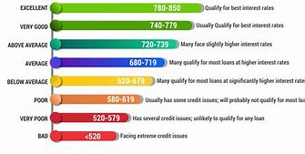

【QUANT】   If you refer to _scores of_ things or people, you are emphasizing that there are very many of them. 大量 +
⇒  Campaigners *lit scores of bonfires* in ceremonies to mark the anniversary.  参加活动的人们在仪式上点起了许多堆篝火，以庆祝这一周年纪念日。   +

【NUM】   A _score_ is twenty or approximately twenty. 二十; 二十左右 +
⇒  *A score of countries* may be either producing or planning to obtain chemical weapons.  约有二十个国家可能在生产或计划获取化学武器。   +

【V-T】   If you _score_ a surface with something sharp, you cut a line or number of lines in it. 划线于; 刻痕于 +
⇒  *Lightly score the surface of the steaks* with a sharp cook's knife.  用一把锋利的菜刀在牛排表面上轻轻打花刀。   +

【PHRASE】   If you _keep score_ of the number of things that are happening in a certain situation, you count them and record them. 记数 +
⇒  *You can keep score of your baby's movements* before birth by recording them on a kick chart.  你可以在胎动图表上记下分娩前胎儿的活动次数。   +

【PHRASE】   If you _know the score_, you know what the real facts of a situation are and how they affect you, even though you may not like them. 了解实情 +
⇒  I don't feel sorry for Carl. *He knew the score*, he knew what he had to do and couldn't do it.  我并不为卡尔感到难过。他了解实情，他知道他必须做什么，但又没能做成。   +

【PHRASE】   You can use _on that score_ or _on this score_ to refer to something that has just been mentioned, especially an area of difficulty or concern. 在那/这一点上 +
⇒  I became pregnant easily. At least *I've had no problems on that score*.  我很容易就怀孕了。至少在那一点上我是没问题的。   +

【PHRASE】   If you _settle a score_ or _settle an old score with_ someone, you take revenge on them for something they have done in the past. 报复 +
⇒  The groups *had historic scores to settle with each other*.  这两伙人之间有一些陈年老账要算。   +

---

==== ▸ disposal  [67]   +
な/dɪˈspəʊzəl/   +
--> dis-分离,分开 + -pos-放置 + -al +

【PHRASE】   If you have something _at_ your _disposal_, you are able to use it whenever you want, and for whatever purpose you want. If you say that you are _at_ someone's _disposal_, you mean that you are willing to help them in any way you can. 任某人支配; 尽力为某人提供帮助 +
⇒  Do you have this information *at your disposal*?  这个资料你能随意使用吗？   +

【N-UNCOUNT】  _Disposal_ is the act of getting rid of something that is no longer wanted or needed. 清除 +
⇒  ...methods for *the permanent disposal of* radioactive wastes.  …放射性废料的永久清除方法。   +

---

==== ▸ physiology  [68]   +
な/ˌfɪzɪˈɒlədʒɪ/   +

【N-UNCOUNT】  _Physiology_ is the scientific study of how people's and animals' bodies function, and of how plants function. 生理学 +
⇒  ...the Nobel Prize for *Medicine and Physiology*.  …诺贝尔医学和生理学奖。   +

【N-UNCOUNT】   The _physiology_ of a human or animal's body or of a plant is the way that it functions. 生理机能 +
⇒  ...*the physiology of respiration*.  …呼吸的生理机能。   +

【ADJ】   生理的 +
⇒  ...*the physiological effects of stress*.  …压力的生理影响。   +

---

==== ▸ shatter  [69]   +
な/ˈʃætə/   +

【V-T/V-I】   If something _shatters_ or _is shattered_, it breaks into a lot of small pieces. 粉碎 +
⇒  ...*safety glass that won't shatter* if it's broken.  …安全玻璃即使破了也不会粉碎。   +
⇒  *The car shattered into a thousand burning pieces* in a 200 mph crash.  这辆轿车在时速200英里的碰撞中裂成了数以千计燃烧着的碎片。   +

【N-UNCOUNT】   粉碎 +
⇒  ...*the shattering of glass*.  …玻璃的粉碎。   +

【V-T】   If something _shatters_ your dreams, hopes, or beliefs, it completely destroys them. 粉碎 (梦想、希望、信仰等) +
⇒  A failure *would shatter the hopes of many people*.  一次失败会粉碎很多人的希望。   +

【V-T】   If someone _is shattered_ by an event, it shocks and upsets them very much. 严重打击 +
⇒  *He had been shattered* by his son's death.  儿子的死使他很受打击。   +

---

==== ▸ ephemeral  [70]   +
な/ɪˈfɛmərəl/   +
--> epi-, 在上，在中。-hemer, 天，词源同euhemerism。原指一种朝生暮死的昆虫，后形容短暂的生命，转瞬即逝的。 +

【ADJ】   If you describe something as _ephemeral_, you mean that it lasts only for a short time. 短暂的; 瞬间的 +
⇒  He talked about *the country's ephemeral unity* being shattered by the defeat.  他谈到战败彻底粉碎了国家的短暂统一。   +

---

==== ▸ kennel  [71]   +
な/ˈkɛnəl/   +

【N-COUNT】   A _kennel_ is a place where dogs are bred and trained, or cared for when their owners are away. 养狗场 +
⇒  *Once you have chosen a kennel*, make a booking for your pet.  一旦您选定了养狗场，请为您的宠物预约。   +

【N-COUNT】   A _kennel_ is a small building made especially for a dog to sleep in. 犬舍 +
【V】   to put or go into a kennel; keep or stay in a kennel 把...关进狗舍; 进入狗舍; 呆在狗舍里   +

---

==== ▸ heed  [72]   +
な/hiːd/   +

【V-T】   If you _heed_ someone's advice or warning, you pay attention to it and do what they suggest. 注意; 听从 +
⇒  *But few* at the conference in London last week *heeded his warning*.  但几乎没有人在上周伦敦会议上注意他的警告。   +

【PHRASE】   If you _take heed of_ what someone says or if you _pay heed to_ them, you pay attention to them and consider carefully what they say. 注意 +
⇒  But what if the government *takes no heed*?  但要是政府不理会该怎么办呢？   +

---

==== ▸ generate  [73]   +
な/ˈdʒɛnəˌreɪt/   +

【V-T】   To _generate_ something means to cause it to begin and develop. 造成 +
⇒  The labour secretary said *the reforms would generate new jobs*.  劳动部长说这些改革将带来新的工作。   +

【V-T】   To _generate_ a form of energy or power means to produce it. 产生 (电等能量) +
⇒  The company, New England Electric, *burns coal to generate power*.  新英格兰电力公司燃烧煤来发电。   +

---

==== ▸ regular  [74]   +
な/ˈrɛɡjʊlə/   +

【ADJ】  _Regular_ events have equal amounts of time between them, so that they happen, for example, at the same time each day or each week. 定期的 +
⇒  *Get regular exercise*.  定期进行锻炼。   +
⇒  We're going to be meeting there *on a regular basis*.  我们将定期在那里见面。   +

【ADV】   定期地 +
⇒  *He also writes regularly for* "International Management" magazine.  他也定期为《国际管理》杂志写稿。   +

【ADJ】  _Regular_ events happen often. 经常的 +
⇒  Although it may look unpleasant, this condition is harmless and *usually clears up with regular shampooing*.  这可能不好看，但这种情况是无害的, 并且经常的洗头通常可以消除它。   +

【ADV】   经常地 +
⇒  Fox, badger, and weasel are regularly seen here.  这里经常看得到狐狸、獾和黄鼠狼。   +

【ADJ】   If you are, for example, a _regular_ customer at a shop or a _regular_ visitor to a place, you go there often. 经常的 (顾客或来访者) +
⇒  *She has become a regular visitor* to Houghton Hall.  她已成为霍顿府邸的一名常客。   +

【N-COUNT】   The _regulars_ at a place or on a team are the people who often go to the place or are often on the team. 常客; 正式队员 +
⇒  *Regulars at his local bar* have set up a fund to help out.  他的当地酒吧的常客们, 已经设立了一项基金来帮忙解决困难。   +

【ADJ】   You use _regular_ when referring to the thing, person, time, or place that is usually used by someone. For example, someone's _regular_ place is the place where they usually sit. 固定的 +
⇒  The man shook his hand and then *sat at his regular table* near the windows.  这个人握了握他的手，然后坐在他固定的靠窗的桌子旁。   +

【ADJ】   A _regular_ rhythm consists of a series of sounds or movements with equal periods of time between them. 均匀的 +
⇒  ...*a very regular beat*.  …非常均匀的节拍。   +

【ADV】   均匀地 +
⇒  Remember *to breathe regularly*.  记住要均匀地呼吸。   +

【ADJ】  _Regular_ is used to mean "normal." 普通的 +
⇒  The product looks and burns like a regular cigarette.  这种产品看上去和点起来都像一支普通的香烟。   +

【ADJ】   In some restaurants, a _regular_ drink or quantity of food is of medium size. 中份的 +
⇒  ...a cheeseburger and *regular fries*.  …一个干酪汉堡包和中份的炸薯条。   +

【ADJ】   A _regular_ pattern or arrangement consists of a series of things with equal spaces between them. 间隔一致的 +
⇒  The village *was laid out in regular patterns*.  这个村庄街道和房屋被以相等的间隔整齐地加以布局。   +

【ADJ】   If something has a _regular_ shape, both halves are the same and it has straight edges or a smooth outline. 规则的 +
⇒  ...some *regular geometrical shape*.  …一些规则的几何图形。   +

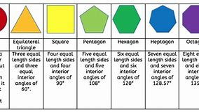

【N-UNCOUNT】   规则性 +
⇒  ...*the chessboard regularity* of their fields.  …国际象棋棋盘的规则性。   +

【ADJ】   In grammar, a _regular_ verb, noun, or adjective inflects in the same way as most verbs, nouns, or adjectives in the language. (动词、名词或形容词) 按规则变化的 +

---

==== ▸ eccentric  [75]   +
な/ɪkˈsɛntrɪk/   +

【ADJ】   If you say that someone is _eccentric_, you mean that they behave in a strange way, and have habits or opinions that are different from those of most people. 古怪的; 异乎寻常的 +
⇒  *He is an eccentric character* who likes wearing a beret and dark glasses.  他是个怪人，喜欢戴贝雷帽和墨镜。   +

【N-COUNT】   An _eccentric_ is an eccentric person. 古怪的人 +
⇒  Askew used several names, and *had a reputation as an eccentric*.  艾斯丘用过几个名字，并以“怪人”著称。   +

---

==== ▸ habit  [76]   +
な/ˈhæbɪt/   +

【N-VAR】   A _habit_ is something that you do often or regularly. 习惯 +
⇒  *He has an endearing habit of* licking his lips when he's nervous.  他有个紧张时舔嘴唇的可爱习惯。   +
⇒  Many people add salt to their food *out of habit*, without even tasting it first.  许多人出于习惯往他们的食物中加盐，甚至都不先品尝一下。 (*out of habit 出于习惯*)  +

【N-COUNT】   A _habit_ is an action considered bad that someone does repeatedly and finds it difficult to stop doing. 坏习惯 +
⇒  A good way *to break the habit of eating too quickly* is to put your knife and fork down after each mouthful.  一个改掉吃饭太快的坏习惯的好方法是, 每吃一口后放下刀叉。   +

【N-COUNT】   A drug _habit_ is an addiction to a drug such as heroin or cocaine. 毒瘾 +
⇒  She became a prostitute *in order to pay for her cocaine habit*.  她为花钱过可卡因毒瘾, 而成了一名妓女。   +

【PHRASE】   If you say that someone is _a creature of habit_, you mean that they usually do the same thing at the same time each day, rather than doing new and different things. 按习惯行事的人 +
⇒  *Jesse is a creature of habit* and always eats breakfast.  杰西是按习惯行事的人，每天都吃早餐。   +

【PHRASE】   If you are _in the habit of_ doing something, you do it regularly or often. If you _get into the habit of_ doing something, you begin to do it regularly or often. 习惯于…/养成…的习惯 +
⇒  *They were in the habit of* giving two or three dinner parties a month.  他们习惯于每月举办两三次晚宴。   +

【PHRASE】   If you _make a habit of_ doing something, you do it regularly or often. 使成为习惯 +
⇒  You can phone me at work *as long as you don't make a habit of it*.  你可以在上班时给我打电话，只要你别让这成为习惯就行。   +

---

==== ▸ immigrate  [77]   +
な/ˈɪmɪˌɡreɪt/   +

【V-I】   If someone _immigrates_ to a particular country, they come to live or work in that country, after leaving the country where they were born. 移居国外; 移民 +
⇒  ...a Russian-born professor *who had immigrated to the United States*.  ...一位生于俄罗斯而后来移居到美国的教授。   +
⇒  *He immigrated from India* at age 18.  他18岁时从印度移民出来。   +
⇒  *10,000 people are expected to immigrate* in the next two years.  在今后两年里，一万人有望移民。   +

---

==== ▸ establish  [78]   +
な/ɪˈstæblɪʃ/   +

【V-T】   If someone _establishes_ something such as an organization, a type of activity, or a set of rules, they create it or introduce it in such a way that it is likely to last for a long time. 建立; 确立 +
⇒  *The UN has established detailed criteria （评判或做决定的）标准，准则，尺度 for* who should be allowed to vote.  联合国就谁应当被允许投票, 确立了详细标准。   +

【V-RECIP】   If you _establish_ contact with someone, you start to have contact with them. You can also say that two people, groups, or countries _establish_ contact. 建立 (联系) +
⇒  *We had already established contact with* the museum.  我们已经与那个博物馆建立了联系。   +

【V-T】   If you _establish that_ something is true, you discover facts that show that it is definitely true. 证实 +
⇒  *Medical tests established that* she was not their own child.  医学检测证实她不是他们的亲生孩子。   +
⇒  *It will be essential to establish* how the money is being spent.  搞清这笔钱是如何被花费的将至关重要。   +

【ADJ】   被证实了的 +
⇒  That link is *an established medical fact*.  那种联系是被证实了的医学事实。   +

【V-T】   If you _establish yourself_, your reputation, or a good quality that you have, you succeed in doing something, and achieve respect or a secure position as a result of this. 确立 (地位) +
⇒  This is going to be the show *where up-and-coming 有前途的；前程似锦的comedians will establish themselves*.  这会是一场很有前途的喜剧演员们将在此确立他们地位的演出。   +
⇒  *He has established himself as a pivotal 关键性的；核心的 figure* in state politics.  他作为国家政治中的一位轴心人物的地位, 已经确立。   +

---

==== ▸ abbey  [79]   +
な/ˈæbɪ/   +
--> 词源同abba,阿爸，喻指神，上帝。比较pope,教皇，来自打丁语papa,阿爸, 最终同abba. +

【N-COUNT】   An _abbey_ is a church with buildings attached to it in which monks or nuns live or used to live. 修道院 +

---

==== ▸ census  [80]   +
な/ˈsɛnsəs/   +

【N-COUNT】   A _census_ is an official survey of the population of a country that is carried out in order to find out how many people live there and to obtain details of such things as people's ages and jobs. 人口普查 +
⇒  *The detailed assessment 评估,估算 of the latest census* will be ready in three months.  有关最新人口普查的详细评估工作, 将在3个月内就绪。   +

---

==== ▸ career  [81]   +
な/kəˈrɪə/   +
--> 来自词根cur, 跑，词源同car, current. 原指路程，驰骋，后用于职业。 +

【N-COUNT】   A _career_ is the job or profession that someone does for a long period of their life. 职业 +
⇒  She is now concentrating on *a career as a fashion designer*.  她现在专注于时装设计这一行。   +
⇒  ...*a career in journalism*.  …新闻职业。   +

【N-COUNT】   Your _career_ is the part of your life that you spend working. 职业生涯 +
⇒  *During his career*, he wrote more than fifty plays.  在他的创作生涯里，他共写了五十多部剧作。   +

【ADJ】  _Career_ advice or guidance consists of information about different jobs and help with deciding what kind of job you want to do. 就业的 +
⇒  *She received very little career guidance* when young.  她年轻时没受过什么就业指导。   +

【V-I】   If a person or vehicle _careers_ somewhere, they move fast and in an uncontrolled way. 猛冲 +
⇒  His car *careered into a river*.  他的车猛地冲进了河里。   +

---

==== ▸ correspond  [82]   +
な/ˌkɒrɪˈspɒnd/   +

【V-RECIP】   If one thing _corresponds to_ another, there is a close similarity or connection between them. You can also say that two things _correspond_. 相一致; 相对应 +
⇒  Racegoers will be given a number *which will correspond to a horse* running in a race.  观看赛马的观众, 将领到一个与参赛马匹相对应的号码。   +
⇒  The two maps of the Rockies *correspond closely*.  这两张落基山脉的地图极为相似。   +

【ADJ】   相应的 +
⇒  The rise in interest rates *was not reflected in a corresponding rise in the dollar*.  利率上调, 没有反映在相应的美元增值上。   +

【V-RECIP】   If you _correspond with_ someone, you write letters to them. You can also say that two people _correspond_. 通信 +
⇒  *She still corresponds with friends* she met in Majorca nine years ago.  她依然和9年前在马略卡岛遇到的朋友们通信。   +

---

==== ▸ laudable  [83]   +
な/ˈlɔːdəbəl/   +

【ADJ】   Something that is _laudable_ deserves to be praised or admired. 可嘉许的; 值得赞美的 +
⇒  *One of Emma's less laudable characteristics* was her jealousy.  忌妒心强, 是埃玛的一个不那么值得褒扬的性格特点。   +

---

==== ▸ isolate  [84]   +
な/ˈaɪsəleɪt/   +

【V-T】   To _isolate_ a person or organization means to cause them to lose their friends or supporters. 孤立 +
⇒  This policy *could isolate the country from* the other permanent members of the United Nations Security Council.  这项政策可能会将这个国家从联合国安理会的其他常任理事国中孤立出来。   +

【ADJ】   孤立的 +
⇒  They are finding themselves *increasingly isolated (a.) within the teaching profession*.  他们发现自己在教育界中越来越孤立。   +

【V-T】   If you _isolate yourself_, or if something _isolates_ you, you become physically or socially separated from other people. 使孤立; 孤立 +
⇒  She seemed determined to isolate herself from everyone, even him.  她似乎决心要与每个人，甚至是他割断联系。   +
⇒  `主` His radicalism and refusal to compromise `谓` *isolated him*.  他的激进和拒绝让步使他受到了孤立。   +

【V-T】   If you _isolate_ something such as an idea or a problem, you separate it from others that it is connected with, so that you can concentrate on it or consider it on its own. 单独考虑 +
⇒  Our anxieties can also be controlled by *isolating (v.) thoughts*, feelings and memories.  我们的焦虑也可以通过对思想、感情和记忆分别进行考虑, 来加以控制。   +

【V-T】   To _isolate_ a substance means *to obtain it by separating it from other substances* using scientific processes. 使离析 +
⇒  We can use genetic engineering techniques *to isolate the gene that is responsible*.  我们可以用遗传工程技术, 将起作用的基因离析出来。   +

【V-T】   To _isolate_ a sick person or animal means to keep them apart from other people or animals, so that their illness does not spread. 隔离 +
⇒  *Patients will be isolated from other people* for between three days and one month after treatment.  治疗之后，患者将被与他人隔离3天到1个月。   +

【N-UNCOUNT】   隔离 +
⇒  Hayley contracted tuberculosis and *had to be put in an isolation ward  病房；病室*.  海利感染了肺结核而不得不被送进一个隔离病房。   +

---

==== ▸ moisture  [85]   +
な/ˈmɔɪstʃə/   +

【N-UNCOUNT】  _Moisture_ is tiny drops of water in the air, on a surface, or in the ground. 潮气; 水分 +
⇒  When the soil is dry, *more moisture is lost from the plant*.  土壤干燥时，植物就会失去更多的水分。   +

---

==== ▸ sacrificial  [86]   +
な/ˌsækrɪˈfɪʃəl/   +

【ADJ】  _Sacrificial_ means connected with or used in a sacrifice. 献祭的 +
⇒  ...*the sacrificial altar*.  …祭坛。   +

---

==== ▸ niche  [87]   +
な/nɪtʃ, niːʃ/   +
--> 来自法语niche,狗窝，可能来自拉丁语 nidus,鸟巢，窝，词源同nest.引申词义壁龛，商机，称心的工作等。 +

【N-COUNT】   A _niche_ in the market is a specific area of marketing which has its own particular requirements, customers, and products. (有特定的要求、顾客群和产品的) 专营市场 +
⇒  I think *we have found a niche in the toy market*.  我认为我们已经在玩具市场找到了领地。   +

【ADJ】  _Niche_ marketing is the practice of dividing the market into specialized areas for which particular products are made. A _niche_ market is one of these specialized areas. 专营市场的 +
⇒  Many media experts see such all-news channels as *part of a general move towards niche marketing*.  许多媒体专家把这些全新闻频道看作是向专营市场营销全面发展的一部分。   +

【N-COUNT】   A _niche_ is a hollow area in a wall which has been made to hold a statue, or a natural hollow part in a hill or cliff. 壁龛; (山坡或峭壁上) 天然凹陷处 +
⇒  Above him, *in a niche on the wall*, sat a tiny veiled Ganesh, the elephant god.  在他头顶上方一个壁龛里，坐着一尊极小的蒙着面纱的象神伽内什。   +

【N-COUNT】   Your _niche_ is the job or activity which is exactly suitable for you. 合适的职位; 合适的活动 +
⇒  *Simon Lane quickly found his niche* as a busy freelance model maker.  西蒙·莱恩很快找到了合适的工作，成为了一名忙碌的自由职业模型工。   +

---

==== ▸ shrimp  [88]   +
な/ʃrɪmp/   +

【N-COUNT】  _Shrimps_ are small shellfish with long tails and many legs. 小虾 +

---

==== ▸ lapse  [89]   +
な/læps/   +
--> 来自拉丁语labi,滑落，滑倒，来自PIE*sleib,*slei,黏，滑，词源同slip,lime.引申词义过错，疏忽。

【N-COUNT】   A _lapse_ is a moment or instance of bad behaviour by someone who usually behaves well. (一时的) 行为失检 +
⇒  On Friday he showed neither decency nor dignity. *It was an uncommon lapse*.  星期五他既不庄重也不体面。这可是他少有的失礼。   +

【N-COUNT】   A _lapse of_ something such as concentration or judgment is a temporary lack of that thing, which can often cause you to make a mistake. (一时的) 走神; 判断错误 +
⇒  *I had a little lapse of concentration* in the middle of the race.  我在比赛中走了一下神。   +
⇒  He was a genius and because of it *you could accept lapses of taste 适度；得体*.  他是一个天才，因此他偶失得体，人们也可以接受。   +

【V-I】   If you _lapse into_ a quiet or inactive state, you stop talking or being active. 陷入 (某种静止状态) +
⇒  She muttered something unintelligible and *lapsed into silence*.  她咕哝了几句难以理解的话，然后就陷入了沉默。   +

【V-I】   If someone _lapses into_ a particular way of speaking, or behaving, they start speaking or behaving in that way, usually for a short period. 开始 (以某种方式) 说话; 开始行事 +
⇒  *She lapsed into a little girl voice* to deliver a nursery rhyme.  她用小女孩的声音唱起了一首童谣。   +

【N-COUNT】  _Lapse_ is also a noun. 开始说; 开始做 +
⇒  *Her lapse into German* didn't seem peculiar. After all, it was her native tongue.  她开始说德语并不奇怪，毕竟那是她的母语。   +

【N-SING】   A _lapse of_ time is a period that is long enough for a situation to change or for people to have a different opinion about it. (时间的) 间隔 +
⇒  ...the restoration of diplomatic relations *after a lapse of 24 years*.  …间隔24年后外交关系的恢复。   +

【V-I】   If a period of time _lapses_, it passes. 流逝 +
⇒  New products and production processes are transferred to the developing countries *only after a substantial amount of time has lapsed*.  只有经过很长时间以后，新产品和新生产流程才转移到发展中国家。   +

【V-I】   If a situation or legal contract _lapses_, it is allowed to end rather than being continued, renewed, or extended. 终止 +
⇒  The terms of the treaty *lapsed in 1987*.  协定的条款在1987年就终止了。   +

【V-I】   If a member of a particular religion _lapses_, they stop believing in it or stop following its rules and practices. 放弃 (宗教信仰) +
⇒  *I lapsed in my 20s*, returned to it, then lapsed again, while writing the life of historical Jesus.  我20来岁就放弃信教，后来又信了。到后来在写历史上的耶稣生平时又放弃了信教。   +

---

==== ▸ psychology  [90]   +
な/saɪˈkɒlədʒɪ/   +

【N-UNCOUNT】  _Psychology_ is the scientific study of the human mind and the reasons for people's behaviour. 心理学 +
⇒  ...*Professor of Psychology* at Haverford College.  …海沃福德学院的心理学教授。   +

【N-UNCOUNT】   The _psychology of_ a person is the kind of mind that they have, which makes them think or behave in the way that they do. 心理 +
⇒  ...a fascination with *the psychology of murderers*.  …对谋杀犯心理的强烈兴趣。   +

---

==== ▸ rationality  [91]   +
(n.)  合理性；（数学）有理性；合理的行动 +
⇒ bounded rationality 有限理性

---

==== ▸ genuine  [92]   +
な/ˈdʒɛnjʊɪn/   +

【ADJ】  _Genuine_ is used to describe people and things that are exactly what they appear to be, and are not false or an imitation. 真正的 +
⇒  There was a risk of *genuine refugees* being returned to Vietnam.  有把真正的难民遣送回越南的风险。   +
⇒  ...*genuine leather*.  …真皮。   +

【ADJ】  _Genuine_ refers to things such as emotions that are real and not pretended. 真诚的 +
⇒  If this offer is genuine, I will gladly accept it.  如果这份帮助是真诚的，我将愉快地接受它。   +

【ADV】   真诚地 +
⇒  *He was genuinely surprised*.  他真得吃了一惊。   +

【ADJ】   If you describe a person as _genuine_, you approve of them because they are honest, truthful, and sincere in the way they live and in their relationships with other people. 诚实可靠的 +
⇒  She is very caring and *very genuine*.  她很有同情心，也非常诚实可靠。   +

---

==== ▸ prize  [93]   +
な/praɪz/   +

【N-COUNT】   A _prize_ is money or something valuable that is given to someone who has the best results in a competition or game, or as a reward for doing good work. 奖品; 奖金 +
⇒  *You must claim your prize* by telephoning our claims line.  你必须通过打我们的领奖热线来领取奖品。   +
⇒  He was awarded *the Nobel Prize for Physics* in 1985.  他获得了1985年诺贝尔物理学奖。   +

【ADJ】   You use _prize_ to describe things that are of such good quality that they win prizes or deserve to win prizes. 获奖的; 应获奖的 +
⇒  ...*a prize bull*.  …一头获奖的公牛。   +

【N-COUNT】   You can refer to someone or something as a _prize_ when people consider them to be of great value or importance. 有价值之人; 有价值之物 +
⇒  With no lands of his own, *he was no great matrimonial 婚姻的 prize*.  没有自己的土地，他绝不是个有价值的结婚对象。   +

【V-T】   Something that _is prized_ is wanted and admired because it is considered to be very valuable or very good quality. 青睐 +
⇒  Military figures made out of lead *are prized by collectors*.  用铅做的军人塑像很受收藏者们青睐。   +

【V-T】 +

---

==== ▸ admire  [94]   +
な/ədˈmaɪə/   +

【V-T】   If you _admire_ someone or something, you like and respect them very much. 钦佩 +
⇒  *I admired her* when I first met her and I still think she's marvellous.  我第一次见到她时就钦佩她，而且我现在依然认为她很了不起。   +
⇒  *He admired the way* she had coped with life.  他钦佩她应对生活的方式。   +

【V-T】   If you _admire_ someone or something, you look at them with pleasure. 欣赏 +
⇒  We took time to stop and *admire the view*.  我们特意停下来欣赏风景。   +

---

==== ▸ annex  [95]   +
な /əˈneks/  +

【V-T】   If a country _annexes_ another country or an area of land, it seizes it and takes control of it. 并吞   +
⇒  *Rome annexed the Nabatean kingdom* in AD 106.  罗马帝国于公元106年并吞了纳巴泰王国。   +

【N-COUNT】   并吞 +
⇒  *Indonesia's annexation of East Timor* never won the acceptance of the United Nations.  印度尼西亚对东帝汶的并吞, 从未获得联合国的认可。   +

【N-COUNT】  [美国英语] +

---

==== ▸ factual  [96]   +
な/ˈfæktʃʊəl/   +

【ADJ】   Something that is _factual_ is concerned with facts or contains facts, rather than giving theories or personal interpretations. 事实的 +
⇒  The editorial *contained several factual errors*.  这篇社论有几处事实性错误。   +

---

==== ▸ slide  [97]   +
な/slaɪd/   +

【V-T/V-I】   When something _slides_ somewhere or when you _slide_ it there, it moves there smoothly over or against something. 使滑动; 滑动 +
⇒  *She slid the door open*.  她把门滑开了。   +
⇒  *I slid the wallet into his pocket*.  我把那钱包滑进了他的口袋。   +

【V-I】   If you _slide_ somewhere, you move there smoothly and quietly. 悄悄地溜到 +
⇒  *He slid into the driver's seat*.  他悄悄地坐到了司机的座位上。   +

【V-I】   To _slide into_ a particular mood, attitude, or situation means to gradually start to have that mood, attitude, or situation often without intending to. 不知不觉地陷入 (某种情绪、态度或情形) +
⇒  *She had slid into a depression*.  她不知不觉地抑郁寡欢起来。   +

【V-T/V-I】   If currencies or prices _slide_, they gradually become worse or lower in value. 使减少; 下跌 +
⇒  *The dollar continued to slide*.  美元继续下跌。   +

【N-COUNT】  _Slide_ is also a noun. 下跌 +
⇒  ...*the dangerous slide* in oil prices.  …石油价格危险的下跌。   +

【N-COUNT】   A _slide_ is a small piece of photographic film which you project onto a screen so that you can see the picture. 幻灯片 +
⇒  ...*a slide show*.  …幻灯片放映。   +

【N-COUNT】   A _slide_ is a piece of glass on which you put something that you want to examine through a microscope. (显微镜的) 载物玻璃片 +
⇒  ...a drop of blood *on a slide*.  …载物玻璃片上的一滴血。   +

【N-COUNT】   A _slide_ is a piece of playground equipment that has a steep slope for children to go down for fun. 滑梯 +
⇒  ...two young children *playing on a slide*.  …在玩滑梯的两个年幼的孩子。   +

---

==== ▸ nostalgic  [98]   +
な/nɒˈstældʒɪk/   +

【ADJ】  _Nostalgic_ things cause you to think affectionately about the past. 引起怀旧的 +
⇒  Although we still depict 描绘 *nostalgic snow scenes* on Christmas cards, winters are now very much warmer.  虽然我们还在圣诞卡上描绘引人怀旧的雪景，但现在冬天温暖多了。   +

【ADJ】   If you feel _nostalgic_, you think affectionately about experiences you had in the past. 怀旧的 +
⇒  Many people *were nostalgic (a.) for the good old days*.  很多人都怀念过去的好时光。   +

【ADV】   怀旧地 +
⇒  *People look back nostalgically (ad.) on the war period*, simply because everyone pulled together.  人们怀旧地回忆战争时期，就因为当时大家齐心协力。   +

---

==== ▸ selective  [99]   +
な/sɪˈlɛktɪv/   +

【ADJ】   A _selective_ process applies only to a few things or people. 选择性的 +
⇒  *Selective breeding* may result in a greyhound 灵缇犬 (一种身纤细、腿瘦长、善奔跑的狗) running faster and seeing better than a wolf.  选择育种可能会培育出一种比狼跑得更快、视力更好的灵缇。   +

【ADV】   有选择地 +
⇒  Within the project, *trees are selectively cut* on a 25-year rotation.  在这一计划中，会以25年为周期有选择地砍伐树木。   +

【ADJ】   When someone is _selective_, they choose things carefully, for example, the things that they buy or do. 仔细挑选的; 讲究的 +
⇒  Sales still happen, but *buyers are more selective*.  销售仍在进行,但买家更挑剔了。   +

【ADV】   仔细挑选地 +
⇒  ...people on small incomes *who wanted to shop selectively*.  …购物时需要仔细挑选的低收入人群。   +

【ADJ】   If you say that someone has a _selective_ memory, you disapprove of the fact that they remember certain facts about something and deliberately forget others, often because it is convenient for them to do so. 选择性的 (记忆) +
⇒  *We seem to have a selective memory* for the best bits of the past.  我们似乎对过去最美好的时光有选择性的记忆。   +

【ADV】   有选择性地 +
⇒  ...a tendency to remember only the pleasurable effects of the drug and *selectively forget all the adverse effects*.  …一种只记住毒品带来的快感, 而有选择性地忘掉其所有负面作用的倾向。   +

---

==== ▸ preference  [100]   +
な/ˈprɛfərəns/   +

【N-VAR】   If you have a _preference for_ something, you would like to have or do that thing rather than something else. 偏爱 +
⇒  It upset her *when men revealed a preference for her sister*.  当男人们显露出偏爱她妹妹的时候，她很不高兴。   +

【N-UNCOUNT】   If you _give preference to_ someone with a particular qualification or feature, you choose them rather than someone else. 优先考虑 +
⇒  The Pentagon has said *it will give preference to companies* with which it can do business electronically.  五角大楼已经宣布它将优先考虑能与之进行电子交易的公司。   +

---

==== ▸ contour  [101]   +
な/ˈkɒntʊə/   +
--> con-, 强调。-tour, 转，词源同turn, tourism. +

【N-COUNT】   You can refer to the general shape or outline of an object as its _contours_. 轮廓; 轮廓线 +
⇒  ...the texture and colour of the skin, *the contours of the body*.  …皮肤的肌理和颜色，身体的曲线。   +

【N-COUNT】   A _contour_ on a map is a line joining points of equal height and indicating hills, valleys, and the steepness of slopes. 等高线 +
⇒  ...*a contour map* showing two hills and this large mountain in the middle.  …一张显示有两座小山和其间一座大山的等高线图。   +

---

==== ▸ musical  [102]   +
な/ˈmjuːzɪkəl/   +

【ADJ】   You use _musical_ to indicate that something is connected with playing or studying music. 关于音乐的 +
⇒  *We have a wealth 大量；丰富；众多；充裕 of musical talent* in this region.  我们在该地区有丰富的音乐人才。   +

【ADV】   关于音乐地 +
⇒  *Musically* there is a lot to enjoy.  在音乐方面有许多可欣赏。   +

【N-COUNT】   A _musical_ is a play or film that uses singing and dancing in the story. 音乐剧; 音乐歌舞片 +
⇒  ...*the smash 十分走红的歌曲（或电影、戏剧） hit 很受欢迎的人（或事物） musical*, Miss Saigon.  …轰动一时的音乐剧《西贡小姐》。   +

【ADJ】   Someone who is _musical_ has a natural ability and interest in music. 有音乐天赋的; 喜爱音乐的 +
⇒  *I came from a musical family*.  我来自一个音乐家庭。   +

【ADJ】   Sounds that are _musical_ are light and pleasant to hear. 悦耳的 +
⇒  *He had a soft, almost musical voice*.  他有着轻柔悦耳的嗓音。   +

---

==== ▸ aesthetic  [103]   +
な/iːsˈθɛtɪk, ɪs-/   +

【ADJ】  _Aesthetic_ is used to talk about beauty or art, and people's appreciation of beautiful things. 审美的 +
⇒  ...products chosen for their *aesthetic appeal* as well as their durability and quality.  …因其**审美吸引力**以及耐用性和质量好, 而被挑选的产品。   +

【N-SING】  _The aesthetic_ of a work of art is its aesthetic quality. (艺术品的) 审美特质 +
⇒  He responded very strongly to *the aesthetic of this particular work*.  他对这部作品的审美特质, 反应十分强烈。   +

【ADV】   审美上地 +
⇒  A statue *which is aesthetically pleasing to one person*, however, may be repulsive to another.  从审美角度, 令一个人满意的一尊雕像, 可能令另一个人反感。   +

---

==== ▸ cousin  [104]   +
な/ˈkʌzən/   +

【N-COUNT】   Your _cousin_ is the child of your uncle or aunt. 堂兄弟姐妹; 表兄弟姐妹 +
⇒  *My cousin Mark* helped me to bring in the bags.  我表弟马克帮我把包提了进来。   +

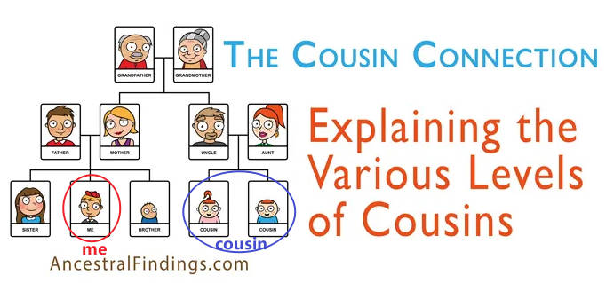

---

==== ▸ immigrant  [105]   +
な/ˈɪmɪɡrənt/   +

【N-COUNT】   An _immigrant_ is a person who has come to live in a country from some other country. Compare . (外来) 移民 +
⇒  ...*illegal immigrants*.  …非法移民。   +

---

==== ▸ symphony  [106]   +
な/ˈsɪmfənɪ/   +
(n.) a long complicated piece of music for a large orchestra 管弦乐队, in three or four main parts (called movements ) 交响乐；交响曲 +
⇒  ...*Beethoven's Ninth Symphony*.  …贝多芬的第九交响曲。   +

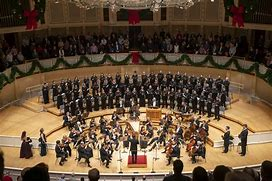

---

==== ▸ rural  [107]   +
な/ˈrʊərəl/   +

【ADJ】  _Rural_ places are far away from large towns or cities. 乡村的 +
⇒  These plants have a tendency *to grow in the more rural areas*.  这些植物倾向于生长在更偏远的乡村地区。   +

【ADJ】  _Rural_ means having features which are typical of areas that are far away from large towns or cities. 有乡村特色的 +
⇒  ...*the old rural way of life*.  …古老的乡村生活方式。   +

---

==== ▸ inspire  [108]   +
な/ɪnˈspaɪə/   +

【V-T】   If someone or something _inspires_ you _to_ do something new or unusual, they make you want to do it. 鼓舞; 激励 +
⇒  Our challenge is to motivate those voters and *inspire them to join our cause*.  我们的艰巨任务是要激励那些投票者, 并鼓励他们加入我们的事业。   +

【V-T】   If someone or something _inspires_ you, they give you new ideas and a strong feeling of enthusiasm. 唤起; 激起 +
⇒  In the 1960s, the electric guitar virtuosity of Jimi Hendrix *inspired a generation*.  20世纪60年代，吉米·亨德里克斯演奏电吉他的精湛技巧, 激发了一代人的热情。   +

【V-T】   If a book, work of art, or action _is inspired by_ something, that thing is the source of the idea for it. 赋…以灵感; 给…以启示 +
⇒  *The book was inspired by a real person*, namely Tamara de Treaux.  这本书是受一个叫塔玛拉·德特罗的人启发而写成的。   +

【COMB in ADJ】   受…灵感启示的 +
⇒  ...*Mediterranean-inspired ceramics*  制瓷艺术,陶瓷制品 in bright yellow and blue.  …源自地中海风格灵感的明黄色和蓝色瓷器。   +

【V-T】   Someone or something that _inspires_ a particular emotion or reaction in people makes them feel that emotion or reaction. 唤起; 激起 +
⇒  The car's performance is effortless /and its handling is precise /and *quickly inspires confidence*.  这辆车开起来毫不费劲且精确到位，能很快激起驾驶员的信心。   +

---

==== ▸ intermediate  [109]   +
な/ˌɪntəˈmiːdɪɪt/   +

【ADJ】   An _intermediate_ stage, level, or position is one that occurs between two other stages, levels, or positions. 中间的 +
⇒  *Do you make any intermediate stops* between your home and work?  你在住所和工作地点之间停留吗？   +

【ADJ】  _Intermediate_ learners of something have some knowledge or skill but are not yet advanced. 中级的 +
⇒  Students are categorized as *novice 新手；初学者, intermediate, or advanced*.  学生分为新生、中级生或高级生。   +

【N-COUNT】   An _intermediate_ is an intermediate learner. 中级生 +
⇒  The ski school *coaches (v.) （对体育运动、工作或技能进行）训练，培养，指导 beginners, intermediates, and advanced skiers*.  滑雪学校训练初级、中级和高级水平的滑雪者。   +

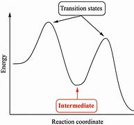

---

==== ▸ decipher  [110]   +
な/dɪˈsaɪfə/   +
--> de-, 不，非，使相反。cipher, 密码。 +
--> cipher : 来自古法语cifre,零，来自意大利语cifra,零，来自阿拉伯语sifr,零，来自s-f-r,空的，空无，词源同zero.因为古人早期对数字零的认识不足，该词逐渐被赋予神秘色彩，词义也由零引申为密码。 +

【V-T】   If you _decipher_ a piece of writing or a message, you work out what it says, even though it is very difficult to read or understand. 破译 +
⇒  I'm still no closer to *deciphering the code*.  破译这个密码我还是没有进展。   +

---

==== ▸ scoff  [111]   +
な/skɒf/   +

【V-I】   If you _scoff at_ something, you speak about it in a way that shows you think it is ridiculous or inadequate. 嘲笑 +
⇒  At first *I scoffed at the notion* 观念；信念；理解.   刚开始时我对那种想法嗤之以鼻。   +

【V-T】   to eat (food) fast and greedily; devour 狼吞虎咽 +
⇒ *Who scoffed all the grapes*? 谁那么贪嘴，把葡萄全吃光了？  +

【N】   an expression of derision 嘲笑   +

---

==== ▸ choir  [112]   +
な/kwaɪə/   +

【N-COUNT】   A _choir_ is a group of people who sing together, for example in a church or school. 唱诗班; 合唱团 +
⇒  *He has been singing in his church choir* since he was six.  他从6岁起就开始在教堂的唱诗班咏唱了。   +

---

==== ▸ encounter  [113]   +
な/ɪnˈkaʊntə/   +

【V-T】   If you _encounter_ problems or difficulties, you experience them. 遭遇 +
⇒  Every day of our lives *we encounter major and minor stresses of one kind or another*.  生活中的每一天，我们会遇到或大或小的这样那样的压力。   +

【V-T】   If you _encounter_ someone, you meet them, usually unexpectedly. 邂逅 +
⇒  *Did you encounter anyone* in the building?  你在那栋大楼里偶然遇到什么人了吗？   +

【N-COUNT】   An _encounter with_ someone is a meeting with them, particularly one that is unexpected or significant. 邂逅 +
⇒  The author tells of *a remarkable encounter with* a group of South Vietnamese soldiers.  作者讲述了他与一群南越士兵的惊人邂逅。   +

【N-COUNT】   An _encounter_ is a particular type of experience. 特殊经历 +
⇒  ...*a sexual encounter*.  …一次性经历。   +

---

==== ▸ exalted  [114]   +
な/ɪɡˈzɔːltɪd/   +
-->  ex-向上 + -alt-高 +

【ADJ】   Someone or something that is at an _exalted_ level is at a very high level, especially with regard to rank or importance. (地位、重要性) 很高的 +
⇒  You must decide *how to make the best use of your exalted position*.  你必须决定如何充分利用你的显赫地位。   +

---

==== ▸ ally  [115]   +
な【N-COUNT】   A country's _ally_ is another country that has an agreement to support it, especially in war. 同盟国   +
⇒  Washington would not take such a step *without its allies' approval*.  没有其同盟国的赞同，华盛顿不会迈出这样的一步。   +

【N-COUNT】   If you describe someone as your _ally_, you mean that they help and support you, especially when other people are opposing you. 盟友 +
⇒  *He is a close ally* of the president.  他是总统的一位亲密盟友。   +

【N-PLURAL】  _The Allies_ were the armed forces that fought against Germany and Japan in World War II. (二战时的) 同盟国 +
⇒  ...Germany's surrender to *the Allies*.  …德国向同盟国的投降。   +

【V-T】   If you _ally yourself with_ someone or something, you give your support to them. 使结盟 +
⇒  He will have no choice but *to ally himself with the new movement*.  他将别无选择，只能与这个新运动结盟。   +

---

==== ▸ receptor  [116]   +
な/rɪˈsɛptə/   +

【N-COUNT】  _Receptors_ are nerve endings in your body which react to changes and stimuli and make your body respond in a particular way. 感受器, 受体 +
⇒  ...*the information receptors* in our brain.  …我们大脑中的信息感受器。   +

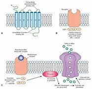

---

==== ▸ bison  [117]   +
な/ˈbaɪsən/   +
--> 来自PIE *weis, 流，散发臭味，词源同virus, 病毒。指野牛身上流出的腥味。字母r,s音变。 +

【N-COUNT】   A _bison_ is a large hairy animal with a large head that is a member of the cattle family. Bison used to be very common in North America and Europe. 大野牛 +

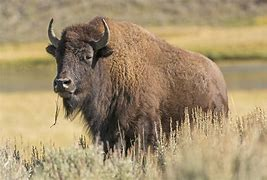

---

==== ▸ dimension  [118]   +
な/dɪˈmɛnʃən, daɪ-/   +

【N-COUNT】   A particular _dimension_ of something is a particular aspect of it. 方面 +
⇒  *There is a political dimension* to the accusations.  这些指控含有政治因素。   +

【N-COUNT】   A _dimension_ is a measurement such as length, width, or height. If you talk about the _dimensions_ of an object or place, you are referring to its size and proportions. (单数) 尺寸; (复数) 比例大小 +
⇒  Drilling will continue on the site *to assess the dimensions of the new oilfield*.  钻探还将继续在现场进行以估测新油田的大小。   +

【N-PLURAL】   If you talk about the _dimensions_ of a situation or problem, you are talking about its extent and size. 规模 +
⇒  *The dimensions of the market collapse*, in terms of turnover and price, were certainly not anticipated.  股市崩盘的规模，无论从成交量还是价格来看，都是出乎意料的。   +

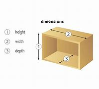

---

==== ▸ tyrannical  [119]   +
な/tɪˈrænɪkəl/   +
--> 来自 tyrant,暴君，-ical,形容词后缀。+

【ADJ】   If you describe someone as _tyrannical_, you mean that they are severe or unfair toward the people that they have authority over. 专横的 +
⇒  She grew up with a drunken mother and *a tyrannical father*.  她从小就和酗酒的母亲和专横的父亲一起生活。   +

【ADJ】   If you describe a government or organization as _tyrannical_, you mean that it acts without considering the wishes of its people and treats them cruelly or unfairly. (政府或组织)专制的 +
⇒  ...one of the world's most oppressive  压迫的；压制的；高压的;闷热的；令人窒息的 and *tyrannical regimes*.  ...世界上最压迫人、最专制的政权之一。   +

---

==== ▸ satiric  [120]   +
な/səˈtɪrɪk/   +

【ADJ】  讽刺的；挖苦的  _Satiric_ means the same as . 同satirical +
⇒  ...*Ibsen's satiric attack on* bourgeois convention.  ...易卜生对资产阶级习惯的讽刺性攻击。   +

---

==== ▸ suppress  [121]   +
な/səˈprɛs/   +

【V-T】   If someone in authority _suppresses_ an activity, they prevent it from continuing, by using force or making it illegal. 镇压; 压制 +
⇒  ...drug traffickers, who continue to flourish *despite international attempts to suppress them*.  …尽管全世界努力镇压, 却继续猖獗的毒贩子们。   +

【N-UNCOUNT】   镇压; 压制 +
⇒  ...people who were imprisoned *after the violent suppression of the pro-democracy movement protests*.  …"赞成民主"的抗议活动后, 受到暴力镇压而被囚禁的人们。   +

【V-T】   If a natural function or reaction of your body _is suppressed_, it is stopped, for example by drugs or illness. 抑制 (身体功能或反应) +
⇒  The reproduction and growth of the cancerous cells *can be suppressed by bombarding 轰炸；轰击 them with radiation*.  癌细胞的繁殖和生长, 可通过放射线辐射加以抑制。   +

【N-UNCOUNT】   抑制 +
⇒  Eye problems can indicate *an unhealthy lifestyle with subsequent suppression of the immune system*.  眼睛问题表明一种不健康的生活方式以及随后免疫系统所受的抑制。   +

【V-T】   If you _suppress_ your feelings or reactions, you do not express them, even though you might want to. 抑制 (情感或反应) +
⇒  Liz thought of Barry and *suppressed a smile*.  利兹想到了巴里，强忍住一个微笑。   +

【N-UNCOUNT】   抑制 +
⇒  *A mother's suppression of her own feelings* can cause problems.  一位母亲对她自己情感的压抑, 可能会导致问题。   +

【V-T】   If someone _suppresses_ a piece of information, they prevent other people from learning it. 封锁 +
⇒  At no time did they try to persuade me *to suppress the information*.  他们从未试图劝我封锁这个消息。   +

【N-UNCOUNT】   封锁 +
⇒  The inspectors found no evidence *which supported any allegation （无证据的）说法，指控 of suppression of official documents*.  这些检察官们找不到证据证明对封锁官方文件的任何指控。   +

【V-T】   If someone or something _suppresses_ a process or activity, they stop it continuing or developing. 阻止 (活动); 抑制 (过程) +
⇒  *The government is suppressing inflation* by increasing interest rates.  政府正通过提高利率, 来抑制通货膨胀。   +

---

==== ▸ strap  [122]   +
な/stræp/   +

【N-COUNT】   A _strap_ is a narrow piece of leather, cloth, or other material. Straps are used to carry things, fasten things together, or to hold a piece of clothing in place. 带子 +
⇒  Nancy *gripped the strap of her beach bag*.  南希抓住自己海滩休闲包的带子。   +
⇒  She pulled the strap of her nightgown onto her shoulder.  她把睡衣的带子拉到她的肩上。   +

【V-T】   If you _strap_ something somewhere, you fasten it there with a strap. 用带子绑 +
⇒  She strapped the baby seat into the car.  她把婴儿座椅用带子绑在那辆汽车上。   +

---

==== ▸ summarize  [123]   +
な/ˈsʌməˌraɪz/   +

【V-T/V-I】   If you _summarize_ something, you give a summary of it. 总结 +
⇒  Table 3.1 summarizes the information given above.  表3.1总结了以上所给信息。   +
⇒  Basically, the article can be summarized in three sentences.  基本上，这篇文章可用3句话概括。   +

---

==== ▸ discourse  [124]   +
な/ˈdɪskɔːs/   +
--> dis-, 分开，散开。course, 跑，跑道。原指谈话，全面的了解，后用来指论文，演讲。 +

【N-UNCOUNT】  _Discourse_ is spoken or written communication between people, especially serious discussion of a particular subject. (某专题的) 会话 +
⇒  ...a tradition of *political discourse*.  …一个政治对话的传统。   +
⇒  He was hoping for *some lively political discourse* at the meeting. 他希望在会上听到些生动的政治演讲。 +

---

==== ▸ zealous  [125]   +
な/ˈzɛləs/   +

【ADJ】   Someone who is _zealous_ spends a lot of time or energy in supporting something that they believe in very strongly, especially a political or religious ideal. (尤指对政治或宗教理想) 热衷的 +
⇒  She was *a zealous worker for charity*.  她是个热衷于慈善事业的工作者。   +

---

==== ▸ foreshorten  [126]   +
な/fɔːˈʃɔːtən/   +

【V-T】   To _foreshorten_ someone or something means to draw them, photograph them, or see them from an unusual angle so that the parts of them that are furthest away seem smaller than they really are. 以透视法缩短(描绘对象) +
⇒  She could see herself in the reflecting lenses, *which had grotesquely 奇异地；荒诞地 foreshortened her*.  她可以在反射镜头中看到自己被怪异地缩短了。   +

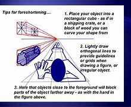

---

==== ▸ emotion  [127]   +
な/ɪˈməʊʃən/   +

【N-VAR】   An _emotion_ is a feeling such as happiness, love, fear, anger, or hatred, which can be caused by the situation that you are in or the people you are with. 感情 +
⇒  *Happiness was an emotion* that Jerry was having to relearn.  幸福是一种杰瑞当时不得不再学习的感情。   +

【N-UNCOUNT】  _Emotion_ is the part of a person's character that consists of their feelings, as opposed to their thoughts. (与思想相对的) 情感 +
⇒  ...the split between *reason and emotion*.  …理智与情感间的分离。   +

---

==== ▸ enslave  [128]   +
な/ɪnˈsleɪv/   +

【V-T】   To _enslave_ someone means to make them into a slave. 奴役; 使(某人)成为奴隶 +
⇒  *They'd been enslaved* and had to do what they were told.  他们已经沦为奴隶，不得不唯命是从。   +
⇒  I'd die myself before I'd let anyone enslave your folk ever again.  我死也不会让任何人再奴役你们。   +
⇒  George was born to an enslaved African mother.  乔治的母亲是一位非洲奴隶。   +

【V-T】   To _enslave_ a person or society means to trap them in a situation from which they cannot escape. 束缚; 约束 +
⇒  ...the various cultures, cults and religions *that have enslaved human beings for untold 难以形容的（大、恶劣等） years*.  ...多少年来束缚人类的各种文化、礼仪和宗教。   +
⇒  It would be a tragedy if both sexes were enslaved to the god of work.  如果男女两性都被工作所束缚，那将会是一场悲剧。   +

---

==== ▸ genre  [129]   +
な/ˈʒɑːnrə/   +
--> 来自词根gen, 生育，词源同generate. 用于文学术语。 +

【N-COUNT】   A _genre_ is a particular type of literature, painting, music, film, or other art form which people consider as a class because it has special characteristics. (文学、绘画、音乐、电影等艺术作品的) 体裁 +
⇒  ...his love of films and novels *in the horror genre*.  …他对恐怖体裁电影和小说的热爱。   +

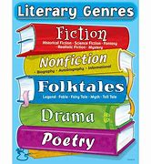

---

==== ▸ syllable  [130]   +
な/ˈsɪləbəl/   +

【N-COUNT】   A _syllable_ is a part of a word that contains a single vowel sound and that is pronounced as a unit. So, for example, "book" has one syllable, and "reading" has two syllables. 音节 +
⇒  We children called her Oma, *accenting both syllables*.  我们这些孩子叫她，两个音节都重读。   +

---

==== ▸ superior  [131]   +
な/suːˈpɪərɪə/   +

【ADJ】   If one thing or person is _superior to_ another, the first is better than the second. 比…好的 +
⇒  We have a relationship *infinitely 非常 superior to those of many of our friends*.  我们之间的关系远比我们许多朋友之间的关系好得多。   +

【N-UNCOUNT】   优越性 +
⇒  *The technical superiority of laser discs over tape* is well established.  光盘相对磁带在技术上的优越性是确定无疑的。   +

【ADJ】   If you describe something as _superior_, you mean that it is good, and better than other things of the same kind. 上好的 +
⇒  A few years ago it was virtually impossible to find *superior quality coffee* in local shops.  几年前在当地的商店里几乎不可能买到上好的咖啡。   +

【ADJ】   A _superior_ person or thing is more important than another person or thing in the same organization or system. 上级的 +
⇒  ...negotiations between the mutineers and their *superior officers*.  …那些反叛者和他们的上级军官们之间的谈判。   +

【N-COUNT】   Your _superior_ in an organization that you work for is a person who has a higher rank than you. 上级 +
⇒  Other army units are completely surrounded and *cut-off from communication with their superiors*.  其他部队完全被包围，与上级的联系也被切断了。   +

【ADJ】   If you describe someone as _superior_, you disapprove of them because they behave as if they are better, more important, or more intelligent than other people. 有优越感的 +
⇒  Finch *gave a superior smile*.  芬奇富有优越感地一笑。   +

【N-UNCOUNT】   优越 +
⇒  ...a false sense of *his superiority over mere journalists*.  …他在记者面前才有的虚假的优越感。   +

【ADJ】   If one group of people has _superior_ numbers to another group, the first has more people than the second, and therefore has an advantage over it. (人数) 占优势的 +
⇒  The demonstrators fled *when they saw the authorities' superior numbers*.  示威者们看到官方占优势的人数时, 就逃跑了。   +

---

==== ▸ denote  [132]   +
な/dɪˈnəʊt/   +

【V-T】   If one thing _denotes_ another, it is a sign or indication of it. 显示 +
⇒  Red eyes *denote strain and fatigue*.  眼睛发红显示紧张和疲劳。   +

【V-T】   What a symbol _denotes_ is what it represents. 代表 +
⇒  X denotes those not voting.  X表示那些没有投票的。   +

---

==== ▸ bagel  [133]   +
な/ˈbeɪɡəl/   +

【N-COUNT】   A _bagel_ is a ring-shaped bread roll. 百吉饼 +

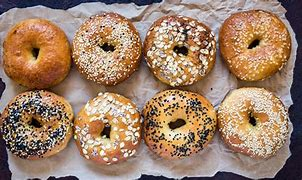

---

==== ▸ yolk  [134]   +
な/jəʊk/   +
--> 词源同 yellow,用以指蛋黄。比较 albumen. +

【N-VAR】   The _yolk_ of an egg is the yellow part in the middle. 蛋黄 +
⇒  Only the yolk contains cholesterol.  只有蛋黄含胆固醇。   +

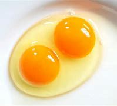

---

==== ▸ ethnology  [135]   +
な/ɛθˈnɒlədʒɪ/   +

【N】   the branch of anthropology that deals with races and peoples, their relations to one another, their origins, and their distinctive characteristics 社会人类学 +

---

==== ▸ court  [136]   +
な/kɔːt/   +

【N-COUNT】   A _court_ is a place where legal matters are decided by a judge and jury or by a magistrate. 法庭 +
⇒  At this rate, we could find ourselves in the divorce courts!  照这样下去，我们可能会在离婚法庭上对簿公堂！   +
⇒  ...a county *court judge*.  …一名县法院的法官。   +

【N-COUNT】   You can refer to the people in a court, especially the judge, jury, or magistrates, as a _court_. (一次开庭的) 全体审判人员 +
⇒  *A court at Tampa, Florida* has convicted 定罪；宣判…有罪 five officials 后定 on charges of handling millions of dollars 后定 earned from illegal drug deals.  佛罗里达州坦帕市的一个法庭宣布, 被指控通过非法毒品买卖获取上百万美元的5名官员, 罪名成立。   +

【N-COUNT】   A _court_ is an area in which you play a game such as tennis, basketball, badminton, or squash. 球场 +
⇒  The hotel has *several tennis and squash （软式）墙网球；壁球 courts*.  该旅馆有几个网球场和壁球场。   +

【N-COUNT】   The _court_ of a king or queen is the place where he or she lives and carries out ceremonial or administrative duties. 王宫 +
⇒  She came to visit England, where *she was presented at the court of James I*.  她来访问英格兰，在詹姆斯一世的王宫受到了接见。   +

【PHRASE】   If you _go to court_ or _take_ someone _to court_, you take legal action against them. 起诉 +
⇒  They have received at least twenty thousand dollars each *but went to court to demand more*.  他们每人至少已经得到了两万美元，但还起诉以求得到更多。   +

【PHRASE】   If a legal matter is decided or settled _out of court_, it is decided without legal action being taken in a court of law. 不经法院庭审的 +
⇒  The Government is anxious *to keep the whole case out of court*.  政府急于把整个案子庭外了结。   +
 ▷ court   +
な/kɔːt/   +

【PHRASE】 +
【V-T】   To _court_ a particular person, group, or country means to try to please them or improve your relations with them, often so that they will do something that you want them to do. 讨好; 取悦   +
⇒  Both Democratic and Republican parties *are courting (v.)  former supporters of* Ross Perot.  民主党和共和党都在讨好以前罗斯·佩罗的支持者。   +

【V-T】   If you _court_ something such as publicity （媒体的）关注，宣传，报道 or popularity 受欢迎；普及；流行, you try to attract it. 设法获得 +
⇒  *Having spent a lifetime avidly 贪心地；热心地 courting (v.)  publicity*, Paul has suddenly become secretive.  花了一生的时间狂热地追求出名之后，保罗突然变得遮遮掩掩起来了。   +

【V-T】   If you _court_ something unpleasant such as disaster or unpopularity, you act in a way that makes it likely to happen. 招致 +
⇒  If he thinks he can remain in power by force, *he is courting disaster*.  如果他认为可以通过武力维持权力的话，那就是在招灾惹祸。   +

【V-RECIP】   If you _are courting_ someone of the opposite sex, you spend a lot of time with them, because you are intending to get married. You can also say that a man and a woman _are courting_. 对…求爱; 谈恋爱 +
⇒  *I was courting Billy at 19* and married him when I was 21.  我19岁时和比利谈恋爱，21岁时嫁给了他。   +

---

==== ▸ squabble  [137]   +
な/ˈskwɒbəl/   +

【V-RECIP】   When people _squabble_, they quarrel about something that is not really important. (为琐事) 争吵 +
⇒  Mother is devoted to Dad *although they squabble all the time*.  妈妈深爱着爸爸，虽然他们总是为琐事争吵。   +
⇒  *The children were squabbling over* the remote-control for the television.  孩子们正在为争夺电视机的遥控器发生口角。   +

【N-UNCOUNT】   争吵 +
⇒  In recent months *its government has been paralysed by political squabbling*.  最近几个月其政府因为政治争吵已经瘫痪了。   +

【N-COUNT】  _Squabble_ is also a noun. 争吵 +
⇒  *There have been minor 较小的；次要的；轻微的 squabbles about* phone bills.  为电话账单已闹过口角。   +

---

==== ▸ seasoning  [138]   +
な/ˈsiːzənɪŋ/   +
--> 来自古法语 seson,播种季节，播种时间，来自拉丁语 satio,播种，过去分词名词格于 serere +

【N-MASS】  _Seasoning_ is salt, pepper, or other spices that are added to food to improve its flavour. 佐料 +
⇒  Mix the meat with the onion, carrot, *and some seasoning*.  将肉、洋葱、胡萝卜及一些佐料拌在一起。   +

---

==== ▸ trend  [139]   +
な/trɛnd/   +

【N-COUNT】   A _trend_ is a change or development toward something new or different. 趋势 +
⇒  This is *a growing trend*.  这是一个不断增长的趋势。   +
⇒  ...*a trend toward* part-time employment.  …非全日制就业的趋势。   +

【N-COUNT】   To set a _trend_ means to do something that becomes accepted or fashionable, and that a lot of other people copy. 时尚 +
⇒  *The latest trend is* gardening.  最新的时尚是园艺。   +

---

==== ▸ sneaker  [140]   +
な/ˈsniːkə/   +
--> 可能来自中古英语 sniken,爬，蜷缩. 词源同 snail,snake.引申词义偷偷地走，溜走。+

【N-COUNT】  _Sneakers_ are casual shoes with rubber soles that people wear often for running or other sports. 运动鞋 +

---

==== ▸ lessen  [141]   +
な/ˈlɛsən/   +

【V-T/V-I】   If something _lessens_ or you _lessen_ it, it becomes smaller in size, amount, degree, or importance. 减少; 降低; 减轻 +
⇒  He is used to a lot of attention from his wife, *which will inevitably lessen (v.)*  when the baby is born.  他**习惯了**妻子无微不至的关心，这种关心在孩子出生以后将不可避免地减少。   +

【N-UNCOUNT】   减轻 +
⇒  ...increased trade and *a lessening of tension* on the border.  …贸易的增加, 和边境紧张局势的减轻。   +

---

==== ▸ pack  [142]   +
な/pæk/   +

【V-T/V-I】   When you _pack_ a bag, you put clothes and other things into it, because you are leaving a place or going on holiday. 打点 (行装) +
⇒  When I was 17, I packed my bags and left home.  在我17岁的时候，打起行囊离开了家。   +
⇒  *I began to pack a few things* for the trip.  我开始为旅行收拾些东西。   +

【N-UNCOUNT】   打包; 包装 +
⇒  She left Frances to finish her packing.  她让弗朗西斯把她的行李收拾完。   +

【V-T】   When people _pack_ things, for example, in a factory, they put them into containers or boxes so that they can be shipped and sold. 包装; 把…装箱 +
⇒  They offered me a job *packing boxes in a warehouse*.  他们为我提供了一份在仓库装箱的工作。   +
⇒  Machines now exist *to pack olives in jars*.  现在有可以把橄榄装进罐里的机器。   +

【N-UNCOUNT】   包装; 装箱 +
⇒  *The shipping and packing costs* are passed along in the item price.  运输和装箱费用已经含在单价中了。   +

【V-T/V-I】   If people or things _pack into_ a place or if they _pack_ a place, there are so many of them that the place is full. 挤满 +
⇒  *Hundreds of people packed into* the mosque.  成百上千的人挤进了清真寺。   +

【V】   to fill (a legislative body, committee, etc) with one's own supporters 把自己的支持者安插进(立法机构等) +
⇒  to pack a jury 陪审团    +

【N-COUNT】   A _pack of_ things is a collection of them that is sold or given together in a box or bag. 盒; 包 +
⇒  The club *will send a free information pack*.  俱乐部将赠送一个免费的信息包。   +

【N-COUNT】   You can refer to a group of people who go around together as a _pack_, especially when it is a large group that you feel threatened by. 一群 (尤指令人感到受到威胁的) +
⇒  *He thus avoided a pack of journalists* eager to question him.  他就这样避开了一群急于向他提问的记者。   +

【N-COUNT】   a bundle or load, esp one carried on the back (背的)一捆 +
【N-COUNT】   (_as modifier_) 驮   +
⇒  a pack animal     +

【N-COUNT】   A _pack of_ wolves or dogs is a group of them that hunt together. 一群 (狼或狗) +
⇒  ...*a pack of stray (a.) 走失的；无主的 dogs.*  …一群流浪狗。   +

【N-COUNT】   A _pack of_ playing cards is a complete set of playing cards. 一副 (纸牌) +
⇒  Matt picked up the cards and *shuffled the pack*.  马特收齐纸牌，洗了这付牌。   +

【PHRASE】   If you say that an account is _a pack of lies_, you mean that it is completely untrue. 一派胡言 +
⇒  You told me *a pack of lies*.  你跟我说的是一派胡言。   +

【PHRASE】   If you _send_ someone _packing_, you make them go away. 打发 (某人) 离开 +
⇒  I decided I wanted to live alone and *I sent him packing*.  我决定要独自生活，所以我把他打发走了。   +

---

==== ▸ trifle  [143]   +
な/ˈtraɪfəl/   +

【PHRASE】   You can use _a trifle_ to mean slightly or to a small extent, especially in order to make something you say seem less extreme. 有点儿 +
⇒  As a photographer, *he'd found* both locations *just a trifle disappointing*.  作为一名摄影师，他发现这两个地方都有点儿令人失望。   +

【N-COUNT】   A _trifle_ is something that is considered to have little importance, value, or significance. 琐事; 微不足道的东西 +
⇒  *He had no money to spare 抽出；拨出；留出；匀出 on trifles*.  他没钱花在琐碎的东西上。   +

【N-VAR】  _Trifle_ is a cold dessert （饭后）甜点，甜食 made of layers of sponge cake 巧克力海绵蛋糕, fruit gelatin 明胶, fruit, and custard 蛋奶沙司（通常与熟水果、布丁等一同食用）;（烤制的）蛋奶糕，蛋挞, and usually covered with cream. 屈莱弗甜食 (由蛋糕、果冻、水果、蛋奶沙司做成，上浇鲜奶油。) +
⇒  ...*a bowl of trifle*.  …一碗屈莱弗甜食。   +

---

==== ▸ stalk  [144]   +
な/stɔːk/   +

【N-COUNT】   The _stalk_ of a flower, leaf, or fruit is the thin part that joins it to the plant or tree. (花、叶、果实与植株相连的) 柄; 梗 +
⇒  A single pale blue flower *grows up* from each joint *on a long stalk*.  一根长梗的每个节上都长出了一朵淡蓝色的花。   +

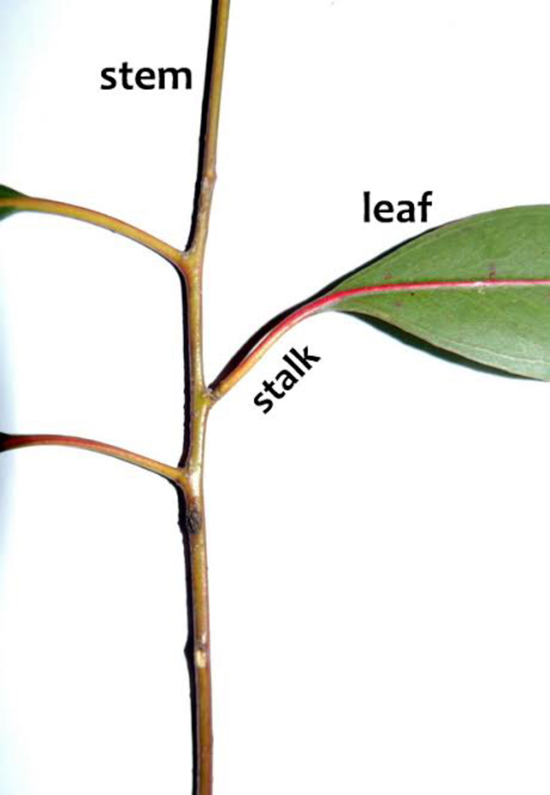

【V-T】   If you _stalk_ a person or a wild animal, you follow them quietly in order to kill them, catch them, or observe them carefully. 悄悄跟踪 +
⇒  *He stalks his victims* like a hunter after a deer.  他像猎人跟踪鹿一样, 悄悄跟踪他的受害者们。   +

【V-T】   If someone _stalks_ someone else, especially a famous person or a person they used to have a relationship with, they keep following them or contacting them in an annoying and frightening way. 骚扰; 纠缠 +
⇒  Even after their divorce *he continued to stalk and threaten her*.  甚至在他们离婚后，他继续纠缠并恐吓她。   +

---

==== ▸ spew  [145]   +
な/spjuː/   +

【V-T/V-I】   When something _spews_ out a substance or when a substance _spews_ from something, the substance flows out quickly in large quantities. 喷出 +
⇒  The volcano *spewed out* more scorching 酷热的 volcanic 火山的；火山引起的；火山产生的 ashes, gases, and rocks.  该火山喷出了更多灼热的火山灰、各种气体和岩石。   +

---

==== ▸ illusion  [146]   +
な/ɪˈluːʒən/   +

【N-VAR】   An _illusion_ is a false idea or belief. 幻想 +
⇒  *No one really has any illusions about* winning the war.  事实上没有人对打赢这场战争抱任何幻想。   +

【N-COUNT】   An _illusion_ is something that appears to exist or be a particular thing but does not actually exist or is in reality something else. 假象 +
⇒  Floor-to-ceiling windows can look stunning  极有魅力的；绝妙的；给人以深刻印象的, *giving the illusion of* extra height.  从地板直抵天花板的窗户看上去非常漂亮，有增加高度的假象。   +

---

==== ▸ stack  [147]   +
な/stæk/   +

【N-COUNT】   A _stack of_ things is a pile of them. 摞; 堆 +
⇒  *There were stacks of books* on the bedside table and floor.  床头桌上和地板上有一摞摞的书。   +

【V-T】   If you _stack_ a number of things, you arrange them in neat piles. 堆放; 摞起 +
⇒  Mrs. Cathiard *was stacking the clean bottles* in crates.  卡提亚夫人当时正在把干净的瓶子堆放到板条箱里。   +

【PHRASAL VERB】  _Stack up_ means the same as . 堆放; 摞起 +
⇒  He ordered them *to stack up pillows* behind his back.  他命令他们在他背后堆放一些枕头。   +

【N-PLURAL】   If you say that someone has _stacks of_ something, you mean that they have a lot of it. 堆 +
⇒  If the job's that good, *you'll have stacks of money*.  如果那份工作真那么好，你就会有成堆的钱。   +

【PHRASE】   If you say that _the odds are stacked against_ someone, or that particular factors _are stacked against_ them, you mean that they are unlikely to succeed in what they want to do because the conditions are not favourable. 形势对某人不利 +
⇒  *The odds are stacked against civilians* getting a fair trial.  形势对想得到公正判决的平民不利。   +

---

==== ▸ pliant  [148]   +
な/ˈplaɪənt/   +
--> 来自ply,弯，转，-ant,形容词后缀。引申词义柔顺的，温顺的。 +

【ADJ】   A _pliant_ person can be easily influenced and controlled by other people. 易受影响的; 顺从的 +
⇒  She's proud and stubborn, you know, *under that pliant exterior* （人的）外貌，外表.   她既傲气又固执，你知道的，在那温顺的外表下。   +

【ADJ】   If something is _pliant_, you can bend it easily without breaking it. 易弯的; 柔韧的 +
⇒  ...*pliant young willows*.  ...柔韧的嫩柳。   +

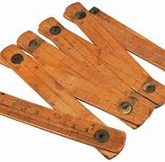

---

==== ▸ reddish  [149]   +
な/ˈrɛdɪʃ/   +

【ADJ】  _Reddish_ means slightly red in colour. 微红的 +
⇒  *He had reddish brown hair*.  他有一头略带红色的褐发。   +

---

==== ▸ democracy  [150]   +
な/dɪˈmɒkrəsɪ/   +
--> demo-, 人民。-cracy, 管理，统治。 +

【N-UNCOUNT】  _Democracy_ is a system of government in which people choose their rulers by voting for them in elections. 民主政体 +
⇒  *The spread of democracy in Eastern Europe* appears to have had negative as well as positive consequences.  东欧民主政体的蔓延看来既有消极也有积极的影响。   +

【N-COUNT】   A _democracy_ is a country in which the people choose their government by voting for it. 民主国家 +
⇒  *The new democracies* face tough challenges.  新生的民主国家面临严峻的挑战。   +

---

==== ▸ rhinoceros  [151]   +
な/raɪˈnɒsərəs/   +
--> rhin,鼻子，-cer,角，词源同 horn.因这种动物鼻子如角而得名。 +

【N-COUNT】   A _rhinoceros_ is a large Asian or African animal with thick, grey skin and a horn, or two horns, on its nose. 犀牛 +

---

==== ▸ shrub  [152]   +
な/ʃrʌb/   +
--> 来自古英语 scrybb,灌木，可能最终来自 PIE*sker,砍，切，词源同 shear,short. +

【N-COUNT】  _Shrubs_ are plants that have several woody stems. 灌木 +
⇒  ...*flowering shrubs*.  …开花的灌木。   +

【N】   a mixed drink of rum, fruit juice, sugar, and spice 果汁甜酒 +

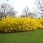

---

==== ▸ parking  [153]   +
な/ˈpɑːkɪŋ/   +

【N-UNCOUNT】  _Parking_ is the action of moving a vehicle into a place in a garage or by the side of the road where it can be left. 停车 +
⇒  In many towns /*parking is allowed only on one side of the street*.  在很多小镇里，只能允许在街道的一侧停车。   +

【N-UNCOUNT】  _Parking_ is space for parking a vehicle in. 停车位 +
⇒  Cars allowed, *but parking is limited*.  汽车可以得到，但是停车位是有限的。   +

---

==== ▸ suspension  [154]   +
な/səˈspɛnʃən/   +

【N-UNCOUNT】   The _suspension_ of something is the act of delaying or stopping it for a while or until a decision is made about it. 延缓; 暂停 +
⇒  *There's been a temporary suspension of flights* out of LA.  从洛杉矶起飞的飞机已经暂停。   +

【N-VAR】   Someone's _suspension_ is their removal from a job or position for a period of time or until a decision is made about them. 停职 +
⇒  The minister warned that *any civil servant not at his desk faced immediate suspension*.  那位部长警告说任何擅自离岗的公务员面临着立即停职。   +

【N-VAR】   A vehicle's _suspension_ consists of the springs and other devices attached to the wheels, which give a smooth ride over uneven ground. (车辆减震的) 悬架 +
⇒  ...the only small car *with independent front suspension*.  …惟一的一辆带有独立前悬架的小汽车。   +

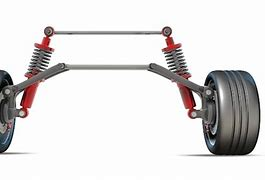

---

==== ▸ strategy  [155]   +
な/ˈstrætɪdʒɪ/   +

【N-VAR】   A _strategy_ is a general plan or set of plans intended to achieve something, especially over a long period. 策略 +
⇒  The energy secretary *will present the strategy* tomorrow afternoon.  能源部长将于明天下午提出该策略。   +

【N-UNCOUNT】  _Strategy_ is the art of planning the best way to gain an advantage or achieve success, especially in war. 战略 +
⇒  I've just been explaining *the basic principles of strategy* to my generals.  我刚才一直在向我的将军们解释战略的基本原则。   +

---

==== ▸ outlying  [156]   +
な/ˈaʊtˌlaɪɪŋ/   +

【ADJ】  _Outlying_ places are far away from the main cities of a country. 边远的 +
⇒  *Tourists can visit outlying areas* like the Napa Valley Wine Country.  游客可以去纳帕谷酒乡这样的边远地区。   +

---

==== ▸ conductivity  [157]   +
(n.) 导电性；[物][生理] 传导性 +
⇒  *thermal conductivity* 导热系数；热导率 +
⇒ *electrical conductivity* 导电性；导电率

---

==== ▸ effective  [158]   +
な/ɪˈfɛktɪv/   +

【ADJ】   Something that is _effective_ works well and produces the results that were intended. 有效的 +
⇒  The project looks at *how we could be more effective in* encouraging students to enter teacher training.  该项目研究如何更有效地鼓励学生参加教师培训。   +
⇒  Simple antibiotics are effective against this organism.  普通的抗生素就能够有效地抑制这种微生物。   +

【ADV】   有效地 +
⇒  *Services need to be organized more effectively* than they are at present.  服务需要比现在更有效地被组织起来。   +

【ADJ】  _Effective_ means having a particular role or result in practice, though not officially or in theory. 实际的 +
⇒  *They have had effective control of the area* since the security forces left.  自从安全部队离开后，他们实际控制了这一地区。   +

【ADJ】   When something such as a law or an agreement becomes _effective_, it begins officially to apply or be valid. (法律、协议等) 生效的 +
⇒  *The new rules will become effective* in the next few days.  这些新条例将在接下来的几天内生效。   +

---

==== ▸ fold  [159]   +
な/fəʊld/   +

【V-T】   If you _fold_ something such as a piece of paper or cloth, you bend it so that one part covers another part, often pressing the edge so that it stays in place. 折叠 +
⇒  *He folded the paper carefully*.  他小心地把那张纸折起来。   +
⇒  *Fold the omelette in half*.  把煎蛋对折。   +

【V-T/V-I】   If a piece of furniture or equipment _folds_ or if you can _fold_ it, you can make it smaller by bending or closing parts of it. 翻折 +
⇒  The back of the bench *folds forward* to make a table.  长椅的靠背可向前翻折成一张桌子。   +
⇒  This portable seat *folds flat* for easy storage 存储（方式）.  这张便携式座椅可折平，便于存放。   +

【PHRASAL VERB】  _Fold up_ means the same as . fold up同fold +
⇒  When not in use /*it folds up* out of the way.  不用的时候，它折起来不会挡路。   +

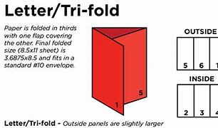

【V-T】   If you _fold_ your arms or hands, you bring them together and cross or link them, for example, over your chest. 交叠 (双臂或双手) +
⇒  Meer *folded his arms over his chest* 胸部；胸膛 and turned his head away.  米尔把双臂交叠在胸前，扭开头去。   +

【V】   to mix (a whisked mixture) with other ingredients by gently turning one part over the other with a spoon (将被搅拌过的混合物)拌入 (Also fold in) +

【N-COUNT】   A _fold_ in a piece of paper or cloth is a bend that you make in it when you put one part of it over another part and press the edge. 折痕   +
⇒  *Make another fold* and turn the ends together.  再折一次，然后把两端叠在一起。   +

【N-COUNT】   The _folds_ in a piece of cloth are the curved shapes which are formed when it is not hanging or lying flat. 褶皱 +
⇒  The priest fumbled 笨手笨脚地做（某事）；胡乱摸找（某物）  in *the folds of his gown* （法官、英国律师、大学学生在特别仪式上穿的）长袍，长外衣.  这位牧师胡乱地整了整长袍上的褶皱。   +

【N】   a small enclosure or pen for sheep or other livestock, where they can be gathered (圈养羊等其他家畜的)小围栏 +
【N】   the sheep or other livestock gathered in such an enclosure (羊等其他家畜)聚集于小围栏里   +

【N】   a flock of sheep 羊群 +
【N】   a herd of Highland cattle 一群高地牛群   +

【N】   a church or the members of it 一个教会; 教会成员 +

---

==== ▸ typical  [160]   +
な/ˈtɪpɪkəl/   +

【ADJ】   You use _typical_ to describe someone or something that shows the most usual characteristics of a particular type of person or thing, and is therefore a good example of that type. (某人或某物) 有典型性的; 有代表性的 +
⇒  Cheney *is everyone's image of a typical cop*: a big white guy, six feet, 220 pounds.  切尼是每个人心目中典型的警察形象：高大的白人，身高6英尺，体重220磅。   +

【ADJ】   If a particular action or feature is _typical of_ someone or something, it shows their usual qualities or characteristics. (行为或特征) 典型的 +
⇒  This reluctance to move toward a democratic state *is typical of* totalitarian 极权主义的 regimes.  这种不愿朝民主国家迈进的态度, 是极权主义政体的典型特征。   +

【ADJ】   If you say that something is _typical of_ a person, situation, or thing, you are criticizing them or complaining about them and saying that they are just as bad or disappointing as you expected them to be. 一贯的 (用于批评或抱怨) +
⇒  She threw her hands into the air. "*That is just typical of you*, isn't it?"  她往空中挥挥双手说，“你一贯就是这个样子，是不是？”   +

---

==== ▸ stark  [161]   +
な/stɑːk/   +
--> 词根-star-指“硬”，环境很硬即不温柔，因而严酷，正如hard既指“硬”又指“困难的”。starch（淀粉；上浆）同源，人们用淀粉为织物上浆，使其变得硬挺。 +

【ADJ】  _Stark_ choices or statements are harsh and unpleasant. 严酷的 +
⇒  *Companies face a stark choice* if they want to stay competitive.  各公司要想保持竞争力就要面临一个严酷的选择。   +

【ADV】   严酷地 +
⇒  *That issue is presented starkly and brutally* 残忍地；野蛮地；兽性地 by Bob Graham and David Cairns.  那个问题被鲍勃·格雷厄姆和戴维·凯恩斯冷酷无情地提了出来。   +

【ADJ】   If two things are in _stark_ contrast to one another, they are very different from each other in a way that is very obvious. (对比) 鲜明的 +
⇒  ...secret cooperation between London and Washington 后定 *that was in stark contrast to* official policy.  …伦敦和华盛顿之间的"与官方政策明显相悖的"秘密合作。   +

【ADV】   鲜明地 +
⇒  Angus's child-like paintings *contrast starkly with* his adult subject matter in these portraits.  安格斯孩子般的绘画, 和他这些肖像画里的成人主题, 对比鲜明。   +

【ADJ】   Something that is _stark_ is very plain in appearance. 普通的 +
⇒  ...*the stark white*, characterless fireplace in the drawing room.  …起居室里平淡无奇的白色壁炉。   +

【ADV】   普通地 +
⇒  The room was starkly furnished.  那房间布置得很普通。   +

---

==== ▸ comment  [162]   +
な/ˈkɒmɛnt/   +

【V-T/V-I】   If you _comment on_ something, you give your opinion about it or you give an explanation for it. 评论; 解释 +
⇒  So far, Mr. Cook *has not commented on these reports*.  到目前为止，库克先生还未对这些报告进行过评论。   +
⇒  *You really can't comment* until you know the facts.  你的确不能在你知道事实之前进行评论。   +
⇒  *One student commented that* she preferred literature to social science.  一位学生解释说，较之于社会科学她更喜欢文学。   +

【N-VAR】   A _comment_ is something that you say which expresses your opinion of something or which gives an explanation of it. 评论; 解释 +
⇒  *He made his comments* at a news conference in Amsterdam.  他在阿姆斯特丹的一次记者招待会上做了评论。   +
⇒  *There's been no comment* so far from police *about* the allegations.  到目前为止还没有来自警方的对那些指控的任何解释。   +

【CONVENTION】   People say "_no comment_" as a way of refusing to answer a question, usually when it is asked by a journalist. 无可奉告 +
⇒  *No comment*. I don't know anything.  无可奉告。我什么也不知道。   +

---

==== ▸ towering  [163]   +
な/ˈtaʊərɪŋ/   +
--> 来自 tower,高耸，耸立。 +

【ADJ】   If you describe something such as a mountain or cliff as _towering_, you mean that it is very tall and therefore impressive. 高耸的 +
⇒  ...*towering cliffs of black granite* 花岗岩；花岗石 which rise straight out of the sea.  …高耸的黑色花岗岩峭壁，从海里径直升起。   +

【ADJ】   If you describe someone or something as _towering_, you are emphasizing that they are impressive because of their importance, skill, or intensity. 杰出的 +
⇒  He remains *a towering figure* in rock and roll.  他仍是摇滚乐界的一位杰出人物。   +

---

==== ▸ ruin  [164]   +
な/ˈruːɪn/   +

【V-T】   To _ruin_ something means to severely harm, damage, or spoil it. 毁坏 +
⇒  *My wife was ruining her health* through worry.  我妻子的忧虑正在损害着她的健康。   +

【V-T】   To _ruin_ someone means to cause them to no longer have any money. 使倾家荡产 +
⇒  She accused him of *ruining her financially* with his taste for the high life.  她指责他因其对高档生活的追求使得她倾家当产。   +

【N-UNCOUNT】  _Ruin_ is the state of no longer having any money. 破产 +
⇒  The farmers say *recent inflation has driven them to the brink of ruin*.  那些农民们说最近的通货膨胀已经把他们逼到了破产的边缘。   +

【N-UNCOUNT】  _Ruin_ is the state of being severely damaged or spoiled, or the process of reaching this state. 毁坏; 破落 +
⇒  The vineyards *were falling into ruin*.  那些葡萄园当时正日渐没落。   +

【N-PLURAL】  _The ruins of_ something are the parts of it that remain after it has been severely damaged or weakened. 残存部分 +
⇒  `主` The new Turkish republic 后定 he helped to build `谓` *emerged from the ruins of a great empire*.  他帮助创建的新土耳其共和国, 是在大帝国残存的领土上建立起来的。   +

【N-COUNT】  _The__ruins_ of a building are the parts of it that remain after the rest has fallen down or been destroyed. 废墟 +
⇒  *One dead child was found in the ruins* almost two hours after the explosion.  一名遇难儿童在爆炸发生近两小时后在废墟中被找到。   +

【PHRASE】   If something is _in ruins_, it is completely spoiled. 毁灭了的 +
⇒  Its heavily subsidized economy *is in ruins*.  它的严重依赖于资助的经济已崩溃了。   +

【PHRASE】   If a building or place is _in ruins_, most of it has been destroyed and only parts of it remain. 成为废墟了的 +
⇒  The abbey *was in ruins*.  这座修道院成了一片废墟。   +

---

==== ▸ pebble  [165]   +
な/ˈpɛbəl/   +

【N-COUNT】   A _pebble_ is a small, smooth, round stone which is found on beaches and at the bottom of rivers. 卵石 +

---

==== ▸ modify  [166]   +
な/ˈmɒdɪˌfaɪ/   +

【V-T】   If you _modify_ something, you change it slightly, usually in order to improve it. 修改 +
⇒  The club members did agree *to modify their recruitment policy*.  俱乐部成员确已同意修改他们的入会政策。   +

【N-VAR】   修改 +
⇒  Relatively minor modifications were required.  需要相对较小的修改。   +

---

==== ▸ effluent  [167]   +
な/ˈɛflʊənt/   +
--> ef-, 向外。-flu, 流，词源同flu, fluent. +

【N-MASS】  _Effluent_ is liquid waste material that comes out of factories or sewage works. 污水 +
⇒  *The effluent from the factory* was dumped into the river.  那家工厂的污水被排到了河里。   +

---

==== ▸ perfume  [168]   +
な/ˈpɜːfjuːm/   +

【N-MASS】  _Perfume_ is a pleasant-smelling liquid that women put on their skin to make themselves smell nice. 香水 +
⇒  The hall *smelled of her mother's perfume*.  大厅里弥漫着她母亲的香水味。   +
⇒  ...*a bottle of perfume*.  …一瓶香水。   +

【N-MASS】  _Perfume_ is the ingredient that is added to some products to make them smell nice. 香料 +
⇒  ...a delicate white soap *without perfume*.  …一块不含香料的气味清淡的白色肥皂。   +

【V-T】   If something is used to _perfume_ a product, it is added to the product to make it smell nice. 给…添加香味 +
⇒  The oil is used to flavour (v.) and *perfume* (v.)soaps, foam 泡沫 baths, and scents 香味.  这种油用来给肥皂、泡沫浴液和香水添加特殊气味和香味。   +

---

==== ▸ talent  [169]   +
な/ˈtælənt/   +

【N-VAR】  _Talent_ is the natural ability to do something well. 天赋 +
⇒  She is proud that *both her children have a talent for music*.  她为自己的两个孩子都有音乐天赋感到自豪。   +
⇒  *He's got lots of talent*.  他有许多天赋。   +

---

==== ▸ missile  [170]   +
な/ˈmɪsaɪl/   +

【N-COUNT】   A _missile_ is a tube-shaped weapon that travels long distances through the air and explodes when it reaches its target. 导弹 +
⇒  *The authorities offered to stop firing missiles* if the rebels agreed to stop attacking civilian targets.  当局提出如果叛乱者同意停止袭击民用目标，他们就停止发射导弹。   +

【N-COUNT】   Anything that is thrown as a weapon can be called a _missile_. (作为武器的) 投掷物 +
⇒  The football fans *began throwing missiles*, one of which hit the referee.  足球球迷们开始扔东西，其中的一个打中了裁判。   +

---

==== ▸ pancreas  [171]   +
な/ˈpæŋkrɪəs/   +

【N-COUNT】   Your _pancreas_ is an organ in your body that is situated behind your stomach. It produces insulin and substances that help your body digest food. 胰脏 +

---

==== ▸ hook  [172]   +
な/hʊk/   +

【N-COUNT】   A _hook_ is a bent piece of metal or plastic that is used for catching or holding things, or for hanging things up. 钩子 +
⇒  One of his jackets *hung from a hook*.  他的一件夹克衫挂在挂钩上。   +

【V-T/V-I】   If you _hook_ one thing _to_ another, you attach it there using a hook. If something _hooks_ somewhere, it can be hooked there. 挂; 钩 +
⇒  Paul *hooked his tractor to the car* and pulled it to safety.  保罗把他的拖拉机挂在那辆小汽车上，然后把它拖到安全的地方。   +

【V-T】   If you _hook_ your arm, leg, or foot round an object, you place it like a hook round the object in order to move it or hold it. 使 (臂、腿、脚等) 成钩状 +
⇒  She *latched on to* 变得依附于;纠缠，缠住（某人） his arm, *hooking her other arm around a tree*.  她一只手抓住他的胳膊，另一只胳膊抱住一棵树。   +

【V-T】   If you _hook_ a fish, you catch it with a hook on the end of a line. 用鱼钩钓住 +
⇒  At the first cast *I hooked a huge fish*, probably a tench.  第一次抛竿我就钓到了一条大鱼，可能是条丁鲷。   +

【N-COUNT】   A _hook_ is a short sharp blow with your fist that you make with your elbow bent, usually in a boxing match. (拳击中的) 钩拳 +
⇒  Lewis desperately needs to keep clear of *Ruddock's big left hook*.  刘易斯务必要拼命躲开拉多克强有力的左钩拳。   +

【V-T/V-I】   If you _are hooked into_ something, or _hook into_ something, you get involved with it. 卷入; 涉足 +
⇒  I'm guessing again now *because I'm not hooked into the political circles*.  现在我又在猜测了，因为我没有涉足政界。   +

【PHRASE】   If someone gets _off the hook_ or is let _off the hook_, they manage to get out of the awkward or unpleasant situation that they are in. 脱身 +
⇒  Officials accused of bribery and corruption *get off the hook with monotonous 单调乏味的 regularity* 规律性；经常性.  / 被指控受贿和贪污的官员, 无一例外总能脱身。   +

【PHRASE】   If you take a phone _off the hook_, you take the receiver off the part that it normally rests on, so that the phone will not ring. (电话听筒) 未挂上 +
⇒  *I'd taken my phone off the hook* in order to get some sleep.  我把电话听筒拿了下来，以便可以睡会儿觉。   +

【PHRASE】   If your phone _is ringing off the hook_, so many people are trying to telephone you that it is ringing constantly. (电话) 响个不停 +
⇒  Since war broke out, *the phones* at donation  捐赠物；捐赠；赠送 centres *have been ringing off the hook*.  自从战争爆发以来，捐款中心的电话一直响个不停。   +

---

==== ▸ pretext  [173]   +
な/ˈpriːtɛkst/   +

【N-COUNT】   A _pretext_ is a reason that you pretend has caused you to do something. 托词 +
⇒  *They wanted a pretext* for subduing 制服，征服 the region by force.  他们需要一个用武力征服那个地区的托词。   +

---

==== ▸ definitive  [174]   +
な/dɪˈfɪnɪtɪv/   +

【ADJ】   Something that is _definitive_ provides a firm conclusion that cannot be questioned. 确定的 +
⇒  *No one has come up with a definitive answer as to 关于，就……而言 why* this should be so.  至于为什么该这样，还没有人给出明确的答复。   +

【ADV】   确定地 +
⇒  Law enforcement officials *had definitively identified* Blanco *as* a potential suspect.  执法官员明确认为布兰科是个可能的嫌疑犯。   +

【ADJ】   A _definitive_ book or performance is thought to be the best of its kind that has ever been done or that will ever be done. 权威性的 +
⇒  ...Ian Macdonald's *definitive book* on The Beatles.  …伊恩·麦克唐纳写的有关甲壳虫乐队的最权威的书。   +

---

==== ▸ exhort  [175]   +
な/ɪɡˈzɔːt/   +
--> ex-, 向外。-hort, 神恩，鼓励，词源同hortatory, charisma. +

【V-T】   If you _exhort_ someone _to_ do something, you try hard to persuade or encourage them to do it. 劝告; 勉励 +
⇒  Kennedy *exhorted his listeners to turn away from violence*.  肯尼迪劝告他的听众要远离暴力。   +
⇒  He exhorted his companions, "Try to accomplish your aim with diligence."  他勉励他的同志，“尝试以勤奋来实现目标。”   +

【N-VAR】  
 +
⇒  Foreign funds alone are clearly not enough, *nor are exhortations to reform*.  仅有外资明显不够，改革的勉励也不足。   +

---

==== ▸ tame  [176]   +
な/teɪm/   +

【ADJ】   A _tame_ animal or bird is one that is not afraid of humans. 驯服的 +
⇒  *They never became tame*; they would run away if you approached them.  它们从没有被驯服，如果你靠近，它们就跑开了。   +

【ADJ】   If you say that something or someone is _tame_, you are criticizing them for being weak and uninteresting, rather than forceful or shocking. 软弱的; 乏味的 +
⇒  *These ideas may seem tame today*, but they were inflammatory in his time.  这些想法今天看来也许是平淡乏味的，但在他那个时代却是很有煽动性的。   +

【V-T】   If someone _tames_ a wild animal or bird, they train it not to be afraid of humans and to do what they say. 驯化 +
⇒  The Amazons were believed to have been the first *to tame horses*.  亚马逊人被认为是最早驯化了马的人。   +

---

==== ▸ instance  [177]   +
な/ˈɪnstəns/   +

【PHRASE】   You use _for instance_ to introduce a particular event, situation, or person that is an example of what you are talking about. 例如 +
⇒  In sub-Saharan Africa today, for instance, gross investment accounts for roughly 15% of national income.  例如，在如今的撒哈拉以南的非洲国家，总投资大约占国民收入的15％。   +

【N-COUNT】   An _instance_ is a particular example or occurrence of something. 例子 +
⇒  ...an investigation into a serious instance of corruption.  …对一例严重腐败事件的调查。   +

【PHRASE】   You say _in the first instance_ to mention something that is the first step in a series of actions. 首先 +
⇒  In the first instance your child will be seen by an ear, nose and throat specialist.  你的孩子首先要由耳鼻喉专家诊查。   +

---

==== ▸ cultivate  [178]   +
な/ˈkʌltɪˌveɪt/   +

【V-T】   If you _cultivate_ land or crops, you prepare land and grow crops on it. 开垦; 种植 +
⇒  She also cultivated a small garden of her own.  她还开垦了一个自己的小花园。   +

【N-UNCOUNT】   开垦; 种植 +
⇒  ...the cultivation of fruits and vegetables.  …水果蔬菜的种植。   +

【V-T】   If you _cultivate_ an attitude, image, or skill, you try hard to develop it and make it stronger or better. 培养 (态度、技巧等); 树立 (形象、观念等) +
⇒  He has written eight books and has cultivated the image of an elder statesman.  他已写了8本书，并树立了一个政界元老的形象。   +

【N-UNCOUNT】   培养; 树立 +
⇒  ...the cultivation of a positive approach to life and health.  …积极的生活和健康观的树立。   +

【V-T】   If you _cultivate_ someone or _cultivate_ a friendship with them, you try hard to develop a friendship with them. 建立 (友谊) +
⇒  Howe carefully cultivated Daniel C. Roper, the Assistant Postmaster General.  豪精心与邮政助理部长丹尼尔·C·罗珀拉关系。   +

---

==== ▸ diagram  [179]   +
な/ˈdaɪəˌɡræm/   +

【N-COUNT】   A _diagram_ is a simple drawing which consists mainly of lines and is used, for example, to explain how a machine works. 示意图 +
⇒  ...a circuit diagram.  …电路图。   +

---

==== ▸ hockey  [180]   +
な/ˈhɒkɪ/   +

【N-UNCOUNT】  _Hockey_ is an outdoor game played between two teams of 11 players who use long curved sticks to hit a small ball and try to score goals. 曲棍球 +
【N-UNCOUNT】  _Hockey_ is a game played on ice between two teams of 11 players who use long curved sticks to hit a small rubber disc, called a puck, and try to score goals. 冰球   +
⇒  ...a new hockey arena.  …一个新的冰球场。   +

---

==== ▸ release  [181]   +
な/rɪˈliːs/   +

【V-T】   If a person or animal _is released_ from somewhere where they have been locked up or cared for, they are set free or allowed to go. 放走 +
⇒  He was released from custody the next day.  他第二天被从拘留中释放。   +

【N-COUNT】   When someone is released, you refer to their _release_. 释放 +
⇒  He called for the immediate release of all political prisoners.  他要求立即释放所有的政治犯。   +

【V-T】   If someone or something _releases_ you _from_ a duty, task, or feeling, they free you from it. 解除 +
⇒  Divorce releases both the husband and wife from all marital obligations to each other.  离婚解除了夫妻相互之间的所有婚姻义务。   +

【N-UNCOUNT】  _Release_ is also a noun. 解除 +
⇒  Our therapeutic style offers release from stored tensions, traumas, and grief.  我们的治疗方式意在解除蓄积的压力、创伤和悲痛。   +

【V-T】   To _release_ feelings or abilities means to allow them to be expressed. 释放 +
⇒  Becoming your own person releases your creativity.  保持你自己的本色可以释放出你的创造力。   +

【N-UNCOUNT】  _Release_ is also a noun. 释放 +
⇒  She felt the sudden sweet release of her own tears.  她感到自己的眼泪突然而甜蜜地流出来。   +

【V-T】   If someone in authority _releases_ something such as a document or information, they make it available. 发放 +
⇒  They're not releasing any more details yet.  他们还不准备发放更多详情。   +

【N-COUNT】  _Release_ is also a noun. 发放 +
⇒  Action had been taken to speed up the release of cheques.  已采取行动来加速支票的发放。   +

【V-T】   If you _release_ someone or something, you stop holding them. 放开 +
⇒  He stopped and faced her, releasing her wrist.  他停下来面对着她，放开了她的手腕。   +

【V-T】   If something _releases_ gas, heat, or a substance, it causes it to leave its container or the substance that it was part of and enter the surrounding atmosphere or area. 释放 +
⇒  ...a weapon that releases toxic nerve gas.  …一种释放神经毒气的武器。   +

【N-COUNT】  _Release_ is also a noun. 释放 +
⇒  Under the agreement, releases of cancer-causing chemicals will be cut by about 80 percent.  根据这个协议，致癌化学物的释放将被削减80％左右。   +

【V-T】   When an entertainer or company _releases_ a new CD, DVD, or movie, it becomes available so that people can buy it or see it. 发行 +
⇒  He is releasing an album of love songs.  他将发行一张情歌专辑。   +

【N-COUNT】   A new _release_ is a new CD, DVD, or movie that has just become available for people to buy or see. 发行物 +
⇒  Of the new releases that are out there now, which do you think are really good?  现在外面新的发行物中，你觉得哪些真正好呢？   +

---

==== ▸ amenity  [182]   +
な/əˈmiːnɪtɪ/   +
--> 来自词根am，爱，愉悦。令人愉悦的（设施）。 +

【N-COUNT】  _Amenities_ are things such as shopping centres or sports facilities that are provided for people's convenience, enjoyment, or comfort. 便利设施 +
⇒  The hotel amenities include health clubs, conference facilities, and banqueting rooms.  这家旅馆的设施包括健身俱乐部、会议设备和宴会厅。   +

---

==== ▸ static  [183]   +
な/ˈstætɪk/   +

【ADJ】   Something that is _static_ does not move or change. 静止的; 不变的 +
⇒  The number of young people obtaining qualifications has remained static or decreased.  获得各种资格证书的年轻人的数量一直保持不变或者已经减少。   +

【N-UNCOUNT】  _Static_ or _static electricity_ is electricity which can be caused by things rubbing against each other and which collects on things such as your body or metal objects. 静电 +
⇒  When the weather turns cold and dry, my clothes develop a static problem.  天气变冷变干时，我的衣服就会产生静电问题。   +

【N-UNCOUNT】   If there is _static_ on the radio or television, you hear a series of loud noises which spoils the sound. (广播或电视的) 静电噪音 +
⇒  After only a minute an authoritative voice came through the static on the radio.  过了仅一分钟后，透过广播的静电噪音传出了一个威严的声音。   +

---

==== ▸ mound  [184]   +
な/maʊnd/   +
--> 来自中古英语mound,防御土墙，围墙，来自古英语mund,手，保护，监护权，来自PIE*man,手，词源同manual,manipulate.后引申词义土墩，土丘，词义可能受到mount影响。 +

【N-COUNT】   A _mound_ of something is a large, rounded pile of it. 堆 +
⇒  The bulldozers piled up huge mounds of dirt.  推土机推起一堆堆泥土。   +

【N-COUNT】   In baseball, the _mound_ is the raised area where the pitcher stands when he or she throws the ball. (棒球运动中的) 投球区土墩 +
⇒  He went to the mound to talk with a struggling pitcher who spoke only Spanish.  他走到投球区土墩和一名只讲西班牙语、奋力拼搏的投手交谈。   +

【N-COUNT】   a small natural hill 小山冈 +
【V】   to gather into a mound; heap 成堆; 堆积   +

---

==== ▸ hoe  [185]   +
な/həʊ/   +

【N-COUNT】   A _hoe_ is a gardening tool with a long handle and a small square blade, which you use to remove small weeds and break up the surface of the soil. 锄头 +
【V-T】   If you _hoe_ a field or crop, you use a hoe on the weeds or soil there. 锄 (以除杂草或松土)   +
⇒  I have to feed the chickens and hoe the potatoes.  我必须喂鸡，还得给土豆除草松土。   +

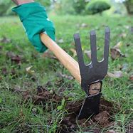
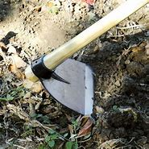

---

==== ▸ cater  [186]   +
な/ˈkeɪtə/   +
--> 词源同catch, 指抓，拿，购买。后词义指招待，承办宴席。 +

【V-I】   To _cater to_ a group of people means to provide all the things that they need or want. 满足…需要; 迎合 +
⇒  We cater to an exclusive clientele.  我们满足一个特殊客户群的需求。   +

【V-I】   To _cater to_ something means to take it into account. 考虑 +
⇒  Exercise classes cater to all levels of fitness.  训练课照顾到各种健康状况。   +
⇒  ...shops that cater to the needs of men.  … 经营男士用品的商店。   +

【V-T】   If a person or company _caters_ an occasion such as a wedding or a party, they provide food and drink for all the people there. (在婚礼、派对等场合) 提供餐饮服务; 承办酒席 +
⇒  ...a full-service restaurant equipped to cater large events.  …一家承办大型活动及提供全方位服务的饭店。   +

---

==== ▸ dilute  [187]   +
な/daɪˈluːt/   +

【V-T/V-I】   If a liquid _is diluted_ or _dilutes_, it is added to or mixes with water or another liquid, and becomes weaker. 稀释; 变淡 +
⇒  If you give your baby juice, dilute it well with cooled, boiled water.  喂婴儿果汁要用凉开水充分稀释。   +
⇒  The liquid is then diluted.  然后液体就变稀了。   +

【V-T】   If someone or something _dilutes_ a belief, quality, or value, they make it weaker and less effective. 削弱 +
⇒  There was a clear intention to dilute black voting power.  削弱黑人选举权的意图是显而易见的。   +

【ADJ】   A _dilute_ liquid is very thin and weak, usually because it has had water added to it. 稀释的 +
⇒  ...a dilute solution of bleach.  …稀释了的漂白液。   +

---

==== ▸ stem  [188]   +
な/stɛm/   +

【V-I】   If a condition or problem _stems from_ something, it was caused originally by that thing. 起源于 +
⇒  All my problems stem from drink.  我所有的问题都是酗酒引起的。   +

【V-T】   If you _stem_ something, you stop it spreading, increasing, or continuing. 阻止 +
⇒  Austria has sent three army battalions to its border with Hungary to stem the flow of illegal immigrants.  奥地利已派遣3个营到达与匈牙利接壤的边境处，以阻止非法移民的流入。   +

【N-COUNT】   The _stem_ of a plant is the thin, upright part on which the flowers and leaves grow. 茎 +
⇒  He stooped down, cut the stem for her with his knife and handed her the flower.  他弯下腰，用刀替她割下花茎，然后把花递给她。   +

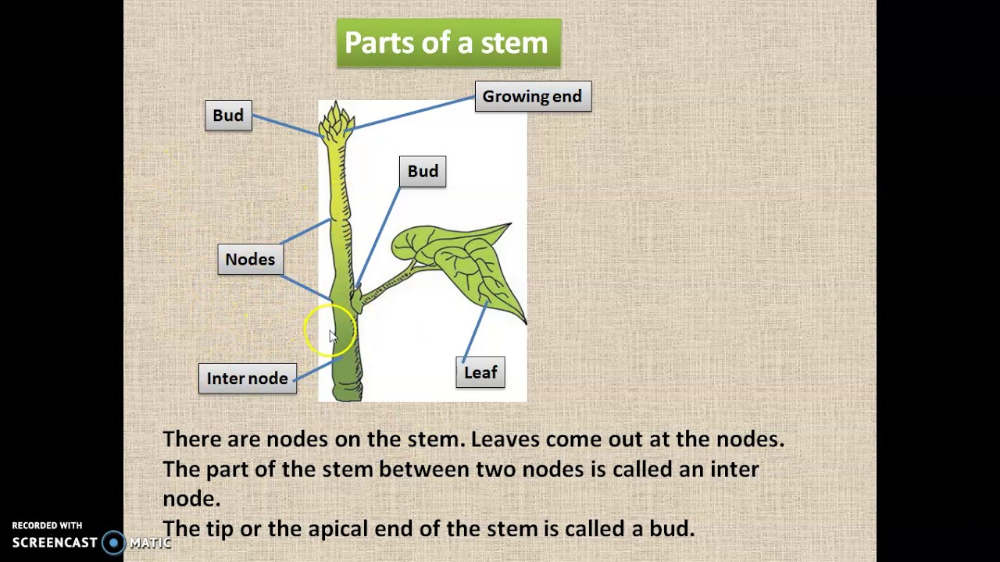

【N】   a technique in which the heel of one ski or both skis is forced outwards from the direction of movement in order to slow down or turn 转动滑雪屐以减速或转弯的技术 +

---

==== ▸ deciduous  [189]   +
な/dɪˈsɪdjʊəs/   +
--> de-, 向下。-cid, 掉落，词源同case, accident. 即掉落的。 +

【ADJ】   A _deciduous_ tree or bush is one that loses its leaves in the fall every year. (树或灌木每年)落叶的 +

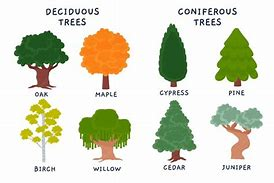

---

==== ▸ soloist  [191]   +
な/ˈsəʊləʊɪst/   +

【N-COUNT】   A _soloist_ is a musician or dancer who performs a solo. 独奏者; 独舞者 +
⇒  ...the relationship between soloist and orchestra.  …独奏者与管弦乐队之间的关系。   +

---

==== ▸ cherish  [192]   +
な/ˈtʃɛrɪʃ/   +

【V-T】   If you _cherish_ something such as a hope or a pleasant memory, you keep it in your mind for a long period of time. 珍藏 (希望、记忆等) +
⇒  The president will cherish the memory of this visit to Ohio.  总统将铭记这次对俄亥俄州的访问。   +

【ADJ】   (对希望、记忆等) 珍藏的 +
⇒  ...the cherished dream of a world without wars.  …久藏心中的梦想：一个没有战争的世界。   +

【V-T】   If you _cherish_ someone or something, you take good care of them because you love them. 珍爱 +
⇒  He genuinely loved and cherished her.  他真爱并珍惜过她。   +

【ADJ】   珍爱的 +
⇒  He described the picture as his most cherished possession.  他说这张照片是他最珍爱的财产。   +

【V-T】   If you _cherish_ a right, a privilege, or a principle, you regard it as important and try hard to keep it. 珍视 +
⇒  Chinese people cherish their independence and sovereignty.  中国人民珍视他们的独立和主权。   +

【ADJ】   珍视的 +
⇒  Freud called into question some deeply cherished beliefs.  弗洛伊德对某些人们一直深信不疑的观念提出了质疑。   +

---

==== ▸ meantime  [193]   +
な/ˈmiːnˌtaɪm/   +

【PHRASE】  _In the meantime_ or _meantime_ means in the period of time between two events. 在…期间 +
⇒  Eventually your child will leave home to lead her own life, but in the meantime she relies on your support.  最终你的孩子将会离开家去过她自己的生活，不过在此期间她依赖你的支持。   +

【PHRASE】  _For the meantime_ means for a period of time from now until something else happens. 暂时 +
⇒  Some of her stuff is stored for the meantime with her children.  她的一些东西暂时保存在她的孩子那里。   +

---

==== ▸ progressive  [194]   +
な/prəˈɡrɛsɪv/   +

【ADJ】   Someone who is _progressive_ or has _progressive_ ideas has modern ideas about how things should be done, rather than traditional ones. 进步的 +
⇒  ...a progressive businessman who had voted for Roosevelt in 1932 and 1936.  …在1932年和1936年投票支持罗斯福的一位进步商人。   +
⇒  Willan was able to point to the progressive changes he had already introduced.  威兰能够指出他已经带来的有进步意义的变化。   +

【N-COUNT】   A _progressive_ is someone who is progressive. 进步人士 +
⇒  The Republicans were deeply split between progressives and conservatives.  共和党进步派和保守派之间分歧很大。   +

【ADJ】   A _progressive_ change happens gradually over a period of time. 逐步的 +
⇒  One prominent symptom of the disease is progressive loss of memory.  这种病的一个突出症状是记忆的逐步丧失。   +

【ADV】   逐步地 +
⇒  Her symptoms became progressively worse.  她的症状逐步恶化。   +

---

==== ▸ latitude  [195]   +
な/ˈlætɪˌtjuːd/   +

【N-VAR】   The _latitude_ of a place is its distance from the equator. Compare . 纬度 +
⇒  In the middle to high latitudes rainfall has risen steadily over the last 20-30 years.  中高纬度地区的降雨量在过去的20到30年间稳步上升了。   +

【ADJ】  _Latitude_ is also an adjective. 纬度的 +
⇒  The army must cease military operations above 36° latitude north.  军队必须停止在北纬36度以北地区的军事行动。   +

【N-UNCOUNT】  _Latitude_ is freedom to choose the way in which you do something. 自由度 +
⇒  He would be given every latitude in forming a new government.  他将被给予高度自由来建立一个新政府。   +

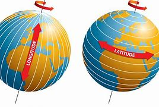

---

==== ▸ configuration  [196]   +
な/kənˌfɪɡjʊˈreɪʃən/   +

【N-COUNT】   A _configuration_ is an arrangement of a group of things. 布局; 排列 +
⇒  ...Stonehenge, in southwestern England, an ancient configuration of giant stones.  …史前巨石柱群，位于英国西南部，是一座古代巨石阵列。   +

【N-UNCOUNT】   The _configuration_ of a computer system is the way in which all its parts, such as the hardware and software, are connected together in order for the computer to work. (计算机系统的) 配置 +
⇒  Prices range from $119 to $199, depending on the particular configuration.  价格根据配置的不同从119美元到199美元不等。   +

---

==== ▸ interim  [197]   +
な/ˈɪntərɪm/   +

【ADJ】  _Interim_ is used to describe something that is intended to be used until something permanent is done or established. 临时的 +
⇒  She was sworn in as head of an interim government in March.  她3月份宣誓出任临时政府首脑。   +

【PHRASE】  _In the interim_ means until a particular thing happens or until a particular thing happened. 在过渡时期 +
⇒  But, in the interim, we obviously have a duty to maintain law and order.  但是，在过渡时期我们显然有责任维持法律与秩序。   +

---

==== ▸ automobile  [198]   +
な/ˈɔːtəməˌbiːl/   +

【N-COUNT】   An _automobile_ is a car. 汽车 +
⇒  ...the automobile industry.  …汽车工业。   +

---

==== ▸ estate  [199]   +
な/ɪˈsteɪt/   +

【N-COUNT】   An _estate_ is a large area of land in the country which is owned by a person, family, or organization. （通常指农村的）大片私有土地，庄园 +
⇒  He spent holidays at the 300-acre estate of his aunt and uncle.  他在叔叔和婶婶的300英亩庄园里度过许多假日。   +

【N-COUNT】   Someone's _estate_ is all the money and property that they leave behind when they die. 遗产 +
⇒  His estate was valued at $150,000.  他的遗产价值为15万美元。   +

---

==== ▸ concentrate  [200]   +
な/ˈkɒnsənˌtreɪt/   +

【V-T/V-I】   If you _concentrate on_ something, or _concentrate_ your mind _on_ it, you give all your attention to it. 集中 (心思); 专心 +
⇒  It was up to him to concentrate on his studies and make something of himself.  他能否专心学习并有所成就取决于他自己。   +
⇒  At work you need to be able to concentrate.  工作时你要能专心。   +

【V-T】   If something _is concentrated in_ an area, it is all there rather than being spread around. 集中 +
⇒  Italy's industrial districts are concentrated in its north-central and northeastern regions.  意大利的工业区集中在该国中北部和东北部地区。   +

---

==== ▸ nitrogen  [201]   +
な/ˈnaɪtrədʒən/   +

【N-UNCOUNT】  _Nitrogen_ is a colourless element that has no smell and is usually found as a gas. It forms about 78 percent of the Earth's atmosphere, and is found in all living things. 氮 +

---

==== ▸ lineage  [202]   +
な/ˈlɪnɪɪdʒ/   +
--> 来自line,线，引申词义宗系，血统。 +

【N-VAR】   Someone's _lineage_ is the series of families from which they are directly descended. 家族 +
⇒  They can trace their lineage back to the 18th century.  他们的家族可以直接追溯到18世纪。   +

---

==== ▸ autonomous  [203]   +
な/ɔːˈtɒnəməs/   +

【ADJ】   An _autonomous_ country, organization, or group governs or controls itself rather than being controlled by anyone else. 自治的 +
⇒  They proudly declared themselves part of a new autonomous province.  他们自豪地宣布自己是新自治省的一部分。   +

【ADJ】   An _autonomous_ person makes their own decisions rather than being influenced by someone else. 独立自主的 +
⇒  He treated us as autonomous individuals who had to learn to make up our own minds about 下定决心 issues.  他视我们为独立个体，必须学会自主处理问题。   +

---

==== ▸ quilt  [204]   +
な/kwɪlt/   +

【N-COUNT】   A _quilt_ is a bed cover made by sewing layers of cloth together, usually with different colours sewn together to make a design. 被子 +
⇒  ...an old patchwork quilt.  …一条旧的拼布被子。   +

【N-COUNT】 +
【V-T/V-I】   If you _quilt_, or if you _quilt_ a piece of fabric, you make a quilt. 缝制 (被子); 缝制被子   +
⇒  Maggie knows how to quilt.  玛吉知道怎样缝被子。   +
⇒  Quilting a bed cover can be laborious.  缝制一个床罩会很费力的。   +

---

==== ▸ granular  [205]   +
な/ˈɡrænjʊlə/   +
--> 来自grain, 颗粒。+

【ADJ】  _Granular_ substances are composed of a lot of granules, or feel or look as if they are composed of a lot of granules. 粒状的 +
⇒  ...a granular fertilizer.  ...一种粒状化肥。   +

---

==== ▸ reliance  [206]   +
な/rɪˈlaɪəns/   +

【N-UNCOUNT】   A person's or thing's _reliance on_ something is the fact that they need it and often cannot live or work without it. 依赖; 依靠 +
⇒  ...the country's increasing reliance on foreign aid.  …这个国家日益依赖外来援助。   +

---

==== ▸ increment  [207]   +
な/ˈɪnkrɪmənt/   +

【N-COUNT】   An _increment in_ something or _in_ the value of something is an amount by which it increases. 增加量 +
⇒  The average yearly increment in productivity was 4.5 per cent.  生产率的年平均增长量是4.5%。   +

【N-COUNT】   An _increment_ is an amount by which your salary automatically increases after a fixed period of time. 定期加薪 +

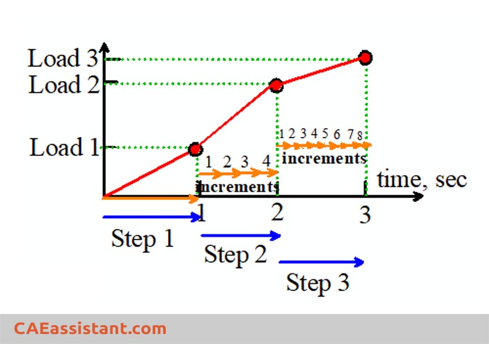

---

==== ▸ disguise  [208]   +
な/dɪsˈɡaɪz/   +

【N-VAR】   If you are _in disguise_, you are not wearing your usual clothes or you have altered your appearance in other ways, so that people will not recognize you. 伪装 +
⇒  You'll have to travel in disguise.  你将不得不乔装出行。   +

【V-T】   If you _disguise yourself_, you put on clothes which make you look like someone else or alter your appearance in other ways, so that people will not recognize you. 乔装 +
⇒  She disguised herself as a man so she could fight on the battlefield.  她女扮男装以便能上战场打仗。   +

【ADJ】   乔装的 +
⇒  The extremists entered the building disguised as medical workers.  极端分子们假扮成医务人员，进入了大楼。   +

【V-T】   To _disguise_ something means to hide it or make it appear different so that people will not know about it or will not recognize it. 掩饰 +
⇒  He made no attempt to disguise his agitation.  他无意掩饰他的不安。   +

【ADJ】   掩饰的 +
⇒  The proposal is a thinly disguised effort to revive the price controls of the 1970s.  这项提议是恢复20世纪70年代物价控制的一种几乎不加掩饰的努力。   +

---

==== ▸ lure  [209]   +
な/lʊə/   +

【V-T】   To _lure_ someone means to trick them into a particular place or to trick them into doing something that they should not do. 引诱 +
⇒  He lured her to his home and shot her with his father's gun.  他把她诱骗到家里，然后用父亲的枪把她打死。   +
⇒  They did not realize that they were being lured into a trap.  他们没有意识到正被人骗入圈套。   +

【N-COUNT】   A _lure_ is an object which is used to attract animals, especially fish, so that they can be caught. 诱饵 +
【N-COUNT】   A _lure_ is an attractive quality that something has, or something that you find attractive. 诱惑力; 魅力   +
⇒  The excitement of hunting big game in Africa has been a lure to Europeans for 200 years.  在非洲捕捉大型猎物所带来的刺激，200年来一直吸引着欧洲人。   +

---

==== ▸ decorative  [210]   +
な/ˈdɛkərətɪv, -əreɪtɪv/   +

【ADJ】   Something that is _decorative_ is intended to look pretty or attractive. 装饰性的 +
⇒  The curtains are for purely decorative purposes and do not open or close.  那些窗帘纯粹用于装饰目的，不能开合。   +

---

==== ▸ hygiene  [211]   +
な/ˈhaɪdʒiːn/   +
--> 在希腊神话中有一位女神名叫Hygeia 海及娅(司健康的女神)，被人奉为健康女神，她的名字所基于的希腊词根hygies含有“健康的”之意，她是医药之神Asclepius／Asclepios的女儿。她的形象是个年轻女人，身着白色长衣，头戴祭司冠，用饭碗喂着一条蛇。因此直至今天碗里装着一条蛇有时仍用作医学的象征。英语hygiene 一词正是源出Hygeia的大名，但却是直接借自法语hygiene或拉丁语hygiena的，现在作为医学术语用，表示“卫生”、“卫生学”、“保健（法）”等义。hygienic则是hygiene的派生形容词。 +

【N-UNCOUNT】  _Hygiene_ is the practice of keeping yourself and your surroundings clean, especially in order to prevent illness or the spread of diseases. 卫生 +
⇒  Be extra careful about personal hygiene.  要特别注意个人卫生。   +

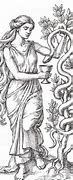

---

==== ▸ oxide  [212]   +
な/ˈɒksaɪd/   +

【N-MASS】   An _oxide_ is a compound of oxygen and another chemical element. 氧化物 +

---

==== ▸ calendar  [213]   +
な/ˈkælɪndə/   +

【N-COUNT】   A _calendar_ is a chart or device which displays the date and the day of the week, and often the whole of a particular year divided up into months, weeks, and days. 日历 +
⇒  There was a calendar on the wall above, with large squares around the dates.  墙的上方曾有一本日历，日期框在大方格里。   +

【N-COUNT】   A _calendar_ is a particular system for dividing time into periods such as years, months, and weeks, often starting from a particular point in history. 历法 +
⇒  The Christian calendar was originally based on the Julian calendar of the Romans.  公历最初是基于罗马的儒略历的。   +

【N-COUNT】   You can use _calendar_ to refer to a series or list of events and activities which take place on particular dates, and which are important for a particular organization, community, or person. 日程表 +
⇒  It is one of the hottest tickets on Washington's social calendar.  这是华盛顿社交日程表上最热门的入场券之一。   +

---

==== ▸ discharge  [214]   +
な【V-T】   When someone _is discharged from_ a hospital, prison, or one of the armed services, they are officially allowed to leave, or told that they must leave. 批准离开; 命令离开   +
⇒  He has a broken nose but may be discharged today.  他鼻梁断了，但今天可能获准出院。   +

【N-VAR】  _Discharge_ is also a noun. 释放 +
⇒  He was given a conditional discharge and ordered to pay Miss Smith $500 compensation.  他被判有条件释放，并被命令向史密斯小姐支付$500的赔偿金。   +

【V-T】   If someone _discharges_ their duties or responsibilities, they do everything that needs to be done in order to complete them. 履行 (职责或义务) +
⇒  ...the quiet competence with which he discharged his many duties.  …他履行他的诸多职责所用的平静的办事能力。   +

【V-T】   If something _is discharged_ from inside a place, it comes out. 排出 +
⇒  The resulting salty water will be discharged at sea.  产生的咸水将被排放到海里。   +

【N-VAR】   When there is a _discharge_ of a substance, the substance comes out from inside somewhere. 排出 +
⇒  They develop a fever and a watery discharge from their eyes.  他们开始发烧，且有一种水状分泌物从他们的眼睛里流出。   +

---

==== ▸ beak  [215]   +
な/biːk/   +
--> 词源同peck, 啄，拟声词。 +

【N-COUNT】   A bird's _beak_ is the hard curved or pointed part of its mouth. 喙 +
⇒  ...a black bird with a yellow beak.  …一只有着黄喙的黑鸟。   +

【N】   a person's nose, esp one that is large, pointed, or hooked 鹰钩鼻 +
【N】      +

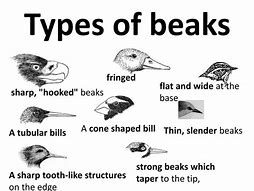

---

==== ▸ punctual  [216]   +
な/ˈpʌŋktjʊəl/   +

【ADJ】   If you are _punctual_, you do something or arrive somewhere at the right time and are not late. 准时的 +
⇒  He's always very punctual. I'll see if he's here yet.  他一向很准时。我要看看他是不是已经来了。   +

【ADV】   准时地 +
⇒  My guest arrived punctually.  我的客人准时到了。   +

---

==== ▸ evergreen  [217]   +
な/ˈɛvəˌɡriːn/   +

【N-COUNT】   An _evergreen_ is a tree or bush that has green leaves all year long. 常青树; 常绿植物 +
⇒  Holly, like ivy and mistletoe, is an evergreen.  冬青与常春藤和槲寄生一样，也是一种常绿植物。   +

【ADJ】  _Evergreen_ is also an adjective. 常绿的 +
⇒  Plant evergreen shrubs around the end of the month.  大约在月末种植常绿灌木。   +

---

==== ▸ contradict  [218]   +
な/ˌkɒntrəˈdɪkt/   +

【V-T】   If you _contradict_ someone, you tell them that what they have just said is wrong, or suggest that it is wrong by saying something different. 反驳 +
⇒  She dared not contradict him.  她不敢反驳他。   +
⇒  His comments appeared to contradict remarks made earlier in the day by the chairman.  他的评论好像在反驳主席当天早些时候的言论。   +

【V-T】   If one statement or piece of evidence _contradicts_ another, the first one makes the second one appear to be wrong. 与…矛盾 +
⇒  Her version contradicted her daughter's.  她的说法与她女儿的说法相矛盾。   +

---

==== ▸ extrapolate  [219]   +
な/ɪkˈstræpəˌleɪt/   +

【V-I】   If you _extrapolate from_ known facts, you use them as a basis for general statements about a situation or about what is likely to happen in the future. 推断 +
⇒  Extrapolating from his latest findings, he reckons about 80% of these deaths might be attributed to smoking.  从他最近的发现推断，他估计大约80%的这类死亡可能归因于吸烟。   +

【N-VAR】   推断 +
⇒  His estimate of half a million HIV-positive cases was based on an extrapolation of the known incidence of the virus.  他的50万HIV阳性病例的估计是基于对已知病毒发病率的推断。   +

---

==== ▸ rodent  [220]   +
な/ˈrəʊdənt/   +

【N-COUNT】  _Rodents_ are small mammals which have sharp front teeth. Rats, mice, and squirrels are rodents. 啮齿动物 +

---

==== ▸ recline  [221]   +
な/rɪˈklaɪn/   +

【V-I】   If you _recline on_ something, you sit or lie on it with the upper part of your body supported at an angle. 斜靠 +
⇒  She proceeded to recline on a chaise longue.  她开始斜靠在一个躺椅上。   +

【V-T/V-I】   When a seat _reclines_ or when you _recline_ it, you lower the back so that it is more comfortable to sit in. 使向后倾斜; 向后倾斜 +
⇒  Air France first-class seats recline almost like beds.  法国航空公司头等舱座位的靠背可以向后倾斜得几乎像床一样。   +
⇒  Ramesh had reclined his seat and was lying back smoking.  拉米许已经把椅背向后调了，正仰靠着吸着烟。   +

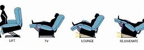

---

==== ▸ courteous  [222]   +
な/ˈkɜːtɪəs/   +

【ADJ】   Someone who is _courteous_ is polite and respectful to other people. 彬彬有礼的 +
⇒  He was a kind and courteous man.  他善良且彬彬有礼。   +

【ADV】   彬彬有礼地 +
⇒  Then he nodded courteously to me and walked off to perform his unpleasant duty.  他彬彬有礼地向我点点头，然后就走开去执行他令人讨厌的任务。   +

---

==== ▸ creativity  [223]   +
(n.) 创造力，独创性

---

==== ▸ label  [224]   +
な/ˈleɪbəl/   +

【N-COUNT】   A _label_ is a piece of paper or plastic that is attached to an object in order to give information about it. 标签 +
⇒  He peered at the label on the bottle.  他注视着瓶子上的标签。   +

【V-T】   If something _is labelled_, a label is attached to it giving information about it. 贴标签于 +
⇒  It requires foreign frozen-food imports to be clearly labelled.  它要求外国进口冷冻食品要粘贴明确的标签。   +
⇒  The produce was labelled "Made in China."  该产品上贴有“中国制造”的标签。   +

【V-T】   If you say that someone or something _is labelled as_ a particular thing, you mean that people generally describe them that way and you think that this is unfair. 把…称为 +
⇒  It won't be labelled in any way as a military expedition.  它无论如何也称不上是一次军事远征。   +
⇒  It does not matter whether these duties are labelled "duties" or "tasks".  这些义务被称作“义务”还是“任务”都无关紧要。   +

---

==== ▸ influential  [225]   +
な/ˌɪnflʊˈɛnʃəl/   +

【ADJ】   Someone or something that is _influential_ has a lot of influence over people or events. 有影响力的; 有权势的 +
⇒  It helps to have influential friends.  交上几个有权势的朋友很有好处。   +
⇒  He had been influential in shaping economic policy.  他在制定经济政策方面曾起过很大作用。   +

---

==== ▸ intuitive  [226]   +
な/ɪnˈtjuːɪtɪv/   +

【ADJ】   If you have an _intuitive_ idea or feeling about something, you feel that it is true although you have no evidence or proof of it. 直觉的 +
⇒  A positive pregnancy test soon confirmed her intuitive feelings.  阳性的孕检结果很快证实了她的直觉。   +

【ADV】   凭直觉地 +
⇒  He seemed to know intuitively that I must be missing my mother.  他似乎凭直觉知道我一定是在思念我的母亲。   +

---

==== ▸ disturbance  [227]   +
な/dɪˈstɜːbəns/   +

【N-COUNT】   A _disturbance_ is an incident in which people behave violently in public. 骚乱 +
⇒  During the disturbance which followed, three Englishmen were hurt.  在随后的骚乱中，3个英国人受伤了。   +

【N-UNCOUNT】  _Disturbance_ means upsetting or disorganizing something which was previously in a calm and well-ordered state. 烦乱; 扰乱 +
⇒  Successful breeding requires quiet, peaceful conditions with as little disturbance as possible.  成功繁殖需要安宁的环境，干扰越少越好。   +

【N-VAR】   You can use _disturbance_ to refer to a medical or psychological problem, when someone's body or mind is not working in the normal way. (身体) 不适; 心神不安 +
⇒  Poor educational performance is related to emotional disturbance.  学习表现不好与情绪不稳定有关。   +

---

==== ▸ adaptable  [228]   +
な/əˈdæptəbəl/   +

【ADJ】   If you describe a person or animal as _adaptable_, you mean that they are able to change their ideas or behaviour in order to deal with new situations. 能适应的 +
⇒  By making the workforce more adaptable and skilled, he hopes to attract foreign investment.  通过使劳动力更具适应力并且更具技能，他希望吸引到外资。   +

【N-UNCOUNT】   适应性 +
⇒  The adaptability of wool is one of its great attractions.  羊毛的适应性是其巨大的吸引力之一。   +

---

==== ▸ expire  [229]   +
な/ɪkˈspaɪə/   +

【V-I】   When something such as a contract, deadline, or visa _expires_, it comes to an end or is no longer valid. 到期; 失效 +
⇒  He had lived illegally in the United States for five years after his visitor's visa expired.  访问签证到期后他在美国非法居住了5年。   +

---

==== ▸ shipwright  [230]   +
な/ˈʃɪpˌraɪt/   +

【N-COUNT】   A _shipwright_ is a person who builds or repairs ships as a job. 造船工; 修船工 +

---

==== ▸ guideline  [231]   +
な/ˈɡaɪdˌlaɪn/   +

【N-COUNT】   If an organization issues _guidelines on_ something, it issues official advice about how to do it. 指导方针 +
⇒  The government should issue clear guidelines on the content of religious education.  政府应该颁布明确的关于宗教教育内容的指导方针。   +

【N-COUNT】   A _guideline_ is something that can be used to help you plan your actions or to form an opinion about something. 参考 +
⇒  A written IQ test is merely a guideline.  书面的智商测试只是个参考。   +

---

==== ▸ efficiency  [232]   +
な/ɪˈfɪʃənsɪ/   +

【N-UNCOUNT】  _Efficiency_ is the quality of being able to do a task successfully, without wasting time or energy. 效率 +
⇒  There are many ways to increase agricultural efficiency in the poorer areas of the world.  有许多提高世界较贫困地区农业效能的方法。   +

---

==== ▸ immunity  [233]   +
(n.)

- _~ (to sth) / ~ (against sth)_ : the body's ability to avoid or not be affected by infection and disease 免疫力 +
⇒ immunity to infection 对传染病的免疫力 +
⇒ The vaccine provides longer immunity against flu. 这种疫苗对流感的免疫效力时间较长。  +

- _~ (from sth)_ : the state of being protected from sth 受保护；豁免；免除 +
⇒ The spies were all granted immunity from prosecution. 这些间谍都获得免予公诉。  +
⇒ parliamentary/congressional immunity (= protection against particular laws that is given to politicians) 议会╱国会豁免权 +
⇒ Officials of all member states receive certain privileges and immunities. 各成员国的官员均享有某些特权和豁免权。  +

---

==== ▸ avalanche  [234]   +
な/ˈævəˌlɑːntʃ/   +
--> avaler, 向下，同valance, 挂布。-anche, 同后缀ance.+

【N-COUNT】   An _avalanche_ is a large mass of snow that falls down the side of a mountain. 雪崩 +

---

==== ▸ expand  [235]   +
な/ɪkˈspænd/   +

【V-T/V-I】   If something _expands_ or _is expanded_, it becomes larger. 扩大; 膨胀 +
⇒  Engineers noticed that the pipes were not expanding as expected.  工程师们注意到管子并未像预期的那样膨胀。   +
⇒  We have to expand the size of the image.  我们不得不扩大图像的尺寸。   +

【V-T/V-I】   If something such as a business, organization, or service _expands_, or if you _expand_ it, it becomes bigger and includes more people, goods, or activities. 使…发展; 发展 +
⇒  The popular ceramics industry expanded toward the middle of the 19th century.  大众陶瓷业在19世纪中叶得到了发展。   +

---

==== ▸ species  [236]   +
な/ˈspiːʃiːz/   +

【N-COUNT】   A _species_ is a class of plants or animals whose members have the same main characteristics and are able to breed with each other. 物种 +
⇒  Pandas are an endangered species.  大熊猫是一种濒危物种。   +

---

==== ▸ adapt  [237]   +
な/əˈdæpt/   +

【V-T/V-I】   If you _adapt to_ a new situation or _adapt yourself to_ it, you change your ideas or behaviour in order to deal with it successfully. 适应 +
⇒  The world will be different, and we will have to be prepared to adapt to the change.  这个世界将会不同，所以我们必须准备好适应变化。   +

【V-T】   If you _adapt_ something, you change it to make it suitable for a new purpose or situation. 改装 +
⇒  Shelves were built to adapt the library for use as an office.  做了个书架，以便将这个图书馆改作一个办公室用。   +

---

==== ▸ credentialism  [238]   +
な/krɪˈdenʃəlɪzəm/ +
(n.) Credentialism is the over-emphasis on credentials when hiring staff or assigning social status. 履历至上主义, 资格主义，文凭主义 +

---

==== ▸ smear  [239]   +
な/smɪə/   +

【V-T】   If you _smear_ a surface _with_ an oily or sticky substance or _smear_ the substance onto the surface, you spread a layer of the substance over the surface. 涂抹 +
⇒  My sister smeared herself with suntan oil and slept by the swimming pool.  我妹妹用防晒油涂抹了全身，然后睡在那游泳池边。   +

【N-COUNT】   A _smear_ is a dirty or oily mark. 污迹; 油迹 +
⇒  There was a smear of gravy on his chin.  他的下巴上有肉汤渍。   +

【V-T】   To _smear_ someone means to spread unpleasant and untrue rumours or accusations about them in order to damage their reputation. 诽谤; 诋毁 +
⇒  They planned to smear him by publishing information about his private life.  他们计划通过公开有关他私生活方面的信息来诋毁他。   +

【N-COUNT】   A _smear_ is an unpleasant and untrue rumour or accusation that is intended to damage someone's reputation. 诽谤; 诋毁 +
⇒  He puts all the accusations down to a smear campaign by his political opponents.  他把所有的指控归因于由其政敌发起的诽谤活动。   +

【N-COUNT】   A _smear_ or a _smear test_ is a medical test in which a few cells are taken from a woman's cervix and examined to see if any cancer cells are present. (一种从妇女子宫颈膜取样检验有无癌细胞的) 涂片试验 +

---

==== ▸ degenerate  [240]   +
な【V-I】   If you say that someone or something _degenerates_, you mean that they become worse in some way, for example, weaker, lower in quality, or more dangerous. 退化; 恶化; 堕落   +
⇒  Inactivity can make your joints stiff, and the bones may begin to degenerate.  不活动会使关节僵硬，骨骼因此可能会开始退化。   +

【N-UNCOUNT】   退化; 恶化; 堕落 +
⇒  ...various forms of physical and mental degeneration.  …各种形式的身心退化。   +

【ADJ】   If you describe a person or their behaviour as _degenerate_, you disapprove of them because you think they have low standards of behaviour or morality. 堕落的 +
⇒  ...a group of degenerate computer hackers.  …一群堕落的计算机黑客。   +

---

==== ▸ magnesium  [241]   +
な/mæɡˈniːzɪəm/   +

【N-UNCOUNT】  _Magnesium_ is a light, silvery white metal which burns with a bright white flame. 镁 +

---

==== ▸ chimpanzee  [242]   +
な/ˌtʃɪmpænˈziː/   +

【N-COUNT】   A _chimpanzee_ is a kind of small African ape. 黑猩猩 +

---

==== ▸ organism  [243]   +
な/ˈɔːɡəˌnɪzəm/   +

【N-COUNT】   An _organism_ is an animal or plant, especially one that is so small that you cannot see it without using a microscope. 生物; 微生物 +
⇒  Not all chemicals normally present in living organisms are harmless.  并非所有正常存在于活的有机体中的化学物质都是无害的。   +

---

==== ▸ equitable  [244]   +
な/ˈɛkwɪtəbəl/   +

【ADJ】   Something that is _equitable_ is fair and reasonable in a way that gives equal treatment to everyone. 公平合理的 +
⇒  He has urged them to come to an equitable compromise that gives Hughes his proper due.  他已敦促他们达成公平合理的妥协，给休斯应得的权益。   +

---

==== ▸ longitude  [245]   +
な/ˈlɒndʒɪˌtjuːd/   +

【N-VAR】   The _longitude_ of a place is its distance to the west or east of a line passing through Greenwich, England. Compare . 经度 +
⇒  He noted the latitude and longitude, then made a mark on the admiralty chart.  他记下经度和纬度，然后在海图上作了标记。   +

【ADJ】  _Longitude_ is also an adjective. 经度的 +
⇒  A similar feature is found at 13 degrees north between 230 degrees and 250 degrees longitude.  在北纬13度、经度230度到250度之间也发现了类似的特点。   +

---

==== ▸ inheritance  [246]   +
な/ɪnˈhɛrɪtəns/   +

【N-VAR】   An _inheritance_ is money or property that you receive from someone who has died. 继承物; 遗产 +
⇒  She feared losing her inheritance to her stepmother.  她担心她的遗产会落到继母的手里。   +

【N-COUNT】   If you get something such as a job, problem, or attitude from someone who used to have it, you can refer to this as an _inheritance_. 转接物; 沿袭物 +
⇒  ...starvation and disease over much of Europe and Asia, which was Truman's inheritance as president.  …在欧亚大部分地区肆虐的饥馑和疾病，这是杜鲁门接任总统时面临的状况。   +

【N-SING】   Your _inheritance_ is the particular characteristics or qualities that your family or ancestors had and that you are born with. 遗传特征 +
⇒  Eye colour shows more than your genetic inheritance.  眼睛的颜色显示的不只是你基因的遗传特征。   +

---

==== ▸ discipline  [247]   +
な/ˈdɪsɪplɪn/   +

【N-UNCOUNT】  _Discipline_ is the practice of making people obey rules or standards of behaviour, and punishing them when they do not. 纪律 +
⇒  Order and discipline have been placed in the hands of governing bodies.  秩序与纪律已交由管控机构负责。   +

【N-UNCOUNT】  _Discipline_ is the quality of being able to behave and work in a controlled way which involves obeying particular rules or standards. 自律 +
⇒  It was that image of calm, control, and discipline that appealed to millions of voters.  正是那冷静、克制和自律的形象吸引了数以百万计的选民。   +

【N-VAR】   If you refer to an activity or situation as a _discipline_, you mean that, in order to be successful in it, you need to behave in a strictly controlled way and obey particular rules or standards. 训练; 磨练 +
⇒  The discipline of studying music can help children develop good work habits and improve self-esteem.  学习音乐的规范训练能帮助孩子们养成良好的做事习惯和增强自尊心。   +

【V-T】   If someone _is disciplined_ for something that they have done wrong, they are punished for it. 处罚 +
⇒  The workman was disciplined by his company but not dismissed.  这名工人被他的公司处罚了，但没有被开除。   +

【V-T】   If you _discipline yourself_ to do something, you train yourself to behave and work in a strictly controlled and regular way. 训练 +
⇒  Discipline yourself to check your messages once a day or every couple of days.  训练你自己每天或每两天查看一次你的留言。   +

【N-COUNT】   A _discipline_ is a particular area of study, especially a subject of study in a college or university. (尤指大学里的) 学科 +
⇒  We're looking for people from a wide range of disciplines.  我们正在寻找各类学科的人才。   +

---

==== ▸ resort  [248]   +
な/rɪˈzɔːt/   +

【V-I】   If you _resort to_ a course of action that you do not really approve of, you adopt it because you cannot see any other way of achieving what you want. 不得不求助 +
⇒  His punishing work schedule had made him resort to drugs.  他那累人的工作日程已经使他不得不求助于毒品了。   +

【N-UNCOUNT】   If you achieve something without _resort to_ a particular course of action, you succeed without carrying out that action. To have _resort to_ a particular course of action means to have to do that action in order to achieve something. 诉诸 +
⇒  Congress has a responsibility to ensure that all peaceful options are exhausted before resort to war.  国会有责任确保在所有和平的手段用尽之后再诉诸武力。   +

【PHRASE】   If you do something _as a last resort_, you do it because you can find no other way of getting out of a difficult situation or of solving a problem. 作为最后手段 +
⇒  Nuclear weapons should be used only as a last resort.  核武器应该只被用作最后手段。   +

【N-COUNT】   A _resort_ is a place where a lot of people spend their holiday. (度假) 胜地 +
⇒  The ski resorts are expanding to meet the growing number of skiers that come here.  该滑雪胜地正在扩建以应付来这里滑雪的不断增长的人数。   +

---

==== ▸ playwright  [249]   +
な/ˈpleɪˌraɪt/   +

【N-COUNT】   A _playwright_ is a person who writes plays. 剧作家 +

---

==== ▸ continuation  [250]   +
な/kənˌtɪnjʊˈeɪʃən/   +

【N-VAR】   The _continuation of_ something is the fact that it continues, instead of stopping. 持续 +
⇒  It's the coalition forces who are to blame for the continuation of the war.  是联军应对战争的持续负责。   +

【N-COUNT】   Something that is a _continuation of_ something else is closely connected with it or forms part of it. 延续 +
⇒  This chapter is a continuation of Chapter 8.  本章是第8章的延续。   +

---

==== ▸ suspend  [251]   +
な/səˈspɛnd/   +

【V-T】   If you _suspend_ something, you delay it or stop it from happening for a while or until a decision is made about it. 暂停 +
⇒  The union suspended strike action this week.  工会本周暂停了罢工行动。   +

【V-T】   If someone _is suspended_, they are prevented from holding a particular job or position for a fixed length of time or until a decision is made about them. 使停职 +
⇒  Julie was suspended from her job shortly after the incident.  该事件发生后不久，朱莉被停职了。   +

【V-T】   If something _is suspended_ from a high place, it is hanging from that place. 悬挂 +
⇒  ...instruments that are suspended on cables.  …悬挂在电缆上的仪器。   +

---

==== ▸ verse  [252]   +
な/vɜːs/   +

【N-UNCOUNT】  _Verse_ is writing arranged in lines that have rhythm and that often rhyme at the end. 诗; 韵文 +
⇒  I have been moved to write a few lines of verse.  我曾经被感动得写了几行诗。   +

【N-COUNT】   A _verse_ is one of the parts into which a poem, a song, or a chapter of the Bible or the Koran is divided. 诗节; 歌曲的段落; (《圣经》、《古兰经》的) 节 +
⇒  This verse describes three signs of spring.  这节诗描述了春天的3个征兆。   +

---

==== ▸ noted  [253]   +
な/ˈnəʊtɪd/   +

【ADJ】   To be _noted for_ something you do or have means to be well known and admired for it. 知名的 +
⇒  ...a television programme noted for its attacks on organized crime.  …以对有组织犯罪的抨击而知名的一档电视节目。   +

---

==== ▸ skip  [254]   +
な/skɪp/   +

【V-I】   If you _skip_ along, you move almost as if you are dancing, with a series of little jumps from one foot to the other. 蹦跳; 蹦跳着走 +
⇒  They saw the man with a little girl skipping along behind him.  他们看到那个男人身后跟着一个蹦蹦跳跳的小女孩。   +
⇒  We went skipping down the street arm in arm.  我们挽着臂蹦蹦跳跳地沿大街走着。   +

【N-COUNT】  _Skip_ is also a noun. 蹦跳 +
⇒  The boxer gave a little skip as he came out of his corner.  那位拳击手轻快地跳出了场角。   +

【V-T】   When someone _skips_, they jump up and down over a rope which they or two other people are holding at each end and turning around and around. 跳 (绳) +
⇒  They skip and play catch, waiting for the bell.  他们又是跳绳又是玩捉迷藏，等着铃声响。   +

【N-UNCOUNT】   跳绳 +
⇒  We did rope skipping and things like that.  我们跳绳或做类似的活动。   +

【V-T】   If you _skip_ something that you usually do or something that most people do, you decide not to do it. 不做; 逃避 +
⇒  It is important not to skip meals.  重要的是，不能不吃饭。   +

【V-T/V-I】   If you _skip_ or _skip over_ a part of something you are reading or a story you are telling, you miss it out or pass over it quickly and move on to something else. 匆匆翻阅; 略过 +
⇒  You might want to skip the exercises in this chapter.  你可能想把这一章的练习跳过去。   +

【V-I】   If you _skip from_ one subject or activity _to_ another, you move quickly from one to the other, although there is no obvious connection between them. (无条理地) 快速转换 +
⇒  She kept up a continuous chatter, skipping from one subject to the next.  她叽叽咕咕地说个不停，从一个话题跳到另一个话题。   +

【N-COUNT】   A _skip_ is a large, open, metal container which is used to hold and take away large unwanted items and rubbish. (盛大体积废弃物的) 废料桶; 大铁桶 +
【N】   the captain of a curling or bowls team 冰壶队队长   +

【N】   a cage used as a lift in mines, etc (矿上用的)料车 +

.jump, skip, hop, leap  的区别
====
.jump:
电影《泰坦尼克号》里的男主角说过一句经典台词：“You jump. I jump. 你跳，我就跳。”这里，动词“jump”**泛指“双脚离地，向空中弹起”**的动作。 +

=> The jaguar jumped onto the back of its prey. 这只美洲豹跳到了其猎物的背上。  +
=> The burglar escaped by jumping out of the window. 入室窃贼跳出窗外逃跑了。 +

.skip:
- skip 指哪种“跳”呢？我们可以通过**想象一个小孩子开心地蹦蹦跳跳的样子**，来理解它所指的具体动作。Skip 通常来描述**“小步地跳，轻快地跳”。**在英式英语中，“跳绳”这项运动就叫“skipping”，而跳绳所用的工具就是“skipping rope”。 +
- skip 做动词还有另一个常见的意思，表示“跳过、省略”. +

=> The kid is skipping down the street with an ice-cream in her hand. 那个孩子手里拿着冰淇淋，在街上一蹦一跳地走着。 +
=> The ticket for the castle was too expensive, so I skipped it and moved on to the next attraction. 参观城堡的门票价格太贵了，所以我就直接去了下一个景点。 +

.hop:
- 名词 hopscotch 是孩子们喜欢玩的“跳房子”，根据游戏规则需要，参与者有时应该**用同一条腿向前跳跃。**日常生活中，我们也能用 hop 来**表示“单腿跳”**。 +
- Hop *还可以指“兔子、鸟等小型动物双足或齐足向前跳”。* +
- 在很多城市中有一种特色的旅游观光车，乘客根据需要可以随时上下车，这种巴士的名称是“*hop-on, hop-off bus*”。这里用“hop”是因为我们在口语中还会使用它来表示**“迅速上下车”**的意思。 +

=> I hurt my ankle, so I had to hop all the way home. 我把脚踝扭伤了，所以只能一路单腿蹦回家。 +
=> The bunny is hopping around in the grass. 这只小兔子正在草丛间蹦蹦跳跳。 +
=> A: Could you give me a ride home?  B: Sure. Hop on!  +

.leap:
- leap 所指的“跳”和“skip 轻快地跳”和“hop 单腿跳”不同，**leap 形容“纵身一跃，骤然一跳”，这个动作通常需要更大的力量，而且更加突然。 **
- 另外，每四年一度的“*闰年*”在英语里的说法是“*leap year*”，这是一个固定搭配。

=> I leapt to catch the falling vase. 我纵身一跃，想要接住正在倒下的花瓶。 +
=> When the balloon popped, my cat leapt out of my arms and ran upstairs. 气球破了，发出一声巨响，我的猫瞬间从我的臂弯一跃而出，跑上了楼。 +

.总结:
jump 泛指一切“跳跃”的动作，通常做不及物动词，而在做及物动词时表示“跃过障碍物”； +
skip 的意思是“轻快地小步跳”； +
hop 常用的意思包括“用单腿跳”和“小动物蹦蹦跳跳”，在口语使用中可以指“上下车”； +
leap 用来描述“充满力量的跳跃”这类动作。
====

---

==== ▸ tornado  [255]   +
な/tɔːˈneɪdəʊ/   +
--> 来自 tornare,扭曲，转动，词源同 turn.引申词义龙 卷风，旋风。 +

【N-COUNT】   A _tornado_ is a violent wind storm consisting of a tall column of air which spins around very fast and causes a lot of damage. 龙卷风 +

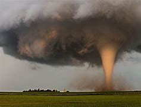

---

==== ▸ nominal  [256]   +
な/ˈnɒmɪnəl/   +

【ADJ】   You use _nominal_ to indicate that someone or something is supposed to have a particular identity or status, but in reality does not have it. 名义上的 +
⇒  As he was still not allowed to run a company, his wife became its nominal head.  由于他仍未获准管理公司，他的妻子就成了公司名义上的老板。   +

【ADV】   在名义上 +
⇒  The sultan was still nominally the chief of staff.  苏丹在名义上仍是军队领导人。   +
⇒  The road is nominally under the control of UN peacekeeping troops.  那条路名义上是在联合国维和部队的控制之下。   +

【ADJ】   A _nominal_ price or sum of money is very small in comparison with the real cost or value of the thing that is being bought or sold. (价格、金额) 象征性的 +
⇒  I am prepared to sell my shares at a nominal price.  我准备以低价卖掉我的股票。   +

【ADJ】   In economics, the _nominal_ value, rate, or level of something is the one expressed in terms of current prices or figures, without taking into account general changes in prices that take place over time. 票面上的 +
⇒  Inflation would be lower and so nominal rates would be more attractive in real terms.  通货膨胀将要降低，所以名义汇率实际上会更有吸引力。   +

---

==== ▸ microorganism  [257]   +
な/ˌmaɪkrəʊˈɔːɡəˌnɪzəm/   +

【N-COUNT】   A _microorganism_ is a very small living thing which you can only see if you use a microscope. 微生物 +

---

==== ▸ Babylonian  [258]   +
な/ˌbæbɪˈləʊnɪən/   +

【N】   an inhabitant of ancient Babylon or Babylonia 巴比伦人 +
【ADJ】   of, relating to, or characteristic of ancient Babylon or Babylonia, its people, or their language 巴比伦的   +

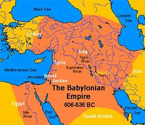

---

==== ▸ parallel  [259]   +
な/ˈpærəˌlɛl/   +

【N-COUNT】   If something has a _parallel_, it is similar to something else, but exists or happens in a different place or at a different time. If it has _no parallel_ or is _without parallel_, it is not similar to anything else. (存在或发生在不同地点或不同时间的) 类似的事情 +
⇒  Readers familiar with military conflict will find a vague parallel to the Vietnam War.  熟悉军事冲突的读者们会发现一个和越南战争大致相似的事件。   +
⇒  It's an ecological disaster with no parallel anywhere else in the world.  这是一场世界其他任何地方均无等同的生态灾难。   +

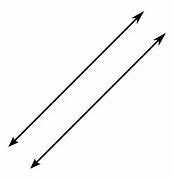

【N-COUNT】   If there are _parallels_ between two things, they are similar in some ways. 相似之处 +
⇒  Detailed study of folk music from a variety of countries reveals many close parallels.  对不同国家的民乐的详细研究表明它们有很多相似之处。   +
⇒  There are significant parallels with the 1980s.  与20世纪80年代有显著的相似之处。   +

【V-T】   If one thing _parallels_ another, they happen at the same time or are similar, and often seem to be connected. 与…同时发生 +
⇒  Often there are emotional reasons paralleling the financial ones.  经济原因的常常伴有情感原因。   +
⇒  His remarks paralleled those of the president.  他的评论与总统的评论相同。   +

【ADJ】  _Parallel_ events or situations happen at the same time as one another, or are similar to one another. 同时发生的; 相似的 +
⇒  ...parallel talks between the two countries' foreign ministers.  …两国外长之间相似的谈话。   +
⇒  Their instincts do not always run parallel with ours.  他们的直觉并不总是与我们的同步。   +

【ADJ】   If two lines, two objects, or two lines of movement are _parallel_, they are the same distance apart along their whole length. 平行的 +
⇒  ...seventy-two ships, drawn up in two parallel lines.  …72艘船，停靠成两条平行线。   +
⇒  Remsen Street is parallel with Montague Street.  雷姆森大街与蒙塔古大街是平行的。   +

【N-COUNT】   A _parallel_ is an imaginary line round the earth that is parallel to the equator. Parallels are shown on maps. 纬线 +
⇒  ...the area south of the 38th parallel.  …38度纬线以南的地区。   +

---

==== ▸ Latin  [260]   +
な/ˈlætɪn, -tən/   +

【N-UNCOUNT】  _Latin_ is the language which the ancient Romans used to speak. 拉丁语 +
【ADJ】  _Latin_ countries are countries where Spanish, or perhaps Portuguese, Italian, or French, is spoken. You can also use _Latin_ to refer to things and people that come from these countries. 拉丁语系的; 拉丁语国家的   +
⇒  Cuba was one of the least Catholic of the Latin countries.  古巴是拉丁语国家中最不信仰天主教的国家之一。   +

---

==== ▸ memo  [261]   +
な/ˈmɛməʊ/   +

【N-COUNT】   A _memo_ is a short official note that is sent by one person to another within the same company or organization. 简报 +
⇒  He sent out a memo expressing his disagreement with their decisions.  他发出一份简报表达他对他们的决定的不赞同。   +

---

==== ▸ decompose  [262]   +
な/ˌdiːkəmˈpəʊz/   +

【V-T/V-I】   When things such as dead plants or animals _decompose_, or when something _decomposes_ them, they change chemically and begin to decay. 使分解; 分解 +
⇒  ...a dead body found decomposing in the woods.  …在树林里发现的正在腐烂的一具死尸。   +
⇒  The debris slowly decomposes into compost.  这堆碎屑慢慢地分解变成了堆肥。   +

---

==== ▸ cuneiform  [263]   +
な/ˈkjuːnɪˌfɔːm/   +

【ADJ】   wedge-shaped 楔形的 (See also cuneal) +
【N】   cuneiform characters or writing 楔形文字   +

---

==== ▸ opponent  [264]   +
な/əˈpəʊnənt/   +

【N-COUNT】   A politician's _opponents_ are other politicians who belong to a different party or who have different aims or policies. (政) 敌 +
⇒  ...Mr. Kennedy's opponent in the leadership contest.  …肯尼迪先生在领导权竞争中的对手。   +

【N-COUNT】   In a sports contest, your _opponent_ is the person who is playing against you. (体育比赛中的) 对手 +
⇒  Norris twice knocked down his opponent in the early rounds of the fight.  诺里斯在拳击赛的头几个回合中，曾两度击倒他的对手。   +

【N-COUNT】   The _opponents of_ an idea or policy do not agree with it and do not want it to be carried out. 反对者 +
⇒  ...opponents of the spread of nuclear weapons.  …核武器扩散的反对者们。   +

---

==== ▸ surge  [265]   +
な/sɜːdʒ/   +

【N-COUNT】   A _surge_ is a sudden large increase in something that has previously been steady, or has only increased or developed slowly. 剧增 +
⇒  Specialists see various reasons for the recent surge in inflation.  专家认为最近通货膨胀加剧有各种原因。   +

【V-I】   If something _surges_, it increases suddenly and greatly, after being steady or developing only slowly. 剧增 +
⇒  The Freedom Party's electoral support surged from just under 10 percent to nearly 17 percent.  自由党的选举支持率从只有不到10%剧增到近17%。   +

【V-I】   If a crowd of people _surge_ forward, they suddenly move forward together. 涌动 +
⇒  The photographers and cameramen surged forward.  那些摄影和摄像师们涌向前去。   +

【N-COUNT】   A _surge_ is a sudden powerful movement of a physical force such as wind or water. (风、水等) 突然的涌动 +
⇒  The whole car shuddered with an almost frightening surge of power.  整辆车因受到一股几乎令人惊骇的冲力而颤动。   +

【V-I】   If a physical force such as water or electricity _surges_ through something, it moves through it suddenly and powerfully. (水、电流等) 涌 +
⇒  Thousands of volts surged through his car after he careered into a lamp post, ripping out live wires.  当他急速撞向一个灯柱、扯断了通电的电线之后，几千伏的电流涌过他的汽车。   +

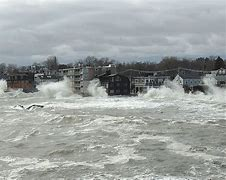

---

==== ▸ cushion  [266]   +
な/ˈkʊʃən/   +

【N-COUNT】   A _cushion_ is a fabric case filled with soft material, which you put on a seat to make it more comfortable. 坐垫 +
⇒  ...a velvet cushion.  …一个天鹅绒坐垫。   +

【N-COUNT】   A _cushion_ is a soft pad or barrier, especially one that protects something. 软垫 +
⇒  The company provides a styrofoam cushion to protect the tablets during shipping.  该公司提供一种聚苯乙烯泡沫塑料垫层用来在装运时保护牌匾。   +

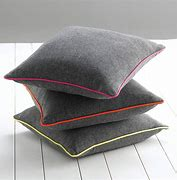

【N-COUNT】   Something that is a _cushion against_ something unpleasant reduces its effect. 缓解物 +
⇒  Welfare provides a cushion against hardship.  福利给困苦提供了一个缓解。   +

【V-T】   Something that _cushions_ an object when it hits something protects it by reducing the force of the impact. 缓冲 +
⇒  There is also a new steering wheel with an energy-absorbing rim to cushion the driver's head in the worst impacts.  还有新式方向盘，其边缘具有减震功能在最严重的冲击中缓冲保护司机的头部。   +

【V-T】   To _cushion_ the effect of something unpleasant means to reduce it. 缓解 +
⇒  They said Western aid was needed to cushion the blows of vital reform.  他们说需要西方国家的援助以缓解重大变革的冲击。   +

---

==== ▸ approve  [267]   +
な/əˈpruːv/   +

【V-I】   If you _approve of_ an action, event, or suggestion, you like it or are pleased about it. 喜欢 +
⇒  Not everyone approves of the festival.  不是每个人都喜欢这个节日。   +

【V-I】   If you _approve of_ someone or something, you like and admire them. 赞赏 +
⇒  You've never approved of Henry, have you?  你从未赞赏过亨利，是吧？   +

【V-T】   to improve or increase the value of (waste or common land), as by enclosure 使(废品或公共土地)升值 +

---

==== ▸ ease  [268]   +
な/iːz/   +

【PHRASE】   If you do something _with ease_, you do it easily, without difficulty or effort. 轻易地 +
⇒  Anne was intelligent and capable of passing her exams with ease.  安妮很聪明，能够轻易地通过考试。   +

【N-UNCOUNT】   If you talk about the _ease of_ a particular activity, you are referring to the way that it has been made easier to do, or to the fact that it is already easy to do. 简便 +
⇒  For ease of reference, only the relevant extracts of the regulations are included.  为便于参阅，只收录了相关条例的摘录。   +

【N-UNCOUNT】  _Ease_ is the state of being very comfortable and able to live as you want, without any worries or problems. 舒适; 悠闲 +
⇒  She lived a life of ease.  她过着悠闲自在的生活。   +

【V-T/V-I】   If something unpleasant _eases_ or if you _ease_ it, it is reduced in degree, speed, or intensity. 减轻; 减缓 +
⇒  Tensions had eased.  紧张缓解了。   +
⇒  I gave him some brandy to ease the pain.  我给了他一些白兰地以减轻疼痛。   +

【V-T/V-I】   If you _ease_ your _way_ somewhere or _ease_ somewhere, you move there slowly, carefully, and gently. If you _ease_ something somewhere, you move it there slowly, carefully, and gently. 小心缓慢地移动 +
⇒  I eased my way toward the door.  我缓慢地向门口走去。   +
⇒  He eased his foot off the accelerator.  他慢慢地把脚从油门上挪开。   +

【PHRASE】   If you are _at ease_, you are feeling confident and relaxed, and are able to talk to people without feeling nervous or anxious. If you put someone _at ease_, you make them feel at ease. 放松的; 自在的 +
⇒  It is essential to feel at ease with your therapist.  与治疗师在一起时，关键是放松心情。   +

【PHRASE】   If you are _ill at ease_, you feel somewhat uncomfortable, anxious, or worried. 不舒适; 不自在 +
⇒  He appeared embarrassed and ill at ease with the sustained applause that greeted him.  他对持久的掌声显得尴尬、不自在。   +

---

==== ▸ charcoal  [269]   +
な/ˈtʃɑːˌkəʊl/   +
--> char, 来自PIE*sker, 弯，转，变化，词源同ring, curve .即变成炭的。 +

【N-UNCOUNT】  _Charcoal_ is a black substance obtained by burning wood without much air. It can be burned as a fuel, and small sticks of it are used for drawing. 木炭 +

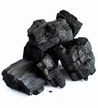

---

==== ▸ smirk  [270]   +
な/smɜːk/   +
--> 词源同 smirk,miracle,marvel.后原词义被 smile 取代，现词义用于指傻笑，假笑，得意的笑等。+

【V-I】   If you _smirk_, you smile in an unpleasant way, often because you believe that you have gained an advantage over someone else or know something that they do not know. 幸灾乐祸地笑; 自鸣得意地笑 +
⇒  Two men standing nearby looked at me, nudged each other and smirked.  站在旁边的两个男人看着我，互相用胳膊肘轻碰对方，幸灾乐祸地笑着。   +

---

==== ▸ grasp  [271]   +
な/ɡrɑːsp/   +

【V-T】   If you _grasp_ something, you take it in your hand and hold it very firmly. 抓牢 +
⇒  He grasped both my hands.  他紧紧地抓住我的双手。   +

【N-SING】   A _grasp_ is a very firm hold or grip. 紧握 +
⇒  His hand was taken in a warm, firm grasp.  他的手被热情地、紧紧地握住了。   +

【N-SING】   If you say that something is _in_ someone's _grasp_, you disapprove of the fact that they possess or control it. If something slips _from_ your _grasp_, you lose it or lose control of it. 掌控 +
⇒  The people in your grasp are not guests, they are hostages.  在你控制之下的这些人并非宾客，而是人质。   +
⇒  She allowed victory to slip from her grasp.  她听任胜利从手中溜走。   +

【V-T】   If you _grasp_ something that is complicated or difficult to understand, you understand it. 理解 +
⇒  The government has not yet grasped the seriousness of the crisis.  政府还不明白这场危机的严重性。   +

【N-SING】   A _grasp of_ something is an understanding of it. 理解 +
⇒  They have a good grasp of foreign languages.  他们很好地掌握了各门外语。   +

【PHRASE】   If you say that something is _within_ someone's _grasp_, you mean that it is very likely that they will achieve it. 为某人所能及 +
⇒  Peace is now within our grasp.  我们现在和平在望。   +

---

==== ▸ genial  [272]   +

な /ˈdʒiːniəl/ +
--> 来自genius, 守护精灵。引申词义欢快的，友好的。 +

【ADJ】   Someone who is _genial_ is kind and friendly. 友善的   +
⇒  Bob was always genial and welcoming.  鲍勃总是和善友好。   +

【ADV】   友善地 +
⇒  "If you don't mind," Mrs. Dambar said genially.  “如果你不介意的话，”达姆巴夫人友善地说。   +

【ADJ】   of or relating to the chin 颏的 +

---

==== ▸ opal  [273]   +
な/ˈəʊpəl/   +

【N-VAR】   An _opal_ is a precious stone. Opals are colourless or white, but other colours are reflected in them. 蛋白石 +

.title
====
蛋白石 opal，音译为欧泊，澳宝。是二氧化硅的水合物，*是非晶质结构，所以无一定的外形*.  +
蛋白石一般为蛋白色，如果有其他原子混入，可以形成各种颜色，例如含铁、钙、镁、铜等，通常会有蓝色、绿色、黄色、红色、墨绿色、陶瓷色、白色等等，而以澳大利亚为代表的变彩蛋白石，绚丽多彩，集各种宝石的色彩于一身，因其强烈的变彩效应，被西方人追捧为世界六大宝石之一。 +
国际公认的六大宝石，为: 钻石、红宝石、蓝宝石、祖母绿、金绿宝石、opal 欧泊 。
====

---

==== ▸ stage  [274]   +
な/steɪdʒ/   +

【N-COUNT】   A _stage of_ an activity, process, or period is one part of it. (活动、过程、时期的) 阶段 +
⇒  The way children talk about or express their feelings depends on their age and stage of development.  孩子们谈论或表达情感的方式取决于他们的年龄和成长阶段。   +

【N-COUNT】   In a theatre, the _stage_ is an area where actors or other entertainers perform. 舞台 +
⇒  The road crew needed more than 24 hours to move and rebuild the stage after a concert.  勤务组在每一场音乐会结束后需要 24个小时以上的时间搬运和重搭舞台。   +

【V-T】   If someone _stages_ a play or other show, they organize and present a performance of it. 将 (戏剧等) 搬上舞台; 上演 +
⇒  Maya Angelou first staged the play "And I Still Rise" in the late 1970s.  玛雅•安吉罗在20世纪70年代末首次将戏剧《我仍将奋起》搬上舞台。   +

【V-T】   If you _stage_ an event or ceremony, you organize it and usually take part in it. 主办; 举行 +
⇒  Russian workers have staged a number of strikes in protest at the republic's declaration of independence.  俄罗斯工人已经举行了多次罢工，抗议该共和国宣布独立。   +

【N-SING】   You can refer to a particular area of activity as a particular _stage_, especially when you are talking about politics. (尤指政治上的) 活动领域; 舞台 +
⇒  He was finally forced off the political stage last year by the deterioration of his physical condition.  他最终因身体状况恶化于去年被迫离开了政治舞台。   +

---

==== ▸ impact  [275]   +
な【N-COUNT】   The _impact_ that something has _on_ a situation, process, or person is a sudden and powerful effect that it has on them. 影响   +
⇒  They say they expect the meeting to have a marked impact on the future of the country.  他们说期望这次会议对国家的未来产生显著的影响。   +

【N-VAR】   An _impact_ is the action of one object hitting another, or the force with which one object hits another. 撞击; 撞击力 +
⇒  The plane is destroyed, a complete wreck: the pilot must have died on impact.  飞机被毁，完全成了一堆残骸：飞行员一定在撞击中丧生了。   +

【V-T/V-I】   To _impact_ a situation, process, or person means to affect them. 对…造成影响; 产生影响 +
⇒  Such schemes mean little unless they impact people.  除非能对人们造成影响，否则这样的计划意义不大。   +

【V-T/V-I】   If one object _impacts on_ another, it hits it with great force. 撞击 +
⇒  ...the sharp tinkle of metal impacting on stone.  …金属撞击石头的刺耳叮当声。   +

---

==== ▸ colonize  [276]   +
な/ˈkɒləˌnaɪz/   +

【V-T】   If people _colonize_ a foreign country, they go to live there and take control of it. 把…变为殖民地 +
⇒  The first British attempt to colonize Ireland was in the twelfth century.  英国第一次企图把爱尔兰变成殖民地是在12世纪。   +
⇒  Liberia was never colonized by the European powers.  利比里亚从未沦为欧洲列强的殖民地。   +

【V-T】   When large numbers of animals _colonize_ a place, they go to live there and make it their home. (动物) 移居于 +
⇒  Toads are colonizing the whole place.  蟾蜍正移居到这整个地区。   +

【V-T】   When an area _is colonized by_ a type of plant, the plant grows there in large amounts. (植物) 在…大量繁殖 +
⇒  The area was then colonized by scrub.  那时该地区被大量低矮灌木所覆盖。   +

---

==== ▸ weed  [277]   +
な/wiːd/   +

【N-COUNT】   A _weed_ is a wild plant that grows in gardens or fields of crops and prevents the plants that you want from growing properly. 杂草 +
⇒  With repeated applications of weedkiller, the weeds were overcome.  反复的施除草剂后，杂草终于被消灭了。   +

【V-T/V-I】   If you _weed_ an area, you remove the weeds from it. 除草 +
⇒  Caspar was weeding the garden.  卡斯帕正在给花园除草。   +
⇒  Try not to walk on the flowerbeds while weeding.  除草的时候尽量不要在花坛上走。   +

(n.) the weed [ sing.] ( humorous) or cigarettes tobacco 烟草；烟叶；香烟；烟卷 +
⇒  I wish I could give up the weed (= stop smoking). 但愿我能把烟戒掉。

---

==== ▸ elite  [278]   +
な/ɪˈliːt, eɪ-/   +

【N-COUNT】   You can refer to the most powerful, rich, or talented people within a particular group, place, or society as the _elite_. 精英 +
⇒  ...a government comprised mainly of the elite.  …主要由精英组成的政府。   +

【ADJ】  _Elite_ people or organizations are considered to be the best of their kind. 精英的 +
⇒  ...the elite troops of the president's bodyguard.  …总统卫队中的精英部队。   +

---

==== ▸ minute  [279]   +
な/ˈmɪnɪt/   +

【N-COUNT】   A _minute_ is one of the sixty parts that an hour is divided into. People often say "_a minute_" or "_minutes_" when they mean a short length of time. 分钟; 片刻 +
⇒  The pizza will then take about twenty minutes to cook.  接下来，比萨饼大约要用20分钟烤好。   +
⇒  Bye Mom, see you in a minute.  再见，妈妈，一会儿见。   +

【N-PLURAL】   The _minutes_ of a meeting are the written records of the things that are discussed or decided at it. 会议记录 +
⇒  He'd been reading the minutes of the last meeting.  他一直在看上次会议的记录。   +

【V-T】   When someone _minutes_ something that is discussed or decided at a meeting, they make a written record of it. 做会议记录 +
⇒  You don't need to minute that.  你不必记录那些。   +

【CONVENTION】   People often use expressions such as _wait a minute_ or _just a minute_ when they want to stop you doing or saying something. 等一下 +
⇒  Wait a minute, folks, something is wrong here.  等一下，伙计们，这地方不对劲。   +

【PHRASE】   If you say that something will or may happen _at any minute_ or _any minute now_, you are emphasizing that it is likely to happen very soon. 随时 +
⇒  It looked as though it might rain at any minute.  看起来随时都有可能下雨。   +

【PHRASE】   A _last-minute_ action is one that is done at the latest time possible. 最后一刻 +
⇒  He will probably wait until the last minute.  他可能会等到最后一刻。   +

【PHRASE】   If you say that something happens _the minute_ something else happens, you are emphasizing that it happens immediately after the other thing. 一…就… +
⇒  The minute you do this, you'll lose control.  你一干这个，就会失去控制。   +
 ▷ minute   +
な/maɪˈnjuːt/   +

【PHRASE】 +
【ADJ】   If you say that something is _minute_, you mean that it is very small. 非常小的   +
⇒  Only a minute amount is needed.  只需很少的一点。   +

【ADJ】   precise or detailed 精确的; 详细的 +
⇒  a minute examination     +

---

==== ▸ silversmith  [280]   +
な/ˈsɪlvəˌsmɪθ/   +

【N-COUNT】   A _silversmith_ is a person who makes things out of silver. 银匠 +

---

==== ▸ penmanship  [281]   +
な/ˈpɛnmənʃɪp/   +
--> 来自pen,铅笔。比喻用法。 +

【N】   style or technique of writing by hand 写作笔法; 书法 (Also called calligraphy) +

---

==== ▸ biochemical  [282]   +
な/ˌbaɪəʊˈkɛmɪkəl/   +

【ADJ】  _Biochemical_ changes, reactions, and mechanisms relate to the chemical processes that happen in living things. 生物化学的 +
⇒  Starvation brings biochemical changes in the body.  饥饿引起体内的生化变化。   +

---

==== ▸ tragedy  [283]   +
な/ˈtrædʒɪdɪ/   +

【N-VAR】   A _tragedy_ is an extremely sad event or situation. 灾难 +
⇒  They have suffered an enormous personal tragedy.  他们遭受了一场巨大的个人灾难。   +

【N-VAR】  _Tragedy_ is a type of literature, especially drama, that is serious and sad, and often ends with the death of the main character. 悲剧 +
⇒  The story has elements of tragedy and farce.  这个故事含有悲剧和闹剧的成分。   +

---

==== ▸ juridical  [284]   +
な/dʒʊˈrɪdɪkəl/   +

【ADJ】   of or relating to law, to the administration of justice, or to the office or function of a judge; legal 法律的; 司法的 +

---

==== ▸ axis  [285]   +
な【N】   a reference axis of a three-dimensional Cartesian coordinate system along which the _z-_coordinate is measured z轴.  （尤指图表中的）固定参考轴线，坐标轴   +
【N】 [ usually sing.] ( formal ) an agreement or alliance between two or more countries 轴心（国与国之间的协议或联盟） +

⇒ an axis of symmetry 对称轴

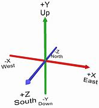

---

==== ▸ repute  [286]   +
な/rɪˈpjuːt/   +

【PHRASE】   A person or thing _of repute_ or _of_ high _repute_ is respected and known to be good. 名声好的; 有良好名誉的 +
⇒  He was a writer of repute.  他曾是一位颇有名望的作家。   +

【N-UNCOUNT】   A person's or organization's _repute_ is their reputation, especially when this is good. 名声; 名望; 美名 +
⇒  Under his leadership, the U.N.'s repute has risen immeasurably.  在他的领导下，联合国的名望得到了极大提升。   +

---

==== ▸ criteria  [287]   +
な/kraɪˈtɪriə/ +

criterion 的复数. +
criteria : N-COUNT A _criterion_ is a factor on which you judge or decide something. (判断的) 标准 +
⇒   *The most important criterion for entry is that* applicants must design and make their own work. 参加的最重要标准就是申请人必须设计并制作自己的作品。 +

==== ▸ fungi  [288]   +
な/ˈfʌŋɡaɪ, ˈfʌndʒɪ/   +

---

==== ▸ withhold  [289]   +
な/wɪðˈhəʊld, wɪθ-/   +

【V-T】   If you _withhold_ something that someone wants, you do not let them have it. 拒绝给 +
⇒  Police withheld the dead boy's name yesterday until relatives could be told.  警察昨天拒绝在通知亲属前透露死去男孩的名字。   +

---

==== ▸ emergent  [290]   +
な/ɪˈmɜːdʒənt/   +

【ADJ】   An _emergent_ country, political movement, or social group is one that is becoming powerful or coming into existence. (国家、政治运动或社会团体)新兴的; 兴起的 +
⇒  ...an emergent state.  ...一个新兴国家。   +
⇒  ...an emergent nationalist movement.  ...一次新兴民族主义运动。   +

---

==== ▸ thermal  [291]   +
な/ˈθɜːməl/   +

【ADJ】  _Thermal_ means relating to or caused by heat or by changes in temperature. 热的; 由热引起的; 由温度变化引起的 +
⇒  ...thermal power stations.  …热电站。   +

【ADJ】  _Thermal_ streams or baths contain water which is naturally hot or warm. 天然温热的 +
⇒  Volcanic activity has created thermal springs and boiling mud pools.  火山活动产生了温泉和沸腾的泥浆池。   +

【ADJ】  _Thermal_ clothes are specially designed to keep you warm in cold weather. 保暖的 (衣服) +
⇒  ...thermal underwear.  …保暖内衣   +
⇒  My feet were like blocks of ice despite the thermal socks.  我的双脚尽管穿着保暖袜，还是像冰块。   +

【N-PLURAL】  _Thermals_ are thermal clothes. 保暖衣 +
⇒  Have you got your thermals on?  你穿上保暖衣了吗？   +

【N-COUNT】   A _thermal_ is a movement of rising warm air. 上升的暖气流 +
⇒  Birds use thermals to lift them through the air.  鸟类利用上升的暖气流升空。   +

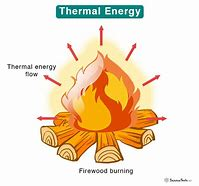

---

==== ▸ dilemma  [292]   +
な/dɪˈlɛmə/   +

【N-COUNT】   A _dilemma_ is a difficult situation in which you have to choose between two or more alternatives. 进退两难的局面 +
⇒  He was faced with the dilemma of whether or not to return to his country.  他面临着是否回国的艰难选择。   +

---

==== ▸ roe  [293]   +
な/rəʊ/   +

【N-VAR】  _Roe_ is the eggs or sperm of a fish, which is eaten as food. 鱼子; 鱼卵 +
⇒  ...cod's roe.  ...鳕鱼子。   +

【N】   roe deer的缩写 +

---

==== ▸ incur  [294]   +
な/ɪnˈkɜː/   +

【V-T】   If you _incur_ something unpleasant, it happens to you because of something you have done. 招致; 蒙受 +
⇒  The government had also incurred huge debts.  政府也已承受了大笔债务。   +

---

==== ▸ academy  [295]   +
な/əˈkædəmɪ/   +

【N-COUNT】  _Academy_ is sometimes used in the names of schools and colleges, especially those specializing in particular subjects or skills, or private high schools in the United States. 有时用于 (尤为专科) 院校或美国私立中学名称中 +
⇒  He is an English teacher at the Seattle Academy for Arts and Sciences.  他是西雅图文理学院的一名英语老师。   +

【N-IN-NAMES】  _Academy_ appears in the names of some societies formed to improve or maintain standards in a particular field. 用于专业学术团体名称中 +
⇒  ...the American Academy of Psychotherapists.  …美国心理治疗师学会。   +

---

==== ▸ diagnose  [296]   +
な/ˈdaɪəɡˌnəʊz/   +

【V-T】   If someone or something _is diagnosed as_ having a particular illness or problem, their illness or problem is identified. If an illness or problem _is diagnosed_, it is identified. 诊断 +
⇒  The soldiers were diagnosed as having flu.  这些士兵被诊断为患了流感。   +
⇒  Susan had a mental breakdown and was diagnosed with schizophrenia.  苏珊精神崩溃，被诊断为精神分裂。   +

---

==== ▸ abnormal  [297]   +
な/æbˈnɔːməl/   +

【ADJ】   Someone or something that is _abnormal_ is unusual, especially in a way that is troublesome. 异常的 +
⇒  ...abnormal heart rhythms and high anxiety levels.  …异常的心律和高度焦虑。   +

【ADV】   异常地 +
⇒  ...abnormally high levels of glucose.  …异常高的葡萄糖指标。   +

---

==== ▸ squid  [298]   +
な/skwɪd/   +

【N-COUNT】   A _squid_ is a sea creature with a long soft body and many soft arms called tentacles. 鱿鱼 +
【N-UNCOUNT】  _Squid_ is pieces of this creature eaten as food. 鱿鱼   +
⇒  Add the prawns and squid and cook for 2 minutes.  加入虾和鱿鱼，煮2分钟。   +

【N】   a pound sterling 英镑 +

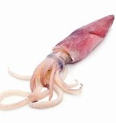

---

==== ▸ metropolis  [299]   +
な/mɪˈtrɒpəlɪs/   +
--> 来自希腊语meter,母亲，词源同mother,polis,城市，词源同police,policy.比喻用法。 +

【N-COUNT】   A _metropolis_ is the largest, busiest, and most important city in a country or region. 大都会 +
⇒  New Orleans is the metropolis of the American South.  新奥尔良是美国南部的大都会。   +

---

==== ▸ enlighten  [300]   +
な/ɪnˈlaɪtən/   +

【V-T】   To _enlighten_ someone means to give them more knowledge and greater understanding about something. 启迪 +
⇒  A few dedicated doctors have fought for years to enlighten the profession.  少数富有献身精神的医生为启蒙这一行业而奋斗多年。   +

【ADJ】   具有启发性的 +
⇒  ...an enlightening talk on the work done at the zoo.  …一段关于动物园工作的具有启发性的讲话。   +

---

==== ▸ moral  [301]   +
な/ˈmɒrəl/   +

【N-PLURAL】  _Morals_ are principles and beliefs concerning right and wrong behaviour. 道德 +
⇒  ...Western ideas and morals.  …西方的思想和道德。   +

【ADJ】  _Moral_ means relating to beliefs about what is right or wrong. 道德的 +
⇒  She describes her own moral dilemma in making the film.  她描述了自己拍摄这部电影时面临的道德困境。   +

【ADV】   道德上 +
⇒  When, if ever, is it morally justifiable to allow a patient to die?  假如可以的话，什么情况下允许病人放弃生命在道德上是正当的？   +

【ADJ】  _Moral_ courage or duty is based on what you believe is right or acceptable, rather than on what the law says should be done. 道义上的 +
⇒  The government had a moral, if not a legal, duty to pay compensation.  政府即使没有法律上的义务也有道义上的义务进行赔偿。   +

【ADJ】   A _moral_ person behaves in a way that is believed by most people to be good and right. 有道德的 +
⇒  The people who will be on the committee are moral, cultured, competent people.  将要加入委员会的是那些有道德、有文化、有能力的人。   +

【ADV】   道德上地 +
⇒  Art is not there to improve you morally.  艺术不是从道德上提升你。   +

【ADJ】   If you give someone _moral_ support, you encourage them in what they are doing by expressing approval. 道义上的 (支持) +
⇒  Moral as well as financial support is what the West should provide.  道义上和经济上的支持是西方国家应该提供的。   +

【N-COUNT】  _The__moral_ of a story or event is what you learn from it about how you should or should not behave. 道德寓意 +
⇒  I think the moral of the story is let the buyer beware.  我想这个故事的寓意是提醒购买者当心。   +

---

==== ▸ longevity  [302]   +
な/lɒnˈdʒɛvɪtɪ/   +

【N-UNCOUNT】  _Longevity_ is long life. 长寿 +
⇒  Human longevity runs in families.  人类长寿是有遗传的。   +
⇒  The main characteristic of the strike has been its longevity.  这次罢工的主要特点是持续时间长。   +

---

==== ▸ simplicity  [303]   +
な/sɪmˈplɪsɪtɪ/   +

【N-UNCOUNT】   The _simplicity_ of something is the fact that it is not complicated and can be understood or done easily. 简单; 简明 +
⇒  The apparent simplicity of his plot is deceptive.  他的阴谋貌似简单，却具有欺骗性。   +

---

==== ▸ dote  [304]   +
な/dəʊt/   +

【V-I】   If you say that someone _dotes on_ a person or a thing, you mean that they love or care about them very much and ignore any faults they may have. 溺爱 +
⇒  He dotes on his nine-year-old son.  他对自己9岁的儿子十分溺爱。   +

---

==== ▸ blunt  [305]   +
な/blʌnt/   +

【ADJ】   If you are _blunt_, you say exactly what you think without trying to be polite. 直言不讳的 +
⇒  She is blunt about her personal life.  她对自己的私生活直言不讳。   +

【ADV】   直言不讳地 +
⇒  "I don't believe you!" Jeanne said bluntly.  “我不信你！” 珍妮直言不讳地说。   +

【ADJ】   A _blunt_ object has a rounded or flat end rather than a sharp one. 钝的 +
⇒  One of them had been struck 13 times over the head with a blunt object.  他们其中一人的头部被钝器砸了13下。   +

【ADJ】   A _blunt_ knife or blade is no longer sharp and does not cut well. 不锋利的 +
⇒  The edge is as blunt as an old butter knife.  刃钝得跟一把老黄油刀一样。   +

【V-T】   If something _blunts_ an emotion, a feeling or a need, it weakens it. 使减弱 +
⇒  The constant repetition of violence has blunted the human response to it.  持续不断的暴力事件使人们对它的反应减弱了。   +

---

==== ▸ skyscraper  [306]   +
な/ˈskaɪˌskreɪpə/   +

【N-COUNT】   A _skyscraper_ is a very tall building in a city. 摩天楼 +

---

==== ▸ gorge  [307]   +
な/ɡɔːdʒ/   +
--> 来自PIE*gwere, 喉咙，吞没，拟声词，词源同vorocity. 引申义峡谷。比较gulch.+

【N-COUNT】   A _gorge_ is a deep, narrow valley with very steep sides, usually where a river passes through mountains or an area of hard rock. 峡谷 +
⇒  ...the deep gorge between these hills.  …山间的那个深谷。   +

【V-T/V-I】   If you _gorge on_ something or _gorge yourself on_ it, you eat lots of it in a very greedy way. 狼吞虎咽 +
⇒  I could spend each day gorging on chocolate.  我可以将每一天都花在狂吃巧克力上。   +

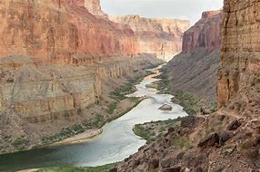

---

==== ▸ utensil  [308]   +
な/juːˈtɛnsəl/   +
--> 来自拉丁语 uti,使用，利用，用于指器具，器皿，词源同 use. +

【N-COUNT】  _Utensils_ are tools or objects that you use in order to help you to cook, serve food, or eat. 器皿; 用具 +
⇒  ...utensils such as bowls, steamers and frying pans.  …碗、蒸锅、平底锅等用具。   +

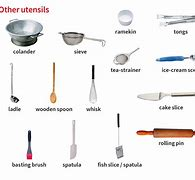

---

==== ▸ geometry  [309]   +
な/dʒɪˈɒmɪtrɪ/   +

【N-UNCOUNT】  _Geometry_ is the branch of mathematics concerned with the properties and relationships of lines, angles, curves, and shapes. 几何学 +
⇒  ...the very ordered way in which mathematics and geometry describe nature.  …数学和几何学描述自然的条理性。   +

【N-UNCOUNT】   The _geometry_ of an object is its shape or the relationship of its parts to each other. 几何图形; 几何结构 +
⇒  ...the geometry of the curved roof.  …几何图形的弧形房顶。   +

---

==== ▸ equator  [310]   +
な/ɪˈkweɪtə/   +

【N-SING】  _The equator_ is an imaginary line around the middle of the earth at an equal distance from the North Pole and the South Pole. 赤道 +

---

==== ▸ daylight  [311]   +
な/ˈdeɪˌlaɪt/   +

【N-UNCOUNT】  _Daylight_ is the natural light that there is during the day, before it gets dark. 日光 +
⇒  Lack of daylight can make people feel depressed.  缺乏日光的照射会让人情绪低落。   +

【N-UNCOUNT】  _Daylight_ is the time of day when it begins to get light. 拂晓 +
⇒  Quinn returned shortly after daylight yesterday morning.  奎因昨天天刚亮就回来了。   +

【PHRASE】   If you say that a crime is committed _in broad daylight_, you are expressing your surprise that it is done during the day when people can see it, rather than at night. 光天化日之下 +
⇒  A girl was attacked on a train in broad daylight.  光天化日之下，一个女孩在火车上遭袭。   +

---

==== ▸ fluctuate  [312]   +
な/ˈflʌktjʊˌeɪt/   +

【V-I】   If something _fluctuates_, it changes a lot in an irregular way. 波动 +
⇒  Body temperature can fluctuate if you are ill.  如果你病了，体温会波动。   +

【N-VAR】   波动 +
⇒  Don't worry about tiny fluctuations in your weight.  不用担心你体重的轻微波动。   +

---

==== ▸ comic  [313]   +
な/ˈkɒmɪk/   +

【ADJ】   If you describe something as _comic_, you mean that it makes you laugh, and is often intended to make you laugh. 喜剧的 +
⇒  The novel is comic and tragic.  这本小说兼有喜剧和悲剧的特点。   +

【ADJ】  _Comic_ is used to describe funny entertainment, and the actors and entertainers who perform it. 滑稽的 +
⇒  Grodin is a fine comic actor.  格罗丁是一位好的滑稽演员。   +

【N-COUNT】   A _comic_ is an entertainer who tells jokes in order to make people laugh. 喜剧演员 +
⇒  ...the funniest comic in America.  …美国最有趣的喜剧演员。   +

【N-SING】   The _comics_ is the part of a newspaper that contains the comic strips. (报刊的) 连环漫画栏 +
⇒  She read the comics in the Philadelphia Inquirer.  她看了《费城调查者报》的连环漫画。   +

【N-COUNT】   A _comic_ is a magazine that contains stories told in pictures. 连环漫画 +

---

==== ▸ splash  [314]   +
な/splæʃ/   +

【V-I】   If you _splash_ around or _splash_ about in water, you hit or disturb the water in a noisy way, causing some of it to fly up into the air. 泼打戏水 +
⇒  A lot of people were in the water, swimming or simply splashing about.  很多人在水里游泳或者只是戏水。   +
⇒  She could hear the voices of her friends as they splashed in a nearby rock pool.  她能听到她的朋友们在附近的岩石泳池里戏水的声音。   +

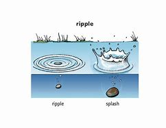

【V-T/V-I】   If you _splash_ a liquid somewhere or if it _splashes_, it hits someone or something and scatters in a lot of small drops. 使泼溅; 溅落 +
⇒  He closed his eyes tight, and splashed the water on his face.  他紧紧地闭上眼睛，把水泼到脸上。   +
⇒  A little wave, the first of many, splashed in my face.  层层波浪中的第一层小浪溅在了我的脸上。   +

【N-SING】   A _splash_ is the sound made when something hits water or falls into it. 拍打水的声音; 落入水的声音 +
⇒  There was a splash and something fell clumsily into the water.  扑通一声，什么东西重重地掉进了水里。   +

【N-COUNT】   A _splash_ of a liquid is a small quantity of it that falls on something or is added to something. (少量液体的) 溅落; (少量液体的) 添加 +
⇒  Wallcoverings and floors should be able to withstand steam and splashes.  墙纸和地板应该能承受得住蒸汽和液体的泼溅。   +

【N-COUNT】   A _splash of_ colour is an area of a bright colour which contrasts strongly with the colours around it. (与周围颜色形成鲜明对比的) 亮色块 +
⇒  ...shady walks punctuated by splashes of colour.  …由鲜艳色彩点缀的条条林荫小径。   +

【V-T】   If a magazine or newspaper _splashes_ a story, it prints it in such a way that it is very noticeable. (报刊) 以显眼方式刊登 +
⇒  The newspapers splashed the story all over their front pages.  各报都在头版全版以显眼的方式刊登了这个故事。   +

【PHRASE】   If you _make a splash_, you become noticed or become popular because of something that you have done. 引起关注 +
⇒  Now she's made a splash in the television show "Civil Wars."  如今她因在电视节目《内战》中的出现而引起了人们的关注。   +

---

==== ▸ homogeneous  [315]   +
な/ˌhəʊməˈdʒiːnɪəs, ˈhɒm-/   +

【ADJ】  _Homogeneous_ is used to describe a group or thing which has members or parts that are all the same. 同种类的 +
⇒  The unemployed are not a homogeneous group.  失业者并不都是同一类人。   +

---

==== ▸ diplomat  [316]   +
な/ˈdɪpləˌmæt/   +

【N-COUNT】   A _diplomat_ is a senior official who discusses affairs with another country on behalf of his or her own country, usually working as a member of an embassy. 外交官 +
⇒  ...a Western diplomat with long experience in Asia.  …一名在亚洲有长期经验的西方外交官。   +

---

==== ▸ redundant  [317]   +
な/rɪˈdʌndənt/   +

【ADJ】   Something that is _redundant_ is unnecessary, for example, because it is no longer needed or because its job is being done by something else. 多余的 +
⇒  Changes in technology may mean that once-valued skills are now redundant.  技术的变化可能意味着从前受重视的技巧现在变得多余了。   +

【ADJ】   If you are made _redundant_, your employer tells you to leave because your job is no longer necessary or because your employer cannot afford to keep paying you. 被裁减的 +

---

==== ▸ aria  [318]   +
な/ˈɑːrɪə/   +

【N-COUNT】   An _aria_ is a song for one of the leading singers in an opera or choral work. 咏叹调; 唱腔 +

---

==== ▸ irregular  [319]   +
な/ɪˈrɛɡjʊlə/   +

【ADJ】   If events or actions occur at _irregular_ intervals, the periods of time between them are of different lengths. 不规律的 +
⇒  Cars passed at irregular intervals.  汽车以不规律的时间间隔驶过。   +
⇒  She was taken to a hospital suffering from an irregular heartbeat.  她因心律不齐而被送进医院。   +

【ADV】   不规律地 +
⇒  He was eating irregularly, steadily losing weight.  他吃饭不规律，体重不断下降。   +

【ADJ】   Something that is _irregular_ is not smooth or straight, or does not form a regular pattern. 不规则的; 不平整的 +
⇒  He had bad teeth, irregular and discoloured.  他的牙齿不好，不整齐，而且变了色。   +

【ADV】   不规则地; 不平整地 +
⇒  Located off-centre in the irregularly shaped lake was a fountain.  在那个形状不规则的湖的中心之外，有一个喷泉。   +

【ADJ】  _Irregular_ behaviour is dishonest or not in accordance with the normal rules. 不正规的; 不合常规的 +
⇒  ...irregular business practices.  …不合常规的商务活动。   +

【N-VAR】   不正当; 不合常规 +
⇒  He faced charges arising from alleged financial irregularities.  他面临涉嫌不正当财务行为的控告。   +

【ADJ】   An _irregular_ verb, noun, or adjective has different forms from most other verbs, nouns, or adjectives in the language. For example, "break" is an irregular verb because its past form is "broke," not "breaked." 不规则的 +

---

==== ▸ atom  [320]   +
な/ˈætəm/   +

【N-COUNT】   An _atom_ is the smallest amount of a substance that can take part in a chemical reaction. 原子 +
⇒  ...the news that Einstein's former colleagues Otto Hahn and Fritz Strassmann had split the atom.  …爱因斯坦的前同事奥托·哈恩和弗里茨·斯特拉斯曼曾分裂了原子的消息。   +

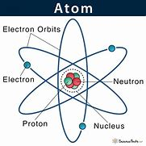

---

==== ▸ bump  [321]   +
な/bʌmp/   +

【V-T/V-I】   If you _bump_ into something or someone, you accidentally hit them while you are moving. 撞上 +
⇒  They stopped walking and he almost bumped into them.  他们停下了脚步，这下他几乎撞到他们。   +
⇒  She bumped her head against a low branch.  她的头撞到一根低矮的树枝上。   +

【N-COUNT】  _Bump_ is also a noun. 碰撞 +
⇒  Small children often cry after a minor bump.  小孩子们在轻微的碰撞后常常会哭。   +

【N-COUNT】   A _bump_ is the action or the dull sound of two heavy objects hitting each other. 碰撞; 碰撞声 +
⇒  I felt a little bump and I knew instantly what had happened.  我感到了一下轻轻的撞击，立刻就明白发生了什么。   +

【N-COUNT】   A _bump_ is a minor injury or swelling that you get if you bump into something or if something hits you. 肿块 +
⇒  She fell against our coffee table and got a large bump on her forehead.  她撞到了我们的咖啡桌跌倒了，前额起了一个大包。   +

【N-COUNT】   A _bump_ on a road is a raised, uneven part. (路面) 隆起部分 +
⇒  The truck hit a bump and bounced.  卡车开到了路面上一块隆起的地方，颠簸起来。   +

【V-I】   If a vehicle _bumps over_ a surface, it travels in a rough, bouncing way because the surface is very uneven. 颠簸行驶 +
⇒  We left the road, and again bumped over the mountainside.  我们离开公路，又一次在山坡上颠簸行驶。   +

---

==== ▸ lethargy  [322]   +
な/ˈlɛθədʒɪ/   +

【N-UNCOUNT】  _Lethargy_ is the condition or state of being lethargic. 没精打采 +
⇒  Symptoms include tiredness, paleness, and lethargy.  症状包括疲倦、面色苍白和没精打采。   +

---

==== ▸ psychoanalysis  [323]   +
な/ˌsaɪkəʊəˈnælɪsɪs/   +

【N-UNCOUNT】  _Psychoanalysis_ is the treatment of someone who has mental problems by asking them about their feelings and their past in order to try to discover what may be causing their condition. 精神分析 +

---

==== ▸ feast  [324]   +
な/fiːst/   +

【N-COUNT】   A _feast_ is a large and special meal. 盛宴 +
⇒  Lunch was a feast of meat and vegetables, cheese, yoghurt and fruit, with unlimited wine.  午餐是一场盛宴，有肉、蔬菜、奶酪、酸奶和水果，以及不限量的葡萄酒。   +
⇒  The fruit was often served at wedding feasts.  婚宴上常有水果供应。   +

【N-COUNT】   A _feast_ is a day or time of the year when a special religious celebration takes place. 宗教节日; 宗教节庆时期 +
⇒  The Jewish feast of Passover began last night.  犹太人的宗教节日逾越节昨晚开始了。   +

【V-I】   If you _feast on_ a particular food, you eat a large amount of it with great enjoyment. 尽情地吃 +
⇒  They feasted well into the afternoon on mutton and corn stew.  他们尽情享用玉米炖羊肉，一直吃到下午。   +

【V-I】   If you _feast_, you take part in a feast. 赴宴 +
⇒  Only a few feet away, their captors feasted in the castle's banqueting hall.  仅仅几英尺外，俘获他们的人在城堡的宴会厅里大吃大喝。   +

【N-UNCOUNT】   赴宴 +
⇒  The feasting, drinking, dancing and revelry continued for several days.  宴会、畅饮、跳舞和狂欢持续了几天。   +

【PHRASE】   If you _feast_ your _eyes on_ something, you look at it for a long time with great attention because you find it very attractive. 尽情欣赏 +
⇒  She stood feasting her eyes on the view.  她站着尽情欣赏着那片景色。   +

---

==== ▸ interface  [325]   +
な/ˈɪntəfeɪs/   +

【N-COUNT】   The _interface_ between two subjects or systems is the area in which they affect each other or have links with each other. 交叉区域 +
⇒  ...a witty exploration of that interface between bureaucracy and the working world.  …对官僚阶层和劳动大众之间的临界区域的巧妙探究。   +

【N-COUNT】   The user _interface_ of a particular piece of computer software is its presentation on the screen and how easy it is to operate. 界面 +
⇒  ...the development of better user interfaces.  …更好用户界面的开发。   +

【V-RECIP】   If one thing _interfaces with_ another, or if two things _interface_, they have connections with each other. If you _interface_ one thing with another, you connect the two things. 相互联系; 连接 +
⇒  ...the way we interface with the environment.  …我们与环境相互联系的方式。   +
⇒  He had interfaced all this machinery with a master computer.  他已将这整台机器与一台主控计算机连接起来。   +

---

==== ▸ contempt  [326]   +
な/kənˈtɛmpt/   +

【N-UNCOUNT】   If you have _contempt for_ someone or something, you have no respect for them or think that they are unimportant. 蔑视 +
⇒  He has contempt for those beyond his immediate family circle.  他对自己直系亲属以外的人都心怀蔑视。   +

---

==== ▸ fumigate  [327]   +
な/ˈfjuːmɪˌɡeɪt/   +
--> fume, 烟。-ig, 做，驱使，词源同agent. 即烟熏，常用做消毒。 +

【V-T】   If you _fumigate_ something, you get rid of germs or insects from it using special chemicals. 用(化学品)消毒 +
⇒  ...fruit which has been treated with insecticide and fumigated.  ...杀过虫、消过毒的水果。   +

【N-UNCOUNT】  
 +
⇒  Methods of control involved poisoning and fumigation.  控制方法包括毒杀和薰杀。   +

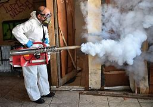

---

==== ▸ contagious  [328]   +
な/kənˈteɪdʒəs/   +

【ADJ】   A disease that is _contagious_ can be caught by touching people or things that are infected with it. Compare . 接触传染的 +
⇒  ...a highly contagious disease of the lungs.  …一种高度接触传染的肺病。   +

【ADJ】   A feeling or attitude that is _contagious_ spreads quickly among a group of people. 有感染力的 +
⇒  Laughing is contagious.  笑是有感染力的。   +

---

==== ▸ measure  [329]   +
な/ˈmɛʒə/   +

【V-T】   If you _measure_ the quality, value, or effect of something, you discover or judge how great it is. 估量 +
⇒  I continued to measure his progress against the charts in the doctor's office.  我继续根据医生办公室里的图表来估量他的进展。   +

【V-T】   If you _measure_ a quantity that can be expressed in numbers, such as the length of something, you discover it using a particular instrument or device, for example a ruler. 测量 +
⇒  Measure the length and width of the gap.  测量一下这个裂口的长度和宽度。   +

【V-T】   If something _measures_ a particular length, width, or amount, that is its size or intensity, expressed in numbers. (长度、宽度、数量的) 数值为 +
⇒  It measures 20 yards from side to side.  从这边到那边的距离为20码。   +

【N-SING】   A _measure of_ a particular quality, feeling, or activity is a fairly large amount of it. 一定数量; 一定程度 +
⇒  With the exception of Juan, each attained a measure of success.  除了胡安，每个人都取得了一定的成功。   +

【N-SING】   If you say that one aspect of a situation is _a measure of_ that situation, you mean that it shows that the situation is very serious or has developed to a very great extent. (严重程度的) 标准 +
⇒  That is a measure of how bad things have become at the bank.  那就是银行的局面已经糟糕到何种程度的衡量标准。   +

【N-COUNT】   When someone, usually a government or other authority, takes _measures_ to do something, they carry out particular actions in order to achieve a particular result. 措施 +
⇒  The government warned that police would take tougher measures to contain the trouble.  政府警告说警察将采取更为强硬的措施来制止这场动乱。   +

【N-COUNT】   A _measure of_ a strong alcoholic drink such as brandy or whisky is an amount of it in a glass. In bars, a _measure_ is an official standard amount. (标准量的) 一杯 +
⇒  He poured himself another generous measure of whisky.  他又给自己慷慨地倒了一杯威士忌。   +

【N-COUNT】   In music, a _measure_ is one of the several short parts of the same length into which a piece of music is divided. (音乐的) 小节 +
⇒  Malcolm wanted to mix the beginning of a sonata, then add Beethoven for a few measures, then go back to Bach.  马尔科姆想要在开头部分加入一段奏鸣曲，然后加上几个小节的贝多芬作品，然后再回到巴赫的作品。   +

【PHRASE】   If you say that something has changed or that it has affected you _beyond measure_, you are emphasizing that it has done this to a great extent. 极度 +
⇒  Mankind's knowledge of the universe has increased beyond measure.  人类关于宇宙的知识已经极大增加。   +

---

==== ▸ comprehend  [330]   +
な/ˌkɒmprɪˈhɛnd/   +

【V-T/V-I】   If you cannot _comprehend_ something, you cannot understand it. 理解 +
⇒  I just cannot comprehend your attitude.  我就是不能理解你的态度。   +

---

==== ▸ ivory  [331]   +
な/ˈaɪvərɪ/   +

【N-UNCOUNT】  _Ivory_ is a hard cream-coloured substance that forms the tusks of elephants and some other animals. It is valuable and can be used for making carved ornaments. (象或其他一些动物的) 长牙 +
⇒  ...the international ban on the sale of ivory.  …禁止销售象牙的国际禁令。   +

【COLOR】  _Ivory_ is a creamy-white colour. 乳白色 (的) +
⇒  ...small ivory flowers.  …乳白色的小花。   +

---

==== ▸ kerosene  [332]   +
な/ˈkɛrəˌsiːn/   +

【N-UNCOUNT】  _Kerosene_ is a clear, strong-smelling liquid which is used as a fuel, for example in heaters and lamps. 煤油 +
⇒  a kerosene lamp 煤油灯 +

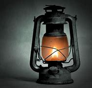

---

==== ▸ hominid  [333]   +
な/ˈhɒmɪnɪd/   +

【N】   any primate of the family _Hominidae,_ which includes modern man (_Homo sapiens_) and the extinct precursors of man 原人 +
【ADJ】   of, relating to, or belonging to the _Hominidae_ 人科的; 和人科有关的; 属于人科的   +

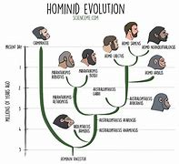

---

==== ▸ offensive  [334]   +
な/əˈfɛnsɪv/   +

【ADJ】   Something that is _offensive_ upsets or embarrasses people because it is rude or insulting. 冒犯性的 +
⇒  Some friends of his found the play horribly offensive.  他的一些朋友觉得那部戏让人很不舒服。   +

【N-COUNT】   A military _offensive_ is a carefully planned attack made by a large group of soldiers. (军事) 进攻 +
⇒  Its latest military offensive against rebel forces is aimed at re-opening important trade routes.  其最近对叛军的军事进攻旨在重新开辟重要的贸易路线。   +

【N-COUNT】   If you conduct an _offensive_, you take strong action to show how angry you are about something or how much you disapprove of something. 强硬行动 +
⇒  Republicans acknowledged that they had little choice but to mount an all-out offensive on the Democratic nominee.  共和党人承认他们别无选择，只有对民主党提名人全力发起一场强硬行动。   +

【PHRASE】   If you _go on the offensive_, _go over to the offensive_, or _take the offensive_, you begin to take strong action against people who have been attacking you. 采取攻势 +
⇒  The West African forces went on the offensive in response to attacks on them.  西非武装力量发起进攻以回应袭击。   +

---

==== ▸ suction  [335]   +
な/ˈsʌkʃən/   +

【N-UNCOUNT】  _Suction_ is the process by which liquids, gases, or other substances are drawn out of somewhere. 抽吸(液体、汽体等) +
⇒  Dust bags act as a filter and suction will be reduced if they are too full.  灰尘袋是一个过滤器，一旦太满吸力就会减弱。   +

【V-T】   If a doctor or nurse _suctions_ a liquid, they remove it by using a machine which sucks it away. 吸(痰) +
⇒  Michael was showing the nurse *how to suction his saliva*.  迈可正演示给护士看如何吸出他的唾液。   +

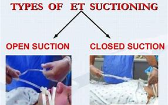

【N-UNCOUNT】  _Suction_ is the process by which two surfaces stick together when the air between them is removed. 真空吸附 +
⇒  ...their pneumatic robot which uses air to move and *sticks to surfaces by suction*.  ...他们的气动机器人, 依靠空气来移动, 并通过真空吸附固定于物体表面。   +

---

==== ▸ request  [336]   +
な/rɪˈkwɛst/   +

【V-T】   If you _request_ something, you ask for it politely or formally. 请求; 正式要求 +
⇒  Mr. Dennis said he had requested access to a telephone.  丹尼斯先生说他已正式要求要能够使用一部电话。   +

【V-T】   If you _request_ someone _to_ do something, you politely or formally ask them to do it. 要求 +
⇒  Students are requested to park at the rear of the building.  学生们被要求在那座楼后面停车。   +

【N-COUNT】   If you make a _request_, you politely or formally ask someone to do something. 请求 +
⇒  France had agreed to his request for political asylum.  法国已经同意了他政治避难的请求。   +

【PHRASE】   If you do something _at_ someone's _request_, you do it because they have asked you to. 应某人的要求 +
⇒  The evacuation is being organized at the request of the United Nations Secretary General.  应联合国秘书长的要求，该撤离正在进行中。   +

【PHRASE】   If something is given or done _on request_, it is given or done whenever you ask for it. 应要求 +
⇒  Details are available on request.  详情备索。   +

---

==== ▸ sympathy  [337]   +
な/ˈsɪmpəθɪ/   +

【N-UNCOUNT】   If you have _sympathy_ for someone who is in a bad situation, you are sorry for them, and show this in the way you behave toward them. 同情 +
⇒  We expressed our sympathy for her loss.  我们对她的损失表示了同情。   +
⇒  I have had very little help from doctors and no sympathy whatsoever.  我从医生那儿得到的帮助极少，而且没得到任何同情。   +

【N-UNCOUNT】   If you have _sympathy_ with someone's ideas or opinions, you agree with them. 赞同 +
⇒  I have some sympathy with this point of view.  我对这一观点有些赞同。   +
⇒  Lithuania still commands considerable international sympathy for its cause.  立陶宛仍得到相当多对其事业的国际支持。   +

【N-UNCOUNT】   If you take some action _in sympathy with_ someone else, you do it in order to show that you support them. 支持 +
⇒  Several hundred workers struck in sympathy with their colleagues.  几百名工人举行罢工以示对其工友们的支持。   +

---

==== ▸ dispose  [338]   +
な/dɪˈspəʊz/   +

(v.) [ VN+ adv./prep.] to arrange things or people in a particular way or position 排列；布置；安排 +
(v.) _~ sb to/toward(s) sth_ : to make sb behave in a particular way 使倾向于；使有意于；使易于 +
[ VN] +
=> a drug that disposes the patient towards sleep 使病人想睡觉的药  +
[ also VN to inf ] +

PHRASAL VERBS 短语动词 +
(v.) _DISPOSE OF SB/STH_ +
(1) to get rid of sb/sth that you do not want or cannot keep 去掉；清除；销毁 +
=> the difficulties of *disposing of nuclear waste* 处理核废料的困难 +
=> *to dispose of* stolen property 销赃 +

(2) to deal with a problem, question or threat successfully 应付；解决；处理 +
=> That seems to have disposed of most of their arguments. 这样就似乎把他们的大部分论点都驳倒了。 +

(3) to defeat or kill sb 击败；杀死 +
=> It took her a mere 20 minutes to dispose of her opponent. 她仅用了20分钟就击败了对手。 +

---

==== ▸ mason  [339]   +
な/ˈmeɪsən/   +
--> 来自古法语masson,石匠，可能来自Proto-Germanic*mait,砍，劈，来自PIE*mai,砍，词源同smith,maim.或来自PIE*mag,揉，捏，形成，词源同make,massage.词义共济会缩写自Freemason. +

【N-COUNT】   A _mason_ is a person who is skilled at making things or building things with stone or bricks. 石匠 +

---

==== ▸ pertain  [340]   +
な/pəˈteɪn/   +
--> per-,完全的，-tain,抓住，握住，词源同contain,continent.引申词义相关。+

【V-I】   If one thing _pertains to_ another, it relates, belongs, or applies to it. 与…相关; 属于; 适于 +
⇒  ...matters pertaining to naval district defence.  …与海军区域防卫有关的问题。   +

---

==== ▸ fade  [341]   +
な/feɪd/   +

【V-T/V-I】   When a coloured object _fades_ or when the light _fades_ it, it gradually becomes paler. 使褪色; 褪色 +
⇒  All colour fades – especially under the impact of direct sunlight.  所有颜色都会褪色–尤其是在直射阳光的影响下。   +
⇒  No matter how soft the light is, it still fades carpets and curtains in every room.  不论光线多么柔和，它仍然会使每个房间的地毯和窗帘褪色。   +

【ADJ】   褪色的 +
⇒  ...a girl in a faded dress.  …一个穿褪色连衣裙的女孩。   +

【V-I】   When light _fades_, it slowly becomes less bright. When a sound _fades_, it slowly becomes less loud. 逐渐变暗; 逐渐变弱 +
⇒  Seaton lay on his bed and gazed at the ceiling as the light faded.  西顿躺在床上凝视着天花板， 那时光线逐渐变暗。   +

【V-I】   If memories, feelings, or possibilities _fade_, they slowly become less intense or less strong. 逐渐变弱 +
⇒  Sympathy for the rebels, the government claims, is beginning to fade.  政府声称对造反者的同情在开始减弱。   +
⇒  Prospects for peace had already started to fade.  和平的前景已开始变得暗淡。   +

---

==== ▸ predation  [342]   +
な/prɪˈdeɪʃən/   +

【N】   a relationship between two species of animal in a community, in which one (the predator) hunts, kills, and eats the other (the prey) 捕食; 指一种生物以另一种生物为食的种间关系，前者谓之捕食者，后者谓被捕食者 +

---

==== ▸ bizarre  [343]   +
な/bɪˈzɑː/   +

【ADJ】   Something that is _bizarre_ is very odd and strange. 怪异的 +
⇒  The game was also notable for the bizarre behaviour of the team's manager.  这场比赛另一值得注意的地方是该队经理人异乎寻常的表现。   +

【ADV】   怪异地 +
⇒  She dressed bizarrely.  她穿着怪异。   +

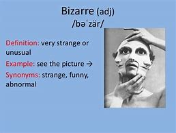

---

==== ▸ rite  [344]   +
な/raɪt/   +

【N-COUNT】   A _rite_ is a traditional ceremony that is carried out by a particular group or within a particular society. 传统仪式 +
⇒  Most traditional societies *have transition rites at puberty 青春期*.  大多数传统社会在青春期举行过渡仪式。   +

---

==== ▸ fantasy  [345]   +
な/ˈfæntəsɪ/   +

【N-COUNT】   A _fantasy_ is a pleasant situation or event that you think about and that you want to happen, especially one that is unlikely to happen. 幻想 +
⇒  ...fantasies of romance and true love.  …对浪漫和真爱的幻想。   +

【N-VAR】   You can refer to a story or situation that someone creates from their imagination and that is not based on reality as _fantasy_. 虚幻的故事; 幻想的情境 +
⇒  The film is more of an ironic fantasy than a horror story.  这部电影比较像是讽刺的幻想故事，而不是恐怖片。   +

【N-UNCOUNT】  _Fantasy_ is the activity of imagining things. 幻想 +
⇒  ...a world of imagination, passion, fantasy, reflection.  …一个想像、激情、幻想和反思的世界。   +

【ADJ】  _Fantasy_ football, baseball, or another sport is a game in which players choose an imaginary team and score points based on the actual performances of the members of their team in real games. 梦幻的 (运动类电子游戏) +
⇒  Haskins said he has been playing fantasy baseball for the past five years.  哈斯金斯说他在过去的５年里一直在打梦幻棒球游戏。   +

---

==== ▸ arithmetic  [346]   +
な/əˈrɪθmətɪk/   +

【N-UNCOUNT】  _Arithmetic_ is the part of mathematics that is concerned with the addition, subtraction, multiplication, and division of numbers. 算术 +
⇒  ...teaching the basics of reading, writing and arithmetic.  …教授读、写、算的基本知识。   +

【N-UNCOUNT】   You can use _arithmetic_ to refer to the process of doing a particular sum or calculation. 计算 +
⇒  4,000 women put in ten rupees each, which if my arithmetic is right adds up to 40,000 rupees.  4千名妇女每人交10卢比，如果我的计算准确的话加起来总共是4万卢比。   +

【N-UNCOUNT】   If you refer to _the arithmetic_ of a situation, you are concerned with those aspects of it that can be expressed in numbers, and how they affect the situation. (某形势的) 数据 +
⇒  The arithmetic was discouraging. In less than two months, they had used up six months' worth of food.  数据不容乐观。在不到两个月里，他们已经吃完了6个月的食物。   +

---

==== ▸ influx  [347]   +
な/ˈɪnˌflʌks/   +

【N-COUNT】   An _influx of_ people or things into a place is their arrival there in large numbers. (人或物的) 大量涌入 +
⇒  ...problems caused by the influx of refugees.  …难民大量涌入所造成的问题。   +

---

==== ▸ certificate  [348]   +
な/səˈtɪfɪkɪt/   +

【N-COUNT】   A _certificate_ is an official document stating that particular facts are true. 证明书 +
⇒  ...birth certificates.  …出生证明。   +

【N-COUNT】   A _certificate_ is an official document that you receive when you have completed a course of study or training. The qualification that you receive is sometimes also called a _certificate_. 结业证书 +
⇒  To the right of the fireplace are various framed certificates.  火炉右侧是各式各样加框的证书。   +

---

==== ▸ recede  [349]   +
な/rɪˈsiːd/   +
--> re-回,向后 + -ced-行走,退让 + -e动词词尾+

【V-I】   If something _recedes_ from you, it moves away. 远离 +
⇒  Luke's footsteps receded into the night.  卢克的脚步声渐渐消失在夜色中。   +
⇒  As she receded he waved goodbye.  当她离去时，他挥手告别。   +

【V-I】   When something such as a quality, problem, or illness _recedes_, it becomes weaker, smaller, or less intense. (品质) 减弱; (问题或疾病等) 好转 +
⇒  Just as I started to think that I was never going to get well, the illness began to recede.  就在我开始认为我将永远不会好起来的时候，我的病开始好转。   +

【V-I】   If a man's hair starts to _recede_, it no longer grows on the front of his head. 谢顶 +
⇒  ...a youngish man with dark hair just beginning to recede.  …一个前额黑发刚开始脱落的相当年轻的男人。   +

---

==== ▸ interval  [350]   +
な/ˈɪntəvəl/   +

【N-COUNT】   An _interval_ between two events or dates is the period of time between them. (时间上的) 间隔 +
⇒  The process is repeated after a short interval of time.  该程序间隔很短时间就重复一次。   +

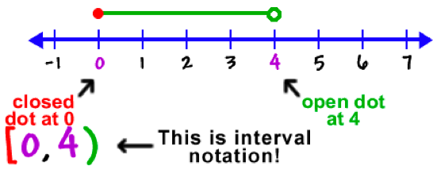

【N-COUNT】   An _interval_ during a concert, show, film, or game is a short break between two of the parts. 幕间休息; 中场休息 +
⇒  ...during the interval of the musical "Steppin' Out."  …在音乐剧《影舞追梦》的幕间休息期间。   +
⇒  Fraser did not perform until after the interval.  弗雷泽直到中场休息之后才出场。   +

【PHRASE】   If something happens _at intervals_, it happens several times with gaps or pauses in between. 不时 +
⇒  She woke him for his medicines at intervals throughout the night.  整个晚上她不时叫醒他，让他吃药。   +

【PHRASE】   If things are placed _at_ particular _intervals_, there are spaces of a particular size between them. 每隔 +
⇒  Several red and white barriers marked the road at intervals of about a mile.  每隔1英里左右就有一些红白相间的路障来标示道路。   +

---

==== ▸ dignify  [351]   +
な/ˈdɪɡnɪˌfaɪ/   +

【V-T】   To _dignify_ something means to make it impressive. 使显得尊贵 +
⇒  Tragic literature dignifies sorrow and disaster.  悲剧性文学使悲伤和灾难显得尊贵。   +

【V-T】   If you say that a particular reaction or description _dignifies_ something you have a low opinion of, you mean that it makes it appear acceptable. 抬高...的身价 +
⇒  We won't dignify this kind of speculation with a comment.  我们不会妄加评论这种猜测以抬高其身价。   +

---

==== ▸ triumph  [352]   +
な/ˈtraɪəmf/   +

【N-VAR】   A _triumph_ is a great success or achievement, often one that has been gained with a lot of skill or effort. 胜利; 成就 +
⇒  The championships proved to be a personal triumph for the coach, Dave Donovan.  那些冠军称号证明了教练戴夫·多诺万的个人成就。   +

【N-UNCOUNT】  _Triumph_ is a feeling of great satisfaction and pride resulting from a success or victory. (成功或胜利的) 喜悦 +
⇒  Her sense of triumph was short-lived.  她喜悦的感觉是短暂的。   +

【V-I】   If someone or something _triumphs_, they gain complete success, control, or victory, often after a long or difficult struggle. 成功; 获胜 +
⇒  All her life, Kelly had stuck with difficult tasks and challenges, and triumphed.  凯利在一生中遭遇了种种艰巨任务与挑战，但成功了。   +

---

==== ▸ lasting  [353]   +
な/ˈlɑːstɪŋ/   +

【ADJ】   You can use _lasting_ to describe a situation, result, or agreement that continues to exist or have an effect for a very long time. 持久的 +
⇒  We are well on our way to a lasting peace.  我们正迈向持久的和平。   +

---

==== ▸ portable  [354]   +
な/ˈpɔːtəbəl/   +
--> -port-运输,携带 + -able形容词词尾,被动意义 +

【ADJ】   A _portable_ machine or device is designed to be easily carried or moved. 便携式的 +
⇒  There was a little portable television switched on behind the bar.  吧台后有一台便携式小电视机开着。   +

【N-COUNT】   A _portable_ is something such as a television, radio, or computer that can be easily carried or moved. 便携式设备 +
⇒  We bought a portable for the bedroom.  我们卧室里买了台便携设备。   +

---

==== ▸ wagon  [355]   +
な/ˈwæɡən/   +

【N-COUNT】   A _wagon_ is a strong vehicle with four wheels, usually pulled by horses or oxen and used for carrying heavy loads. 四轮运货马 (或牛) 车 +
【N-COUNT】   A _wagon_ is a large container on wheels which is pulled by a train. (火车的) 货车车厢   +

---

==== ▸ reactor  [356]   +
な/rɪˈæktə/   +

【N-COUNT】   A _reactor_ is the same as a . 核反应堆 +

---

==== ▸ haircut  [357]   +
な/ˈhɛəˌkʌt/   +

【N-COUNT】   If you get a _haircut_, someone cuts your hair for you. 理发 +
⇒  Your hair is all right; it's just that you need a haircut.  你的头发没问题，只是你需要理个发。   +

【N-COUNT】   A _haircut_ is the style in which your hair has been cut. 发型 +
⇒  Who's that guy with the funny haircut?  那个发型古怪的家伙是谁？   +

---

==== ▸ precursor  [358]   +
な/prɪˈkɜːsə/   +

【N-COUNT】   A _precursor_ of something is a similar thing that happened or existed before it, often something that led to the existence or development of that thing. 前兆 +
⇒  He said that the deal should not be seen as a precursor to a merger.  他说这次交易不应该被看作是合并的前兆。   +

---

==== ▸ spot  [359]   +
な/spɒt/   +

【N-COUNT】  _Spots_ are small, round, coloured areas on a surface. 斑点 +
⇒  The leaves have yellow areas on the top and underneath are powdery orange spots.  叶子上端有黄色斑块，下方有粉状橙色斑点。   +

【N-COUNT】  _Spots_ on a person's skin are small lumps or marks. (皮肤上的) 小疙瘩; 斑 +
⇒  My brother's face was covered with spots.  我弟弟曾满脸疙瘩。   +

【N-COUNT】   You can refer to a particular place as a _spot_. 地点 +
⇒  They stayed at several of the island's top tourist spots.  他们在岛上几个最好的旅游景点呆过。   +

【N-COUNT】   A _spot_ in a television or radio show is a part of it that is regularly reserved for a particular performer or type of entertainment. 固定节目档 +
⇒  Unsuccessful at screen writing, he got a spot on a CNN show.  电影剧本创作方面未能成功，之后他在CNN得到了一个固定节目档。   +

【V-T】   If you _spot_ something or someone, you notice them. 发现 +
⇒  Vicenzo failed to spot the error.  维森佐没能发现这个错误。   +

【N-COUNT】   A _spot of_ a liquid is a small amount of it. 滴; 点 +
⇒  Spots of rain had begun to fall.  雨点已经开始落下来了。   +

【PHRASE】   If you do something _on the spot_, you do it immediately. 当即; 当场 +
⇒  James was called to see the producer and got the job on the spot.  詹姆斯被叫去见那个制片人，当即得到了那份工作。   +

---

==== ▸ trilogy  [360]   +
な/ˈtrɪlədʒɪ/   +

【N-COUNT】   A _trilogy_ is a series of three books, plays, or movies that have the same subject or the same characters. (书、戏剧或电影的) 三部曲 +
⇒  ...Tolkien's trilogy, The Lord of the Rings.  …托尔金的三部曲《指环王》。   +

---

==== ▸ motivate  [361]   +
な/ˈməʊtɪˌveɪt/   +

【V-T】   If you _are motivated_ by something, especially an emotion, it causes you to behave in a particular way. 激发…的积极性 +
⇒  They are motivated by a need to achieve.  他们被成功的需要激励着。   +

【ADJ】   有积极性的 +
⇒  ...highly motivated employees.  …积极性很高的员工。   +

【V-T】   If someone _motivates_ you to do something, they make you feel determined to do it. 激起 (某行动) +
⇒  How do you motivate people to work hard and efficiently?  你是如何激励人们努力而高效地工作的？   +

【N-UNCOUNT】   激起行动 +
⇒  Given parental motivation, we are optimistic about the ability of people to change.  有了父母的激励，我们对于人们改变的能力很乐观。   +

---

==== ▸ sturdy  [362]   +
な/ˈstɜːdɪ/   +

【ADJ】   Someone or something that is _sturdy_ looks strong and is unlikely to be easily injured or damaged. 结实的; 坚固的 +
⇒  She was a short, sturdy woman in her early sixties.  她是一位六十出头、矮小结实的女人。   +

【ADV】   结实地; 坚固地 +
⇒  It was a good table too, sturdily constructed of elm.  它也是一张很好的桌子，榆木做的，很结实。   +

---

==== ▸ amid  [363]   +
な/əˈmɪd/   +

【PREP】   If something happens _amid_ noises or events of some kind, it happens while the other things are happening. 在…当中 +
⇒  Workers are sifting through the wreckage of the airliners amid growing evidence that the disasters were the work of terrorists.  在越来越多证据证明这些灾难是恐怖分子所为的同时，工人们正在仔细检查那些客机的残骸。   +

---

==== ▸ available  [364]   +
な/əˈveɪləbəl/   +

【ADJ】   If something you want or need is _available_, you can find it or obtain it. 可获得的 +
⇒  Since 1978, the amount of money available to buy books has fallen by 17%.  自1978年以来，可供买书的钱已减少了17%。   +
⇒  The shop has about 500 autographed copies of the book available for purchase.  这家书店有大约500本该书的签名版本可供购买。   +

【N-UNCOUNT】   可获得性 +
⇒  ...the easy availability of guns.  …获取枪支的容易性。   +

【ADJ】   Someone who is _available_ is not busy and is therefore free to talk to you or to do a particular task. 有空的 +
⇒  Mr. Leach is on holiday and was not available for comment.  利奇先生在休假，没空作评论。   +

---

==== ▸ conquer  [365]   +
な/ˈkɒŋkə/   +

【V-T】   If one country or group of people _conquers_ another, they take complete control of their land. 征服; 攻占 +
⇒  During 1936, Mussolini conquered Abyssinia.  1936年墨索里尼攻占了阿比西尼亚。   +

【V-T】   If you _conquer_ something such as a problem, you succeed in ending it or dealing with it successfully. 克服 +
⇒  I was certain that love was quite enough to conquer our differences.  我确信爱颇足以消除我们的分歧。   +
⇒  He has never conquered his addiction to smoking.  他从未戒除过烟瘾。   +

---

==== ▸ biannual  [366]   +
な/baɪˈænjʊəl/   +

【ADJ】   A _biannual_ event happens twice a year. 每年两次的 +
⇒  You will need to have a routine biannual examination.  你需要做一年两次的常规检查。   +

【ADV】   每年两次地 +
⇒  Only since 1962 has the show been held biannually.  从1962以后，这个节目才开始每年举行两次。   +

---

==== ▸ adorn  [367]   +
な/əˈdɔːn/   +
--> 前缀ad-, 去，往。词根orn,装饰，见ornament, 装饰物，词源同词根ord, 安排，见order. +

【V-T】   If something _adorns_ a place or an object, it makes it look more beautiful. 装饰 +
⇒  His watercolour designs adorn a wide range of books.  他的水彩设计装饰着各种各样的书籍。   +

---

==== ▸ outbreak  [368]   +
な/ˈaʊtˌbreɪk/   +

【N-COUNT】   If there is an _outbreak of_ something unpleasant, such as violence or a disease, it suddenly starts to happen. (暴动、疾病等的) 爆发 +
⇒  The four-day festival ended a day early after an outbreak of violence involving hundreds of youths.  由于一起数百名年轻人参与的暴力事件的爆发，为期4天的庆祝活动提前1天结束。   +
⇒  ...an outbreak of chickenpox.  …水痘的暴发。   +

---

==== ▸ principle  [369]   +
な/ˈprɪnsɪpəl/   +

【N-VAR】   A _principle_ is a general belief about the way you should behave, which influences your behaviour. 原则 +
⇒  Buck never allowed himself to be bullied into doing anything that went against his principles.  巴克从来不让自己被迫做任何违背自己原则的事。   +
⇒  It's not just a matter of principle.  这不仅仅是个原则问题。   +

【N-COUNT】   The _principles of_ a particular theory or philosophy are its basic rules or laws. (理论或哲学) 原理 +
⇒  ...a violation of the basic principles of Marxism.  …对马克思主义基本原理的一种违背。   +

【N-COUNT】   Scientific _principles_ are general scientific laws which explain how something happens or works. (科学) 原理 +
⇒  These people lack all understanding of scientific principles.  这些人缺乏对科学原理的全面理解。   +

【PHRASE】   If you agree with something _in principle_, you agree in general terms to the idea of it, although you do not yet know the details or know if it will be possible. 原则上 +
⇒  I agree with it in principle but I doubt if it will happen in practice.  我原则上是同意它的，但我怀疑在实践中它是否会发生。   +

【PHRASE】   If something is possible _in principle_, there is no known reason why it should not happen, even though it has not happened before. 在理论上 +
⇒  Even assuming this to be in principle possible, it will not be achieved soon.  即使假定这在理论上是可能的，它也不会很快就能实现。   +

【PHRASE】   If you refuse to do something _on principle_, you refuse to do it because of a particular belief that you have. 依据原则 +
⇒  He would vote against it on principle.  他会依据原则投票反对它。   +

---

==== ▸ economical  [370]   +
な/ˌiːkəˈnɒmɪkəl/   +

【ADJ】   Something that is _economical_ does not require a lot of money to operate. For example, a car that only uses a small amount of petrol is _economical_. 经济的; 节省的 +
⇒  ...plans to trade in their car for something smaller and more economical.  …用他们的车抵价购买更小且更经济型轿车的计划。   +

【ADV】   经济地; 节省地 +
⇒  Services could be operated more efficiently and economically.  可以更有效、更经济地提供服务。   +

【ADJ】   Someone who is _economical_ spends money sensibly and does not want to waste it on things that are unnecessary. A way of life that is _economical_ does not require a lot of money. 节俭的 +
⇒  ...ideas for economical housekeeping.  …节俭持家的一些想法。   +

【ADJ】  _Economical_ means using the minimum amount of time, effort, or language that is necessary. 简练的 +
⇒  His gestures were economical, his words generally mild.  他的手势简练，言语通常是温和的。   +

---

==== ▸ quasar  [371]   +
な/ˈkweɪzɑː/   +
--> 缩写自quasi-stellar. +

【N-COUNT】   A _quasar_ is an object far away in space that produces bright light and radio waves. 类星体 +

.title
====
类星体，即星系中心吸积的活跃星系核(Active galactic nucleus). 它们因看起来是“类似恒星的天体”而得名，而实际上却**是银河系外能量巨大的遥远天体，其中心是**猛烈吞噬周围物质的、在千万太阳质量以上的**超大质量黑洞**。这些黑洞虽然自身不发光，但由于其强大的引力，周围物质在快速落向黑洞的过程中以类似“摩擦生热”的方式释放出巨大的能量，使得类星体成为宇宙中最耀眼的天体。 +
**类星体的显著特点是具有很大的红移，表示它正以飞快的速度在向地球远离。**类星体离地球很远，大约在100亿光年以外，可能是目前所发现最遥远的天体，天文学家能看到类星体，是因为它们以光、无线电波或x射线的形式, 发射出巨大的能量。 +
====

---

==== ▸ informative  [372]   +
な/ɪnˈfɔːmətɪv/   +

【ADJ】   Something that is _informative_ gives you useful information. 提供有用信息的; 使人增进知识的 +
⇒  Both men termed the meeting friendly and informative.  他们两人都称这次会晤亲切友好，使双方增进了解。   +

---

==== ▸ significant  [373]   +
な/sɪɡˈnɪfɪkənt/   +

【ADJ】   A _significant_ amount or effect is large enough to be important or affect a situation to a noticeable degree. 重大的; 显著的 +
⇒  Most 11-year-olds are not encouraged to develop reading skills; a small but significant number are illiterate.  大多数11岁的儿童没有被鼓励去培养阅读技能。有为数不多、但足以引起人们注意的数目的儿童是文盲。   +

【ADV】   重大地; 显著地 +
⇒  The number of Senators now supporting him had increased significantly.  现在支持他的参议员人数已经显著增加了。   +

【ADJ】   A _significant_ fact, event, or thing is one that is important or shows something. 重要的; 说明问题的 +
⇒  I think it was significant that he never knew his own father.  我想他从不了解自己的父亲这一点就很说明问题。   +

【ADV】   重要地; 说明问题地 +
⇒  Significantly, the company recently opened a huge shop in Atlanta.  重要的是，这家公司最近在亚特兰大开了一家大商店。   +

---

==== ▸ unparalleled  [374]   +
な/ʌnˈpærəˌlɛld/   +

【ADJ】   If you describe something as _unparalleled_, you are emphasizing that it is, for example, bigger, better, or worse than anything else of its kind, or anything that has happened before. 无比的 +
⇒  ...a period of unparalleled economic growth.  …空前的经济增长时期。   +

---

==== ▸ bold  [375]   +
な/bəʊld/   +

【ADJ】   Someone who is _bold_ is not afraid to do things that involve risk or danger. 无畏的; 大胆的 +
⇒  Amrita becomes a bold, daring rebel.  阿莫瑞塔成了一位英勇无畏的反叛者。   +
⇒  In 1960 this was a bold move.  在1960年，这是一个大胆的举动。   +

【ADV】   无畏地; 大胆地 +
⇒  You must act boldly and confidently.  你必须表现得大胆、自信。   +

【ADJ】   Someone who is _bold_ is not shy or embarrassed in the company of other people. 大胆的 +
⇒  I don't feel I'm being bold, because it's always been natural for me to just speak out about whatever disturbs me.  我并不认为自己莽撞，因为无论什么事令我不安我就说出来，对我这一直以来是很自然的事。   +

【ADV】   大胆地 +
⇒  "You should do it," the girl said, boldly.  这个女孩大胆地说道：“你应该这么做。”   +

【ADJ】   A _bold_ colour or pattern is very bright and noticeable. (色彩或图案) 鲜明的; 醒目的 +
⇒  ...bold flowers in various shades of red, blue or white.  …各种深浅不同的红色、蓝色和白色的醒目的花朵。   +

【ADJ】  _Bold_ lines or designs are drawn in a clear, strong way. 清晰的; (线条、轮廓) 刚劲的; 大胆的 +
⇒  Each picture is shown in colour on one page and as a bold outline on the opposite page.  每幅画在一页上是彩色的，在相对的一页上则是清晰刚劲的轮廓。   +

【N-UNCOUNT】  _Bold_ is print which is thicker and looks blacker than ordinary printed letters. 粗体 +
⇒  When a candidate is elected his or her name will be highlighted in bold.  当候选人被选中时，他或她的名字就用粗体来突出。   +

---

==== ▸ coupon  [376]   +
な/ˈkuːpɒn, ˈkjuː-/   +
--> 来自coup, 砍，击，成半，因这种券通常由券和存根两部分给成。+

【N-COUNT】   A _coupon_ is a piece of printed paper which allows you to pay less money than usual for a product, or to get it free. 优惠券 +
⇒  ...a money-saving coupon.  …一张省钱的优惠券。   +

【N-COUNT】   A _coupon_ is a small form, for example, in a newspaper or magazine, which you send off to ask for information, to order something, or to enter a competition. (报纸、杂志附的) 传单 +
⇒  Mail this coupon with your cheque or postal order.  把这张表单和你的支票或汇款单一起邮寄。   +

---

==== ▸ commentary  [377]   +
な/ˈkɒməntərɪ/   +

【N-VAR】   A _commentary_ is a description of an event that is broadcast on radio or television while the event is taking place. 实况报道 +
⇒  He gave the listening crowd a running commentary.  他为听众进行了实况报道。   +

【N-COUNT】   A _commentary_ is an article or book which explains or discusses something. 评论性文章 (或书籍) +
⇒  Ms. Rich will be writing a twice-weekly commentary on American society and culture.  里奇女士将就美国社会和文化每周写两篇评论文章。   +

【N-UNCOUNT】  _Commentary_ is discussion or criticism of something. 评论 +
⇒  The show mixed comedy with social commentary.  这个节目把喜剧和社会评论结合了起来。   +

---

==== ▸ pyramid  [378]   +
な/ˈpɪrəmɪd/   +

【N-COUNT】  _Pyramids_ are ancient stone buildings with four triangular sloping sides. The most famous pyramids are those built in ancient Egypt to contain the bodies of their kings and queens. 金字塔 +
⇒  We set off to see the Pyramids and Sphinx.  我们出发去看金字塔和狮身人面像。   +

【N-COUNT】   A _pyramid_ is a shape, object, or pile of things with a flat base and sloping triangular sides that meet at a point. 角锥形; 角锥体 +
⇒  On a plate in front of him was piled a pyramid of flat white crackers.  他面前盘子里的白色薄饼干堆成了金字塔形。   +

【N-COUNT】   You can describe something as a _pyramid_ when it is organized so that there are fewer people at each level as you go toward the top. 金字塔形结构 +
⇒  Traditionally, the Brahmins, or the priestly class, are set at the top of the social pyramid.  传统上，婆罗门或僧侣阶层位于社会金字塔的顶层。   +

---

==== ▸ sore  [379]   +
な/sɔː/   +

【ADJ】   If part of your body is _sore_, it causes you pain and discomfort. 疼痛的 +
⇒  It's years since I've had a sore throat like I did last night.  我已经好多年没有像昨晚那样嗓子痛了。   +

【ADJ】   If you are _sore_ about something, you are angry and upset about it. 恼怒的 +
⇒  The result is that they are now all feeling very sore at you.  结果是他们现在都很生你的气。   +

【N-COUNT】   A _sore_ is a painful place on the body where the skin is infected. 痛处 +
⇒  Our backs and hands were covered with sores and burns from the ropes.  我们的背和手到处是绳索导致的伤口和灼伤。   +

【PHRASE】   If something is _a sore point with_ someone, it is likely to make them angry or embarrassed if you try to discuss it. 令人恼怒的事; 令人尴尬的事 +
⇒  The continuing presence of American troops on Korean soil remains a very sore point with these students.  美国军队继续驻留在韩国领土依然是令这些学生极其恼怒的事情。   +

---

==== ▸ confusion  [380]   +
な/kənˈfjuːʒən/   +

【N-VAR】   If there is _confusion_ about something, it is not clear what the true situation is, especially because people believe different things. 不明朗 +
⇒  There's still confusion about the number of students.  学生的人数依然不清楚。   +

【N-UNCOUNT】  _Confusion_ is a situation in which everything is in disorder, especially because there are lots of things happening at the same time. 混乱 +
⇒  There was confusion when a man fired shots.  一名男子开了枪，出现了混乱。   +

---

==== ▸ peripheral  [381]   +
な/pəˈrɪfərəl/   +
--> 前缀peri表“周围，环绕”，可以用同前缀单词period（周期）助记，“周期”就是环绕一圈的时间嘛；词根pher，体会它的发音和词根fer相同，它们是一个词根，表“拿、带”。所以整个单词的字面意思是“传到周围”。可以和circumference类比串记。 peri-,在周围，-pher,带来，词源同bring,pheromone.引申词义外围，边缘。 +

【ADJ】   A _peripheral_ activity or issue is one that is not very important compared with other activities or issues. 次要的 +
⇒  Companies are increasingly eager to contract out peripheral activities like training.  公司越来越渴望把像培训这样的次要活动外包出去。   +
⇒  ...peripheral and boring information.  …无关紧要且无聊的信息。   +

【ADJ】  _Peripheral_ areas of land are ones that are on the edge of a larger area. 周边的 +
⇒  ...urban development in the outer peripheral areas of large towns.  …大城市外部周边地区的城市发展。   +

【N-COUNT】  _Peripherals_ are devices that can be attached to computers. (计算机的) 外围设备 +
⇒  ...peripherals to expand the use of our computers.  …扩展计算机用途的外围设备。   +

---

==== ▸ tundra  [382]   +
な/ˈtʌndrə/   +

【N-VAR】  _Tundra_ is one of the large flat areas of land in the north of Europe, Asia, and America. The ground below the top layer of soil is always frozen and no trees grow there. 冻原，苔原（树木不生，底土常年冰冻的北极地区） +

---

==== ▸ remodel  [383]   +
な/ˌriːˈmɒdəl/   +

【V-T】   To _remodel_ something such as a building or a room means to give it a different form or shape. 重建; 改造 +
⇒  Workmen were hired to remodel and enlarge the farm buildings.  雇用了工人来改造和扩建农场的房子里。   +

---

==== ▸ presentation  [384]   +
な/ˌprɛzənˈteɪʃən/   +
--> 来自present,介绍，展示。 +

【N-UNCOUNT】  _Presentation_ is the appearance of something, that someone has worked to create. 外观 +
⇒  We serve traditional French food cooked in a lighter way, keeping the presentation simple.  我们提供传统法国美食，风味清淡，外观简洁。   +

【N-COUNT】   A _presentation_ is a formal event at which someone is given a prize or award. 颁奖仪式 +
⇒  ...after receiving his award at a presentation in Kansas City yesterday.  …昨天在堪萨斯城的一个颁奖仪式上接受了他的奖项之后。   +

【N-COUNT】   When someone gives a _presentation_, they give a formal talk, often in order to sell something or get support for a proposal. 讲座 +
⇒  James Watson, Philip Mayo and I gave a slide and video presentation.  詹姆斯·沃森、菲利普·梅奥和我一起做了一场有幻灯和录像片的讲座。   +

---

==== ▸ agenda  [385]   +
な/əˈdʒɛndə/   +

【N-COUNT】   You can refer to the political issues that are important at a particular time as an _agenda_. (政治) 议题 +
⇒  Does television set the agenda on foreign policy?  电视安排了有关外交政策的议题了吗？   +

【N-COUNT】   An _agenda_ is a list of the items that have to be discussed at a meeting. 议事日程 +
⇒  This is sure to be an item on the agenda next week.  这必将成为下周议事日程上的一项议题。   +

---

==== ▸ tunnel  [386]   +
な/ˈtʌnəl/   +

【N-COUNT】   A _tunnel_ is a long passage which has been made under the ground, usually through a hill or under the sea. 隧道 +
⇒  Boston drivers love the tunnel.  波士顿的司机们喜欢那条隧道。   +

【V-I】   To _tunnel_ somewhere means to make a tunnel there. 挖掘隧道 +
⇒  The thieves tunnelled under all the security devices.  小偷们在所有的那些安全装置下面都挖了地道。   +

---

==== ▸ characteristic  [387]   +
な/ˌkærɪktəˈrɪstɪk/   +

【N-COUNT】   The _characteristics_ of a person or thing are the qualities or features that belong to them and make them recognizable. 特征 +
⇒  Genes determine the characteristics of every living thing.  基因决定每个生物的特征。   +

【ADJ】   A quality or feature that is _characteristic of_ someone or something is one which is often seen in them and seems typical of them. 典型的 +
⇒  ...the absence of strife between the generations that was so characteristic of such societies.  …代与代之间冲突的消失,而这种冲突曾是这些社会的典型特征。   +
⇒  Windmills are a characteristic feature of the Mallorcan landscape.  风车是马略卡岛风光的一个典型的特色。   +

【ADV】   典型地 +
⇒  He replied in characteristically robust style.  他以典型的坚定风格作答。   +

---

==== ▸ cell  [388]   +
な/sɛl/   +

【N-COUNT】   A _cell_ is the smallest part of an animal or plant that is able to function independently. Every animal or plant is made up of millions of cells. 细胞 +
⇒  Those cells divide and give many other different types of cells.  那些细胞分裂后形成许多其他不同类型的细胞。   +
⇒  ...blood cells.  …血细胞。   +

【N-COUNT】   A _cell_ is a small room in which a prisoner is locked. A _cell_ is also a small room in which a monk or nun lives. 小牢房; 小禅房 +
⇒  Do you recall how many prisoners were placed in each cell?  你记得每间牢房里关了多少犯人吗？   +

【N-COUNT】 +

---

==== ▸ cerebral  [389]   +
な/ˈsɛrɪbrəl/   +
--> 来自词根cereb,脑，词源同horn, 角，头。 +

【ADJ】   If you describe someone or something as _cerebral_, you mean that they are intellectual rather than emotional. 理智的; 理性的 +
⇒  Washington struck me as a precarious place from which to publish such a cerebral newspaper.  我觉得要在华盛顿这个地方出版一份这么理性的报纸前途未卜。   +

【ADJ】  _Cerebral_ means relating to the brain. 大脑的 +
⇒  ...a cerebral haemorrhage.  …脑溢血。   +

---

==== ▸ fervor  [390]   +
(n.) 热情；热烈；热心；炽热 +

---

==== ▸ envision  [391]   +
な/ɪnˈvɪʒən/   +

【V-T】   If you _envision_ something, you envisage it. 设想 +
⇒  In the future we envision a federation of companies.  我们设想将来会有公司联盟。   +
⇒  Alana never envisioned her college career ending like this.  阿兰娜从未想到她的大学生涯会如此结束。   +

---

==== ▸ anguish  [392]   +
な/ˈæŋɡwɪʃ/   +

【N-UNCOUNT】  _Anguish_ is great mental suffering or physical pain. 极度痛苦 +
⇒  Mark looked at him in anguish.  马克极为痛苦地看着他。   +

---

==== ▸ quench  [393]   +
な/kwɛntʃ/   +

【V-T】   If someone who is thirsty _quenches_ their _thirst_, they lose their thirst by having a drink. (通过喝水) 解 (渴) +
⇒  He stopped to quench his thirst at a stream.  他停在一条小溪边喝水解渴。   +

---

==== ▸ clinic  [394]   +
な/ˈklɪnɪk/   +

【N-COUNT】   A _clinic_ is a building where people go to receive medical advice or treatment. 诊所 +
⇒  ...a family planning clinic.  …计划生育诊所。   +

---

==== ▸ herald  [395]   +
な/ˈhɛrəld/   +
--> her-,军队，词源同harry,harbor,-ald,命令，统率，词源同wield.即军队统率官，指挥官，将军，后引申词义指挥官的使者，传令员，后用于指传达，通报。 +

【V-T】   Something that _heralds_ a future event or situation is a sign that it is going to happen or appear. 预示…的来临 +
⇒  ...the sultry evening that heralded the end of the baking hot summer.  …预示着炙热的夏天即将结束的那个闷热的夜晚。   +

【N-COUNT】   Something that is a _herald of_ a future event or situation is a sign that it is going to happen or appear. 预兆 +
⇒  I welcome the report as a herald of more freedom.  我欢迎这份报告，认为它预示着更多的自由。   +

【V-T】   If an important event or action _is heralded by_ people, announcements are made about it so that it is publicly known and expected. 预告; 宣传 +
⇒  Janet Jackson's new album has been heralded by a massive media campaign.  珍妮特·杰克逊的新唱片已在媒体上进行了大规模的宣传。   +

---

==== ▸ systematize  [396]   +
な/ˈsɪstɪməˌtaɪz/   +

【V-T/V-I】   If you _systematize_ things, you make them organized. 使...有条理 +
⇒  You need to systematize your approach to problem solving.  你需要用有条理的方法解决问题。   +

【N-UNCOUNT】  [usu N 'of' n] +
⇒  ...a systematization of management practice.  ...管理活动的系统化。   +

---

==== ▸ puzzle  [397]   +
な/ˈpʌzəl/   +

【V-T】   If something _puzzles_ you, you do not understand it and feel confused. 使…迷惑不解 +
⇒  My sister puzzles me and causes me anxiety.  我的妹妹常会让我不解，使我焦虑。   +

【ADJ】   令人迷惑不解的 +
⇒  His letter poses a number of puzzling questions.  他的信中提出了几个令人迷惑不解的问题。   +

【V-I】   If you _puzzle over_ something, you try hard to think of the answer to it or the explanation for it. 对…苦苦思索 +
⇒  In rehearsing Shakespeare, I puzzle over the complexities of his verse and prose.  排演莎士比亚戏剧时，我苦苦地思索着他诗歌和散文中的复杂难懂之处。   +

【N-COUNT】   A _puzzle_ is a question, game, or toy that you have to think about carefully in order to answer it correctly or put it together properly. 智力问题 (或游戏、玩具) +
⇒  ...a word puzzle.  …一条字谜。   +

【N-SING】   You can describe a person or thing that is hard to understand as _a puzzle_. 谜一样的人或事物 +
⇒  The rise in accidents remains a puzzle.  事故的增多仍是个谜。   +

---

==== ▸ sting  [398]   +
な/stɪŋ/   +

【V-T/V-I】   If a plant, animal, or insect _stings_ you, a sharp part of it, usually covered with poison, is pushed into your skin so that you feel a sharp pain. 刺; 叮 +
⇒  The nettles stung their legs.  荨麻刺了他们的腿。   +

【N-COUNT】   The _sting_ of an insect or animal is the part that stings you. 蛰刺 +
⇒  Remove the bee sting with tweezers.  用镊子拔掉蜜蜂的蛰刺。   +

【N-COUNT】   If you feel a _sting_, you feel a sharp pain in your skin or other part of your body. 刺; 叮 +
⇒  This won't hurt – you will just feel a little sting.  不会痛的–你只会觉得被轻轻刺了一下。   +

【V-T/V-I】   If a part of your body _stings_, or if a substance _stings_ it, you feel a sharp pain there. 使刺痛 +
⇒  His cheeks were stinging from the icy wind.  他的双颊被冰冷的寒风刺痛了。   +

【V-T】   If someone's remarks _sting_ you, they make you feel hurt and annoyed. (话语) 刺伤 +
⇒  Some of the criticism has stung him.  有些批评刺伤了他。   +

---

==== ▸ levy  [399]   +
な/ˈlɛvɪ/   +
--> -lev-举,升 + -y名词词尾 → 募集,征集 +

【N-COUNT】   A _levy_ is a sum of money that you have to pay, for example, as a tax to the government. 税款 +
⇒  ...an annual levy on all drivers.  …向所有司机征收的年税。   +

【V-T】   If a government or organization _levies_ a tax or other sum of money, it demands it from people or organizations. 征 (税) +
⇒  They levied religious taxes on Christian commercial transactions.  他们对基督教的商业交易征收宗教税。   +

---

==== ▸ urbanization  [400]   +
な/ˌɜːbənaɪˈzeɪʃən/   +

【N-UNCOUNT】  _Urbanization_ is the process of creating cities or towns in country areas. 城市化 +

---

==== ▸ endure  [401]   +
な/ɪnˈdjʊə/   +

【V-T】   If you _endure_ a painful or difficult situation, you experience it and do not avoid it or give up, usually because you cannot. 承受 +
⇒  The company endured heavy financial losses.  公司承受了沉重的财务损失。   +

【V-I】   If something _endures_, it continues to exist without any loss in quality or importance. 延续 +
⇒  Somehow the language endures and continues to survive.  由于某种原因，这种语言持续生存下来了。   +

【ADJ】   持久的 +
⇒  This chance meeting was the start of an enduring friendship.  这次偶然的相遇是一段持久友情的开始。   +

---

==== ▸ sweeping  [402]   +
な/ˈswiːpɪŋ/   +
--> 来自 PIE*swei, 弯，转，摇摆，词源同 swoop,swing.引申诸相关词义。 +

【ADJ】   A _sweeping_ curve is a long wide curve. 连绵曲折的 +
⇒  ...the long sweeping curve of Rio's Guanabara Bay.  …连绵曲折的里约热内卢瓜纳巴拉海湾。   +

【ADJ】   If someone makes a _sweeping_ statement or generalization, they make a statement which applies to all things of a particular kind, although they have not considered all the relevant facts carefully. 笼统的 +
⇒  It is far too early to make sweeping statements about gene therapy.  对基因疗法进行概括地说明还为时尚早。   +

【ADJ】  _Sweeping_ changes are large and very important or significant. (改变) 意义深远的 +
⇒  The new government has started to make sweeping changes in the economy.  新一届政府已经开始在经济领域进行意义深远的变革。   +

---

==== ▸ proactive  [403]   +
な/prəʊˈæktɪv/   +

【ADJ】  _Proactive_ actions are intended to cause changes, rather than just reacting to change. 积极行动的 +
⇒  In order to survive the competition a company should be proactive not reactive.  为了能在竞争中立于不败之地，一个公司应积极行动而非被动应变。   +

---

==== ▸ collaborate  [404]   +
な/kəˈlæbəˌreɪt/   +

【V-RECIP】   When one person or group _collaborates with_ another, they work together, especially on a book or on some research. (尤指著书或进行研究时的) 合作 +
⇒  Much later he collaborated with his son Michael on the English translation of a text on food production.  后来他和儿子迈克尔合作，把一个有关食品生产的文本翻译成英语。   +
⇒  He turned his country house into a place where professionals and amateurs collaborated in the making of music.  他把他的乡间小屋变成了业内外人士合作制作音乐的场所。   +

【V-I】   If someone _collaborates with_ an enemy that is occupying their country during a war, they help them. 通敌 +
⇒  He was accused of having collaborated with the Communist secret police.  他被指控与纳粹党的秘密警察合作。   +

---

==== ▸ scan  [405]   +
な/skæn/   +

【V-T/V-I】   When you _scan_ written material, you look through it quickly in order to find important or interesting information. 浏览 +
⇒  She scanned the advertisement pages of the newspapers.  她浏览了报纸的广告页。   +

【N-SING】  _Scan_ is also a noun. 浏览 +
⇒  I just had a quick scan through your book again.  我刚刚把你的书又作了一次浏览。   +

【V-T/V-I】   When you _scan_ a place or group of people, you look at it carefully, usually because you are looking for something or someone. 仔细察看 +
⇒  The officer scanned the room.  警察仔细察看了那个房间。   +
⇒  She was nervous and kept scanning the crowd for Paul.  她很紧张，一直在人群中寻找保罗。   +

【V-T】   If people _scan_ something such as luggage, they examine it using a machine that can show or find things inside it that cannot be seen from the outside. (用机器) 扫描 (行李等) +
⇒  Their approach is to scan every checked-in bag with a bomb detector.  他们的做法是用炸弹探测器扫描每一个办理了登机手续的箱包。   +

【V-T】   If a computer disk _is scanned_, a program on the computer checks the disk to make sure that it does not contain a virus. 扫描 (计算机磁盘以查病毒) +
⇒  Not all ISPs are equipped to scan for viruses.  并非所有的因特网服务供应商都有装备来扫描病毒。   +

【V-T】   If a picture or document _is scanned_ into a computer, a machine passes a beam of light over it to make a copy of it in the computer. 扫描 (图片或文件) +
⇒  The entire paper contents of all libraries will eventually be scanned into computers.  所有图书馆的全部纸质内容最终都会被扫描进电脑。   +

【V-T】   If a radar or sonar machine _scans_ an area, it examines or searches it by sending radar or sonar beams over it. (用雷达或声纳波束) 扫描 +
⇒  The ship's radar scanned the sea ahead.  船上的雷达扫描了前方海域。   +

【N-COUNT】   A _scan_ is a medical test in which a machine sends a beam of X-rays over a part of your body in order to check that it is healthy. (身体) 扫描检查 +
⇒  A brain scan revealed the blood clot.  脑部扫描检查发现了那个血块。   +

---

==== ▸ abut  [406]   +
な/əˈbʌt/   +
--> abut = a（去）+but（尽头、边界）→靠近边界→毗邻。 词源解释：but←拉丁语bout （尽头、边界） 同源词：abutment（邻接），butt（屁股，烟头） +

【V-T/V-I】   When land or a building _abuts_ something or _abuts on_ something, it is next to it. 与...毗连 +
⇒  His land abuts onto a road. 他的土地紧靠公路。 +

---

==== ▸ courier  [407]   +
な/ˈkʊərɪə/   +
--> cour(-curr-)流,跑 + -ier人 +

【N-COUNT】   A _courier_ is a person who is paid to take letters and packages direct from one place to another. 信使 +
⇒  ...a motorcycle courier.  …一名骑摩托车的信使。   +

【V-T】   If you _courier_ something somewhere, you send it there by courier. 让信使送 +
⇒  I couriered it to Darren in New York.  我让信使把它送给在纽约的达伦。   +

---

==== ▸ genetic  [408]   +
な/dʒɪˈnɛtɪk/   +

【ADJ】   You use _genetic_ to describe something that is concerned with genetics or with genes. 遗传的 +
⇒  Cystic fibrosis is the most common fatal genetic disease in the United States.  囊肿性纤维化在美国是最常见的致命性遗传疾病。   +

【ADV】   遗传地 +
⇒  Some people are genetically predisposed to diabetes.  有些人因遗传因素而易患糖尿病。   +

---

==== ▸ luminosity  [409]   +
な/ˌluːmɪˈnɒsɪtɪ/   +

【N-UNCOUNT】   The _luminosity_ of a star or sun is how bright it is. (星体或太阳的)光度; 亮度 +
⇒  For a few years its luminosity flared up to about 10,000 times the present-day luminosity of the Sun.  有几年它的亮度一度达到了现在的太阳亮度的一万倍左右。   +

【N-UNCOUNT】   You can talk about the _luminosity_ of someone's skin when it has a healthy glow. (皮肤的)放光; 光亮 +
⇒  Ultrafine powder with a rosy tinge gives the skin warmth and luminosity.  带玫瑰色的超细扑粉让皮肤显得温暖而有光泽。   +

---

==== ▸ superficial  [410]   +
な/ˌsuːpəˈfɪʃəl/   +
--> super-上,超过 + fac(e)面 + -ial属于…的 +

【ADJ】   If you describe someone as _superficial_, you disapprove of them because they do not think deeply, and have little understanding of anything serious or important. (人) 肤浅的 +
⇒  This guy is a superficial yuppie with no intellect whatsoever.  这个家伙是个肤浅的雅皮士，没有任何智慧。   +

【ADJ】   If you describe something such as an action, feeling, or relationship as _superficial_, you mean that it includes only the simplest and most obvious aspects of that thing, and not those aspects which require more effort to deal with or understand. (行动、感情、关系等) 浅表的 +
⇒  Their arguments do not withstand the most superficial scrutiny.  他们的论点经不起最为浅表的细察。   +

【ADJ】  _Superficial_ is used to describe the appearance of something or the impression that it gives, especially if its real nature is very different. 表面上的 +
⇒  Despite these superficial resemblances, this is a darker work than her earlier novels.  尽管有这些表面的相似，这相比她早期的小说是一部更悲观的作品。   +

【ADJ】  _Superficial_ injuries are not very serious, and affect only the surface of the body. You can also describe damage to an object as _superficial_. 表皮的 (伤、损坏) +
⇒  The 69-year-old clergyman escaped with superficial wounds.  这位69岁的牧师带着些皮肉伤逃脱了。   +

---

==== ▸ expertise  [411]   +
な/ˌɛkspɜːˈtiːz/   +

【N-UNCOUNT】  _Expertise_ is special skill or knowledge that is acquired by training, study, or practice. 专业技能; 专业知识 +
⇒  She was not an accountant and didn't have the expertise to verify all of the financial details.  她不是会计，不具有核查所有这些财政细目的专业知识。   +

---

==== ▸ incongruity  [412]   +
な/ˌɪnkɒŋˈɡruːɪtɪ/   +

【N-VAR】   The _incongruity_ of something is its strangeness when considered together with other aspects of a situation. 不协调; 不适宜; 不相称 +
⇒  She smiled at the incongruity of the question.  她面对这样突兀的问题露出了微笑。   +

---

==== ▸ improve  [413]   +
な/ɪmˈpruːv/   +

【V-T/V-I】   If something _improves_ or if you _improve_ it, it gets better. 改进 +
⇒  Within a month, both the texture and condition of your hair should improve.  不出一个月，你头发的质地和状况应该都会改善。   +

【V-T/V-I】   If a skill you have _improves_ or you _improve_ a skill, you get better at it. 提高 +
⇒  Their French has improved enormously.  他们的法语水平提高了很多。   +

【V-I】   If you _improve_ after an illness or an injury, your health gets better or you get stronger. 康复 +
⇒  He had improved so much the doctor had cut his dosage.  他康复了很多，医生减少了他的用药量。   +

【V-I】   If you _improve on_ a previous achievement of your own or of someone else, you achieve a better standard or result. 提高 +
⇒  We need to improve on our performance against Nabisco.  我们需根据纳贝斯克公司标准来提高我们的业绩。   +

---

==== ▸ Easter  [414]   +
な/ˈiːstə/   +

【N-VAR】  _Easter_ is a Christian festival when Jesus Christ's return to life is celebrated. It is celebrated on a Sunday in March or April. 复活节 +
⇒  "Happy Easter," he yelled.  “复活节快乐，”他喊道。   +

---

==== ▸ tract  [415]   +
な/trækt/   +

【N-COUNT】   A _tract of_ land is a very large area of land. 大片 +
⇒  *A vast tract of land* is ready for development.  一大片土地正待开发。   +

【N-COUNT】   A _tract_ is a short article expressing a strong opinion on a religious, moral, or political subject in order to try to influence people's attitudes. 短文 +
⇒  *She produced a feminist tract*, "Comments on Birth-Control," in 1930.  她1930年写了一篇女性主义短文《论计划生育》。   +

【N-COUNT】   A _tract_ is a system of organs and tubes in an animal's or person's body that has a particular function, especially the function of processing a substance in the body. (体内的) 道 +
⇒  Foods are broken down *in the digestive tract*.  食物在消化道内被分解。   +

---

==== ▸ quote  [416]   +
な/kwəʊt/   +

【V-T/V-I】   If you _quote_ someone as saying something, you repeat what they have written or said. 引用; 引述 +
⇒  He quoted Mr. Polay as saying that peace negotiations were already underway.  他引用波利先生的话说，和平谈判已在进行。   +
⇒  I gave the letter to the local press and they quoted from it.  我把信交给了当地的报社，他们从中引用了内容。   +

【N-COUNT】   A _quote from_ a book, poem, play, or speech is a passage or phrase from it. 引文; 引语 +
⇒  The paper starts its editorial comment with a quote from an unnamed member of the House.  该报社论以一位匿名议员的引语展开。   +

【V-T】   If you _quote_ something such as a law or a fact, you state it because it supports what you are saying. 引用 (法律条款、事实等) +
⇒  The Congresswoman quoted statistics saying that the standard of living of the poorest people had fallen.  这位女国会议员援引统计数据说，赤贫人口的生活水平已经下降。   +

【V-T】   If someone _quotes_ a price _for_ doing something, they say how much money they would charge you for a service they are offering or a for a job that you want them to do. 报 (价) +
⇒  A travel agent quoted her $260 for a flight from Boston to New Jersey.  一家旅行社给她从波士顿到新泽西的航班报价$260。   +

【N-COUNT】   A _quote for_ a piece of work is the price that someone says they will charge you to do the work. 报价 +
⇒  Always get a written quote for any repairs needed.  对任何所需的修理都索取一份书面报价。   +

【V-T PASSIVE】   If a company's shares, a substance, or a currency _is quoted_ at a particular price, that is its current market price. 报 (公司股票、物质、货币) 的牌价 +
⇒  In early trading in Hong Kong yesterday, gold was quoted at $368.20 an ounce.  昨天在香港早市的交易中，黄金被报出每盎司$368.20的牌价。   +

【N-PLURAL】  _Quotes_ are the same as _quotation marks_. 引号 +
⇒  The word "remembered" is in quotes.  “”一词是打了引号的。   +

---

==== ▸ epidemic  [417]   +
な/ˌɛpɪˈdɛmɪk/   +

【N-COUNT】   If there is an _epidemic of_ a particular disease somewhere, it affects a very large number of people there and spreads quickly to other areas. (疾病的) 流行 +
⇒  A flu epidemic is sweeping through Moscow.  一场流感正席卷莫斯科。   +

【N-COUNT】   If an activity that you disapprove of is increasing or spreading rapidly, you can refer to this as an _epidemic of_ that activity. (坏事的) 盛行 +
⇒  ...an epidemic of serial killings.  …连环谋杀的盛行。   +

---

==== ▸ barge  [418]   +
な/bɑːdʒ/   +
--> “驳”这个字，是对barge整体读音的音译，就像“卡车”的“卡”是对car的音译一样。embark（上船，上飞机；着手做），em为前缀，相当于in，词根bark和单词barge同源，根义为“小船”。短语：embark on sth.开始着手做某事。 +

【N-COUNT】   A _barge_ is a long, narrow boat with a flat bottom. Barges are used for carrying heavy loads, especially on rivers and canals. 平底载货船 +
⇒  Carrying goods by train costs nearly three times more than carrying them by barge.  用火车运货的费用几乎比用货船高出3倍。   +

【V-I】   If you _barge into_ a place or _barge through_ it, you rush or push into it in a rough and rude way. 闯入 +
⇒  Students tried to barge into the secretariat buildings.  学生们试图闯进秘书处大楼。   +

【V-I】   If you _barge into_ someone or _barge past_ them, you bump against them roughly and rudely. 撞 +
⇒  He would barge into them and kick them in the shins.  他会冲撞他们，踢他们的小腿。   +

---

==== ▸ outcry  [419]   +
な/ˈaʊtkraɪ/   +

【N-VAR】   An _outcry_ is a reaction of strong disapproval and anger shown by the public or media about a recent event. 强烈的抗议 +
⇒  The killing caused an international outcry.  该起谋杀引起了国际上强烈的抗议。   +

---

==== ▸ authoritative  [420]   +
な/ɔːˈθɒrɪtətɪv/   +

【ADJ】   Someone or something that is _authoritative_ gives an impression of power and importance and is likely to be obeyed. 有权威的 +
⇒  He has a commanding presence and deep, authoritative voice.  他仪态威严，声音深沉而有权威。   +

【ADJ】   Someone or something that is _authoritative_ has a lot of knowledge of a particular subject. (关于某一学科) 权威性的 +
⇒  The first authoritative study of polio was published in 1840.  关于小儿麻痹症的首篇权威研究报告发表于1840年。   +

---

==== ▸ polygon  [421]   +
な/ˈpɒlɪˌɡɒn/   +
--> poly-,多，复，聚，-gon,边，词源同knee,heptagon +

【N】   a closed plane figure bounded by three or more straight sides that meet in pairs in the same number of vertices, and do not intersect other than at these vertices. The sum of the interior angles is (_n_–2) × 180° for _n_ sides; the sum of the exterior angles is 360°. A _regular polygon_ has all its sides and angles equal. Specific polygons are named according to the number of sides, such as triangle, pentagon, etc 多边形 +

---

==== ▸ cape  [422]   +
な/keɪp/   +
⇒  Naomi James became the first woman to sail solo around the world via Cape Horn.  内奥米·詹姆斯成为第一位独自经合恩角进行环球航行的女子。   +

【N-COUNT】   A _cape_ is a short cloak. 披肩 +
⇒  ...a woollen cape.  …一件羊毛披肩。   +

---

==== ▸ base  [423]   +
な/beɪs/   +

【N-COUNT】   The _base_ of something is its lowest edge or part. 底边; 底部 +
⇒  There was a bike path running along this side of the wall, right at its base.  沿着墙的这一边，就在墙脚下，有一条自行车道。   +

【N-COUNT】   The _base_ of something is the lowest part of it, where it is attached to something else. 基部 +
⇒  The surgeon placed catheters through the veins and arteries near the base of the head.  外科医生把导管插入靠近大脑底部附近的血管和动脉。   +

【N-COUNT】   The _base_ of an object such as a box or vase is the lower surface of it that touches the surface it rests on. (箱或瓶等器皿的) 底部 +
⇒  Remove from the heat and plunge the base of the pan into a bowl of very cold water.  把烤盘从高温中取出，把盘的底部浸泡在一盆极冷的水中。   +

【N-COUNT】   The _base_ of an object that has several sections and that rests on a surface is the lower section of it. 底座 +
⇒  The mattress is best on a solid bed base.  床垫最好放在结实的床座上。   +

【N-COUNT】   A _base_ is a layer of something which will have another layer added to it. 底层 +
⇒  Mix together the cream cheese, yoghurt and honey, and spread over the meringue base.  把干酪、酸奶和蜂蜜拌在一起，然后涂在蛋白甜饼底层上。   +

【N-COUNT】   A position or thing that is a _base_ for something is one from which that thing can be developed or achieved. 基础 +
⇒  The post will give him a powerful political base from which to challenge the Kremlin.  这个职位将为他挑战克里姆林宫提供一个有力的政治基础。   +

【V-T】   If you _base_ one thing _on_ another thing, the first thing develops from the second thing. 以…为基础 +
⇒  He based his conclusions on the evidence given by the captured prisoners.  他根据俘虏提供的证据得出了自己的结论。   +

【ADJ】   以…为基础的 +
⇒  Three of the new products are based on traditional herbal medicines.  新产品中有三种是根据传统草药研制的。   +

【V-T】   to station, post, or place (a person or oneself) 安置(某人) +
【N-COUNT】   A company's client _base_ or customer _base_ is the group of regular clients or customers that the company gets most of its income from. (客户) 群   +
⇒  The company has been expanding its customer base using trade magazine advertising.  这家公司一直通过商业杂志广告来扩大客户群。   +

【N-COUNT】   A military _base_ is a place that part of the armed forces works from. (军事) 基地 +
⇒  Gunfire was heard at an army base close to the airport.  在临近机场的一个军事基地听到了枪声。   +

【N-COUNT】   Your _base_ is the main place where you work, stay, or live. 主要 (工作、逗留或生活) 地点 +
⇒  For most of the spring and early summer her base was her home in Connecticut.  春天和初夏的大部分时间她的主要活动地点是她在康涅狄格州的家。   +

【N-COUNT】   If a place is a _base_ for a certain activity, the activity can be carried out at that place or from that place. (活动) 大本营 +
⇒  The two hotels are attractive bases from which to explore southeast Tuscany.  这两个旅馆是去托斯卡纳东南探险最有吸引力的大本营。   +

【N-COUNT】   The _base_ of a substance such as paint or food is the main ingredient of it, to which other substances can be added. 主要配料 +
⇒  Just before cooking, drain off any excess marinade and use it as a base for a sauce.  临烹饪前，沥干多余的腌汁，用它做调味汁的主要配料。   +

【N-COUNT】   A _base_ is a system of counting and expressing numbers. The decimal system uses base 10, and the binary system uses base 2. 基数 +
【N-COUNT】   A _base_ in baseball or softball is one of the places at each corner of the diamond on the field. A player who is at _first base_, _second base_, or _third base_, is standing at the first, second, or third base in a clockwise direction from home plate. (棒球或垒球中的) 垒   +
⇒  The first runner to reach second base in the game was John Flaherty.  比赛中首先到达二垒的跑垒员是约翰•弗莱厄蒂。   +

【ADJ】  _Base_ is used to describe a price or someone's income when this does not include any additional amounts. 基本的 (价格或收入) +
⇒  ...an increase of more than twenty percent on the base pay of a typical worker.  …一个普通工人的基本工资超过20%的增长。   +

【ADJ】   devoid of honour or morality; ignoble; contemptible 不道德的; 卑劣的; 可鄙的 +
【ADJ】   of inferior quality or value 劣质的   +

【ADJ】   debased; alloyed; counterfeit 贬值的; 混合的; 伪造的 +
⇒  base currency     +

---

==== ▸ modem  [424]   +
な/ˈməʊdɛm/   +

【N-COUNT】   A _modem_ is a device which uses a telephone line to connect computers or computer systems. 调制解调器 +
⇒  He sent his work to his publishers by modem.  他通过调制解调器把作品发给他的出版商。   +

---

==== ▸ pigment  [425]   +
な/ˈpɪɡmənt/   +

【N-MASS】   A _pigment_ is a substance that gives something a particular colour. 颜料 +
⇒  The Romans used natural pigments on their fabrics and walls.  罗马人使用天然颜料染布和刷墙。   +

---

==== ▸ betray  [426]   +
な/bɪˈtreɪ/   +

【V-T】   If you _betray_ someone who loves or trusts you, your actions hurt and disappoint them. 辜负 +
⇒  When I tell someone I will not betray his confidence I keep my word.  当我对人说我不会辜负他的信任时，我会说到做到。   +

【V-T】   If someone _betrays_ their country or their friends, they give information to an enemy, putting their country's security or their friends' safety at risk. 出卖; 背叛 +
⇒  They offered me money if I would betray my associates.  如果我出卖自己的同伴，他们就会给我钱。   +

【V-T】   If you _betray_ an ideal or your principles, you say or do something which goes against those beliefs. 违背 +
⇒  We betray the ideals of our country when we support capital punishment.  我们赞同死刑就会违背我们国家的理想。   +

【V-T】   If you _betray_ a feeling or quality, you show it without intending to. (无意中) 流露 +
⇒  She studied his face, but it betrayed nothing.  她审视着他的脸，但他却丝毫不露声色。   +

---

==== ▸ deficit  [427]   +
な/ˈdɛfɪsɪt/   +
--> de-, 不，非，使相反。-fic, 做，词源同defect, efficient. 即没做好，出现赤字的。 +

【N-COUNT】   A _deficit_ is the amount by which something is less than what is required or expected, especially the amount by which the total money received is less than the total money spent. 亏损; 赤字 +
⇒  They're ready to cut the federal budget deficit for the next fiscal year.  他们已准备好在下一个财政年度削减联邦预算赤字。   +
⇒  ...a deficit of five billion dollars.  …50亿美元的赤字。   +

【PHRASE】   If an account or organization is _in deficit_, more money has been spent than has been received. 亏损的 +

---

==== ▸ column  [428]   +
な/ˈkɒləm/   +

【N-COUNT】   A _column_ is a tall, often decorated cylinder of stone which is built to honour someone or forms part of a building. 纪念柱; 圆形支柱 +
⇒  Seven massive columns rise up from a marble floor.  七根巨大的圆柱从大理石地面拔地而起。   +

【N-COUNT】   A _column_ is something that has a tall, narrow shape. 柱状物 +
⇒  The explosion sent a column of smoke thousands of feet into the air.  爆炸造成的烟柱升入几千英尺的高空。   +

【N-COUNT】   A _column_ is a group of people or animals which moves in a long line. (人或动物行进的) 长队 +
⇒  There were reports of columns of military vehicles appearing on the streets.  有报道称街道上出现了多列军车车队。   +

【N-COUNT】   On a printed page such as a page of a dictionary, newspaper, or printed chart, a _column_ is one of two or more vertical sections which are read downward. (词典、报纸或图表等版面上的) 竖栏 +
⇒  We had stupidly been looking at the wrong column of figures.  我们真笨，一直看错了数字的栏。   +

【N-COUNT】   In a newspaper or magazine, a _column_ is a section that is always written by the same person or is always about the same topic. (报刊的) 专栏 +
⇒  His name features frequently in the social columns of the tabloid newspapers.  他的名字常常显著出现在通俗小报的社会专栏中。   +

---

==== ▸ lightning  [429]   +
な/ˈlaɪtnɪŋ/   +

【N-UNCOUNT】  _Lightning_ is the very bright flashes of light in the sky that happen during thunderstorms. 闪电 +
⇒  One man died when he was struck by lightning.  一个人遭雷击身亡。   +
⇒  Another flash of lightning lit up the cave.  又一道闪电照亮了那个洞穴。   +

【ADJ】  _Lightning_ describes things that happen very quickly or last for only a short time. 飞快的 +
⇒  Driving today demands lightning reflexes.  如今驾车需要飞快的反应。   +

---

==== ▸ rancorous  [430]   +
な/ˈræŋkərəs/   +
--> 来自拉丁语 rancere,发臭的，腐烂的，-or,名词后缀。比喻用法。 +

【ADJ】   A _rancorous_ argument or person is full of bitterness and anger. 满怀愤懑的 +
⇒  The deal ended after a series of rancorous disputes.  经过一连串充满敌意的争吵，该交易泡汤了。   +

---

==== ▸ pact  [431]   +
な/pækt/   +
--> 来自PIE*pag,固定，词源同page,compact.+

【N-COUNT】   A _pact_ is a formal agreement between two or more people, organizations, or governments to do a particular thing or to help each other. 条约; 协议 +
⇒  Last month he signed a new non-aggression pact with Germany.  上个月他与德国签署了一份新的互不侵犯条约。   +

---

==== ▸ ethnic  [432]   +
な/ˈɛθnɪk/   +

【ADJ】  _Ethnic_ means connected with or relating to different racial or cultural groups of people. 种族的 +
⇒  ...a survey of Britain's ethnic minorities.  …对英国少数民族的一项调查。   +

【ADV】   种族上地 +
⇒  ...a predominantly young, ethnically mixed audience.  …一群大部分为年轻的、包含不同种族的观众。   +

【ADJ】   You can use _ethnic_ to describe people who belong to a particular racial or cultural group but who, usually, do not live in the country where most members of that group live. 少数民族的 +
⇒  There are still several million ethnic Germans in Russia.  在俄罗斯仍有几百万德国族裔。   +

【ADV】   少数民族地 +
⇒  ...a large ethnically Albanian population.  …大量阿尔巴尼亚族人口。   +

【ADJ】  _Ethnic_ clothing, music, or food is characteristic of the traditions of a particular ethnic group, and different from what is usually found in modern Western culture. 具有民族特色的 +
⇒  ...a magnificent range of ethnic fabrics.  …各色各样具有民族特色的织物。   +

---

==== ▸ assent  [433]   +
な/əˈsɛnt/   +

【N-UNCOUNT】   If someone gives their _assent to_ something that has been suggested, they formally agree to it. 正式的认可 +
⇒  He gave his assent to the proposed legislation.  他对这项拟议法案给予了正式认可。   +

【V-I】   If you _assent to_ something, you agree to it or agree with it. 同意 +
⇒  I assented to the request of the American publishers to write this book.  我同意了美国出版商们写这本书的请求。   +

---

==== ▸ opposed  [434]   +
な/əˈpəʊzd/   +

【ADJ】   If you _are opposed to_ something, you disagree with it or disapprove of it. 反对的 +
⇒  I am utterly opposed to any form of terrorism.  我坚决反对任何形式的恐怖主义。   +

【ADJ】   You say that two ideas or systems are _opposed_ when they are opposite to each other or very different from each other. 对立的 +
⇒  ...people with policies almost diametrically opposed to his own.  …那些持有与他自己几乎截然相反政策的人们。   +

【PHRASE】   You use _as opposed to_ when you want to make it clear that you are talking about one particular thing and not something else. 而不是… +
⇒  We ate in the restaurant, as opposed to the bistro.  我们是在饭店吃的饭，而不是在小酒馆。   +

---

==== ▸ devote  [435]   +
な/dɪˈvəʊt/   +

【V-T】   If you _devote_ yourself, your time, or your energy _to_ something, you spend all or most of your time or energy on it. 把…奉献给 +
⇒  He decided to devote the rest of his life to scientific investigation.  他决定把余生奉献给科学研究。   +
⇒  Considerable resources have been devoted to proving him a liar.  大量的资源已被用来证明他是个撒谎者。   +

【V-T】   If you _devote_ a particular proportion of a piece of writing or a speech _to_ a particular subject, you deal with the subject in that amount of space or time. 作…专用 +
⇒  He devoted a major section of his massive report to an analysis of U.S. aircraft design.  他在那份厚重的报告中用一个主要章节分析了美国的飞机设计。   +

---

==== ▸ maintain  [436]   +
な/meɪnˈteɪn/   +

【V-T】   If you _maintain_ something, you continue to have it, and do not let it stop or grow weaker. 保持 +
⇒  After the divorce, their father still maintained close contact with the boys.  离婚后，他们的父亲仍和儿子们保持着密切联系。   +

【V-T】   If you say that someone _maintains that_ something is true, you mean that they have stated their opinion strongly but not everyone agrees with them or believes them. 坚持说; 坚持认为 +
⇒  He has maintained that the money was donated for international purposes.  他坚持说这笔钱是出于国际目的而捐助的。   +
⇒  "Not all feminism has to be like this," Jo maintains.  乔坚持认为，“并非所有的女权运动都得像这样。”   +

【V-T】   If you _maintain_ something _at_ a particular rate or level, you keep it at that rate or level. 维持 +
⇒  The government was right to maintain interest rates at a high level.  该政府将利率维持在一个高的层面是正确的。   +

【V-T】   If you _maintain_ a road, building, vehicle, or machine, you keep it in good condition by regularly checking it and repairing it when necessary. 维修; 保养 +
⇒  The house costs a fortune to maintain.  维修这房子花费巨大。   +

【V-T】   If you _maintain_ someone, you provide them with money and other things that they need. 供养 +
⇒  ...the basic costs of maintaining a child.  …供养一个孩子的基本费用。   +

---

==== ▸ forerunner  [437]   +
な/ˈfɔːˌrʌnə/   +

【N-COUNT】   If you describe a person or thing as the _forerunner of_ someone or something similar, you mean they existed before them and either influenced their development or were a sign of what was going to happen. 先驱; 前身; 前兆 +
⇒  ...a machine which, in some respects, was the forerunner of the modern helicopter.  …一台在某些方面是现代直升飞机的前身的机器。   +

---

==== ▸ stellar  [438]   +
な/ˈstɛlə/   +
--> 来自拉丁语 stella,星星，来自 Proto-Italic*sterola,星星，来自 PIE*ster,星星，词源同 star. +

【ADJ】  _Stellar_ is used to describe anything connected with stars. 星的; 星球的 +
⇒  A stellar wind streams outward from the star.  从那颗恒星上不断吹出恒星风。   +

【ADJ】   A _stellar_ person or thing is considered to be very good. 杰出的; 优秀的 +
⇒  The French companies are registering stellar profits.  法国各家公司都获利丰厚。   +

---

==== ▸ tolerant  [439]   +
な/ˈtɒlərənt/   +

【ADJ】   If you describe someone as _tolerant_, you approve of the fact that they allow other people to say and do as they like and that they are willing to accept different races, religions, and lifestyles. 宽容的 +
⇒  They need to be tolerant of different points of view.  他们需要容忍不同的观点。   +

【ADJ】   If a plant, animal, or machine is _tolerant of_ particular conditions or types of treatment, it is able to bear them without being damaged or hurt. 能耐…的 +
⇒  ...plants which are more tolerant of dry conditions.  …更耐干旱的植物。   +

---

==== ▸ partial  [440]   +
な/ˈpɑːʃəl/   +

【ADJ】   You use _partial_ to refer to something that is not complete or whole. 部分的 +
⇒  He managed to reach a partial agreement with both republics.  他设法跟两个共和国达成了部分共识。   +
⇒  ...a partial ban on the use of cars in the city.  …城市内部分地区禁止使用轿车。   +

【ADJ】   If you are _partial to_ something, you like it. 偏爱的 +
⇒  He's partial to sporty women with blue eyes.  他对蓝眼睛的、运动型的女人是偏爱的。   +
⇒  Mollie confesses she is rather partial to pink.  莫莉承认她对粉红色是相当偏爱的。   +

【ADJ】   Someone who is _partial_ supports a particular person or thing, for example, in a competition or dispute, instead of being completely fair. 偏袒的 +
⇒  I might be accused of being partial.  我可能会被人指责是偏袒的。   +

---

==== ▸ cue  [441]   +
な/kjuː/   +

【N-COUNT】   In the theatre or in a musical performance, a performer's _cue_ is something another performer says or does that is a signal for them to begin speaking, playing, or doing something. (在戏剧或音乐表演中提示表演者说话、演奏或动作的) 提示 +
⇒  The actors not performing sit at the side of the stage in full view, waiting for their cues.  未表演的男演员们坐在舞台边，对舞台一览无余，他们等待着上场的提示。   +

【N-COUNT】   If you say that something that happens is a _cue for_ an action, you mean that people start doing that action when it happens. 触发事件 +
⇒  That was the cue for several months of intense bargaining.  此事触发了此后数月激烈的讨价还价。   +

【N-COUNT】   A _cue_ is a long, thin wooden stick that is used to hit the ball in games such as billiards, pool, and snooker. (台球等所用的) 球杆 +
【V-T】   If one performer _cues_ another, they say or do something which is a signal for the second performer to begin speaking, playing, or doing something. (为下一位演员) 提示   +
⇒  He read the scene, with Seaton cueing him.  在西顿提示下，他朗诵了这一场的台词。   +

【V-T】   to drive (a ball) with a cue (用球杆)击球 +

---

==== ▸ monogamous  [442]   +
な/məˈnɒɡəməs/   +

【ADJ】   Someone who is _monogamous_ or who has a _monogamous_ relationship has a sexual relationship with only one partner. 单一性伴侣的 +
⇒  Do you believe that men are not naturally monogamous?  你相信男人天生就不是单一性伴侣的吗？   +

【ADJ】  _Monogamous_ animals have only one sexual partner during their lives or during each mating season. (动物) 单一配偶的 +
⇒  Only about five percent of mammals are monogamous.  只有约百分之五的哺乳动物是单一配偶的。   +

---

==== ▸ disaster  [443]   +
な/dɪˈzɑːstə/   +

【N-COUNT】   A _disaster_ is a very bad accident such as an earthquake or a plane crash, especially one in which a lot of people are killed. 灾难 +
⇒  It was the second air disaster in the region in less than two months.  这是不到两个月内该地区内的第2起空难。   +

【N-COUNT】   If you refer to something as a _disaster_, you are emphasizing that you think it is extremely bad or unacceptable. 极为糟糕的事; 不能接受的事 +
⇒  The whole production was just a disaster!  整部作品简直是一团糟！   +

【N-UNCOUNT】  _Disaster_ is something which has very bad consequences for you. 灾祸 +
⇒  The government brought itself to the brink of fiscal disaster.  该政府把自己带到了财政灾难的边缘。   +

【PHRASE】   If you say that something is _a recipe for disaster_, you mean that it is very likely to have unpleasant consequences. 祸端 +
⇒  You give them a gun, and it's a recipe for disaster.  你给他们一把枪，那就是祸端。   +

---

==== ▸ patch  [444]   +
な/pætʃ/   +

【N-COUNT】   A _patch_ on a surface is a part of it that is different in appearance from the area around it. (与周围不同的) 块; 片 +
⇒  ...the bald patch on the top of his head.  …他头顶上那块秃斑。   +
⇒  There was a small patch of blue in the grey clouds.  乌云中透着一小块蓝天。   +

【N-COUNT】   A _patch of_ land is a small area of land where a particular plant or crop grows. 小块田地 +
⇒  ...a patch of land covered in forest.  …一块长着树林的田地。   +
⇒  ...the little vegetable patch in her backyard.  …在她后院的小块菜地。   +

【N-COUNT】   A _patch_ is a piece of material that you use to cover a hole in something. 补丁 +
⇒  ...jackets with patches on the elbows.  …肘部打着补丁的夹克。   +

【N-COUNT】   A _patch_ is a small piece of material that you wear to cover an injured eye. (保护受伤眼睛的) 眼罩 +
⇒  She went to the hospital and found him lying down with a patch over his eye.  她去医院看见他躺着，眼睛上蒙着眼罩。   +

【V-T】   If you _patch_ something that has a hole in it, you repair it by fastening a patch over the hole. 打补丁 +
⇒  He and Walker patched the barn roof.  他和沃克修补了那个谷仓的顶。   +
⇒  One of the mechanics took off the damaged tyre, and took it back to the station to be patched.  其中一个机械师取下受损轮胎，把它拿到站里修补。   +

【N-COUNT】   A _patch_ is a piece of computer program code written as a temporary solution for dealing with a computer virus and distributed by the makers of the original program. (对付计算机病毒的) 补丁 +
⇒  Older machines will need a software patch to correct the date.  旧的机器需要软件补丁来修正日期。   +

【PHRASE】   If you have or go through _a rough patch_, you have a lot of problems for a time. 一段艰难时期 +
⇒  His marriage was going through a rough patch.  他的婚姻正处于一段艰难时期。   +

---

==== ▸ tycoon  [445]   +
な/taɪˈkuːn/   +
--> tycoon 直接借自日语“大君”。“大君”原是外国人对幕府时代（1192-1867）统治日本的将军（shogun）的尊称。这一词义一直沿用至今，而且多用于口语，如今也用以指“大款”或“阔佬”。 +

【N-COUNT】   A _tycoon_ is a person who is successful in business and so has become rich and powerful. (工商界的) 大亨 +
⇒  ...a self-made Irish-American property tycoon.  …一个靠自己奋斗成功的爱尔兰裔美国房地产大亨。   +

---

==== ▸ hail  [446]   +
な/heɪl/   +

【V-T】   If a person, event, or achievement _is hailed as_ important or successful, they are praised publicly. 称赞 +
⇒  Faulkner has been hailed as the greatest American novelist of his generation.  福克纳被赞颂为他那一代人中最伟大的美国小说家。   +

【N-UNCOUNT】  _Hail_ consists of small balls of ice that fall like rain from the sky. 冰雹 +
⇒  ...a sharp short-lived storm with heavy hail.  …一场来去匆匆的带着大冰雹的暴风雨。   +

【V-I】   When _it hails_, hail falls like rain from the sky. 下冰雹 +
⇒  It started to hail, huge great stones.  天空开始下冰雹，巨大的雹子。   +

【N-SING】   A _hail of_ things, usually small objects, is a large number of them that hit you at the same time and with great force. (雹子般的) 一阵 +
⇒  The victim was hit by a hail of bullets.  那名受害者被一阵弹雨击中了。   +

【V-I】   Someone who _hails from_ a particular place was born there or lives there. 出生于 +
⇒  He hails from Memphis.  他出生于孟菲斯。   +

【V-T】   If you _hail_ a taxi, you wave at it in order to stop it because you want the driver to take you somewhere. 挥手呼叫 +
⇒  I hurried away to hail a taxi.  我匆忙离开去挥手招了一辆出租车。   +

【V-T】   to greet, esp enthusiastically (热烈)欢迎 +
⇒  the crowd hailed the actress with joy     +

---

==== ▸ provincialism  [447]   +
な/prəˈvɪnʃəˌlɪzəm/   +

【N-UNCOUNT】  _Provincialism_ is the holding of old-fashioned attitudes and opinions, which some people think is typical of people in areas away from the capital city or any large city of a country. 地方偏狭观念 +
⇒  Wright grew frustrated with American provincialism.  赖特对美国的地方偏狭观念愈发感到沮丧。   +

---

==== ▸ snowflake  [448]   +
な/ˈsnəʊˌfleɪk/   +

【N-COUNT】   A _snowflake_ is one of the soft, white pieces of frozen water that fall as snow. 雪花 +

---

==== ▸ sympathetic  [449]   +
な/ˌsɪmpəˈθɛtɪk/   +

【ADJ】   If you are _sympathetic_ to someone who is in a bad situation, you are kind to them and show that you understand their feelings. 同情的 +
⇒  She was very sympathetic to the problems of adult students.  她对成年学生的问题很同情。   +

【ADV】   同情地 +
⇒  She nodded sympathetically.  她同情地点了点头。   +

【ADJ】   If you are _sympathetic to_ a proposal or action, you approve of it and are willing to support it. 赞同的 +
⇒  Many of these early visitors were sympathetic to the Chinese socialist experiment.  这些早期访问者中的很多人都赞同中国的社会主义实验。   +

【ADV】   赞同地 +
⇒  After a year we will sympathetically consider an application for reinstatement.  一年以后我们会考虑赞同复职申请。   +

---

==== ▸ husbandry  [450]   +
な/ˈhʌzbəndrɪ/   +
--> 来自husband的古义，农夫，耕作者，-ry,名词后缀。后引申词义农牧业，畜牧业。 +

【N-UNCOUNT】  _Husbandry_ is the raising of farm animals and plants. 农牧业 +

---

==== ▸ diagonal  [451]   +
な/daɪˈæɡənəl/   +
--> dia-通过,横过 + -gon-角 + -al名词词尾 +

【ADJ】   A _diagonal_ line or movement goes in a sloping direction, for example, from one corner of a square across to the opposite corner. 对角线的; 斜的 +
⇒  ...a pattern of diagonal lines.  …一个由斜线组成的图案。   +

【ADV】   对角线地; 斜地 +
⇒  Vaulting the stile, he headed diagonally across the paddock.  他跃过梯台，从围场里斜穿过去。   +

---

==== ▸ pose  [452]   +
な/pəʊz/   +

【V-T】   If something _poses_ a problem or a danger, it is the cause of that problem or danger. 造成 (问题或危险) +
⇒  This could pose a threat to jobs in the coal industry.  这可能对煤炭行业的就业造成威胁。   +

【V-T】   If you _pose_ a question, you ask it. If you _pose_ an issue that needs considering, you mention the issue. 提出 (问题) +
⇒  When I finally posed the question, "Why?" he merely shrugged.  当我最终提出“为什么？”这个问题时，他只是耸耸肩。   +

【V-I】   If you _pose as_ someone, you pretend to be that person in order to deceive people. 假扮 +
⇒  The team posed as drug dealers to trap the ringleaders.  该专案组成员们假扮毒品贩子来诱捕犯罪头目。   +

【V】   to puzzle or baffle 使迷惑; 使困惑 +
【V-I】   If you _pose for_ a photograph or painting, you stay in a particular position so that someone can photograph you or paint you. 摆姿势    +
⇒  Before going into their meeting the six foreign ministers posed for photographs.  开会前，六国外长一起合影。   +

【N-COUNT】   A _pose_ is a particular way that you stand, sit, or lie, for example, when you are being photographed or painted. 姿势 +
⇒  We have had several preliminary sittings in various poses.  我们已经预拍了几种不同的姿势。   +

---

==== ▸ determine  [453]   +
な/dɪˈtɜːmɪn/   +

【V-T】   If a particular factor _determines_ the nature of a thing or event, it causes it to be of a particular kind. 决定 +
⇒  The size of the chicken pieces will determine the cooking time.  鸡块的大小决定烹饪时间。   +

【N-UNCOUNT】   决定 +
⇒  ...the gene which is responsible for male sex determination.  …决定男性性别的基因。   +

【V-T】   To _determine_ a fact means to discover it as a result of investigation. 查明 +
⇒  The investigation will determine what really happened.  该调查将查明真相。   +
⇒  Experts say testing needs to be done on each contaminant to determine the long-term effects on humans.  专家说需要对每种污染物进行测试，以查明对人类的长期影响。   +

【V-T】   If you _determine_ something, you decide about it or settle it. 决定 +
⇒  The Baltic people have a right to determine their own future.  波罗的海人民有权决定他们自己的未来。   +

【N-COUNT】   决定 +
⇒  We must take into our own hands the determination of our future.  我们必须将我们未来的决定权掌握在自己手中。   +

【V-T】   If you _determine to_ do something, you make a firm decision to do it. 决心 +
⇒  He determined to rescue his two countrymen.  他决心要援救他的两位同胞。   +

---

==== ▸ spectator  [454]   +
な/spɛkˈteɪtə/   +

【N-COUNT】   A _spectator_ is someone who watches something, especially a sports event. (尤指体育赛事的) 观众 +
⇒  Thirty thousand spectators watched the final game.  3万观众观看了那场决赛。   +

---

==== ▸ construct  [455]   +
な/kənˈstrʌkt/   +

【V-T】   If you _construct_ something such as a building, road, or machine, you build it or make it. 建造 +
⇒  His company recently constructed an office building in downtown Denver.  他的公司最近在丹佛市中心建造了一座办公楼。   +
⇒  The boxes should be constructed from rough-sawn timber.  这些箱子应该用粗锯木材来做。   +

【V-T】   If you _construct_ something such as an idea, a piece of writing, or a system, you create it by putting different parts together. 构建 +
⇒  He eventually constructed a huge business empire.  他最终构建了一个庞大的商业王国。   +
⇒  The novel is constructed from a series of on-the-spot reports.  这部小说是由一系列现场报道构思而成的。   +

---

==== ▸ racket  [456]   +
な/ˈrækɪt/   +
--> 拟声词，模仿叽叽喳喳的声音，并由此引申词义混水摸鱼，放烟雾弹，诈骗等。 +

【N-SING】   A _racket_ is a loud, unpleasant noise. 喧闹 +
⇒  He makes such a racket I'm afraid he disturbs the neighbours.  他如此大声喧哗，我担心他骚扰到邻居。   +

【N-COUNT】   You can refer to an illegal activity used to make money as a _racket_. 非法的赚钱勾当 +
⇒  I'm sure he'll admit he was in the drug racket in the end.  我敢肯定最终他会承认他在从事非法毒品买卖。   +

【N-COUNT】   A _racket_ is an oval-shaped bat with strings across it. Rackets are used in tennis, squash, and badminton. (网球、壁球、羽毛球等的) 球拍 +
⇒  Tennis rackets and balls are provided.  提供网球拍和网球。   +

【V】   to strike (a ball, shuttlecock, etc) with a racket (用球拍)击打 +
【V】   to go about gaily or noisily, in search of pleasure, excitement, etc 喧闹   +

---

==== ▸ overlap  [457]   +
な【V-RECIP】   If one thing _overlaps_ another, or if you _overlap_ them, a part of the first thing occupies the same area as a part of the other thing. You can also say that two things _overlap_. 重叠   +
⇒  When the bag is folded, the bottom overlaps one side.  把包折叠起来时，其底部与一边就重合了。   +
⇒  Overlap the slices carefully so there are no gaps.  把薄片小心地叠放在一起，那样就没有间隙。   +

【V-RECIP】   If one idea or activity _overlaps_ another, or _overlaps_ with another, they involve some of the same subjects, people, or periods of time. 与…重合 +
⇒  Christian Holy Week overlaps with the beginning of the Jewish holiday of Passover.  基督教的圣周与犹太教逾越节的开始时间是重合的。   +
⇒  The needs of patients invariably overlap.  患者们的各种需求总是相互重合的。   +

【N-VAR】  _Overlap_ is also a noun. 重合 +
⇒  ...the overlap between civil and military technology.  …民用技术与军用技术之间的重合。   +

---

==== ▸ spray  [458]   +
な/spreɪ/   +

【N-VAR】  _Spray_ is a lot of small drops of water which are being thrown into the air. 水雾 +
⇒  The moon was casting a rainbow through the spray from the waterfall.  月亮在瀑布溅起的水雾中映出了一道彩虹。   +

【N-MASS】   A _spray_ is a liquid kept under pressure in a can or other container, which you can force out in very small drops. 喷剂 +
⇒  ...hair spray.  …头发喷剂   +

【V-T/V-I】   If you _spray_ a liquid somewhere or if it _sprays_ somewhere, drops of the liquid cover a place or shower someone. 喷 (液体); (液体) 喷出 +
⇒  A sprayer hooked to a tractor can spray five gallons onto ten acres.  挂在拖拉机上的喷雾器用五加仑液量能喷洒十英亩地。   +
⇒  Inmates threw bricks at prison officers who were spraying them with a hose.  囚犯们朝那些用水管向他们喷水的狱警们抛掷砖头。   +

【V-T/V-I】   If a lot of small things _spray_ somewhere or if something _sprays_ them, they are scattered somewhere with a lot of force. 使溅出; 溅出 +
⇒  A shower of mustard seeds sprayed into the air and fell into the grass.  许多芥籽溅到空中，然后掉进草地里。   +
⇒  The intensity of the blaze shattered windows, spraying glass on the streets below.  熊熊烈焰烧碎了窗户，玻璃碎片飞溅到了下面的街道上。   +

【V-T】   If someone _sprays_ bullets somewhere, they fire a lot of bullets at a group of people or things. 扫射 +
⇒  He ran to the top of the building, spraying bullets into shoppers below.  他冲向楼顶，向下面的购物者扫射。   +

【V-T】   If something _is sprayed_, it is painted using paint kept under pressure in a container. 喷漆 +
⇒  The bare metal was sprayed with several coats of primer.  裸露的金属被喷了几层底漆。   +

【V-T/V-I】   When someone _sprays_ against insects, they cover plants or crops with a chemical which prevents insects from feeding on them. 给 (作物等) 喷药; 喷药 +
⇒  He doesn't spray against pests or diseases.  他没有喷农药来防治害虫或疾病。   +
⇒  Confine the use of insecticides to the evening and do not spray plants that are in flower.  只限晚间使用杀虫剂，并且不要对花期植物喷药。   +

【N-COUNT】   A _spray_ is a piece of equipment for spraying water or another liquid, especially over growing plants. 喷雾器 +
⇒  Farmers can use the spray to kill weeds without harming the soy crop.  农民们能用喷雾器来除草而不伤大豆作物。   +

【N】   a small decorative bouquet or corsage of flowers and foliage (用作装饰的)花枝束 +

---

==== ▸ consequence  [459]   +
な/ˈkɒnsɪkwəns/   +

【N-COUNT】   The _consequences of_ something are the results or effects of it. 结果; 后果 +
⇒  Her lawyer said she understood the consequences of her actions and was prepared to go to jail.  她的律师说她明白自己行为的后果并准备去坐牢。   +

【PHRASE】   If one thing happens and then another thing happens _in consequence_ or _as a consequence_, the second thing happens as a result of the first. 结果 +
⇒  His death was totally unexpected and, in consequence, no plans had been made for his replacement.  他的死纯粹出乎意料，因此还没有为他的替代人定出计划。   +
⇒  Maternity services were to be reduced as a consequence of falling birth rates.  孕产服务因下降的出生率而将被削减。   +

---

==== ▸ rescue  [460]   +
な/ˈrɛskjuː/   +

【V-T】   If you _rescue_ someone, you get them out of a dangerous or unpleasant situation. 营救 +
⇒  Helicopters rescued nearly 20 people from the roof of the burning building.  直升机从着火的楼顶救出来了将近二十个人。   +

【N-COUNT】   救援者 +
⇒  It took rescuers 90 minutes to reach the trapped men.  救援者们花了90分钟才来到那些被困的男子身边。   +

【N-UNCOUNT】  _Rescue_ is help which gets someone out of a dangerous or unpleasant situation. 营救 +
⇒  A big rescue operation has been launched for a trawler missing in the North Atlantic.  为了一艘在北大西洋失踪的拖网渔船，已经开始了一项大的营救行动。   +

【N-COUNT】   A _rescue_ is an attempt to save someone from a dangerous or unpleasant situation. 营救行动 +
⇒  A major air-sea rescue is under way.  一项重要的海空营救行动正在进行中。   +

【PHRASE】   If you _go to_ someone's _rescue_ or _come to_ their _rescue_, you help them when they are in danger or difficulty. 营救某人 +
⇒  The 23-year-old's screams alerted a passerby who went to her rescue.  那名23岁女孩的尖叫声引起了一个过路人的警觉，他救了她。   +

---

==== ▸ hydraulic  [461]   +
な/haɪˈdrɒlɪk/   +

【ADJ】  _Hydraulic_ equipment or machinery involves or is operated by a fluid that is under pressure, such as water or oil. 液压的 +
⇒  The boat has no fewer than five hydraulic pumps.  这艘船有不下5个液压泵。   +

---

==== ▸ recount  [462]   +
な/rɪˈkaʊnt/ +
-> re-再,加强意义 + -count-计算,讲故事 +

【V-T】   If you _recount_ a story or event, you tell or describe it to people. 叙述; 描述   +
⇒  He then recounted the story of the interview for his first job.  他然后叙述了有关他第一份工作面试的故事。   +

【N-COUNT】   A _recount_ is a second count of votes in an election when the result is very close. 重新计票 +
⇒  She wanted a recount. She couldn't believe that I got more votes than she did.  她要求重新计票。她不相信我比她得票多。   +

---

==== ▸ maximum  [463]   +
な/ˈmæksɪməm/   +

【ADJ】   You use _maximum_ to describe an amount which is the largest that is possible, allowed, or required. 最大的 +
⇒  Under planning law the maximum height for a fence or hedge is 6 feet.  根据规划法，栅栏或树篱的最高高度为6英尺。   +

【N-SING】  _Maximum_ is also a noun. 最大值 +
⇒  The law provides for a maximum of two years in prison.  法律规定监禁最长两年。   +

【ADJ】   You use _maximum_ to indicate how great an amount is. 最大的 +
⇒  I need the maximum amount of information you can give me.  我需要你所能给我的最大的信息量。   +
⇒  It was achieved with minimum fuss and maximum efficiency.  它以最少的慌乱和最高的效率被做到了。   +

【ADV】   If you say that something is a particular amount _maximum_, you mean that this is the greatest amount it should be or could possibly be, although a smaller amount is acceptable or very possible. 最多 +
⇒  We need an extra 6 grams a day maximum.  我们一天最多还需要6克。   +

---

==== ▸ remainder  [464]   +
な/rɪˈmeɪndə/   +

【QUANT】  _The remainder__of_ a group are the things or people that still remain after the other things or people have gone or have been dealt with. 剩余部分 +
⇒  He gulped down the remainder of his coffee.  他一口喝完了剩下的咖啡。   +

【PRON】  _Remainder_ is also a pronoun. 剩余部分 +
⇒  Only 5.9 percent of the area is now covered in trees. Most of the remainder is farmland.  该地区现在的树木覆盖率仅为5.9％。剩余部分大多是农田。   +

---

==== ▸ virus  [465]   +
な/ˈvaɪrəs/   +

【N-COUNT】   A _virus_ is a kind of germ that can cause disease. 病毒 +
⇒  There are many different strains of flu virus.  有许多不同类型的流感病毒。   +

【N-COUNT】   In computer technology, a _virus_ is a program that introduces itself into a system, altering or destroying the information stored in the system. (计算机) 病毒 +
⇒  Hackers are said to have started a computer virus.  据说黑客们已开始传播一种计算机病毒。   +

---

==== ▸ fable  [466]   +
な/ˈfeɪbəl/   +
--> 来自PIE*bha, 说，词源同phone, fame. 指说的故事，寓言等。+

【N-VAR】   A _fable_ is a story which teaches a moral lesson. Fables sometimes have animals as the main characters. 寓言 +
⇒  ...the fable of the tortoise and the hare.  …乌龟和兔子的寓言。   +

【N-VAR】   You can describe a statement or explanation that is untrue but that many people believe as _fable_. 谣传 +
⇒  Is reincarnation fact or fable?  转世投胎是事实还是谣传？   +

---

==== ▸ revert  [467]   +
な/rɪˈvɜːt/   +

【V-I】   When people or things _revert to_ a previous state, system, or type of behaviour, they go back to it. 恢复 (先前的状态、制度或行为) +
⇒  Jackson said her boss became increasingly depressed and reverted to smoking heavily.  杰克逊说她的老板变得越来越抑郁，又重新大量吸烟了。   +

【V-I】   When someone _reverts to_ a previous topic, they start talking or thinking about it again. 重回 (先前的话题) +
⇒  In the car she reverted to the subject uppermost in her mind. "You know, I really believe what Grandma told you."  在车里她又提起了她头脑里最重要的话题：“你知道，我确实相信奶奶告诉你的那些事。”   +

【V-I】   If property, rights, or money _revert to_ someone, they become that person's again after someone else has had them for a period of time. 归还 +
⇒  When the lease ends, the property reverts to the owner.  租约到期后，房屋归还业主。   +

---

==== ▸ viral  [468]   +
な/ˈvaɪrəl/   +

【ADJ】   A _viral_ disease or infection is caused by a virus. 病毒性的 +
⇒  ...a 65-year-old patient suffering from severe viral pneumonia.  …一位65岁患有严重病毒性肺炎的病人。   +

---

==== ▸ ranch  [469]   +
な/rɑːntʃ/   +
--> 来自古法语 ranger, 扎寨，安营，安置，来自 rang,排列，布置，词源同 range,rank. +

【N-COUNT】   A _ranch_ is a large farm used for raising animals, especially cattle, horses, or sheep. (尤指饲养牛、马或羊的) 大牧场 +
⇒  He lives on a cattle ranch in Texas.  他住在德克萨斯州的一个养牛的大牧场里。   +

---

==== ▸ subjective  [470]   +
な/səbˈdʒɛktɪv/   +

【ADJ】   Something that is _subjective_ is based on personal opinions and feelings rather than on facts. 主观的 +
⇒  We know that taste in art is a subjective matter.  我们知道艺术品味是个主观问题。   +

【ADV】   主观地 +
⇒  Our preliminary results suggest that people do subjectively find the speech clearer.  我们的初步结果表明人们的确主观地觉得这个演讲更清楚。   +

---

==== ▸ implement  [471]   +
な【V-T】   If you _implement_ something such as a plan, you ensure that what has been planned is done. 实施; 执行   +
⇒  The government promised to implement a new system to control financial loan institutions.  政府许诺要实施新的制度来控制金融贷款机构。   +

【N-UNCOUNT】   实施; 执行 +
⇒  Very little has been achieved in the implementation of the peace agreement signed last January.  去年1月份签署的和平协议的执行几乎没有什么进展。   +

【N-COUNT】   An _implement_ is a tool or other piece of equipment. 器具 +
⇒  ...writing implements.  …书写用具。   +

---

==== ▸ frenzy  [472]   +
な/ˈfrɛnzɪ/   +

【N-VAR】  _Frenzy_ or a _frenzy_ is great excitement or wild behaviour that often results from losing control of your feelings. 疯狂 +
⇒  "Get out!" she ordered in a frenzy.  “滚出去！”她发疯似地命令道。   +

---

==== ▸ disproportionate  [473]   +
な/ˌdɪsprəˈpɔːʃənɪt/   +

【ADJ】   Something that is _disproportionate_ is surprising or unreasonable in amount or size, compared with something else. 不成比例的 +
⇒  A disproportionate amount of time was devoted to one topic.  不成比例的时间被用在一个话题上。   +

【ADV】   不成比例地 +
⇒  There is a disproportionately high suicide rate among prisoners facing very long sentences.  特长刑期的犯人中自杀率高得不成比例。   +

---

==== ▸ asteroid  [474]   +
な/ˈæstəˌrɔɪd/   +

【N-COUNT】   An _asteroid_ is one of the very small planets that move around the sun between Mars and Jupiter. (火星和木星间运行的)小行星 +

---

==== ▸ granite  [475]   +
な/ˈɡrænɪt/   +
--> 来自grain, 颗粒。因这种岩石颗粒状的纹理而得名。 +

【N-MASS】  _Granite_ is a very hard rock used in building. 花岗岩 +

---

==== ▸ spice  [476]   +
な/spaɪs/   +

【N-MASS】   A _spice_ is a part of a plant, or a powder made from that part, which you put in food to give it flavour. Cinnamon, ginger, and paprika are spices. 香料 +
⇒  ...herbs and spices.  …各种香草和香料。   +

【V-T】   If you _spice_ something that you say or do, you add excitement or interest to it. 给…增加趣味 +
⇒  They spiced their conversations and discussions with intrigue.  他们通过设谜为他们的谈话和讨论增加乐趣。   +

【PHRASAL VERB】  _Spice up_ means the same as . 给…增加趣味 (同)(spice) +
⇒  Her publisher wants her to spice up her stories with sex.  她的出版商想要她用色情给她的故事增添趣味。   +

---

==== ▸ sentimental  [477]   +
な/ˌsɛntɪˈmɛntəl/   +

【ADJ】   Someone or something that is _sentimental_ feels or shows pity or love, sometimes to an extent that is considered exaggerated and foolish. 伤感的; 多愁善感的 +
⇒  I'm trying not to be sentimental about the past.  我尽力不为过去的事情而多愁善感。   +

【ADV】   伤感地; 多愁善感地 +
⇒  Childhood had less freedom and joy than we sentimentally attribute to it.  童年的自由和欢乐没有我们多愁善感地赋予它的那么多。   +

【ADJ】  _Sentimental_ means relating to or involving feelings such as pity or love, especially for things in the past. 情感的 +
⇒  Our paintings and photographs are of sentimental value only.  我们的画和照片只有情感价值。   +

---

==== ▸ eliminate  [478]   +
な/ɪˈlɪmɪˌneɪt/   +
--> e-出 + -limin-界限 + -ate +

【V-T】   To _eliminate_ something, especially something you do not want or need, means to remove it completely. 根除 +
⇒  Recent measures have not eliminated discrimination in employment.  最近的举措还未能根除就业歧视。   +

【N-UNCOUNT】   根除 +
⇒  ...the prohibition and elimination of chemical weapons.  …对化学武器的禁止和销毁。   +

【V-T PASSIVE】   When a person or team _is eliminated from_ a competition, they are defeated and so stop participating in the competition. 淘汰 +
⇒  I was eliminated from the 400 metres in the semi-finals.  我在400米半决赛中被淘汰了。   +

【V-T】   If someone says that they _have eliminated_ an enemy, they mean that they have killed them. By using the word "eliminate," they are trying to make the action sound more positive than if they used the word "kill." 消灭 +
⇒  He declared war on the government and urged right-wingers to eliminate their opponents.  他向政府宣战并且力劝右翼分子们消灭他们的对手。   +

---

==== ▸ cosmos  [479]   +
な/ˈkɒzmɒs/   +

【N-SING】  _The cosmos_ is the universe. 宇宙 +
⇒  ...the natural laws of the cosmos.  …宇宙的自然法则。   +

---

==== ▸ crust  [480]   +
な/krʌst/   +

【N-COUNT】   The _crust_ on a loaf of bread is the outside part. 面包皮 +
⇒  Cut the crusts off the bread and soak the bread in the milk.  切掉面包皮，将面包浸在牛奶中。   +

【N-COUNT】   A pie's _crust_ is its cooked pastry. 馅饼皮 +
⇒  The Key lime pie was bursting with flavour. Good crust, too.  “基”牌酸橙派味道很浓，外皮也很好。   +

【N-COUNT】   A _crust_ is a hard layer of something, especially on top of a softer or wetter substance. 硬外壳 +
⇒  As the water evaporates, a crust of salt is left on the surface of the soil.  水蒸发后，土壤表面留下一层盐。   +

【N-COUNT】   The Earth's _crust_ is its outer layer. 地壳 +
⇒  Earthquakes leave scars in the Earth's crust.  地震会在地壳上留下痕迹。   +

---

==== ▸ hybrid  [481]   +
な/ˈhaɪbrɪd/   +

【N-COUNT】   A _hybrid_ is an animal or plant that has been bred from two different species of animal or plant. 杂交种 +
⇒  All these brightly coloured hybrids are so lovely in the garden.  园中所有这些色彩鲜艳的杂交植物真好看。   +

【ADJ】  _Hybrid_ is also an adjective. 杂交的 +
⇒  ...the hybrid corn seed.  …杂交玉米种子。   +

【N-COUNT】   A _hybrid_ or a _hybrid car_ is a car that can be powered by either petrol or electricity. 混合动力汽车 +
⇒  Hybrids, unlike pure electric cars, never need to be plugged in.  混合动力汽车，不像纯电动汽车，从不需要接电源。   +
⇒  Hybrid cars can go almost 600 miles between refuelling.  混合动力汽车加满油能行驶将近六百英里。   +

【N-COUNT】   You can use _hybrid_ to refer to anything that is a mixture of other things, especially two other things. 混合物 +
⇒  ...a hybrid of solid and liquid fuel.  …固体和液体燃料的混合。   +

【ADJ】  _Hybrid_ is also an adjective. 混合的 +
⇒  ...a hybrid system.  …一个混合系统。   +

---

==== ▸ vulnerable  [482]   +
な/ˈvʌlnərəbəl/   +

【ADJ】   Someone who is _vulnerable_ is weak and without protection, with the result that they are easily hurt physically or emotionally. 易受伤害的 +
⇒  Old people are particularly vulnerable members of our society.  老人是我们社会中特别容易受到伤害的成员。   +

【N-VAR】   脆弱 +
⇒  David accepts his own vulnerability.  戴维承认自己的脆弱。   +

【ADJ】   If a person, animal, or plant is _vulnerable to_ a disease, they are more likely to get it than other people, animals, or plants. 容易患…病的 +
⇒  People with high blood pressure are especially vulnerable to diabetes.  血压高的人尤其容易患糖尿病。   +

【N-UNCOUNT】   患病的可能性 +
⇒  Taking long-term courses of certain medicines may increase vulnerability to infection.  长期服用某些药物可能会增加受感染的几率。   +

【ADJ】   Something that is _vulnerable_ can be easily harmed or affected by something bad. 易受损害的 +
⇒  Their tanks would be vulnerable to attack from the air.  他们的坦克将易受空袭。   +

【N-UNCOUNT】   易受攻击性 +
⇒  ...anxieties about the country's vulnerability to invasion.  …对国家易受侵略的忧虑。   +

---

==== ▸ oblivious  [483]   +
な/əˈblɪvɪəs/   +

【ADJ】   If you are _oblivious_ to something or _oblivious_ of it, you are not aware of it. 没意识到的 +
⇒  She lay motionless where she was, oblivious to pain.  她一动不动地躺在原地，感觉不到疼痛。   +

---

==== ▸ relevant  [484]   +
な/ˈrɛlɪvənt/   +

【ADJ】   Something that is _relevant to_ a situation or person is important or significant in that situation or to that person. 相关的 +
⇒  Is religion still relevant to most people's lives?  宗教和大多数人的生活还有关系吗？   +

---

==== ▸ nail  [485]   +
な/neɪl/   +

【N-COUNT】   A _nail_ is a thin piece of metal with one pointed end and one flat end. You hit the flat end with a hammer in order to push the nail into something such as a wall. 钉子 +
⇒  A mirror hung on a nail above the sink.  镜子挂在水池上方的一枚钉子上。   +

【V-T】   If you _nail_ something somewhere, you fasten it there using one or more nails. (用钉子) 钉住 +
⇒  Frank put the first plank down and nailed it in place.  弗兰克放下第一块木板，把它钉到位。   +
⇒  They nail shut the front door.  他们将前门钉死。   +

【N-COUNT】   Your _nails_ are the thin hard parts that grow at the ends of your fingers and toes. 指甲; 趾甲 +
⇒  Keep your nails short and your hands clean.  指甲要短，保持双手清洁。   +

【V-T】   To _nail_ someone means to catch them and prove that they have been breaking the law. 逮住并证明…犯法 +
⇒  The prosecution still managed to nail him for robberies at the homes of leading industrialists.  原告律师仍设法证明他因在知名实业家的家中抢劫而犯法。   +

【PHRASE】   If you say that someone _has hit the nail on the head_, you think they are exactly right about something. 正中要害 +
⇒  "I think it would civilize people a bit more if they had decent conditions."—"I think you've hit the nail on the head."  “我认为如果人们有好的条件，就会使其更有教养一点。”—“我想你说到点子上了。”   +

---

==== ▸ glimpse  [486]   +
な/ɡlɪmps/   +

【N-COUNT】   If you get a _glimpse of_ someone or something, you see them very briefly and not very well. 一瞥 +
⇒  Some of the fans had waited 24 hours outside the hotel to catch a glimpse of their heroine.  某些追星族为了一睹女杰的风采已在宾馆外守候了24小时。   +

【V-T】   If you _glimpse_ someone or something, you see them very briefly and not very well. 瞥见 +
⇒  She glimpsed a group of people standing on the bank of a river.  她瞥见一群人站在河岸上。   +

【N-COUNT】   A _glimpse of_ something is a brief experience of it or an idea about it that helps you understand or appreciate it better. 初步的感受 +
⇒  As university campuses become increasingly multiethnic, they offer a glimpse of the conflicts society will face tomorrow.  大学校园种族群体日趋多样化，使人们初步感受到未来社会面临的诸多冲突。   +

---

==== ▸ aroma  [487]   +
な/əˈrəʊmə/   +

【N-COUNT】   An _aroma_ is a strong, pleasant smell. 芳香 +
⇒  ...the wonderful aroma of freshly baked bread.  …新烤面包的美妙香味。   +

---

==== ▸ convene  [488]   +
な/kənˈviːn/   +
--> con-共同 + -ven-来 + -e → 走到一起来 +

【V-T/V-I】   If someone _convenes_ a meeting or conference, they arrange for it to take place. You can also say that people _convene_ or that a meeting _convenes_. 召集 (会议); 召开 +
⇒  Last August he convened a meeting of his closest advisers at Camp David.  去年8月份，他在戴维营召集他最亲近的顾问开了一次会。   +

---

==== ▸ perpendicular  [489]   +
な/ˌpɜːpənˈdɪkjʊlə/   +
--> per-,整个的，-pend,悬挂，词源同depend,pendulum.引申词义垂直的。 +

【ADJ】   A _perpendicular_ line or surface points straight up, rather than being sloping or horizontal. 垂直的 +
⇒  We made two slits for the eyes and a perpendicular line for the nose.  我们划了两道缝儿做眼睛,一条竖线做鼻子。   +
⇒  The sides of the mountain are almost perpendicular.  山的两侧几乎是垂直的。   +

【ADJ】   If one thing is _perpendicular to_ another, it is at an angle of 90 degrees to it. 垂直于的 +
⇒  The left wing dipped until it was perpendicular to the ground.  左翼下垂至与地面成90度角。   +

---

==== ▸ consent  [490]   +
な/kənˈsɛnt/   +

【N-UNCOUNT】   If you give your _consent to_ something, you give someone permission to do it. 准许 +
⇒  At approximately 11:30 p.m., Pollard finally gave his consent to the search.  大约晚上11:30的时候，波拉德终于对搜查予以同意。   +

【V-T/V-I】   If you _consent to_ something, you agree to do it or to allow it to be done. 同意 +
⇒  He finally consented to go.  他最终同意去。   +
⇒  He asked Ginny if she would consent to a small celebration after the christening.  他问金尼她是否同意在洗礼仪式后来个小庆祝。   +

---

==== ▸ offset  [491]   +
な/ˈɒfˌsɛt/   +

【V-T】   If one thing _is offset_ by another, the effect of the first thing is reduced by the second, so that any advantage or disadvantage is cancelled out. 抵消 +
⇒  The increase in pay costs was more than offset by higher productivity.  工资成本的增加远非更高的生产率所能抵消的。   +

---

==== ▸ horn  [492]   +
な/hɔːn/   +

【N-COUNT】   On a vehicle such as a car, the _horn_ is the device that makes a loud noise as a signal or warning. (汽车等的) 喇叭 +
⇒  He sounded the car horn.  他按响了汽车喇叭。   +

【N-COUNT】   The _horns_ of an animal such as a cow or deer are the hard pointed things that grow from its head. (牛、鹿等动物头上的) 角 +
⇒  A mature cow has horns.  成年母牛头上长有角。   +

【N-COUNT】   A _horn_ is a musical instrument of the brass family. It is a long circular metal tube, wide at one end, which you play by blowing. 号 (铜管乐器) +
⇒  He started playing the horn when he was eight.  他8岁时就开始吹号。   +

【N-COUNT】   A _horn_ is a simple musical instrument consisting of a metal tube that is wide at one end and narrow at the other. You play it by blowing into it. 号 (一种以一头宽一头窄的金属管制成的简单的吹奏乐器) +
⇒  ...a hunting horn.  …猎号。   +

【PHRASE】   If two people _lock horns_, they argue about something. 争论 +
⇒  During his six years in office, Seidman has often locked horns with lawmakers.  在任的6年里，塞德曼经常与立法者进行争论。   +

---

==== ▸ nominate  [493]   +
な/ˈnɒmɪneɪt/   +

【V-T】   If someone _is nominated_ for a job or position, their name is formally suggested as a candidate for it. (为工作、职位) 提名 +
⇒  This week one of them will be nominated by the Democratic Party for the presidency of the United States.  本周他们中的一人将被民主党提名为美国总统职位的候选人。   +
⇒  The Security Council can nominate anyone for secretary-general.  安全理事会可以提名任何人为秘书长。   +

【V-T】   If you _nominate_ someone to a job or position, you formally choose them to hold that job or position. 任命 +
⇒  In 1967 Johnson nominated Thurgood Marshall to the Supreme Court.  1967年，约翰逊任命瑟古德·马歇尔为最高法院法官。   +
⇒  She was nominated by the president as ambassador to Barbados.  她被总统任命为驻巴巴多斯大使。   +

【V-T】   If someone or something such as an actor or a film _is nominated_ for an award, someone formally suggests that they should be given that award. (某人或某物) 被提名 (某奖项) +
⇒  Practically every film he made was nominated for an Oscar.  他制作的每部电影几乎都获得了奥斯卡提名。   +

---

==== ▸ ethic  [494]   +
な/ˈɛθɪk/   +

【N-PLURAL】  _Ethics_ are moral beliefs and rules about right and wrong. 道德 +
⇒  Refugee workers said such action was a violation of medical ethics.  难民工作者称这种行为违背了医学道德。   +

【N-PLURAL】   Someone's _ethics_ are the moral principles about right and wrong behaviour that they believe in. 行为准则 +
⇒  He told the police that he had thought honestly about the ethics of what he was doing.  他告诉警察他曾真诚地考虑过他所作所为依据的行为准则。   +

【N-UNCOUNT】  _Ethics_ is the study of questions about what is morally right and wrong. 伦理学 +
⇒  ...the teaching of ethics and moral philosophy.  …伦理学和道德哲学的教学。   +

【N-SING】   An _ethic_ of a particular kind is an idea or moral belief that influences the behaviour, attitudes, and philosophy of a group of people. 道德观念 +
⇒  ...the ethic of public service.  …公共服务的道德观念。   +

---

==== ▸ breed  [495]   +
な/briːd/   +

【N-COUNT】   A _breed_ of a pet animal or farm animal is a particular type of it. For example, terriers are a breed of dog. (动物的) 品种 +
⇒  ...rare breeds of cattle.  …稀有牛种。   +

【V-T】   If you _breed_ animals or plants, you keep them for the purpose of producing more animals or plants with particular qualities, in a controlled way. 养殖 +
⇒  He lived alone, breeding horses and dogs.  他独自生活,养殖马和狗。   +
⇒  He used to breed dogs for the police.  他过去为警察部门养殖狗。   +

【N-UNCOUNT】   养殖 +
⇒  There is potential for selective breeding for better yields.  以优产为目的的精选养殖是有潜力的。   +

【V-I】   When animals _breed_, they have babies. 繁殖 +
⇒  Frogs will usually breed in any convenient pond.  青蛙通常在任何适宜的水塘里繁殖。   +

【N-UNCOUNT】   繁殖 +
⇒  During the breeding season the birds come ashore.  在繁殖期鸟儿们上岸。   +

【V-T】   If you say that something _breeds_ bad feeling or bad behaviour, you mean that it causes bad feeling or bad behaviour to develop. 酿成 (不良情绪或不良行为) +
⇒  If they are unemployed it's bound to breed resentment.  如果他们失业了,一定会酿成怨恨。   +

---

==== ▸ register  [496]   +
な/ˈrɛdʒɪstə/   +

【N-COUNT】   A _register_ is an official list or record of people or things. 登记簿 +
⇒  ...registers of births, deaths, and marriages.  …出生、死亡及结婚登记簿。   +

【V-T/V-I】   If you _register_ to do something, you put your name on an official list, in order to be able to do that thing or to receive a service. 登记; 注册 +
⇒  Have you come to register at the school?  你到学校来注册过了吗？   +
⇒  Thousands lined up to register to vote.  数千人排队登记投票。   +

【V-T】   If you _register_ something, such as the name of a person who has just died or information about something you own, you have these facts recorded on an official list. 登记 +
⇒  In order to register a car in Japan, the owner must have somewhere to park it.  在日本要想登记一辆汽车，车主必须要有停车的地方。   +

【V-T/V-I】   When something _registers on_ a scale or measuring instrument, it shows on the scale or instrument. (在仪表上) 显示 +
⇒  It will only register on sophisticated X-ray equipment.  只有在先进的X光设备上它才会显示出来。   +
⇒  The earthquake registered 5.7 on the Richter scale.  这次地震显示为里氏5.7级。   +

【V-T】   If you _register_ your feelings or opinions about something, you do something that makes them clear to other people. 表示 (感情或看法) +
⇒  Voters wish to register their dissatisfaction with the ruling party.  选民们希望表达他们对执政党的不满。   +

【V-I】   If a feeling _registers on_ someone's face, their expression shows clearly that they have that feeling. (面部表情) 流露 +
⇒  Surprise again registered on Rodney's face.  罗德尼的脸上再次流露出惊讶的表情。   +

【V-T/V-I】   If a piece of information does not _register_ or if you do not _register_ it, you do not really pay attention to it, and so you do not remember it or react to it. 留意; 留下印象 +
⇒  It wasn't that she couldn't hear me, it was just that what I said sometimes didn't register in her brain.  并不是她听不到我说话，而是我的话有时候没有在她脑子里留下印象。   +

---

==== ▸ infatuate  [497]   +
な/ɪnˈfætʃuˌeɪt/ +
--> in-,进入，使，fatuous,愚蠢的，傻的。用于指犯傻的，迷恋的，痴迷的。 +

【V】  to inspire or fill with foolish, shallow, or extravagant passion 冲昏头脑   +
⇒ I think having idol is good think, but *pay too much attention to infatuate (v.) them* is not a good thing.  我觉得有偶像是好的，但过于迷恋则是不好的。

【ADJ】→ an archaic word for infatuate +
【N】   a person who is infatuated 被冲昏头脑的人   +

---

==== ▸ device  [498]   +
な/dɪˈvaɪs/   +

【N-COUNT】   A _device_ is an object that has been invented for a particular purpose, for example, for recording or measuring something. 仪器 +
⇒  ...the electronic device that tells the starter when an athlete has moved from his blocks prematurely.  …能在运动员抢跑时通知发令员的电子仪器。   +

---

==== ▸ opposite  [499]   +
な/ˈɒpəzɪt/   +

【PREP】   If one thing is _opposite_ another, it is on the other side of a space from it. 在…对面 +
⇒  Jennie had sat opposite her at breakfast.  吃早餐时，珍妮已坐在她的对面。   +

【ADV】  _Opposite_ is also an adverb. 在对面地 +
⇒  He looked up at the buildings opposite, but could see no open window.  他抬头看了看对面那些楼，但看不见一扇开着的窗户。   +

【ADJ】   The _opposite_ side or part of something is the side or part that is furthest away from you. 对面的 +
⇒  ...the opposite corner of the room.  …房间里的另一个对角。   +

【ADJ】  _Opposite_ is used to describe things of the same kind which are completely different in a particular way. For example, north and south are opposite directions, and winning and losing are opposite results in a game. 截然相反的 +
⇒  All the cars driving in the opposite direction had their headlights on.  所有迎面开来的车都开着前灯。   +

【N-COUNT】  _The__opposite__of_ someone or something is the person or thing that is most different from them. 正好相反的人或事物 +
⇒  Ritter was a very complex man but Marius was the opposite, a simple farmer.  里特是个非常复杂的人，而马里厄斯则恰恰相反，是个单纯的农民。   +
⇒  Well, whatever he says you can bet he's thinking the opposite.  哦，无论他说什么，你都能肯定他想的是另外一套。   +

---

==== ▸ attractive  [500]   +
な/əˈtræktɪv/   +

【ADJ】   A person who is _attractive_ is pleasant to look at. 有魅力的 +
⇒  She's a very attractive woman.  她是一个非常有魅力的女人。   +
⇒  I thought he was very attractive and obviously very intelligent.  我认为他很有魅力，而且显然也很聪明。   +

【N-UNCOUNT】   魅力 +
⇒  Most of us would maintain that physical attractiveness does not play a major part in how we react to the people we meet.  我们中大多数人都会认为，外表的魅力在我们待人接物方面并不起主要作用。   +

【ADJ】   Something that is _attractive_ has a pleasant appearance or sound. 外表漂亮的; 声音优美的 +
⇒  The apartment was small but attractive, if rather shabby.  这套公寓不大却满漂亮，尽管已相当陈旧。   +

【ADJ】   You can describe something as _attractive_ when it seems worth having or doing. 有诱惑力的 +
⇒  Smoking is still attractive to many young people who see it as glamorous.  吸烟仍然对很多年轻人有诱惑力，他们将之视为魅力标志。   +

---

