= 托福(新东方) 501-1000
:toc: left
:toclevels: 3
:sectnums:

'''

==== ▸ orbital  [501]   +
な/ˈɔːbɪtəl/   +

【ADJ】  _Orbital_ describes things relating to the orbit of an object in space. 轨道的 +
⇒  The newly discovered world followed an orbital path unlike that of any other planet.  新发现的这个天体的运行轨和任何其他行星的不同。   +

【ADJ】   An _orbital_ road goes all the way around a large city. (道路)环城的 +

---

==== ▸ puppet  [502]   +
な/ˈpʌpɪt/   +
--> 来自拉丁语pupa,小女孩，词源同pupa,pupil.引申词义傀儡 +

【N-COUNT】   A _puppet_ is a doll that you can move, either by pulling strings that are attached to it or by putting your hand inside its body and moving your fingers. 木偶 +
【N-COUNT】   You can refer to a person or country as a _puppet_ when you mean that their actions are controlled by a more powerful person or government, even though they may appear to be independent. 傀儡   +
⇒  When the invasion occurred he seized power and ruled the country as a puppet of the occupiers.  他趁入侵之时夺取了政权，作为占领者的傀儡统治着这个国家。   +

---

==== ▸ morgue  [503]   +
な/mɔːɡ/   +

【N-COUNT】   A _morgue_ is a building or a room in a hospital where dead bodies are kept before they are buried or cremated, or before they are identified or examined. 停尸房 +

---

==== ▸ unprecedented  [504]   +
な/ʌnˈprɛsɪˌdɛntɪd/   +
--> pre-前,先 + -ced-行走 + -ent名词词尾 +

【ADJ】   If something is _unprecedented_, it has never happened before. 史无前例的 +
⇒  Such a move is rare, but not unprecedented.  这样的举动少见，但并非从来没有过。   +

【ADJ】   If you describe something as _unprecedented_, you are emphasizing that it is very great in quality, amount, or scale. (质量、数量或规模) 空前的 +
⇒  The mission has been hailed as an unprecedented success.  这次使命已被宣布为一次空前的成功。   +

---

==== ▸ particular  [505]   +
な/pəˈtɪkjʊlə/   +

【ADJ】   You use _particular_ to emphasize that you are talking about one thing or one kind of thing rather than other similar ones. 专指的 +
⇒  I remembered a particular story about a mailman who was a murderer.  我记得一个故事，关于一个邮递员是杀人犯。   +
⇒  I have to know exactly why it is I'm doing a particular job.  我必须确切地知道我为什么做某项工作。   +

【ADJ】   If a person or thing has a _particular_ quality or possession, it is distinct and belongs only to them. 独特的 +
⇒  I have a particular responsibility to ensure I make the right decision.  我有特别责任要确保做出正确的决定。   +

【ADJ】   You can use _particular_ to emphasize that something is greater or more intense than usual. 非同寻常的 +
⇒  Particular emphasis will be placed on oral language training.  口语训练将给予非同寻常的重视。   +

【ADJ】   If you say that someone is _particular_, you mean that they choose things and do things very carefully, and are not easily satisfied. 挑剔的 +
⇒  Ted was very particular about the colours he used.  特德对于他使用的颜色是非常挑剔的。   +

【PHRASE】   You use _in particular_ to indicate that what you are saying applies especially to one thing or person. 特别 +
⇒  The situation in Ethiopia in particular is worrisome.  埃塞俄比亚的局势特别令人担忧。   +
⇒  Why should he notice her car in particular?  他为什么要特别注意她的轿车呢？   +

---

==== ▸ gulf  [506]   +
な/ɡʌlf/

(n.)N-COUNT A gulf is an important or significant difference between two people, things, or groups. 巨大的差距 +
⇒  Within society, there is a growing gulf between rich and poor. 在社会的内部，贫富之间有着一道日益加深的鸿沟。 +

(n.)N-COUNT A gulf is a large area of sea which extends a long way into the surrounding land. 海湾 +
⇒  Hurricane Andrew was last night heading into the Gulf of Mexico. 安德鲁飓风昨晚进入墨西哥湾。 +

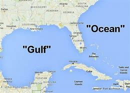
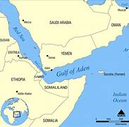

---

==== ▸ distribute  [507]   +
な/dɪˈstrɪbjuːt/   +

【V-T】   If you _distribute_ things, you hand them or deliver them to a number of people. 分发 +
⇒  Students shouted slogans and distributed leaflets.  学生们高呼口号，散发传单。   +

【V-T】   When a company _distributes_ goods, it supplies them to the stores or businesses that sell them. 配销 +
⇒  We didn't understand how difficult it was to distribute a national paper.  我们不明白配销一份全国性的报纸有多么困难。   +

【V-T】   To _distribute_ a substance _over_ something means to scatter it over it. 散布 +
⇒  Distribute the topping evenly over the fruit.  将浇头均匀地浇在水果上。   +

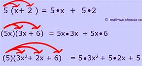

---

==== ▸ hemisphere  [508]   +
な/ˈhɛmɪˌsfɪə/   +

【N-COUNT】   A _hemisphere_ is one half of the earth. 半球 +
⇒  ...the depletion of the ozone layer in the northern hemisphere.  …北半球臭氧层的消耗。   +

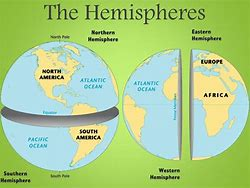

---

==== ▸ likewise  [509]   +
な/ˈlaɪkˌwaɪz/   +

【ADV】   You use _likewise_ when you are comparing two methods, states, or situations and saying that they are similar. 同样地 +
⇒  What is fair for homeowners likewise should be fair to businesses.  对私房业主公平的，同样也该对商家公平。   +

【ADV】   If you do something and someone else does _likewise_, they do the same or a similar thing. 照样地 +
⇒  He lent money, made donations and encouraged others to do likewise.  他把钱借出、捐出，并鼓励其他人这么做。   +

---

==== ▸ untapped  [510]   +
な/ʌnˈtæpt/   +

【ADJ】   An _untapped_ supply or source of something has not yet been used. (供给、资源)未利用的 +
⇒  Mongolia, although poor, has considerable untapped resources of oil and minerals.  蒙古虽然贫穷，却有相当储量未利用的石油和矿物资源。   +

---

==== ▸ diminution  [511]   +
な/ˌdɪmɪˈnjuːʃən/   +

【N-UNCOUNT】   A _diminution_ of something is its reduction in size, importance, or intensity. 减小; 减弱 +
⇒  ...despite a slight diminution in asset value.  ...尽管资产价值略有减少。   +

---

==== ▸ rash  [512]   +
な/ræʃ/   +

【ADJ】   If someone is _rash_ or does _rash_ things, they act without thinking carefully first, and therefore make mistakes or behave foolishly. 轻率的 +
⇒  It would be rash to rely on such evidence.  依靠这样的证据太轻率了。   +

【ADV】   轻率地 +
⇒  I made a lot of money, but I rashly gave most of it away.  我赚了很多钱，但我轻率地挥霍了其中的大部分。   +

【N-COUNT】   A _rash_ is an area of red spots that appears on your skin when you are ill or have a bad reaction to something that you have eaten or touched. 疹子 +
⇒  He may break out in a rash when he eats these nuts.  他吃了这些坚果以后可能会长出疹子。   +

【N-SING】   If you talk about a _rash of_ events or things, you mean a large number of unpleasant events or undesirable things, which have happened or appeared within a short period of time. (短期内出现的) 一连串 (不悦之事) +
⇒  ...one of the few major airlines left untouched by the industry's rash of takeovers.  …在这一连串的行业兼并中剩下的少数几个未被波及的大航空公司之一。   +

---

==== ▸ acquire  [513]   +
な/əˈkwaɪə/   +

【V-T】   If you _acquire_ something, you buy or obtain it for yourself, or someone gives it to you. 获得 +
⇒  General Motors acquired a 50% stake in Saab for about $400m.  通用汽车公司以大约4亿美元获得了萨博50%的股份。   +

【V-T】   If you _acquire_ something such as a skill or a habit, you learn it, or develop it through your daily life or experience. 习得 +
⇒  I've never acquired a taste for wine.  我从未养成对葡萄酒的爱好。   +

【V-T】   If someone or something _acquires_ a certain reputation, they start to have that reputation. 获得 (名声) +
⇒  During her film career, she acquired a reputation as a strong-willed, outspoken woman.  在她的银幕生涯中，她获得了一个意志坚定、坦率直言的名声。   +

---

==== ▸ wary  [514]   +
な/ˈwɛərɪ/   +
--> 来自 PIE*wer,覆盖，保护，看管，看护，词源同 ward,ware.引申词义谨慎的。 +

【ADJ】   If you are _wary of_ something or someone, you are cautious because you do not know much about them and you believe they may be dangerous or cause problems. 小心的; 提防的 +
⇒  People did not teach their children to be wary of strangers.  人们以前没教过自己的孩子们要提防陌生人。   +

【ADV】   小心地; 谨慎地 +
⇒  She studied me warily, as if I might turn violent.  她警惕地盯着我，好像我会变得很粗暴似的。   +

---

==== ▸ willful  [515]   +
( especially BrE ) ( NAmE usually will·ful ) ( disapproving) +
1.[ usually before noun] ( of a bad or harmful action 不友好或有害行为 ) done deliberately, although the person doing it knows that it is wrong 故意的；有意的；成心的 +
⇒ wilful damage 蓄意破坏 +

2.determined to do what you want; not caring about what other people want 任性的；固执的；倔强的 +
SYN headstrong +
⇒ a wilful child 任性的孩子 +

==== ▸ accelerate  [516]   +
な/ækˈsɛləˌreɪt/   +

【V-T/V-I】   If the process or rate of something _accelerates_ or if something _accelerates_ it, it gets faster and faster. 使加速; 加速 +
⇒  Growth will accelerate to 2.9 percent next year.  增长明年将加快到2.9%。   +

【V-I】   When a moving vehicle _accelerates_, it goes faster and faster. 加速 +
⇒  Suddenly the car accelerated.  突然车加速了。   +

---

==== ▸ protest  [517]   +
な【V-T/V-I】   If you _protest_ something or _protest against_ something, you say or show publicly that you object to it. 抗议   +
⇒  They were protesting soaring prices.  他们在抗议不断飞涨的物价。   +

【N-VAR】   A _protest_ is the act of saying or showing publicly that you object to something. 抗议 +
⇒  The opposition now seems too weak to stage any serious protests against the government.  反对党现在似乎太弱小，无力针对政府组织什么重大的抗议。   +
⇒  The Mexican president cancelled a trip to Texas in protest at the state's execution of a Mexican national.  墨西哥总统取消了得克萨斯之行，以抗议该州对一名墨西哥侨民的处决。   +

【V-T】   If you _protest_ that something is the case, you insist that it is the case, when other people think that it may not be. 断言 +
⇒  When we tried to protest that Mo was beaten up they didn't believe us.  当我们坚持说莫遭到了毒打时，他们都不相信。   +
⇒  "I never said any of that to her," he protested.  “我从来没有对她说过那种话，”他断然否认。   +

---

==== ▸ blink  [518]   +
な/blɪŋk/   +

【V-T/V-I】   When you _blink_ or when you _blink_ your eyes, you shut your eyes and very quickly open them again. 眨 (眼睛) +
⇒  Kathryn blinked and forced a smile.  凯瑟琳眨了眨眼，挤出了一丝微笑。   +
⇒  She was blinking her eyes rapidly.  她一直在快速地眨眼。   +

【N-COUNT】  _Blink_ is also a noun. 眨眼 +
⇒  He kept giving quick blinks.  他不停地快速眨眼。   +

【V-I】   When a light _blinks_, it flashes on and off. 闪烁 +
⇒  Green and yellow lights blinked on the surface of the harbour.  绿色和黄色的灯光在港湾水面上闪烁。   +
⇒  The plane was flying normally for about 15 minutes before a warning light blinked on.  飞机正常飞行15分钟后警示灯开始闪烁。   +

---

==== ▸ continuity  [519]   +
な/ˌkɒntɪˈnjuːɪtɪ/   +

【N-VAR】  _Continuity_ is the fact that something continues to happen or exist, with no great changes or interruptions. 连续性; 持续性 +
⇒  ...a tank designed to ensure continuity of fuel supply during aerobatics.  …为特技飞行中确保持续供油而设计的油箱。   +

---

==== ▸ succumb  [520]   +
な/səˈkʌm/   +
--> suc-,在下，-cumb,躺，词源同 succubus,recumbent.即躺在下面，引申比喻义屈服，屈从。 +

【V-I】   If you _succumb to_ temptation or pressure, you do something that you want to do, or that other people want you to do, although you feel it might be wrong. (向诱惑、压力) 屈服 +
⇒  Don't succumb to the temptation to have just one cigarette.  不要屈服于只抽一支烟的诱惑。   +

---

==== ▸ radiate  [521]   +
な/ˈreɪdɪˌeɪt/   +

【V-I】   If things _radiate_ out _from_ a place, they form a pattern that is like lines drawn from the centre of a circle to various points on its edge. 辐射 +
⇒  Many kinds of woodland can be seen on the various walks which radiate from the Heritage Centre.  从遗产中心向外伸展的各条走道上可以看到多种林地。   +

【V-T/V-I】   If you _radiate_ an emotion or quality or if it _radiates from_ you, people can see it very clearly in your face and in your behaviour. 显现 (特质); 流露 (情感) +
⇒  She radiates happiness and health.  她浑身洋溢着快乐与健康。   +

【V-T】   If something _radiates_ heat or light, heat or light comes from it. 散发出 (光或热) +
⇒  The metal plate behind my head radiated heat.  我脑后的金属盘散发出热量。   +

---

==== ▸ enzyme  [522]   +
な/ˈɛnzaɪm/   +
--> en-, 进入，使。-zym, 发酵，词源同eczema, zymurgy. +

【N-COUNT】   An _enzyme_ is a chemical substance found in living creatures that produces changes in other substances without being changed itself. 酶 +
⇒ digestive enzyme 消化酶 +

---

==== ▸ shallow  [523]   +
な/ˈʃæləʊ/   +

【ADJ】   A _shallow_ container, hole, or area of water measures only a short distance from the top to the bottom. 浅的 +
⇒  Put the milk in a shallow dish.  把牛奶倒进一个浅盘里。   +

【ADJ】   If you describe a person, piece of work, or idea as _shallow_, you disapprove of them because they do not show or involve any serious or careful thought. (人、作品、主意等) 浅薄的 +
⇒  I think he is shallow, vain and untrustworthy.  我认为他浅薄、虚荣、不可信。   +

【ADJ】   If your breathing is _shallow_, you take only a very small amount of air into your lungs at each breath. (呼吸) 浅的 +
⇒  She began to hear her own taut, shallow breathing.  她开始听到自己紧张、短促的呼吸。   +

---

==== ▸ wasp  [524]   +
N-COUNT A wasp is an insect with wings and yellow and black stripes across its body. Wasps have a painful sting like a bee but do not produce honey. 黄蜂

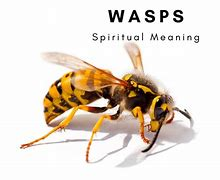

---

==== ▸ vertical  [525]   +
な/ˈvɜːtɪkəl/   +

【ADJ】   Something that is _vertical_ stands or points straight up. 垂直的 +
⇒  The climber inched up a vertical wall of rock.  那名登山者一点点爬上了一处垂直的岩石峭壁。   +

【ADV】   垂直地 +
⇒  Cut each bulb in half vertically.  将每一个球茎垂直切成两半。   +

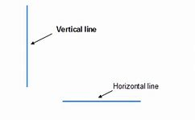

---

==== ▸ regiment  [526]   +
な/ˈrɛdʒɪmənt/   +
--> 来自拉丁语 regere,统治，管理，词源同 regulate.-ment,名词后缀。后用于军事序列指团。 +

【N-COUNT】   A _regiment_ is a large group of soldiers that is commanded by a colonel. （军队的）团 +
【N-COUNT】   A _regiment of_ people is a large number of them. 一大群人（或事物）  +
⇒  ...robust food, good enough to satisfy a regiment of hungry customers.  …足够让一大批饥饿的顾客吃饱的丰盛食物。   +

---

==== ▸ panel  [527]   +
な/ˈpænəl/   +

【N-COUNT-COLL】   A _panel_ is a small group of people who are chosen to do something, for example, to discuss something in public or to make a decision. 专门小组 +
⇒  He assembled a panel of scholars to advise him.  他集结了一个学者小组为他出谋划策。   +
⇒  All the writers on the panel agreed that Quinn's book should be singled out for special praise.  专门小组中的所有作家都同意奎因的书应该被挑出来予以特别表扬。   +

【N-COUNT】   A _panel_ is a flat rectangular piece of wood or other material that forms part of a larger object such as a door. (门等的) 镶板; 嵌板 +
⇒  ...the frosted glass panel set in the centre of the door.  …嵌在门中心的毛玻璃板。   +

【N-COUNT】   A control _panel_ or instrument _panel_ is a board or surface that contains switches and controls to operate a machine or piece of equipment. (控制) 面板; (仪表) 板 +
⇒  The equipment was extremely sophisticated and was monitored from a central control panel.  这台设备极其复杂，是由中央控制面板监控的。   +

---

==== ▸ formula  [528]   +
な/ˈfɔːmjʊlə/   +

【N-COUNT】   A _formula_ is a plan that is invented in order to deal with a particular problem. 方案 +
⇒  ...a peace formula.  …一项和平方案。   +

【N-COUNT】   A _formula_ is a group of letters, numbers, or other symbols which represents a scientific or mathematical rule. 公式 +
⇒  He developed a mathematical formula describing the distances of the planets from the Sun.  他提出了一个描述各行星与太阳之间距离的数学公式。   +

【N-COUNT】   In science, the _formula_ for a substance is a list of the amounts of various substances which make up that substance, or an indication of the atoms that it is composed of. 分子式 +
⇒  Glucose and fructose have the same chemical formula but have very different properties.  葡萄糖和果糖具有相同的化学分子式但有很不同的特性。   +

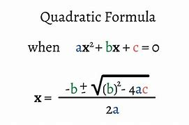

【N-SING】   A _formula for_ a particular situation, usually a good one, is a course of action or a combination of actions that is certain or likely to result in that situation. (达成通常为好的结局的) 行动方案 +
⇒  After he was officially pronounced the world's oldest man, he offered this simple formula for a long and happy life.  在他被正式宣布为世界上最老的人之后，他提供了这一长寿和幸福生活的简单方法。   +

---

==== ▸ oppressive  [529]   +
な/əˈprɛsɪv/   +

【ADJ】   If you describe a society, its laws, or customs as _oppressive_, you think they treat people cruelly and unfairly. 压迫的 +
⇒  The new laws will be just as oppressive as those they replace.  新法律将跟被它所取代的那些法律一样不公正。   +

【ADJ】   If you describe the weather or the atmosphere in a room as _oppressive_, you mean that it is unpleasantly hot and damp. 湿热的 +
⇒  The oppressive afternoon heat had tired him out.  湿热的午后暑气使他筋疲力尽。   +

【ADJ】   An _oppressive_ situation makes you feel depressed and uncomfortable. 令人感到压抑的 +
⇒  ...the oppressive sadness that weighed upon him like a physical pain.  …像肉体疼痛一样沉重地压着他、令他抑郁的悲伤。   +

---

==== ▸ moderate  [530]   +
な【ADJ】  _Moderate_ political opinions or policies are not extreme. (政见或政策) 温和的   +
⇒  He was an easygoing man of very moderate views.  他是一个有着温和观点性情随和的人。   +

【ADJ】   You use _moderate_ to describe people or groups who have moderate political opinions or policies. (人或团体) 温和的 +
⇒  ...a moderate Democrat.  …温和的民主党人。   +

【N-COUNT】   A _moderate_ is someone with moderate political opinions. 温和派 +
⇒  If he presents himself as a radical he risks scaring off the moderates whose votes he so desperately needs.  如果他表现出自己是个激进分子的话，他就有可能吓跑那些温和派，而他急需那些人的选票。   +

【ADJ】   You use _moderate_ to describe something that is neither large nor small in amount or degree. (数量或程度) 适中的 +
⇒  While a moderate amount of stress can be beneficial, too much stress can exhaust you.  适当的压力可能有益，而压力过大会让你筋疲力尽。   +

【ADV】   适中地 +
⇒  Both are moderately large insects, with a wingspan of around four centimetres.  这两只都是中等大小的昆虫，翼幅大约为四厘米。   +

【ADJ】   A _moderate_ change in something is a change that is not great. (变化) 不大的 +
⇒  Most drugs offer either no real improvement or, at best, only moderate improvements.  大多数药或者没有真正疗效，或者最多也就是稍有疗效。   +

【ADV】   不大地 +
⇒  Share prices on the Tokyo Exchange declined moderately.  东京股票交易所的股票价格稍有下降。   +

【V-T/V-I】   If you _moderate_ something or if it _moderates_, it becomes less extreme or violent and easier to deal with or accept. 使缓和; 变得缓和 +
⇒  They are hoping that once in office he can be persuaded to moderate his views.  他们希望他一上台后就能他说服，使他的观点变得温和些。   +

【N-UNCOUNT】   缓和 +
⇒  A moderation in food prices helped to offset the first increase in energy prices.  食品价格的降低有助于抵消能源价格的第一次上涨。   +

---

==== ▸ motif  [531]   +
な/məʊˈtiːf/   +
--> 来自 motive 的法语拼写形式。  -mot-移动 + -ive形容词词尾 +

【N-COUNT】   A _motif_ is a design which is used as a decoration or as part of an artistic pattern. (用作装饰的) 图案 +
⇒  ...a rose motif.  …一个玫瑰图案。   +

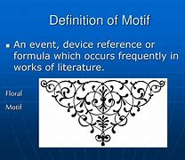

---

==== ▸ rug  [532]   +
な/rʌɡ/   +

【N-COUNT】   A _rug_ is a piece of thick material that you put on a floor. It is like a carpet but covers a smaller area. 小地毯 +
⇒  A Persian rug covered the hardwood floors.  一张波斯小地毯铺在了那硬木地板上。   +

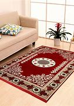

【N-COUNT】   A _rug_ is a small blanket which you use to cover your shoulders or your knees to keep them warm. (盖在肩上或膝上的) 小毛毯 +
⇒  The old lady was seated in her chair at the window, a rug over her knees.  这位老妇人坐在靠窗的椅子上，膝上盖着一块小毛毯。   +

【PHRASE】   If someone _pulls the rug from under_ a person or thing or _pulls the rug from under_ someone's _feet_, they stop giving their help or support. 不再帮助或支持某人 +
⇒  If the banks opt to pull the rug from under the ill-fated project, it will go into liquidation.  如果这些银行选择不再支持那项倒霉的工程，它就将破产。   +

---

==== ▸ rustic  [533]   +
な/ˈrʌstɪk/   +

【ADJ】   You can use _rustic_ to describe things or people that you approve of because they are simple or unsophisticated in a way that is typical of the countryside. 质朴的 +
⇒  ...the rustic charm of a country lifestyle.  …乡村生活方式的质朴魅力。   +

---

==== ▸ peninsula  [534]   +
な/pɪˈnɪnsjʊlə/   +

【N-COUNT】   A _peninsula_ is a long narrow piece of land that sticks out from a larger piece of land and is almost completely surrounded by water. 半岛 +
⇒  ...the political situation in the Korean peninsula.  …朝鲜半岛的政治局势。   +

---

==== ▸ staff  [535]   +
な/stɑːf/   +

【N-COUNT-COLL】   The _staff_ of an organization are the people who work for it. 全体职员 +
⇒  The staff were very good.  员工们都很棒。   +
⇒  The outpatient programme has a staff of six people.  这个门诊部有6名员工。   +
⇒  ...staff members.  …职工。   +

【N-PLURAL】   People who are part of a particular staff are often referred to as _staff_. 员工 +
⇒  10 staff were allocated to the task.  10名员工被分派做这项任务。   +

【V-T】   If an organization _is staffed by_ particular people, they are the people who work for it. 担当 (某机构的) 职员 +
⇒  They are staffed by volunteers.  他们的员工都是志愿者。   +

【ADJ】   配备了职员的 +
⇒  The house allocated to them was pleasant and spacious, and well staffed.  分给他们的房子既舒适又宽敞，员工也配备良好。   +

---

==== ▸ cranial  [536]   +
な/ˈkreɪnɪəl/   +
--> 来自中世纪拉丁语crānium("skull") +

【ADJ】  _Cranial_ means relating to your cranium. 颅的 +
⇒  ...cranial bleeding.  ...颅出血。   +

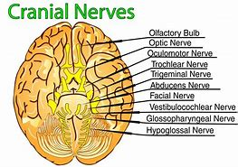

---

==== ▸ squander  [537]   +
な/ˈskwɒndə/   +
--> 词源不详，可能来自拟声词根 squ-,挤，压，模仿挤压湿物体时发出的吧唧声。比较 splurge, 挥霍，浪费。 +

【V-T】   If you _squander_ money, resources, or opportunities, you waste them. 浪费 (金钱、资源或机会) +
⇒  Hobbs didn't squander his money on flashy cars or other vices.  霍布斯没有把钱挥霍在奢华汽车或其他恶习上。   +

---

==== ▸ slumber  [538]   +
な/ˈslʌmbə/   +
--> 来自古英语 sluma, 小睡， 来自 Proto-Germanic*slum,松散的，无力的，来自 PIE*sleu,松散的，无力的，词源同 slow,sleep. 插入字母 b,比较 number,numerate. +

【N-VAR】  _Slumber_ is sleep. 睡眠 +
⇒  He had fallen into exhausted slumber.  他已经进入了沉睡。   +

【V-I】  _Slumber_ is also a verb. 睡觉 +
⇒  The older three girls are still slumbering peacefully.  稍大些的3个女孩仍在平静地睡着。   +

---

==== ▸ relegate  [539]   +
な/ˈrɛlɪˌɡeɪt/   +
--> re-,向后，往回，-leg,送出，词源同 legate,delegate.引申词义降级，贬职。 +

【V-T】   If you _relegate_ someone or something _to_ a less important position, you give them this position. 使降级 +
⇒  Might it not be better to relegate the king to a purely ceremonial function?  使该国王降级到一种纯粹礼仪性的职能难道不更好吗？   +

---

==== ▸ combat  [540]   +
な【N-UNCOUNT】  _Combat_ is fighting that takes place in a war. 战斗   +
⇒  Over 16 million men had died in combat.  一千六百多万人在战斗中阵亡。   +
⇒  Yesterday saw hand-to-hand combat in the city.  昨天那座城里发生了肉搏战。   +

【N-COUNT】   A _combat_ is a battle, or a fight between two people. 搏斗 +
⇒  It was the end of a long combat.  那是一场长时间搏斗的结束。   +

【V-T】   If people in authority _combat_ something, they try to stop it from happening. 防止 +
⇒  Congress has criticized new government measures to combat crime.  国会批评了新政府防止犯罪的措施。   +

---

==== ▸ brilliant  [541]   +
な/ˈbrɪljənt/   +

【ADJ】   A _brilliant_ person, idea, or performance is extremely clever or skilful. 极有才智的; 绝妙的 +
⇒  She had a brilliant mind.  她有极聪明的头脑。   +

【ADV】   极有才智地; 绝妙地 +
⇒  It is a very high quality production, brilliantly written and acted.  这是一部非常高质量的演出,绝妙地编写而成并被表演出来。   +

【ADJ】   A _brilliant_ career or success is very successful. 非常成功的 +
⇒  He served four years in prison, emerging to find his brilliant career in ruins.  他在监狱服了4年刑,出狱后发现他的辉煌事业已经毁了。   +

【ADV】   非常成功地 +
⇒  The strategy worked brilliantly.  这项策略非常成功。   +

【ADJ】   A _brilliant_ colour is extremely bright. 鲜亮的 +
⇒  The woman had brilliant green eyes.  这个女人有一双亮晶晶的绿眼睛。   +

【ADV】   鲜亮地 +
⇒  Many of the patterns show brilliantly coloured flowers.  许多图案都有绚丽多彩的花。   +

【ADJ】   You describe light, or something that reflects light, as _brilliant_ when it shines very brightly. 灿烂的 +
⇒  The event was held in brilliant sunshine.  这次活动在灿烂的阳光下举行。   +

【ADV】   灿烂地 +
⇒  It's a brilliantly sunny morning.  这是个阳光灿烂的早晨。   +

【ADJ】   You can say that something is _brilliant_ when you are very pleased about it or think that it is very good. 真棒的 +
⇒  If you get a chance to see the show, do go – it's brilliant.  如果你有机会去看那场演出,一定要去–它太棒了。   +

---

==== ▸ proliferate  [542]   +
な/prəˈlɪfəˌreɪt/   +
--> 来自拉丁语proles,子孙，后代，-fer,带来，生育，词源同bear,bring.后用于生物学指繁殖，增殖。 +

【V-I】   If things _proliferate_, they increase in number very quickly. 激增 +
⇒  Computerized databases are proliferating fast.  计算机化的数据库在迅速激增。   +

【N-UNCOUNT】   激增 +
⇒  ...the proliferation of nuclear weapons.  …核武器的激增。   +

---

==== ▸ explosion  [543]   +
な/ɪkˈspləʊʒən/   +

【N-COUNT】   An _explosion_ is a sudden, violent burst of energy, such as one caused by a bomb. 爆炸 +
⇒  After the second explosion, all of London's main train and subway stations were shut down.  第二次爆炸后，伦敦所有的主要火车站及地铁站都被关闭了。   +

【N-VAR】  _Explosion_ is the act of deliberately causing a bomb or similar device to explode. 引爆 +
⇒  Bomb disposal experts blew up the bag in a controlled explosion.  拆弹专家在一次控制爆破中炸掉了那个袋子。   +

【N-COUNT】   An _explosion_ is a large rapid increase in the number or amount of something. 暴增; 暴涨 +
⇒  The study also forecast an explosion in the diet soft-drink market.  这项研究还预测了低糖软饮料市场的暴增。   +

【N-COUNT】   An _explosion_ is a sudden violent expression of someone's feelings, especially anger. (情感、尤指愤怒的) 暴发 +
⇒  Every time they met, Myra anticipated an explosion.  每次他们相见，迈拉都预期会有一场怒火暴发。   +

【N-COUNT】   An _explosion_ is a sudden and serious political protest or violence. (抗议、暴力行为的) 爆发 +
⇒  ...the explosion of protest and violence sparked off by the killing of seven workers.  …由7名工人被杀引起的抗议及暴力行为的爆发。   +

---

==== ▸ eject  [544]   +
な/ɪˈdʒɛkt/   +

【V-T】   If you _eject_ someone _from_ a place, you force them to leave. 逐出 +
⇒  Officials used guard dogs to eject the protesters.  官员们用护卫犬驱走抗议者。   +

【N-VAR】   逐出 +
⇒  ...the ejection and manhandling of hecklers at the meeting.  …对会上起哄者的驱逐和推搡。   +

【V-T】   To _eject_ something means to remove it or push it out forcefully. 用力排出; 用力推出 +
⇒  He aimed his rifle, fired a single shot, then ejected the spent cartridge.  他用步枪瞄准，开了一枪，接着排出了空弹壳。   +

【V-I】   When a pilot _ejects from_ an aircraft, he or she leaves the aircraft quickly using an ejector seat, usually because the plane is about to crash. (从飞机里) 弹射出来 +
⇒  The pilot ejected from the plane and escaped injury.  飞行员从飞机里弹出，没有受伤。   +

---

==== ▸ acid  [545]   +
な/ˈæsɪd/   +

【N-MASS】   An _acid_ is a chemical substance, usually a liquid, which contains hydrogen and can react with other substances to form salts. Some acids burn or dissolve other substances that they come into contact with. 酸 +
⇒  ...citric acid.  …柠檬酸。   +

【ADJ】   An _acid_ substance contains acid. 酸性的 +
⇒  These shrubs must have an acid, lime-free soil.  这些灌木必须要有酸性、无石灰的土壤。   +

【N-UNCOUNT】   酸性 +
⇒  ...the acidity of rainwater.  …雨水的酸性。   +

---

==== ▸ technological  [546]   +
な/ˌtɛknəˈlɒdʒɪkəl/   +

【ADJ】  _Technological_ means relating to or associated with technology. 与技术有关的 +
⇒  ...an era of very rapid technological change.  …一个技术飞速变革的时代。   +

【ADV】   技术上地 +
⇒  ...technologically advanced aircraft.  …技术先进的飞机。   +

---

==== ▸ sporadic  [547]   +
な/spəˈrædɪk/   +
--> 来自 spore,孢子，-adic,形容词后缀。即孢子状的，引申词义间发性的，断断续续的等。 +

【ADJ】  _Sporadic_ occurrences of something happen at irregular intervals. 零星的 +
⇒  ...a year of sporadic fighting in the north of the country.  …该国北部有零星战火的一年。   +

【ADV】   零星地 +
⇒  The distant thunder from the coast continued sporadically.  远处海岸仍然零星地传来雷声。   +

---

==== ▸ otherwise  [548]   +
な/ˈʌðəˌwaɪz/   +

【ADV】   You use _otherwise_ after mentioning a situation or telling someone to do something, in order to say what the result or consequence would be if the situation did not exist or the person did not do as you say. 否则 +
⇒  Make a note of the questions you want to ask; you will invariably forget some of them otherwise.  把你想问的问题记下来；否则你准会忘记其中几个。   +
⇒  I'm lucky that I'm interested in school work, otherwise I'd go crazy.  幸好我对学校作业还感兴趣，不然会疯的。   +

【ADV】   You use _otherwise_ before stating the general condition or quality of something, when you are also mentioning an exception to this general condition or quality. 除此以外 +
⇒  The decorations for the games have lent a splash of colour to an otherwise drab city.  运动会的装饰为这个平时乏味的城市增添了几抹色彩。   +

【ADV】   You use _otherwise_ to refer in a general way to actions or situations that are very different from, or the opposite to, your main statement. 以不同方式 +
⇒  Take approximately 60 mg up to four times a day, unless advised otherwise by a doctor.  每天4次，每次约60毫克，或遵医嘱。   +
⇒  There is no way anything would ever happen between us, and believe me I've tried to convince myself otherwise.  无论如何，我们之间不会发生什么。而且，相信我，我已经努力说服自己了。   +

【ADV】   You use _otherwise_ to indicate that other ways of doing something are possible in addition to the way already mentioned. 用别的方法 +
⇒  The studio could punish its players by keeping them out of work, and otherwise controlling their lives.  电影公司可以通过让演员无角色可演或其他途径控制他们的生活，以惩罚他们。   +

【PHRASE】   You use _or otherwise_ or _and otherwise_ to mention something that is not the thing just referred to or is the opposite of that thing. 或其相反 +
⇒  It was for the police to assess the validity or otherwise of the evidence.  应由警方来评价证据的有效与否。   +

---

==== ▸ flexible  [549]   +
な/ˈflɛksɪbəl/   +
--> 来自拉丁语flecto, 弯，转，词源同inflect, reflect. 进一步可能来自PIE*kleng, 弯，转，词源同link, incline. +

【ADJ】   A _flexible_ object or material can be bent easily without breaking. 柔韧的 +
⇒  ...brushes with long, flexible bristles.  …毛长而柔韧的刷子。   +

【N-UNCOUNT】   柔韧性 +
⇒  The flexibility of the lens decreases with age; it is therefore common for our sight to worsen as we get older.  眼球晶状体的柔韧性随着年龄的增长而降低；因此普遍的情况是随着我们年纪变老，我们的视力就会变差。   +

【ADJ】   Something or someone that is _flexible_ is able to change easily and adapt to different conditions and circumstances as they occur. 灵活的 +
⇒  ...flexible working hours.  …弹性工作时间。   +

【N-UNCOUNT】   灵活性 +
⇒  The flexibility of distance learning would be particularly suited to busy managers.  远程学习的灵活性尤其会适合忙碌的经理们。   +

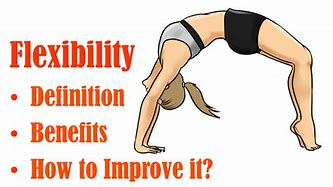

---

==== ▸ anecdote  [550]   +
な/ˈænɪkˌdəʊt/   +
--> 先说editor（编辑），它在词源上指的是将杂志、报纸分发、公布出去的人，所以e是前缀“向外”，dit是词根“给予”，即“向外给出的人”。anecdote的词根dot=dit表“给予”，an否定前缀，ec前缀“向外”，即“未向外给出、未公布的事”。 +

【N-VAR】   An _anecdote_ is a short, amusing account of something that has happened. 趣闻轶事 +
⇒  Pete was telling them an anecdote about their mother.  皮特正告诉他们一个关于他们母亲的趣闻轶事。   +

---

==== ▸ specimen  [551]   +
な/ˈspɛsɪmɪn/   +
--> -spec-种;特别 + -i- + -men名词词尾 +

【N-COUNT】   A _specimen_ is a single plant or animal which is an example of a particular species or type and is examined by scientists. (动植物的) 标本 +
⇒  200,000 specimens of fungus are kept at the Komarov Botanical Institute.  20万个真菌标本被保存在科马罗夫植物研究所。   +

【N-COUNT】   A _specimen of_ something is an example of it which gives an idea of what the whole of it is like. 样本 +
⇒  Job applicants have to submit a specimen of handwriting.  求职者必须提交一份笔迹样本。   +

【N-COUNT】   A _specimen_ is a small quantity of someone's urine, blood, or other body fluid which is examined in a medical laboratory, in order to find out if they are ill or if they have been drinking alcohol or taking drugs. (供检验用的尿液、血液等的) 抽样 +
⇒  He refused to provide a specimen.  他拒绝提供抽样。   +

---

==== ▸ thwart  [552]   +
な/θwɔːt/   +
--> 原义为副词，来自古诺斯语 thvert,穿过，横过. 置换自 PIE*terkw,扭动，转动，来自 PIE*ter,*tere,弯，转，穿过，词源同 turn,through,trans-. 后引申动词词义相反，阻止，阻挠等。 +

【V-T】   If you _thwart_ someone or _thwart_ their plans, you prevent them from doing or getting what they want. 阻挠; 挫败 +
⇒  The security forces were doing all they could to thwart terrorists.  安全部队正尽其所能挫败恐怖分子。   +

---

==== ▸ labyrinth  [553]   +
な/ˈlæbərɪnθ/   +
--> 来自希腊语labyrinthos,迷宫，原为希腊神话中克立特岛上一座用来关牛妖的宫殿，可能来自labrys,双刃斧，皇权的象征，用来指皇室宫殿。同时由该神话衍生clue. +

【N-COUNT】   If you describe a place as a _labyrinth_, you mean that it is made up of a complicated series of paths or passages, through which it is difficult to find your way. 迷宫 +
⇒  ...the labyrinth of corridors.  …迷宫般的走廊。   +

【N-COUNT】   If you describe a situation, process, or area of knowledge as a _labyrinth_, you mean that it is very complicated. 错综复杂的事物 +
⇒  ...a labyrinth of conflicting political and sociological interpretations.  …错综复杂的、互相矛盾的政治和社会学解释。   +

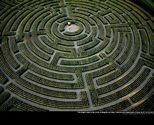

.案例
====
chatGpt: +
"Labyrinth" 和 "maze" 都是指代迷宫的词汇，但它们通常有一些微妙的区别，尽管在一些情况下可以互换使用。这些区别可以根据语境和地区而有所不同。 +
一般来说，**主要的区别在于复杂性和设计目**的：

.Labyrinth（迷宫）：
**Labyrinth 通常指的是一个相对简单、单一通道的迷宫，通常是一个蜿蜒曲折的路径，没有交叉点或分歧，只有一条路径通向中心或终点。**迷宫的设计常常是为了冥想、反思或宗教仪式而创建的，可以用来代表精神的旅程。著名的例子包括希腊神话中的克里特岛迷宫。

.Maze（迷宫）：
**Maze 通常指的是更复杂、有分支和交叉点的迷宫，通常设计成有多个路径和死胡同。**Maze 的设计目的可以是娱乐、挑战、解谜或迷失方向，玩家需要找到正确的路径以达到目标。这种类型的迷宫常常出现在游戏、迷宫书中以及儿童游乐场中。

image:img/Labyrinth2.png[,25%]

需要注意的是，根据地理和语言的不同，**这两个术语有时可以互换使用。因此，在某些情况下，"labyrinth" 可能用来描述一个复杂的迷宫，而 "maze" 可能用来描述一个简单的迷宫。**总的来说，这两个词汇的使用可能会因上下文和地理区域而异。
====

---

==== ▸ derivative  [554]   +
な/dɪˈrɪvətɪv/   +

【N-COUNT】   A _derivative_ is something which has been developed or obtained from something else. 衍生物 +
⇒  ...a poppy-seed derivative similar to heroin.  …一种类似于海洛因的罂粟种子衍生物。   +

---

==== ▸ permeate  [555]   +
な/ˈpɜːmɪˌeɪt/   +

【V-T】   If an idea, feeling, or attitude _permeates_ a system or _permeates_ society, it affects every part of it or is present throughout it. (思想、情感或态度) 全面影响 +
⇒  Bias against women permeates every level of the judicial system.  对妇女的偏见全面影响司法体系的各个层面。   +

【V-T】   If something _permeates_ a place, it spreads throughout it. 弥漫 +
⇒  The smell of roast beef permeated the air.  烤牛肉的气味弥漫在空气中。   +

---

==== ▸ scandal  [556]   +
な/ˈskændəl/   +

【N-COUNT】   A _scandal_ is a situation or event that is thought to be shocking and immoral and that everyone knows about. 丑闻 +
⇒  ...a financial scandal.  …一桩金融丑闻。   +

【N-UNCOUNT】  _Scandal_ is talk about the shocking and immoral aspects of someone's behaviour or something that has happened. 流言蜚语 +
⇒  He loved gossip and scandal.  他喜欢闲话和流言蜚语。   +

---

==== ▸ hypertext  [557]   +
な/ˈhaɪpəˌtɛkst/   +

【N-UNCOUNT】   In computing, _hypertext_ is a way of connecting pieces of text so that you can go quickly and directly from one to another. (计算机的) 超文本. (超文本是用超链接的方法，将各种不同空间的文字信息组织在一起的网状文本。) +
⇒  ...information embroidered with colourful graphics and tied together by hypertext links.  …饰以彩色图表并用超文本链接组合在一起的信息。   +

---

==== ▸ engraving  [558]   +
な/ɪnˈɡreɪvɪŋ/   +

【N-COUNT】   An _engraving_ is a picture or design that has been cut into a surface. 雕版 +
【N-COUNT】   An _engraving_ is a picture that has been printed from a plate on which designs have been cut. 版画   +
⇒  ...a colour engraving of oranges and lemons.  ...一副绘有橙子和柠檬的彩色版画。   +

---

==== ▸ tend  [559]   +
な/tɛnd/   +

【V-T】   If something _tends to_ happen, it usually happens or it often happens. 倾向于; 往往会 +
⇒  A problem for manufacturers is that lighter cars tend to be noisy.  制造商遇到的一个问题是重量较轻的汽车往往噪音大。   +

【V-I】   If you _tend toward_ a particular characteristic, you often display that characteristic. 趋向… +
⇒  Artistic and intellectual people tend toward left-wing views.  艺术人士和知识分子趋向左翼观点。   +

【V-T】   You can say that you _tend to_ think something when you want to give your opinion, but do not want it to seem too forceful or definite. 倾向于 (认为) +
⇒  I tend to think that our Representatives by and large do a good job.  我倾向于认为我们的众议员们总体上干得不错。   +

【V】   to attend (to) 照顾; 照管 +
⇒  to tend to someone's needs     +

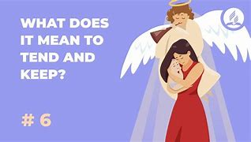

【V】   to care for 护理 +
⇒  to tend wounded soldiers     +

【V】   to handle or control 处理; 控制 +
⇒  to tend a fire     +

---

==== ▸ sapphire  [560]   +
な/ˈsæfaɪə/   +

【N-VAR】   A _sapphire_ is a precious stone which is blue in colour. 蓝宝石 +
⇒  ...a sapphire engagement ring.  …一枚蓝宝石订婚戒指。   +

【COLOR】   Something that is _sapphire_ is bright blue in colour. 天蓝色的 +
⇒  ...white snow and sapphire skies.  …白雪和蓝天。   +

---

==== ▸ sedentary  [561]   +
な/ˈsɛdəntərɪ/   +

【ADJ】   Someone who has a _sedentary_ lifestyle or job sits down a lot of the time and does not do much exercise. 需要久坐的 +
⇒  Obesity and a sedentary lifestyle has been linked with an increased risk of heart disease.  肥胖和久坐的生活方式被认为会增加患心脏病的几率。   +

---

==== ▸ bronze  [562]   +
な/brɒnz/   +

【N-UNCOUNT】  _Bronze_ is a yellowish-brown metal which is a mixture of copper and tin. 青铜 +
⇒  ...a bronze statue of Giorgi Dimitrov.  …一座乔治·季米特洛夫铜像。   +

【COLOR】   Something that is _bronze_ is yellowish-brown in colour. 青铜色的 +
⇒  Her hair shone bronze and gold.  她的头发闪耀着青铜色和金黄色的光彩。   +

---

==== ▸ interest  [563]   +
な/ˈɪntrɪst, -tərɪst/   +

【N-UNCOUNT】   If you have an _interest in_ something, you want to learn or hear more about it. 兴趣 +
⇒  There has been a lively interest in the elections in the last two weeks.  过去两周人们对选举一直有强烈的兴趣。   +
⇒  She'd liked him at first, but soon lost interest.  最初她喜欢过他，但很快就失去了兴趣。   +

【N-COUNT】   Your _interests_ are the things that you enjoy doing. 爱好 +
⇒  Encourage your child in her interests and hobbies.  鼓励你的孩子发展她的兴趣和爱好。   +

【V-T】   If something _interests_ you, it attracts your attention so that you want to learn or hear more about it or continue doing it. 使感兴趣 +
⇒  Your financial problems do not interest me.  我对你的财务问题不感兴趣。   +

【V-T】   If you are trying to persuade someone to buy or do something, you can say that you are trying to _interest_ them _in_ it. 引起 (购买或做某事) 的意愿 +
⇒  Can I interest you in a new car?  我给你介绍一下新车，你感兴趣吗？   +

【N-COUNT】   If something is in the _interests_ of a particular person or group, it will benefit them in some way. 利益 +
⇒  Did those directors act in the best interests of their club?  那些董事们是从他们俱乐部的最大利益出发而行动的吗？   +

【N-COUNT】   You can use _interests_ to refer to groups of people who you think use their power or money to benefit themselves. 利益集团 +
⇒  The government accused unnamed "foreign interests" of inciting the trouble.  政府不点名地指责一些“外国利益集团”煽动骚乱。   +

【N-COUNT】   A person or organization that has an _interest_ in an area, a company, a property or in a particular type of business owns stock in it. 股权 +
⇒  My father had many business interests in Vietnam.  我父亲在越南有许多公司股权。   +

【N-COUNT】   If a person, country, or organization has an _interest in_ a possible event or situation, they want that event or situation to happen because they are likely to benefit from it. 利害关系 +
⇒  The West has an interest in promoting democratic forces in Eastern Europe.  西方国家在促使东欧民主力量壮大中有利害关系。   +

【N-UNCOUNT】  _Interest_ is extra money that you receive if you have invested a sum of money. _Interest_ is also the extra money that you pay if you have borrowed money or are buying something on credit. 利息 +
⇒  Does your current account pay interest?  你的活期存款账户计息吗？   +

【PHRASE】   If you do something _in the interests of_ a particular result or situation, you do it in order to achieve that result or maintain that situation. 为了…的利益 +
⇒  ...a call for all businessmen to work together in the interests of national stability.  …为了国家稳定而向所有商人发出的共同合作的号召。   +

---

==== ▸ distant  [564]   +
な/ˈdɪstənt/   +

【ADJ】  _Distant_ means very far away. 遥远的 +
⇒  The mountains rolled away to a distant horizon.  群山绵延至遥远的天边。   +

【ADJ】   You use _distant_ to describe a time or event that is very far away in the future or in the past. 久远的 +
⇒  There is little doubt, however, that things will improve in the not too distant future.  然而毋庸置疑的是，事情在不远的将来会有改观。   +

【ADJ】   A _distant_ relative is one who you are not closely related to. 远房的 +
⇒  He's a distant relative of the mayor.  他是市长的远房亲戚。   +

【ADV】   远亲地 +
⇒  The O'Shea girls are distantly related to our family.  奥谢家的姑娘们和我们家沾点儿亲。   +

【ADJ】   If you describe someone as _distant_, you mean that you find them cold and unfriendly. 冷淡的; 不友好的 +
⇒  He found her cold, icelike, and distant.  他发现她冷若冰霜，不易接近。   +

【ADJ】   If you describe someone as _distant_, you mean that they are not concentrating on what they are doing because they are thinking about other things. 恍惚的; 茫然的 +
⇒  There was a distant look in her eyes from time to time, her thoughts elsewhere.  她的眼中时而出现恍惚的神情，她的思绪飘到别处。   +

---

==== ▸ prairie  [565]   +
な/ˈprɛərɪ/   +

【N-VAR】   A _prairie_ is a large area of flat, grassy land in North America. Prairies have very few trees. 北美大草原 +

---

==== ▸ dam  [566]   +
な/dæm/   +

【N-COUNT】   A _dam_ is a wall that is built across a river in order to stop the water from flowing and to make a lake. 水坝 +
⇒  Before the dam was built, Campbell River used to flood in the spring.  大坝建好之前，坎贝尔河常在春季发大水。   +

【N】   a reservoir of water created by such a barrier 坝中的水 +
【V】   to obstruct or restrict by or as if by a dam 筑坝阻拦   +
⇒  damfool     +
⇒  dammit     +

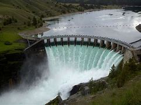

▷ dam   +
SYMBOL for decametre(s) 十米   +

---

==== ▸ keen  [567]   +
な/kiːn/   +

【ADJ】   If you say that someone has a _keen_ mind, you mean that they are very clever and aware of what is happening around them. 敏锐的 +
⇒  They described him as a man of keen intellect.  他们把他描述成一个才思敏锐的人。   +

【ADV】   敏锐地 +
⇒  They're keenly aware that whatever they decide will set a precedent.  他们敏锐地意识到无论他们决定怎么做，都会开创先例。   +

【ADJ】   If you have a _keen_ eye or ear, you are able to notice things that are difficult to detect. 灵敏的 +
⇒  ...an amateur artist with a keen eye for detail.  …一位对细节有敏锐洞察力的业余艺术家。   +

【ADV】   灵敏地 +
⇒  Charles listened keenly.  查尔斯竖起耳朵听着。   +

【ADJ】   A _keen_ interest or emotion is one that is very intense. 强烈的 +
⇒  He had retained a keen interest in the progress of the work.  他一直对工作的进展保持着强烈的兴趣。   +

【ADV】   强烈地 +
⇒  She remained keenly interested in international affairs.  她一直对国际事务有强烈的兴趣。   +

【ADJ】   If you are _keen on_ doing something, you very much want to do it. 渴望的 +
⇒  You're not keen on going, are you?  你不是很想走，对吗？   +

【N-UNCOUNT】   渴望 +
⇒  ...Doyle's keenness to please.  …多伊尔的极欲讨好心态。   +

【ADJ】   If you are _keen on_ something, you like it a lot and are very enthusiastic about it. 热衷的 +
⇒  I wasn't too keen on physics and chemistry.  我对物理和化学并不太热衷。   +

【ADJ】   You use _keen_ to indicate that someone has a lot of enthusiasm for a particular activity and spends a lot of time doing it. 着迷的 +
⇒  She was a keen amateur photographer.  她是一个痴迷的业余摄影师。   +

【ADJ】   A _keen_ fight or competition is one in which the competitors are all trying very hard to win, and it is not easy to predict who will win. 激烈的 +
【ADV】   激烈地   +
⇒  The contest should be very keenly fought.  比赛应该争夺很激烈。   +

【V】   to lament the dead 哀悼 +

---

==== ▸ gait  [568]   +
な/ɡeɪt/   +
--> 来自PIE*ghe, 走，词源同go. 即走的姿势。 +

【N-COUNT】   A particular kind of _gait_ is a particular way of walking. 步态 +
⇒  ...a tubby little man in his fifties, with sparse hair and a rolling gait.  …一个矮胖的男人，五十多岁，头发稀疏，步态摇摆。   +

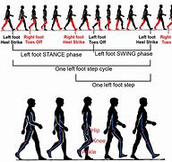

---

==== ▸ stake  [569]   +
な/steɪk/   +
--> 来自古英语 staca,桩，钉，销子，来自 Proto-Germanic*stakon,棍，棒，柱子，来自 PIE*steg, 棍，棒，柱子，词源同 stack,stick. +

【PHRASE】   If something is _at stake_, it is being risked and might be lost or damaged if you are not successful. 得失难料 +
⇒  The tension was naturally high for a game with so much at stake.  一场成败如此难料的比赛紧张度自然很高。   +

【N-PLURAL】   The _stakes_ involved in a contest or a risky action are the things that can be gained or lost. (竞赛、冒险行为中的) 赌注 +
⇒  The game was usually played for high stakes between two large groups.  这种游戏通常是两大组人为赢得大的赌注而进行的。   +

【V-T】   If you _stake_ something such as your money or your reputation _on_ the result of something, you risk your money or reputation on it. 以 (金钱、名誉等) 下赌注 +
⇒  He has staked his political future on an election victory.  他已把他的政治前途赌在了一次选举获胜上。   +

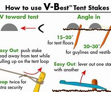

【N-COUNT】   If you have a _stake in_ something such as a business, it matters to you, for example because you own part of it or because its success or failure will affect you. (商业等中的) 利害关系 +
⇒  He was eager to return to a more entrepreneurial role in which he had a big financial stake in his own efforts.  他渴望回到更具企业家性质的角色，这样他的努力就跟自己有大的金融利害关系。   +

【N-PLURAL】   You can use _stakes_ to refer to something that is like a contest. For example, you can refer to the choosing of a leader as _the_ leadership _stakes_. 争夺赛 +
⇒  We are lagging behind in the childcare stakes.  我们在儿童保育竞赛中正落在后面。   +

【N-COUNT】   A _stake_ is a pointed wooden post which is pushed into the ground, for example in order to support a young tree. 桩 +
⇒  His arms were tied to wooden stakes to hold him flat.  他的双臂被绑在木桩上以便使他平躺着。   +

【PHRASE】   If you _stake a claim_, you say that something is yours or that you have a right to it. 提出所有权要求 +
⇒  Jane is determined to stake her claim as an actress.  简决心提出她作为一名女演员的应有权利。   +

---

==== ▸ genius  [570]   +
な/ˈdʒiːnɪəs/   +

【N-UNCOUNT】  _Genius_ is very great ability or skill in a particular subject or activity. 天赋 +
⇒  This is the mark of her real genius as a designer.  这是她作为一名设计师的真正天赋的标志。   +
⇒  The man had genius and had made his mark in the aviation world.  那位男士拥有天赋，而且在航空界已经成名。   +

【N-COUNT】   A _genius_ is a highly talented, creative, or intelligent person. 天才 +
⇒  Chaplin was not just a genius, he was among the most influential figures in film history.  卓别林不仅是个天才，还是电影史上最有影响的人物之一。   +

---

==== ▸ experimental  [571]   +
な/ɪkˌspɛrɪˈmɛntəl/   +

【ADJ】   Something that is _experimental_ is new or uses new ideas or methods, and might be modified later if it is unsuccessful. 试验性的 +
⇒  ...an experimental air-conditioning system.  …一种试验性的空调系统。   +

【ADJ】  _Experimental_ means using, used in, or resulting from scientific experiments. 实验的 +
⇒  ...the main techniques of experimental science.  …实验科学的主要技术。   +

【ADV】   实验地 +
⇒  ...an ecology laboratory, where communities of species can be studied experimentally under controlled conditions.  …一个可在受控条件下对物种群落进行实验研究的生态实验室。   +

【ADJ】   An _experimental_ action is done in order to see what it is like, or what effects it has. 试验性的 +
⇒  The senator is ready to argue for an experimental lifting of the ban.  该参议员已准备好争取那条禁令的试验性解除。   +

【ADV】   试验性地 +
⇒  This system is being tried out experimentally at many universities.  该系统正在很多大学试用。   +

---

==== ▸ moor  [572]   +
な/mʊə/   +

【N-VAR】   A _moor_ is an area of open and usually high land with poor soil that is covered mainly with grass and heather. 荒野 +
⇒  Colliford is higher, right up on the moors.  考里弗德更高，正好在荒野之上。   +

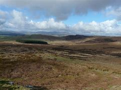

【V-T/V-I】   If you _moor_, or _moor_ a boat somewhere, you stop and tie it to the land with a rope or chain so that it cannot move away. 停泊 +
⇒  She had moored her barge on the right bank of the river.  她已经把她的驳船停泊在河的右岸。   +
⇒  I decided to moor near some tourist boats.  我决定挨着一些游船停泊。   +

【N-COUNT】   The _Moors_ were a Muslim people who established a civilization in North Africa and Spain between the 8th and the 15th centuries A.D. 摩尔人 +

---

==== ▸ stipulate  [573]   +
な/ˈstɪpjʊˌleɪt/   +
--> 可能来自 stipula,草梗，叶柄，茎，来自 PIE*steip, 刺，词源同 stipule,stipple.其词义演变来自古罗马时期谈判双方达成协议后，会折断一根草 作为象征。这种行为可能类似武侠小说中把箭折断，然后立下重誓言语“如违此誓，有如此 箭（剑）”. +

【V-T】   If you _stipulate_ a condition or _stipulate that_ something must be done, you say clearly that it must be done. 规定; 明确要求 +
⇒  She could have stipulated that she would pay when she collected the computer.  她本可以明确要求取电脑时付款的。   +

【N-COUNT】   规定; 明确要求 +
⇒  Clifford's only stipulation is that his clients obey his advice.  克里弗德惟一的规定是他的客户必须听从自己的建议。   +
 ▷ stipulate   +
な/ˈstɪpjʊlɪt, -ˌleɪt/   +

【N-COUNT】 +
【ADJ】   (of a plant) having stipules (植物)具托叶的.    +

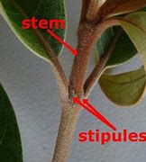
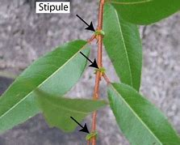
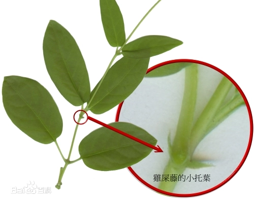

.案例
====
.托叶 Stipules:
着生在叶柄与茎的连接处，分居两侧。其形态和功能也因不同植物而异。 +
**托叶是叶柄基部、两侧或腋部所着生的细小绿色或膜质片状物。托叶通常先于叶片长出，并于早期起着保护幼叶和芽的作用。**托叶一般较细小，形状、大小因植物种类不同差异甚大。 +

在有些植物中，托叶的存在是短暂的，随着叶片的生长，托叶很快就脱落，仅留下一个不为人所注意的着生托叶的痕迹（托叶痕）. +
有些植物的托叶能伴随叶片在整个生长季节中存在，称为托叶宿存. +
====

---

==== ▸ delicate  [574]   +
な/ˈdɛlɪkɪt/   +

【ADJ】   Something that is _delicate_ is small and beautifully shaped. 精巧的; 精美的 +
⇒  He had delicate hands.  他有一双纤细的手。   +

【ADV】   精巧地; 精美地 +
⇒  She was a shy, delicately pretty girl with enormous blue eyes.  她是个羞怯纤美的姑娘，长着一双蓝色的大眼睛。   +

【ADJ】   Something that is _delicate_ has a colour, taste, or smell which is pleasant and not strong or intense. 柔和的 (颜色); 清淡可口的 (味道) +
⇒  Young haricot beans have a tender texture and a delicate, subtle flavour.  嫩扁豆肉质细嫩，味道清淡可口。   +

【ADV】   清淡可口地 +
⇒  ...a soup delicately flavoured with nutmeg.  …以肉桂清淡地调味的一道汤。   +

【ADJ】   If something is _delicate_, it is easy to harm, damage, or break, and needs to be handled or treated carefully. 易碎的; 脆弱的 +
⇒  Although the coral looks hard, it is very delicate.  虽然那珊瑚看起来坚硬，它其实非常易碎。   +

【ADJ】   Someone who is _delicate_ is not healthy and strong, and becomes ill easily. 病弱的 +
⇒  She was physically delicate and psychologically unstable.  她身体纤弱，而且心理也不稳定。   +

【ADJ】   You use _delicate_ to describe a situation, problem, matter, or discussion that needs to be dealt with carefully and sensitively in order to avoid upsetting things or offending people. 微妙的 +
⇒  Ottawa and Washington have to find a delicate balance between the free flow of commerce and legitimate security concerns.  渥太华和华盛顿必须在自由贸易流通和司法安全事务之间找到一个微妙的平衡。   +

【ADV】   微妙地 +
⇒  Clearly, the situation remains delicately poised.  显而易见，形势仍然保持着微妙的平衡。   +

【ADJ】   A _delicate_ task, movement, action, or product needs or shows great skill and attention to detail. 棘手的; 需要小心处理的 +
⇒  ...a long and delicate operation carried out at a hospital in Pittsburgh.  …匹兹堡市一家医院里进行的一项耗时且棘手的手术。   +

【ADV】   棘手地 +
⇒  ...the delicately embroidered sheets.  …那些刺绣繁复的床单。   +

---

==== ▸ retire  [575]   +
な/rɪˈtaɪə/   +

【V-I】   When older people _retire_, they leave their job and usually stop working completely. 退休 +
⇒  At the age when most people retire, he is ready to face a new career.  在大多数人退休的年纪，他准备要面对一项新事业。   +

【V-I】   When an athlete _retires from_ their sport, they stop playing in competitions. When they _retire from_ a race or a game, they stop competing in it. 退役 +
⇒  I have decided to retire from Formula One racing at the end of the season.  我已经决定这个赛季末退出一级方程式赛车。   +

【V-I】   When a jury in a court of law _retires_, the members of it leave the court in order to decide whether someone is guilty or innocent. (陪审团) 退庭 +
⇒  The jury will retire to consider its verdict today.  该陪审团今天将退庭来考虑其裁决。   +

---

==== ▸ lucrative  [576]   +
な/ˈluːkrətɪv/   +

【ADJ】   A _lucrative_ activity, job, or business deal is very profitable. 获利丰厚的 +
⇒  Thousands of ex-army officers have found lucrative jobs in private security firms.  成千上万的退役军官在私人保安公司找到了薪水丰厚的工作。   +

---

==== ▸ palate  [577]   +
な/ˈpælɪt/   +
--> 来自拉丁语palatum,腭，上嘴唇。 +

【N-COUNT】   Your _palate_ is the top part of the inside of your mouth. 上颚 +
【N-COUNT】   You can refer to someone's _palate_ as a way of talking about their ability to judge good food or drink. 味觉   +
⇒  ...fresh pasta sauces to tempt more demanding palates.  …诱惑较为挑剔的味觉的新鲜面食调味酱。   +

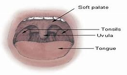

---

==== ▸ recognition  [578]   +
な/ˌrɛkəɡˈnɪʃən/   +

【N-UNCOUNT】  _Recognition_ is the act of recognizing someone or identifying something when you see it. 认出; 识别 +
⇒  He searched for a sign of recognition on her face, but there was none.  他在她的脸上搜寻她认出来的迹象，但没有。   +

【N-UNCOUNT】  _Recognition__of_ something is an understanding and acceptance of it. 认可; 接受 +
⇒  Recognition of the importance of career development is increasing.  对职业发展重要性的认可在不断增加。   +

【N-UNCOUNT】   When a government gives diplomatic _recognition_ to another country, they officially accept that its status is valid. (国际上的) 正式承认 +
⇒  His government did not receive full recognition by the United States until July.  他的政府直到7月才得到美国的完全承认。   +

【N-UNCOUNT】   When a person receives _recognition_ for the things that they have done, people acknowledge the value or skill of their work. 赞赏; 赏识 +
⇒  At last, her father's work has received popular recognition.  最终，她父亲的工作得到了大家的普遍赞赏。   +

【PHRASE】   If something is done _in recognition of_ someone's achievements, it is done as a way of showing official appreciation of them. 用以肯定 +
⇒  ...a small plaque in recognition of her contribution to the university.  …一枚用以肯定她对该大学所做贡献的奖章。   +

---

==== ▸ telescope  [579]   +
な/ˈtɛlɪˌskəʊp/   +

【N-COUNT】   A _telescope_ is a long instrument shaped like a tube. It has lenses inside it that make distant things seem larger and nearer when you look through it. 望远镜 +
⇒  It's hoped that the telescope will enable scientists to see deeper into the universe than ever before.  希望该望远镜能让科学家们比以往更深入地观察宇宙。   +

---

==== ▸ devise  [580]   +
な/dɪˈvaɪz/   +

【V-T】   If you _devise_ a plan, system, or machine, you have the idea for it and design it. 构思; 设计 +
⇒  We devised a scheme to help him.  我们想出了一个计划来帮助他。   +

---

==== ▸ by-product  [581]   +

1.a substance that is produced during the process of making or destroying sth else 副产品 +
=> When burnt, plastic produces dangerous by-products. 塑料燃烧时产生出危险的副产品。  +

2.a thing that happens, often unexpectedly, as the result of sth else 意外结果；副作用 +
=> One of the by-products of unemployment is an increase in crime. 失业带来的一大恶果是犯罪率上升。  +

---

==== ▸ applicable  [582]   +
な/ˈæplɪkəbəl, əˈplɪkə-/   +

【ADJ】   Something that is _applicable to_ a particular situation is relevant to it or can be applied to it. 适用的 +
⇒  What is a reasonable standard for one family is not applicable for another.  对一个家庭合理的标准对于另一个家庭并不适用。   +

---

==== ▸ identification  [583]   +
な/aɪˌdɛntɪfɪˈkeɪʃən/   +

【N-VAR】   The _identification_ of something is the recognition that it exists, is important, or is true. 确认 +
⇒  Early identification of a disease can prevent death and illness.  疾病的早期确认可避免死亡和病痛。   +

【N-VAR】   The _identification_ of a particular person or thing is the ability to name them because you know them or recognize them. 验明 +
⇒  Officials are awaiting positive identification before charging the men with war crimes.  官员们正在等待这些人的身份得以验明，然后再以战争罪起诉他们。   +

【N-UNCOUNT】   If someone asks you for some _identification_, they want to see something such as a driving licence, that proves who you are. 身份证明 +
⇒  He did not have any identification when he arrived at the hospital.  他到医院的时候没有任何身份证明。   +

【N-VAR】   The _identification of_ one person or thing _with_ another is the close association of one with the other. 密切关联 +
⇒  ...the identification of Spain with Catholicism.  …西班牙与天主教的密切联系。   +

【N-UNCOUNT】  _Identification with_ someone or something is the feeling of sympathy and support for them. 同情; 支持 +
⇒  Marilyn had an intense identification with animals.  玛丽莲对动物有深切的同情。   +

---

==== ▸ entrepreneur  [584]   +
な/ˌɒntrəprəˈnɜː/   +

【N-COUNT】   An _entrepreneur_ is a person who sets up businesses and business deals. 创业者 +

---

==== ▸ speckle  [585]   +
な/ˈspɛkəl/   +
--> 可能来自 spece,斑点，色斑，-le,小词后缀。 +

【N】   a small or slight mark usually of a contrasting （在式样、颜色或态度上）极不相同的，迥异的 colour, as on the skin, a bird's plumage （鸟的）全身羽毛 , or eggs (皮肤、鸟的羽毛或鸡蛋上的)色斑 +
【V】   to mark with or as if with speckles 用色斑涂上   +

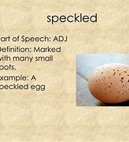

---

==== ▸ diversify  [586]   +
な/daɪˈvɜːsɪˌfaɪ/   +
--> di-分开 + -vers-转 + -ify动词词尾 +

【V-T/V-I】   When an organization or person _diversifies_ into other things, or _diversifies_ their product line, they increase the variety of things that they do or make. 使多样化 +
⇒  The company's troubles started only when it diversified into new products.  该公司的麻烦从实现产品多样化时才开始。   +
⇒  As demand has increased, so manufacturers have been encouraged to diversify and improve quality.  制造商们受需求增加的刺激而扩大生产品种，提高产品质量。   +

【N-VAR】   多样化 +
⇒  The seminar was to discuss diversification of agriculture.  该研讨会讨论的是农业多种经营。   +

---

==== ▸ calculate  [587]   +
な/ˈkælkjʊˌleɪt/   +

【V-T】   If you _calculate_ a number or amount, you discover it from information that you already have, by using arithmetic, mathematics, or a special machine. 计算 +
⇒  From this you can calculate the total mass in the Galaxy.  据此，你可以计算出银河系的总质量。   +
⇒  We calculate that the average size farm in Lancaster County is 65 acres.  我们算出兰开斯特郡的农场平均面积为65英亩。   +

【V-T】   If you _calculate_ the effects of something, especially a possible course of action, you think about them in order to form an opinion or decide what to do. 估计; 推测 +
⇒  I believe I am capable of calculating the political consequences accurately.  我认为自己能够正确地预测出各种政治后果。   +

---

==== ▸ juvenile  [588]   +
な/ˈdʒuːvɪˌnaɪl, -naɪl/   +

【N-COUNT】   A _juvenile_ is a child or young person who is not yet old enough to be regarded as an adult. 青少年 +
⇒  The number of juveniles in the general population has fallen by a fifth in the past 10 years.  在过去的10年中，青少年在总人口中所占的比重下降了1/5。   +

【ADJ】  _Juvenile_ activity or behaviour involves young people who are not yet adults. 青少年的 +
⇒  Juvenile crime is increasing at a terrifying rate.  青少年犯罪在以惊人的速度增加。   +

---

==== ▸ advisory  [589]   +
な/ədˈvaɪzərɪ/   +

【N-COUNT】   An _advisory_ is an official announcement or report that warns people about bad weather, diseases, or other dangers or problems. 警告 +
⇒  26 states have issued health advisories.  26个州已经发布了卫生警告。   +

【ADJ】   An _advisory_ group regularly gives suggestions and help to people or organizations, especially about a particular subject or area of activity. 咨询性的 (团体) +
⇒  ...members of the advisory committee on the safety of nuclear installations.  …核设施安全咨询委员会的成员们。   +

---

==== ▸ nosy  [590]   +
な/ˈnəʊzɪ/   +

【ADJ】   If you describe someone as _nosy_, you mean that they are interested in things which do not concern them. 爱管闲事的 +
⇒  He was having to whisper in order to avoid being overheard by their nosy neighbours.  他不得不低声耳语，以免被他们爱管闲事的邻居们听见。   +

---

==== ▸ animate  [591]   +
な【ADJ】   Something that is _animate_ has life, in contrast to things like stones and machines which do not. 有生命的   +
⇒  Natural philosophy involved the study of all aspects of the material world, animate and inanimate.  自然哲学涉及到了对包括有生命体与无生命体的物质世界的全面研究。   +

【V-T】   To _animate_ something means to make it lively or more cheerful. 使有生气 +
⇒  There was precious little about the cricket to animate the crowd.  这场板球比赛极少有让观众兴奋的地方。   +

---

==== ▸ inverse  [592]   +
な/ɪnˈvɜːs/   +

【ADJ】   If there is an _inverse_ relationship between two things, one of them becomes larger as the other becomes smaller. 相反的 +
⇒  The tension grew in inverse proportion to the distance from their final destination.  拉力的增加与到达它们最终点的距离成相反的比例。   +

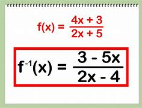
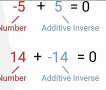
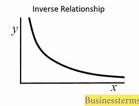

【ADV】  
 +
⇒  The size of the nebula at this stage is inversely proportional to its mass.  这个阶段的星云大小与其质量成反比。   +

【N-SING】  _The inverse_ of something is its exact opposite. 倒置; 颠倒 +
⇒  There is no sign that you bothered to consider the inverse of your logic.  没有迹象显示你在乎过逻辑的颠倒。   +

【ADJ】  _Inverse_ is also an adjective. 倒置的; 颠倒的 +
⇒  The hologram can be flipped to show the inverse image.  全息图能被翻转来显示倒置的图像。   +

---

==== ▸ contiguous  [593]   +
な/kənˈtɪɡjʊəs/   +

【ADJ】   Things that are _contiguous_ are next to each other or touch each other. 邻近的 +
⇒  Its vineyards are virtually contiguous with those of Ausone.  其葡萄园几乎与奥索尼的葡萄园相连。   +
⇒  ...two years of travel throughout the 48 contiguous states.  ...两年里穿行于毗邻的48个州。   +

---

==== ▸ sophisticated  [594]   +
な/səˈfɪstɪˌkeɪtɪd/   +

【ADJ】   A _sophisticated_ machine, device, or method is more advanced or complex than others. 高级的; 复杂的 +
⇒  Honeybees use one of the most sophisticated communication systems of any insect.  蜜蜂所使用的交流系统是昆虫中最复杂的之一。   +

【ADJ】   Someone who is _sophisticated_ is comfortable in social situations and knows about culture, fashion, and other matters that are considered socially important. 老练的; 久经世故的 +
⇒  Claude was a charming, sophisticated companion.  克劳德是个有魅力、见多识广的伙伴。   +

【ADJ】   A _sophisticated_ person is intelligent and knows a lot, so that they are able to understand complicated situations. 干练的 +
⇒  These people are very sophisticated observers of the foreign policy scene.  这些人是外交政策领域干练的观察家。   +

---

==== ▸ recipient  [595]   +
な/rɪˈsɪpɪənt/   +

【N-COUNT】   The _recipient_ of something is the person who receives it. 接受者 +
⇒  ...the largest recipient of U.S. foreign aid.  …最大的美国对外援助接受方。   +

---

==== ▸ deal  [596]   +
な/diːl/   +

【QUANT】   If you say that you need or have _a great deal of_ or _a good deal of_ a particular thing, you are emphasizing that you need or have a lot of it. 数量 +
⇒  ...a great deal of money.  …许多钱。   +

【ADV】  _Deal_ is also an adverb. 非常 +
⇒  As a relationship becomes more established, it also becomes a good deal more complex.  当一段关系固定下来以后，它也会变得复杂得多。   +

【PRON】  _Deal_ is also a pronoun. 量 +
⇒  Although he had never met Geoffrey Hardcastle, he knew a good deal about him.  尽管他从未见过杰弗里·哈德卡斯尔，他还是十分了解他。   +
 ▷ deal   +
な/diːl/   +

【PRON】 +
【N-COUNT】   If you _make_ a _deal_, _do_ a _deal_, or _cut_ a _deal_, you complete an agreement or an arrangement with someone, especially in business. 达成协议; 达成交易   +
⇒  He made a deal to testify against the others and wasn't charged.  他达成了协议出庭指证别人，因而未获指控。   +
⇒  Japan will have to do a deal with the U.S. on rice imports.  日本将不得不就水稻进口问题和美国达成协议。   +

【N-COUNT】   If someone has had a _bad deal_, they have been unfortunate or have been treated unfairly. 不公的待遇 +
⇒  The people of Hartford have had a bad deal for many, many years.  许多年来，哈特福德地区的人们遭受着不幸。   +

【N】   a plank of softwood timber, such as fir or pine, or such planks collectively 软木板 +
【V-I】   If a person, company, or shop _deals in_ a particular type of goods, their business involves buying or selling those goods. 经营   +
⇒  They deal in antiques.  他们经营古董生意。   +

【V-T】   If someone _deals_ illegal drugs, they sell them. 贩卖 (毒品) +
⇒  I certainly don't deal drugs.  我当然不做毒品生意。   +

【V-T】   If you _deal_ playing cards, you give them out to the players in a game of cards. (纸牌游戏中) 发 (牌) +
⇒  The croupier dealt each player a card, face down.  赌局主持人给每个玩牌者发了一张牌，牌面向下。   +

【V】   to give (a blow) to (someone); inflict 给(某人)以打击 +
【PHRASAL VERB】  _Deal out_ means the same as . (纸牌游戏中) 发 (牌)   +
⇒  Dalton dealt out five cards to each player.  多尔顿给每个玩牌的人发了5张牌。   +

---

==== ▸ terrific  [597]   +
な/təˈrɪfɪk/   +

【ADJ】   If you describe something or someone as _terrific_, you are very pleased with them or very impressed by them. 极好的 +
⇒  What a terrific idea!  多好的主意啊！   +

【ADJ】  _Terrific_ means very great in amount, degree, or intensity. 巨大的 +
⇒  All of a sudden there was a terrific bang and a flash of smoke.  忽然发出一声巨响，还冒出一股烟。   +

---

==== ▸ olfactory  [598]   +
な/ɒlˈfæktərɪ, -trɪ, əʊl-/   +
--> 来自拉丁语olere,闻，嗅，散发气味，词源同odor.-fact,做，使，词源同fact,effect.即闻到气味的，有嗅觉的。字母d,l音变，比较tongue,language. +

【ADJ】  _Olfactory_ means concerned with the sense of smell. 嗅觉的 +
⇒  This olfactory sense develops in the womb.  这一嗅觉在子宫内形成。   +

---

==== ▸ benefit  [599]   +
な/ˈbɛnɪfɪt/   +

【N-VAR】   The _benefit of_ something is the help that you get from it or the advantage that results from it. 益处; 成效 +
⇒  Each family farms individually and reaps the benefit of its labour.  每个家庭独立耕作，收获各自的劳动成果。   +
⇒  I'm a great believer in the benefits of this form of therapy.  我对这种疗法的益处深信不疑。   +

【N-UNCOUNT】   If something is _to_ your _benefit_ or is _of benefit to_ you, it helps you or improves your life. 好处 +
⇒  This could now work to Albania's benefit.  这可能现在对阿尔巴尼亚有利。   +

【V-T/V-I】   If you _benefit from_ something or if it _benefits_ you, it helps you or improves your life. 有益于; 得益 +
⇒  Both sides have benefited from the talks.  双方都从会谈中获益。   +

【N-UNCOUNT】   If you have the _benefit of_ some information, knowledge, or equipment, you are able to use it so that you can achieve something. 优势 +
⇒  Steve didn't have the benefit of a formal college education.  史蒂夫没有接受过正规大学教育的优势。   +

【N-VAR】  _Benefits_ are money or other advantages which come from your job, the government, or an insurance company. 福利 +
⇒  McCary will receive about $921,000 in retirement benefits.  麦克卡里将获得大约九十二万一千美元的退休福利。   +
⇒  ...the skyrocketing cost of health care and medical benefits.  …一路飚升的健康保健和医疗保险福利金。   +

【N-COUNT】   A _benefit_, or a _benefit_ concert or dinner, is an event that is held in order to raise money for a particular charity or person. 义演 +
⇒  ...a memorial benefit concert for the Bonhoeffer endowment.  …一场纪念邦赫费尔基金的慈善音乐会。   +

【PHRASE】   If you give someone _the benefit of the doubt_, you treat them as if they are telling the truth or as if they have behaved properly, even though you are not sure that this is the case. 姑且信其为真 +
⇒  At first I gave him the benefit of the doubt.  起初我姑且信了他。   +

【PHRASE】   If you say that someone is doing something _for the benefit of_ a particular person, you mean that they are doing it for that person. 为了某人的利益 +
⇒  You need people working for the benefit of the community.  你需要一些为公众利益服务的人。   +

---

==== ▸ vivify  [600]   +
な/ˈvɪvɪˌfaɪ/   +

【V】   to bring to life; animate 赋予生命; 使有生气 +

---

==== ▸ seclusion  [601]   +
な/sɪˈkluːʒən/   +
--> se-,分开，离开，-clud,关闭，词源同 close,conclude.引申词义隔离，隐居。 +

【N-UNCOUNT】   If you are living _in seclusion_, you are in a quiet place away from other people. 与世隔绝 +
⇒  She lived in seclusion with her husband on their farm in Panama.  她和她丈夫隐居在他们在巴拿马的农场里。   +

---

==== ▸ champion  [602]   +
な/ˈtʃæmpɪən/   +

【N-COUNT】   A _champion_ is someone who has won the first prize in a competition, contest, or fight. 冠军 +
⇒  ...a former Olympic champion.  …一位前奥运冠军。   +
⇒  Kasparov became world champion.  卡斯帕罗夫成了世界冠军。   +

【N-COUNT】   If you are a _champion of_ a person, a cause, or a principle, you support or defend them. 拥护者; 捍卫者 +
⇒  He received acclaim as a champion of the oppressed.  他作为被压迫者的捍卫者而受到了赞誉。   +

【V-T】   If you _champion_ a person, a cause, or a principle, you support or defend them. 拥护; 捍卫 +
⇒  He passionately championed the poor.  他曾热情地捍卫穷人。   +

---

==== ▸ bustle  [603]   +
な/ˈbʌsəl/   +
--> 来自bust, 同burst, 爆发。 +

【V-I】   If someone _bustles_ somewhere, they move there in a hurried way, often because they are very busy. 奔忙 +
⇒  My mother bustled around the kitchen.  我母亲在厨房里忙得团团转。   +

【V-I】   A place that _is bustling_ or _bustling with_ people or activity is full of people who are very busy or lively. 熙熙攘攘的 +
⇒  The sidewalks are bustling with people.  两侧的人行道上人来人往。   +

【N-UNCOUNT】  _Bustle_ is busy, noisy activity. 忙碌; 喧嚣 +
⇒  ...the hustle and bustle of modern life.  …现代生活的忙碌喧嚣。   +

【N】   a cushion or a metal or whalebone framework worn by women in the late 19th century at the back below the waist in order to expand the skirt (19世纪妇女的)裙撑 +

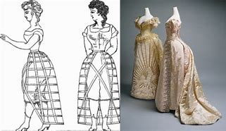

---

==== ▸ marine  [604]   +
な/məˈriːn/   +

【N-COUNT】   A _marine_ is a member of an armed force, for example the U.S. Marine Corps or the Royal Marines, who is specially trained for military duties at sea as well as on land. 海军陆战队士兵 +
⇒  A small number of Marines were wounded.  几名海军陆战队士兵受了伤。   +

【ADJ】  _Marine_ is used to describe things relating to the sea or to the animals and plants that live in the sea. 海洋的 +
⇒  ...breeding grounds for marine life.  …海洋生物的繁殖地。   +

【ADJ】  _Marine_ is used to describe things relating to ships and their movement at sea. 海事的 +
⇒  ...a lawyer specializing in marine law.  …一名专攻海事法的律师。   +

---

==== ▸ slice  [605]   +
な/slaɪs/   +

【N-COUNT】   A _slice of_ bread, meat, fruit, or other food is a thin piece that has been cut from a larger piece. (切下的食物) 薄片 +
⇒  Try to eat at least four slices of bread a day.  每天尽量吃至少4片面包。   +

【V-T】   If you _slice_ bread, meat, fruit, or other food, you cut it into thin pieces. 把 (食物) 切成薄片 +
⇒  Helen sliced the cake.  海伦把蛋糕切成了薄片。   +

【PHRASAL VERB】  _Slice up_ means the same as . 把 (食物) 切成薄片 +
⇒  I sliced up an onion.  我把洋葱切成了片。   +

【N-COUNT】   You can use _slice_ to refer to a part of a situation or activity. (情况或活动的) 部分 +
⇒  Fiction takes up a large slice of the publishing market.  小说占出版市场的一大部分。   +

---

==== ▸ incident  [606]   +
な/ˈɪnsɪdənt/   +

【N-COUNT】   An _incident_ is something that happens, often something that is unpleasant. 事件; 事故 +
⇒  These incidents were the latest in a series of disputes between the two nations.  这些事件是两国一系列争端中最近的几起。   +

---

==== ▸ conflict  [607]   +
--> con-, 强调。-flict, 鞭子，击打，词源同flagellate(鞭笞), afflict. +

な【N-UNCOUNT】  _Conflict_ is serious disagreement and argument about something important. If two people or groups are _in conflict_, they have had a serious disagreement or argument and have not yet reached agreement. 争执; 分歧   +
⇒  Try to keep any conflict between you and your ex-partner to a minimum.  尽量把你和前合伙人之间的争执控制到最少。   +

【N-UNCOUNT】  _Conflict_ is a state of mind in which you find it impossible to make a decision. 矛盾心态 +
⇒  ...the anguish of his own inner conflict.  …他自己内心矛盾的痛苦。   +

【N-VAR】  _Conflict_ is fighting between countries or groups of people. (国家或团体之间的) 冲突 +
⇒  ...talks aimed at ending four decades of conflict.  …旨在结束40年冲突的会谈。   +

【N-VAR】   A _conflict_ is a serious difference between two or more beliefs, ideas, or interests. If two beliefs, ideas, or interests are _in conflict_, they are very different. (信念、观点、利益之间的) 冲突 +
⇒  There is a conflict between what they are doing and what you want.  他们在做的和你想要的之间存在冲突。   +

【V-RECIP】   If ideas, beliefs, or accounts _conflict_, they are very different from each other and it seems impossible for them to exist together or to each be true. (观点、信念、陈述等) 相冲突 +
⇒  Personal ethics and professional ethics sometimes conflict.  个人道德与职业道德之间有时会相冲突。   +
⇒  He held firm opinions which usually conflicted with mine.  他持有坚定的、通常跟我的相冲突的观点。   +

---

==== ▸ vocal  [608]   +
な/ˈvəʊkəl/   +

【ADJ】   You say that people are _vocal_ when they speak forcefully about something that they feel strongly about. 直言不讳的 +
⇒  He has been very vocal in his displeasure over the results.  他直言不讳地说出了对结果的不满。   +

【ADJ】  _Vocal_ means involving the use of the human voice, especially in singing. 嗓音的 +
⇒  ...a wider range of vocal styles.  …更多样的嗓音风格。   +

---

==== ▸ square  [609]   +
な/skwɛə/   +

【N-COUNT】   A _square_ is a shape with four sides that are all the same length and four corners that are all right angles. 正方形 +
⇒  Serve the cake warm or at room temperature, cut in squares.  端上温的或房间温度的蛋糕，把它切成正方形。   +
⇒  There was a calendar on the wall, with large squares around the dates.  墙上有一副日历，日期周围是大的方框。   +
⇒  The house is located in one of the city's prettiest squares.  该房子位于市区最漂亮的广场之一。   +

【ADJ】   Something that is _square_ has a shape the same as a square or similar to a square. 正方形的; 方形的 +
⇒  Round tables seat more people in the same space as a square table.  在同一空间里，圆桌比方桌可以坐更多的人。   +

【ADJ】  _Square_ is used before units of length when referring to the area of something. For example, if something is three feet long and two feet wide, its area is six square feet. 平方的 (用于长度单位前表示面积) +
⇒  The new complex will provide 10 million square feet of office space.  这座新的综合建筑群将提供1千万平方英尺的办公空间。   +

【ADJ】  _Square_ is used after units of length when you are giving the length of each side of something that is square in shape. 平方的 (用于长度单位前表示某面面积) +
⇒  ...a linen cushion cover, 45 cm. square.  …一个亚麻坐垫套子，45平方厘米。   +

【V-T】   To _square_ a number means to multiply it by itself. For example, _3 squared_ is 3 x 3, or 9. _3 squared_ is usually written as 3_2_. 乘二次方 +
⇒  Take the time in seconds, square it, and multiply by 5.12.  以秒计时，乘二次方，然后乘以5.12。   +

【N-COUNT】   The _square of_ a number is the number produced when you multiply that number by itself. For example, the square of 3 is 9. 二次方; 平方 +
⇒  ...the square of the speed of light, an exceedingly large number.  …光速的平方，一个极大的数字。   +

【V-T/V-I】   If you _square_ two different ideas or actions _with_ each other or if they _square with_ each other, they fit or match each other. 使相适配; 适配 +
⇒  That explanation squares with the facts, doesn't it.  那种解释与事实相符，是吧。   +

【V-T】   If you _square_ something _with_ someone, you ask their permission or check with them that what you are doing is acceptable to them. (就某事) 征求 (某人) 许可 +
⇒  I squared it with Dan, who said it was all right so long as I was back next Monday morning.  我就此事征求过丹的许可，他说只要我能在下周一上午回来就行。   +

【PHRASE】   If you are _back to square one_, you have to start dealing with something from the beginning again because the way you were dealing with it has failed. (因处理失败而) 重新开始 +
⇒  If your complaint is not upheld, you may feel you are back to square one.  如果你的投诉没有得到支持，你可能觉得你又得从新开始。   +

---

==== ▸ descent  [610]   +
な/dɪˈsɛnt/   +

【N-VAR】   A _descent_ is a movement from a higher to a lower level or position. 下降 +
⇒  Sixteen of the youngsters set off for help, but during the descent three collapsed in the cold and rain.  那些年轻人中有16人出发寻求帮助，但在下山过程中有3人在寒冷和阴雨中倒下了。   +

【N-COUNT】   A _descent_ is a surface that slopes downward, for example, the side of a steep hill. 下坡 +
⇒  On the descents, cyclists spin past cars, freewheeling downhill at tremendous speed.  在下坡道上，自行车手们飞快地掠过汽车，靠惯性极速冲下山去。   +

【N-SING】   When you want to emphasize that a situation becomes very bad, you can talk about someone's or something's _descent_ into that situation. 沉沦; 没落 +
⇒  ...his swift descent from respected academic to struggling small businessman.  …他从受人尊敬的学者到挣扎求存的小商人的迅速沦落。   +

【N-UNCOUNT】   You use _descent_ to talk about a person's family background, for example, their nationality or social status. 出身 +
⇒  All the contributors were of African descent.  所有捐助者都是非洲血统。   +

---

==== ▸ grid  [611]   +
な/ɡrɪd/   +

【N-COUNT】   A _grid_ is something which is in a pattern of straight lines that cross over each other, forming squares. On maps, the grid is used to help you find a particular thing or place. 网格; (地图上的) 坐标方格 +
⇒  ...a grid of ironwork.  …铁格栅。   +
⇒  ...a grid of narrow streets.  …网格式的狭窄街道。   +

【N-COUNT】   A _grid_ is a network of wires and cables by which sources of power, such as electricity, are distributed throughout a country or area. 系统网络 (指输电网等) +
⇒  ...breakdowns in communications and electric-power grids.  …通信与输电网故障。   +

【N-COUNT】  _The__grid_ or _the starting grid_ is the starting line on a car-racing track. 赛车起跑线 +
⇒  The Ferrari driver was starting second on the grid.  那位法拉利赛车手排在起跑线的第二位。   +

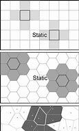

---

==== ▸ exalt  [612]   +
な/ɪɡˈzɔːlt/   +

【V-T】   To _exalt_ someone or something means to praise them very highly. 盛赞 +
⇒  His work exalts all those virtues that we, as Americans, are taught to hold dear.  他的作品盛赞了所有那些我们作为美国人被教导要珍视的美德。   +

---

==== ▸ traditional  [613]   +
な/trəˈdɪʃənəl/   +

【ADJ】  _Traditional_ customs, beliefs, or methods are ones that have existed for a long time without changing. 传统的 +
⇒  Traditional teaching methods sometimes only succeeded in putting students off learning.  传统的教学方法有时只会使学生们厌学。   +

【ADV】   传统地 +
⇒  Married women have traditionally been treated as dependent on their husbands.  已婚妇女传统上被认为是依附于其丈夫的。   +

【ADJ】   A _traditional_ organization or person prefers older methods and ideas to modern ones. 守旧的 +
⇒  We're still a traditional school in a lot of ways.  我们在很多方面仍然是一所守旧的学校。   +

【ADV】   守旧地 +
⇒  He is loathed by some of the more traditionally minded officers.  他被一些思想更为守旧的官员所厌恶。   +

---

==== ▸ occasional  [614]   +
な/əˈkeɪʒənəl/   +

【ADJ】  _Occasional_ means happening sometimes, but not regularly or often. 偶尔的 +
⇒  I've had occasional mild headaches all my life.  我此生一直有偶尔的轻微头疼。   +

【ADV】   偶尔地 +
⇒  He still misbehaves occasionally.  他仍偶尔行为不乖。   +

---

==== ▸ distinguish  [615]   +
な/dɪˈstɪŋɡwɪʃ/   +

【V-T/V-I】   If you can _distinguish_ one thing _from_ another or _distinguish between_ two things, you can see or understand how they are different. 辨别; 区分 +
⇒  Could he distinguish right from wrong?  他能辨别是非吗？   +
⇒  Research suggests that babies learn to see by distinguishing between areas of light and dark.  研究显示婴儿是通过区分明亮区域和黑暗区域来学会观看的。   +

【V-T】   A feature or quality that _distinguishes_ one thing _from_ another causes the two things to be regarded as different, because only the first thing has the feature or quality. 有别于 +
⇒  There is something about music that distinguishes it from all other art forms.  音乐中一些因素使之有别于其他艺术形式。   +

【V-T】   If you can _distinguish_ something, you can see, hear, or taste it although it is very difficult to detect. 辨别出 +
⇒  There were cries, calls. He could distinguish voices.  有各种各样的哭声和叫喊声。他能从中分辨出声音。   +

【V-T】   If you _distinguish yourself_, you do something that makes you famous or important. 使著名 +
⇒  Over the next few years he distinguished himself as a leading constitutional scholar.  在随后的几年中，他作为宪法学的权威学者而享有盛誉。   +

---

==== ▸ exclaim  [616]   +
な/ɪkˈskleɪm/   +
--> ex-, 向外。-cl, 呼叫，叫喊，词源同call, claim. +

【V-T】   Writers sometimes use _exclaim_ to show that someone is speaking suddenly, loudly, or emphatically, often because they are excited, shocked, or angry. (因兴奋、震惊、愤怒等) 突然呼喊; 惊叫 +
⇒  "He went back to the lab," Inez exclaimed impatiently.  “他回实验室了，”伊内兹不耐烦地叫道。   +

---

==== ▸ manner  [617]   +
な/ˈmænə/   +

【N-SING】   The _manner_ in which you do something is the way that you do it. 方式 +
⇒  She smiled again in a friendly manner.  她又友好地笑了笑。   +
⇒  I'm a professional and I have to conduct myself in a professional manner.  我是专业人士，必须以专业方式行事。   +

【N-SING】   Someone's _manner_ is the way in which they behave and talk when they are with other people, for example whether they are polite, confident, or bad-tempered. 举止 +
⇒  His manner was self-assured and brusque.  他的举止自负而且粗鲁。   +

【COMB in ADJ】   …的态度 +
⇒  Forrest was normally mild-mannered, affable, and untalkative.  福里斯特通常态度温和，和蔼可亲，不善言辞。   +

【N-PLURAL】   If someone has _good manners_, they are polite and observe social customs. If someone has _bad manners_, they are impolite and do not observe these customs. 礼貌 +
⇒  He dressed well and had impeccable manners.  他穿着得体，举止无可挑剔。   +
⇒  The manners of many doctors were appalling.  许多医生很没礼貌。   +

---

==== ▸ muggy  [618]   +
な/ˈmʌɡɪ/   +

【ADJ】  _Muggy_ weather is unpleasantly warm and damp. (天气) 闷热而潮湿的 +
⇒  It was muggy and overcast.  那天天气闷热又潮湿，阴沉沉的。   +

---

==== ▸ consistent  [619]   +
な/kənˈsɪstənt/   +

【ADJ】   Someone who is _consistent_ always behaves in the same way, has the same attitudes towards people or things, or achieves the same level of success in something. 始终如一的 +
⇒  Becker was never the most consistent of players anyway.  贝克尔不管怎么说从来就不是一个很稳定的球员。   +

【ADV】   始终如一地 +
⇒  It's something I have consistently denied.  这是我始终否认的事。   +

【ADJ】   If one fact or idea is _consistent with_ another, they do not contradict each other. 相符的 +
⇒  This result is consistent with the findings of Garnett &amp; Tobin.  该结果与加尼特和托宾的发现相符合。   +

【ADJ】   An argument or set of ideas that is _consistent_ is one in which no part contradicts or conflicts with any other part. (论点、观点) 前后一致的 +
⇒  A theory should be internally consistent.  一套理论应当内在一致。   +

---

==== ▸ politics  [620]   +
な/ˈpɒlɪtɪks/   +

【N-PLURAL】  _Politics_ are the actions or activities concerned with achieving and using power in a country or society. The verb that follows _politics_ may be either singular or plural. 政治 +
⇒  Many people think Nixon transformed American politics.  许多人认为尼克松改变了美国的政治。   +
⇒  He quickly involved himself in local politics.  他很快就参与到地方政治活动中去了。   +

【N-PLURAL】   Your _politics_ are your beliefs about how a country ought to be governed. 政治观点 +
⇒  My politics are well to the left of centre.  我的政治观点很靠左翼。   +

【N-UNCOUNT】  _Politics_ is the study of the ways in which countries are governed. 政治学 +
⇒  He began studying politics and medieval history.  他开始学习政治学和中世纪史。   +

【N-PLURAL】  _Politics_ can be used to talk about the ways that power is shared in an organization and the ways it is affected by personal relationships between people who work together. The verb that follows _politics_ may be either singular or plural. 权术 +
⇒  You need to understand how office politics influence the working environment.  你需要明白办公室权术怎样影响工作环境。   +

---

==== ▸ torrent  [621]   +
な/ˈtɒrənt/   +

【N-COUNT】   A _torrent_ is a lot of water falling or flowing rapidly or violently. 急流 +
⇒  Torrents of water gushed into the reservoir.  急流涌进了水库。   +

【N-COUNT】   A _torrent of_ abuse or questions is a lot of abuse or questions directed continuously at someone. (漫骂或问题的) 迸发 +
⇒  He turned around and directed a torrent of abuse at me.  他转过身对我破口大骂了一通。   +

---

==== ▸ wonder  [622]   +
な/ˈwʌndə/   +

【V-T/V-I】   If you _wonder_ about something, you think about it, either because it interests you and you want to know more about it, or because you are worried or suspicious about it. 想知道 +
⇒  I wondered what that noise was.  我想知道那噪音是什么。   +
⇒  "He claims to be her father," said Max. "We've been wondering about him."  “他声称是她的父亲，”马克斯说，“我们一直想知道是否如此。”   +

【V-T/V-I】   If you _wonder at_ something, you are very surprised about it or think about it in a very surprised way. 对…感到惊讶 +
⇒  I could only wonder at how far this woman had come.  我只能对这名妇女远道而来感到惊讶。   +
⇒  I wonder you don't feel it too.  我惊讶于你也感觉不到它。   +

【N-SING】   If you say that it is a _wonder that_ something happened, you mean that it is very surprising and unexpected. 奇事 +
⇒  It's a wonder that it took almost ten years.  花了几乎十年时间，真是桩奇事。   +

【N-UNCOUNT】  _Wonder_ is a feeling of great surprise and pleasure that you have, for example, when you see something that is very beautiful, or when something happens that you thought was impossible. 惊奇 +
⇒  "That's right!" Bobby exclaimed in wonder. "How did you remember that?"  “对呀！”鲍勃惊奇地喊道，“你怎么记得那件事？”   +

【N-COUNT】   A _wonder_ is something that causes people to feel great surprise or admiration. 奇迹 +
⇒  ...a lecture on the wonders of space and space exploration.  …一个关于太空奇迹和太空探险的讲座。   +

【ADJ】   If you refer, for example, to a young man as a _wonder_ boy, or to a new product as a _wonder_ drug, you mean that they are believed by many people to be very good or very effective. 神奇的 +
⇒  Mickelson was hailed as the wonder boy of American golf.  米克尔森被称颂为美国高尔夫球界的神奇男孩。   +

【PHRASE】   You can say "_I wonder_" if you want to be very polite when you are asking someone to do something, or when you are asking them for their opinion or for information. 不知 (表示礼貌地提问或求助) +
⇒  I was just wondering if you could help me.  不知你是否能帮助我。   +

【PHRASE】   If you say "_no wonder_," "_little wonder_," or "_small wonder_," you mean that something is not surprising. 难怪 (表示某事不足为奇) +
⇒  No wonder my brother wasn't feeling well.  难怪我兄弟当时感觉不舒服。   +

【PHRASE】   You can say "_No wonder_" when you find out the reason for something that has been puzzling you for some time. (表示弄清了困惑已久的事) 难怪 +
⇒  Brad was Jane's brother! No wonder he reminded me so much of her!  布拉德是简的哥哥！难怪他很多方面使我想起她！   +

【PHRASE】   If you say that a person or thing _works wonders_ or _does wonders_, you mean that they have a very good effect on something. 产生奇效 +
⇒  A few moments of relaxation can work wonders.  短暂的放松能产生奇效。   +

---

==== ▸ fund  [623]   +
な/fʌnd/   +

【N-PLURAL】  _Funds_ are amounts of money that are available to be spent, especially money that is given to an organization or person for a particular purpose. (尤指为特定目的而给予某组织的) 资金 +
⇒  The concert will raise funds for research into AIDS.  这场音乐会将为艾滋病研究筹集资金。   +

【N-COUNT】   A _fund_ is an amount of money that is collected or saved for a particular purpose. (为特定目的而筹集或保留的) 专项资金 +
⇒  ...a scholarship fund for undergraduate engineering students.  …一笔用于工程学本科生的奖学金专项资金。   +

【V-T】   When a person or organization _funds_ something, they provide money for it. 资助 +
⇒  The Bush Foundation has funded a variety of faculty development programmes.  布什基金会已经资助了各种教职工发展项目。   +
⇒  The airport is being privately funded by a construction group.  该机场正由一建筑集团私家资助。   +

---

==== ▸ gallery  [624]   +
な/ˈɡælərɪ/   +
⇒  ...an art gallery.  …一座美术馆。   +

【N-COUNT】   A _gallery_ is a privately owned building or room where people can look at and buy works of art. 私人字画店 +
⇒  The painting is in the gallery upstairs.  那幅画在楼上的字画店里。   +

【N-COUNT】   A _gallery_ is an area high above the ground at the back or at the sides of a large room or hall. 廊台 +
⇒  A crowd already filled the gallery.  一群人已经挤满了廊台。   +

【N-COUNT】  _The gallery_ in a theatre or concert hall is an area high above the ground that usually contains the cheapest seats. (剧场或音乐厅内通常票价最低的) 顶层楼座 +
⇒  They had been forced to find cheap tickets in the gallery.  他们被迫去找顶层楼座的廉价票。   +

【PHRASE】   If you _play to the gallery_, you do something in public in a way which you hope will impress people. 哗众取宠 +
⇒  ...but I must tell you that in my opinion you're both now playing to the gallery.  …但是我必须告诉你们，在我看来你们俩现在都是在哗众取宠。   +

---

==== ▸ incense  [625]   +
--> in-,进入，使，-cend,火，燃烧，词源同candle,incense,-se,过去分词后缀。引申词义香，香火。作动词指点火，激怒。 +

な【N-UNCOUNT】  _Incense_ is a substance that is burned for its sweet smell, often as part of a religious ceremony. (常指祭祀时用的) 香   +

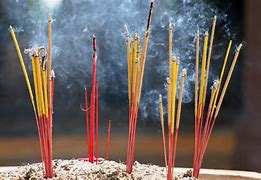

【V-T】   If you say that something _incenses_ you, you mean that it makes you extremely angry. 使大怒 +
⇒  This proposal will incense conservation campaigners.  这项提议将激怒自然保护的倡导者。   +

【ADJ】   被激怒的 +
⇒  Mom was incensed at his lack of compassion.  妈妈对他缺乏同情心非常愤怒。   +

---

==== ▸ intelligible  [626]   +
な/ɪnˈtɛlɪdʒəbəl/   +

【ADJ】   Something that is _intelligible_ can be understood. 容易理解的 +
⇒  The language of Darwin was intelligible to experts and non-experts alike.  达尔文的语言对专家和平常人来说都容易理解。   +

---

==== ▸ chew  [627]   +
な/tʃuː/   +

【V-T/V-I】   When you _chew_ food, you use your teeth to break it up in your mouth so that it becomes easier to swallow. 咀嚼 +
⇒  Be certain to eat slowly and chew your food extremely well.  一定要慢慢吃，特别细地咀嚼食物。   +
⇒  Daniel leaned back on the sofa, still chewing on his apple.  丹尼尔仰靠在沙发上，还在嚼着苹果。   +

【V-T】   If you _chew_ gum or tobacco, you keep biting it and moving it around your mouth to taste the flavour of it. You do not swallow it. 嚼 (口香糖、烟) +
⇒  One girl was chewing gum.  一个女孩在嚼口香糖。   +

【V-T】   If you _chew_ your lips or your fingernails, you keep biting them because you are nervous. 咬 (嘴唇、手指) +
⇒  He chewed his lower lip nervously.  他紧张地咬着下唇。   +

【V-T/V-I】   If a person or animal _chews_ an object or _chews on_ it, they bite it with their teeth. 咬 +
⇒  They pause and chew their pencils.  他们停了下来，咬着铅笔。   +
⇒  She chewed through the tape that bound her.  她咬断了捆绑她的带子。   +

---

==== ▸ crescent  [628]   +
な/ˈkrɛsənt/   +
--> 来源于拉丁语crescere(生长)的现在分词词干。 词根词缀： cresc(= -cret- )生长 + -ent形容词词尾 +

【N-COUNT】   A _crescent_ is a curved shape that is wider in the middle than at its ends, like the shape of the moon during its first and last quarters. It is the most important symbol of the Islamic faith. 新月 (伊斯兰教最重要的标志) +
⇒  A glittering Islamic crescent tops the mosque.  一个闪闪发光的伊斯兰新月标志立于该清真寺之顶。   +
⇒  ...a narrow crescent of sand dunes.  …一个狭长的新月形沙丘。   +

【N-IN-NAMES】  _Crescent_ is sometimes used as part of the name of a street or row of houses that is usually built in a curve. 新月街 (用于修成弧形的街道或房屋的地址单位) +
⇒  The address is 44 Colville Crescent.  地址是科尔维尔新月街44号。   +

---

==== ▸ populate  [629]   +
な/ˈpɒpjʊˌleɪt/   +
--> popul-,人，民众，-ate,使。引申词义居住，迁移等。 +

【V-T】   If an area _is populated by_ certain people or animals, those people or animals live there, often in large numbers. 聚居; 栖息 +
⇒  Before all this the island was populated by native American Arawaks.  在所有这一切之前，该岛聚居着土著美洲阿拉瓦克人。   +

【ADJ】   聚居了的; 栖息了的 +
⇒  The southeast is the most densely populated area.  东南部是最稠密的居住区。   +

【V-T】   To _populate_ an area means to cause people to live there. 使聚居 +
⇒  Successive regimes annexed the region and populated it with lowland people.  后继政权吞并了这个地区并让低地居民聚居于此。   +

---

==== ▸ chafe  [630]   +
な/tʃeɪf/   +
--> chafe = cha（热）+f（去做）+e（后缀）→（摩擦）产生热→摩擦 词源解释：cha←拉丁语calere（热）. cal, 热，见calorie, 卡路里 ；f←拉丁语facere（做） 相关词根：cal（热）；fac（做） +

【V-T/V-I】   If your skin _chafes_ or _is chafed_ by something, it becomes sore as a result of something rubbing against it. 擦痛; 蹭疼 +
⇒  My shorts were chafing my thighs.  我的短裤蹭得我大腿疼。   +
⇒  His wrists began to chafe against the cloth strips binding them.  他的手腕开始被绑着的布带子擦痛了。   +
⇒  The messenger bent and scratched at his knee where the strapping chafed.  信使弯身挠膝盖上被带子擦痛的地方。   +

【V-I】   If you _chafe at_ something such as a restriction, you feel annoyed about it. 恼火 +
⇒  He had chafed at having to take orders from another.  他对不得不接受别人命令很是恼火。   +
⇒  He was chafing under the company's new ownership.  他对公司新的所有制很是恼火。   +

---

==== ▸ humanitarian  [631]   +
な/hjuːˌmænɪˈtɛərɪən/   +

【ADJ】   If a person or society has _humanitarian_ ideas or behaviour, they try to avoid making people suffer or they help people who are suffering. 人道主义的 +
⇒  Air bombardment raised criticism on the humanitarian grounds that innocent civilians might suffer.  空袭遭到了非难，因为从人道主义的角度来看，无辜的平民可能会遭受伤害。   +

---

==== ▸ patient  [632]   +
な/ˈpeɪʃənt/   +
-->  -pati-痛苦 + -ent形容词词尾 +
来自拉丁语pati,忍受，承受，词源同passion,passive.-ent,现在分词后缀。即正在忍受的，正在遭受痛苦的，引申词义病人。 +

【N-COUNT】   A _patient_ is a person who is receiving medical treatment from a doctor or hospital. A _patient_ is also someone who is taken care of by a particular doctor. 病人 +
⇒  The earlier the treatment is given, the better the patient's chances.  治疗给得越早，病人机遇越好。   +
⇒  She was tough but wonderful with her patients.  她很严厉，但对病人很好。   +

【ADJ】   If you are _patient_, you stay calm and do not get annoyed, for example, when something takes a long time, or when someone is not doing what you want them to do. 耐心的 +
⇒  Please be patient – your cheque will arrive.  请耐心点儿–你的支票会到的。   +

【ADV】   耐心地 +
⇒  She waited patiently for Frances to finish.  她耐心地等弗朗西丝完成。   +

---

==== ▸ benevolent  [633]   +
な/bɪˈnɛvələnt/   +

【ADJ】   If you describe a person in authority as _benevolent_, you mean that they are kind and fair. 仁慈的 +
⇒  The company has proved to be a most benevolent employer.  结果证明该公司是一个非常仁慈的雇主。   +

【N-UNCOUNT】   仁慈 +
⇒  A bit of benevolence from people in power is not what we need.  来自当权者的一点点仁慈不是我们所需要的。   +

---

==== ▸ Neolithic  [634]   +
な/ˌniːəʊˈlɪθɪk/   +
--> neo-,新，-lith,石头，词源同lithosphere。+

【ADJ】  _Neolithic_ is used to describe things relating to the period when people had started farming but still used stone for making weapons and tools. 新石器时代的 +
⇒  ...neolithic culture.  ...新石器时代文化。   +
⇒  ...the monument was Stone Age or Neolithic.  ...该纪念碑是属于石器时代或新石器时代的。   +

.案例
====
.新石器时代 neolithic
旧石器是和采集一狩猎经济紧密联系的，而新石器则是和农业经济紧密相连的。大约从一万多年前开始，结束时间从距今5000多年至4000多年。 +
旧石器主要分为砍砸器、刮削器、尖状器三大类别，这些石器主要是在采集和狩猎活动中使用。然而，在新石器时代，这些旧石器逐渐消失，取而代之的是与农业生产密切相关的石斧、石刀、石铲三大类农具. 同时，陶器也伴随着这些新石器的出现而普及开来，这是旧石器时代所没有的。
====

---

==== ▸ elongate  [635]   +
な/ˈiːlɒŋɡeɪt/   +

【V-T/V-I】   If you _elongate_ something or if it _elongates_, you stretch it so that it becomes longer. (使)拉长; (使)延长 +
⇒  "Mom," she intoned, elongating the word.  “妈妈，”她拖长了声音，缓缓地说道。   +
⇒  In this exercise, the muscles are elongating rather than contracting.  在这项运动中，肌肉是在延伸而不是在收缩。   +

---

==== ▸ freight  [636]   +
な/freɪt/   +

【N-UNCOUNT】  _Freight_ is the movement of goods by trucks, trains, ships, or aeroplanes. 货运 +
⇒  France derives 16% of revenue from air freight.  法国国家税收的16%来自于航空货运。   +

【N-UNCOUNT】  _Freight_ is goods that are transported by trucks, trains, ships, or aeroplanes. 货物 +
⇒  ...26 tons of freight.  …26吨货物。   +

---

==== ▸ mortality  [637]   +
な/mɔːˈtælɪtɪ/   +

【N-UNCOUNT】   The _mortality_ in a particular place or situation is the number of people who die. 死亡人数 +
⇒  The nation's infant mortality rate has reached a record low.  该国的婴儿死亡率已达历史最低。   +

---

==== ▸ carbohydrate  [638]   +
な/ˌkɑːbəʊˈhaɪdreɪt/   +

【N-VAR】  _Carbohydrates_ are substances, found in certain kinds of food, that provide you with energy. Foods such as sugar and bread that contain these substances can also be referred to as _carbohydrates_. (为身体提供热量的) 碳水化合物; 含碳水化合物的食物 +
⇒  ...carbohydrates such as bread, pasta, or potatoes.  …含碳水化合物的食物，如面包、意大利面或马铃薯。   +

---

==== ▸ weathering  [639]   +
な/ˈwɛðərɪŋ/   +
--> 来自 weather,天气，风化，经受。+

【N】   the mechanical and chemical breakdown of rocks by the action of rain, snow, cold, etc 风化; 侵蚀 +

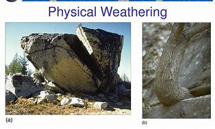

---

==== ▸ review  [640]   +
な/rɪˈvjuː/   +

【N-COUNT】   A _review of_ a situation or system is its formal examination by people in authority. This is usually done in order to see whether it can be improved or corrected. (上级的) 审查 +
⇒  The president ordered a review of U.S. economic aid to Jordan.  总统下令对美国向约旦提供的经济援助进行一次审查。   +

【V-T】   If you _review_ a situation or system, you consider it carefully to see what is wrong with it or how it could be improved. 审裁; 审度 +
⇒  The president reviewed the situation with his cabinet yesterday.  总统昨天与他的内阁成员审度了局势。   +

【N-COUNT】   A _review_ is a report in the media in which someone gives their opinion of something such as a new book or movie. 评论 +
⇒  We've never had a good review in the music press.  我们在音乐媒体内未曾得到过好评。   +

【V-T】   If someone _reviews_ something such as a new book or movie, they write a report or give a talk on television or radio in which they express their opinion of it. 对 (新作品) 作评论 +
⇒  Richard Coles reviews all the latest video releases.  理查德•科尔斯对最近发行的所有录像做了评论。   +

【V-T/V-I】   When you _review for_ an examination, you read things again and make notes in order to be prepared for the examination. 复习 +
【N-COUNT】  _Review_ is also a noun. 复习   +
⇒  If you have to cover 12 chapters in American history, begin by planning on three two-hour reviews with four chapters per session.  如果你必须涵盖美国史的12个章节，首先计划3次2小时的复习，每次4章。   +

---

==== ▸ centigrade  [641]   +
な/ˈsɛntɪˌɡreɪd/   +

【ADJ】  _Centigrade_ is a scale for measuring temperature, in which water freezes at 0 degrees and boils at 100 degrees. It is represented by the symbol °C. 摄氏的 (简写为C) +
⇒  ...daytime temperatures of up to forty degrees centigrade.  …高达40摄氏度的日间气温。   +

【N-UNCOUNT】  _Centigrade_ is also a noun. 摄氏 +
⇒  The number at the bottom is the recommended water temperature in centigrade.  底部的数字为建议性摄氏度水温。   +

---

==== ▸ sensory  [642]   +
な/ˈsɛnsərɪ/   +

【ADJ】  _Sensory_ means relating to the physical senses. 感官的; 感觉的 +
⇒  Almost all sensory information from the trunk and limbs passes through the spinal cord.  几乎所有来自躯干及四肢的感官信息都经由脊髓传递。   +

---

==== ▸ defer  [643]   +
な/dɪˈfɜː/   +
--> de-, 分开，散开。-fer, 拿，带，词源同bring, infer. 即分散开，引申义推迟，延迟。 +

【V-T】   If you _defer_ an event or action, you arrange for it to happen at a later date, rather than immediately or at the previously planned time. 推迟 +
⇒  Customers often defer payment for as long as possible.  顾客们经常尽可能地推迟付款。   +

【V-I】   If you _defer to_ someone, you accept their opinion or do what they want you to do, even when you do not agree with it yourself, because you respect them or their authority. 听从; 服从 +
⇒  Doctors are encouraged to defer to experts.  鼓励医生们听从专家的意见。   +

---

==== ▸ sustenance  [644]   +
な/ˈsʌstənəns/   +

【N-UNCOUNT】  _Sustenance_ is food or drink which a person, animal, or plant needs to remain alive and healthy. 食物 +
⇒  The state provided a basic quantity of food for daily sustenance, but little else.  国家提供基本的日常食物供应，仅此而已。   +

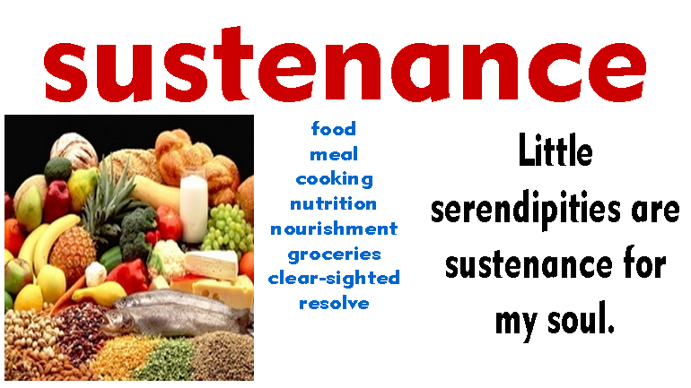

.案例
====
chatGpt: +
"Sustenance" 和 "food" 都涉及到食物和营养，但它们有一些不同之处：

定义： +
"Sustenance" 指的是满足基本的生存需求的食物、饮料或其他资源，以维持生命和健康。这个词更强调食物或资源的功能，即提供生存所需的能量和营养。 +
"Food" 是指可供食用的物质，通常涉及到特定种类的食品，有时强调味道、美味和烹饪的方面。食物通常与文化、美食和烹饪密切相关。 +

范围： +
*"Sustenance" 可以包括任何满足生存需求的东西，不仅限于食物，还包括饮水、庇护、温暖等。它强调的是生存和维持生命的方面。* +
**"Food" 是一种特定的食品，**是为了满足口腹之欲、提供美味和营养而制备的。 +

强调： +
*"Sustenance" 更强调生存和基本需求的层面，通常不强调食物的美味或满足口腹之欲。* +
"Food" 强调了美食、文化和社交的方面，人们常常把食物视为享受和社交交流的一部分。 +

总之，"sustenance" 强调生存和维持生命的需求，可以包括任何满足这些需求的资源，而 "food" 强调可食用的物质，通常与美味和社交有关。然而，这两个词汇在不同上下文中可能会有交叠，具体含义可能会有所不同。 +
====

---

==== ▸ alchemist  [645]   +
な/ˈælkəmɪst/   +
--> 来自阿拉伯语al-kimya，而阿拉伯人又是借自希腊语。在阿拉伯语中，al-相当于英语的the，而chemy的本义就是“炼金术”。西方16世纪前，化学领域研究的主要方向就是尝试用不同的方法把普通金属冶炼成金子，后随着化学的发展衍生出chemistry专指“化学” +

【N-COUNT】   An _alchemist_ was a scientist in the Middle Ages who tried to discover how to change ordinary metals into gold. 炼金术士 +

---

==== ▸ doodle  [646]   +
な/ˈduːdəl/   +
--> 可能来自dawdle, 游荡，闲逛，引申词义乱涂乱抹。 +

【N-COUNT】   A _doodle_ is a pattern or picture that you draw when you are bored or thinking about something else. 信手涂鸦之物 +
⇒  Dillworthy was staring into space, with a scrawl of doodles on the pad in front of him.  迪尔沃西凝望着天空，面前的纸上满是涂鸦。   +

【V-I】   When someone _doodles_, they draw doodles. 信手涂鸦 +
⇒  He looked across at Jackson, doodling on his notebook.  他一边看着对面的杰克逊，一边在笔记本上信手涂鸦。   +

---

==== ▸ dedication  [647]   +
な/ˌdɛdɪˈkeɪʃən/   +
-->  de-加强意义 + -dic-说,讲 + -ation名词词尾 +

【N-COUNT】   A _dedication_ is a message which is written at the beginning of a book, or a short announcement which is sometimes made before a play or piece of music is performed, as a sign of affection or respect for someone. 献辞 +

(n.)[ U] ~ (to sth)( approving) the hard work and effort that sb puts into an activity or purpose because they think it is important 献身；奉献 +

---

==== ▸ abundant  [648]   +
な/əˈbʌndənt/   +

【ADJ】   Something that is _abundant_ is present in large quantities. 丰富的 +
⇒  There is an abundant supply of cheap labour.  有丰富的廉价劳动力供应。   +

---

==== ▸ puritanical  [649]   +
な/ˌpjʊərɪˈtænɪkəl/   +

【ADJ】   If you describe someone as _puritanical_, you mean that they have very strict moral principles, and often try to make other people behave in a more moral way. 有严格道德原则的; 清教徒式的 +
⇒  He has a puritanical attitude toward sex.  他对性持严格刻板的态度。   +

---

==== ▸ semiotics  [650]   +
な/ˌsɛmɪˈɒtɪks, ˈsɛmiː-/   +
--> sem-,符号，词源同 semantic,-otic,形容词后缀。 +

【N-UNCOUNT】  _Semiotics_ is the academic study of the relationship of language and other signs to their meanings. 符号学 +

---

==== ▸ spaghetti  [651]   +
な/spəˈɡɛtɪ/   +
--> 来自意大利语 spaghetti,复数形式于 spaghetto,小词形式于 spago,线，绳子。引申词义细面条。 +

【N-UNCOUNT】  _Spaghetti_ is a type of pasta. It looks like long pieces of string and is usually served with a sauce. 意大利式细面条 +

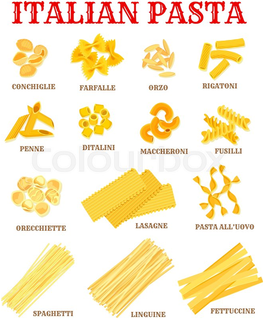

---

==== ▸ stimulus  [652]   +
な/ˈstɪmjʊləs/   +

【N-VAR】   A _stimulus_ is something that encourages activity in people or things. 刺激物 +
⇒  Interest rates could fall soon and be a stimulus to the U.S. economy.  利率可能很快会下降，从而刺激美国经济。   +

---

==== ▸ errand  [653]   +
な/ˈɛrənd/   +
--> 来自PIE*ei, 走，离开。其现在分词ion, 过去分词it, 词源同exit, itinerary, 该词来自其拉丁语现在主动不完全格ire. +

【N-COUNT】   An _errand_ is a short trip that you make in order to do a job, for example, when you go to a shop to buy something. (短程) 差使 +
⇒  She went off on some errand.  她出去办事了。   +

【PHRASE】   If you _run an errand for_ someone, you do or get something for them, usually by making a short trip somewhere. 跑腿 +
⇒  Run an errand for me, will you? Go find Roger for me.  替我跑跑腿好吗？帮我去找一下罗杰。   +

---

==== ▸ instruction  [654]   +
な/ɪnˈstrʌkʃən/   +

【N-COUNT】   An _instruction_ is something that someone tells you to do. 指示 +
⇒  Two lawyers were told not to leave the building but no reason for this instruction was given.  两位律师被告知不要离开这座建筑，但没被告知这一指示的原因。   +

【N-UNCOUNT】   If someone gives you _instruction_ in a subject or skill, they teach it to you. 讲授; 指导 +
⇒  Each candidate is given instruction in safety.  每位候选人都被给予了安全指导。   +

【N-PLURAL】  _Instructions_ are clear and detailed information on how to do something. 用法说明 +
⇒  This book gives instructions for making a wide range of skin and hand creams.  这本书给出了多种护肤霜和护手霜的制作说明。   +

---

==== ▸ engaging  [655]   +
な/ɪnˈɡeɪdʒɪŋ/   +

【ADJ】   An _engaging_ person or thing is pleasant, interesting, and entertaining. 迷人的 +
⇒  ...one of her most engaging and least known novels.  …她最迷人却最鲜为人知的小说之一。   +

---

==== ▸ gregarious  [656]   +
な/ɡrɪˈɡɛərɪəs/   +
-->  -greg-群,聚集 + -ar名词词尾 + -i- + -ous形容词词尾 +

【ADJ】   Someone who is _gregarious_ enjoys being with other people. 爱社交的 +
⇒  She is such a gregarious and outgoing person.  她就是这样一个爱社交而且外向的人。   +

【ADJ】  _Gregarious_ animals or birds normally live in large groups. 群居的 +
⇒  Snow geese are very gregarious birds.  雪雁是种群居的鸟类。   +

---

==== ▸ embody  [657]   +
な/ɪmˈbɒdɪ/   +
--> em-, 进入，使。body, 身体，具象。 +

【V-T】   To _embody_ an idea or quality means to be a symbol or expression of that idea or quality. 体现; 具体象征 +
⇒  Jack Kennedy embodied all the hopes of the 1960s.  杰克•肯尼迪体现了20世纪60年代的全部希望。   +
⇒  For twenty-nine years, Checkpoint Charlie embodied the Cold War.  29年来，查理检查站具体象征了冷战。   +

【V-T】   If something _is embodied in_ a particular thing, the second thing contains or consists of the first. 包含; 收录 +
⇒  The proposal has been embodied in a draft resolution.  这项提议已经被包含在一份决议草案中。   +

---

==== ▸ derive  [658]   +
な/dɪˈraɪv/   +
--> de-, 从，向下，离开。-riv, 流动，词源同run, rivulet. 原指从源头处流下，引申义衍生于。 +

【V-T】   If you _derive_ something such as pleasure or benefit _from_ a person or from something, you get it from them. 获得 +
⇒  Mr. Ying is one of those happy people who derive pleasure from helping others.  英先生是那种助人为乐的快活人。   +

【V-T/V-I】   If you say that something such as a word or feeling _derives_ or _is derived from_ something else, you mean that it comes from that thing. 衍生 +
⇒  The name Anastasia is derived from a Greek word meaning "of the resurrection."  阿纳斯塔西娅这个名字是从一个意为“复活”的希腊词语衍生而来的。   +

---

==== ▸ championship  [659]   +
な/ˈtʃæmpɪənˌʃɪp/   +

【N-COUNT】   A _championship_ is a competition to find the best player or team in a particular sport. 锦标赛 +
⇒  ...the world chess championship.  …世界国际象棋锦标赛。   +

【N-SING】  _The championship_ refers to the title or status of being a sports champion. 冠军称号 +
⇒  He went on to take the championship.  他继续卫冕了冠军称号。   +

---

==== ▸ protein  [660]   +
な/ˈprəʊtiːn/   +

【N-MASS】  _Protein_ is a substance found in food and drink such as meat, eggs, and milk. You need protein in order to grow and be healthy. 蛋白质 +
⇒  Fish was a major source of protein for the working man.  鱼曾是劳动者获取蛋白质的主要来源。   +

---

==== ▸ observe  [661]   +
な/əbˈzɜːv/   +

【V-T】   If you _observe_ a person or thing, you watch them carefully, especially in order to learn something about them. 观察 +
⇒  Olson also studies and observes the behaviour of babies.  奥尔森还研究并观察婴儿的行为。   +
⇒  Are there any classes I could observe?  有我可以观摩的课吗？   +

【V-T】   If you _observe_ someone or something, you see or notice them. 观察到 +
⇒  In 1664 Hooke observed a reddish spot on the surface of the planet.  1664年，胡克观察到了那颗行星表面的一个微红的斑点。   +

【V-T】   If you _observe_ that something is the case, you make a remark or comment about it, especially when it is something you have noticed and thought about a lot. 评述 +
⇒  We observe that the first calls for radical transformation did not begin until the period of the industrial revolution.  我们认为，首次要求彻底改革的呼声直到工业革命时期才出现。   +

【V-T】   If you _observe_ something such as a law or custom, you obey it or follow it. 遵从 +
⇒  Imposing speed restrictions is easy, but forcing drivers to observe them is trickier.  实行速度限制容易，而迫使司机遵守较难。   +
⇒  The army was observing a ceasefire.  军队当时在遵守一项停火协议。   +

【V-T】   If you _observe_ an important day such as a holiday or anniversary, you do something special in order to honour or celebrate it. 庆祝 +
⇒  ...where he will observe Thanksgiving with family members.  …在那里他将与家人一起庆祝感恩节。   +

---

==== ▸ nonverbal  [662]   +
な/nɒnˈvɜːbəl/   +

【ADJ】  _Nonverbal_ communication consists of things such as the expression on your face, your arm movements, or your tone of voice, which show how you feel about something without using words. 不用语言表达的 +

---

==== ▸ criss-cross  [663]   +
な/ˈkrɪsˌkrɒs/   +

【V-T】   If a person or thing _criss-crosses_ an area, they travel from one side to the other and back again many times, following different routes. If a number of things _criss-cross_ an area, they cross it, and cross over each other. 交叉往返 +
⇒  They criss-crossed the country by bus.  他们乘坐公共汽车在乡间交叉往返。   +

【V-RECIP】   If two sets of lines or things _criss-cross_, they cross over each other. 十字交叉的 +
⇒  Wires criss-cross between the tops of the poles, forming a grid.  电线在杆顶间交叉成网状。   +

【ADJ】   A _criss-cross_ pattern or design consists of lines crossing each other. 交错的 +
⇒  Slash the tops of the loaves with a serrated knife in a criss-cross pattern.  用一把锯齿刀把面包顶部切成十字交叉状。   +

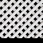

---

==== ▸ clamour  [664]   +
な【V-I】   If people _are clamouring for_ something, they are demanding it in a noisy or angry way. 强烈要求   +
⇒  ...competing parties clamouring for the attention of the voter.  …竞争党派大声疾呼以吸引选民的关注。   +

---

==== ▸ tenuous  [665]   +
な/ˈtɛnjʊəs/   +
--> 来自拉丁语 tenuis,拉长的，薄的，细的，来自 PIE*ten,展开，词源同 extend,thin,attenuate.引 申词义纤细的，脆弱的等。 +

【ADJ】   If you describe something such as a connection, a reason, or someone's position as _tenuous_, you mean that it is very uncertain or weak. 脆弱的 +
⇒  He did not speculate on the future of his tenuous career.  他没有考虑到自己不稳定的职业前景。   +

---

==== ▸ epitomize  [666]   +
な/ɪˈpɪtəˌmaɪz/   +
--> epi-, 在上，在中。-tome, 砍，切，词源同tome, anatomy. 即切下来作为典范的。 +

【V-T】   If you say that something or someone _epitomizes_ a particular thing, you mean that they are a perfect example of it. 为…的典型; 为…的代表 +
⇒  Seafood is a regional speciality epitomized by Captain Anderson's Restaurant.  海鲜是个当地特色，安德森船长餐厅是其典型代表。   +

---

==== ▸ wreck  [667]   +
な/rɛk/   +

【V-T】   To _wreck_ something means to completely destroy or ruin it. 摧毁 +
⇒  He wrecked the garden.  他毁掉了那个花园。   +
⇒  His life has been wrecked by the tragedy.  他的生活被这场悲剧毁了。   +

【N-COUNT】   A _wreck_ is something such as a ship, car, plane, or building that has been destroyed, usually in an accident. (轮船、汽车、飞机或房屋失事后的) 残骸 +
⇒  ...the wreck of a sailing ship.  …一艘帆船的残骸。   +
⇒  The car was a total wreck.  这辆车完全报废了。   +

【N-COUNT】   A _wreck_ is an accident in which a moving vehicle hits something and is damaged or destroyed. 撞车事故 +
⇒  He was killed in a car wreck.  他在一场车祸中丧生。   +

【N-COUNT】   If you say that someone is a _wreck_, you mean that they are very exhausted or unhealthy. 疲惫不堪的人; 不健康的人 +
⇒  You look a wreck.  你看起来极度疲惫。   +

---

==== ▸ diversity  [668]   +
な/daɪˈvɜːsɪtɪ/   +

【N-VAR】   The _diversity_ of something is the fact that it contains many very different elements. 多样性 +
⇒  ...the cultural diversity of Latin America.  …拉丁美洲文化的多样性。   +

【N-SING】   A _diversity of_ things is a range of things which are very different from each other. 各种各样 +
⇒  Forslan's object is to gather as great a diversity of genetic material as possible.  福斯兰的目标是尽可能收集各种不同的基因物质。   +

---

==== ▸ alphabet  [669]   +
な/ˈælfəˌbɛt, -bɪt/   +

【N-COUNT】   An _alphabet_ is a set of letters usually presented in a fixed order which is used for writing the words of a particular language or group of languages. 字母表 +
⇒  The modern Russian alphabet has 31 letters.  现代俄语字母表有31个字母。   +

---

==== ▸ hardware  [670]   +
な/ˈhɑːdˌwɛə/   +

【N-UNCOUNT】   In computer systems, _hardware_ refers to the machines themselves as opposed to the programs which tell the machines what to do. Compare . 硬件 +
⇒  To be totally secure, you need a piece of hardware that costs about $200.  为保证绝对安全，你需要一个花费约为两百美元的硬件。   +

【N-UNCOUNT】   Military _hardware_ is the machinery and equipment that is used by the armed forces, such as tanks, aircraft, and missiles. 装备 +
⇒  ...the billions which are spent on military hardware.  …花费在军事装备上的数十亿。   +

【N-UNCOUNT】  _Hardware_ refers to tools and equipment that are used in the home and garden, for example nuts and bolts, screwdrivers, and hinges. 五金器具 +
⇒  ...a shop from which an uncle had sold hardware and timber.  …一家叔叔曾经在那里卖五金器具和木材的店铺。   +

---

==== ▸ enterprise  [671]   +
な/ˈɛntəˌpraɪz/   +

【N-COUNT】   An _enterprise_ is a company or business. 公司; 企业 +
⇒  There are plenty of small industrial enterprises.  有很多小型的工业企业。   +

【N-COUNT】   An _enterprise_ is something new, difficult, or important that you do or try to do. 事业 +
⇒  Horse breeding is indeed a risky enterprise.  养马的确是一项有风险的事业。   +

【N-UNCOUNT】  _Enterprise_ is the activity of managing companies and businesses and starting new ones. 创业 +
⇒  He is still involved in voluntary work promoting local enterprise.  他仍从事志愿工作推动当地创业。   +

【N-UNCOUNT】  _Enterprise_ is the ability to think of new and effective things to do, together with an eagerness to do them. 开创力; 开拓精神 +
⇒  ...the spirit of enterprise worthy of a free and industrious people.  …与一个自由勤劳的民族相称的开拓精神。   +

---

==== ▸ nomadic  [672]   +
な/nəʊˈmædɪk/   +
--> 来自希腊语nomos,牧场，放牧，来自PIE*nem,分配，分开，词源同number,nemesis.用于指分配的草地，游牧，游牧民族。 +

【ADJ】  _Nomadic_ people travel from place to place rather than living in one place all the time. 游牧的 +
⇒  ...the great nomadic tribes of the Western Sahara.  …西撒哈拉的大游牧部落。   +

【ADJ】   If someone has a _nomadic_ way of life, they travel from place to place and do not have a settled home. 流浪的 +
⇒  The daughter of a railway engineer, she at first had a somewhat nomadic childhood.  一名铁路工程师的女儿，她起初有过一个流浪般的童年。   +

---

==== ▸ pore  [673]   +
な/pɔː/   +

【N-COUNT】   Your _pores_ are the tiny holes in your skin. 毛孔 +
⇒  The size of your pores is determined by the amount of oil they produce.  毛孔的大小取决于毛孔分泌油脂的多少。   +

【V-I】   If you _pore over_ or _through_ information, you look at it and study it very carefully. 仔细研究 +
⇒  We spent hours poring over travel brochures.  我们花了几个小时仔细研究旅游宣传册。   +

---

==== ▸ synthetic  [674]   +
な/sɪnˈθɛtɪk/   +
--> syn-共同,同时 + thesis放置(sis略) + -tic形容词词尾 同源词：thesis +

【ADJ】  _Synthetic_ products are made from chemicals or artificial substances rather than from natural ones. 合成的 +
⇒  Boots made from synthetic materials can usually be washed in a machine.  用合成材料做成的靴子通常可以在机器里洗。   +

---

==== ▸ desperate  [675]   +
な/ˈdɛspərɪt/   +

【ADJ】   If you are _desperate_, you are in such a bad situation that you are willing to try anything to change it. 不顾一切的 +
⇒  Troops are needed to help get food into Kosovo where people are in desperate need.  需要军队协助将食物运进科索沃，那里的人们迫切需要食物。   +

【ADV】   不顾一切地 +
⇒  Thousands are desperately trying to leave their battered homes and villages.  成千上万的人们正不顾一切地试图逃离他们满目疮痍的家园和村庄。   +

【ADJ】   If you are _desperate for_ something or _desperate to_ do something, you want or need it very much indeed. 极度渴望的 +
⇒  They'd been married nearly four years and June was desperate to start a family.  他们结婚快4年了，琼非常想生个孩子。   +

【ADV】   极其 +
⇒  He was a boy who desperately needed affection.  他是个极度需要关爱的孩子。   +

【ADJ】   A _desperate_ situation is very difficult, serious, or dangerous. 危急的 +
⇒  India's United Nations ambassador said the situation is desperate.  印度驻联合国大使说局势危急。   +

---

==== ▸ nucleus  [676]   +
な/ˈnjuːklɪəs/   +

【N-COUNT】   The _nucleus_ of an atom or cell is the central part of it. (原子或细胞) 核 +
⇒  Neutrons and protons are bound together in the nucleus of an atom.  在一个原子的核内，中子和质子聚合在一起。   +

【N-COUNT】  _The__nucleus__of_ a group of people or things is the small number of members which form the most important part of the group. 核心 +
⇒  Matt Cummings and Liko Soules-Ono form the nucleus of the team.  马特·卡明斯和莱克·索尔斯-奥诺形成了这个团队的核心。   +

---

==== ▸ renown  [677]   +
な/rɪˈnaʊn/   +

【N-UNCOUNT】   A person _of renown_ is well known, usually because they do or have done something good. 名望; 声誉 +
⇒  She used to be a singer of some renown.  她过去是个小有名气的歌手。   +

---

==== ▸ persuasive  [678]   +
な/pəˈsweɪsɪv/   +

【ADJ】   Someone or something that is _persuasive_ is likely to persuade a person to believe or do a particular thing. 有说服力的 +
⇒  What do you think were some of the more persuasive arguments on the other side?  你觉得对方哪些论点更有说服力？   +
⇒  I can be very persuasive when I want to be.  当我想要的时候，我会很有说服力的。   +

【ADV】   有说服力地 +
⇒  ...a trained lawyer who can present arguments persuasively.  …一位训练有素、能令人信服地陈述辩词的律师。   +

---

==== ▸ ageism  [679]   +
な/ˈeɪdʒɪzəm/   +

【N-UNCOUNT】  _Ageism_ is unacceptable behaviour that occurs as a result of the belief that older people are of less value than younger people. 老年歧视 +

---

==== ▸ rhythm  [680]   +
な/ˈrɪðəm/   +

【N-VAR】   A _rhythm_ is a regular series of sounds or movements. 节奏 +
⇒  His music of that period fused the rhythms of Jazz with classical forms.  他那段时期的音乐融合了爵士乐的节奏和古典音乐的形式。   +

【N-COUNT】   A _rhythm_ is a regular pattern of changes, for example changes in your body, in the seasons, or in the tides. (身体、季节等的) 规律性变化 +
⇒  Begin to listen to your own body rhythms.  开始聆听你自己身体的规律性变化。   +

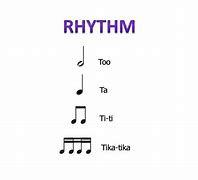

---

==== ▸ twig  [681]   +
な/twɪɡ/   +

【N-COUNT】   A _twig_ is a very small thin branch that grows out from a main branch of a tree or bush. 细枝 +
⇒  There is the bird, sitting on a twig halfway up the tree.  鸟儿在那里，栖息在树中段的一根细枝上。   +

【V】   to understand (something) 理解 +
【V】   to find out or suddenly comprehend (something) 发现; 顿悟   +
⇒  he hasn't twigged yet     +

---

==== ▸ banner  [682]   +
な/ˈbænə/   +

【N-COUNT】   A _banner_ is a long strip of cloth with something written on it. Banners are usually attached to two poles and carried during a protest or rally. (游行或集合用的) 横幅 +
⇒  A large crowd of students followed the coffin, carrying banners and shouting slogans denouncing the government.  一大群学生跟在灵柩的后面，举着横幅，高喊口号谴责政府。   +

【PHRASE】   If someone does something _under the banner of_ a particular cause, idea, or belief, they do it saying that they support that cause, idea, or belief. 在…旗帜下; 在…名义下 +
⇒  Russia was the first country to forge a new economic system under the banner of Marxism.  苏联是第一个在马克思主义的旗帜下建立新的经济体制的国家。   +

---

==== ▸ current  [683]   +
な/ˈkʌrənt/   +

【N-COUNT】   A _current_ is a steady and continuous flowing movement of some of the water in a river, lake, or ocean. 水流 +
⇒  Under normal conditions, the ocean currents of the tropical Pacific travel from east to west.  在正常情况下，太平洋热带洋流自东流向西。   +

【N-COUNT】   A _current_ is a steady flowing movement of air. 气流 +
⇒  I felt a current of cool air blowing in my face.  我感到一股凉气吹在脸上。   +

【N-COUNT】   An electric _current_ is a flow of electricity through a wire or circuit. 电流 +
⇒  A powerful electric current is passed through a piece of graphite.  一股强大的电流被传导经过一块石墨。   +

【N-COUNT】   A particular _current_ is a particular feeling, idea, or quality that exists within a group of people. 倾向 +
⇒  Each party represents a distinct current of thought.  每个党派都代表一种独特的思想倾向。   +

【ADJ】  _Current_ means happening, being used, or being done at the present time. 当前的 +
⇒  The current situation is very different to that in 1990.  当前的形势与1990年大不相同。   +

【ADV】   目前 +
⇒  Twelve potential vaccines are currently being tested on human volunteers.  12种潜在疫苗目前正在人体志愿者身上测试。   +

【ADJ】   Ideas and customs that are _current_ are generally accepted and used by most people. 流行的 +
⇒  Current thinking suggests that toxins only have a small part to play in the build-up of cellulite.  流行的观点认为毒素只对脂肪团形成起很小的作用。   +

---

==== ▸ converge  [684]   +
な/kənˈvɜːdʒ/   +

【V-I】   If people or vehicles _converge on_ a place, they move toward it from different directions. (人或车辆等) 聚集 +
⇒  Hundreds of tractors will converge on the capital.  成百上千的拖拉机将向首都聚集。   +

【V-I】   If roads or lines _converge_, they meet or join at a particular place. (道路、江河等) 会合 +
⇒  As they flow south, the five rivers converge.  这5条河向南流，最终汇合在一起。   +

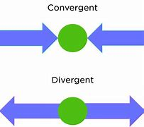

---

==== ▸ admit  [685]   +
な/ədˈmɪt/   +

【V-T/V-I】   If you _admit_ that something bad, unpleasant, or embarrassing is true, you agree, often unwillingly, that it is true. 承认 (不好、不快或尴尬的事实) +
⇒  I am willing to admit that I do make mistakes.  我愿意承认我确实会犯错误。   +
⇒  Up to two thirds of 14 to 16 year olds admit to buying alcohol illegally.  14至16岁的少年中有多达2/3的少年承认非法买过酒。   +
⇒  None of these people will admit responsibility for their actions.  这些人中没有人原意承认为他们的行为负有的责任。   +

【V-T】   If someone _is admitted to_ a hospital, they are taken into the hospital for treatment and kept there until they are well enough to go home. 接收 (入院) +
⇒  She was admitted to the hospital with a soaring temperature.  她因高烧被接收入院。   +

【V-T】   If someone _is admitted to_ an organization or group, they are allowed to join it. 接收 (加入) +
⇒  He was admitted to the Académie Culinaire de France.  他被接收加入法国厨艺学会。   +

【V-T】   To _admit_ someone _to_ a place means to allow them to enter it. 准许进入 +
⇒  Embassy security personnel refused to admit him or his wife.  使馆保安人员拒绝让他或他的妻子进入。   +

---

==== ▸ framework  [686]   +
な/ˈfreɪmˌwɜːk/   +

【N-COUNT】   A _framework_ is a particular set of rules, ideas, or beliefs which you use in order to deal with problems or to decide what to do. 体系 +
⇒  ...within the framework of federal regulations.  …在联邦法规的体系内。   +

【N-COUNT】   A _framework_ is a structure that forms a support or frame for something. 构架 +
⇒  ...wooden shelves on a steel framework.  …在钢架上的木搁板。   +

---

==== ▸ unaided  [687]   +
な/ʌnˈeɪdɪd/   +

【ADJ】   If you do something _unaided_, you do it without help from anyone or anything else. 独立的 +
⇒  There have been at least thirteen previous attempts to reach the North Pole unaided.  以前至少有十三次尝试独立到达南极的努力。   +

---

==== ▸ pivot  [688]   +
な/ˈpɪvət/   +
-->  来自古法语pivot,绞链，门合页。引申词义中心，枢轴，核心等。 +

【N-COUNT】  _The pivot_ in a situation is the most important thing that everything else is based on or arranged around. 中心点 +
⇒  Forming the pivot of the exhibition is a large group of watercolours.  构成这个展览核心的是一大批水彩画。   +

【V-I】   If something or someone _pivots_, they balance or turn on a central point. 绕支点运动 +
⇒  The wheels pivot for easy manoeuvring.  这些轮子绕轴转动，以方便操控。   +
⇒  He pivoted on his heels and walked on down the hall.  他以脚跟着地转身，沿着走廊走去。   +

【N-COUNT】   A _pivot_ is the pin or the central point on which something balances or turns. 枢轴; 支点 +
⇒  The pedal had sheared off at the pivot.  这个踏板已经在轴处断裂。   +

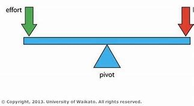
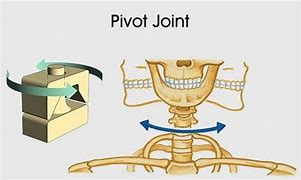

---

==== ▸ gossip  [689]   +
な/ˈɡɒsɪp/   +
--> gos, 来自god, 上帝。sip, 姐妹，词源同sibling, sister. 即上帝的姐妹，通常指妇女们聚在一起闲聊，闲侃，引申词义流言蜚语。 +

【N-UNCOUNT】  _Gossip_ is informal conversation, often about other people's private affairs. (说别人的) 闲话 +
⇒  He spent the first hour talking gossip.  他头一个小时尽在说人闲话。   +
⇒  There has been much gossip about the possible reasons for his absence.  关于他缺席的原因已经有多种传闻。   +

【V-RECIP】   If you _gossip with_ someone, you talk informally, especially about other people or local events. You can also say that two people _gossip_. 闲聊 +
⇒  We spoke, debated, gossiped into the night.  我们交谈、争论、闲聊到夜间。   +
⇒  Eva gossiped with Sarah.  伊娃与萨拉闲聊。   +

【N-COUNT】   If you describe someone as a _gossip_, you mean that they enjoy talking informally to people about the private affairs of others. 爱讲人闲话的人 +
⇒  He was a vicious gossip.  他是个可恶的饶舌者。   +

---

==== ▸ worship  [690]   +
な/ˈwɜːʃɪp/   +
--> 缩写自古英语 worthscip,高贵，荣耀，名声，来自 worth,价值，力量，-scip,词源同-ship,抽象 名词后缀。后引申词义对神灵或超自然现象的尊敬，崇拜。 +

【V-T/V-I】   If you _worship_ a god, you show your respect to the god, for example, by saying prayers. 敬奉 +
⇒  ..disputes over ways of life and ways of worshipping God.  …一些在生活方式和敬奉上帝方式上的争论。   +
⇒  He prefers to worship in his own home.  他更喜欢在自己的家里敬奉神明。   +

【N-UNCOUNT】  _Worship_ is also a noun. 敬奉 +
⇒  ...the worship of the ancient Roman gods.  …对古罗马众神的敬奉。   +

【N-COUNT】   敬神者 +
⇒  She burst into tears and loud sobs that disturbed the other worshippers.  她突然哭起来，大声抽噎，干扰了其他拜神者。   +

【V-T】   If you _worship_ someone or something, you love them or admire them very much. 爱慕 +
⇒  She had worshipped him for years.  她爱慕他已有好多年了。   +

---

==== ▸ federal  [691]   +
な/ˈfɛdərəl/   +
--> 它由词根fed和两个后缀er和al构成。词根fed表“相信”，如同根词confident（自信的）里的fid也是“相信”。组成联盟的各方要相互信任，否则联盟会形同散沙。FBI：Federal Bureau of Investigation（美国联邦调查局）。 +

【ADJ】   A _federal_ country or system of government is one in which the different states or provinces of the country have important powers to make their own laws and decisions. 联邦制的 +
⇒  Five of the six provinces are to become autonomous regions in a new federal system of government.  在新的联邦政府体制下，6个省中的5个将成为自治区。   +

【ADJ】  _Federal_ also means belonging or relating to the national government of a federal country rather than to one of the states within it. 联邦政府的 +
⇒  The federal government controls just 6% of the education budget.  联邦政府只掌控教育预算的6％。   +

【ADV】   联邦政府地 +
⇒  ...residents of public housing and federally subsidized apartments.  …公共住房的住户和享受联邦政府补贴的公寓住户。   +

---

==== ▸ hypocritical  [692]   +
な/ˌhɪpəˈkrɪtɪkəl/   +

【ADJ】   If you accuse someone of being _hypocritical_, you mean that they pretend to have qualities, beliefs, or feelings that they do not really have. 虚伪的 +
⇒  It would be hypocritical to say I travel at 70 mph simply because that is the law.  如果仅仅因为法律规定的时速是70英里我就说自己的行驶时速是70英里，那就太虚伪了。   +

---

==== ▸ lower  [693]   +
な/ˈləʊə/   +

【ADJ】   You can use _lower_ to refer to the bottom one of a pair of things. (一对物品中) 下面的 +
⇒  She bit her lower lip.  她咬着下唇。   +
⇒  ...the lower of the two holes.  …两个洞中下面的那个。   +

【ADJ】   You can use _lower_ to refer to the bottom part of something. 底部的 +
⇒  Use a small cushion to help give support to the lower back.  用一个小垫子来辅助支撑腰部。   +

【ADJ】   You can use _lower_ to refer to people or things that are less important than similar people or things. 下等的; 低级的 +
⇒  Already the awards are causing resentment in the lower ranks of council officers.  那些奖励已经引起了委员会下层工作人员的不满。   +
⇒  The nation's highest court reversed the lower court's decision.  该国的最高法院推翻了下级法院的判决。   +

【V-T】   If you _lower_ something, you move it slowly downward. (缓慢地) 放下; 降下 +
⇒  Two reporters had to help lower the coffin into the grave.  两名记者不得不帮忙把棺材下放至墓穴中。   +
⇒  Sokolowski lowered himself into the black leather chair.  索科罗斯基缓缓地在黑皮椅里坐下。   +

【N-UNCOUNT】   (缓慢地) 放下; 降下 +
⇒  ...the extinguishing of the Olympic flame and the lowering of the flag.  …熄奥运圣火和降奥运旗帜。   +

【V-T】   If you _lower_ something, you make it less in amount, degree, value, or quality. 减少; 降低 +
⇒  The Central Bank has lowered interest rates by 2 percent.  中央银行已经降低了2%的利率。   +

【N-UNCOUNT】   减少; 降低 +
⇒  ...a package of social measures which included the lowering of the retirement age.  …包括降低退休年龄在内的一系列社会措施。   +

【V-T】   If someone _lowers_ their head or eyes, they look downward, for example, because they are sad or embarrassed. 垂下 +
⇒  She lowered her head and brushed past photographers as she went back inside.  当她走回屋里时，她垂下了头，与摄影师擦肩而过。   +

【V-T】   If you say that you would not _lower yourself_ by doing something, you mean that you would not behave in a way that would make you or other people respect you less. 贬低 (身份) +
⇒  Don't lower yourself, don't be the way they are.  不要贬低自己的身份，别像他们那样。   +

【V-T/V-I】   If you _lower_ your voice or if your voice _lowers_, you speak more quietly. 放低 (声音); 降低 +
⇒  The man moved closer, lowering his voice.  那个男人走近了些，同时放低了声音。   +

---

==== ▸ translucent  [694]   +
な/trænzˈluːsənt/   +
--> 来自 trans-,进入，穿过，-luc,发光，照射，词源同 lucent,light.引申词义半透明的。 transmigration 转生，转世 +

【ADJ】   If a material is _translucent_, some light can pass through it. 半透明的 +
⇒  The building is roofed entirely with translucent corrugated plastic.  这座建筑全部都是用半透明的波纹状塑料封顶。   +

---

==== ▸ atomic  [695]   +
な/əˈtɒmɪk/   +

【ADJ】  _Atomic_ means relating to power that is produced from the energy released by splitting atoms. 原子能的 +
⇒  ...atomic energy.  …原子能。   +

【ADJ】  _Atomic_ means relating to the atoms of substances. 原子的 +
⇒  ...the atomic number of an element.  …一种元素的原子序数。   +

---

==== ▸ deliver  [696]   +
な/dɪˈlɪvə/   +

【V-T】   If you _deliver_ something somewhere, you take it there. 递送 +
⇒  The Canadians plan to deliver more food to southern Somalia.  加拿大人计划向索马里南部运送更多的食物。   +

【V-T/V-I】   If you _deliver_ something that you have promised to do, make, or produce, you do, make, or produce it. 实现; 履行 +
⇒  They have yet to show that they can really deliver working technologies.  他们仍需证明他们确实能够实现可用的技术。   +
⇒  The question is, can he deliver?  问题是他能履行吗？   +

【V-T】   If you _deliver_ a lecture or speech, you give it in public. 发表 +
⇒  The president will deliver a speech about schools.  校长将发表关于学校的演讲。   +

【V-T】   When someone _delivers_ a baby, they help the woman who is giving birth to the baby. 给 (产妇) 接生 +
⇒  Although we'd planned to have our baby at home, we never expected to deliver her ourselves!  尽管我们是打算在家生孩子，可我们从未想过要自己给她接生!   +

【V-T】   If someone _delivers_ a blow to someone else, they hit them. 给予 (打击) +
⇒  Those blows to the head could have been delivered by a woman.  头上挨的那些打可能是一个女人所为。   +

---

==== ▸ aptitude  [697]   +
な/ˈæptɪˌtjuːd/   +
--> -apt-适合,适应 + -i- + -tude名词词尾,性质/状态 +

【N-VAR】   Someone's _aptitude for_ a particular kind of work or activity is their ability to learn it quickly and to do it well. 天资 +
⇒  He drifted into publishing and discovered an aptitude for working with accounts.  他偶入出版界，发现自己具有管账的天资。   +

---

==== ▸ budget  [698]   +
な/ˈbʌdʒɪt/   +

【N-COUNT】   Your _budget_ is the amount of money that you have available to spend. The _budget_ for something is the amount of money that a person, organization, or country has available to spend on it. 预算 +
⇒  She will design a fantastic new kitchen for you – and all within your budget.  她将为你设计一个崭新的漂亮厨房–所有的花费都将在你的预算之内。   +
⇒  Someone had furnished the place on a tight budget.  有人用不多的钱把那个地方布置了一下。   +

【N-COUNT】   The _budget_ of an organization or country is its financial situation, considered as the difference between the money it receives and the money it spends. (机构、政府等的) 财政收支状况 +
⇒  The hospital obviously needs to balance the budget each year.  该医院显然每年都需要平衡其财务收支。   +

【V-T/V-I】   If you _budget_ certain amounts of money for particular things, you decide that you can afford to spend those amounts on those things. 安排开支; 编制预算 +
⇒  The company has budgeted $10 million for advertising.  公司已经安排了1千万美元的广告预算。   +
⇒  The film is only budgeted at $10 million.  这部电影的预算只有1千万美元。   +
⇒  I'm learning how to budget.  我正在学习怎样编制预算。   +

【N-UNCOUNT】   预算 +
⇒  We have continued to exercise caution in our budgeting for the current year.  在今年的预算方面，我们继续小心谨慎。   +

【ADJ】  _Budget_ is used in advertising to suggest that something is being sold cheaply. 价格低廉的 +
⇒  Cheap flights are available from budget travel agents from $240.  起价$240的廉价机票可从一些经济旅行社那里买到。   +

---

==== ▸ kinship  [699]   +
な/ˈkɪnʃɪp/   +

【N-UNCOUNT】  _Kinship_ is the relationship between members of the same family. 亲属关系 +
⇒  The ties of kinship may have helped the young man find his way in life.  亲情可能帮这个年轻人找到了生活的方向。   +

【N-UNCOUNT】   If you feel _kinship with_ someone, you feel close to them, because you have a similar background or similar feelings or ideas. 亲切感 +
⇒  She evidently felt a sense of kinship with the woman.  她明显地感到对这个女人有一种亲切感。   +

---

==== ▸ surrender  [700]   +
な/səˈrɛndə/   +

【V-I】   If you _surrender_, you stop fighting or resisting someone and agree that you have been beaten. 投降; 屈服 +
⇒  General Martin Bonnet called on the rebels to surrender.  马丁·邦尼特将军要求反叛分子们投降。   +

【N-VAR】  _Surrender_ is also a noun. 投降; 屈服 +
⇒  ...the government's apparent surrender to demands made by the religious militants.  …政府对宗教好战分子所提要求的明显屈从。   +

【V-T】   If you _surrender_ something you would rather keep, you give it up or let someone else have it, for example after a struggle. 放弃; 交出 +
⇒  Nadja had to fill out forms surrendering all rights to her property.  纳贾不得不填写表格，放弃对她财产的所有权利。   +

【N-UNCOUNT】  _Surrender_ is also a noun. 放弃; 交出 +
⇒  ...the sixteen-day deadline for the surrender of weapons and ammunition.  …交出武器弹药的16天期限。   +

【V-T】   If you _surrender_ something such as a ticket or your passport, you give it to someone in authority when they ask you to. 交出 +
⇒  They have been ordered to surrender their passports.  他们已被命令交出他们的护照。   +

---

==== ▸ collective  [701]   +
な/kəˈlɛktɪv/   +

【ADJ】  _Collective_ actions, situations, or feelings involve or are shared by every member of a group of people. 集体的 +
⇒  It was a collective decision.  这是集体的决定。   +

【ADV】   集体地 +
⇒  They collectively decided to recognize the changed situation.  他们集体决定承认局势的变化。   +

【ADJ】   A _collective_ amount of something is the total obtained by adding together the amounts that each person or thing in a group has. 总体的 +
⇒  Their collective volume wasn't very large.  他们总体的数量不太大。   +

【ADV】   总体地 +
⇒  In 1968 the states collectively spent $2 billion on it.  1968年各州总体为此花了20亿美元。   +

【ADJ】   The _collective_ term for two or more types of thing is a general word or expression which refers to all of them. 总的 +
⇒  Social science is a collective name, covering a series of individual sciences.  社会科学是一个总称，涵盖一系列独立学科。   +

【ADV】   总地 +
⇒  ...other sorts of cells (known collectively as white corpuscles).  …其他几种细胞（总称白血球）。   +

【N-COUNT】   A _collective_ is a business or farm which is run, and often owned, by a group of people. 集体企业; 集体农庄 +
⇒  He will see that he is participating in all the decisions of the collective.  他要确保他在参与集体企业的所有决策。   +

---

==== ▸ induce  [702]   +
な/ɪnˈdjuːs/   +

【V-T】   To _induce_ a state or condition means to cause it. 引起 +
⇒  Doctors said surgery could induce a heart attack.  医生们说手术可能导致心脏病。   +

【V-T】   If you _induce_ someone _to_ do something, you persuade or influence them to do it. 引诱; 劝说 +
⇒  More than 4,000 teachers were induced to take early retirement.  四千多名教师被劝说提前退休。   +

---

==== ▸ pretentious  [703]   +
な/prɪˈtɛnʃəs/   +
--> 来自pretend,假装，佯装，自称，自夸，-t,过去分词格。引申词义炫耀的，浮夸的。 +

【ADJ】   If you say that someone or something is _pretentious_, you mean that they try to seem important or significant, but you do not think that they are. 做作的 +
⇒  His response was full of pretentious nonsense.  他的回答尽是些装腔作势的胡说八道。   +

---

==== ▸ gradient  [704]   +
な/ˈɡreɪdɪənt/   +
--> -grad-步,级 + -i- + -ent名词词尾 +

【N-COUNT】   A _gradient_ is a slope, or the degree to which the ground slopes. 斜坡; 倾斜度 +

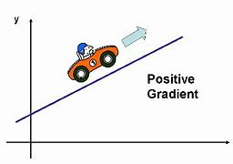

---

==== ▸ bubble  [705]   +
な/ˈbʌbəl/   +

【N-COUNT】  _Bubbles_ are small balls of air or gas in a liquid. (液体中的) 气泡 +
⇒  Ink particles attach themselves to air bubbles and rise to the surface.  墨点吸附在气泡上，升到表面。   +

【N-COUNT】   A _bubble_ is a hollow ball of soapy liquid that is floating in the air or standing on a surface. 肥皂泡 +
⇒  With soap and water, bubbles and boats, children love bathtime.  因为有肥皂、水、肥皂泡和小船，孩子们都喜欢洗澡。   +

【N-COUNT】   In a cartoon, a speech _bubble_ is the shape which surrounds the words which a character is thinking or saying. (圈注漫画中人物心理活动或对白的) 泡状框 +
⇒  All that was missing were speech bubbles saying, "Golly!" and "Wow!"  漏掉的都是写着“呀！”和“哇！”的泡状话框。   +

【V-I】   When a liquid _bubbles_, bubbles move in it, for example, because it is boiling or moving quickly. 冒泡; 沸腾 +
⇒  Heat the seasoned stock until it is bubbling.  把这些调了味的汤汁加热至沸腾为止。   +
⇒  The fermenting wine has bubbled up and over the top.  这些发酵的酒已经冒泡溢出来了。   +

【V-I】   A feeling, influence, or activity that _is bubbling_ away continues to occur. 继续发生 +
⇒  ...political tensions that have been bubbling away for years.  …持续了若干年的政治紧张局势。   +

---

==== ▸ predominant  [706]   +
な/prɪˈdɒmɪnənt/   +

【ADJ】   If something is _predominant_, it is more important or noticeable than anything else in a set of people or things. 主导性的 +
⇒  Mandy's predominant emotion was confusion.  曼迪的主导情绪是困惑。   +

---

==== ▸ resilience  [707]   +

な/rɪˈzɪliəns/

1.the ability of people or things to feel better quickly after sth unpleasant, such as shock, injury, etc. 快速恢复的能力；适应力 +
2.the ability of a substance to return to its original shape after it has been bent, stretched or pressed 还原能力；弹力 +

---

==== ▸ nationalism  [708]   +
な/ˈnæʃənəˌlɪzəm/   +

【N-UNCOUNT】   You can refer to a person's great love for their nation as _nationalism_. It is often associated with the belief that a particular nation is better than any other nation, and in this case is often used showing disapproval. 民族主义 +
⇒  This kind of fierce nationalism is a powerful and potentially volatile force.  这种强劲的民族主义势力是一股强大和潜在的不稳定的力量。   +

【N-UNCOUNT】  _Nationalism_ is the desire for political independence of people who feel they are historically or culturally a separate group within a country. 民族独立主义 +
⇒  The rising tide of Slovak nationalism may also help the party to win representation in parliament.  斯洛伐克民族独立主义浪潮的高涨也有可能帮助该党在议会中赢得席位。   +

---

==== ▸ genesis  [709]   +
な/ˈdʒɛnɪsɪs/   +
--> 来自词根gen, 生育，词源同generate. +

【N-SING】   The _genesis_ of something is its beginning, birth, or creation. (事物的)开端; 诞生; 创始 +
⇒  The project had its genesis two years earlier.  该项目是两年前开始的。   +

---

==== ▸ tinker  [710]   +
な/ˈtɪŋkə/   +
--> 可能来自拟声词，-er,人。比喻用法。 +

【V-I】   If you _tinker with_ something, you make some small changes to it, in an attempt to improve it or repair it. 小修改 +
⇒  Instead of the country admitting its error, it just tinkered with the problem.  该国未承认自己的错误，只是对这个问题稍作修改。   +

(n.)(in the past) a person who travelled from place to place, selling or repairing things （旧时走街串巷的）小炉匠，补锅匠，白铁匠) +

---

==== ▸ stylish  [711]   +
な/ˈstaɪlɪʃ/   +

【ADJ】   Someone or something that is _stylish_ is elegant and fashionable. 有格调的; 时髦的 +
⇒  ...a very attractive and very stylish woman of 27.  …一个非常迷人又非常时髦的27岁女子。   +

【ADV】   有格调地; 时髦地 +
⇒  ...stylishly dressed middle-aged women.  …衣着时髦的中年女人们。   +

---

==== ▸ amenable  [712]   +
な/əˈmiːnəbəl, əˈmɛnə-/   +
--> 前缀a- 同ad-. 词根men, 伸出，引导，威胁，见 menace，威胁。此处用引导义，可引导的，顺从的。 +

【ADJ】   If you are _amenable to_ something, you are willing to do it or accept it. 愿意的 +
⇒  The Jordanian leader seemed amenable to attending a conference.  约旦的领袖看起来愿意去参加一个会议。   +

---

==== ▸ rekindle  [713]   +
な/riːˈkɪndəl/   +
--> re-,再，重新，kindle,点燃。 +

【V-T】   If something _rekindles_ an interest, feeling, or thought that you used to have, it makes you think about it or feel it again. 使恢复 +
⇒  Ben Brantley's article on Sir Ian McKellen rekindled many memories.  本•布兰特利关于伊恩•麦凯伦爵士的文章唤回许多记忆。   +

【V-T】   If something _rekindles_ an unpleasant situation, it makes the unpleasant situation happen again. 重新引发 +
⇒  There are fears that the series could rekindle animosity between the two countries.  有人担心这一系列的事情可能会重新引发两国之间的敌意。   +

---

==== ▸ pipe  [714]   +
な/paɪp/   +

【N-COUNT】   A _pipe_ is a long, round, hollow object, usually made of metal or plastic, through which a liquid or gas can flow. 管子 +
⇒  The liquid can't escape into the air, because it's inside a pipe.  液体不会漏到空气中，因为它在管子里。   +

【N-COUNT】   A _pipe_ is an object that is used for smoking tobacco. You put the tobacco into the cup-shaped part at the end of the pipe, light it, and breathe in the smoke through a narrow tube. 烟斗 +
⇒  Do you smoke a pipe?  你抽烟斗吗？   +

【N-COUNT】   A _pipe_ is a simple musical instrument in the shape of a tube with holes in it. You play a pipe by blowing into it while covering and uncovering the holes with your fingers. 管乐器 +
【N-COUNT】   An _organ pipe_ is one of the long hollow tubes in which air vibrates and produces a musical note. 管风琴的音管   +

【N】   a large cask for wine, oil, etc 装酒、油等的大桶 +
【V-T】   If liquid or gas _is piped_ somewhere, it is transferred from one place to another through a pipe. 用管道输送   +
⇒  The heated gas is piped through a coil surrounded by water.  受热气体通过水中的一根螺旋管输送。   +
⇒  The Communists brought electricity to his village and piped in drinking water from the reservoir.  共产党员们把电接入了他的村子，还用管道从水库引来饮用水。   +

【V】   to play (music) on a pipe 以管乐器吹奏(音乐) +

.案例
====
chatGpt: +
"Pipe" 和 "tube" 都指的是管道，但它们之间有一些区别，主要涉及到其用途、尺寸、制造工艺和结构等方面的不同。 +
以下是它们之间的主要区别：

用途： +
*"Pipe"（管）通常用于输送液体和气体，例如水、石油、天然气等。它们的主要目的是将流体从一个地方输送到另一个地方。* +
*"Tube"（管道）可以用于多种目的，包括输送流体、支撑结构、传导电线和电缆，以及制造零部件等。管道的用途更广泛，不仅限于液体和气体的输送。* +

尺寸： +
"Pipe" 通常具有较大的外径，壁厚相对较薄，通常以标准尺寸制造，以适应特定的流体传输需求。 +
"Tube" 通常具有较小的外径，壁厚相对较厚，通常以精确的尺寸制造，以满足特定工程或应用需求。 +

制造工艺： +
"Pipe" 制造通常涉及到焊接、铸造或滚压等工艺，以获得所需的强度和耐用性。 +
"Tube" 制造通常使用冷拔、冷轧或其他加工方法，以获得更精确的尺寸和表面质量。 +

结构： +
"Pipe" 通常具有圆形或椭圆形的截面，较为厚实，以承受压力和扭曲力。 +
"Tube" 可以具有圆形、方形、矩形或其他形状的截面，壁厚相对较大，用途更多样化。 +

需要注意的是，这些区别并不是绝对的，有些情况下 "pipe" 和 "tube" 这两个词汇可以互换使用。具体使用哪个词汇取决于上下文和特定行业或工程的标准。 +
====

---

==== ▸ automatic  [715]   +
な/ˌɔːtəˈmætɪk/   +

【ADJ】   An _automatic_ machine or device is one that has controls that enable it to perform a task without needing to be constantly operated by a person. _Automatic_ methods and processes involve the use of such machines. (机器或装置) 自动的 +
⇒  Modern trains have automatic doors.  现代火车都有自动门。   +

【ADJ】   An _automatic_ weapon is one that keeps firing shots until you stop pulling the trigger. (武器) 自动的 +
⇒  Three gunmen with automatic rifles opened fire.  3名手持自动步枪的歹徒开了火。   +

【N-COUNT】  _Automatic_ is also a noun. 自动枪 +
⇒  He drew his automatic and began running in the direction of the sounds.  他拔出自动枪，朝发出声音的方向跑去。   +

【ADJ】   An _automatic_ action is one that you do without thinking about it. (行动) 无意识的 +
⇒  All of the automatic body functions, even breathing, are affected.  所有无意识的身体功能，甚至呼吸，都受到影响。   +

【ADV】   无意识地 +
⇒  You will automatically wake up after this length of time.  你将在这段时间之后自然醒来。   +

【N-COUNT】   An _automatic_ is a car in which the gears change automatically as the car's speed increases or decreases. 自动换档汽车 +

---

==== ▸ eclecticism  [716]   +
な/ɪˈklɛktɪˌsɪzəm/   +

【N-UNCOUNT】  _Eclecticism_ is the principle or practice of choosing or involving objects, ideas, and beliefs from many different sources. 折中主义 +
⇒  ...her cultural eclecticism.  ...她的文化折中主义。   +

---

==== ▸ so-called  [717]   +
な【ADJ】   You use _so-called_ to indicate that you think a word or expression used to describe someone or something is in fact wrong. 所谓的   +
⇒  These are the facts that explode their so-called economic miracle.  这些就是戳穿他们所谓的经济奇迹的事实。   +

【ADJ】   You use _so-called_ to indicate that something is generally referred to by the name that you are about to use. 被称为…的 +
⇒  ...a summit of the world's seven leading market economies, the so-called G-7.  …世界7个主要市场经济体的峰会，一般称为G-7。   +

---

==== ▸ meteorite  [718]   +
な/ˈmiːtɪəˌraɪt/   +
--> 来自meteor,流星，-ite,相关的。用于指陨石。 +

【N-COUNT】   A _meteorite_ is a large piece of rock or metal from space that has landed on Earth. 陨石 +

---

==== ▸ indolent  [719]   +
な/ˈɪndələnt/   +
--> in-,不，非，-dol,伤心的，悲伤的，词源同condole,doleful.即没有悲伤的，后引申词义不用忍受痛苦的，不用尝试做事的，懒惰的。 +

【ADJ】   Someone who is _indolent_ is lazy. 懒惰的 +

---

==== ▸ myopic  [720]   +
な/maɪˈɒpɪk/   +

【ADJ】   If you describe someone as _myopic_, you are critical of them because they seem unable to realize that their actions might have negative consequences. 目光短浅的; 缺乏远见的 +
⇒  The government still has a myopic attitude to spending.  政府在开支方面仍然缺乏远见。   +

【ADJ】   If someone is _myopic_, they are unable to see things that are far away from them. 近视的 +

---

==== ▸ primitive  [721]   +
な/ˈprɪmɪtɪv/   +

【ADJ】  _Primitive_ means belonging to a society in which people live in a very simple way, usually without industries or a writing system. 原始的 (社会) +
⇒  ...studies of primitive societies.  …对原始社会的研究。   +

【ADJ】  _Primitive_ means belonging to a very early period in the development of an animal or plant. 原始的 (动物、植物) +
⇒  ...primitive whales.  …原始鲸。   +
⇒  Primitive humans needed to be able to react like this to escape from dangerous animals.  原始人们需要能够像这样反应以逃脱危险的动物。   +

【ADJ】   If you describe something as _primitive_, you mean that it is very simple in style or very old-fashioned. 简陋的; 旧式的 +
⇒  The conditions are primitive by any standards.  这些条件以任何标准衡量都是简陋的。   +

---

==== ▸ quartz  [722]   +
な/kwɔːts/   +

【N-UNCOUNT】  _Quartz_ is a mineral in the form of a hard, shiny crystal. It is used in making electronic equipment and very accurate watches and clocks. 石英 +
⇒  ...a quartz crystal.  …一块石英晶体。   +

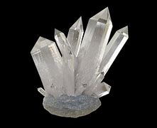

---

==== ▸ supply  [723]   +
な/səˈplaɪ/   +

【V-T】   If you _supply_ someone with something that they want or need, you give them a quantity of it. 供应 +
⇒  ...an agreement not to produce or supply chemical weapons.  …一份不生产或不供应化学武器的协议。   +
⇒  ...a pipeline which will supply the major Greek cities with Russian natural gas.  …一条将为希腊各主要城市供应俄罗斯天然气的管道。   +

【N-PLURAL】   You can use _supplies_ to refer to food, equipment, and other essential things that people need, especially when these are provided in large quantities. 补给品 +
⇒  What happens when food and petrol supplies run low?  食物和汽油这些补给品减少时会发生什么情况呢？   +

【N-VAR】   A _supply of_ something is an amount of it which someone has or which is available for them to use. 供应 +
⇒  The brain requires a constant supply of oxygen.  大脑需要持续的供氧。   +

【N-UNCOUNT】  _Supply_ is the quantity of goods and services that can be made available for people to buy. 供应量 +
⇒  Prices change according to supply and demand.  价格根据供应量和需求量而变化。   +

【PHRASE】   If something is _in short supply_, there is very little of it available and it is difficult to find or obtain. 供应不足 +
⇒  Food is in short supply all over the country.  食品在全国各地都供应不足。   +
 ▷ supply   +
な/ˈsʌpəlɪ/   +

【PHRASE】 +
【ADV】   in a supple manner 柔软地   +

---

==== ▸ anthropology  [724]   +
な/ˌænθrəˈpɒlədʒɪ/   +
--> -anthrop-人类 + -o- + -logist名词词尾,…学家 +

【N-UNCOUNT】  _Anthropology_ is the scientific study of people, society, and culture. 人类学 +
【N-COUNT】   人类学家   +
⇒  ...an anthropologist who had been in China for three years.  …一位在中国呆过3年的人类学家。   +

---

==== ▸ digitize  [725]   +
な/ˈdɪdʒɪˌtaɪz/   +

【V-T】   To _digitize_ information means to turn it into a form that can be read easily by a computer. 使数字化 +
⇒  The picture is digitized by a scanner.  该图通过扫描仪被数字化。   +

---

==== ▸ atmosphere  [726]   +
な/ˈætməsˌfɪə/   +

【N-COUNT】   A planet's _atmosphere_ is the layer of air or other gases around it. (行星的) 大气层 +
⇒  The shuttle Columbia will re-enter Earth's atmosphere tomorrow morning.  哥伦比亚号航天飞机将在明天上午重进地球大气层。   +

【N-COUNT】   The _atmosphere_ of a place is the air that you breathe there. (某地的) 空气 +
⇒  These gases pollute the atmosphere of towns and cities.  这些气体污染城镇的空气。   +

【N-SING】   The _atmosphere_ of a place is the general impression that you get of it. 气氛 +
⇒  There's still an atmosphere of great hostility and tension in the city.  在这座城市里依然有一种极其敌对和紧张的气氛。   +

【N-UNCOUNT】   If a place or an event has _atmosphere_, it is interesting. 神韵 +
⇒  The old harbour is still full of atmosphere and well worth visiting.  旧港口依然充满神韵，很值得参观。   +

---

==== ▸ skeleton  [727]   +
な/ˈskɛlɪtən/   +

【N-COUNT】   Your _skeleton_ is the framework of bones in your body. 骨骼 +
⇒  ...a human skeleton.  …人体骨骼。   +

【ADJ】   A _skeleton_ staff is the smallest number of staff necessary in order to run an organization or service. 最起码的 (员工) +
⇒  Only a skeleton staff remains to show anyone interested around the site.  只有极少数的员工留下来带领感兴趣的人参观场地。   +

【N-COUNT】   The _skeleton_ of something such as a building or a plan is its basic framework. (楼房或计划的) 构架; 框架 +
⇒  The town of Rudbar had ceased to exist, with only skeletons of buildings remaining.  鲁德巴尔城已不存在，只剩一些建筑骨架。   +

---

==== ▸ dragonfly  [728]   +
な/ˈdræɡənˌflaɪ/   +

【N-COUNT】  _Dragonflies_ are brightly coloured insects with long, thin bodies and two sets of wings. Dragonflies are often found near slow-moving water. 蜻蜓 +

---

==== ▸ vocalize  [729]   +
な/ˈvəʊkəˌlaɪz/   +

【V-T】   If you _vocalize_ a feeling or an idea, you express it in words. 说出(感受或想法) +
⇒  Archbishop Hunthausen also vocalized his beliefs that women and homosexuals should be more active in the church.  大主教亨特豪森也阐述了他的想法：妇女和同性恋者应更积极地参与教堂事务。   +

【V-T/V-I】   When you _vocalize_ a sound, you use your voice to make it, especially by singing it. 发声(尤指唱) +
⇒  In India and Bali students learn to vocalize music before ever picking up instruments.  在印度和巴厘岛，学生们在开始学习乐器前要先学唱歌。   +

---

==== ▸ associative  [730]   +
な/əˈsəʊʃɪətɪv/   +

【ADJ】  _Associative_ thoughts are things that you think of because you see, hear, or think of something that reminds you of those things or which you associate with those things. 联想的 +
⇒  The associative guilt was ingrained in his soul.  这种联想式内疚在他心中根深蒂固。   +

---

==== ▸ quadruple  [731]   +
な/ˈkwɒdrʊpəl, -ˈdruːpəl/   +
--> quadr-,四，-ple,倍数，词源同triple. +

【V-T/V-I】   If someone _quadruples_ an amount or if it _quadruples_, it becomes four times bigger. 使成4倍; 成为4倍 +
⇒  China seeks to quadruple its income in twenty years.  中国力求在20年内将其收入翻两番。   +

【PREDET】   If one amount is _quadruple_ another amount, it is four times bigger. 4倍的 +
⇒  Fifty-nine percent of its residents have attended graduate school – quadruple the national average.  该地区59％的居民读过研究生–是全国平均水平的4倍。   +

【ADJ】   You use _quadruple_ to indicate that something has four parts or happens four times. 由4部分组成的; 发生4次的 +
⇒  The quadruple murder has replaced property prices as the sole topic of interest.  这4起连环谋杀案已经取代房价成为了人们惟一感兴趣的话题。   +

---

==== ▸ curl  [732]   +
な/kɜːl/   +

【N-COUNT】   If you have _curls_, your hair is in the form of tight curves and spirals. 卷发 +
⇒  ...the little girl with blonde curls.  …长着金黄色卷发的小女孩。   +

【N-COUNT】   A _curl of_ something is a piece or quantity of it that is curved or spiral in shape. 卷曲状或螺旋状 +
⇒  A thin curl of smoke rose from a rusty stove.  一缕薄薄的青烟从生锈的炉子里冉冉升起。   +

【N-UNCOUNT】   If your hair has _curl_, it is full of curls. 卷曲 +
⇒  Dry curly hair naturally for maximum curl and shine.  让卷发自然地风干以最大限度地增加头发的卷曲和光泽。   +

【V-T/V-I】   If your hair _curls_ or if you _curl_ it, it is full of curls. 卷曲; 使卷曲 +
⇒  She has hair that refuses to curl.  她的头发怎么也不卷。   +
⇒  Maria had curled her hair for the event.  玛丽亚为这次活动卷了头发。   +

【V-T/V-I】   If your toes, fingers, or other parts of your body _curl_, or if you _curl_ them, they form a curved or round shape. 弯曲; 使弯曲 +
⇒  His fingers curled gently around her wrist.  他的手指轻握住她的手腕。   +
⇒  Raise one foot, curl the toes and point the foot downwards.  抬起一只脚，将脚趾弯曲，将脚向下指。   +

【V-T/V-I】   If something _curls_ somewhere, or if you _curl_ it there, it moves there in a spiral or curve. 缭绕; 使缠绕 +
⇒  Smoke was curling up the chimney.  烟顺着烟囱缭绕升起。   +

【V-I】   If a person or animal _curls into_ a ball, they move into a position in which their body makes a rounded shape. 蜷作一团 +
⇒  He wanted to curl into a tiny ball.  他想把自己蜷成一个小团。   +

【PHRASAL VERB】  _Curl up_ means the same as . 蜷作一团 +
⇒  In colder weather, your cat will curl up into a tight, heat-conserving ball.  在更冷的天气里，你的猫会蜷缩成紧紧的一团来保暖。   +
⇒  She curled up next to him.  她蜷卧在他身边。   +

【V-I】   When a leaf, a piece of paper, or another flat object _curls_, its edges bend toward the centre. 卷边 +
⇒  The rose leaves have curled because of an attack by grubs.  玫瑰的叶子因虫子的侵袭打了卷。   +

【PHRASAL VERB】  _Curl up_ means the same as . 卷起 +
⇒  The corners of the rug were curling up.  地毯的各角卷起来了。   +

---

==== ▸ solder  [733]   +
な/ˈsɒldə/   +
--> 来自古法语 solder,连接，焊接，使成整体，来自拉丁语 solidare,使成整体，词源同 solid,完整 的，整个的。 +

【V-T】   If you _solder_ two pieces of metal together, you join them by melting a small piece of soft metal and putting it between them so that it holds them together after it has cooled. 焊接 +
⇒  Fewer workers are needed to solder circuit boards.  焊接电路板需要较少的工人。   +

【N-UNCOUNT】  _Solder_ is the soft metal used for soldering. 焊锡 +

---

==== ▸ penalty  [734]   +
な/ˈpɛnəltɪ/   +

【N-COUNT】   A _penalty_ is a punishment that someone is given for doing something which is against a law or rule. 刑罚 +
⇒  One of those arrested could face the death penalty.  那些被捕之人其中的一个可能会面临死刑。   +

【N-COUNT】   In sports such as football, American football, and hockey, a _penalty_ is a disadvantage forced on the team that breaks a rule. (体育比赛中的) 罚球 +
⇒  Referee Michael Reed had no hesitation in awarding a penalty.  裁判迈克尔·里德毫不犹豫地判了罚球。   +

【N-COUNT】  _The__penalty_ that you pay for something you have done is something unpleasant that you experience as a result. 惩罚 +
⇒  Why should I pay the penalty for somebody else's mistake?  我为什么要为别人的错误而接受惩罚呢？   +

---

==== ▸ unbridgeable  [735]   +
な/ʌnˈbrɪdʒəbəl/   +

【ADJ】   An _unbridgeable_ gap or divide between two sides in an argument is so great that the two sides seem unlikely ever to agree. 不可逾越的; 不能同意的 +
⇒  ...the so-called unbridgeable gap between the world of humans and that of chimpanzees.  ...人类社会和黑猩猩社会间所谓的不可逾越的鸿沟。   +

---

==== ▸ affinity  [736]   +
な/əˈfɪnɪtɪ/   +
--> affinity = af（=ad，去）+fini（边界）+ty（名词后缀）→边界相接→结成亲家→密切关系、吸引力 词源解释：fini←拉丁语finis（边界） 背景知识：affinity的本意是“姻亲”，即通过婚姻而形成的亲戚关系。 同源词：fine（罚款←解除责任），final（最后），finish（完成←走到头），infinite（无限），define（定义←给出边界），confine（限制←约束在边界内） +

【N-SING】   If you have an _affinity_ with someone or something, you feel that you are similar to them or that you know and understand them very well. 亲切感 +
⇒  He has a close affinity with the landscape and people he knew when he was growing up.  他对他成长过程中所熟悉的景色和人们有一种很强的亲切感。   +

---

==== ▸ spawn  [737]   +
な/spɔːn/   +

【N-UNCOUNT】  _Spawn_ is a soft, jelly-like substance containing the eggs of fish, or of animals such as frogs. (鱼、蛙等的)卵 +
⇒  ...her passion for collecting frog spawn.  ...她对采蛙卵的热爱。   +

【V-I】   When fish or animals such as frogs _spawn_, they lay their eggs. (鱼、蛙等)产卵 +
⇒  ...fish species like salmon and trout which go upstream, spawn and then die.  ...像鲑鱼和鳟鱼这样的鱼类会洄游、产卵，然后死亡。   +

【V-T】   If something _spawns_ something else, it causes it to happen or to be created. 引发 +
⇒  Tyndall's inspired work spawned a whole new branch of science.  廷德尔有创见的工作发展出了一个新的科学分支。   +

---

==== ▸ disquiet  [738]   +
な/dɪsˈkwaɪət/   +

【N-UNCOUNT】  _Disquiet_ is a feeling of worry or anxiety. 忧虑不安 +
⇒  There is growing public disquiet about the cost of such policing.  对这样的警务开支公众忧虑不断增长。   +

---

==== ▸ revitalize  [739]   +
な/riːˈvaɪtəˌlaɪz/   +

【V-T】   To _revitalize_ something that has lost its activity or its health means to make it active or healthy again. 使恢复元气; 使复苏 +
⇒  This hair conditioner is excellent for revitalizing dry, lifeless hair.  这种护发素对使干枯、无生气的头发重新焕发光彩非常有效。   +

---

==== ▸ captivity  [740]   +
な/kæpˈtɪvɪtɪ/   +

【N-UNCOUNT】  _Captivity_ is the state of being kept imprisoned or enclosed. 囚禁; 圈养 +
⇒  The great majority of barn owls are reared in captivity.  绝大多数仓鸮是圈养的。   +

---

==== ▸ exempt  [741]   +
な/ɪɡˈzɛmpt/   +
--> ex-, 向外。-em, 拿出，带出，词源同example, sample. 即拿出来的，免除或豁免。 +

【ADJ】   If someone or something is _exempt from_ a particular rule, duty, or obligation, they do not have to follow it or do it. 免除 (规则、职责、义务等) 的 +
⇒  Men in college were exempt from military service.  在校男大学生免服兵役。   +

【V-T】   To _exempt_ a person or thing _from_ a particular rule, duty, or obligation means to state officially that they are not bound or affected by it. 免除 +
⇒  South Carolina claimed the power to exempt its citizens from the obligation to obey federal law.  南卡罗来纳州宣称有权使其公民免除遵守联邦法律的义务。   +

【N-VAR】   免除 +
⇒  ...the exemption of employer-provided health insurance from taxation.  …雇主提供的医疗保险的税项免除。   +

---

==== ▸ irritate  [742]   +
な/ˈɪrɪˌteɪt/   +

【V-T】   If something _irritates_ you, it keeps annoying you. 激怒 +
⇒  Their attitude irritates me.  他们的态度激怒了我。   +

【ADJ】   被激怒的 +
⇒  Not surprisingly, her teacher is getting irritated with her.  不出所料，她的老师快被她激怒了。   +

【V-T】   If something _irritates_ a part of your body, it causes it to itch or become sore. 刺激 +
⇒  Wear rubber gloves while chopping chillies as they can irritate the skin.  剁辣椒时戴上橡皮手套，因为它们会刺激皮肤。   +

---

==== ▸ monitor  [743]   +
な/ˈmɒnɪtə/   +

【V-T】   If you _monitor_ something, you regularly check its development or progress, and sometimes comment on it. 监控 +
⇒  Officials had not been allowed to monitor the voting.  官员们未曾获许监控选举。   +

【V-T】   If someone _monitors_ radio broadcasts from other countries, they record them or listen carefully to them in order to obtain information. 监听 +
⇒  Peter Murray is in Washington and has been monitoring reports out of Monrovia.  彼得·默里在华盛顿，一直监听来自蒙罗维亚的报道。   +

【N-COUNT】   A _monitor_ is a machine that is used to check or record things, for example processes or substances inside a person's body. 监控器 +
⇒  The heart monitor shows low levels of consciousness.  心脏监控器显示低意识水平。   +

【N-COUNT】   A _monitor_ is a screen which is used to display certain kinds of information, for example on a computer, in airports, or in television studios. 显示屏 +
⇒  He was watching a game of tennis on a television monitor.  他那时正在电视监控器上观看一场网球赛。   +

【N-COUNT】   You can refer to a person who checks that something is done correctly, or that it is fair, as a _monitor_. 监督员 +
⇒  Government monitors will continue to accompany reporters.  政府监督员们将继续陪同记者们。   +

---

==== ▸ wit  [744]   +
な/wɪt/   +
--> 来自 PIE*weid,看，知道，词源同 visit,wise.引申词义见多思广，智慧。 +

【N-UNCOUNT】  _Wit_ is the ability to use words or ideas in an amusing, clever, and imaginative way. 风趣; 机智 +
⇒  Boulding was known for his biting wit.  博尔丁以其嘲讽式的风趣而出名。   +

【N-SING】   If you say that someone has _the wit to_ do something, you mean that they have the intelligence and understanding to make the right decision or take the right action in a particular situation. 才智 +
⇒  The information is there and waiting to be accessed by anyone with the wit to use it.  信息是现成的，等着有头脑的人去获取和利用。   +

【N-PLURAL】   You can refer to your ability to think quickly and effectively in a difficult situation as your _wits_. 机智 +
⇒  She has used her wits to progress to the position she holds today.  她用她的机智攀升到今天的这个位置。   +

【N-PLURAL】   You can use _wits_ in expressions such as _frighten_ someone _out of their wits_ and _scare the wits out of_ someone to emphasize that a person or thing worries or frightens someone very much. 神志 +
⇒  You scared us out of our wits. We heard you had an accident.  你把我们吓坏了。我们听说你出事了。   +

【ADV】   that is to say; namely (used to introduce statements, as in legal documents) 即; 也就是说 +

---

==== ▸ mount  [745]   +
な/maʊnt/   +
--> 来自拉丁语mons,山峰，高山，山，来自PIE*men,升出，突起，词源同eminent,amount.引申动词词义攀登，骑上，安装等。 +

【V-T】   If you _mount_ a campaign or event, you organize it and make it take place. 组织; 发动 +
⇒  The ANC announced it was mounting a major campaign of mass political protests.  非国大宣布正在发动一场大型群众性政治抗议运动。   +

【V-I】   If something _mounts_, it increases in intensity. 增强 +
⇒  For several hours, tension mounted.  几个小时中，紧张局势加剧了。   +

【V-I】   If something _mounts_, it increases in quantity. 增加 +
⇒  The uncollected rubbish mounts in city streets.  城市街道中未被收集的垃圾增多。   +

【PHRASAL VERB】   To _mount up_ means the same as to . 增加 +
⇒  Her medical bills mounted up.  她的医疗账单越来越多。   +

【V-T】   If you _mount_ the stairs or a platform, you go up the stairs or go up onto the platform. 登上 +
⇒  Larry was mounting the stairs up into the attic.  拉里正在拾级而上到阁楼去。   +

【V-T】   If you _mount_ a horse or motorcycle, you climb on to it so that you can ride it. 骑上 +
⇒  A man in a crash helmet was mounting a motorcycle.  一个戴着防撞头盔的男子正骑上一辆摩托车。   +

【V-T】   If you _mount_ an object _on_ something, you fix it there firmly. 安装 +
⇒  Her husband mounts the work on velour paper and makes the frame.  她丈夫把作品装裱到丝绒纸上，又做了框架。   +

【COMB in ADJ】   安装在…上的 +
⇒  She installed a wall-mounted electric fan.  她装了一台墙壁式电扇。   +

【V-T】   If you _mount_ an exhibition or display, you organize and present it. 举办 +
⇒  The gallery has mounted an exhibition of art by Irish women painters.  这家画廊已经举办过一次爱尔兰女画家们的艺术作品展。   +

【N-IN-NAMES】  _Mount_ is used as part of the name of a mountain. (冠于山名之前) 山 +
⇒  ...Mount Everest.  …珠穆朗玛峰。   +

【N】   a backing, setting, or support onto which something is fixed (固定东西的)背板; 底座; 支架 +

---

==== ▸ gleam  [746]   +
な/ɡliːm/   +

【V-I】   If an object or a surface _gleams_, it reflects light because it is shiny and clean. 闪光 +
⇒  His black hair gleamed in the sun.  他的黑头发在阳光下闪闪发光。   +

【N-COUNT】   A _gleam of_ something is a faint sign of it. 一丝 +
⇒  There was a gleam of hope for a peaceful settlement.  和平解决曾有一线希望。   +

---

==== ▸ hypothetical  [747]   +
な/ˌhaɪpəˈθɛtɪkəl/   +

【ADJ】   If something is _hypothetical_, it is based on possible ideas or situations rather than actual ones. 假设的 +
⇒  Let's look at a hypothetical situation in which Carol, a recovering alcoholic, gets invited to a party.  我们来假设一下这样一个情景，卡罗尔，一个正在康复中的嗜酒者，被邀情去参加一场聚会。   +

【ADV】   以假设方式 +
⇒  He was invariably willing to discuss the possibilities hypothetically.  他总是愿意以假设方式讨论各种可能性。   +

---

==== ▸ shear  [748]   +
な/ʃɪə/   +

【V-T】   To _shear_ a sheep means to cut its wool off. (给羊) 剪毛 +
⇒  Competitors have six minutes to shear four sheep.  参赛者们有6分钟的时间来给4只羊剪毛。   +

【N-UNCOUNT】   剪羊毛 +
⇒  ...a display of sheep shearing.  …一场剪羊毛表演。   +

【N-PLURAL】   A pair of _shears_ is a garden tool like a very large pair of scissors. Shears are used especially for cutting hedges. 大剪刀 +
⇒  Trim the shrubs with shears.  用大剪刀修剪这些灌木。   +

---

==== ▸ scroll  [749]   +
な/skrəʊl/   +

【N-COUNT】   A _scroll_ is a long roll of paper or a similar material with writing on it. (写有文字的) 卷轴 +
⇒  Ancient scrolls were found in caves by the Dead Sea.  在死海边的洞穴里发现了古代的卷轴。   +

【N-COUNT】   A _scroll_ is a painted or carved decoration made to look like a scroll. 卷轴形装饰 +
⇒  ...a handsome suite of chairs incised with Grecian scrolls.  …一套漂亮的刻有古希腊式卷轴形装饰的椅子。   +

【V-I】   If you _scroll_ through text on a computer screen, you move the text up or down to find the information that you need. (在计算机屏幕上的文本中) 滚动 +
⇒  I scrolled down to find "United States of America."  我向下滚动以寻找。   +

---

==== ▸ cast  [750]   +
な/kɑːst/   +

【N-COUNT-COLL】   The _cast_ of a play or film is all the people who act in it. 全体演员 +
⇒  The show is very amusing and the cast is very good.  表演非常有趣，演员都很优秀。   +

【V-T】   To _cast_ an actor _in_ a play or film means to choose them to act a particular role in it. 选…扮演角色 +
⇒  The world premiere of Harold Pinter's new play casts Ian Holm in the lead role.  哈罗德·品特新戏的首次全球公演选择伊恩·霍姆扮演主要角色。   +
⇒  He was cast as a college professor.  他被选扮演大学教授这个角色。   +

【V-T】   If you _cast_ your eyes or _cast_ a look in a particular direction, you look quickly in that direction. 扫视 +
⇒  He cast a stern glance at the two men.  他严厉地瞪了那两名男子一眼。   +
⇒  I cast my eyes down briefly.  我往下瞅了瞅。   +

【V-T】   If something _casts_ a light or shadow somewhere, it causes it to appear there. 投射 +
⇒  The moon cast a bright light over the garden.  月亮在院子里撒下清辉。   +

【V-T】   To _cast_ doubt _on_ something means to cause people to be unsure about it. 使人生疑 +
⇒  Last night a top criminal psychologist cast doubt on the theory.  昨晚，一位顶级的犯罪心理学家让人对该理论生疑。   +

【V-T】   When you _cast_ your vote in an election, you vote. 投票 +
⇒  About ninety-five per cent of those who cast their votes approve the new constitution.  95%的人投票赞成新宪法。   +

【V-T】   To _cast_ an object means to make it by pouring a liquid such as hot metal into a specially shaped container and leaving it there until it becomes hard. 铸造 +
⇒  Our door knocker is cast in solid brass.  我们的门环是纯铜铸造的。   +

【N-COUNT】   A _cast_ is a model that has been made by pouring a liquid such as plaster or hot metal onto something or into something, so that when it hardens it has the same shape as that thing. 模型 +
⇒  An orthodontist took a cast of the inside of Billy's mouth to make a dental plate.  正牙医师从比利的口腔内部取了模型来制作齿板。   +

【N-COUNT】   A _cast_ is the same as a . 石膏模型 +

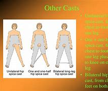

---

==== ▸ lush  [751]   +
な/lʌʃ/   +

【ADJ】  _Lush_ fields or gardens have a lot of very healthy grass or plants. 茂盛的 +
⇒  ...the lush green meadows bordering the river.  …河边青葱翠绿的草地。   +

【ADJ】   If you describe a place or thing as _lush_, you mean that it is very luxurious. 豪华的 +
⇒  The Carlton-intercontinental hotel is lush, plush, and very non- backpacker.  卡尔顿洲际酒店豪华舒适，背包徒步旅行者是绝对住不起的。   +

【N-COUNT】   If you describe someone as a _lush_, you mean that they drink too much alcohol. 酒鬼 +

---

==== ▸ institute  [752]   +
な/ˈɪnstɪˌtjuːt/   +
⇒  ...the National Cancer Institute.  …国家癌症研究所。   +

【V-T】   If you _institute_ a system, rule, or course of action, you start it. 制定 (规章、制度); 创立 +
⇒  We will institute a number of measures to better safeguard the public.  我们将制定许多措施更好地保护公众。   +

---

==== ▸ delta  [753]   +
な/ˈdɛltə/   +

【N-COUNT】   A _delta_ is an area of low, flat land shaped like a triangle, where a river splits and spreads out into several branches before entering the sea. (河流的) 三角洲 +
⇒  ...the Mississippi delta.  …密西西比河三角洲。   +

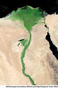

---

==== ▸ sponsor  [754]   +
な/ˈspɒnsə/   +
--> -spons-允诺,约定 + -or名词词尾,人 +

【V-T】   If an organization or an individual _sponsors_ something such as an event or someone's training, they pay some or all of the expenses connected with it, often in order to get publicity for themselves. 赞助 (某事、某人的培训等) +
⇒  Dozens of companies, including Hewlett-Packard, are sponsoring the event.  包括惠普在内的许多公司都在赞助这项赛事。   +

【V-T】   If you _sponsor_ someone who is doing something to raise money for charity, for example trying to walk a certain distance, you agree to give them a sum of money for the charity if they succeed in doing it. 赞助 (为慈善事业募集资金者) +
⇒  Please could you sponsor me for my school's campaign for Help the Aged?  请问你们能赞助我开展我校的“帮助老年人”活动吗？   +

【V-T】   If you _sponsor_ a proposal or suggestion, you officially put it forward and support it. 倡议 +
⇒  Eight senators sponsored legislation to stop the military funding.  八位参议员倡议立法停拨军费。   +

【V-T】   When a country or an organization such as the United Nations _sponsors_ negotiations between countries, it suggests holding the negotiations and organizes them. 提议并组织 (商谈) +
⇒  Given the strength of pressure on both sides, the superpowers may well have difficulties sponsoring negotiations.  鉴于双方的强大压力，超级大国可能很难组织谈判。   +

【V-T】   If one country accuses another of _sponsoring_ attacks on it, they mean that the other country does not do anything to prevent the attacks, and may even encourage them. 纵容 +
⇒  We have to make the states that sponsor terrorism pay a price.  我们得让那些纵容恐怖主义的国家付出代价。   +

【V-T】   If a company or organization _sponsors_ a television programme, they pay to have a special advertisement shown at the beginning and end of the programme, and at each commercial break. 赞助 (电视节目) +
⇒  The company plans to sponsor television programmes as part of its marketing strategy.  公司计划赞助电视节目，以此作为营销策略之一。   +

【N-COUNT】   A _sponsor_ is a person or organization that sponsors something or someone. 赞助人; 赞助机构; 倡议人 +
⇒  Race officials announced a handful of new sponsors on Tuesday.  比赛官员们星期二公布了几位新赞助人。   +

---

==== ▸ ribbon  [755]   +
な/ˈrɪbən/   +

【N-VAR】   A _ribbon_ is a long, narrow piece of cloth that you use for tying things together or as a decoration. 装饰带 +
⇒  She had tied back her hair with a peach satin ribbon.  她用一条桃红色的缎带把头发扎在了脑后。   +

【N-COUNT】   A typewriter or printer _ribbon_ is a long, narrow piece of cloth containing ink and is used in a typewriter or printer. 色带 +

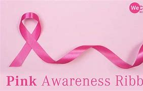

---

==== ▸ reiterate  [756]   +
な/riːˈɪtəˌreɪt/   +
--> re-,再，重新，iterate,反复，重复。+

【V-T】   If you _reiterate_ something, you say it again, usually in order to emphasize it. 重申 +
⇒  He reiterated his opposition to the creation of a central bank.  他重申了他对创办中央银行的反对。   +

---

==== ▸ mission  [757]   +
な/ˈmɪʃən/   +

【N-COUNT】   A _mission_ is an important task that people are given to do, especially one that involves travelling to another country. (尤指远赴他国的) 使命 +
⇒  Salisbury sent him on a diplomatic mission to North America.  索尔兹伯里派他到北美执行一项外交使命。   +

【N-COUNT】   A _mission_ is a group of people who have been sent to a foreign country to carry out an official task. 驻外使团 +
⇒  ...a senior member of a diplomatic mission.  …外交使团中的一名高级成员。   +

【N-COUNT】   A _mission_ is a special journey made by a military aeroplane or spacecraft. (军用飞机或宇宙飞船的) 飞行任务 +
⇒  ...a bomber that crashed during a training mission in the west Texas mountains.  …在德克萨斯州西部山区执行训练任务时坠毁的一架轰炸机。   +

【N-SING】   If you say that you have a _mission_, you mean that you have a strong commitment and sense of duty to do or achieve something. 使命; 天职 +
⇒  He viewed his mission in life as protecting the weak from the evil.  他把保护弱者不受坏人伤害看作自己一生的使命。   +

【N-COUNT】   A _mission_ is the activities of a group of Christians who have been sent to a place to teach people about Christianity. 传教活动 +
⇒  They say God spoke to them and told them to go on a mission to the poorest country in the Western Hemisphere.  他们说上帝向他们开口讲话，告诉他们到西半球最贫穷的国家继续进行传教活动。   +

【N-COUNT】   A _mission_ is a building or group of buildings in which missionary work is carried out. 布道所 +
⇒  I reside at the mission at St. Michael's.  我住在圣迈克尔教堂的布道所。   +

---

==== ▸ profession  [758]   +
な/prəˈfɛʃən/   +

【N-COUNT】   A _profession_ is a type of job that requires advanced education or training. 职业 +
⇒  Harper was a teacher by profession.  哈珀的职业是教师。   +

【N-COUNT-COLL】   You can use _profession_ to refer to all the people who have the same profession. 同业的全体人员 +
⇒  The attitude of the medical profession is very much more liberal now.  医学人士的态度如今开放多了。   +

---

==== ▸ cautious  [759]   +
な/ˈkɔːʃəs/   +

【ADJ】   Someone who is _cautious_ acts very carefully in order to avoid possible danger. 谨慎的 +
⇒  The scientists are cautious about using enzyme therapy on humans.  科学家们对于人体使用酶疗法持谨慎态度。   +

【ADV】   谨慎地 +
⇒  David moved cautiously forward and looked over the edge.  大卫小心翼翼地向前移动，视线越过边缘看过去。   +

---

==== ▸ postulate  [760]   +
な/ˈpɒstjʊleɪt/   +
--> 可能来自PIE*per,向前，前行，词源同ford,proceed.引申词义假设，假定等。 +

【V-T】   If you _postulate_ something, you suggest it as the basis for a theory, argument, or calculation, or assume that it is the basis. 假定 +
⇒  He dismissed arguments postulating differing standards for human rights in different cultures and regions.  他无法接受的是假定人权标准在不同文化和地区有所不同。   +

---

==== ▸ deplete  [761]   +
な/dɪˈpliːt/   +
--> de-, 不，非，使相反。-ple, 满的，词源同full, complete. 即把满的倒空，耗尽。 +

【V-T】   To _deplete_ a stock or amount of something means to reduce it. 消耗 +
⇒  ...substances that deplete the ozone layer.  …消耗臭氧层的物质。   +

【ADJ】   耗尽的 +
⇒  ...Lee's worn and depleted army.  …李的精疲力竭的军队。   +

---

==== ▸ prohibit  [762]   +
な/prəˈhɪbɪt/   +
--> 来自pro-,向前，提前，-hibit,持有，握住，词源同habit,inhibit.即先行持有的，引申比喻义禁止。 +

【V-T】   If a law or someone in authority _prohibits_ something, they forbid it or make it illegal. 禁止 +
⇒  ...a law that prohibits tobacco advertising in newspapers and magazines.  …一项禁止在报纸和杂志上刊登烟草广告的法律。   +
⇒  Fishing is prohibited.  捕鱼是受禁止的。   +

【N-UNCOUNT】   禁止 +
⇒  The air force and the navy retain their prohibition of women on air combat missions.  空军和海军都保留了对女性空中作战任务的禁止。   +

---

==== ▸ medieval  [763]   +
な/ˌmɛdɪˈiːvəl/   +

【ADJ】   Something that is _medieval_ relates to or was made in the period of European history between the end of the Roman Empire in AD 476 and about AD 1500. 中世纪的 +
⇒  ...a medieval castle.  …一座中世纪的城堡。   +

---

==== ▸ poisonous  [764]   +
な/ˈpɔɪzənəs/   +

【ADJ】   Something that is _poisonous_ will kill you or make you ill if you swallow or absorb it. (某物) 有毒的 +
⇒  All parts of the yew tree are poisonous, including the berries.  紫杉树全身都有毒，包括其果实。   +

【ADJ】   An animal that is _poisonous_ produces a poison that will kill you or make you ill if the animal bites you. (动物) 产生毒的 +
⇒  There are hundreds of poisonous spiders and snakes.  有数百种毒蜘蛛和毒蛇。   +

【ADJ】   If you describe something as _poisonous_, you mean that it is extremely unpleasant and likely to spoil or destroy a good relationship or situation. 令人厌恶的; 恶毒的 +
⇒  ...poisonous comments.  …恶毒的评论。   +
⇒  ...lying awake half the night tormented by poisonous suspicions.  …半个晚上躺着都不能入眠，被恶毒的猜疑所煎熬。   +

---

==== ▸ reflect  [765]   +
な/rɪˈflɛkt/   +

【V-T】   If something _reflects_ an attitude or situation, it shows that the attitude or situation exists or it shows what it is like. 反映; 表现; 显示 +
⇒  A newspaper report seems to reflect the view of most members of Congress.  报纸的一篇报导似乎反映了国会多数议员的观点。   +

【V-T/V-I】   When light, heat, or other rays _reflect_ off a surface or when a surface _reflects_ them, they are sent back from the surface and do not pass through it. 反射 +
⇒  The sun reflected off the snow-covered mountains.  阳光从被雪覆盖的山峦反射回来。   +

【V-T】   When something _is reflected_ in a mirror or in water, you can see its image in the mirror or in the water. 映出 +
⇒  His image was reflected many times in the mirror.  他的影像在那面镜子里映出了很多个。   +

【V-I】   When you _reflect on_ something, you think deeply about it. 深思 +
⇒  We should all give ourselves time to reflect.  我们都应该给自己时间来深思。   +

【V-T】   You can use _reflect_ to indicate that a particular thought occurs to someone. 想到 (某事) +
⇒  Things were very much changed since before the war, he reflected.  从战争开始前情况就已经发生了很大的变化，他想到。   +

【V-I】   If an action or situation _reflects_ in a particular way _on_ someone or something, it gives people a good or bad impression of them. 使对…产生某种印象 +
⇒  The affair hardly reflected well on the president.  这个事件很难让人对那位总统有好印象。   +

---

==== ▸ allot  [766]   +
な/əˈlɒt/   +
--> 前缀al-同ad-. 词根lot,分配，块，同单词lot. +
lot除了表示摇奖或抽签的工具外，还可以表示通过这种方式所分配的份额。**a lot就是一个lot所代表的那一份。**由于人们总是希望自己的那一份足够大，所以a lot 就衍生出了“大量”之意。 殖民者分配新获得的土地时，人们也往往采取这种摇奖的方式，所以单词**lot衍生出“一块地”、“特定用途的一块地”的含义，**如parking lot（停车场）。 英语单词allot由ad（to）+lot构成，意思就是“to divide by lot”（通过lot来分配），后来直接表示“分配”。

【V-T】   If something _is allotted to_ someone, it is given to them as their share. 分配 +
⇒  The seats are allotted to the candidates who have won the most votes.  这些席位被分配给了赢得了最多选票的候选人。   +

image:img/allot.jpg[,20%]

---

==== ▸ accordion  [767]   +
な/əˈkɔːdɪən/   +

【N-COUNT】   An _accordion_ is a musical instrument in the shape of a fairly large box which you hold in your hands. You play the accordion by pressing keys or buttons on either side while moving the two sides together and apart. Accordions are used especially to play traditional popular music. 手风琴 +

---

==== ▸ flamboyant  [768]   +
な/flæmˈbɔɪənt/   +

【ADJ】   If you say that someone or something is _flamboyant_, you mean that they are very noticeable, stylish, and exciting. 耀眼的; 派头十足的 +
⇒  Freddie Mercury was a flamboyant star of the hard rock scene.  弗雷迪·默丘里曾是硬摇滚乐舞台上一颗耀眼的明星。   +

【N-UNCOUNT】   耀眼; 派头十足 +
⇒  Campese was his usual mixture of flamboyance and flair.  坎皮斯仍像平时那样，既有派，又有才。   +

---

==== ▸ recital  [769]   +
な/rɪˈsaɪtəl/   +

【N-COUNT】   A _recital_ is a performance of music or poetry, usually given by one person. (通常是一个人的) 朗诵会; 演奏会 +
⇒  ...a solo recital by the harpsichordist Maggie Cole.  …一场大键琴手玛吉·科尔的独奏会。   +

---

==== ▸ coalition  [770]   +
な/ˌkəʊəˈlɪʃən/   +

【N-COUNT】   A _coalition_ is a government consisting of people from two or more political parties. 联合政府 +
⇒  Since June the country has had a coalition government.  从6月起，这个国家有了一个联合政府。   +

【N-COUNT】   A _coalition_ is a group consisting of people from different political or social groups who are cooperating to achieve a particular aim. 联盟 +
⇒  He had been opposed by a coalition of about 50 civil rights, women's, and Latino organizations.  他遭到一个联盟的反对，该联盟由大约五十个民权组织、妇女组织和拉美人组织构成。   +

---

==== ▸ duplicate  [771]   +
な【V-T】   If you _duplicate_ something that has already been done, you repeat or copy it. 复制   +
⇒  His task will be to duplicate his success overseas here at home.  他的任务将是在国内复制他在海外的成功。   +

【N-COUNT】  _Duplicate_ is also a noun. 复制; 复制品 +
⇒  The tight race is almost a duplicate of the elections in Georgia and South Dakota last month that pitted a Republican challenger against a Democratic incumbent.  这次紧张的竞选几乎是上个月在佐治亚州和南达科他州选举的翻版，由一个共和党的挑战者竞争一个现任的民主党人。   +

【V-T】   To _duplicate_ something which has been written, drawn, or recorded onto tape means to make exact copies of it. 复印; 复制 +
⇒  ...a business which duplicates video tapes for the film makers.  …一家为电影制片人复制录像带的企业。   +

【N-COUNT】  _Duplicate_ is also a noun. 复本 +
⇒  I'm on my way to Switzerland, but I've lost my card. I've got to get a duplicate.  我在去瑞士的路上，但是我的卡丢了。我得弄张补发卡。   +

【ADJ】  _Duplicate_ is used to describe things that have been made as an exact copy of other things, usually in order to serve the same purpose. 复制的 +
⇒  He let himself in with a duplicate key.  他用一把另配的钥匙打开门进去了。   +

---

==== ▸ amass  [772]   +
な/əˈmæs/   +

【V-T】   If you _amass_ something such as money or information, you gradually get a lot of it. 聚集 +
⇒  How had he amassed his fortune?  他是如何聚集起他的财富的？   +

---

==== ▸ clone  [773]   +
な/kləʊn/   +

【N-COUNT】   If someone or something is a _clone_ of another person or thing, they are so similar to this person or thing that they seem to be exactly the same as them. 翻版 +
⇒  Tom was in some ways a younger clone of his handsome father.  汤姆在某些方面是他英俊父亲年轻时的翻版。   +

【N-COUNT】   A _clone_ is an animal or plant that has been produced artificially, for example in a laboratory, from the cells of another animal or plant. A clone is exactly the same as the original animal or plant. 克隆 +
⇒  ...the world's first human clone.  …世界上第一个克隆人。   +

【V-T】   To _clone_ an animal or plant means to produce it as a clone. 对…进行克隆 +
⇒  The idea of cloning extinct life forms still belongs to science fiction.  对绝种的生命形式进行克隆的想法仍然属于科学幻想。   +

---

==== ▸ syntactic  [774]   +
な/sɪnˈtæktɪk/   +
--> syn-,一起，-tact,接触，安排，词源同 tactics,tangent,contagious.用于语法格指句法的。 +

【ADJ】  _Syntactic_ means relating to syntax. 句法的 +
⇒  ...three common syntactic devices in English.  ...英语中3个常见的构句方法。   +

---

==== ▸ mannerism  [775]   +
な/ˈmænəˌrɪzəm/   +

【N-COUNT】   Someone's _mannerisms_ are the gestures or ways of speaking that are very characteristic of them, and which they often use. (说话或动作特有的)习性 +
⇒  His mannerisms are more those of a preoccupied maths professor.  他的言谈举止更像是一个全神贯注的数学教授。   +

---

==== ▸ nimble  [776]   +
な/ˈnɪmbəl/   +
--> 来自PIE*nem,分开，分配，拿，带，词源同number,numb.引申词义灵活的，敏捷的。 +

【ADJ】   Someone who is _nimble_ is able to move their fingers, hands, or legs quickly and easily. 敏捷灵巧的 +
⇒  Everything had been stitched by Molly's nimble fingers.  样样都是莫利敏捷灵巧的手缝制成的。   +

【ADJ】   If you say that someone has a _nimble_ mind, you mean they are clever and can think very quickly. 机智的 +
⇒  A nimble mind backed by a degree in economics gave him a firm grasp of financial matters.  一个机智头脑加上一个经济学学位使他对金融问题能准确把握。   +

---

==== ▸ deceptive  [777]   +
な/dɪˈsɛptɪv/   +

【ADJ】   If something is _deceptive_, it encourages you to believe something which is not true. 骗人的 +
⇒  Johnston isn't tired of Las Vegas yet, it seems, but appearances can be deceptive.  似乎，约翰斯顿还没有厌倦拉斯韦加斯，但表象可能是骗人的。   +

【ADV】   骗人地 +
⇒  The storyline is deceptively simple.  故事情节看似简单。   +

---

==== ▸ orient  [778]   +
--> 来自拉丁语oriens,东方，太阳升起的方向，来自oriri,升起，来自PIE*ergh,升起，词源同 origin,orchestra.引申词义使朝向东方，定位。 +

( BrE also orien·tate ) [ VN] +

1.[ usually passive] _~ sb/sth (to/towards sb/sth)_  : to direct sb/sth towards sth; to make or adapt sb/sth for a particular purpose 朝向；面对；确定方向；使适应 +
=> Our students are oriented towards science subjects. 我们教的学生都是理科方向的。 +
=> We run a commercially oriented operation. 我们经营一个商业性的企业。  +
=> profit-orientated organizations 以赢利为目的的机构 +
=> Neither of them is politically oriented (= interested in politics) . 他们两人都无意涉足政治。  +
=> policies oriented to the needs of working mothers 针对职业母亲的需要而制订的政策 +

2._~ yourself_ : to find your position in relation to your surroundings 确定方位；认识方向 +
=> The mountaineers found it hard to orient themselves in the fog. 登山者在大雾中很难辨认方向。  +

3._~ yourself_ : to make yourself familiar with a new situation 熟悉；适应 +
=> It took him some time to orient himself in his new school. 他经过了一段时间才熟悉新学校的环境。  +

---

==== ▸ bloom  [779]   +
な/bluːm/   +

【N-COUNT】   A _bloom_ is the flower on a plant. 花 +
⇒  The sweet fragrance of the white blooms makes this climber a favourite.  白色花朵散发出的甜香使这株藤蔓成了宠儿。   +

【PHRASE】   A plant or tree that is _in bloom_ has flowers on it. 开花 +
⇒  ...a pink climbing rose in full bloom.  …一朵盛开的粉色攀缘玫瑰。   +

【V-I】   When a plant or tree _blooms_, it produces flowers. When a flower _blooms_, it opens. 开花; (花) 开 +
⇒  This plant blooms between May and June.  这种植物在五六月间开花。   +

【V-I】   If someone or something _blooms_, they develop good, attractive, or successful qualities. 蓬勃发展 +
⇒  Not many economies bloomed in 1990, least of all gold exporters like Australia.  没有几个国家的经济在1990年蓬勃发展，尤其是像澳大利亚这样的金矿出口国。   +

【N-UNCOUNT】   If something such as someone's skin has a _bloom_, it has a fresh and healthy appearance. 红润 +
⇒  The skin loses its youthful bloom.  皮肤失去了年轻时的红润。   +

【N】   a fine whitish coating on the surface of fruits, leaves, etc, consisting of minute grains of a waxy substance +
【N】   a rectangular mass of metal obtained by rolling or forging a cast ingot 方坯   +

【V】   to convert (an ingot) into a bloom by rolling or forging 把(铸块)铸成方坯 +

---

==== ▸ administer  [780]   +
な/ədˈmɪnɪstə/   +

【V-T】   If someone _administers_ something such as a country, the law, or a test, they take responsibility for organizing and supervising it. 监管 (国家、法律、考试等) +
⇒  The plan calls for the UN to administer the country until elections can be held.  该计划呼吁联合国监管该国直至选举可以举行。   +

【V-T】   If a doctor or a nurse _administers_ a drug, they give it to a patient. (医生、护士) 派发 (药物) +
⇒  The physician may prescribe but not administer the drug.  内科医师可以开处方但不可发药。   +

---

==== ▸ astronomy  [781]   +
な/əˈstrɒnəmɪ/   +

【N-UNCOUNT】  _Astronomy_ is the scientific study of the stars, planets, and other natural objects in space. 天文学 +

---

==== ▸ anticipate  [782]   +
な/ænˈtɪsɪˌpeɪt/   +
--> 前缀ante-, 在前。词根cip, 同cap, 拿，抓，见capture. +

【V-T】   If you _anticipate_ an event, you realize in advance that it may happen and you are prepared for it. 预期 +
⇒  At the time we couldn't have anticipated the result of our campaigning.  当时我们不可能预期到我们活动的结果。   +
⇒  It is anticipated that the equivalent of 192 full-time jobs will be lost.  据预测相当于192个全职的工作将会丧失。   +

【V-T】   If you _anticipate_ a question, request, or need, you do what is necessary or required before the question, request, or need occurs. 预先准备 +
⇒  What Jeff did was to anticipate my next question.  杰夫所做的是预先准备我的下一个问题。   +

---

==== ▸ disclose  [783]   +
な/dɪsˈkləʊz/   +
--> dis-, 不，非，使相反。close, 关闭。即打开，揭露。 +

【V-T】   If you _disclose_ new or secret information, you tell people about it. 透露 +
⇒  Neither side would disclose details of the transaction.  双方都不会透露交易的细节。   +

---

==== ▸ decade  [784]   +
な/ˈdɛkeɪd/   +

【N-COUNT】   A _decade_ is a period of ten years, especially one that begins with a year ending in 0, for example, 1980 to 1989. 10年 (尤指起始年末尾为0) +
⇒  ...the last decade of the nineteenth century.  …19世纪的最后10年。   +

---

==== ▸ improvise  [785]   +
な/ˈɪmprəˌvaɪz/   +
--> im-,不，非，-provise,准备，词源同provide.即没准备，临时做的，即兴准备。 +

【V-T/V-I】   If you _improvise_, you make or do something using whatever you have or without having planned it in advance. 临时拼凑 +
⇒  You need a wok with a steaming rack for this; if you don't have one, improvise.  你需要一口带有蒸笼的锅，如果没有就临时凑合一下。   +
⇒  The vet had improvised a harness.  兽医临时凑成了一套马具。   +

【V-T/V-I】   When performers _improvise_, they invent music or words as they play, sing, or speak. 即兴演奏; 即席演说 +
⇒  I asked her what the piece was and she said, "Oh, I'm just improvising."  我问她那首乐曲是什么，她说，“哦，我只是即兴演奏。”   +
⇒  Uncle Richard read a chapter from the Bible and improvised a prayer.  理查德叔叔吟诵了《圣经》中的一个章节，然后即兴说了一段祷告。   +

---

==== ▸ ignore  [786]   +
な/ɪɡˈnɔː/   +

【V-T】   If you _ignore_ someone or something, you pay no attention to them. 不理睬 +
⇒  She said her husband ignored her.  她说她丈夫对她置之不理。   +

【V-T】   If you say that an argument or theory _ignores_ an important aspect of a situation, you are criticizing it because it fails to consider that aspect or to take it into account. (某论断或理论) 忽视 +
⇒  Such arguments ignore the question of where ultimate responsibility lay.  此类争论忽视了最终责任何在的问题。   +

---

==== ▸ submerge  [787]   +
な/səbˈmɜːdʒ/   +
-->  sub-下,低 + -merg-沉,浸 + -e → 使沉没在下+

【V-T/V-I】   If something _submerges_ or if you _submerge_ it, it goes below the surface of some water or another liquid. 使浸没; 淹没 +
⇒  Hippos are unable to submerge in the few remaining water holes.  河马无法淹没在仅存的几个水坑里。   +

---

==== ▸ battery  [788]   +
な/ˈbætərɪ/   +

【N-COUNT】  _Batteries_ are small devices that provide the power for electrical items such as radios and children's toys. 电池 +
⇒  The shavers come complete with batteries.  这些电动剃须刀带有电池。   +
⇒  ...a battery-operated cassette player.  …用电池的磁带放音机。   +

【N-COUNT】   A car _battery_ is a rectangular box containing acid that is found in a car engine. It provides the electricity needed to start the car. (汽车) 蓄电池 +
⇒  ...a car with a dead battery.  …一辆蓄电池没电了的汽车。   +

【N-UNCOUNT】  _Battery_ is the crime of hitting or beating someone. 殴打罪 +
⇒  Lawrence punched a man in a Los Angeles nightclub and was charged with battery.  劳伦斯在洛杉矶的一家夜总会里打了人，结果被指控犯了殴打罪。   +

【N-COUNT】   A _battery of_ equipment such as guns, lights, or computers is a large set of it kept together in one place. 一排; 一套 +
⇒  They stopped beside a battery of abandoned guns.  他们停在一排废弃的大炮旁。   +

【N-COUNT】   A _battery of_ people or things is a very large number of them. 一大群; 一组 +
⇒  ...a battery of journalists and television cameras.  …一大群记者和电视摄像机。   +

---

==== ▸ clumsy  [789]   +
な/ˈklʌmzɪ/   +

【ADJ】   A _clumsy_ person moves or handles things in a careless, awkward way, often so that things are knocked over or broken. 笨拙的 +
⇒  I'd never seen a clumsier, less coordinated boxer.  我还从未见过更加笨拙、更不协调的拳击手。   +

【ADV】   笨拙地 +
⇒  In the sudden pitch darkness, she scrambled clumsily toward the ladder.  在突如其来的一片漆黑中，她笨手笨脚地爬向梯子。   +

【ADJ】   A _clumsy_ action or statement is not skilful or is likely to upset people. 笨拙的; 不得当的 +
⇒  The action seemed a clumsy attempt to topple the government.  那个企图推翻政府的行动似乎并不得当。   +

【ADV】   笨拙地; 不得当地 +
⇒  If the matter were handled clumsily, it could cost Miriam her life.  如果问题处理不当，可能会断送米里亚姆的性命。   +

---

==== ▸ enormous  [790]   +
な/ɪˈnɔːməs/   +

【ADJ】   Something that is _enormous_ is extremely large in size or amount. 巨大的 +
⇒  The main bedroom is enormous.  主卧室大极了。   +

【ADJ】   You can use _enormous_ to emphasize the great degree or extent of something. (程度、范围) 极大的 +
⇒  It was an enormous disappointment.  这是件令人极为失望的事。   +

【ADV】   极其地 +
⇒  This book was enormously influential.  这本书影响极大。   +

---

==== ▸ articulate  [791]   +
--> 来自词根art-, 连贯，连结，词源同art, arm. +

な【ADJ】   If you describe someone as _articulate_, you mean that they are able to express their thoughts and ideas easily and well. 善表达的   +
⇒  She is an articulate young woman.  她是个善表达的年轻女子。   +

【V-T】   When you _articulate_ your ideas or feelings, you express them clearly in words. 清楚地表述 +
⇒  The president has been accused of failing to articulate an overall vision in foreign affairs.  总统被指责没能清楚地表述对外交事务的总体设想。   +

【V-T】   If you _articulate_ something, you say it very clearly, so that each word or syllable can be heard. 清楚地说出 +
⇒  He articulated each syllable.  他清楚地说出了每个音节。   +

---

==== ▸ bulb  [792]   +
な/bʌlb/   +

【N-COUNT】   A _bulb_ is the glass part of an electric light or lamp, which gives out light when electricity passes through it. 电灯泡 +
⇒  The stairwell was lit by a single bulb.  楼梯间只有一盏灯照明。   +

【N-COUNT】   A _bulb_ is a root shaped like an onion that grows into a flower or plant. 球茎 +
⇒  ...tulip bulbs.  …郁金香球茎。   +

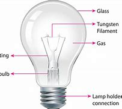
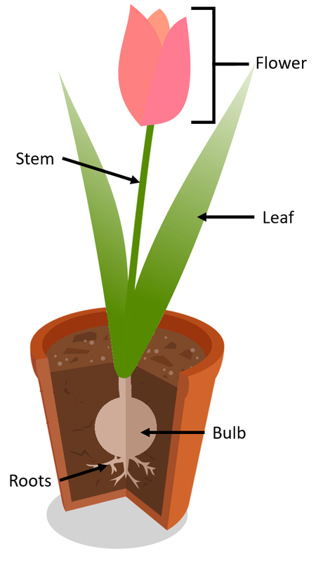

---

==== ▸ clog  [793]   +
な/klɒɡ/   +

【V-T】   When something _clogs_ a hole or place, it blocks it so that nothing can pass through. 堵塞 +
⇒  Dirt clogs the pores, causing blemishes.  尘垢堵塞了毛孔，由此产生了瑕疵。   +

【V-T】   to use a photo-enabled mobile phone to take a photograph of (someone) and send it to a website without his or her knowledge or consent 用有照相功能的手机(给某人)拍照并在未经许可的情况下发到网上 +
【N-COUNT】  _Clogs_ are heavy leather or wooden shoes with thick, wooden soles. 木屐   +

---

==== ▸ finalize  [794]   +
な/ˈfaɪnəˌlaɪz/   +

【V-T】   If you _finalize_ something such as a plan or an agreement, you complete the arrangements for it, especially by discussing it with other people. 最终确定 (计划、协议等) +
⇒  Negotiators from the three countries finalized the agreement in August.  3个国家的谈判代表在8月最终确定了协议。   +
⇒  We are saying nothing until all the details have been finalized.  在所有细节最终确定之前我们无可奉告。   +

---

==== ▸ ordeal  [795]   +
な/ɔːˈdiːl/   +
--> 来自古英语ordel,裁决，裁定，身体的磨难，来自Proto-Germanic*uz-dailjam,即deal out,神的安排，神的旨意，来自*uz,向外，词源同out,*dailijam,安排，分配，词源同deal.原指古代一种用折磨肉体来裁决对错的极其残忍的迷信审判，如使一个人赤脚走在烧红的铁块或铁板上，如果这个人安然无恙的走过这块铁板，则说明神判断他无罪，如果他倒在铁块上，则死有余辜。后引申词义磨难，折磨。 +

【N-COUNT】   If you describe an experience or situation as an _ordeal_, you think it is difficult and stressful. 煎熬 +
⇒  ...the painful ordeal of the last eight months.  …过去8个月里令人痛苦的煎熬。   +

---

==== ▸ impressive  [796]   +
な/ɪmˈprɛsɪv/   +

【ADJ】   Something that is _impressive_ impresses you, for example, because it is great in size or degree, or is done with a lot of skill. 令人敬佩的; 给人印象深刻的 +
⇒  It is an impressive achievement.  这是一项令人敬佩的成就。   +

【ADV】   令人敬佩地; 给人印象深刻地 +
⇒  ...an impressively bright and energetic woman called Cathie Gould.  …一个聪明过人而又精力充沛、名叫凯茜·古尔德的女人。   +

---

==== ▸ exceed  [797]   +
な/ɪkˈsiːd/   +

【V-T】   If something _exceeds_ a particular amount or number, it is greater or larger than that amount or number. 超过 (某数量) +
⇒  Its research budget exceeds $700 million a year.  其研究预算每年超过7亿美元。   +

【V-T】   If you _exceed_ a limit or rule, you go beyond it, even though you are not supposed to or it is against the law. 超越 (限制、规定) +
⇒  He accepts that he was exceeding the speed limit.  他承认他当时超过了速限。   +

---

==== ▸ reconcile  [798]   +
な/ˈrɛkənˌsaɪl/   +
--> 前缀re表“再、又”；con也是前缀，表“共同，一起”；cil为词根“呼喊，召唤”，它可以用形近单词call（呼喊）联想助记。字面意思是“重新叫到一起来”，引申为“使和好”。同根词council（委员会，会议），coun=con，即“叫到一起”来开会。+

【V-T】   If you _reconcile_ two beliefs, facts, or demands that seem to be opposed or completely different, you find a way in which they can both be true or both be successful. 使和谐一致; 调和 +
⇒  It's difficult to reconcile the demands of my job and the desire to be a good father.  协调我工作的要求与我当个好父亲的愿望很难。   +

【V-RECIP-PASSIVE】   If you _are reconciled with_ someone, you become friendly with them again after a quarrel or disagreement. 与…和好 +
⇒  He never believed he and Susan would be reconciled.  他不认为他和苏珊会和好。   +

【V-T】   If you _reconcile_ two people, you make them become friends again after a quarrel or disagreement. 使和解 +
⇒  ...my attempt to reconcile him with Toby.  …我使他与托比和解的努力。   +

【V-T】   If you _reconcile yourself to_ an unpleasant situation, you accept it, although it does not make you happy to do so. 妥协; 将就 +
⇒  She had reconciled herself to never seeing him again.  她不情愿地接受了再也不和他见面的事实。   +

【ADJ】   妥协的; 将就的 +
⇒  She felt, if not grateful for her own situation, at least a little more reconciled to it.  她觉得，即便对自己的处境不心存感激，至少能将就一些了。   +

---

==== ▸ rebellious  [799]   +
な/rɪˈbɛljəs/   +
-->  re-相反,反对 + -bell-战斗,战争 + -i- + -ous形容词词尾 +

【ADJ】   If you think someone behaves in an unacceptable way and does not do what they are told, you can say they are _rebellious_. 叛逆的 +
⇒  ...a rebellious teenager.  …一个叛逆的青少年。   +

【N-UNCOUNT】   叛逆性 +
⇒  ...the normal rebelliousness of youth.  …年轻人正常的叛逆性。   +

【ADJ】   A _rebellious_ group of people is a group involved in taking violent action against the rulers of their own country, usually in order to change the system of government there. (通常指为改变现行政治体制而) 反叛的 +
⇒  The rebellious officers, having seized the radio station, broadcast the news of the overthrow of the monarchy.  反叛的军官们占领广播电台后播发了推翻君主制的消息。   +

---

==== ▸ setback  [800]   +
な/ˈsɛtbæk/   +

【N-COUNT】   A _setback_ is an event that delays your progress or reverses some of the progress that you have made. 挫折; 倒退 +
⇒  The move represents a setback for the Middle East peace process.  此举意味着中东和平进程的倒退。   +

---

==== ▸ deficient  [801]   +
な/dɪˈfɪʃənt/   +

【ADJ】   If someone or something is _deficient in_ a particular thing, they do not have the full amount of it that they need in order to function normally or work properly. 缺乏的; 不足的 +
⇒  ...a diet deficient in vitamin B.  …缺少维生素B的饮食。   +

---

==== ▸ barren  [802]   +
な/ˈbærən/   +

【ADJ】   A _barren_ landscape is dry and bare, and has very few plants and no trees. 荒芜的 +
⇒  ...the Tibetan landscape of high barren mountains.  …西藏荒芜的高山景观。   +

【ADJ】  _Barren_ land consists of soil that is so poor that plants cannot grow in it. 贫瘠的 +
⇒  He wants to use the water to irrigate barren desert land.  他想用该水来灌溉贫瘠的沙漠土地。   +

【ADJ】   If you describe something such as an activity or a period of your life as _barren_, you mean that you achieve no success during it or that it has no useful results. 无成就的; 不成功的 +
⇒  ...an empty exercise barren of utility.  …一项毫无效用的无聊训练。   +

【ADJ】   If you describe a room or a place as _barren_, you do not like it because it has almost no furniture or other objects in it. 空荡荡的 +
⇒  The room was austere, nearly barren of furniture or decoration.  这个房间很简朴，几乎没有什么家具或装饰。   +

---

==== ▸ adopt  [803]   +
な/əˈdɒpt/   +

【V-T】   If you _adopt_ a new attitude, plan, or way of behaving, you begin to have it. 采纳; 采用 +
⇒  The United Nations General Assembly has adopted a resolution calling on all parties in the conflict to seek a political settlement.  联合国大会已采纳了一项呼吁所有冲突各方寻求政治解决的决议。   +

【N-UNCOUNT】   采纳; 采用 +
⇒  The group is working to promote the adoption of broadband wireless access over long distances.  该集团正在致力于推广远距离宽带无线访问的采用。   +

【V-T/V-I】   If you _adopt_ someone else's child, you take it into your own family and make it legally your son or daughter. 收养 +
⇒  There are hundreds of people desperate to adopt a child.  有数以百计的人极其渴望收养小孩。   +

【N-VAR】   收养 +
⇒  They gave their babies up for adoption.  他们放弃了自己的婴儿让别人收养。   +

---

==== ▸ conversion  [804]   +
な/kənˈvɜːʃən/   +

【N-VAR】  _Conversion_ is the act or process of changing something into a different state or form. (状态或形式的) 改变 +
⇒  ...the conversion of disused rail lines into cycle routes.  …把废弃的铁路改变成自行车道。   +

【N-VAR】   If someone changes their religion or beliefs, you can refer to their _conversion to_ their new religion or beliefs. 皈依 +
⇒  ...his conversion to Christianity.  …他对基督教的皈依。   +

---

==== ▸ retrieval  [805]   +
な/rɪˈtriːvəl/   +

【N-UNCOUNT】   The _retrieval_ of information from a computer is the process of getting it back. (电脑中信息的) 读取 +
⇒  ...electronic storage and retrieval systems.  …电子存储和读取系统。   +

【N-UNCOUNT】   The _retrieval_ of something is the process of getting it back from a particular place, especially from a place where it should not be. 找回; 取回 +
⇒  Its real purpose is the launching and retrieval of small aeroplanes in flight.  它的真正目的是发射和找回飞行中的小型飞机。   +

---

==== ▸ filial  [806]   +
な/ˈfɪljəl/   +
--> 来自拉丁语filius, 儿子，filia, 女儿，来自拉丁词根fe, 吮吸，喂奶，词源同fetal, fecund. +

【ADJ】   You can use _filial_ to describe the duties, feelings, or relationships which exist between a son or daughter and his or her parents. 子女辈的; 孝顺的 /[ usually before noun] ( formal ) connected with the way children behave towards their parents *子女（对父母）的* +
• filial affection/duty 子女的亲情╱孝道 +
⇒  His father would accuse him of neglecting his filial duties.  他父亲会指控他没有尽孝。   +

---

==== ▸ immature  [807]   +
な/ˌɪməˈtjʊə/   +

【ADJ】   Something or someone that is _immature_ is not yet completely grown or fully developed. 未发育完全的; 不成熟的 +
⇒  She is emotionally immature.  她在情感上不成熟。   +

【ADJ】   If you describe someone as _immature_, you are being critical of them because they do not behave in a sensible or responsible way. 冒失的 +
⇒  She's just being childish and immature.  她真是小孩子气，太冒失了。   +

---

==== ▸ dairy  [808]   +
な/ˈdɛərɪ/   +

【N-COUNT】   A _dairy_ is a company that sells milk and food made from milk, such as butter, cream, and cheese. 乳品公司 +
⇒  In my childhood, local dairies bought milk from local farmers.  在我小时候，本地的乳品公司向当地农场主收购牛奶。   +

【ADJ】  _Dairy_ is used to refer to foods such as butter and cheese that are made from milk. 奶制的 +
⇒  He avoids all meat and dairy products.  他不吃任何肉类和奶制品。   +

【ADJ】  _Dairy_ is used to refer to the use of cattle to produce milk rather than meat. 产乳的 +
⇒  ...a small vegetable and dairy farm.  …一个种菜、养奶牛的小农场。   +

---

==== ▸ diction  [809]   +
な/ˈdɪkʃən/   +

【N-UNCOUNT】   Someone's _diction_ is how clearly they speak or sing. 发音 +
⇒  His diction wasn't very good.  他的发音不是很好。   +

---

==== ▸ crippling  [810]   +
な/ˈkrɪplɪŋ/   +

【ADJ】   A _crippling_ illness or disability is one that severely damages your health or your body. 严重损害健康的; 致残的 +
⇒  Arthritis and rheumatism are prominent crippling diseases.  关节炎和风湿病是常见致残的疾病。   +

【ADJ】   If you say that an action, policy, or situation has a _crippling_ effect on something, you mean it has a very serious, harmful effect. 极有害的 +
⇒  The high cost of capital has a crippling effect on many small firms.  高资本成本对许多小公司有着极坏的影响。   +

---

==== ▸ spectrum  [811]   +
な/ˈspɛktrəm/   +

【N-SING】  _The spectrum_ is the range of different colours which is produced when light passes through a glass prism or through a drop of water. A rainbow shows the colours in the spectrum. 光谱 +
【N-COUNT】   A _spectrum_ is a range of a particular type of thing. 范围   +
⇒  She'd seen his moods range across the emotional spectrum.  她见过他在各种情感间的情绪变化。   +
⇒  Politicians across the political spectrum have denounced the act.  政界圈各派政客都谴责了这种行为。   +

---

==== ▸ confederacy  [812]   +
な/kənˈfɛdərəsɪ/   +

【N-COUNT】   A _confederacy_ is a union of states or people who are trying to achieve the same thing. 同盟; 联盟 +
⇒  They've entered this new confederacy because the central government's been unable to control the collapsing economy.  他们已经参加了这个新同盟，因为中央政府已经不能控制摇摇欲坠的经济了。   +

【N-PROPER】   The 11 southern states that fought against the North in the American Civil War are sometimes referred to as _the Confederacy_. 美国内战时的南部邦联 +

---

==== ▸ perspicuous  [813]   +
な/pəˈspɪkjʊəs/   +

【ADJ】   (of speech or writing) easily understood; lucid (言语或作品)易懂的; 明晰的 +

---

==== ▸ exchange  [814]   +
な/ɪksˈtʃeɪndʒ/   +

【V-RECIP】   If two or more people _exchange_ things of a particular kind, they give them to each other at the same time. 交换 +
⇒  We exchanged addresses.  我们交换了地址。   +
⇒  The two men exchanged glances.  那两个人交换了眼神。   +

【N-COUNT】  _Exchange_ is also a noun. 交换 +
⇒  He ruled out any exchange of prisoners with the militants.  他拒绝考虑与好战分子交换囚犯。   +

【V-T】   If you _exchange_ something, you replace it with a different thing, especially something that is better or more satisfactory. 调换; 更换 +
⇒  ...the chance to sell back or exchange goods.  …回售或调换货物的机会。   +

【N-COUNT】   An _exchange_ is a brief conversation, usually an angry one. 短暂的交谈; 争吵 +
⇒  There've been some bitter exchanges between the two groups.  两组之间有过些激烈的争吵。   +

【N-COUNT】   An _exchange of_ fire, for example, is an incident in which people use guns or missiles against each other. 交火 +
⇒  There was an exchange of fire during which the gunman was wounded.  发生了一场交火，其间那名枪手受伤了。   +

【N-COUNT】   An _exchange_ is an arrangement in which people from two different countries visit each other's country, to strengthen links between them. 交流 +
⇒  ...a series of sporting and cultural exchanges with Seoul.  …与首尔的一系列体育和文化交流。   +

【PHRASE】   If you do or give something _in exchange for_ something else, you do it or give it in order to get that thing. 作为交换 +
⇒  It is illegal for public officials to solicit gifts or money in exchange for favours.  公务员以提供便利来索取礼物或金钱作为交换是非法的。   +

---

==== ▸ cluster  [815]   +
な/ˈklʌstə/   +

【N-COUNT】   A _cluster of_ people or things is a small group of them close together. (人或物的) 群 +
⇒  ...clusters of men in formal clothes.  …几组身着正装的男人。   +

【V-I】   If people _cluster together_, they gather together in a small group. (人) 结成群 +
⇒  The passengers clustered together in small groups.  乘客们聚集成小群体。   +

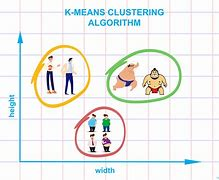

---

==== ▸ abiding  [816]   +
な/əˈbaɪdɪŋ/   +
--> abide = a（处于）+bide（逗留）→停留→忍受。 词源解释：bide←古英语bidan（逗留）←原始日耳曼语bidan（逗留）。 同源词：bide（等待、居住，忍受）、abiding（持久的）、abode（住所、营业所）。 +

【ADJ】   An _abiding_ feeling, memory, or interest is one that you have for a very long time. 持久的 (感情、记忆、兴趣) +
⇒  He has a genuine and abiding love of the craft.  他对这门手艺有着一种发自内心和持久不变的热爱。   +

---

==== ▸ novel  [817]   +
な/ˈnɒvəl/   +

【N-COUNT】   A _novel_ is a long written story about imaginary people and events. 长篇小说 +
⇒  ...a novel by Herman Hesse.  …一部赫尔曼·赫西写的长篇小说。   +

【N-COUNT】   a new decree or an amendment to an existing statute 新法; 附律 +
【ADJ】  _Novel_ things are new and different from anything that has been done, experienced, or made before. 新奇的   +
⇒  Protesters found a novel way of demonstrating against steeply rising oil prices.  抗议者们找到一种新奇的示威方式来反对石油价格的飙升。   +

---

==== ▸ sponge  [818]   +
な/spʌndʒ/   +

【N-COUNT】  _Sponge_ is a very light soft substance with lots of little holes in it, which can be either artificial or natural. It is used to clean things or as a soft layer. 海绵 +
⇒  ...a sponge mattress.  …一张海绵床垫。   +

【N-COUNT】   A _sponge_ is a piece of sponge that you use for washing yourself or for cleaning things. (洗澡或清洁用的) 海绵块 +
⇒  He wiped off the table with a sponge.  他用一块海绵擦了桌子。   +

【V-T】   If you _sponge_ something, you clean it by wiping it with a wet sponge. 用湿海绵擦拭 +
⇒  Fill a bowl with water and gently sponge your face and body.  装满一碗水，然后用湿海绵轻轻擦洗你的脸和身子。   +

【PHRASAL VERB】  _Sponge down_ means the same as . 用湿海绵擦洗 +
⇒  If your child's temperature rises, sponge her down gently with tepid water.  如果你孩子的体温升高，用湿海绵沾温水轻轻地擦洗她。   +

【V-I】   If you say that someone _sponges off_ other people or _sponges on_ them, you mean that they regularly get money from other people when they should be trying to support themselves. 揩油 +
⇒  He should just get an honest job and stop sponging off the rest of us!  他就应该找一份踏实的工作，不要再揩我们其他人的油了！   +

【N-VAR】   A _sponge_ is a light cake or pudding made from flour, eggs, sugar, and sometimes shortening. 松软蛋糕; 松软布丁 +

---

==== ▸ gemstone  [819]   +
な/ˈdʒɛmˌstəʊn/   +

【N-COUNT】   A _gemstone_ is a jewel or stone used in jewellery. 宝石 +

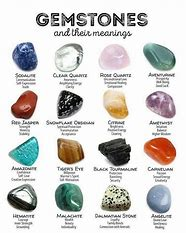

---

==== ▸ address  [820]   +
な【N-COUNT】   Your _address_ is the number of the house or apartment and the name of the street and the town where you live or work. 地址   +
⇒  The address is 2025 M Street, NW, Washington, DC, 20036.  地址是华盛顿哥伦比亚特区，华盛顿西北，M街2025号，邮编20036。   +

【N-COUNT】   The _address_ of a website is its location on the Internet, for example, http://www.thomson.com. 网址 +
⇒  Full details, including the website address to log on to, are at the bottom of this page.  包括要登陆的网址的完整信息在本页下端。   +

【V-T】   If a letter, envelope, or parcel _is addressed to_ you, your name and address have been written on it. 写 (收信人的) 姓名地址 +
⇒  Applications should be addressed to: The business affairs editor.  申请信应该寄给商务编辑。   +

【V-T】   If you _address_ a group of people, you give a speech to them. 作演讲 +
⇒  He is due to address a conference on human rights next week.  他下周要在一个人权会议上发言。   +

【N-COUNT】  _Address_ is also a noun. 演讲 +
⇒  He had scheduled an address to the American people for the evening of May 27.  他已经安排在5月27日晚向美国人民作一个演讲。   +

---

==== ▸ intervening  [821]   +
な/ˌɪntəˈviːnɪŋ/   +

【ADJ】   An _intervening_ period of time is one that separates two events or points in time. 发生于其间的 +
⇒  During those intervening years Bridget had married her husband Robert.  在其间的那些年里，布里奇特与罗伯特结为夫妻。   +

【ADJ】   An _intervening_ object or area comes between two other objects or areas. 介于中间的 +
⇒  They had scoured the intervening miles of desert.  他们已经搜索了那介于中间几英里宽的沙漠地带。   +

---

==== ▸ tenant  [822]   +
な/ˈtɛnənt/   +
--> tenant和tennis、obtain是同根词，词根ten、tain表“抓住，拿住”。词源上，tenant的本义是“持有者”，就是暂时拿着、占着某物的人。该词词义统一于“租借”，房客租借房间，佃户向地主租借田地。同根词tenure（保有权，占有）。 +

【N-COUNT】   A _tenant_ is someone who pays rent for the place they live in, or for land or buildings that they use. 租户; 佃户 +
⇒  Regulations placed clear obligations on the landlord for the benefit of the tenant.  为了租户的利益，条列给房东规定了明确的义务。   +

---

==== ▸ postage  [823]   +
な/ˈpəʊstɪdʒ/   +

【N-UNCOUNT】  _Postage_ is the money that you pay for sending letters and packages by mail. 邮资 +
⇒  All prices include postage and handling.  所有价格都包含邮资和手续费。   +

---

==== ▸ disorder  [824]   +
な/dɪsˈɔːdə/   +

【N-VAR】   A _disorder_ is a problem or illness which affects someone's mind or body. 紊乱 +
⇒  ...a rare nerve disorder that can cause paralysis of the arms.  …一种罕见的能导致手臂瘫痪的神经紊乱疾病。   +

【N-VAR】  _Disorder_ is violence or rioting in public. 动乱 +
⇒  Six months ago America's worst civil disorder in more than 100 years erupted in the city of Los Angeles.  6个月前，美国100多年来最严重的市民骚乱在洛杉矶市爆发了。   +

【N-UNCOUNT】  _Disorder_ is a state of being untidy, badly prepared, or badly organized. 混乱 +
⇒  The emergency room was in disorder.  急救室一片混乱。   +

---

==== ▸ dormitory  [825]   +
な/ˈdɔːmɪtərɪ/   +

【N-COUNT】   A _dormitory_ is a building at a college or university where students live. 宿舍楼 +
⇒  She lived in a college dormitory.  她住在一幢大学宿舍楼里。   +

【N-COUNT】   A _dormitory_ is a large bedroom where several people sleep, for example, in a boarding school. 宿舍 +
⇒  ...the boys' dormitory.  …男生宿舍。   +

【ADJ】   If you refer to a place as a _dormitory community_ or _suburb_, you mean that most of the people who live there travel to work in a city or another, larger town a short distance away. (指通勤者居住的) 卧室社区 +

---

==== ▸ tuition  [826]   +
な/tjuːˈɪʃən/   +
-->  -tuit-监护,看管 + -ion名词词尾 +

【N-UNCOUNT】   You can use _tuition_ to refer to the amount of money that you have to pay for being taught in a university, college, or private school. 学费 +
⇒  Angela's $7,000 tuition at university this year will be paid for with scholarships.  安吉拉今年$7000的大学学费将用奖学金来支付。   +

【N-UNCOUNT】   If you are given _tuition_ in a particular subject, you are taught about that subject. 指导 +

---

==== ▸ sprain  [827]   +
な/spreɪn/   +
--> 词源不确定，可能来自 PIE*sper,弯，转，词源同 spiral,旋转的。引申比喻义扭伤。 +

【V-T】   If you _sprain_ a joint such as your ankle or wrist, you accidentally damage it by twisting it or bending it violently. 扭伤 (关节) +
⇒  He fell and sprained his ankle.  他跌了一跤，扭伤了脚踝。   +

【N-COUNT】   A _sprain_ is the injury caused by spraining a joint. 扭伤 +
⇒  Rubin suffered a right ankle sprain when she rolled over on her ankle.  鲁宾摔倒时身体压到了脚踝上导致右脚踝扭伤。   +

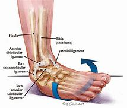

---

==== ▸ rape  [828]   +
な/reɪp/   +

【V-T】   If someone _is raped_, they are forced to have sex, usually by violence or threats of violence. 强奸 +
⇒  A young woman was brutally raped in her own home.  一个年轻妇女在自己家中被粗暴地强奸了。   +

【N-VAR】  _Rape_ is the crime of forcing someone to have sex. 强奸罪 +
⇒  Almost 90 percent of all rapes and violent assaults went unreported.  几乎百分之九十的强奸和暴力攻击都没有报警。   +

【N-COUNT】  _Rape_ is a plant with yellow flowers which is grown as a crop. Its seeds are crushed to make cooking oil. 油菜 +

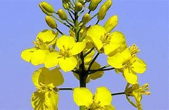

【N】   the skins and stalks of grapes left after wine-making: used in making vinegar (用于制醋的)葡萄渣   +

---

==== ▸ resign  [829]   +
な/rɪˈzaɪn/   +

【V-T/V-I】   If you _resign_ from a job or position, you formally announce that you are leaving it. 辞职 +
⇒  A hospital administrator has resigned over claims he lied to get the job.  一位医院主管因为有人声称他的职位是骗来的而辞职了。   +
⇒  Mr Robb resigned his position last month.  罗布先生上个月辞去了他的职位。   +

【V-T】   If you _resign yourself to_ an unpleasant situation or fact, you accept it because you realize that you cannot change it. 使屈从 +
⇒  Pat and I resigned ourselves to yet another summer without a boat.  帕特和我将就着又过了一个没有船的夏天。   +

---

==== ▸ disrupt  [830]   +
な/dɪsˈrʌpt/   +

【V-T】   If someone or something _disrupts_ an event, system, or process, they cause difficulties that prevent it from continuing or operating in a normal way. 妨碍; 扰乱 +
⇒  Anti-war protesters disrupted the debate.  反战示威者们扰乱了辩论。   +

---

==== ▸ candidate  [831]   +
な/ˈkændɪˌdeɪt/   +
--> 来自词根cand, 照明，白色，词源同candle,蜡烛。因古罗马时期谋求官职者着白衣进行政治演说或游说而得名。 +

【N-COUNT】   A _candidate_ is someone who is being considered for a position, for example someone who is running in an election or applying for a job. 候选人 +
⇒  The Democratic candidate is still leading in the polls.  那名民主党候选人仍在民意测验中领先。   +
⇒  He is a candidate for the office of governor.  他是州长的候选人。   +

【N-COUNT】   A _candidate_ is someone who is studying for a degree at a college. 攻读学位者 +
⇒  He is now a candidate for a Master's degree in social work at San Francisco State University.  他目前在旧金山州立大学攻读社会工作硕士学位。   +

【N-COUNT】   A _candidate_ is a person or thing that is regarded as being suitable for a particular purpose or as being likely to do or be a particular thing. 有望做…的人; 有望成为…的事 +
⇒  Those who are overweight or indulge in high-salt diets are candidates for hypertension.  那些身体超重或饮食偏咸的人属于易患高血压症的人群。   +

---

==== ▸ neuron  [832]   +
な/ˈnjʊərɒn/   +
(n.) ( especially in BrE neur·one   /ˈnjʊərəʊn/
  ) ( biology 生) a cell that carries information within the brain and between the brain and other parts of the body; a nerve cell 神经元

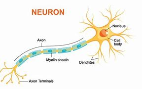

---

==== ▸ continuum  [833]   +
な/kənˈtɪnjʊəm/   +

【N-COUNT】   A _continuum_ is a set of things on a scale, which have a particular characteristic to different degrees. 连续统一体  /  a series of similar items in which each is almost the same as the ones next to it but the last is very different from the first （相邻两者相似但起首与末尾截然不同的）连续体 +
⇒  These various complaints are part of a continuum of ill-health.  这些不同的抱怨是健康连续欠佳的一部分。   +

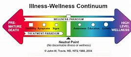

---

==== ▸ depict  [834]   +
な/dɪˈpɪkt/   +

【V-T】   To _depict_ someone or something means to show or represent them in a work of art such as a drawing or painting. 描绘 +
⇒  ...a gallery of pictures depicting Lee's most famous battles.  …一批描绘李的最著名战役的图画。   +

---

==== ▸ balcony  [835]   +
な/ˈbælkənɪ/   +
--> balc, 树干, 词源同bole, balk. 原指用树干搭建的简易阳台。 +

【N-COUNT】   A _balcony_ is a platform on the outside of a building, above ground level, with a wall or railing around it. 阳台 +
【N-SING】   The _balcony_ in a theatre or cinema is an area of seats above the main seating area. (戏院或电影院里的) 楼座   +

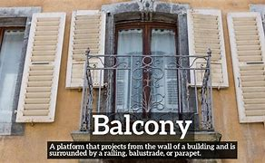

---

==== ▸ era  [836]   +
な/ˈɪərə/   +

【N-COUNT】   You can refer to a period of history or a long period of time as an _era_ when you want to draw attention to a particular feature or quality that it has. 时代 +
⇒  ...the nuclear era.  …核时代。   +
⇒  ...the Reagan-Bush era.  …里根－布什时期。   +

---

==== ▸ blossom  [837]   +
な/ˈblɒsəm/   +

【N-VAR】  _Blossom_ is the flowers that appear on a tree before the fruit. (果树的) 花 +
⇒  The cherry blossom came out early in Washington this year.  华盛顿的樱花今年开得早。   +

【V-I】   If someone or something _blossoms_, they develop good, attractive, or successful qualities. 成功发展 +
⇒  Why do some people take longer than others to blossom?  为什么有些人比其他人大器晚成呢？   +
⇒  What began as a local festival has blossomed into an international event.  开始时的一个地方节日已经发展成了一个国际盛会。   +

【V-I】   When a tree _blossoms_, it produces blossom. (树) 开花 +
⇒  Rain begins to fall and peach trees blossom.  雨开始下，桃树就开花了。   +

---

==== ▸ break  [838]   +
な/breɪk/   +

【V-T/V-I】   When an object _breaks_ or when you _break_ it, it suddenly separates into two or more pieces, often because it has been hit or dropped. 打碎; 破碎 +
⇒  He fell through the window, breaking the glass.  他打破玻璃，从窗口摔了出去。   +
⇒  The plate broke.  盘子碎了。   +
⇒  The plane broke into three pieces.  那架飞机碎成了3块。   +

【V-T/V-I】   If you _break_ a part of your body such as your leg, your arm, or your nose, or if a bone _breaks_, you are injured because a bone cracks or splits. 弄折 (骨头); 骨折 +
⇒  She broke a leg in a skiing accident.  她在一次滑雪事故中摔断了一条腿。   +
⇒  Old bones break easily.  老骨头容易骨折。   +

【N-COUNT】  _Break_ is also a noun. 骨折 +
⇒  It has caused a bad break to Gabriella's leg.  这导致了加布里埃拉的一条腿严重骨折。   +

【V-T/V-I】   If a surface, cover, or seal _breaks_ or if something _breaks_ it, a hole or tear is made in it, so that a substance can pass through. 拆裂; 开裂 +
⇒  Once you've broken the seal of a bottle there's no way you can put it back together again.  一旦你撕开瓶子的封口,就没法将它重新合上。   +
⇒  The bandage must be put on when the blister breaks.  水疱破口后必须包扎上绷带。   +

【V-T/V-I】   When a tool or piece of machinery _breaks_ or when you _break_ it, it is damaged and no longer works. 损坏 +
⇒  When the clutch broke, the car was locked into second gear.  离合器损坏了后,那辆轿车被锁在了二档。   +
 ▷ break   +
な/breɪk/   +

【V-T/V-I】 +
【V-T】   If someone _breaks_ something, especially a difficult or unpleasant situation that has existed for some time, they end it or change it. 结束; 打破 (困难或不快的情形)   +
⇒  We need to break the vicious cycle of violence and counterviolence.  我们需要结束暴力和反暴力的恶性循环。   +
⇒  New proposals have been put forward to break the deadlock among rival factions.  新的提议已被提出来以打破对立派之间的僵局。   +

【N-COUNT】  _Break_ is also a noun. 结束; (对困难或不快的情形的) 打破 +
⇒  Nothing that might lead to a break in the deadlock has been discussed yet.  任何可能促成僵局破除的举措尚未被讨论。   +

【V-T】   If someone or something _breaks_ a silence, they say something or make a noise after a long period of silence. 打破 (沉默) +
⇒  Hugh broke the silence. "Is she always late?" he asked.  休打破了沉默。问道：“她总是迟到吗？”   +

【V-T/V-I】   If you _break with_ a group of people or a traditional way of doing things, or you _break_ your connection with them, you stop being involved with that group or stop doing things in that way. 断绝 (关系); 打破 (传统) +
⇒  In 1959, Akihito broke with imperial tradition by marrying a commoner.  1959年,明仁天皇打破皇室传统,与一个平民结了婚。   +
⇒  They were determined to break from precedent.  他们决心打破先例。   +

【N-COUNT】  _Break_ is also a noun. (对关系的) 断绝; (对传统的) 打破 +
⇒  Making a completely clean break with the past, the couple got rid of all their old furniture.  为了与过去断得一干二净,这对夫妻丢弃了他们所有的旧家具。   +

【V-T】   If you _break_ a habit or if someone _breaks_ you _of_ it, you no longer have that habit. 戒除 (习惯) +
⇒  If you continue to smoke, keep trying to break the habit.  如果你继续吸烟,继续试着戒掉这一习惯吧。   +

【V-I】   If someone _breaks for_ a short period of time, they rest or change from what they are doing for a short period. (短暂) 休息 +
⇒  They broke for lunch.  他们停下来吃午饭。   +

【N-COUNT】   A _break_ is a short period of time when you have a rest or a change from what you are doing, especially if you are working or if you are in a boring or unpleasant situation. 短暂休息 +
⇒  They may be able to help with childcare so that you can have a break.  他们或许能帮忙看孩子,这样你可以歇歇。   +
⇒  I thought a 15 minute break from his work would do him good.  我认为15分钟的工作休息对他会有好处。   +

【N-COUNT】   A _break_ is a short holiday. 短假 +
⇒  They are currently taking a short break in Spain.  他们目前在西班牙休短假。   +

【V-T】   If you _break_ your journey somewhere, you stop there for a short time so that you can have a rest. (旅行中) 使歇脚 +
⇒  We broke our journey at a small country hotel.  我们在一家小乡村旅店歇了歇脚。   +
 ▷ break   +
な/breɪk/   +

【V-T】 +
【V-T】   If you _break_ a rule, promise, or agreement, you do something that you should not do according to that rule, promise, or agreement. 违反   +
⇒  We didn't know we were breaking the law.  我们那时不知道我们在违法。   +
⇒  The company has consistently denied it had knowingly broken arms embargoes.  该公司始终否认故意违反了武器禁运规定。   +

【V-I】   If you _break_ free or loose, you free yourself from something or escape from it. 挣脱 +
⇒  She broke free by thrusting her elbow into his chest.  她用胳膊肘猛杵他的胸部挣脱了开来。   +

【V-T】   To _break_ the force of something such as a blow or fall means to weaken its effect, for example, by getting in the way of it. 减弱 (打击、坠落等的力度) +
⇒  He sustained serious neck injuries after he broke someone's fall.  他被坠落的人砸中之后受了严重颈伤。   +

【V-I】   When a piece of news _breaks_, people hear about it from the newspapers, television, or radio. (消息) 传开 +
⇒  The news broke that Montgomery was under investigation.  消息传出说蒙哥马利在受到调查。   +

【V-T】   When you _break_ a piece of bad news to someone, you tell it to them, usually in a kind way. (常指善意地) 说出 (不好的消息) +
⇒  Then Louise broke the news that she was leaving me.  之后路易丝说出了她要离开我的消息。   +

【N-COUNT】   A _break_ is a lucky opportunity that someone gets to achieve something. 时来运转 +
⇒  Her first break came when she was chosen out of 100 guitarists auditioning for a spot on Michael Jackson's tour.  她的第一次时来运转是被从100名吉他手的试奏中选出来参加迈克尔·杰克逊的巡演。   +

【V-T】   If you _break_ a record, you beat the previous record for a particular achievement. 打破 (记录) +
⇒  Carl Lewis has broken the world record in the 100 metres.  卡尔·刘易斯打破了百米赛跑的世界纪录。   +

【V-I】   When day or dawn _breaks_, it starts to grow light after the night has ended. 破晓 +
⇒  They continued the search as dawn broke.  他们在天亮之后继续搜寻。   +

【V-I】   When a wave _breaks_, it passes its highest point and turns downward, for example, when it reaches the shore. (波浪) 落下 +
⇒  Danny listened to the waves breaking against the shore.  丹尼听着波浪拍岸的声音。   +

【V-T】   If you _break_ a secret code, you work out how to understand it. 破解 (密码) +
⇒  It was feared they could break the Allies' codes.  只怕他们能破解盟军的密码。   +

【V-I】   If someone's voice _breaks_ when they are speaking, it changes its sound, for example, because they are sad or afraid. (嗓音因悲伤、害怕等而) 变调 +
⇒  Godfrey's voice broke, and halted.  戈弗雷的嗓音变了调,然后停了下来。   +

【V-I】   When a boy's voice _breaks_, it becomes deeper and sounds more like a man's voice. (男孩) 变声 +
⇒  He sings with the strained discomfort of someone whose voice hasn't quite broken.  他紧张不适地唱着, 嗓音像个还未完全变声的人。   +

【V-I】   If the weather _breaks_ or a storm _breaks_, it suddenly becomes rainy or stormy after a period of sunshine. (天气) 突变; (暴风雨) 骤起 +
⇒  I've been waiting for the weather to break.  我一直在等待下雨。   +

---

==== ▸ digression  [839]   +
(n.) 离题；脱轨

---

==== ▸ geology  [840]   +
な/dʒɪˈɒlədʒɪ/   +

【N-UNCOUNT】  _Geology_ is the study of the Earth's structure, surface, and origins. 地质学 +
⇒  He was visiting professor of geology at the University of Georgia.  他曾是佐治亚大学的地质学客座教授。   +

【N-COUNT】   地质学家 +
⇒  Geologists have studied the way that heat flows from the earth.  地质学家们已经研究了热量从地表流出的方式。   +

【N-UNCOUNT】   The _geology_ of an area is the structure of its land, together with the types of rocks and minerals that exist within it. 地质状况 +
⇒  ...the geology of Asia.  …亚洲的地质状况。   +

---

==== ▸ blame  [841]   +
な/bleɪm/   +

【V-T】   If you _blame_ a person or thing _for_ something bad, or if you _blame_ something bad _on_ somebody, you believe or say that they are responsible for it or that they caused it. 指责; 把…归咎于 +
⇒  The commission is expected to blame the army for many of the atrocities.  该委员会预计会将大量暴行归咎于军队。   +
⇒  Ms. Carey appeared to blame her breakdown on EMI's punishing work schedule.  凯丽女士看来是将自己的崩溃归咎于百代公司紧张的工作安排。   +

【N-UNCOUNT】  _Blame_ is also a noun. 责备 +
⇒  Nothing could relieve my terrible sense of blame.  没什么能把我从极度自责中解脱出来。   +

【N-UNCOUNT】   The _blame for_ something bad that has happened is the responsibility for causing it or letting it happen. (事故、过失等的) 责任 +
⇒  I'm not going to sit around and take the blame for a mistake he made.  我不会闲坐着，为他犯的错误承担责任。   +

【V-T】   If you say that you do not _blame_ someone _for_ doing something, you mean that you consider it was a reasonable thing to do in the circumstances. 责怪 +
⇒  I do not blame them for trying to make some money.  我不怪他们想要挣些钱。   +

【PHRASE】   If someone is _to blame for_ something bad that has happened, they are responsible for causing it. 该受责备 +
⇒  If their forces were not involved, then who is to blame?  如果他们的军队没有参与，那么谁应该受到指责呢？   +

【PHRASE】   If you say that someone _has only_ themselves _to blame_ or _has no one but_ themselves _to blame_, you mean that they are responsible for something bad that has happened to them and that you have no sympathy for them. 只能责怪自己 +
⇒  My life is ruined and I suppose I only have myself to blame.  我的一生都毁了，我想这只能怪我自己。   +

---

==== ▸ accuracy  [842]   +
な/ˈækjʊrəsɪ/   +

【N-UNCOUNT】   The _accuracy of_ information or measurements is their quality of being true or correct, even in small details. 精确 (性); 准确 (性) +
⇒  Every care has been taken to ensure the accuracy of all information given in this leaflet.  已经采取了一切措施来保证这张传单上所有信息的准确。   +

【N-UNCOUNT】   If someone or something performs a task, for example, hitting a target, _with accuracy_, they do it in an exact way without making a mistake. 准确无误 +
⇒  ...weapons that could fire with accuracy at targets 3,000 yards away.  …那些可以准确无误地射中3000码以外的目标的武器。   +

---

==== ▸ eligible  [843]   +
な/ˈɛlɪdʒəbəl/   +

【ADJ】   Someone who is _eligible to_ do something is qualified or able to do it, for example, because they are old enough. 有资格的 +
⇒  Almost half the population are eligible to vote in today's election.  将近一半的居民有资格在今天的选举中投票。   +

【N-UNCOUNT】   资格; 合格 +
⇒  The rules covering eligibility for benefits changed in the 1980s.  关于社会救济金合格条件的规定在20世纪80年代发生了变化。   +

【ADJ】   An _eligible_ man or woman is not yet married and is thought by many people to be a suitable partner. (指结婚对象) 令人中意的 +
⇒  He's the most eligible bachelor in Japan.  他是日本最令人中意的单身汉。   +

---

==== ▸ facility  [844]   +
な/fəˈsɪlɪtɪ/   +
--> -fac-做,作 + -ile形容词词尾(e略) + -ity名词词尾 +

【N-COUNT】  _Facilities_ are buildings, pieces of equipment, or services that are provided for a particular purpose. 设施 +
⇒  What recreational facilities are now available?  什么娱乐设施现在是可用的？   +

【N-COUNT】   A _facility_ is something such as an additional service provided by an organization or an extra feature on a machine which is useful but not essential. 附加服务; 附加功能 +
⇒  One of the new models has the facility to reproduce speech as well as text.  新款型中的一款有复制言语和文本的附加功能。   +

【N-COUNT】   If you have a _facility_ for something, for example learning a language, you find it easy to do. 天赋 +
⇒  He and Marcia shared a facility for languages.  他和马西娅都具有语言天赋。   +

---

==== ▸ forage  [845]   +
な/ˈfɒrɪdʒ/   +
--> 来自Proto-Germanic*fodram, 食物，觅食，词源同food, fodder. +

【V-I】   If someone _forages for_ something, they search for it in a busy way. 匆忙搜寻 +
⇒  They were forced to forage for clothing and fuel.  他们被迫匆忙搜寻衣物和燃料。   +

【V-I】   When animals _forage_, they search for food. (动物) 觅食 +
⇒  We disturbed a wild boar that had been foraging by the roadside.  我们惊动了一只在路边觅食的野公猪。   +

---

==== ▸ wedge-shaped  [846]   +

(a.)楔形的; V 形的

---

==== ▸ territory  [847]   +
な/ˈtɛrɪtərɪ/   +

【N-VAR】  _Territory_ is land which is controlled by a particular country or ruler. 领土 +
⇒  The government denies that any of its territory is under rebel control.  该政府否认有任何领土被叛乱者控制。   +
⇒  ...the view that the US should use military force only when our borders or US territories are attacked.  …那种观点认为只有我们的边界或美国领土受到袭击时美国才应该使用武力。   +

【N-COUNT】   A _territory_ is a country or region that is controlled by another country. 属地 +
⇒  He toured some of the disputed territories now under UN control.  他巡访过一些现归联合国管辖的有争议的属地。   +

【N-UNCOUNT】   You can use _territory_ to refer to an area of knowledge or experience. 领域 +
⇒  Following the futuristic "The Handmaid's Tale," Margaret Atwood's seventh novel, "Cat's Eye," returns to more familiar territory.  在推出具有未来主义色彩的《女仆的故事》之后，玛格丽特·阿特伍德的第7部小说《猫眼》返回了更为熟悉的领域。   +

【N-VAR】   An animal's _territory_ is an area which it regards as its own and which it defends when other animals try to enter it. (动物的) 地盘 +
⇒  The territory of a cat only remains fixed for as long as the cat dominates the area.  猫的地盘只在它占据那个地方的时候才保持稳定不变。   +

【N-UNCOUNT】  _Territory_ is land with a particular character. (具有某种特征的) 地带 +
⇒  ...mountainous territory.  …多山地带。   +

---

==== ▸ flick  [848]   +
な/flɪk/   +
--> 来自辅音丛bl, fl, 折腾，拍打，拟声词，词源同flap, flip. -ck, 清脆音，比较click. +

【V-T/V-I】   If something _flicks_ in a particular direction, or if someone _flicks_ it, it moves with a short, sudden movement. 迅速地移动 +
⇒  His tongue flicked across his lips.  他的舌头在双唇间快速移动。   +
⇒  He flicked his cigarette out of the window.  他倏地一下把香烟弹出了窗外。   +

【N-COUNT】  _Flick_ is also a noun. 快速的移动 +
⇒  ...a flick of a paintbrush.  …画笔的一次快速移动。   +

【V-T】   If you _flick_ something away, or off something else, you remove it with a quick movement of your hand or finger. (用手或手指) 弹掉 +
⇒  Shirley flicked a piece of lint from the sleeve of her black suit.  雪莉轻轻弹掉了黑色套装袖子上的一块棉绒。   +

【V-T】   If you _flick_ something such as a whip or a towel, or _flick_ something with it, you hold one end of it and move your hand quickly up and then forward, so that the other end moves. 抽打 +
⇒  She sighed and flicked a dishcloth at the counter.  她叹了口气，用一块洗碗布在柜台上抽打了一下。   +

【N-COUNT】  _Flick_ is also a noun. 抽打 +
⇒  ...a flick of the whip.  …鞭子的一下轻抽。   +

【V-T】   If you _flick_ a switch, or _flick_ an electrical appliance on or off, you press the switch sharply so that it moves into a different position and works the equipment. 啪地打开或关掉 (开关或电器) +
⇒  Sam was flicking a flashlight on and off.  萨姆正啪啪不停地开关着手电筒。   +

【V-I】   If you _flick through_ a book or magazine, you turn its pages quickly, for example, to get a general idea of its contents or to look for a particular item. If you _flick through_ television channels, you continually change channels very quickly, usually using a remote control. 快速翻看 +
⇒  She was flicking through some magazines on a table.  她正在快速翻阅桌子上的一些杂志。   +

【N-SING】  _Flick_ is also a noun. 快速翻看 +
⇒  I thought I'd have a quick flick through some recent issues.  我想我要快速浏览一下最近的几期杂志了。   +

【N】   a cinema film 一部影院放映的电影 +

---

==== ▸ retrieve  [849]   +
な/rɪˈtriːv/   +

【V-T】   If you _retrieve_ something, you get it back from the place where you left it. 找回; 取回 +
⇒  The men were trying to retrieve weapons left when the army abandoned the island.  那些人正试图找回该军队撤离这个岛时留下的武器。   +

【V-T】   If you manage to _retrieve_ a situation, you succeed in bringing it back into a more acceptable state. 挽回 +
⇒  He, the one man who could retrieve that situation, might receive the call.  他这个惟一能挽回那个局面的人可能会接到这个电话。   +

【V-T】   To _retrieve_ information from a computer or from your memory means to get it back. (从电脑中) 读取 (信息) +
⇒  Computers can instantly retrieve millions of information bits.  计算机能立刻读取数百万条信息。   +

---

==== ▸ verbalize  [850]   +
な/ˈvɜːbəˌlaɪz/   +

【V-T】   If you _verbalize_ your feelings, thoughts, or ideas, you express them in words. 用言语表达 +
⇒  ...his inability to verbalize his feelings.  ...他无法用言语表达自己的感情。   +

---

==== ▸ canvass  [851]   +
な/ˈkænvəs/   +
--> 来自canvas, 原指用帆布筛选种子等，后指针对特定人进行游说，拉选票。 +

【V-I】   If you _canvass for_ a particular person or political party, you go around an area trying to persuade people to vote for that person or party. 拉选票 +
⇒  I'm canvassing for the Republican Party.  我在为共和党拉选票。   +

【V-T】   If you _canvass_ public opinion, you find out how people feel about a particular subject. 征求 (意见) +
⇒  Members of Congress are spending the weekend canvassing opinion in their constituencies.  国会议员利用周末在各自的选区征求意见。   +

---

==== ▸ noteworthy  [852]   +
な/ˈnəʊtˌwɜːðɪ/   +

【ADJ】   A fact or event that is _noteworthy_ is interesting, remarkable, or significant in some way. 值得关注的 +
⇒  It is noteworthy that the programme has been shifted from its original August slot to July.  该节目从最初的8月档移到7月值得关注。   +
⇒  I found nothing particularly noteworthy to report.  我没什么特别值得关注的事情可报告。   +
⇒  The most noteworthy feature of the list is that there are no women on it.  该名单最值得关注的是上面没有女性。   +

---

==== ▸ aquatic  [853]   +
な/əˈkwætɪk/   +
-->  from aqua ‎(“water”) +

【ADJ】   An _aquatic_ animal or plant lives or grows on or in water. 水生的 +
⇒  The pond is small but can support many aquatic plants and fish.  这个池塘虽小，但是能养活许多水生植物和鱼。   +

【ADJ】  _Aquatic_ means relating to water. 与水相关的 +
⇒  ...our aquatic resources.  …我们的水资源。   +

---

==== ▸ cognitive  [854]   +
な/ˈkɒɡnɪtɪv/   +

【ADJ】  _Cognitive_ means relating to the mental process involved in knowing, learning, and understanding things. 认知的 +
⇒  As children grow older, their cognitive processes become sharper.  随着孩子们长大，他们的认知过程也变得越来越敏锐了。   +

---

==== ▸ innovative  [855]   +
な/ˈɪnəˌveɪtɪv/   +

【ADJ】   Something that is _innovative_ is new and original. 创新的; 革新的 +
⇒  ...products which are cheaper, more innovative and more reliable than those of their competitors.  …比其竞争对手更便宜、更新颖、更可靠的产品。   +

【ADJ】   An _innovative_ person introduces changes and new ideas. 富有创新精神的; 采用新观念的 +
⇒  He was one of the most creative and innovative engineers of his generation.  他是同代人中最富有创造力和革新精神的工程师之一。   +

---

==== ▸ internal  [856]   +
な/ɪnˈtɜːnəl/   +

【ADJ】  _Internal_ is used to describe things that exist or happen inside a country or organization. 国内的; 组织内部的 +
⇒  The country stepped up internal security.  该国加强了国内安全防卫。   +
⇒  ...Russia's Ministry of Internal Affairs.  …俄罗斯内务部。   +

【ADV】   在国内; 在组织内部 +
⇒  The state is not a unified and internally coherent entity.  这个国家不是一个内部凝聚的统一体。   +

【ADJ】  _Internal_ is used to describe things that exist or happen inside a particular person, object, or place. 体内的; 内部的 +
⇒  The doctor said the internal bleeding had been massive.  医生说内出血的量很大。   +

【ADV】   在体内; 在内部 +
⇒  Evening primrose oil is used on the skin as well as taken internally.  夜来香油可外用在皮肤上，也可内服。   +

---

==== ▸ presidency  [857]   +
な/ˈprɛzɪdənsɪ/   +

【N-COUNT】   The _presidency_ of a country or organization is the position of being the president or the period of time during which someone is president. (某国、某组织的) 最高职位; 最高职位任期 +
⇒  He is a candidate for the presidency of the organization.  他是该组织最高职位候选人。   +

---

==== ▸ discourage  [858]   +
な/dɪsˈkʌrɪdʒ/   +

【V-T】   If someone or something _discourages_ you, they cause you to lose your enthusiasm about your actions. 使气馁 +
⇒  It may be difficult to do at first. Don't let this discourage you.  开始时做起来也许比较困难。不要让这个泄你的气。   +

【ADJ】   气馁的 +
⇒  She was determined not to be too discouraged.  她下了决心不要太气馁。   +

【V-T】   To _discourage_ an action or to _discourage_ someone _from_ doing it means to make them not want to do it. 阻拦 +
⇒  ...typhoons that discouraged shopping and leisure activities.  …打消购物和休闲活动的念头的数起台风。   +

---

==== ▸ inform  [859]   +
な/ɪnˈfɔːm/   +

【V-T】   If you _inform_ someone _of_ something, you tell them about it. 告知 +
⇒  They would inform him of any progress they had made.  他们将把自己所取得的任何进展都告诉他。   +
⇒  My daughter informed me that she was pregnant.  我女儿告诉我她怀孕了。   +

【V-I】   If someone _informs on_ a person, they give information about the person to the police or another authority, which causes the person to be suspected or proved guilty of doing something bad. 检举 +
⇒  Thousands of American citizens have informed on these organized crime syndicates.  成千上万的美国公民检举了这些有组织的犯罪集团。   +

【V-T】   If a situation or activity _is informed_ by an idea or a quality, that idea or quality is very noticeable in it. 弥漫 (思想或品质等) +
⇒  All great songs are informed by a certain sadness and tension.  所有动听的歌曲无不弥漫着某种伤感和紧绷感。   +

---

==== ▸ galaxy  [860]   +
な/ˈɡæləksɪ/   +

【N-COUNT】   A _galaxy_ is an extremely large group of stars and planets that extends over many billions of light years. 星系 +
⇒  Astronomers have discovered a distant galaxy.  天文学家们发现了一个遥远的星系。   +

【N-PROPER】  _The Galaxy_ is the extremely large group of stars and planets to which the Earth and the solar system belong. 银河系 +
⇒  The Galaxy consists of 100 billion stars.  银河系由1千亿颗恒星组成。   +

---

==== ▸ match  [861]   +
な/mætʃ/   +

【N-COUNT】   A _match_ is an organized game of tennis, football, cricket, or some other sport. 比赛 +
⇒  He was watching a football match.  他正在看一场英式足球比赛。   +

【N-COUNT】   A _match_ is a small wooden stick with a substance on one end that produces a flame when you rub it along the rough side of a matchbox or a matchbook. 火柴 +
⇒  ...a pack of cigarettes and a book of matches.  …一包香烟和一包火柴。   +

【V-RECIP】   If something of a particular colour or design _matches_ another thing, they have the same colour or design, or have a pleasing appearance when they are used together. 和…相配 +
⇒  "The shoes are too tight."—"Well, they do match your dress."  “这双鞋太紧了。” — “不过，它们确实和你的裙子相配。”   +
⇒  All the chairs matched.  所有的椅子都相配。   +

【PHRASAL VERB】  _Match up_ means the same as . 和…相配 +
⇒  The pillow cover can match up with the sheets.  这个枕巾可以和这些被单相配。   +

【V-RECIP】   If something such as an amount or a quality _matches with_ another amount or quality, they are both the same or equal. If you _match_ two things, you make them the same or equal. 与…一样; 使一样 +
⇒  Their strengths in memory and spatial skills matched.  他们的记忆力和空间技能一样。   +
⇒  Our value system does not match with their value system.  我们的价值体系与他们的价值体系不一样。   +

【V-RECIP】   If one thing _matches_ another, they are connected or suit each other in some way. 使对应 +
⇒  The students are asked to match the books with the authors.  学生们被要求把书和作家一一对应起来。   +
⇒  It can take time and effort to match buyers and sellers.  匹配买主和卖主可能需要花费一些时间和精力。   +

【PHRASAL VERB】  _Match up_ means the same as . 使对应 +
⇒  The consultant seeks to match up jobless professionals with small companies in need of expertise.  这名顾问力求使失业的专业人员对应需要专门技术的小公司。   +
⇒  They compared the fat intake of groups of vegetarians and meat eaters, and matched their diets up with levels of harmful blood fats.  他们比较了素食者组和肉食者组的脂肪摄入量，并把他们的膳食和血脂危险水平对应起来。   +

【N-SING】   If a combination of things or people is a good _match_, they have a pleasing effect when placed or used together. 相配的人或物 +
⇒  Helen's choice of lipstick was a good match for her skin tone.  海伦选择的唇膏与她的肤色是很好的搭配。   +

【V-T】   If you _match_ something, you are as good as it or equal to it, for example in speed, size, or quality. 比得上 +
⇒  They played some fine offensive football, but I think we matched them in every department.  他们踢了一些漂亮的攻势足球，但我认为我们各方面都比得上他们。   +

---

==== ▸ velocity  [862]   +
な/vɪˈlɒsɪtɪ/   +

【N-VAR】  _Velocity_ is the speed at which something moves in a particular direction. (沿某一方向运动的) 速度 +
⇒  ...the velocities at which the stars orbit.  …恒星绕轨道运行的速度。   +

---

==== ▸ fin  [863]   +
な/fɪn/   +
--> 来自拉丁语pinna,羽毛，翅膀，词源同pen. 该词用来指鱼鳍。 +

【N-COUNT】   A fish's _fins_ are the flat parts which stick out of its body and help it to swim and keep its balance. 鳍 +

【N-COUNT】   A _fin_ on something such as an aeroplane, rocket, or bomb is a flat part which sticks out and which is intended to help control its movement. (飞机、火箭、炸弹等的) 翼   +

【N】 +
【N】   a five-dollar bill 五美元钞票   +

---

==== ▸ precious  [864]   +
な/ˈprɛʃəs/   +

【ADJ】   If you say that something such as a resource is _precious_, you mean that it is valuable and should not be wasted or used badly. (资源等) 宝贵的 +
⇒  After four months in foreign parts, every hour at home was precious.  在境外待了4个月之后，在家的每个小时都是宝贵的。   +
⇒  A family break allows you to spend precious time together.  一次家庭休假使你有机会和家人共度宝贵时光。   +

【ADJ】  _Precious_ objects and materials are worth a lot of money because they are rare. (物品、材料等) 珍贵的 +
⇒  ...jewellery and precious objects belonging to her mother.  …属于她母亲的首饰和珍贵物品。   +

【ADJ】   If something is _precious_ to you, you regard it as important and do not want to lose it. (对某人来讲) 珍贵的 +
⇒  Her family's support is particularly precious to Josie.  家人的支持对乔茜尤为珍贵。   +

---

==== ▸ lyric  [865]   +
な/ˈlɪrɪk/   +
--> 来自lyra,里拉琴，引申词义抒情的。 +

【ADJ】  _Lyric_ poetry is written in a simple and direct style, and usually expresses personal emotions such as love. 抒情的 (诗歌) +
⇒  ...Lawrence's splendid short stories and lyric poetry.  …劳伦斯出色的短篇小说和抒情诗。   +

【N-COUNT】   The _lyrics_ of a song are its words. 歌词 +
⇒  ...Kurt Weill's Broadway opera with lyrics by Langston Hughes.  …由兰斯顿·休斯作词的库尔特·韦尔的百老汇歌剧。   +

---

==== ▸ athlete  [866]   +
な/ˈæθliːt/   +

【N-COUNT】   An _athlete_ is a person who does any kind of physical sports, exercise, or games, especially in competitions. 运动员 +
⇒  Mark Spitz was a great athlete.  马克·斯皮茨是一名伟大的运动员。   +

【N-COUNT】   You can refer to someone who is fit and athletic as an _athlete_. 运动型人 +
⇒  I was no athlete.  我完全不是运动型的人。   +

---

==== ▸ consecutive  [867]   +
な/kənˈsɛkjʊtɪv/   +

【ADJ】  _Consecutive_ periods of time or events happen one after the other without interruption. 连续的 +
⇒  The Cup was won for the third consecutive year by the Toronto Maple Leafs.  这个奖杯连续第三年由多伦多枫叶队赢去了。   +

---

==== ▸ incinerate  [868]   +
な/ɪnˈsɪnəˌreɪt/   +
--> in-,进入，使，-ciner,灰，灰烬，词源同Cinderella，灰姑娘。即烧成灰烬。 +

【V-T】   When authorities _incinerate_ rubbish or waste material, they burn it completely in a special container. 把…烧成灰烬 +
⇒  They were incinerating hazardous waste without a licence.  他们没有许可就把危险废弃物烧成灰烬。   +

【N-UNCOUNT】   焚烧 +
⇒  South Pacific nations have protested against the incineration of the weapons.  南太平洋各国抗议武器的焚烧。   +

---

==== ▸ crush  [869]   +
な/krʌʃ/   +

【V-T】   To _crush_ something means to press it very hard so that its shape is destroyed or so that it breaks into pieces. 压扁; 压碎 +
⇒  Andrew crushed his empty can.  安德鲁压扁了他的空罐子。   +
⇒  ...crushed ice.  …碎冰。   +

【V-T】   To _crush_ a protest or movement, or a group of opponents, means to defeat it completely, usually by force. 镇压 +
⇒  The military operation was the first step in a plan to crush the uprising.  这次军事行动是镇压暴动计划的第一步。   +

【N-UNCOUNT】   镇压 +
⇒  ...the violent crushing of anti-government demonstrations.  …对反政府示威运动的武力镇压。   +

【V-T】   If you _are crushed_ by something, it upsets you a great deal. 使精神崩溃 +
⇒  Listen to criticism but don't be crushed by it.  听批评意见，但不要被它击垮。   +

【V-T】   If you _are crushed_ against someone or something, you are pushed or pressed against them. (与某人或某物) 挤在一起 +
⇒  We were at the front, crushed against the stage.  我们在前面, 被挤得紧挨着舞台。   +

【N-COUNT】   A _crush_ is a crowd of people close together, in which it is difficult to move. 拥挤的人群 +
⇒  His thirteen-year-old son somehow got separated in the crush.  他13岁的儿子不知怎么在拥挤的人群里走散了。   +

【N-COUNT】   If you have a _crush on_ someone, you are in love with them but do not have a relationship with them. 暗恋 +
⇒  She had a crush on you, you know.  你知道吧，她曾暗恋过你。   +

【N-COUNT】   a construction designed to confine and limit the movement of an animal, esp a large or dangerous animal, for examination or to perform a procedure on it 猛兽隔离区 +

---

==== ▸ upsurge  [870]   +
な/ˈʌpsɜːdʒ/   +

【N-SING】   If there is an _upsurge in_ something, there is a sudden, large increase in it. 剧增 +
⇒  ...the upsurge in oil prices.  …油价的暴涨。   +

---

==== ▸ odorous  [871]   +
な/ˈəʊdərəs/   +
--> 来自odor,气味，臭味。 +

【ADJ】   having or emitting a characteristic smell or odour 有气味的 +

---

==== ▸ arduous  [872]   +
な/ˈɑːdjʊəs/   +

【ADJ】   Something that is _arduous_ is difficult and tiring, and involves a lot of effort. 艰难的 +
⇒  ...a long, hot and arduous trip.  …一段漫长、灼热、艰难的旅程。   +

---

==== ▸ dexterous  [873]   +
な/ˈdɛkstrəs/   +
--> From Latin dexter ‎(“right, ready”). +

【ADJ】   Someone who is _dexterous_ is very skilful and clever with their hands. (手)灵巧的 +
⇒  As people grow older they generally become less dexterous.  随着人年龄增长，他们通常变得不那么手巧了。   +

---

==== ▸ vacuum  [874]   +
な/ˈvækjʊəm, -jʊʌm/   +

【N-COUNT】   If someone or something creates a _vacuum_, they leave a place or position that then needs to be filled by another person or thing. 空缺 +
⇒  His presence should fill the power vacuum that has been developing over the past few days.  他的出现应该能填补过去几天中形成的权力空缺。   +

【PHRASE】   If something is done _in a vacuum_, it is not affected by any outside influences or information. 在与世隔绝的状态中 +
⇒  Moral values cannot be taught in a vacuum.  道德价值观不能在与世隔绝的状态中进行传授。   +

【N-COUNT】   A _vacuum_ is a space that contains no air or other gas. 真空 +
⇒  Wind is a current of air caused by a vacuum caused by hot air rising.  风是由热空气上升产生真空而引起的空气流动。   +

【N-COUNT】   A _vacuum_ is the same as a . 真空吸尘器 +
【V-T/V-I】   If you _vacuum_ something, you clean it using a vacuum cleaner. 用真空吸尘器清洁   +
⇒  I vacuumed the carpets today.  我今天用吸尘器清洁地毯了。   +
⇒  It's important to vacuum regularly.  定期用吸尘器清洁是很重要的。   +

---

==== ▸ relief  [875]   +
な/rɪˈliːf/   +

【N-UNCOUNT】   If you feel a sense of _relief_, you feel happy because something unpleasant has not happened or is no longer happening. 宽慰; 安心 +
⇒  I breathed a sigh of relief.  我安心地松了一口气。   +

【N-UNCOUNT】   If something provides _relief from_ pain or distress, it stops the pain or distress. (痛苦、悲痛的) 解除 +
⇒  ...a self-help programme which can give lasting relief from the torment of hay fever.  …一个可以永久解除花粉热折磨的自助疗方。   +

【N-UNCOUNT】  _Relief_ is money, food, or clothing that is provided for people who are very poor, or who have been affected by war or a natural disaster. 救济金; 救济物资 +
⇒  Relief agencies are stepping up efforts to provide food, shelter, and agricultural equipment.  救济机构正在加紧努力提供食物、住处和农业设备。   +

【N-COUNT】   A _relief_ worker is someone who does your work when you go home, or who is employed to do it instead of you when you are sick. 换班人; 接替人 +
⇒  No relief drivers were available.  没有换班的司机。   +

【N-COUNT】   the projection of forms or figures from a flat ground, so that they are partly or wholly free of it +
【N-COUNT】   a piece of work of this kind   +

---

==== ▸ dissuade  [876]   +
な/dɪˈsweɪd/   +
--> dis-, 不，非，使相反。-suade, 甜，劝说，词源同sweet, persuade. 即相反的劝说，规诫。 +

【V-T】   If you _dissuade_ someone _from_ doing or believing something, you persuade them not to do or believe it. 劝阻 +
⇒  Doctors had tried to dissuade patients from smoking.  医生曾试图说服病人不要抽烟。   +
⇒  She steadfastly maintained that her grandsons were innocent, and nothing could dissuade her from that belief.  她始终坚持她的孙子们是无辜的，没有什么能改变她的这一信念。   +

---

==== ▸ ellipse  [877]   +
な/ɪˈlɪps/   +

【N-COUNT】   An _ellipse_ is an oval shape similar to a circle but longer and flatter. 椭圆形 +
⇒  The Earth orbits in an ellipse.  地球沿椭圆形轨道运动。   +

---

==== ▸ disinterest  [878]   +
な/dɪsˈɪntrɪst, -tərɪst/   +

【N-UNCOUNT】   If there is _disinterest in_ something, people are not interested in it. 无兴趣 +
⇒  The fact that Liberia has no oil seems to explain foreign disinterest in its internal affairs.  利比里亚没有石油的事实似乎可以解释外国对该国内政漠不关心的原因。   +

---

==== ▸ bald  [879]   +
な/bɔːld/   +

【ADJ】   Someone who is _bald_ has little or no hair on the top of their head. 秃顶的 +
⇒  The man's bald head was beaded with sweat.  这位男子的秃头上满是汗珠。   +

【N-UNCOUNT】   秃顶 +
⇒  He wears a cap to cover a spot of baldness.  他戴一顶帽子来遮住一小块秃顶。   +

【ADJ】   If a tyre is _bald_, its surface has worn down and it is no longer safe to use. (轮胎表面) 磨平的 +
【ADJ】   A _bald_ statement is in plain language and contains no extra explanation or information. (陈述等) 直白的   +
⇒  The bald truth is he's just not happy.  明摆着的事实是他就是不高兴。   +

【ADV】   (陈述等) 直白地 +
⇒  "The leaders are outdated," he stated baldly. "They don't relate to young people."  “领导们落伍了。”他直白地说，“他们不理解年轻人。”   +

---

==== ▸ discern  [880]   +
な/dɪˈsɜːn/   +
--> dis-, 分开，散开。-cern, 分开，词源同concern, certain. 即分散开，识别。 +

【V-T】   If you can _discern_ something, you are aware of it and know what it is. 认识; 了解 +
⇒  You need a long series of data to be able to discern such a trend.  你需要一大串数据才能认清这一趋势。   +

【V-T】   If you can _discern_ something, you can just see it, but not clearly. 隐约看见 +
⇒  Below the bridge we could just discern a narrow, weedy ditch.  在桥下我们仅可隐约看见一条狭窄的、杂草丛生的沟壑。   +

---

==== ▸ lace  [881]   +
な/leɪs/   +

【N-UNCOUNT】  _Lace_ is a very delicate cloth which is made with a lot of holes in it. It is made by twisting together very fine threads of cotton to form decorative patterns. 花边 +
⇒  She finally found the perfect gown, a beautiful creation trimmed with lace.  她最终找到了那件完美的大衣，款式漂亮、饰有花边。   +

【N-COUNT】  _Laces_ are thin pieces of material that are put through special holes in some types of clothing, especially shoes. The laces are tied together in order to tighten the clothing. 系带 +
⇒  Barry was sitting on the bed, tying the laces of an old pair of running shoes.  巴里正坐在床上系一双旧跑鞋的鞋带。   +

【V-T】   If you _lace_ something such as a pair of shoes, you tighten the shoes by pulling the laces through the holes, and usually tying them together. 系…的带子 +
⇒  I have a good pair of skates, but no matter how tightly I lace them, my ankles wobble.  我有一双很好的溜冰鞋，但是无论我把鞋带系得多么紧，我的脚踝还是在里面晃荡。   +

【PHRASAL VERB】  _Lace up_ means the same as . 系…的带子 (同)(lace) +
⇒  He sat on the steps, and laced up his boots.  他坐在台阶上系好靴子。   +

【V-T】   To _lace_ food or drink with a substance such as alcohol or a drug means to put a small amount of the substance into the food or drink. 在 (食物、饮料) 中添加 +
⇒  She laced his food with sleeping pills.  她在他的食物里加了安眠药。   +

---

==== ▸ prostitution  [882]   +
な/ˌprɒstɪˈtjuːʃən/   +
--> 来自拉丁语prostituere,卖淫，来自pro-,向前，-stit,站立，词源同stand,institute.字面意思即站在前面，引申词义买卖，供挑选等。 +

【N-UNCOUNT】  _Prostitution_ means having sex with people in exchange for money. 卖淫 +
⇒  She eventually drifted into prostitution.  她最终沦落风尘。   +

---

==== ▸ overcome  [883]   +
な/ˌəʊvəˈkʌm/   +

【V-T】   If you _overcome_ a problem or a feeling, you successfully deal with it and control it. 克服 +
⇒  Molly had fought and overcome her fear of flying.  莫莉经过努力克服了对飞行的恐惧。   +

【V-T】   If you _are overcome by_ a feeling or event, it is so strong or has such a strong effect that you cannot think clearly. 困扰 +
⇒  The night before the test I was overcome by fear and despair.  考试的前一晚我被恐惧与绝望困扰着。   +

【V-T】   If you _are overcome by_ smoke or a poisonous gas, you become very ill or die from breathing it in. 熏倒; 熏死 +
⇒  The residents were trying to escape from the fire but were overcome by smoke.  居民们正设法逃出大火，却被烟熏倒了。   +

---

==== ▸ fortify  [884]   +
な/ˈfɔːtɪˌfaɪ/   +

【V-T】   To _fortify_ a place means to make it stronger and more difficult to attack, often by building a wall or ditch round it. (常通过筑墙、挖沟等) 巩固 (某地) +
⇒  ...soldiers working to fortify an airbase in Bahrain.  …在巩固一个在巴林的空军基地的士兵们。   +

【V-T】   If food or drink _is fortified_, another substance is added to it to make it healthier or stronger. (通过添加另一种物质而) 强化 (食品或饮料) +
⇒  Choose margarine or butter fortified with vitamin D.  选择人造黄油或用维生素D强化了的黄油。   +
⇒  All sherry is made from wine fortified with brandy.  所有雪利酒都是由用白兰地强化了的葡萄酒制成的。   +

---

==== ▸ dosage  [885]   +
な/ˈdəʊsɪdʒ/   +

【N-COUNT】   A _dosage_ is the amount of a medicine or drug that someone takes or should take. 剂量 +
⇒  He was put on a high dosage of vitamin C.  他在大剂量服用维生素C。   +

---

==== ▸ afford  [886]   +
な/əˈfɔːd/   +

【V-T】   If you _cannot afford_ something, you do not have enough money to pay for it. 支付得起 +
⇒  My parents can't even afford a new refrigerator.  我父母甚至买不起一台新冰箱。   +
⇒  The arts should be available to more people at prices they can afford.  艺术品应该以人们支付得起的价格提供给更多人。   +

【V-T】   If you say that you cannot _afford to_ do something or allow it to happen, you mean that you must not do it or must prevent it from happening because it would be harmful or embarrassing to you. 承担得起 +
⇒  We can't afford to wait.  我们等不起。   +

---

==== ▸ metallic  [887]   +
な/mɪˈtælɪk/   +

【ADJ】   A _metallic_ sound is like the sound of one piece of metal hitting another. (声音) 金属般的 +
⇒  There was a metallic click and the gates swung open.  一声金属碰撞的咔嗒声后，大门打开了。   +

【ADJ】  _Metallic_ paint or colours shine like metal. 有金属光泽的 +
⇒  He had painted all the wood with metallic silver paint.  他把所有木料涂上了有金属光泽的银漆。   +

【ADJ】   Something that tastes _metallic_ has a bitter, unpleasant taste. 金属腥味的 +
⇒  There was a metallic taste at the back of his throat.  他喉咙深处有一股金属的腥味。   +

【ADJ】  _Metallic_ means consisting entirely or partly of metal. 含金属的 +
⇒  Even the smallest metallic object, whether a nail file or cigarette lighter, is immediately confiscated.  即便是最小的金属物品，不论是指甲锉刀还是打火机，都会立刻被没收。   +

---

==== ▸ consume  [888]   +
な/kənˈsjuːm/   +
--> con-, 强调。-sum, 拿，带，消费，词源同assume, resume. +

【V-T】   If you _consume_ something, you eat or drink it. 吃; 喝 +
⇒  Martha would consume nearly a pound of cheese per day.  玛莎那时每天吃将近一磅奶酪。   +

【V-T】   To _consume_ an amount of fuel, energy, or time means to use it up. 消耗 +
⇒  Some of the most efficient refrigerators consume 70 percent less electricity than traditional models.  一些能效最高的冰箱比传统型号少消耗70%的电。   +

---

==== ▸ transient  [889]   +
な/ˈtrænzɪənt/   +
--> 来自 transit,中转，过渡，-ent,形容词后缀。 +

【ADJ】  _Transient_ is used to describe a situation that lasts only a short time or is constantly changing. 短暂的 +
⇒  ...the transient nature of high fashion.  …最新时尚转瞬即逝的特点。   +

【N-COUNT】  _Transients_ are people who stay in a place for only a short time and then move somewhere else. 流动人员 +
⇒  ...a dormitory for transients.  …一个流动人员的宿舍。   +

---

==== ▸ undergo  [890]   +
な/ˌʌndəˈɡəʊ/   +

【V-T】   If you _undergo_ something necessary or unpleasant, it happens to you. 经历; 经受 +
⇒  New recruits have been undergoing training in recent weeks.  新兵们最近几周一直在接受训练。   +

---

==== ▸ bicameral  [891]   +
な/baɪˈkæmərəl/   +
--> 前缀bi-, 二。词根cam, 室，见chamber. +

【ADJ】   (of a legislature) consisting of two chambers (立法机关)两院制的 +

---

==== ▸ compulsory  [892]   +
な/kəmˈpʌlsərɪ/   +

【ADJ】   If something is _compulsory_, you must do it or accept it, because it is the law or because someone in a position of authority says you must. 强制性的 +
⇒  He believes that the study of history should be compulsory in school.  他认为在学校里学习历史应该是强制性的。   +

---

==== ▸ retain  [893]   +
な/rɪˈteɪn/   +

【V-T】   To _retain_ something means to continue to have that thing. 保留 +
⇒  The interior of the shop still retains a nineteenth-century atmosphere.  那家商店内部依然保持着19世纪的格调。   +

---

==== ▸ exclusive  [894]   +
な/ɪkˈskluːsɪv/   +

【ADJ】   If you describe something as _exclusive_, you mean that it is limited to people who have a lot of money or who are privileged, and is therefore not available to everyone. 仅限富贵人士的 +
⇒  It used to be a private, exclusive club, and now it's open to all New Yorkers.  它曾是一家高档的私人俱乐部，而现在它对所有纽约人开放。   +

【ADJ】   Something that is _exclusive_ is used or owned by only one person or group, and not shared with anyone else. 专用的; 独有的 +
⇒  Our group will have exclusive use of a 60-foot boat.  我们组将有一条专用的60英尺的船。   +

【ADJ】   If a newspaper, magazine, or broadcasting organization describes one of its reports as _exclusive_, they mean it is a special report that does not appear in any other publication or on any other channel. 独家的 (新闻报道) +
⇒  He told the magazine in an exclusive interview: "All my problems stem from drinking."  他在一次独家采访中告知那家杂志：“我所有的问题源于饮酒。”   +

【N-COUNT】   An _exclusive_ is an exclusive article or report. 独家文章; 独家报道 +
⇒  Some papers thought they had an exclusive.  一些报社以为他们有一条独家报道。   +

【ADJ】   If a company states that its prices, goods, or services are _exclusive of_ something, that thing is not included in the stated price, although it usually still has to be paid for. 不包括…的 +
⇒  ...the average cost of a three-course dinner exclusive of tax, tip and beverage.  …不含税、小费和酒水费用的3道菜晚餐的平均花费。   +

【PHRASE】   If two things are _mutually exclusive_, they are separate and very different from each other, so that it is impossible for them to exist or happen together. 互相排斥的; 不兼容的 +
⇒  They both have learned that ambition and successful fatherhood can be mutually exclusive.  他们都明白了事业心与做个成功的父亲是互相排斥的。   +

---

==== ▸ cider  [895]   +
な/ˈsaɪdə/   +
--> 来自阿拉伯语。 +

【N-MASS】  _Cider_ is a drink made from apples. _Cider_ does not usually contain alcohol, and if it does contain alcohol, it is usually called . In Britain, _cider_ usually contains alcohol. 苹果汁; 苹果酒 +
【N-COUNT】   A glass of cider can be referred to as a _cider_. (一杯) 苹果汁   +
⇒  At the bar he ordered a cider.  他在酒吧点了一杯苹果汁。   +

---

==== ▸ remind  [896]   +
な/rɪˈmaɪnd/   +

【V-T】   If someone _reminds_ you _of_ a fact or event that you already know about, they say something which makes you think about it. 使记起; 使想起 +
⇒  So she simply welcomed Tim and reminded him of the last time they had met.  因此她只是欢迎了蒂姆，让他想起他们上次的相遇。   +

【V-T】   You use _remind_ in expressions such as _Let me remind you that_ and _May I remind you that_ to introduce a piece of information that you want to emphasize. It may be something that the hearer already knows about or a new piece of information. Sometimes these expressions can sound unfriendly. 提醒 (表强调，语气较强硬) +
⇒  "Let me remind you," said Marianne, "that Milwaukee is also my home town."  “让我提醒你，”玛丽安娜说，“密尔沃基也是我的家乡。”   +

【V-T】   If someone _reminds_ you _to_ do a particular thing, they say something which makes you remember to do it. 提醒 +
⇒  Can you remind me to buy a bottle of wine?  你能提醒我买一瓶葡萄酒吗？   +

【V-T】   If you say that someone or something _reminds_ you _of_ another person or thing, you mean that they are similar to the other person or thing and that they make you think about them. 使想起 +
⇒  She reminds me of the wife of the pilot who used to work for you.  她使我想起曾为你工作过的飞行员之妻。   +

---

==== ▸ interrupt  [897]   +
な/ˌɪntəˈrʌpt/   +

【V-T/V-I】   If you _interrupt_ someone who is speaking, you say or do something that causes them to stop. 打断 +
⇒  Turkin tapped him on the shoulder. "Sorry to interrupt, Colonel."  图尔金拍了拍他肩膀说：“对不起，上校，打断你一下。”   +

【N-VAR】   打断 +
⇒  The sudden interruption stopped Justin in mid-sentence.  贾斯廷话说到一半时被突然打断了。   +

【V-T】   If someone or something _interrupts_ a process or activity, they stop it for a period of time. 妨碍 +
⇒  People kept nosing around the place, interrupting my work.  人们在这周围不断查看着，打断了我的工作。   +

【N-VAR】   中断 +
⇒  ...interruptions in the supply of food and fuel.  …食品和燃料供应的中断。   +

【V-T】   If something _interrupts_ a line, surface, or view, it stops it from being continuous or makes it look irregular. 遮住 +
⇒  Taller plants interrupt the views from the house.  高的树木遮住了房子外的视线。   +

---

==== ▸ hop  [898]   +
な/hɒp/   +

【V-I】   If you _hop_, you move along by jumping on one foot. (人) 单脚跳行 +
⇒  I hopped down three steps.  我单脚跳下3级台阶。   +

【N-COUNT】  _Hop_ is also a noun. (人) 单脚跳行 +
⇒  "This really is a catching rhythm, huh?" he added, with a few little hops.  “这节奏可真有感染力，是吧？”他补充说道，单脚小步跳了几下。   +

【V-I】   When birds and some small animals _hop_, they move along by jumping on both or all four feet. (鸟和其他小动物) 齐足跳行 +
⇒  A small brown fawn hopped across the trail in front of them.  一只小棕鹿在他们面前蹦跳着穿过了小路。   +

【N-COUNT】  _Hop_ is also a noun. (鸟和其他小动物的) 齐足跳行 +
⇒  The rabbit got up, took four hops and turned around.  兔子直起身子，蹦跳了4下，然后转过身。   +

【V-I】   If you _hop_ somewhere, you move there quickly or suddenly. 快速移动 +
⇒  My wife and I were the first to arrive and hopped on board.  我和妻子是最先到达并跳上车的。   +

【N-COUNT】   A _hop_ is a short, quick trip, usually by plane. (通常指乘飞机的) 短途快速旅行 +
⇒  It is a three-hour drive but can be reached by a 20-minute hop in a private helicopter.  这段路程开车需要3个小时，而乘坐私人直升飞机20分钟就可以到达。   +

【N-COUNT】  _Hops_ are flowers that are dried and used for making beer. 啤酒花 +

---

==== ▸ sardonic  [899]   +
な/sɑːˈdɒnɪk/   +

【ADJ】   If you describe someone as _sardonic_, you mean their attitude to people or things is humorous but rather critical. 讥讽的 +
⇒  He was a big, sardonic man, who intimidated even the most self-confident students.  他身材高大、爱讽刺人，甚至震慑住了最自信的学生们。   +

---

==== ▸ mathematics  [900]   +
な/ˌmæθəˈmætɪks/   +

【N-UNCOUNT】  _Mathematics_ is the study of numbers, quantities, or shapes. 数学 +
⇒  ...a professor of mathematics at Boston College.  …一位波士顿大学的数学教授。   +

【N-UNCOUNT】  _The__mathematics__of_ a problem is the calculations that are involved in it. 数学运算 +
⇒  Once you understand the mathematics of debt you can work your way out of it.  一旦你理解了债务的数学计算，你就能解决它。   +

---

==== ▸ ore  [901]   +
な/ɔː/   +

【N-MASS】  _Ore_ is rock or earth from which metal can be obtained. 矿石 +
⇒  ...a huge iron ore mine.  …一个储量巨大的铁矿。   +

---

==== ▸ adventure  [902]   +
な/ədˈvɛntʃə/   +

【N-COUNT】   If someone has an _adventure_, they become involved in an unusual, exciting, and somewhat dangerous trip or series of events. 冒险经历 +
⇒  I set off for a new adventure in Alaska on the first day of the new year.  我在新年第一天出发去阿拉斯加进行一次新的冒险。   +

【N-UNCOUNT】  _Adventure_ is excitement and willingness to do new, unusual, or somewhat dangerous things. 冒险精神 +
⇒  Their cultural backgrounds gave them a spirit of adventure.  他们的文化背景赋予了他们一种冒险精神。   +

---

==== ▸ landmass  [903]   +

(n.)大陆;地块；大片陆地

---

==== ▸ lawn  [904]   +
な/lɔːn/   +

【N-VAR】   A _lawn_ is an area of grass that is kept cut short and is usually part of someone's garden, or part of a park. 草坪 +
⇒  They were sitting on the lawn under a large beech tree.  他们当时正坐在一棵大山毛榉树下的草坪上。   +

【N-VAR】   a fine linen or cotton fabric, used for clothing (衣服用)细麻 +

---

==== ▸ meteorological  [905]   +
な/ˌmiːtɪərəˈlɒdʒɪkəl/   +
--> 来自meteor,大气现象，-logy,学说。即气象学。 +

【ADJ】  _Meteorological_ means relating to meteorology. 气象学的 +
⇒  ...adverse meteorological conditions.  …不利的气象条件。   +

---

==== ▸ singular  [906]   +
な/ˈsɪŋɡjʊlə/   +

【ADJ】   The _singular_ form of a word is the form that is used when referring to one person or thing. (名词) 单数的 +
⇒  ...the fifteen case endings of the singular form of the Finnish noun.  …芬兰语名词单数形式的15种格结尾。   +

【N-SING】  _The singular_ of a noun is the form of it that is used to refer to one person or thing. (名词的) 单数形式 +
⇒  The inhabitants of the Arctic are known as the Inuit. The singular is Inuk.  北极居民被称作，其单数形式是。   +

---

==== ▸ bead  [907]   +
な/biːd/   +

【N-COUNT】  _Beads_ are small pieces of coloured glass, wood, or plastic with a hole through the middle. Beads are often put together on a piece of string or wire to make jewellery. 中间有孔的小珠子 +
⇒  ...a string of beads.  …一串珠子。   +

【N-COUNT】   A _bead of_ liquid or moisture is a small drop of it. (液体或湿气的) 小滴 +
⇒  ...beads of blood.  …滴滴鲜血。   +

---

==== ▸ idle  [908]   +
な/ˈaɪdəl/   +

【ADJ】   If people who were working are _idle_, they have no jobs or work. 无事可做的 +
⇒  4,000 workers have been idle for 12 of the first 27 weeks of this year.  4千名工人在今年最初的27个星期中有12个星期无事可干。   +

【ADJ】   If machines or factories are _idle_, they are not working or being used. (机器或工厂) 闲置的 +
⇒  Now the machine is lying idle.  现在这台机器正处于闲置状态。   +

【ADJ】   If you say that someone is _idle_, you disapprove of them because they are not doing anything and you think they should be. 无所事事的 +
⇒  ...idle bureaucrats who spent the day reading newspapers.  …整天看报纸，无所事事的官僚们。   +

【ADV】   无所事事地 +
⇒  We were not idly sitting around.  我们并非坐着没事干。   +

【ADJ】  _Idle_ is used to describe something that you do for no particular reason, often because you have nothing better to do. 无聊的 +
⇒  Brian kept up the idle chatter for another five minutes.  布赖恩又无聊地闲扯了5分钟。   +

【ADV】   无聊地 +
⇒  We talked idly about magazines and baseball.  我们闲聊着杂志和棒球。   +

【ADJ】   You refer to an _idle_ threat or boast when you do not think the person making it will or can do what they say. 虚张声势的 +
⇒  It was more of an idle threat than anything.  那不过是虚张声势的威胁。   +

【V-I】   If an engine or vehicle _is idling_, the engine is running slowly and quietly because it is not in gear, and the vehicle is not moving. (发动机等) 低速空转 +
⇒  Beyond a stand of trees a small plane idled.  在树丛的那一边，一架小飞机的发动机空转着。   +

---

==== ▸ scorn  [909]   +
な/skɔːn/   +

【N-UNCOUNT】   If you treat someone or something _with scorn_, you show contempt for them. 轻蔑; 鄙视 +
⇒  Researchers greeted the proposal with scorn.  研究者们对这个提议报以轻蔑的态度。   +

【V-T】   If you _scorn_ someone or something, you feel or show contempt for them. 鄙视; 看不起 +
⇒  Several leading officers have quite openly scorned the peace talks.  几名高级官员曾相当公开地鄙视和平谈判。   +

【V-T】   If you _scorn_ something, you refuse to have it or accept it because you think it is not good enough or suitable for you. 摈弃 +
⇒  ...people who scorned traditional methods.  …摈弃传统做法的人们。   +

---

==== ▸ sensitive  [910]   +
な/ˈsɛnsɪtɪv/   +

【ADJ】   If you are _sensitive to_ other people's needs, problems, or feelings, you show understanding and awareness of them. 有感知力的; 能理解的 +
⇒  The classroom teacher must be sensitive to a child's needs.  课堂教师必须理解孩子的需求。   +

【ADV】   有感知力地; 能理解地 +
⇒  The abuse of women needs to be treated seriously and sensitively.  虐待妇女的问题需要严肃、小心地对待。   +

【ADJ】   If you are _sensitive about_ something, you are easily worried and offended when people talk about it. 敏感的 +
⇒  Young people are very sensitive about their appearance.  年轻人对自己的外貌很敏感。   +

【N-VAR】   敏感 +
⇒  ...people who suffer extreme sensitivity about what others think.  …对别人的看法极为敏感的人。   +

【ADJ】   A _sensitive_ subject or issue needs to be dealt with carefully because it is likely to cause disagreement or make people angry or upset. 敏感的; 棘手的 +
⇒  Employment is a very sensitive issue.  就业是一个非常敏感的问题。   +

【N-UNCOUNT】   敏感性 +
⇒  Due to the obvious sensitivity of the issue he would not divulge any details.  由于问题带有明显的敏感性，他不肯透露任何细节。   +

【ADJ】  _Sensitive_ documents or reports contain information that needs to be kept secret and dealt with carefully. 机密的 +
⇒  He instructed staff to shred sensitive documents.  他指示员工用碎纸机粉碎机密文件。   +

【ADJ】   Something that is _sensitive to_ a physical force, substance, or treatment is easily affected by it and often harmed by it. 敏感的 +
⇒  ...a chemical which is sensitive to light.  …一种对光敏感的化学品。   +

【N-UNCOUNT】   敏感性 +
⇒  ...the sensitivity of cells damaged by chemotherapy.  …被化疗损害了的细胞敏感性。   +

【ADJ】   A _sensitive_ piece of scientific equipment is capable of measuring or recording very small changes. 灵敏的 +
⇒  ...an extremely sensitive microscope.  …一台极为灵敏的显微镜。   +

【N-UNCOUNT】   灵敏度 +
⇒  ...the sensitivity of the detector.  …该探测器的灵敏度。   +

---

==== ▸ perimeter  [911]   +
な/pəˈrɪmɪtə/   +
--> peri-,在周围，-meter,测量，词源同meter,diameter.引申词义外缘，周长。 +

【N-COUNT】   The _perimeter_ of an area of land is the whole of its outer edge or boundary. 周边; 周界 +
⇒  ...the perimeter of the airport.  …机场周边。   +

---

==== ▸ coverage  [912]   +
な/ˈkʌvərɪdʒ/   +

【N-UNCOUNT】   The _coverage_ of something in the news is the reporting of it. 报道 +
⇒  Now a special TV network gives live coverage of most races.  现在一个专门的电视网对大多数比赛进行现场报道。   +

---

==== ▸ code  [913]   +
な/kəʊd/   +

【N-COUNT】   A _code_ is a set of rules about how people should behave or about how something must be done. 法典; 法规 +
⇒  ...Article 159 of the state's penal code.  …该国刑法第159条。   +

【N-COUNT】   A _code_ is a system of replacing the words in a message with other words or symbols, so that nobody can understand it unless they know the system. 密码; 代码 +
⇒  They used elaborate secret codes, as when the names of trees stood for letters.  他们用的是精心设计的密码，用树木的名称代表字母。   +

【N-COUNT】   A _code_ is a group of numbers or letters which is used to identify something, such as a mailing address or part of a telephone system. 编号 +
⇒  Callers dialling the wrong area code will not get through.  打电话的人拨错区号时电话就接不通。   +

【N-COUNT】   A _code_ is any system of signs or symbols that has a meaning. 代码 +
⇒  It will need other chips to reconvert the digital code back into normal TV signals.  需要用其他芯片把数字代码重新转换成普通的电视信号。   +

【N-COUNT】   The genetic _code_ of a person, animal, or plant is the information contained in DNA which determines the structure and function of cells, and the inherited characteristics of all living things. 遗传密码 +
⇒  Scientists provided the key to understanding the genetic code that determines every bodily feature.  科学家们提供了线索来了解决定每个身体特征的遗传密码。   +

【V-T】   To _code_ something means to give it a code or to mark it with its code. 编码 +
⇒  He devised a way of coding every statement uniquely.  他设计出一种把每句话进行独特编码的方法。   +

【N-UNCOUNT】   Computer _code_ is a system or language for expressing information and instructions in a form which can be understood by a computer. (电子计算机的) 编码 +
⇒  She began writing software code at the age of nine.  她9岁就开始写软件编码。   +

---

==== ▸ chip  [914]   +
な/tʃɪp/   +

【N-COUNT】  _Chips_ are long, thin pieces of potato fried in oil or fat and eaten hot, usually with a meal. 炸薯条 +
【N-COUNT】  _Chips_ or _potato chips_ are very thin slices of fried potato that are eaten as a snack. 炸薯片   +

【N-COUNT】   A silicon _chip_ is a very small piece of silicon with electronic circuits on it which is part of a computer or other piece of machinery. 芯片 (计算机或其他机器中带有电子电路的细小硅片) +
⇒  ...an electronic card containing a chip.  …一张带有芯片的电子卡。   +

【N-COUNT】   A _chip_ is a small piece of something or a small piece which has been broken off something. 小块东西; 碎屑 +
⇒  It contains real chocolate chips.  它里面含有纯正的巧克力颗粒。   +

【N-COUNT】   A _chip_ in something such as a piece of china or furniture is where a small piece has been broken off it. 小缺口 +
⇒  The cup had a small chip.  这个杯子有个小缺口。   +

【N-COUNT】  _Chips_ are plastic counters used in gambling to represent money. (作赌注用的) 筹码 +
⇒  He put the pile of chips in the centre of the table and drew a card.  他把那堆筹码放在桌子中间，然后抽了一张牌。   +

【V-T/V-I】   If you _chip_ something or if it _chips_, a small piece is broken off it. 把…碰掉一小块; 碎掉一小块 +
⇒  The blow chipped the woman's tooth.  这一击把那个女人的牙齿打掉了一小块。   +

【ADJ】   有缺口的; 有缺损的 +
⇒  The wagon's paint was badly chipped on the outside.  这辆四轮马车外壳的油漆严重地剥落。   +

---

==== ▸ hieroglyph  [915]   +
な/ˈhaɪərəɡlɪf/   +
--> hiero-,神圣的，-glyph,刻，划，图形，词源同glyph,cleave.即神圣的图形，神秘的符号，用于指埃及的象形文字。 +

【N-COUNT】  _Hieroglyphs_ are symbols in the form of pictures, which are used in some writing systems, especially those of ancient Egypt. (尤指古埃及)象形字; 象形符号 +

---

==== ▸ resume  [916]   +
な/rɪˈzjuːm/   +
--> re-回,向后 + -sum-拿,买 + -e → 重新开始 re-再,重复 + -sum-最高,总 + -e → 摘要,简历 +

【V-T/V-I】   If you _resume_ an activity or if it _resumes_, it begins again. 重新开始 +
⇒  After the war he resumed his duties at Wellesley College.  那场战争之后，他恢复了在韦尔斯利学院的任职。   +

【N-UNCOUNT】   重新开始 +
⇒  It is premature to speculate about the resumption of negotiations.  考虑谈判的恢复还太早。   +

【V-T】   If you _resume_ your seat or position, you return to the seat or position you were in before you moved. 重返 +
⇒  "I changed my mind," Blanche said, resuming her seat.  “我改主意了，”布兰奇说，返回到她的座位上。   +

---

==== ▸ composer  [917]   +
な/kəmˈpəʊzə/   +

【N-COUNT】   A _composer_ is a person who writes music, especially classical music. (尤指古典音乐) 作曲家 +
⇒  ...music by Strauss, Mozart, Beethoven, and other great composers.  …施特劳斯、莫扎特、贝多芬及其他伟大作曲家创作的音乐。   +

---

==== ▸ drench  [918]   +
な/drɛntʃ/   +
--> 词源同drink, 喝，饮。引申义湿透。 +

【V-T】   To _drench_ something or someone means to make them completely wet. 使湿透 +
⇒  They turned fire hoses on the people and drenched them.  他们打开消防水龙头朝人群喷去，把他们浇湿。   +
⇒  ...the idea of spending two whole days hanging on to a raft and getting drenched by icy water.  …在筏子上飘流整整两天并让冰冷的水湿透的想法。   +

---

==== ▸ plaster  [919]   +
な/ˈplɑːstə/   +
--> 来自拉丁语plastrum,灰泥，石膏，来自希腊语plastos,形成的，铺平的，来自plassein,形成，铺开，来自PIE*pele,展开，放平，词源同plan,plain. +

【N-UNCOUNT】  _Plaster_ is a smooth paste made of sand, lime, and water that gets hard when it dries. Plaster is used to cover walls and ceilings and is also used to make sculptures. 灰泥 +
⇒  There were huge cracks in the plaster, and the green shutters were faded.  灰泥上有巨大的裂缝，绿色的百叶窗也褪色了。   +

【V-T】   If you _plaster_ a wall or ceiling, you cover it with a layer of plaster. 往…上抹灰泥 +
⇒  The ceiling he had just plastered fell in and knocked him off his ladder.  他刚抹过灰泥的那块天花板脱落了，把他从梯子上砸了下来。   +

【V-T】   If you _plaster_ a surface or a place _with_ posters or pictures, you stick a lot of them all over it. 到处张贴 (海报、图画等) +
⇒  He has plastered the city with posters proclaiming his qualifications and experience.  他已在城中各处张贴了声明自己资质和阅历的海报。   +

【V-T】   If you _plaster yourself in_ some kind of sticky substance, you cover yourself in it. (给自己) 涂抹 +
⇒  She gets sunburned even when she plasters herself from head to toe in factor 7 sun lotion.  即使她从头到脚涂抹上防晒系数是7的防晒霜，她也会被晒伤。   +

【N-COUNT】   A _plaster_ is a strip of sticky material used for covering small cuts or sores on your body. 膏药 +

---

==== ▸ venturesome  [920]   +
な/ˈvɛntʃəsəm/   +

【ADJ】   If you describe someone as _venturesome_, you mean that they are willing to take risks and try out new things. 有冒险精神的 +
⇒  ...the venturesome graduate who is determined to succeed.  ...敢闯敢干、下决心要成功的毕业生。   +

---

==== ▸ counseling  [921]   +
/ˈkaʊnslɪŋ/ +
--> coun-,同con-,强调。-sel, 带来，召集，词源同consult.即召集开会，协商，劝告。 +

1.N-UNCOUNT Counsel is advice. 劝告 +
=>  He had always been able to count on her wise counsel. 他总是能够指望她明智的忠告。 +

2.V-T If you counsel someone to take a course of action, or if you counsel a course of action, you advise that course of action. 建议; 提议 +
=>  My advisers counselled me to do nothing.  我的顾问建议我不要做任何事情。 +

3.V-T If you counsel people, you give them advice about their problems. 提供建议 +
=>  ...a psychologist who counsels people with eating disorders.  …一名向饮食紊乱症患者提供咨询的心理医生。 +

4.N-COUNT Someone's counsel is the lawyer who gives them advice on a legal case and speaks on their behalf in court. 辩护律师 +
=>  Singleton's counsel said after the trial that he would appeal. 庭审之后辛格尔顿的辩护律师说他会上诉。 +

---

==== ▸ mischievous  [922]   +
な/ˈmɪstʃɪvəs/   +
--> 来自mischief,淘气，恶作剧。mis-,坏的，错的，不好的，-chief,头，词源同captain,chief.此处用于比喻义发生，露头，即坏事发生的苗头，不幸，厄运，恶意，伤害。后词义弱化为指小孩淘气，恶作剧。 +

【ADJ】   A _mischievous_ person likes to have fun by playing harmless tricks on people or doing things they are not supposed to do. 调皮的 +
⇒  She rocks back and forth on her chair like a mischievous child.  她在椅子上前后晃动，像个调皮的孩子。   +

【ADV】   调皮地 +
⇒  Kathryn winked mischievously.  凯瑟琳调皮地眨了眨眼。   +

【ADJ】   A _mischievous_ act or suggestion is intended to cause trouble. 恶意的 +
⇒  "I have a few mischievous plans," says Zevon.  “我有几个鬼点子。”泽冯说。   +

【ADV】   恶意地 +
⇒  That does not require "massive" military intervention, as some have mischievously claimed.  那不需要“大规模”的军事干涉，一些人恶意地如此宣称。   +

---

==== ▸ employ  [923]   +
な/ɪmˈplɔɪ/   +

【V-T】   If a person or company _employs_ you, they pay you to work for them. 雇用 +
⇒  The company employs 18 workers.  该公司雇用18位职工。   +
⇒  More than 3,000 local workers are employed in the tourism industry.  超过3000名本地工人受雇于旅游业。   +

【V-T】   If you _employ_ certain methods, materials, or expressions, you use them. 使用 +
⇒  The group will employ a mix of tactics to achieve its aim.  该团体将运用混合策略来实现其目标。   +

【V-T】   If your time _is employed in_ doing something, you are using the time you have to do that thing. 利用 +
⇒  Your time could be usefully employed in attending night classes.  你的时间可以被有效地利用来上夜课。   +

---

==== ▸ sneaky  [924]   +
な/ˈsniːkɪ/   +

【ADJ】   If you describe someone as _sneaky_, you disapprove of them because they do things secretly rather than openly. 鬼祟的; 偷偷摸摸的 +
⇒  It is a sneaky and underhand way of doing business.  这是一种偷偷摸摸、见不得人的生意经。   +

---

==== ▸ imprint  [925]   +
な【N-COUNT】   If something leaves an _imprint_ on a place or on your mind, it has a strong and lasting effect on it. 深远影响   +
⇒  World War I left an indelible imprint on the twentieth-century world.  第一次世界大战给20世纪的世界留下了深远的影响。   +

【V-T】   When something _is imprinted on_ your memory, it is firmly fixed in your memory so that you will not forget it. 铭刻 +
⇒  As I arrived, the shimmering skyline of domes and minarets was imprinted on my memory.  当我到达时，穹顶和尖塔形成的泛着微光的空中轮廓线铭刻在我的记忆中。   +

【N-COUNT】   An _imprint_ is a mark or outline made by the pressure of one object on another. 印痕 +
⇒  She could see the imprint of her fingers on his pale face.  她可以看到自己的手指在他苍白的脸上留下的印痕。   +

【V-T】   If a surface _is imprinted with_ a mark or design, that mark or design is printed on the surface or pressed into it. 压印 +
⇒  The company carries a variety of binders that can be imprinted with your message or logo.  该公司经营各种可以印上客户所需信息或标识的活页夹。   +

---

==== ▸ afoul  [926]   +
な/əˈfaʊl/   +
--> 来自短语on foul. foul,犯规，发臭。 +

【PHRASE】   If you _run afoul of_ someone or something, you do something that causes problems with them. 与…发生冲突 +
⇒  All of them had run afoul of the law at some time or other.  他们都曾经犯过法。   +

---

==== ▸ adjust  [927]   +
な/əˈdʒʌst/   +

【V-T/V-I】   When you _adjust to_ a new situation, you get used to it by changing your behaviour or your ideas. 调整以适应 +
⇒  We have been preparing our fighters to adjust themselves to civil society.  我们一直在让我们的战士们准备好自我调整以适应普通社会。   +
⇒  I felt I had adjusted to the idea of being a mother very well.  我感到我已经很好地适应了做母亲的想法。   +

【V-T】   If you _adjust_ something, you change it so that it is more effective or appropriate. 调整 +
⇒  To attract investors, Panama has adjusted its tax and labour laws.  为了吸引投资者，巴拿马已经调整了其税务及劳动法规。   +

【V-T】   If you _adjust_ something such as your clothing or a machine, you correct or alter its position or setting. 调节 +
⇒  Liz adjusted her mirror and then edged the car out of its parking space.  莉兹调节了她的后视镜，然后把车慢慢地开出了停车位。   +

【V-T/V-I】   If you _adjust_ your vision or if your vision _adjusts_, the muscles of your eye or the pupils alter to cope with changes in light or distance. 适应 +
⇒  He stopped to try to adjust his vision to the faint starlight.  他停下来，试着使眼睛适应昏暗的星光。   +

---

==== ▸ durable  [928]   +
な/ˈdjʊərəbəl/   +

【ADJ】   Something that is _durable_ is strong and lasts a long time without breaking or becoming weaker. 耐用的 +
⇒  Fine bone china is eminently practical, since it is strong and durable.  精细骨瓷是非同一般地实用，因为它坚固耐用。   +

【N-UNCOUNT】   耐用性 +
⇒  Airlines recommend hard-sided cases for durability.  航空公司推荐使用硬边的提箱以求耐用。   +

---

==== ▸ crossing  [929]   +
な/ˈkrɒsɪŋ/   +

【N-COUNT】   A _crossing_ is a journey by boat or ship to a place on the other side of an ocean, river, or lake. 横渡 +
⇒  He made the crossing from Cape Town to Sydney in just over twenty-six days.  他从开普敦横渡到悉尼只用了二十六天多时间。   +

【N-COUNT】   A _crossing_ is a place where two roads, paths, or lines cross. 交叉路口 +
⇒  She sighed and squatted down next to the crossing of the two trails.  她叹了口气，在两条小路的交叉口旁蹲了下来。   +

【N-COUNT】   A _crossing_ is the same as a or a . 平交道口 +

---

==== ▸ proper  [930]   +
な/ˈprɒpə/   +

【ADJ】   You use _proper_ to describe things that you consider to be real and satisfactory rather than inadequate in some way. 像样的 +
⇒  Two out of five people lack a proper job.  2/5的人缺乏一份像样的工作。   +

【ADJ】   The _proper_ thing is the one that is correct or most suitable. 正规的 +
⇒  The Supreme Court will ensure that the proper procedures have been followed.  最高法院将保证正规的程序得到遵守。   +

【ADJ】   If you say that a way of behaving is _proper_, you mean that it is considered socially acceptable and right. 适宜的 +
⇒  In those days it was not thought entirely proper for a woman to be on the stage.  在那时，女人登台演出不被认为是完全适宜的。   +

【ADJ】   You can add _proper_ after a word to indicate that you are referring to the central and most important part of a place, event, or object and want to distinguish it from other things that are not regarded as being important or central to it. 严格意义上的 +
⇒  A distinction must be made between archaeology proper and science-based archaeology.  必须对严格意义上的考古学和以科学为基础的考古学加以区分。   +

---

==== ▸ mercury  [931]   +
な/ˈmɜːkjʊrɪ/   +

【N-UNCOUNT】  _Mercury_ is a silver-coloured liquid metal that is used especially in thermometers and barometers. 水银 +

---

==== ▸ blurt  [932]   +
な/blɜːt/   +
--> 拟声词。 +

【V-T】   If someone _blurts_ something, they say it suddenly, after trying hard to keep quiet or to keep it secret. (将秘密) 脱口说出 +
⇒  "I was looking for Sally," he blurted, and his eyes filled with tears.  他眼含热泪，突然脱口说道：“我在找莎丽。”   +

---

==== ▸ manage  [933]   +
な/ˈmænɪdʒ/   +

【V-T】   If you _manage_ an organization, business, or system, or the people who work in it, you are responsible for controlling them. 管理; 经营 (机构、企业、系统等) +
⇒  Within two years he was managing the shop.  两年内他经营着该商店。   +
⇒  There is a lack of confidence in the government's ability to manage the economy.  对政府管理经济的能力缺乏信心。   +

【V-T】   If you _manage_ time, money, or other resources, you deal with them carefully and do not waste them. 管理 (时间、金钱等) +
⇒  In a busy world, managing your time is increasingly important.  在一个忙碌的世界里，管理好你的时间越来越重要。   +

【V-T】   If you _manage to_ do something, especially something difficult, you succeed in doing it. 设法 (做成某事) +
⇒  Somehow, he'd managed to persuade Kay to buy one for him.  不管怎么说，他已设法说服了凯给他买一个。   +
⇒  I managed to pull myself up onto a wet, sloping ledge.  我设法爬上了一个潮湿的倾斜岩脊。   +

【V-I】   If you _manage_, you succeed in coping with a difficult situation. 成功应对 +
⇒  She had managed perfectly well without medication for three years.  她3年没用药，却成功地挺了过来。   +

【V-T】   If you say that you can _manage_ an amount of time or money for something, you mean that you can afford to spend that time or money on it. 腾出 (时间、金钱等) +
⇒  I try to manage about five hours a week on my bike.  我尽量每周抽出约五小时骑自行车。   +

【V-T】   If you say that someone _managed_ a particular response, such as a laugh or a greeting, you mean that it was difficult for them to do it because they were feeling sad or upset. 勉强做出 (某种回应) +
⇒  He looked dazed as he spoke to reporters, managing only a weak smile.  他和记者说话时显得恍惚，只勉强做了个淡淡的微笑。   +

【CONVENTION】   You say "_I can manage_" or "_I'll manage_" as a way of refusing someone's offer of help and insisting on doing something by yourself. 我能应付 +
⇒  I know you mean well, but I can manage by myself.  我知道你是好意，但我自己能应付得了。   +

---

==== ▸ nocturnal  [934]   +
な/nɒkˈtɜːnəl/   +
--> 来自拉丁语nocturnus,夜间的，词源同night,-urn,形容词后缀。 +

【ADJ】  _Nocturnal_ means occurring at night. 夜间发生的 +
⇒  The dog's main duty will be to accompany me on long nocturnal walks.  那只狗的主要职责将是陪我走长途夜路。   +

【ADJ】  _Nocturnal_ creatures are active mainly at night. 夜间活动的 +
⇒  When there is a full moon, this nocturnal rodent is careful to stay in its burrow.  在有满月出现的时候，这种夜间出没的啮齿类动物小心地呆在它的洞里。   +

---

==== ▸ substance  [935]   +
な/ˈsʌbstəns/   +

【N-COUNT】   A _substance_ is a solid, powder, liquid, or gas with particular properties. 物质 +
⇒  There's absolutely no regulation of cigarettes to make sure that they don't include poisonous substances.  绝对没有确保香烟不含有毒物质的规定。   +

【N-UNCOUNT】  _Substance_ is the quality of being important or significant. 实质 +
⇒  It's questionable whether anything of substance has been achieved.  是否已取得任何实质性的进展值得质疑。   +

【N-SING】  _The substance of_ what someone says or writes is the main thing that they are trying to say. 要旨 +
⇒  The substance of his discussions doesn't really matter.  他讨论的要旨实际并不重要。   +

【N-UNCOUNT】   If you say that something has no _substance_, you mean that it is not true. 正确性 +
⇒  There is no substance in any of these allegations.  这些指控没有一个是正确的。   +

---

==== ▸ mild  [936]   +
な/maɪld/   +

【ADJ】  _Mild_ is used to describe something such as a feeling, attitude, or illness that is not very strong or severe. 轻微的 +
⇒  Teddy turned to Mona with a look of mild confusion.  特迪转向莫娜，脸上带着些许困惑。   +

【ADV】   轻微地 +
⇒  Josephine must have had the disease very mildly as she showed no symptoms.  约瑟芬那时一定病得很轻，因为她没表现出什么症状。   +

【ADJ】   A _mild_ person is gentle and does not get angry easily. 性情温和的 +
⇒  He is a mild man, who is reasonable almost to the point of blandness.  他是个性情温和、理智到了近乎呆板的人。   +

【ADV】   温和地 +
⇒  "I'm not meddling," Ken said mildly, "I'm just curious."  “我不是在管闲事，”肯温和地说，“我只是好奇。”   +

【ADJ】  _Mild_ weather is pleasant because it is neither extremely hot nor extremely cold. 温暖的 +
⇒  The area is famous for its very mild winter climate.  这个地区以其非常温暖的冬季气候而闻名。   +

【ADJ】   You describe food as _mild_ when it does not taste or smell strong, sharp, or bitter, especially when you like it because of this. 味淡的 +
⇒  This cheese has a soft, mild flavour.  这种奶酪有种柔和的、淡淡的味道。   +

---

==== ▸ overwhelm  [937]   +
な/ˌəʊvəˈwɛlm/   +
--> over-,在上，超过，whelm,淹没。即使淹没，引申词义使应接不暇。 +

【V-T】   If you _are overwhelmed by_ a feeling or event, it affects you very strongly, and you do not know how to deal with it. (强烈地影响而) 使不知所措 +
⇒  He was overwhelmed by a longing for times past.  他陷入了一种对过去的渴望而不能自拔。   +

【ADJ】   (强烈地影响而使) 不知所措的 +
⇒  Sightseers may be a little overwhelmed by the crowds and noise.  观光者可能被人群和噪声搞得有点不知所措。   +

【V-T】   If a group of people _overwhelm_ a place or another group, they gain complete control or victory over them. 彻底制服; 击败 +
⇒  It was clear that one massive Allied offensive would overwhelm the weakened enemy.  显然同盟国一次大规模的进攻就会彻底击败已被削弱的敌军。   +

---

==== ▸ catastrophe  [938]   +
な/kəˈtæstrəfɪ/   +

【N-COUNT】   A _catastrophe_ is an unexpected event that causes great suffering or damage. 灾难 +
⇒  From all points of view, war would be a catastrophe.  从各个方面来看，战争都会是一场灾难。   +

.案例
====
chatGpt: +
"Catastrophe" 和 "disaster" 都指的是严重的不幸事件或灾难，但它们之间存在一些细微的区别，主要在于程度和用法上： +

程度： +
*"Catastrophe" 通常暗示了更加严重和毁灭性的事件，它可能导致重大破坏、伤亡或严重的后果。这个词强调了事件的极端性质*。 +
*"Disaster" 更广泛，可以包括各种不幸事件，从较小的事故到大规模的灾难。"Disaster" 涵盖了不同程度的灾害*，包括但不限于天灾、人为灾害和突发事件。 +

用法： +
"Catastrophe" 通常用于描述突发的、极为严重的事件，如核爆炸、海啸、重大交通事故等。这个词可能更常用于描述对人类社会、环境或经济造成极大破坏的事件。 +
"Disaster" 是一个更普遍的术语，可以用于描述各种规模和类型的灾难，例如自然灾害、恶劣天气、火灾、疫情、经济崩溃等。 +

总的来说，"catastrophe" 指的是严重的、毁灭性的事件，而 "disaster" 是一个更通用的词汇，可以涵盖各种程度和类型的不幸事件。这两个词汇的使用通常会根据事件的严重性和影响程度来选择。
====

---

==== ▸ adverse  [939]   +
な/ˈædvɜːs/   +

【ADJ】  _Adverse_ decisions, conditions, or effects are unfavourable to you. 不利的 +
⇒  The police said Mr. Hadfield's decision would have no adverse effect on the progress of the investigation.  警方说哈德菲尔德先生的决定对于调查进展不会有任何不利的影响。   +

【ADV】   不利地 +
⇒  Price changes must not adversely affect the living standards of the people.  价格变化一定不能负面地影响人们的生活水平。   +

---

==== ▸ hoof  [940]   +
な/huːf/   +
--> 来自古英语hof,蹄，来自PIE*kop,击，打，砍，词源同hatchet. +

【N-COUNT】   The _hooves_ of an animal such as a horse are the hard lower parts of its feet. (马等动物的) 蹄 +
⇒  The horses' hooves often could not get a proper grip.  这些马的蹄子经常踩不稳。   +

---

==== ▸ germinate  [941]   +
な/ˈdʒɜːmɪˌneɪt/   +
--> -germ-生殖,出生 + -in名词词尾 + -ate动词词尾 +

【V-T/V-I】   If a seed _germinates_ or if it _is germinated_, it starts to grow. 使发芽; 发芽 +
⇒  Some seed varieties germinate fast, so check every day or so.  有一些品种的种子发芽快，所以差不多每天都要察看一下。   +

【N-UNCOUNT】   发芽 +
⇒  The poor germination of your seed could be because the soil was too cold.  你的种子发芽不好，可能是因为土壤太冷。   +

【V-I】   If an idea, plan, or feeling _germinates_, it comes into existence and begins to develop. 形成 +
⇒  ...a big book that was germinating in his mind.  …正在他脑中酝酿的一部大作。   +

---

==== ▸ penicillin  [942]   +
な/ˌpɛnɪˈsɪlɪn/   +

【N-UNCOUNT】  _Penicillin_ is a drug that kills bacteria and is used to treat infections. 青霉素 +

---

==== ▸ interactive  [943]   +
な/ˌɪntərˈæktɪv/   +

【ADJ】   An _interactive_ computer program or electronic device is one that allows direct communication between the user and the machine. 交互的 +
⇒  This will make computer games more interactive than ever.  这将使电脑游戏比以前更具交互性。   +

【N-UNCOUNT】   交互性 +
⇒  ...digital television, with more channels and interactivity.  …有更多频道和交互功能的数字电视。   +

【ADJ】   If you describe a group of people or their activities as _interactive_, you mean that the people communicate with each other. 互动的 +
⇒  There is little evidence that this encouraged flexible, interactive teaching in the classroom.  几乎没有证据表明这促进灵活互动的课堂教学。   +

---

==== ▸ spare  [944]   +
な/spɛə/   +

【ADJ】   You use _spare_ to describe something that is the same as things that you are already using, but that you do not need yet and are keeping ready in case another one is needed. 备用的 +
⇒  If possible keep a spare pair of glasses accessible in case your main pair is broken or lost.  如有可能留一副备用眼镜以防你常用的那副打碎或丢失。   +
⇒  He could have taken a spare key.  他原本可以带上一把备用钥匙的。   +

【N-COUNT】  _Spare_ is also a noun. 备用品 +
⇒  Give me the boot key and I'll get the spare.  给我行李箱钥匙，我去配一把备用。   +

【ADJ】   You use _spare_ to describe something that is not being used by anyone, and is therefore available for someone to use. 多余的 +
⇒  They don't have a lot of spare cash.  他们并没有很多多余的现金。   +
⇒  The spare bedroom is on the second floor.  闲置的卧室在2楼。   +

【V-I】   If you have something such as time, money, or space _to spare_, you have some extra time, money, or space that you have not used or which you do not need. 剩下 +
⇒  You got here with ninety seconds to spare.  你们到达这里时还剩有90秒钟。   +

【V-T】   If you _spare_ time or another resource _for_ a particular purpose, you make it available for that purpose. 抽出 +
⇒  She said that she could only spare 35 minutes for our meeting.  她说她只能抽出35分钟给我们的会议。   +

【V-T】   If a person or a place _is spared_, they are not harmed, even though other people or places have been. 使幸免 +
⇒  We have lost everything, but thank God, our lives have been spared.  我们失去了一切，但谢天谢地，我们保住了性命。   +

【V-T】   If you _spare_ someone an unpleasant experience, you prevent them from suffering it. 使免遭 +
⇒  I wanted to spare Frances the embarrassment of discussing this subject.  我想使弗朗西丝免遭讨论这个话题的尴尬。   +
⇒  Prisoners are spared the indignity of wearing uniforms.  囚犯们被免于遭受身穿统一服装的侮辱。   +

【PHRASE】   If you _spare a thought for_ an unfortunate person, you make an effort to think sympathetically about them and their bad luck. 为…着想 +
⇒  Spare a thought for the nation's shopkeepers – consumer sales slid again in May.  为这个国家的店主们着想一下–消费品销售5月份又下滑了。   +

---

==== ▸ nutrition  [945]   +
な/njuːˈtrɪʃən/   +

【N-UNCOUNT】  _Nutrition_ is the process of taking food into the body and absorbing the nutrients in those foods. 吸收营养 +
⇒  There are alternative sources of nutrition to animal meat.  有能替代动物肉类的其他营养来源。   +

---

==== ▸ distort  [946]   +
な/dɪˈstɔːt/   +
--> dis-, 加强，完全的。-tort, 弯曲，词源同turn, contort. 即完全弯曲的，扭曲的。 +

【V-T】   If you _distort_ a statement, fact, or idea, you report or represent it in an untrue way. 歪曲; 曲解 +
⇒  The media distorts reality; it categorizes people as all good or all bad.  媒体歪曲事实，将人分为十足的好人和坏蛋。   +

【ADJ】   扭曲的 +
⇒  These figures give a distorted view of the significance for the local economy.  这些数据对当地经济的重要性给出了歪曲的看法。   +

【V-T/V-I】   If something you can see or hear _is distorted_ or _distorts_, its appearance or sound is changed so that it seems unclear. 扭曲; 失真 +
⇒  A painter may exaggerate or distort shapes and forms.  画家可能会夸大或扭曲形状与形式。   +

【ADJ】   扭曲的; 失真的 +
⇒  Sound was becoming more and more distorted through the use of hearing aids.  由于使用助听器，声音变得越来越失真。   +

---

==== ▸ mania  [947]   +
な/ˈmeɪnɪə/   +

【N-COUNT】   If you say that a person or group has a _mania for_ something, you mean that they enjoy it very much or spend a lot of time on it. 狂热 +
⇒  The mania for dinosaurs began in the late 1800s.  恐龙热兴起于19世纪晚期。   +

【N-UNCOUNT】  _Mania_ is a mental illness which causes the sufferer to become very worried or concerned about something. 狂躁症 +
⇒  ...the treatment of mania.  …狂躁症的治疗。   +

---

==== ▸ converse  [948]   +
な【V-RECIP】   If you _converse with_ someone, you talk to them. You can also say that two people _converse_. 交谈   +
⇒  Luke sat directly behind the pilot and conversed with him.  卢克坐在飞行员的正后方和他交谈。   +

【N-SING】  _The converse_ of a statement is its opposite or reverse. 相反的说法 +
⇒  What you do for a living is critical to where you settle and how you live – and the converse is also true.  你的工作决定你在哪里定居和怎样生活–反之亦然。   +

---

==== ▸ productive  [949]   +
な/prəˈdʌktɪv/   +

【ADJ】   Someone or something that is _productive_ produces or does a lot for the amount of resources used. 生产力高的 +
⇒  Training makes workers highly productive.  培训使工人们生产力很高。   +
⇒  More productive farmers have been able to provide cheaper food.  生产力更高的农民们已能提供更便宜的食品。   +

【ADJ】   If you say that a relationship between people is _productive_, you mean that a lot of good or useful things happen as a result of it. 富有成效的 +
⇒  He was hopeful that the next round of talks would also be productive.  他对下一轮会谈也会富有成效充满了希望。   +

---

==== ▸ sovereign  [950]   +
な/ˈsɒvrɪn/   +
--> 前缀sover相当于前缀super“在...之上”，体会v-p音变，比如单词seven与前缀sept（七）之间的变化；后缀-eign受到了单词reign（统治）的影响。该词根义为“凌驾于他人之上的人”。前缀super还引申有superior（上级）、superb（极好的）等词。 +

【ADJ】   A _sovereign_ state or country is independent and not under the authority of any other country. 具有独立主权的 +
⇒  Lithuania and Armenia signed a treaty in Vilnius recognizing each other as independent sovereign states.  立陶宛和亚美尼亚在维尔纽斯签订了一份互相承认各自为独立主权国家的协定。   +

【ADJ】  _Sovereign_ is used to describe the person or institution that has the highest power in a country. (人或机构的权力) 至高无上的 +
⇒  Sovereign power will continue to lie with the Supreme People's Assembly.  至高无上的权力将继续掌控在最高人民议会。   +

【N-COUNT】   A _sovereign_ is a king, queen, or other royal ruler of a country. 君主 +
⇒  In March 1889, she became the first British sovereign to set foot on Spanish soil.  1889年3月，她成为首位踏上西班牙国土的英国君主。   +

---

==== ▸ clench  [951]   +
な/klɛntʃ/   +
--> 来自cling 拼写变体。比较stink,stench. +

【V-T/V-I】   When you _clench_ your fist or your fist _clenches_, you curl your fingers up tightly, usually because you are very angry. (常指因生气而) 握紧 (拳头) +
⇒  Alex clenched her fists and gritted her teeth.  亚丽克斯握紧拳头，咬紧牙。   +
⇒  She pulled at his sleeve and he turned on her, fists clenching again before he saw who it was.  她扯了扯他的袖子，他恶汹汹地转过身，在看见她是谁之前又再次握紧了拳头。   +

【V-T/V-I】   When you _clench_ your teeth or they _clench_, you squeeze your teeth together firmly, usually because you are angry or upset. (常指因生气或不安而) 咬紧 (牙) +
⇒  Patsy had to clench her jaw to suppress her anger.  帕茜不得不咬紧牙关来压下怒火。   +

【V-T】   If you _clench_ something in your hand or in your teeth, you hold it tightly with your hand or your teeth. 握紧; 咬紧 +
⇒  I clenched the arms of my chair.  我紧紧握住我的椅子扶手。   +

---

==== ▸ unity  [952]   +
な/ˈjuːnɪtɪ/   +

【N-UNCOUNT】  _Unity_ is the state of different areas or groups being joined together to form a single country or organization. 统一 +
⇒  We have to act to preserve the unity of this nation.  我们必须行动起来以维护这个国家的统一。   +

【N-UNCOUNT】   When there is _unity_, people are in agreement and act together for a particular purpose. 团结; 一致 +
⇒  ...a renewed unity of purpose.  …目的的重新统一。   +
⇒  Speakers at the rally expressed sentiments of unity.  集会上的发言者们表达了团结的观点。   +

---

==== ▸ soak  [953]   +
な/səʊk/   +

【V-T/V-I】   If you _soak_ something or leave it _to soak_, you put it into a liquid and leave it there. 浸泡 +
⇒  Soak the beans for 2 hours.  把豆子泡上两个小时。   +

【V-T】   If a liquid _soaks_ something or if you _soak_ something _with_ a liquid, the liquid makes the thing very wet. 使浸湿 +
⇒  The water had soaked his jacket and shirt.  水浸湿了他的夹克和衬衣。   +

【V-I】   If a liquid _soaks through_ something, it passes through it. 渗透 +
⇒  There was so much blood it had soaked through my boxer shorts.  血出得太多，都渗透了我的平脚短裤。   +

【V-I】   If someone _soaks_, they spend a long time in a hot bath, because they enjoy it. 长时间泡浴 +
⇒  What I need is to soak in a hot tub.  我需要的是在浴盆里泡个热水澡。   +

【N-COUNT】  _Soak_ is also a noun. 泡浴 +
⇒  I was having a long soak in the bath.  我当时正在浴室里长时间地泡浴。   +

---

==== ▸ newsprint  [954]   +
な/ˈnjuːzˌprɪnt/   +

【N-UNCOUNT】  _Newsprint_ is the cheap, fairly rough paper on which newspapers are printed. 新闻纸 +
⇒  ...a newsprint warehouse.  …一个新闻纸货仓。   +

【N-UNCOUNT】  _Newsprint_ is the text that is printed in newspapers. 报纸上的文字 +
⇒  ...the acres of newsprint devoted to Madonna in the past seven days.  …过去7天报纸上有关麦当娜的大量的文字报道。   +

【N-UNCOUNT】  _Newsprint_ is the ink which is used to print newspapers and magazines. 印刷油墨 +
⇒  They get their hands covered in newsprint.  他们的手上沾满了油墨。   +

---

==== ▸ liberal  [955]   +
な/ˈlɪbərəl, ˈlɪbrəl/   +

【ADJ】   Someone who has _liberal_ views believes people should have a lot of freedom in deciding how to behave and think. 开明的 +
⇒  She is known to have liberal views on divorce and contraception.  大家知道，她对于离婚和避孕持开明的观点。   +

【N-COUNT】  _Liberal_ is also a noun. 开明者 +
⇒  ...a nation of free-thinking liberals.  …一个思想自由的开明者的国家。   +

【ADJ】   A _liberal_ system allows people or organizations a lot of political or economic freedom. 自由的 +
⇒  ...a liberal democracy with a multiparty political system.  …多党政体的自由民主国家。   +

【N-COUNT】  _Liberal_ is also a noun. 自由主义者 +
⇒  These kinds of price controls go against all the financial principles of the free market liberals.  这些价格控制违反了支持自由市场的自由主义者的所有金融原则。   +

【ADJ】   A _Liberal_ politician or voter is a member of a Liberal Party or votes for a Liberal Party. 自由党的 +
⇒  She withdrew because she did not wish to split the Liberal vote.  她退出是因为不想分散自由党的选票。   +

【N-COUNT】  _Liberal_ is also a noun. 自由党人 +
⇒  The Liberals hold twenty-three seats.  自由党拥有23个席位。   +

【ADJ】  _Liberal_ means giving, using, or taking a lot of something, or existing in large quantities. 慷慨的; 大量的 +
⇒  As always he is liberal with his jokes.  他总有讲不完的笑话。   +

【ADV】   慷慨地; 大量地 +
⇒  Chemical products were used liberally over agricultural land.  化学产品被大量用于农田。   +

---

==== ▸ locality  [956]   +
な/ləʊˈkælɪtɪ/   +

【N-COUNT】   A _locality_ is a small area of a country or city. (小片) 地区 +
⇒  Following the discovery of the explosives the president cancelled his visit to the locality.  发现爆炸物之后总统取消了对该地区的访问。   +

---

==== ▸ copilot  [957]   +
(n.)副驾驶员

---

==== ▸ celebrate  [958]   +
な/ˈsɛlɪˌbreɪt/   +

【V-T/V-I】   If you _celebrate_ an occasion or if you _celebrate_, you do something enjoyable because of a special occasion or to mark someone's success. 庆祝 +
⇒  I was in a mood to celebrate.  我很想庆祝一番。   +
⇒  Dick celebrated his 60th birthday Monday.  迪克星期一庆祝了他的60岁生日。   +

【V-T】   If an organization or country _is celebrating_ an anniversary, it has existed for that length of time and is doing something special because of it. 庆祝 (周年纪念日) +
⇒  The society is celebrating its tenth anniversary this year.  该学会今年将举行10周年年庆。   +

【V-T】   When priests _celebrate_ Holy Communion or Mass, they officially perform the actions and ceremonies that are involved. 主持 (圣餐或弥撒等宗教仪式) +
⇒  Pope John Paul celebrated mass today in a city in central Poland.  约翰·保罗教皇今天在位于波兰中心的一个城市主持了弥撒。   +

---

==== ▸ permission  [959]   +
な/pəˈmɪʃən/   +

【N-UNCOUNT】   If someone who has authority over you gives you _permission to_ do something, they say that they will allow you to do it. 许可 +
⇒  He asked permission to leave the room.  他请求离开房间的许可。   +
⇒  They cannot leave the country without permission.  没有许可他们不得离开这个国家。   +

---

==== ▸ buddy  [960]   +
な/ˈbʌdɪ/   +

【N-COUNT】   A _buddy_ is a close friend, usually a male friend of a man. 好朋友 (常用于男子之间) +
⇒  We became great buddies.  我们成了很好的哥们。   +

---

==== ▸ meteorologist  [961]   +

(n.)气象学者

---

==== ▸ affect  [962]   +
な/əˈfɛkt/   +

【V-T】   If something _affects_ a person or thing, it influences them or causes them to change in some way. (某事物) 影响 (某人或物) +
⇒  Nicotine adversely affects the functioning of the heart and arteries.  尼古丁对心脏和动脉功能有负面影响。   +
⇒  More than seven million people have been affected by drought.  七百多万多人受到了干旱的影响。   +

【V-T】   If a disease _affects_ someone, it causes them to become ill. (疾病) 困扰 (某人) +
⇒  Arthritis is a crippling disease which affects people all over the world.  关节炎是一种严重影响健康、困扰全人类的疾病。   +

【V-T】   If something or someone _affects_ you, they make you feel a strong emotion, especially sadness or pity. (某事物或人) 影响 (某人) +
⇒  If Jim had been more independent, the divorce would not have affected him as deeply.  如果吉姆曾经更独立一些，离婚就不会对他有这么深的影响了。   +

【V-T】   to put on an appearance or show of; make a pretence of 假装 +
⇒  to affect ignorance     +

---

==== ▸ portray  [963]   +
な/pɔːˈtreɪ/   +
-->  por(pro-)前 + tray(-tract-)拉, 词源同draw,drawing,tract.字面意思即向前拉，延展，引申词义描绘，描画等。拼写可能受tray影响俗化。

【V-T】   When an actor or actress _portrays_ someone, he or she plays that person in a play or movie. 扮演 +
⇒  In 1975 he portrayed the king in a Los Angeles revival of "Camelot."  1975年他在洛杉矶重演的戏剧《卡米洛特》中扮演国王。   +

【V-T】   When a writer or artist _portrays_ something, he or she writes a description or produces a painting of it. 描绘 (事物) +
⇒  The film portrays a culture of young people who live in lower Manhattan.  这部电影描绘了在下曼哈顿地区生活的青年人文化。   +

【V-T】   If a movie, book, or television programme _portrays_ someone in a certain way, it represents them in that way. (以某种方式) 刻画 (某人) +
⇒  ...complaints about the way women are portrayed in ads.  …不满于广告中对妇女的刻画方式。   +

---

==== ▸ rim  [964]   +
な/rɪm/   +

【N-COUNT】   The _rim_ of a container such as a cup or glass is the edge that goes all the way around the top. (容器的) 上缘 +
⇒  She looked at him over the rim of her glass.  她沿玻璃杯口看着他。   +

【N-COUNT】   The _rim_ of a circular object is its outside edge. (圆形物体的) 外缘; 外框 +
⇒  ...a round mirror with white metal rim.  …一面有白色金属边框的圆镜子。   +

---

==== ▸ glare  [965]   +
な/ɡlɛə/   +

【V-I】   If you _glare at_ someone, you look at them with an angry expression on your face. 怒目而视 +
⇒  The old woman glared at him.  那个老妇人怒视着他。   +
⇒  Jacob glared and muttered something.  雅各布怒目而视，嘴里嘟哝着什么。   +

【N-COUNT】   A _glare_ is an angry, hard, and unfriendly look. 怒视 +
⇒  His glasses magnified his irritable glare.  他的眼镜使他怒视的目光显得更凶了。   +

【V-I】   If the sun or a light _glares_, it shines with a very bright light which is difficult to look at. 发出刺眼的光 +
⇒  The sunlight glared.  太阳光很刺眼。   +

【N-UNCOUNT】  _Glare_ is very bright light that is difficult to look at. 刺眼的光 +
⇒  ...the glare of a car's headlights.  …汽车前灯刺眼的强光。   +

【N-SING】   If someone is in _the glare of_ publicity or public attention, they are constantly being watched and talked about by a lot of people. 显眼; 张扬 +
⇒  Norma is said to dislike the glare of publicity.  据说诺尔玛不喜欢张扬。   +

【ADJ】   smooth and glassy 光滑的 +
⇒  glare ice     +

---

==== ▸ manual  [966]   +
な/ˈmænjʊəl/   +

【ADJ】  _Manual_ work is work in which you use your hands or your physical strength rather than your mind. 手工的; 靠劳力的 +
⇒  ...skilled manual workers.  …熟练的手工工人。   +

【ADJ】  _Manual_ is used to talk about movements which are made by someone's hands. 用手的 +
⇒  ...toys designed to help develop manual dexterity.  …旨在培养手的灵活性的玩具。   +

【ADJ】  _Manual_ means operated by hand, rather than by electricity or a motor. 用手操作的 +
⇒  There is a manual pump to get rid of the water.  有一台手动水泵用来排水。   +

【ADV】   用手操作地 +
⇒  The device is manually operated, using a simple handle.  这个装置利用一个简单的手柄，可以用手操作。   +

【N-COUNT】   A _manual_ is a book which tells you how to do something or how a piece of machinery works. 使用手册 +
⇒  ...the instruction manual.  …使用说明书。   +

---

==== ▸ abolition  [967]   +
な/ˌæbəˈlɪʃən/   +

【N-UNCOUNT】   The _abolition of_ something such as a system or practice is its formal ending. 废除 +
⇒  The abolition of slavery in Brazil and the Caribbean closely followed the pattern of the United States.  巴西和加勒比海地区对奴隶制的废除很大程度上遵循了美国的模式。   +

---

==== ▸ evolution  [968]   +
な/ˌiːvəˈluːʃən/   +

【N-UNCOUNT】  _Evolution_ is a process of gradual change that takes place over many generations, during which species of animals, plants, or insects slowly change some of their physical characteristics. 进化 +
⇒  ...the evolution of plants and animals.  …动植物的进化。   +

【N-VAR】  _Evolution_ is a process of gradual development in a particular situation or thing over a period of time. 演化; 发展 +
⇒  ...a crucial period in the evolution of modern physics.  …现代物理学发展过程中的一个关键时期。   +

---

==== ▸ fascinating  [969]   +
な/ˈfæsɪˌneɪtɪŋ/   +

【ADJ】   If you describe something as _fascinating_, you find it very interesting and attractive, and your thoughts tend to concentrate on it. 迷人的 +
⇒  Madagascar is the most fascinating place I have ever been to.  马达加斯加是我去过的最迷人的地方。   +

---

==== ▸ reciprocal  [970]   +
な/rɪˈsɪprəkəl/   +
--> 来自拉丁语 reciprocus,轮流的，往返的，来自*reco-proco,来来往往，来自 re-,向后，pro-,往 前，-cus,形容词后缀。引申词义互惠的，互利的。 +

【ADJ】   A _reciprocal_ action or agreement involves two people or groups who do the same thing to each other or agree to help each another in a similar way. 相互的; 互惠的 +
⇒  They expected a reciprocal gesture before more hostages could be freed.  他们期望在更多的人质被释放之前有互惠的表示。   +

---

==== ▸ intelligence  [971]   +
な/ɪnˈtɛlɪdʒəns/   +

【N-UNCOUNT】  _Intelligence_ is the quality of being intelligent or clever. 聪明 +
⇒  She's a woman of exceptional intelligence.  她是个格外聪明的女人。   +

【N-UNCOUNT】  _Intelligence_ is the ability to think, reason, and understand instead of doing things automatically or by instinct. 智能 +
⇒  Nerve cells, after all, do not have intelligence of their own.  神经元本身毕竟不具备智能。   +

【N-UNCOUNT】  _Intelligence_ is information that is gathered by the government or the army about their country's enemies and their activities. 情报 +
⇒  Why was military intelligence so lacking?  为什么军事情报如此缺乏？   +

---

==== ▸ enlist  [972]   +
な/ɪnˈlɪst/   +

【V-T/V-I】   If someone _enlists_ or _is enlisted_, they join the army, navy, marines, or air force. 使入伍; 入伍 +
⇒  He enlisted in the 82nd Airborne 20 years ago.  他20年前加入了第82空降师。   +
⇒  He enlisted as a private in the Mexican War.  他以列兵身份参加了墨西哥战争。   +

【V-T】   If you _enlist_ the help of someone, you persuade them to help or support you in doing something. 赢得 +
⇒  I had to cut down a tree and enlist the help of seven neighbours to get it out of the garden!  我不得不砍了一棵树，然后找了7位邻居帮忙把它从院子里弄出去。   +

---

==== ▸ primal  [973]   +
な/ˈpraɪməl/   +

【ADJ】  _Primal_ is used to describe something that relates to the origins of things or that is very basic. 原始的 +
⇒  Jealousy is a primal emotion.  嫉妒是一种原始情感。   +

---

==== ▸ portrait  [974]   +
な/ˈpɔːtrɪt, -treɪt/   +
--> 来源于拉丁语中由前缀pro-(前)和动词trahere(拉)组成的复合动词protrahere(拉出,显露)。 +
词根词缀： por(pro-)前 + trait(-tract-)拉 +

【N-COUNT】   A _portrait_ is a painting, drawing, or photograph of a particular person. 画像; 像片 +
⇒  ...badly painted family portraits.  …绘制得很差的全家福画像。   +

【N-COUNT】   A _portrait_ of a person, place, or thing is a verbal description of them. 文字描述 +
⇒  ...this gripping, funny portrait of Jewish life in 1950s Hoboken.  …这段文字引人入胜、妙趣横生地描述了20世纪50年代霍博肯犹太人的生活。   +

---

==== ▸ prelude  [975]   +
な/ˈprɛljuːd/   +

【N-COUNT】   You can describe an event as a _prelude to_ another event or activity when it happens before it and acts as an introduction to it. 前奏 +
⇒  For him, reading was a necessary prelude to sleep.  对他来说，阅读是入睡的必要前奏。   +

---

==== ▸ faculty  [976]   +
な/ˈfækəltɪ/   +
--> 来自词根fact, 做，词源同fact,effect.即做事情的能力，才能等。后用来指全体教职员。 +

【N-COUNT】   Your _faculties_ are your physical and mental abilities. 机能 +
⇒  He was drunk and not in control of his faculties.  他喝醉了，控制不了他的各项机能。   +

【N-VAR】   A _faculty_ is all the teaching staff of a university or college, or of one department. 全体教员 +
⇒  The faculty agreed on a change in the requirements.  全体教员同意改变要求。   +
⇒  How can faculty improve their teaching so as to encourage creativity?  全体教员怎样才能改进教学以便激发创造力？   +

---

==== ▸ curriculum  [977]   +
な/kəˈrɪkjʊləm/   +
--> -curr-流,跑 + -i- + -cule(e略) + -um +

【N-COUNT】   A _curriculum_ is all the different courses of study that are taught in a school, college, or university. 总课程 +
⇒  Teachers incorporated business skills into the regular school curriculum.  教师们将商业技能纳入学校常规课程。   +

【N-COUNT】   A particular _curriculum_ is one particular course of study that is taught in a school, college, or university. 课程 +
⇒  ...the history curriculum.  …历史课程。   +

---

==== ▸ vault  [978]   +
な/vɔːlt/   +
--> 来自拉丁语 volutus,弯，拱，来自 PIE*wel,弯，转，词源同 wall,evolve.引申词义保险库，撑 杆跳。 +

【N-COUNT】   A _vault_ is a secure room where money and other valuable things can be kept safely. 保险库 +
⇒  Most of the money was in storage in bank vaults.  这笔钱的一大部分是存放在银行保险库中的。   +

【N-COUNT】   A _vault_ is a room underneath a church or in a cemetery where people are buried, usually the members of a single family. 家族墓穴 +
⇒  He ordered that Matilda's body should be buried in the family vault.  他下命令说玛蒂尔达的尸体要埋葬在家族墓穴中。   +

【N】   an arched structure that forms a roof or ceiling 拱顶; 穹隆 +
【V-T/V-I】   If you _vault_ something or _vault over_ it, you jump quickly onto or over it, especially by putting a hand on top of it to help you balance while you jump. (尤指以手支撑的) 跃过; 跳跃   +
⇒  He could easily vault the wall.  他可以轻而易举地跃过这堵墙。   +

【N】   the act of vaulting 跳跃 +
【V】   to furnish with or as if with an arched roof 以穹隆来装饰   +

---

==== ▸ seismograph  [979]   +
な/ˈsaɪzməˌɡrɑːf/   +
--> seismo-,地震，-graph,记录。 +

【N-COUNT】   A _seismograph_ is an instrument for recording and measuring the strength of earthquakes. 地震仪 +

---

==== ▸ mutual  [980]   +
な/ˈmjuːtʃʊəl/   +

【ADJ】   You use _mutual_ to describe a situation, feeling, or action that is experienced, felt, or done by both of two people mentioned. 相互的 +
⇒  The East and the West can work together for their mutual benefit and progress.  东西方可以为互惠和进步而合作。   +

【ADV】   相互地 +
⇒  Attempts to reach a mutually agreed solution had been fruitless.  想要达成一个彼此同意的解决方案，却无果而终。   +

【ADJ】   You use _mutual_ to describe something such as an interest which two or more people share. 共同的 +
⇒  They do, however, share a mutual interest in design.  然而，他们确实对设计有共同的兴趣。   +

【ADJ】   If an insurance company or savings bank has _mutual_ status, it is not owned by shareholders but by its customers, who receive a share of the profits. (保险公司或储蓄银行) 互助的 +
⇒  ...a mutual company based in Columbus, Ohio.  …一家总部在俄亥俄州哥伦布市的互助公司。   +

---

==== ▸ tow  [981]   +
な/təʊ/   +

【V-T】   If one vehicle _tows_ another, it pulls it along behind it. 拖 +
⇒  He had been using the vehicle to tow his work trailer..  他一直用那辆车来拖他的活动工作室。   +
⇒  They threatened to tow away my car.  他们威胁说要拖走我的车。   +

【N】   something used for towing 拖具 +
【N】   something towed 被拖物   +

【N】   the act or an instance of towing 拖动 +

---

==== ▸ swallow  [982]   +
な/ˈswɒləʊ/   +

【V-T/V-I】   If you _swallow_ something, you cause it to go from your mouth down into your stomach. 吞咽 +
⇒  You are asked to swallow a capsule containing vitamin B.  你被要求吞下一颗含维生素B的胶囊。   +
⇒  Polly took a bite of the apple, chewed, and swallowed.  波莉咬了一口那个苹果，嚼了嚼吞了下去。   +

【N-COUNT】  _Swallow_ is also a noun. 吞咽 +
⇒  Jan lifted her glass and took a quick swallow.  简举起杯子，迅速咽了一口。   +

【V-I】   If you _swallow_, you make a movement in your throat as if you are swallowing something, often because you are nervous or frightened. (常因紧张或害怕而) 做吞咽动作 +
⇒  Nancy swallowed hard and shook her head.  南希艰难地咽了一下口水，摇了摇她的头。   +

【V-T】   If someone _swallows_ a story or a statement, they believe it completely. 完全相信 +
⇒  They cast doubt on his words when it suited their case, but swallowed them whole when it did not.  他的话与他们的情况吻合时他们就怀疑，但不吻合时他们却完全相信。   +

【V-T】   to engulf or destroy as if by ingestion 吞并; 侵吞 +
⇒  Nazi Germany swallowed up several small countries     +

【N-COUNT】   A _swallow_ is a kind of small bird with pointed wings and a forked tail. 燕子 +

---

==== ▸ summit  [983]   +
な/ˈsʌmɪt/   +
-->  -sum-最高,总(m双写) + -it +

【N-COUNT】   A _summit_ is a meeting at which the leaders of two or more countries discuss important matters. 峰会 +
⇒  ...next week's Washington summit.  …下周的华盛顿峰会。   +

【N-COUNT】   The _summit_ of a mountain is the top of it. (山) 峰 +
⇒  He made it to the summit of Kilimanjaro before collapsing.  他成功登上乞力马扎罗山峰顶后倒下了。   +

---

==== ▸ soccer  [984]   +
な/ˈsɒkə/   +

【N-UNCOUNT】  _Soccer_ is a game played by two teams of eleven players using a round ball. Players kick the ball to each other and try to score goals by kicking the ball into a large net. Outside the United States, this game is also referred to as . 英式足球 +
⇒  ...a soccer match.  …一场英式足球比赛。   +

---

==== ▸ warrant  [985]   +
な/ˈwɒrənt/   +
--> 来自 PIE*wer,覆盖，保护，看管，看护，词源同 ward,ware.引申词义担保，授权。 warranty 保修单 +

【V-T】   If something _warrants_ a particular action, it makes the action seem necessary or appropriate for the circumstances. 使…显得必要; 使…显得适当 +
⇒  The allegations are serious enough to warrant an investigation.  指控已严重得有必要进行一番调查。   +

【N-COUNT】   A _warrant_ is a legal document that allows someone to do something, especially one that is signed by a judge or magistrate and gives the police permission to arrest someone or search their house. 搜查令; 拘捕令 +
⇒  Police confirmed that they had issued a warrant for his arrest.  警方证实他们已对他签发了拘捕令。   +

---

==== ▸ hummingbird  [986]   +
な/ˈhʌmɪŋˌbɜːd/   +
--> humming,嗡嗡声，bird,鸟。因这种鸟的翅膀扇动时发出嗡嗡声而得名。 +

【N-COUNT】   A _hummingbird_ is a small brightly coloured bird found in North, Central and South America. It has a long thin beak and powerful narrow wings that can move very fast. 蜂鸟 +

---

==== ▸ shred  [987]   +
な/ʃrɛd/   +

【V-T】   If you _shred_ something such as food or paper, you cut it or tear it into very small, narrow pieces. 切碎; 撕碎 +
⇒  They may be shredding documents.  他们也许正在粉碎那些文件。   +

【N-COUNT】   If you cut or tear food or paper _into shreds_, you cut or tear it into small, narrow pieces. 碎片; 细条 +
⇒  Cut the cabbage into fine long shreds.  把这棵卷心菜切成细长条。   +

【N-COUNT】   If there is not a _shred of_ something, there is not even a small amount of it. 一丁点儿 +
⇒  He said there was not a shred of evidence to support such remarks.  他说没有一丁点儿支持这些说法的证据。   +
⇒  There is not a shred of truth in the story.  这个故事没有一点真实性。   +

---

==== ▸ orbit  [988]   +
な/ˈɔːbɪt/   +
--> 来自拉丁语orbis,圈，环，球体，词源同orb.引申词义轨道。 +

【N-COUNT】   An _orbit_ is the curved path in space that is followed by an object going around and around a planet, moon, or star. (天体运行的) 轨道 +
⇒  Mars and Earth have orbits which change with time.  火星和地球的轨道随着时间而发生改变。   +

【V-T】   If something such as a satellite _orbits_ a planet, moon, or sun, it moves around it in a continuous, curving path. 环绕…的轨道运行 +
⇒  In 1957 the Soviet Union launched the first satellite to orbit the earth.  1957年，苏联发射了第一颗环绕地球运行的人造卫星。   +

---

==== ▸ paste  [989]   +
な/peɪst/   +

【N-MASS】  _Paste_ is a soft, wet, sticky mixture of a substance and a liquid, that can be spread easily. Some types of paste are used to stick things together. 面团; 糨糊 +
⇒  Blend a little milk with the custard powder to form a paste.  用蛋奶粉和一点牛奶混合成一个面团。   +

【N-MASS】  _Paste_ is a soft smooth mixture made of crushed meat, fruit, or vegetables. You can, for example, spread it onto bread or use it in cooking. 酱 +
⇒  ...tomato paste.  …番茄酱。   +

【V-T】   If you _paste_ something on a surface, you put glue or paste on it and stick it on the surface. (用胶水或糨糊) 粘贴 +
⇒  ...pasting labels on bottles.  …在瓶子上贴标签。   +

【V】   to hit, esp with the fists; punch or beat soundly (尤指用拳头)重击; 重重地敲打 +

---

==== ▸ brew  [990]   +
な/bruː/   +
--> 来自PIE *bhreue, 加热，蒸，词源同burn. +

【V-T】   If you _brew_ tea or coffee, you make it by pouring hot water over tea leaves or ground coffee. 冲泡 (茶、咖啡等) +
⇒  He brewed a pot of coffee.  他冲了一壶咖啡。   +

【N-COUNT】   A _brew_ is a particular kind of tea or coffee. It can also be a particular pot of tea or coffee. (茶或咖啡的) 种类 +
⇒  She swallowed a mouthful of the hot strong brew, and wiped her eyes.  她咽下一大口热浓茶,然后擦了擦眼睛。   +

【V-T】   If a person or company _brews_ beer, they make it. 酿造 (啤酒) +
⇒  I brew my own beer.  我酿造自己的啤酒。   +

【V-I】   If a storm _is brewing_, large clouds are beginning to form and the sky is becoming dark because there is going to be a storm. (暴风雨) 酝酿 +
⇒  We'd seen the storm brewing when we were out in the boat.  我们乘船外出时看到了暴风雨正在酝酿之中。   +

【V-I】   If an unpleasant or difficult situation _is brewing_, it is starting to develop. (危机、困境等) 酝酿 +
⇒  At home a crisis was brewing.  家里一场危机正在酝酿着。   +

【V】   to devise or plan 筹划 +
⇒  to brew a plot     +

---

==== ▸ thrive  [991]   +
な/θraɪv/   +

【V-I】   If someone or something _thrives_, they do well and are successful, healthy, or strong. 兴旺发达; 茁壮成长 +
⇒  He appears to be thriving.  他看起来兴旺发达蒸蒸日上。   +
⇒  Today her company continues to thrive.  如今，她的公司继续蓬勃发展。   +

【V-I】   If you say that someone _thrives on_ a particular situation, you mean that they enjoy it or that they can deal with it very well, especially when other people find it unpleasant or difficult. 喜欢; 从容应对 (尤指别人不喜欢或认为困难的事) +
⇒  Many people thrive on a stressful lifestyle.  许多人喜欢有压力的生活方式。   +

---

==== ▸ smother  [992]   +
な/ˈsmʌðə/   +

【V-T】   If you _smother_ a fire, you cover it with something in order to put it out. 把 (火) 闷熄 +
⇒  The girl's parents were also burned as they tried to smother the flames.  女孩的父母在试图闷熄火苗时也被烧伤了。   +

【V-T】   To _smother_ someone means to kill them by covering their face with something so that they cannot breathe. 使窒息 +
⇒  He tried to smother me with a pillow.  他企图用枕头闷死我。   +

【V-T】   Things that _smother_ something cover it completely. 完全覆盖 +
⇒  Once the shrubs begin to smother the little plants, we have to move them.  一旦灌木开始把小植物完全覆盖，我们不得不将它们移走。   +

【V-T】   If you _smother_ someone, you show your love for them too much and protect them too much. 溺爱 +
⇒  She loved her own children, almost smothering them with love.  她爱自己的孩子，几乎爱得让他们透不过气。   +

【V-T】   If you _smother_ an emotion or a reaction, you control it so that people do not notice it. 压抑; 抑制 +
⇒  She tried to smother her anger and help them resolve their conflicts.  她试图抑制住怒气，帮助他们解决纠纷。   +

---

==== ▸ acute  [993]   +
な/əˈkjuːt/   +

【ADJ】   You can use _acute_ to indicate that an undesirable situation or feeling is very severe or intense. 严峻的 +
⇒  The war has aggravated an acute economic crisis.  这场战争加剧了一场严峻的经济危机。   +
⇒  The report has caused acute embarrassment to the government.  这份报告使政府极其尴尬。   +

【ADJ】   An _acute_ illness is one that becomes severe very quickly but does not last very long. Compare . 急性的 +
⇒  ...a patient with acute rheumatoid arthritis.  …一位患急性风湿性关节炎的病人。   +

【ADJ】   If a person's or animal's sight, hearing, or sense of smell is _acute_, it is sensitive and powerful. 敏锐的 +
⇒  When she lost her sight, her other senses grew more acute.  失明以后，她的其他感官变得更加敏锐了。   +

【ADJ】   An _acute_ angle is less than 90°. Compare angle. 锐 (角) +
【ADJ】   An _acute_ accent is a symbol that is placed over vowels in some languages in order to indicate how that vowel is pronounced or over one letter in a word to indicate where it is stressed. You refer to a letter with this accent as, for example, e _acute_. For example, there is an acute accent over the letter "e" in the French word "café." 尖音符的 (E)(上的符号)   +

---

==== ▸ shape  [994]   +
な/ʃeɪp/   +

【N-COUNT】   The _shape of_ an object, a person, or an area is the appearance of their outside edges or surfaces, for example, whether they are round, square, curved, or fat. 外形; 形状 +
⇒  Each mirror is made to order and can be designed to almost any shape or size.  每面镜子都是定制做的，而且能设计成几乎任何形状或规格。   +
⇒  ...little pens in the shape of baseball bats.  …棒球球棒形状的小钢笔。   +
⇒  ...sofas and chairs of contrasting shapes and colours.  …形状和颜色反差很大的沙发和椅子。   +

【N-COUNT】   You can refer to something that you can see as a _shape_ if you cannot see it clearly, or if its outline is the clearest or most striking aspect of it. (模糊的) 影像 +
⇒  The great grey shape of a tank rolled out of the village.  一个坦克状的巨大灰影从村子里开了出来。   +

【N-COUNT】   A _shape_ is a space enclosed by an outline, for example, a circle, a square, or a triangle. 形状 +
⇒  Imagine a sort of a kidney shape.  想像一种类似肾脏的形状。   +

【N-SING】   The _shape of_ something that is planned or organized is its structure and character. (计划或组织的) 框架 +
⇒  The last two weeks have seen a lot of talk about the future shape of Europe.  在过去的两周里有许多关于欧洲的未来格局的讨论。   +

【V-T】   Someone or something that _shapes_ a situation or an activity has a very great influence on the way it develops. 塑造 +
⇒  Like it or not, our families shape our lives and make us what we are.  不管喜欢与否，我们的家庭塑造我们的生活并铸就我们的个性。   +

【V-T】   If you _shape_ an object, you give it a particular shape, using your hands or a tool. 使成…形 +
⇒  Cut the dough in half and shape each half into a loaf.  把生面团切成两半，分别捏成长条状。   +

【PHRASE】   If you say, for example, that you will not accept something _in any shape or form_, or _in any way, shape or form_, you are emphasizing that you will not accept it in any circumstances. 以任何形式 +
⇒  I don't condone violence in any shape or form.  我决不容忍任何形式的暴力。   +

【PHRASE】   If someone or something is _in shape_, or _in good shape_, they are in a good state of health or in a good condition. If they are _in bad shape_, they are in a bad state of health or in a bad condition. (身体、物体) 处于（良好/不良）状况 +
⇒  ...the Fatburner Diet Book, a comprehensive guide to getting in shape.  …《减肥饮食指南》，一本保持健康的综合指南。   +
⇒  He was still in better shape than many young men.  他依然比许多年轻人都健康。   +

【PHRASE】   If you _lick_, _knock,_ or _whip_ someone or something _into shape_, you use whatever methods are necessary to change or improve them so that they are in the condition that you want them to be in. 用尽办法塑造 +
⇒  You'll have four months in which to lick the recruits into shape.  你将有4个月的时间练就这些新兵。   +

【PHRASE】   If something is _out of shape_, it is no longer in its proper or original shape, for example, because it has been damaged or wrongly handled. 变形了的 +
⇒  Once most wires are bent out of shape, they don't return to the original position.  大多数电线一旦弯曲变形就恢复不了原状。   +

【PHRASE】   If you are _out of shape_, you are unhealthy and unable to do a lot of physical activity without getting tired. 不健康的 +
⇒  I weighed 245 pounds and was out of shape.  我那时体重245磅，健康状况不佳。   +

【PHRASE】   When something _takes shape_, it develops or starts to appear in such a way that it becomes fairly clear what its final form will be. 成形 +
⇒  In 1912 women's events were added, and the modern Olympic programme began to take shape.  1912年增加了女子项目，现代奥林匹克运动会开始初具雏形。   +

---

==== ▸ tension  [995]   +
な/ˈtɛnʃən/   +

【N-UNCOUNT】  _Tension_ is a feeling of worry and anxiety which makes it difficult for you to relax. (精神上的) 紧张 +
⇒  Smiling and laughing has actually been shown to relieve tension and stress.  微笑和大笑确实已证明能缓解紧张和压力。   +

【N-UNCOUNT】  _Tension_ is the feeling that is produced in a situation when people are anxious and do not trust each other, and when there is a possibility of sudden violence or conflict. 紧张局面 +
⇒  The tension between the two countries is likely to remain.  两国之间的紧张局面可能持续。   +

【N-VAR】   If there is a _tension_ between forces, arguments, or influences, there are differences between them that cause difficulties. 冲突 +
⇒  The film explored the tension between public duty and personal affections.  该片探讨了公共义务和个人情感之间的冲突。   +

【N-UNCOUNT】   The _tension_ in something such as a rope or wire is the extent to which it is stretched tight. 拉紧程度 +
⇒  As the cable wraps itself around the wheel, there is provision for adjusting the tension of the cable.  缆绳绕在轮子上时就留了调整缆绳松紧的余地。   +

---

==== ▸ integrate  [996]   +
な/ˈɪntɪˌgreɪt/   +
-->  in-不,无 + tegr(-tag-)接触 + -ate动词词尾 +

【V-T/V-I】   If someone _integrates_ into a social group, or _is integrated_ into it, they behave in such a way that they become part of the group or are accepted into it. 使融入; 结合在一起 +
⇒  He didn't integrate successfully into the Italian way of life.  他没有成功融入到意大利的生活方式中去。   +
⇒  Integrating the kids with the community is essential.  使孩子们融入这个社区是非常必要的。   +

【ADJ】   融合的 +
⇒  He thinks we are living in a fully integrated, supportive society.  他认为我们生活在一个完全融合、互相帮助的社会。   +

【V-T/V-I】   When races _integrate_ or when schools and organizations _are integrated_, people who belong to ethnic minorities can join others in their schools and organizations. 使合并; 成为一体 +
⇒  The Marine Corps was the last service to integrate.  美国海军陆战队是最后合并的部队。   +

【ADJ】   (种族) 融合的 +
⇒  ...a black honour student in Chicago's integrated Lincoln Park High School.  …在芝加哥混合种族的林肯公园高中上学的一位黑人优等学生。   +

【V-RECIP】   If you _integrate_ one thing _with_ another, or one thing _integrates with_ another, the two things become closely linked or form part of a whole idea or system. You can also say that two things _integrate_. 结合 +
⇒  Writing about a topic helps you integrate new knowledge with what you already know.  围绕某一题目写作有助于你将新知识和已有知识结合起来。   +
⇒  ...historic landmarks that integrate with the community.  …与社区融为一体的历史性里程碑。   +

【ADJ】   整体的 +
⇒  There is, he said, a lack of an integrated national transportation policy.  他说目前缺乏一个整体的全国运输政策。   +

---

==== ▸ uniform  [997]   +
な/ˈjuːnɪˌfɔːm/   +

【N-VAR】   A _uniform_ is a special set of clothes which some people, for example soldiers or the police, wear to work in and which some children wear in school. 制服 +
⇒  The police wear dark blue uniforms.  警察穿深蓝色制服。   +
⇒  Felipe was in uniform for the parade.  费利佩穿着游行服装。   +

【ADJ】   If something is _uniform_, it does not vary, but is even and regular throughout. 一致的 +
⇒  Cut down between the bones so that all the chops are of uniform size.  在骨头之间砍削，使所有的排骨大小一致。   +
⇒  All flowing water, though it appears to be uniform, is actually divided into extensive inner surfaces, or layers, moving against one another.  所有流水尽管看起来是一样的，实际上是分成了大量相互碰撞的内在表层。   +

【N-UNCOUNT】   一致性 +
⇒  ...the caramel that was used to maintain uniformity of colour in the brandy.  …为保持白兰地色泽一致而添加的焦糖。   +

【ADJ】   If you describe a number of things as _uniform_, you mean that they are all the same. 同样的 +
⇒  Along each wall stretched uniform green metal filing cabinets.  沿每堵墙摆放着清一色的绿色金属档案柜。   +

【N-UNCOUNT】   相同性 +
⇒  ...the dull uniformity of the houses.  …那些房子的单调雷同。   +

---

==== ▸ tribute  [998]   +
な/ˈtrɪbjuːt/   +
--> 来自拉丁语 tribuere,支付，分配，给予，部落间的财富分配或其它，来自 tribus,部落，词源 同 tribe.引申词义贡品，贡金等。 +

【N-VAR】   A _tribute_ is something that you say, do, or make to show your admiration and respect for someone. 称赞; 敬意 +
⇒  The song is a tribute to Roy Orbison.  这首歌是敬献给罗伊·奥比森的。   +

【N-SING】   If one thing is _a tribute to_ another, the first thing is the result of the second and shows how good it is. 有成效的结果 +
⇒  His success has been a tribute to hard work, to professionalism.  他的成功是辛勤工作和兢兢业业的结果。   +

---

==== ▸ solid  [999]   +
な/ˈsɒlɪd/   +

【ADJ】   A _solid_ substance or object stays the same shape whether it is in a container or not. 固体的 +
⇒  ...the potential of greatly reducing our solid waste problem.  …大幅度减少我们的固体垃圾问题的可能性。   +

【N-COUNT】   A _solid_ is a substance that stays the same shape whether it is in a container or not. 固体 +
⇒  Solids turn to liquids at certain temperatures.  固体在一定温度下转变成液体。   +

【ADJ】   A substance that is _solid_ is very hard or firm. 坚固的 +
⇒  The snow had melted, but the lake was still frozen solid.  雪已经融化了，但是湖面上冻得结结实实。   +

【ADJ】   A _solid_ object or mass does not have a space inside it, or holes or gaps in it. 实心的 +
⇒  ...a tunnel carved through 50 ft of solid rock.  …一条凿通了50英尺厚的实心岩石的隧道。   +
⇒  The train station was packed solid with people.  火车站上人挤得水泄不通。   +

【ADJ】   If an object is made of _solid_ gold or _solid_ wood, for example, it is made of gold or wood all the way through, rather than just on the outside. 纯质的 +
⇒  The faucets appeared to be made of solid gold.  这些水龙头看上去是纯金做成的。   +
⇒  ...solid wood doors.  …纯木门。   +

【ADJ】   A structure that is _solid_ is strong and is not likely to collapse or fall over. 坚固的 +
⇒  Banks are built to look solid to reassure their customers.  银行修建得看上去很坚固，以使顾客放心。   +

【ADV】   坚固地 +
⇒  Their house, which was solidly built, resisted the main shock.  他们的房子修建得很坚固，经受住了主震。   +

【ADJ】   If you describe someone as _solid_, you mean that they are very reliable and respectable. 可靠的; 可敬的 +
⇒  You want a husband who is solid and stable, someone who will devote himself to you.  你需要一个可靠而稳重的丈夫，一个全心全意为你的人。   +

【ADV】   可靠地; 可敬地 +
⇒  Graham is so solidly consistent.  格雷厄姆非常可靠稳定。   +

【ADJ】  _Solid_ evidence or information is reliable because it is based on facts. (证据或信息) 真实可靠的 +
⇒  We don't have good solid information on where the people are.  我们并不掌握有关这些人在哪儿的确切消息。   +

【ADJ】   You use _solid_ to describe something such as advice or a piece of work which is useful and reliable. (建议或工作) 有用可靠的 +
⇒  The organization provides churches with solid advice on a wide range of subjects.  该组织在一系列问题上为教堂提供切实有用的建议。   +

【ADV】   可靠地 +
⇒  She's played solidly throughout the spring.  她整个春季都表现得很稳健。   +

【ADJ】   You use _solid_ to describe something such as the basis for a policy or support for an organization when it is strong, because it has been developed carefully and slowly. 坚定的 +
⇒  ...a Democratic nominee with solid support within the party and broad appeal beyond.  …一位在党内有坚定支持、在党外有广泛吸引力的民主党被提名人。   +

【ADV】   坚定地 +
⇒  The Los Alamos district is solidly Republican.  洛斯阿拉莫斯地区是坚定的共和党地盘。   +

【ADJ】   If you do something for a _solid_ period of time, you do it without any pause or interruption throughout that time. 连续的 +
⇒  We had worked together for two solid years.  我们在一起连续工作了两年。   +

【ADV】   连续地 +
⇒  People who had worked solidly since Christmas enjoyed the chance of a Friday off.  自圣诞节连续工作到现在的人们星期五可以有机会放假一天。   +

---

==== ▸ vaporize  [1000]   +
な/ˈveɪpəˌraɪz/   +

【V-T/V-I】   If a liquid or solid _vaporizes_ or if you _vaporize_ it, it changes into vapor or gas. (使)蒸发 +
⇒  The benzene vaporized and formed a huge cloud of gas.  苯蒸发形成了一大团气体。   +
⇒  The blast may have vaporized the meteorite.  爆炸可能使陨石汽化了。   +

---

