= 托福(新东方) 1001-1500
:toc: left
:toclevels: 3
:sectnums:

'''

==== ▸ stock  [1001]   +
な/stɒk/   +

【N-COUNT】  _Stocks_ are shares in the ownership of a company, or investments on which a fixed amount of interest will be paid. 股票; 证券   +
⇒  ...the buying and selling of stocks and shares.  …证券和股票的买卖。   +

【N-UNCOUNT】   A company's _stock_ is the amount of money which the company has through selling shares. (公司的) 股票价值   +
⇒  Two years later, when Compaq went public, their stock was valued at $38 million.  两年后康柏公司上市时，他们的股票价值为3800万美元。   +

【V-T】   If a shop _stocks_ particular products, it keeps a supply of them to sell. 有…存货   +
⇒  The shop stocks everything from cigarettes to recycled paper.  该商店的存货包括香烟和再生纸等各种商品。   +

【N-UNCOUNT】   A shop's _stock_ is the total amount of goods which it has available to sell. 存货   +
⇒  When a nearby shop burned down, our stock was ruined by smoke.  附近一家商店被烧成灰烬，我们的存货也被浓烟熏坏了。   +

【V-T】   If you _stock_ something such as a cupboard, shelf, or room, you fill it with food or other things. 给…装满   +
⇒  I worked stocking shelves in a grocery shop.  我在一家杂货店工作，给货架上货。   +
⇒  Some families stocked their cellars with food and water.  有些家庭在地窖里装满食物和水。   +

【PHRASAL VERB】  _Stock up_ means the same as . 给…装满   +
⇒  I had to stock the boat up with food.  我不得不给小船装满食品。   +

【N-COUNT】   If you have a _stock of_ things, you have a supply of them stored in a place ready to be used. 储备   +
⇒  I keep a stock of cassette tapes describing various relaxation techniques.  我储藏着一些讲述各种放松技巧的盒式磁带。   +

【ADJ】   A _stock_ answer, expression, or way of doing something is one that is very commonly used, especially because people cannot be bothered to think of something new. (回答、表达或做事方式) 老一套的   +
⇒  My boss had a stock response – "If it ain't broke, don't fix it!"  我的老板是老一套的回答–“没坏的话就别修了！”   +

【N-MASS】  _Stock_ is a liquid, usually made by boiling meat, bones, or vegetables in water, that is used to give flavour to soups and sauces. (以肉、骨头或蔬菜煮成的) 高汤   +
⇒  Finally, add the beef stock.  最后，加入牛肉高汤。   +

【PHRASE】   If goods are _in stock_, a shop has them available to sell. If they are _out of stock_, it does not. 有货/缺货   +
⇒  Check that your size is in stock.  查查你的尺码是不是有货。   +

【PHRASE】   If you _take stock_, you pause to think about all the aspects of a situation or event before deciding what to do next. 估量   +
⇒  It was time to take stock of the situation.  是估量形势的时候了。   +

---

==== ▸ mar  [1002]   +
な/mɑː/   +
【V-T】   To _mar_ something means to spoil or damage it. 破坏   +
⇒  A number of problems *marred (v.) the smooth running of this event*.  许多问题破坏了该事件的顺利进行。   +

.案例
====
chatGpt: +
"Mar" 和 "damage" 都指的是损害或毁坏，但它们之间有一些区别，主要在于程度和影响上： +

程度： +
**"Mar" 表示轻微的、表面性的损坏或毁坏。**通常，"mar" 涉及到对表面或外观的轻微破坏，*可能不会严重影响物体的功能或结构。"Mar" 可能引起不完美、瑕疵或小面积的损害。* +
*"Damage" 更一般性，指的是更广泛、更严重的损坏或破坏，可以包括轻微到重大的破坏，可能会影响物体的完整性、功能或价值。* +

用法： +
"Mar" 通常用于描述轻微的、局部的破坏，例如划伤、刮伤、污迹、瑕疵等，这些通常是表面性的问题。 +
"Damage" 可以用于描述各种程度的损害，包括大规模的、严重的损害，如火灾、洪水、地震等灾难性事件。 +
====

---

==== ▸ brief  [1003]   +
な/briːf/   +

【ADJ】   Something that is _brief_ lasts for only a short time. 短暂的   +
⇒  She once made a brief appearance on television.  她曾在电视上短暂露面。   +

【ADJ】   A _brief_ speech or piece of writing does not contain too many words or details. (讲话、文章) 简短的   +
⇒  In a brief statement, he concentrated entirely on international affairs.  在一个简短的陈述中,他完全集中在了国际事务上。   +

【ADJ】   If you are _brief_, you say what you want to say in as few words as possible. (说话) 简明扼要的   +
⇒  Now please be brief – my time is valuable.  现在请长话短说–我的时间很宝贵。   +

【ADJ】   You can describe a period of time as _brief_ if you want to emphasize that it is very short. 短暂的   +
⇒  For a few brief minutes we forgot the anxiety and anguish.  短短的几分钟,我们忘却了忧伤和痛苦。   +

【N-PLURAL】   Men's or women's underpants can be referred to as _briefs_. 短内裤   +
⇒  A bra and a pair of briefs lay on the floor.  一件胸罩和一条短内裤放在地板上。   +

【V-T】   If someone _briefs_ you, especially about a piece of work or a serious matter, they give you information that you need before you do it or consider it. 介绍; 提供 (信息)   +
⇒  A Defense Department spokesman briefed reporters.  一位国防部发言人向记者们介绍了情况。   +

【N-COUNT】   A _brief_ is a document containing all the information relating to a particular legal case, which is used by a lawyer to defend his or her client in court. 案情摘要   +
⇒  Griffith's expertise is in writing legal briefs.  格里菲思的专长在于撰写法律案情摘要。   +

【N-COUNT】   If someone gives you a _brief_, they officially give you responsibility and instructions for dealing with a particular thing. 职责   +
⇒  ...customs officials with a brief to stop foreign porn coming into Britain.  …身担阻止外国淫秽物品进入英国的职责的海关管员们。   +

【PHRASE】   You can say _in brief_ to indicate that you are about to say something in as few words as possible or to give a summary of what you have just said. 简言之   +
⇒  In brief, take no risks.  简言之,别冒险。   +

---

==== ▸ checked  [1004]   +
な/tʃɛkt/   +

【ADJ】   Something that is _checked_ has a pattern of small squares, usually of two colours. 有格子图案的   +
⇒  He was wearing blue jeans and a checked shirt.  他穿着蓝色牛仔裤和一件格子衬衫。   +

---

==== ▸ scornful  [1005]   +
な/ ˈskɔːnfəl/   +

【ADJ】   If you are _scornful of_ someone or something, you show contempt for them. 轻蔑的; 嘲笑的   +
⇒  He is deeply scornful of politicians.  他对政客是很不屑的。   +

---

==== ▸ sew  [1006]   +
な/səʊ/   +

【V-T/V-I】   When you _sew_ something such as clothes, you make them or repair them by joining pieces of cloth together by passing thread through them with a needle. 缝制; 缝补   +
⇒  She sewed the dresses on the sewing machine.  她在缝纫机上缝制了这些衣服。   +
⇒  Anyone can sew on a button, including you.  任何人都能缝钮扣，包括你。   +

---

==== ▸ obtain  [1007]   +
な/əbˈteɪn/   +

【V-T】   To _obtain_ something means to get it or achieve it. 获得   +
⇒  Evans was trying to obtain a false passport and other documents.  埃文斯当时正试图获取假护照和其他文件。   +

---

==== ▸ flavor  [1008]   +

1.N-VAR The flavour of a food or drink is its taste. 味道 +
=>  I always add some paprika *for extra flavour*. 我总是加一些辣椒粉来提味。 +

2.N-COUNT If something is orange flavour or beef flavour, it is made to taste of orange or beef. (某种) 味道 +
=> *It has an orange flavour* and smooth texture. 它有一种桔子的味道，质地光滑。 +

3.V-T If you flavour food or drink, you add something to it to give it a particular taste. 给 (食物或饮料) 调味 +
=> Lime  酸橙 preserved in salt is a North African speciality 特色食品; 特产 *which is used to flavour (v.) chicken dishes*. 用盐腌的酸橙, 是用来给鸡肉调味的一种北非特产。 +

---

==== ▸ format  [1009]   +
な/ˈfɔːmæt/   +

【N-COUNT】   The _format_ of something is the way or order in which it is arranged and presented. 程式   +
⇒  I had met with him to explain the format of the programme and what we had in mind.  我已经同他见过面，解释了这个节目的程式和我们的想法。   +

【N-COUNT】   The _format_ of a piece of computer software, a film or a musical recording is the type of equipment on which it is designed to be used or played. For example, possible formats for a film are DVD and video cassette. (计算机软件、电影、音乐录制品等的) 格式   +
⇒  His latest album is available on all formats.  他的最新专辑有各种格式可以买到。   +

【V-T】   To _format_ a computer disk means to run a program so that the disk can be written on. 将 (电脑磁盘) 格式化   +
⇒  ...a menu that includes the choice to format a disk.  …一个包括格式化磁盘选项的菜单。   +

【V-T】   To _format_ a piece of computer text or graphics means to arrange the way in which it appears when it is printed or is displayed on a screen. 设置 (电脑文本或图形的) 版式   +
⇒  When text is saved from a Web page, it is often very badly formatted with many short lines.  文本从网页上另存时版式通常会变乱，出现很多短行。   +

---

==== ▸ fabricate  [1010]   +
な/ˈfæbrɪˌkeɪt/   +

【V-T】   If someone _fabricates_ information, they invent it in order to deceive people. 伪造   +
⇒  All four claim that *officers fabricated evidence against them*.  4人全部声称官员们伪造了不利于他们的证据。   +

【N-VAR】   伪造   +
⇒  She described the interview as *a "complete fabrication."*  她把这次采访描述为“纯属虚构”。   +

---

==== ▸ demonstrate  [1011]   +
な/ˈdɛmənˌstreɪt/   +

【V-T】   To _demonstrate_ a fact means to make it clear to people. 证明   +
⇒  *The study also demonstrated a direct link between* obesity *and* mortality.  这项研究也证明了肥胖和死亡率之间的直接关系。   +
⇒  They are anxious to demonstrate to the voters that they have practical policies.  他们急于向选民证明他们有切实可行的政策。   +

【V-T】   If you _demonstrate_ a particular skill, quality, or feeling, you show by your actions that you have it. 展现 (才能、品质、感情)   +
⇒  Have they, for example, demonstrated a commitment to democracy?  例如，他们展现了对民主的奉献吗？   +

【V-I】   When people _demonstrate_, they march or gather somewhere to show their opposition to something or their support for something. 游行示威   +
⇒  Some 30,000 angry farmers arrived in Brussels yesterday *to demonstrate against* possible cuts in subsidies.  昨天大约三万名愤怒的农民到布鲁塞尔游行示威，反对可能的补贴削减。   +
⇒  In the cities /*vast crowds have been demonstrating for change*.  在各城市，已经有大量的群众举行示威游行要求变革。   +

【V-T】   If you _demonstrate_ something, you show people how it works or how to do it. 展示   +
⇒  A selection of cosmetic companies will be there *to demonstrate their new products*.  一些化妆品公司会在那里展示他们的新产品。   +

---

==== ▸ harmonious  [1012]   +
な/hɑːˈməʊnɪəs/   +

【ADJ】   A _harmonious_ relationship, agreement, or discussion is friendly and peaceful. 融洽的   +
⇒  *Their harmonious relationship* resulted in part from their similar goals.  他们融洽的关系部分来自于他们相似的目标。   +

【ADV】   融洽地   +
⇒  `主` *To live together harmoniously* as men and women `系` is an achievement.  作为男人和女人融洽地生活在一起是一种成就。   +

---

==== ▸ enhance  [1013]   +
な/ɪnˈhɑːns/   +

【V-T】   To _enhance_ something means to improve its value, quality, or attractiveness. 提高   +
⇒  The White House is eager *to protect and enhance that reputation*.  白宫急于保护并提高那声望。   +

---

==== ▸ ecology  [1014]   +
な/ɪˈkɒlədʒɪ/   +

【N-UNCOUNT】  _Ecology_ is the study of the relationships between plants, animals, people, and their environment, and the balances between these relationships. 生态学   +
⇒  ...a professor in ecology.  …一位生态学教授。   +

【N-VAR】   When you talk about the _ecology_ of a place, you are referring to the pattern and balance of relationships between plants, animals, people, and the environment in that place. 生态   +
⇒  ...*the ecology of* the rocky Negev desert in Israel.  …以色列内盖夫的多岩石沙漠生态。   +

---

==== ▸ shuffle  [1015]   +
な/ˈʃʌfəl/   +

【V-I】   If you _shuffle_ somewhere, you walk there without lifting your feet properly off the ground. 拖着脚走   +
⇒  Moira shuffled across the kitchen.  莫伊拉拖着脚走过了厨房。   +

【N-SING】  _Shuffle_ is also a noun. 拖着脚走   +
⇒  She noticed her own proud walk had become a shuffle.  她注意到了自己得意的步伐已变成了拖着脚走。   +

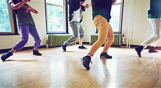

【V-T/V-I】   If you _shuffle around_, you move your feet about while standing or you move your bottom about while sitting, often because you feel uncomfortable or embarrassed. (因不舒服或尴尬) 站着的脚来回挪动; 坐立不安   +
⇒  He shuffles around in his chair.  他在椅子上坐立不安。   +

【V-T】   If you _shuffle_ playing cards, you mix them up before you begin a game. 洗 (牌)   +
⇒  There are various ways of shuffling and dealing the cards.  有各种不同的洗牌和发牌方法。   +

---

==== ▸ appreciate  [1016]   +
な/əˈpriːʃɪˌeɪt/   +

【V-T】   If you _appreciate_ something, for example, a piece of music or good food, you like it because you recognize its good qualities. 欣赏   +
⇒  Anyone can appreciate our music.  任何人都能欣赏我们的音乐。   +

【V-T】   If you _appreciate_ a situation or problem, you understand it and know what it involves. 理解   +
⇒  She never really appreciated the depth and bitterness of the family's conflict.  她从未真正理解该家庭矛盾的深度与激烈程度。   +

【V-T】   If you _appreciate_ something that someone has done for you or is going to do for you, you are grateful for it. 感激   +
⇒  Peter stood by me when I most needed it. I'll always appreciate that.  彼得在我最需要时支持了我。我对此将永远感激。   +

【V-I】   If something that you own _appreciates_ over a period of time, its value increases. 增值   +
⇒  They don't have any confidence that houses will appreciate in value.  他们对房屋增值没有一点信心。   +

---

==== ▸ clasp  [1017]   +
な/klɑːsp/   +

【V-T】   If you _clasp_ someone or something, you hold them tightly in your hands or arms. 握紧; 抱紧   +
⇒  She clasped the children to her.  她紧紧地搂住孩子们。   +

【N-COUNT】   A _clasp_ is a small device that fastens something. (拴牢某物的) 扣子; 勾子   +
⇒  ...the clasp of her handbag.  …她的手包扣。   +

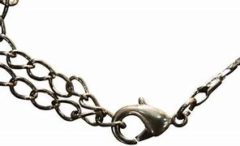

---

==== ▸ indignant  [1018]   +
な/ɪnˈdɪɡnənt/   +
--> in-,不，非，-dign,尊贵，价值，体面，词源同dignity,decent.即价值被贬低的，名声被侮辱的，引申词义被激怒的，愤怒的。 +

【ADJ】   If you are _indignant_, you are shocked and angry, because you think that something is unjust or unfair. 愤怒不平的   +
⇒  He is indignant at suggestions that they were secret agents.  他对关于他们是特务的暗示很愤慨。   +
⇒  He was indignant that his rival was offered the job.  他对他的对手得到了那份工作感到愤愤不平。   +

【ADV】   愤怒地   +
⇒  "That is not true," Erica said indignantly.  “那不是真的，”埃丽卡气愤地说。   +

---

==== ▸ prohibitive  [1019]   +
な/prəˈhɪbɪtɪv/   +
--> 来自prohibit,禁止。引申词义昂贵的，贵得买不起的。 +

【ADJ】   If the cost of something is _prohibitive_, it is so high that many people cannot afford it. (费用) 高得负担不起的   +
⇒  The cost of private treatment can be prohibitive.  私人治疗的费用会高得负担不起。   +

【ADV】   高得负担不起地   +
⇒  Meat and butter were prohibitively expensive.  肉和奶油都贵得买不起。   +

---

==== ▸ surcharge  [1020]   +
な/ˈsəːˌtʃɑːdʒ/   +
--> sur-,超过，charge,索价，要价。 +

【N-COUNT】   A _surcharge_ is an extra payment of money in addition to the usual payment for something. It is added for a specific reason, for example by a company because costs have risen or by a government as a tax. 附加费   +
⇒  The government introduced a 15% surcharge on imports.  政府推出了15%的进口附加费。   +

---

==== ▸ delinquency  [1021]   +
な/dɪˈlɪŋkwənsɪ/   +
--> 来自 delinquent, 不良青少年。 de-, 向下，离开。-linqu, 留下，遗弃，词源同leave, relinquish. 即被遗弃的人，缺乏管教的人，后主要指少年犯，不良青少年。 +

【N-UNCOUNT】  _Delinquency_ is criminal behaviour, especially that of young people. 违法行为; 少年犯罪   +
⇒  He had no history of delinquency.  他没有犯罪记录。   +

---

==== ▸ humble  [1022]   +
な/ˈhʌmbəl/   +

【ADJ】   A _humble_ person is not proud and does not believe that they are better than other people. 谦卑的; 谦逊的   +
⇒  He gave a great performance, but he was very humble.  他的表演很精彩，但他却很谦逊。   +

【ADV】   谦卑地; 谦逊地   +
⇒  "I'm a lucky man, undeservedly lucky," he said humbly.  “我是个幸运的人，不该这么幸运，”他谦虚地说。   +

【ADJ】   People with low social status are sometimes described as _humble_. (社会地位) 低下的   +
⇒  Spyros Latsis started his career as a humble fisherman in the Aegean.  斯派罗斯·拉齐斯最初的职业是爱琴海的一名地位低微的渔夫。   +

【ADJ】   A _humble_ place or thing is ordinary and not special in any way. 普通的   +
⇒  There are restaurants, both humble and expensive, that specialize in noodles.  既有普通的也有昂贵的专营面条的餐馆。   +

【ADJ】   People use _humble_ in a phrase such as _in my humble opinion_ as a polite way of emphasizing what they think, even though they do not feel humble about it. 愚拙的 (用以自谦地表达想法)   +
⇒  It is, in my humble opinion, perhaps the best steak restaurant in the city.  以我之拙见，它也许是该市最好的牛排馆。   +

【ADV】   愚拙地 (用以自谦地表达想法)   +
⇒  So may I humbly suggest we all do something next time.  那么我可否愚拙地提议下次我们大家都做点什么。   +

【PHRASE】   If you _eat humble pie_, you speak or behave in a way which tells people that you admit you were wrong about something. 赔礼道歉   +
⇒  Anson was forced to eat humble pie and publicly apologize to her.  安森被迫认错并公开向她道歉。   +

【V-T】   If you _humble_ someone who is more important or powerful than you, you defeat them easily. 轻易击败 (重要或强大对手)   +
⇒  Honda won fame in the 1980s as the little car company that humbled the industry giants.  20世纪80年代，本田作为一家小型汽车公司因一举击垮行业巨头而声名鹊起。   +

【V-T】   If something or someone _humbles_ you, they make you realize that you are not as important or good as you thought you were. 使感到惭愧   +
⇒  Ted's words humbled me.  特德的一席话使我自感惭愧。   +

【ADJ】   使羞辱的   +
⇒  Giving up an addiction is a humbling experience.  戒掉一种嗜好是一次令自尊心受挫的经历。   +

---

==== ▸ distress  [1023]   +
な/dɪˈstrɛs/   +
--> dis-, 分开。-str, 拉，拉紧，词源同strict, stress. 即拉紧，紧张，忧虑，悲伤。 +

【N-UNCOUNT】  _Distress_ is a state of extreme sorrow, suffering, or pain. 悲痛; 疼痛   +
⇒  Jealousy causes distress and painful emotions.  嫉妒会引发悲伤和痛苦的情绪。   +

【N-UNCOUNT】  _Distress_ is the state of being in extreme danger and needing urgent help. 危难; 危急   +
⇒  He expressed concern that the ship might be in distress.  他对船可能处在危急状态表示忧虑。   +

【V-T】   If someone or something _distresses_ you, they cause you to be upset or worried. 使心烦; 使忧虑   +
⇒  The idea of Toni being in danger distresses him enormously.  想到托尼仍处在危险当中就使他忧心忡忡。   +

---

==== ▸ bacteria  [1024]   +
な/bækˈtɪərɪə/   +
--> 来自拉丁词bacilum, 杆。词源同bacillus, 杆菌。+

【N-PLURAL】  _Bacteria_ are very small organisms. Some bacteria can cause disease. 细菌   +
⇒  Chlorine is added to kill bacteria.  加入氯以杀菌。   +

---

==== ▸ patent  [1025]   +
な/ˈpætənt/   +

【N-COUNT】   A _patent_ is an official right to be the only person or company allowed to make or sell a new product for a certain period of time. 专利   +
⇒  P&amp;G; applied for a patent on its cookies.  宝洁公司为其饼干申请了专利。   +
⇒  He held a number of patents for his many innovations.  他为他的许多革新申请了几项专利。   +

【V-T】   If you _patent_ something, you obtain a patent for it. 得到…专利   +
⇒  He patented the idea that the atom could be split.  他得到了原子可以分裂的这个见解的专利。   +
⇒  The invention has been patented by the university.  那项发明已经由那所大学获取了专利。   +

【ADJ】   You use _patent_ to describe something, especially something bad, in order to indicate in an emphatic way that you think its nature or existence is clear and obvious. 显而易见的   +
⇒  This was patent nonsense.  这显然是一派胡言。   +

【ADV】   显而易见地   +
⇒  He made his displeasure patently obvious.  他清楚地表明了他的不悦。   +

【ADJ】   open or available for inspection (esp in the phrase _letters patent_) 公开的   +

---

==== ▸ connote  [1026]   +
な/kɒˈnəʊt/   +
--> con-, 强调。-note, 标记，备注。 +

【V-T】   If a word or name _connotes_ something, it makes you think of a particular idea or quality. 意味着   +
⇒  The term "organization" often connotes a sense of neatness.  “组织”这个词常常给人一种整洁的感觉。   +

---

==== ▸ somewhat  [1027]   +
な/ˈsʌmˌwɒt/   +

【ADV】   You use _somewhat_ to indicate that something is the case to a limited extent or degree. 稍微   +
⇒  He concluded that Oswald was somewhat abnormal.  他断定奥斯瓦德有点不正常。   +
⇒  He explained somewhat unconvincingly that the company was paying for everything.  他有点不令人相信地解释说公司正在支付一切费用。   +

---

==== ▸ dialect  [1028]   +
な/ˈdaɪəˌlɛkt/   +
--> dia-, 穿过，相互。-lect, 说，词源同lecture, legible. 即人与人之的对话交流，后用来指区域性的语言，即方言。 +

【N-COUNT】   A _dialect_ is a form of a language that is spoken in a particular area. 方言   +
⇒  It is often appropriate to use the local dialect to communicate your message.  用方言来交流信息往往很合适。   +

---

==== ▸ imbibe  [1029]   +
な/ɪmˈbaɪb/   +
--> im-,进入，使，-bib,喝，饮，词源同bibulous,beverage.即喝进去，引申词义吸收。 +

【V-T/V-I】   To _imbibe_ alcohol means to drink it. 喝; 饮(酒)   +
⇒  They were used to imbibing enormous quantities of alcohol.  他们曾经常大量饮酒。   +
⇒  No one believes that current nondrinkers should be encouraged to start imbibing.  无人相信应该鼓励现在滴酒不沾的人开始去饮酒。   +

【V-T】   If you _imbibe_ ideas or arguments, you listen to them, accept them, and believe that they are right or true. 吸收; 接受(想法或论点)   +
⇒  As a clergyman's son he'd imbibed a set of mystical beliefs from the cradle.  作为牧师之子，他从襁褓时就耳濡目染并接受了一套神秘信仰。   +

---

==== ▸ spur  [1030]   +
な/spɜː/   +
--> 来自古英语 spura,马刺，靴刺，来自 Proto-Germanic*spuron,靴刺，来自 PIE*spere,脚踝，踢， 词源同 spoor,spurn.引申词义刺激，鼓舞。 +

【V-T】   If one thing _spurs_ you _to_ do another, it encourages you to do it. 鼓动; 激励   +
⇒  It's the money that spurs these fishermen to risk a long ocean journey in their flimsy boats.  是金钱驱使这些渔民驾驶单薄的小船冒险出海远航。   +

【PHRASAL VERB】  _Spur on_ means the same as . 鼓动; 激励 (同)(spur)   +
⇒  Their attitude, rather than reining him back, only seemed to spur Philip on.  他们的态度非但没令菲利普回头，似乎只是激励他继续下去。   +

【V-T】   If something _spurs_ a change or event, it makes it happen faster or sooner. 使更快发生; 加速   +
⇒  The administration may put more emphasis on spurring economic growth.  政府可能会更加重视经济的加快增长。   +

【N-COUNT】   Something that acts as a _spur to_ something else encourages a person or organization to do that thing or makes it happen more quickly. 促进因素; 推动   +
⇒  ...a belief in competition as a spur to efficiency.  …一种认为竞争能促进效率提高的观点。   +

【PHRASE】   If you do something _on the spur of the moment_, you do it suddenly, without planning it beforehand. 一时冲动之下   +
⇒  They admitted they had taken a vehicle on the spur of the moment.  他们承认一时冲动之下偷了一辆车。   +

---

==== ▸ context  [1031]   +
な/ˈkɒntɛkst/   +

【N-VAR】   The _context of_ an idea or event is the general situation that relates to it, and which helps it to be understood. 背景   +
⇒  We are doing this work in the context of reforms in the economic, social and cultural spheres.  我们正在经济、社会和文化领域改革的背景下从事这项工作。   +
⇒  It helps to understand the historical context in which Chaucer wrote.  这有助于理解乔叟创作时的历史背景。   +

【N-VAR】   The _context_ of a word, sentence, or text consists of the words, sentences, or text before and after it which help to make its meaning clear. 语境   +
⇒  Without a context, I would have assumed it was written by a man.  如果没有一个语境，我会以为这是由一个男人写的。   +

【PHRASE】   If something is seen _in context_ or if it is put _into context_, it is considered together with all the factors that relate to it. 联系背景地   +
⇒  Taxation is not popular in principle, merely acceptable in context.  征税原则上不受大众欢迎，只是联系背景看是可接受的。   +

【PHRASE】   If a statement or remark is quoted _out of context_, the circumstances in which it was said are not correctly reported, so that it seems to mean something different from the meaning that was intended. 脱离语境地   +
⇒  Thomas says that he has been quoted out of context.  托马斯说，他的话被断章取义了。   +

---

==== ▸ saturation  [1032]   +
な/ˌsætʃəˈreɪʃən/   +
--> 来自拉丁语 saturare,装满，浸透，来自 satur,满的，来自 PIE*sa,使充满，词源同 satiate,satisfy. 引申词义使饱和。 +

【N-UNCOUNT】  _Saturation_ is the process or state that occurs when a place or thing is filled completely with people or things, so that no more can be added. 饱和   +
⇒  Japanese car makers have been equally blind to the saturation of their markets at home and abroad.  日本的汽车制造商对国内外市场的饱和同样视而不见。   +

【ADJ】  _Saturation_ is used to describe a campaign or other activity that is carried out very thoroughly, so that nothing is missed. (运动、活动) 彻底的   +
⇒  The concept of saturation marketing makes perfect sense.  饱和营销的概念很有道理。   +

---

==== ▸ outlaw  [1033]   +
な/ˈaʊtˌlɔː/   +

【V-T】   When something _is outlawed_, it is made illegal. 宣布…为非法   +
⇒  In some states gambling was outlawed.  在一些州赌博被宣布为非法。   +
⇒  The German government has outlawed some fascist groups.  德国政府已宣布一些法西斯团体为非法。   +

【N-COUNT】   An _outlaw_ is a criminal who is hiding from the authorities. 逃犯   +
⇒  Jesse was an outlaw, a bandit, a criminal.  杰西曾是个逃犯、土匪、罪犯。   +

---

==== ▸ twist  [1034]   +
な/twɪst/   +

【V-T】   If you _twist_ something, you turn it to make a spiral shape, for example, by turning the two ends of it in opposite directions. 扭曲; 拧   +
⇒  Her hands began to twist the handles of the bag she carried.  她的双手开始拧她拎着的那个包的拎柄。   +

【V-T/V-I】   If you _twist_ something, especially a part of your body, or if it _twists_, it moves into an unusual, uncomfortable, or bent position, for example, because of being hit or pushed, or because you are upset. 扭弯; 扭曲   +
⇒  He twisted her arms behind her back and clipped a pair of handcuffs on her wrists.  他把她的双臂扭到她的背后，把一副手铐扣在她的手腕上。   +
⇒  Sophia's face twisted in perplexity.  索菲娅的脸因困惑而扭曲着。   +

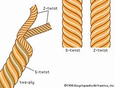

【V-T/V-I】   If you _twist_ part of your body such as your head or your shoulders, you turn that part while keeping the rest of your body still. 转动 (身体某部分)   +
⇒  She twisted her head sideways and looked toward the door.  她把头转向一边，朝门口看去。   +
⇒  Susan twisted round in her seat until she could see Graham behind her.  苏珊在她的座位上转过身去，直到她能看见她身后的格雷厄姆。   +

【V-T】   If you _twist_ a part of your body such as your ankle or wrist, you injure it by turning it too sharply, or in an unusual direction. 扭伤 (脚踝或手腕等)   +
⇒  He fell and twisted his ankle.  他摔了一跤，扭伤了脚踝。   +

【V-T】   If you _twist_ something, you turn it so that it moves around in a circular direction. 旋转   +
⇒  She was staring down at her hands, twisting the ring on her finger.  她往下盯着自己的手，旋转着手指上的戒指。   +

【N-COUNT】  _Twist_ is also a noun. 旋转   +
⇒  Just a twist of the handle is all it takes to wring out the mop.  只需旋转一下那个手柄就可以拧干拖把。   +

【V-I】   If a road or river _twists_, it has a lot of sudden changes of direction in it. (道路或河流) 迂回曲折   +
⇒  The roads twist around hairpin bends.  那些道路有很多险弯。   +

【N-COUNT】  _Twist_ is also a noun. (道路或河流的) 迂回曲折   +
⇒  It allows the train to maintain a constant speed through the twists and turns of existing track.  它可以让火车在现有蜿蜒盘旋的轨道上保持匀速。   +

【V-T】   If you say that someone _has twisted_ something that you have said, you disapprove of them because they have repeated it in a way that changes its meaning, in order to harm you or benefit themselves. 歪曲   +
⇒  It's a shame the way the media can twist your words and misrepresent you.  媒体歪曲人们的话语及误传人们的本意的作风是可耻的。   +

【N-COUNT】   A _twist_ in something is an unexpected and significant development. 意外进展   +
⇒  The battle of the sexes also took a new twist.  性别之战也有了意想不到的新进展。   +

---

==== ▸ reschedule  [1035]   +
な/riːˈʃɛdjuːl, -dʒʊəl/   +

【V-T】   If someone _reschedules_ an event, they change the time at which it is supposed to happen. 重订…的时间表   +
⇒  Since I'll be away, I'd like to reschedule the meeting.  既然我将要离开，我想重新安排一下这次会议的时间。   +

【V-T】   To _reschedule_ a debt means to arrange for the person, organization, or country that owes money to pay it back over a longer period because they are in financial difficulty. 安排缓期偿还   +
⇒  ...companies that have gone bust or had to reschedule their debts.  …已经破产的或者不得不安排缓期还债的公司。   +

---

==== ▸ fare  [1036]   +
な/fɛə/   +

【N-COUNT】   A _fare_ is the money that you pay for a trip that you make, for example, in a bus, train, or taxi. 车费   +
⇒  He could barely afford the fare.  他几乎付不起车费。   +

【V-I】   If you say that someone or something _fares_ well or badly, you are referring to the degree of success they achieve in a particular situation or activity. 进展   +
⇒  It is unlikely that the marine industry will fare any better in September.  海运业不大可能在9月份有所好转。   +

---

==== ▸ overall  [1037]   +
な【ADJ】   You use _overall_ to indicate that you are talking about a situation in general or about the whole of something. 总的   +
⇒  ...the overall rise in unemployment.  …失业人数的总体上升。   +

【ADV】  _Overall_ is also an adverb. 总体上地   +
⇒  Overall I was disappointed.  总的来说，我感到失望。   +

【N-PLURAL】  _Overalls_ are trousers that are attached to a piece of cloth which covers your chest and which has straps going over your shoulders. 工装裤   +

【N-PLURAL】  _Overalls_ consist of a single piece of clothing that combines trousers and a jacket. You wear overalls over your clothes in order to protect them while you are working. (连体的) 防护服   +
⇒  ...a man in white overalls.  ...一个穿白色防护服的男人。   +

---

==== ▸ jot  [1038]   +
な/dʒɒt/   +
--> 来自希腊语iota,即字母i,在希腊字母中书写最小，引申词义快写，速记。 +

【V-T】   If you _jot_ something short such as an address somewhere, you write it down so that you will remember it. 简单记下   +
⇒  Could you just jot his name on there?  你能就把他的名字简单记在那儿吗？   +

【PHRASAL VERB】  _Jot down_ means the same as . 简单记下   +
⇒  Christine uses her journal to jot down ideas and lists of things to do.  克里斯蒂娜用她的日志簿简单记下自己的想法和要做的事情清单。   +

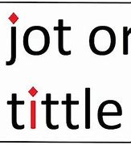

---

==== ▸ volume  [1039]   +
な/ˈvɒljuːm/   +

【N-COUNT】   The _volume of_ something is the amount of it that there is. 量   +
⇒  Senior officials will be discussing how the volume of sales might be reduced.  高级官员们将讨论如何才能减少销售量。   +

【N-COUNT】   The _volume_ of an object is the amount of space that it contains or occupies. 容积   +
⇒  When egg whites are beaten they can rise to seven or eight times their original volume.  打过的蛋清，体积可以涨到原来的七八倍。   +

【N-COUNT】   A _volume_ is one book in a series of books. (书籍的) 卷   +
⇒  ...the first volume of his autobiography.  …他自传的第一卷。   +

【N-COUNT】   A _volume_ is a collection of several issues of a magazine, for example, all the issues for one year. 合订本   +
⇒  ...bound volumes of the magazine.  …杂志的合订本。   +

【N-UNCOUNT】  _The__volume_ of a radio, television, or sound system is the loudness of the sound it produces. (收音机、电视机或音响系统的) 音量   +
⇒  He turned down the volume.  他调低了音量。   +

【PHRASE】   If something such as an action _speaks volumes about_ a person or thing, it gives you a lot of information about them. 充分表明   +
⇒  What you wear speaks volumes about you.  你的穿戴能充分表明你的方方面面。   +

---

==== ▸ due  [1040]   +
な/djuː/   +

【PHRASE】   If an event is _due to_ something, it happens or exists as a direct result of that thing. 是…的结果   +
⇒  The country's economic problems are largely due to the weakness of the recovery.  该国的经济问题很大程度上是复苏乏力的结果。   +

【PHRASE】   You can say _due to_ to introduce the reason for something happening. Some speakers of English believe that it is not correct to use _due to_ in this way. 由于   +
⇒  Due to the large volume of letters he receives Dave regrets he is unable to answer queries personally.  由于收到的来信数量太多，戴夫很遗憾不能亲自回复各种询问。   +

【PHRASE】   If you say that something will happen or take place _in due course_, you mean that you cannot make it happen any quicker and it will happen when the time is right for it. 在适当的时候   +
⇒  In due course the baby was born.  婴儿如期降生了。   +

【PHRASE】   You can say "_to give_ him his _due_," or "_giving_ him his _due_," when you are admitting that there are some good things about someone, even though there are things that you do not like about them. 给某人应得的评价   +
⇒  To give Linda her due, she had tried to encourage John in his school work.  为琳达说句公道话，她曾尽力在学习方面鼓励约翰。   +

【PHRASE】   You can say "_with due respect_" when you are about to disagree politely with someone. 请恕冒昧; 斗胆   +
⇒  With all due respect I submit to you that you're asking the wrong question.  恕我斗胆直言，我认为您在问错误的问题。   +

【ADJ】   If something is _due_ at a particular time, it is expected to happen, be done, or arrive at that time. 预期的   +
⇒  The results are due at the end of the month.  结果预期于月底揭晓。   +
⇒  Mr. Carter is due in Washington on Monday.  卡特先生预计周一到达华盛顿。   +

【ADJ】  _Due_ attention or consideration is the proper, reasonable, or deserved amount of it under the circumstances. 适当的; 应有的   +
⇒  After due consideration it was decided to send him away to live with foster parents.  经过充分考虑，决定将他送去与养父母生活。   +

【ADJ】   Something that is _due_, or that is _due to_ someone, is owed to them, either as a debt or because they have a right to it. 应得的   +
⇒  I was sent a cheque and advised that no further pension was due.  我收到了一张支票并被告知不再有应领的养老金了。   +

【ADJ】   If someone is _due for_ something, that thing is planned to happen or be given to them now, or very soon, often after they have been waiting for it for a long time. (经长久等待后) 预期发生的   +
⇒  Although not due for release until 2001, he was let out of his low-security prison to spend a weekend with his wife.  虽然要等到2001年才能获释，他却被允许离开看守宽松的监狱去和妻子共度一个周末。   +

---

==== ▸ perceptive  [1041]   +
な/pəˈsɛptɪv/   +

【ADJ】   If you describe a person or their remarks or thoughts as _perceptive_, you think that they are good at noticing or realizing things, especially things that are not obvious. 有洞察力的   +
⇒  He was one of the most perceptive U.S. political commentators.  他曾是美国最具洞察力的政治评论员之一。   +

---

==== ▸ cramped  [1042]   +
な/kræmpt/   +
--> 来自PIE*ger, 转，弯，围，词源同crank, crook. 比喻义肌肉打弯的，抽筋的。+

【ADJ】   A _cramped_ room or building is not big enough for the people or things in it. 狭促的   +
⇒  There are hundreds of families living in cramped conditions on the floor of the airport lounge.  上百个家庭住在机场候机室地板上狭促的环境里。   +

---

==== ▸ essential  [1043]   +
な/ɪˈsɛnʃəl/   +

【ADJ】   Something that is _essential_ is extremely important or absolutely necessary to a particular subject, situation, or activity. 至关重要的   +
⇒  It was absolutely essential to separate crops from the areas that animals used as pasture.  把庄稼与牲畜的放牧区分开至关重要。   +
⇒  As they must also sprint over short distances, speed is essential.  由于他们还必须疾速短跑，因此速度是至关重要的。   +

【N-COUNT】   The _essentials_ are the things that are absolutely necessary for the situation you are in or for the task you are doing. 必需品   +
⇒  The apartment contained the basic essentials for bachelor life.  这套公寓配有单身生活的基本必需品。   +

【ADJ】   The _essential_ aspects of something are its most basic or important aspects. 基本的; 重要的   +
⇒  Most authorities agree that play is an essential part of a child's development.  大多数权威人士认为玩耍是孩子成长的一个重要部分。   +

【N-PLURAL】   The _essentials_ are the most important principles, ideas, or facts of a particular subject. 要素; 要点   +
⇒  ...the essentials of everyday life, such as eating and exercise.  …饮食、运动等日常生活要素。   +

---

==== ▸ mock  [1044]   +
な/mɒk/   +

【V-T】   If someone _mocks_ you, they show or pretend that they think you are foolish or inferior, for example by saying something funny about you, or by imitating your behaviour. 嘲笑; (为了取笑) 模仿   +
⇒  I thought you were mocking me.  我以为你在嘲笑我。   +

【ADJ】   You use _mock_ to describe something which is not real or genuine, but which is intended to be very similar to the real thing. 假装的   +
⇒  "It's tragic!" swoons Jeffrey in mock horror.  “太悲惨了！”杰弗里假装害怕得昏了过去。   +

---

==== ▸ vacation  [1045]   +
な/vəˈkeɪʃən/   +

【N-COUNT】   A _vacation_ is a period of time during which you relax and enjoy yourself away from home. 休假   +
⇒  They planned a late summer vacation in Europe.  他们计划了一个夏末在欧洲的休假。   +

【N-COUNT】   A _vacation_ is a period of the year when schools, universities, and colleges are officially closed. (学校的) 假期   +

【N-UNCOUNT】   If you have a particular number of days' or weeks' _vacation_, you do not have to go to work for that number of days or weeks. (工作中的) 假期   +

【V-I】   If you _are vacationing_ in a place away from home, you are on vacation there. 度假   +

---

==== ▸ harmonic  [1046]   +
な/hɑːˈmɒnɪk/   +

【ADJ】  _Harmonic_ means composed, played, or sung using two or more notes which sound right and pleasing together. 和声的   +
⇒  I had been looking for ways to combine harmonic and rhythmic structures.  我一直在寻求把和声与节奏结和起来的方法。   +

---

==== ▸ station  [1047]   +
な/ˈsteɪʃən/   +

【N-COUNT】   A _station_ or a train _station_ is a building by a railway track where trains stop so that people can get on or off. 火车站   +
⇒  Ingrid went with him to the train station to see him off.  英格丽德和他一起去火车站送他。   +

【N-COUNT】   A bus _station_ is a building, usually in a town or city, where buses stop, usually for a while, so that people can get on or off. (汽车) 站   +
⇒  I walked the two miles back to the bus station and bought a ticket home.  我走了两英里回到汽车站买了一张回家的票。   +

【N-COUNT】   If you talk about a particular radio or television _station_, you are referring to the company that broadcasts programmes. (电、电视) 台   +
⇒  ...an independent local radio station.  …一家独立的地方广播电台。   +

【V-T PASSIVE】   If soldiers or officials _are stationed_ in a place, they are sent there to do a job or to work for a period of time. 派驻   +
⇒  Reports from the capital, Lome, say troops are stationed on the streets.  来自首都洛美的报道说部队驻扎在街道上。   +

---

==== ▸ percussion  [1048]   +
な/pəˈkʌʃən/   +
--> per-,完全的，-cuss,摇，击打，词源同 discuss,concussion.用于指打击乐器。 +

【N-UNCOUNT】  _Percussion_ instruments are musical instruments that you hit, such as drums. 打击乐器   +
⇒  ...a large orchestra, with a vast percussion section.  …一支有很大的打击乐器组的大型管弦乐队。   +

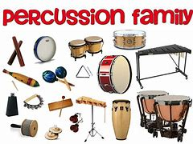

---

==== ▸ wane  [1049]   +
な/weɪn/   +
--> 来自 Proto-Germanic*wano,缺乏，空无，词源同 want,waste.引申词义衰弱。 +

【V-I】   If something _wanes_, it becomes gradually weaker or less, often so that it eventually disappears. 减弱; 减少   +
⇒  While his interest in these sports began to wane, a passion for lacrosse developed.  他对这些运动项目的兴趣开始减退的同时，对长曲棍球的兴趣却浓厚起来。   +

---

==== ▸ recurring  [1050]   +

recur /rɪˈkɜː/   +
recurring, recurred, recurs +

V-I If something _recurs_, it happens more than once. 再现; 屡次发生 +
=>  ...a theme that was to recur frequently in his work. …一个将在他的作品中多次出现的主题。 +

==== ▸ exponent  [1051]   +
な/ɪkˈspəʊnənt/   +

【N-COUNT】   An _exponent of_ an idea, theory, or plan is a person who supports and explains it, and who tries to persuade other people that it is a good idea. 倡导者   +
⇒  ...a leading exponent of test-tube baby techniques.  …一位试管婴儿技术的主要倡导者。   +

【N-COUNT】   An _exponent of_ a particular skill or activity is a person who is good at it. 擅长者; 典范   +
⇒  The Alvin Ailey American Dance Theatre was formed in the 1950s and quickly established itself as a leading exponent of progressive choreography and contemporary dance.  阿尔文·艾利美国舞蹈剧形成于20世纪50年代，并很快树立自己为激进舞蹈艺术和现代舞蹈的最主要的典范。   +

---

==== ▸ mandate  [1052]   +
な/ˈmændeɪt/   +
--> 词根-man-指“手”，如manual（手册）、manicure（修指甲）等；词根-dat-、-dit-指“给”，如edit（编辑；字面义“对外给出，公之于众”，编辑的目的是出版）；该词字面义“亲手给出”，给出权力即“授权”，给出要求即“命令”。command（命令）同源。 +

【N-COUNT】   If a government or other elected body has a _mandate_ to carry out a particular policy or task, they have the authority to carry it out as a result of winning an election or vote. (政府或机构经选举而获得的) 授权   +
⇒  The president and his supporters are almost certain to read this vote as a mandate for continued economic reform.  总统和他的支持者们几乎肯定地认为这次投票是对继续进行经济改革的授权。   +

【N-COUNT】   If someone is given a _mandate_ to carry out a particular policy or task, they are given the official authority to do it. (个人所获得的) 授权   +
⇒  How much longer does the independent prosecutor have a mandate to pursue this investigation?  这名独立检察官获得授权去调查这件事情的权限还有多长？   +

【N-COUNT】   You can refer to the fixed length of time that a country's leader or government remains in office as their _mandate_. 任期   +
⇒  ...his intention to leave politics once his mandate ends.  …他任期一结束就将离开政界的打算。   +

【V-T】   When someone _is mandated to_ carry out a particular policy or task, they are given the official authority to do it. 授权   +
⇒  He'd been mandated by the West African Economic Community to go in and to enforce a ceasefire.  他受西非经济共同体授权去介入并执行停火协定。   +

【V-T】   To _mandate_ something means to make it mandatory. 强制执行   +
⇒  The proposed initiative would mandate a reduction of carbon dioxide of 40%.  这个倡议将把二氧化碳排放量强制降低40%。   +
⇒  Sixteen years ago, Quebec mandated that all immigrants send their children to French schools.  16年前，魁北克省规定所有移民都要送孩子上法语学校。   +

---

==== ▸ ensure  [1053]   +
な/ɛnˈʃʊə/   +

【V-T】   To _ensure_ something, or to _ensure that_ something happens, means to make certain that it happens. 确保   +
⇒  We must ensure that all patients have access to high quality care.  我们必须确保所有的病人都能够得到高质量的护理。   +

---

==== ▸ endless  [1054]   +
な/ˈɛndlɪs/   +

【ADJ】   If you say that something is _endless_, you mean that it is very large or lasts for a very long time, and it seems as if it will never stop. 无休止的   +
⇒  ...the endless hours I spent on homework.  …我花在家庭作业上的无数小时。   +

【ADV】   无休止地   +
⇒  They talk about it endlessly.  他们无休止地谈论这件事情。   +

---

==== ▸ erode  [1055]   +
な/ɪˈrəʊd/   +

【V-T/V-I】   If rock or soil _erodes_ or _is eroded_ by the weather, sea, or wind, it cracks and breaks so that it is gradually destroyed. 侵蚀   +
⇒  The storm washed away buildings and roads and eroded beaches.  暴风雨冲走了建筑物和道路，侵蚀了沙滩。   +

【V-T/V-I】   If someone's authority, right, or confidence _erodes_ or _is eroded_, it is gradually destroyed or removed. 削弱   +
⇒  His critics say his fumbling on the issue of reform has eroded his authority.  他的批评者们说他在改革问题上的拙劣做法已削弱了他的权威。   +

【V-T/V-I】   If the value of something _erodes_ or _is eroded_ by something such as inflation or age, its value decreases. 降低   +
⇒  Competition in the financial marketplace has eroded profits.  金融市场的竞争降低了利润。   +

---

==== ▸ aspire  [1056]   +
な/əˈspaɪə/   +
--> 前缀a-同ad-. 词根spir, 呼吸, 见inspire, 吸入，启迪。 +

【V-I】   If you _aspire to_ something such as an important job, you have a strong desire to achieve it. 有志 (于)   +
⇒  ...people who aspire to public office.  …志在获得公职的人们。   +
⇒  Rice aspired to go to college.  赖斯渴望上大学。   +

---

==== ▸ hazel  [1057]   +
な/ˈheɪzəl/   +
--> 来自古英语haesl,来自PIE*koselo,榛树，榛子。 +

【N-VAR】   A _hazel_ is a small tree which produces nuts that you can eat. 榛树   +

【COLOR】  _Hazel_ eyes are greenish brown in colour. 淡绿褐色 (的)  /( of eyes 眼睛 ) greenish-brown or reddish-brown in colour 淡绿褐色的；浅赤褐色的  +

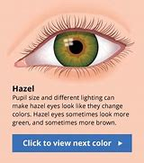
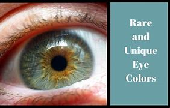
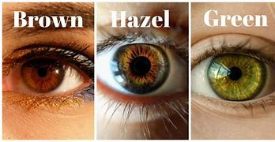
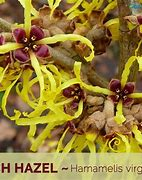

---

==== ▸ project  [1058]   +
な【N-COUNT】   A _project_ is a task that requires a lot of time and effort. 项目   +
⇒  Money will also go into local development projects in Vietnam.  资金也会流入越南本地开发项目。   +
⇒  ...an international science project.  …一个国际科研项目。   +

【N-COUNT】   A _project_ is a detailed study of a subject by a student. (学生研究的) 课题   +
⇒  Students complete projects for a personal tutor, working at home at their own pace.  学生们为个人导师完成课题研究，在家里按自己的速度工作。   +

【V-T】   If something _is projected_, it is planned or expected. 计划; 预计   +
⇒  13% of Americans are over 65; this number is projected to reach 22% by the year 2030.  13%的美国人在65岁以上；这个数字预计到2030年会达到22%。   +
⇒  The government had been projecting a 5% consumer price increase for the entire year.  政府一直在预计全年5%的消费价格增长。   +

【V-T】   If you _project_ someone or something in a particular way, you try to make people see them in that way. If you _project_ a particular feeling or quality, you show it in your behaviour. (以某方式) 呈现   +
⇒  Bradley projects a natural warmth and sincerity.  布拉德利表现出一种自然的热情和真诚。   +
⇒  He just hasn't been able to project himself as the strong leader.  他只是还没能把自己表现得是个强有力的领导。   +

【V-T】   If you _project_ a film or picture _onto_ a screen or wall, you make it appear there. 投映   +
⇒  The team tried projecting the maps with two different projectors onto the same screen.  该组尝试用两台不同的放映机将地图投映在同一屏幕上。   +

【V-I】   If something _projects_, it sticks out above or beyond a surface or edge. 突出   +
⇒  ...a narrow ledge that projected out from the bank of the river.  …河岸边突出来的一块狭长的岩脊。   +

---

==== ▸ affirm  [1059]   +
な/əˈfɜːm/   +

【V-T】   If you _affirm_ that something is true or that something exists, you state firmly and publicly that it is true or exists. 公开肯定   +
⇒  The court affirmed that the information can be made public under the Freedom of Information Act.  法院公开肯定了此信息能依据《自由信息法案》公之于众。   +
⇒  ...a speech in which he affirmed a commitment to lower taxes.  …在其中他公开肯定了减税承诺的一次演讲。   +

【N-VAR】   公开肯定   +
⇒  The North Atlantic Treaty begins with the affirmation that its parties "reaffirm their faith in the purposes and principles of the Charter of the United Nations."  《北大西洋公约》以公开肯定其成员“重申其对《联合国宪章》的目的以及原则的信念”开头。   +

【V-T】   If an event _affirms_ something, it shows that it is true or exists. 证实   +
⇒  Everything I had accomplished seemed to affirm that opinion.  我所做成的每件事似乎都证实了那个观点。   +

【N-UNCOUNT】   证实   +
⇒  The ruling was a welcome affirmation of the constitutional right to free speech.  此裁决是对言论自由这一宪法权利的受人欢迎的肯定。   +

---

==== ▸ accident  [1060]   +
な/ˈæksɪdənt/   +

【N-COUNT】   An _accident_ happens when a vehicle hits a person, an object, or another vehicle, causing injury or damage. 交通事故   +
⇒  She was involved in a serious car accident last week.  她上个星期卷入了一场严重的车祸。   +

【N-COUNT】   If someone has an _accident_, something unpleasant happens to them that was not intended, sometimes causing injury or death. 事故   +
⇒  5,000 people die every year because of accidents in the home.  每年有5千人死于家庭意外事故。   +

【N-VAR】   If something happens _by accident_, it happens completely by chance. 偶然   +
⇒  She discovered the problem by accident during a visit to a nearby school.  她在去附近一所学校参观时偶然发现了这个问题。   +

---

==== ▸ jewelry = jewellery [1061]   +
N-UNCOUNT Jewellery is ornaments that people wear, such as rings, bracelets, and necklaces. It is often made of a valuable metal such as gold, and sometimes decorated with precious stones. 珠宝首饰

==== ▸ split  [1062]   +
な/splɪt/   +

【V-T/V-I】   If something _splits_ or if you _split_ it, it is divided into two or more parts. 分开   +
⇒  In a severe gale the ship split in two.  在一次强劲的大风中那艘船断成了两半。   +
⇒  If the chicken is fairly small, you may simply split it in half.  要是鸡不太大，你把它分成两半就行。   +

【V-T/V-I】   If an organization _splits_ or _is split_, one group of members disagree strongly with the other members, and may form a group of their own. 分裂   +
⇒  Yet it is feared the Republican leadership could split over the agreement.  然而人们担心共和党领导层可能会因该协议而出现分裂。   +

【ADJ】  _Split_ is also an adjective. 分裂的   +
⇒  The Kremlin is deeply split in its approach to foreign policy.  克里姆林宫在对外政策的看法上严重分歧。   +

【N-COUNT】   A _split in_ an organization is a disagreement between its members. 分歧   +
⇒  They accused both radicals and conservatives of trying to provoke a split in the party.  他们指责激进人士和保守人士都企图挑起党内分歧。   +

【N-SING】   A _split between_ two things is a division or difference between them. 区分; 区别   +
⇒  ...a split between what is thought and what is felt.  …所想和所感之间的区别。   +

【V-T/V-I】   If something such as wood or a piece of clothing _splits_ or _is split_, a long crack or tear appears in it. 使裂开; 裂开   +
⇒  The seat of his grey trousers split.  他的那条灰色裤子的臀部裂开了。   +

【N-COUNT】   A _split_ is a long crack or tear. 裂缝   +
⇒  The plastic-covered seat has a few small splits around the corners.  那个有塑料套的座位的角边周围有几处小裂缝。   +

【V-T】   If two or more people _split_ something, they share it between them. 分摊; 分享   +
⇒  I would rather pay for a meal than watch nine friends pick over and split a bill.  我宁愿付整顿饭钱而不愿看着9个朋友仔细算计、分摊账单。   +

---

==== ▸ mimic  [1063]   +
な/ˈmɪmɪk/   +

【V-T】   If you _mimic_ the actions or voice of a person or animal, you imitate them, usually in a way that is meant to be amusing or entertaining. 模仿   +
⇒  He could mimic anybody, and he often reduced Isabel to helpless laughter.  他可以模仿任何人，而且经常逗得伊莎贝尔情不自禁地大笑。   +

【V-T】   If someone or something _mimics_ another person or thing, they try to be like them. 模仿   +
⇒  The computer doesn't mimic human thought; it reaches the same ends by different means.  计算机模仿不了人类的思维；它通过不同的方式达到相同的目的。   +

【N-COUNT】   A _mimic_ is a person who is able to mimic people or animals. 善于模仿的人   +
⇒  At school I was a good mimic.  上学时我是一个善于模仿的人。   +

---

==== ▸ discredit  [1064]   +
な/dɪsˈkrɛdɪt/   +

【V-T】   To _discredit_ someone or something means to cause them to lose people's respect or trust. 使…丧失信誉   +
⇒  ...a secret unit within the company that had been set up to discredit its major rival.  …为破坏其主要竞争对手声誉而设的一个公司内秘密单位。   +

【ADJ】   名誉扫地的   +
⇒  The previous government is, by now, thoroughly discredited.  上届政府至今彻底名誉扫地。   +

---

==== ▸ harsh  [1065]   +
な/hɑːʃ/   +

【ADJ】  _Harsh_ climates or conditions are very difficult for people, animals, and plants to live in. 严酷的   +
⇒  ...the harsh desert environment.  …严酷的沙漠环境。   +

【N-UNCOUNT】   艰苦   +
⇒  ...the harshness of their living conditions.  …他们生活条件之艰苦。   +

【ADJ】  _Harsh_ actions or speech are unkind and show no understanding or sympathy. 残酷的   +
⇒  He said many harsh and unkind things about his opponents.  他说了许多关于他对手的严厉且残酷的话。   +

【ADV】   残酷地   +
⇒  She's been told that her husband is being harshly treated in prison.  她被告知她丈夫正在监狱里遭受严酷的对待。   +

【ADJ】   Something that is _harsh_ is so hard, bright, or rough that it seems unpleasant or harmful. (因过于刺激、明亮或粗糙而) 令人不快的   +
⇒  Tropical colours may look rather harsh in our dull northern light.  热带丛林的色彩在我们暗淡的北极光下也许会显得很刺眼。   +

【N-UNCOUNT】   不快   +
⇒  As the wine ages, it loses its bitter harshness.  随着葡萄酒变陈，酒中的苦涩味就会消失。   +

【ADJ】  _Harsh_ voices and sounds are ones that are rough and unpleasant to listen to. 刺耳的   +
⇒  It's a pity she has such a loud harsh voice.  可惜她有这么一种响亮刺耳的声音。   +

【ADV】   刺耳地   +
⇒  Chris laughed harshly.  克里斯大笑，声音刺耳。   +

【ADJ】   If you talk about _harsh_ realities or facts, or the _harsh_ truth, you are emphasizing that they are true or real, although they are unpleasant and people try to avoid thinking about them. 残酷的 (事实、情况)   +
⇒  The harsh truth is that luck plays a big part in who will live or die.  残酷的现实是，运气在很大程度上决定着谁生谁死。   +

---

==== ▸ tolerable  [1066]   +
な/ˈtɒlərəbəl/   +

【ADJ】   If you describe something as _tolerable_, you mean that you can bear it, even though it is unpleasant or painful. 可忍受的   +
⇒  Our living conditions are tolerable, but I can't wait to leave.  我们的居住条件还是可忍受的，但是我迫不及待地想离开。   +

【ADV】   可忍受地   +
⇒  Their captors treated them tolerably well.  俘获他们的人待他们勉强还过得去。   +

---

==== ▸ capacity  [1067]   +
な/kəˈpæsɪtɪ/   +

【N-VAR】   Your _capacity for_ something is your ability to do it, or the amount of it that you are able to do. 能力   +
⇒  Our capacity for giving care, love, and attention is limited.  我们给予照顾、爱护和关心的能力是有限的。   +
⇒  Her mental capacity and temperament are as remarkable as his.  她的智慧和气质与他的同样出众。   +

【N-VAR】   The _capacity_ of a container is its volume, or the amount of liquid it can hold, measured in units such as quarts or gallons. 容量   +
⇒  ...containers with a maximum capacity of 200 gallons of water.  …最大容量为200加仑水的容器。   +

【N-UNCOUNT】   The _capacity_ of something such as a factory, industry, or region is the quantity of things that it can produce or deliver with the equipment or resources that are available. 产量   +
⇒  ...the amount of spare capacity in the economy.  ...经济中的过剩产能。   +
⇒  Bread factories are working at full capacity.  面包厂正在满负荷进行生产。   +

【N-COUNT】   The _capacity_ of a piece of equipment is its size or power, often measured in particular units. 负载量   +
⇒  ...an aircraft with a bomb-carrying capacity of 1000 pounds.  …一架炸弹装载量达1000磅的飞机。   +

【N-COUNT】   If you do something _in_ a particular _capacity_, you do it as part of a particular job or duty, or because you are representing a particular organization or person. 身份   +
⇒  Ms. Halliwell visited the Philippines in her capacity as a Special Representative of UNICEF.  哈利韦尔女士以联合国儿童基金会特使的身份访问了菲律宾。   +

【N-SING】   The _capacity_ of a building, place, or vehicle is the number of people or things that it can hold. If a place is filled _to capacity_, it is as full as it can possibly be. 容纳力   +
⇒  Each stadium had a seating capacity of about 50,000.  每个运动场能容纳大约五万座席。   +

【ADJ】   A _capacity_ crowd or audience completely fills a theatre, sports stadium, or other place. 满座的   +
⇒  A capacity crowd of 76,000 people was at the stadium for the event.  运动场内座无虚席，7.6万人观看了比赛。   +

---

==== ▸ uncanny  [1068]   +
な/ʌnˈkænɪ/   +
--> un-,不，非，can,能够，知道。即不知道的，异常的。比较 canny. +

【ADJ】   If you describe something as _uncanny_, you mean that it is strange and difficult to explain. 出奇的   +
⇒  The hero, Danny, bears an uncanny resemblance to Kirk Douglas.  主人翁丹尼与柯克·道格拉斯出奇地相像。   +

【ADV】   出奇地   +
⇒  They have uncannily similar voices.  他们有着出奇相似的嗓音。   +

---

==== ▸ fix  [1069]   +
な/fɪks/   +

【V-T】   If you _fix_ something which is damaged or which does not work properly, you repair it. 修理   +
⇒  He cannot fix the electricity.  他不会修理电路。   +

【V-T】   If you _fix_ a problem or a bad situation, you deal with it and make it satisfactory. 处理   +
⇒  It's not too late to fix the problem, although time is clearly getting short.  现在处理这个问题还不算太晚，尽管时间明显地变紧了。   +

【V-T】   If you _fix_ some food or a drink for someone, you make it or prepare it for them. 准备 (食物、饮料等)   +
⇒  Sarah fixed some food for us.  萨拉为我们准备了一些食物。   +
⇒  Let me fix you a drink.  让我给你弄一杯饮料吧。   +

【V-T】   If you _fix_ your hair, clothes, or makeup, you arrange or adjust them so you look neat and tidy, showing you have taken care with your appearance. 整理   +
⇒  "I've got to fix my hair," I said and retreated to my bedroom.  “我得整理一下头发，”我说着便回到了我的卧室。   +

【V-T】   If you _fix_ something, for example, a date, price, or policy, you decide and say exactly what it will be. 确定   +
⇒  He's going to fix a time when I can see him.  他将确定一个我可以见他的时间。   +
⇒  The date of the election was fixed.  选举的日期定下来了。   +

【V-T】   If you _fix_ something for someone, you arrange for it to happen or you organize it for them. 安排   +
⇒  I've fixed it for you to see Bonnie Lachlan.  我已经给你安排了去见邦尼·拉克伦。   +
⇒  It's fixed. He's going to meet us at the airport.  已经安排好了，他将去机场接我们。   +
⇒  He vanished after you fixed him with a job.  你给他安排了一个工作后他就消失了。   +

【V-T】   If something _is fixed_ somewhere, it is attached there firmly or securely. 固定   +
⇒  It is fixed on the wall.  它是固定在墙上的。   +
⇒  Most blinds can be fixed directly to the top of the window-frame.  大多数百叶窗可以直接固定在窗框的顶端。   +

【V-T/V-I】   If you _fix_ your eyes _on_ someone or something or if your eyes _fix on_ them, you look at them with complete attention. 凝视   +
⇒  She fixes her steel-blue eyes on an unsuspecting local official.  她用那双铁青色的眼睛紧盯着一名毫无猜疑心的地方官员。   +
⇒  Her soft brown eyes fixed on Kelly.  她温柔的棕色眼睛凝视着凯利。   +

【V-T】   If someone or something _is fixed in_ your mind, you remember them well, for example, because they are very important, interesting, or unusual. 牢记   +
⇒  Leonard was now fixed in his mind.  伦纳德现已铭刻在他的心中。   +

【V-T】   If someone _fixes_ a gun, camera, or radar _on_ something, they point it at that thing. 瞄准   +
⇒  The U.S. crew fixed its radar on the Turkish ship.  美国船员将雷达对准了那艘土耳其船。   +

【V-T】   If someone _fixes_ a race, election, contest, or other event, they make unfair or illegal arrangements or use deception to affect the result. 用不正当手段操纵 (比赛、选举、竞赛等); 八百長する   +
⇒  They offered opposing players bribes to fix a decisive game.  他们向对方球员行贿以操纵一场决定性的比赛。   +

【N-COUNT】  _Fix_ is also a noun. 不正当的操纵   +
⇒  It's all a fix, a deal they've made.  这完全是一场非法的操纵，是他们作的一笔交易。   +

【V-T】   If you accuse someone of _fixing_ prices, you accuse them of making unfair arrangements to charge a particular price for something, rather than allowing market forces to decide it. 操纵 (价格)   +
⇒  ...a suspected cartel that had fixed the price of steel for the construction market.  …一个涉嫌操纵建筑市场钢材价格的卡特尔垄断同盟。   +

【N-COUNT】   You can refer to a solution to a problem as a _fix_. 解决办法   +
⇒  Many of those changes could just be a temporary fix.  那些改变中有很多可能只是暂时的解决方法。   +

【N-SING】   If you get _a fix on_ someone or something, you have a clear idea or understanding of them. 清楚了解   +
⇒  It's been hard to get a steady fix on what's going on.  一直很难对正在发生的事情有一个清楚可靠的了解。   +

---

==== ▸ yogurt  [1070]   +
な/ˈjəʊɡət/   +

【N-VAR】  _Yogurt_ is a food in the form of a thick, slightly sour liquid that is made by adding bacteria to milk. A _yogurt_ is a small container of yogurt. 酸奶; 小包装酸奶   +

---

==== ▸ violent  [1071]   +
な/ˈvaɪələnt/   +

【ADJ】   If someone is _violent_, or if they do something that is _violent_, they use physical force or weapons to hurt, injure, or kill other people. 暴力的   +
⇒  A quarter of current inmates have committed violent crimes.  四分之一的在押囚犯实施过暴力犯罪。   +
⇒  ...violent anti-government demonstrations.  …反政府的暴力示威。   +

【ADV】   暴力地   +
⇒  Some opposition activists have been violently attacked.  一些反对派激进分子遭到了暴力袭击。   +

【ADJ】   A _violent_ event happens suddenly and with great force. 猛烈的   +
⇒  A violent impact hurtled her forward.  一股剧烈的冲击力将她猛地向前抛了出去。   +

【ADV】   剧烈地   +
⇒  A nearby volcano erupted violently, sending out a hail of molten rock and boiling mud.  一座附近的火山猛烈爆发，喷出大量熔岩和沸腾的泥浆。   +

【ADJ】   If you describe something as _violent_, you mean that it is said, done, or felt very strongly. 强烈的   +
⇒  Violent opposition to the plan continues.  对该计划的强烈反对在持续。   +
⇒  He had violent stomach pains.  他有过剧烈的胃痛。   +

【ADV】   强烈地   +
⇒  He was violently scolded.  他受到了严厉叱责。   +

【ADJ】   A _violent_ death is painful and unexpected, usually because the person who dies has been murdered. 暴力引起的   +
⇒  ...an innocent man who had met a violent death.  …一名遭暴力致死的无辜男子。   +

【ADV】   谋杀性地   +
⇒  ...a girl who had died violently nine years earlier.  …9年前暴亡的一个女孩。   +

【ADJ】   A _violent_ movie or television programme contains a lot of scenes that show violence. 多暴力场景的 (电影或电视节目)   +
⇒  It was the most violent movie that I have ever seen.  这是我看过的最暴力的电影。   +

---

==== ▸ batter  [1072]   +
な/ˈbætə/   +

【V-T】   To _batter_ someone means to hit them many times, using fists or a heavy object. 连续猛击 (某人)   +
⇒  The passengers were battered by flying luggage and cargo as the cabin lost pressure.  当机舱失去压力时，乘客们受到飞落的行李和货物连续猛击。   +
⇒  A karate expert battered a man to death.  一位空手道高手将一名男子猛击致死。   +

【ADJ】   遭殴打的   +
⇒  Her battered body was discovered in a field.  她被殴打过的尸体在一块地里被发现了。   +

【V-T】   If someone _is battered_, they are regularly hit and badly hurt by a member of their family or by their partner. 虐待   +
⇒  ...evidence that the child was being battered.  …这个孩子正遭虐待的证据。   +
⇒  ...boys who witness fathers battering their mothers.  …亲眼目睹父亲虐待他们母亲的男孩们。   +

【N-UNCOUNT】   虐待   +
⇒  Leaving the relationship does not mean that the battering will stop.  脱离了这种关系并不意味着虐待会停止。   +

【V-T】   If a place _is battered by_ wind, rain, or storms, it is seriously damaged or affected by very bad weather. (风、雨或风暴等的) 袭击   +
⇒  The country has been battered by winds of between fifty and seventy miles an hour.  这个国家一直受到时速50至70英里大风的袭击。   +

【V-T】   If you _batter_ something, you hit it many times, using your fists or a heavy object. 连续猛击   +
⇒  They were battering the door, they were trying to break in.  他们连续击门，试图破门而入。   +

【N-VAR】  _Batter_ is a mixture of flour, eggs, and milk that is used in cooking. (面粉、蛋和牛奶混合成的) 糊   +
⇒  ...pancake batter.  …做薄煎饼的面糊。   +

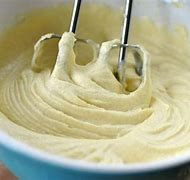

【N-COUNT】   In sports such as baseball and softball, a _batter_ is a person who hits the ball with a wooden bat. 击球员   +
⇒  ...batters and pitchers.  …击球员和投球手们。   +

【N】   the slope of the face of a wall that recedes gradually backwards and upwards (墙面的)斜坡   +

【V】   to have such a slope 形成坡度   +

【N】   a spree or debauch 狂欢或放荡   +

---

==== ▸ gender  [1073]   +
な/ˈdʒɛndə/   +

【N-VAR】   A person's _gender_ is the fact that they are male or female. 性别   +
⇒  Women are sometimes denied opportunities solely because of their gender.  女性有时仅仅因为她们的性别而被剥夺机会。   +

【N-COUNT】   You can refer to all male people or all female people as a particular _gender_. 性   +
⇒  While her observations may be true about some men, they could hardly apply to the entire gender.  她的观察对某些男人可能是对的，但并不适用于所有男性。   +

【N-VAR】   In grammar, the _gender_ of a noun, pronoun, or adjective is whether it is masculine, feminine, or neuter. A word's gender can affect its form and behaviour. In English, only personal pronouns such as "she," reflexive pronouns such as "itself," and possessive determiners such as "his" have gender. (语法上的) 性   +
⇒  In both Welsh and Irish the word for "moon" is of feminine gender.  在威尔士语和爱尔兰语中，“月亮”这个单词都是阴性。   +

---

==== ▸ impenetrable  [1074]   +
な/ɪmˈpɛnɪtrəbəl/   +

【ADJ】   If you describe something such as a barrier or a forest as _impenetrable_, you mean that it is impossible or very difficult to get through. (障碍或森林等) 难以穿越的   +
⇒  ...the Caucasus range, an almost impenetrable barrier between Europe and Asia.  …高加索山脉，欧亚之间一道几乎不可逾越的屏障。   +

【ADJ】   If you describe something such as a book or a theory as _impenetrable_, you are emphasizing that it is impossible or very difficult to understand. 不能理解的   +
⇒  His philosophical work is notoriously impenetrable.  他的哲学著作是出了名地令人费解。   +

---

==== ▸ displace  [1075]   +
な/dɪsˈpleɪs/   +

【V-T】   If one thing _displaces_ another, it forces the other thing out of its place, position, or role, and then occupies that place, position, or role itself. 取代   +
⇒  These factories have displaced tourism as the country's largest source of foreign exchange.  这些工厂已经取代了旅游业而成为该国最大的外汇来源。   +

【V-T】   If a person or group of people _is displaced_, they are forced to move away from the area where they live. 使背井离乡   +
⇒  More than 600,000 people were displaced by the tsunami.  超过60万人被海啸搞得背井离乡。   +

---

==== ▸ liable  [1076]   +
な/ˈlaɪəbəl/   +
-->  -li-捆,约束 + -able形容词词尾,被动意义 → 可被约束(捆)的+

【PHRASE】   When something _is liable to_ happen, it is very likely to happen. 很有可能的   +
⇒  Only a small minority of the mentally ill are liable to harm themselves or others.  只有极少数的精神病人很有可能伤害到自己或他人。   +

【ADJ】   If people or things are _liable to_ something unpleasant, they are likely to experience it or do it. 易于…的   +
⇒  She will grow into a woman particularly liable to depression.  她将变成一个特别易于消沉的女人。   +

【ADJ】   If you are _liable for_ something such as a debt, you are legally responsible for it. 负法律责任的   +
⇒  The airline's insurer is liable for damages to the victims' families.  航空公司投保的保险公司为遇难者家庭的损失负法律责任。   +

【N-UNCOUNT】   责   +
⇒  The company does not accept liability for fragile, valuable or perishable articles.  公司对于易碎、贵重或易腐烂的物品不负责任。   +

---

==== ▸ allocate  [1077]   +
な/ˈæləˌkeɪt/   +

【V-T】   If one item or share of something _is allocated to_ a particular person or _for_ a particular purpose, it is given to that person or used for that purpose. 分配   +
⇒  Tickets are limited and will be allocated to those who apply first.  票数有限，将分配给那些先申请的人。   +
⇒  The 1985 federal budget allocated $7.3 billion for development programmes.  1985年联邦预算拨了73亿美元用于开发项目。   +

---

==== ▸ airborne  [1078]   +
な/ˈɛəˌbɔːn/   +

【ADJ】   If an aircraft is _airborne_, it is in the air and flying. 在飞行中的   +
⇒  The pilot did manage to get airborne.  这位飞行员的确使飞机升空了。   +

【ADJ】  _Airborne_ troops use parachutes to get into enemy territory. 空降的   +
⇒  The allies landed thousands of airborne troops.  同盟国投下了成千上万的空降部队。   +

【ADJ】  _Airborne_ means in the air or carried in the air. 空气中的   +
⇒  Many people are allergic to airborne pollutants such as pollen.  许多人对空气中花粉之类的污染物质过敏。   +

---

==== ▸ snap  [1079]   +
な/snæp/   +

【V-T/V-I】   If something _snaps_ or if you _snap_ it, it breaks suddenly, usually with a sharp cracking noise. 使喀嚓折断; 喀嚓折断   +
⇒  He shifted his weight and a twig snapped.  他挪了挪身子，一根树枝随即喀嚓一声折断了。   +
⇒  The brake pedal had just snapped off.  制动踏板刚才突然断裂了。   +

【N-SING】  _Snap_ is also a noun. 喀嚓的断裂声   +
⇒  Every minute or so I could hear a snap, a crack and a crash as another tree went down.  几乎每隔一分钟，我就会听见又有一棵树倒下时发出的折断声、噼啪声和塌倒声。   +

【V-T/V-I】   If you _snap_ something into a particular position, or if it _snaps_ into that position, it moves quickly into that position, with a sharp sound. 使发出啪的一声; 发出啪的一声   +
⇒  He snapped the notebook shut.  他啪的一声合上笔记本。   +
⇒  He snapped the cap on his ballpoint.  他吧嗒一声扣上圆珠笔的笔帽。   +

【N-SING】  _Snap_ is also a noun. 吧嗒声   +
⇒  He shut the book with a snap and stood up.  他啪的一声合上书，站了起来。   +

【V-T】   If you _snap_ your _fingers_, you make a sharp sound by moving your middle finger quickly across your thumb, for example, in order to accompany music or to order someone to do something. 打响指   +
⇒  She had millions of listeners snapping their fingers to her first single.  数百万的听众和着她的首张单曲打响指。   +
⇒  He snapped his fingers, and Wilson produced a sheet of paper.  他打了一个响指，威尔逊便拿出一张纸来。   +

【N-SING】  _Snap_ is also a noun. 打响指   +
⇒  I could obtain with the snap of my fingers anything I chose.  只要打一下响指，我就可以得到我选中的任何东西。   +

【V-T/V-I】   If someone _snaps at_ you, they speak to you in a sharp, unfriendly way. 声色俱厉地说   +
⇒  "Of course I don't know her," Roger snapped.  “我当然不认识她，”罗杰恶声恶气地说。   +

【V-I】   If someone _snaps_, or if something _snaps_ inside them, they suddenly stop being calm and become very angry because the situation has become too tense or too difficult for them. (人) 突然发怒; (物) 突然爆发   +
⇒  He finally snapped when she prevented their children from visiting him one weekend.  当她阻止孩子们在一周末来探望他时，他终于失控发怒了。   +

【V-I】   If an animal such as a dog _snaps at_ you, it opens and shuts its jaws quickly near you, as if it were going to bite you. 作势猛咬   +
⇒  His teeth clicked as he snapped at my ankle.  他作势猛咬我的脚踝时，牙齿咔嚓作响。   +

【ADJ】   A _snap_ decision or action is one that is taken suddenly, often without careful thought. 仓促的   +
⇒  I think this is too important for a snap decision.  我认为此事非常重要，不宜仓促地做决定。   +

【N-COUNT】   A _snap_ is the same as a . 按扣   +

【N-COUNT】   A _snap_ is a photograph. 相片   +
⇒  ...a snap my mother took last year.  …我母亲去年拍的一张相片。   +

---

==== ▸ jolt  [1080]   +
な/dʒəʊlt/   +

【V-T/V-I】   If something _jolts_ or if something _jolts_ it, it moves suddenly and quite violently. 使颠簸; 颠簸   +
⇒  The wagon jolted again.  马车又颠簸起来。   +
⇒  The train jolted into motion.  火车颠了一下开动了。   +

【N-COUNT】  _Jolt_ is also a noun. 颠簸   +
⇒  We were worried that one tiny jolt could worsen her injuries.  我们担心一次轻微的颠簸都可能加剧她的伤情。   +

【V-T】   If something _jolts_ someone, it gives them an unpleasant surprise or shock. 震惊   +
⇒  A stinging slap across the face jolted her.  火辣辣的一记巴掌使她惊呆了。   +

【N-COUNT】  _Jolt_ is also a noun. 震惊   +
⇒  Then my husband left me. It gave me the jolt I needed.  后来我的丈夫离开了我。这给了我那个我需要的震动。   +

---

==== ▸ counterpart  [1081]   +
な/ˈkaʊntəˌpɑːt/   +
-->  counter- 相反,相对 + -part-分,局部 +

【N-COUNT】   Someone's or something's _counterpart_ is another person or thing that has a similar function or position in a different place. 对应的人或物   +
⇒  As soon as he heard what was afoot, he telephoned his German and Italian counterparts to protest.  他一听到在进行中的事，马上就给德国和意大利相应人员打电话抗议。   +

---

==== ▸ loan  [1082]   +
な/ləʊn/   +

【N-COUNT】   A _loan_ is a sum of money that you borrow. 贷款   +
⇒  The country has no access to foreign loans or financial aid.  该国得不到外国贷款或财政援助。   +
⇒  The president wants to make it easier for small businesses to get bank loans.  总统想使小公司能更容易地获得银行贷款。   +

【N-SING】   If someone gives you a _loan of_ something, you borrow it from them. 借用   +
⇒  I am in need of a loan of a bike for a few weeks.  我需要借辆自行车来用几周。   +

【V-T】   If you _loan_ something to someone, you lend it to them. 借出   +
⇒  He had kindly offered to loan us all the plants required for the exhibit.  他友好地主动提出了借给我们展览会所需的全部植物。   +

【PHRASAL VERB】  _Loan out_ means the same as . 借出   +
⇒  It is common practice for clubs to loan out players to sides in the lower divisions.  将球员借给下级球队是俱乐部的惯例。   +

【PHRASE】   If something is _on loan_, it has been borrowed. 借来的   +
⇒  ...impressionist paintings on loan from the National Gallery.  …从国家美术馆借来的印象派画作。   +

---

==== ▸ routine  [1083]   +
な/ruːˈtiːn/   +
--> 来自 route,路线，-ine,形容词后缀。引申词义常规的，日常的。 +

【N-VAR】   A _routine_ is the usual series of things that you do at a particular time. A _routine_ is also the practice of regularly doing things in a fixed order. 惯例; 常规   +
⇒  The players had to change their daily routine and lifestyle.  这些运动员不得不改变他们的每日常规和生活方式。   +

【ADJ】   You use _routine_ to describe activities that are done as a normal part of a job or process. 常规的   +
⇒  ...a series of routine medical tests including X-rays and blood tests.  …一系列包括X光和验血在内的常规医学检查。   +

【ADJ】   A _routine_ situation, action, or event is one which seems completely ordinary, rather than interesting, exciting, or different. 平淡的   +
⇒  So many days are routine and uninteresting, especially in winter.  太多的日子都是平淡和无趣，尤其是在冬季。   +

【N-VAR】   You use _routine_ to refer to a way of life that is uninteresting and ordinary, or hardly ever changes. 平淡乏味   +
⇒  ...the mundane routine of her life.  …她生活的平常乏味。   +

【N-COUNT】   A _routine_ is a computer program, or part of a program, that performs a specific function. 程序   +
⇒  ...an installation routine.  …一个安装程序。   +

【N-COUNT】   A _routine_ is a short sequence of jokes, remarks, actions, or movements that forms part of a longer performance. (一) 套   +
⇒  ...an athletic dance routine.  …一套体育舞蹈动作。   +

---

==== ▸ fundamental  [1084]   +
な/ˌfʌndəˈmɛntəl/   +

【ADJ】   You use _fundamental_ to describe things, activities, and principles that are very important or essential. They affect the basic nature of other things or are the most important element upon which other things depend. 基本的   +
⇒  Our constitution embodies all the fundamental principles of democracy.  我们的宪法体现了民主的所有基本原则。   +
⇒  A fundamental human right is being withheld from these people.  这些人的一项基本人权正被剥夺。   +

【ADJ】   You use _fundamental_ to describe something which exists at a deep and basic level, and is therefore likely to continue. 根本的   +
⇒  But on this question, the two leaders have very fundamental differences.  但在这个问题上，这两位领导人有着极根本的分歧。   +

【ADJ】   If one thing _is fundamental to_ another, it is absolutely necessary to it, and the second thing cannot exist, succeed, or be imagined without it. 绝对必要的   +
⇒  He believes better relations with China are fundamental to the well-being of the area.  他相信与中国的更好关系对这个地区的福祉是绝对必要的。   +

【ADJ】   You can use _fundamental_ to show that you are referring to what you consider to be the most important aspect of a situation, and that you are not concerned with less important details. 主要的   +
⇒  The fundamental problem lies in their inability to distinguish between reality and invention.  主要问题在于他们不能区分现实和虚构。   +

---

==== ▸ pupil  [1085]   +
な/ˈpjuːpəl/   +

【N-COUNT】   A _pupil_ of a painter, musician, or other expert is someone who studies under that expert and learns his or her skills. (画家、音乐家等的) 弟子   +
⇒  After his education, Goldschmidt became a pupil of the composer Franz Schreker.  上完学后，戈尔德施密特成了作曲家弗朗兹·施雷克的弟子。   +

【N-COUNT】   The _pupils_ of a school are the children who go to it. 学生   +
⇒  ...schools with over 1,000 pupils.  …有1000多名学生的学校。   +

【N-COUNT】   The _pupils_ of your eyes are the small, round, black holes in the centre of them. 瞳孔   +
⇒  The sick man's pupils were dilated.  病人的瞳孔放大了。   +

---

==== ▸ authentic  [1086]   +
な/ɔːˈθɛntɪk/   +
--> 来自 author. +
authentic = aut（自己）+hent（行为人）ic（形容词后缀）→自主行为人所说的或所做的→并非屈打成招的→真实可信的 词源解释：aut←希腊语autos（自己）；hent←希腊语hentes（行为人） 近义辨析：authentic强调内容的真实性，genuine强调作者的真实性。但有时候可混用。  +
衍生词：authenticity（真实性）；authenticate（鉴定）；authentication（证明） +

【ADJ】   An _authentic_ person, object, or emotion is genuine. 真实的   +
⇒  ...authentic Italian food.  …正宗的意大利食品。   +
⇒  She has authentic charm whereas most people simply have nice manners.  她有真正的魅力，而大多数人只是有礼貌而已。   +

【N-UNCOUNT】   真实性   +
⇒  There are factors, however, that have cast doubt on the statue's authenticity.  然而，有些因素已经让人们对这座雕像的真实性产生了怀疑。   +

【ADJ】   If you describe something as _authentic_, you mean that it is such a good imitation that it is almost the same as or as good as the original. 逼真的   +
⇒  ...patterns for making authentic frontier-style clothing.  …制作地道的边疆风格服装的图样。   +

【ADJ】   An _authentic_ piece of information or account of something is reliable and accurate. 可靠的   +
⇒  I had obtained the authentic details about the birth of the organization.  我已经弄到了有关该组织成立的可靠的详细资料。   +

---

==== ▸ crest  [1087]   +
な/krɛst/   +
--> 来自拉丁词crista, 羽毛，鸟冠，词源同crisp, 卷的，卷羽。词义引申为顶峰。 +

【N-COUNT】   The _crest of_ a hill or a wave is the top of it. 顶; 峰   +

【PHRASE】   If you say that you are _on the crest of a wave_, you mean that you are feeling very happy and confident because things are going well for you. 在巅峰   +
⇒  The band is riding on the crest of a wave with the worldwide success of their number-one-selling single.  这个乐队目前正处于巅峰，他们的单曲全球销量第一。   +

【N-COUNT】   A bird's _crest_ is a group of upright feathers on the top of its head. (鸟类的) 羽冠   +
⇒  Both birds had a dark blue crest.  两只鸟都长着深蓝色的羽冠。   +

【N-COUNT】   A _crest_ is a design that is the symbol of a noble family, a town, or an organization. 饰章   +
⇒  On the wall is the family crest.  墙上是家族饰章。   +

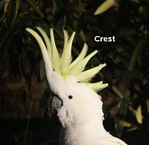
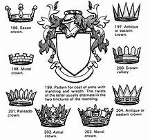

---

==== ▸ stardom  [1088]   +
な/ˈstɑːdəm/   +

【N-UNCOUNT】  _Stardom_ is the state of being very famous, usually as an actor, musician, or athlete. 明星身份   +
⇒  In 1929 she shot to stardom on Broadway in a Noel Coward play.  1929年，她以一部诺埃尔·科沃德的戏在百老汇一跃成为明星。   +

---

==== ▸ preach  [1089]   +
な/priːtʃ/   +
--> 来自prae,在前面，dicare,说，宣布，公告，词源同diction,predict.引申贬义词义说教。 +

【V-T/V-I】   When a member of the clergy _preaches_ a sermon, he or she gives a talk on a religious or moral subject during a religious service. 布 (道); 布道   +
⇒  At High Mass the priest preached a sermon on the devil.  在大弥撒仪式上，牧师布了一次有关魔鬼的道。   +
⇒  The bishop preached to a crowd of several hundred local people.  主教向一群几百名当地人布道。   +

【V-T/V-I】   When people _preach_ a belief or a course of action, they try to persuade other people to accept the belief or to take the course of action. 宣扬   +
⇒  He said he was trying to preach peace and tolerance to his people.  他说他正试图向他的人民宣扬和平与宽容。   +
⇒  Health experts are now preaching that even a little exercise is far better than none at all.  如今，健康专家宣扬说，即使少量的运动也比一点不运动要好得多。   +

【V-I】   If someone gives you advice in a very serious, boring way, you can say that they _are preaching at_ you. 说教   +
⇒  "Don't preach at me," he shouted.  “不要对我说教，”他喊道。   +

---

==== ▸ respective  [1090]   +
な/rɪˈspɛktɪv/   +
--> re-,再，-spect,看，词源同 specter,retrospect.即需要反复看，分开看的人或事物，引申词义分 别的，各自的。 +

【ADJ】  _Respective_ means relating or belonging separately to the individual people you have just mentioned. 各自的   +
⇒  Steve and I were at very different stages in our respective careers.  史蒂夫和我处在各自事业的迥然不同的阶段。   +

---

==== ▸ pliable  [1091]   +
な/ˈplaɪəbəl/   +
--> 来自ply,弯，转，-able,形容词后缀。 +

【ADJ】   If something is _pliable_, you can bend it easily without cracking or breaking it. 柔韧的   +
⇒  As your baby grows bigger, his bones become less pliable.  随着你的宝宝慢慢长大，他的骨头柔韧性会变弱。   +

---

==== ▸ absence  [1092]   +
な/ˈæbsəns/   +

【N-VAR】   Someone's _absence_ from a place is the fact that they are not there. 缺席   +
⇒  ...a bundle of letters which had arrived for me in my absence.  …我不在的时候寄给我的一捆信。   +

【N-SING】   The _absence_ of something from a place is the fact that it is not there or does not exist. 不存在   +
⇒  The presence or absence of clouds can have an important impact on temperature.  云的有无对气温会产生重要影响。   +

---

==== ▸ multitude  [1093]   +
な/ˈmʌltɪˌtjuːd/   +

【QUANT】   A _multitude of_ things or people is a very large number of them. 大量   +
⇒  There are a multitude of small, quiet roads to cycle along.  有多条可以骑自行车的僻静小路。   +
⇒  Addiction to drugs can bring a multitude of other problems.  毒瘾会带来其他许多问题。   +

【PHRASE】   If you say that something covers or hides _a multitude of sins_, you mean that it hides something unattractive or does not reveal the true nature of something. (被掩盖的) 种种丑恶   +

【N-COUNT】   You can refer to a very large number of people as a _multitude_. 一大群人   +
⇒  ...surrounded by a noisy multitude.  …被吵吵嚷嚷的一大群人围着。   +

【N-COUNT-COLL】   You can refer to the great majority of people in a particular country or situation as _the multitude_ or _the multitudes_. 大多数人   +
⇒  The hideous truth was hidden from the multitude.  向大众隐瞒了丑恶的真相。   +

---

==== ▸ stray  [1094]   +
な/streɪ/   +
--> 来自拉丁语 extra vagari,漫游，偏离，词源同 extravagant,vagary.拼写比较 strange,extraneous. +

【V-I】   If someone _strays_ somewhere, they wander away from where they are supposed to be. 走失   +
⇒  Tourists often get lost and stray into dangerous areas.  旅游者们经常迷路走进一些危险区域。   +

【ADJ】   A _stray_ dog or cat has wandered away from its owner's home. 走失的 (狗或猫)   +
⇒  A stray dog came up to him.  一只走失的狗来到他跟前。   +

【N-COUNT】  _Stray_ is also a noun. 走失的宠物   +
⇒  The dog was a stray which had been adopted.  这只狗是被收养的流浪狗。   +

【V-I】   If your mind or your eyes _stray_, you do not concentrate on or look at one particular subject, but start thinking about or looking at other things. (思想或视线) 不集中   +
⇒  Even with the simplest cases I find my mind straying.  即使对最简单的案例我发现自己的思想也无法集中。   +

【ADJ】   You use _stray_ to describe something that exists separated from other similar things. 离群的   +
⇒  An 8-year-old boy was killed by a stray bullet.  一个8岁的男孩被一颗流弹打死。   +

---

==== ▸ vulgar  [1095]   +
な/ˈvʌlɡə/   +
--> 来自拉丁语 vulgus,平民，词源同 divulge,可能来自 folk,民众。引申词义普通的，粗俗的。 +

【ADJ】   If you describe something as _vulgar_, you think it is in bad taste or of poor artistic quality. 粗俗的   +
⇒  I think it's a very vulgar house.  我认为这是一栋很俗气的房子。   +

【N-UNCOUNT】   粗俗   +
⇒  I hate the vulgarity of the bright colours in this room.  我不喜欢这个房间里艳丽而俗气的色调。   +

【ADJ】   If you describe pictures, gestures, or remarks as _vulgar_, you dislike them because they refer to sex or parts of the body in an offensive way that you find unpleasant. 下流的   +
⇒  The women laughed coarsely at the comedian's vulgar jokes.  那些女人们听到滑稽演员的下流笑话后都放荡地大笑起来。   +

【N-UNCOUNT】   下流   +
⇒  Charles was a complete gentleman, incapable of rudeness or vulgarity.  查尔斯完完全全是个绅士，无粗鲁下流之举。   +

【ADJ】   If you describe a person or their behaviour as _vulgar_, you mean that they lack taste or behave offensively. 粗鲁的   +
⇒  He was a vulgar old man, but he never swore in front of a woman.  他是个粗鲁的老头，但他从来没有在女人面前说过脏话。   +

【N-UNCOUNT】   粗鲁   +
⇒  It's his vulgarity that I can't take.  我不能忍受的正是他的粗鲁。   +

---

==== ▸ empress  [1096]   +
な/ˈɛmprɪs/ +
--> 来自emperor, 皇帝。-ess, 表女性。 +

N-COUNT/N-TITLE An empress is a woman who rules an empire or who is the wife of an emperor. 女皇; 皇后 +
⇒  ...Catherine II, Empress of Russia.  …俄罗斯女皇叶卡特琳娜二世。   +

---

==== ▸ cuisine  [1097]   +
な/kwɪˈziːn/   +
--> 词源同cook,culinary. +

【N-VAR】   The _cuisine_ of a country or district is the style of cooking that is characteristic of that place. 烹调风格   +
⇒  The cuisine of Japan is low in fat.  日式烹调脂肪含量低。   +

---

==== ▸ reapply  [1098]   +
な/ˌriːəˈplaɪ/   +
--> re-,再，重新，apply,申请。+

【V】   to put or spread (something) on again 再放上(某物)   +
⇒  reapply sunscreen frequently     +

1.[ VN] to put another layer of a substance on a surface 再敷一层；再涂一层 +
=> Sunblock should be reapplied every hour. 防晒霜应每隔一小时再抹一次。  +

2.[ V] ~ (for sth)to make another formal request for sth 重新申请；再次申请 +
=> Previous applicants for the post need not reapply. 申请过这个职位的人不需重新申请。  +

3.[ VN] to use sth again, especially in a different situation （尤指在不同场合）再利用 +
=> Students are taught a number of skills that can be reapplied throughout their studies. 教给学生一些方法，让他们在整个学习过程中可以反复使用。 +

---

==== ▸ barter  [1099]   +
な/ˈbɑːtə/   +

【V-T/V-I】   If you _barter_ goods, you exchange them for other goods, rather than selling them for money. 以物交换; 以物易物   +
⇒  They have been bartering wheat for cotton and timber.  他们一直在用小麦交换棉花和木材。   +
⇒  The market-place and street were crowded with those who'd come to barter.  市场和街道上挤满了来进行物物交换的人。   +

【N-UNCOUNT】  _Barter_ is also a noun. 物物交换   +
⇒  Overall, barter is a very inefficient means of organizing transactions.  总的说来，物物交换是一种非常低效的组织交易的方式。   +

---

==== ▸ satellite  [1100]   +
な/ˈsætəˌlaɪt/   +

【N-COUNT】   A _satellite_ is an object which has been sent into space in order to collect information or to be part of a communications system. Satellites move continually around the earth or around another planet. 人造卫星   +
⇒  The rocket launched two communications satellites.  火箭发射了两颗通信卫星。   +

【ADJ】  _Satellite_ television is broadcast using a satellite. 卫星的   +
⇒  They have four satellite channels.  他们有4个卫星频道。   +

【N-COUNT】   A _satellite_ is a natural object in space that moves around a planet or star. 卫星   +
⇒  ...the satellites of Jupiter.  …木星的卫星。   +

【N-COUNT】   You can refer to a country, area, or organization as a _satellite_ when it is controlled by or depends on a larger and more powerful one. 卫星国; 附属区; 卫星组织   +
⇒  Some companies are outfitting their satellite offices with wireless LANs.  一些公司正在为其办事处装备无线局域网。   +

---

==== ▸ capability  [1101]   +
な/ˌkeɪpəˈbɪlɪtɪ/   +

【N-VAR】   If you have the _capability_ or the _capabilities_ to do something, you have the ability or the qualities that are necessary to do it. 能力; 才能   +
⇒  People experience differences in physical and mental capability depending on the time of day.  视一天中的不同时候而定，人们会经历体能和智能上的差异。   +

【N-VAR】   A country's military _capability_ is its ability to fight in a war. 军事力量   +
⇒  Their military capability has gone down because their air force has proved not to be an effective force.  他们的军事力量已经削弱了，因为其空军被证明不是一只有战斗力的队伍。   +

---

==== ▸ rustproof  [1102]   +
な/ˈrʌstˌpruːf/   +

【ADJ】   treated against rusting 防锈的   +

---

==== ▸ debut  [1103]   +
な/ˈdeɪbjuː/   +
--> de-, 向下，离开。-but, 击，打，目标，词源同beat, butt. 即打向目标的，词义引申富家女子首次亮相，登上社交舞台。 +

【N-COUNT】   The _debut_ of a performer or sports player is their first public performance, appearance, or recording. 首次登台   +
⇒  She made her debut in a 1937 production of "Hamlet."  她在1937年《哈姆雷特》的演出中首次登台。   +

---

==== ▸ frail  [1104]   +
な/freɪl/   +
--> 缩写自拉丁语fragilis, 易碎的，词源同fragile. +

【ADJ】   Someone who is _frail_ is not very strong or healthy. 虚弱的   +
⇒  She lay in bed looking frail.  她躺在床上，看上去很虚弱。   +

【ADJ】   Something that is _frail_ is easily broken or damaged. 易碎的; 易坏的   +
⇒  The frail boat rocked as he clambered in.  他爬进去的时候，那条破船摇晃起来。   +

【N】   a rush basket for figs or raisins (装无花果或葡萄干的)灯心草篮   +

---

==== ▸ deception  [1105]   +
な/dɪˈsɛpʃən/   +

【N-VAR】  _Deception_ is the act of deceiving someone or the state of being deceived by someone. 欺骗; 受骗   +
⇒  He admitted conspiring to obtain property by deception.  他承认曾密谋通过欺骗获取财产。   +

---

==== ▸ aggressive  [1106]   +
な/əˈɡrɛsɪv/   +

【ADJ】   An _aggressive_ person or animal has a quality of anger and determination that makes them ready to attack other people. 好斗的   +
⇒  Some children are much more aggressive than others.  一些孩子比其他孩子好斗得多。   +
⇒  These fish are very aggressive.  这些鱼十分好斗。   +

【ADV】   好斗地   +
⇒  They'll react aggressively.  他们会凶猛地作出反应。   +

【ADJ】   People who are _aggressive_ in their work or other activities behave in a forceful way because they are very eager to succeed. 好强的   +
⇒  He is respected as a very aggressive and competitive executive.  他被尊认为一位十分好强好胜的主管。   +

【ADV】   好强地   +
⇒  ...countries noted for aggressively pursuing energy efficiency.  …以拼命追求能效著称的国家。   +

---

==== ▸ authority  [1107]   +
な/ɔːˈθɒrɪtɪ/   +
--> 来源于拉丁语auctor, -oris, m(创造者)。 词根词缀： auth(-auct-)增加→创造→权威 + -or名词词尾,行为 + -ity名词词尾 +

【N-PLURAL】  _The__authorities_ are the people who have the power to make decisions and to make sure that laws are obeyed. 当局   +
⇒  This provided a pretext for the authorities to cancel the elections.  这给当局提供了一个取消选举的借口。   +

【N-COUNT】   An _authority_ is an official organization or government department that has the power to make decisions. 官方机构   +
⇒  ...the Philadelphia Parking Authority.  …费城停车管理局。   +

【N-COUNT】   Someone who is an _authority on_ a particular subject knows a lot about it. (某一学科的) 权威人士   +
⇒  He's universally recognized as an authority on Russian affairs.  他被公认为是俄罗斯事务的权威。   +

【N-UNCOUNT】  _Authority_ is the right to command and control other people. 职权   +
⇒  A family member in a family business has a position of authority and power.  家庭成员在家族企业中都有职有权。   +

【N-UNCOUNT】   If someone has _authority_, they have a quality which makes other people take notice of what they say. 威信   +
⇒  He had no natural authority and no capacity for imposing his will on others.  他天生没有威信，也没有将其意志强加于他人的能力。   +

【N-UNCOUNT】  _Authority_ is official permission to do something. 官方的许可   +
⇒  The prison governor has refused to let him go, saying he must first be given authority from his own superiors.  监狱长已拒绝释放他，说他必须首先得到上级的许可。   +

---

==== ▸ tournament  [1108]   +
な/ˈtʊənəmənt, ˈtɜː-/   +
--> 来自古法语 tornement,一群骑士在马背上打斗，来自 tornoier,打斗，骑马长矛比武，字面意 +

【N-COUNT】   A _tournament_ is a sports competition in which players who win a match continue to play further matches in the competition until just one person or team is left. 锦标赛   +
⇒  ...the biggest golf tournament to be held in Australia.  …即将在澳大利亚举行的最大规模的高尔夫球锦标赛。   +

---

==== ▸ delight  [1109]   +
な/dɪˈlaɪt/   +

【N-UNCOUNT】  _Delight_ is a feeling of very great pleasure. 高兴; 欣喜   +
⇒  Throughout the house, the views are a constant source of surprise and delight.  整个房子，目之所及不停带来惊奇和欣喜。   +
⇒  Andrew roared with delight when he heard Rachel's nickname for the baby.  安德鲁听到雷切尔给那个婴儿起的爱称时，高兴地叫起来。   +

【PHRASE】   If someone _takes delight_ or _takes a delight in_ something, they get a lot of pleasure from it. 以…为乐   +
⇒  Haig took obvious delight in proving his critics wrong.  海格显然以证明他的批评者是错误的为乐。   +

【N-COUNT】   You can refer to someone or something that gives you great pleasure or enjoyment as a _delight_. 乐事; 乐趣   +
⇒  The aircraft was a delight to fly.  驾乘这种飞机是一件乐事。   +

【V-T】   If something _delights_ you, it gives you a lot of pleasure. 使高兴; 使欣喜   +
⇒  She has created a style of music that has delighted audiences all over the world.  她创立了一种为全世界听众所喜爱的音乐风格。   +

---

==== ▸ enthusiastic  [1110]   +
な/ɪnˌθjuːzɪˈæstɪk/   +

【ADJ】   If you are _enthusiastic about_ something, you show how much you like or enjoy it by the way that you behave and talk. 热衷的; 热烈的   +
⇒  Tom was very enthusiastic about the place.  汤姆曾非常热衷于那个地方。   +

【ADV】   热衷地; 热烈地   +
⇒  The announcement was greeted enthusiastically.  这则通告受到了热烈的欢迎。   +

---

==== ▸ bluster  [1111]   +
な/ˈblʌstə/   +
--> 同源词：blow（吹，刮，猛击） 助记窍门：bluster→谐音blast他（轰炸他）→猛刮、咆哮 衍生词：blustery（大风的，狂暴的，吵闹的）；blustering（大吵大闹的）+

【V-T/V-I】   If you say that someone _is blustering_, you mean that they are speaking aggressively but without authority, often because they are angry or offended. 咆哮   +
⇒  "That's lunacy," he blustered.  “真是疯了，” 他吼道。   +
⇒  He was still blustering, but there was panic in his eyes.  他还在咆哮，但眼神里带着惊慌。   +

【N-UNCOUNT】  _Bluster_ is also a noun. 喧嚣   +
⇒  ...the bluster of the presidential campaign.  ...总统大选的喧嚣。   +

---

==== ▸ rejuvenate  [1112]   +
な/rɪˈdʒuːvɪˌneɪt/   +
--> re-,再，重新，juven-,年青，词源同 juvenile,young. +

【V-T】   If something _rejuvenates_ you, it makes you feel or look young again. 使年轻   +
⇒  Shelley was advised that the Italian climate would rejuvenate him.  有人建议雪莱说意大利的气候会使他年轻。   +

【V-T】   If you _rejuvenate_ an organization or system, you make it more lively and more efficient, for example by introducing new ideas. 使恢复活力   +
⇒  The government pushed through plans to rejuvenate the inner cities.  该政府努力完成了使市中心恢复活力的一些计划。   +

---

==== ▸ quiver  [1113]   +
な/ˈkwɪvə/   +
--> 来自qu-所表示的拟声词，模仿松软，颤动或颤抖的声音，词源同quake,quiver.+

【V-I】   If something _quivers_, it shakes with very small movements. 颤抖   +
⇒  Her bottom lip quivered and big tears rolled down her cheeks.  她的下唇颤动着，大滴大滴的泪珠顺着脸颊滚了下来。   +

【V-I】   If you say that someone or their voice _is quivering with_ an emotion such as rage or excitement, you mean that they are strongly affected by this emotion and show it in their appearance or voice. (声音因愤怒或激动而) 颤抖   +
⇒  Cooper arrived, quivering with rage.  库珀到了，气得浑身发抖。   +

【N-COUNT】  _Quiver_ is also a noun. 颤抖   +
⇒  I recognized it instantly and felt a quiver of panic.  我立刻认出它了，感到一阵惊恐的颤抖。   +

【N】   a case for arrows 弓箭箱   +

---

==== ▸ epoch  [1114]   +
な/ˈiːpɒk/   +

【N-COUNT】   If you refer to a long period of time as an _epoch_, you mean that important events or great changes took place during it. 时代   +
⇒  The birth of Christ was the beginning of a major epoch of world history.  基督的诞生是世界历史一个重要时代的开始。   +

---

==== ▸ nickel  [1115]   +
な/ˈnɪkəl/   +

【N-UNCOUNT】  _Nickel_ is a silver-coloured metal that is used in making steel. 镍   +

【N-COUNT】   In the United States and Canada, a _nickel_ is a coin worth five cents. (美国和加拿大的) 五分镍币   +
⇒  ...a large glass jar filled with pennies, nickels, dimes, and quarters.  …一个装满1分、5分、10分和25分硬币的大玻璃罐。   +

---

==== ▸ oyster  [1116]   +
な/ˈɔɪstə/   +

【N-COUNT】   An _oyster_ is a large flat shellfish. Some oysters can be eaten and others produce valuable objects called pearls. 牡蛎   +
⇒  He had two dozen oysters and enjoyed every one of them.  他吃了两打牡蛎，每一个都吃得津津有味。   +

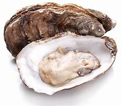

【PHRASE】   If you say that _the world is_ someone's _oyster_, you mean that they can do anything or go anywhere that they want to. 某人可以随心所欲   +
⇒  You're young, you've got a lot of opportunity. The world is your oyster.  你年轻，又得到了很多机会。你可以随心所欲地施展自己。   +

---

==== ▸ lumber  [1117]   +
な/ˈlʌmbə/   +

【N-UNCOUNT】  _Lumber_ consists of trees and large pieces of wood that have been roughly cut up. 木材   +
⇒  It was made of soft lumber, spruce by the look of it.  它是软木做的，看样子是云杉。   +

【V-I】   If someone or something _lumbers_ from one place to another, they move there very slowly and clumsily. 缓慢笨拙地移动   +
⇒  He lumbered back to his chair.  他蹒跚地坐回到椅子上。   +

【V-I】   to burden with something unpleasant, tedious, etc 使烦恼; 烦扰   +

---

==== ▸ puncture  [1118]   +
な/ˈpʌŋktʃə/   +
--> 词根punct-（刺，戳）与单词point（点）来自同一拉丁词源，很明显，前者比后者多了个/k/音，因为point在传入英语之前，受到了古法语的软化，/k/音中途消失。同根词：punctual（准点的）、compunction（后悔）；c、g音变出-pung-，如pungent（刺鼻的）。 +

【N-COUNT】   A _puncture_ is a small hole in a car tyre or bicycle tyre that has been made by a sharp object. (车胎上的) 刺孔   +
⇒  Somebody helped me to mend the puncture.  有人帮我补了车胎上的洞。   +

【N-COUNT】   A _puncture_ is a small hole in someone's skin that has been made by or with a sharp object. (皮肤上的) 扎孔   +
⇒  An instrument called a trocar makes a puncture in the abdominal wall.  一种叫作套管针的器械会在腹壁上扎一个小孔。   +

【V-T】   If a sharp object _punctures_ something, it makes a hole in it. 刺破   +
⇒  The bullet punctured the skull.  子弹射穿了头骨。   +

【V-T/V-I】   If a car tyre or bicycle tyre _punctures_ or if something _punctures_ it, a hole is made in the tyre. 扎破   +
⇒  His bike's rear tyre punctured.  他的自行车的后胎被扎破了。   +

---

==== ▸ boom  [1119]   +
な/buːm/   +

【N-COUNT】   If there is a _boom_ in the economy, there is an increase in economic activity, for example, in the number of things that are being bought and sold. (经济) 繁荣   +
⇒  An economic boom followed, especially in housing and construction.  接着是一个经济的繁荣，尤其在住房和建筑方面。   +
⇒  The 1980s were indeed boom years.  20世纪80年代确实是繁荣的时代。   +

【N-COUNT】   A _boom in_ something is an increase in its amount, frequency, or success. 增长   +
⇒  The boom in the sport's popularity has meant more calls for stricter safety regulations.  该项运动普及程度的大幅提高带来了更多要求更严格安全法规的呼声。   +

【V-I】   If the economy or a business _is booming_, the number of things being bought or sold is increasing. 激增   +
⇒  By 1988 the economy was booming.  到1988年为止经济一直很繁荣。   +
⇒  Sales are booming.  销售量在激增。   +

【V-T/V-I】   When something such as someone's voice, a cannon, or a big drum _booms_, it makes a loud, deep sound that lasts for several seconds. 发出低沉洪亮的声音   +
⇒  "Ladies," boomed Helena, without a microphone, "we all know why we're here tonight."  “女士们”，海伦娜没用话筒朗声说道，“我们都知道今晚我们为什么在这儿。”   +
⇒  Thunder boomed over Crooked Mountain.  雷声在克鲁克德山上空轰鸣。   +

【PHRASAL VERB】  _Boom out_ means the same as . 发出低沉洪亮的声音   +
⇒  Music boomed out from loudspeakers.  扬声器传出了低沉响亮的音乐。   +
⇒  A megaphone boomed out, "This is the police."  扩音器传出了低沉而响亮的声音：“我们是警察。”   +
⇒  The stillness of the night was broken by the boom of a cannon.  夜晚的寂静被大炮的轰鸣声打破了。   +

---

==== ▸ subculture  [1120]   +
な/ˈsʌbkʌltʃə/   +

【N-COUNT】   A _subculture_ is the ideas, art, and way of life of a group of people within a society, which are different from the ideas, art, and way of life of the rest of the society. 亚文化   +
⇒  ...the latest American subculture.  …最近的美国亚文化。   +

---

==== ▸ buckle  [1121]   +
な/ˈbʌkəl/   +
--> 来自拉丁词 bucca, 下巴，脸颊。原指系在下巴上的帽子，搭扣。来自PIE *bheu, 膨胀，鼓起来，词源同 bucket (桶). +

【N-COUNT】   A _buckle_ is a piece of metal or plastic attached to one end of a belt or strap, which is used to fasten it. (皮带等的) 带扣   +
⇒  He wore a belt with a large brass buckle.  他系了一根有很大黄铜扣的皮带。   +

【V-T】   When you _buckle_ a belt or strap, you fasten it. 扣紧   +
⇒  A door slammed in the house and a man came out buckling his belt.  屋子里门砰地关上了，一名男子一边扣着皮带一边走了出来。   +

【V-T/V-I】   If an object _buckles_ or if something _buckles_ it, it becomes bent as a result of very great heat or force. 使弯曲; (因受热或受压而) 变弯   +
⇒  The door was beginning to buckle from the intense heat.  由于高温，门正开始变弯。   +

【V-I】   If your legs or knees _buckle_, they bend because they have become very weak or tired. (腿、膝) 发软弯曲   +
⇒  Mcanally's knees buckled and he crumpled down onto the floor.  麦卡纳利双膝发软弯了下去，瘫倒在地板上。   +

---

==== ▸ mast  [1122]   +
な/mɑːst/   +

【N-COUNT】   The _masts_ of a boat are the tall, upright poles that support its sails. 桅杆   +

【N-COUNT】   A radio _mast_ is a tall upright structure that is used to transmit radio or television signals. 天线杆   +

【V-T】   to equip with a mast or masts 在...上装桅杆   +

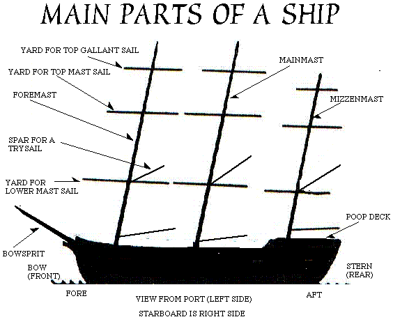

---

==== ▸ vegetative  [1123]   +
な/ˈvɛdʒɪtətɪv/   +

【ADJ】   If someone is in a _vegetative_ state, they are unable to move, think, or speak, and their condition is not likely to improve. 植物人的   +
⇒  She was in what was described as a vegetative state.  她处于一种被称为植物人的状态。   +

---

==== ▸ balk = baulk [1124]   +
な/bɔːk/   +
--> 英语单词 balk 的最初含义是农田中没犁过的条状区域，即两条犁沟之间的田脊或分割两块农田的田埂。作为动词时，表示“在犁地时留下田脊或田埂不犁”，引申为“（有意）忽略”。 +
由于犁过的农田都是平整的，而田脊或田埂高高突出在农田之上，因此balk作名词时又衍生出“障碍、梁木”等含义，作动词时又衍生出“阻碍、阻止、退缩、止步不前”的含义。 +
在体育运动中，还可以表示动作中断违规，如棒球运动中投手做出投球动作后却没有投球，跳远运动员跑过起跑区域后没有起跳，马术表演的马在栏杆前突然止步不前。 +

【V-I】   If you _balk at_ something, you definitely do not want to do it or to let it happen. 阻止; 反对   +
⇒  Even biology undergraduates may balk at animal experiments.  即使是生物专业的大学生都可能会反对动物实验。   +
⇒  Last October the bank balked, alarmed that a $24M profit had turned into a $20M deficit.  去年十月这家银行突然亏空，原本2400万美元的利润变成了2000万的赤字让人震惊。   +

baulk v.   /bɔːk/  +
( BrE ) ( NAmE usually balk ) +

1.[ V] __~ (at sth)__ to be unwilling to do sth or become involved in sth because it is difficult, dangerous, etc. 畏缩；回避 +
⇒ Many parents may baulk at the idea of paying $100 for a pair of shoes. 许多做父母的可能不愿出100块钱买一双鞋。 +

2.[ V] _~ (at sth)_ ( of a horse 马 ) to stop suddenly and refuse to jump a fence, etc. 逡巡不前；突然拒绝前行（如跳越障碍物等） +

3.[ VN] _~ sb (of sth)_ [ usually passive] ( formal ) to prevent sb from getting sth or doing sth 阻止；阻碍 +
⇒ She looked like a lion baulked of its prey. 她看上去像一头被夺走了猎物的狮子。 +

---

==== ▸ rotate  [1125]   +
な/rəʊˈteɪt/   +

【V-T/V-I】   When something _rotates_ or when you _rotate_ it, it turns with a circular movement. 旋转   +
⇒  The earth rotates around the sun.  地球围绕太阳旋转。   +

【V-T/V-I】   If people or things _rotate_, or if someone _rotates_ them, they take turns to do a particular job or serve a particular purpose. 使轮流; 轮流   +
⇒  The members of the club can rotate and one person can do all the preparation for the evening.  该俱乐部的成员可轮流工作，一个人可做晚会所有的准备工作。   +

---

==== ▸ collapse  [1126]   +
な/kəˈlæps/   +
--> col-共同,一起 + -laps-滑,落 + -e +

【V-I】   If a building or other structure _collapses_, it falls down very suddenly. 坍塌   +
⇒  A section of the Bay Bridge had collapsed.  海湾大桥有一部分坍塌了。   +

【N-UNCOUNT】  _Collapse_ is also a noun. 坍塌   +
⇒  The governor called for an inquiry into the motorway's collapse.  州长要求对高速公路的坍塌进行调查。   +

【V-I】   If something, for example a system or institution, _collapses_, it fails or comes to an end completely and suddenly. (系统或制度等) 崩溃; 瓦解   +
⇒  His business empire collapsed under a massive burden of debt.  他的商业帝国由于债台高筑而瓦解。   +

【N-UNCOUNT】  _Collapse_ is also a noun. (系统或制度等的) 崩溃; 瓦解   +
⇒  The coup's collapse has speeded up the drive to independence.  那次政变的失败加速推动了独立进程。   +

【V-I】   If you _collapse_, you suddenly faint or fall down because you are very ill or weak. 晕倒; 倒下   +
⇒  He collapsed following a vigorous exercise session at his home.  他在家中进行了一段时间的剧烈运动后倒下了。   +

【N-UNCOUNT】  _Collapse_ is also a noun. 晕倒; 倒下   +
⇒  A few days after his collapse he was sitting up in bed.  他病倒后过了几天就在床上起身坐着了。   +

【V-I】   If you _collapse_ onto something, you sit or lie down suddenly because you are very tired. (因极度疲倦而) 瘫坐; 瘫倒   +
⇒  She arrived home exhausted and barely capable of showering before collapsing on her bed.  她到家的时候累极了，几乎无法去淋浴就瘫倒在床上。   +

---

==== ▸ linear  [1127]   +
な/ˈlɪnɪə/   +

【ADJ】   A _linear_ process or development is one in which something changes or progresses straight from one stage to another, and has a starting point and an ending point. 线性的   +
⇒  ...decisions that lead the story in various directions, rather than follow traditional linear storytelling.  …引导故事向不同方向发展、而不是遵循传统的线性故事讲述的一些决定。   +

【ADJ】   A _linear_ shape or form consists of straight lines. 由直线组成的   +
⇒  ...the sharp, linear designs of the Seventies and Eighties.  …七、八十年代锐利的、以线条表现的设计。   +

【ADJ】  _Linear_ movement or force occurs in a straight line rather than in a curve. 直线的   +
⇒  ...linear movement toward a goal.  …朝着一个目标的直线运动。   +

---

==== ▸ corporate  [1128]   +
な/ˈkɔːpərɪt, -prɪt/   +
--> 来自词根corp，身体，见corporeal. 即成为一体的，成立法人实体的公司。 +

【ADJ】  _Corporate_ means relating to business corporations or to a particular business corporation. 公司的   +
⇒  ...top U.S. corporate executives.  …美国公司的高层管理人员。   +
⇒  ...a corporate lawyer.  …一名公司律师。   +

---

==== ▸ strip  [1129]   +
な/strɪp/   +

【N-COUNT】   A _strip of_ something such as paper, cloth, or food is a long, narrow piece of it. (纸、布或食物的) 条   +
⇒  ...a new kind of manufactured wood made by pressing strips of wood together and baking them.  …一种通过把木条挤压并烘干而制成的新型人造木材。   +
⇒  The simplest rag-rugs are made with strips of fabric braided together.  这些最简单的碎布地毯是由织物条编织而成的。   +

【N-COUNT】   A _strip of_ land or water is a long narrow area of it. 狭长 (地带或水域)   +
⇒  The coastal cities of Liguria sit on narrow strips of land lying under steep mountains.  利古里亚的那些海滨城市坐落在陡峭山脉下的狭长地带。   +

【N-COUNT】   A _strip_ is a long street in a city or town, where there are a lot of stores, restaurants, and hotels. 商业街   +
⇒  ...Goff's Charcoal Hamburgers on Lover's Lane, a busy commercial strip in North Dallas.  …在北达拉斯的一条繁忙的商业街——“情人巷”上的戈夫炭烤汉堡店。   +

【V-I】   If you _strip_, you take off your clothes. 脱衣服   +
⇒  They stripped completely, and lay and turned in the damp grass.  他们脱光了衣服，躺在潮湿的草地上翻滚。   +

【PHRASAL VERB】  _Strip off_ means the same as . 脱衣服   +
⇒  The children were brazenly stripping off and leaping into the sea.  这些孩子们那时正无所顾忌地脱掉衣服，跳进海里。   +

【V-T】   If someone _is stripped_, their clothes are taken off by another person, for example in order to search for hidden or illegal things. 脱掉…的衣服   +
⇒  One prisoner claimed he'd been dragged to a cell, stripped, and beaten.  一个犯人声称他曾被拖进一间牢房，被脱掉衣服殴打。   +

【V-T】   To _strip_ something means to remove everything that covers it. 剥离   +
⇒  After Mike left for work I stripped the beds and vacuumed the carpets.  迈克去上班后，我揭下了床罩并吸了地毯。   +

【V-T】   If you _strip_ an engine or a piece of equipment, you take it to pieces so that it can be cleaned or repaired. 拆卸   +
⇒  Volvo's three-man team stripped the car and treated it to a restoration.  沃尔沃的3人小组拆了那辆汽车并对它进行了修复。   +

【V】   to cut or divide into strips 切成或分成条   +

【PHRASAL VERB】  _Strip down_ means the same as . 拆卸   +
⇒  In five years I had to strip the water pump down four times.  在5年里我不得不拆卸了那个水泵4次。   +

【V-T】   To _strip_ someone _of_ their property, rights, or titles means to take those things away from them. 剥夺 (财产、权利); 撤销 (头衔)   +
⇒  The soldiers have stripped the civilians of their passports, and every other type of document.  那些士兵们已经夺走了市民的护照以及所有其他证件。   +

【N-COUNT】   In a newspaper or magazine, a _strip_ is a series of drawings which tell a story. The words spoken by the characters are often written on the drawings. 连环画   +
⇒  ...the Doonesbury strip.  …杜恩斯伯利的连环画。   +

【N】   the act or an instance of undressing or of performing a striptease 脱衣; 脱衣舞表演   +

---

==== ▸ crack  [1130]   +
な/kræk/   +

【V-T/V-I】   If something hard _cracks_, or if you _crack_ it, it becomes slightly damaged, with lines appearing on its surface. 使…破裂; 破裂   +
⇒  A gas main had cracked under my neighbour's garage and gas had seeped into our homes.  邻居家车库下的煤气主管道破裂了，煤气渗漏进我们家。   +

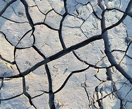

【V-T/V-I】   If something _cracks_, or if you _crack_ it, it makes a sharp sound like the sound of a piece of wood breaking. 使…噼啪作响; 发出辟裂声   +
⇒  Thunder cracked in the sky.  空中雷声炸响。   +

【V-T】   If you _crack_ a hard part of your body, such as your knee or your head, you hurt it by accidentally hitting it hard against something. 撞击   +
⇒  He cracked his head on the pavement and was knocked cold.  他的头撞着了路面，撞昏了。   +

【V-T】   When you _crack_ something that has a shell, such as an egg or a nut, you break the shell in order to reach the inside part. 叩开   +
⇒  Crack the eggs into a bowl.  把鸡蛋打到碗中。   +

【V-T】   If you _crack_ a problem or a code, you solve it, especially after a lot of thought. 破解 (难题、密码)   +
⇒  He has finally cracked the system after years of painstaking research.  经过数年的艰苦研究，他最终破译了该系统。   +

【V-I】   If someone _cracks_, they lose control of their emotions or actions because they are under a lot of pressure. (精神) 垮掉   +
⇒  She's calm and strong, and she is just not going to crack.  她冷静而坚强，决不会垮掉的。   +

【V-I】   If your voice _cracks_ when you are speaking or singing, it changes in pitch because you are feeling a strong emotion. (嗓音) 突然变化   +
⇒  Her voice cracked and she began to cry.  她失声哭了起来。   +

【V-T】   If you _crack_ a joke, you tell it. 说 (笑话)   +
⇒  He drove a Volkswagen, cracked jokes, and talked about beer and girls.  那时他开着一辆大众牌汽车，讲着笑话，谈论着啤酒和女孩。   +
 ▷ crack   +
な/kræk/   +

【V-T】     +

【N-COUNT】   A _crack_ is a very narrow gap between two things, or between two parts of a thing. 裂缝   +
⇒  Kathryn had seen him through a crack in the curtains.  凯瑟琳曾从帘子的裂缝看到过他。   +

【N-COUNT】   A _crack_ is a line that appears on the surface of something when it is slightly damaged. 裂纹   +
⇒  The plate had a crack in it.  这盘子上有条裂纹。   +

【N-SING】   If you open something such as a door, window, or curtain _a crack_, you open it only a small amount. 缝隙   +
⇒  He went to the door, opened it a crack, and listened.  他走到门边，把门打开一条缝，听了起来。   +
⇒  Suddenly there was a loud crack and glass flew into the car.  突然一阵巨大的爆裂声，碎玻璃飞溅进了车内。   +

【N-UNCOUNT】  _Crack_ is a very pure form of the drug cocaine. 强效纯可卡因   +

【ADJ】   A _crack_ soldier or sportsman is highly trained and very skilful. 训练有素的   +
⇒  ...a crack undercover police officer.  …一名训练有素的卧底警察。   +

【N-COUNT】   A _crack_ is a slightly rude or cruel joke. (挖苦人的) 笑话   +
⇒  Tell Tracy you're sorry for that crack about her weight.  告诉特蕾西你对那个有关她体重的玩笑感到抱歉。   +

---

==== ▸ shirk  [1131]   +
な/ʃɜːk/   +
--> 可能来自 shark,鲨鱼，骗子，引申词义逃避，偷懒。 +

【V-T/V-I】   If someone _shirks_ their responsibility or duty, they do not do what they have a responsibility to do. 逃避   +
⇒  He said the city had shirked its responsibility by not overseeing construction.  他说这座城市逃避了监管工程建筑的责任。   +
⇒  The government will not shirk from considering the need for further action.  政府将不会回避考虑进一步行动的需要。   +

---

==== ▸ aquifer  [1132]   +
な/ˈækwɪfə/   +
--> 词根aqua, 水。词根fer, 带来，含有。 +

【N-COUNT】   In geology, an _aquifer_ is an area of rock underneath the surface of the earth which absorbs and holds water. 地下蓄水层; 砂石含水层   +

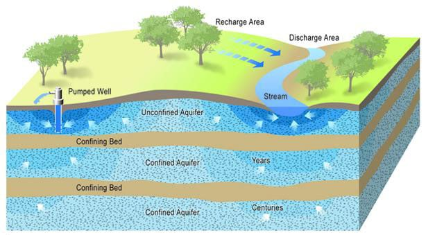

---

==== ▸ liquid  [1133]   +
な/ˈlɪkwɪd/   +

【N-MASS】   A _liquid_ is a substance which is not solid but which flows and can be poured, for example, water. 液体   +
⇒  Drink plenty of liquid.  饮用大量液体。   +
⇒  Boil for 20 minutes until the liquid has reduced by half.  煮沸20分钟直到液体减少一半为止。   +

【ADJ】   A _liquid_ substance is in the form of a liquid rather than being solid or a gas. 液体的   +
⇒  Wash in warm water with liquid detergent.  用液体清洁剂在温水中清洗。   +
⇒  The tanker was carrying liquid nitrogen.  油轮那时正在运送液态氮。   +

【ADJ】  _Liquid_ assets are the things that a person or company owns which can be quickly turned into cash if necessary. (资金等) 流动的   +
⇒  The bank had sufficient liquid assets to continue operations.  该银行拥有足够的流动资产来继续运转。   +

---

==== ▸ quotation  [1134]   +
な/kwəʊˈteɪʃən/   +

【N-COUNT】   A _quotation_ is a sentence or phrase taken from a book, poem, speech, or play, which is repeated by someone else. 引文; 引语   +
⇒  He illustrated his argument with quotations from Martin Luther King Jr.  他引用小马丁·路德·金的话阐述了自己的观点。   +

【N-COUNT】   When someone gives you a _quotation_, they tell you how much they will charge to do a particular piece of work. 报价   +
⇒  Get several written quotations and check exactly what's included in the cost.  弄几份书面报价来，并查清楚成本中包含哪些内容。   +

---

==== ▸ tarnish  [1135]   +
な/ˈtɑːnɪʃ/   +
--> 来自古法语 ternir,使暗淡，黯淡，来自 Proto-Germanic*darnijana,隐藏，来自 PIE*dher,固定， 握住，保护，词源同 darn, firm. 引申诸相关词义。 +

【V-T】   If you say that something _tarnishes_ someone's reputation or image, you mean that it causes people to have a worse opinion of them than they would otherwise have had. 玷污; 损坏 (名声或形象)   +
⇒  The affair could tarnish the reputation of the senator.  这一事件可能有损那位参议员的名声。   +

【ADJ】   受玷污了的; 受损了的   +
⇒  He says he wants to improve the tarnished image of his country.  他说想改善他的国家已受损的形象。   +

【V-T/V-I】   If a metal _tarnishes_ or if something _tarnishes_ it, it becomes stained and loses its brightness. 玷污; 变得有污迹   +
⇒  It never rusts or tarnishes.  它从不生锈，也没有污迹。   +

---

==== ▸ bisect  [1136]   +
な/baɪˈsɛkt/   +

【V-T】   If something long and thin _bisects_ an area or line, it divides the area or line in half. (把地区或线条)一分为二; 二等分   +
⇒  The main street bisects the town from end to end.  这条主街把整个镇一分为二。   +

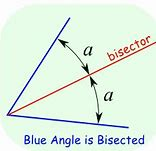

---

==== ▸ lizard  [1137]   +
な/ˈlɪzəd/   +

【N-COUNT】   A _lizard_ is a reptile with short legs and a long tail. 蜥蜴   +

---

==== ▸ frugal  [1138]   +
な/ˈfruːɡəl/   +
--> 来自fructus, 果实，词源同fruit. 原义为丰产的，丰富的，衍生词义节约的，节俭的，即节俭才能富裕之义。比较thrive, 繁盛，thrift，节俭。 +

【ADJ】   People who are _frugal_ or who live _frugal_ lives do not spend much money on themselves. 俭朴的   +
⇒  She lives a frugal life.  她过着俭朴的生活。   +

【N-UNCOUNT】   俭朴   +
⇒  We must practise the strictest frugality and economy.  我们必须奉行最严格意义上的俭朴和节约。   +

【ADJ】   A _frugal_ meal is small and not expensive. (膳食) 俭省的   +
⇒  The diet was frugal: cheese and water, rice and beans.  饮食很俭省：奶酪和水，米饭和豆类。   +

---

==== ▸ perfect  [1139]   +
な【ADJ】   Something that is _perfect_ is as good as it could possibly be. 完美的   +
⇒  He spoke perfect English.  他讲一口纯正的英语。   +
⇒  Nobody is perfect.  人无完人。   +

【ADJ】   If you say that something is _perfect for_ a particular person, thing, or activity, you are emphasizing that it is very suitable for them or for that activity. 最适合的   +
⇒  The pool area is perfect for entertaining.  游泳池一带最适合娱乐。   +

【ADJ】   If an object or surface is _perfect_, it does not have any marks on it, or does not have any lumps, hollows, or cracks in it. 无瑕疵的   +
⇒  Use only clean, Grade A, perfect eggs.  只用洁净的、一级的、无瑕疵的鸡蛋。   +

【ADJ】   You can use _perfect_ to give emphasis to the noun following it. (用以强调所修饰名词) 完全的   +
⇒  She was a perfect fool.  她是个十足的傻瓜。   +
⇒  Some people are always coming up to perfect strangers and asking them what they do.  有些人总是走近完全不认识的人跟前，问人家是干什么的。   +

【V-T】   If you _perfect_ something, you improve it so that it becomes as good as it can possibly be. 使完美   +
⇒  We perfected a hand-signal system so that he could keep me informed of hazards.  我们完善了一套手语体系，以便他能告知我危险。   +
⇒  I removed the fibroid tumours, using the techniques that I have perfected.  我用我完善过的技术切除了这些纤维瘤。   +

---

==== ▸ shuttle  [1140]   +
な/ˈʃʌtəl/   +
--> 来源于史前日耳曼语skeut-, skaut-, skut-(抛出,发射)。 同源词： sheet, shot, shout, shoot, shut +

【N-COUNT】   A _shuttle_ is the same as a . 航天飞机   +

【N-COUNT】   A _shuttle_ is a plane, bus, or train which makes frequent trips between two places. 穿梭班机; 穿梭班车; 穿梭火车   +
⇒  There is a free 24-hour shuttle between the airport terminals.  在机场的各航空站之间有24小时的免费穿梭巴士。   +

【V-T/V-I】   If someone or something _shuttles_ or _is shuttled_ from one place to another place, they frequently go from one place to the other. 使频频往返于两地之间; 频频往返于两地之间   +
⇒  He and colleagues have shuttled back and forth between the three capitals.  他和同事们一直来回往返于3个首都之间。   +

---

==== ▸ folkway  [1141]   +
(n.) a mode of thinking. feeling, or acting common to a given group of people; especially a traditional social custom 民风；社会习俗；习惯 +
=> folkway culture 民俗文化

---

==== ▸ imprecise  [1142]   +
な/ˌɪmprɪˈsaɪs/   +

【ADJ】   Something that is _imprecise_ is not clear, accurate, or precise. 不明确的; 不精确的; 不具体的   +
⇒  The charges were vague and imprecise.  这些指控的内容模糊不清。   +

---

==== ▸ ascribe  [1143]   +
な/əˈskraɪb/   +

【V-T】   If you _ascribe_ an event or condition _to_ a particular cause, you say or consider that it was caused by that thing. 将…归因于   +
⇒  An autopsy eventually ascribed the baby's death to sudden infant death syndrome.  一次尸检最终把这名婴儿的死亡归因于婴儿猝死综合症。   +

【V-T】   If you _ascribe_ a quality _to_ someone, you consider that they possess it. 将…归属 (于某人)   +
⇒  We do not ascribe a superior wisdom to government or the state.  我们并不将胜人一筹的智慧归属于政府或国家。   +

---

==== ▸ epic  [1144]   +
な/ˈɛpɪk/   +

【N-COUNT】   An _epic_ is a long book, poem, or film whose story extends over a long period of time or tells of great events. 史诗; 史诗般的作品   +
⇒  ...the Middle High German epic, "Nibelungenlied," written about 1200.  …大约写于1200年的中古高地德语史诗《尼贝龙根之歌》。   +

【ADJ】  _Epic_ is also an adjective. 史诗般的   +
⇒  ...epic narrative poems.  …那些史诗般的叙事诗。   +

【ADJ】   Something that is _epic_ is very large and impressive. 伟大的; 宏大的   +
⇒  ...Columbus's epic voyage of discovery.  …哥伦布的伟大发现之旅。   +

---

==== ▸ skim  [1145]   +
な/skɪm/   +

【V-T】   If you _skim_ something _from_ the surface of a liquid, you remove it. 撇去 (液体表面的浮物)   +
⇒  Rough seas today prevented specially equipped ships from skimming oil off the water's surface.  今天汹涌的海浪使特别装备的船只无法撇去浮在水面上的石油。   +

【V-T/V-I】   If something _skims_ a surface, it moves quickly along just above it. 掠过   +
⇒  ...seagulls skimming the waves.  …掠过海浪的海鸥。   +

【V-T/V-I】   If you _skim_ a piece of writing, you read through it quickly. 略读; 浏览   +
⇒  He skimmed the pages quickly, then read them again more carefully.  他很快浏览了几页，然后又仔细地读了一遍。   +

---

==== ▸ assign  [1146]   +
な/əˈsaɪn/   +

【V-T】   If you _assign_ a piece of work _to_ someone, you give them the work to do. 布置 (任务)   +
⇒  When I taught, I would assign a topic to children that they would write about.  教书时，我会给孩子们布置个写作题。   +
⇒  Later in the year, she'll assign them research papers.  今年晚些时候，她将给他们布置论文。   +

【V-T】   If you _assign_ something _to _someone, you say that it is for their use. 分配 (某物)   +
⇒  The selling broker is then required to assign a portion of the commission to the buyer broker.  卖方经纪人则被要求分给买方经纪人一部分佣金。   +

【V-T】   If someone _is assigned to_ a particular place, group, or person, they are sent there, usually in order to work at that place or for that person. 分派   +
⇒  I was assigned to Troop A of the 10th Cavalry.  我被分派到了第10装甲部队的A大队。   +
⇒  Did you choose Russia or were you simply assigned there?  你选择了俄罗斯还是只是被派到了那里？   +

【V-T】   If you _assign_ a particular function or value _to_ someone or something, you say they have it. 赋予 (某功能或价值)   +
⇒  Under the system, each business must assign a value to each job.  在这种制度下，每家企业必须赋予每份工作某种价值。   +

---

==== ▸ pitch  [1147]   +
な/pɪtʃ/   +

【V-T】   If you _pitch_ something somewhere, you throw it with some force, usually aiming it carefully. 投掷   +
⇒  Simon pitched the empty bottle into the lake.  西蒙把空瓶子投进湖里。   +

【V-T】   In the game of baseball, when you _pitch_ the ball, you throw it to the batter for them to hit it. 投 (球) 给击球手   +
⇒  We passed long, hot afternoons pitching a baseball.  我们以打棒球来消磨一个个漫长的炎热午后。   +

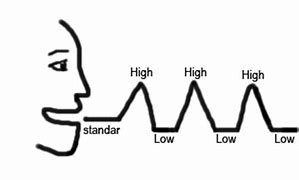

【V-T/V-I】   To _pitch_ somewhere means to fall forwards suddenly and with a lot of force. (向前) 跌倒   +
⇒  The movement took him by surprise, and he pitched forward.  突然的移动让他猝不及防，向前跌倒。   +
⇒  Alan staggered sideways, pitched head-first over the low wall and fell into the lake.  艾伦两侧摇晃着，一头栽过矮墙，掉进湖里。   +

【V-T】   If someone _is pitched into_ a new situation, they are suddenly forced into it. 迫使进入 (一种新的处境)   +
⇒  They were being pitched into a new adventure in which they would have to fight the whole world.  他们当时正被胁迫参与到一次不得不与整个世界抗衡的新冒险中。   +

【N】   the degree of elevation or depression 程度   +

【N-UNCOUNT】   The _pitch_ of a sound is how high or low it is. 音调   +
⇒  He raised his voice to an even higher pitch.  他将嗓门提得更高了。   +

【V-T】   If a sound _is pitched at_ a particular level, it is produced at the level indicated. 使 (音调)达到(指定水准)   +
⇒  His cry is pitched at a level that makes it impossible to ignore.  他哭声之大让人不可能置若罔闻。   +
⇒  His voice was pitched high, the words muffled by his crying.  他的嗓门提得很高，说的话都被他的叫喊声压得听不清了。   +

【V-T】   If something _is pitched at_ a particular level or degree of difficulty, it is set at that level. 给…设定水平 (或难度)   +
⇒  While this is very important material I think it's probably pitched at too high a level for our students.  尽管这是个很重要的材料，但我认为它的难度太大，不适合我们的学生。   +

【N-SING】   If something such as a feeling or a situation rises to a high _pitch_, it rises to a high level. (感情或形势等的) 程度   +
⇒  The public's feelings were at a high pitch of indignation.  公众的愤怒情绪达到了极点。   +

【V-T】   If someone _pitches_ an idea for something such as a new product, they try to persuade people to accept the idea. 力荐(某主张)   +
⇒  My agent has pitched the idea to my editor in New York.  我的代理人已向我在纽约的编辑力荐这个想法。   +

【N-COUNT】   A _pitch_ is an area of ground that is marked out and used for playing a game such as football, cricket, or hockey. 比赛场地   +
⇒  ...a football pitch.  …一个足球场。   +
⇒  He was the fastest thing I ever saw on a baseball field.  他是我见过的在棒球场上跑得最快的家伙。   +

【N】   any of various heavy dark viscid substances obtained as a residue from the distillation of tars 沥青   +

【V】   to apply pitch to (something) 用沥青覆盖(某物)   +

【PHRASE】   If someone _makes a pitch for_ something, they try to persuade people to do or buy it. 游说   +
⇒  The president speaks in New York today, making another pitch for his economic programme.  总统今天在纽约发表讲话，再一次游说他的经济计划。   +

---

==== ▸ browse  [1148]   +
な/braʊz/   +

【V-I】   If you _browse_ in a shop, you look at things in a fairly casual way, in the hope that you might find something you like. 浏览; 逛   +
⇒  I stopped in several bookshops to browse.  我去了几家书店，随便浏览了一下。   +
⇒  She browsed in an upscale antiques shop.  她逛了一家上等的古玩店。   +

【N-COUNT】  _Browse_ is also a noun. 浏览; 逛   +
⇒  ...a browse around the shops.  …在商店的一番闲逛。   +

【V-I】   If you _browse through_ a book or magazine, you look through it in a fairly casual way. 随意翻阅   +
⇒  ...sitting on the sofa browsing through the TV pages of the paper.  …坐在沙发上随意翻看报纸上的电视版面。   +

【V-I】   If you _browse_ on a computer, you search for information in computer files or on the Internet, especially on the World Wide Web. (在电脑或网络上) 搜索   +
⇒  Try browsing around in the network bulletin boards.  在网络布告栏里搜索一下试试。   +

【V-T/V-I】   When animals _browse_, they feed on plants. (动物) 嚼食植物   +
⇒  ...three red deer stags browsing on the fringes of the forest.  …在森林边上吃嫩枝嫩叶的3头红色雄鹿。   +

---

==== ▸ infrared  [1149]   +
な/ˌɪnfrəˈrɛd/   +
--> infra-,低于，在下方，red,红色。即低于正常红色的，用于指红外线。 +

【ADJ】  _Infrared_ radiation is similar to light but has a longer wavelength, so we cannot see it without special equipment. 红外线的   +

【ADJ】  _Infrared_ equipment detects infrared radiation. 使用红外线的   +
⇒  ...searching with infrared scanners for weapons and artillery.  …用红外线扫描仪搜查武器和大炮。   +

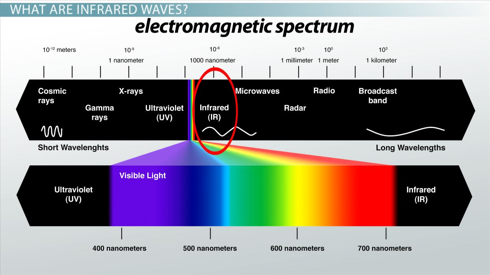

---

==== ▸ spiny  [1150]   +
な/ˈspaɪnɪ/   +
--> 来自 spine,刺，刺毛。 +

【ADJ】   A _spiny_ plant or animal is covered with long sharp points. 长满刺的   +
⇒  ...a spiny lobster.  ...一只长满刺的龙虾。   +
⇒  ...a spiny cactus.  ...一个长满刺的仙人掌。   +

---

==== ▸ maize  [1151]   +
な/meɪz/   +
--> 来自南美土著语。 +

【N-UNCOUNT】  _Maize_ is the same as . 玉米 /( BrE ) ( NAmE also corn ) a tall plant grown for its large yellow grains that are used for making flour or eaten as a vegetable; the grains of this plant 玉蜀黍；玉米   +

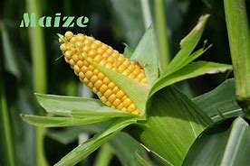

---

==== ▸ evacuation  [1152]   +

(n.)撤离，疏散；（粪便等的）排泄；排空，清除

---

==== ▸ rumor = rumour [1153]   +
な/ˈruːmə/   +
N-VAR A _rumour_ is a story or piece of information that may or may not be true, but that people are talking about. 传闻 +
=>  U.S. officials are discounting rumours of a coup. 美国政府官员对一场政变的传闻将信将疑。 +

---

==== ▸ quarterly  [1154]   +
な/ˈkwɔːtəlɪ/   +

【ADJ】   A _quarterly_ event happens four times a year, at intervals of three months. 一年四次的; 每季的   +
⇒  ...the latest Bank of Japan quarterly survey of 5,000 companies.  …日本银行对5000家公司最新的季度调查。   +

【ADV】  _Quarterly_ is also an adverb. 一年四次地; 每季地   +
⇒  It makes no difference whether dividends are paid quarterly or annually.  红利是按季度还是按年度支付没有区别。   +

【N-COUNT】   A _quarterly_ is a magazine that is published four times a year, at intervals of three months. 季刊   +
⇒  The quarterly had been a forum for sound academic debate.  这份季刊曾经是正统学术辩论的论坛。   +

---

==== ▸ chivalrous  [1155]   +
な/ˈʃɪvəlrəs/   +
--> 来自拉丁词caballus, 马，原指骑士精神的，有礼貌的。比较 cavalier, 骑士精神的，傲慢的。 +
cavali ← 通俗拉丁语caballus（马） 同源词：chevalier（骑士）；cavalry（骑兵、骑兵部队） 单词 *knight、cavalier、chevalier、cavalry 都含有“骑士”的含义*，区别在于： +
*knight来自古英语，表示“骑士”这种贵族身份*，不是随便找匹马骑上去就是knight。 +
*chevalier 和 knight差不多，都表示贵族身份。但 chevalier来自法语，所以指的是法国的“骑士”。* +
cavalier来自意大利，不是贵族身份，仅仅表示骑兵、骑手，后来才衍生出“绅士”、“有骑士精神的男人”之意，但并非贵族身份或荣誉称号。 +
cavalry 则完全是固守本意，仅仅表示骑兵、骑兵部队这种兵种，骑兵兵种消亡后表示装甲兵种。 +

【ADJ】   A _chivalrous_ man is polite, kind, and unselfish, especially towards women. (对女人)彬彬有礼的   +
⇒  He was handsome, upright, and chivalrous.  他英俊、正直、对女士彬彬有礼。   +

---

==== ▸ sound  [1156]   +
な/saʊnd/   +

【N-COUNT】   A _sound_ is something that you hear. 声音   +
⇒  Peter heard the sound of gunfire.  彼得听见了枪炮声。   +
⇒  Liza was so frightened she couldn't make a sound.  莉莎惊吓得发不出任何声音。   +

【N】   a relatively narrow channel between two larger areas of sea or between an island and the mainland 海峡   +

【N-UNCOUNT】  _Sound_ is energy that travels in waves through air, water, or other substances, and can be heard. 声能   +
⇒  The aeroplane will travel at twice the speed of sound.  飞机将以两倍于音速的速度飞行。   +

【N-SING】  _The__sound_ on a television, radio, or CD player is what you hear coming from the machine. Its loudness can be controlled. (可调大小声的) 播音   +
⇒  She went and turned the sound down.  她过去把声音调小。   +

【N-COUNT】   A singer's or band's _sound_ is the distinctive quality of their music. 音乐风格   +
⇒  They have started showing a strong soul element in their sound.  他们已经开始在音乐风格中展示出一种强烈的灵歌因素。   +

【V-T/V-I】   If something such as a horn or a bell _sounds_ or if you _sound_ it, it makes a noise. 使发出声音; 发出声音   +
⇒  The buzzer sounded in Daniel's office.  丹尼尔办公室的蜂鸣器响了起来。   +

【V-T】   If you _sound_ a warning, you publicly give it. If you _sound_ a note of caution or optimism, you say publicly that you are cautious or optimistic. 宣告   +
⇒  The archbishop has sounded a warning to world leaders on third world debt.  大主教已经发出警告提醒世界领导人注意第三世界的债务。   +

【V】   to seek to discover (someone's views, etc), as by questioning 通过询问了解(某人的观点)   +

【V】   to measure the depth of (a well, the sea, etc) by lowering a plumb line, by sonar, etc 测量(井、海等的)深度   +

【V-LINK】   When you are describing a noise, you can talk about the way it _sounds_. 听起来   +
⇒  They heard what sounded like a huge explosion.  他们听见了一种像是巨大爆炸的声音。   +
⇒  The creaking of the hinges sounded very loud in that silence.  铰链的嘎吱声在那寂静中听起来很响。   +

【V-LINK】   When you talk about the way someone _sounds_, you are describing the impression you have of them when they speak. 听起来   +
⇒  She sounded a bit worried.  她听起来有点焦虑不安。   +
⇒  Murphy sounds like a child.  墨菲听起来像个孩子。   +

【V-LINK】   When you are describing your impression or opinion of something you have heard about or read about, you can talk about the way it _sounds_. 令人觉得   +
⇒  It sounds like a wonderful idea to me, does it really work?  在我听来那像个好主意，但真管用吗？   +
⇒  It sounds as if they might have made a dreadful mistake.  感觉似乎他们已经犯下了一个大错。   +

【N-SING】   You can describe your impression of something you have heard about or read about by talking about _the sound of_ it. (听到或看到的) 感觉   +
⇒  Here's a new idea we liked the sound of.  这是个新想法，听起来我们就喜欢。   +
⇒  I don't like the sound of Toby Osborne.  我不喜欢托比•奥斯伯恩的感觉。   +
 ▷ sound   +
な/saʊnd/   +

【N-SING】     +

【ADJ】   If a structure, part of someone's body, or someone's mind is _sound_, it is in good condition or healthy. 健康的; 状况良好的   +
⇒  When we bought the house, it was structurally sound.  当我们买下这房子时，其结构完好无损。   +
⇒  Although the car is basically sound, I was worried about certain areas.  虽然这辆汽车基本状况完好，但我担心某几个部分。   +

【ADJ】  _Sound_ advice, reasoning, or evidence is reliable and sensible. 可靠的   +
⇒  They are trained nutritionists who can give sound advice on diets.  他们是训练有素的营养师，能提供有关饮食的可靠建议。   +
⇒  Buy a policy only from an insurance company that is financially sound.  只买财政状况良好的保险公司的保险。   +

【ADJ】   If you describe someone's ideas as _sound_, you mean that you approve of them and think they are correct. 正确的   +
⇒  I am not sure that this is sound democratic practice.  我不能肯定这就是正确的民主做法。   +

【ADJ】   If someone is in a _sound_ sleep, they are sleeping very deeply. 酣 (睡) 的   +
⇒  She had woken me out of a sound sleep.  她把我从酣睡中叫醒了。   +

【ADV】  _Sound_ is also an adverb. 酣 (睡) 地   +
⇒  He was lying in bed, sound asleep.  他正躺在床上，睡得很香。   +

---

==== ▸ journal  [1157]   +
な/ˈdʒɜːnəl/   +
--> 来自古法语jornel,天，一天时间，一天的工作，来自拉丁语diurnalis,一天的，词源同daily.部分学者认为其拼写变化由字母d到字母j可能是来自后拉丁语时期，字母i变成字母j后导致首字母d脱落造成的。词义由一天的工作引申日志，日报，期刊，一天的新闻等。 +

【N-COUNT】   A _journal_ is a magazine, especially one that deals with a specialized subject. 期刊   +
⇒  All our results are published in scientific journals.  我们所有的结果都发表在科学刊物上。   +

【N-COUNT】   A _journal_ is a daily or weekly newspaper. The word journal is often used in the name of the paper. 日报; 周报   +
⇒  ...ads in The New York Times, the Wall Street Journal and other publications.  …纽约时报、华尔街日报和其他出版物上的广告。   +

【N-COUNT】   A _journal_ is an account that you write of your daily activities. 日记   +
⇒  Sara confided to her journal.  萨拉在日记中倾吐心事。   +

---

==== ▸ bundle  [1158]   +
な/ˈbʌndəl/   +

【N-COUNT】   A _bundle of_ things is a number of them that are tied together or wrapped in a cloth or bag so that they can be carried or stored. 包; 捆; 束   +
⇒  Lance pulled a bundle of papers out of a folder.  兰斯从一个文件夹中拉出一叠文件。   +
⇒  He gathered the bundles of clothing into his arms.  他把一捆捆衣物抱起来。   +

【N-SING】   If you describe someone as, for example, a _bundle of_ fun, you are emphasizing that they are full of fun. If you describe someone as a _bundle of_ nerves, you are emphasizing that they are very nervous. (强调人的特点) 非常   +
⇒  I remember Mickey as a bundle of fun, great to have around.  我记得米基是个非常有趣的人，有他在身边很开心。   +
⇒  Life at high school wasn't a bundle of laughs.  高中生活并不是充满了笑声。   +

【V-T】   If someone _is bundled_ somewhere, someone pushes them there in a rough and hurried way. 塞   +
⇒  He was bundled into a car and driven 50 miles to a police station.  他被塞进一辆小汽车，被带到50英里外的警察局。   +

【V-T】   To _bundle_ software means to sell it together with a computer, or with other hardware or software, as part of a set. 捆绑销售   +
⇒  It's cheaper to buy software bundled with a PC than separately.  购买与计算机捆绑销售的软件比单独买更便宜。   +

---

==== ▸ mercantile  [1159]   +
な/ˈmɜːkənˌtaɪl/   +

【ADJ】  _Mercantile_ means relating to or involved in trade. 贸易的; 商业的   +
⇒  ...the emergence of a new mercantile class.  ...一个新兴商业阶层的出现。   +

---

==== ▸ circulate  [1160]   +
な/ˈsɜːkjʊˌleɪt/   +

【V-T/V-I】   If a piece of writing _circulates_ or _is circulated_, copies of it are passed around among a group of people. 散发; 流传   +
⇒  The document was previously circulated in New York at the United Nations.  这份文件过去曾在纽约的联合国总部传阅过。   +
⇒  Public employees, teachers and liberals are circulating a petition for his recall.  公务员、教师和自由主义者们正在传签一份请求召回他的请愿书。   +

【N-UNCOUNT】   流传   +
⇒  ...an inquiry into the circulation of "unacceptable literature."  …对于“不可接受的文学”的流传所进行的调查。   +

【V-T/V-I】   If something such as a rumour _circulates_ or _is circulated_, the people in a place tell it to each other. 散布; 流传   +
⇒  Rumours were already beginning to circulate that the project might have to be abandoned.  有关这个项目可能被迫放弃的流言已经开始在四处传播。   +

【V-I】   When something _circulates_, it moves easily and freely within a closed place or system. 循环   +
⇒  ...a virus which circulates via the bloodstream and causes ill health in a variety of organs.  …一种通过血流在体内循环而导致许多器官病变的病毒。   +

【N-UNCOUNT】   循环   +
⇒  The north pole is warmer than the south and the circulation of air around it is less well contained.  北极比南极温暖，其周围的空气循环更为畅通。   +

【V-I】   If you _circulate_ at a party, you move among the guests and talk to different people. (在聚会上) 往来应酬   +
⇒  If you'll excuse me, I really must circulate.  对不起，我真得去应酬一下了。   +

---

==== ▸ divert  [1161]   +
な/daɪˈvɜːt, daɪ-/   +

【V-T/V-I】   To _divert_ vehicles or travellers means to make them follow a different route or go to a different destination than they originally intended. You can also say that someone or something _diverts from_ a particular route or _to_ a particular place. 使改道; 改道   +
⇒  We diverted a plane to rescue 100 passengers.  我们改变飞机航线以拯救100名乘客。   +
⇒  Abington Memorial Hospital has been diverting trauma patients to other hospitals because it does not have enough surgeons.  由于缺乏足够的外科医生，阿宾顿纪念医院一直在将外伤病人转到其他医院。   +

【V-T】   To _divert_ money or resources means to cause them to be used for a different purpose. 转移   +
⇒  A wave of deadly bombings has forced the United States to divert funds from reconstruction to security.  一系列致命的炸弹袭击迫使美国将资金从重建转向安全防御。   +

【V-T】   To _divert_ a phone call means to send it to a different number or place from the one that was dialled by the person making the call. 转接 (电话)   +
⇒  He instructed the switchboard staff to divert all Laura's calls to him.  他通知接线员把劳拉打来的所有电话都转给他。   +

【V-T】   If you say that someone _diverts_ your attention from something important or serious, you disapprove of them behaving or talking in a way that stops you thinking about it. 转移…的注意力   +
⇒  They want to divert the attention of the people from the real issues.  他们想把人民的注意力从真正的问题上转移开。   +

---

==== ▸ blanket  [1162]   +
な/ˈblæŋkɪt/   +

【N-COUNT】   A _blanket_ is a large square or rectangular piece of thick cloth, especially one that you put on a bed to keep you warm. 毯子   +

【N-COUNT】   A _blanket of_ something such as snow is a continuous layer of it which hides what is below or beyond it. 覆盖层   +
⇒  The mud disappeared under a blanket of snow.  泥地在一层白雪的覆盖下消失不见了。   +

【V-T】   If something such as snow _blankets_ an area, it covers it. 覆盖   +
⇒  More than a foot of snow blanketed parts of Michigan.  一英尺多厚的白雪覆盖了密歇根州的部分地区。   +

【ADJ】   You use _blanket_ to describe something when you want to emphasize that it affects or refers to every person or thing in a group, without any exceptions. 适用于全体的   +
⇒  There's already a blanket ban on foreign unskilled labour in Japan.  日本已经有一项禁止使用外国非熟练工人的通用禁令。   +

---

==== ▸ backhand  [1163]   +
な/ˈbækˌhænd/   +

【N-VAR】   A _backhand_ is a shot in tennis or other racket sports, which you make with your arm across your body. 反拍   +
⇒  She practised her backhand.  她练习反拍。   +

---

==== ▸ luminous  [1164]   +
な/ˈluːmɪnəs/   +

【ADJ】   Something that is _luminous_ shines or glows in the dark. 发亮的   +
⇒  The luminous dial on the clock showed five minutes to seven.  时钟上发光的表盘显示当时7点差5分。   +

---

==== ▸ receptacle  [1165]   +
な/rɪˈsɛptəkəl/   +
-->  re-回,向后 + -cept-拿,取 + -acle名词后缀 +

【N-COUNT】   A _receptacle_ is an object that you use to put or keep things in. 容器   +
=> The seas *have been used as a receptacle* for a range of industrial toxins. 海洋成了各种有毒工业废料的大容器。 +

---

==== ▸ stature  [1166]   +
な/ˈstætʃə/   +
--> -stat-站立 + -ure名词词尾 +

【N-UNCOUNT】   Someone's _stature_ is their height. 身高   +
⇒  It's more than his physical stature that makes him remarkable.  不单单是他的身高使他气宇非凡。   +
⇒  Mother was of very small stature, barely five feet tall.  母亲身材娇小，仅有5英尺高。   +

【N-UNCOUNT】   The _stature_ of a person is the importance and reputation that they have. 名望   +
⇒  Who can deny his stature as the world's greatest cellist?  谁能否认他是世界上最伟大的大提琴演奏家？   +

---

==== ▸ statue  [1167]   +
な/ˈstætjuː/   +

【N-COUNT】   A _statue_ is a large sculpture of a person or an animal, made of stone or metal. (石或金属做的动物或人的) 雕像   +
⇒  ...a bronze statue of an Arabian horse.  …一座阿拉伯马青铜雕像。   +

---

==== ▸ extrinsic  [1168]   +
な/ɛkˈstrɪnsɪk/   +

【ADJ】  _Extrinsic_ reasons, forces, or factors exist outside the person or situation they affect. 外部的   +
⇒  Nowadays there are fewer extrinsic pressures to get married.  现在，结婚与否很少受到来自外部的压力。   +

---

==== ▸ closet  [1169]   +
な/ˈklɒzɪt/   +

【N-COUNT】   A _closet_ is a very small room for storing things, especially one without windows. 储藏室   +

---

==== ▸ depress  [1170]   +
な/dɪˈprɛs/   +

【V-T】   If someone or something _depresses_ you, they make you feel sad and disappointed. 使沮丧   +
⇒  I must admit the state of the country depresses me.  我必须承认国家的形势令我沮丧。   +

【V-T】   If something _depresses_ prices, wages, or figures, it causes them to become less. 使降低   +
⇒  The stronger U.S. dollar depressed sales.  更坚挺的美元使销售量下降。   +

---

==== ▸ episode  [1171]   +
な/ˈɛpɪˌsəʊd/   +
--> 来自希腊语epeisodion, 另外，其它。epi-, 在上，其它, -eis, 进入，见eisegesis（来自eis-exegesis）-od, 路，见anode. 即插进去的，另外的。 +

【N-COUNT】   You can refer to an event or a short period of time as an _episode_ if you want to suggest that it is important or unusual, or has some particular quality. 事件; 经历   +
⇒  This episode is bound to be a deep embarrassment for Washington.  这一事件必然使华盛顿大为尴尬。   +

【N-COUNT】   An _episode_ of something such as a series on television or a story in a magazine is one of the separate parts in which it is broadcast or published. (电视连续剧的) 集; (连载小说的) 节   +
⇒  The final episode will be shown next Sunday.  最后一集将于下周日播放。   +

---

==== ▸ jeans  [1172]   +
な/dʒiːnz/   +

【N-PLURAL】  _Jeans_ are casual trousers that are usually made of strong cotton cloth called denim. 牛仔裤   +
⇒  ...a young man in jeans and a worn T-shirt.  …一个穿着牛仔裤和破旧T恤衫的年轻人。   +

---

==== ▸ nectar  [1173]   +
な/ˈnɛktə/   +

【N-UNCOUNT】  _Nectar_ is a sweet liquid produced by flowers, which bees and other insects collect. 花蜜   +

---

==== ▸ telegraph  [1174]   +
な/ˈtɛlɪˌɡræf/   +

【N-UNCOUNT】  _Telegraph_ is a system of sending messages over long distances, either by means of electricity or by radio signals. Telegraph was used more often before the invention of telephones. 电报   +

【V-T】   To _telegraph_ someone means to send them a message by telegraph. 发电报给   +
⇒  Churchill telegraphed an urgent message to Wavell.  丘吉尔给韦维尔发了一个急电。   +

【V-T】   If someone _telegraphs_ something that they are planning or intending to do, they make it obvious, either deliberately or accidentally, that they are going to do it. 流露 (要做某事)   +
⇒  The commission telegraphed its decision earlier this month by telling an official to prepare the order.  该委员会本月早些时候通过让一个官员准备那项命令流露了其要做的决定。   +

---

==== ▸ approach  [1175]   +
な/əˈprəʊtʃ/   +

【V-T/V-I】   When you _approach_ something, you get closer to it. 走近   +
⇒  He didn't approach the front door at once.  他没有立即走近前门。   +
⇒  When I approached, they grew silent.  当我走近时，他们变得沉默了。   +

【N-COUNT】  _Approach_ is also a noun. 走近   +
⇒  At their approach the little boy ran away and hid.  当他们走近时，那个小男孩跑开了并藏了起来。   +

【V-T】   If you _approach_ someone _about_ something, you speak to them about it for the first time, often making an offer or request. 与…接洽   +
⇒  When Brown approached me about the job, my first reaction was of disbelief.  当布朗为这份工作找我时，我的第一反应是不相信。   +
⇒  He approached me to create and design the restaurant.  他来找我创办并设计那家餐馆。   +

【N-COUNT】  _Approach_ is also a noun. 接洽   +
⇒  There had already been approaches from buyers interested in the whole of the group.  已经有一些对整个集团感兴趣的买主来接洽了。   +

【V-T】   When you _approach_ a task, problem, or situation in a particular way, you deal with it or think about it in that way. 处理   +
⇒  The Bank has approached the issue in a practical way.  该银行已经务实地处理了这个问题。   +

【V-I】   As a future time or event _approaches_, it gradually gets nearer as time passes. 临近   +
⇒  As autumn approached, the plants and colours in the garden changed.  秋天渐近，花园里的植物与色调发生了变化。   +

【N-SING】  _Approach_ is also a noun. 临近   +
⇒  ...the festive spirit that permeated the house with the approach of Christmas.  …随着圣诞节的临近而弥漫在这所房子里的节日气氛。   +

【V-T】   As you _approach_ a future time or event, time passes so that you get gradually nearer to it. 逐渐接近 (某时间或事件)   +
⇒  There is a need for understanding and cooperation as we approach the summit.  在我们即将参加峰会之际需要理解与合作。   +

【V-T】   If something _approaches_ a particular level or state, it almost reaches that level or state. 几乎达到 (某水平或状态)   +
⇒  Oil prices have approached their highest level for almost ten years.  石油价格已几乎达到近十年来的最高水平。   +

【N-COUNT】   An _approach to_ a place is a road, path, or other route that leads to it. 路径   +
⇒  The path serves as an approach to the boathouse.  这条小路是通向那个船库的一条路径。   +

【N-COUNT】   Your _approach to_ a task, problem, or situation is the way you deal with it or think about it. 方式   +
⇒  We will be exploring different approaches to gathering information.  我们将探索收集信息的不同方法。   +

---

==== ▸ refreshing  [1176]   +
な/rɪˈfrɛʃɪŋ/   +

【ADJ】   You say that something is _refreshing_ when it is pleasantly different from what you are used to. 使人耳目一新的   +
⇒  It's refreshing to hear somebody speaking common sense.  听到有人说出大家本应知道的道理，让人耳目一新。   +

【ADV】   使人耳目一新地   +
⇒  He was refreshingly honest.  他诚实得让人耳目一新。   +

【ADJ】   A _refreshing_ bath or drink makes you feel energetic or cool again after you have been tired or hot. 使人感到清爽的; 使人精神恢复的   +
⇒  Herbs have been used for centuries to make refreshing drinks.  草药用于调制清凉饮料已有几百年的历史了。   +

---

==== ▸ formidable  [1177]   +
な/ˈfɔːmɪdəbəl/   +

【ADJ】   If you describe something or someone as _formidable_, you mean that you feel slightly frightened by them because they are very great or impressive. 可怕的; 令人敬畏的   +
⇒  We have a formidable task ahead of us.  我们面前有一项艰巨的任务。   +

---

==== ▸ stagecoach  [1178]   +
な/ˈsteɪdʒˌkəʊtʃ/   +

【N-COUNT】  _Stagecoaches_ were large carriages pulled by horses which carried passengers and mail. 驿站马车   +

---

==== ▸ forestall  [1179]   +
な/fɔːˈstɔːl/   +

【V-T】   If you _forestall_ someone, you realize what they are likely to do and prevent them from doing it. 预先阻止   +
⇒  Large numbers of police were in the square to forestall any demonstrations.  大批警察在广场上以预先阻止任何游行示威。   +

---

==== ▸ awake  [1180]   +
な/əˈweɪk/   +

【ADJ】   Someone who is _awake_ is not sleeping. 醒着的   +
⇒  I don't stay awake at night worrying about that.  我才不会彻夜不眠为那事儿担心呢。   +

【PHRASE】   Someone who is _wide awake_ is fully awake and unable to sleep. 毫无睡意的   +
⇒  I could not relax and still felt wide awake.  我不能放松下来，仍然觉得没有一点儿睡意。   +

---

==== ▸ bilingualism  [1181]   +
な/baɪˈlɪŋgwəlɪzəm/   +

【N-UNCOUNT】  _Bilingualism_ is the ability to speak two languages equally well. 双语能力   +

---

==== ▸ microscope  [1182]   +
な/ˈmaɪkrəˌskəʊp/   +

【N-COUNT】   A _microscope_ is a scientific instrument which makes very small objects look bigger so that more detail can be seen. 显微镜   +

---

==== ▸ superintendent  [1183]   +
な/ˌsuːpərɪnˈtɛndənt, ˈsuːprɪn-/   +
--> super-,在上，上方，intend,计划，打算，管理。 +

【N-COUNT】   A _superintendent_ is a person who is responsible for a particular thing or the work done in a particular department. 主管   +
⇒  He became superintendent of the bank's East African branches.  他成了这家银行东非分行的主管。   +

【N-COUNT】   A _superintendent_ is a person whose job is to take care of a large building such as a school or an apartment building and deal with small repairs to it. (大楼的) 管理员   +

---

==== ▸ intriguing  [1184]   +
な/ɪnˈtriːɡɪŋ/   +
--> in-入,向内 + trig(trick)诡计,诀窍 + ue +

【ADJ】   If you describe something as _intriguing_, you mean that it is interesting or strange. 新奇的   +
⇒  This intriguing book is both thoughtful and informative.  这本引人入胜的书既有思想性又有知识性。   +

【ADV】   新奇地   +
⇒  ...the intriguingly-named newspaper Le Canard enchainé (The Chained Duck).  …那份名字起得非常新奇的报纸（《戴锁链的鸭》）。   +

---

==== ▸ ample  [1185]   +
な/ˈæmpəl/   +

【ADJ】   If there is an _ample_ amount of something, there is enough of it and usually some extra. 充足的   +
⇒  There'll be ample opportunity to relax, swim and soak up some sun.  将会有充足的机会来放松、游泳和接受一些阳光。   +

【ADV】   充足地   +
⇒  This collection of his essays and journalism amply demonstrates his commitment to democracy.  他的这部散文和新闻报道集充分地证明了他对民主的奉献。   +

---

==== ▸ funding  [1186]   +
な/ˈfʌndɪŋ/   +

【N-UNCOUNT】  _Funding_ is money which a government or organization provides for a particular purpose. (政府或组织为某目的而提供的) 资金   +
⇒  They hope for government funding for the programme.  他们希望得到政府为这一计划提供的资金。   +

---

==== ▸ prehistoric  [1187]   +
な/ˌpriːhɪˈstɒrɪk/   +

【ADJ】  _Prehistoric_ people and things existed at a time before information was written down. 史前的   +
⇒  ...the famous prehistoric cave paintings of Lascaux.  …拉斯科著名的史前洞穴绘画。   +

---

==== ▸ default  [1188]   +
な/dɪˈfɔːlt/   +

【V-I】   If a person, company, or country _defaults on_ something that they have legally agreed to do, such as paying some money or doing a piece of work before a particular time, they fail to do it. 不履行 (义务); 违约   +
⇒  The credit card business is down, and more borrowers are defaulting on loans.  信用卡生意正在走下坡路，更多的借贷人不履行还贷责任。   +

【N-UNCOUNT】  _Default_ is also a noun. 不履行; 违约   +
⇒  The corporation may be charged with default on its contract with the government.  该公司可能会被指控违反了与政府签订的合同。   +

【ADJ】   A _default_ situation is what exists or happens unless someone or something changes it. 原样的   +
⇒  He appeared unimpressed; but then, unimpressed was his default state.  他看似不为所动，但是，不为所动就是他的原样。   +

【N-UNCOUNT】   In computing, the _default_ is a particular set of instructions which the computer always uses unless the person using the computer gives other instructions. 默认值   +
⇒  The default setting on Windows Explorer will not show these files.  视窗浏览器上的默认系统设定不显示这些文档。   +

【PHRASE】   If something happens _by default_, it happens only because something else which might have prevented it or changed it has not happened. 在另外的可能性没有发生的情况下   +
⇒  I would rather pay the individuals than let the money go to the State by default.  我宁可把钱付给个人，也不会毫无选择就把钱交给国家。   +

---

==== ▸ crew  [1189]   +
な/kruː/   +
--> 词源同create, 生长，创造。即还在成长中的员工。 +

【N-COUNT-COLL】   The _crew_ of a ship, an aircraft, or a spacecraft is the people who work on and operate it. 全体船员; 全体机务人员   +
⇒  The mission for the crew of the space shuttle is essentially over.  航天飞机全体机务人员的使命基本完成。   +
⇒  Despite their size, these vessels carry small crews, usually of around twenty men.  虽然个头大，这些轮船载船员却很少，一般只有二十人左右。   +

【N-COUNT】   A _crew_ is a group of people with special technical skills who work together on a task or project. 一组工作人员   +
⇒  ...a two-man film crew making a documentary.  …一个制作纪录片的两人摄制组。   +

【V-T/V-I】   If you _crew_ a boat, you work on it as part of the crew. 当船员; 充当…的船员   +
⇒  This neighbour crewed on a ferryboat.  这位邻居在一艘渡船上当船员。   +
⇒  There were to be five teams of three crewing the boat.  将有5个3人组做这艘船的船员。   +

【V】   crow的过去式   +

---

==== ▸ bookstore  [1190]   +
な/ˈbʊkstɔː/   +

【N-COUNT】   A _bookstore_ is a shop where books are sold. 书店   +

---

==== ▸ major  [1191]   +
な/ˈmeɪdʒə/   +

【ADJ】   You use _major_ when you want to describe something that is more important, serious, or significant than other things in a group or situation. 主要的; 重大的   +
⇒  The major factor in the decision to stay or to leave was usually professional.  决定去留的主要因素通常与职业相关。   +
⇒  Drug abuse has long been a major problem for the authorities there.  毒品滥用长期以来一直是那里的当局的一大难题。   +
⇒  I was a major in the war, you know.  你知道，我在那场战争期间是个少校。   +

【N-COUNT】   At a university or college in the United States, a student's _major_ is the main subject that they are studying. 专业   +
⇒  English majors would be asked to explore the roots of language.  英语专业的学生会被要求探究语言的根源。   +

【N-COUNT】   At a university or college in the United States, if a student is, for example, a geology _major_, geology is the main subject they are studying. …专业的学生   +
⇒  She was a history major at the University of Oklahoma.  她曾是俄克拉何马大学历史专业的学生。   +

【V-I】   If a student at a university or college in the United States _majors in_ a particular subject, that subject is the main one they study. 以…为专业   +
⇒  He majored in finance at Claremont Men's College in California.  他在加利福尼亚州的克莱尔蒙特男子大学主修金融。   +

【ADJ】   In music, a _major_ scale is one in which the third note is two tones higher than the first. (音乐) 大调的   +
⇒  The orchestra played Mozart's Symphony No. 35 in D Major.  该管弦乐队演奏了莫扎特D大调第35交响曲。   +

【N-PLURAL】  _The majors_ are groups of professional sports teams that compete against each other, especially in baseball. (尤指棒球中的) 职业总会   +
⇒  I knew what I could do in the minor leagues, I just wanted a chance to prove myself in the majors.  我知道我能在小联合会中做些什么，我只是想要一个在大型职业总会中证明自己的机会。   +

【N-COUNT】   A _major_ is an important sports competition, especially in golf or tennis. (尤指高尔夫球或网球中的) 大赛   +
⇒  Sarazen became the first golfer to win all four majors.  萨拉曾成为了第一个赢得全部4场大赛的高尔夫球员。   +

---

==== ▸ bleach  [1192]   +
な/bliːtʃ/   +
--> 原始印欧语blaikjan（使变白）←原始印欧词根bhel（发光） 同源词：blank（空白）；blanch（使变白） 单词bleach和blanch是同义词，通常可以混用。 衍生词：bleacher（漂白剂） +

【V-T】   If you _bleach_ something, you use a chemical to make it white or pale in colour. 漂白; 使脱色   +
⇒  These products don't bleach the hair.  这些产品不会使头发脱色。   +
⇒  ...bleached pine tables.  …褪色的松木桌。   +

【V-T/V-I】   If the sun _bleaches_ something, or something _bleaches_, its colour gets paler until it is almost white. 晒白; 逐渐变白   +
⇒  The tree's roots are stripped and hung to season and bleach.  这些树根被剥去皮并挂起来风干晒白。   +
⇒  He has hair which is naturally black but which has been bleached by the sun.  他有着一头天生的黑发，但已经被太阳晒得变淡了。   +

【N-MASS】  _Bleach_ is a chemical that is used to make cloth white, or to clean things thoroughly and kill germs. 漂白剂   +

---

==== ▸ subjugate  [1193]   +
な/ˈsʌbdʒʊˌɡeɪt/   +
--> sub-,在下，-jug,连接，系，词源同 join,yoke,jugular.即系在下面，引申词义制伏，使屈服。 +

【V-T】   If someone _subjugates_ a group of people, they take complete control of them, especially by defeating them in a war. 征服   +
⇒  Their costly and futile attempt to subjugate the Afghans lasted just 10 years.  他们想征服阿富汗人的意图耗费大量金钱而且无效，只维持了十年的时间。   +

【N-UNCOUNT】  [usu N 'of' n]   +
⇒  ...the brutal subjugation of native tribes.  ...对当地部落残暴的征服。   +

【V-T】   If your wishes or desires _are subjugated to_ something, they are treated as less important than that thing. 使(愿望)退居其次   +
⇒  After having been subjugated to ambition, your maternal instincts are at last starting to assert themselves.  你那因抱负而退居其次的母性本能终于开始展现出来。   +

---

==== ▸ necessitate  [1194]   +
な/nɪˈsɛsɪˌteɪt/   +

【V-T】   If something _necessitates_ an event, action, or situation, it makes it necessary. 使成为必需   +
⇒  A prolonged drought had necessitated the introduction of water rationing.  一场持续的干旱使定量供水的引进成为必需。   +

---

==== ▸ remote  [1195]   +
な/rɪˈməʊt/   +

【ADJ】  _Remote_ areas are far away from cities and places where most people live, and are therefore difficult to get to. 边远的; 偏僻的   +
⇒  Landslides have cut off many villages in remote areas.  滑坡阻隔了许多边远地区的村子。   +

【ADJ】   The _remote_ past or _remote_ future is a time that is many years distant from the present. 遥远的; 久远的   +
⇒  Slabs of rock had slipped sideways in the remote past and formed this hole.  在遥远的过去，大块的岩石向旁边滑落，形成了这个洞。   +

【ADJ】   If something is _remote from_ a particular subject or area of experience, it is not relevant to it because it is very different. (关系) 疏远的   +
⇒  This government depends on the wishes of a few who are remote from the people.  这个政府按照那几个疏远群众之人的愿望行事。   +

【ADJ】   If you say that there is a _remote_ possibility or chance that something will happen, you are emphasizing that there is only a very small chance that it will happen. 极小的; (可能性或机会) 微乎其微的   +
⇒  I use sunscreen whenever there is even a remote possibility that I will be in the sun.  我无论什么时候都用防晒霜，哪怕是有一点点晒到太阳的可能。   +

【ADJ】   If you describe someone as _remote_, you mean that they behave as if they do not want to be friendly or closely involved with other people. 与人疏远的; 孤傲的   +
⇒  She looked so beautiful, and at the same time so remote.  她看上去如此漂亮，但同时又那么孤傲。   +

【N-COUNT】   A _remote_ is the same as a . 遥控器   +
⇒  He flipped through the channels with the remote.  他用遥控器快速浏览了各个频道。   +

---

==== ▸ ecosystem  [1196]   +
な/ˈiːkəʊˌsɪstəm/   +

【N-COUNT】   An _ecosystem_ is all the plants and animals that live in a particular area together with the complex relationship that exists between them and their environment. 生态系统   +
⇒  ...the forest ecosystem.  …森林生态系统。   +

---

==== ▸ monarchy  [1197]   +
な/ˈmɒnəkɪ/   +

【N-VAR】   A _monarchy_ is a system in which a country has a monarch. 君主制   +
⇒  ...a serious debate on the future of the monarchy.  …一场有关君主制未来的重大辩论。   +

【N-COUNT】   A _monarchy_ is a country that has a monarch. 君主国   +
⇒  Britain is a constitutional monarchy.  英国是个君主立宪制国家。   +

【N-COUNT】   The _monarchy_ is used to refer to the monarch and his or her family. 王室   +
⇒  The monarchy has to create a balance between its public and private lives.  王室不得不在公众生活和私生活之间建立一种平衡。   +

---

==== ▸ unsubstantiated  [1198]   +
な/ˌʌnsəbˈstænʃɪˌeɪtɪd/   +
--> sub-,在下，stance,站立，站姿，词源同 stand.即站在下面，构成基础，引申诸相关词义。 +

【ADJ】   A claim, accusation, or story that is _unsubstantiated_ has not been proven to be valid or true. 未经证实的   +
⇒  I do object to their claim, which I find totally unsubstantiated.  我确实反对他们的说法，我发现那是完全没有根据的。   +

---

==== ▸ wield  [1199]   +
な/wiːld/   +
--> 来自 PIE*wal,强健，支配，统治，词源同 value,valiant. +

【V-T】   If you _wield_ a weapon, tool, or piece of equipment, you carry and use it. 拿着 (武器、工具或设备)   +
⇒  He was attacked by a man wielding a knife.  他遭到一名持刀男子的袭击。   +

【V-T】   If someone _wields_ power, they have it and are able to use it. 掌握 (权力)   +
⇒  He remains chairman, but wields little power at the company.  他还是主席，但在公司内没有什么权力。   +

---

==== ▸ tectonic  [1200]   +
な/tɛkˈtɒnɪk/   +
--> 来自希腊语 tekton,建造，构造，来自 PIE*teks,纺织，编织，词源同 texture,technology.后特别 用于指地壳板块形成或构造。 +

【ADJ】  _Tectonic_ means relating to the structure of the Earth's surface or crust. 地质构造的; 地壳构造的   +
⇒  ...the tectonic plates of the Pacific region.  ...太平洋地区的地壳构造板块。   +

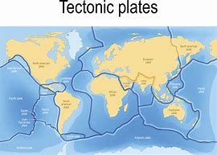

---

==== ▸ mechanize  [1201]   +
な/ˈmɛkəˌnaɪz/   +

【V-T】   If someone _mechanizes_ a process, they cause it to be done by a machine or machines, when it was previously done by people. 使机械化   +
⇒  Only gradually are technologies being developed to mechanize the task.  渐渐地科技才发展到能使这项任务机械化。   +

【N-UNCOUNT】   机械化   +
⇒  Mechanization happened years ago on the farms of Islay.  机械化数年前在艾莱的农场实现了。   +

---

==== ▸ grill  [1202]   +
な/ɡrɪl/   +
--> 来自PIE*sker, 弯，转，编织，词源同 cradle, grate, grid. 因形似编织经纬网而得名。 +

【N-COUNT】   A _grill_ is a flat frame of metal bars on which food can be cooked over a fire. (置于火上的) 烤架   +
⇒  Jerry forced scrap wood through the vents in the grill to stoke the fire.  杰里从烤架的通风孔塞一些小木片来使火更旺一些。   +

【N-COUNT】   A _grill_ is a part of a stove which produces strong direct heat to cook food that has been placed underneath it. (烤炉内的) 烤架   +
⇒  Remove from heat and finish off under the grill until cheese melts.  把它从火上拿开，放在烘烤器下面烤到奶酪熔化为止。   +

【V-T/V-I】   When you _grill_ food, or when it _grills_, you cook it on metal bars above a fire or barbecue. 烧烤   +
⇒  Grill the steaks over a wood or charcoal fire that is quite hot.  在相当热的柴火或木炭火上烤牛排。   +

【V-T/V-I】   When you _grill_ food, or when it _grills_, you cook it in a stove using very strong heat directly above it. 烘烤   +
⇒  Grill the meat for 20 minutes on each side.  把肉的两面分别烤20分钟。   +
⇒  Apart from peppers and eggplant, many other vegetables grill well.  除了甜椒和茄子，许多别的蔬菜烤起来也不错。   +
⇒  I'll grill the lobster.  我来烤龙虾。   +

【N-UNCOUNT】   烤   +
⇒  The breast can be cut into portions for grilling.  胸脯肉可以切成小块来烤。   +

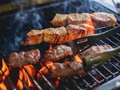

【V-T】   If you _grill_ someone _about_ something, you ask them a lot of questions for a long period of time. 盘问   +
⇒  Grill your travel agent about the facilities for families with children.  向旅行社多问问为有孩子随行的家庭提供的设施。   +

【N-COUNT】   盘问   +
⇒  He faced a hostile grilling from the committee's Republicans.  他面临来自委员会中共和党人不怀好意的盘问。   +

【N-COUNT】   A _grill_ is a restaurant that serves grilled food. 烤肉餐馆   +
⇒  ...patrons of the Savoy Grill.  …萨沃伊烤肉店的常客。   +

【N-COUNT】      +

---

==== ▸ prompt  [1203]   +
な/prɒmpt/   +

【V-T】   To _prompt_ someone _to_ do something means to make them decide to do it. 促使   +
⇒  Japan's recession has prompted consumers to cut back on buying cars.  日本的经济衰退已促使消费者们削减购车花销。   +

【V-T】   If you _prompt_ someone when they stop speaking, you encourage or help them to continue. If you _prompt_ an actor, you tell them what their next line is when they have forgotten what comes next. 提示; 给 (演员) 提示词   +
⇒  "You wouldn't have wanted to bring those people to justice anyway, would you?" Brand prompted him.  “你本不想将那些人绳之以法的，是吧？”布兰德提示他说。   +

【ADJ】   A _prompt_ action is done without any delay. 立即的 (行动)   +
⇒  It is not too late, but prompt action is needed.  还不太晚，但需要立即行动。   +

【ADJ】   If you are _prompt_ to do something, you do it without delay or you are not late. (做某事) 迅速的   +
⇒  You have been so prompt in carrying out all these commissions.  你执行所有这些任务非常迅速。   +

---

==== ▸ disadvantage  [1204]   +
な/ˌdɪsədˈvɑːntɪdʒ/   +

【N-COUNT】   A _disadvantage_ is a factor which makes someone or something less useful, acceptable, or successful than other people or things. 不利条件   +
⇒  His two main rivals suffer the disadvantage of having been long-term political exiles.  他的两名主要竞争对手由于长期被政治流放而处于不利地位。   +

【PHRASE】   If you are _at a disadvantage_, you have a problem or difficulty that many other people do not have, which makes it harder for you to be successful. 处于劣势   +
⇒  The children from poor families were at a distinct disadvantage.  贫困家庭的孩子明显处于劣势。   +

【PHRASE】   If something is _to_ your _disadvantage_ or works _to_ your _disadvantage_, it creates difficulties for you. 对 (某人) 不利   +
⇒  We need a rethink of the present law which works so greatly to the disadvantage of women.  我们需要重新思考一下现行的法律，它使妇女处于非常不利的地位。   +

---

==== ▸ pervasive  [1205]   +
な/pɜːˈveɪsɪv/   +
--> 来自pervade,渗透，弥漫。 +

【ADJ】   Something, especially something bad, that is _pervasive_ is present or felt throughout a place or thing. (尤指不好的事物) 无处不在的   +
⇒  ...the pervasive influence of the army in national life.  …军队在国民生活中无处不在的影响。   +

---

==== ▸ asthma  [1206]   +
な/ˈæsmə/   +
--> 来自希腊语，拟声词。 +

【N-UNCOUNT】  _Asthma_ is a lung condition that causes difficulty in breathing. 哮喘   +

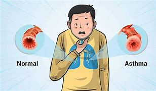
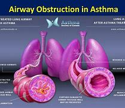

.案例
====
.支气管哮喘（bronchial asthma）
导致反复发作的喘息、气促、胸闷和（或）咳嗽等症状，强度随时间变化。*多在夜间和（或）清晨发作、加剧*，多数患者可自行缓解或经治疗缓解。 +
支气管哮喘如诊治不及时，随病程的延长可产生气道不可逆性缩窄和气道重塑。 +
个体过敏体质, 及外界环境的影响, 是发病的危险因素。 +

- **尘螨**是最常见、危害最大的室内变应原. +
- **真菌**亦是存在于室内空气中的变应原之一，特别是在阴暗、潮湿以及通风不良的地方。 +
- 常见的室外变应原：**花粉**与**草粉**是最常见的引起哮喘发作的室外变应原，其他如**动物毛屑、二氧化硫、氨气**等各种特异和非特异性吸入物。 +
====

---

==== ▸ scar  [1207]   +
な/skɑː/   +
--> 单词share（分享）和sharp（锋利的）都包含shar-，我们知道了它们的本义是“切”，将shar-进行h、c音变后，就得到了scar（疤痕），“疤痕”与“切”的关系不必多言。score（刻痕；得分）亦是同源，因而有“刻痕”之义，人们最初用刻痕计分，所以引申为“得分”。 +

【N-COUNT】   A _scar_ is a mark on the skin which is left after a wound has healed. 伤疤   +
⇒  He had a scar on his forehead.  他前额上有个伤疤。   +

【N-COUNT】   an irregular enlongated trench-like feature on a land surface that often exposes bedrock 断崖   +

【V-T】   If your skin _is scarred_, it is badly marked as a result of a wound. 在…留下伤疤   +
⇒  He was scarred for life during a fight.  他在一次打架中留下了一辈子的疤痕。   +

【V-I】   to heal leaving a scar 结疤   +

【V-T】   If a surface _is scarred_, it is damaged and there are ugly marks on it. 留下损伤痕迹   +
⇒  The arena was scarred by deep muddy ruts.  竞技场上留下了深深的车辙泥痕。   +

【N-COUNT】   If an unpleasant physical or emotional experience leaves a _scar_ on someone, it has a permanent effect on their mind. (肉体或情感上的) 创伤   +
⇒  The early years of fear and the hostility left a deep scar on the young boy.  早年的恐惧和这种敌意在这个小男孩的心灵上留下了深深的创伤。   +

【V-T】   If an unpleasant physical or emotional experience _scars_ you, it has a permanent effect on your mind. 给…留下精神创伤   +
⇒  This is something that's going to scar him forever.  这将会是永远给他留下心灵创伤的事情。   +

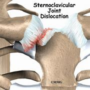

---

==== ▸ substantial  [1208]   +
な/səbˈstænʃəl/   +

【ADJ】  _Substantial_ means large in amount or degree. 大量的; 很大程度的   +
⇒  A substantial number of mothers with young children are deterred from undertaking paid work because they lack access to childcare.  很多有小孩的母亲找不到人照顾小孩，从而无法从事有薪工作。   +

---

==== ▸ figure  [1209]   +
な/ˈfɪɡə/   +

【N-COUNT】   A _figure_ is a particular amount expressed as a number, especially a statistic. 数字   +
⇒  It would be very nice if we had a true figure of how many people in this country haven't got a job.  要是我们有一个确切的数字反映这个国家到底有多少人没有工作就好了。   +
⇒  It will not be long before the inflation figure starts to fall.  过不了多久，通货膨胀的数字就会开始下降。   +

【N-COUNT】   A _figure_ is any of the ten written symbols from 0 to 9 that are used to represent a number. 个位数字   +
⇒  ...the glowing red figures on the radio alarm clock which read 4:22 a.m.  …收音机闹钟上闪闪发光的红色数字显示凌晨4点22分。   +

【N-COUNT】   You refer to someone that you can see as a _figure_ when you cannot see them clearly or when you are describing them. 身影   +
⇒  Ernie saw the dim figure of Rose in the chair.  厄尼看到了罗斯坐在椅子里的模糊身影。   +

【N-COUNT】   In art, a _figure_ is a person in a drawing or a painting, or a statue of a person. 人像   +
⇒  ...a life-size bronze figure of a brooding, hooded woman.  …一个真人大小、戴着头巾、正在沉思的女铜像。   +

【N-COUNT】   Your _figure_ is the shape of your body. 身材   +
⇒  Take pride in your health and your figure.  为你的健康和身材感到骄傲。   +

【N-COUNT】   Someone who is referred to as a _figure_ of a particular kind is a person who is well-known and important in some way. 重要人物   +
⇒  The movement is supported by key figures in the three main political parties.  这场运动由3个主要政党的重要人物支持。   +

【N-COUNT】   If you say that someone is, for example, a mother _figure_ or a hero _figure_, you mean that other people regard them as the type of person stated or suggested. 代表   +
⇒  Daniel Boone, the great hero figure of the frontier.  丹尼尔·布恩是伟大的前线英雄的代表。   +

【N-COUNT】   In books and magazines, the diagrams which help to show or explain information are referred to as _figures_. 图表   +
⇒  If you look at a world map (see Figure 1) you can identify the major wine-producing regions.  如果你看看世界地图（见图1），你就能辨认出主要的葡萄酒生产地区。   +

【N-COUNT】   In geometry, a _figure_ is a shape, especially a regular shape. 几何图形   +
⇒  Draw a pentagon, a regular five-sided figure.  画一个五边形，一个规则的五边图形。   +

【N-PLURAL】   An amount or number that is in single _figures_ is between zero and nine. An amount or number that is in double _figures_ is between ten and ninety-nine. You can also say, for example, that an amount or number is in three _figures_ when it is between one hundred and nine hundred and ninety-nine. 数字   +
⇒  Inflation, which has usually been in single figures, is running at more than 12%.  通货膨胀率通常都是一位数字，正飙升至12%以上。   +

【V-T】   If you _figure_ that something is the case, you think or guess that it is the case. 想   +
⇒  She figured that both she and Ned had learned a lot from the experience.  她想她和内德都从这次经历中学到了很多。   +

【V-I】   If you say "_That figures_" or "_It figures_," you mean that the fact referred to is not surprising. 意料之中   +
⇒  When I finished, he said, "Yeah. That figures."  我做完时，他说：“嗯，正如所料。”   +

【V-I】   If a person or thing _figures in_ something, they appear in or are included in it. 出现   +
⇒  Human rights violations figured prominently in the report.  侵犯人权出现在报告中的显要位置。   +

---

==== ▸ combine  [1210]   +
な/kəmˈbaɪn/   +

【V-RECIP】   If you _combine_ two or more things or if they _combine_, they exist together. 使…结合; 结合   +
⇒  The Church has something to say on how to combine freedom with responsibility.  教会要讲一讲如何使自由和责任相结合。   +
⇒  Relief workers say it's worse than ever as disease and starvation combine to kill thousands.  援助人员说情况比以往任何时候都糟，因为疾病和饥饿致使数以千计的人死亡。   +

【V-RECIP】   If you _combine_ two or more things or if they _combine_, they join together to make a single thing. 使…合为一体; 合为一体   +
⇒  David Jacobs was given the job of combining the data from these 19 studies into one giant study.  大卫·雅各布斯分到的工作是把这19项研究中的数据合为一项大型研究。   +
⇒  Combine the flour with 3 tablespoons water to make a paste.  把面粉和3大汤匙的水混合起来做成一个面团。   +

【V-RECIP】   If two or more groups or organizations _combine_ or if someone _combines_ them, they join to form a single group or organization. 使…合并; 合并   +
⇒  ...an announcement by Steetley and Tarmac of a joint venture that would combine their brick, tile, and concrete operations.  …一份由斯蒂特利和塔玛克公司发布的将要组建一个将他们的砖、瓦和混凝土生产业务合并起来的合资企业的通知。   +

【V-T】   If someone or something _combines_ two qualities or features, they have both those qualities or features at the same time. 同时具有   +
⇒  Their system seems to combine the two ideals of strong government and proportional representation.  他们的体制似乎同时具有强有力的政府与比例代表制这两种理想状况。   +
⇒  ...a clever, far-sighted lawyer who combines legal expertise with social concern.  …一位同时具有法律专业知识和社会责任感的聪明而有远见的律师。   +

【V-T】   If someone _combines_ two activities, they do them both at the same time. 同时做   +
⇒  It is possible to combine a career with being a mother.  同时既干事业又做母亲是可能的。   +

---

==== ▸ scorch  [1211]   +
な/skɔːtʃ/   +
--> 可能来自古诺斯语 skorpna,使枯萎，使枯干，来自 Proto-Germanic*skrimp,收缩，来自 PIE*sker, 弯，转，词源同 shrink,shrimp.后引申词义烧焦。 +

【V-T】   To _scorch_ something means to burn it slightly. 烧焦   +
⇒  The bomb scorched the side of the building.  炸弹烧焦了建筑物的侧面。   +

【ADJ】   烧焦的   +
⇒  ...scorched black earth.  …烧焦的黑土。   +

【V-T/V-I】   If something _scorches_ or _is scorched_, it becomes marked or changes colour because it is affected by too much heat or by a chemical. 使枯萎; 变枯萎   +
⇒  The leaves are inclined to scorch in hot sunshine.  树叶在炙热的阳光下易变枯黄。   +

---

==== ▸ barbecue  [1212]   +
な/ˈbɑːbɪˌkjuː/   +

【N-COUNT】   A _barbecue_ is a piece of equipment which you use for cooking on in the open air. (户外使用的) 烤架   +

【N-COUNT】   If someone has a _barbecue_, they cook food on a barbecue in the open air. 烧烤   +
⇒  On New Year's Eve we had a barbecue on the beach.  除夕那天我们在海滩上举行了烧烤野餐。   +

【V-T】   If you _barbecue_ food, especially meat, you cook it on a barbecue. (用烤架) 烧烤   +
⇒  Tuna can be grilled, fried or barbecued.  金枪鱼可以烤、煎或烧烤着吃。   +
⇒  Here's a way of barbecuing corn-on-the-cob that I learned from my uncle.  这是我向我叔叔学的一种烤玉米棒的方法。   +

---

==== ▸ vague  [1213]   +
な/veɪɡ/   +

【ADJ】   If something written or spoken is _vague_, it does not explain or express things clearly. 含糊的   +
⇒  A lot of the talk was apparently vague and general.  这次会谈的许多内容显然是含糊而笼统的。   +
⇒  The description was pretty vague.  这项描述是相当含糊的。   +

【ADV】   含糊地   +
⇒  "I'm not sure," Liz said vaguely.  “我不能肯定，” 莉兹含糊地说。   +

【ADJ】   If you have a _vague_ memory or idea of something, the memory or idea is not clear. 模糊的   +
⇒  They have only a vague idea of the amount of water available.  他们对于可用水量只有一点模糊的了解。   +

【ADV】   模糊地   +
⇒  Judith could vaguely remember her mother lying on the sofa.  朱迪斯能够模糊地记得她母亲当时正躺在沙发上。   +

【ADJ】   If you are _vague_ about something, you deliberately do not tell people much about it. 含糊其辞的   +
⇒  He was vague, however, about just what U.S. forces might actually do.  然而，他对于美国军队真正可能做什么却含糊其辞。   +

【ADJ】   If something such as a feeling is _vague_, you experience it only slightly. (感觉等) 轻微的   +
⇒  He was conscious of that vague feeling of irritation again.  他又一次感到微微有些恼火。   +

【ADJ】   A _vague_ shape or outline is not clear and is therefore not easy to see. 模糊不清的   +
⇒  The bus was a vague shape in the distance.  远处的那辆公共汽车只是一个模糊不清的轮廓。   +

---

==== ▸ careless  [1214]   +
な/ˈkɛəlɪs/   +

【ADJ】   If you are _careless_, you do not pay enough attention to what you are doing, and so you make mistakes, or cause harm or damage. 粗心的   +
⇒  I'm sorry. How careless of me.  对不起，我太粗心了。   +
⇒  Some parents are accused of being careless with their children's health.  有些父母被指责对孩子的健康掉以轻心。   +

【ADV】   粗心地   +
⇒  She was fined $200 for driving carelessly.  她由于粗心驾驶被罚$200。   +

【ADJ】   If you say that someone is _careless of_ something such as their health or appearance, you mean that they do not seem to be concerned about it, or do nothing to keep it in a good condition. 不在意的   +
⇒  He had shown himself careless of personal safety where the life of his colleagues might be at risk.  他在同事们有生命危险时表现出不顾个人安危之举。   +

---

==== ▸ underscore  [1215]   +
な/ˌʌndəˈskɔː/   +

【V-T】   If something such as an action or an event _underscores_ another, it draws attention to the other thing and emphasizes its importance. 突出显示; 强调   +
⇒  The Labour Department figures underscore the shaky state of the economic recovery.  劳工部的数字突出显示了经济复苏的不稳定。   +

【V-T】   If you _underscore_ something such as a word or a sentence, you draw a line underneath it in order to make people notice it or give it extra importance. 在…下面划线   +
⇒  He heavily underscored his note to Shelley.  他在写给谢利的短笺下重重地划了线。   +

---

==== ▸ vocation  [1216]   +
な/vəʊˈkeɪʃən/   +
-->  -voc-声音,叫喊 + -ation名词词尾 → 神召唤去做的事情 +

【N-VAR】   If you have a _vocation_, you have a strong feeling that you are especially suited to do a particular job or to fulfill a particular role in life, especially one that involves helping other people. 使命感   +
⇒  It could well be that he has a real vocation.  他很可能有种真正的使命感。   +

【N-VAR】   If you refer to your job or profession as your _vocation_, you feel that you are particularly suited to it. 适合的职业   +
⇒  Her vocation is her work as an actress.  她适合的职业就是当演员。   +

---

==== ▸ minor  [1217]   +
な/ˈmaɪnə/   +

【ADJ】   You use _minor_ when you want to describe something that is less important, serious, or significant than other things in a group or situation. 次要的   +
⇒  She is known in Italy for a number of minor roles in films.  她因担任电影中一些配角而闻名意大利。   +

【ADJ】   A _minor_ illness or operation is not likely to be dangerous to someone's life or health. 不严重的   +
⇒  Sarah had been plagued continually by a series of minor illnesses since her mid teens.  自从十四五岁起萨拉就一直小病不断。   +

【N-COUNT】   A _minor_ is a person who is still legally a child. In most states in the United States, people are minors until they reach the age of eighteen. 未成年者   +
⇒  The approach has virtually ended cigarette sales to minors.  这一作法实际上已经终止了向未成年人出售香烟。   +

【ADJ】   A _minor_ scale is one in which the third note is three semitones higher than the first. 小调的   +
⇒  ...the unfinished sonata movement in F minor.  …未完成的F小调奏鸣曲乐章。   +

---

==== ▸ pump  [1218]   +
な/pʌmp/   +

【N-COUNT】   A _pump_ is a machine or device that is used to force a liquid or gas to flow in a particular direction. 泵   +
⇒  ...pumps that circulate the fuel around in the engine.  …使燃料在发动机内循环的压泵。   +
⇒  There was no water in the building, just a pump in the courtyard.  楼里没水，只在院子里有个水泵。   +

【V-T】   To _pump_ a liquid or gas in a particular direction means to force it to flow in that direction using a pump. 抽送   +
⇒  It's not enough to get rid of raw sewage by pumping it out to sea.  仅用水泵将未经处理的污水排入海中是不够的。   +
⇒  The money raised will be used to dig bore holes to pump water into the dried-up lake.  筹到的钱款将用来挖井眼，再将水抽入干涸的湖中。   +

【N-COUNT】   A fuel or petrol _pump_ is a machine with a tube attached to it that you use to fill a car with petrol. 加油泵   +
⇒  The average price for all grades of petrol at the pump was $3.49 a gallon.  加油泵所有等级的汽油平均价格为1加仑3.49美元。   +

【V-T】   If someone _has_ their stomach _pumped_, doctors remove the contents of their stomach, for example, because they have swallowed poison or drugs. 洗胃   +
⇒  One woman was rushed to the emergency room to have her stomach pumped.  一名妇女被紧急送进急诊室去洗胃。   +

【N-COUNT】  _Pumps_ are the same as. 同court shoes   +

【N】   a low-cut low-heeled shoe without fastenings, worn esp for dancing 舞鞋   +

---

==== ▸ voracious  [1219]   +
な/vɒˈreɪʃəs/   +
--> 来自拉丁语 vorax,贪吃，词源同 devour,herbivore. +

【ADJ】   If you describe a person, or their appetite for something, as _voracious_, you mean that they want a lot of something. 贪婪的; 如饥似渴的   +
⇒  Joseph Smith was a voracious book collector.  约瑟夫·史密斯是一个如饥似渴的藏书家。   +
⇒  All otters have a voracious appetite.  所有的水獭都有一个贪吃的胃口。   +

---

==== ▸ boundary  [1220]   +
な/ˈbaʊndərɪ/   +

【N-COUNT】   The _boundary of_ an area of land is an imaginary line that separates it from other areas. 边界   +
⇒  The Bow Brook forms the western boundary of the wood.  鲍溪成了树林的西边界。   +

【N-COUNT】   The _boundaries of_ something such as a subject or activity are the limits that people think that it has. 界限   +
⇒  The boundaries between history and storytelling are always being blurred and muddled.  历史与故事的界限一直模糊不清。   +

---

==== ▸ exception  [1221]   +
な/ɪkˈsɛpʃən/   +

【N-COUNT】   An _exception_ is a particular thing, person, or situation that is not included in a general statement, judgment, or rule. 例外   +
⇒  Few guitarists can sing as well as they can play; Eddie, however, is an exception.  很少有吉他手唱歌能唱得跟弹得一样好，而艾迪是个例外。   +
⇒  The law makes no exceptions.  法律不搞例外。   +

【PHRASE】   If you make a general statement, and then say that something or someone is _no exception_, you are emphasizing that they are included in that statement. 不例外; 无例外   +
⇒  Marketing is applied to everything these days, and books are no exception.  现在市场营销用于任何事物，图书也不例外。   +

【PHRASE】   If you _take exception to_ something, you feel offended or annoyed by it, usually with the result that you complain about it. 厌恶; 反感   +
⇒  He also took exception to having been spied on.  他也厌恶被暗中监视。   +

【PHRASE】   You use _with the exception of_ to introduce a thing or person that is not included in a general statement that you are making. 除外   +
⇒  Yesterday was a day off for everybody, with the exception of Lorenzo.  昨天每个人休一天假，洛伦佐除外。   +

【PHRASE】   You use _without exception_ to emphasize that the statement you are making is true in all cases. 无例外地   +
⇒  The vehicles are without exception old, rusty and dented.  这些车辆无一例外地破旧、锈迹斑斑且有撞痕。   +

---

==== ▸ resin  [1222]   +
な/ˈrɛzɪn/   +
--> 来自拉丁语 resina,树脂。 +

【N-MASS】  _Resin_ is a sticky substance that is produced by some trees. 树脂   +
⇒  ...a tropical tree that is bled regularly for its resin.  …定期被采割树脂的一棵热带树。   +

【N-MASS】  _Resin_ is a substance that is produced chemically and used to make plastics. 合成树脂   +
⇒  The plastic resin is used in a wide range of products, including electrical wire insulation.  塑料合成树脂被广泛应用到各种产品中，包括电线的绝缘层。   +

---

==== ▸ identity  [1223]   +
な/aɪˈdɛntɪtɪ/   +

【N-COUNT】   Your _identity_ is who you are. 身份   +
⇒  Abu is not his real name, but it's one he uses to disguise his identity.  阿布不是他的真名，而是一个他用来掩盖自己身份的假名。   +

【N-VAR】   The _identity_ of a person or place is the characteristics that distinguish them from others. 特性   +
⇒  I wanted a sense of my own identity.  我需要确立自身的个性意识。   +

---

==== ▸ domestic  [1224]   +
な/dəˈmɛstɪk/   +

【ADJ】  _Domestic_ political activities, events, and situations happen or exist within one particular country. 国内的   +
⇒  ...over 100 domestic flights a day to 30 leading U.S. destinations.  …每天飞往美国30个主要目的地的100多个国内航班。   +

【ADJ】  _Domestic_ duties and activities are concerned with the running of a home and family. 家务的   +
⇒  ...a plan for sharing domestic chores.  …一份分担家务的计划。   +

【ADJ】  _Domestic_ items and services are intended to be used in people's homes rather than in factories or offices. 家用的   +
⇒  ...domestic appliances.  …家用电器。   +

【ADJ】   A _domestic_ situation or atmosphere is one which involves a family and their home. 家庭的   +
⇒  It was a scene of such domestic bliss.  这是一幕家庭美满的场景。   +

【ADJ】   A _domestic_ animal is one that is not wild and is kept either on a farm to produce food or in someone's home as a pet. 家养的; 饲养的   +
⇒  ...a domestic cat.  …一只家猫。   +

---

==== ▸ eternal  [1225]   +
な/ɪˈtɜːnəl/   +

【ADJ】   Something that is _eternal_ lasts forever. 永恒的   +
⇒  ...the quest for eternal youth.  …对永远年轻的追求。   +

【ADV】   永恒地   +
⇒  She is eternally grateful to her family for their support.  她因家人的支持对他们永存感激之心。   +

【ADJ】   If you describe something as _eternal_, you mean that it seems to last forever, often because you think it is boring or annoying. 无休止的   +
⇒  In the background was that eternal hum.  背景里是那没完没了的哼哼声。   +

---

==== ▸ hinterland  [1226]   +
な/ˈhɪntəˌlænd/   +
-->  来自德语Hinterland,内陆，来自hinter,后面的，词源同hinder,land,土地。+

【N-COUNT】  _Hinterlands_ are remote areas of land far away from cities or towns. 偏远地区   +
⇒  There's lots of cheap land in the hinterlands.  偏远地区有很多廉价土地。   +

【N-COUNT】   The _hinterland_ of a stretch of coast or a large river is the area of land behind it or around it. 内地; 腹地   +

---

==== ▸ congressional  [1227]   +
な/kənˈɡrɛʃənəl/   +

【ADJ】   A _congressional_ policy, action, or person relates to the U.S. Congress. 美国国会的   +
⇒  The president explained his plans to congressional leaders.  总统向国会领导人说明了他的计划。   +

---

==== ▸ paucity  [1228]   +
な/ˈpɔːsɪtɪ/   +
--> 来自拉丁语paucus,少的，小的，来自PIE*pau-ko,来自*pau,少的，小的，词源同few,poor.引申词义贫穷，贫乏。+

【N-SING】   If you say that there is a _paucity of_ something, you mean that there is not enough of it. 短缺   +
⇒  Even the film's impressive finale can't hide the first hour's paucity of imagination.  这部电影在开头一个小时中毫无想象力，即使有个让人印象深刻的结局也无法掩盖这个缺憾。   +
⇒  ...the paucity of good women sprinters.  ...优秀女子短跑选手的匮乏。   +

---

==== ▸ chain  [1229]   +
な/tʃeɪn/   +

【N-COUNT】   A _chain_ consists of metal rings connected together in a line. 链子   +
⇒  His open shirt revealed a fat gold chain.  他敞开的衬衣里露出一条粗大的金链子。   +

【N-COUNT】   A _chain of_ things is a group of them existing or arranged in a line. 一连串   +
⇒  ...a chain of islands known as the Windward Islands.  …被称为“向风群岛”的列岛。   +

【N-COUNT】   A _chain of_ stores, hotels, or other businesses is a number of them owned by the same person or company. 连锁   +
⇒  ...a large supermarket chain.  …一家大型连锁超市。   +

【N-PLURAL】   If prisoners are _in chains_, they have thick rings of metal around their wrists or ankles to prevent them from escaping. 镣铐   +
⇒  He'd spent four and a half years in windowless cells, much of the time in chains.  他在无窗的牢房里呆了4年半，大部分时间是手铐脚镣。   +

【V-T】   If a person or thing _is chained to_ something, they are fastened to it with a chain. 用链条拴住   +
⇒  The dogs were chained to a fence.  狗被拴在栅栏上。   +
⇒  We were sitting together in our cell, chained to the wall.  我们一起坐在牢房里，铐在墙上。   +

【PHRASAL VERB】  _Chain up_ means the same as . 用链条拴住   +
⇒  They kept me chained up every night and released me each day.  他们每天晚上把我铐起来，白天再把我解开。   +

【N-SING】   A _chain of_ events is a series of them happening one after another. 一连串   +
⇒  ...the bizarre chain of events that led to his departure in January 1938.  …导致他1938年1月离去的一连串怪异事件。   +

【N-SING】   (of reasoning) a sequence of arguments each of which takes the conclusion of the preceding as a premise (推理中的)连锁诡辩   +

---

==== ▸ sparse  [1230]   +
な/spɑːs/   +
-->  来自拉丁语 sparse,散开的，播洒的，来自 spargere,散开，播种，来自 PIE*sperg,播，洒，溅， 来自 PIE*sper,播，洒，词源同 sprinkle,spread,intersperse.引申词义稀少的，稀疏的等。 +

【ADJ】   Something that is _sparse_ is small in number or amount and spread out over an area. 稀疏的   +
⇒  Many slopes are rock fields with sparse vegetation.  许多山坡都是植被稀疏的岩石地。   +
⇒  He was a tubby little man in his fifties, with sparse hair.  他是个50来岁的矮胖男人，头发稀疏。   +

【ADV】   稀疏地   +
⇒  ...the sparsely populated interior region, where there are few roads.  …人口稀少、几乎没有公路的内陆地区。   +

---

==== ▸ elevate  [1231]   +
な/ˈɛlɪˌveɪt/   +
--> e-, 向外。-lev, 举起，轻，词源同light , lever. +

【V-T】   When someone or something achieves a more important rank or status, you can say that they _are elevated to_ it. 提拔   +
⇒  He was elevated to the post of president.  他被提拔到总裁的职位。   +

【N-UNCOUNT】   提拔   +
⇒  The elevation of the assistant coach to the head coaching position within only 9 months was a surprise.  这位助理教练仅仅在9个月内就被提拔到总教练的位置是件令人惊讶的事。   +

【V-T】   If you _elevate_ something _to_ a higher status, you consider it to be better or more important than it really is. 抬高 (地位)   +
⇒  Don't elevate your superiors to superstar status.  不要把你的上级抬高到超级明星的地位。   +

【V-T】   To _elevate_ something means to increase it in amount or intensity. 提高   +
⇒  Emotional stress can elevate blood pressure.  情绪紧张会使血压升高。   +

【V-T】   If you _elevate_ something, you raise it higher. 举起; 抬高   +
⇒  A few times a day, elevate feet above heart level.  一天几次把脚抬到高过心脏的位置。   +
⇒  I built a platform to elevate the bed.  我搭了一个台子把床抬高了。   +

---

==== ▸ exodus  [1232]   +
な/ˈɛksədəs/   +
--> 前缀ex表“向外”；词根od表“路”，这个词根有两个形式，od和hod，od的出现频率似乎更大。method（方法）是同根词，前缀met表“在后方”，hod表“路，way”，字面义为“紧随其后的路径”。“方法”是达到目标的“路径”，相似逻辑如way（路；方法）。 +

【N-SING】   If there is an _exodus of_ people _from_ a place, a lot of people leave that place at the same time. 大批离开   +
⇒  The medical system is facing collapse because of an exodus of doctors.  由于医生大批离去，该医疗体系正面临崩溃。   +

---

==== ▸ jeopardize  [1233]   +
な/ˈdʒɛpəˌdaɪz/   +
--> 来自古法语jeu parti,一种机会平等的赌博游戏，来自jeu,赌博，玩乐，词源同joke,parti,分开，均等，词源同par,part.引申词义危险，风险，危害。比较dicey,hazard. +

【V-T】   To _jeopardize_ a situation or activity means to do something that may destroy it or cause it to fail. 损害; 危及   +
⇒  He has jeopardized his future career.  他损害了他的前程。   +

---

==== ▸ centennial  [1234]   +
な/sɛnˈtɛnɪəl/   +

【N-SING】   The _centennial of_ an event such as someone's birth is the 100th anniversary of that event. 一百周年纪念   +
⇒  The centennial Olympics was in Atlanta, Georgia.  奥运会百年庆典在乔治亚州的亚特兰大举行。   +

---

==== ▸ screen  [1235]   +
な/skriːn/   +

【N-COUNT】   A _screen_ is a flat vertical surface on which pictures or words are shown. Television sets and computers have screens, and movies are shown on a screen in movie theatres. (电视、电脑、影院等的) 屏幕   +

【N-SING】   You can refer to movies or television as _the screen_. 影视   +
⇒  Many viewers have strong opinions about violence on the screen.  许多观众对影视暴力有强烈意见。   +

【V-T】   When a movie or a television programme _is screened_, it is shown in the movie theatre or broadcast on television. 上映 (影片); 播放 (电视节目)   +
⇒  The series is likely to be screened in January.  这部系列剧可能在1月份播放。   +

【N-COUNT】   放映; 播放   +
⇒  The film-makers will be present at the screenings to introduce their works.  电影制作人将在放映时到场介绍他们的作品。   +

【N-COUNT】   A _screen_ is a vertical panel which can be moved around. It is used to keep cold air away from part of a room, or to create a smaller area within a room. 屏风   +
⇒  They put a screen in front of me so I couldn't see what was going on.  他们在我面前放置了一扇屏风，因此我看不见在发生什么。   +

【V-T】   If something _is screened by_ another thing, it is behind it and hidden by it. 屏蔽; 遮挡   +
⇒  Most of the road behind the hotel was screened by an apartment block.  旅馆后面那条路的大部分都被一排公寓楼挡住了。   +

【V-I】   To _screen for_ a disease means to examine people to make sure that they do not have it. (为确定是否患有某病而) 做检查   +
⇒  ...a quick saliva test that would screen for people at risk of tooth decay.  …一项能查出有患牙蚀风险的人群的快速唾液化验。   +

【N-VAR】   检查   +
⇒  Our country has an enviable record on breast screening for cancer.  我们国家在乳腺癌检查方面有着令人羡慕的纪录。   +

【V-T】   When an organization _screens_ people who apply to join it, it investigates them to make sure that they are not likely to cause problems. 审查 (申请加入者)   +
⇒  They will screen all their candidates.  他们将审查他们所有的求职者。   +

【V-T】   To _screen_ people or luggage means to check them using special equipment to make sure they are not carrying a weapon or a bomb. (为确保没有携带武器等而) 检查 (人、行李)   +
⇒  The airline had not been searching unaccompanied baggage by hand, but only screening it on X-ray machines.  这家航空公司一直没有手工检查非随身行李，只是在X光机上检查。   +

---

==== ▸ monument  [1236]   +
な/ˈmɒnjʊmənt/   +
--> 来自拉丁语monere,警告，提醒，记忆，词源同admonish,monitor,mind.-ment,名词后缀。引申词义纪念碑。 +

【N-COUNT】   A _monument_ is a large structure, usually made of stone, which is built to remind people of an event in history or of a famous person. 纪念碑   +
⇒  ...a newly restored monument commemorating a 119-year-old tragedy.  …为纪念一起有着119年历史的惨剧而新修复的一座纪念碑。   +

【N-COUNT】   A _monument_ is something such as a castle or bridge that was built a very long time ago and is regarded as an important part of a country's history. 历史遗迹   +
⇒  ...the ancient monuments of Mexico and Peru.  …墨西哥和秘鲁的历史古迹。   +

【N-COUNT】   If you describe something as a _monument to_ someone's qualities, you mean that it is a very good example of the results or effects of those qualities. 典范   +
⇒  By his international achievements he leaves a fitting monument to his beliefs.  他在国际上的成就恰好成为他信仰的一个例证。   +

---

==== ▸ vogue  [1237]   +
な/vəʊɡ/   +
--> 来自古法语 vogue,水波，摇摆，划船，来自 PIE*wegh,移动，运送，词源同 way,vehicle,wag. 后用于指时尚，可能是来自比喻义引领时尚之波。 +

【N-SING】   If there is a _vogue for_ something, it is very popular and fashionable. 时尚   +
⇒  Despite the vogue for so-called health teas, there is no evidence that they are any healthier.  尽管所谓的保健茶成了时尚，但并没有证据表明这种茶更有益于健康。   +

【PHRASE】   If something is _in vogue_, it is very popular and fashionable. If it comes _into vogue_, it becomes very popular and fashionable. 正在流行; 变得流行   +
⇒  Pale colours are much more in vogue than autumnal bronzes and coppers.  浅色比秋季的古铜色和紫铜色更为流行。   +

---

==== ▸ terminal  [1238]   +
な/ˈtɜːmɪnəl/   +

【ADJ】   A _terminal_ illness or disease causes death, often slowly, and cannot be cured. (疾病) 晚期的; 致命的   +
⇒  ...terminal cancer.  …晚期癌症。   +

【ADV】   致命地   +
⇒  The patient is terminally ill.  这个病人病入膏肓。   +

【N-COUNT】   A _terminal_ is a place where vehicles, passengers, or goods begin or end a journey. 起点站; 终点站   +
⇒  Plans are underway for a new terminal at Dulles airport.  正计划在杜勒斯机场修建新的航站大楼。   +

【N-COUNT】   A computer _terminal_ is a piece of equipment consisting of a keyboard and a screen that is used for putting information into a computer or getting information from it. (计算机) 终端   +
⇒  Carl sits at a computer terminal 40 hours a week.  卡尔每周要在电脑前坐40小时。   +

【N-COUNT】   On a piece of electrical equipment, a _terminal_ is one of the points where electricity enters or leaves it. (电路的) 端头   +
⇒  ...the positive terminal of the battery.  …电池的正极。   +

---

==== ▸ fresco  [1239]   +
な/ˈfrɛskəʊ/   +
--> 来自意大利语，词源同fresh, 新的。指新石膏或湿石膏上做画的壁画艺术。 +

【N-COUNT】   A _fresco_ is a picture that is painted on a plastered wall when the plaster is still wet. 湿壁画   +

---

==== ▸ colonization  [1240]   +

(n.) 殖民；殖民地化

---

==== ▸ catalog = catalogue [1241]   +

(n.)  +
1.a complete list of items, for example of things that people can look at or buy 目录；目录簿  +
=> a mail-order catalogue (= a book showing goods for sale to be sent to people's homes) 邮购商品目录  +
=> to consult the library catalogue 查看图书馆目录  +
=> An illustrated catalogue accompanies the exhibition. 展览会有插图目录。  +

2.a long series of things that happen (usually bad things) 一连串（糟糕）事  +
=> a catalogue of disasters/errors/misfortunes 接二连三的灾难╱错误╱不幸  +

(v.)  +
1.to arrange a list of things in order in a catalogue ; to record sth in a catalogue 列入目录；编入目录  +
2.to give a list of things connected with a particular person, event, etc. 记载，登记（某人、某事等的详情）  +
=> Interviews with the refugees catalogue a history of discrimination and violence. 对难民的采访记录下了一部歧视和暴力的历史。  +

==== ▸ flank  [1242]   +
な/flæŋk/   +
--> 来自PIE*kleng, 弯，转，词源同link. 进一步来自PIE*klei的鼻音形式，倾斜，词源同lean, incline. +

【N-COUNT】   An animal's _flank_ is its side, between the ribs and the hip. (动物肋骨和臀部间的) 胁腹   +
⇒  He put his hand on the dog's flank.  他把手放在狗的胁腹上。   +

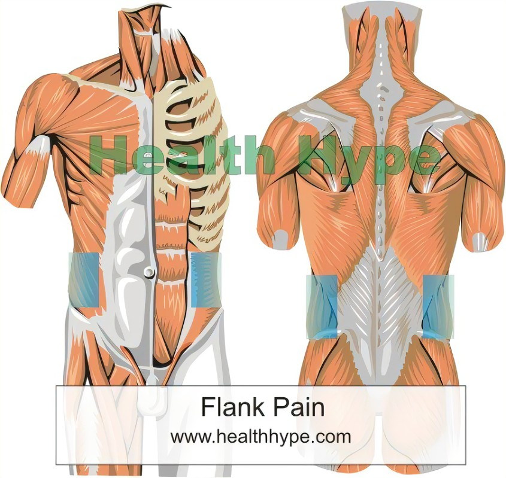

【N-COUNT】   A _flank_ of an army or navy force is one side of it when it is organized for battle. (军队的) 侧翼   +
⇒  The assault element, led by Captain Ramirez, opened up from their right flank.  拉米雷斯上尉率领的突击队从他们的右翼开火。   +

【N-COUNT】   The side of anything large can be referred to as its _flank_. (大型物体的) 侧面   +
⇒  They continued along the flank of the mountain.  他们沿着山的侧面继续前进。   +

【V-T】   If something _is flanked by_ things, it has them on both sides of it, or sometimes on one side of it. 两侧有   +
⇒  The altar was flanked by two Christmas trees.  圣坛的两侧有两棵圣诞树。   +

---

==== ▸ instead  [1243]   +
な/ɪnˈstɛd/   +

【PHRASE】   If you do one thing _instead of_ another, you do the first thing and not the second thing, as the result of a choice or a change of behaviour. 而不是…   +
⇒  They raised prices and cut production, instead of cutting costs.  他们提高了价格，减少了产量，而没有削减成本。   +

【ADV】   If you do not do something, but do something else _instead_, you do the second thing and not the first thing, as the result of a choice or a change of behaviour. 而   +
⇒  My husband asked why I couldn't just forget about dieting and eat normally instead.  丈夫问我为什么就不能忘掉节食而正常吃饭。   +

---

==== ▸ hieratic  [1244]   +
な/ˌhaɪəˈrætɪk/   +
--> 来自希腊语hiereus,祭司，僧侣，来自hieros,神圣的，神灵的，来自PIE*eis,强烈的感情，发狂，着迷，词源同ire,estrus+

【ADJ】   of or relating to priests 神职人员的; 僧侣的   +

【N】   the hieratic script of ancient Egypt 古埃及僧侣体文字   +

---

==== ▸ complex  [1245]   +
な【ADJ】   Something that is _complex_ has many different parts, and is therefore often difficult to understand. 复杂的   +
⇒  ...in-depth coverage of today's complex issues.  …对当今复杂问题的深入报道。   +
⇒  ...a complex system of voting.  …一套复杂的选举体制。   +

【N-COUNT】   A _complex_ is a group of buildings designed for a particular purpose, or one large building divided into several smaller areas. 建筑群   +
⇒  ...a low-cost apartment complex.  …一个低价公寓楼群。   +

---

==== ▸ invertebrate  [1246]   +
な/ɪnˈvɜːtɪbrɪt/   +
--> in-,不，非，vertebrate,脊椎动物。来自拉丁语 vertebra,关节，脊椎，来自 PIE*wer,转，弯，词源 convert,toward,-bra,工具格后 缀。引申词义连接关节的脊椎。 +

【N-COUNT】   An _invertebrate_ is a creature that does not have a spine such as an insect, a worm, or an octopus. 无脊椎动物   +

【ADJ】  _Invertebrate_ is also an adjective. 无脊椎的   +
⇒  ...invertebrate creatures.  ...无脊椎动物。   +

---

==== ▸ count  [1247]   +
な/kaʊnt/   +

【V-I】   When you _count_, you say all the numbers one after another up to a particular number. 数数   +
⇒  He was counting slowly under his breath.  他在低声慢慢地数数。   +

【V-T】   If you _count_ all the things in a group, you add them up in order to find how many there are. 数…的数目   +
⇒  I counted the money. It was more than five hundred dollars.  我数了数钱，有五百多美元。   +
⇒  I counted 34 wild goats grazing.  我数了有34只野山羊在吃草。   +

【PHRASAL VERB】  _Count up_ means the same as . 数…的数目   +
⇒  Couldn't we just count up our ballots and bring them to the courthouse?  我们不能就数好我们的选票然后把它们送到法院吗？   +

【V-I】   If something or someone _counts for_ something or _counts_, they are important or valuable. 有价值; 有重要意义   +
⇒  Surely it doesn't matter where charities get their money from: what counts is what they do with it.  当然，慈善组织从哪里得到钱并不重要，重要的是他们用这些钱做什么。   +

【V-T/V-I】   If something _counts_ or _is counted as_ a particular thing, it is regarded as being that thing, especially in particular circumstances or under particular rules. 看作   +
⇒  No one agrees on what counts as a desert.  没有人对于什么可以看作是荒漠有共识。   +

【V-T】   If you _count_ something when you are making a calculation, you include it in that calculation. 把…计算在内   +
⇒  It's under 7 percent only because statistics don't count the people who aren't qualified to be in the work force.  数字不到7%，这只是因为统计没有把未达劳动力标准的人算在内。   +

【N-COUNT】   A _count_ is the action of counting a particular set of things, or the number that you get when you have counted them. 点数; 点出的数目   +
⇒  The final count in last month's referendum showed 56.7 per cent in favour.  上个月全民投票的最后计票显示支持率为56.7%。   +

【N-COUNT】   You use _count_ when referring to the level or amount of something that someone or something has. 数目; 数量   +
⇒  A glass or two of wine will not significantly add to the calorie count.  一两杯酒不会显著增加卡路里的数量。   +

【N-COUNT】   In law, a _count_ is one of a number of charges brought against someone in court. 罪状   +
⇒  He was indicted by a grand jury on two counts of murder.  他被大陪审团以两项谋杀罪名正式起诉。   +
⇒  Her father was a Polish count.  她父亲是波兰的一位伯爵。   +

【PHRASE】   If you _keep count of_ a number of things, you note or keep a record of how many have occurred. If you _lose count of_ a number of things, you cannot remember how many have occurred. 计其数/无法计其数   +
⇒  The authorities say they are not able to keep count of the bodies still being found as bulldozers clear the rubble.  当局称他们不能记下推土机清理瓦砾时不断被找到的尸体数目。   +

---

==== ▸ burrow  [1248]   +
な/ˈbʌrəʊ/   +
--> 词源同bury, 保护，埋藏。 +

【N-COUNT】   A _burrow_ is a tunnel or hole in the ground that is dug by an animal such as a rabbit. 洞穴   +
⇒  Normally timid, they rarely stray far from their burrows.  它们通常很胆小，极少远离自己的洞穴。   +

【V-I】   If an animal _burrows_ into the ground or into a surface, it moves through it by making a tunnel or hole. 掘地洞   +
⇒  The larvae burrow into cracks in the floor.  幼虫钻进地板的裂缝中。   +

【V-I】   If you _burrow_ in a container or pile of things, you search there for something using your hands. 翻找   +
⇒  ...the enthusiasm with which he burrowed through old records in search of facts.  …他为了弄清事实在老档案中翻查的热情。   +

【V-I】   If you _burrow_ into something, you move underneath it or press against it, usually in order to feel warmer or safer. 钻进   +
⇒  She turned her face away from him, burrowing into her heap of covers.  她从他那边背过脸去，钻进她的被窝里。   +

---

==== ▸ decay  [1249]   +
な/dɪˈkeɪ/   +

【V-I】   When something such as a dead body, a dead plant, or a tooth _decays_, it is gradually destroyed by a natural process. 腐坏   +
⇒  The bodies buried in the fine ash slowly decayed.  埋在细灰里的尸体慢慢腐烂了。   +

【N-UNCOUNT】  _Decay_ is also a noun. 腐坏   +
⇒  When not removed, plaque causes tooth decay and gum disease.  牙斑没有清除就会导致蛀牙和牙龈疾病。   +

【ADJ】   腐坏的   +
⇒  Even young children have teeth so decayed they need to be pulled.  连幼儿也有这么严重的龋齿，需要拔掉。   +

【V-I】   If something such as a society, system, or institution _decays_, it gradually becomes weaker or its condition gets worse. (社会、制度或机构) 衰败   +
⇒  In practice, the agency system has decayed. Most "agents" now sell only to themselves or their immediate family.  实际上，这种代理制已经衰退。现在，大多数“代理人”都只把产品卖给自己或亲近的家人。   +

【N-UNCOUNT】  _Decay_ is also a noun. 衰败   +
⇒  There are problems of urban decay and gang violence.  存在都市衰败和黑帮暴力问题。   +

---

==== ▸ toed  [1250]   +
な/təʊd/   +

【ADJ】   having a part resembling a toe 有似趾部位的   +

---

==== ▸ subsidiary  [1251]   +
な/səbˈsɪdɪərɪ/   +

【N-COUNT】   A _subsidiary_ or a _subsidiary_ company is a company which is part of a larger and more important company. 子公司   +
⇒  WM Financial Services is a subsidiary of Washington Mutual.  华盛顿互惠银行金融服务公司是华盛顿互惠银行的子公司。   +

【ADJ】   If something is _subsidiary_, it is less important than something else with which it is connected. 辅助的   +
⇒  The marketing department has always played a subsidiary role to the sales department.  营销部一直都扮演着销售部的辅助角色。   +

---

==== ▸ amusement  [1252]   +
な/əˈmjuːzmənt/   +

【N-UNCOUNT】  _Amusement_ is the feeling that you have when you think that something is funny or amusing. 兴味   +
⇒  He stopped and watched with amusement to see the child so absorbed.  他停下来饶有兴味地看这个孩子如此全神贯注的样子。   +

【N-UNCOUNT】  _Amusement_ is the pleasure that you get from being entertained or from doing something interesting. 欢乐   +
⇒  I stumbled sideways before landing flat on my back, much to the amusement of the rest of the guys.  我向侧面绊了一下，然后仰面摔倒了，这让其余人乐不可支。   +

【N-COUNT】  _Amusements_ are ways of passing the time pleasantly. 消遣方式   +
⇒  People had very few amusements to choose from. There was no radio, or television.  那时人们可选择的消遣方式很少。没有收音机，也没有电视。   +

【N-PLURAL】  _Amusements_ are games, rides, and other things that you can enjoy, for example, at an amusement park or resort. 娱乐活动   +
⇒  ...a place full of swings and amusements.  …一个满是秋千和娱乐活动的地方。   +

---

==== ▸ veil  [1253]   +
な/veɪl/   +
--> 这个单词很好记，它和reveal（揭露）同源，其中re为前缀“往回”，veal为词根“面纱”，相当于单词veil，所以reveal的字面意思就是“揭回面纱”，将覆盖于事物之上的面纱去除，就是“揭露”了。逻辑很像discover（发现）“移除覆盖物”，及detect（查明）“移除盖子”。 +

【N-COUNT】   A _veil_ is a piece of thin soft cloth that women sometimes wear over their heads and that can also cover their face. 面纱   +
⇒  She's got long fair hair but she's got a veil over it.  她有长长的金发，却把面纱罩于其上。   +

【N-COUNT】   You can refer to something that hides or partly hides a situation or activity as a _veil_. 掩饰物   +
⇒  The country is ridding itself of its disgraced prime minister in a veil of secrecy.  该国正在暗地里将其名誉扫地的首相赶下台。   +

【N-COUNT】   You can refer to something that you can partly see through, such as a mist, as a _veil_. (薄雾等) 半透明物   +
⇒  The eruption has left a thin veil of dust in the upper atmosphere.  这次火山喷发在上层大气中留下了一个薄薄的尘土层。   +

---

==== ▸ through  [1254]   +
な【PREP】   To move _through_ something such as a hole, opening, or pipe means to move directly from one side or end of it to the other. 穿过   +
⇒  The theatre was evacuated when rain poured through the roof.  雨水从屋顶灌下来，剧院就被撤空了。   +
⇒  Go straight through that door under the EXIT sign.  直着穿过那道上方有“安全出口”字样的门。   +

【ADV】  _Through_ is also an adverb. 穿过   +
⇒  There was a hole in the wall and water was seeping through.  墙上有个洞，水正渗出来。   +

【PREP】   To cut _through_ something means to cut it in two pieces or to make a hole in it. (切) 开; (钻) 透   +
⇒  Use a genuine fish knife and fork if possible as they are designed to cut through the flesh but not the bones.  如果可能的话，使用一副真正的鱼刀和鱼叉，因为它们是专门设计用来切鱼肉而非鱼骨的。   +

【ADV】  _Through_ is also an adverb. (切) 开; (钻) 透   +
⇒  Score lightly at first and then repeat, scoring deeper each time until the board is cut through.  先轻轻地划一下，然后反复划，一次比一次划得深些，直到木板被完全割开。   +

【PREP】   To go _through_ a town, area, or country means to travel across it or in it. 穿越 (城镇、地区或国家)   +
⇒  Go through North Carolina and into Virginia.  穿越北卡罗来纳州进入弗吉尼亚州。   +

【ADV】  _Through_ is also an adverb. 穿越   +
⇒  Few know that the tribe was just passing through.  几乎没人知道这个部落只是路过。   +

【PREP】   If you move _through_ a group of things or a mass of something, it is on either side of you or all around you. 穿过 (人群或物体)   +
⇒  We made our way through the crowd to the river.  我们穿过人群来到河边。   +

【ADV】  _Through_ is also an adverb. 穿过   +
⇒  He pushed his way through to the edge of the crowd where he waited.  他挤到人群边上，在那里等候。   +

【PREP】   To get _through_ a barrier or obstacle means to get from one side of it to the other. 越过 (障碍)   +
⇒  Allow twenty-five minutes to get through passport control and customs.  留出25分钟通过护照检查处和海关。   +

【ADV】  _Through_ is also an adverb. 越过   +
⇒  ...a maze of concrete and steel barriers, designed to prevent vehicles driving straight through.  …为防止车辆直接通过而设计的迷宫式钢筋混凝土障碍物。   +

【PREP】   If a driver goes _through_ a red light, they keep driving even though they should stop. 闯 (红灯)   +
⇒  He was killed at an intersection by a driver who went through a red light.  他在十字路口被一个闯红灯的司机撞死了。   +

【PREP】   If something goes into an object and comes out of the other side, you can say that it passes _through_ the object. 穿过 (物体内部)   +
⇒  The ends of the net pass through a wooden bar at each end.  这张网的两端各穿着一根木棒。   +

【ADV】  _Through_ is also an adverb. 穿过   +
⇒  I bored a hole so that the bolt would pass through.  我钻了一个孔，这样门闩就能穿过去。   +

【PREP】   To go _through_ a system means to move around it or to pass from one end of it to the other. 通过 (系统)   +
⇒  ...electric currents travelling through copper wires.  …通过铜导线的电流。   +

【ADV】  _Through_ is also an adverb. 通过   +
⇒  Food should be allowed to go through immediately with fewer restrictions.  食品应允许快速流通，少受限制。   +

【PREP】   If you see, hear, or feel something _through_ a particular thing, that thing is between you and the thing you can see, hear, or feel. 透过   +
⇒  Alice gazed pensively through the wet glass.  艾丽斯透过湿漉漉的玻璃若有所思地凝视着。   +

【PREP】   If something such as a feeling, attitude, or quality happens _through_ an area, organization, or a person's body, it happens everywhere in it or affects all of it. 贯穿; 遍布   +
⇒  An atmosphere of anticipation vibrated through the crowd.  人群中充满着期盼的气氛。   +
 ▷ through   +
な【PREP】     +

【PREP】   If something happens or exists _through_ a period of time, it happens or exists from the beginning until the end. 从…的开始到结束   +
⇒  She kept quiet all through breakfast.  她吃早餐时始终保持沉默。   +

【ADV】  _Through_ is also an adverb. 自始至终   +
⇒  We'll be working right through to the summer.  我们会一直工作到夏季。   +

【PREP】   If something happens from a particular period of time _through_ another, it starts at the first period and continues until the end of the second period. 直至   +
⇒  ...open Monday through Friday from 9 to 5.  …周一至周五9点到5点开放。   +

【PREP】   If you go _through_ a particular experience or event, you experience it, and if you behave in a particular way _through_ it, you behave in that way while it is happening. (以某种行动方式) 经历   +
⇒  Men go through a change of life emotionally just like women.  男人就和女人一样会在情绪上经历更年期。   +

【PREP】   You use _through_ in expressions such as _half-way through_ and _all the way through_ to indicate to what extent an action or task is completed. 完成   +
⇒  A thirty-nine-year-old competitor collapsed half-way through the marathon.  一位39岁的参赛者在马拉松赛跑的中途瘫倒了。   +

【ADV】  _Through_ is also an adverb. 完成   +
⇒  Stir the pork until it turns white all the way through.  搅拌猪肉直到完全变白为止。   +

【PREP】   If something happens because of something else, you can say that it happens _through_ it. 因为   +
⇒  I only succeeded through hard work.  我就是因为努力工作才成功的。   +

【PREP】   You use _through_ when stating the means by which a particular thing is achieved. 凭借; 通过   +
⇒  Those who seek to grab power through violence deserve punishment.  那些想凭借暴力夺取权力的人应该受到惩罚。   +

【PREP】   If you do something _through_ someone else, they take the necessary action for you. 经由 (某人)   +
⇒  Do I need to go through my doctor to get an appointment?  我需要通过我的医生来预约吗？   +

【ADV】   If something such as a proposal or idea goes _through_, it is accepted by people in authority and is made legal or official. (提议或想法等) 得到批准   +
⇒  We're waiting for the building permit to go through.  我们在等着工程许可证获得批准。   +

【PREP】  _Through_ is also a preposition. 得到…的批准   +
⇒  They want to get the plan through Congress as quickly as possible.  他们想让这个计划尽快获得国会的批准。   +

【PREP】   If someone gets _through_ an examination or a round of a competition, they succeed or win. 通过 (考试); (在比赛中) 胜出   +
⇒  She was bright, learned languages quickly, and sailed through her exams.  她聪明伶俐，学语言很快，顺利通过了各门考试。   +

【ADV】  _Through_ is also an adverb. 成功地   +
⇒  Only the top four teams go through.  仅4个顶尖队伍胜出。   +

【ADV】   When you get _through_ while making a telephone call, the call is connected and you can speak to the person you are phoning. (电话) 接通   +
⇒  Telephones are down so he can't get through.  电话出了故障，所以他打不通。   +

【PREP】   If you look or go _through_ a lot of things, you look at them or deal with them one after the other. 逐个 (浏览、处理)   +
⇒  Let's go through the numbers together and see if a workable deal is possible.  让我们一起把这些数字过一遍，看能否找出一个可行的方案。   +

【PREP】   If you read _through_ something, you read it from beginning to end. 从头到尾 (阅读)   +
⇒  She read through pages and pages of the music I had brought her.  她一页一页地翻看我带给她的乐谱。   +

【ADV】  _Through_ is also an adverb. 从头到尾   +
⇒  The article had been authored by Raymond Kennedy. He read it right through, looking for any scrap of information that might have passed him by.  这篇文章是由雷蒙德·肯尼迪写的。他从头一直读到尾，寻找任何可能遗漏的点滴信息。   +

【ADV】   If you say that someone or something is wet _through_, you are emphasizing how wet they are. (湿) 透   +
⇒  I returned to the inn cold and wet, soaked through by the drizzling rain.  我回到那家小客栈，被毛毛雨淋透了，又冷又湿。   +
 ▷ through   +
な【ADV】     +

【ADJ】   If you are _through with_ something or if it is _through_, you have finished doing it. 完成的   +
⇒  We're through with dinner.  我们吃完饭了。   +
⇒  Are you through with this?  你完成这个了吗？   +

【ADJ】   If you are _through with_ someone, you do not want to have anything to do with them again. 断绝关系的   +
⇒  I'm through with her; she's bad news!  我和她断绝关系了；她是个讨厌鬼！   +

---

==== ▸ condole  [1255]   +
な/kənˈdəʊl/   +

【V】   to express sympathy with someone in grief, pain, etc 慰问   +

---

==== ▸ chronological  [1256]   +
な/ˌkrɒnəˈlɒdʒɪkəl/   +
-->  -chron-时间 + -o- + -logical…学的 +

【ADJ】   If things are described or shown in _chronological_ order, they are described or shown in the order in which they happened. 按时间顺序排列的   +
⇒  I have arranged these stories in chronological order.  我按时间顺序排列了这些故事。   +

【ADV】   按时间顺序排列地   +
⇒  The exhibition is organized chronologically.  展览品是按其时间顺序来安排的。   +

---

==== ▸ saturate  [1257]   +
な/ˈsætʃʊreɪt/   +
--> 来自拉丁语 saturare,装满，浸透，来自 satur,满的，来自 PIE*sa,使充满，词源同 satiate,satisfy. 引申词义使饱和。+

【V-T】   If people or things _saturate_ a place or object, they fill it completely so that no more can be added. 使饱和; 使充满   +
⇒  In the last days before the vote, both sides are saturating the airwaves.  在投票前的最后几天，双方的宣传充斥着各个广播频道。   +

【V-T】   If someone or something _is saturated_, they become extremely wet. 使湿透   +
⇒  If the filter has been saturated with motor oil, it should be discarded and replaced.  如果过滤器已被机油浸透，就应该丢掉并更换一个。   +

---

==== ▸ beat  [1258]   +
な/biːt/   +

【V-T】   If you _beat_ someone or something, you hit them very hard. 用力打   +
⇒  My wife tried to stop them and they beat her.  我妻子试图阻止他们，他们就猛打她。   +

【V-I】   To _beat on_, _at_, or _against_ something means to hit it hard, usually several times or continuously for a period of time. (常指多次或连续地) 重击   +
⇒  There was dead silence but for a fly beating against the glass.  若没有一只苍蝇在扑打着玻璃，便是一片死寂。   +
⇒  Nina managed to free herself and began beating at the flames with a pillow.  尼娜设法自救，开始用一个枕头连续地拍打着火焰。   +

【N-SING】  _Beat_ is also a noun. 击打   +
⇒  ...the rhythmic beat of the surf.  …海浪有韵律的拍击。   +

【N-SING】   敲打   +
⇒  The silence was broken only by the beating of the rain.  唯有雨的敲击打破了宁静。   +

【V-I】   When your heart or pulse _beats_, it continually makes regular rhythmic movements. (心脏、脉搏) 跳动   +
⇒  I felt my heart beating faster.  我感觉心脏跳得更快了。   +

【N-COUNT】  _Beat_ is also a noun. 跳动   +
⇒  He could hear the beat of his heart.  他能听到自己的心跳。   +

【N-SING】   跳动   +
⇒  I could hear the beating of my heart.  我能听到自己心脏的跳动。   +

【V-T/V-I】   If you _beat_ a drum or similar instrument, you hit it in order to make a sound. You can also say that a drum _beats_. 敲 (乐鼓等); (乐鼓等) 敲打   +
⇒  When you beat the drum, you feel good.  当你击鼓时，你感觉良好。   +
⇒  ... drums beating and pipes playing.  …乐鼓在敲打，风笛在演奏。   +

【N-SING】  _Beat_ is also a noun. 敲打   +
⇒  ...the rhythmical beat of the drum.  …乐鼓的有节奏的敲打。   +

【N-COUNT】   The _beat_ of a piece of music is the main rhythm that it has. (音乐的) 节奏   +
⇒  ...the thumping beat of rock music.  …摇滚乐的强烈节奏。   +

【N-COUNT】   In music, a _beat_ is a unit of measurement. The number of beats in a measure of a piece of music is indicated by two numbers at the beginning of the piece. (音乐的) 节拍   +
⇒  It's got four beats to a measure.  1小节有4拍。   +

【V-T】   If you _beat_ eggs, cream, or butter, you mix them thoroughly using a fork or beater. 搅打 (蛋、奶油等)   +
⇒  Beat the eggs and sugar until they start to thicken.  将蛋和奶油搅打到开始变黏稠为止。   +

【V-T/V-I】   When a bird or insect _beats_ its wings or when its wings _beat_, its wings move up and down. 拍打 (翅膀); (翅膀) 连续拍动   +
⇒  Beating their wings they flew off.  它们拍打着翅膀飞走了。   +

【V-T】   If you _beat_ someone in a competition or election, you defeat them. 打败   +
⇒  In yesterday's game, Switzerland beat the United States two to one.  在昨天的比赛中，瑞士以2比1击败了美国。   +

【V-T】   If someone _beats_ a record or achievement, they do better than it. 打破 (纪录等)   +
⇒  He was as eager as his Captain to beat the record.  他和他的队长一样渴望打破纪录。   +

【V-T】   If you _beat_ something that you are fighting against, for example, an organization, a problem, or a disease, you defeat it. 战胜   +
⇒  It became clear that the Union was not going to beat the government.  情形变得很清楚，工会敌不过政府。   +

【V-T】   If an attack or an attempt _is beaten off_ or _is beaten back_, it is stopped, often temporarily. (常指暂时) 击退   +
⇒  The rescuers were beaten back by strong winds and currents.  救助者被强风和水流击退了。   +

【V-T】   If you say that one thing _beats_ another, you mean that it is better than it. 好过; 胜过   +
⇒  Being boss of a software firm beats selling insurance.  当一家软件公司的老板好过卖保险。   +

【V-T】   To _beat_ a time limit or an event means to achieve something before that time or event. (在某时限前) 完成   +
⇒  They were trying to beat the midnight deadline.  他们正在试图赶在午夜的最后期限前完成。   +

【N-COUNT】   A police officer's or journalist's _beat_ is the area for which he or she is responsible. (警察、记者等的) 负责区   +
⇒  A policeman was patrolling his regular beat, when he saw a group of boys milling about the street.  一名警察在其辖区内巡逻时发现一群男孩子在街上瞎转。   +

【PHRASE】   If you intend to do something but someone _beats_ you _to it_, they do it before you do. 抢先做   +
⇒  Don't be too long about it or you'll find someone has beaten you to it.  别耽搁太久，否则你会发现已经有人抢在你前面了。   +

---

==== ▸ investigate  [1259]   +
な/ɪnˈvɛstɪˌɡeɪt/   +

【V-T/V-I】   If someone, especially an official, _investigates_ an event, situation, or claim, they try to find out what happened or what is the truth. 调查   +
⇒  They're still investigating the accident.  他们还在调查这个事故。   +

【N-VAR】   调查   +
⇒  He ordered an investigation into the affair.  他下令对此事进行调查。   +

---

==== ▸ pit  [1260]   +
な/pɪt/   +

【N-COUNT】   A _pit_ is the underground part of a mine, especially a coal mine. 矿井   +

【N-COUNT】   A _gravel pit_ or _clay pit_ is a very large hole that is left where gravel or clay has been dug from the ground. (挖出沙砾或黏土后留下的) 大坑   +
⇒  This area of former farmland was worked as a gravel pit until 1964.  这片昔日的农田在1964年前是被用作采砾坑的。   +

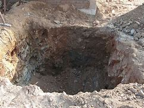

【V-T】   If two opposing things or people _are pitted against_ one another, they are in conflict. 使对立   +
⇒  You will be pitted against two, three, or four people who are every bit as good as you are.  你将和两个、三个或者四个跟你一样好的人对决。   +

【N-COUNT】   A _pit_ is a large hole that is dug in the ground. 大坑   +
⇒  Eric lost his footing and began to slide into the pit.  埃里克一失足，开始滑进坑里。   +

【N-PLURAL】   In motor racing, _the pits_ are the areas at the side of the track where drivers stop to get more fuel and to repair their cars during races. (赛车道旁的) 检修加油站   +
⇒  He moved quickly into the pits and climbed rapidly out of the car.  他急速驶入检修加油站，迅速爬出赛车。   +

【N-PLURAL】   The pits is a slang word for the worst possible person, place, or thing. (俗语)最糟的人、地方或事情   +

【N-COUNT】   A _pit_ is the large hard seed of a fruit or vegetable. 核   +

【V】   to extract the stone from (a fruit) 除去(水果的)核   +

【PHRASE】   If you _pit_ your _wits against_ someone, you compete with them in a test of knowledge or intelligence. 与…斗智   +
⇒  I'd like to manage at the very highest level and pit my wits against the best.  我希望在最高水平上管理，与最优秀的人斗智。   +

【PHRASE】   If you have a feeling _in the pit of_ your _stomach_, you have a tight or sick feeling in your stomach, usually because you are afraid or anxious. (因恐惧或焦虑而生的)异于平常的感觉   +
⇒  I had a funny feeling in the pit of my stomach.  我内心深处有种奇怪的感觉。   +

---

==== ▸ surround  [1261]   +
な/səˈraʊnd/   +

【V-T/V-I】   If a person or thing _is surrounded_ by something, that thing is situated all around them. 围绕   +
⇒  The small churchyard was surrounded by a rusted wrought-iron fence.  这个小墓地被一道生锈的锻铁栅栏围着。   +
⇒  The shell surrounding the egg has many important functions.  包着蛋的外壳有很多重要功能。   +
⇒  ...Chicago and the surrounding area.  …芝加哥及其周边地区。   +

【V-T】   If you _are surrounded_ by soldiers or police, they spread out so that they are in positions all the way around you. 包围   +
⇒  When the car stopped in the town square it was surrounded by soldiers and militiamen.  当这辆车在城镇广场停下时，它被战士和民兵们包围了。   +

【V-T】   The circumstances, feelings, or ideas which _surround_ something are those that are closely associated with it. 与…紧密联系   +
⇒  The decision had been agreed in principle before today's meeting, but some controversy surrounded it.  在今天的会议之前该决定原则上已获同意，但围绕这项决定还存在一些争议。   +

【V-T】   If you _surround yourself with_ certain people or things, you make sure that you have a lot of them near you all the time. 确保身边总有   +
⇒  He had made it his business to surround himself with a hand-picked group of bright young officers.  他把确保身边有自己亲手挑选的一群聪明的年轻军官当作自己的职责。   +

---

==== ▸ accomplish  [1262]   +
な/əˈkɒmplɪʃ/   +

【V-T】   If you _accomplish_ something, you succeed in doing it. 完成   +
⇒  If we'd all work together, I think we could accomplish our goal.  如果我们齐心协力，我想我们能实现我们的目标。   +

---

==== ▸ canal  [1263]   +
な/kəˈnæl/   +

【N-COUNT】   A _canal_ is a long, narrow stretch of water that has been made for boats to travel along or to bring water to a particular area. 运河   +
⇒  ...the Grand Union Canal.  …大联盟运河。   +

【N-COUNT】   A _canal_ is a narrow tube inside your body for carrying food, air, or other substances. (体内的) 管道   +
⇒  ...delaying its progress through the alimentary canal.  …通过消化道延迟它的作用。   +

---

==== ▸ insulin  [1264]   +
な/ˈɪnsjʊlɪn/   +

【N-UNCOUNT】  _Insulin_ is a substance that most people produce naturally in their body and that controls the level of sugar in their blood. 胰岛素   +
⇒  Sufferers from the more severe form of diabetes have faulty insulin-producing cells.  患有更严重类型的糖尿病患者其胰岛素分泌细胞存在问题。   +

---

==== ▸ circumstance  [1265]   +
な/ˈsɜːkəmstəns/   +

【N-COUNT】   The _circumstances_ of a particular situation are the conditions which affect what happens. 情形   +
⇒  Recent opinion polls show that 60 percent favour abortion under certain circumstances.  最近的民意调查显示60%的人赞同特定情况下的流产。   +
⇒  The strategy was too dangerous in the explosive circumstances of the times.  在当时爆炸性的形势下，这一战略太危险了。   +

【N-PLURAL】   The _circumstances_ of an event are the way it happened or the causes of it. 详情; 原委   +
⇒  I'm making inquiries about the circumstances of Mary Dean's murder.  我正在调查玛丽·迪安谋杀案的原委。   +

【N-PLURAL】   Your _circumstances_ are the conditions of your life, especially the amount of money that you have. 境况 (尤指经济状况)   +
⇒  ...help and support for the single mother, whatever her circumstances.  …提供给单身母亲的帮助和支持，无论她们的境况如何。   +

【N-UNCOUNT】   Events and situations which cannot be controlled are sometimes referred to as _circumstance_. 命运; 客观环境   +
⇒  There are those, you know, who, by circumstance, end up homeless.  你知道，有些人由于命运的原因最终变得无家可归。   +

【PHRASE】   You can emphasize that something must not or will not happen by saying that it must not or will not happen _under any circumstances_. 在任何情况下   +
⇒  Racism is wholly unacceptable under any circumstances.  在任何情况下种族主义都是完全不能被接受的。   +

【PHRASE】   You can use _in the circumstances_ or _under the circumstances_ before or after a statement to indicate that you have considered the conditions affecting the situation before making the statement. 在那种情况下   +
⇒  In the circumstances, Paisley's plans looked highly appropriate.  在那种情况下，佩斯利的计划看起来非常合适。   +

---

==== ▸ fragment  [1266]   +
な【N-COUNT】   A _fragment of_ something is a small piece or part of it. 碎片; 片段   +
⇒  The only reminder of the shooting is a few fragments of metal in my shoulder.  惟一使我记起那次枪击的，是我肩膀里的一些金属碎片。   +
⇒  She read everything, digesting every fragment of news.  她什么都读，对新闻的每一个片段都细细品味。   +

【V-T/V-I】   If something _fragments_ or _is fragmented_, it breaks or separates into small pieces or parts. 碎裂   +
⇒  The clouds fragmented and out came the sun.  云开日出。   +

【N-UNCOUNT】   分裂   +
⇒  ...the extraordinary fragmentation of styles on the music scene.  …音乐界各种风格的不寻常分化。   +

---

==== ▸ grovel  [1267]   +
な/ˈɡrɒvəl/   +
--> 词源同creep, 爬。 +

【V-I】   If you say that someone _grovels_, you think they are behaving too respectfully towards another person, for example because they are frightened or because they want something. 卑躬屈膝   +
⇒  I don't grovel to anybody.  我对谁都不会卑躬屈膝。   +
⇒  Speakers have been shouted down, classes disrupted, teachers made to grovel.  发言者完全被叫嚷声压住了，教室一片混乱，老师们不得不低声下气。   +

【V-I】   If you _grovel_, you crawl on the ground, for example in order to find something. 爬行 (找东西等)   +
⇒  We grovelled around the room on our knees.  我们在房间到处爬着寻找。   +

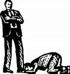

---

==== ▸ promising  [1268]   +
な/ˈprɒmɪsɪŋ/   +

【ADJ】   Someone or something that is _promising_ seems likely to be very good or successful. 有望成功的; 前景很好的   +
⇒  A school has honoured one of its brightest and most promising former students.  一所学校给其培养过的最聪明、最有前途的学生中的一位颁了奖。   +

---

==== ▸ inaugurate  [1269]   +
な/ɪnˈɔːɡjʊˌreɪt/   +
--> in-,进入，使，augur,占卜，预示，预兆。来自古希腊罗马时期通过占卜来决定吉凶，以及是否从事政治，经济，军事活动，但该词用来指就职。  +

【V-T】   When a new leader _is inaugurated_, they are formally given their new position at an official ceremony. 使正式就任   +
⇒  The new president will be inaugurated on January 20th.  新总统将在1月20日正式就任。   +

【N-VAR】   就职典礼   +
⇒  ...the inauguration of the new Governor.  …新任州长的就职典礼。   +

【V-T】   When a new building or institution _is inaugurated_, it is declared open in a formal ceremony. 为…举行开幕式; 为…举行落成典礼   +
⇒  A Mafia Museum was inaugurated in Corleone.  一座黑手党博物馆在科莱奥内举行落成典礼。   +

【N-COUNT】   就职典礼; 落成典礼   +
⇒  They later attended the inauguration of the University.  他们后来参加了该大学的成立典礼。   +

【V-T】   If you _inaugurate_ a new system or service, you start it. 开创   +
⇒  Pan Am inaugurated the first scheduled international flight.  泛美航空开创了第一个定期的国际航班。   +

---

==== ▸ obscene  [1270]   +
な/əbˈsiːn/   +
--> 来自拉丁语obscenus,冒犯的，来自obscaena,舞台后面，ob-,在上，在后面，-scaen,舞台，来自PIE*skei,分开，词源同shed,segment,proscenium.原指古希腊时期在表演不堪入目的情节时，只在舞台后面发出声音，而不在舞台上表演。后由该词引申词义淫秽的，下流的。 +

【ADJ】   If you describe something as _obscene_, you mean it offends you because it relates to sex or violence in a way that you think is unpleasant and shocking. 淫秽下流的   +
⇒  I'm not prudish but I think these photographs are obscene.  我不是假正经，不过我认为这些照片淫秽下流。   +

【ADJ】   In legal contexts, books, pictures, or movies which are judged _obscene_ are illegal because they deal with sex or violence in a way that is offensive to the general public. (书籍、图片、电影等) 淫秽非法的   +
⇒  A city magistrate ruled that the novel was obscene and copies should be destroyed.  一位市治安官裁定该小说是淫秽非法作品，应予以销毁。   +

【ADJ】   If you describe something as _obscene_, you disapprove of it very strongly and consider it to be offensive or immoral. 令人憎恶的   +
⇒  It was obscene to spend millions producing unwanted food.  耗资数百万生产无用的食品令人憎恶。   +

---

==== ▸ mechanic  [1271]   +

1.N-COUNT A _mechanic_ is someone whose job is to repair and maintain machines and engines, especially car engines. 机修工 +
=> If you smell something unusual (gas fumes or burning, for instance), take the car to your mechanic. 如果你闻到了异味（例如汽油味或燃烧味），就把车带给你的修理工。 +

2.N-PLURAL _The mechanics of_ a process, system, or activity are the way in which it works or the way in which it is done. 运作方式 +
=> What are the mechanics of this new process? 这一新工序的运作方式是什么？ +

3.N-UNCOUNT _Mechanics_ is the part of physics that deals with the natural forces that act on moving or stationary objects. 力学 +
=> He has not studied mechanics or engineering. 他没有学习过力学或者工程学。 +

---

==== ▸ sole  [1272]   +
な/səʊl/   +

【ADJ】   The _sole_ thing or person of a particular type is the only one of that type. 惟一的   +
⇒  Their sole aim is to destabilize the Indian government.  他们的惟一目的是要动摇印度政府的统治。   +

【ADJ】   If you have _sole_ charge or ownership of something, you are the only person in charge of it or who owns it. 惟一的; 独占的   +
⇒  Many women are left as the sole providers in families after their husband has died.  许多妇女在其丈夫死后成为家庭的惟一扶养人。   +

【N-COUNT】   The _sole_ of your foot or of a shoe or sock is the underneath surface of it. 脚掌; 鞋底; 袜底   +
⇒  ...shoes with rubber soles.  …橡胶底的鞋子。   +

【N】   any tongue-shaped flatfish of the family _Soleidae,_ esp _Solea solea_ (_European sole_): most common in warm seas and highly valued as food fishes 舌鰨   +

---

==== ▸ encase  [1273]   +
な/ɪnˈkeɪs/   +
--> en-, 进入，使。case, 箱子。 +

【V-T】   If a person or an object _is encased in_ something, they are completely covered or surrounded by it. 包; 围   +
⇒  When nuclear fuel is manufactured it is encased in metal cans.  核燃料生产出来时被装在金属罐中。   +
⇒  These weapons also had a heavy brass guard which encased almost the whole hand.  这些武器还有一层厚厚的黄铜防护，几乎把整个手柄包了起来。   +

---

==== ▸ sediment  [1274]   +
な/ˈsɛdɪmənt/   +
--> 来自拉丁语 sedere,坐下，词源同 sit,seat.-ment,名词后缀。引申比喻义沉积物，沉淀物。 +

【N-VAR】  _Sediment_ is solid material that settles at the bottom of a liquid, especially earth and pieces of rock that have been carried along and then left somewhere by water, ice, or wind. 沉淀物; 沉渣   +
⇒  Many organisms that die in the sea are soon buried by sediment.  许多在海里死亡的生物很快便被沉淀物掩埋。   +

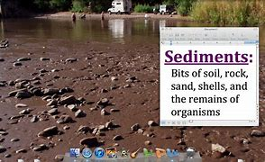

---

==== ▸ pursuit  [1275]   +
な/pəˈsjuːt/   +

【N-UNCOUNT】   Your _pursuit of_ something is your attempts at achieving it. If you do something _in pursuit of_ a particular result, you do it in order to achieve that result. 追求   +
⇒  ...a young man whose relentless pursuit of excellence is conducted with single-minded determination.  …一个一心一意不断追求卓越的年轻男子。   +

【N-UNCOUNT】   The _pursuit of_ an activity, interest, or plan consists of all the things that you do when you are carrying it out. 执行   +
⇒  The vigorous pursuit of policies is no guarantee of success.  政策的严格执行并非成功的保障。   +

【N-UNCOUNT】   Someone who is _in pursuit of_ a person, vehicle, or animal is chasing them. 追赶   +
⇒  ...a police officer who drove a patrol car at more than 120 mph in pursuit of a motorcycle.  …一位开着巡逻车以120英里以上的时速追赶一辆摩托车的警官。   +

【N-COUNT】   Your _pursuits_ are your activities, usually activities that you enjoy when you are not working. 消遣活动   +
⇒  They both love outdoor pursuits.  他们俩都喜欢户外活动。   +

---

==== ▸ somber = sombre [1276]   +
な/ˈsɑːmbər/ +

1.ADJ If someone is sombre, they are serious or sad. 沉痛的 +
=> Spencer cried as she described the sombre mood of her colleagues. 斯宾塞在描述同事们沉痛的情绪时哭了。 +

2.ADJ Sombre colours and places are dark and dull. 灰暗的 +
=> His room is sombre and dark. 他的房间阴森黑暗。 +

---

==== ▸ subway  [1277]   +
な/ˈsʌbˌweɪ/   +
--> sub-,在下，way,道路。引申词义地铁。 +

【N-COUNT】   A _subway_ is an underground railway. 地铁   +
【N-COUNT】   A _subway_ is the same as an . 地下通道   +

---

==== ▸ diverse  [1278]   +
な/daɪˈvɜːs/   +

【ADJ】   If a group of things is _diverse_, it is made up of a wide variety of things. 各种各样的   +
⇒  The building houses a wide and diverse variety of antiques.  这栋楼里摆放着大量各式各样的古董。   +

【ADJ】  _Diverse_ people or things are very different from each other. 不同的   +
⇒  Albert Jones' new style will inevitably put him in touch with a much more diverse and perhaps younger audience.  艾伯特·琼斯的新风格无疑将使他接触更多形形色色的、或许更年轻的观众。   +

---

==== ▸ gentility  [1279]   +
な/dʒɛnˈtɪlɪtɪ/   +

【N-UNCOUNT】  _Gentility_ is the fact or appearance of belonging to a high social class. 高贵的出身   +
⇒  The hotel has an air of faded gentility.  这家宾馆有一种没落的贵族氛围。   +

---

==== ▸ outweigh  [1280]   +
な/ˌaʊtˈweɪ/   +

【V-T】   If one thing _outweighs_ another, the first thing is of greater importance, benefit, or significance than the second thing. (在重要性或意义上) 超过   +
⇒  The advantages of this deal largely outweigh the disadvantages.  这笔交易的利远大于弊。   +

【V-T】   If you _outweigh_ someone, you are heavier than them. 比 (某人) 重   +
⇒  Young outweighed her opponent by about 60 pounds.  杨比她的对手重约60磅。   +

---

==== ▸ consult  [1281]   +
な/kənˈsʌlt/   +

【V-T/V-I】   If you _consult_ an expert or someone senior to you or _consult with_ them, you ask them for their opinion, advice, or permission. 咨询   +
⇒  Consult your doctor about how much exercise you should get.  咨询你的医生你应做多少运动。   +
⇒  He needed to consult with an attorney.  他需要和律师咨询。   +

【V-T】   If you _consult_ a book or a map, you look in it or look at it in order to find some information. 查阅   +
⇒  Consult the chart on page 44 for the correct cooking times.  查阅第44页的图表找正确的烹调时间。   +

【V-RECIP】   If a person or group of people _consults with_ other people or _consults_ them, or if two people or groups _consult_, they talk and exchange ideas and opinions about what they might decide to do. 商量   +
⇒  After consulting with her daughter and manager, she decided to take on the part, on her terms.  同她的女儿兼经纪人商量之后，她决定按她的要求接受那个角色。   +
⇒  The two countries will have to consult their allies.  两国得同各自的盟友协商。   +

---

==== ▸ renovate  [1282]   +
な/ˈrɛnəˌveɪt/   +

【V-T】   If someone _renovates_ an old building, they repair and improve it and get it back into good condition. 修复; 整修   +
⇒  The couple spent thousands renovating the house.  这对夫妻花了几千元来整修房子。   +

【N-VAR】   修复; 整修   +
⇒  ...a property which will need extensive renovation.  …一处需要大范围整修的房产。   +

---

==== ▸ characterize  [1283]   +
な/ˈkærɪktəˌraɪz/   +

【V-T】   If something _is characterized by_ a particular feature or quality, that feature or quality is an obvious part of it. 以…为特征   +
⇒  This election campaign has been characterized by violence.  这次竞选运动以暴力为特征。   +

【V-T】   If you _characterize_ someone or something _as_ a particular thing, you describe them as that thing. 描述为   +
⇒  Both companies have characterized the relationship as friendly.  两家公司都认为彼此的关系是友好的。   +

---

==== ▸ pattern  [1284]   +
な/ˈpætərn/   +

【N-COUNT】   A _pattern_ is the repeated or regular way in which something happens or is done. 模式   +
⇒  All three attacks followed the same pattern.  3次袭击都依照同一模式。   +

【N-COUNT】   A _pattern_ is an arrangement of lines or shapes, especially a design in which the same shape is repeated at regular intervals over a surface. 图案   +
⇒  ...a golden robe embroidered with red and purple thread stitched into a pattern of flames.  …一件用红紫相间的线镶了火焰图案的边的金色长袍。   +

【N-COUNT】   A _pattern_ is a diagram or shape that you can use as a guide when you are making something such as a model or a piece of clothing. 参照图形   +
⇒  ...cutting out a pattern for slacks.  …剪出一个便裤的纸样。   +
⇒  Send for our free patterns to knit yourself.  索取我们免费的参照图形以便自己织。   +

【V】   to model 形成图案   +

【N】   an outdoor assembly with religious practices, traders' stalls, etc on the feast day of a patron saint 圣人日户外集会; 集会上有宗教仪式和集市摊档等 (Also patron)   +

---

==== ▸ podium  [1285]   +
な/ˈpəʊdɪəm/   +

【N-COUNT】   A _podium_ is a small platform on which someone stands in order to give a lecture or conduct an orchestra. 讲台; (乐队) 指挥台   +
⇒  Unsteadily he mounted the podium, adjusted the microphone, coughed, and went completely blank.  他摇摇晃晃地走上讲台，调好麦克风，咳嗽了几声，接着脑子就一片空白。   +

---

==== ▸ vibrant  [1286]   +
な/ˈvaɪbrənt/   +

【ADJ】   Someone or something that is _vibrant_ is full of life, energy, and enthusiasm. 充满活力的   +
⇒  Tom felt himself being drawn toward her vibrant personality.  汤姆感到自己正被她充满活力的个性所吸引。   +
⇒  ...Shakespeare's vibrant language.  …莎士比亚那充满活力的语言。   +

【N-UNCOUNT】   活力   +
⇒  She was a woman with extraordinary vibrancy and extraordinary knowledge.  她是一个活力四射、知识渊博的女性。   +

【ADJ】  _Vibrant_ colours are very bright and clear. (色彩) 鲜亮的   +
⇒  Horizon blue, corn yellow and pistachio green are just three of the vibrant colours in this range.  天际蓝、玉米黄和淡草绿只是这一色域中的3种鲜亮色彩。   +

【ADV】   鲜亮地   +
⇒  ...a selection of vibrantly coloured French cast-iron saucepans.  …一套精选的色彩鲜亮的法国铸铁炖锅。   +

---

==== ▸ commerce  [1287]   +
な/ˈkɒmɜːs/   +

【N-UNCOUNT】  _Commerce_ is the activities and procedures involved in buying and selling things. 商业   +
⇒  They have made their fortunes from industry and commerce.  他们从工商业中发了财。   +

---

==== ▸ objective  [1288]   +
な/əbˈdʒɛktɪv/   +

【N-COUNT】   Your _objective_ is what you are trying to achieve. 目标   +
⇒  Our main objective was the recovery of the child safe and well.  我们的主要目标是让这个孩子安然无恙地恢复健康。   +

【ADJ】  _Objective_ information is based on facts. 客观的   +
⇒  He had no objective evidence that anything extraordinary was happening.  他没有客观证据证明有什么非同寻常的事情发生。   +

【ADV】   客观地   +
⇒  We simply want to inform people objectively about events.  我们只想客观地把事件告之于众。   +

【ADJ】   If someone is _objective,_ they base their opinions on facts rather than on their personal feelings. 客观的   +
⇒  I believe that a journalist should be completely objective.  我认为一名记者应该完全客观。   +

【ADV】   客观地   +
⇒  Try to view situations more objectively, especially with regard to work.  尽量更客观地看待情况，尤其对于工作。   +

---

==== ▸ lax  [1289]   +
な/læks/   +

【ADJ】   If you say that a person's behaviour or a system is _lax_, you mean they are not careful or strict about maintaining high standards. 松懈的; 不严格的   +
⇒  One of the problem areas is lax security for airport personnel.  其中一个问题是对机场人员的安全措施不严格。   +
⇒  There have been allegations from survivors that safety standards had been lax.  幸存者们指控安全标准不严格。   +

【N-UNCOUNT】   松懈   +
⇒  The laxity of export control authorities has made a significant contribution to the problem.  出口管理当局的松懈是导致此问题的重要因素。   +

---

==== ▸ intrinsic  [1290]   +
な/ɪnˈtrɪnsɪk/   +

【ADJ】   If something has _intrinsic_ value or _intrinsic_ interest, it is valuable or interesting because of its basic nature or character, and not because of its connection with other things. 内在的; 本质的   +
⇒  Diamonds have little intrinsic value and their price depends almost entirely on their scarcity.  钻石没有多少内在价值，它们的价格几乎完全取决于其稀有程度。   +

【ADV】   固有地   +
⇒  Sometimes I wonder if people are intrinsically evil.  有时我怀疑人是否生来就是邪恶的。   +

---

==== ▸ scarce  [1291]   +
な/skɛəs/   +

【ADJ】   If something is _scarce_, there is not enough of it. 短缺的   +
⇒  Food was scarce and expensive.  食物匮乏而且昂贵。   +
⇒  Jobs are becoming increasingly scarce.  工作职位变得越来越少。   +

【PHRASE】   If you _make yourself scarce_, you quickly leave the place you are in, usually in order to avoid a difficult or embarrassing situation. 溜走   +
⇒  It probably would be a good idea if you made yourself scarce.  如果你溜走倒可能是个好主意。   +

---

==== ▸ vapor  [1292]   +
な/ˈveɪpə/   +

---

==== ▸ melodic  [1293]   +
な/mɪˈlɒdɪk/   +

【ADJ】  _Melodic_ means relating to melody. 旋律的   +
⇒  ...Schubert's effortless gift for melodic invention.  ...舒伯特驾轻就熟的谱曲天分。   +

【ADV】  
   +
⇒  ...the third of Tchaikovsky's ten operas, and melodically one of his richest scores.  ...柴可夫斯基的10部歌剧中的第三部，也是旋律最为丰富的一部作品。   +

【ADJ】   Music that is _melodic_ has beautiful tunes in it. 旋律优美的   +
⇒  Wonderfully melodic and tuneful, his songs have made me weep.  旋律优美、悦耳动听，他的歌曲让我潸然泪下。   +

【ADV】  
   +
⇒  The leader has also learned to play more melodically.  这位指挥也学会了如何让演奏更加优美动听。   +

---

==== ▸ nevertheless  [1294]   +
な/ˌnɛvəðəˈlɛs/   +

【ADV】   You use _nevertheless_ when saying something that contrasts with what has just been said. 然而   +
⇒  Although the market has been flat, residential property costs remain high. Nevertheless, the fall-off in demand has had an impact on resale values.  尽管市场一直疲软，房价持续偏高。然而需求的减少还是对二手房价格产生了影响。   +

---

==== ▸ pure  [1295]   +
な/pjʊə/   +

【ADJ】   A _pure_ substance is not mixed with anything else. 纯粹的   +
⇒  ...a carton of pure orange juice.  …一箱纯橙汁。   +

【ADJ】   Something that is _pure_ is clean and does not contain any harmful substances. 洁净的   +
⇒  In remote regions, the air is pure and the crops are free of poisonous insecticides.  在偏远地区，空气是纯净的，庄稼也不用有毒的杀虫剂。   +

【N-UNCOUNT】   洁净   +
⇒  They worried about the purity of tap water.  他们担心自来水是否洁净。   +

【ADJ】   If you describe something such as a colour, a sound, or a type of light as _pure_, you mean that it is very clear and represents a perfect example of its type. 纯的   +
⇒  She was dressed in pure white clothes.  她穿着纯白的衣服。   +

【N-UNCOUNT】   清亮   +
⇒  The soaring purity of her voice conjured up the frozen bleakness of the Far North.  她高亢、清亮的声音使人们想到了遥远的北方萧瑟的冰天雪地。   +

【ADJ】  _Pure_ science or _pure_ research is concerned only with theory and not with how this theory can be used in practical ways. 纯理论的   +
⇒  Physics isn't just about pure science with no immediate applications.  物理学并非没有直接应用价值的纯科学。   +

【ADJ】  _Pure_ means complete and total. 完全的   +
⇒  The old man turned to give her a look of pure surprise.  那位老人回过头来非常吃惊地看了她一眼。   +

---

==== ▸ magnitude  [1296]   +
な/ˈmæɡnɪˌtjuːd/   +

【N-UNCOUNT】   If you talk about the _magnitude_ of something, you are talking about its great size, scale, or importance. (尺寸、规模、重要性等) 大的程度   +
⇒  An operation of this magnitude is going to be difficult.  一个这么大的手术会很难的。   +

【PHRASE】   You can use _order of magnitude_ when you are giving an approximate idea of the amount or importance of something. 重要级; 数量级   +
⇒  America and Russia do not face a problem of the same order of magnitude as Japan.  美俄两国没有面临与日本同样的重要级别的问题。   +

---

==== ▸ interplay  [1297]   +
な/ˈɪntəˌpleɪ/   +

【N-UNCOUNT】   The _interplay between_ two or more things or people is the way that they have an effect on each another or react to each other. 互相影响   +
⇒  ...the interplay of political, economic, social and cultural factors.  ...政治、经济，社会和文化因素的互相影响。   +

---

==== ▸ lope  [1298]   +
な/ləʊp/   +

【V-I】   If a person or animal _lopes_ somewhere, they run in an easy and relaxed way, taking long steps. 轻快地奔跑   +
⇒  He was loping across the sand toward Nancy.  他正穿过沙滩轻快地向南希跑去。   +
⇒  Matty saw him go loping off.  马蒂看着他大步跑远。   +

【ADJ】  [ADJ n]   +
⇒  She turned and walked away with long, loping steps.  她转过身，大步走开。   +

---

==== ▸ raft  [1299]   +
な/rɑːft/   +

【N-COUNT】   A _raft_ is a floating platform made from large pieces of wood or other materials tied together. 木排; 筏   +
⇒  ...a river trip on bamboo rafts through dense rainforest.  …一次乘着竹筏穿过茂密雨林的河上旅行。   +

【N-COUNT】   A _raft_ is a small rubber or plastic boat that you blow air into to make it float. (橡皮或塑料的) 小型充气船   +
⇒  The crew spent two days and nights in their raft.  船员们在他们的小充气船上度过了两天两夜。   +

【V】   to convey on or travel by raft, or make a raft from 筏运; 筏行; 制成筏   +

【N】   a large collection or amount 大量   +
⇒  a raft of old notebooks discovered in a cupboard     +

---

==== ▸ starch  [1300]   +
な/stɑːtʃ/   +

【N-MASS】  _Starch_ is a substance that is found in foods such as bread, potatoes, pasta, and rice and gives you energy. 淀粉   +
⇒  She reorganized her eating so that she was taking more fruit and vegetables and less starch, salt, and fat.  她重新调整了自己的饮食，在多吃水果蔬菜，少食用淀粉、盐和脂肪。   +

【N-UNCOUNT】  _Starch_ is a substance that is used for making cloth stiffer, especially cotton and linen. (用于使布料挺直的) 浆粉   +
⇒  He never puts enough starch in my shirts.  他从不给我的衬衫上足够的浆粉。   +

---

==== ▸ malleable  [1301]   +
な/ˈmælɪəbəl/   +

【ADJ】   If you say that someone is _malleable_, you mean that they are easily influenced or controlled by other people. 易受别人影响的; 易被别人控制的   +
⇒  She was young enough to be malleable.  她当时年轻得足以轻易地被别人影响。   +

【ADJ】   A substance that is _malleable_ is soft and can easily be made into different shapes. 延展性好的   +
⇒  Silver is the most malleable of all metals.  银是所有金属中延展性最好的。   +

---

==== ▸ construction  [1302]   +
な/kənˈstrʌkʃən/   +

【N-UNCOUNT】  _Construction_ is the building of things such as houses, factories, roads, and bridges. 建造   +
⇒  He'd already started construction on a hunting lodge.  他已经开始建造一个狩猎用的小屋。   +
⇒  ...the downturn in the construction industry.  …建造业的衰退。   +
⇒  Jim now works in construction.  吉姆现在从事建造业。   +

【N-UNCOUNT】   The _construction_ of something such as a vehicle or machine is the making of it. (交通工具、机器等的) 制造   +
⇒  ...companies who have long experience in the construction of those types of equipment.  …在制造那种设备方面有长久经验的各公司。   +

【N-UNCOUNT】   The _construction_ of something such as a system is the creation of it. 创立   +
⇒  ...the construction of a just system of criminal justice.  …公正的刑事司法体制的建立。   +

【N-UNCOUNT】   You use _construction_ to refer to the structure of something and the way it has been built or made. 构造   +
⇒  The Shakers believed that furniture should be plain, simple, useful, practical, and of sound construction.  震颤派教徒认为家具应当朴素、简单、有用、实际，且构造很好。   +

【N-COUNT】   You can refer to an object that has been built or made as a _construction_. 建造物   +
⇒  ...an impressive steel and glass construction.  …一座令人印象深刻的钢筋玻璃建造物。   +

【N-COUNT】   A grammatical _construction_ is a particular arrangement of words in a sentence, clause, or phrase. (语法) 结构   +
⇒  Avoid complex verbal constructions.  避免复杂的动词结构。   +

---

==== ▸ differential  [1303]   +
な/ˌdɪfəˈrɛnʃəl/   +

【N-COUNT】   In mathematics and economics, a _differential_ is a difference between two values in a scale. (数学) 微分; (经济) 差价   +
⇒  ...the wage differential between blue-collar and white-collar workers.  …蓝领与白领工作人员之间的工资差别。   +

---

==== ▸ hitherto  [1304]   +
な/ˈhɪðəˈtuː/   +

【ADV】   You use _hitherto_ to indicate that something was true up until the time you are talking about, although it may no longer be the case. 迄今   +
⇒  The ruling party is likely to be opened up to let in people hitherto excluded.  执政党可能会放开政策，吸纳迄今被排斥在外的人士。   +

---

==== ▸ metropolitan  [1305]   +
な/ˌmɛtrəˈpɒlɪtən/   +

【ADJ】  _Metropolitan_ means belonging to or typical of a large, busy city. 大都会的   +
⇒  ...the metropolitan district of Miami.  …迈阿密的大都会区。   +
⇒  ...a dozen major metropolitan hospitals.  …12家主要的大都会医院。   +

---

==== ▸ steady  [1306]   +
な/ˈstɛdɪ/   +

【ADJ】   A _steady_ situation continues or develops gradually without any interruptions and is not likely to change quickly. 稳定的   +
⇒  Despite the steady progress of building work, the campaign against it is still going strong.  尽管建筑工程稳步进行，反工运动却仍然高涨。   +
⇒  The improvement in standards has been steady and persistent, but has attracted little comment from educationalists.  虽然标准在持续稳步提高，但教育者并未对此有何评论。   +

【ADV】   稳定地   +
⇒  Relax as much as possible and keep breathing steadily.  尽量放松，保持呼吸平稳。   +

【ADJ】   If an object is _steady_, it is firm and does not shake or move around. 平稳的   +
⇒  Get as close to the subject as you can and hold the camera steady.  尽可能靠近对象，拿稳相机。   +

【ADJ】   If you look at someone or speak to them in a _steady_ way, you look or speak in a calm, controlled way. 镇定的   +
⇒  "Well, go on," said Camilla, her voice fairly steady.  “嗯，继续吧。”卡米拉说道，声音相当镇定。   +

【ADV】   镇定地   +
⇒  He moved back a little and stared steadily at Elaine.  他往后退了点，镇定地盯着依莱恩。   +

【ADJ】   If you describe a person as _steady_, you mean that they are sensible and reliable. 可靠的   +
⇒  He was firm and steady unlike other men she knew.  他坚定、可靠，和她所认识的其他男人不同。   +

【V-T/V-I】   If you _steady_ something or if it _steadies_, it stops shaking or moving around. 使平稳; 平稳   +
⇒  Two men were on the bridge-deck, steadying a ladder.  两人站在船桥甲板上，扶稳一个梯子。   +

【V-T】   If you _steady yourself_, you control your voice or expression, so that people will think that you are calm and not nervous. 使镇定   +
⇒  Somehow she steadied herself and murmured, "Have you got a cigarette?"  她设法使自己镇定下来，并低声问道,“你有香烟吗？”   +

---

==== ▸ plight  [1307]   +
な/plaɪt/   +

【N-COUNT】   If you refer to someone's _plight_, you mean that they are in a difficult or distressing situation that is full of problems. 困境   +
⇒  The nation saw the plight of the farmers, whose crops had died.  该国看到了农民因庄稼死亡而陷入困境。   +

【V】   to give or pledge (one's word) 保证; 宣誓   +
⇒  he plighted his word to attempt it     +

【N】   a solemn promise, esp of engagement; pledge 誓约; 婚约   +

---

==== ▸ evacuate  [1308]   +
な/ɪˈvækjʊˌeɪt/   +

【V-T】   To _evacuate_ someone means to send them to a place of safety, away from a dangerous building, town, or area. 疏散; 使…撤离   +
⇒  They were planning to evacuate the seventy American officials still in the country.  他们当时在计划将仍在那个国家的70位美国官员撤离。   +

【N-VAR】   疏散; 撤离   +
⇒  ...the evacuation of the sick and wounded.  …伤病员的撤离。   +
⇒  An evacuation of the city's four-million inhabitants is planned for later this week.  该市400万居民的撤离计划本周晚些时候进行。   +

【V-T】   If people _evacuate_ a place, they move out of it for a period of time, especially because it is dangerous. (尤指因为危险而) 撤离   +
⇒  The fire is threatening about sixty homes, and residents have evacuated the area.  这场大火威胁着约六十个家庭，居民已经撤离了该地区。   +

【N-VAR】   撤离   +
⇒  ...the mass evacuation of the Bosnian town of Srebrenica.  …波斯尼亚的斯雷布雷尼察镇大撤离。   +

---

==== ▸ perpetual  [1309]   +
な/pəˈpɛtjʊəl/   +

【ADJ】   A _perpetual_ feeling, state, or quality is one that never ends or changes. 永恒的   +
⇒  ...the creation of a perpetual union.  …一个永久性工会的创立。   +

【ADV】   永恒地   +
⇒  They were all perpetually starving.  他们一直都在挨饿。   +

【ADJ】   A _perpetual_ act, situation, or state is one that happens again and again and so seems never to end. 反复不断的; 无休止的   +
⇒  I thought her perpetual complaints were going to prove too much for me.  我觉得她那永无休止的抱怨会让我吃不消的。   +

【ADV】   反复不断地; 无休止地   +
⇒  He perpetually interferes in political affairs.  他不断地干涉政治事务。   +

---

==== ▸ haunt  [1310]   +
な/hɔːnt/   +

【V-T】   If something unpleasant _haunts_ you, you keep thinking or worrying about it over a long period of time. (令人不愉快的事) 萦绕在心头   +
⇒  He would always be haunted by that scene in Well Park.  他将不断回想起威尔公园的那一幕。   +

【V-T】   Something that _haunts_ a person or organization regularly causes them problems over a long period of time. 长期不断地纠缠   +
⇒  The stigma of being a bankrupt is likely to haunt him for the rest of his life.  作为一名破产者的耻辱很可能在他的余生不断来纠缠他。   +

【N-COUNT】   A place that is the _haunt_ of a particular person is one which they often visit because they enjoy going there. 常去之处   +
⇒  The islands are a favourite summer haunt for yachtsmen.  这片岛屿是游艇驾驶者夏天最爱去的一个地方。   +

【V-T】   A ghost or spirit that _haunts_ a place or a person regularly appears in the place, or is seen by the person and frightens them. (鬼魂等) 常出没于   +
⇒  His ghost is said to haunt some of the rooms, banging a toy drum.  据说他的鬼魂常在其中一些屋子里出现，还敲打着一个玩具鼓。   +

---

==== ▸ melodious  [1311]   +
な/mɪˈləʊdɪəs/   +

【ADJ】   A _melodious_ sound is pleasant to listen to. 优美的; 悦耳的; 动听的   +
⇒  She spoke in a quietly melodious voice.  她说话轻声细语，甜美悦耳。   +

---

==== ▸ entertain  [1312]   +
な/ˌɛntəˈteɪn/   +

【V-T/V-I】   If a performer, performance, or activity _entertains_ you, it amuses you, interests you, or gives you pleasure. 使娱乐; 娱乐   +
⇒  They were entertained by top singers, dancers and celebrities.  他们饶有兴趣地看了顶级歌手、舞蹈演员和名流们的演出。   +

【ADJ】   娱乐的   +
⇒  To generate new money the sport needs to be more entertaining.  想生更多的财，这项运动得更有娱乐性。   +

【V-T/V-I】   If you _entertain_, or _entertain_ people, you provide food and drink for them, for example, when you have invited them to your house. 招待; 宴客   +
⇒  I don't like to entertain guests anymore.  我不再喜欢招待客人。   +
⇒  He loves to entertain.  他喜欢宴客。   +

【N-UNCOUNT】   招待; 宴客   +
⇒  ...a cosy area for entertaining and relaxing.  …一个宴客与休闲的舒适场所。   +

【V-T】   If you _entertain_ an idea or suggestion, you allow yourself to consider it as possible or as worth thinking about seriously. 心存   +
⇒  How foolish I am to entertain doubts.  我心存疑虑是多么愚蠢啊。   +

---

==== ▸ courageous  [1313]   +
な/kəˈreɪdʒəs/   +

【ADJ】   Someone who is _courageous_ shows courage. 勇敢的   +
⇒  The children were very courageous.  孩子们都很勇敢。   +

---

==== ▸ inhabit  [1314]   +
な/ɪnˈhæbɪt/   +

【V-T】   If a place or region _is inhabited_ by a group of people or a species of animal, those people or animals live there. 居住于   +
⇒  The valley is inhabited by the Dani tribe.  这个山谷里居住着丹尼部落。   +
⇒  ...the people who inhabit these islands.  …居住于这些岛屿的人们。   +

---

==== ▸ bond  [1315]   +
な/bɒnd/   +

【N-COUNT】   A _bond between_ people is a strong feeling of friendship, love, or shared beliefs and experiences that unites them. (强烈的感情) 纽带   +
⇒  The experience created a very special bond between us.  这段经历构成了我们之间一条非常特殊的纽带。   +

【V-RECIP】   When people _bond with_ each other, they form a relationship based on love or shared beliefs and experiences. You can also say that people _bond_ or that something _bonds_ them. 建立关系   +
⇒  Belinda was having difficulty bonding with the baby.  贝琳达难以和这个婴儿建立亲密关系。   +
⇒  They all bonded while writing graffiti together.  他们在一起涂鸦时相识。   +

【N-COUNT】   A _bond between_ people or groups is a close connection that they have with each other, for example because they have a special agreement. 密切联系   +
⇒  ...the strong bond between church and nation.  …教会与国家的紧密联系。   +

【N-COUNT】   A _bond between_ two things is the way in which they stick to one another or are joined in some way. 黏合   +
⇒  If you experience difficulty with the superglue not creating a bond with dry wood, moisten the surfaces with water.  如果你用强力胶难以粘上干燥的木头，就用水润湿木头表面。   +

【V-RECIP】   When one thing _bonds with_ another, it sticks to it or becomes joined to it in some way. You can also say that two things _bond together_, or that something _bonds_ them _together_. (使) 黏合   +
⇒  In graphite sheets, carbon atoms bond together in rings.  在石墨片中，碳原子以环状黏合在一起。   +

【N-COUNT】   When a government or company issues a _bond_, it borrows money from investors. The certificate that is issued to investors who lend money is also called a _bond_. (政府或公司发行的) 债券   +
⇒  Most of it will be financed by government bonds.  其主要资金来源于政府债券。   +

---

==== ▸ chilly  [1316]   +
な/ˈtʃɪlɪ/   +

【ADJ】   Something that is _chilly_ is unpleasantly cold. 阴冷的   +
⇒  It was a chilly afternoon.  那是一个阴冷的下午。   +

【ADJ】   If you feel _chilly_, you feel rather cold. 寒冷的   +
⇒  I'm a bit chilly.  我感到有点儿冷。   +

---

==== ▸ realization  [1317]   +
 辞典中没找到  +
==== ▸ mental  [1318]   +
な/ˈmɛntəl/   +

【ADJ】  _Mental_ means relating to the process of thinking. 智力的   +
⇒  The intellectual environment has a significant influence on the mental development of the children.  知识环境对孩子智力的发展有着重大的影响。   +

【ADV】   智力地   +
⇒  I think you are mentally tired.  我觉得你的头脑累了。   +

【ADJ】  _Mental_ means relating to the state or the health of a person's mind. 心理上的   +
⇒  The mental state that had created her psychosis was no longer present.  导致她精神错乱的那种心理状态已经不见了。   +

【ADV】   心理上地   +
⇒  ...an inmate who is mentally disturbed.  …一个心理不正常的病人。   +

【ADJ】   A _mental_ act is one that involves only thinking and not physical action. 在头脑中进行的   +
⇒  Practise mental arithmetic when you go out shopping.  外出购物时练习一下心算。   +

【ADV】   在头脑中进行地   +
⇒  This technique will help people mentally organize information.  这个技术会帮助人们在头脑里组织信息。   +

---

==== ▸ subject  [1319]   +
な【N-COUNT】   The _subject_ of something such as a conversation, letter, or book is the thing that is being discussed or written about. 话题; 主题   +
⇒  It was I who first raised the subject of plastic surgery.  是我首先提起了整形手术这个话题。   +
⇒  ...the president's own views on the subject.  …该总统对此问题的个人观点。   +

【N-COUNT】   Someone or something that is the _subject of_ criticism, study, or an investigation is being criticized, studied, or investigated. (批评、研究或调查的) 对象   +
⇒  Over the past few years, some of the positions Mr. Meredith has adopted have made him the subject of criticism.  在过去的几年里，梅雷迪恩先生所采取的一些立场已使他成为了被批评的对象。   +

【N-COUNT】   A _subject_ is an area of knowledge or study, especially one that you study in school, or college. (尤指在学校学习的) 科目   +
⇒  Surprisingly, maths was voted their favourite subject.  令人吃惊的是，数学被评为他们喜爱的科目。   +

【N-COUNT】   In an experiment or piece of research, the _subject_ is the person or animal that is being tested or studied. 实验对象; 研究对象   +
⇒  "White noise" was played into the subject's ears through headphones.  “白色噪音”通过耳机被送进实验对象的耳朵里。   +

【N-COUNT】   An artist's _subjects_ are the people, animals, or objects that he or she paints, models, or photographs. (绘画、摄影等的) 题材   +
⇒  Sailboats and fish are popular subjects for local artists.  帆船和鱼是当地艺术家们喜爱的题材。   +

【N-COUNT】   In grammar, the _subject_ of a clause is the noun group that refers to the person or thing that is doing the action expressed by the verb. For example, in "My cat keeps catching birds," "my cat" is the subject. 主语   +

【ADJ】   To be _subject to_ something means to be affected by it or to be likely to be affected by it. (可能) 受…影响的   +
⇒  Prices may be subject to alteration.  价格可能会受变更影响。   +

【ADJ】   If someone is _subject to_ a particular set of rules or laws, they have to obey those rules or laws. 受…支配的   +
⇒  The tribunal is unique because Mr. Jones is not subject to the normal police discipline code.  这个审判很特别，因为琼斯先生不受一般的警务纪律约束。   +

【V-T】   If you _subject_ someone _to_ something unpleasant, you make them experience it. 使遭受   +
⇒  ...the man who had subjected her to four years of beatings and abuse.  …那个使她遭受了4年殴打和辱骂的男人。   +

【N-COUNT】   The people who live in or belong to a particular country, usually one ruled by a monarch, are the _subjects_ of that monarch or country. (常指君主制国家的) 臣民   +
⇒  ...his subjects regarded him as a great and wise monarch.  …他的臣民把他看成了一位伟大而英明的君主。   +

【PHRASE】   When someone involved in a conversation _changes the subject_, they start talking about something else, often because the previous subject was embarrassing. 转变话题   +
⇒  He tried to change the subject, but she wasn't to be put off.  他试图转变话题，但她不愿被打断。   +

【PHRASE】   If an event will take place _subject to_ a condition, it will take place only if that thing happens. 取决于   +
⇒  They denied a report that Egypt had agreed to a summit, subject to certain conditions.  他们否认了埃及已同意在特定条件下参加峰会的报道。   +

---

==== ▸ mechanic  [1320]   +
な/mɪˈkænɪk/   +

【N-COUNT】   A _mechanic_ is someone whose job is to repair and maintain machines and engines, especially car engines. 机修工   +
⇒  If you smell something unusual (gas fumes or burning, for instance), take the car to your mechanic.  如果你闻到了异味（例如汽油味或燃烧味），就把车带给你的修理工。   +

【N-PLURAL】  _The__mechanics__of_ a process, system, or activity are the way in which it works or the way in which it is done. 运作方式   +
⇒  What are the mechanics of this new process?  这一新工序的运作方式是什么？   +

【N-UNCOUNT】  _Mechanics_ is the part of physics that deals with the natural forces that act on moving or stationary objects. 力学   +
⇒  He has not studied mechanics or engineering.  他没有学习过力学或者工程学。   +

---

==== ▸ genetics  [1321]   +
な/dʒɪˈnɛtɪks/   +

【N-UNCOUNT】  _Genetics_ is the study of heredity and how qualities and characteristics are passed on from one generation to another by means of genes. 遗传学   +
⇒  Genetics is also bringing about dramatic changes in our understanding of cancer.  遗传学也正使我们对癌症的理解发生巨大的变化。   +

---

==== ▸ codify  [1322]   +
な/ˈkəʊdɪˌfaɪ/   +

【V-T】   If you _codify_ a set of rules, you define them or present them in a clear and ordered way. 编篡(法规)   +
⇒  The latest draft of the agreement codifies the panel's decision.  该协议的最新草案将专家小组的决定编篡成了法规条款。   +

【N-UNCOUNT】  [usu N 'of' n]   +
⇒  The codification of the laws began in the 1840s.  这些法律的编纂始于19世纪40年代。   +

---

==== ▸ zinc  [1323]   +
な/zɪŋk/   +

【N-UNCOUNT】  _Zinc_ is a bluish-white metal which is used to make other metals such as brass, or to cover other metals such as iron to stop rust from forming. 锌   +

---

==== ▸ scratch  [1324]   +
な/skrætʃ/   +

【V-T】   If you _scratch yourself_, you rub your fingernails against your skin because it is itching. 挠   +
⇒  He scratched himself under his arm.  他在自己腋下挠了挠。   +
⇒  The old man lifted his cardigan to scratch his side.  那位老人撩起他的开襟毛衣挠了挠身子侧面。   +

【V-T】   If a sharp object _scratches_ someone or something, it makes small shallow cuts on their skin or surface. 划破   +
⇒  The branches tore at my jacket and scratched my hands and face.  那些树枝挂了我的夹克，划破了我的双手和脸。   +

【N-COUNT】  _Scratches_ on someone or something are small shallow cuts. 划伤   +
⇒  The seven-year-old was found crying with scratches on his face and neck.  那个7岁的孩子被找到时正在哭，脸上和颈上都有划伤。   +

【PHRASE】   If you do something _from scratch_, you do it without making use of anything that has been done before. 从零开始   +
⇒  Building a home from scratch can be both exciting and challenging.  白手起家既激动人心又具有挑战性。   +

【PHRASE】   If you say that someone is _scratching_ their _head_, you mean that they are thinking hard and trying to solve a problem or puzzle. 绞尽脑汁思考   +
⇒  The Institute spends a lot of time scratching its head about how to boost American productivity.  这家研究所花大量时间绞尽脑汁思考怎样推进美国的生产力。   +

---

==== ▸ decrease  [1325]   +
な【V-T/V-I】   When something _decreases_ or when you _decrease_ it, it becomes less in quantity, size, or intensity. 使降低; 降低   +
⇒  Population growth is decreasing by 1.4% each year.  人口增长每年下降1.4%。   +
⇒  The number of independent firms decreased from 198 to 96.  独立公司的数量从198家减到了96家。   +
⇒  Since 1945 air forces have decreased in size.  1945年以来，空军的规模已经缩小。   +

【N-COUNT】   A _decrease in_ the quantity, size, or intensity of something is a reduction in it. 减少; 降低   +
⇒  In Spain and Portugal there has been a decrease in the number of young people out of work.  在西班牙和葡萄牙，失业青年人数已经有所下降。   +

---

==== ▸ companion  [1326]   +
な/kəmˈpænjən/   +

【N-COUNT】   A _companion_ is someone who you spend time with or who you are travelling with. 同伴; 旅伴   +
⇒  Fred had been her constant companion for the last six years of her life.  弗雷德是她生命最后六年里经常跟她在一起的伴侣。   +

【N-COUNT】   a raised frame on an upper deck with windows to give light to the deck below 上层甲板带窗的升高框架，能让下层甲板透光   +

---

==== ▸ persistent  [1327]   +
な/pəˈsɪstənt/   +

【ADJ】   Something that is _persistent_ continues to exist or happen for a long time; used especially about bad or undesirable states or situations. (坏的或令人不悦的状态或情形) 持续存在的   +
⇒  Her position as national leader has been weakened by persistent fears of another coup attempt.  她国家领导人的地位因为人们一直担心再次的政变企图而被削弱了。   +
⇒  His cough grew more persistent until it never stopped.  他的咳嗽愈来愈频繁，直到咳个不停。   +

【ADJ】   Someone who is _persistent_ continues trying to do something, even though it is difficult or other people are against it. 坚持不懈的; 执著的   +
⇒  ...a persistent critic of the president.  …一个执著的批评总统的人。   +

---

==== ▸ pernicious  [1328]   +
な/pəˈnɪʃəs/   +

【ADJ】   If you describe something as _pernicious_, you mean that it is very harmful. 极为有害的   +
⇒  I did what I could, but her mother's influence was pernicious.  我已尽我所能，但她母亲造成的影响是很极为不利的。   +

---

==== ▸ souvenir  [1329]   +
な/ˌsuːvəˈnɪə/   +

【N-COUNT】   A _souvenir_ is something which you buy or keep to remind you of a holiday, place, or event. 纪念品   +
⇒  ...a souvenir of the summer of 1992.  …一个1992年夏天的纪念品。   +

---

==== ▸ vagrant  [1330]   +
な/ˈveɪɡrənt/   +

【N-COUNT】   A _vagrant_ is someone who moves a lot from place to place because they have no permanent home or job, and have to ask for or steal things in order to live. 流浪者   +
⇒  He lived on the street as a vagrant.  他作为一个流浪者露宿街头。   +

---

==== ▸ decisive  [1331]   +
な/dɪˈsaɪsɪv/   +

【ADJ】   If a fact, action, or event is _decisive_, it makes certain a particular result. 决定性的   +
⇒  ...his decisive victory in the presidential elections.  …他在这次总统选举中的决定性胜利。   +

【ADV】   决定性地   +
⇒  The plan was decisively rejected by Congress three weeks ago.  这个计划三周前被国会关键性地否决了。   +

【ADJ】   If someone is _decisive_, they have or show an ability to make quick decisions in a difficult or complicated situation. 果断的   +
⇒  He should give way to a younger, more decisive leader.  他应该让位给一位更年轻、更果断的领导者。   +

【ADV】   果断地   +
⇒  "I'll call for you at ten," she said decisively.  “我10点来接你，”她果断地说。   +

---

==== ▸ invitation  [1332]   +
な/ˌɪnvɪˈteɪʃən/   +

【N-COUNT】   An _invitation_ is a written or spoken request to come to an event such as a party, a meal, or a meeting. 邀请   +
⇒  ...an invitation to lunch.  …午餐邀请。   +
⇒  The Syrians have not yet accepted an invitation to attend.  那些叙利亚人还没有接受邀请。   +

【N-COUNT】   An _invitation_ is the card or paper on which an invitation is written or printed. 请贴   +
⇒  Hundreds of invitations are being sent out this week.  本周数百张请贴正在发出。   +

【N-SING】   If you believe that someone's action is likely to have a particular result, especially a bad one, you can refer to the action as an _invitation to_ that result. 招惹   +
⇒  Don't leave your shopping on the back seat of your car – it's an open invitation to a thief.  不要把买好的东西放在车的后座上–这很容易招惹小偷。   +

---

==== ▸ landing  [1333]   +
な/ˈlændɪŋ/   +

【N-COUNT】   In a house or other building, the _landing_ is the area at the top of the staircase which has rooms leading off it. 楼梯平台   +
⇒  I ran out onto the landing.  我跑出去上了楼梯平台。   +

【N-VAR】   A _landing_ is an act of bringing an aircraft or spacecraft down to the ground. 着陆   +
⇒  I had to make a controlled landing into the sea.  我不得不在海里进行有控制的降落。   +

【N-COUNT】   When a _landing_ takes place, troops are unloaded from boats or aircraft at the beginning of a military invasion or other operation. (部队) 登陆   +
⇒  American forces have begun a big landing.  美军已经开始大规模的登陆。   +

---

==== ▸ embryo  [1334]   +
な/ˈɛmbrɪˌəʊ/   +

【N-COUNT】   An _embryo_ is an unborn animal or human being in the very early stages of development. 胚胎   +
⇒  There are 24,000 frozen embryos in clinics across the country.  全国各地的诊所里有24000个冷冻胚胎。   +

【ADJ】   An _embryo_ idea, system, or organization is in the very early stages of development, but is expected to grow stronger. 萌芽阶段的   +
⇒  They are an embryo party of government.  他们是一个处于萌芽阶段的政体。   +

---

==== ▸ devastate  [1335]   +
な/ˈdɛvəˌsteɪt/   +

【V-T】   If something _devastates_ an area or a place, it damages it very badly or destroys it totally. 严重破坏; 彻底摧毁   +
⇒  The tsunami devastated parts of Indonesia and other countries in the region.  这次海啸严重破坏了印度尼西亚和该区域其他国家的部分地区。   +

---

==== ▸ dramatize  [1336]   +
な/ˈdræməˌtaɪz/   +

【V-T】   If a book or story _is dramatized_, it is written or presented as a play, film, or television drama. 把 (小说、故事等) 改编为剧本   +
⇒  ...an incident later dramatized in the film "The Right Stuff."  …一个事件后来被改编成了电影《太空先锋》。   +

【N-COUNT】   改编成的戏剧; 改编成的剧本   +
⇒  ...a dramatization of D. H. Lawrence's novel, "Lady Chatterley's Lover."  …根据D. H. 劳伦斯的小说《查泰莱夫人的情人》改编的剧本。   +

【V-T】   If you say that someone _dramatizes_ a situation or event, you mean that they try to make it seem more serious, more important, or more exciting than it really is. 使戏剧化; 渲染   +
⇒  They have a tendency to show off, to dramatize almost every situation.  他们有一种炫耀的倾向,几乎任何情况都要大肆渲染一番。   +

---

==== ▸ downward  [1337]   +
な/ˈdaʊnwəd/   +

【ADJ】   A _downward_ movement or look is directed toward a lower place or a lower level. 向下的   +
⇒  ...a firm downward movement of the hands.  …一个坚定有力的双手向下的动作。   +

【ADJ】   If you refer to a _downward_ trend, you mean that something is decreasing or that a situation is getting worse. 逐渐下降的; 日趋恶化的   +
⇒  The downward trend in home ownership is likely to continue.  住房拥有率的下降趋势有可能还要延续。   +

【ADV】   If you move or look _downward_, you move or look toward the ground or a lower level. 朝下地   +
⇒  Benedict pointed downward again with his stick.  贝内迪克特又用他的拐杖向下指了指。   +

【ADV】   If an amount or rate moves _downward_, it decreases. 下降地   +
⇒  Inflation is moving firmly downward.  通货膨胀在稳步下降。   +

【ADV】   If you want to emphasize that a statement applies to everyone in an organization, you can say that it applies from its leader _downward_. 往下地   +
⇒  ...from the president downward.  …自总经理而下。   +

---

==== ▸ aggregate  [1338]   +
な/ˈægrɪgɪt/   +

【ADJ】   An _aggregate_ amount or score is made up of several smaller amounts or scores added together. 合计的   +
⇒  The rate of growth of GNP will depend upon the rate of growth of aggregate demand.  国民生产总值的增长率将依赖于总需求的增长率。   +

---

==== ▸ radiation  [1339]   +
な/ˌreɪdɪˈeɪʃən/   +

【N-UNCOUNT】  _Radiation_ consists of very small particles of a radioactive substance. Large amounts of radiation can cause illness and death. 辐射物   +
⇒  They suffer from health problems and fear the long term effects of radiation.  他们受健康问题的困扰，还担心遭受辐射造成的长期影响。   +

【N-UNCOUNT】  _Radiation_ is energy, especially heat, that comes from a particular source. 辐射能 (尤指热能)   +
⇒  The $617 million satellite will study energy radiation from the most violent stars in the universe.  这个价值6.17亿美元的人造卫星将研究宇宙中活动最剧烈的恒星所发出的辐射能。   +

---

==== ▸ realm  [1340]   +
な/rɛlm/   +

【N-COUNT】   You can use _realm_ to refer to any area of activity, interest, or thought. (活动、兴趣、思想的) 领域   +
⇒  ...the realm of politics.  …政治领域。   +

【N-COUNT】   A _realm_ is a country that has a king or queen. 王国   +
⇒  Defence of the realm is crucial.  王国的防御是至关重要的。   +

---

==== ▸ intrigue  [1341]   +
な【N-VAR】  _Intrigue_ is the making of secret plans to harm or deceive people. 阴谋   +
⇒  ...political intrigue.  …政治阴谋。   +

【V-T】   If something, especially something strange, _intrigues_ you, it interests you and you want to know more about it. 激起…的好奇心   +
⇒  The novelty of the situation intrigued him.  那种新奇的情景激起了他的好奇心。   +

---

==== ▸ groom  [1342]   +
な/ɡruːm/   +

【N-COUNT】   A _groom_ is the same as a . 新郎   +
⇒  ...the bride and groom.  …新娘和新郎。   +

【N-COUNT】   A _groom_ is someone whose job is to look after the horses in a stable and to keep them clean. 马夫   +

【V-T】   If you _groom_ an animal, you clean its fur, usually by brushing it. 给 (动物) 梳毛刷洗   +
⇒  The horses were exercised and groomed with special care.  这些马受到特殊的训练和照料。   +

【V-T】   If you _are groomed for_ a special job, someone prepares you for it by teaching you the skills you will need. 培训   +
⇒  George was already being groomed for the top job.  乔治已经为担任该要职接受培训。   +

---

==== ▸ draft  [1343]   +
な/drɑːft/   +

【N-COUNT】   A _draft_ is an early version of a letter, book, or speech. 草稿; 初稿   +
⇒  I rewrote his rough draft, which was published under my name.  我改写了他那篇以我的名义发表了的初稿。   +
⇒  I faxed a first draft of this article to him.  我把这篇文章的初稿传真给他。   +

【N-COUNT】   A _draft_ is a written order for payment of money by a bank, especially from one bank to another. 汇票   +
⇒  Payments must be made in U.S. dollars by a bank draft drawn to the order of the United Nations Postal Administration.  付款必须用开给联合国邮政管理处的银行汇票，并以美元支付。   +

【N-COUNT】   A _draft_ is a current of air that comes into a place in an undesirable way. (钻进某处的) 风   +
⇒  Block drafts around doors and windows.  挡住门窗周围的风。   +

【V-T】   When you _draft_ a letter, book, or speech, you write the first version of it. 起草   +
⇒  He drafted a letter to the editors.  他草拟了一封给编辑的信。   +

【V-T】   If you _are drafted_, you are ordered to serve in the armed forces, usually for a limited period of time. 征兵   +
⇒  During the Second World War, he was drafted into the U.S. Army.  第二次世界大战期间，他应征加入美国陆军。   +

【V-T】   If people _are drafted_ to do something, they are asked to do a particular job. 选派   +
⇒  She hoped that Fox could be drafted to run the organization.  她希望福克斯能够被选派来掌管这个组织。   +

【N-SING】  _The draft_ is the practice of ordering people to serve in the armed forces, usually for a limited period of time. 征兵   +
⇒  ...his effort to avoid the draft.  …他逃避兵役的努力。   +

---

==== ▸ tribal  [1344]   +
な/ˈtraɪbəl/   +

【ADJ】  _Tribal_ is used to describe things relating to or belonging to tribes and the way that they are organized. 部落的   +
⇒  ...tribal warfare.  …部落战争。   +
⇒  ...the Navajo Tribal Council.  …纳瓦霍人的部落会。   +

---

==== ▸ subconscious  [1345]   +
な/sʌbˈkɒnʃəs/   +

【N-SING】   Your _subconscious_ is the part of your mind that can influence you or affect your behaviour even though you are not aware of it. 潜意识   +
⇒  ...the hidden power of the subconscious.  …潜意识的隐藏能量。   +

【ADJ】   A _subconscious_ feeling or action exists in or is influenced by your subconscious. 下意识的   +
⇒  He caught her arm in a subconscious attempt to detain her.  他下意识地抓住了她的胳膊，试图留住她。   +

【ADV】   下意识地   +
⇒  Subconsciously I had known that I would not be in personal danger.  下意识地，我已经知道了我将不会有人身危险。   +

---

==== ▸ spectacle  [1346]   +
な/ˈspɛktəkəl/   +

【N-COUNT】   A _spectacle_ is a strange or interesting sight. 奇观   +
⇒  It was a spectacle not to be missed.  它是不可错过的奇观。   +

【N-VAR】   A _spectacle_ is a grand and impressive event or performance. 盛大的活动; 盛大的演出   +
⇒  Ninety-four thousand people turned up for the spectacle.  9.4万人参加了这个盛大的活动。   +

【N-PLURAL】   Glasses are sometimes referred to as _spectacles_. 眼镜   +
⇒  He looked at me over the tops of his spectacles.  他从眼镜的上方看了看我。   +

---

==== ▸ slough  [1347]   +
な/slʌf/   +

【V-T】   When a plant _sloughs_ its leaves, or an animal such as a snake _sloughs_ its skin, the leaves or skin come off naturally. 自然脱落   +
⇒  All reptiles have to slough their skin to grow.  所有爬行动物都必须自然脱皮才能成长   +

【PHRASAL VERB】  _Slough off_ means the same as . 自然甩脱   +
⇒  Our bodies slough off dead cells.  我们的身体会自然脱掉死细胞   +

【N】   any outer covering that is shed, such as the dead outer layer of the skin of a snake, the cellular debris in a wound, etc 外层覆盖物; 诸如蛇脱下的死皮等   +
 ▷ slough   +
な/slaʊ/   +

【N】     +

【N】   a hollow filled with mud; bog 泥坑   +

---

==== ▸ alarm  [1348]   +
な/əˈlɑːm/   +

【N-UNCOUNT】  _Alarm_ is a feeling of fear or anxiety that something unpleasant or dangerous might happen. 惊恐   +
⇒  The news was greeted with alarm by senators.  参议员们听到这个消息后很惊恐。   +

【V-T】   If something _alarms_ you, it makes you afraid or anxious that something unpleasant or dangerous might happen. 使惊恐   +
⇒  We could not see what had alarmed him.  我们不明白是什么吓着他了。   +

【N-COUNT】   An _alarm_ is an automatic device that warns you of danger, for example, by ringing a bell. 警报器   +
⇒  He heard the alarm go off.  他听见警报器响了。   +

【N-COUNT】   An _alarm_ is the same as an . 闹钟   +
⇒  Dad set the alarm for eight the next day.  爸爸把闹钟设到了第2天8点。   +

【PHRASE】   If you say that something sets _alarm bells_ ringing, you mean that it makes people feel worried or concerned about something. 危险信号   +
⇒  This has set the alarm bells ringing in Moscow.  这已给莫斯科拉响了警报。   +

【PHRASE】   If you _raise the alarm_ or _sound the alarm_, you warn people of danger. 发出警报   +
⇒  His family raised the alarm when he had not come home by 9 p.m.  当他到晚上9点还没回家时，他的家人报了警。   +

---

==== ▸ unravel  [1349]   +
な/ʌnˈrævəl/   +

【V-T/V-I】   If you _unravel_ something that is knotted, woven, or knitted, or if it _unravels_, it becomes one straight piece again or separates into its different threads. 解开; 拆散   +
⇒  He could unravel a knot that others wouldn't even attempt.  他能解开其他人甚至不敢尝试的绳结。   +

【V-T/V-I】   If you _unravel_ a mystery or puzzle, or it _unravels_, it gradually becomes clearer until you can work out the answer to it. 揭开   +
⇒  A young mother has flown to Iceland to unravel the mystery of her husband's disappearance.  一个年轻母亲已飞到冰岛，去揭开她丈夫失踪之谜。   +

---

==== ▸ sow  [1350]   +
な/səʊ/   +

【V-T】   If you _sow_ seeds or _sow_ an area of land _with_ seeds, you plant the seeds in the ground. 播 (种)   +
⇒  Sow the seed in a warm place in February/March.  2/3月里把种子播在温暖的地方。   +

【V-T】   If someone _sows_ an undesirable feeling or situation, they cause it to begin and develop. 散布   +
⇒  He cleverly sowed doubts into the minds of his rivals.  他巧妙地在他对手们的心里布下了疑云。   +

【PHRASE】   If one thing _sows the seeds of_ another, it starts the process which leads eventually to the other thing. 播下某事的种子   +
⇒  Rich industrialized countries have sown the seeds of global warming.  富裕的工业化国家已经播下了使全球变暖的种子。   +
 ▷ sow   +
な/saʊ/   +

【PHRASE】     +

【N-COUNT】   A _sow_ is an adult female pig. 成年母猪   +

---

==== ▸ candid  [1351]   +
な/ˈkændɪd/   +

【ADJ】   When you are _candid_ about something or with someone, you speak honestly. 直言不讳的; 坦率的   +
⇒  Natalie is candid about the problems she is having with Steve.  纳塔莉对她与史蒂夫的问题直言不讳。   +
⇒  I haven't been completely candid with him.  我没有完全对他说实话。   +

【ADJ】   A _candid_ photograph of someone is one that was taken when the person did not know they were being photographed. 偷拍的   +
⇒  ...candid snaps of off-duty film stars.  …偷拍的荧幕下影星们的照片。   +

---

==== ▸ sake  [1352]   +
な/seɪk/   +

【PHRASE】   If you do something _for the sake of_ something, you do it for that purpose or in order to achieve that result. You can also say that you do it _for_ something's _sake_. 为了…的目的   +
⇒  Let's assume for the sake of argument that we manage to build a satisfactory database.  让我们为了讨论假定我们设法构建了一个令人满意的数据库。   +
⇒  For the sake of historical accuracy, please permit us to state the true facts.  为了历史的准确性，请允许我们说出事实真相。   +

【PHRASE】   If you do something _for_ its _own sake_, you do it because you want to, or because you enjoy it, and not for any other reason. You can also talk about, for example, _art for art's sake_ or _sport for sport's sake_. 由于自身原因   +
⇒  Economic change for its own sake did not appeal to him.  经济变化本身并没有吸引他。   +

【PHRASE】   When you do something _for_ someone's _sake_, you do it in order to help them or make them happy. 为帮助某人; 为使某人开心   +
⇒  I trust you to do a good job for Stan's sake.  我相信你会为了斯坦把工作做好。   +

【PHRASE】   Some people use expressions such as _for God's sake_, _for heaven's sake_, _for goodness' sake_, or _for Pete's sake_ in order to express annoyance or impatience, or to add force to a question or request. The expressions "for God's sake" and "for Christ's sake" could cause offence. (用以加强质问或请求的语气，表示厌恶或烦躁) 看在上帝的份上   +
⇒  For goodness' sake, why didn't you call me?  天哪，你为什么没给我打电话？   +

---

==== ▸ loathsome  [1353]   +
な/ˈləʊðsəm/   +

【ADJ】   If you describe someone or something as _loathsome_, you are indicating how much you dislike them or how much they disgust you. 讨厌的; 让人恶心的   +
⇒  ...the loathsome spectacle we were obliged to witness.  ...我们不得不目睹的令人恶心的场面。   +

---

==== ▸ sober  [1354]   +
な/ˈsəʊbə/   +

【ADJ】   When you are _sober_, you are not drunk. 清醒的   +
⇒  He'd been drunk when I arrived. Now he was sober.  我到的时候他已经喝醉了。现在他清醒了。   +

【ADJ】   A _sober_ person is serious and thoughtful. 严肃的   +
⇒  We are now far more sober and realistic.  我们现在严肃多了，也现实多了。   +
⇒  It was a room filled with sad, sober faces.  这是一个满是忧伤和严肃面孔的房间。   +

【ADV】   严肃地   +
⇒  "There's a new development," he said soberly.  “有新的进展，”他严肃地说。   +

【ADJ】  _Sober_ colours and clothes are plain and rather dull. (颜色或衣服) 素淡的   +
⇒  He dresses in sober grey suits.  他穿着一套素净的灰色衣服。   +

【ADV】   素淡地   +
⇒  She saw Ellis, soberly dressed in a well-cut dark suit.  她看见了埃利斯，素淡地穿着一套裁剪合体的黑西服。   +

---

==== ▸ refraction  [1355]   +
 辞典中没找到  +
==== ▸ comprise  [1356]   +
な/kəmˈpraɪz/   +

【V-T】   If you say that something _comprises_ or _is comprised of_ a number of things or people, you mean it has them as its parts or members. 包含; 由…组成   +
⇒  The special cabinet committee comprises Mr. Brown, Mr. Mandelson, and Mr. Straw.  这一特殊内阁委员会包括布朗先生、曼德尔森先生和斯特劳先生。   +
⇒  The task force is comprised of congressional leaders, cabinet heads and administration officials.  该任务队由国会领导人、内阁首脑和行政官员构成。   +

---

==== ▸ retreat  [1357]   +
な/rɪˈtriːt/   +

【V-I】   If you _retreat_, you move away from something or someone. 退出; 离开   +
⇒  "I've already got a job," I said quickly, and retreated from the room.  “我已经有了工作，”我迅速说道，然后就从房间里退了出来。   +

【V-I】   When an army _retreats_, it moves away from enemy forces in order to avoid fighting them. 撤退   +
⇒  The French, suddenly outnumbered, were forced to retreat.  法军在人数上突然处于劣势，被迫撤退了。   +

【N-VAR】  _Retreat_ is also a noun. 撤退   +
⇒  In June 1942, the British 8th Army was in full retreat.  1942年6月，英军第8军全线撤退。   +

【V-I】   If you _retreat from_ something such as a plan or a way of life, you give it up, usually in order to do something safer or less extreme. 放弃   +
⇒  She retreated from public life.  她放弃了社会生活。   +

【N-VAR】  _Retreat_ is also a noun. 放弃   +
⇒  The president's remarks appear to signal that there will be no retreat from his position.  总统的话似乎暗示他不会放弃自己的职位。   +

【N-COUNT】   A _retreat_ is a quiet, isolated place that you go to in order to rest or to do things in private. 隐居处; 休养处   +
⇒  He spent yesterday hidden away in his country retreat.  他躲在乡间的休养地度过了昨天。   +

---

==== ▸ disappoint  [1358]   +
な/ˌdɪsəˈpɔɪnt/   +

【V-T】   If things or people _disappoint_ you, they are not as good as you had hoped, or do not do what you hoped they would do. 使失望   +
⇒  She would do anything she could to please him, but she knew that she was fated to disappoint him.  她愿意做任何事情来讨好他，但她知道她注定会让他失望。   +

---

==== ▸ marvel  [1359]   +
な/ˈmɑːvəl/   +

【V-I】   If you _marvel_ at something, you express your great surprise, wonder, or admiration. 大为赞叹   +
⇒  Her fellow members marvelled at her seemingly infinite energy.  她的同事们对她那似乎无尽的精力大为赞叹。   +
⇒  Sara and I read the story and marvelled.  我和萨拉读了这个故事后惊叹不已。   +

【N-COUNT】   You can describe something or someone as a _marvel_ to indicate that you think that they are wonderful. 奇迹   +
⇒  The whale, like the dolphin, has become a symbol of the marvels of creation.  鲸，和海豚一样，已经成为造物杰作的象征。   +

---

==== ▸ confession  [1360]   +
な/kənˈfɛʃən/   +

【N-COUNT】   A _confession_ is a signed statement by someone in which they admit that they have committed a particular crime. 供状   +
⇒  They forced him to sign a confession.  他们强迫他签了供状。   +

【N-VAR】  _Confession_ is the act of admitting that you have done something that you are ashamed of or embarrassed about. 承认   +
⇒  I have a confession to make.  我要作个坦白。   +
⇒  The diaries are a mixture of confession and observation.  这些日记混合着自白和一些观察。   +

【N-VAR】   If you make a _confession of_ your beliefs or feelings, you publicly tell people that this is what you believe or feel. (对信念、情感的) 表白   +
⇒  ...Tatyana's confession of love.  …塔蒂安娜的爱的表白。   +

【N-VAR】   In the Catholic church and in some other churches, if you go to _confession_, you privately tell a priest about your sins and ask for forgiveness. (私下对神父的) 忏悔   +
⇒  He never went to Father Porter for confession again.  他再也没私下去向波特神父忏悔。   +

---

==== ▸ ideomotor  [1361]   +
な/ˌaɪdɪəˈməʊtə/   +

【ADJ】   designating automatic muscular movements stimulated by ideas, as in absent-minded acts 观念运动的   +

---

==== ▸ mammal  [1362]   +
な/ˈmæməl/   +

【N-COUNT】  _Mammals_ are animals such as humans, dogs, lions, and whales. In general, female mammals give birth to babies rather than laying eggs, and feed their young with milk. 哺乳动物   +

---

==== ▸ immediate  [1363]   +
な/ɪˈmiːdɪət/   +

【ADJ】   An _immediate_ result, action, or reaction happens or is done without any delay. 立即的   +
⇒  These tragic incidents have had an immediate effect.  这些悲惨事件已经有了立杆见影的结果。   +

【ADJ】  _Immediate_ needs and concerns exist at the present time and must be dealt with quickly. 紧急的   +
⇒  Relief agencies say the immediate problem is not a lack of food, but transportation.  救援机构称当务之急不是食品匮乏，而是交通运输不足。   +

【ADJ】   The _immediate_ person or thing comes just before or just after another person or thing in a sequence. 紧接的   +
⇒  In the immediate aftermath of the riots, a mood of hope and reconciliation sprang up.  暴乱之后紧接的是一股希望与和解情绪的产生。   +

【ADJ】   You use _immediate_ to describe an area or position that is next to or very near a particular place or person. 紧邻的   +
⇒  Only a handful had returned to work in the immediate vicinity.  只有少数几个人回到附近地区工作。   +

【ADJ】   Your _immediate_ family are the members of your family who are most closely related to you, such as your parents, children, brothers, and sisters. 直系的   +
⇒  The presence of his immediate family is obviously having a calming effect on him.  他直系亲属的到场显然对他产生了镇定的效果。   +

---

==== ▸ energetic  [1364]   +
な/ˌɛnəˈdʒɛtɪk/   +

【ADJ】   If you are _energetic_ in what you do, you have a lot of enthusiasm and determination. 精力充沛的   +
⇒  Ibrahim is 59, strong looking, enormously energetic and accomplished.  伊卜拉希姆59岁，健壮的样子，精力极其充沛且富有才华。   +

【ADV】   精力充沛地   +
⇒  He had worked energetically all day on his new book.  他一整天干劲十足地写他的新书。   +

【ADJ】   An _energetic_ person is very active and does not feel at all tired. An _energetic_ activity involves a lot of physical movement and power. 精力旺盛的; 剧烈的   +
⇒  Ten year-olds are incredibly energetic.  10岁的孩子精力非常旺盛。   +

【ADV】   干劲十足地   +
⇒  David chewed energetically on the gristly steak.  大卫干劲十足地嚼着尽是软骨的牛排。   +

---

==== ▸ inception  [1365]   +
な/ɪnˈsɛpʃən/   +

【N-UNCOUNT】   The _inception_ of an institution or activity is the start of it. 开始; 开端   +
⇒  Since its inception the company has produced 53 different aircraft designs.  该公司自成立以来已经设计出53种不同的飞行器。   +

---

==== ▸ irreverent  [1366]   +
な/ɪˈrɛvərənt/   +

【ADJ】   If you describe someone as _irreverent_, you mean that they do not show respect for people or things that are generally respected. 不尊敬的   +
⇒  Taylor combined great knowledge with an irreverent attitude to history.  泰勒知识渊博，但对历史却持不尊重态度。   +

【N-UNCOUNT】   不尊敬   +
⇒  His irreverence for authority marks him out as a troublemaker.  他对权威的蔑视表明他是个惹事的人。   +

---

==== ▸ cafeteria  [1367]   +
な/ˌkæfɪˈtɪərɪə/   +

【N-COUNT】   A _cafeteria_ is a restaurant where you choose your food from a counter and take it to your table after paying for it. Cafeterias are usually found in public buildings such as hospitals, colleges, and offices. 自助餐厅   +

---

==== ▸ gibe  [1368]   +
な/dʒaɪb/   +

---

==== ▸ cavern  [1369]   +
な/ˈkævən/   +

【N-COUNT】   A _cavern_ is a large, deep cave. 巨穴   +

---

==== ▸ haven  [1370]   +
な/ˈheɪvən/   +

【N-COUNT】   A _haven_ is a place where people or animals feel safe, secure, and happy. 安全处所   +
⇒  ...Lake Baringo, a freshwater haven for a mixed variety of birds.  …百瑞高湖，一个适合各种鸟类的淡水栖息地。   +

---

==== ▸ elegant  [1371]   +
な/ˈɛlɪɡənt/   +

【ADJ】   If you describe a person or thing as _elegant_, you mean that they are pleasing and graceful in appearance or style. 优雅的   +
⇒  Patricia looked beautiful and elegant as always.  帕特丽夏看上去跟往常一样美丽优雅。   +

【N-UNCOUNT】   优雅   +
⇒  The furniture managed to combine practicality with elegance.  这家具结合了实用与优雅。   +

【ADJ】   If you describe a piece of writing, an idea, or a plan as _elegant_, you mean that it is simple, clear, and clever. 精妙的   +
⇒  The document impressed me with its elegant simplicity.  这份文件以其精妙的简约给我留下了深刻的印象。   +

【ADV】   精妙地   +
⇒  ...an elegantly simple idea.  …一个精妙地简单的主意。   +

---

==== ▸ affection  [1372]   +
な/əˈfɛkʃən/   +

【N-UNCOUNT】   If you regard someone or something with _affection_, you like them and are fond of them. 喜爱   +
⇒  She thought of him with affection.  她怀着喜爱想起了他。   +

【N-PLURAL】   Your _affections_ are your feelings of love or fondness for someone. 感情   +
⇒  Caroline is the object of his affections.  卡罗琳是他感情的归属。   +

---

==== ▸ premature  [1373]   +
な/ˌprɛməˈtjʊə/   +

【ADJ】   Something that is _premature_ happens earlier than usual or earlier than people expect. 提早的   +
⇒  Accidents are still the number one cause of premature death for Americans.  事故仍然是美国人非自然死亡的首要原因。   +
⇒  His career was brought to a premature end by a succession of knee injuries.  他的职业生涯因连续的膝伤过早地结束了。   +

【ADV】   提早地   +
⇒  The war and the years in the harsh mountains had prematurely aged him.  战争和深山老林的岁月使他提早衰老了。   +

【ADJ】   You can say that something is _premature_ when it happens too early and is therefore inappropriate. 过早的   +
⇒  It now seems their optimism was premature.  目前，他们的乐观好像还为时过早。   +

【ADV】   过早地   +
⇒  He was careful not to celebrate prematurely.  他很谨慎，没有过早地举行庆祝活动。   +

【ADJ】   A _premature_ baby is one that was born before the date when it was expected to be born. 早产的   +
⇒  Even very young premature babies respond to their mother's presence.  即使很小的早产儿也会对母亲的在场有所反应。   +

【ADV】   早产地   +
⇒  Danny was born prematurely, weighing only 3lb 3oz.  丹尼是早产的，体重只有3磅3盎司。   +

---

==== ▸ amount  [1374]   +
な/əˈmaʊnt/   +

【N-VAR】   The _amount of_ something is how much there is, or how much you have, need, or get. 数量   +
⇒  He needs that amount of money to survive.  他需要那笔钱来维持生活。   +
⇒  I still do a certain amount of work for them.  我仍旧为他们做一定数量的工作。   +

【V-I】   If something _amounts to_ a particular total, all the parts of it add up to that total. 总计   +
⇒  Consumer spending on sports-related items amounted to $9.75 billion.  消费者在体育相关用品上的消费总共达到了97.5亿美元。   +

---

==== ▸ constricted  [1375]   +
 辞典中没找到  +
==== ▸ tangent  [1376]   +
な/ˈtændʒənt/   +

【N-COUNT】   A _tangent_ is a line that touches the edge of a curve or circle at one point, but does not cross it. 切线   +

【PHRASE】   If someone _goes off on a tangent_, they start saying or doing something that is not directly connected with what they were saying or doing before. 突然离题   +
⇒  The conversation went off on a tangent.  谈话突然偏离了正题。   +

---

==== ▸ comparison  [1377]   +
な/kəmˈpærɪsən/   +

【N-VAR】   When you make a _comparison_, you consider two or more things and discover the differences between them. 比较   +
⇒  ...a comparison of the Mexican and Guatemalan economies.  …墨西哥与危地马拉经济的比较。   +
⇒  Its recommendations are based on detailed comparisons between the public and private sectors.  其建议是以公有和私有部门之间的详细比较为根据的。   +

【N-COUNT】   When you make a _comparison_, you say that one thing is like another in some way. 相似对比   +
⇒  It is demonstrably an unfair comparison.  这显然是一种不公平的相似对比。   +

【PHRASE】   If you say, for example, that something is large or small _in comparison with_, _in comparison to_, or _by comparison with_ something else, you mean that it is larger or smaller than the other thing. 相比之下   +
⇒  The amount of carbon dioxide released by human activities such as burning coal and oil is small in comparison.  相比之下人类燃烧煤、石油等活动所释放的二氧化碳的量是少的。   +

---

==== ▸ reform  [1378]   +
な/rɪˈfɔːm/   +

【N-VAR】  _Reform_ consists of changes and improvements to a law, social system, or institution. A _reform_ is an instance of such a change or improvement. 改革; 改良   +
⇒  The party embarked on a programme of economic reform.  这个政党开始了一个经济改革的计划。   +

【V-T】   If someone _reforms_ something such as a law, social system, or institution, they change or improve it. 改革; 改良   +
⇒  ...his plans to reform the country's economy.  …他改革国家经济的计划。   +

【V-T/V-I】   When someone _reforms_ or when something _reforms_ them, they stop doing things that society does not approve of, such as breaking the law or drinking too much alcohol. 改造; 改过自新   +
⇒  When his court case was coming up, James promised to reform.  当他的案件即将被审理时，詹姆斯承诺要改过自新。   +

【ADJ】   改过自新的   +
⇒  ...a reformed alcoholic.  …一个改过自新的酗酒者。   +

---

==== ▸ reliable  [1379]   +
な/rɪˈlaɪəbəl/   +

【ADJ】   People or things that are _reliable_ can be trusted to work well or to behave in the way that you want them to. 可靠的   +
⇒  She was efficient and reliable.  她既能干又可靠。   +

【ADV】   可靠地   +
⇒  It's been working reliably for years.  它多年来一直可靠地运转着。   +

【ADJ】   Information that is _reliable_ or that is from a _reliable_ source is very likely to be correct. (信息) 可靠的   +
⇒  There is no reliable information about civilian casualties.  还没有关于平民伤亡的可靠信息。   +

【ADV】   可靠地   +
⇒  Sonia, we are reliably informed, loves her family very much.  我们得到可靠消息，索尼亚非常爱她的家人。   +

---

==== ▸ infirm  [1380]   +
な/ɪnˈfɜːm/   +

【ADJ】   A person who is _infirm_ is weak or ill, and usually old. (常指因年迈而) 体弱的   +
⇒  ...her aging, infirm husband.  …她那年迈体弱的丈夫。   +

【N-PLURAL】  _The infirm_ are people who are infirm. 体弱者   +
⇒  We are here to protect and assist the weak and infirm.  我们来这里保护和帮助病弱者。   +

---

==== ▸ moth  [1381]   +
な/mɒθ/   +

【N-COUNT】   A _moth_ is an insect like a butterfly which usually flies around at night. 蛾   +

---

==== ▸ pertinent  [1382]   +
な/ˈpɜːtɪnənt/   +

【ADJ】   Something that is _pertinent_ is relevant to a particular subject. 相关的   +
⇒  She had asked some pertinent questions.  她问了一些相关的问题。   +
⇒  ...name, address, and other pertinent information.  …姓名、地址及其他相关信息。   +

---

==== ▸ sidewalk  [1383]   +
な/ˈsaɪdˌwɔːk/   +

【N-COUNT】   A _sidewalk_ is a path with a hard surface by the side of a road. 人行道   +

---

==== ▸ crumple  [1384]   +
な/ˈkrʌmpəl/   +

【V-T/V-I】   If you _crumple_ something such as paper or cloth, or if it _crumples_, it is squashed and becomes full of untidy creases and folds. 弄皱; 起皱   +
⇒  She crumpled the paper in her hand.  她把手中的纸揉成了一团。   +

【PHRASAL VERB】  _Crumple up_ means the same as . 弄皱   +
⇒  She crumpled up her coffee cup.  她挤瘪了咖啡杯。   +

【ADJ】   褶皱的   +
⇒  His uniform was crumpled and untidy.  他的制服有很多褶皱, 而且不整洁。   +

---

==== ▸ religion  [1385]   +
な/rɪˈlɪdʒən/   +

【N-UNCOUNT】  _Religion_ is belief in a god or gods and the activities that are connected with this belief, such as praying or worshipping in a building such as a church or temple. 宗教   +
⇒  ...his understanding of Indian philosophy and religion.  …他对于印度哲学和宗教的理解。   +

【N-COUNT】   A _religion_ is a particular system of belief in a god or gods and the activities that are connected with this system. (一种) 宗教   +
⇒  ...the Christian religion.  …基督教。   +

---

==== ▸ annotation  [1386]   +
な/ˌænəʊˈteɪʃən/   +

【N-UNCOUNT】  _Annotation_ is the activity of annotating something. 加注释   +
⇒  She retained a number of copies for further annotation.  她为进一步解释保留了好多复印件。   +

【N-COUNT】   An _annotation_ is a note that is added to a text or diagram, often in order to explain it. 注释   +
⇒  He supplied annotations to nearly 15,000 musical works.  他给近15,000部音乐作品提供了注释。   +

---

==== ▸ legend  [1387]   +
な/ˈlɛdʒənd/   +

【N-VAR】   A _legend_ is a very old and popular story that may be true. 传说   +
⇒  ...the legends of ancient Greece.  …古希腊的传说。   +

【N-COUNT】   If you refer to someone as a _legend_, you mean that they are very famous and admired by a lot of people. 传奇人物   +
⇒  ...blues legends John Lee Hooker and B.B. King.  …布鲁斯音乐传奇人物约翰·李·胡克和B·B·金。   +

---

==== ▸ status  [1388]   +
な/ˈsteɪtəs/   +

【N-UNCOUNT】   Your _status_ is your social or professional position. 社会地位; 职业地位   +
⇒  People of higher status tend more to use certain drugs.  社会地位较高的人更倾向于使用某些药物。   +
⇒  ...women and men of wealth and status.  …有钱有势的男男女女。   +

【N-UNCOUNT】  _Status_ is the importance and respect that someone has among the public or a particular group. (在公众中或某一团体中的) 威望; 地位   +
⇒  Nurses are undervalued, and they never enjoy the same status as doctors.  护士们没有得到足够重视，她们从未享受和医生一样的地位。   +

【N-UNCOUNT】   The _status_ of something is the importance that people give it. 重要性   +
⇒  Those things that can be assessed by external tests are being given unduly high status.  那些能通过外部测试进行评估的东西受到过高重视。   +

【N-UNCOUNT】   A particular _status_ is an official description that says what category a person, organization, or place belongs to, and gives them particular rights or advantages. 身份   +
⇒  The Snoqualmie tribe regained its status as a federally recognized tribe.  斯诺夸尔米部落重新获得了联邦政府所承认的部落的身份。   +

【N-UNCOUNT】   The _status_ of something is its state of affairs at a particular time. 状况   +
⇒  The council unanimously directed city staff to prepare a status report on the project.  该委员会成员一致要求市政人员准备一份关于这项工程的进展状况报告。   +

---

==== ▸ resolute  [1389]   +
な/ˈrɛzəˌluːt/   +

【ADJ】   If you describe someone as _resolute_, you approve of them because they are very determined not to change their mind or not to give up a course of action. 坚定的   +
⇒  Voters perceive him as a decisive and resolute international leader.  选民认识到他是一位果断、坚定的国际领袖。   +

【ADV】   坚定地   +
⇒  He resolutely refused to speak English unless forced to.  除非被逼迫，他坚决拒绝说英语。   +

---

==== ▸ stereo  [1390]   +
な/ˈstɛrɪəʊ, ˈstɪə-/   +

【ADJ】  _Stereo_ is used to describe a sound system in which the sound is played through two speakers. Compare . 立体声的   +
⇒  ...loudspeakers that give all-around stereo sound.  …发出环绕立体声的喇叭。   +

【N-COUNT】   A _stereo_ is a CD player with two speakers. 立体音响   +

---

==== ▸ homosexuality  [1391]   +
 辞典中没找到  +
==== ▸ carve  [1392]   +
な/kɑːv/   +

【V-T/V-I】   If you _carve_ an object, you make it by cutting it out of a substance such as wood or stone. If you _carve_ something such as wood or stone into an object, you make the object by cutting it out. 雕刻   +
⇒  One of the prisoners has carved a beautiful wooden chess set.  有名囚犯雕刻了一副精美的木制国际象棋。   +
⇒  I picked up a piece of wood and started carving.  我捡起一块木头，刻了起来。   +

【V-T】   If you _carve_ writing or a design _on_ an object, you cut it into the surface of the object. 刻上   +
⇒  He carved his name on his desk.  他在书桌上刻了自己的名字。   +

【V-T】   If you _carve_ a piece of cooked meat, you cut slices from it so that you can eat it. 切   +
⇒  Andrew began to carve the chicken.  安德鲁动手切鸡肉。   +

---

==== ▸ complaint  [1393]   +
な/kəmˈpleɪnt/   +

【N-VAR】   A _complaint_ is a statement in which you express your dissatisfaction with a situation. 怨言; 投诉   +
⇒  There's been a record number of complaints about the standard of service.  已有对服务水准的创纪录数量的投诉。   +
⇒  People have been reluctant to make formal complaints to the police.  人们一直不愿正式向警方投诉。   +

【N-COUNT】   A _complaint_ is a reason for complaining. 抱怨的缘由   +
⇒  My main complaint is that we can't go out on the racecourse anymore.  我抱怨的主要缘由是我们无法再去外面的赛道了。   +

【N-COUNT】   You can refer to an illness as a _complaint_, especially if it is not very serious. (尤指不严重的) 疾病   +
⇒  Eczema is a common skin complaint which often runs in families.  湿疹是一种常见的皮肤病，常会遗传。   +

---

==== ▸ provision  [1394]   +
な/prəˈvɪʒən/   +

【N-UNCOUNT】   The _provision of_ something is the act of giving it or making it available to people who need or want it. 提供   +
⇒  The department is responsible for the provision of residential care services.  该部门负责住宿照顾服务的提供。   +

【N-VAR】   If you make _provision for_ something that might happen or that might need to be done, you make arrangements to deal with it. 准备   +
⇒  Mr. Kurtz asked if it had ever occurred to her to make provision for her retirement.  库尔茨先生问她是否想过要为退休做好准备。   +

【N-UNCOUNT】   If you make _provision for_ someone, you support them financially and make sure that they have the things that they need. 供给   +
⇒  Special provision should be made for children.  应该给孩子们特别的供给。   +

【N-COUNT】   A _provision_ in a law or an agreement is an arrangement which is included in it. 规定   +
⇒  He backed a provision that would allow judges to delay granting a divorce decree in some cases.  他支持允许法官在有些情况下推迟离婚判决的规定。   +

---

==== ▸ desegregate  [1395]   +
な/diːˈsɛɡrɪˌɡeɪt/   +

【V-T】   To _desegregate_ something such as a place, institution, or service means to officially stop keeping the people who use it in separate groups, especially groups that are defined by race. 废除(对地方、机构或服务等实施的)种族隔离   +
⇒  The United States was working to desegregate the military, schools, and all public facilities.  美国当时正在着手废除对军队、学校和所有公共设施实施的种族隔离。   +
⇒  The school system itself is not totally desegregated.  学校制度本身并没有被完全废除种族隔离。   +

【N-UNCOUNT】  
   +
⇒  Desegregation may be harder to enforce in rural areas.  废除种族隔离可能更难在乡村地区实施。   +

---

==== ▸ aluminum  [1396]   +
な/əˈluːmɪnəm/   +

---

==== ▸ agreeable  [1397]   +
な/əˈɡrɪəbəl/   +

【ADJ】   If something is _agreeable_, it is pleasant and you enjoy it. 怡人的   +
⇒  ...workers in more agreeable and better paid occupations.  …从事更舒适并且报酬更好的职业的工作人员们。   +

【ADJ】   If someone is _agreeable_, they are pleasant and try to please people. 讨人喜欢的   +
⇒  ...sharing a bottle of wine with an agreeable companion.  …和一个令人愉快的同伴共享一瓶葡萄酒。   +

---

==== ▸ etiquette  [1398]   +
な/ˈɛtɪˌkɛt/   +

【N-UNCOUNT】  _Etiquette_ is a set of customs and rules for polite behaviour, especially among a particular class of people or in a particular profession. (尤指特定阶层的) 礼仪; (尤指特定行业的) 规矩   +
⇒  This was such a great breach of etiquette, he hardly knew what to do.  这是一起规矩的严重违反，他几乎不知所措了。   +

---

==== ▸ glacial  [1399]   +
な/ˈɡleɪsɪəl/   +

【ADJ】  _Glacial_ means relating to or produced by glaciers or ice. 冰河的; 冰的   +
⇒  ...a true glacial landscape with U-shaped valleys.  …U形山谷中真正的冰河地貌。   +

【ADJ】   If you say that something moves or changes at a _glacial_ pace, you are emphasizing that it moves or changes very slowly. 非常缓慢的   +
⇒  Change occurs at a glacial pace.  变化来得极为缓慢。   +

---

==== ▸ circumference  [1400]   +
な/səˈkʌmfərəns/   +

【N-UNCOUNT】   The _circumference_ of a circle, place, or round object is the distance around its edge. 周长   +
⇒  ...a scientist calculating the Earth's circumference.  …一位正在计算地球周长的科学家。   +

【N-UNCOUNT】   The _circumference_ of a circle, place, or round object is its edge. 周边   +
⇒  Cut the salmon into long strips and wrap it round the circumference of the bread.  把鲑鱼切成长条，然后把它裹在面包的四周。   +

---

==== ▸ maritime  [1401]   +
な/ˈmærɪˌtaɪm/   +

【ADJ】  _Maritime_ is used to describe things relating to the sea and to ships. 海事的   +
⇒  ...the largest maritime museum of its kind.  …同类型海洋博物馆中最大的。   +

---

==== ▸ identical  [1402]   +
な/aɪˈdɛntɪkəl/   +

【ADJ】   Things that are _identical_ are exactly the same. 完全相同的   +
⇒  The three bombs were virtually identical.  这3个炸弹几乎一模一样。   +

【ADV】   完全相同地   +
⇒  ...nine identically dressed female dancers.  …9个着装相同的女舞蹈演员。   +

---

==== ▸ microscopic  [1403]   +
な/ˌmaɪkrəˈskɒpɪk/   +

【ADJ】  _Microscopic_ objects are extremely small, and usually can be seen only through a microscope. 极小的   +
⇒  Microscopic fibres of protein were visible.  极为精密的蛋白质纤维是能被看见的。   +

【ADJ】   A _microscopic_ examination is done using a microscope. (用) 显微镜的   +
⇒  Microscopic examination of a cell's chromosomes can reveal the sex of the fetus.  用显微镜检查细胞染色体可以查出胎儿的性别。   +

---

==== ▸ evaporation  [1404]   +
 辞典中没找到  +
==== ▸ ethical  [1405]   +
な/ˈɛθɪkəl/   +

【ADJ】  _Ethical_ means relating to beliefs about right and wrong. 道德上的   +
⇒  ...the medical, nursing and ethical issues surrounding terminally-ill people.  …关于患绝症病人们的医学、护理和道德问题。   +

【ADV】   道德上地   +
⇒  Attorneys are ethically and legally bound to absolute confidentiality.  律师在道德上和法律上都得绝对保守机密。   +

【ADJ】   If you describe something as _ethical_, you mean that it is morally right or morally acceptable. 合乎道德的   +
⇒  The trade association promotes ethical business practices.  这个贸易协会提倡合乎道德标准的商业行为。   +

【ADV】   合乎道德地   +
⇒  Mayors want local companies to behave ethically.  市长们希望当地公司按道德行事。   +

---

==== ▸ limitation  [1406]   +
な/ˌlɪmɪˈteɪʃən/   +

【N-UNCOUNT】   The _limitation_ of something is the act or process of controlling or reducing it. 限制   +
⇒  All the talk had been about the limitation of nuclear weapons.  整个会谈都是关于核武器的限制。   +

【N-VAR】   A _limitation on_ something is a rule or decision which prevents that thing from growing or extending beyond certain limits. 限定   +
⇒  ...a limitation on the tax deductions for people who make more than $100,000 a year.  …对年收入高于10万美元者在减税上的限定。   +

【N-PLURAL】   If you talk about the _limitations_ of someone or something, you mean that they can only do some things and not others, or cannot do something very well. 局限   +
⇒  I realized how possible it was to overcome your limitations, to achieve well beyond what you believe yourself capable of.  我意识到如何有可能克服自身的局限，取得自认为力不能及的成就。   +

【N-VAR】   A _limitation_ is a fact or situation that allows only some actions and makes others impossible. 限制因素   +
⇒  This drug has one important limitation. Its effects only last six hours.  这种药物有一个很大的限制因素，其药效只能持续6个小时。   +

---

==== ▸ activate  [1407]   +
な/ˈæktɪˌveɪt/   +

【V-T】   If a device or process _is activated_, something causes it to start working. 激活   +
⇒  Video cameras with night vision can be activated by movement.  有夜视功能的摄像机能被物体的活动激活。   +

---

==== ▸ phase  [1408]   +
な/feɪz/   +

【N-COUNT】   A _phase_ is a particular stage in a process or in the gradual development of something. 阶段   +
⇒  This autumn, 6000 residents will participate in the first phase of the project.  今年秋季，6000名居民将参与这项计划的第一阶段。   +
⇒  The crisis is entering a crucial, critical phase.  危机正进入一个至关重要的决定性阶段。   +

---

==== ▸ mortgage  [1409]   +
な/ˈmɔːɡɪdʒ/   +

【N-COUNT】   A _mortgage_ is a loan of money which you get from a bank or savings and loan association in order to buy a house. 房屋抵押贷款   +
⇒  ...an increase in mortgage rates.  …房屋抵押贷款利率的上升。   +

【V-T】   If you _mortgage_ your house or land, you use it as a guarantee to a company in order to borrow money from them. 抵押   +
⇒  They had to mortgage their home to pay the bills.  他们不得不抵押他们的房子来还账。   +

---

==== ▸ anomalous  [1410]   +
な/əˈnɒmələs/   +

【ADJ】   Something that is _anomalous_ is different from what is usual or expected. 反常的   +
⇒  For years this anomalous behaviour has baffled scientists.  多年来，这种反常的行为使科学家们感到困惑。   +

---

==== ▸ competence  [1411]   +
な/ˈkɒmpɪtəns/   +

【N-UNCOUNT】  _Competence_ is the ability to do something well or effectively. 能力   +
⇒  Many people have testified to his competence.  很多人已证实了他的能力。   +

---

==== ▸ dazzling  [1412]   +
な/ˈdæzlɪŋ/   +

【ADJ】   Something that is _dazzling_ is very impressive or beautiful. 令人印象深刻的; 惊人的   +
⇒  He gave Alberg a dazzling smile.  他向艾尔伯格粲然一笑。   +

【ADV】   令人印象深刻地; 惊人地   +
⇒  The view was dazzlingly beautiful.  景色美得令人目眩神迷。   +

【ADJ】   A _dazzling_ light is very bright and makes you unable to see properly for a short time. 刺眼的   +
⇒  He shielded his eyes against the dazzling declining sun.  他遮着眼睛以挡住刺眼的夕阳。   +

【ADV】   刺眼地   +
⇒  The loading bay seemed dazzlingly bright.  这个进料台看起来亮得刺眼。   +

---

==== ▸ accustom  [1413]   +
な/əˈkʌstəm/   +

【V-T】   If you _accustom yourself_ or another person _to_ something, you make yourself or them become used to it. 使习惯   +
⇒  She tried to accustom herself to the tight bandages.  她尝试着使自己习惯那些紧绷的绷带。   +

---

==== ▸ monster  [1414]   +
な/ˈmɒnstə/   +

【N-COUNT】   A _monster_ is a large imaginary creature that looks very ugly and frightening. 怪物   +
⇒  Both movies are about a monster in the bedroom cupboard.  两部电影都是关于卧室橱柜里的一个怪物。   +

【N-COUNT】   A _monster_ is something which is extremely large, especially something that is difficult to manage or which is unpleasant. 庞然大物 (尤指棘手的事物)   +
⇒  ...the monster which is now the Boston marathon.  …波士顿马拉松赛现在成了棘手的事。   +

【ADJ】  _Monster_ means extremely and surprisingly large. 庞大的   +
⇒  ...a monster weapon.  …一个巨型武器。   +

【N-COUNT】   If you describe someone as a _monster_, you mean that they are cruel, frightening, or evil. 恶魔   +
⇒  Galbraith said that her husband was a depraved monster who threatened and humiliated her.  加尔布雷思说她丈夫是个没有人性的恶魔，威胁她并羞辱她。   +

---

==== ▸ extravagant  [1415]   +
な/ɪkˈstrævəɡənt/   +

【ADJ】   Someone who is _extravagant_ spends more money than they can afford or uses more of something than is reasonable. 奢侈的; 浪费的   +
⇒  We are not extravagant; restaurant meals are a luxury and designer clothes are out.  我们并不浪费；餐馆用餐是一种奢侈，品牌服装也与我们无缘。   +

【ADV】   奢侈地; 浪费地   +
⇒  The day before they left Jeff had shopped extravagantly for presents for the whole family.  他们离开的前一天杰夫已奢侈地为全家人采购了礼物。   +

【ADJ】   Something that is _extravagant_ costs more money than you can afford or uses more of something than is reasonable. 贵不可及的; 耗费过多的   +
⇒  Her aunt gave her an uncharacteristically extravagant gift.  她的姑妈给了她一件贵得离谱的礼物。   +
⇒  Baking a whole cheese in pastry may seem extravagant.  烤糕饼时加一整块奶酪可能显得过于浪费。   +

【ADV】   贵不可及地; 耗费过多地   +
⇒  By supercar standards, though, it is not extravagantly priced for a beautifully engineered machine.  不过以超级车的标准来看，这样一台设计精美的机车定价并不过高。   +

【ADJ】  _Extravagant_ behaviour is extreme behaviour that is often done for a particular effect. 过分的 (行为)   +
⇒  He was extravagant in his admiration of Hellas.  他对希腊的崇拜过了头。   +

【ADV】   过分地   +
⇒  She had on occasion praised him extravagantly.  她有时曾过分地表扬他。   +

【ADJ】  _Extravagant_ claims or ideas are unrealistic or impractical. 不切实际的   +
⇒  Don't be afraid to consider apparently extravagant ideas.  别怕考虑那些明显不切实际的主意。   +

---

==== ▸ subdue  [1416]   +
な/səbˈdjuː/   +

【V-T】   If soldiers or the police _subdue_ a group of people, they defeat them or bring them under control by using force. 制服   +
⇒  Senior government officials admit they have not been able to subdue the rebels.  高级政府官员们承认他们还没能制服反叛者们。   +

【V-T】   To _subdue_ feelings means to make them less strong. 克制 (感情)   +
⇒  He forced himself to subdue and overcome his fears.  他强迫自己克制并战胜他的恐惧。   +

---

==== ▸ taboo  [1417]   +
な/təˈbuː/   +

【N-COUNT】   A _taboo_ against a subject or activity is a social custom to avoid doing that activity or talking about that subject, because people find them embarrassing or offensive. 禁忌   +
⇒  The topic of addiction remains something of a taboo in our family.  毒瘾在我们家依然是个有些忌讳的话题。   +

【ADJ】  _Taboo_ is also an adjective. 禁忌的   +
⇒  Cancer is a taboo subject and people are frightened or embarrassed to talk openly about it.  癌症是个禁忌的话题，人们对公开谈论它感到害怕或尴尬。   +

---

==== ▸ bewilder  [1418]   +
な/bɪˈwɪldə/   +

【V-T】   If something _bewilders_ you, it is so confusing or difficult that you cannot understand it. 使迷惑   +
⇒  The silence from Alex had hurt and bewildered her.  亚历克斯的沉默令她伤心和迷惑不解。   +

---

==== ▸ flash  [1419]   +
な/flæʃ/   +

【N-COUNT】   A _flash_ is a sudden burst of light or of something shiny or bright. 闪光   +
⇒  A sudden flash of lightning lit everything up for a second.  突然的一道闪电刹那间把一切照亮了。   +
⇒  The wire snapped at the wall plug with a blue flash.  随着一道蓝色的闪光，墙上插座处的电线啪地一声断了。   +

【V-T/V-I】   If a light _flashes_ or if you _flash_ a light, it shines with a sudden bright light, especially as quick, regular flashes of light. 闪光   +
⇒  Lightning flashed among the distant dark clouds.  远处的乌云中电光闪闪。   +
⇒  He lost his temper after a driver flashed her headlights as he overtook.  他因为在超车时一个女司机闪车头灯而大为光火。   +

【V-I】   If something _flashes_ past or by, it moves past you so fast that you cannot see it properly. 飞驰   +
⇒  It was a busy road, cars flashed by every few minutes.  这是条繁忙的公路，每隔几分钟就有一些汽车飞驰而过。   +

【V-I】   If something _flashes through_ or _into_ your mind, you suddenly think about it. 闪现   +
⇒  A ludicrous thought flashed through Harry's mind.  一个可笑的想法在哈里的脑子里闪过。   +

【V-T】   If you _flash_ something such as an identification card, you show it to people quickly and then put it away again. 快速亮一下 (证件等)   +
⇒  Halim flashed his official card, and managed to get hold of a soldier to guard the Land Rover.  哈利姆亮了他的证件，并设法找来一名士兵守卫那辆路虎越野车。   +

【V-T/V-I】   If a picture or message _flashes up on_ a screen, or if you _flash_ it _onto_ a screen, it is displayed there briefly or suddenly, and often repeatedly. 使闪现; 闪现   +
⇒  The figures flash up on the scoreboard.  数字闪现在记分牌上。   +
⇒  The words "Good Luck" were flashing on the screen.  “祝你好运”的字样正在屏幕上闪现。   +

【V-T】   If you _flash_ a look or a smile at someone, you suddenly look at them or smile at them. 突然投去 (一瞥或一笑)   +
⇒  I flashed a look at Sue.  我突然瞥了休一眼。   +

【N-UNCOUNT】  _Flash_ is the use of special bulbs to give more light when taking a photograph. 闪光灯   +
⇒  He was one of the first people to use high speed flash in bird photography.  他是鸟类摄影中最先使用高速闪光灯的人之一。   +

【N-COUNT】   A _flash_ is the same as a . 手电筒   +
⇒  Stopping to rest, Pete shut off the flash.  停下来休息的时候，皮特关掉了手电筒。   +

【PHRASE】   If you say that something happens _in a flash_, you mean that it happens suddenly and lasts only a very short time. 转瞬间   +
⇒  The answer had come to him in a flash.  他一下子就有了答案。   +

【PHRASE】   If you say that someone reacts to something _quick as a flash_, you mean that they react to it extremely quickly. 反应神速地   +
⇒  Quick as a flash, the man said, "I have to, don't I?"  那人反应神速地说：“我不得不这么做，是不是？”   +

---

==== ▸ sequoia  [1420]   +
な/sɪˈkwɔɪə/   +

【N-COUNT】   A _sequoia_ is a very tall tree which grows in California. There are several different types of sequoia. 红杉; (生长于加州的)巨杉   +
⇒  ...a grove of majestic sequoias.  ...一片高大的红杉树林。   +

---

==== ▸ embark  [1421]   +
な/ɛmˈbɑːk/   +

【V-I】   If you _embark on_ something new, difficult, or exciting, you start doing it. 开始从事   +
⇒  He's embarking on a new career as a writer.  他正开始一个当作家的新生涯。   +

【V-I】   When someone _embarks on_ a ship, they go on board before the start of a journey. 登上 (船)   +
⇒  They embarked on a ship bound for Europe.  他们登上了一艘去欧洲的船。   +

---

==== ▸ metric  [1422]   +
な/ˈmɛtrɪk/   +

【ADJ】  _Metric_ means relating to the metric system. 公制的   +
⇒  Around 180,000 metric tons of food aid is required.  大约需要十八万公吨的食品援助。   +

---

==== ▸ bulletin  [1423]   +
な/ˈbʊlɪtɪn/   +

【N-COUNT】   A _bulletin_ is a short news report on the radio or television. (电台、电视台的) 新闻快报   +
⇒  ...the early morning news bulletin.  …早间新闻快报。   +

【N-COUNT】   A _bulletin_ is a short official announcement made publicly to inform people about an important matter. 公告   +
⇒  At 3:30 p.m. a bulletin was released announcing that the president was out of immediate danger.  下午3:30发布了公告，宣布总统暂时脱离了危险。   +

【N-COUNT】   A _bulletin_ is a regular newspaper or leaflet that is produced by an organization or group such as a school or church. (学校、教堂等机构发行的) 简报或小册子   +

---

==== ▸ entail  [1424]   +
な/ɪnˈteɪl/   +

【V-T】   If one thing _entails_ another, it involves it or causes it. 牵连; 导致   +
⇒  Such a decision would entail a huge political risk in the midst of the presidential campaign.  这样的决定会在总统大选之际导致一个巨大的政治风险。   +

---

==== ▸ fusion  [1425]   +
な/ˈfjuːʒən/   +

【N-COUNT】   A _fusion of_ different qualities, ideas, or things is something new that is created by joining them together. 融合; 熔合   +
⇒  His previous fusions of jazz, pop and African melodies have proved highly successful.  他先前对爵士乐、流行乐和非洲音乐旋律的融合已经证明是非常成功的。   +

【N-VAR】   The _fusion_ of two or more things involves joining them together to form one thing. 结合为一体; 融为一体   +
⇒  His final reform was the fusion of regular and reserve forces.  他最后的改革是把常规军和后备军合二为一。   +

【N-UNCOUNT】   In physics, _fusion_ is the process in which atomic particles combine and produce a large amount of nuclear energy. 核聚变   +
⇒  ...research into nuclear fusion.  …对核聚变的研究。   +

---

==== ▸ equivalent  [1426]   +
な/ɪˈkwɪvələnt/   +

【N-SING】   If one amount or value is _the equivalent of_ another, they are the same. 等量物; 等价物   +
⇒  Mr. Li's pay is the equivalent of about $80 a month.  李先生的报酬大约等于每月80美元。   +

【ADJ】  _Equivalent_ is also an adjective. 等量的; 等值的   +
⇒  If they want to change an item in the budget, they will have to propose equivalent cuts elsewhere.  如果他们想要改变预算中的一个款项，必须得提出其他等值的削减。   +

【N-COUNT】   The _equivalent_ of someone or something is a person or thing that has the same function in a different place, time, or system. 等效对象   +
⇒  ...the Red Cross emblem, and its equivalent in Muslim countries, the Red Crescent.  …红十字徽章、及其在穆斯林国家对应物的红新月。   +

【ADJ】  _Equivalent_ is also an adjective. 等效的   +
⇒  ...a decrease of 10% in property investment compared with the equivalent period in 1991.  …房产投资相比1991年同期10％的降幅。   +

【N-SING】   You can use _equivalent_ to emphasize the great or severe effect of something. 等效对象   +
⇒  His party has just suffered the equivalent of a near-fatal heart attack.  他的政党刚经受了相当于一次几乎致命的心脏病发作的打击。   +

---

==== ▸ earnest  [1427]   +
な/ˈɜːnɪst/   +

【PHRASE】   If something is done or happens _in earnest_, it happens to a much greater extent and more seriously than before. 严肃地; 正式地   +
⇒  Campaigning will begin in earnest tomorrow.  活动明天正式开始。   +

【ADJ】  _Earnest_ people are very serious and sincere in what they say or do, because they think that their actions and beliefs are important. 真挚的   +
⇒  Catherine was a pious, earnest woman.  凯瑟琳是位虔诚、真挚的女子。   +

【N】   a part or portion of something given in advance as a guarantee of the remainder 定金   +

---

==== ▸ gymnasium  [1428]   +
な/dʒɪmˈneɪzɪəm/   +

【N-COUNT】   A _gymnasium_ is the same as a . 健身房   +

---

==== ▸ ledge  [1429]   +
な/lɛdʒ/   +

【N-COUNT】   A _ledge_ is a piece of rock on the side of a cliff or mountain, which is in the shape of a narrow shelf. 岩脊   +
⇒  ...like a wounded bird seeking refuge on a mountain ledge.  …就像一只受伤的鸟在山的岩脊上寻找藏身处一样。   +

【N-COUNT】   A _ledge_ is a narrow shelf along the bottom edge of a window. 窗台   +
⇒  Dorothy had climbed onto the ledge outside his window.  多萝西已经爬到了他窗台外面。   +

---

==== ▸ suburb  [1430]   +
な/ˈsʌbɜːb/   +

【N-COUNT】   A _suburb of_ a city or large town is a smaller area which is part of the city or large town but is outside its centre. 市郊   +
⇒  Anna was born in 1923 in a suburb of Philadelphia.  安娜1923年出生在费城市郊。   +

【N-PLURAL】   If you live _in the suburbs_, you live in an area of houses outside the centre of a city or large town. 郊区   +
⇒  His family lived in the suburbs.  他家住在郊区。   +

---

==== ▸ benign  [1431]   +
な/bɪˈnaɪn/   +

【ADJ】   You use _benign_ to describe someone who is kind, gentle, and harmless. 和善的   +
⇒  They are normally a more benign audience.  他们通常是更为和善的观众。   +

【ADV】   和善地   +
⇒  I just smiled benignly and stood back.  我只是和善地笑了笑，就退到了后边。   +

【ADJ】   A _benign_ substance or process does not have any harmful effects. 无害的   +
⇒  We're taking relatively benign medicines and we're turning them into poisons.  我们拿相对无害的药品，把它们转化成毒药。   +

【ADJ】   A _benign_ tumour will not cause death or serious harm. 良性的   +
⇒  It wasn't cancer, only a benign tumour.  这不是癌，只是良性肿瘤。   +

【ADJ】  _Benign_ conditions are pleasant or make it easy for something to happen. 宜人的   +
⇒  They enjoyed an especially benign climate.  他们那里的气候十分宜人。   +

---

==== ▸ proclaim  [1432]   +
な/prəˈkleɪm/   +

【V-T】   If people _proclaim_ something, they formally make it known to the public. 宣布   +
⇒  The new government in Venezuela set up its own army and proclaimed its independence.  委内瑞拉新政府建立了自己的军队并宣布独立。   +
⇒  Britain proudly proclaims that it is a nation of animal lovers.  英国自豪地宣称它是个热爱动物的国家。   +

【V-T】   If you _proclaim_ something, you state it in an emphatic way. 强调   +
⇒  "I think we have been heard today," he proclaimed.  “我想我们所说的今天大家都听到了，”他强调说。   +

---

==== ▸ twine  [1433]   +
な/twaɪn/   +

【N-UNCOUNT】  _Twine_ is strong string used especially in gardening and farming. (尤用于园艺和农事的)股线   +

【V-T/V-I】   If you _twine_ one thing around another, or if one thing _twines_ around another, the first thing is twisted or wound around the second. 使...盘绕; 盘绕   +
⇒  He had twined his chubby arms around Vincent's neck.  他胖乎乎的双臂搂住文森特的脖子。   +
⇒  These strands of molecules twine around each other to form cable-like structures.  这些分子链盘绕在一起，构成了索状结构。   +

---

==== ▸ elapse  [1434]   +
な/ɪˈlæps/   +

【V-I】   When time _elapses_, it passes. (时间) 流逝   +
⇒  Forty-eight hours have elapsed since his arrest.  他被捕后48小时已经过去了。   +

---

==== ▸ compressible  [1435]   +
 辞典中没找到  +
==== ▸ prominent  [1436]   +
な/ˈprɒmɪnənt/   +

【ADJ】   Someone who is _prominent_ is important and well-known. 重要的; 著名的   +
⇒  ...the children of very prominent or successful parents.  …非常知名或成功的人士们的孩子们。   +

【ADJ】   Something that is _prominent_ is very noticeable or is an important part of something else. 突出的   +
⇒  Here the window plays a prominent part in the design.  这里，窗户在设计中有着突出的作用。   +

【ADV】   突出地   +
⇒  Trade will figure prominently in the second day of talks in Washington.  贸易在华盛顿会谈的第二天将成为突出的议题。   +

---

==== ▸ patriarchic  [1437]   +
 辞典中没找到  +
==== ▸ transportation  [1438]   +
な/ˌtrænspɔːˈteɪʃən/   +

【N-UNCOUNT】  _Transportation_ refers to any type of vehicle that you can travel in or carry goods in. 交通工具   +
⇒  The company will provide transportation.  这家公司将提供交通工具。   +

【N-UNCOUNT】  _Transportation_ is a system for taking people or goods from one place to another, for example, using buses or trains. 交通运输系统   +
⇒  Campuses are usually accessible by public transportation.  到校园通常可以乘坐公交。   +

【N-UNCOUNT】  _Transportation_ is the activity of taking goods or people from one place to another in a vehicle. 运输   +
⇒  The baggage was being rapidly stowed away for transportation.  行李正迅速被装好收起以便运输。   +

---

==== ▸ flock  [1439]   +
な/flɒk/   +

【N-COUNT-COLL】   A _flock of_ birds, sheep, or goats is a group of them. 一群 (鸟或羊等)   +
⇒  They kept a small flock of sheep.  他们养了一小群绵羊。   +

【N-COUNT-COLL】   You can refer to a group of people or things as a _flock of_ them to emphasize that there are a lot of them. 一群; 一批 (人或物)   +
⇒  These cases all attracted flocks of famous writers.  这些案例均吸引了大批知名作家。   +

【N】   a body of Christians regarded as the pastoral charge of a priest, a bishop, the pope, etc 基督徒的一个机构，视为一个牧师、一个主教，教皇等的牧区   +

【V-I】   If people _flock to_ a particular place or event, a very large number of them go there, usually because it is pleasant or interesting. 云集于   +
⇒  The public has flocked to the show.  公众蜂拥而去看那场演出。   +
⇒  The criticisms will not stop people flocking to see the film.  这些批评阻止不了涌向看这部影片的人潮。   +

【N】   a tuft, as of wool, hair, cotton, etc 一簇   +

【N】   very small tufts of wool applied to fabrics, wallpaper, etc, to give a raised pattern 织物或墙纸等凸起的小簇毛绒   +

---

==== ▸ penetrate  [1440]   +
な/ˈpɛnɪˌtreɪt/   +

【V-T】   If something or someone _penetrates_ a physical object or an area, they succeed in getting into it or passing through it. 进入; 穿透   +
⇒  X-rays can penetrate many objects.  X射线能穿透很多物体。   +

【N-UNCOUNT】   进入; 穿透   +
⇒  The thick walls prevented penetration by debris from the hurricane.  一堵堵厚墙阻挡了飓风带来的碎片的穿透。   +

【V-T】   If someone _penetrates_ an organization, a group, or a profession, they succeed in entering it although it is difficult to do so. (排除困难) 进入   +
⇒  ...the continuing failure of women to penetrate the higher levels of engineering.  …女性跻身工程业较高层级的连续失败。   +

【V-T】   If someone _penetrates_ an enemy group or a rival organization, they succeed in joining it in order to get information or cause trouble. 打入 (敌对组织)   +
⇒  The CIA had requested our help to penetrate a drug ring operating out of Munich.  中情局曾要求我们协助打入在慕尼黑外活动的一个贩毒团伙。   +

【N-UNCOUNT】   打入   +
⇒  ...the successful penetration by the KGB of the French intelligence service.  …克格勃向法国情报机构的成功渗入。   +

【V-T】   If a company or country _penetrates_ a market or area, they succeed in selling their products there. 打入 (某市场或地区)   +
⇒  There have been around 15 attempts from outside Idaho to penetrate the market.  已有约十五次从爱达荷州以外打入该市场的企图。   +

【N-UNCOUNT】   打入   +
⇒  ...import penetration across a broad range of heavy industries.  …横跨广泛重工业领域的进口渗入。   +

---

==== ▸ irony  [1441]   +
な/ˈaɪrənɪ/   +

【N-UNCOUNT】  _Irony_ is a subtle form of humour that involves saying things that are the opposite of what you really mean. 讽刺   +
⇒  His tone was tinged with irony.  他的语气中微含讽刺。   +

【N-VAR】   If you talk about the _irony_ of a situation, you mean that it is odd or amusing because it involves a contrast. 具有讽刺意味的事   +
⇒  The irony is that many officials in Washington agree in private that their policy is inconsistent.  具有讽刺意味的是，华盛顿的许多官员私下里承认他们的政策是前后矛盾的。   +

【ADJ】   of, resembling, or containing iron 铁的; 似铁的; 含铁的   +

---

==== ▸ embrace  [1442]   +
な/ɪmˈbreɪs/   +

【V-RECIP】   If you _embrace_ someone, you put your arms around them and hold them tightly, usually in order to show your love or affection for them. You can also say that two people _embrace_. 拥抱   +
⇒  Penelope came forward and embraced her sister.  佩内洛普走上前来拥抱了她的妹妹。   +
⇒  At first people were sort of crying for joy and embracing each other.  开始时人们有点喜极而泣，互相拥抱。   +

【N-COUNT】  _Embrace_ is also a noun. 拥抱   +
⇒  ...a young couple locked in an embrace.  …紧紧相拥的年轻一对。   +

【V-T】   If you _embrace_ a change, political system, or idea, you accept it and start supporting it or believing in it. 欣然接受; 信奉   +
⇒  He embraces the new information age.  他欢迎新的信息时代。   +

【N-SING】  _Embrace_ is also a noun. 欣然接受; 信奉   +
⇒  The marriage signalled James's embrace of the Catholic faith.  这场婚姻标志着詹姆士对天主教的信奉。   +

【V-T】   If something _embraces_ a group of people, things, or ideas, it includes them in a larger group or category. 囊括   +
⇒  ...a theory that would embrace the whole field of human endeavour.  …一个囊括人类整个奋斗领域的理论。   +

【V】   to commit or attempt to commit embracery against (a jury, etc) 笼络(陪审员等)   +

---

==== ▸ core  [1443]   +
な/kɔː/   +

【N-COUNT】   The _core_ of a fruit is the central part of it that contains seeds. 核   +
⇒  Someone threw an apple core.  有人扔了一个苹果核。   +

【N-COUNT】   The _core_ of an object, building, or city is the central part of it. 中心   +
⇒  ...the Earth's core.  …地核。   +

【V-T】   If you _core_ a fruit, you remove its core. 去核   +
⇒  ...machines for peeling and coring apples.  …苹果削皮去核机。   +

【N-SING】  _The core__of_ something such as a problem or an issue is the part of it that has to be understood or accepted before the whole thing can be understood or dealt with. (问题的) 核心   +
⇒  ...the ability to get straight to the core of a problem.  …直击问题核心的能力。   +

【ADJ】   A _core_ team or a _core_ group is a group of people who do the main part of a job or piece of work. Other people may also help, but only for limited periods of time. 核心 (团体)   +
⇒  We already have our core team in place.  我们的核心队伍已经就位。   +

【ADJ】   In a school or college, _core_ subjects are a group of subjects that have to be studied. 必修的 (课程)   +
⇒  The core subjects are English, mathematics and science.  必修课程为英语、数学和科学。   +
⇒  I'm not opposed to a core curriculum in principle, but I think requiring a foreign language is unrealistic.  原则上我不反对必修课程，但是我认为把外语列为必修课是不现实的。   +

【N-SING】   The _core_ businesses or the _core_ activities of a company or organization are their most important ones. 核心 (工作或活动)   +
⇒  The core activities of social workers were reorganized.  社工的核心工作被重新安排了。   +

---

==== ▸ inquire  [1444]   +
な/ɪnˈkwaɪə/   +

【V-T/V-I】   If you _inquire_ about something, you ask for information about it. 查询; 打听   +
⇒  "What are you doing there?" she inquired.  “你在那里做什么？”她问道。   +
⇒  He called them several times to inquire about job possibilities.  他给他们打了几次电话打听就业的可能性。   +

【V-I】   If you _inquire into_ something, you investigate it carefully. 调查; 查究   +
⇒  Inspectors were appointed to inquire into the affairs of the company.  检查员被派去调查该公司的事务。   +

---

==== ▸ preeminent  [1445]   +
 辞典中没找到  +
==== ▸ chill  [1446]   +
な/tʃɪl/   +

【V-T/V-I】   When you _chill_ something or when it _chills_, you lower its temperature so that it becomes colder but does not freeze. 使冷却; 冷却   +
⇒  Chill the fruit salad until serving time.  上菜前把水果色拉冷却。   +
⇒  These doughs can be rolled out while you wait for the pastry to chill.  当你等待油酥面团冷却时，可以擀平这些生面团。   +

【V-T】   When cold weather or something cold _chills_ a person or a place, it makes that person or that place feel very cold. 使很冷   +
⇒  The marble floor was beginning to chill me.  大理石的地板开始让我感到很冷。   +
⇒  Wade placed his chilled hands on the radiator and warmed them.  韦德把他冰冷的双手放到散热器上取暖。   +

【N-COUNT】   If something sends a _chill_ through you, it gives you a sudden feeling of fear or anxiety. 害怕的感觉   +
⇒  The violence used against the students sent a chill through Indonesia.  对学生使用暴力使得整个印度尼西亚不寒而栗。   +

【N-COUNT】   A _chill_ is a mild illness which can give you a slight fever and headache. 风寒   +
⇒  He caught a chill while performing at a rain-soaked open-air venue.  他在一个被雨浸湿的露天场地表演时着了风寒。   +

【ADJ】  _Chill_ weather is cold and unpleasant. 寒冷的   +
⇒  ...chill winds, rain and choppy seas.  …寒冷的风、雨以及波浪起伏的大海。   +

【N-SING】  _Chill_ is also a noun. 寒冷   +
⇒  September is here, bringing with it a chill in the mornings.  9月到了，带来了清晨的寒意。   +

---

==== ▸ grading  [1447]   +
 辞典中没找到  +
==== ▸ layer  [1448]   +
な/ˈleɪə/   +

【N-COUNT】   A _layer_ of a material or substance is a quantity or piece of it that covers a surface or that is between two other things. 层   +
⇒  ...the depletion of the ozone layer.  …臭氧层的损耗。   +

【N-COUNT】   If something such as a system or an idea has many _layers_, it has many different levels or parts. 层次   +
⇒  Critics and the public puzzle out the layers of meaning in his photos.  评论家和公众苦思冥想出了他照片中的层层含意。   +

【V-T】   If you _layer_ something, you arrange it in layers. 分层放置   +
⇒  Layer half the onion slices on top of the potatoes.  把一半洋葱片一层层地放在土豆上。   +

---

==== ▸ resistant  [1449]   +
な/rɪˈzɪstənt/   +

【ADJ】   Someone who is _resistant to_ something is opposed to it and wants to prevent it. 抵制的   +
⇒  Some people are very resistant to the idea of exercise.  一些人对锻炼的主意非常抵制。   +

【ADJ】   If something is _resistant to_ a particular thing, it is not harmed by it. 有抵抗力的   +
⇒  ...how to improve plants to make them more resistant to disease.  …如何改良植物来使它们对疾病更有抵抗力。   +

---

==== ▸ block  [1450]   +
な/blɒk/   +

【N-COUNT】   A _block of_ a substance is a large rectangular piece of it. 大块   +
⇒  ...a block of ice.  …一大块冰。   +

【N-COUNT】   A _block_ of apartments or offices is a large building containing them. 大楼   +
⇒  ...a white-painted apartment block.  …一幢漆成白色的公寓楼。   +

【N-COUNT】   A _block_ in a town or city is an area of land with streets on all its sides, or the area or distance between such streets. 街区   +
⇒  He walked around the block three times.  他绕着这个街区走了3圈。   +
⇒  She walked four blocks down High Street.  她沿着高街走了4个街区。   +

【N-COUNT】  _Blocks_ are wooden or plastic cubes, such as those used as toys by children. 积木   +

【V-T】   To _block_ a road, channel, or pipe means to put an object across it or in it so that nothing can pass through it or along it. 堵塞; 封锁   +
⇒  Some students today blocked a main road that cuts through the centre of the city.  一些学生今天封锁了穿过市中心的公路。   +

【V-T】   If something _blocks_ your view, it prevents you from seeing something because it is between you and that thing. 挡住   +
⇒  ...a row of spruce trees that blocked his view of the long north slope of the mountain.  …挡住了他看向山北长坡视线的一排云杉。   +

【V-T】   If you _block_ someone's way, you prevent them from going somewhere or entering a place by standing in front of them. 阻挡   +
⇒  I started to move around him, but he blocked my way.  我开始绕开他走，但他挡着我的路。   +

【V-T】   If you _block_ something that is being arranged, you prevent it from being done. 阻止   +
⇒  For years the country has tried to block imports of various cheap foreign products.  多年以来，这个国家曾试图阻止多种外国廉价产品的进口。   +

【N-COUNT】   A _block of_ something such as tickets or shares is a large quantity of them, especially when they are all sold at the same time and are in a particular sequence or order. 一大叠 (一次大量购买的入场券、股票等)   +
⇒  Those booking a block of seats get them at reduced rates.  那些一次预订大量座位的人可以享受折扣价。   +

【N-COUNT】   If you have a _mental block_ or a _block_, you are temporarily unable to do something that you can normally do which involves using, thinking about, or remembering something. (思维、记忆等的) 阻滞   +
⇒  I cannot do maths. I've got a mental block about it.  我做不了数学。我一做就大脑一片空白。   +

---

==== ▸ garb  [1451]   +
な/ɡɑːb/   +

【N-UNCOUNT】   Someone's _garb_ is the clothes they are wearing, especially when these are unusual. (尤指不寻常的)装束   +
⇒  ...a familiar figure in civilian garb.  …一个身着平民装束的熟悉身影。   +
⇒  He wore the garb of a scout.  他穿了一身童子军的装束。   +

---

==== ▸ languish  [1452]   +
な/ˈlæŋɡwɪʃ/   +

【V-I】   If someone _languishes_ somewhere, they are forced to remain and suffer in an unpleasant situation. 受折磨   +
⇒  Pollard continues to languish in prison.  波拉德继续在牢里受折磨。   +

【V-I】   If something _languishes_, it is not successful, often because of a lack of effort or because of a lot of difficulties. (由于不努力或困难太多) 未成功   +
⇒  Without the founder's drive and direction, the company gradually languished.  由于没有创始人的干劲和指导，这家公司逐渐衰败了。   +

---

==== ▸ vacant  [1453]   +
な/ˈveɪkənt/   +

【ADJ】   If something is _vacant_, it is not being used by anyone. 空着的   +
⇒  Halfway down the bus was a vacant seat.  这辆公共汽车中部有个空座。   +

【ADJ】   If a job or position is _vacant_, no one is doing it or in it at present, and people can apply for it. 空缺的   +
⇒  The position of chairman has been vacant for some time.  主席的职位已经空缺一段时间了。   +

【ADJ】   A _vacant_ look or expression is one that suggests that someone does not understand something or that they are not thinking about anything in particular. 茫然的   +
⇒  She had a kind of vacant look on her face.  在她脸上有一种茫然的表情。   +

【ADV】   茫然地   +
⇒  He looked vacantly out of the window.  他茫然地望着窗外。   +

---

==== ▸ medication  [1454]   +
な/ˌmɛdɪˈkeɪʃən/   +

【N-VAR】  _Medication_ is medicine that is used to treat and cure illness. 药物   +
⇒  When somebody comes for treatment I always ask them if they are on any medication.  有人来治疗时，我总是会问他们是否在服药。   +

---

==== ▸ shrewd  [1455]   +
な/ʃruːd/   +

【ADJ】   A _shrewd_ person is able to understand and judge a situation quickly and to use this understanding to their own advantage. 精明的   +
⇒  She's a shrewd businesswoman.  她是一个精明的商人。   +

---

==== ▸ racism  [1456]   +
な/ˈreɪsɪzəm/   +

【N-UNCOUNT】  _Racism_ is the belief that people of some races are inferior to others, and the behaviour which is the result of this belief. 种族主义; 种族歧视   +
⇒  There is a feeling among some black people that the level of racism is declining.  有些黑人感觉到种族歧视的程度正在减轻。   +

---

==== ▸ date  [1457]   +
な/deɪt/   +

【N-COUNT】   A _date_ is a specific time that can be named, for example, a particular day or a particular year. 日期   +
⇒  What's the date today?  今天是几号？   +

【N-COUNT】   A _date_ is an appointment to meet someone or go out with them, especially someone with whom you are having, or may soon have, a romantic relationship. 约会   +
⇒  I have a date with Bob.  我和鲍勃有个约会。   +

【V-RECIP】   If you _are dating_ someone, you go out with them regularly because you are having, or may soon have, a romantic relationship with them. You can also say that two people _are dating_. (恋爱中) 约会   +
⇒  For a year I dated a woman who was a research assistant.  有一年的时间，我一直和一个女助理研究员约会。   +

【N-COUNT】   If you have a date with someone with whom you are having, or may soon have, a romantic relationship, you can refer to that person as your _date_. (恋爱中的) 约会对象   +
⇒  He lied to Essie, saying his date was one of the girls in the show.  他对埃西撒谎说他约会的对象是参加演出的女孩儿其中的一个。   +

【N-COUNT】   A _date_ is a small, dark-brown, sticky fruit with a stone inside. Dates grow on palm trees in hot countries. 椰枣   +

【V-T】   If you _date_ something, you give or discover the date when it was made or when it began. 推断…的年代   +
⇒  I think we can date the decline of Western Civilization quite precisely.  我认为我们可以非常准确的推断出西方文明衰落的年代。   +

【V-T】   When you _date_ something such as a letter or a cheque, you write that day's date on it. 给…标注日期   +
⇒  Once the decision is reached, he can date and sign the sheet.  一旦做出决定，他就可以在那张表上签上日期和名字。   +

【V】   to have originated (at a specified time) 始于(某一特定时间)   +
⇒  his decline dates from last summer     +

【V-I】   If something _dates_, it goes out of fashion and becomes unacceptable to modern tastes. 过时   +
⇒  Blue and white is the classic colour combination for bathrooms. It always looks smart and will never date.  蓝色和白色是浴室的经典色彩搭配，看起来总是很时髦，永远不会过时。   +

【PHRASE】  _To date_ means up until the present time. 至今为止   +
⇒  "Dottie" is by far his best novel to date.  《小多特》是他至今最为出色的小说。   +

---

==== ▸ listless  [1458]   +
な/ˈlɪstlɪs/   +

【ADJ】   Someone who is _listless_ has no energy or enthusiasm. 无精打采的   +
⇒  He was listless and pale and wouldn't eat much.  他无精打采，脸色苍白，而且食欲不振。   +

【ADV】   无精打采地   +
⇒  Usually, you would just sit listlessly, too hot to do anything else.  通常，你只会无精打采地坐着，热得干不了别的事情。   +

---

==== ▸ sweat  [1459]   +
な/swɛt/   +

【N-UNCOUNT】  _Sweat_ is the salty colourless liquid which comes through your skin when you are hot, sick, or afraid. 汗   +
⇒  Both horse and rider were dripping with sweat within five minutes.  马和骑手不到5分钟都大汗淋漓。   +

【V-I】   When you _sweat_, sweat comes through your skin. 出汗   +
⇒  Already they were sweating as the sun beat down upon them.  太阳照在他们身上时，他们已经在冒汗了。   +

【N-UNCOUNT】   出汗   +
⇒  ...symptoms such as sweating, irritability, anxiety, and depression.  …如出汗、易怒、焦虑和抑郁等症状。   +

【N-COUNT】   If someone is _in_ a _sweat_, they are sweating a lot. 满身汗   +
⇒  Every morning I would break out in a sweat.  每天早上我都会突然满身大汗。   +
⇒  Cool down very gradually after working up a sweat.  大量出汗后要慢慢地凉下来。   +

【PHRASE】   If someone is _in a cold sweat_ or _in a sweat_, they feel frightened or embarrassed. (害怕或尴尬时) 出冷汗   +
⇒  The very thought brought me out in a cold sweat.  这个念头让我出了一身冷汗。   +

---

==== ▸ pocketbook  [1460]   +
な/ˈpɒkɪtˌbʊk/   +

【N-COUNT】   You can use _pocketbook_ to refer to people's concerns about the money they have or hope to earn. 对钱袋的顾虑   +
⇒  People feel pinched in their pocketbooks and insecure about their futures.  人们感到钱袋紧缩，对未来缺少安全感。   +
⇒  ...the voters' concerns over pocketbook issues.  …选民们对钱袋问题的关心。   +

【N-COUNT】   A _pocketbook_ is a small bag that a woman uses to carry things such as her money and keys in when she goes out. 女式手提包   +

---

==== ▸ detract  [1461]   +
な/dɪˈtrækt/   +

【V-T/V-I】   If one thing _detracts from_ another, it makes it seem less good or impressive. 减损   +
⇒  They feared that the publicity surrounding him would detract from their own election campaigns.  他们担心围绕他的宣传会有损他们自已的竞选活动。   +

---

==== ▸ cynical  [1462]   +
な/ˈsɪnɪkəl/   +

【ADJ】   If you describe someone as _cynical_, you mean they believe that people always act selfishly. 持人皆自私论的   +
⇒  ...his cynical view of the world.  …他愤世嫉俗的世界观。   +

【ADV】   持人皆自私论地   +
⇒  The fast-food industry cynically continues to target children.  快餐业继续自私地把儿童当成目标。   +

【ADJ】   If you are _cynical about_ something, you do not believe that it can be successful or that the people involved are honest. (对事情的成功或人的诚信) 怀疑的   +
⇒  It's hard not to be cynical about reform.  很难对改革不持怀疑态度。   +

---

==== ▸ esteem  [1463]   +
な/ɪˈstiːm/   +

【N-UNCOUNT】  _Esteem_ is the admiration and respect that you feel toward another person. 敬重   +
⇒  He is held in high esteem by colleagues in the construction industry.  他深受建筑业的同事们的敬重。   +

---

==== ▸ wrap  [1464]   +
な/ræp/   +

【V-T】   When you _wrap_ something, you fold paper or cloth tightly around it to cover it completely, for example, in order to protect it or so that you can give it to someone as a present. 包   +
⇒  Harry had carefully bought and wrapped presents for Mark to give the children.  哈里已精心为马克买好、包好那些给孩子们的礼物。   +

【PHRASAL VERB】  _Wrap up_ means the same as . 包   +
⇒  Diana is taking the opportunity to wrap up the family presents.  戴安娜正在利用这个机会包装给家人的礼物。   +

【V-T】   When you _wrap_ something such as a piece of paper or cloth around another thing, you put it around it. 用…包裹   +
⇒  She wrapped a handkerchief around her bleeding palm in an effort to protect it.  她用手帕包扎她那流血的手掌来保护它。   +

【PHRASE】   If you keep something _under wraps_, you keep it secret, often until you are ready to announce it at some time in the future. 保密   +
⇒  The bids were submitted in May and were kept under wraps until October.  标书是5月递交的，直到10月都秘而不宣。   +

---

==== ▸ agonize  [1465]   +
な/ˈæɡəˌnaɪz/   +

【V-I】   If you _agonize over_ something, you feel very anxious about it and spend a long time thinking about it. 伤脑筋   +
⇒  Perhaps he was agonizing over the moral issues involved.  或许他正在为牵涉到的道德问题伤脑筋。   +

---

==== ▸ hurl  [1466]   +
な/hɜːl/   +

【V-T】   If you _hurl_ something, you throw it violently and with a lot of force. 用力掷   +
⇒  Groups of angry youths hurled stones at police.  一群群愤怒的年轻人朝着警察猛掷石块。   +
⇒  Simon caught the grenade and hurled it back.  西蒙接住手榴弹，把它掷了回去。   +

【V-T】   If you _hurl_ abuse or insults _at_ someone, you shout insults at them aggressively. 大声叫骂   +
⇒  How would you handle being locked in the back of a cab while the driver hurled abuse at you?  如果你被锁在出租车后座又遭司机谩骂，你会怎么办？   +

---

==== ▸ mode  [1467]   +
な/məʊd/   +

【N-COUNT】   A _mode_ of life or behaviour is a particular way of living or behaving. (生活或行为) 方式   +
⇒  ...the capitalist mode of production.  …资本主义的生产方式。   +

【N-COUNT】   A _mode_ is a particular style in art, literature, or dress. (文学、艺术或穿着等的) 风格   +
⇒  ...a slightly more elegant and formal mode of dress.  …略显雅致和正式的着装风格。   +

【N-COUNT】   On some cameras or electronic devices, the different _modes_ available are the different programmes or settings that you can choose when you use them. 模式   +
⇒  ...when the camera is in manual mode.  …照相机处于手动模式时。   +

---

==== ▸ virtual  [1468]   +
な/ˈvɜːtʃʊəl/   +

【ADJ】   You can use _virtual_ to indicate that something is so nearly true that for most purposes it can be regarded as true. 事实上的   +
⇒  Argentina came to a virtual standstill while the game was being played.  阿根廷在比赛进行期间全国上下事实上进入了停顿状态。   +

【ADJ】  _Virtual_ objects and activities are generated by a computer to simulate real objects and activities. (计算机仿真) 虚拟的   +
⇒  Up to four players can compete in a virtual world of role playing.  最多能有4个人可以在虚拟世界中扮演角色进行角逐。   +

【N-UNCOUNT】   虚拟性   +
⇒  People speculate about virtuality systems, but we're already working on it.  人们对虚拟系统尚存疑虑，而我们已经在开发了。   +

---

==== ▸ dozen  [1469]   +
な/ˈdʌzən/   +

【NUM】   If you have _a dozen_ things, you have twelve of them. 十二   +
⇒  You will be able to take ten dozen bottles free of duty through customs.  你可以携带120瓶免税通过海关。   +

【NUM】   You can refer to a group of approximately twelve things or people as _a dozen_. You can refer to a group of approximately six things or people as _half a dozen_. 大约一打   +
⇒  In half a dozen words, he had explained the bond that linked them.  他用五六个字解释了将他们联系在一起的那种关系。   +

【QUANT】   If you refer to _dozens of_ things or people, you are emphasizing that there are very many of them. 许多   +
⇒  ...a storm which destroyed dozens of homes and buildings.  …一场毁坏了许多房屋和建筑物的暴风雨。   +

【PRON】   You can also use _dozens_ as a pronoun. 许多东西   +
⇒  Just as revealing are Mr. Johnson's portraits, of which there are dozens.  透过约翰逊先生的许多肖像画，同样也可以了解其人。   +

---

==== ▸ ravine  [1470]   +
な/rəˈviːn/   +

【N-COUNT】   A _ravine_ is a very deep, narrow valley with steep sides. 沟壑; 深谷   +
⇒  The bus overturned and fell into a ravine.  这辆公共汽车翻了车，掉进了一处深谷。   +

---

==== ▸ rouse  [1471]   +
な/raʊz/   +

【V-T/V-I】   If someone _rouses_ you when you are sleeping or if you _rouse_, you wake up. 使...醒来; 醒来   +
⇒  Hilton roused him at eight-thirty by rapping on the door.  希尔顿8:30急促地敲门把他弄醒了。   +

【V-T】   If you _rouse yourself_, you stop being inactive and start doing something. 使振作起来   +
⇒  She seemed to be unable to rouse herself to do anything.  她似乎打不起精神做任何事情。   +

【V-T】   If something or someone _rouses_ you, they make you very emotional or excited. 使...激动   +
⇒  He did more to rouse the crowd there than anybody else.  他比其他任何人都更卖力地鼓动那里的群众。   +

【ADJ】   激动人心的   +
⇒  ...a rousing speech to the convention in support of the president.  …在那次大会上作的支持这位总统的一次振奋人心的演讲。   +

【V-T】   If something _rouses_ a feeling in you, it causes you to have that feeling. 激起; 唤起   +
⇒  It roused a feeling of rebellion in him.  这激起了他的叛逆感。   +

【N】   an alcoholic drink, esp a full measure (足量的)酒   +

---

==== ▸ acquiesce  [1472]   +
な/ˌækwɪˈɛs/   +

【V-I】   If you _acquiesce in_ something, you agree to do what someone wants or to accept what they do. 默许   +
⇒  Steve seemed to acquiesce in the decision.  斯蒂夫看样子默许了这个决定。   +
⇒  When her mother suggested that she stay, Alice willingly acquiesced.  当她的母亲建议她留下时，艾丽丝欣然默许。   +

---

==== ▸ appetite  [1473]   +
な/ˈæpɪˌtaɪt/   +

【N-VAR】   Your _appetite_ is your desire to eat. 胃口   +
⇒  He has a healthy appetite.  他有健康的胃口。   +

【N-COUNT】   Someone's _appetite for_ something is their strong desire for it. 欲望   +
⇒  ...his appetite for success.  …他的成功欲望。   +

---

==== ▸ exclude  [1474]   +
な/ɪkˈskluːd/   +

【V-T】   If you _exclude_ someone _from_ a place or activity, you prevent them from entering it or taking part in it. 拒 (某人) 于 (某地、活动) 之外; 不包括   +
⇒  Many of the youngsters feel excluded.  很多年轻人感觉受排挤。   +

【V-T】   If you _exclude_ something that has some connection with what you are doing, you deliberately do not use it or consider it. 故意不用; 故意不考虑   +
⇒  In some schools, Christmas carols are being modified to exclude any reference to Christ.  在有些学校，圣诞颂歌正在被修改以去掉任何涉及基督的内容。   +

【V-T】   To _exclude_ a possibility means to decide or prove that it is wrong and not worth considering. 排除 (某种可能性)   +
⇒  I cannot entirely exclude the possibility that some form of pressure was applied to the neck.  我不能完全排除有些压力作用到了颈部的可能性。   +

【V-T】   To _exclude_ something such as the sun's rays or harmful germs means to prevent them physically from reaching or entering a particular place. 阻挡   +
⇒  This was intended to exclude the direct rays of the sun.  这是用来阻挡太阳直射光线的。   +

---

==== ▸ gnaw  [1475]   +
な/nɔː/   +

【V-T/V-I】   If people or animals _gnaw_ something or _gnaw at_ it, they bite it repeatedly. 反复啮咬   +
⇒  Woodlice attack living plants and gnaw at the stems.  木虱会侵袭活体植物并不停地啮咬它们的茎。   +

【V-I】   If a feeling or thought _gnaws at_ you, it causes you to keep worrying. 困扰   +
⇒  ...the nagging disquiet that had gnawed at him for days.  …困扰了他数日、令他不得安宁的忧虑。   +

---

==== ▸ rear  [1476]   +
な/rɪə/   +

【N-SING】   The _rear_ of something such as a building or vehicle is the back part of it. (建筑物或机动车等的) 后部   +
⇒  He settled back in the rear of the taxi.  他在出租车后座，往后靠着坐好了。   +

【ADJ】  _Rear_ is also an adjective. 后部的   +
⇒  Manufacturers have been obliged to fit rear seat belts in all new cars.  生产商不得不在所有的新车上安装后部座椅安全带。   +

【N-SING】   If you are at the _rear_ of a moving line of people, you are the last person in it. (队列的) 尾部   +
⇒  Musicians played at the front and rear of the procession.  乐师们在游行队伍的前面和后面演奏。   +

【N-COUNT】   Your _rear_ is the part of your body that you sit on. 臀部   +
⇒  I saw him pat a waitress on her rear.  我看见他拍一个女服务生的屁股。   +

【V-T】   If you _rear_ children, you take care of them until they are old enough to take care of themselves. 抚养   +
⇒  She reared sixteen children, six her own and ten her husband's.  她抚养大了16个孩子，6个她自己的，10个她丈夫的。   +

【V-T】   If you _rear_ a young animal, you keep and take care of it until it is old enough to be used for work or food, or until it can look after itself. 饲养   +
⇒  She spends a lot of time rearing animals.  她花很多时间饲养动物。   +

【V-I】   When a horse _rears_, it moves the front part of its body upward, so that its front legs are high in the air and it is standing on its back legs. (指马) 后腿直立   +
⇒  The horse reared and threw off its rider.  那匹马后腿直立，把骑手摔了下去。   +

【PHRASE】   If a person or vehicle _is bringing up the rear_, they are the last person or vehicle in a moving line of them. 殿后   +
⇒  ...police motorcyclists bringing up the rear of the procession.  …警用摩托车为游行队伍殿后。   +

---

==== ▸ firm  [1477]   +
な/fɜːm/   +

【N-COUNT】   A _firm_ is an organization which sells or produces something or which provides a service which people pay for. 公司   +
⇒  The firm's employees were expecting large bonuses.  这家公司的雇员们正期待着大笔的奖金。   +
⇒  ...a legal assistant at a Chicago law firm.  …一家芝加哥律师事务所的一名法律助理。   +

【ADJ】   If something is _firm_, it does not change much in shape when it is pressed but is not completely hard. 结实的   +
⇒  Fruit should be firm and in excellent condition.  水果应该硬实且完好无损。   +

【ADJ】   If someone's grip is _firm_ or if they perform a physical action in a _firm_ way, they do it with quite a lot of force or pressure but also in a controlled way. 强有力的   +
⇒  The quick handshake was firm and cool.  那次迅速的握手有力而冷静。   +

【ADV】   强有力地   +
⇒  She held me firmly by the elbow and led me to my aisle seat.  她使劲抓着我的胳膊肘，把我领到靠过道的座位上。   +

【ADJ】   If you describe someone as _firm_, you mean they behave in a way that shows that they are not going to change their mind, or that they are the person who is in control. 坚定的   +
⇒  She had to be firm with him. "I don't want to see you again."  她不得不坚定地对他说：“我再也不想见到你。”   +

【ADV】   坚定地   +
⇒  "A good night's sleep is what you want," he said firmly.  “好好睡上一晚才是你需要的，”他坚定地说。   +

【ADJ】   A _firm_ decision or opinion is definite and unlikely to change. 确定的   +
⇒  He made a firm decision to leave Fort Multry by boat.  他作出了明确的决定，要乘船离开穆尔特里堡。   +

【ADV】   确定地   +
⇒  Political values and opinions are firmly held, and can be slow to change.  政治价值观和主张是根深蒂固的，要改变可能会很慢。   +

【ADJ】  _Firm_ evidence or information is based on facts and so is likely to be true. 确凿的; 确切的   +
⇒  This man may have killed others but unfortunately we have no firm evidence.  这名男子可能还杀过别的人，只可惜我们没有确凿的证据。   +

【ADJ】   You use _firm_ to describe control or a basis or position when it is strong and unlikely to be ended or removed. (控制) 牢固的; (根基等) 稳固的   +
⇒  Although the Yakutians are a minority, they have firm control of the territory.  虽然雅库特人是少数，但他们却牢牢地控制着这个地区。   +

【ADV】   牢固地; 稳固地   +
⇒  This tradition is also firmly rooted in the past.  这个传统也牢固地植根于过去。   +

【ADJ】   If something is _firm_, it does not shake or move when you put weight or pressure on it, because it is strongly made or securely fastened. 稳固的   +
⇒  If you have to climb up, use a firm platform or a sturdy ladder.  如果你必须爬上去，就用一个稳固的平台或者一个结实的梯子。   +

【ADV】   稳固地   +
⇒  The front door is locked and all the windows are firmly shut.  前门被锁，所有的窗户都关得牢牢地。   +

【PHRASE】   If someone _stands firm_, they refuse to change their mind about something. 立场坚定   +
⇒  The council is standing firm against the protest.  市政会对抗议毫不让步。   +

【V】   to make or become firm 使坚固; 确实   +

---

==== ▸ horizon  [1478]   +
な/həˈraɪzən/   +

【N-SING】  _The__horizon_ is the line in the far distance where the sky seems to meet the land or the sea. 地平线   +
⇒  In the distance, the dot of a boat appeared on the horizon.  远处小黑点般的一条小船出现在地平线上。   +

【N-COUNT】   Your _horizons_ are the limits of what you want to do or of what you are interested or involved in. 眼界; 阅历   +
⇒  As your horizons expand, these new ideas can give a whole new meaning to life.  随着你的眼界不断开阔，这些新观念将给你的生活赋予崭新的意义。   +

【PHRASE】   If something is _on the horizon_, it is almost certainly going to happen or be done quite soon. 即将来临的   +
⇒  With breast cancer, as with many common diseases, there is no obvious breakthrough on the horizon.  就乳腺癌来说，如同许多常见病一样，目前还看不到明显的突破。   +

---

==== ▸ redeem  [1479]   +
な/rɪˈdiːm/   +

【V-T】   If you _redeem yourself_ or your reputation, you do something that makes people have a good opinion of you again after you have behaved or performed badly. 挽回声誉; 改善形象   +
⇒  He realized the mistake he had made and wanted to redeem himself.  他认识到自己所犯的错误并想挽回声誉。   +

【V-T】   When something _redeems_ an unpleasant thing or situation, it prevents it from being completely bad. 弥补; 补救   +
⇒  Work is the way that people seek to redeem their lives from futility.  工作是人们寻求用以弥补生活使之不至于毫无意义的途径。   +

【V-T】   If you _redeem_ a debt or money that you have promised to someone, you pay money that you owe or that you promised to pay. 偿还 (债务或钱)   +
⇒  The amount required to redeem the mortgage was $358,587.  偿还抵押贷款所需的金额是$358587。   +

【V-T】   In religions such as Christianity, to _redeem_ someone means to save them by freeing them from sin and evil. 救赎   +
⇒  ...a new female spiritual force to redeem the world.  …一股挽救世界的新的女性精神力量。   +

---

==== ▸ bake  [1480]   +
な/beɪk/   +

【V-T/V-I】   If you _bake_, you spend some time preparing and mixing together ingredients to make bread, cakes, pies, or other food which is cooked in the oven. 烤制 (面包等食品)   +
⇒  How did you learn to bake cakes?  你是怎么学会烤蛋糕的？   +
⇒  I love to bake.  我喜欢烤点心。   +

【N-UNCOUNT】   烘烤   +
⇒  On a Thursday she used to do all the baking.  她以前每个星期四做所有烘烤的活儿。   +

【V-T/V-I】   When a cake or bread _bakes_ or when you _bake_ it, it cooks in the oven without any extra liquid or fat. (指蛋糕或面包) 烘烤   +
⇒  Bake the cake for 35 to 50 minutes.  把蛋糕烘烤35至50分钟。   +
⇒  The batter rises as it bakes.  面糊烘烤时膨胀。   +

---

==== ▸ accumulate  [1481]   +
な/əˈkjuːmjʊˌleɪt/   +

【V-T/V-I】   When you _accumulate_ things or when they _accumulate_, they collect or are gathered over a period of time. 积聚   +
⇒  Lead can accumulate in the body until toxic levels are reached.  铅可以在体内积聚直至到达有毒的程度。   +

---

==== ▸ stir  [1482]   +
な/stɜː/   +

【V-T】   If you _stir_ a liquid or other substance, you move it around or mix it in a container using something such as a spoon. 搅动; 搅拌   +
⇒  Stir the soup for a few seconds.  把汤搅动几秒钟。   +
⇒  There was Mrs. Bellingham, stirring sugar into her tea.  贝林汉姆太太在那儿把糖加入茶中搅拌。   +

【V-I】   If you _stir_, you move slightly, for example because you are uncomfortable or beginning to wake up. 微动   +
⇒  Eileen shook him, and he started to stir.  艾琳摇了摇他，他开始动了动。   +

【V-I】   If you do not _stir from_ a place, you do not move from it. 离开   +
⇒  She had not stirred from the house that evening.  她那天晚上没有离开过那座房子。   +

【V-T/V-I】   If something _stirs_ or if the wind _stirs_ it, it moves gently in the wind. 使轻轻拂动; 轻轻拂动   +
⇒  Palm trees stir in the soft Pacific breeze.  棕榈树在太平洋和煦的微风里轻轻摇动。   +

【V-T/V-I】   If a particular memory, feeling, or mood _stirs_ or _is stirred in_ you, you begin to think about it or feel it. 唤起; 萌生   +
⇒  Then a memory stirs in you and you start feeling anxious.  接着你脑海中涌现出一段回忆，并开始感到不安。   +
⇒  Amy remembered the anger he had stirred in her.  艾米记得他曾惹自己生气。   +

【N-SING】   If an event causes a _stir_, it causes great excitement, shock, or anger among people. 轰动; 愤怒   +
⇒  His movie has caused a stir.  他的电影引起了轰动。   +

【N】   the act or an instance of stirring or the state of being stirred 搅动; 拨动   +

---

==== ▸ feasible  [1483]   +
な/ˈfiːzəbəl/   +

【ADJ】   If something is _feasible_, it can be done, made, or achieved. 可行的   +
⇒  She questioned whether it was feasible to stimulate investment in these regions.  她质问在这些地区刺激投资是否可行。   +

【N-UNCOUNT】   可行性   +
⇒  The committee will study the feasibility of setting up a national computer network.  委员会将研究建立一个国家计算机网络的可行性。   +

---

==== ▸ swift  [1484]   +
な/swɪft/   +

【ADJ】   A _swift_ event or process happens very quickly or without delay. 迅速的   +
⇒  Our task is to challenge the U.N. to make a swift decision.  我们的任务是敦促联合国做出迅速的决定。   +

【ADV】   迅速地   +
⇒  Wall Street reacted swiftly to yesterday's verdict.  华尔街对昨天的裁决迅速地做出了反应。   +

【ADJ】   Something that is _swift_ moves very quickly. 快速移动的   +
⇒  With a swift movement, Matthew Jerrold sat upright.  马修·杰罗德迅速地坐直了。   +

【ADV】   快速移动地   +
⇒  Lenny moved swiftly and silently across the front lawn.  兰尼快速并且无声地穿过前面的草坪。   +

【N-COUNT】   A _swift_ is a small bird with long curved wings. 雨燕   +

---

==== ▸ fragrant  [1485]   +
な/ˈfreɪɡrənt/   +

【ADJ】   Something that is _fragrant_ has a pleasant, sweet smell. 芳香的   +
⇒  ...fragrant oils and perfumes.  …香精油和香水。   +

---

==== ▸ amateur  [1486]   +
な/ˈæmətə, -tʃʊə/   +

【N-COUNT】   An _amateur_ is someone who does something as a hobby and not as a job. 业余爱好者   +
⇒  Jerry is an amateur who dances because he feels like it.  杰瑞是一位业余舞蹈爱好者，他跳舞因为他喜欢跳。   +

【ADJ】  _Amateur_ sports or activities are done by people as a hobby and not as a job. 业余的   +
⇒  ...professional athletes and amateur runners.  …专业运动员和业余赛跑运动员。   +

---

==== ▸ pleasing  [1487]   +
な/ˈpliːzɪŋ/   +

【ADJ】   Something that is _pleasing_ gives you pleasure and satisfaction. 令人愉快的   +
⇒  This area of France has a pleasing climate in August.  法国这个地区在8月气候宜人。   +
⇒  Such a view is pleasing.  这样一种风景令人愉快。   +

【ADV】   令人愉快地   +
⇒  The interior design is pleasingly simple.  这种室内设计简约宜人。   +

---

==== ▸ physical  [1488]   +
な/ˈfɪzɪkəl/   +

【ADJ】  _Physical_ qualities, actions, or things are connected with a person's body, rather than with their mind. 肉体的; 身体的   +
⇒  ...the physical and mental problems caused by the illness.  …这种疾病引起的生理和心理问题。   +
⇒  Physical activity promotes good health.  身体运动促进健康。   +

【ADV】   身体上地   +
⇒  You may be physically and mentally exhausted after a long flight.  长途飞行后你可能身心都很疲惫。   +

【ADJ】  _Physical_ things are real things that can be touched and seen, rather than ideas or spoken words. 实物的; 有形的   +
⇒  Physical and ideological barriers had come down in Eastern Europe.  物质和意识形态上的障碍在东欧都已减少。   +
⇒  ...physical evidence to support the story.  …支持这种说法的实物证据。   +

【ADV】   有形地   +
⇒  ...physically cut off from every other country.  …地理上与所有其他国家分割开来。   +

【ADJ】  _Physical_ means relating to the structure, size, or shape of something that can be touched and seen. 物理的   +
⇒  ...the physical characteristics of the terrain.  …这一地形的物理特点。   +

【ADJ】  _Physical_ means connected with physics or the laws of physics. 物理学的   +
⇒  ...the physical laws of combustion and thermodynamics.  …燃烧和热力学的物理定律。   +

【ADJ】   Someone who is _physical_ touches people a lot, either in an affectionate way or in a rough way. (以温柔或粗鲁的方式) 有大量身体接触的   +
⇒  We decided that in the game we would be physical and aggressive.  我们决定，在比赛中我们将积极拼抢，大胆进攻。   +

【ADJ】  _Physical_ is used in expressions such as _physical love_ and _physical relationships_ to refer to sexual relationships between people. 性的   +
⇒  It had been years since they had shared any meaningful form of physical relationship.  他们已经多年没有真正意义上的性关系了。   +

【N-COUNT】   A _physical_ is a medical examination by your doctor to make sure that there is nothing wrong with your health, or a medical examination to make sure you are fit enough to do a particular job. 体格检查   +
⇒  Bob failed his physical.  鲍勃没有通过体格检查。   +

---

==== ▸ pronounced  [1489]   +
な/prəˈnaʊnst/   +

【ADJ】   Something that is _pronounced_ is very noticeable. 明显的   +
⇒  Most of the art exhibitions have a pronounced Appalachian theme.  大部分艺术展品都有一种明显的阿巴拉契亚主题。   +

---

==== ▸ cardiac  [1490]   +
な/ˈkɑːdɪˌæk/   +

【ADJ】  _Cardiac_ means relating to the heart. 心脏的   +
⇒  The man was suffering from cardiac weakness.  这人当时正患心脏衰弱。   +

---

==== ▸ fierce  [1491]   +
な/fɪəs/   +

【ADJ】   A _fierce_ animal or person is very aggressive or angry. 凶猛的; 狂怒的   +
⇒  They look like the teeth of some fierce animal.  它们看上去像是某种猛兽的牙齿。   +

【ADV】   凶猛地; 狂怒地   +
⇒  "I don't know," she said fiercely.  “我不知道。”她非常愤怒地说。   +

【ADJ】  _Fierce_ feelings or actions are very intense or enthusiastic, or involve great activity. 激烈的; 狂热的   +
⇒  Consumers have a wide array of choices and price competition is fierce.  消费者的选择面很广，价格竞争也很激烈。   +
⇒  The town was captured after a fierce battle with rebels.  与叛军的一场激战后，这个城市被占领了。   +

【ADV】   激烈地; 狂热地   +
⇒  He has always been ambitious and fiercely competitive.  他一直都野心勃勃，极其争强好斗。   +

---

==== ▸ systematic  [1492]   +
な/ˌsɪstɪˈmætɪk/   +

【ADJ】   Something that is done in a _systematic_ way is done according to a fixed plan, in a thorough and efficient way. 有计划的   +
⇒  They went about their business in a systematic way.  他们按部就班地做生意。   +

【ADV】   有计划地   +
⇒  The army has systematically violated human rights.  军队已有计划地侵犯了人权。   +

---

==== ▸ refine  [1493]   +
な/rɪˈfaɪn/   +

【V-T】   When a substance _is refined_, it is made pure by having all other substances removed from it. 提炼   +
⇒  Oil is refined to remove naturally occurring impurities.  油经过提炼去除天然生成的杂质。   +

【N-UNCOUNT】   提炼   +
⇒  ...oil refining.  …炼油。   +

【V-T】   If something such as a process, theory, or machine _is refined_, it is improved by having small changes made to it. 完善   +
⇒  Surgical techniques are constantly being refined.  外科手术技术正在不断得到完善。   +

---

==== ▸ overcharge  [1494]   +
な/ˈəʊvəˌtʃɑːdʒ/   +

【V-T】   If someone _overcharges_ you, they charge you too much for their goods or services. 对…要价太高   +
⇒  If you feel a taxi driver has overcharged you, say so.  如果你觉得出租车司机多收了你的钱，要说出来。   +

---

==== ▸ copious  [1495]   +
な/ˈkəʊpɪəs/   +

【ADJ】   A _copious_ amount of something is a large amount of it. 大量的   +
⇒  I went out for dinner last night and drank copious amounts of red wine.  昨晚我出去吃饭，喝了许多红酒。   +

【ADV】   大量地   +
⇒  The victims were bleeding copiously.  受害者流了很多血。   +

---

==== ▸ conscious  [1496]   +
な/ˈkɒnʃəs/   +

【ADJ】   If you are _conscious of_ something, you notice it or realize that it is happening. 意识到的   +
⇒  He was conscious of the faint, musky aroma of aftershave.  他留意到须后水那淡淡的、似麝香的芳香。   +
⇒  She was very conscious of Max studying her.  她十分清楚马克斯在仔细端详着她。   +

【ADJ】   If you are _conscious of_ something, you think about it a lot, especially because you are unhappy about it or because you think it is important. (尤指因为自认不满意或很重要而) 在意的   +
⇒  I'm very conscious of my weight.  我很在意自己的体重。   +

【ADJ】   A _conscious_ decision or action is made or done deliberately with you giving your full attention to it. 刻意的   +
⇒  I don't think we ever made a conscious decision to have a big family.  我不认为我们曾刻意下决定要成为一大家子。   +

【ADV】   刻意地   +
⇒  Sophie was not consciously seeking a replacement after her father died.  索菲在父亲去世后没有刻意地找一个代替的人。   +

【ADJ】   Someone who is _conscious_ is awake rather than asleep or unconscious. 神志清醒的   +
⇒  She was fully conscious throughout the surgery and knew what was going on.  她在整个手术过程中神志完全清醒，知道发生了什么。   +

【ADJ】  _Conscious_ memories or thoughts are ones that you are aware of. 清楚的 (记忆、想法)   +
⇒  He had no conscious memory of his four-week stay in the hospital.  他对自己住院的4个星期记不大清了。   +

【ADV】   清楚地 (记得、想起)   +
⇒  Most people cannot consciously remember much before the ages of 3 to 5 years.  多数人不能清楚地记得3到5岁之前的多少事情。   +

---

==== ▸ acquaint  [1497]   +
な/əˈkweɪnt/   +

【V-T】   If you _acquaint_ someone _with_ something, you tell them about it so that they know it. If you _acquaint yourself with_ something, you learn about it. 使了解   +
⇒  Have steps been taken to acquaint breeders with their right to apply for licenses?  已经采取措施让饲养动物者了解他们申请执照的权利了吗？   +

---

==== ▸ mottled  [1498]   +
な/ˈmɒtəld/   +

【ADJ】   Something that is _mottled_ is covered with patches of different colours which do not form a regular pattern. 杂色的; 斑驳的   +
⇒  ...mottled green and yellow leaves.  ...黄绿相间的树叶。   +

---

==== ▸ coil  [1499]   +
な/kɔɪl/   +

【N-COUNT】   A _coil of_ rope or wire is a length of it that has been wound into a series of loops. (绳子或金属线的) 圈   +
⇒  Tod shook his head angrily and slung the coil of rope over his shoulder.  托德生气地摇摇头，把那圈绳索甩过肩头。   +

【N-COUNT】   A _coil_ is one loop in a series of loops. 一圈   +
⇒  Pythons kill by tightening their coils so that their victim cannot breathe.  蟒蛇捕杀时紧紧盘成圈，使猎物无法呼吸。   +

【N-COUNT】   A _coil_ is a thick spiral of wire through which an electrical current passes. 线圈   +

【V】   to wind or gather (ropes, hair, etc) into loops or (of rope, hair, etc) to be formed in such loops 将(绳、头发等)盘成圈   +

---

==== ▸ exact  [1500]   +
な/ɪɡˈzækt/   +

【ADJ】  _Exact_ means correct in every detail. For example, an _exact_ copy is the same in every detail as the thing it is copied from. 精确的; 确切的   +
⇒  I don't remember the exact words.  我不记得确切的话了。   +
⇒  The exact number of protest calls has not been revealed.  抗议电话的确切次数尚未披露。   +

【ADV】   精确地; 确切地   +
⇒  Try to locate exactly where the smells are entering the room.  设法确定气味是从哪里进入房间的。   +
⇒  Both drugs will be exactly the same.  两种药将会完全一样。   +

【ADJ】   You use _exact_ before a noun to emphasize that you are referring to that particular thing and no other, especially something that has a particular significance. 正好的 (用于名词前表示强调)   +
⇒  I hadn't really thought about it until this exact moment.  一直到此时此刻我才真正考虑它。   +

【ADV】   正好   +
⇒  These are exactly the people who do not vote.  这些正好是那些不投票的人。   +

【V-T】   When someone _exacts_ something, they demand and obtain it from another person, especially because they are in a superior or more powerful position. (尤指因处于上级地位而) 强行要求并获得   +
⇒  Already he has exacted a written apology from the chairman of the commission.  他已经通过强行要求得到了委员会主席的书面道歉。   +

【V-T】   If someone _exacts_ revenge _on_ a person, they have their revenge on them. 实施   +
⇒  She uses the media to help her exact a terrible revenge.  她利用媒体帮助她实施一次可怕的报复。   +

【V-T】   If something _exacts_ a high price, it has a bad effect on a person or situation. 使…付出 (代价)   +
⇒  The sheer physical effort had exacted a heavy price.  纯粹的体力支出已付出了沉重的代价。   +

【PHRASE】   You say _to be exact_ to indicate that you are slightly correcting or giving more detailed information about what you have been saying. 确切地说   +
⇒  A small number – five, to be exact – have been bad.  一个小数目–确切地说是5–已经很糟了。   +

---

