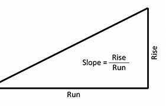
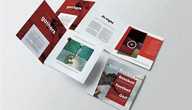
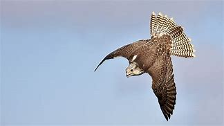
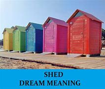
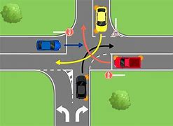

= 托福(新东方) 1501-2000
:toc: left
:toclevels: 3
:sectnums:

'''

==== ▸ barrel  [1501]   +
な/ˈbærəl/   +

【N-COUNT】   A _barrel_ is a large, round container for liquids or food. 桶   +
⇒  The wine is aged for almost a year in oak barrels.  这葡萄酒在橡木桶里陈了将近一年。   +

【N-COUNT】   In the oil industry, a _barrel_ is a unit of measurement equal to 42 gallons (159 litres). 桶 (石油计量单位，等于42 加仑或159升)   +
⇒  In 1989, Kuwait was exporting 1.5 million barrels of oil a day.  1989年，科威特每天出口150万桶石油。   +

【N-COUNT】   The _barrel_ of a gun is the tube through which the bullet moves when the gun is fired. 枪管; 炮管   +
⇒  He pushed the barrel of the gun into the other man's open mouth.  他把枪管插入另一个人张开着的嘴里。   +

【V-I】   If a vehicle or person _is barrelling_ in a particular direction, they are moving very quickly in that direction. 高速行驶   +
⇒  The car was barrelling down the street at a crazy speed.  汽车沿着街道发疯一般地高速行驶。   +

【PHRASE】   If you say, for example, that someone moves or buys something _lock, stock, and barrel_, you are emphasizing that they move or buy every part or item of it. 完全   +
⇒  They received a verbal offer to buy the company lock, stock and barrel.  他们收到全盘收购公司的口头承诺。   +

---

==== ▸ motive  [1502]   +
な/ˈməʊtɪv/   +

【N-COUNT】   Your _motive_ for doing something is your reason for doing it. 动机   +
⇒  Police have ruled out robbery as a motive for the killing.  警方已排除了抢劫是杀人的动机。   +

---

==== ▸ allure  [1503]   +
な/əˈljʊə/   +
--> allure = al（=ad，去）+ lure（诱饵）→用诱饵引诱→引诱、诱惑 +

【N-UNCOUNT】   The _allure_ of something or someone is the pleasing or exciting quality that they have. 魅力   +
⇒  It's a game that has really lost its allure.  这是一场已经真正失去其魅力的比赛。   +

---

==== ▸ auction  [1504]   +
な/ˈɔːkʃən/   +
--> auction = auc（增大）+tion（名词后缀）→价格逐渐增大的过程→拍卖  +

【N-VAR】   An _auction_ is a public sale where items are sold to the person who offers the highest price. 拍卖   +
⇒  The painting is expected to fetch up to $400,000 at auction.  这幅画预计在拍卖会上能卖到40万美元。   +

【V-T】   If something _is auctioned_, it is sold in an auction. 被拍卖   +
⇒  Eight drawings by French artist Jean Cocteau will be auctioned next week.  法国艺术家让·科克托的8幅画作将在下周拍卖。   +

---

==== ▸ premise  [1505]   +
な/ˈprɛmɪs/   +
--> 来自拉丁语premissa,前提，假设，在前面的论断，来自pre-,在前，早于，-miss,送出，提出，词源同mission,emit.在法律文件中意为前面陈述之事，描述物，通常指土地或房屋，因而引申该词义。 +

【N-PLURAL】   The _premises_ of a business or an institution are all the buildings and land that it occupies in one place. 经营场所; 办公场所   +
⇒  There is a kitchen on the premises.  营业场所内有一个厨房。   +

【N-COUNT】   A _premise_ is something that you suppose is true and that you use as a basis for developing an idea. 前提   +
⇒  The premise is that schools will work harder to improve if they must compete.  前提是各学校如必须竞争就会更加努力改进。   +

---

==== ▸ mosaic  [1506]   +
な/məˈzeɪɪk/   +

【N-VAR】   A _mosaic_ is a design which consists of small pieces of coloured glass, pottery, or stone set in concrete or plaster. 马赛克   +
⇒  ...a Roman villa which once housed a fine collection of mosaics.  …一座曾藏有一批精美的马赛克收藏品的罗马别墅。   +

---

==== ▸ conceivable  [1507]   +
な/kənˈsiːvəbəl/   +

【ADJ】   If something is _conceivable_, you can imagine it or believe it. 可想像的; 可相信的   +
⇒  Without their support, the project would not have been conceivable.  若没有他们的支持，这个项目是无法想像的。   +

---

==== ▸ convince  [1508]   +
な/kənˈvɪns/   +

【V-T】   If someone or something _convinces_ you _to_ do something, they persuade you to do it. 说服   +
⇒  That weekend in Plattsburgh, *he convinced her to go ahead 着手做,进行* and marry Bud.  在普拉茨堡的那个周末，他说服了她嫁给巴德。   +

【V-T】   If someone or something _convinces_ you _of_ something, they make you believe that it is true or that it exists. 使信服   +
⇒  *Although I soon convinced him of my innocence*, I think he still has serious doubts about my sanity 精神健全；神志正常.  /尽管我很快就使他相信我是清白的，但是他还是非常怀疑我精神是否正常。   +

---

==== ▸ slope  [1509]   +
な/sləʊp/   +
--> 来自辅音丛 sl-,滑的，滑动的，词源同 slip,slide.引申比喻义斜坡，陡坡等。 +

【N-COUNT】   A _slope_ is the side of a mountain, hill, or valley. (山丘或山谷的) 斜坡   +
⇒  Saint-Christo is perched on a mountain slope.  圣克里斯托坐落在山坡上。   +

【N-COUNT】   A _slope_ is a surface that is at an angle, so that one end is higher than the other. 斜面   +
⇒  The street must have been on a slope.  那条街一定是一直在一个斜坡上。   +

【V-I】   If a surface _slopes_, it is at an angle, so that one end is higher than the other. 倾斜   +
⇒  The bank sloped down sharply to the river.  那座堤岸陡峭地朝着那条河倾斜下去。   +

【ADJ】   倾斜的   +
⇒  ...a brick building, with a sloping roof.  …一幢斜顶的砖建筑。   +

【V-I】   If something _slopes_, it leans to the right or to the left rather than being upright. 歪斜   +
⇒  The writing sloped backwards.  那字迹向后斜了。   +

【N-COUNT】   The _slope_ of something is the angle at which it slopes. 斜度; 坡度   +
⇒  The slope increases as you go up the curve.  你顺着那条弯路往上走，坡度越来越大。   +

---

==== ▸ overgraze  [1510]   +
な/ˌəʊvəˈɡreɪz/   +
-->  over-,超过，过度，graze,放牧，词源同grass. +

【V】   to graze (land) beyond its capacity to sustain stock (土地)过度放牧   +

---

==== ▸ bacon  [1511]   +
な/ˈbeɪkən/   +

【N-UNCOUNT】  _Bacon_ is salted or smoked meat which comes from the back or sides of a pig. 腌猪肉; 熏猪肉   +
⇒  ...*bacon and eggs*.  …腌猪肉和鸡蛋。   +

---

==== ▸ subordinate  [1512]   +
な【N-COUNT】   If someone is your _subordinate_, they have a less important position than you in the organization that you both work for. 下级   +
⇒  Haig tended not to seek guidance from subordinates.  黑格不想向下属们寻求指导。   +

【ADJ】   Someone who is _subordinate to_ you has a less important position than you and has to obey you. 下级的   +
⇒  Sixty of his subordinate officers followed his example.  他的60个下级官员都以他为榜样。   +

【ADJ】   Something that is _subordinate to_ something else is less important than the other thing. 次要的; 从属的   +
⇒  It was an art in which words were subordinate to images.  它是一种语言比图像次要的艺术。   +

【V-T】   If you _subordinate_ something _to_ another thing, you regard it or treat it as less important than the other thing. 使从属于; 把…列于次要地位   +
⇒  He was both willing and able to subordinate all else to this aim.  他既愿意也能够让别的一切从属于这个目标。   +

【N-UNCOUNT】   从属; 次要   +
⇒  ...the social subordination of women.  …妇女们的社会从属地位。   +

---

==== ▸ ductile  [1513]   +
な/ˈdʌktaɪl/   +
--> 来自duct, 导管，管道。 +

【ADJ】   (of a metal, such as gold or copper) able to be drawn out into wire (金、铜等金属)可延伸的   +

---

==== ▸ along  [1514]   +
な/əˈlɒŋ/   +

【PREP】   If you move or look _along_ something such as a road, you move or look toward one end of it. 沿着   +
⇒  Pedro walked along the street alone.  佩德罗独自一人沿着这条街走。   +
⇒  The young man led Mark Ryle along a corridor.  那个青年男子带着马克·赖尔沿着一条走廊走。   +

【PREP】   If something is situated _along_ a road, river, or corridor, it is situated in it or beside it. 在…里; 在…边上   +
⇒  ...enormous traffic jams all along the roads.  …各条道路上严重的交通堵塞。   +

【ADV】   When someone or something moves _along_, they keep moving in a particular direction. 向前地   +
⇒  She skipped and danced along.  她向前蹦跳着、舞蹈着。   +
⇒  He raised his voice a little, talking into the wind as they walked along.  当他们向前走时, 他提高了一点儿嗓门, 迎风讲着话。   +

【ADV】   If you say that something is going _along_ in a particular way, you mean that it is progressing in that way. 一直   +
⇒  ...the negotiations which have been dragging along interminably.  …这场一直以来无限地拖沓着的谈判。   +

【ADV】   If you take someone or something _along_ when you go somewhere, you take them with you. 一起地   +
⇒  This is open to women of all ages, so bring along your friends and colleagues.  这对所有年龄的妇女开放，所以带你的朋友和同事一起来。   +

【ADV】   If someone or something is coming _along_ or is sent _along_, they are coming or being sent to a particular place. 与“来”或“去”搭配，表示来或去某一地方   +
⇒  She invited everyone she knew to come along.  她邀请了所有认识的人过来。   +

【PHRASE】   You use _along with_ to mention someone or something else that is also involved in an action or situation. 同…一起   +
⇒  The baby's mother escaped from the fire along with two other children.  这个婴儿的母亲和其他两个孩子一起从火里逃了出来。   +

【PHRASE】   If something has been true or been present _all along_, it has been true or been present throughout a period of time. 一直   +
⇒  I've been fooling myself all along.  我一直在骗我自己。   +

---

==== ▸ brace  [1515]   +
な/breɪs/   +

【V-T】   If you _brace yourself for_ something unpleasant or difficult, you prepare yourself for it. 准备 (面对不愉快或困难之事)   +
⇒  He braced himself for the icy plunge into the black water.  他准备跳入冰冷的黑水。   +

【V-T】   If you _brace yourself against_ something or _brace_ part of your body _against_ it, you press against something in order to steady your body or to avoid falling. 抵住   +
⇒  Elaine braced herself against the dresser and looked in the mirror.  伊莱恩身体抵住梳妆台，照了照镜子   +

【V-T】   If you _brace_ your shoulders or knees, you keep them stiffly in a particular position. 绷紧 (肩或膝盖)   +
⇒  He braced his shoulders defiantly as another squall of wet snow slashed across his face.  当又一阵雨雪呼啸着划过他的脸庞时，他毫无畏惧地绷紧双肩。   +

【V-T】   To _brace_ something means to strengthen or support it with something else. 支撑   +
⇒  Overhead, the lights showed the old timbers, used to brace the roof.  在头顶上，光线照射出支撑屋顶的旧木头。   +

【N-COUNT】   A _brace_ is a device attached to a part of a person's body, for example, to a weak leg, in order to strengthen or support it. 支架   +
⇒  He wore leg braces after he had polio in childhood.  小时候患小儿麻痹症后，他使用了腿部支架。   +

【N-PLURAL】  _Braces_ are a metal device that can be fastened to a person's teeth in order to help them grow straight. 牙箍   +
⇒  I used to have to wear braces.  我以前不得不戴牙箍。   +

【N-COUNT】  [美国英语]   +

【N-PLURAL】  _Braces_ are a pair of straps that pass over your shoulders and fasten to your trousers at the front and back in order to stop them from falling down. (裤子的) 背带   +

---

==== ▸ varied  [1516]   +
な/ˈvɛərɪd/   +

【ADJ】   Something that is _varied_ consists of things of different types, sizes, or qualities. 各种各样的   +
⇒  It is essential that *your diet is varied and balanced*.  重要的是你的饮食应当是多样而平衡的。   +

---

==== ▸ fiber = fibre [1517]   +
な/ˈfaɪbə/   +
1.[ U] the part of food that helps to keep a person healthy by keeping the bowels working and moving other food quickly through the body （食物中的）纤维素 +
SYN roughage +
=> *dietary fibre* 饮食纤维素 +
=> Dried fruits *are especially high in fibre* . 干水果的纤维素含量尤其高。 +
=> *a high-/low-fibre diet* 纤维素含量高╱低的饮食 +

2.[ CU] a material such as cloth or rope that is made from a mass of natural or artificial threads （织物或绳等的）纤维制品 +
=> nylon and other *man-made fibres* 尼龙和其他人造纤维制品 +

3.[ C] one of the many thin threads that form body tissue , such as muscle, and natural materials, such as wood and cotton （人或动物身体组织及天然物质的）纤维 +
=> *cotton/wood/nerve/muscle fibres* 棉╱木╱神经╱肌肉纤维 +

( literary) +
=> *She loved him with every fibre of her being*. 她一心一意地爱他。  +

---

==== ▸ raise  [1518]   +
な/reɪz/   +

【V-T】   If you _raise_ something, you move it so that it is in a higher position. 举起   +
⇒  *He raised his hand* to wave.  他举起手来挥动。   +
⇒  Milton *raised the glass to his lips*.  米尔顿举起杯子放到嘴唇边。   +

【V-T】   If you _raise_ a flag, you display it by moving it up a pole or into a high place where it can be seen. 升起   +
⇒  *They had raised the white flag* in surrender.  他们已经升起白旗投降。   +

【V-T】   If you _raise yourself_, you lift your body so that you are standing up straight, or so that you are no longer lying flat. 站立; 起身   +
⇒  *He raised himself into a sitting position*.  他起身坐了起来。   +

【V-T】   If you _raise_ the rate or level of something, you increase it. 增加   +
⇒  The Federal Reserve Board *is expected to raise interest rates*.  联邦储备委员会预计将增加利率。   +

【V-T】   To _raise_ the standard of something means to improve it. 提高 (水平)   +
⇒  ...a new drive *to raise standards of literacy* in New York's schools.  …一场提高纽约各学校文化程度的新运动。   +

【V-T】   If you _raise_ your _voice_, you speak more loudly, usually because you are angry. (常指因生气) 提高 (嗓门)   +
⇒  *Don't you raise your voice to me*!  别对我高声大气！   +

【N-COUNT】   A _raise_ is an increase in your wages or salary. 加薪   +

【V-T】   If you _raise_ money _for_ a charity or an institution, you ask people for money which you collect on its behalf. 筹募 (资金)   +
⇒  ...events *held to raise money for* flood victims.  …为水患灾民募捐而举行的活动。   +

【V-T】   If a person or company _raises_ money that they need, they manage to get it, for example by selling their property or by borrowing. 筹措 (资金)   +
⇒  *They raised the money* to buy the house and two hundred acres of land.  他们筹措了资金来购买房子和200英亩土地。   +

【V-T】   If an event _raises_ a particular emotion or question, it makes people feel the emotion or consider the question. 唤起; 引发   +
⇒  *The agreement has raised hopes that* the war may end soon.  合约唤起了战争也许很快会结束的希望。   +

【V-T】   If you _raise_ a subject, an objection, or a question, you mention it or bring it to someone's attention. 提出   +
⇒  He had been consulted and *had raised no objections*.  他已经被征询意见，并没有提出异议。   +

【V-T】   Someone who _raises_ a child takes care of it until it is grown up. 抚养   +
⇒  My mother was an amazing woman. *She raised four of us kids virtually singlehandedly*.  我母亲是个了不起的女人。她几乎是独自抚养大了我们4个孩子。   +

【V-T】   If someone _raises_ a particular type of animal or crop, they breed that type of animal or grow that type of crop. 饲养; 种植   +
⇒  *He raises 2,000 acres of* wheat and hay.  他种植了2000英亩的小麦和饲料用草。   +

---

==== ▸ brush  [1519]   +
な/brʌʃ/   +

【N-COUNT】   A _brush_ is an object that has a large number of bristles or hairs fixed to it. You use brushes for painting, for cleaning things, and for making your hair neat. 画笔; 刷子   +
⇒  We gave him paint and brushes.  我们给了他颜料和画笔。   +
⇒  Stains are removed with buckets of soapy water and scrubbing brushes.  污点用一桶桶的肥皂水和擦洗的刷子除掉了。   +

【V-T】   If you _brush_ something or _brush_ something such as dirt off it, you clean it or make it neat using a brush. 刷; 梳理   +
⇒  Have you brushed your teeth?  你刷过牙了吗？   +
⇒  She brushed the powder out of her hair.  她把粉末从头发中梳掉。   +

【N-SING】  _Brush_ is also a noun. 刷; 梳理   +
⇒  I gave it a quick brush with my hairbrush.  我用发刷对它进行了一番迅速的梳理。   +

【V-T】   If you _brush_ something _with_ a liquid, you apply a layer of that liquid using a brush. 用…涂刷   +
⇒  Brush the dough with beaten egg yolk.  在生面团上刷一层打好的蛋黄。   +

【V-T】   If you _brush_ something somewhere, you remove it with quick light movements of your hands. (用手) 轻轻拭去   +
⇒  He brushed his hair back with both hands.  他用双手把头发轻轻地捋到后面去。   +
⇒  She brushed away tears as she spoke of him.  她在谈起他的时候轻轻拭去眼泪。   +

【V-T/V-I】   If one thing _brushes against_ another or if you _brush_ one thing _against_ another, the first thing touches the second thing lightly while passing it. 轻轻擦过   +
⇒  Something brushed against her leg.  有什么东西轻轻从她腿上擦过。   +
⇒  I felt her dark brown hair brushing the back of my shoulder.  我感觉到她深褐色的头发轻轻拂过我的肩后。   +

【N-COUNT】   If you have a _brush with_ a particular situation, usually an unpleasant one, you almost experience it. 擦肩而过   +
⇒  ...the trauma of a brush with death.  …与死神擦肩而过后的创伤。   +

【N】   the bushy tail of a fox, often kept as a trophy after a hunt, or of certain breeds of dog (作为狩猎战利品的)狐狸尾巴; 某些品种的狗的尾巴   +

【N-UNCOUNT】  _Brush_ is an area of rough open land covered with small bushes and trees. You also use _brush_ to refer to the bushes and trees on this land. 灌木丛地带; 灌木丛   +
⇒  ...the brush fire that destroyed nearly 500 acres.  …烧毁了近五百英亩的灌木丛火灾。   +

---

==== ▸ delineate  [1520]   +
な/dɪˈlɪnɪˌeɪt/   +
--> de-, 向下，强调。line, 线，线条。即画线，描绘。 +

【V-T】   If you _delineate_ something such as an idea or situation, you describe it or define it, often in a lot of detail. 描述   +
⇒  Biography must to some extent delineate characters.  在某种程度上，传记一定要描述人物。   +

【V-T】   If you _delineate_ a border, you say exactly where it is going to be. 划定   +
⇒  ...an agreement to delineate the border.  ...划定边界的一项协议。   +

---

==== ▸ simile  [1521]   +
な/ˈsɪmɪlɪ/   +
--> 来自 similis,相似的，词源同 similar.用于语言学 指明喻，直喻。 +

【N-COUNT】   A _simile_ is an expression which describes a person or thing as being similar to someone or something else. For example, the sentences "She runs like a deer" and "He's as white as a sheet" contain similes. 明喻   +
=> *simile and metaphor* 比喻明喻和暗喻 +

---

==== ▸ validate  [1522]   +
な/ˈvælɪˌdeɪt/   +

【V-T】   To _validate_ something such as a claim or statement means to prove or confirm that it is true or correct. 证实   +
⇒  This discovery seems to validate the claims of popular astrology.  这一发现似乎证实了流行占星术的一些观点。   +

【N-VAR】   确认   +
⇒  When we want validation for our decisions we often turn to friends for advice and approval.  当我们想要获得对我们的决定的确认时，我们经常向朋友们求得建议和认可。   +

【V-T】   To _validate_ a person, state, or system means to prove or confirm that they are valuable or worthwhile. 证实…有价值   +
⇒  The Academy Awards appear to validate his career.  这些奥斯卡金像奖看来证实了他的职业生涯的价值。   +

【N-VAR】   认可   +
⇒  I think the film is a validation of our lifestyle.  我想这部电影是对我们的生活方式的一种认可。   +

---

==== ▸ pamphlet  [1523]   +
な/ˈpæmflɪt/   +
--> pam-前缀“全”，-phl-即词根phil“爱”，如philosophy（哲学），本义为“为人人所爱”。 +

【N-COUNT】   A _pamphlet_ is a very thin book with a paper cover that gives information about something. 小册子   +
⇒  ...a pamphlet about smoking.  …一本关于吸烟的小册子。   +

---

==== ▸ extinguish  [1524]   +
な/ɪkˈstɪŋɡwɪʃ/   +
-->  ex-出 + -stingu-(s略)扑灭 + -ish动词词尾 +

【V-T】   If you _extinguish_ a fire or a light, you stop it from burning or shining. 使熄灭   +
⇒  It took about 50 minutes *to extinguish the fire*.  扑灭那场大火花了约五十分钟。   +

【V-T】   If something _extinguishes_ a feeling or idea, it destroys it. 使破灭; 消除   +
⇒  *The message extinguished her hopes of* Richard's return.  这消息使她对理查德返回的希望破灭了。   +

---

==== ▸ participant  [1525]   +
な/pɑːˈtɪsɪpənt/   +

【N-COUNT】   The _participants_ in an activity are the people who take part in it. 参加者   +
⇒  *40 of the course participants* are offered  提供（东西或机会）；供应 employment with the company.  参加课程学习的人中有40名得到了在该公司工作的机会。   +

---

==== ▸ minimal  [1526]   +
な/ˈmɪnɪməl/   +

【ADJ】   Something that is _minimal_ is very small in quantity, value, or degree. 尽可能少的; 最低限度的   +
⇒  *The cooperation* between the two *is minimal*.  两者之间的合作是最低程度的。   +

---

==== ▸ piracy  [1527]   +
な/ˈpaɪrəsɪ/   +
--> 来自pirate,海盗，-acy,行为后缀。引申词义盗版，剽窃。 +

【N-UNCOUNT】  _Piracy_ is robbery at sea carried out by pirates. 海盗行为   +
⇒  Seven of the fishermen *have been formally charged with piracy*.  其中7名渔民已被正式指控犯有海盗罪。   +

【N-UNCOUNT】   You can refer to the illegal copying of things such as DVDs and computer programs as _piracy_. 盗版行为   +
⇒  ...*protection against piracy of books*, films, and other intellectual property.  …对书籍、影片以及其他知识产权免遭侵权的保护。   +

---

==== ▸ plaudit  [1528]   +

(n.)喝彩；赞美

---

==== ▸ gem  [1529]   +
な/dʒɛm/   +

【N-COUNT】   A _gem_ is a jewel or stone that is used in jewellery. 宝石   +
⇒  The mask is formed of a gold-platinum alloy inset with emeralds and other gems.  这张面具是由黄金和白金的合金制成，并镶嵌翡翠和其他宝石。   +

【N-COUNT】   If you describe something or someone as a _gem_, you mean that they are especially pleasing, good, or helpful. 珍品   +
⇒  ...a gem of a hotel, Castel Clara.  …卡斯特尔·克拉拉酒店，酒店中的明珠。   +

---

==== ▸ simultaneous  [1530]   +
な/ˌsɪməlˈteɪnɪəs/   +

【ADJ】   Things which are _simultaneous_ happen or exist at the same time. 同时的   +
⇒  ...the simultaneous release of the book and the CD.  …书与激光唱片的同时发行。   +

【ADV】   同时地   +
⇒  The two guns fired almost simultaneously.  两支枪几乎同时开火。   +

---

==== ▸ falcon  [1531]   +
な/ˈfɔːlkən/   +

【N-COUNT】   A _falcon_ is a bird of prey that can be trained to hunt other birds and animals. 猎鹰   +

---

==== ▸ attorney  [1532]   +
な/əˈtɜːnɪ/   +
--> 前缀at-同ad-. -torn同turn, 转。转向顾客的，代表当事人利益的人。 +

【N-COUNT】   In the United States, an _attorney_ or _attorney-at-law_ is a lawyer. 律师   +
⇒  ...*a prosecuting 起诉；控告；检举 attorney*.  …一位公诉律师。   +
⇒  At the hearing, *her attorney did not enter a plea*.  在听证会上，她的律师没有提出申诉。   +

---

==== ▸ obliterate  [1533]   +
な/əˈblɪtəˌreɪt/   +
--> 来自oblino,涂抹，抹掉，-t,过去分词缀。来自ob-,相对，对着的，-lino,涂抹，词源同liniment,delete.拼写受letter,literal影响。 +

【V-T】   If something _obliterates_ an object or place, it destroys it completely. 摧毁   +
⇒  Their warheads *are enough to obliterate the world several times over*.  他们的弹头足以摧毁这个世界好几次。   +

【N-UNCOUNT】   摧毁   +
⇒  ...*the obliteration of* three isolated rainforests.  …3处孤立雨林的毁灭。   +

【V-T】   If you _obliterate_ something such as a memory, emotion, or thought, you remove it completely from your mind. (从头脑中) 抹掉   +
⇒  There was time enough to obliterate memories of how things once were for him.  有足够的时间来抹掉他对过去的记忆。   +

---

==== ▸ panic  [1534]   +
な/ˈpænɪk/   +

【N-VAR】  _Panic_ is a very strong feeling of anxiety or fear that makes you act without thinking carefully. 惊慌   +
⇒  An earthquake has hit the capital, causing damage to buildings and panic among the population.  一场地震袭击了首都，造成建筑物的损坏和人们的惊慌。   +

【N-UNCOUNT】  _Panic_ or _a panic_ is a situation in which people are affected by a strong feeling of anxiety. 恐慌局面   +
⇒  There was a moment of panic as it became clear just how vulnerable the nation was.  随着国家如此脆弱变得明显，出现了一阵恐慌局面。   +
⇒  I'm in a panic about getting everything done in time.  我处于一阵要把一切及时安排就绪的恐慌中。   +

【V-T/V-I】   If you _panic_ or if someone _panics_ you, you suddenly feel anxious or afraid, and act quickly and without thinking carefully. 使惊慌; 惊慌   +
⇒  Guests panicked and screamed when the bomb exploded.  炸弹爆炸的时候，客人们惊慌失措，惊声尖叫。   +
⇒  The unexpected and sudden memory briefly panicked her.  这突如其来的记忆使她一时惊慌失措。   +

---

==== ▸ scruple  [1535]   +
な/ˈskruːpəl/   +
--> 鞋内的一粒小小石子都会让人觉得十分难受，在拉丁语中表示“小石子”的词是scrupulus. scrupulus一词就被古罗马著名演讲家、政治家和思想家西塞罗用来比喻“良心不安、顾虑”。 +

【N-VAR】  _Scruples_ are moral principles or beliefs that make you unwilling to do something that seems wrong. 道德良知   +
⇒  ...a man *with no moral scruples*.  …一个毫无道德良知的男人。   +

---

==== ▸ beneficent  [1536]   +
な/bɪˈnɛfɪsənt/   +

【ADJ】   A _beneficent_ person or thing helps people or results in something good. 有益的   +
⇒  ...optimism about *the beneficent effects of new technology*.  ...对新技术带来有益成效表示乐观。   +

---

==== ▸ brochure  [1537]   +
な/ˈbrəʊʃjʊə/   +

【N-COUNT】   A _brochure_ is a thin magazine with pictures that gives you information about a product or service. 小册子   +
⇒  ...*travel brochures*.  …旅游小册子。   +

---

==== ▸ personality  [1538]   +
な/ˌpɜːsəˈnælɪtɪ/   +

【N-VAR】   Your _personality_ is your whole character and nature. 性格; 品性   +
⇒  She has such a kind, friendly personality.  她有着如此友善的性格。   +
⇒  The contest was *as much* about personalities *as* it was about politics.  这次竞赛既比政治策略，又比品质性格。   +

【N-VAR】   If someone has _personality_ or is _a personality_, they have a strong and lively character. (坚强、活泼的) 个性   +
⇒  ...a woman of great personality.  …一个很有个性的女人。   +

【N-COUNT】   You can refer to a famous person, especially in entertainment, broadcasting, or sports, as a _personality_. (尤指娱乐、广播、体育界) 名人   +
⇒  ...the radio and television personality, Johnny Carson.  …广播电视名人约翰尼·卡森。   +

---

==== ▸ couple  [1539]   +
な/ˈkʌpəl/   +

【QUANT】   If you refer to _a couple of_ people or things, you mean two or approximately two of them, although the exact number is not important or you are not sure of it. 一两个; 几个   +
⇒  Across the street from me there are a couple of police officers standing guard.  我所在的街对面有一两个警察在站岗。   +
⇒  I think the trouble will clear up in a couple of days.  我想几天内麻烦就会消除。   +

【DET】  _Couple_ is also a determiner in spoken American English, and is often used before "more" and "less." 几个   +
⇒  ...a couple weeks before the election.  …选举前的几周。   +

【PRON】  _Couple_ is also a pronoun. 几个   +
⇒  I've got a couple that don't look too bad.  我有几个，看上去还不错。   +

【N-COUNT-COLL】   A _couple_ is two people who are married, living together, or having a sexual relationship. 一对夫妇   +
⇒  The couple have no children.  这对夫妇没有孩子。   +
⇒  Burglars ransacked an elderly couple's home.  窃贼们洗劫了一对老夫妇的家。   +

【N-COUNT-COLL】   A _couple_ is two people that you see together on a particular occasion or that have some association. (特定场合或有特定联系的) 一对人   +
⇒  ...as the four couples began the opening dance.  …随着4对舞伴跳起开场舞蹈。   +

【V-T】   If you say that one thing produces a particular effect when it _is coupled with_ another, you mean that the two things combine to produce that effect. 与…结合   +
⇒  ...a problem that is coupled with lower demand for the machines themselves.  …一个与对机器本身需求量减少连在一起的问题。   +

---

==== ▸ igneous  [1540]   +
な/ˈɪɡnɪəs/   +
-->  -ign-火 + -eous形容词词尾 +

【ADJ】   In geology, _igneous_ rocks are rocks that were once so hot that they were liquid. 火熔的; 火成的   +

---

==== ▸ vibrate  [1541]   +
な/vaɪˈbreɪt/   +

【V-T/V-I】   If something _vibrates_ or if you _vibrate_ it, it shakes with repeated small, quick movements. 使颤动; 颤动   +
⇒  The ground shook and the cliffs seemed to vibrate.  大地摇晃，那些悬崖似乎在颤动。   +

【N-VAR】   颤动   +
⇒  The vibrations of the vehicles rattled the shop windows.  那些车辆的颤动使得商店的窗户咯咯作响。   +

---

==== ▸ universe  [1542]   +
な/ˈjuːnɪˌvɜːs/   +

【N-COUNT】  _The universe_ is the whole of space and all the stars, planets, and other forms of matter and energy in it. 宇宙   +
⇒  Einstein's equations showed the universe to be expanding.  爱因斯坦的方程式表明宇宙正在扩大。   +

【N-COUNT】   If you talk about someone's _universe_, you are referring to the whole of their experience or an important part of it. (某人的) 经历   +
⇒  Good writers suck in what they see of the world, re-creating their own universe on the page.  好的作家吸收他们所看到的世界，在书里重新创造自己的世界。   +

---

==== ▸ utility  [1543]   +
な/juːˈtɪlɪtɪ/   +
-->  -util-用 + -ity名词词尾 +

【N-COUNT】   A _utility_ is an important service such as water, electricity, or gas that is provided for everyone, and that everyone pays for. 公用事业   +
⇒  ...public utilities such as gas, electricity and phones.  …煤气、电和电话等公用事业。   +

---

==== ▸ shed  [1544]   +
な/ʃɛd/   +

【N-COUNT】   A _shed_ is a small building that is used for storing things such as garden tools. (用于存放园艺工具等的) 棚屋   +
⇒  ...a garden shed.  …一个园艺工具棚。   +

【N-COUNT】   A _shed_ is a large shelter or building, for example, at a train station, port, or factory. (车站、港口、工厂等的) 棚式建筑   +
⇒  ...a vast factory shed.  …一座巨大的厂房。   +

【V-T】   When a tree _sheds_ its leaves, its leaves fall off in the autumn. When an animal _sheds_ hair or skin, some of its hair or skin drops off. 落 (叶); 脱 (发); 蜕 (皮)   +
⇒  Some of the trees were already beginning to shed their leaves.  有些树已经开始落叶了。   +

【V-T】   To _shed_ something means to get rid of it. 去除; 摆脱   +
⇒  The firm is to shed 700 jobs.  这个公司将裁掉700个工作岗位。   +

【V-T】   If you _shed_ tears, you cry. 落 (泪)   +
⇒  They will shed a few tears at their daughter's wedding.  他们在女儿的婚礼上会落些泪。   +

【V-T】   To _shed_ blood means to kill people in a violent way. If someone _sheds_ their blood, they are killed in a violent way, usually when they are fighting in a war. 洒 (热血)   +
⇒  ...young warriors, eager to shed blood.  …渴望洒热血的年轻武士们。   +

---

==== ▸ pictorial  [1545]   +
な/pɪkˈtɔːrɪəl/   +

【ADJ】  _Pictorial_ means using or relating to pictures. 图示的; 与图片有关的   +
⇒  ...a pictorial history of the Jewish people.  …一部犹太民族的图解历史。   +

---

==== ▸ parasite  [1546]   +
な/ˈpærəˌsaɪt/   +
--> 来自para-,在旁，在周围，sitos,食物 +

【N-COUNT】   A _parasite_ is a small animal or plant that lives on or inside a larger animal or plant, and gets its food from it. 寄生虫; 寄生植物   +
⇒  Kangaroos harbour a vast range of parasites.  袋鼠身上有各种各样的寄生虫。   +

【N-COUNT】   If you disapprove of someone because you think that they get money or other things from other people but do not do anything in return, you can call them a _parasite_. 靠他人为生的人; 寄生虫   +
⇒  ...a parasite, who produced nothing but lived on the work of others.  …一个什么都不做而靠他人的劳动为生的寄生虫。   +

---

==== ▸ interweave  [1547]   +
な/ˌɪntəˈwiːv/   +

【V-RECIP】   If two or more things _are interwoven_ or _interweave_, they are very closely connected or are combined with each other. 交织   +
⇒  For these people, land is inextricably interwoven with life itself.  对那些人来说，土地和生活本身紧密交织在一起。   +
⇒  Complex family relationships interweave with a murder plot in this ambitious new novel.  在这部构思大胆的新小说中，复杂的家庭关系与一个谋杀阴谋交织在一起。   +
⇒  The program successfully interweaves words and pictures.  该节目将文字和画面成功地交织在一起。   +
⇒  Social structures are not discrete objects; they overlap and interweave.  社会结构不是离散的客体；他们重叠并交织在一起。   +

---

==== ▸ onslaught  [1548]   +
な/ˈɒnˌslɔːt/   +
--> on,在上，向上，-slaught,攻击，屠杀，词源同slay,slaughter. +

【N-COUNT】   An _onslaught_ on someone or something is a very violent, forceful attack against them. 猛攻   +
⇒  The press launched another vicious onslaught on the president.  新闻界对这位总统进行了新一轮的恶毒抨击。   +

【N-COUNT】   If you refer to an _onslaught of_ something, you mean that there is a large amount of it, often so that it is very difficult to deal with. (常指难以应付的) 大量   +
⇒  ...the constant onslaught of ads on TV.  …电视上连续不断的大量广告。   +

---

==== ▸ forward  [1549]   +
な/ˈfɔːwəd/   +

【ADV】   If you move or look _forward_, you move or look in a direction that is in front of you. 向前 (移动、看)   +
⇒  He came forward with his hand out. "Mr. and Mrs. Selby?" he said.  他伸着手走上前来，“塞尔比先生和夫人吧？”他说。   +
⇒  She fell forward on to her face.  她脸着地向前摔倒了。   +

【ADV】  _Forward_ means in a position near the front of something such as a building or a vehicle. 靠前地   +
⇒  The best seats are in the aisle and as far forward as possible.  最好的座位在过道处尽可能靠前的地方。   +

【ADJ】  _Forward_ is also an adjective. 靠前的   +
⇒  Reinforcements were needed to allow more troops to move to forward positions.  需要增援以便让更多的部队推进至前沿阵地。   +

【ADV】   If you say that someone looks _forward_, you approve of them because they think about what will happen in the future and plan for it. (看) 向前地   +
⇒  Now the leadership wants to look forward, and to outline a strategy for the rest of the century.  现在领导层想要向前看，为本世纪余下的时间勾画一个战略框架。   +
⇒  People should forget and look forward.  人们应当忘记过去向前看。   +

【ADJ】  _Forward_ is also an adjective. 向前的   +
⇒  The university system requires more forward planning.  大学体制要求更具前瞻性的规划。   +

【ADV】   If you move a clock or watch _forward_, you change the time shown on it so that it shows a later time, for example, when the time changes to daylight saving time. (拨钟表) 向前地   +
⇒  When we put the clocks forward in March we go into daylight saving time.  当我们在3月份把钟向前拨以后，我们就进入了夏令时。   +

【ADV】   When you are referring to a particular time, if you say that something was true _from_ that time _forward_, you mean that it became true at that time, and continued to be true afterward. (从某时刻) 起   +
⇒  Velzquez's work from that time forward was confined largely to portraits of the royal family.  从那以后，委拉斯开兹的作品就很大程度上仅限于王室的肖像画了。   +

【ADV】   You use _forward_ to indicate that something progresses or improves. 向前 (进展、进步)   +
⇒  And by boosting economic prosperity in Mexico, Canada and the United States, it will help us move forward on issues that concern all of us.  而且通过推动墨西哥、加拿大和美国的经济繁荣，它将会帮助我们在解决与我们大家有关的问题上取得进展。   +
⇒  They just couldn't see any way forward.  他们就是看不到任何前进之路。   +

【ADV】   If something or someone is put _forward_, or comes _forward_, they are suggested or offered as suitable for a particular purpose. (呈、走) 上前; (提) 出来   +
⇒  Over the years several similar theories have been put forward.  多年来几种类似理论被提了出来。   +
⇒  Investigations have ground to a standstill because no witnesses have come forward.  调查已陷入一种停滞状态，因为没有证人出来作证。   +

【V-T】   If a letter or message _is forwarded to_ someone, it is sent to the place where they are, after having been sent to a different place earlier. 转发   +
⇒  When he's out on the road, office calls are forwarded to the cellular phone in his truck.  当他外出在路上时，打到办公室的电话便被转到他卡车中的移动电话上。   +

【N-COUNT】   In basketball, football, or hockey, a _forward_ is a player whose usual position is in the opponents' half of the field, and whose usual job is to attack or score goals. (篮球、足球、曲棍球等运动的) 前锋   +
⇒  Junior forward Sam McCracken added 14 points for the home team.  前锋小萨姆·麦克拉肯为主队添了14分。   +

---

==== ▸ brag  [1550]   +
な/bræɡ/   +
--> 拟声词。 +

【V-T/V-I】   If you _brag_, you say in a very proud way that you have something or have done something. 吹嘘说; 吹嘘   +
⇒  He's always bragging that he's a great martial artist.  他总是吹嘘说他是伟大的武术家。   +
⇒  He'll probably go around bragging to his friends.  他可能会到处去向他的朋友们吹嘘。   +
⇒  Winn bragged that he had spies in the department.  温吹嘘说他在这个部门里有密探。   +

---

==== ▸ educated  [1551]   +
な/ˈɛdjʊˌkeɪtɪd/   +

【ADJ】   Someone who is _educated_ has a high standard of learning. 受过良好教育的   +
⇒  The new CEO is an educated, amiable, and decent man.  新的首席执行官是一位受过良好教育、亲切、正派的人。   +

---

==== ▸ surplus  [1552]   +
な/ˈsɜːpləs/   +
--> sur-,在上，超过，plus,附加，加号。 +

【N-VAR】   If there is a _surplus of_ something, there is more than is needed. 过剩   +
⇒  ...countries where there is a surplus of labour.  …劳动力过剩的国家。   +

【ADJ】  _Surplus_ is used to describe something that is extra or that is more than is needed. 过剩的; 多余的   +
⇒  Few people have large sums of surplus cash.  几乎没人有大笔的闲钱。   +
⇒  I sell my surplus birds to a local pet shop.  我把我多余的鸟卖给一家当地的宠物店。   +

【N-COUNT】   If a country has a trade _surplus_, it exports more than it imports. 顺差   +
⇒  Japan's annual trade surplus is in the region of 100 billion dollars.  日本每年的贸易顺差约有一千亿美元。   +

【N-COUNT】   If a government has a budget _surplus_, it has spent less than it received in taxes. 盈余   +
⇒  Norway's budget surplus has fallen from 5.9% in 1986 to an expected 0.1% this year.  挪威的预算盈余已从1986年的5.9%下降到今年预计的0.1%。   +

---

==== ▸ alumnus  [1553]   +
な/əˈlʌmnəs/   +
--> 表示“某校的毕业生”的单词是alumnus（男毕业生）和alumna（女毕业生）。这两个单词都来自拉丁语，词根为alere（滋养、抚养）。这两个单词本来指的是因为被父母遗弃或其他原因而由其他家庭抚养长大的孩子。与alumnus和alumna同源的英语单词还有aliment（食物）、old（变老）、adolescent（青少年）。

【N-COUNT】   The _alumni_ of a school, college, or university are the people who used to be students there. 校友   +

---

==== ▸ intersection  [1554]   +
な/ˌɪntəˈsɛkʃən/   +

【N-COUNT】   An _intersection_ is a place where roads or other lines meet or cross. 道路交叉口; 交点   +
⇒  We crossed at a busy intersection.  我们穿过了一个繁忙的道路交叉口。   +

---

==== ▸ exhibit  [1555]   +
な/ɪɡˈzɪbɪt/   +

【V-T】   If someone or something shows a particular quality, feeling, or type of behaviour, you can say that they _exhibit_ it. 表现出   +
⇒  He has exhibited symptoms of anxiety and overwhelming worry.  他已表现出焦虑和忧心如焚的症状。   +

【V-T】   When a painting, sculpture, or object of interest _is exhibited_, it is put in a public place such as a museum or art gallery so that people can come to look at it. You can also say that animals _are exhibited_ in a zoo. 展览   +
⇒  His work was exhibited in the best galleries in America, Europe and Asia.  他的作品在美国、欧洲和亚洲最好的美术馆展览过。   +

【N-UNCOUNT】   展览   +
⇒  Five large pieces of the wall are currently on exhibition.  那堵墙的五块大碎片目前在展览。   +

【V-I】   When artists _exhibit_, they show their work in public. 展出作品   +
⇒  He has also exhibited at galleries and museums in New York and Washington.  他还在纽约和华盛顿的美术馆及博物馆展出过作品。   +

【N-COUNT】   An _exhibit_ is a painting, sculpture, or object of interest that is displayed to the public in a museum or art gallery. 展览品   +
⇒  Shona showed me around the exhibits.  肖纳带我参观了展品。   +

【N-COUNT】   An _exhibit_ is a public display of paintings, sculpture, or objects of interest in a museum or art gallery. 展览   +
⇒  ...an exhibit at the Metropolitan Museum of Art.  …大都会艺术博物馆的一场展览。   +

【N-COUNT】   An _exhibit_ is an object that a lawyer shows in court as evidence in a legal case. (法庭上出示的) 证物   +
⇒  The jury has already asked to see more than 40 exhibits from the trial.  陪审团已经要求查看了审判中超过40件的证物。   +

---

==== ▸ segment  [1556]   +
な/ˈsɛgmənt/   +

【N-COUNT】   A _segment of_ something is one part of it, considered separately from the rest. 部分   +
⇒  ...the poorer segments of society.  …社会中的较贫困阶层。   +

【N-COUNT】   A _segment_ of fruit such as an orange or grapefruit is one of the sections into which it is easily divided. (水果的) 瓣   +
⇒  Peel all the fruit except the lime and separate into segments.  除了酸橙之外，把所有的水果剥皮并分成瓣。   +

【N-COUNT】   A _segment_ of a circle is one of the two parts into which it is divided when you draw a straight line through it. 圆缺   +
⇒  The other children stood around the circle, one in each segment.  其他孩子围着圆圈而站,每一半圈里站着一个孩子。   +

---

==== ▸ invasion  [1557]   +
な/ɪnˈveɪʒən/   +

【N-VAR】   If there is an _invasion_ of a country, a foreign army enters it by force. 入侵   +
⇒  ...seven years after the Roman invasion of Britain.  …罗马人入侵大不列颠岛之后的7年。   +

【N-VAR】   If you refer to the arrival of a large number of people or things as an _invasion_, you are emphasizing that they are unpleasant or difficult to deal with. 大群涌入   +
⇒  ...this year's annual invasion of flies, wasps and ants.  …今年苍蝇、黄蜂和蚂蚁像往年一样的大量涌入。   +

【N-VAR】   If you describe an action as an _invasion_, you disapprove of it because it affects someone or something in a way that is not wanted. 侵扰   +
⇒  Is reading a child's diary always a gross invasion of privacy?  看孩子的日记在任何情况下都是严重侵犯隐私的行为吗？   +

---

==== ▸ tenement  [1558]   +
な/ˈtɛnəmənt/   +

【N-COUNT】   A _tenement_ is a large, old building which is divided into a number of individual apartments. 旧式公寓大楼   +
⇒  ...streets of low-cost tenements.  …低成本旧式公寓街。   +

【N-COUNT】   A _tenement_ is one of the apartments in a tenement. (公寓大楼里的) 公寓   +
⇒  He struggled to pay the rent on his $88 a month tenement.  他艰难地支付每月$88的公寓租金。   +

---

==== ▸ locate  [1559]   +
な/ləʊˈkeɪt/   +

【V-T】   If you _locate_ something or someone, you find out where they are. 找到   +
⇒  The scientists want to locate the position of the gene on a chromosome.  科学家们想找到该基因在染色体上的位置。   +

【V-T】   If you _locate_ something in a particular place, you put it there or build it there. 把…建在   +
⇒  Atlanta was voted the best city in which to locate a business by more than 400 chief executives.  亚特兰大被四百多位企业首席执行官投票选为建立公司的最佳城市。   +

【V-I】   If you _locate_ in a particular place, you move there or open a business there. 定居; 营业   +
⇒  ...tax breaks for businesses that locate in run-down neighbourhoods.  …对在衰落地段营业的公司的减税。   +

---

==== ▸ fume  [1560]   +
な/fjuːm/   +

【N-PLURAL】  _Fumes_ are the unpleasant and often unhealthy smoke and gases that are produced by fires or by things such as chemicals, fuel, or cooking. (难闻且常有害的) 烟气   +
⇒  ...car exhaust fumes.  …汽车尾气。   +

【V-T/V-I】   If you _fume_ over something, you express annoyance and anger about it. 表达气愤   +
⇒  "It's monstrous!" Jackie fumed.  “这太不像话了！”杰基表达了气愤。   +

---

==== ▸ recollection  [1561]   +
な/ˌrɛkəˈlɛkʃən/   +

【N-VAR】   If you have a _recollection of_ something, you remember it. 记忆   +
⇒  Pat has vivid recollections of the trip, and remembers some of the frightening aspects I had forgotten.  帕特对这次旅行的记忆生动清晰，他还记得一些我已经忘却的可怕的事情。   +

---

==== ▸ suspicious  [1562]   +
な/səˈspɪʃəs/   +

【ADJ】   If you are _suspicious of_ someone or something, you do not trust them, and are careful when dealing with them. 怀疑的   +
⇒  He was rightly suspicious of meeting me until I reassured him I was not writing about him.  他对于见我充满疑虑，直到我向他再次保证我不是在写有关他的东西。   +

【ADJ】   怀疑地   +
⇒  "What is it you want me to do?" Adams asked suspiciously.  “你要我去干的是什么？”亚当斯怀疑地问道。   +

【ADJ】   If you are _suspicious of_ someone or something, you believe that they are probably involved in a crime or some dishonest activity. 起疑心的   +
⇒  Two officers on patrol became suspicious of two men in a car.  两位巡警对一辆小汽车内的两名男子起了疑心。   +

【ADJ】   If you describe someone or something as _suspicious_, you mean that there is some aspect of them which makes you think that they are involved in a crime or a dishonest activity. 可疑的   +
⇒  He reported that two suspicious-looking characters had approached Callendar.  他报告说两名看似可疑的人曾靠近过卡兰德。   +

【ADV】   可疑地   +
⇒  They'll question them as to whether anyone was seen acting suspiciously in the area over the last few days.  他们将询问这些人过去几天是否在该地区发现行迹可疑的人。   +

---

==== ▸ march  [1563]   +
 辞典中没找到  +
==== ▸ oppose  [1564]   +
な/əˈpəʊz/   +

【V-T】   If you _oppose_ someone or _oppose_ their plans or ideas, you disagree with what they want to do and try to prevent them from doing it. 反对   +
⇒  Mr. Taylor was not bitter toward those who had opposed him.  泰勒先生并不仇恨那些曾经反对过他的人。   +

---

==== ▸ factor  [1565]   +
な/ˈfæktə/   +

【N-COUNT】   A _factor_ is one of the things that affects an event, decision, or situation. 因素   +
⇒  Physical activity is an important factor in maintaining fitness.  体育活动是保持健康的一个重要因素。   +

【N-COUNT】   If an amount increases by _a factor of_ two, for example, or by _a factor of_ eight, then it becomes two times bigger or eight times bigger. 倍数   +
⇒  The cost of butter quadrupled and bread prices increased by a factor of five.  黄油的价格是原来的4倍，面包的价格上涨了5倍。   +

【N-SING】   You can use _factor_ to refer to a particular level on a scale of measurement. 系数   +
⇒  A sunscreen with a protection factor of 30 allows you to stay in the sun without burning.  一种防护系数为30的防晒霜使你能够待在太阳底下而不被晒伤。   +

---

==== ▸ biologist  [1566]   +
 辞典中没找到  +
==== ▸ sluggish  [1567]   +
な/ˈslʌɡɪʃ/   +

【ADJ】   You can describe something as _sluggish_ if it moves, works, or reacts much slower than you would like or is normal. 缓慢的; 迟钝的   +
⇒  The economy remains sluggish.  经济保持缓慢发展。   +
⇒  Circulation is much more sluggish in the feet than in the hands.  血液循环在脚部要比在手部慢得多。   +

---

==== ▸ arrogant  [1568]   +
な/ˈærəɡənt/   +

【ADJ】   Someone who is _arrogant_ behaves in a proud, unpleasant way toward other people because they believe that they are more important than others. 傲慢的   +
⇒  He was so arrogant.  他是如此傲慢。   +
⇒  That sounds arrogant, doesn't it?  那听起来很傲慢，不是吗？   +

【N-UNCOUNT】   傲慢   +
⇒  At times the arrogance of those in power is quite blatant.  有时那些当权者的傲慢很露骨。   +

---

==== ▸ probe  [1569]   +
な/prəʊb/   +

【V-I】   If you _probe into_ something, you ask questions or try to discover facts about it. 调查; 探寻   +
⇒  The more they probed into his background, the more inflamed their suspicions would become.  他们越深入调查他的背景，对他的怀疑就会越强烈。   +
⇒  For three years, I have probed for understanding.  3年来我一直在寻求理解。   +

【N-COUNT】  _Probe_ is also a noun. 调查; 探寻   +
⇒  ...a federal grand-jury probe into corruption within the FDA.  …联邦大陪审团对食品及药品管理局内部腐败的一次调查。   +

【V-I】   If a doctor or dentist _probes_, he or she uses a long instrument to examine part of a patient's body. 用探针探查   +
⇒  The surgeon would pick up his instruments, probe, repair, and stitch up again.  外科医生会拿起器械进行探查、修复，然后再缝合。   +
⇒  Dr. Amid probed around the sensitive area.  阿米德医生在敏感部位周围做了探查。   +

【N-COUNT】   A _probe_ is a long thin instrument that doctors and dentists use to examine parts of the body. 探针   +
⇒  ...a fibre-optic probe.  …一根光纤探针。   +

【V-T】   If you _probe_ a place, you search it in order to find someone or something that you are looking for. 搜索   +
⇒  A flashlight beam probed the underbrush only yards away from their hiding place.  一束手电光搜索了离他们藏身之处仅几码远的低矮灌丛。   +

---

==== ▸ momentous  [1570]   +
な/məʊˈmɛntəs/   +

【ADJ】   If you refer to a decision, event, or change as _momentous_, you mean that it is very important, often because of the effects that it will have in the future. 重大的   +
⇒  ...the momentous decision to send in the troops.  …派兵的重大决定。   +

---

==== ▸ critic  [1571]   +
な/ˈkrɪtɪk/   +

【N-COUNT】   A _critic_ is a person who writes about and expresses opinions about things such as books, movies, music, or art. 评论家   +
⇒  Mather was a film critic for many years.  马瑟做过多年的电影评论家。   +

【N-COUNT】   Someone who is a _critic_ of a person or system disapproves of them and criticizes them publicly. 批评者   +
⇒  The newspaper has been one of the most consistent critics ever of the government.  该报纸是政府最坚持的批评者之一。   +

---

==== ▸ segregate  [1572]   +
な/ˈsɛɡrɪˌɡeɪt/   +

【V-T】   To _segregate_ two groups of people or things means to keep them physically apart from each other. 隔离; 分开   +
⇒  A large detachment of police was used to segregate the two rival camps of protesters.  一大队分遣警察被派来隔离两群敌对的抗议者。   +

---

==== ▸ intimate  [1573]   +
な【ADJ】   If you have an _intimate_ friendship with someone, you know them very well and like them a lot. 亲密的   +
⇒  I discussed with my intimate friends whether I would immediately have a baby.  我和我的密友们商量我是不是该马上要孩子。   +

【ADV】   亲密地   +
⇒  He did not feel he had got to know them intimately.  他觉得自己不必和他们亲密熟悉。   +

【ADJ】   If two people are in an _intimate_ relationship, they are involved with each other in a loving or sexual way. 有性关系的; 有恋爱关系的   +
⇒  ...their intimate moments with their boyfriends.  …她们和其男友们的私密时刻。   +

【ADV】   在私密方面   +
⇒  You have to be willing to get to know yourself and your partner intimately.  你必须乐意在私密方面逐渐了解自己和伴侣。   +

【ADJ】   An _intimate_ conversation or detail, for example, is very personal and private. 个人的; 私下的   +
⇒  He wrote about the intimate details of his family life.  他写下了家庭生活中一些私人的细节。   +

【ADV】   个人地; 私下地   +
⇒  It was the first time they had attempted to talk intimately.  这是他们第一次试图私下交谈。   +

【ADJ】   If you use _intimate_ to describe an occasion or the atmosphere of a place, you like it because it is quiet and pleasant, and seems suitable for close conversations between friends. 宁静怡人的   +
⇒  ...an intimate candlelit dinner for two.  …宁静怡人的一次二人烛光晚餐。   +

【ADJ】   An _intimate_ connection between ideas or organizations, for example, is a very strong link between them. 密切的   +
⇒  ...an intimate connection between madness and wisdom.  …疯狂和睿智之间的一种密切联系。   +

【ADV】   密切地   +
⇒  Scientific research and conservation are intimately connected.  科学研究与环境保护联系密切。   +

【ADJ】   An _intimate_ knowledge of something is a deep and detailed knowledge of it. 深刻的; 精通的   +
⇒  He surprised me with his intimate knowledge of Kierkegaard and Schopenhauer.  他对克尔恺郭尔和叔本华的深刻了解令我感到惊奇。   +

【ADV】   深刻地; 精通地   +
⇒  ...a golden age of musicians whose work she knew intimately.  …她熟知的那些音乐家们的一个黄金时代。   +

【N】   a close friend 密友   +

【V-T】   If you _intimate_ something, you say it in an indirect way. 暗示   +
⇒  He went on to intimate that he was indeed contemplating a shake-up of the company.  他接着暗示他确实在考虑对公司进行一次改组。   +

---

==== ▸ aloft  [1574]   +
な/əˈlɒft/   +

【ADV】   Something that is _aloft_ is in the air or off the ground. 在空中   +
⇒  He held the trophy proudly aloft.  他骄傲地把奖杯举向空中。   +

---

==== ▸ spiral  [1575]   +
な/ˈspaɪərəl/   +

【N-COUNT】   A _spiral_ is a shape which winds around and around, with each curve above or outside the previous one. 螺旋形   +
⇒  The maze is actually two interlocking spirals.  这个迷宫实际上是两个连锁的螺旋体。   +

【ADJ】  _Spiral_ is also an adjective. 螺旋形的   +
⇒  ...a spiral staircase.  …一段旋梯。   +

【V-T/V-I】   If something _spirals_ or _is spiralled_ somewhere, it grows or moves in a spiral curve. 使…螺旋式生长或移动; 螺旋式生长或移动   +
⇒  Vines spiralled upward toward the roof.  藤蔓螺旋式向上朝屋顶生长。   +
⇒  The aircraft began spiralling out of control.  那架飞机开始做螺旋式飞行，失去了控制。   +

【N-COUNT】  _Spiral_ is also a noun. 螺旋式运动   +
⇒  Larks were rising in spirals from the ridge.  云雀在从山脊上盘旋飞升。   +

【V-I】   If an amount or level _spirals_, it rises quickly and at an increasing rate. 加速上升   +
⇒  Production costs began to spiral.  生产成本开始加速上涨。   +
⇒  ...spiralling health care costs.  …加速上涨的各种保健费用。   +

【N-SING】  _Spiral_ is also a noun. 加速上升   +
⇒  ...an inflationary spiral.  …一次通胀性的激增。   +

【V-I】   If an amount or level _spirals_ downward, it falls quickly and at an increasing rate. 加速下降   +
⇒  House prices will continue to spiral downwards.  房价将继续加速下跌。   +

【N-SING】  _Spiral_ is also a noun. 加速下降   +
⇒  ...a spiral of debt.  …债务的加剧减少。   +

---

==== ▸ material  [1576]   +
な/məˈtɪərɪəl/   +

【N-VAR】   A _material_ is a solid substance. 固态物质   +
⇒  ...electrons in a conducting material such as a metal.  …金属等导电物质中的电子。   +

【N-MASS】  _Material_ is cloth. 布料   +
⇒  ...the thick material of her skirt.  …她裙子的厚布料。   +

【N-PLURAL】  _Materials_ are the things that you need for a particular activity. 材料   +
⇒  The builders ran out of materials.  建筑商用完了材料。   +

【N-UNCOUNT】   Ideas or information that are used as a basis for a book, play, or film can be referred to as _material_. 素材   +
⇒  In my version of the story, I added some new material.  在我这个版本的故事中，我添加了一些新素材。   +

【ADJ】  _Material_ things are related to possessions or money, rather than to more abstract things such as ideas or values. 物质的   +
⇒  Every room must have been stuffed with material things.  每个房间肯定已经堆满了东西。   +

【ADV】   物质上地   +
⇒  He has tried to help this child materially and spiritually.  他已经尽力在物质和精神上帮助这个孩子了。   +

【ADJ】  _Material_ evidence or information is directly relevant and important in a legal or academic argument. (法律或学术辩论中) 实质性的 (证据或信息)   +
⇒  The nature and availability of material evidence was not to be discussed.  关键证据的性质和有效性将不予以讨论。   +

---

==== ▸ haul  [1577]   +
な/hɔːl/   +

【V-T】   If you _haul_ something which is heavy or difficult to move, you move it using a lot of effort. (用力地) 拉   +
⇒  A crane had to be used to haul the car out of the stream.  不得不用了一台起重机把轿车从河里拉出来。   +

【V-T】   If someone _is hauled before_ a court or someone in authority, they are made to appear before them because they are accused of having done something wrong. 传讯   +
⇒  He was hauled before the managing director and fired.  他被总裁叫去问话并被解雇了。   +

【PHRASAL VERB】  _Haul up_ means the same as . 传讯   +
⇒  He was hauled up before the board of trustees.  他被带到了托管委员会面前问话。   +

【N-COUNT】   A _haul_ is a quantity of things that are stolen, or a quantity of stolen or illegal goods found by police or customs. 一次偷得之量; (警察或海关) 一次查获之量   +
⇒  The size of the drug haul shows that the international trade in heroin is still flourishing.  这次的毒品缴获量说明国际性海洛因交易依然猖獗。   +

【PHRASE】   If you say that a task or a journey is a _long haul_, you mean that it takes a long time and a lot of effort. 费时费力的工作   +
⇒  Revitalizing the Romanian economy will be a long haul.  复兴罗马尼亚经济将是一项长期艰巨的工作。   +

---

==== ▸ harbor  [1578]   +
 辞典中没找到  +
==== ▸ culpable  [1579]   +
な/ˈkʌlpəbəl/   +

【ADJ】   If someone or their conduct is _culpable_, they are responsible for something wrong or bad that has happened. 难辞其咎的   +
⇒  Their decision to do nothing makes them culpable.  他们不采取行动的决定使他们难辞其咎。   +
⇒  ...manslaughter resulting from culpable negligence.  ...由疏忽导致的过失杀人罪应受到处罚。   +

【N-UNCOUNT】  
   +
⇒  He added there was clear culpability on the part of the government.  他补充说政府方面明显负有责任。   +

---

==== ▸ vestige  [1580]   +
な/ˈvɛstɪdʒ/   +

【N-COUNT】   A _vestige of_ something is a very small part that still remains of something that was once much larger or more important. 残留部分; 遗迹   +
⇒  We represent the last vestige of what made this nation great – hard work.  我们代表了曾经使这个国家伟大的仅存的品质–勤奋。   +

---

==== ▸ girder  [1581]   +
な/ˈɡɜːdə/   +

【N-COUNT】   A _girder_ is a long, thick piece of steel or iron that is used in the framework of buildings and bridges. 大梁   +

---

==== ▸ sap  [1582]   +
な/sæp/   +

【V-T】   If something _saps_ your strength or confidence, it gradually weakens or destroys it. 消耗; 削弱   +
⇒  I was afraid the sickness had sapped my strength.  恐怕这场病已经消耗了我的力气。   +

【V-T】   to undermine (a fortification, etc) by digging saps 挖地道以摧毁(工事等)   +

【N-UNCOUNT】  _Sap_ is the watery liquid in plants and trees. (植物的) 汁液   +
⇒  The leaves, bark and sap are also common ingredients of local herbal remedies.  树叶、树皮和树液也是当地草药疗法的常用药材。   +

【N-COUNT】   a gullible or foolish person 容易上当的人   +

【N-COUNT】   energy; vigour 精力   +

【N-COUNT】   a deep and narrow trench used to approach or undermine an enemy position, esp in siege warfare 地道   +

---

==== ▸ artesian  [1583]   +
 辞典中没找到  +
==== ▸ draw  [1584]   +
な/drɔː/   +

【V-T/V-I】   When you _draw_, or when you _draw_ something, you use a pencil or pen to produce a picture, pattern, or diagram. 画   +
⇒  She would sit there drawing with the pencil stub.  她会坐在那儿用铅笔头画画。   +

【N-UNCOUNT】   画画   +
⇒  I like dancing, singing, and drawing.  我喜欢跳舞、唱歌和画画。   +
 ▷ draw   +
な/drɔː/   +

【N-UNCOUNT】     +

【V-I】   If you _draw_ somewhere, you move there slowly. 缓慢移动   +
⇒  She drew away and did not smile.  她慢步走开，面无笑容。   +

【V-T】   If you _draw_ something or someone in a particular direction, you move them in that direction, usually by pulling them gently. 轻拖; 轻拉   +
⇒  He drew his chair nearer the fire.  他把椅子轻轻拉近火边。   +
⇒  He put his arm around Caroline's shoulders and drew her close to him.  他把手臂搂在卡罗琳的肩膀上并且把她轻轻拉近自己。   +

【V-T】   When you _draw_ a curtain or blind, you pull it across a window, either to cover or to uncover it. 拉 (窗帘等)   +
⇒  After drawing the curtains, she lit a candle.  拉上窗帘后，她点了一根蜡烛。   +

【V-T】   If someone _draws_ a gun, knife, or other weapon, they pull it out of its container and threaten you with it. 拔出 (武器)   +
⇒  He drew his dagger and turned to face his pursuers.  他拔出匕首并且转过身去面对追他的人。   +

【V-I】   When a vehicle _draws_ somewhere, it moves there smoothly and steadily. 平稳地前进   +
⇒  Claire had seen the taxi drawing away.  克莱尔看着出租车缓缓驶走。   +

【V-T】   If you _draw_ a deep breath, you breathe in deeply once. 吸入   +
⇒  He paused, drawing a deep breath.  他停下，深吸了一口气。   +

【V-I】   If you _draw on_ a cigarette, you breathe the smoke from it into your mouth or lungs. 吸烟   +
⇒  He drew on an American cigarette.  他吸了一口美国香烟。   +

【V-T】   To _draw_ something such as water or energy _from_ a particular source means to take it from that source. 汲取 (水、能源等); 提取 (水、能源等)   +
⇒  Villagers still have to draw their water from wells.  村民仍然要从井里打水。   +

【V-T】   If something that hits you or presses part of your body _draws_ blood, it cuts your skin so that it bleeds. 抽 (血)   +
⇒  Any practice that draws blood could increase the risk of getting the virus.  任何形式抽血都能增加感染病毒的危险。   +

【V-T】   If you _draw_ money out of a bank account, you get it from the account so that you can use it. 提取 (钱款)   +
⇒  She was drawing out cash from an ATM.  她那时正在从自动取款机上取钱。   +

【V-T】   To _draw_ something means to choose it or to be given it, as part of a competition, game, or lottery. 抽 (奖); 抽 (签)   +
⇒  He put the pile of chips in the centre of the table and drew a card.  他把一堆筹码放在桌子中央，抽了一张牌。   +

【N-COUNT】  _Draw_ is also a noun. 抽奖; 抽签   +
⇒  ...the final draw for all prize winners takes place on March 17.  …最后一轮所有获奖者的抽签在3月17日举行。   +

【V-T】   To _draw_ something _from_ a particular thing or place means to take or get it from that thing or place. 取得   +
⇒  I draw strength from the millions of women who have faced this challenge successfully.  我从许许多多成功面对这种挑战的妇女身上获得了力量。   +

【V-T】   If something such as a film or an event _draws_ a lot of people, it is so interesting or entertaining that a lot of people go to it. 吸引   +
⇒  The game is currently drawing huge crowds.  这项比赛目前正吸引着大批群众。   +

【V-T】   If someone or something _draws_ you, it attracts you very strongly. 强烈吸引   +
⇒  In no sense did he draw and enthral her as Alex had done.  他远不如亚历克斯那么强烈地吸引她，让她着迷。   +
 ▷ draw   +
な/drɔː/   +

【V-T】     +

【V-T】   If you _draw_ a particular conclusion, you decide that that conclusion is true. 得出 (结论)   +
⇒  He draws two conclusions from this.  他由此得出两个结论。   +

【V-T】   If you _draw_ a comparison, parallel, or distinction, you compare or contrast two different ideas, systems, or other things. 作出 (比较); 加以 (区别)   +
⇒  ...literary critics drawing comparisons between George Sand and George Eliot.  …把乔治·桑和乔治·艾略特进行比较的文学评论家。   +

【V-T】   If you _draw_ someone's attention to something, you make them aware of it or make them think about it. 使注意   +
⇒  He was waving his arms to draw their attention.  他正挥动手臂吸引他们的注意力。   +

【V-T】   If someone or something _draws_ a particular reaction, people react to it in that way. 引起 (某种反应)   +
⇒  Such a policy would inevitably draw fierce resistance from farmers.  这样的政策将不可避免地引起农民的激烈抵制。   +

【V-RECIP】   In a game or competition, if one person or team _draws with_ another one, or if two people or teams _draw_, they have the same number of points or goals at the end of the game. (在游戏或竞赛中) 打平   +
⇒  Holland and the Republic of Ireland drew one-one.  荷兰队与爱尔兰队一比一平。   +
⇒  We drew with Ireland in the first game.  我们同爱尔兰队在第一局打成平局。   +

【N-COUNT】  _Draw_ is also a noun. 平局   +

【PHRASE】   When an event or period of time _draws to a close_ or _draws to an end_, it finishes. 结束   +
⇒  Another celebration had drawn to its close.  另一个庆典已经结束了。   +

【PHRASE】   If an event or period of time _is drawing closer_ or _is drawing nearer_, it is approaching. 来临; 临近   +
⇒  Next spring's elections are drawing closer.  下一个春季选举即将来临。   +

---

==== ▸ marked  [1585]   +
な/mɑːkt/   +

【ADJ】   A _marked_ change or difference is very obvious and easily noticed. 明显的   +
⇒  There has been a marked increase in crimes against property.  侵犯财产罪的数量有了明显的增加。   +

【ADV】   明显地   +
⇒  The current economic downturn is markedly different from previous recessions.  目前的经济衰退和以前的经济衰退明显不同。   +

---

==== ▸ bolster  [1586]   +
な/ˈbəʊlstə/   +

【V-T】   If you _bolster_ something such as someone's confidence or courage, you increase it. 增强   +
⇒  Hopes of an early cut in interest rates bolstered confidence.  提前降低利率的希望增强了信心。   +

【V-T】   If someone tries to _bolster_ their position in a situation, they try to strengthen it. 巩固   +
⇒  The country is free to adopt policies to bolster its economy.  这个国家可自由采取措施来巩固经济。   +

【N-COUNT】   A _bolster_ is a firm pillow shaped like a long tube which is sometimes put across a bed instead of pillows, or under the ordinary pillows. 长枕   +

---

==== ▸ latent  [1587]   +
な/ˈleɪtənt/   +

【ADJ】  _Latent_ is used to describe something which is hidden and not obvious at the moment, but which may develop further in the future. 潜在的   +
⇒  Advertisements attempt to project a latent meaning behind an overt message.  广告试图传达一种隐藏在公开信息里的潜在意义。   +

---

==== ▸ artifice  [1588]   +
な/ˈɑːtɪfɪs/   +

【N-VAR】  _Artifice_ is the clever use of tricks and devices. 巧计   +
⇒  Weegee's photographs are full of artfulness, and artifice.  维加的照片充满了奇技妙想。   +

---

==== ▸ assimilate  [1589]   +
な/əˈsɪmɪˌleɪt/   +

【V-T/V-I】   When people such as immigrants _assimilate into_ a community or when that community _assimilates_ them, they become an accepted part of it. 同化; 被同化   +
⇒  There is every sign that new Asian-Americans are just as willing to assimilate.  各种迹象表明新的亚裔美籍人简直一样愿意被同化。   +
⇒  His family tried to assimilate into the white and Hispanic communities.  他的家人努力融入到白人和拉美人社区。   +

【N-UNCOUNT】   同化   +
⇒  They promote social integration and assimilation of minority ethnic groups into the culture.  他们提倡少数民族团体与该文化的社会融合及同化。   +

【V-T】   If you _assimilate_ new ideas, customs, or techniques, you learn them or adopt them. 吸纳   +
⇒  My mind could only assimilate one impossibility at a time.  我的头脑一次只能吸纳一件不可能的事情。   +

【N-UNCOUNT】   吸纳   +
⇒  This technique brings life to instruction and eases assimilation of knowledge.  这种技术给教学带来活力，并使知识的吸收更加容易。   +

---

==== ▸ cube  [1590]   +
な/ˈkjuːb/   +

【N-COUNT】   A _cube_ is a solid object with six square surfaces which are all the same size. 立方体   +
⇒  ...cold water with ice cubes in it.  …加冰块的冷水。   +
⇒  ...a box of sugar cubes.  …一盒方糖。   +

【N-COUNT】  _The__cube__of_ a number is another number that is produced by multiplying the first number by itself twice. For example, the cube of 2 is 8. 立方   +

【V-T】   When you _cube_ food, you cut it into cube-shaped pieces. 将…切成方块   +
⇒  Remove the seeds and stones and cube the flesh.  去除籽和核，然后把果肉切成方块。   +

【V-T】   to raise (a number or quantity) to the third power 求…的立方   +

---

==== ▸ horde  [1591]   +
な/hɔːd/   +

【N-COUNT】   If you describe a crowd of people as a _horde_, you mean that the crowd is very large and excited and, often, rather frightening or unpleasant. (通常指熙攘纷扰的) 一大群人   +
⇒  This attracts hordes of tourists to Las Vegas.  这吸引了一群群的旅客来到拉斯维加斯。   +

---

==== ▸ narrative  [1592]   +
な/ˈnærətɪv/   +

【N-COUNT】   A _narrative_ is a story or an account of a series of events. 故事; 叙事   +
⇒  ...a fast-moving narrative.  …一个快节奏的叙事。   +

【N-UNCOUNT】  _Narrative_ is the description of a series of events, usually in a novel. (尤指小说中的) 记叙   +
⇒  Neither author was very strong on narrative.  两位作者在记叙方面都不强。   +

---

==== ▸ enthusiasm  [1593]   +
な/ɪnˈθjuːzɪˌæzəm/   +

【N-VAR】  _Enthusiasm_ is great eagerness to be involved in a particular activity that you like and enjoy or that you think is important. 热情   +
⇒  Their skill and enthusiasm has got them on the team.  他们的技术和热情使他们进了那支团队。   +

【N-COUNT】   An _enthusiasm_ is an activity or subject that interests you very much and that you spend a lot of time on. 热衷的活动; 喜爱的科目   +
⇒  Draw him out about his current enthusiasms and future plans.  让他畅谈一下他当前喜爱的科目和将来的打算。   +

---

==== ▸ potency  [1594]   +
な/ˈpəʊtənsɪ/   +

【N-UNCOUNT】  _Potency_ is the power and influence that a person, action, or idea has to affect or change people's lives, feelings, or beliefs. 影响力   +
⇒  All their songs have a lingering potency.  他们所有的歌曲都有挥之不去的影响力。   +

【N-UNCOUNT】   The _potency_ of a drug, poison, or other chemical is its strength. (毒品、药品等的) 效力   +
⇒  Sunscreen can lose its potency if left over winter in the bathroom cabinet.  防晒霜在盥洗室柜子里放置一个冬天后会失去效力。   +

---

==== ▸ staple  [1595]   +
な/ˈsteɪpəl/   +

【ADJ】   A _staple_ food, product, or activity is one that is basic and important in people's everyday lives. 基本的; 主要的 (食物、产品、活动)   +
⇒  Rice is the staple food of more than half the world's population.  大米是世界上半数以上人口的主食。   +
⇒  The Chinese also eat a type of pasta as part of their staple diet.  中国人也以一种面食作为他们的部分主食。   +

【N-COUNT】  _Staple_ is also a noun. 主食; 主要产品; 主要活动   +
⇒  Fish is a staple in the diet of many Africans.  鱼是许多非洲人饮食中的主食。   +

【N-COUNT】   A _staple_ is something that forms an important part of something else. 重要部分   +
⇒  Political reporting has become a staple of American journalism.  政治报道已经成为美国新闻业的一个重要内容。   +

【N-COUNT】  _Staples_ are small pieces of bent wire that are used mainly for holding sheets of paper together firmly. You put the staples into the paper using a device called a stapler. 订书钉   +

【V-T】   If you _staple_ something, you fasten it to something else or fix it in place using staples. 用订书钉订住   +
⇒  Staple some sheets of paper together into a book.  用订书钉把一些纸张订成一本。   +

---

==== ▸ repertory  [1596]   +
な/ˈrɛpətərɪ/   +

【N-UNCOUNT】   A _repertory_ company is a group of actors and actresses who perform a small number of plays for just a few weeks at a time. They work in a _repertory_ theatre. 保留剧目轮演   +
⇒  ...a well-known repertory company in Boston.  …波士顿一个著名的保留剧目轮演剧团。   +

---

==== ▸ aloof  [1597]   +
な/əˈluːf/   +

【ADJ】   Someone who is _aloof_ is not very friendly and does not like to spend time with other people. 冷淡的   +
⇒  He seemed aloof and detached.  他看起来冷淡且超然。   +

---

==== ▸ strand  [1598]   +
な/strænd/   +

【N-COUNT】   A _strand of_ something such as hair, wire, or thread is a single thin piece of it. (头发、电线或纱线的) 缕   +
⇒  She tried to blow a grey strand of hair from her eyes.  她试图吹开眼前的一缕白发。   +

【V-T】   If you _are stranded_, you are prevented from leaving a place, for example because of bad weather. 使滞留   +
⇒  The climbers had been stranded by a storm.  这些登山者被暴风雨困住了。   +

【V】   to form (a rope, cable, etc) by winding strands together 搓; 绞(绳索等)   +

【V】   to leave or drive (ships, fish, etc) aground or ashore or (of ships, fish, etc) to be left or driven ashore 使(船、鱼等)搁浅   +

---

==== ▸ noxious  [1599]   +
な/ˈnɒkʃəs/   +

【ADJ】   A _noxious_ gas or substance is poisonous or very harmful. 有毒的; 有害的   +
⇒  Many household products give off noxious fumes.  很多家用产品散发有害气体。   +

【ADJ】   If you refer to someone or something as _noxious_, you mean that they are extremely unpleasant. 令人厌恶的   +
⇒  ...the heavy, noxious smell of burning sugar, butter, fats, and flour.  ...糖、黄油、油脂和面粉浓烈难闻的焦糊气味。   +
⇒  Their behaviour was noxious.  他们的行为令人生厌。   +

---

==== ▸ restoration  [1600]   +
 辞典中没找到  +
==== ▸ exhale  [1601]   +
な/ɛksˈheɪl/   +

【V-T/V-I】   When you _exhale_, you breathe out the air that is in your lungs. 呼气   +
⇒  Hold your breath for a moment and exhale.  屏息一会儿，然后呼气。   +

---

==== ▸ havoc  [1602]   +
な/ˈhævək/   +

【N-UNCOUNT】  _Havoc_ is great disorder and confusion. 大混乱   +
⇒  Rioters caused havoc in the centre of the town.  暴徒在市中心造成了极大的混乱。   +

【PHRASE】   If one thing _plays havoc with_ another or _wreaks havoc on_ it, it prevents it from continuing or functioning as normal, or damages it. 打乱   +
⇒  The weather played havoc with airline schedules.  天气状况打乱了航空公司的时刻表。   +

---

==== ▸ tremendous  [1603]   +
な/trɪˈmɛndəs/   +

【ADJ】   You use _tremendous_ to emphasize how strong a feeling or quality is, or how large an amount is. 非常的; 巨大的   +
⇒  I felt a tremendous pressure on my chest.  我感到胸口有股巨大的压力。   +

【ADV】   非常地; 极大地   +
⇒  I thought they played tremendously well, didn't you?  我认为他们表演得非常好，你不觉得吗？   +

【ADJ】   You can describe someone or something as _tremendous_ when you think they are very good or very impressive. 极好的; 精彩的   +
⇒  I thought it was absolutely tremendous.  我觉得它绝对精彩。   +

---

==== ▸ handle  [1604]   +
な/ˈhændəl/   +

【N-COUNT】   A _handle_ is a small round object or a lever that is attached to a door and is used for opening and closing it. 门把手   +
⇒  I turned the handle and found the door was open.  我转动把手，发现门是开着的。   +

【N-COUNT】   A _handle_ is the part of an object such as a tool, bag, or cup that you hold in order to be able to pick up and use the object. 柄; 把   +
⇒  ...a broom handle.  …一个扫帚柄   +

【V-T】   If you say that someone can _handle_ a problem or situation, you mean that they have the ability to deal with it successfully. (成功地) 处理   +
⇒  To tell the truth, I don't know if I can handle the job.  说实话，我不知道我能否做好这份工作。   +

【V-T】   If you talk about the way that someone _handles_ a problem or situation, you mention whether or not they are successful in achieving the result they want. 应付   +
⇒  I think I would handle a meeting with Mr. Siegel very badly.  我觉得我可能应付不了与西格尔先生的会谈。   +

【N-UNCOUNT】   应付   +
⇒  The family has criticized the military's handling of Robert's death.  罗伯特的家人批评军方没有处理好罗伯特的死亡。   +

【V-T】   If you _handle_ a particular area of work, you have responsibility for it. 负责   +
⇒  She handled travel arrangements for the press corps during the presidential campaign.  她负责安排新闻报道团在总统竞选期间的出行事宜。   +

【V-T】   When you _handle_ something, you hold it or move it with your hands. 拿; 用手移动   +
⇒  Wear rubber gloves when handling cat litter.  捡拾猫粪时要带橡皮手套。   +

【PHRASE】   If you _fly off the handle_, you suddenly and completely lose your temper. 突然大发脾气   +
⇒  He flew off the handle at the slightest thing.  他为一点小事就突然大发雷霆。   +

---

==== ▸ familiarize  [1605]   +
な/fəˈmɪljəˌraɪz/   +

【V-T】   If you _familiarize_ yourself _with_ something, or if someone _familiarizes_ you _with_ it, you learn about it and start to understand it. 使熟悉   +
⇒  The goal of the experiment was to familiarize the people with the new laws.  该实验的目的是使人们熟悉新的规则。   +

---

==== ▸ muscular  [1606]   +
な/ˈmʌskjʊlə/   +

【ADJ】  _Muscular_ means involving or affecting your muscles. (有关) 肌肉的   +
⇒  As a general rule, all muscular effort is enhanced by breathing in as the effort is made.  一般规律是，肌肉都通过用力吸气而增强力量。   +

【ADJ】   If a person or their body is _muscular_, they are very fit and strong, and have firm muscles which are not covered with a lot of fat. 强壮的   +
⇒  Like most female athletes, she was lean and muscular.  像大多数女运动员一样，她精瘦而健壮。   +

---

==== ▸ crystallize  [1607]   +
な/ˈkrɪstəlaɪz/   +

【V-T/V-I】   If you _crystallize_ an opinion or idea, or if it _crystallizes_, it becomes fixed and definite in someone's mind. 使成形; 具体化   +
⇒  He has managed to crystallize the feelings of millions of ordinary Russians.  他成功地阐明了数百万普通俄国人的感情。   +

【V-T/V-I】   If a substance _crystallizes_, or something _crystallizes_ it, it turns into crystals. 使结晶; 结成晶体   +
⇒  Don't stir or the sugar will crystallize.  不要搅，否则糖会结晶的。   +

---

==== ▸ fiery  [1608]   +
な/ˈfaɪərɪ/   +

【ADJ】   If you describe something as _fiery_, you mean that it is burning strongly or contains fire. 雄雄燃烧的   +
⇒  A helicopter crashed in a fiery explosion in Vallejo.  一架直升机在瓦列霍起火爆炸后坠毁了。   +

【ADJ】   You can use _fiery_ for emphasis when you are referring to bright colours such as red or orange. 火一般的 (颜色)   +
⇒  The sky turned from fiery orange to lemon yellow.  天空由火红色变成了柠檬黄。   +

---

==== ▸ dwarf  [1609]   +
な/dwɔːf/   +

【V-T】   If one person or thing _is dwarfed_ by another, the second is so much bigger than the first that it makes them look very small. 使…显得过于矮小   +
⇒  His figure is dwarfed by the huge red McDonald's sign.  他的个子被巨大的红色麦当劳招牌衬得格外矮小。   +

【ADJ】  _Dwarf_ is used to describe varieties or species of plants and animals which are much smaller than the usual size for their kind. (植物或动物) 过于矮小的   +
⇒  ...dwarf shrubs.  …过于矮小的灌木丛。   +

【N-COUNT】   In children's stories, a _dwarf_ is an imaginary creature that is like a small man. Dwarfs often have magical powers. (童话中的) 小矮人   +

【N-COUNT】   In former times, people who were much smaller than normal were called _dwarves_. 侏儒   +

---

==== ▸ constrain  [1610]   +
な/kənˈstreɪn/   +

【V-T】   To _constrain_ someone or something means to limit their development or force them to behave in a particular way. 限制; 迫使   +
⇒  Women are too often constrained by family commitments and by low expectations.  女性往往受家庭职责及低期望值约束。   +

---

==== ▸ stylistic  [1611]   +
な/staɪˈlɪstɪk/   +

【ADJ】  _Stylistic_ describes things relating to the methods and techniques used in creating a piece of writing, music, or art. (文学、音乐或艺术作品) 风格上的   +
⇒  There are some stylistic elements in the statue that just don't make sense.  这座雕像中有一些风格上的成分毫无意义。   +

---

==== ▸ whereby  [1612]   +
な/wɛəˈbaɪ/   +

【PRON-REL】   A system or action _whereby_ something happens is one that makes that thing happen. 凭借   +
⇒  The company operates an arrangement whereby employees may select any 8-hour period between 6 a.m. to 8 p.m. to go to work.  该公司做出了一种安排，据此员工可以在上午6点到晚上8点之间任意选择8个小时去上班。   +

---

==== ▸ terminus  [1613]   +
な/ˈtɜːmɪnəs/   +

【N-COUNT】   On a bus or train route, the _terminus_ is the last stop, where the bus or train turns around or starts going in the opposite direction. 终点站   +

---

==== ▸ sanction  [1614]   +
な/ˈsæŋkʃən/   +

【V-T】   If someone in authority _sanctions_ an action or practice, they officially approve of it and allow it to be done. 批准; 认可   +
⇒  He may now be ready to sanction the use of force.  他或许现在正准备批准使用武力。   +

【N-UNCOUNT】  _Sanction_ is also a noun. 批准; 认可   +
⇒  ...a newspaper run by citizens without the sanction of the government.  …未经政府许可的一家民办报纸。   +

【N-PLURAL】  _Sanctions_ are measures taken by countries to restrict trade and official contact with a country that has broken international law. 国际制裁   +
⇒  The continued abuse of human rights has now led the United States to impose sanctions against the regime.  对人权的不断践踏现已导致美国对该政权实施国际制裁。   +

---

==== ▸ melodrama  [1615]   +
な/ˈmɛləˌdrɑːmə/   +

【N-VAR】   A _melodrama_ is a story or play in which there are a lot of exciting or sad events and in which people's emotions are very exaggerated. 惊险故事; 传奇剧   +

---

==== ▸ passion  [1616]   +
な/ˈpæʃən/   +

【N-UNCOUNT】  _Passion_ is strong sexual feelings toward someone. 强烈的情欲   +
⇒  ...my passion for a dark-haired, slender boy named Josh.  …我对一个黑头发、身材修长名叫乔希的男孩的强烈的情欲。   +
⇒  ...the expression of love and passion.  …爱与情欲的表白。   +

【N-UNCOUNT】  _Passion_ is a very strong feeling about something or a strong belief in something. 强烈的感情; 强烈的信任   +
⇒  He spoke with great passion.  他激情洋溢地讲话。   +

【N-COUNT】   If you have a _passion for_ something, you have a very strong interest in it and like it very much. 酷爱   +
⇒  She had a passion for gardening.  她对于园艺有一份热爱。   +

---

==== ▸ trek  [1617]   +
な/trɛk/   +

【V-I】   If you _trek_ somewhere, you go on a journey across difficult country, usually on foot. (艰难地) 徒步旅行   +
⇒  ...trekking through the jungles.  …徒步穿越丛林。   +

【N-COUNT】  _Trek_ is also a noun. 徒步旅行   +
⇒  He is on a trek through the South Gobi desert.  他正徒步穿越南戈壁沙漠。   +

【V-I】   If you _trek_ somewhere, you go there heavily and unwillingly, usually because you are tired. 疲惫地行走   +
⇒  They trekked from shop to shop in search of white knee-high socks.  他们疲惫地奔波于一家又一家商店，寻找高到膝盖的白色长筒袜。   +

---

==== ▸ alloy  [1618]   +
な/ˈælɔɪ/   +

【N-MASS】   An _alloy_ is a metal that is made by mixing two or more types of metal together. 合金   +
⇒  Bronze is an alloy of copper and tin.  青铜是一种铜锡合金。   +

---

==== ▸ enclose  [1619]   +
な/ɪnˈkləʊz/   +

【V-T】   If a place or object _is enclosed_ by something, the place or object is inside that thing or completely surrounded by it. 包围; 装   +
⇒  The rules state that samples must be enclosed in two watertight containers.  条例规定样品必须用两个不漏水的容器封装起来。   +
⇒  Enclose the flower in a small muslin bag.  把这花用一个小棉袋包起来。   +

【V-T】   If you _enclose_ something with a letter, you put it in the same envelope as the letter. (随信) 附上   +
⇒  I have enclosed a cheque for £100.  我信里附上了一张$100的支票。   +

---

==== ▸ press  [1620]   +
な/prɛs/   +

【V-T】   If you _press_ something somewhere, you push it firmly against something else. 推; 挤   +
⇒  He pressed his back against the door.  他将背顶在了门上。   +

【V-T】   If you _press_ a button or switch, you push it with your finger in order to make a machine or device work. 按压   +
⇒  Drago pressed a button and the door closed.  德拉戈按了一个按钮，门关上了。   +

【N-COUNT】  _Press_ is also a noun. 按压   +
⇒  ...a TV which rises from a table at the press of a button.  …按一个按钮就会从桌上升起的一台电视机。   +

【V-T/V-I】   If you _press_ something or _press down on_ it, you push hard against it with your foot or hand. 用力按; 用力踩   +
⇒  The engine stalled. He pressed the accelerator hard.  引擎熄火了。他猛踩油门。   +

【V-I】   If you _press for_ something, you try hard to persuade someone to give it to you or to agree to it. 竭力争取   +
⇒  Police might now press for changes in the law.  警方现在可能会竭力争取法律的修改。   +

【V-T】   If you _press_ someone, you try hard to persuade them to do something. 极力劝说   +
⇒  Trade unions are pressing him to stand firm.  各工会在极力劝说他坚持立场。   +
⇒  Mr. Kurtz seems certain to be pressed for further details.  库尔茨先生似乎肯定会被极力劝说说出更多细节。   +

【V-T】   If someone _presses_ their claim, demand, or point, they state it in a very forceful way. 有力陈述   +
⇒  The protest campaign has used mass strikes and demonstrations to press its demands.  抗议活动采用了大规模罢工和示威游行来有力地表明其要求。   +

【V-T】   If you _press_ something _on_ someone, you give it to them and insist that they take it. 硬塞   +
⇒  All I had was money, which I pressed on her reluctant mother.  我只有钱，硬塞给了她那不肯接受我钱的母亲。   +

【V-T】   If you _press_ clothes, you iron them in order to get rid of the creases. 熨   +
⇒  Vera pressed his shirt.  薇拉熨了他的衬衣。   +
⇒  There's a couple of dresses to be pressed.  有几条连衣裙要熨。   +

【N】   any machine that exerts pressure to form, shape, or cut materials or to extract liquids, compress solids, or hold components together while an adhesive joint is formed 挤压机; 压力机; 打包机   +

【N-SING-COLL】   Newspapers are referred to as _the press_. 报纸   +
⇒  ...interviews in the local and foreign press.  …当地和国外报纸中的采访。   +
⇒  ...freedom of the press.  …新闻自由。   +

【N-SING-COLL】   Journalists and reporters are referred to as _the press_. 新闻工作者   +
⇒  Christie looked relaxed and calm as she faced the press afterwards.  克里斯蒂之后面对新闻工作者时看上去轻松平静。   +

【N-COUNT】   A _press_ or a _printing press_ is a machine used for printing things such as books and newspapers. 印刷机   +

【V】   to recruit (men) by forcible measures for military service (对男人)强征服兵役   +

【N】   recruitment into military service by forcible measures, as by a press gang 抓丁入伍   +

【PHRASE】   If someone or something _gets bad press_, they are criticized, especially in the newspapers, on television, or on radio. If they _get good press_, they are praised. 受到媒体批评/好评   +
⇒  ...the bad press that career women consistently get in this country.  …在这个国家职业女性一贯受到的媒体批评一家先前不知名。   +

【PHRASE】   If you _press charges against_ someone, you make an official accusation against them that has to be decided in a court of law. 起诉   +
⇒  I could have pressed charges against him.  我原本可以起诉他的。   +

【PHRASE】   When a newspaper or magazine _goes to press_, it starts being printed. 付印   +
⇒  We check prices at the time of going to press.  我们在付印时核对价格。   +

---

==== ▸ linger  [1621]   +
な/ˈlɪŋɡə/   +

【V-I】   When something such as an idea, feeling, or illness _lingers_, it continues to exist for a long time, often much longer than expected. (想法、感觉、疾病) 继续存留   +
⇒  The scent of her perfume lingered on in the room.  她的香水味在房间里久久不散。   +
⇒  He was ashamed. That feeling lingered, and he was never comfortable in church after that.  他很惭愧。这种感觉持续着，此后他在教堂里就再没有自在过。   +

【V-I】   If you _linger_ somewhere, you stay there for a longer time than is necessary, for example, because you are enjoying yourself. 继续逗留   +
⇒  Customers are welcome to linger over coffee until around midnight.  顾客们可以慢慢品味咖啡到午夜。   +

---

==== ▸ angular  [1622]   +
な/ˈæŋɡjʊlə/   +

【ADJ】  _Angular_ things have shapes that seem to contain a lot of straight lines and sharp points. 有棱角的   +
⇒  He had an angular face with prominent cheekbones.  他有一张颧骨突出、棱角分明的脸。   +

---

==== ▸ vice  [1623]   +
な/ˈvaɪsɪ/   +

【N-COUNT】   A _vice_ is a habit that is regarded as a weakness in someone's character, but not usually as a serious fault. 不良习惯   +
⇒  His only vice is to get drunk on champagne after concluding a successful piece of business.  他惟一的不良习惯就是在成功做成一笔生意之后喝香槟酒至大醉。   +

【N-UNCOUNT】  _Vice_ refers to criminal activities, especially those connected with pornography or prostitution. (尤指与色情、卖淫等有关的) 犯罪活动   +
⇒  He said those responsible for offences connected with vice, gaming and drugs should be deported on conviction.  他说那些跟卖淫、赌博、贩毒有关的罪犯应在判罪后被驱逐出境。   +

【N-COUNT】   A _vice_ is a tool with a pair of parts that hold an object tightly while you do work on it. 虎钳   +

【V】   to grip (something) with or as if with a vice 握住; 钳紧   +

【ADJ】   serving in the place of or as a deputy for 代替的; 代理的   +

【ADJ】   (_in combination_) 副的   +
⇒  viceroy     +

【N】   a person who serves as a deputy to another 代理人; 任副职者   +

【PREP】   instead of; as a substitute for 代替; 取代   +

---

==== ▸ hydrothermal  [1624]   +
な/ˌhaɪdrəʊˈθɜːməl/   +

【ADJ】   of or relating to the action of water under conditions of high temperature, esp in forming rocks and minerals 高温水作用的   +

---

==== ▸ flexibility  [1625]   +
 辞典中没找到  +
==== ▸ prolong  [1626]   +
な/prəˈlɒŋ/   +

【V-T】   To _prolong_ something means to make it last longer. 延长   +
⇒  Mr. Chesler said foreign military aid was prolonging the war.  切斯勒先生说外国的军事援助正在延长这场战争。   +

---

==== ▸ league  [1627]   +
な/liːɡ/   +

【N-COUNT】   A _league_ is a group of people, clubs, or countries that have joined together for a particular purpose, or because they share a common interest. 联盟; 协会   +
⇒  ...the League of Nations.  …国际联盟。   +

【N-COUNT】   A _league_ is a group of teams that play the same sport or activity against each other. (各种运动队的) 联盟   +
⇒  ...the American League series between the Boston Red Sox and World Champion Oakland Athletics.  …波士顿红袜队和世界冠军奥克兰运动家队之间的美国职业棒球联盟系列赛。   +

【N-COUNT】   You use _league_ to make comparisons between different people or things, especially in terms of their quality. 级别; 水平   +
⇒  Her success has taken her out of my league.  她的成功使她和我不再处于同一个等级上了。   +

【PHRASE】   If you say that someone is _in league with_ another person to do something bad, you mean that they are working together to do that thing. (与某人) 勾结   +
⇒  There is no evidence that the broker was in league with the fraudulent vendor.  没有代理人和奸商相勾结的证据。   +

【N】   an obsolete unit of distance of varying length. It is commonly equal to 3 miles 里格; 长度单位，约为3英里   +

---

==== ▸ license  [1628]   +
な/ˈlaɪsəns/   +

【V-T】   To _license_ a person or activity means to give official permission for the person to do something or for the activity to take place. 准许   +
⇒  ...a proposal that would require the state to license guns the way it does cars.  …提案要求政府像发驾驶证一样发放枪支许可证。   +

【N-COUNT】  [美国英语]   +

---

==== ▸ astronomical  [1629]   +
な/ˌæstrəˈnɒmɪkəl/   +

【ADJ】   If you describe an amount, especially the cost of something as _astronomical_, you are emphasizing that it is very large. 天文数字般的 (数量，尤指花费)   +
⇒  Houses in the subdivision are going for astronomical prices.  该小区里的房子在以天价出售。   +

【ADJ】  _Astronomical_ means relating to astronomy. 天文学的   +
⇒  ...the American Astronomical Society.  …美国天文学会。   +

---

==== ▸ sledding  [1630]   +
 辞典中没找到  +
==== ▸ stimulate  [1631]   +
な/ˈstɪmjʊˌleɪt/   +

【V-T】   To _stimulate_ something means to encourage it to begin or develop further. 鼓励; 刺激   +
⇒  America's priority is rightly to stimulate its economy.  美国的首要任务自然是刺激经济。   +

【N-UNCOUNT】   鼓励; 刺激   +
⇒  ...an economy in need of stimulation.  …一个需要刺激的经济。   +

【V-T】   If you _are stimulated by_ something, it makes you feel full of ideas and enthusiasm. 激励   +
⇒  Bill was stimulated by the challenge.  比尔受到该挑战的激励。   +

【ADJ】   激励的   +
⇒  It is a complex yet stimulating book.  这是一本复杂却能引发兴趣的书。   +

【V-T】   If something _stimulates_ a part of a person's body, it causes it to move or start working. 刺激 (身体器官)   +
⇒  Exercise stimulates the digestive and excretory systems.  运动刺激消化和排泄系统。   +

【ADJ】   刺激的   +
⇒  ...the stimulating effect of adrenaline.  …肾上腺素的刺激作用。   +

---

==== ▸ novice  [1632]   +
な/ˈnɒvɪs/   +

【N-COUNT】   A _novice_ is someone who has been doing a job or other activity for only a short time and so is not experienced at it. 新手   +
⇒  I'm a novice at these things, Lieutenant. You're the professional.  在这些事情上我是一名新手，中尉。你是行家。   +

【N-COUNT】   In a monastery or convent, a _novice_ is a person who is preparing to become a monk or nun. 见习修士; 见习修女   +

---

==== ▸ venture  [1633]   +
な/ˈvɛntʃə/   +

【N-COUNT】   A _venture_ is a project or activity that is new, exciting, and difficult because it involves the risk of failure. 风险项目; 冒险活动   +
⇒  ...a Russian-American joint venture.  …一个俄美合资的风险项目。   +

【V-I】   If you _venture_ somewhere, you go somewhere that might be dangerous. 冒险去 (某处)   +
⇒  People are afraid to venture out for fear of sniper attacks.  人们不敢冒险外出，害怕狙击手的袭击。   +

【V-T】   If you _venture_ a question or statement, you say it in an uncertain way because you are afraid it might be stupid or wrong. 试探地提出 (问题或观点)   +
⇒  "So you're Leo's girlfriend?" he ventured.  “那么你就是利奥的女朋友了？”他小心地问道。   +
⇒  He ventured that plants draw part of their nourishment from the air.  他试探着提出了植物从空气中吸取它们的部分养分的观点。   +

【V-T】   If you _venture to_ do something that requires courage or is risky, you do it. 冒险 (做某事)   +
⇒  "Don't ask," he said, whenever Ginny ventured to raise the subject.  每当金尼冒险提起这个话题时，他总是说∶“你不要问了。”   +

【V-I】   If you _venture into_ an activity, you do something that involves the risk of failure because it is new and different. 冒险 (从事活动)   +
⇒  He enjoyed little success when he ventured into business.  他在冒险涉足生意时很少成功。   +

---

==== ▸ plot  [1634]   +
な/plɒt/   +

【N-COUNT】   A _plot_ is a secret plan by a group of people to do something that is illegal or wrong, usually against a person or a government. 阴谋   +
⇒  Security forces have uncovered a plot to overthrow the government.  安全部队已经揭穿了一个推翻政府的阴谋。   +

【V-T】   If people _plot to_ do something or _plot_ something that is illegal or wrong, they plan secretly to do it. 密谋   +
⇒  Prosecutors in the trial allege the defendants plotted to overthrow the government.  审判的公诉人声称被告曾密谋推翻政府。   +
⇒  The military were plotting a coup.  该军方当时正在密谋政变。   +

【V-T】   When people _plot_ a strategy or a course of action, they carefully plan each step of it. 制订   +
⇒  Yesterday's meeting was intended to plot a survival strategy for the party.  昨天的会议旨在制订该党的生存策略。   +

【N-VAR】   The _plot_ of a film, novel, or play is the connected series of events which make up the story. 情节   +
⇒  He began to tell me the plot of his new book.  他开始向我讲述他新书的情节。   +

【N-COUNT】   A _plot of_ land is a small piece of land, especially one that has been measured or marked out for a special purpose, such as building houses or growing vegetables. 小块圈地   +
⇒  I thought that I'd buy myself a small plot of land and build a house on it.  我觉得我应该给自己买一小块地，在上面盖一所房子。   +

【V】   to arrange or divide (land) into plots 划分(土地); 把(土地)分成小块   +

【V-T】   When someone _plots_ something on a graph, they mark certain points on it and then join the points up. (在曲线图上) 绘制   +
⇒  We plotted about eight points on the graph.  我们在图表上绘出了大约有八个点的曲线。   +

【V-T】   When someone _plots_ the position or course of a plane or ship, they mark it on a map using instruments to obtain accurate information. 标绘    +
⇒  We were trying to plot the course of the submarine.  我们当时正试图标绘出那艘潜艇的航线。   +

【V-T】   If someone _plots_ the progress or development of something, they make a diagram or a plan which shows how it has developed in order to give some indication of how it will develop in the future. 用图表展示 (发展趋势)   +
⇒  They used a computer to plot the movements of everyone in the police station on December 24, 1990.  他们使用计算机绘制了图表，来显示1990年12月24日警察局中每个人的行动。   +

---

==== ▸ preside  [1635]   +
な/prɪˈzaɪd/   +

【V-I】   If you _preside over_ a meeting or an event, you are in charge. 做主持   +
⇒  The PM returned to Downing Street to preside over a meeting of his inner cabinet.  首相回到唐宁街去主持一场核心内阁会议。   +

---

==== ▸ replica  [1636]   +
な/ˈrɛplɪkə/   +

【N-COUNT】   A _replica of_ something such as a statue, building, or weapon is an accurate copy of it. (雕像、建筑物或武器等的) 复制品   +
⇒  ...a human-sized replica of the Statue of Liberty.  …一件真人大小的自由女神像的复制品。   +

---

==== ▸ sample  [1637]   +
な/ˈsɑːmpəl/   +

【N-COUNT】   A _sample_ of a substance or product is a small quantity of it that shows you what it is like. 样品; 样本   +
⇒  You'll receive samples of paint, curtains and upholstery.  你将收到涂料、窗帘和座套的样品。   +
⇒  We're giving away 2,000 free samples.  我们正在赠送2000件免费样品。   +

【N-COUNT】   A _sample_ of a substance is a small amount of it that is examined and analysed scientifically. (用于检验、分析的) 试样   +
⇒  They took samples of my blood.  他们采了我的血样。   +

【N-COUNT】   A _sample_ of people or things is a number of them chosen out of a larger group and then used in tests or used to provide information about the whole group. 抽样   +
⇒  We based our analysis on a random sample of more than 200 males.  我们把我们的分析基于二百多名男性的一组随机抽样。   +

【V-T】   If you _sample_ food or drink, you taste a small amount of it in order to find out if you like it. 品尝   +
⇒  We sampled a selection of different bottled waters.  我们品尝了挑选出来的各种瓶装水。   +

【V-T】   If you _sample_ a place or situation, you experience it for a short time in order to find out about it. 体验   +
⇒  ...the chance to sample a different way of life.  …体验一种不同生活方式的机会。   +

---

==== ▸ elusive  [1638]   +
な/ɪˈluːsɪv/   +

【ADJ】   Something or someone that is _elusive_ is difficult to find, describe, remember, or achieve. 难 (找、形容、记、取得) 的   +
⇒  In Denver late-night taxis are elusive and far from cheap.  在丹佛，深夜出租车很难找，而且绝不便宜。   +

---

==== ▸ beach  [1639]   +
な/biːtʃ/   +

【N-COUNT】   A _beach_ is an area of sand or stones beside the ocean. 海滩   +
⇒  ...a beautiful sandy beach.  …一片美丽的沙滩。   +

【V-T/V-I】   If something such as a boat _beaches_, or if it _is beached_, it is pulled or forced out of the water and onto land. 使上岸; 上岸   +
⇒  We beached the canoe, running it right up the bank.  我们把独木舟拖上了海滩，直朝堤岸拖去。   +
⇒  The boat beached on a mud flat.  船在泥沼上搁浅了。   +

---

==== ▸ executive  [1640]   +
な/ɪɡˈzɛkjʊtɪv/   +

【N-COUNT】   An _executive_ is someone who is employed by a business at a senior level. Executives decide what the business should do, and ensure that it is done. 执行总监   +
⇒  ...an advertising executive.  …一位广告执行总监。   +

【ADJ】   The _executive_ sections and tasks of an organization are concerned with the making of decisions and with ensuring that decisions are carried out. 执行的   +
⇒  A successful job search needs to be as well organized as any other executive task.  一次成功的寻职要像任何其他执行任务一样精心安排。   +

【ADJ】  _Executive_ goods are expensive products designed or intended for executives and other people at a similar social or economic level. 高级的   +
⇒  ...an executive briefcase.  …一个高级公文包。   +

【N-SING】   The _executive_ committee or board of an organization is a committee within that organization that has the authority to make decisions and ensures that these decisions are carried out. 执行委员会   +
⇒  They opted to put an executive committee in charge of the project rather than a single person.  他们选择由一个执行委员会而非个人来负责这个项目。   +

【N-SING】  _The executive_ is the part of the government of a country that is concerned with carrying out decisions or orders, as opposed to the part that makes laws or the part that deals with criminals. (政府的) 行政部门   +
⇒  The government, the executive and the judiciary are supposed to be separate.  政府、行政和司法应该彼此分立。   +

---

==== ▸ contamination  [1641]   +
 辞典中没找到  +
==== ▸ aristocratic  [1642]   +
な/ˌærɪstəˈkrætɪk/   +

【ADJ】  _Aristocratic_ means belonging to or typical of the aristocracy. 贵族的   +
⇒  ...a wealthy, aristocratic family.  …一个富有的贵族家庭。   +

---

==== ▸ captive  [1643]   +
な/ˈkæptɪv/   +

【ADJ】   A _captive_ person or animal is being kept imprisoned or enclosed. 被囚禁的; 被圈养的   +
⇒  Her heart had begun to pound inside her chest like a captive animal.  她心如鹿撞，怦怦跳个不停。   +

【N-COUNT】   A _captive_ is someone who is captive. 被囚禁者   +
⇒  He described the difficulties of surviving for four months as a captive.  他讲述了沦为阶下囚的4个月中生存的种种不易。   +

【ADJ】   A _captive_ audience is a group of people who are not free to leave a certain place and so have to watch or listen. A _captive_ market is a group of people who cannot choose whether or where to buy things. (观众) 不能随意离开的; (市场) 被垄断的   +
⇒  We all performed action songs, sketches, and dances before a captive audience of parents and patrons.  我们都表演了带动作的歌曲、短剧和舞蹈给父母和赞助人这类被动观众看。   +

【PHRASE】   If you _take_ someone _captive_ or _hold_ someone _captive_, you take or keep them as a prisoner. 囚禁某人   +
⇒  Richard was finally released on February 4, one year and six weeks after he'd been taken captive.  理查德经历了1年零6周的囚禁之后，终于在2月4日被释放。   +

---

==== ▸ protrude  [1644]   +
な/prəˈtruːd/   +

【V-I】   If something _protrudes from_ somewhere, it sticks out. 突出   +
⇒  ...a huge round mass of smooth rock protruding from the water.  …从水中突出来的一块光滑的圆形巨石。   +

---

==== ▸ infiltrate  [1645]   +
な/ˈɪnfɪlˌtreɪt/   +

【V-T/V-I】   If people _infiltrate_ a place or organization, or _infiltrate into_ it, they enter it secretly in order to spy on it or influence it. 渗入; 潜入 (某地方或组织)   +
⇒  Activists had infiltrated the student movement.  激进分子已经渗入学生运动。   +

【N-VAR】   渗透   +
⇒  ...an inquiry into alleged infiltration by the far left group.  …一项对被指称的极左团体渗入的调查。   +

【V-T】   To _infiltrate_ people _into_ a place or organization means to get them into it secretly in order to spy on it or influence it. 使…渗入   +
⇒  He claimed that some countries have been trying to infiltrate their agents into the republic.  他声称有些国家一直试图使他们的特工渗入该共和国。   +

---

==== ▸ rely  [1646]   +
な/rɪˈlaɪ/   +

【V-I】   If you _rely on_ someone or something, you need them and depend on them in order to live or work properly. 依赖; 依靠   +
⇒  They relied heavily on the advice of their professional advisers.  他们非常依赖专业顾问的建议。   +

【V-I】   If you can _rely on_ someone to work well or to behave as you want them to, you can trust them to do this. 信任; 信赖   +
⇒  I know I can rely on you to sort it out.  我知道我可以信赖你来处理此事。   +

---

==== ▸ tributary  [1647]   +
な/ˈtrɪbjʊtərɪ/   +

【N-COUNT】   A _tributary_ is a stream or river that flows into a larger one. 支流   +
⇒  ...the Napo river, a tributary of the Amazon.  ...纳波河，亚马孙河的一条支流。   +

---

==== ▸ council  [1648]   +
な/ˈkaʊnsəl/   +
⇒  The city council has voted almost unanimously in favour.  市议会几乎全部投了赞成票。   +

【N-COUNT-COLL】  _Council_ is used in the names of some organizations. 委员会   +
⇒  ...the National Council for Civil Liberties.  …国家公民自由委员会。   +
⇒  ...the Arts Council.  …艺术委员会。   +

【N-COUNT-COLL】   In some organizations, the _council_ is the group of people that controls or governs it. 管理委员会   +
⇒  The permanent council of the Organization of American States meets today here in Washington.  美洲国家组织常务委员会今天在华盛顿召开会议。   +

【N-COUNT】   A _council_ is a specially organized, formal meeting that is attended by a particular group of people. 会议   +
⇒  President Najibullah said he would call a grand council of all Afghans.  纳吉布拉总统说他将召开全阿富汗人大会。   +

---

==== ▸ append  [1649]   +
な/əˈpɛnd/   +

【V-T】   When you _append_ something _to_ something else, especially a piece of writing, you attach it or add it to the end of it. 附加; 添加附件   +
⇒  She appended a note at the end of the letter.  她在信件尾部附加了一个说明。   +
⇒  It was a relief that his real name hadn't been appended to the manuscript.  他的真实姓名没有附加在手稿后面，让人松了口气。   +

---

==== ▸ engulf  [1650]   +
な/ɪnˈɡʌlf/   +

【V-T】   If one thing _engulfs_ another, it completely covers or hides it, often in a sudden and unexpected way. 吞没   +
⇒  A seven-year-old boy was found dead after a landslide engulfed an apartment block.  山崩掩埋了一座公寓楼之后，一名7岁的男孩被发现遇难。   +

【V-T】   If a feeling or emotion _engulfs_ you, you are strongly affected by it. 使陷于   +
⇒  ...the pain that engulfed him.  …他所陷入的痛苦。   +

---

==== ▸ remnant  [1651]   +
な/ˈrɛmnənt/   +

【N-COUNT】   The _remnants of_ something are small parts of it that are left over when the main part has disappeared or has been used or destroyed. 残余部分; 残迹   +
⇒  Beneath the present church were remnants of Roman flooring.  在目前的这座教堂下面还有残余的古罗马地板。   +

---

==== ▸ cannibalism  [1652]   +
な/ˈkænɪbəˌlɪzəm/   +

【N-UNCOUNT】   If a group of people practise _cannibalism_, they eat the flesh of other people. 同类相食   +
⇒  They were forced to practise cannibalism in order to survive.  为了生存，他们被迫同类相食。   +

---

==== ▸ overhaul  [1653]   +
な【V-T】   If a piece of equipment _is overhauled_, it is cleaned, checked thoroughly, and repaired if necessary. 全面检修   +
⇒  They had ensured the plumbing was overhauled a year ago.  他们确保管道设备一年前已被彻底检修过。   +

【N-COUNT】  _Overhaul_ is also a noun. 全面检修   +
⇒  ...the overhaul of a cruiser.  …一艘巡洋舰的全面检修。   +

【V-T】   If you _overhaul_ a system or method, you examine it carefully and make many changes in it in order to improve it. 改革; 修订   +
⇒  ...proposals to overhaul bank regulations.  …修订银行规章的提议。   +

【N-COUNT】  _Overhaul_ is also a noun. 改革; 修订   +
⇒  The study says there must be a complete overhaul of air traffic control systems.  研究称必须对航空交通管理系统进行彻底的改革。   +

---

==== ▸ comprehensible  [1654]   +
な/ˌkɒmprɪˈhɛnsəbəl/   +

【ADJ】   Something that is _comprehensible_ can be understood. 能理解的   +
⇒  He spoke abruptly, in barely comprehensible Arabic.  他突然开始说话，说的是几乎没人能听懂的阿拉伯语。   +

---

==== ▸ expenditure  [1655]   +
な/ɪkˈspɛndɪtʃə/   +

【N-VAR】  _Expenditure_ is the spending of money on something, or the money that is spent on something. 花销; 支出   +
⇒  Policies of tax reduction must lead to reduced public expenditure.  减税政策必然导致公共开支减少。   +

---

==== ▸ handy  [1656]   +
な/ˈhændɪ/   +

【ADJ】   Something that is _handy_ is useful. 有用的   +
⇒  The book gives handy hints on looking after indoor plants.  这本书提供了关于如何照料室内植物的有用信息。   +

【PHRASE】   If something _comes in handy_, it is useful in a particular situation. 派上用场   +
⇒  The £20 cheque came in very handy.  这张$20的支票正好派上用场。   +

【ADJ】   A thing or place that is _handy_ is nearby and therefore easy to get or reach. 手边的   +
⇒  It would be good to have a pencil and paper handy.  把铅笔和纸放在手边会很有好处。   +

---

==== ▸ contributor  [1657]   +
な/kənˈtrɪbjʊtə/   +

【N-COUNT】   You can use _contributor_ to refer to one of the causes of an event or situation, especially if that event or situation is an unpleasant one. 造成 (不良后果的) 因素   +
⇒  Old buses are major contributors to pollution in cities.  旧公交车是造成城市污染的主要原因。   +

---

==== ▸ evolve  [1658]   +
な/ɪˈvɒlv/   +

【V-I】   When animals or plants _evolve_, they gradually change and develop into different forms. 进化   +
⇒  The bright plumage of many male birds was thought to have evolved to attract females.  许多雄鸟的鲜艳羽毛被认为是为吸引雌鸟而进化来的。   +
⇒  Birds are widely believed to have evolved from dinosaurs.  鸟类普遍被认为是从恐龙进化而来的。   +

【V-T/V-I】   If something _evolves_ or you _evolve_ it, it gradually develops over a period of time into something different and usually more advanced. 使…逐步发展; 逐步发展   +
⇒  ...a tiny airline which eventually evolved into Pakistan International Airlines.  …最终发展成为巴基斯坦国际航空公司的一家小型航空公司。   +
⇒  Popular music evolved from folk songs.  流行音乐由民歌演变而来。   +

---

==== ▸ bounce  [1659]   +
な/baʊns/   +

【V-T/V-I】   When an object such as a ball _bounces_ or when you _bounce_ it, it moves upward from a surface or away from it immediately after hitting it. 使…弹起; 弹起   +
⇒  My father would burst into the kitchen bouncing a tennis ball.  我父亲会拍打着网球闯进厨房。   +
⇒  ...a falling pebble, bouncing down the eroded cliff.  …弹跳着滚下被蚀悬崖的一块卵石。   +

【N-COUNT】  _Bounce_ is also a noun. 弹   +
⇒  The wheelchair tennis player is allowed two bounces of the ball.  残疾网球运动员可以有两次弹球的机会。   +

【V-T/V-I】   If sound or light _bounces off_ a surface or _is bounced off_ it, it reaches the surface and is reflected back. 使…反射; 反射   +
⇒  Your arms and legs need protection from light bouncing off glass.  你的双臂和双腿需要保护，免受玻璃反射光的照射。   +

【V-T/V-I】   If something _bounces_ or if something _bounces_ it, it swings or moves up and down. 使…跳动; 跳动   +
⇒  Her long black hair bounced as she walked.  她长长的黑发在她走路时摆动着。   +
⇒  The car was bouncing up and down as if someone were jumping on it.  车上下颠簸，仿佛有人正在上面跳动。   +

【V-I】   If you _bounce_ on a soft surface, you jump up and down on it repeatedly. 蹦跳   +
⇒  She lets us do anything, even bounce on our beds.  她允许我们做任何事，甚至是在床上蹦跳。   +

【V-I】   If someone _bounces_ somewhere, they move there in an energetic way, because they are feeling happy. (因为开心) 蹦跳着走   +
⇒  Moira bounced into the office.  莫伊拉蹦蹦跳跳地走进办公室。   +

【V-T】   If you _bounce_ your ideas _off_ someone, you tell them to that person, in order to find out what they think about them. 征求别人的看法   +
⇒  It was good to bounce ideas off another mind.  征求别人的看法是好的。   +

【V-T/V-I】   If a cheque _bounces_ or if someone _bounces_ it, the bank refuses to accept it and pay out the money, because the person who wrote it does not have enough money in their account. 拒付 (支票)   +
⇒  Our only complaint would be if the cheque bounced.  如果支票被拒收，这会是我们惟一的抱怨。   +

【V-I】   If an e-mail or other electronic message _bounces_, it is returned to the person who sent it because the address was wrong or because of a problem with one of the computers involved in sending it. 退回   +
⇒  ...a message saying that your mail has bounced or was unable to be delivered.  …一条说明你的邮件被退回或无法递送的信息。   +

---

==== ▸ cholesterol  [1660]   +
な/kəˈlɛstəˌrɒl/   +

【N-UNCOUNT】  _Cholesterol_ is a substance that exists in the fat, tissues, and blood of all animals. Too much cholesterol in a person's blood can cause heart disease. 胆固醇   +
⇒  ...a dangerously high cholesterol level.  …一个危险的高胆固醇水平。   +

---

==== ▸ vigilance  [1661]   +
 辞典中没找到  +
==== ▸ facial  [1662]   +
な/ˈfeɪʃəl/   +

【ADJ】  _Facial_ means appearing on or being part of your face. 面部的   +
⇒  Cross didn't answer; his facial expression didn't change.  克罗斯没有回答；他的面部表情没有改变。   +

【N-COUNT】   A _facial_ is a sort of beauty treatment in which someone's face is massaged, and creams and other substances are rubbed into it. 美容   +
⇒  Where's the best place to get a facial in New York City?  在纽约做美容最好的地方在哪儿？   +

---

==== ▸ extreme  [1663]   +
な/ɪkˈstriːm/   +

【ADJ】  _Extreme_ means very great in degree or intensity. 极大的   +
⇒  The girls were afraid of snakes and picked their way along with extreme caution.  那些女孩们害怕蛇，一路极其谨慎地看好每一步走。   +
⇒  ...people living in extreme poverty.  …活在极度贫穷中的人们。   +

【ADJ】   You use _extreme_ to describe situations and behaviour that are much more severe or unusual than you would expect, especially when you disapprove of them because of this. 过激的   +
⇒  The extreme case was Poland, where 29 parties won seats.  过激的案例是波兰，那里有29个政党获得席位。   +
⇒  It is hard to imagine Jesse capable of anything so extreme.  很难想像杰西能做这样过激的事情。   +

【ADJ】   You use _extreme_ to describe opinions, beliefs, or political movements that you disapprove of because they are very different from those that most people would accept as reasonable or normal. 偏激的   +
⇒  This extreme view hasn't captured popular opinion.  这种偏激的观点还没有赢得大众的认同。   +

【N-COUNT】   You can use _extremes_ to refer to situations or types of behaviour that have opposite qualities to each other, especially when each situation or type of behaviour has such a quality to the greatest degree possible. 极端   +
⇒  ...a "middle way" between the extremes of success and failure, wealth and poverty.  …成功与失败、富裕与贫穷两个极端之间的“中道”。   +

【ADJ】   The _extreme_ end or edge of something is its farthest end or edge. 极远的 (端、边缘)   +
⇒  ...the room at the extreme end of the corridor.  …走廊最尽头的房间。   +

【PHRASE】   If a person _goes to extremes_ or _takes_ something _to extremes_, they do or say something in a way that people consider to be unacceptable, unreasonable, or foolish. (行动、说话) 走极端   +
⇒  The police went to the extremes of installing the most advanced safety devices in the man's house.  警察走了极端，在这个人的房屋里安装了最先进的安全设备。   +

---

==== ▸ contract  [1664]   +
な【N-COUNT】   A _contract_ is a legal agreement, usually between two companies or between an employer and employee, which involves doing work for a stated sum of money. 合同   +
⇒  The company won a hefty contract for work on Chicago's tallest building.  公司赢得了芝加哥最高建筑的重要施工合同。   +
⇒  Have you read the contract?  你看过这份合同了吗？   +

【V-T】   If you _contract with_ someone _to_ do something, you legally agree to do it for them or for them to do it for you. (与某人) 签订合同   +
⇒  You can contract with us to deliver your cargo.  你们可以和我们签订合同，由我们负责运输你们的货物。   +

【V-T/V-I】   When something _contracts_ or when something _contracts_ it, it becomes smaller or shorter. 缩小; 缩短; 使缩小; 使缩短   +
⇒  Blood is only expelled from the heart when it contracts.  心脏收缩时，血液才从心脏射出。   +

【N-VAR】   收缩   +
⇒  ...the contraction and expansion of blood vessels.  …血管的收缩与扩张。   +

【V-I】   When something such as an economy or market _contracts_, it becomes smaller. (经济、市场等) 萎缩   +
⇒  The manufacturing economy contracted in October for the sixth consecutive month.  制造业经济到10月份已连续萎缩6个月了。   +

【V-T】   If you _contract_ a serious illness, you become ill with it. 染 (重病)   +
⇒  He contracted AIDS from a blood transfusion.  他因一次输血感染了艾滋病。   +

【PHRASE】   If you are _under contract to_ someone, you have signed a contract agreeing to work for them, and for no one else, during a fixed period of time. 已经与…签订合同   +
⇒  The director wanted Olivia de Havilland, then under contract to Warner Brothers.  导演想要奥莉维亚·德·哈维兰，但是那时她已经签约华纳兄弟公司。   +

---

==== ▸ publicize  [1665]   +
な/ˈpʌblɪˌsaɪz/   +

【V-T】   If you _publicize_ a fact or event, you make it widely known to the public. 宣传; 公布   +
⇒  The author appeared on television to publicize her latest book.  作者出现在电视上宣传她的新书。   +
⇒  He never publicized his plans.  他从未将他的计划公之于众。   +

---

==== ▸ parliament  [1666]   +
な/ˈpɑːləmənt/   +
⇒  The Bangladesh Parliament today approved the policy, but it has not yet become law.  孟加拉共和国议会今天批准了这项政策，但它还没有成为法律。   +

【N-COUNT】   A particular _parliament_ is a particular period of time in which a parliament is doing its work, between two elections or between two periods of holiday. 一届议会的任期; (两次大选之间的) 一届议会   +
⇒  The legislation is expected to be passed in the next parliament.  这项法规有望在下届议会中通过。   +

---

==== ▸ idealize  [1667]   +
な/aɪˈdɪəˌlaɪz/   +

【V-T】   If you _idealize_ something or someone, you think of them, or represent them to other people, as being perfect or much better than they really are. 把…理想化   +
⇒  People idealize the past.  人们总是把过去理想化。   +

---

==== ▸ flagellum  [1668]   +
な/fləˈdʒɛləm/   +

【N】   a long whiplike outgrowth from a cell that acts as an organ of locomotion: occurs in some protozoans, gametes, spores, etc 鞭毛   +

---

==== ▸ prestige  [1669]   +
な/prɛˈstiːʒ/   +

【N-UNCOUNT】   If a person, a country, or an organization has _prestige_, they are admired and respected because of the position they hold or the things they have achieved. 威望   +
⇒  ...efforts to build up the prestige of the United Nations.  …为树立联合国威望而做的努力。   +
⇒  It was his responsibility for foreign affairs that gained him international prestige.  是他在外交事务中的尽职尽责为他赢得了国际声望。   +

【ADJ】  _Prestige_ is used to describe products, places, or activities that people admire because they are associated with being rich or having a high social position. 名贵的   +
⇒  ...such prestige cars as Cadillac, Mercedes, Porsche, and Jaguar.  …像凯迪拉克、梅赛德斯、保时捷和捷豹这样的名贵轿车。   +

---

==== ▸ contributory  [1670]   +
な/kənˈtrɪbjʊtərɪ/   +

【ADJ】   A _contributory_ factor of a problem or accident is one of the things which caused it. 起促进作用的   +
⇒  ...an allegation of contributory negligence.  ...一项互有过失的指控。   +

---

==== ▸ expedition  [1671]   +
な/ˌɛkspɪˈdɪʃən/   +

【N-COUNT】   An _expedition_ is an organized trip made for a particular purpose such as exploration. (以探险等为目的的) 有组织的旅行   +
⇒  ...Byrd's 1928 expedition to Antarctica.  …伯德1982年到南极洲的探险之旅。   +

【N-COUNT】   You can refer to a group of people who are going on an expedition as an _expedition_. (以探险等为目的的) 旅行队   +
⇒  Forty-three members of the expedition were killed.  探险队中43名成员丧生。   +

【N-COUNT】   An _expedition_ is a short trip that you make for pleasure. 短程旅行   +
⇒  ...Officer Goss was on a fishing expedition.  …戈斯军官正在进行一次垂钓之旅。   +

---

==== ▸ meager  [1672]   +
 辞典中没找到  +
==== ▸ overdue  [1673]   +
な/ˌəʊvəˈdjuː/   +

【ADJ】   If you say that a change or an event is _overdue_, you mean that you think it should have happened before now. 早该发生的   +
⇒  This debate is long overdue.  这场辩论早就应该进行了。   +

【ADJ】  _Overdue_ sums of money have not been paid, even though it is later than the date on which they should have been paid. 到期未付的   +
⇒  There is a 2% interest charge on overdue balances.  到期未付的余款加收2%的利息。   +

【ADJ】   An _overdue_ library book has not been returned to the library, even though the date on which it should have been returned has passed. 逾期未还的   +
⇒  ...a library book now weeks overdue.  …一本逾期数周尚未归还的图书馆藏书。   +

---

==== ▸ subsistence  [1674]   +
な/səbˈsɪstəns/   +

【N-UNCOUNT】  _Subsistence_ is the condition of just having enough food or money to stay alive. 生存   +
⇒  ...below the subsistence level.  …在生存线之下。   +

【ADJ】   In _subsistence_ farming or _subsistence_ agriculture, farmers produce food to eat themselves rather than to sell. 自给自足的   +
⇒  Many Namibians are subsistence farmers who live in the arid borderlands.  许多纳米比亚人都是自给自足的农民，居住在干旱的边境地区。   +

---

==== ▸ sled  [1675]   +
な/slɛd/   +

【N-COUNT】   A _sled_ is the same as a . 雪橇   +

【V-I】   If you _sled_ or go _sledding_, you ride on a sled. 乘雪橇   +
⇒  We got home and went sledding on the small hill in our back garden.  我们回到家，去后院的小山丘上滑雪橇。   +

---

==== ▸ respond  [1676]   +
な/rɪˈspɒnd/   +

【V-T/V-I】   When you _respond_ to something that is done or said, you react to it by doing or saying something yourself. 回应   +
⇒  They are likely to respond positively to the president's request for aid.  他们有可能积极地回应该总统的援助请求。   +
⇒  The army responded with gunfire and tear gas.  军方以炮火和催泪弹回应。   +
⇒  "I have no idea," she responded.  “我不知道，”她回应道。   +

【V-I】   When you _respond to_ a need, crisis, or challenge, you take the necessary or appropriate action. 应对   +
⇒  This modest group size allows our teachers to respond to the needs of each student.  这个适中的小组规模使得我们的老师们可以应对每个学生的需要。   +

【V-I】   If a patient or their injury or illness _is responding to_ treatment, the treatment is working and they are getting better. 作出反映   +
⇒  I'm pleased to say that he is now doing well and responding to treatment.  我很高兴地说他现在正在顺利恢复，治疗是有效果的。   +

---

==== ▸ refrigerate  [1677]   +
な/rɪˈfrɪdʒəˌreɪt/   +

【V-T】   If you _refrigerate_ food, you make it cold by putting it in a refrigerator, usually in order to preserve it. 冷藏   +
⇒  Refrigerate the dough overnight.  把生面团冷藏一整夜。   +

---

==== ▸ susceptible  [1678]   +
な/səˈsɛptəbəl/   +

【ADJ】   If you are _susceptible to_ something or someone, you are very likely to be influenced by them. 易受…影响的   +
⇒  Young people are the most susceptible to advertisements.  年轻人最容易受广告影响。   +
⇒  James was extremely susceptible to flattery.  詹姆斯非常容易受奉承话的影响。   +

【ADJ】   If you are _susceptible to_ a disease or injury, you are very likely to be affected by it. 易受 (伤) 的; 易患 (病) 的   +
⇒  Walking with weights makes the shoulders very susceptible to injury.  负重行走使肩膀很容易受伤。   +

---

==== ▸ turkey  [1679]   +
な/ˈtɜːkɪ/   +

【N-COUNT】   A _turkey_ is a large bird that is kept on a farm for its meat. 火鸡   +

【N-UNCOUNT】  _Turkey_ is the meat of this bird eaten as food. 火鸡肉   +
⇒  They will sit down to a traditional turkey dinner early this afternoon.  他们今天下午早些时候将坐下来吃一顿传统的火鸡宴。   +

---

==== ▸ boycott  [1680]   +
な/ˈbɔɪkɒt/   +

【V-T】   If a country, group, or person _boycotts_ a country, organization, or activity, they refuse to be involved with it in any way because they disapprove of it. 联合抵制   +
⇒  The main opposition parties are boycotting the elections.  主要的反对党派正在联合抵制选举。   +

【N-COUNT】  _Boycott_ is also a noun. 联合抵制   +
⇒  Opposition leaders had called for a boycott of the vote.  反对派领导者号召联合抵制投票。   +

---

==== ▸ mushroom  [1681]   +
な/ˈmʌʃruːm/   +

【N-VAR】  _Mushrooms_ are fungi that you can eat. They have short stems and round tops. 蘑菇   +
⇒  There are many types of wild mushrooms.  有许多种野生蘑菇。   +

【V-I】   If something such as an industry or a place _mushrooms_, it grows or comes into existence very quickly. 迅速发展   +
⇒  The media training industry has mushroomed over the past decade.  媒体培训业在过去的十年中迅速发展。   +

---

==== ▸ distasteful  [1682]   +
な/dɪsˈteɪstfʊl/   +

【ADJ】   If something is _distasteful to_ you, you think it is unpleasant, disgusting, or immoral. 令人厌恶的; 令人反感的   +
⇒  He found it distasteful to be offered a cold buffet and drinks before witnessing the execution.  他觉得观看死刑处决之前被招待吃冷盘自助餐、喝饮料很倒胃口。   +

---

==== ▸ abort  [1683]   +
な/əˈbɔːt/   +

【V-T】   If an unborn baby _is aborted_, the pregnancy is ended deliberately and the baby is not born alive. 使流产   +
⇒  Her lover walked out on her after she had aborted their child.  在她打掉了他们的孩子之后，她的情人离开了她。   +

【V-T】   If someone _aborts_ a process, plan, or activity, they stop it before it has been completed. 中途放弃   +
⇒  When the decision was made to abort the mission, there was great confusion.  中途放弃这次任务的决定引起了严重混乱。   +

---

==== ▸ intoxication  [1684]   +
な/ɪnˌtɒksɪˈkeɪʃən/   +

【N-UNCOUNT】  _Intoxication_ is the state of being drunk. 醉酒   +
⇒  Intoxication interferes with memory and thinking, speech and coordination.  醉酒影响记忆、思考，讲话和协调性。   +

【N-UNCOUNT】   You use _intoxication_ to refer to a quality of something that makes you feel very excited. 陶醉   +
⇒  ...the intoxication of greed and success.  ...贪婪和成功的这种陶醉。   +

---

==== ▸ meaningful  [1685]   +
な/ˈmiːnɪŋfʊl/   +

【ADJ】   If you describe something as _meaningful_, you mean that it is serious, important, or useful in some way. 严肃的; 重要的; 有用的   +
⇒  She believes these talks will be the start of a constructive and meaningful dialogue.  她相信这些谈话将是一次建设性的、重要的对话的开始。   +

【ADJ】   A _meaningful_ look or gesture is one that is intended to express something, usually to a particular person, without anything being said. 意味深长的   +
⇒  Upon the utterance of this word, Dan and Harry exchanged a quick, meaningful look.  这个字一出口，丹和哈里马上交换了一个意味深长的眼神．   +

【ADV】   意味深长地   +
⇒  He glanced meaningfully at the other policeman, then he went up the stairs.  他向另一名警察意味深长地扫了一眼，然后走上楼去。   +

---

==== ▸ apprehend  [1686]   +
な/ˌæprɪˈhɛnd/   +

【V-T】   If the police _apprehend_ someone, they catch them and arrest them. 逮捕   +
⇒  Police have not apprehended her killer.  警方尚未逮捕杀害她的凶手。   +

---

==== ▸ replenish  [1687]   +
な/rɪˈplɛnɪʃ/   +

【V-T】   If you _replenish_ something, you make it full or complete again. 重新充满; 再度装满   +
⇒  Three hundred thousand tons of cereals are needed to replenish stocks.  需要30万吨谷物才能重新装满仓库。   +

---

==== ▸ intrude  [1688]   +
な/ɪnˈtruːd/   +

【V-I】   If you say that someone _is intruding into_ a particular place or situation, you mean that they are not wanted or welcome there. 侵扰   +
⇒  The press has been blamed for intruding into people's personal lives in an unacceptable way.  新闻媒体因以一种令人无法接受的方式侵入人们的私生活而受到谴责。   +

【V-I】   If something _intrudes on_ your mood or your life, it disturbs it or has an unwanted effect on it. 扰乱   +
⇒  Do you feel anxious when unforeseen incidents intrude on your day?  当无可预料的事件侵扰到你的生活时，你会感到焦虑吗？   +

【V-I】   If someone _intrudes into_ a place, they go there even though they are not allowed to be there. 侵入   +
⇒  An American officer on the scene said no one had intruded into the space he was defending.  现场的一名美国军官说还没有人闯入过他所防卫的区域。   +

---

==== ▸ botany  [1689]   +
な/ˈbɒtənɪ/   +

【N-UNCOUNT】  _Botany_ is the scientific study of plants. 植物学   +

---

==== ▸ compose  [1690]   +
な/kəmˈpəʊz/   +

【V-T】   The things that something _is composed of_ are its parts or members. The separate things that _compose_ something are the parts or members that form it. 组成   +
⇒  The force would be composed of troops from NATO countries.  该部队将由北约各国的军队组成。   +
⇒  Protein molecules compose all the complex working parts of living cells.  蛋白质分子构成了活细胞所有复杂的工作部件。   +

【V-T/V-I】   When someone _composes_ a piece of music or _composes_, they write music. 创作 (乐曲); 作曲   +
⇒  Vivaldi composed a large number of very fine concertos.  维瓦尔蒂创作了大量非常优美的协奏曲。   +

【V-T】   If you _compose_ something such as a letter, poem, or speech, you write it, often using a lot of concentration or skill. (用心) 写 (信、诗、演讲稿)   +
⇒  He started at once to compose a reply to Anna.  他立刻开始给安娜写回信。   +

---

==== ▸ cart  [1691]   +
な/kɑːt/   +

【N-COUNT】   A _cart_ is an old-fashioned wooden vehicle that is used for transporting goods or people. Some carts are pulled by animals. 老式板车   +
⇒  ...a country where horse-drawn carts far outnumber cars.  …一个马拉车远多于汽车的国家。   +

【N-COUNT】   A _cart_ is a small vehicle with a motor. 小型机动车   +
⇒  Cars are prohibited, so transportation is by electric cart or by horse and buggy.  由于汽车被禁止使用，交通依赖于电车或轻便马车。   +

【N-COUNT】   A _cart_ or a _shopping cart_ is a large metal basket on wheels which is provided by shops such as supermarkets for customers to use while they are in the shop. 购物推车   +

【N-COUNT】   cartridge的缩写   +

【V-T】   If you _cart_ things or people somewhere, you carry them or transport them there, often with difficulty. (常指费力地) 运送   +
⇒  After their parents died, one of their father's relatives carted off the entire contents of the house.  他们的父母死后，其父的一个亲戚把这所房子里所有的东西都运走了。   +
⇒  ...a neat tote bag for carting around your child's books or toys.  …用来装孩子的书本和玩具的精致手袋。   +

---

==== ▸ destination  [1692]   +
な/ˌdɛstɪˈneɪʃən/   +

【N-COUNT】   The _destination_ of someone or something is the place to which they are going or being sent. 目的地   +
⇒  Ellis Island has become one of America's most popular tourist destinations.  埃利斯岛已经成为美国最受欢迎的游览地之一。   +

---

==== ▸ voltage  [1693]   +
な/ˈvəʊltɪdʒ/   +

【N-VAR】   The _voltage_ of an electrical current is its force measured in volts. 电压   +
⇒  The systems are getting smaller and using lower voltages.  这些系统正变得更小而且使用更低的电压。   +

---

==== ▸ surmise  [1694]   +
な/səːˈmaɪz/   +

【V-T】   If you _surmise_ that something is true, you guess it from the available evidence, although you do not know for certain. 猜测   +
⇒  There's so little to go on, we can only surmise what happened.  几乎没有什么可继续进行的，我们只能猜测发生过的事。   +

【N-VAR】   If you say that a particular conclusion is _surmise_, you mean that it is a guess based on the available evidence and you do not know for certain that it is true. 猜测   +
⇒  It is mere surmise that Bosch had Brant's poem in mind when doing this painting.  博斯画这幅画时头脑里想着勃朗特的诗，这只是猜测而已。   +

---

==== ▸ chaste  [1695]   +
な/tʃeɪst/   +

【ADJ】   If you describe a person or their behaviour as _chaste_, you mean that they do not have sex with anyone, or they only have sex with their husband or wife. 洁身自好的   +
⇒  He remained chaste.  他仍保持洁身自好。   +

---

==== ▸ aviation  [1696]   +
な/ˌeɪvɪˈeɪʃən/   +

【N-UNCOUNT】  _Aviation_ is the operation and production of aircraft. 航空; 飞机制造业   +
⇒  ...the aviation industry.  …航空工业。   +

---

==== ▸ immutable  [1697]   +
な/ɪˈmjuːtəbəl/   +

【ADJ】   Something that is _immutable_ will never change or cannot be changed. 永恒的; 永远不变的   +
⇒  ...the eternal and immutable principles of right and wrong.  ...这些永恒不变的对与错的原则。   +

---

==== ▸ worth  [1698]   +
な/wɜːθ/   +

【V-T】   If something is _worth_ a particular amount of money, it can be sold for that amount or is considered to have that value. 值…钱   +
⇒  A local jeweler says the pearl is worth at least $500.  一位本地珠宝商说这颗珍珠至少值$500。   +
⇒  His mother inherited a business worth 15,000 dollars a year.  他的母亲继承了一个每年盈利15000美元的商行。   +

【COMB in QUANT】  _Worth_ combines with amounts of money, so that when you talk about a particular amount of money_'s worth of_ something, you mean the quantity of it that you can buy for that amount of money. 价值…的   +
⇒  I went and bought about six dollars' worth of potato chips.  我去买了价值约六美元的土豆片。   +

【PRON】  _Worth_ is also a pronoun. 价值…的   +
⇒  Gold reserves had fallen to less than $3 billion worth.  黄金储备已经降价至30亿美元以下。   +

【COMB in QUANT】  _Worth_ combines with time expressions, so you can use _worth_ when you are saying how long an amount of something will last. For example, a week's _worth of_ food is the amount of food that will last you for a week. 可维持 (一段时间) 的东西   +
⇒  You've got three years' worth of research money to do what you want with.  你有可维持3年的研究经费来做你想做的事情。   +

【PRON】  _Worth_ is also a pronoun. 可维持 (一段时间) 的…   +
⇒  There's really not very much food down there. About two weeks' worth.  那里真的没什么食物了。大约能维持两周的。   +

【V-T】   If you say that something is _worth_ having, you mean that it is pleasant or useful, and therefore a good thing to have. 值得 (拥有)   +
⇒  He's decided to get a look at the house and see if it might be worth buying.  他已经决定去看一下那所房子，看看是否值得买。   +
⇒  Most things worth having never come easy.  大多数值得拥有的东西一向来之不易。   +

【V-T】   If something is _worth_ a particular action, or if an action is _worth_ doing, it is considered to be important enough for that action. 值得 (做…)   +
⇒  I am spending a lot of money and time on this boat, but it is worth it?  我正把大量的金钱和时间花在这艘船上，但这样做值得。   +
⇒  This restaurant is well worth a visit.  这家饭店很值得光顾。   +

【PHRASE】   If an action or activity is _worth_ someone's _while_, it will be helpful, useful, or enjoyable for them if they do it, even though it requires some effort. 值得 (花某人精力) 的   +
⇒  It might be worth your while to go to court and ask for the agreement to be changed.  你花精力上法庭请求更改协议可能会是值得的。   +

---

==== ▸ instinct  [1699]   +
な/ˈɪnstɪŋkt/   +

【N-VAR】  _Instinct_ is the natural tendency that a person or animal has to behave or react in a particular way. 本能   +
⇒  I didn't have as strong a maternal instinct as some other mothers.  我不像其他一些母亲那样有那么强烈的母性本能。   +

【N-COUNT】   If you have an _instinct for_ something, you are naturally good at it or able to do it. 天分   +
⇒  He seems to have an instinct for smart advertising and marketing.  他好像在广告和营销方面有天分。   +

【N-VAR】   If it is your _instinct to_ do something, you feel that it is right to do it. 本能的反应   +
⇒  I should've gone with my first instinct, which was not to do the interview.  我应该凭我的本能反应行事，那就是，不去面试。   +

【N-VAR】  _Instinct_ is a feeling, rather than an opinion or idea based on facts, that something is the case. 直觉   +
⇒  There is scientific evidence to support our instinct that being surrounded by plants is good for health.  有科学证据表明我们的直觉是正确的，即被植物环绕着有益健康。   +

---

==== ▸ bush  [1700]   +
な/bʊʃ/   +

【N-COUNT】   A _bush_ is a large plant which is smaller than a tree and has a lot of branches. 灌木   +
⇒  Trees and bushes grew down to the water's edge.  树和灌木丛一直向下长到了水边。   +

【N-SING】   The wild, uncultivated parts of some hot countries are referred to as _the bush_. 灌木丛区   +
⇒  They walked through the dense Mozambican bush for thirty-six hours.  他们步行穿过茂密的莫桑比克灌木丛区，走了36个小时。   +

【N】   a thin metal sleeve or tubular lining serving as a bearing or guide 轴衬; 套管 (Also called (esp US and Canadian) bushing)   +

【V】   to fit a bush to (a casing, bearing, etc) 安装套管   +

---

==== ▸ personal  [1701]   +
な/ˈpɜːsənəl/   +

【ADJ】   A _personal_ opinion, quality, or thing belongs or relates to one particular person rather than to other people. 个人的; 私人的   +
⇒  He learned this lesson the hard way – from his own personal experience.  他惨痛地得到了这一教训–从他自己的亲身经历中得来的。   +
⇒  That's my personal opinion.  这是我的个人意见。   +

【ADJ】   If you give something your _personal_ care or attention, you deal with it yourself rather than letting someone else deal with it. 亲自的   +
⇒  ...a business that requires a lot of personal contact.  …一桩需要很多亲自联络的生意。   +
⇒  ...a personal letter from the president's secretary.  …一封来自总统秘书的亲笔信。   +

【ADJ】  _Personal_ matters relate to your feelings, relationships, and health. 有关个人的   +
⇒  ...teaching young people about marriage and personal relationships.  …教导年轻人婚姻和人际关系。   +
⇒  You never allow personal problems to affect your performance.  绝不容许个人问题影响你的表现。   +

【ADJ】  _Personal_ comments refer to someone's appearance or character in an offensive way. 人身的   +
⇒  Newspapers resorted to personal abuse.  报纸搞起了人身攻击。   +

【ADJ】  _Personal_ care involves taking care of your body and appearance. 个人体貌的   +
⇒  ...the new breed of men who take as much time and trouble over personal hygiene as the women in their lives.  …生活中，和女人花一样多时间和精力在个人卫生上的新型男士。   +

【ADJ】   A _personal_ relationship is one that is not connected with your job or public life. 与公务无关的; 私人的   +
⇒  He was a great and valued personal friend whom I've known for many years.  他是个非常好的、很宝贵的私人朋友，我们已相识多年。   +

【ADJ】   If someone has a _personal_ shopper or a _personal_ trainer, they employ another person to shop for them or to help them keep fit. 属于个人的   +
⇒  Another way of escaping the crowds and the changing rooms is to employ a personal shopper.  另一个逃避人群和更衣室的办法是雇一个私人采购专员。   +
⇒  The best clubs also offer personal trainers to help motivate and ensure that exercises are properly performed.  最好的俱乐部还提供私人教练，来帮助激发动力，并确保训练适当地进行。   +

---

==== ▸ mundane  [1702]   +
な/ˈmʌndeɪn/   +

【ADJ】   Something that is _mundane_ is very ordinary and not at all interesting or unusual. 平凡的; 单调的   +
⇒  Be willing to do mundane tasks with good grace.  有风度地主动做平凡的工作。   +

【N-SING】   You can refer to mundane things as _the mundane_. 平凡的事物; 单调的事物   +
⇒  It's an attitude that turns the mundane into something more interesting and exciting.  正是一种态度使单调平凡的工作变得更加有趣和刺激。   +

---

==== ▸ oceanographer  [1703]   +
 辞典中没找到  +
==== ▸ tedium  [1704]   +
な/ˈtiːdɪəm/   +

【N-UNCOUNT】   If you talk about _the tedium of_ a job, task, or situation, you think it is boring and frustrating. 枯燥无聊   +
⇒  She began to wonder whether she would go crazy with the tedium of the job.  她开始怀疑自己会不会因工作枯燥而发疯。   +

---

==== ▸ reservoir  [1705]   +
な/ˈrɛzəˌvwɑː/   +

【N-COUNT】   A _reservoir_ is a lake that is used for storing water before it is supplied to people. 水库   +

【N-COUNT】   A _reservoir of_ something is a large quantity of it that is available for use when needed. 大量储备   +
⇒  ...the huge oil reservoir beneath the Kuwaiti desert.  …科威特沙漠下面大量的石油储备。   +

---

==== ▸ prone  [1706]   +
な/prəʊn/   +

【ADJ】   To be _prone to_ something, usually something bad, means to have a tendency to be affected by it or to do it. 易于 (受某事物影响或做某事) 的   +
⇒  For all her experience as a television reporter, she was still prone to camera nerves.  尽管有丰富的做电视记者的经验，她仍然倾向于在镜头前紧张。   +

【COMB in ADJ】  _-prone_ combines with nouns to make adjectives that describe people who are frequently affected by something bad. 易受…影响的 (与名词结合构成形容词)   +
⇒  ...the most injury-prone rider on the circuit.  …赛车道上最容易受伤的车手。   +

【ADJ】   If you are lying _prone_, you are lying on your front. 面朝下的   +
⇒  Bob slid from his chair and lay prone on the floor.  鲍勃从椅子上滑下来，面朝下躺在了地板上。   +

---

==== ▸ vital  [1707]   +
な/ˈvaɪtəl/   +

【ADJ】   If you say that something is _vital_, you mean that it is necessary or very important. 至关重要的   +
⇒  The port is vital to supply relief to millions of drought victims.  这个港口至关重要，给数百万旱灾民提供救济物资。   +
⇒  It is vital that parents give children clear and consistent messages about drugs.  至关重要的是，父母们给子女提供关于毒品明确一致的观点。   +

【ADV】   至关重要地   +
⇒  Lesley's career in the church is vitally important to her.  莱斯利的教会生涯对于她而言至关重要。   +

---

==== ▸ hue  [1708]   +
な/hjuː/   +

【N-COUNT】   A _hue_ is a colour. 颜色   +
⇒  The same hue will look different in different light.  同一颜色在不同光线下看起来会不同。   +

---

==== ▸ monotonous  [1709]   +
な/məˈnɒtənəs/   +

【ADJ】   Something that is _monotonous_ is very boring because it has a regular, repeated pattern which never changes. 单调的   +
⇒  It's monotonous work, like most factory jobs.  这是个单调的工作，和大多数工厂工作一样。   +

---

==== ▸ stagnant  [1710]   +
な/ˈstæɡnənt/   +

【ADJ】   If something such as a business or society is _stagnant_, there is little activity or change. (经济、社会等) 停滞不前的   +
⇒  He is seeking advice on how to revive the stagnant economy.  他正在征求复苏萧条经济的建议。   +

【ADJ】  _Stagnant_ water is not flowing, and therefore often smells unpleasant and is dirty. (水) 不流动而腐浊的   +
⇒  ...a stagnant pond.  …一个死水塘。   +

---

==== ▸ primary  [1711]   +
な/ˈpraɪmərɪ/   +

【ADJ】   You use _primary_ to describe something that is very important. 首要的   +
⇒  That's the primary reason the company's share price has held up so well.  这就是那家公司的股票价格一直保持得这么好的首要原因。   +
⇒  His misunderstanding of language was the primary cause of his other problems.  他对语言的误解是他其他问题的主要原因。   +

【ADJ】  _Primary_ education is the first few years of formal education for children. 初级的   +
⇒  The content of primary education should be the same for everyone.  初级教育的内容对每个人都应该是相同的。   +
⇒  Ninety-nine percent of primary pupils now have hands-on experience of computers.  99%的小学生如今都有电脑实际操作经验。   +

【ADJ】  _Primary_ is used to describe something that occurs first. 最初的   +
⇒  It is not the primary tumour that kills, but secondary growths elsewhere in the body.  致命的并不是原发肿瘤，而是在身体其他部位的继发。   +

【N-COUNT】   A _primary_ or a _primary election_ is an election in an American state in which people vote for someone to become a candidate for a political office. Compare . (美国各州的) 初选   +
⇒  ...the 1968 New Hampshire primary.  …1968年新罕布什尔州的初选。   +

---

==== ▸ scent  [1712]   +
な/sɛnt/   +

【N-COUNT】   The _scent_ of something is the pleasant smell that it has. 香味   +
⇒  Flowers are chosen for their scent as well as their look.  花儿不仅凭外观也凭香味而被选中。   +

【V-T】   If something _scents_ a place or thing, it makes it smell pleasant. 使充满香味   +
⇒  Jasmine flowers scent the air.  茉莉花使空气充满芳香。   +

【N-MASS】  _Scent_ is a liquid which women put on their necks and wrists to make themselves smell nice. 香水   +
⇒  She dabbed herself with scent.  她在自己身上擦了点香水。   +

【N-VAR】   The _scent_ of a person or animal is the smell that they leave and that other people sometimes follow when looking for them. (人的) 气味; (动物留下的) 臭迹   +
⇒  A police dog picked up the murderer's scent.  一条警犬嗅出了凶手的气味。   +

【V-T】   When an animal _scents_ something, it becomes aware of it by smelling it. 嗅到   +
⇒  ...dogs which scent the hidden birds.  …嗅到隐藏的鸟的狗。   +

---

==== ▸ irritable  [1713]   +
な/ˈɪrɪtəbəl/   +

【ADJ】   If you are _irritable_, you are easily annoyed. 易怒的   +
⇒  He had been waiting for over an hour and was beginning to feel irritable.  他已经等了一个多小时，开始觉得有些烦躁了。   +

【ADV】   易怒地   +
⇒  "Why are you whispering?" he asked irritably.  “你们为什么窃窃私语？”他生气地问。   +

---

==== ▸ frustrate  [1714]   +
な/frʌˈstreɪt/   +

【V-T】   If something _frustrates_ you, it upsets or angers you because you are unable to do anything about the problems it creates. 使懊丧   +
⇒  These questions frustrated me.  这些问题使我懊丧。   +

【ADJ】   懊丧的   +
⇒  Roberta felt frustrated and angry.  罗伯塔感到又懊丧又生气。   +

【V-T】   If someone or something _frustrates_ a plan or attempt to do something, they prevent it from succeeding. 挫败   +
⇒  The government has deliberately frustrated his efforts to gain work permits for his foreign staff.  政府蓄意挫败了他为其外国员工取得工作许可证的努力。   +

---

==== ▸ compliment  [1715]   +
な【N-COUNT】   A _compliment_ is a polite remark that you make to someone to show that you like their appearance, appreciate their qualities, or approve of what they have done. 恭维话   +
⇒  You can do no harm by paying a woman compliments.  对女人讲恭维话不会有什么害处。   +

【V-T】   If you _compliment_ someone, you give them a compliment. 恭维   +
⇒  They complimented me on the way I looked each time they saw me.  他们每次见到我都就我的外貌恭维我。   +

---

==== ▸ dehydrate  [1716]   +
な/diːˈhaɪdreɪt/   +

【V-T】   When something such as food _is dehydrated_, all the water is removed from it, often in order to preserve it. 使脱水   +
⇒  Normally specimens have to be dehydrated.  通常标本必须得脱水。   +

【V-T/V-I】   If you _dehydrate_ or if something _dehydrates_ you, you lose too much water from your body so that you feel weak or ill. 使脱水; (指人) 脱水   +
⇒  People can dehydrate in weather like this.  人在这样的天气里会脱水。   +

【N-UNCOUNT】   脱水   +
⇒  ...a child who's got diarrhoea and is suffering from dehydration.  …一个得了腹泻并患脱水的孩子。   +

---

==== ▸ tentacle  [1717]   +
な/ˈtɛntəkəl/   +

【N-COUNT】   The _tentacles_ of an animal such as an octopus are the long thin parts that are used for feeling and holding things, for getting food, and for moving. 触须   +

【N-COUNT】   If you talk about the _tentacles_ of a political, commercial, or social organization, you are referring to the power and influence that it has in the outside community. (政治、经济或社会组织的影响) 触角   +
⇒  Free speech is being gradually eroded year after year by new tentacles of government control.  言论自由正被政府控制的新触角逐渐侵蚀。   +

---

==== ▸ habitat  [1718]   +
な/ˈhæbɪˌtæt/   +

【N-VAR】   The _habitat_ of an animal or plant is the natural environment in which it normally lives or grows. 生长环境   +
⇒  In its natural habitat, the hibiscus will grow up to 25 ft.  在其野生环境中，木槿能长25英尺。   +

---

==== ▸ forum  [1719]   +
な/ˈfɔːrəm/   +

【N-COUNT】   A _forum_ is a place, situation, or group in which people exchange ideas and discuss issues, especially important public issues. 论坛   +
⇒  Members of the council agreed that was an important forum for discussion.  理事会成员们一致认为那是一个用于讨论的重要论坛。   +

---

==== ▸ awful  [1720]   +
な/ˈɔːfʊl/   +

【ADJ】   If you say that someone or something is _awful_, you dislike that person or thing or you think that they are not very good. 令人讨厌的   +
⇒  We met and I thought he was awful.  我们见了面，我觉得他令人讨厌。   +
⇒  ...an awful smell of paint.  …一股难闻的油漆味。   +

【ADJ】   If you say that something is _awful_, you mean that it is extremely unpleasant, shocking, or bad. 糟透的   +
⇒  Her injuries were massive. It was awful.  她的伤势很严重，糟透了。   +

【ADJ】   If you look or feel _awful_, you look or feel ill. 难受的   +
⇒  I hardly slept at all and felt pretty awful.  我几乎没睡，感觉挺难受。   +

【ADJ】   You can use _awful_ with noun groups that refer to an amount in order to emphasize how large that amount is. 极度的   +
⇒  I've got an awful lot of work to do.  我有极多的工作要做。   +

【ADV】   极度地   +
⇒  The caramel looks awfully good.  这种黄油奶糖看上去棒极了。   +

---

==== ▸ flora  [1721]   +
な/ˈflɔːrə/   +

【N-UNCOUNT-COLL】   You can refer to plants as _flora_, especially the plants growing in a particular area. (尤指某个地区的) 植物群   +
⇒  ...the variety of food crops and flora which now exists in Dominica.  …目前存在于多米尼加的各种粮食作物和植物群。   +

---

==== ▸ cognition  [1722]   +
な/kɒɡˈnɪʃən/   +

【N-UNCOUNT】  _Cognition_ is the mental process involved in knowing, learning, and understanding things. 认知   +
⇒  ...processes of perception and cognition.  ...感受和认知的过程。   +

---

==== ▸ dispersal  [1723]   +
な/dɪˈspɜːsəl/   +

【N-UNCOUNT】  _Dispersal_ is the spreading of things over a wide area. (对广阔地区的)喷散   +
⇒  Plants have different mechanisms of dispersal for their spores.  对不同植物的孢子有不同的喷散装置。   +

【N-UNCOUNT】   The _dispersal of_ a crowd involves splitting it up and making the people leave in different directions. (对人群的)驱散   +
⇒  The police ordered the dispersal of the crowds gathered around the building.  警方下令驱散聚集在建筑旁的人群。   +

---

==== ▸ insistence  [1724]   +
な/ɪnˈsɪstəns/   +

【N-UNCOUNT】   Someone's _insistence_ on something is the fact that they insist that it should be done or insist that it is the case. 坚持; 坚决要求   +
⇒  ...her insistence on personal privacy.  …她对个人隐私权的坚持。   +

---

==== ▸ cooperation  [1725]   +
 辞典中没找到  +
==== ▸ choppy  [1726]   +
な/ˈtʃɒpɪ/   +

【ADJ】   When water is _choppy_, there are a lot of small waves on it because there is a wind blowing. 波浪起伏的   +
⇒  A gale was blowing and the sea was choppy.  大风吹来，海面上碧波荡漾。   +

---

==== ▸ lichen  [1727]   +
な/ˈlaɪkən/   +

【N-MASS】  _Lichen_ is a group of tiny plants that looks like moss and grows on the surface of things such as rocks, trees, and walls. 地衣   +

---

==== ▸ retrospective  [1728]   +
な/ˌrɛtrəʊˈspɛktɪv/   +

【N-COUNT】   A _retrospective_ is an exhibition or showing of work done by an artist over many years, rather than his or her most recent work. (艺术家作品的) 回顾展   +
⇒  ...a retrospective of the films of Judy Garland.  …朱迪•嘉兰影片回顾展。   +

【ADJ】  _Retrospective_ feelings or opinions concern things that happened in the past. 回顾的   +
⇒  Afterwards, retrospective fear of the responsibility would make her feel almost faint.  后来，对要负的责任的后怕常使她几乎晕倒。   +

【ADV】   回顾地   +
⇒  Retrospectively, it seems as if they probably were negligent.  回想起来，似乎他们可能是疏忽了。   +

【ADJ】  _Retrospective_ laws or legal actions take effect from a date before the date when they are officially approved. 有追溯力的 (法律)   +
⇒  There are few precedents for this sort of retrospective legislation.  此类有追溯效力的立法还鲜有先例。   +

---

==== ▸ abstract  [1729]   +
な/ˈæbstrækt/   +

【ADJ】   An _abstract_ idea or way of thinking is based on general ideas rather than on real things and events. 抽象的   +
⇒  ...starting with a few abstract principles.  …以几条抽象的原则开始。   +
⇒  It's not a question of some abstract concept of justice.  这不是一个有关正义的某一抽象概念的问题。   +

【ADJ】   In grammar, an _abstract_ noun refers to a quality or idea rather than to a physical object. 抽象的 (名词)   +
⇒  ...abstract words such as glory, honour, and courage.  …诸如光荣、荣誉、勇气这样的抽象词汇。   +

【ADJ】  _Abstract_ art makes use of shapes and patterns rather than showing people or things. 抽象的 (艺术)   +
⇒  A modern abstract painting takes over one complete wall.  一幅现代抽象画占了整整一面墙。   +

【PHRASE】   When you talk or think about something _in the abstract_, you talk or think about it in a general way, rather than considering particular things or events. 在抽象意义上   +
⇒  Money was a commodity she never thought about except in the abstract.  金钱是她从未具体想过的一种商品。   +

【N-COUNT】   An _abstract_ is an abstract work of art. 抽象作品   +
⇒  His abstracts are held in numerous collections.  他的抽象画被纳入到很多收藏中。   +

【N-COUNT】   An _abstract of_ an article, document, or speech is a short piece of writing that gives the main points of it. 摘要   +
⇒  It might also be necessary to supply an abstract of the review of the literature as well.  可能也有必要提供这篇文学评论的摘要。   +

---

==== ▸ picturesque  [1730]   +
な/ˌpɪktʃəˈrɛsk/   +

【ADJ】   A _picturesque_ place is attractive and interesting, and has no ugly modern buildings. 古雅的   +
⇒  ...a picturesque mountain village.  …一个古雅的山村。   +

【N-SING】   You can refer to picturesque things as _the picturesque_. 古雅的事物   +
⇒  ...lovers of the picturesque.  …古雅物品的爱好者。   +

---

==== ▸ periodic  [1731]   +
な/ˌpɪərɪˈɒdɪk/   +

【ADJ】  _Periodic_ events or situations happen occasionally, at fairly regular intervals. 周期性的   +
⇒  Periodic checks are taken to ensure that high standards are maintained.  进行周期性检查以确保高标准得以维持。   +

---

==== ▸ diligent  [1732]   +
な/ˈdɪlɪdʒənt/   +

【ADJ】   Someone who is _diligent_ works hard in a careful and thorough way. 勤奋的   +
⇒  Meyers is a diligent and prolific worker.  迈耶斯是个勤奋而且出活多的工人。   +

【N-UNCOUNT】   勤奋   +
⇒  The police are pursuing their inquiries with great diligence.  警察正以不懈的努力进行着调查。   +

---

==== ▸ confer  [1733]   +
な/kənˈfɜː/   +

【V-RECIP】   When you _confer with_ someone, you discuss something with them in order to make a decision. You can also say that two people _confer_. 商议   +
⇒  He conferred with Hill and the others in his office.  他和希尔以及他办公室里的其他人进行了商议。   +

【V-T】   To _confer_ something such as power or an honour _on_ someone means to give it to them. 授予   +
⇒  The constitution also confers large powers on Brazil's 25 constituent states.  宪法还授予巴西25个成员州极大的权力。   +

---

==== ▸ clump  [1734]   +
な/klʌmp/   +

【N-COUNT】   A _clump of_ things such as trees or plants is a small group of them growing together. (树或植物的) 丛   +
⇒  ...a clump of trees bordering a side road.  …一丛长在小道边的树木。   +

【N-COUNT】   A _clump_ of things such as wires or hair is a group of them collected together in one place. (金属丝或毛发的) 簇   +
⇒  I was combing my hair and it was just falling out in clumps.  我当时正梳头，头发就一簇簇地掉了下来。   +

---

==== ▸ angle  [1735]   +
な/ˈæŋɡəl/   +

【N-COUNT】   An _angle_ is the difference in direction between two lines or surfaces. Angles are measured in degrees. 角   +
⇒  The boat is now leaning at a 30 degree angle.  这条船现在正以30度角倾斜着。   +

【N-COUNT】   An _angle_ is the shape that is created where two lines or surfaces join together. 角   +
⇒  ...the angle of the blade.  …刀刃的尖角。   +

【N-COUNT】   An _angle_ is the direction from which you look at something. 角度   +
⇒  Thanks to the angle at which he stood, he could just see the sunset.  多亏他站的角度，他刚好能看到日落。   +

【N-COUNT】   You can refer to a way of presenting something or thinking about it as a particular _angle_. 视角   +
⇒  He was considering the idea from all angles.  他从所有的视角考虑着这个观点。   +

【N-COUNT】   any piece of fishing tackle, esp a hook 渔具中的任何部分，尤指鱼钩   +

【N-COUNT】   to fish with a hook and line 用鱼钩和鱼线钓鱼   +

【N-COUNT】   to move in or bend into angles or an angle 斜移进来; 折弯成角   +

【PHRASE】   If something is _at an angle_, it is leaning in a particular direction so that it is not straight, horizontal, or vertical. 成一定角度   +
⇒  An iron bar stuck out at an angle.  一根铁条成一定角度地突出来。   +

---

==== ▸ tendon  [1736]   +
な/ˈtɛndən/   +

【N-COUNT】   A _tendon_ is a strong cord in a person's or animal's body which joins a muscle to a bone. 腱   +
⇒  ...a torn tendon in his right shoulder.  …他右肩一根被拉伤的腱。   +

---

==== ▸ livelihood  [1737]   +
な/ˈlaɪvlɪˌhʊd/   +

【N-VAR】   Your _livelihood_ is the job or other source of income that gives you the money to buy the things you need. 生计   +
⇒  ...fishermen who depend on the seas for their livelihood.  …依靠大海谋生的渔夫。   +

---

==== ▸ topography  [1738]   +
な/təˈpɒɡrəfɪ/   +

【N-UNCOUNT】  _Topography_ is the study and description of the physical features of an area, for example, its hills, valleys, or rivers, or the representation of these features on maps. 地形学   +

【N-COUNT】   The _topography_ of a particular area is its physical shape, including its hills, valleys, and rivers. 地形   +
⇒  The topography of the river's basin has changed significantly since the floods.  洪水过后，这条河的流域地形已经明显改变了。   +

---

==== ▸ decode  [1739]   +
な/diːˈkəʊd/   +

【V-T】   If you _decode_ a message that has been written or spoken in a code, you change it into ordinary language. 解码   +
⇒  All he had to do was decode it and pass it over.  他所要做的就是解译它，然后把它发过去。   +

【V-T】   A device that _decodes_ a broadcast signal changes it into a form that can be displayed on a television screen. 转换 (信号)   +
⇒  About 60,000 subscribers have special adapters to receive and decode the signals.  大约60000用户有专用适配器来接收和转换信号。   +

---

==== ▸ verge  [1740]   +
な/vɜːdʒ/   +

【PHRASE】   If you are _on the verge of_ something, you are going to do it very soon or it is likely to happen or begin very soon. 即将   +
⇒  The country was on the verge of becoming prosperous and successful.  这个国家即将变得繁荣昌盛。   +

【N】   an edge or rim; margin 边缘   +

【N-COUNT】   The _verge_ of a road is a narrow piece of ground by the side of a road, which is usually covered with grass or flowers. (通常种有花草的) 路边   +

【V】   to be near (to) 接近; 濒临   +
⇒  to verge on chaos     +

【V】   to move or incline in a certain direction 趋向; 倾向   +

---

==== ▸ former  [1741]   +
な/ˈfɔːmə/   +

【ADJ】  _Former_ is used to describe someone who used to have a particular job, position, or role, but no longer has it. 前任的   +
⇒  The unemployed executives include former sales managers, directors and accountants.  失业的高管包括前销售经理、主管和会计。   +
⇒  ...former president Richard Nixon.  …前总统理查德·尼克松。   +

【ADJ】  _Former_ is used to refer to countries which no longer exist or whose boundaries have changed. (国家) 已不存在的; 疆界已变的   +
⇒  ...the former Soviet Union.  …前苏联。   +

【ADJ】  _Former_ is used to describe something which used to belong to someone or which used to be a particular thing. 昔日的   +
⇒  ...the former home of Robert E. Lee.  …罗伯特·E·李的故居。   +

【PRON】   When two people, things, or groups have just been mentioned, you can refer to the first of them as _the former_. 前者   +
⇒  They grappled with the problem of connecting the electricity and water supplies. The former proved simple compared with the latter.  他们设法解决供电和供水的连接问题。前者与后者相比证明很简单。   +

【N】   a person or thing that forms or shapes 形成者; 样板   +

---

==== ▸ reproduce  [1742]   +
な/ˌriːprəˈdjuːs/   +

【V-T】   If you try to _reproduce_ something, you try to copy it. 复制; 再造   +
⇒  The effect has proved hard to reproduce.  这种效果经证实很难再造。   +

【V-T】   If you _reproduce_ a picture, speech, or piece of writing, you make a photograph or printed copy of it. 复制; 复印   +
⇒  We are grateful to you for permission to reproduce this article.  我们很感激您允许我们复印这篇文章。   +

【V-T】   If you _reproduce_ an action or an achievement, you repeat it. 重演   +
⇒  If we can reproduce the form we have shown in the last couple of months we will be successful.  如果我们能够重演上两个月表现出来的状态，我们就会成功。   +

【V-T/V-I】   When people, animals, or plants _reproduce_, they produce young. 生育; 繁殖   +
⇒  ...a society where women are defined by their ability to reproduce.  …一个以生育能力来定位妇女角色的社会。   +
⇒  We are reproducing ourselves at such a rate that our numbers threaten the ecology of the planet.  我们繁衍得如此之快，以至于人口数量威胁到地球的生态系统。   +

【N-UNCOUNT】   生育; 繁殖   +
⇒  Treatments using assisted reproduction techniques jumped 30 percent.  使用辅助技术的生育疗法猛增了30％。   +

---

==== ▸ blur  [1743]   +
な/blɜː/   +

【N-COUNT】   A _blur_ is a shape or area which you cannot see clearly because it has no distinct outline or because it is moving very fast. 模糊不清   +
⇒  Out of the corner of my eye I saw a blur of movement on the other side of the glass.  从眼角我看见了玻璃窗另一边一个移动的模糊身影。   +

【V-T/V-I】   When a thing _blurs_ or when something _blurs_ it, you cannot see it clearly because its edges are no longer distinct. 使变模糊; 变模糊   +
⇒  This creates a spectrum of colours at the edges of objects which blurs the image.  这在物体的边缘产生了一系列颜色，使图像变得模糊不清。   +

【ADJ】   模糊不清的   +
⇒  ...blurred black and white photographs.  …模糊的黑白照片。   +

【V-T】   If something _blurs_ an idea or a distinction between things, that idea or distinction no longer seems clear. 使…变模糊   +
⇒  ...her belief that scientists are trying to blur the distinction between "how" and "why" questions.  …她认为科学家们正试图模糊“如何”与“为什么”问题之间的区别的想法。   +

【ADJ】   使变模糊的   +
⇒  The line between fact and fiction is becoming blurred.  事实和虚构之间的界线正在变得模糊起来。   +

【V-T/V-I】   If your vision _blurs_, or if something _blurs_ it, you cannot see things clearly. 使 (视力) 模糊; (视力) 变模糊   +
⇒  Her eyes, behind her glasses, began to blur.  她戴着眼镜的眼睛开始看不清了。   +

【ADJ】   (视觉) 模糊的   +
⇒  ...visual disturbances like eye-strain and blurred vision.  …诸如眼睛疲劳和视力模糊的视觉紊乱。   +

---

==== ▸ glorious  [1744]   +
な/ˈɡlɔːrɪəs/   +

【ADJ】   Something that is _glorious_ is very beautiful and impressive. 壮丽的   +
⇒  ...a glorious rainbow in the air.  …空中一道壮丽的彩虹。   +
⇒  She had missed the glorious blooms of the desert spring.  她错过了沙漠春天的繁花美景。   +

【ADV】   壮丽地   +
⇒  A tree, gloriously lit by autumn, pressed against the windowpane.  一棵被秋色染得绚丽多彩的树压在窗玻璃上。   +

【ADJ】   If you describe something as _glorious_, you are emphasizing that it is wonderful and it makes you feel very happy. 极好的   +
⇒  The win revived glorious memories of his championship-winning days.  这次获胜勾起了他对那些夺冠岁月的美好记忆。   +

【ADV】   极好地   +
⇒  ...her gloriously happy love life.  …她那极其幸福的爱情生活。   +

【ADJ】   A _glorious_ career, victory, or occasion involves great fame or success. 辉煌的   +
⇒  Harrison had a glorious career spanning more than six decades.  哈里森有过一段长达六十余年的辉煌的职业生涯。   +

【ADV】   辉煌地   +
⇒  But the mission was successful, gloriously successful.  但这次任务很成功，辉煌地成功。   +

---

==== ▸ detect  [1745]   +
な/dɪˈtɛkt/   +

【V-T】   To _detect_ something means to find it or discover that it is present somewhere by using equipment or making an investigation. 探测   +
⇒  ...a sensitive piece of equipment used to detect radiation.  …一台探测辐射的敏感仪器。   +

【V-T】   If you _detect_ something, you notice it or sense it, even though it is not very obvious. 察觉   +
⇒  Arnold could detect a certain sadness in the old man's face.  阿诺德能察觉到老人脸上的某种悲伤。   +

---

==== ▸ urban  [1746]   +
な/ˈɜːbən/   +

【ADJ】  _Urban_ means belonging to, or relating to, a city or town. 城市的   +
⇒  For a small state it has a large urban population.  作为一个小州，其城市人口算是很多了。   +
⇒  Most urban areas are close to a park.  大多数城区都靠近公园。   +

---

==== ▸ cassette  [1747]   +
な/kæˈsɛt/   +

【N-COUNT】   A _cassette_ is a small, flat, rectangular plastic case containing magnetic tape which is used for recording and playing back sound or film. 磁带   +
⇒  His two albums released on cassette have sold 10 million copies.  他以磁带形式发行的两张专辑已售出1000万份。   +

---

==== ▸ successive  [1748]   +
な/səkˈsɛsɪv/   +

【ADJ】  _Successive_ means happening or existing one after another without a break. 连续的   +
⇒  Jackson was the winner for a second successive year.  杰克逊是连续第二年的获胜者。   +

---

==== ▸ monopoly  [1749]   +
な/məˈnɒpəlɪ/   +

【N-VAR】   If a company, person, or state has a _monopoly on_ something such as an industry, they have complete control over it, so that it is impossible for others to become involved in it. 垄断   +
⇒  ...Russian moves to end a state monopoly on land ownership.  …俄罗斯人提议结束国家对土地所有权的垄断。   +

【N-COUNT】   A _monopoly_ is a company which is the only one providing a particular product or service. 垄断企业   +
⇒  ...a state-owned monopoly.  …一个国有垄断企业。   +

【N-SING】   If you say that someone does not have a _monopoly on_ something, you mean that they are not the only person who has that thing. 独有   +
⇒  Women do not have a monopoly on feelings of betrayal.  背叛感并非是女人独有的。   +

---

==== ▸ dissipate  [1750]   +
な/ˈdɪsɪˌpeɪt/   +

【V-T/V-I】   When something _dissipates_ or when you _dissipate_ it, it becomes less or becomes less strong until it disappears or goes away completely. 驱散; 消散   +
⇒  The tension in the room had dissipated.  房间里的紧张气氛已经消散了。   +

【V-T】   When someone _dissipates_ money, time, or effort, they waste it in a foolish way. 浪费 (金钱、时间、努力等)   +
⇒  He needs someone who can keep him from dissipating his time and energy on too many different things.  他需要有人来阻止他浪费时间和精力做太多不同的事情。   +

---

==== ▸ auspicious  [1751]   +
な/ɔːˈspɪʃəs/   +

【ADJ】   Something that is _auspicious_ indicates that success is likely. 有望成功的   +
⇒  His career as a playwright had an auspicious start.  他的剧作家生涯有一个好的开头。   +

---

==== ▸ frigid  [1752]   +
な/ˈfrɪdʒɪd/   +

【ADJ】  _Frigid_ means extremely cold. 极冷的   +
⇒  A snowstorm hit the West today, bringing with it frigid temperatures.  一场暴风雪今天袭击西部地区，带来了严寒低温。   +

【ADJ】   If a woman is _frigid_, she finds it difficult to become sexually aroused. You can often use frigid to show disapproval. (女人)性冷淡的   +
⇒  My husband says I am frigid.  我的丈夫说我性冷淡。   +

【N-UNCOUNT】  
   +
⇒  ...an inability to experience orgasm (often called frigidity).  无法达到性高潮   +

---

==== ▸ polygamy  [1753]   +
な/pəˈlɪɡəmɪ/   +

【N-UNCOUNT】  _Polygamy_ is the custom in some societies in which someone can be legally married to more than one person at the same time. 多配偶习俗   +

---

==== ▸ marble  [1754]   +
な/ˈmɑːbəl/   +

【N-UNCOUNT】  _Marble_ is a type of very hard rock which feels cold when you touch it and which shines when it is cut and polished. Statues and parts of buildings are sometimes made of marble. 大理石   +
⇒  The house has a superb staircase made from oak and marble.  这座房子里有用栎木和大理石做成的一流的楼梯。   +

【N-COUNT】  _Marbles_ are sculptures made of marble. 大理石雕像   +
⇒  ...marbles and bronzes from the Golden Age of Athens.  …雅典全盛时期的大理石雕像和青铜像。   +

【N-UNCOUNT】  _Marbles_ is a children's game played with small balls, usually made of coloured glass. You roll a ball along the ground and try to hit an opponent's ball with it. 弹子游戏   +
⇒  On the far side of the street, two boys were playing marbles.  在这条街的那一头，两个男孩子正在玩弹子游戏。   +

【N-COUNT】   A _marble_ is one of the small balls used in the game of marbles. 弹子   +
⇒  ...a glass marble.  …一个玻璃弹子。   +

---

==== ▸ snack  [1755]   +
な/snæk/   +

【N-COUNT】   A _snack_ is a simple meal that is quick to cook and to eat. 快餐   +
⇒  Lunch was a snack in the fields.  午饭是在野外吃的快餐。   +

【N-COUNT】   A _snack_ is something such as a chocolate bar that you eat between meals. (正餐之间的) 小吃   +
⇒  Do you eat sweets, cakes or sugary snacks?  你吃糖果、糕点或甜点心吗？   +

【V-I】   If you _snack_, you eat snacks between meals. 吃小吃   +
⇒  Instead of snacking on crisps and chocolate, nibble on celery or carrot.  不要吃炸薯片和巧克力这些零食，要啃点芹菜或胡萝卜。   +

---

==== ▸ path  [1756]   +
な/pɑːθ/   +

【N-COUNT】   A _path_ is a long strip of ground that people walk along to get from one place to another. 小径   +
⇒  We followed the path along the clifftops.  我们沿着悬崖顶的小径行进。   +
⇒  Feet had worn a path in the rock.  脚步已在岩石里踏出一条小径。   +

【N-COUNT】   Your _path_ is the space ahead of you as you move along. (前面的) 道路   +
⇒  A group of reporters blocked his path.  一群记者堵住了他的路。   +

【N-COUNT】   The _path_ of something is the line that it moves along in a particular direction. 路线; 轨道   +
⇒  He stepped without looking into the path of a reversing car.  他一步迈了出去，连看都没看一眼一辆正在倒车的汽车。   +
⇒  ...people who live near airports or under the flight path of aeroplanes.  …住在机场附近或者飞机的飞行线路下面的人们。   +

【N-COUNT】   A _path_ that you take is a particular course of action or way of achieving something. 行动路线; 途径   +
⇒  They appear to have chosen the path of cooperation rather than confrontation.  他们好像选择了合作而不是对抗的行动路线。   +

---

==== ▸ guarantee  [1757]   +
な/ˌɡærənˈtiː/   +

【V-T】   If one thing _guarantees_ another, the first is certain to cause the second thing to happen. 确保   +
⇒  Surplus resources alone do not guarantee growth.  仅有富足的资源并不能确保发展。   +

【N-COUNT】   Something that is a _guarantee of_ something else makes it certain that it will happen or that it is true. 保证   +
⇒  A famous old name on a firm is not necessarily a guarantee of quality.  公司的老字号并不一定能保证质量。   +

【V-T】   If you _guarantee_ something, you promise that it will definitely happen, or that you will do or provide it for someone. 保证…必定发生; 保证…做某事或提供某物   +
⇒  Most states guarantee the right to free and adequate education.  大多数州都保证免费和适当教育的权利。   +
⇒  We guarantee that you will find a community with which to socialize.  我们保证你将找到一个可以社交的团体。   +

【N-COUNT】  _Guarantee_ is also a noun. 保证   +
⇒  The editors can give no guarantee that they will fulfil their obligations.  这些编辑不能保证他们将履行职责。   +

【N-COUNT】   A _guarantee_ is a written promise by a company to replace or repair a product free of charge if it has any faults within a particular time. 保修单   +
⇒  Whatever a guarantee says, when something goes wrong, you can still claim your rights from the shop.  不管保修单上怎么说，当产品出现故障时，你仍然可以去商店维护自身的权益。   +

【V-T】   If a company _guarantees_ its product or work, they provide a guarantee for it. 担保   +
⇒  Some builders guarantee their work.  一些建筑商为他们的工作担保。   +
⇒  All Dreamland's electric blankets are guaranteed for three years.  所有“梦乡”牌的电热毯都保质3年。   +

【N-COUNT】   A _guarantee_ is money or something valuable that you give to someone to show that you will do what you have promised. 担保物   +
⇒  Males between 18 and 20 had to leave a deposit as a guarantee of returning to do their military service.  18岁至20岁的男性必须留下押金作为回来服兵役的担保。   +

---

==== ▸ proficient  [1758]   +
な/prəˈfɪʃənt/   +

【ADJ】   If you are _proficient in_ something, you can do it well. 精通的   +
⇒  A great number of Egyptians are proficient in foreign languages.  大量埃及人精通外语。   +

---

==== ▸ literature  [1759]   +
な/ˈlɪtərɪtʃə, ˈlɪtrɪ-/   +

【N-VAR】   Novels, plays, and poetry are referred to as _literature_, especially when they are considered to be good or important. 文学   +
⇒  ...classic works of literature.  …古典文学作品。   +
⇒  I have spent my life getting to know diverse literatures of different epochs.  我花费一生时间来逐渐了解不同时代形形色色的文学。   +

【N-UNCOUNT】  _The__literature_ on a particular subject of study is all the books and articles that have been published about it. 文献   +
⇒  ...the literature on immigration policy.  …关于外来移民政策的文献。   +

【N-UNCOUNT】  _Literature_ is written information produced by people who want to sell you something or give you advice. 印刷品   +
⇒  I am sending you literature from two other companies that provide a similar service.  我在给你邮寄来自另外两家提供类似服务的公司的宣传单。   +

---

==== ▸ gloomy  [1760]   +
な/ˈɡluːmɪ/   +

【ADJ】   If a place is _gloomy_, it is almost dark so that you cannot see very well. 昏暗的   +
⇒  Inside it's gloomy after all that sunshine.  明媚的阳光过后，里面一片昏暗。   +

【ADJ】   If people are _gloomy_, they are unhappy and have no hope. 忧伤的   +
⇒  Miller is gloomy about the fate of the serious playwright in America.  米勒对这位严肃的美国剧作家的命运感到忧伤。   +

【ADV】   忧伤地   +
⇒  He tells me gloomily that he has been called up for army service.  他沮丧地告诉我他已经被征召入伍了。   +

【ADJ】   If a situation is _gloomy_, it does not give you much hope of success or happiness. 前景暗淡的   +
⇒  ...a gloomy picture of an economy sliding into recession.  …经济陷入衰退的一幅暗淡景象。   +
⇒  Officials say the outlook for next year is gloomy.  官员们称来年前景暗淡。   +

---

==== ▸ ongoing  [1761]   +
な/ˈɒnˌɡəʊɪŋ/   +

【ADJ】   An _ongoing_ situation has been happening for quite a long time and seems likely to continue for some time in the future. 进行中的; 继续存在的   +
⇒  There is an ongoing debate on the issue.  关于这个问题争论还在继续。   +

---

==== ▸ republic  [1762]   +
な/rɪˈpʌblɪk/   +

【N-COUNT】   A _republic_ is a country where power is held by the people or the representatives that they elect. Republics have presidents who are elected, rather than kings or queens. 共和国   +
⇒  In 1918, Austria became a republic.  1918年奥地利成为共和国。   +
⇒  ...the Baltic republics.  …波罗的海各共和国。   +

---

==== ▸ gear  [1763]   +
な/ɡɪə/   +

【N-COUNT】   The _gears_ on a machine or vehicle are a device for changing the rate at which energy is changed into motion. 排挡   +
⇒  On hills, he must use low gears.  在山上，他必须用低速挡。   +
⇒  The car was in fourth gear.  那辆汽车处于第4挡。   +

【N-UNCOUNT】   The _gear_ involved in a particular activity is the equipment or special clothing that you use. (用于特定活动的) 设备、服装   +
⇒  About 100 officers in riot gear were needed to break up the fight.  大约需要100名配备防暴装备的警官来结束那场斗殴。   +
⇒  ...fishing gear.  …钓鱼用具。   +

【N-UNCOUNT】  _Gear_ means clothing. 衣服   +
⇒  I used to wear trendy gear but it just looked ridiculous.  我过去常穿时髦服装，但那看起来简直滑稽。   +

【V-T PASSIVE】   If someone or something _is geared to_ or _toward_ a particular purpose, they are organized or designed in order to achieve that purpose. 使适合   +
⇒  Colleges are not always geared to the needs of mature students.  大学并不总是去适应成年学生的需要。   +
⇒  My training was geared toward winning gold.  我的训练是为赢得金牌去规划的。   +

---

==== ▸ attend  [1764]   +
な/əˈtɛnd/   +

【V-T/V-I】   If you _attend_ a meeting or other event, you are present at it. 参加; 出席   +
⇒  Thousands of people attended the funeral.  数千人参加了葬礼。   +
⇒  The meeting will be attended by finance ministers from many countries.  这次会议将有许多国家的财政部长出席。   +
⇒  The senator was invited but was unable to attend.  参议员受到了邀请，但是未能出席。   +

【V-T】   If you _attend_ an institution such as a school, college, or church, you go there regularly. 上 (学); 去 (教堂)   +
⇒  They attended college together at the University of Pennsylvania.  他们一起就读于宾夕法尼亚大学。   +

【V-I】   If you _attend to_ something, you deal with it. If you _attend to_ someone who is hurt or injured, you care for them. 处理; 照料   +
⇒  He took a short leave of absence to attend to personal business.  他休了一个短假去处理私事。   +

---

==== ▸ scuba  [1765]   +
 辞典中没找到  +
==== ▸ fasten  [1766]   +
な/ˈfɑːsən/   +

【V-T/V-I】   When you _fasten_ something, you close it by means of buttons or a strap, or some other device. If something _fastens_ with buttons or straps, you can close it in this way. 扣紧; 系牢   +
⇒  She got quickly into her Mini and fastened the seat-belt.  她迅速钻进她的迷你车并系好安全带。   +
⇒  Her long fair hair was fastened at the nape of her neck by an elastic band.  她长长的金发用一根橡皮筋扎在了脖子后面。   +

【V-T】   If you _fasten_ one thing _to_ another, you attach the first thing to the second, for example, with a piece of string or tape. 把…系在   +
⇒  There were no instructions on how to fasten the carrying strap to the box.  没有如何把背带系在箱子上的说明。   +

---

==== ▸ sharply  [1767]   +
 辞典中没找到  +
==== ▸ shower  [1768]   +
な/ˈʃaʊə/   +

【N-COUNT】   A _shower_ is a device for washing yourself. It consists of a pipe which ends in a flat cover with a lot of holes in it so that water comes out in a spray. 淋浴器   +
⇒  She heard him turn on the shower.  她听见他拧开了淋浴器。   +

【N-COUNT】   A _shower_ is a small enclosed area containing a shower. 淋浴间   +
⇒  Do you sing in the shower?  你在淋浴间里唱歌吗？   +

【N-COUNT】  _The__showers_ or _the shower_ in a place such as a gym is the area containing showers. (体育馆等的) 浴室   +
⇒  The showers are a mess.  那些浴室一片狼藉。   +

【N-COUNT】   If you take a _shower_, you wash yourself by standing under a spray of water from a shower. 淋浴   +
⇒  I think I'll take a shower before dinner.  我想晚饭前我要来次淋浴。   +

【V-I】   If you _shower_, you wash yourself by standing under a spray of water from a shower. 洗澡   +
⇒  There wasn't time to shower or change clothes.  没时间洗澡或换衣服了。   +

【N-COUNT】   A _shower_ is a short period of rain, especially light rain. 阵雨   +
⇒  There'll be bright or sunny spells and scattered showers this afternoon.  今天下午将放晴，间有零星阵雨。   +

【N-COUNT】   You can refer to a lot of things that are falling as a _shower of_ them. 大量下落   +
⇒  Showers of sparks flew in all directions.  无数火星儿向四处飞溅。   +

【V-T】   If you _are showered with_ a lot of small objects or pieces, they are scattered over you. 抛撒   +
⇒  They were showered with rice in the traditional manner.  人们按照传统习俗朝他们抛撒大米。   +

【N-COUNT】   A _shower_ is a party or celebration at which the guests bring gifts. 送礼会   +
⇒  ...a baby shower.  …为婴儿举行的送礼会。   +

【N】   a derogatory term applied to a person or group, esp to a group considered as being slack, untidy, etc 懒散邋遢鬼   +

【N】   a large number of particles formed by the collision of a cosmic-ray particle with a particle in the atmosphere 镞射粒子   +
 ▷ shower   +
な/ˈʃəʊə/   +

【N】     +

【N】   a person or thing that shows 演出者; 展示物品   +

---

==== ▸ preponderance  [1769]   +
な/prɪˈpɒndərəns/   +

【N-SING】   If there is a _preponderance of_ one type of person or thing in a group, there is more of that type than of any other. (数量上的)优势; 多数地位; 主体   +
⇒  ...a preponderance of bright, middle-class children in one group.  ...聪慧的中产阶级家庭子女占据了其中一组的多数地位。   +
⇒  ...New York City, with its preponderance of places to eat.  ...就餐点众多的纽约市。   +

---

==== ▸ insist  [1770]   +
な/ɪnˈsɪst/   +

【V-T/V-I】   If you _insist that_ something should be done, you say so very firmly and refuse to give in about it. If you _insist on_ something, you say firmly that it must be done or provided. 坚持认为; 执意要求   +
⇒  My family insisted that I should not give in, but stay and fight.  我家人坚持认为我不应该屈服，而应该留下来斗争。   +
⇒  She insisted on being present at all the interviews.  她坚决要求出席所有的采访。   +

【V-T/V-I】   If you _insist_ that something is the case, you say so very firmly and refuse to say otherwise, even though other people do not believe you. 坚持说   +
⇒  The president insisted that he was acting out of compassion, not political opportunism.  总统坚持说他这么做是出于同情而不是政治投机。   +
⇒  "It's not that difficult," she insists.  “事情并没有像想的那么难，”她坚持说。   +
⇒  He insisted on his innocence.  他坚持说自己是清白的。   +

---

==== ▸ contemplate  [1771]   +
な/ˈkɒntɛmˌpleɪt/   +

【V-T】   If you _contemplate_ an action, you think about whether to do it or not. 考虑   +
⇒  For a time he contemplated a career as an army medical doctor.  他曾一度考虑做一名军医。   +

【V-T】   If you _contemplate_ an idea or subject, you think about it carefully for a long time. 对…考虑再三   +
⇒  As he lay in his hospital bed that night, he cried as he contemplated his future.  那天晚上他躺在医院病床上，当他反复考虑自己的未来时他哭了。   +

【N-UNCOUNT】   考虑再三   +
⇒  It is a place of quiet contemplation.  这是一个适合静静深思的地方。   +

【V-T】   If you _contemplate_ something or someone, you look at them for a long time. 凝视   +
⇒  He contemplated his hands, still frowning.  他凝视着他的双手，依然皱着眉头。   +

【N-UNCOUNT】   凝视   +
⇒  He was lost in the contemplation of the landscape for a while.  他沉湎在对风景的凝视中好一会儿。   +

---

==== ▸ reconstruction  [1772]   +
 辞典中没找到  +
==== ▸ mandatory  [1773]   +
な/ˈmændətərɪ/   +

【ADJ】   If an action or procedure is _mandatory_, people have to do it, because it is a rule or a law. 法定的   +
⇒  ...the mandatory retirement age of 65.  …65岁的法定退休年龄。   +

【ADJ】   If a crime carries a _mandatory_ punishment, that punishment is fixed by law for all cases, in contrast to crimes for which the judge or magistrate has to decide the punishment for each particular case. (刑罚) 强制性的   +
⇒  ...the mandatory life sentence for murder.  …谋杀罪的强制性终身监禁。   +

---

==== ▸ subliminal  [1774]   +
な/sʌbˈlɪmɪnəl/   +

【ADJ】  _Subliminal_ influences or messages affect your mind without you being aware of it. 潜意识的   +
⇒  Colour has a profound, though often subliminal, influence on our senses and moods.  颜色对我们的感觉和情绪有一种很深远的影响，尽管常常是潜意识的。   +

---

==== ▸ least  [1775]   +
な/liːst/   +

【PHRASE】   You use _at least_ to say that a number or amount is the smallest that is possible or likely and that the actual number or amount may be greater. The forms _at the least_ and _at the very least_ are also used. (在数量上) 至少   +
⇒  Aim to have at least half a pint of milk each day.  目标是每天至少喝半品脱牛奶。   +
⇒  About two-thirds of adults consult their doctor at least once a year.  大约三分之二的成年人一年至少看一次医生。   +

【PHRASE】   You use _at least_ to say that something is the minimum that is true or possible. The forms _at the least_ and _at the very least_ are also used. 至少 (最小的可能性)   +
⇒  She could go on a nice holiday at least.  她至少能过一个美好的假期。   +
⇒  His possession of classified documents in his home was, at the very least, a violation of navy security regulations.  他把机密文件放在家里，这最起码是违反了海军安全条例。   +

【PHRASE】   You use _at least_ to indicate an advantage that exists in spite of the disadvantage or bad situation that has just been mentioned. 尽管如此   +
⇒  We've no idea what his state of health is but at least we know he is still alive.  我们不清楚他健康状况怎样，尽管如此我们知道他还活着。   +

【PHRASE】   You use _at least_ to indicate that you are correcting or changing something that you have just said. 至少 (修正刚说过的话)   +
⇒  It's not difficult to get money for research or at least it's not always difficult.  获得研究的资金不难，至少说，不总是很难。   +

【ADJ】   You use _the least_ to mean a smaller amount than anyone or anything else, or the smallest amount possible. 最少的   +
⇒  I try to offend the least amount of people possible.  我尽可能少得罪人。   +

【PRON】  _Least_ is also a pronoun. 最少量   +
⇒  On education funding, Japan performs best but spends the least per student.  在教育资金方面，日本做得最好，但是对每个学生的投入却最少。   +

【ADV】  _Least_ is also an adverb. 最少地   +
⇒  Damming the river may end up benefiting those who need it the least.  在河上建大坝最终可能有利于那些最不需要大坝的人。   +

【ADV】   You use _least_ to indicate that someone or something has less of a particular quality than most other things of its kind. 最少地   +
⇒  He was one of the least warm human beings I had ever met.  他是我所见过的最不热情的人之一。   +

【ADJ】   You use _the least_ to emphasize the smallness of something, especially when it hardly exists at all. 一点儿   +
⇒  I don't have the least idea of what you're talking about.  我一点儿也不明白你在说什么。   +

【ADV】   You use _least_ to indicate that something is true or happens to a smaller degree or extent than anything else or at any other time. 最低程度地   +
⇒  He had a way of throwing Helen off guard with his charm when she least expected it.  他有办法用他的魅力让海伦在最意想不到的时候失去戒备。   +

【ADJ】   You use _least_ in structures where you are emphasizing that a particular situation or event is much less important or serious than other possible or actual ones. 最微不足道的   +
⇒  Having to get up at three o'clock every morning was the least of her worries.  必须每天早晨3点起床是她烦恼中最微不足道的。   +

【PRON】   You use _the least_ in structures where you are stating the minimum that should be done in a situation, and suggesting that more should really be done. 起码   +
⇒  Well, the least you can do, if you won't help me yourself, is to tell me where to go instead.  哦，如果你不愿意亲自帮助我，起码应该告诉我往哪儿走吧。   +

---

==== ▸ deceive  [1776]   +
な/dɪˈsiːv/   +

【V-T】   If you _deceive_ someone, you make them believe something that is not true, usually in order to get some advantage for yourself. 欺骗   +
⇒  He has deceived and disillusioned us all.  他欺骗了我们所有人, 令我们所有人失望至极。   +

【V-T】   If something _deceives_ you, it gives you a wrong impression and makes you believe something that is not true. 误导   +
⇒  Do not be deceived by claims on food labels like "light" or "low fat."  不要被食品标签上像“少脂”或“低脂”的字样误导。   +

---

==== ▸ defiant  [1777]   +
な/dɪˈfaɪənt/   +

【ADJ】   If you say that someone is _defiant_, you mean they show aggression or independence by refusing to obey someone. 挑战的; 蔑视的   +
⇒  The players are in a defiant mood as they prepare for tomorrow's game.  在准备明天的比赛时，球员们态度挑衅。   +

【ADV】   挑战地; 蔑视地   +
⇒  They defiantly rejected any talk of a compromise.  他们轻蔑地拒绝了任何妥协谈判。   +

---

==== ▸ edge  [1778]   +
な/ɛdʒ/   +

【N-COUNT】   The _edge_ of something is the place or line where it stops, or the part of it that is farthest from the middle. 边缘; 边际   +
⇒  We were on a hill, right on the edge of town.  我们在一座小山上，正好位于城镇边缘。   +
⇒  She was standing at the water's edge.  她正站在水边。   +

【N-COUNT】   The _edge_ of something sharp such as a knife or an axe is its sharp or narrow side. 刃   +
⇒  ...the sharp edge of the sword.  …锋利的剑刃。   +

【V-I】   If someone or something _edges_ somewhere, they move very slowly in that direction. 慢慢移动   +
⇒  He edged closer to the telephone, ready to grab it.  他慢慢地移近电话，准备抓起它。   +

【N-SING】  _The__edge__of_ something, especially something bad, is the point at which it may start to happen. 边缘   +
⇒  They have driven the rhino to the edge of extinction.  他们已经把犀牛逼到了灭绝的边缘。   +

【N-SING】   If someone or something has an _edge_, they have an advantage that makes them stronger or more likely to be successful than another thing or person. 优势   +
⇒  The three days Uruguay have to prepare could give them the edge over Brazil.  3天的准备时间也许能使乌拉圭比巴西略胜一筹。   +

【N-SING】   If you say that someone or something has _an edge_, you mean that they have a powerful quality. 锐气   +
⇒  Featuring new bands gives the show an edge.  突出新乐队的特色给该演出一种锐气。   +

【N-SING】   If someone's voice has an _edge to_ it, it has a sharp, bitter, or emotional quality. 尖锐; 尖刻   +
⇒  But underneath the humour is an edge of bitterness.  在幽默的背后却是一种怨恨的尖刻。   +

【PHRASE】   If you or your nerves are _on edge_, you are tense, nervous, and unable to relax. 紧张不安的   +
⇒  My nerves were constantly on edge.  我的神经处于不断紧张中。   +

【PHRASE】   If something _takes the edge off_ an unpleasant situation, it weakens its effect or intensity. 减弱   +
⇒  Poor health took the edge off her performance.  健康不佳使她的表演减色。   +

---

==== ▸ barrier  [1779]   +
な/ˈbærɪə/   +

【N-COUNT】   A _barrier_ is something such as a rule, law, or policy that makes it difficult or impossible for something to happen or be achieved. 障碍   +
⇒  Duties and taxes are the most obvious barrier to free trade.  关税及其他各种税是自由贸易最明显的障碍。   +

【N-COUNT】   A _barrier_ is a problem that prevents two people or groups from agreeing, communicating, or working with each other. 障碍; 隔阂   +
⇒  There is no reason why love shouldn't cross the age barrier.  爱情没有理由不应跨越年龄障碍。   +
⇒  She had been waiting for Simon to break down the barrier between them.  她一直在等着西蒙来破除他们之间的隔阂。   +

【N-COUNT】   A _barrier_ is something such as a fence or wall that is put in place to prevent people from moving easily from one area to another. 栅栏; 围墙   +
⇒  The demonstrators broke through heavy police barriers.  示威者们冲破了警方的重重关卡。   +

【N-COUNT】   A _barrier_ is an object or layer that physically prevents something from moving from one place to another. 屏障   +
⇒  A severe storm destroyed a natural barrier between the house and the lake.  一场猛烈的暴风雨摧毁了房屋和湖泊之间的天然屏障。   +

【N-SING】   You can refer to a particular number or amount as a _barrier_ when you think it is significant, because it is difficult or unusual to go above it. (数量) 大关   +
⇒  They are fearful that unemployment will soon break the barrier of three million.  他们担心失业人数不久将突破300万大关。   +

---

==== ▸ abysmal  [1780]   +
な/əˈbɪzməl/   +

【ADJ】   If you describe a situation or the condition of something as _abysmal_, you think that it is very bad or poor in quality. 糟透的   +
⇒  The general standard of racing was abysmal.  比赛的总体水平糟透了。   +

【ADV】   糟透地   +
⇒  The group for the most part found the standard of education abysmally low.  这个小组总体上认为这里的教育水准低得可怜。   +

---

==== ▸ mingle  [1781]   +
な/ˈmɪŋɡəl/   +

【V-RECIP】   If things such as sounds, smells, or feelings _mingle_, they become mixed together but are usually still recognizable. 混合   +
⇒  Now the cheers and applause mingled in a single sustained roar.  这时欢呼声和掌声汇聚成了一阵经久不息的轰响。   +

【V-RECIP】   At a party, if you _mingle with_ the other people there, you move around and talk to them. 交际   +
⇒  Go out of your way to mingle with others at the wedding.  在婚礼上你要主动地和别人交际。   +
⇒  Guests ate and mingled.  客人们边吃边交谈。   +

---

==== ▸ issue  [1782]   +
な/ˈɪʃjuː/   +

【N-COUNT】   An _issue_ is an important subject that people are arguing about or discussing. 议题   +
⇒  Agents will raise the issue of prize-money for next year's world championships.  代理商们会提出明年世界锦标赛的奖金问题。   +
⇒  A key issue for higher education in the 1990s is the need for greater diversity of courses.  20世纪90年代高等教育的一个关键问题是需要使课程更加多样化。   +

【N-SING】   If something is _the issue_, it is the thing you consider to be the most important part of a situation or discussion. 要点   +
⇒  I was earning a lot of money, but that was not the issue.  我是挣着很多钱，但那不是问题的关键。   +
⇒  Do not draw it on the chart, however, as this will confuse the issue.  但是不要把它画在图表上，因为这将使要点模糊不清。   +

【N-COUNT】   An _issue_ of something such as a magazine or newspaper is the version of it that is published, for example, in a particular month or on a particular day. (杂志或报刊的) 期   +
⇒  The growing problem is underlined in the latest issue of the Scientific American.  这一日益严重的问题在最新一期的《科学美国人》上得到强调。   +

【V-T】   If you _issue_ a statement or a warning, you make it known formally or publicly. 发表 (声明); 发出 (警告)   +
⇒  Last night he issued a statement denying the allegations.  昨天晚上，他发表了一项声明否认那些说法。   +
⇒  The government issued a warning that the strikers should end their action or face dismissal.  该政府发出了警告，罢工者们应停止他们的行动，否则将被免职。   +

【V-T】   If you _are issued with_ something, it is officially given to you. 分发   +
⇒  On your appointment you will be issued with a written statement of particulars of employment.  你上任时会收到一份聘用细则的书面材料。   +

【N-UNCOUNT】  _Issue_ is also a noun. 分发   +
⇒  ...a standard army issue rifle.  …一支标准的军队配发的步枪。   +

【PHRASE】   The question or point _at issue_ is the question or point that is being argued about or discussed. 争论中的   +
⇒  The problems of immigration were not the question at issue.  移民问题不在争论之列。   +

【PHRASE】   If you _make an issue of_ something, you try to make other people think about it or discuss it, because you are concerned or annoyed about it. 挑起对…的争论   +
⇒  It seemed the Colonel had no desire to make an issue of the affair.  那位上校似乎不愿挑起对此事的争论。   +

【PHRASE】   If you _take issue with_ someone or something they said, you disagree with them, and start arguing about it. 对…持异议   +
⇒  I will not take issue with the fact that we have a recession.  我不会对我们经历经济衰退这一事实表示异议。   +

【PHRASE】   If someone _has issues with_ a particular aspect of their life, they have problems connected with it. 有…方面的问题   +
⇒  Once you have issues with food, you're going to have them for the rest of your life.  一旦你在食物方面有问题，你以后的生活中就一直会有这样的问题。   +

---

==== ▸ constant  [1783]   +
な/ˈkɒnstənt/   +

【ADJ】   You use _constant_ to describe something that happens all the time or is always there. 常发生的; 常存在的   +
⇒  She suggests that women are under constant pressure to be abnormally thin.  她提出女性受持续的压力之下要异常苗条。   +
⇒  Inflation is a constant threat.  通货膨胀是一种持续的威胁。   +

【ADV】   持续不断地   +
⇒  The direction of the wind is constantly changing.  风的方向在不断地变。   +

【ADJ】   If an amount or level is _constant_, it stays the same over a particular period of time. (在某时段内) 保持不变的   +
⇒  The body feels hot and the temperature remains more or less constant at the new elevated level.  身体感到热，可体温保持在升高后的新高度上差不多稳定不变。   +

---

==== ▸ variable  [1784]   +
な/ˈvɛərɪəbəl/   +

【ADJ】   Something that is _variable_ changes quite often, and there usually seems to be no fixed pattern to these changes. 多变的   +
⇒  The potassium content of foodstuffs is very variable.  食品中钾的含量是多变的。   +

【N-UNCOUNT】   可变性   +
⇒  There's a great deal of variability between individuals.  个体之间存在着很大的可变性。   +

【N-COUNT】   A _variable_ is a factor that can change in quality, quantity, or size, that you have to take into account in a situation. 可变因素   +
⇒  Decisions could be made on the basis of price, delivery dates, after-sales service or any other variable.  决定可以基于价格、送货日期、售后服务或是任何其他可变因素而做出。   +

---

==== ▸ ordinate  [1785]   +
な/ˈɔːdɪnɪt/   +

【N】   the vertical or _y_-coordinate of a point in a two-dimensional system of Cartesian coordinates 纵坐标   +

---

==== ▸ graze  [1786]   +
な/ɡreɪz/   +

【V-T/V-I】   When animals _graze_ or _are grazed_, they eat the grass or other plants that are growing in a particular place. You can also say that a field _is grazed_ by animals. 放牧 (牛、羊等); (牛、羊等) 吃草   +
⇒  Five cows graze serenely around a massive oak.  5头奶牛在一棵大橡树附近安静地吃草。   +
⇒  Several horses grazed the meadowland.  几匹马在牧场上吃草。   +

【V-T】   If you _graze_ a part of your body, you injure your skin by scraping against something. 擦破皮   +
⇒  I had grazed my knees a little.  我的膝盖擦破了一点皮。   +

【N-COUNT】   A _graze_ is a small wound caused by scraping against something. 擦伤   +
⇒  Although cuts and grazes are not usually very serious, they can be quite painful.  尽管割伤和擦伤一般并无大碍，却会很疼。   +

【V-T】   If something _grazes_ another thing, it touches that thing lightly as it passes by. 擦过   +
⇒  A bullet had grazed his arm.  一颗子弹擦过他的胳膊。   +

---

==== ▸ annual  [1787]   +
な/ˈænjʊəl/   +

【ADJ】  _Annual_ events happen once every year. 每年一次的   +
⇒  The issues will be voted on at the company's annual meeting on April 21 in Wilmington.  这些问题将在该公司4月21日在威尔明顿的年会上投票表决。   +

【ADV】   每年一次地   +
⇒  Companies report to their shareholders annually.  各公司每年向其股东们汇报一次。   +

【ADJ】  _Annual_ quantities or rates relate to a period of one year. 年度的   +
⇒  The electronic and printing unit has annual sales of about $80 million.  电子与印刷部有约八千万美元的年度销售额。   +

【ADV】   年度地   +
⇒  El Salvador produces 100,000 tons of refined copper annually.  萨尔瓦多一年生产10万吨精炼铜。   +

【N-COUNT】   An _annual_ is a book or magazine that is published once a year. 年鉴; 年刊   +
⇒  I looked for Wyman's picture in my high-school annual.  我在我的中学年鉴里找过怀曼的照片。   +

【N-COUNT】   An _annual_ is a plant that grows and dies within one year. 一年生植物   +
⇒  Maybe this year I'll sow brilliant annuals everywhere.  也许今年我会到处种上鲜艳的一年生植物。   +

---

==== ▸ endow  [1788]   +
な/ɪnˈdaʊ/   +

【V-T】   You say that someone _is endowed with_ a particular desirable ability, characteristic, or possession when they have it by chance or by birth. 天生赋予   +
⇒  You are endowed with wealth, good health and a lively intellect.  你天生赋有财富、健康，和敏锐的智力。   +

【V-T】   If you _endow_ something _with_ a particular feature or quality, you provide it with that feature or quality. 赋予 (某种特征或品质)   +
⇒  Herbs have been used for centuries to endow a whole range of foods with subtle flavours.  香草几个世纪以来一直被用来赋予各种食品细腻的味道。   +

【V-T】   If someone _endows_ an institution, scholarship, or project, they provide a large amount of money that will produce the income needed to pay for it. 资助   +
⇒  The ambassador has endowed a $1 million public-service fellowships programme.  大使资助了一个100万美元的公共服务奖学金项目。   +

---

==== ▸ mime  [1789]   +
な/maɪm/   +

【N-VAR】  _Mime_ is the use of movements and gestures in order to express something or tell a story without using speech. 用手势语; 哑剧表演   +
⇒  Music, mime, and strong visual imagery play a strong part in the productions.  音乐、哑剧动作以及强烈的视觉影像在这些作品中起重要作用。   +

【V-T/V-I】   If you _mime_ something, you describe or express it using mime rather than speech. 用哑剧动作表现   +
⇒  It featured a solo dance in which a woman mimed a lot of dainty housework.  它展示了一段独舞，一位妇女在其中用哑剧动作表演了许多细致的家务活。   +

【V-T/V-I】   If you _mime_, you pretend to be singing or playing an instrument, although the music is in fact coming from a CD or cassette. 假唱; 假装演奏   +

---

==== ▸ naturalist  [1790]   +
な/ˈnætʃrəlɪst/   +

【N-COUNT】   A _naturalist_ is a person who studies plants, animals, insects, and other living things. 博物学家   +

---

==== ▸ consumption  [1791]   +
な/kənˈsʌmpʃən/   +

【N-UNCOUNT】   The _consumption_ of fuel or natural resources is the act of using them or the amount used. 消耗   +
⇒  The laws have led to a reduction in fuel consumption in the U.S.  这些法律已导致美国燃料消耗的降低。   +

【N-UNCOUNT】   The _consumption_ of food or drink is the act of eating or drinking something, or the amount eaten or drunk. 食用; 饮用   +
⇒  Most of the wine was unfit for human consumption.  大多数酒都是不适合人类饮用的。   +

【N-UNCOUNT】  _Consumption_ is the act of buying and using things. 消费   +
⇒  They were prepared to put people out of work and reduce consumption by strangling the whole economy.  他们准备让人们失业、降低消费，由此来遏制整个经济。   +

---

==== ▸ breakthrough  [1792]   +
な/ˈbreɪkˌθruː/   +

【N-COUNT】   A _breakthrough_ is an important development or achievement. 突破   +
⇒  The company looks poised to make a significant breakthrough in China.  该公司看上去稳将在中国实现一次重大突破。   +

---

==== ▸ convict  [1793]   +
な【V-T】   If someone _is convicted of_ a crime, they are found guilty of that crime in a court of law. 证明…有罪   +
⇒  In 1977 he was convicted of murder and sentenced to life imprisonment.  在1977年，他因谋杀被判处终生监禁。   +
⇒  There was insufficient evidence to convict him.  没有足够的证据证明他有罪。   +

【N-COUNT】   A _convict_ is someone who is in prison. 囚犯   +
⇒  ...Neil Jordan's tale of two escaped convicts who get mistaken for priests.  …尼尔·乔丹的两个越狱囚犯被误认为是牧师的故事。   +

---

==== ▸ negate  [1794]   +
な/nɪˈɡeɪt/   +

【V-T】   If one thing _negates_ another, it causes that other thing to lose the effect or value that it had. 使无效   +
⇒  These weaknesses negated his otherwise progressive attitude towards the staff.  这些缺点抹杀了他本来对工作人员的开明态度。   +

【V-T】   If someone _negates_ something, they say that it does not exist. 否定   +
⇒  He warned that to negate the results of elections would only make things worse.  他警告说否定选举结果只能使事态更加恶化。   +

---

==== ▸ invade  [1795]   +
な/ɪnˈveɪd/   +

【V-T/V-I】   To _invade_ a country means to enter it by force with an army. 侵入   +
⇒  In autumn 1944 the Allies invaded the Italian mainland at Anzio and Salerno.  1944年秋，盟军从安齐奥和萨莱诺侵入意大利大陆。   +

【V-T】   If you say that people or animals _invade_ a place, you mean that they enter it in large numbers, often in a way that is unpleasant or difficult to deal with. 拥入   +
⇒  People invaded the streets in victory processions almost throughout the day.  几乎一整天，大街上挤满了欢庆胜利的游行队伍。   +

---

==== ▸ identify  [1796]   +
な/aɪˈdɛntɪˌfaɪ/   +

【V-T】   If you can _identify_ someone or something, you are able to recognize them or distinguish them from others. 识别   +
⇒  There are a number of distinguishing characteristics by which you can identify a Hollywood epic.  通过其诸多与众不同的特点,你可以识别出好莱坞的史诗影片。   +

【V-T】   If you _identify_ someone or something, you name them or say who or what they are. 确认   +
⇒  Police have already identified 10 murder suspects.  警方已经确认了10名谋杀嫌疑犯。   +

【V-T】   If you _identify_ something, you discover or notice its existence. 发现; 察觉   +
⇒  Scientists claim to have identified chemicals produced by certain plants which have powerful cancer-fighting properties.  科学家们声称已经发现某些植物产生的化学物质有强大的抗癌功能。   +

【V-T】   If a particular thing _identifies_ someone or something, it makes them easy to recognize, by making them different in some way. 是…的标志; 使易于辨认   +
⇒  She wore a little nurse's hat on her head to identify her.  她头上戴了一顶小护士帽，这使她易于辨认。   +

【V-I】   If you _identify with_ someone or something, you feel that you understand them or their feelings and ideas. 理解; 认同   +
⇒  She would only play a role if she could identify with the character.  她只愿扮演自己认同的人物角色。   +

【V-T】   If you _identify_ one person or thing _with_ another, you think that they are closely associated or involved in some way. 认为…密切相关   +
⇒  Moore really hates to play the sweet, passive women that audiences have identified her with.  穆尔非常讨厌饰演观众已将她定型的温柔可爱、逆来顺受的女性角色。   +

---

==== ▸ haste  [1797]   +
な/heɪst/   +

【N-UNCOUNT】  _Haste_ is the quality of doing something quickly, sometimes too quickly so that you are careless and make mistakes. 仓促   +
⇒  In their haste to escape the rising water, they dropped some expensive equipment.  在仓促逃离上涨的河水时，他们丢弃了一些贵重设备。   +

【PHRASE】   If you do something _in haste_, you do it quickly and hurriedly, and sometimes carelessly. 匆忙地   +
⇒  Don't act in haste or be hot-headed.  别匆忙行事，也别鲁莽。   +

---

==== ▸ linguistic  [1798]   +
な/lɪŋˈɡwɪstɪk/   +

【ADJ】  _Linguistic_ abilities or ideas relate to language or linguistics. 语言的; 语言学的   +
⇒  ...linguistic skills.  …语言技能。   +

【N-UNCOUNT】  _Linguistics_ is the study of the way in which language works. 语言学   +
⇒  Modern linguistics emerged as a distinct field in the nineteenth century.  现代语言学在19世纪作为一个独立的领域出现。   +

---

==== ▸ tickle  [1799]   +
な/ˈtɪkəl/   +

【V-T】   When you _tickle_ someone, you move your fingers lightly over a sensitive part of their body, often in order to make them laugh. 胳肢   +
⇒  I was tickling him, and he was laughing and giggling.  我在胳肢他，他咯咯笑起来。   +

【V-T/V-I】   If something _tickles_ you or _tickles_, it causes an irritating feeling by lightly touching a part of your body. 使发痒; 发痒   +
⇒  ...a yellow hat with a great feather that tickled her ear.  …一顶黄帽子上饰有一根大羽毛，扎得她发痒。   +

---

==== ▸ detectable  [1800]   +
な/dɪˈtɛktəbəl/   +

【ADJ】   Something that is _detectable_ can be noticed or discovered. 可觉察的; 可发现的   +
⇒  Doctors say the disease is probably inherited but not detectable at birth.  医生们说该疾病很可能是遗传的，但在出生时是不可发现的。   +

---

==== ▸ cargo  [1801]   +
な/ˈkɑːɡəʊ/   +

【N-VAR】   The _cargo_ of a ship or plane is the goods that it is carrying. 货物   +
⇒  The boat calls at the main port to load its regular cargo of bananas.  船停泊在那个大港，装载其常规货物香蕉。   +

---

==== ▸ glow  [1802]   +
な/ɡləʊ/   +

【N-COUNT】   A _glow_ is a dull, steady light, for example the light produced by a fire when there are no flames. 暗淡的光   +
⇒  The cigarette's red glow danced about in the darkness.  香烟的红色暗光在黑暗中闪烁。   +

【N-SING】   A _glow_ is a pink colour on a person's face, usually because they are healthy or have been exercising. (脸上的) 红光   +
⇒  The moisturizer gave my face a healthy glow that lasted all day.  这种润肤霜给我脸上带来了持续整天的一种健康的红光。   +

【N-SING】   If you feel a _glow of_ satisfaction or achievement, you have a strong feeling of pleasure because of something that you have done or that has happened. 喜悦   +
⇒  Exercise will give you a glow of satisfaction at having achieved something.  体育锻炼会带给你一种有所成就的喜悦。   +

【V-I】   If something _glows_, it produces a dull, steady light. 发出微弱稳定的光   +
⇒  The night lantern glowed softly in the darkness.  夜灯在黑暗中发出微弱的光。   +

【V-I】   If someone's skin _glows_, it looks pink because they are healthy or excited, or have been doing physical exercise. (皮肤) 泛出红光   +
⇒  Her freckled skin glowed with health again.  她那有雀斑的皮肤又泛起健康的红色。   +

【V-I】   If someone _glows with_ an emotion such as pride or pleasure, the expression on their face shows how they feel. 容光焕发   +
⇒  The expectant mothers that Amy had encountered positively glowed with pride.  埃米遇见的孕妇们个个脸上都洋溢着幸福和自豪。   +

---

==== ▸ climate  [1803]   +
な/ˈklaɪmɪt/   +

【N-VAR】   The _climate_ of a place is the general weather conditions that are typical of it. 气候   +
⇒  ...the hot and humid climate of Florida.  …佛罗里达炎热潮湿的气候。   +

【N-COUNT】   You can use _climate_ to refer to the general atmosphere or situation somewhere. 氛围; 形势   +
⇒  The economic climate remains uncertain.  经济气候依然是不确定。   +
⇒  ...the existing climate of violence and intimidation.  … 现有的暴力与恐吓的氛围。   +

---

==== ▸ appreciation  [1804]   +
な/əˌpriːʃɪˈeɪʃən/   +

【N-SING】  _Appreciation__of_ something is the recognition and enjoyment of its good qualities. 欣赏   +
⇒  ...an investigation into children's understanding and appreciation of art.  …关于孩子对艺术的理解与欣赏的一个调查。   +

【N-SING】   Your _appreciation for_ something that someone does for you is your gratitude for it. 感激   +
⇒  He expressed his appreciation for what he called Saudi Arabia's moderate and realistic oil policies.  他表达了对他所称的沙特阿拉伯温和而务实的石油政策的感激。   +

【N-SING】   An _appreciation of_ a situation or problem is an understanding of what it involves. 了解   +
⇒  They have a stronger appreciation of the importance of economic incentives.  他们对经济激励的重要性有了更深的了解。   +

【N-UNCOUNT】  _Appreciation_ in the value of something is an increase in its value over a period of time. 增值   +
⇒  You have to take capital appreciation of the property into account.  你得将那个房产的资本增值考虑进来。   +

---

==== ▸ proponent  [1805]   +
な/prəˈpəʊnənt/   +

【N-COUNT】   If you are a _proponent of_ a particular idea or course of action, you actively support it. (某观念或行为的) 支持者   +
⇒  Halsey was identified as a leading proponent of the values of progressive education.  哈尔西被认为是进步教育价值观的首要支持者。   +

---

==== ▸ resonance  [1806]   +
な/ˈrɛzənəns/   +

【N-VAR】   If something has a _resonance for_ someone, it has a special meaning or is particularly important to them. 共鸣   +
⇒  The ideas of order, security, family, religion and country had the same resonance for them as for Michael.  秩序、安全、家庭、宗教和国家这些概念在他们心里产生了和迈克尔一样的共鸣。   +

【N-UNCOUNT】   If a sound has _resonance_, it is deep, clear, and strong. 洪亮   +
⇒  His voice had lost its resonance; it was tense and strained.  他的声音失去了原有的洪亮，紧张而做作。   +

---

==== ▸ feminist  [1807]   +
な/ˈfɛmɪnɪst/   +

【N-COUNT】   A _feminist_ is a person who believes in and supports feminism. 女权主义者   +
⇒  Only 16 percent of young women in a 1990 survey considered themselves feminists.  只有16%的年轻女性在1990年的一次调查中认为自己是女权主义者。   +

【ADJ】  _Feminist_ groups, ideas, and activities are involved in feminism. 女权主义的   +

---

==== ▸ dubious  [1808]   +
な/ˈdjuːbɪəs/   +

【ADJ】   If you describe something as _dubious_, you mean that you do not consider it to be completely honest, safe, or reliable. 可疑的; 不太可靠的   +
⇒  This claim seems to us to be rather dubious.  这项声明在我们看来相当不可信。   +

【ADV】   可疑地; 不太可靠地   +
⇒  Carter was dubiously convicted of shooting three white men in a bar.  卡特很有嫌疑地被宣叛在一家酒吧射杀了3名白人。   +

【ADJ】   If you are _dubious about_ something, you are not completely sure about it and have not yet made up your mind about it. 有疑虑的   +
⇒  My parents were a bit dubious about it all at first but we soon convinced them.  起初我父母亲对此尚心存疑虑，但很快我们便说服了他们。   +

【ADV】   迟疑地   +
⇒  He eyed Coyne dubiously.  他怀疑地注视着科因。   +

---

==== ▸ require  [1809]   +
な/rɪˈkwaɪə/   +

【V-T】   If you _require_ something or if something _is required_, you need it or it is necessary. 需要   +
⇒  If you require further information, you should consult the registrar.  如果你需要进一步的信息，你应该向注册主任咨询。   +
⇒  This isn't the kind of crisis that requires us to drop everything else.  这不是需要我们抛下其他一切的那种危机。   +

【V-T】   If a law or rule _requires_ you _to_ do something, you have to do it. 要求   +
⇒  The rules also require employers to provide safety training.  这些规定也要求雇主们提供安全训练。   +
⇒  At least 35 manufacturers have flouted a law requiring prompt reporting of such malfunctions.  至少有三十五位制造商已经对要求即刻汇报这类故障的规定嗤之以鼻了。   +

---

==== ▸ despondent  [1810]   +
な/dɪˈspɒndənt/   +

【ADJ】   If you are _despondent_, you are very unhappy because you have been experiencing difficulties that you think you will not be able to overcome. 沮丧的   +
⇒  He was despondent over the breakup of his marriage.  他为婚姻破裂而沮丧。   +

---

==== ▸ compromise  [1811]   +
な/ˈkɒmprəˌmaɪz/   +

【N-VAR】   A _compromise_ is a situation in which people accept something slightly different from what they really want, because of circumstances or because they are considering the wishes of other people. 折衷   +
⇒  Encourage your child to reach a compromise between what he wants and what you want.  鼓励你的孩子在他想要的和你想要的之间折衷。   +

【V-RECIP】   If you _compromise with_ someone, you reach an agreement with them in which you both give up something that you originally wanted. You can also say that two people or groups _compromise_. 妥协   +
⇒  The government has compromised with its critics over monetary policies.  政府已经在货币政策上与其批评者们有了妥协。   +
⇒  "Nine," I said. "Nine thirty," he replied. We compromised on 9:15.  “9点，”我说。“9：30，”他回答道。我们各让一步定在9:15。   +

【V-T】   If someone _compromises_ themselves or _compromises_ their beliefs, they do something which damages their reputation for honesty, loyalty, or high moral principles. 使 (自己、自己的信念) 降格   +
⇒  ...members of the government who have compromised themselves by accepting bribes.  收受贿赂而使其声誉受损的政府成员们。   +

---

==== ▸ classify  [1812]   +
な/ˈklæsɪˌfaɪ/   +

【V-T】   To _classify_ things means to divide them into groups or types so that things with similar characteristics are in the same group. 把…分类   +
⇒  It is necessary initially to classify the headaches into certain types.  起初把头疼分成若干类别是有必要的。   +

【N-VAR】   分类   +
⇒  ...the arbitrary classification of knowledge into fields of study.  …把知识归入研究领域的任意分类。   +

---

==== ▸ disgust  [1813]   +
な/dɪsˈɡʌst/   +

【N-UNCOUNT】  _Disgust_ is a feeling of very strong dislike or disapproval. 厌恶   +
⇒  He spoke of his disgust at the incident.  他谈到了对此事的厌恶。   +

【V-T】   To _disgust_ someone means to make them feel a strong sense of dislike and disapproval. 使厌恶   +
⇒  He disgusted many with his boorish behaviour.  他以其粗鲁的行为使许多人感到厌恶。   +

---

==== ▸ extension  [1814]   +
な/ɪkˈstɛnʃən/   +

【N-COUNT】   An _extension_ is a new room or building that is added to an existing building or group of buildings. (已有建筑或建筑群的) 延伸建筑   +
⇒  We are thinking of having an extension built, as we now require an extra bedroom.  我们正在考虑扩建房屋，因为我们现在需要多一间卧室。   +

【N-COUNT】   An _extension_ is a new section of a road or railway that is added to an existing road or railway. (已有公路、铁路的) 延长路段   +
⇒  ...a proposed extension to the No. 7 subway line.  …提议的地铁7号线的一段延长路段。   +

【N-COUNT】   An _extension_ is an extra period of time for which something lasts or is valid, usually as a result of official permission. 延长的期限   +
⇒  He first entered the country on a six-month visa, and was given a further extension of six months.  他最初凭有效期为6个月的签证进入这个国家，之后又得到了6个月的续签。   +

【N-COUNT】   Something that is an _extension of_ something else is a development of it that includes or affects more people, things, or activities. 延展   +
⇒  Many Filipinos see the bases as an extension of American colonial rule.  许多菲律宾人把这些基地看作是美国殖民统治的延展。   +

【N-COUNT】   An _extension_ is a telephone line that is connected to the switchboard of a company or institution, and that has its own number. The written abbreviation is also used. (电话的) 分机   +
⇒  She can get me on extension 308.  她可以通过分机308找到我。   +

【N-COUNT】   An _extension_ is a part connected to a piece of equipment in order to make it reach something further away. (设备的) 延伸部分   +
⇒  ...a 30-foot extension cord.  …一条30英尺的延长线。   +

---

==== ▸ migrate  [1815]   +
な/maɪˈɡreɪt/   +

【V-I】   If people _migrate_, they move from one place to another, especially in order to find work or to live somewhere for a short time. 迁移   +
⇒  People migrate to cities like Jakarta in search of work.  人们移居到雅加达这样的城市找工作。   +

【N-VAR】   迁移   +
⇒  ...the migration of Soviet Jews to Israel.  …苏联犹太人向以色列的迁移。   +

【V-I】   When birds, fish, or animals _migrate_, they move at a particular season from one part of the world or from one part of a country to another, usually in order to breed or to find new feeding grounds. 迁徙   +
⇒  Most birds have to fly long distances to migrate.  大多数的鸟类不得不飞行很长的距离进行迁徙。   +

【N-VAR】   迁徙   +
⇒  ...the migration of animals in the Serengeti.  …塞伦盖蒂的动物迁徙。   +

---

==== ▸ jumble  [1816]   +
な/ˈdʒʌmbəl/   +

【N-COUNT】  _A__jumble_ of things is a lot of different things that are all mixed together in a disorganized or confused way. 杂乱的一堆   +
⇒  The shoreline was made up of a jumble of huge boulders.  这海岸线由一堆杂乱的巨石构成。   +

【V-T/V-I】   If you _jumble_ things, they become mixed together so that they are untidy or are not in the correct order. 混杂   +
⇒  He's making a new film by jumbling together bits of his other movies.  他正通过混杂自己其他电影的片段来制作一部新电影。   +

【PHRASAL VERB】   To _jumble up_ means the same as to . 混杂   +
⇒  They had jumbled it all up into a heap.  他们已把这些都混在一起堆成一大堆。   +
⇒  The bank scrambles all that money together, jumbles it all up and lends it out to hundreds and thousands of borrowers.  该银行把那些钱集中凑在一起，然后贷给成千上万的借款人。   +

---

==== ▸ predecessor  [1817]   +
な/ˈpriːdɪˌsɛsə/   +

【N-COUNT】   Your _predecessor_ is the person who had your job before you. 前任   +
⇒  He maintained that he learned everything he knew from his predecessor.  他坚称他所知道的一切都是从他的前任那儿学到的。   +

【N-COUNT】   The _predecessor_ of an object or machine is the object or machine that came before it in a sequence or process of development. 前一代   +
⇒  Although the car is some 2 inches shorter than its predecessor, its boot is 20 percent larger.  尽管这款汽车比其上一代产品短2英寸，但它的行李箱大了20%。   +

---

==== ▸ proofread  [1818]   +
な/ˈpruːfˌriːd/   +

【V-T/V-I】   When someone _proofreads_ something such as a book or an article, they read it before it is published in order to find and mark mistakes that need to be corrected. 校对   +
⇒  I didn't even have the chance to proofread my own report.  我甚至没有机会校对自己的报告。   +

【N-COUNT】  
   +
⇒  ...a proofreader on the Montreal Gazette.  ...《蒙特利尔期刊》的一名校对员。   +

---

==== ▸ emission  [1819]   +
な/ɪˈmɪʃən/   +

【N-VAR】   An _emission of_ something such as gas or radiation is the release of it into the atmosphere. 排放   +
⇒  The emission of gases such as carbon dioxide should be stabilized at their present level.  二氧化碳之类气体的排放应该被控制在目前的水平上。   +

---

==== ▸ accomplishment  [1820]   +
な/əˈkɒmplɪʃmənt/   +

【N-COUNT】   An _accomplishment_ is something remarkable that has been done or achieved. 成就   +
⇒  For a novelist, that's quite an accomplishment.  对于一个小说家来说，那是一个了不起的成就。   +

---

==== ▸ cardinal  [1821]   +
な/ˈkɑːdɪnəl/   +
⇒  In 1448, Nicholas was appointed a cardinal.  1448年，尼古拉斯被任命为红衣主教。   +

【ADJ】   A _cardinal_ rule or quality is the one that is considered to be the most important. 首要的   +
⇒  As a salesman, your cardinal rule is to do everything you can to satisfy a customer.  作为一名推销员，首要原则就是要尽你所能使客户满意。   +

【N-COUNT】   A _cardinal_ is a common North American bird. The male has bright red feathers. 红衣凤头鸟   +

---

==== ▸ chromosome  [1822]   +
な/ˈkrəʊməˌsəʊm/   +

【N-COUNT】   A _chromosome_ is a part of a cell in an animal or plant. It contains genes which determine what characteristics the animal or plant will have. 染色体   +
⇒  Each cell of our bodies contains 46 chromosomes.  我们体内的每个细胞都有46条染色体。   +

---

==== ▸ dispel  [1823]   +
な/dɪˈspɛl/   +

【V-T】   To _dispel_ an idea or feeling that people have means to stop them having it. 消除 (想法或感觉)   +
⇒  The president is attempting to dispel the notion that he has neglected the economy.  总统正试图消除他忽视了经济这一想法。   +

---

==== ▸ revival  [1824]   +
な/rɪˈvaɪvəl/   +

【N-COUNT】   When there is a _revival of_ something, it becomes active or popular again. 再流行; 复兴   +
⇒  This return to realism has produced a revival of interest in a number of artists.  这次向现实主义的回归引起了对许多艺术家兴趣的复苏。   +

【N-COUNT】   A _revival_ is a new production of a play, an opera, or a ballet. 新版演出   +
⇒  ...John Clement's revival of Chekhov's "The Seagull."  …约翰•克莱门的新版特契诃夫的《海鸥》。   +

【N-UNCOUNT】   A _revival_ meeting is a public religious event that is intended to make people more interested in Christianity. 奋兴 (布道会)   +
⇒  He toured the country organizing revival meetings.  他巡游全国，组织奋兴布道会。   +

---

==== ▸ malnutrition  [1825]   +
な/ˌmælnjuːˈtrɪʃən/   +

【N-UNCOUNT】   If someone is suffering from _malnutrition_, they are physically weak and extremely thin because they have not eaten enough food. 营养不良   +
⇒  Infections are more likely in those suffering from malnutrition.  感染更有可能发生在那些营养不良的人身上。   +

---

==== ▸ offer  [1826]   +
な/ˈɒfə/   +

【V-T】   If you _offer_ something to someone, you ask them if they would like to have it or use it. 提供 (某物给某人)   +
⇒  He has offered seats at the conference table to the Russian leader and the president of Kazakhstan.  他已给俄罗斯领导人和哈萨克斯坦总统提供了大会席位。   +
⇒  The number of companies offering them work increased.  给他们提供工作的公司的数量增多了。   +

【V-T】   If you _offer to_ do something, you say that you are willing to do it. 表示愿意 (做某事)   +
⇒  Peter offered to teach them water-skiing.  彼得表示愿意教他们滑水。   +

【N-COUNT】   An _offer_ is something that someone says they will give you or do for you. 提议; 提供物   +
⇒  The offer of talks with Moscow marks a significant change from the previous Western position.  与莫斯科会谈的提议标志着先前西方立场的一个重大转变。   +
⇒  "I ought to reconsider her offer to move in," he mused.  “我应该重新考虑她搬进来的提议，”他若有所思地说。   +

【V-T】   If you _offer_ someone information, advice, or praise, you give it to them, usually because you feel that they need it or deserve it. 提供 (信息、忠告等); 给予 (表扬等)   +
⇒  They manage a company offering advice on mergers and acquisitions.  他们经营一家公司，为并购和收购提供咨询。   +
⇒  She offered him emotional and practical support in countless ways.  她以无数种方式给予他情感支持和实际支持。   +

【V-T】   If you _offer_ someone something such as love or friendship, you show them that you feel that way toward them. 表示 (爱、友谊等)   +
⇒  The president has offered his sympathy to the Georgian people.  总统已对格鲁吉亚人民表示了同情。   +
⇒  It must be better to be able to offer them love and security.  能给他们爱心和安全感肯定会更好。   +

【V-T】   If people _offer_ prayers, praise, or a sacrifice to God or a god, they speak to or give something to their god. (向上帝或神) 奉上 (祈祷、赞美、祭品等)   +
⇒  Church leaders offered prayers and condemned the bloodshed.  教会领袖们奉上祈祷并谴责了那次流血事件。   +

【PHRASAL VERB】  _Offer up_ means the same as . 同(offer)   +
⇒  He should consider offering up a prayer to St. Lambert.  他该考虑向圣·兰伯特奉上祈祷。   +

【V-T】   If an organization _offers_ something such as a service or product, it provides it. 提供 (服务、产品等)   +
⇒  We have been successful because we are offering a quality service.  我们一直是成功的，因为我们在提供优质服务。   +
⇒  The grocery shop is offering customers 5 cents for each shopping bag re-used.  该杂货店为顾客重复使用每个购物袋给5美分。   +

【N-COUNT】   An _offer_ in a shop is a specially low price for a specific product or something extra that you get if you buy a certain product. (商店提供的) 特价; 赠品   +
⇒  This month's offers include a pork loin and avocados.  这个月的特价品包括猪后臀肉和鳄梨。   +
⇒  Today's special offer gives you a choice of three destinations.  今天的特惠为您提供3个可选目的地。   +

【V-T】   If you _offer_ a particular amount of money for something, you say that you will pay that much to buy it. 出价 (某数量的钱)   +
⇒  He is in a position to offer $825,000 for the bankrupt airline's assets.  他能为这家破产航空公司的资产出价82.5万美元。   +
⇒  They are offering farmers $2.15 a bushel for corn.  他们给农民们出每蒲式尔$2.15的价购买玉米。   +

【N-COUNT】   An _offer_ is the amount of money that someone says they will pay to buy something. 出价   +
⇒  The real estate agents say no one else will make me an offer.  各房产中介说别人都不会给我出价了。   +

【PHRASE】   If you _have_ something _to offer_, you have a quality or ability that makes you important, attractive, or useful. 有某种重要的品质或能力   +
⇒  In your free time, explore all that this incredible city has to offer.  闲暇时,探索一下这座美妙城市的所有奇妙之处吧。   +

【PHRASE】   If there is something _on offer_, it is available to be used or bought. (某物) 在供   +
⇒  They are making trips to check out the merchandise on offer.  他们奔波各地，检查供售商品。   +

【PHRASE】   If you are _open to offers_, you are willing to do something if someone will pay you an amount of money that you think is reasonable. 愿考虑买主的出价   +
⇒  It seems that while the Dodgers are eager to have him, he is still open to offers.  似乎道奇队很想要他，而他仍在考虑其他队的出价。   +

---

==== ▸ quantum  [1827]   +
な/ˈkwɒntəm/   +

【ADJ】   In physics, _quantum_ theory and _quantum_ mechanics are concerned with the behaviour of atomic particles. 量子的   +
⇒  Both quantum mechanics and chaos theory suggest a world constantly in flux.  量子力学和混沌理论都指出世界处在不断变化中。   +

【ADJ】   A _quantum leap_ or _quantum jump_ in something is a very great and sudden increase in its size, amount, or quality. (大小、数量的) 猛然剧增; (质量的) 突飞猛进   +
⇒  A vaccine which can halt this suffering represents a quantum leap in healthcare in this country.  一种能终结这种苦楚的疫苗代表了该国在医疗保健方面的一次巨大进步。   +

---

==== ▸ remark  [1828]   +
な/rɪˈmɑːk/   +

【V-T/V-I】   If you _remark_ that something is the case, you say that it is the case. 说; 评论   +
⇒  I remarked that I would go shopping that afternoon.  我说过那天下午我要去买东西。   +
⇒  On several occasions she had remarked on the boy's improvement.  有几次她说起过那个男孩的进步。   +

【N-COUNT】   If you make a _remark_ about something, you say something about it. 议论; 评论   +
⇒  She has made outspoken remarks about the legalization of marijuana.  她直言不讳地评论过大麻合法化问题。   +

---

==== ▸ centric  [1829]   +
な/ˈsɛntrɪk/   +

【ADJ】   being central or having a centre 中心的   +

---

==== ▸ element  [1830]   +
な/ˈɛlɪmənt/   +

【N-COUNT】   The different _elements_ of something are the different parts it contains. 组成部分   +
⇒  The exchange of prisoners of war was one of the key elements of the UN's peace plan.  交换战俘是联合国和平计划的主要内容之一。   +

【N-COUNT】   A particular _element_ of a situation, activity, or process is an important quality or feature that it has or needs. 要素; 特点   +
⇒  Physical fitness has now become an important element in our lives.  身体健康现已成为我们生活中的重要元素。   +

【N-COUNT】   When you talk about _elements_ within a society or organization, you are referring to groups of people who have similar aims, beliefs, or habits. (具有相似目标、信仰或者习惯的) 群体; 分子   +
⇒  The government must weed out criminal elements from within the security forces.  政府必须剔除保安队伍内部的犯罪分子。   +

【N-COUNT】   If something has an _element of_ a particular quality or emotion, it has a certain amount of this quality or emotion. 成分   +
⇒  These reports clearly contain elements of propaganda.  这些报告明显带有宣传的成分。   +

【N-COUNT】   An _element_ is a substance such as gold, oxygen, or carbon that consists of only one type of atom. 元素   +

【N-COUNT】   The _element_ in an electric or water heater is the metal part that changes the electric current into heat. 电阻丝   +

【N-PLURAL】   You can refer to the weather, especially wind and rain, as _the elements_. 天气 (尤指风雨)   +
⇒  The area where most refugees are waiting is exposed to the elements.  大部分难民滞留的地区暴露在风雨之中。   +

【PHRASE】   If you say that someone is _in_ their _element_, you mean that they are in a situation they enjoy. 如鱼得水   +
⇒  My stepmother was in her element, organizing everything.  我继母那时如鱼得水，安排着所有一切。   +

---

==== ▸ instructor  [1831]   +
な/ɪnˈstrʌktə/   +

【N-COUNT】   An _instructor_ is someone who teaches a skill such as driving or skiing. An _instructor_ can also be used to refer to a schoolteacher or to a university teacher of low rank. 教练; 教师   +
⇒  ...a fitness instructor.  …一位健身教练。   +

---

==== ▸ rental  [1832]   +
な/ˈrɛntəl/   +

【N-UNCOUNT】   The _rental_ of something such as a car or piece of equipment is the activity or process of renting it. 出租; 租借   +
⇒  We can arrange car rental from Chicago's O'Hare Airport.  我们可以安排从芝加哥奥黑尔机场租车。   +

【N-COUNT】   The _rental_ is the amount of money that you pay when you rent something such as a car, property, or piece of equipment. 租金   +
⇒  It has been let at an annual rental of $393,000.  它已经以每年$393000的租金租出去了。   +

【ADJ】   You use _rental_ to describe things that are connected with the renting out of goods, properties, and services. 出租的; 租赁业的   +
⇒  A friend drove her to Atlanta, where she picked up a rental car.  一个朋友开车送她去了亚特兰大，在那里她租到了一辆车。   +

---

==== ▸ nauseous  [1833]   +
な/ˈnɔːzɪəs/   +

【ADJ】   If you feel _nauseous_, you feel as if you want to vomit. 想呕吐的; 恶心的   +
⇒  If patients are poorly nourished, the drugs make them feel nauseous.  如果病人营养不良，这些药物会让他们觉得恶心。   +
⇒  A nauseous wave of pain broke over her.  一阵由疼痛带来的恶心感向她袭来。   +

---

==== ▸ aquarium  [1834]   +
な/əˈkwɛərɪəm/   +

【N-COUNT】   An _aquarium_ is a building, often in a zoo, where fish and underwater animals are kept. 水族馆   +

【N-COUNT】   An _aquarium_ is a glass tank filled with water, in which people keep fish. 鱼缸   +

---

==== ▸ sticky  [1835]   +
な/ˈstɪkɪ/   +

【ADJ】   A _sticky_ substance is soft, or thick and liquid, and can stick to other things. _Sticky_ things are covered with a sticky substance. 粘的   +
⇒  ...sticky toffee.  …粘乎乎的太妃糖。   +
⇒  If the dough is sticky, add more flour.  如果面团很粘，就再加些面粉。   +

【ADJ】  _Sticky_ weather is unpleasantly hot and damp. (天气) 湿热的   +
⇒  ...four desperately hot, sticky days in the middle of August.  …8月中旬极其湿热的4天。   +

【ADJ】   A _sticky_ situation involves problems or is embarrassing. 棘手的; 令人尴尬的   +
⇒  Inevitably the transition will yield some sticky moments.  转型过程中难免会有棘手的时候。   +

---

==== ▸ quotient  [1836]   +
な/ˈkwəʊʃənt/   +

【N-COUNT】  _Quotient_ is used when indicating the presence or degree of a characteristic in someone or something. 指数   +
⇒  Being rich doesn't actually increase your happiness quotient.  有钱不见得提升你的快乐指数。   +
⇒  The island has a high quotient of new age therapists.  该岛屿有很多新世纪治疗专家。   +

---

==== ▸ distinct  [1837]   +
な/dɪˈstɪŋkt/   +

【ADJ】   If something is _distinct from_ something else of the same type, it is different or separate from it. 有区别的   +
⇒  Engineering and technology are disciplines distinct from one another and from science.  工程学和工艺学是互不相同的学科，也不同于理科。   +

【ADV】   不同地   +
⇒  ...a banking industry with two distinctly different sectors.  …有两个截然不同部门的银行业。   +

【ADJ】   If something is _distinct_, you can hear, see, or taste it clearly. 清楚的   +
⇒  ...to impart a distinct flavour with a minimum of cooking fat.  …加入最少量的烹调油脂做出独特的风味。   +

【ADV】   清楚地   +
⇒  I distinctly heard the loudspeaker calling passengers for the Washington-Miami flight.  我清楚地听到扩音器在呼叫由华盛顿飞往迈阿密的旅客。   +

【ADJ】   If an idea, thought, or intention is _distinct_, it is clear and definite. 明显的; 确切的   +
⇒  Now that Tony was no longer present, there was a distinct change in her attitude.  现在托尼不在场了，她的态度就发生了明显变化。   +

【ADV】   明显地; 确切地   +
⇒  I distinctly remember wishing I had not got involved.  我清楚地记得我巴不得自己没有参与进去。   +

【ADJ】   You can use _distinct_ to emphasize that something is great enough in amount or degree to be noticeable or important. 显著的   +
⇒  Being 6ft 3in tall has some distinct disadvantages!  身高6英尺3英寸有明显的劣势！   +

【ADV】   显著地   +
⇒  His government is looking distinctly shaky.  他的政府看起来显然岌岌可危。   +

【PHRASE】   If you say that you are talking about one thing _as distinct from_ another, you are indicating exactly which thing you mean. 与…有区别的   +
⇒  There's a lot of evidence that oily fish, as distinct from fatty meat, has a beneficial effect.  大量证据显示，含油的鱼与肥肉不同，具有益处。   +

---

==== ▸ traverse  [1838]   +
な/ˈtrævɜːs, trəˈvɜːs/   +

【V-T】   If someone or something _traverses_ an area of land or water, they go across it. 走过   +
⇒  I traversed the narrow pedestrian bridge.  我走过了那座狭窄的步行桥。   +

---

==== ▸ recycle  [1839]   +
な/riːˈsaɪkəl/   +

【V-T】   If you _recycle_ things that have already been used, such as bottles or sheets of paper, you process them so that they can be used again. 回收利用; 循环使用   +
⇒  The objective would be to recycle 98 percent of domestic waste.  该目标是循环使用98%的生活垃圾。   +

【N-UNCOUNT】   回收利用; 循环使用   +
⇒  ...a recycling plan.  …一项回收利用计划。   +

---

==== ▸ trance  [1840]   +
な/trɑːns/   +

【N-COUNT】   A _trance_ is a state of mind in which someone seems to be asleep and to have no conscious control over their thoughts or actions, but in which they can see and hear things and respond to commands given by other people. 催眠状态   +
⇒  Like a man in a trance, Blake found his way back to his rooms.  像一个处于催眠状态的人，布莱克回到了自己的房间。   +

---

==== ▸ sculpt  [1841]   +
な/skʌlpt/   +

【V-T/V-I】   When an artist _sculpts_, or _sculpts_ something, they carve or shape it out of a material such as stone or clay. 雕塑   +
⇒  An artist sculpted a full-size replica of her head.  一位艺术家雕塑了一尊她头部的全幅头像。   +

【V-T】   If something _is sculpted_, it is made into a particular shape. 使成形   +
⇒  More familiar landscapes have been sculpted by surface erosion.  更多熟悉的地形是由地表侵蚀形成的。   +

---

==== ▸ cellist  [1842]   +
な/ˈtʃɛlɪst/   +

【N-COUNT】   A _cellist_ is someone who plays the cello. 大提琴手   +

---

==== ▸ stout  [1843]   +
な/staʊt/   +

【ADJ】   A _stout_ person is rather fat. 肥胖的   +
⇒  He was a tall, stout man with grey hair.  他是一个又高又胖、满头银发的男子。   +

【ADJ】  _Stout_ shoes, branches, or other objects are thick and strong. (鞋、枝条等物体) 结实的   +
⇒  I hope you've both got stout shoes.  我希望你们两个都穿结实的鞋。   +

---

==== ▸ mythology  [1844]   +
な/mɪˈθɒlədʒɪ/   +

【N-VAR】  _Mythology_ is a group of myths, especially all the myths from a particular country, religion, or culture. 神话 (集体名词)   +
⇒  In Greek mythology, the god Zeus took the form of a swan to seduce Leda.  在希腊神话中，主神宙斯用天鹅之形引诱勒达。   +

【ADJ】   神话中的   +
⇒  ...the mythological beast that was part lion and part goat.  …神话中半狮半羊的怪兽。   +

【N-VAR】   You can use _mythology_ to refer to the beliefs or opinions that people have about something, when you think that they are false or untrue. 神话   +
⇒  Altman strips away the pretense and mythology to expose the film industry as a business like any other, dedicated to the pursuit of profit.  奥尔特曼揭去电影业的伪装和神话，揭示了其与任何行业一样追逐利润的本质。   +

---

==== ▸ moist  [1845]   +
な/mɔɪst/   +

【ADJ】   Something that is _moist_ is slightly wet. 湿润的   +
⇒  The soil is reasonably moist after the September rain.  9月的雨水之后，土壤适度湿润。   +

---

==== ▸ overtime  [1846]   +
な/ˈəʊvəˌtaɪm/   +

【N-UNCOUNT】  _Overtime_ is time that you spend doing your job in addition to your normal working hours. 加班   +
⇒  He would work overtime, without pay, to finish a job.  他会无偿地加班把一件工作完成。   +

【PHRASE】   If you say that someone _is working overtime_ to do something, you mean that they are using a lot of energy, effort, or enthusiasm trying to do it. 全力以赴地做   +
⇒  We had to battle very hard and our defence worked overtime to keep us in the game.  我们只得苦战，我们的防守队员全力以赴确保我们不被淘汰。   +

【N-UNCOUNT】  _Overtime_ is an additional period of time that is added to the end of a sports game in which the score is tied, so that one team can score and win the game. 加时赛   +

---

==== ▸ corrosion  [1847]   +
な/kəˈrəʊʒən/   +

【N-UNCOUNT】  _Corrosion_ is the damage that is caused when something is corroded. 腐蚀   +
⇒  Zinc is used to protect other metals from corrosion.  锌被用来保护其他金属免受腐蚀。   +

---

==== ▸ arable  [1848]   +
な/ˈærəbəl/   +

【ADJ】  _Arable_ farming involves growing crops such as wheat and barley rather than keeping animals or growing fruit and vegetables. _Arable_ land is land that is used for arable farming. 耕种的   +
⇒  ...arable farmers.  …从事农耕的农场主们。   +

---

==== ▸ exhaust  [1849]   +
な/ɪɡˈzɔːst/   +

【V-T】   If something _exhausts_ you, it makes you so tired, either physically or mentally, that you have no energy left. 使精疲力竭   +
⇒  Don't exhaust him.  别让他精疲力竭了。   +

【ADJ】   精疲力竭的   +
⇒  She was too exhausted and distressed to talk about the tragedy.  她太疲惫和忧伤了，不想谈论那场悲剧。   +

【V-T】   If you _exhaust_ something such as money or food, you use or finish it all. 用完   +
⇒  We have exhausted all our material resources.  我们已用完了所有的物资。   +

【V-T】   If you _have exhausted_ a subject or topic, you have talked about it so much that there is nothing more to say about it. 说尽   +
⇒  She and Chantal must have exhausted the subject of clothes.  她和钱特尔肯定说尽了服装这个主题。   +

【N-UNCOUNT】  _Exhaust_ is the gas or steam that is produced when the engine of a vehicle is running. 废气   +
⇒  ...the exhaust from a car engine.  …从汽车引擎排出的废气。   +
⇒  The city's streets are filthy and choked with exhaust fumes.  这座城市的街道肮脏不堪，充满了废气。   +

【N-COUNT】   The _exhaust_ is the same as the . 排气管   +

---

==== ▸ symptom  [1850]   +
な/ˈsɪmptəm/   +

【N-COUNT】   A _symptom_ of an illness is something wrong with your body or mind that is a sign of the illness. 症状   +
⇒  One of the most common symptoms of schizophrenia is hearing imaginary voices.  精神分裂症最常见的症状之一是幻听。   +
⇒  ...patients with flu symptoms.  …有流感症状的病人。   +

【N-COUNT】   A _symptom of_ a bad situation is something that happens which is considered to be a sign of this situation. 征兆   +
⇒  Your problem with keeping boyfriends is just a symptom of a larger problem: making and keeping friends.  你无法留住男友的问题只是一个更大的问题的征兆：结交朋友并与其维持关系。   +

---

==== ▸ elicit  [1851]   +
な/ɪˈlɪsɪt/   +

【V-T】   If you _elicit_ a response or a reaction, you do or say something that makes other people respond or react. 引起 (反应)   +
⇒  Mr. Norris said he was hopeful that his request would elicit a positive response.  诺里斯先生说他希望他的要求会引起积极的回应。   +

【V-T】   If you _elicit_ a piece of information, you get it by asking the right questions. 探得 (信息)   +
⇒  My letters to her have elicited no response.  我写给她的信没有得到回应。   +

---

==== ▸ combination  [1852]   +
な/ˌkɒmbɪˈneɪʃən/   +

【N-COUNT】   A _combination of_ things is a mixture of them. 混合物   +
⇒  ...a fantastic combination of colours.  …一种奇妙的混合色。   +

---

==== ▸ milieu  [1853]   +
な/ˈmiːljɜː/   +

【N-COUNT】   Your _milieu_ is the group of people or activities that you live among or are familiar with. (社会) 环境   +
⇒  They stayed, safe and happy, within their own social milieu.  他们呆在自己所属的社交圈里，安稳又愉快。   +

---

==== ▸ imperial  [1854]   +
な/ɪmˈpɪərɪəl/   +

【ADJ】  _Imperial_ is used to refer to things or people that are or were connected with an empire. 帝国的   +
⇒  ...the Imperial Palace in Tokyo.  …东京的皇宫。   +

【ADJ】   The _imperial_ system of measurement uses inches, feet, yards and miles to measure length, ounces and pounds to measure weight, and pints, quarts and gallons to measure volume. (度量衡) 英制的   +

---

==== ▸ specify  [1855]   +
な/ˈspɛsɪˌfaɪ/   +

【V-T】   If you _specify_ something, you give information about what is required or should happen in a certain situation. 明确要求   +
⇒  They specified a spacious entrance hall.  他们明确要求门厅要宽敞。   +

【V-T】   If you _specify_ what should happen or be done, you explain it in an exact and detailed way. 具体说明   +
⇒  Each recipe specifies the size of egg to be used.  每种食谱都具体说明了所用鸡蛋的大小。   +
⇒  A new law specified that houses must be a certain distance back from the water.  一项新法律详细规定了房子必须与水域相隔一定的距离。   +

---

==== ▸ neoclassical  [1856]   +
な/ˌniːəʊˈklæsɪkəl/   +

【ADJ】  _Neoclassical_ architecture or art is from the late 18th century and uses designs from Roman and Greek architecture and art. (18世纪晚期)新古典主义的; 侧重于对古罗马和古希腊的建筑和艺术风格的使用   +
⇒  The building was erected between 1798 and 1802 in the neoclassical style of the time.  该建筑是于1798年和1802年间在流行的新古典主义风格的基础上建造的。   +

---

==== ▸ adept  [1857]   +
な/əˈdɛpt/   +

【ADJ】   Someone who is _adept at_ something can do it skilfully. 娴熟的   +
⇒  He's usually very adept at keeping his private life out of the media.  他通常十分擅长于使他的私生活远离媒体。   +

---

==== ▸ disperse  [1858]   +
な/dɪˈspɜːs/   +

【V-T/V-I】   When something _disperses_ or when you _disperse_ it, it spreads over a wide area. 使分散; 扩散   +
⇒  The oil appeared to be dispersing.  油看上去正在扩散。   +

【V-T/V-I】   When a group of people _disperses_ or when someone _disperses_ them, the group splits up and the people leave in different directions. 驱散; 散开   +
⇒  Police fired shots and used tear gas to disperse the demonstrators.  警察开枪并使用了催泪瓦斯来驱散示威人群。   +

---

==== ▸ lease  [1859]   +
な/liːs/   +

【N-COUNT】   A _lease_ is a legal agreement by which the owner of a building, a piece of land, or something such as a car allows someone else to use it for a period of time in return for money. 租约   +
⇒  He took up a 10-year lease on the house.  他为这房子签了10年的租约。   +

【V-T】   If you _lease_ property or something such as a car from someone or if they _lease_ it _to_ you, they allow you to use it in return for regular payments of money. 租进; 租出   +
⇒  He went to Toronto, where he leased an apartment.  他去了多伦多，在那里租了一套公寓。   +
⇒  She hopes to lease the building to students.  她希望把大楼租给学生。   +

---

==== ▸ gauge  [1860]   +
な/ɡeɪdʒ/   +

【V-T】   If you _gauge_ the speed or strength of something, or if you gauge an amount, you measure or calculate it, often by using a device of some kind. (常指用仪器) 测量   +
⇒  He gauged the wind at over thirty knots.  他测量出风速为30节以上。   +

【N-COUNT】   A _gauge_ is a device that measures the amount or quantity of something and shows the amount measured. 测量仪器   +
⇒  ...temperature gauges.  …温度计。   +

【V-T】   If you _gauge_ people's actions, feelings, or intentions in a particular situation, you carefully consider and judge them. 判定   +
⇒  His mood can be gauged by his reaction to the most trivial of incidents.  他的情绪可以通过他对最琐碎的小事的反应来判定。   +

【N-SING】   A _gauge of_ someone's feelings or a situation is a fact or event that can be used to judge them. (评价、判断的) 标准   +
⇒  The index is the government's chief gauge of future economic activity.  这个指数是政府对未来经济活动的主要判断标准。   +

【N-SING】   the distance between the rails of a railway track: in Britain 4 ft 8__ in. (1.435 m) 轨距   +

---

==== ▸ reproach  [1861]   +
な/rɪˈprəʊtʃ/   +

【V-T】   If you _reproach_ someone, you say or show that you are disappointed, upset, or angry because they have done something wrong. 责备; 指责   +
⇒  She is quick to reproach anyone who doesn't live up to her own high standards.  她动不动就指责达不到她高标准的人。   +

【N-VAR】   If you look at or speak to someone with _reproach_, you show or say that you are disappointed, upset, or angry because they have done something wrong. 责备; 指责   +
⇒  He looked at her with reproach.  他用责备的目光看着她。   +

【V-T】   If you _reproach yourself_, you think with regret about something you have done wrong. 责备 (自己)   +
⇒  You've no reason to reproach yourself, no reason to feel shame.  你没有理由责备自己，也没有理由感到羞愧。   +

---

==== ▸ brighten  [1862]   +
な/ˈbraɪtən/   +

【V-I】   If someone _brightens_ or their face _brightens_, they suddenly look happier. 变得开心; 面露喜色   +
⇒  Seeing him, she seemed to brighten a little.  看见他她似乎高兴点了。   +

【PHRASAL VERB】  _Brighten up_ means the same as . 变得开心; 面露喜色   +
⇒  He brightened up a bit.  他微露喜色。   +

【V-I】   If your eyes _brighten_, you suddenly look interested or excited. (眼睛) 变亮   +
⇒  His eyes brightened and he laughed.  他眼睛一亮,笑了起来。   +

【V-T】   If someone or something _brightens_ a place, they make it more colourful and attractive. 使增辉   +
⇒  Tubs planted with flowers brightened the area outside the door.  盆里种上了花给门外的那块地增辉了。   +

【PHRASAL VERB】  _Brighten up_ means the same as . 使增辉   +
⇒  David spotted the pink silk lampshade in a shop and thought it would brighten up the room.  大卫在一家商店发现了这个粉色的丝绸灯罩,他想它会使房间生辉。   +

【V-T/V-I】   If someone or something _brightens_ a situation or the situation _brightens_, it becomes more pleasant, enjoyable, or favourable. 改善; 转好   +
⇒  That does not do much to brighten the prospects of kids in the city.  那并没怎么改善城里孩子们的前途。   +

【V-T/V-I】   When a light _brightens_ a place or when a place _brightens_, it becomes brighter or lighter. 照亮; 变亮   +
⇒  The sky above the ridge of mountains brightened.  山脊上方的天空变亮了。   +

【V-I】   If the weather _brightens_, it becomes less cloudy or rainy, and the sun starts to shine. (天气) 放晴   +
⇒  By early afternoon the weather had brightened.  午后不久,天气已经放晴了。   +

---

==== ▸ import  [1863]   +
な【V-T/V-I】   To _import_ products or raw materials means to buy them from another country for use in your own country. 进口   +
⇒  Rich countries benefited from importing Indonesia's timber.  富国从进口印度尼西亚木材中获利。   +
⇒  To import from Russia, a Ukrainian firm needs Russian roubles.  要从俄罗斯进口，乌克兰公司需要俄罗斯卢布。   +

【N-UNCOUNT】  _Import_ is also a noun. 进口   +
⇒  Germany, however, insists on restrictions on the import of Polish coal.  然而德国坚持对波兰煤炭的进口限制。   +

【N-UNCOUNT】   进口   +
⇒  ...restrictions concerning the importation of birds.  …关于鸟类进口的种种限制。   +

【N-COUNT】  _Imports_ are products or raw materials bought from another country for use in your own country. 进口商品   +
⇒  ...cheap imports from other countries.  …来自其他国家的廉价进口商品。   +

【N-UNCOUNT】   The _import_ of something is its importance. 重要性   +
⇒  Such arguments are of little import.  这种争论几乎不具重要性。   +

【V-T】   If you _import_ files or information into one type of software from another type, you open them in a format that can be used in the new software. 导入   +
⇒  Users can import files made in other packages.  用户能够导入其他程序包里的文件。   +

---

==== ▸ freeze  [1864]   +
な/friːz/   +

【V-T/V-I】   If a liquid or a substance containing a liquid _freezes_, or if something _freezes_ it, it becomes solid because of low temperatures. 结冰   +
⇒  If the temperature drops below 0°C, water freezes.  如果温度降到摄氏零度以下，水就会结冰。   +
⇒  The ground froze solid.  地面冻硬了。   +

【V-T/V-I】   If you _freeze_ something such as food, you preserve it by storing it at a temperature below freezing point. You can also talk about how well food _freezes_. 冷藏   +
⇒  You can freeze the soup at this stage.  你此时可以把汤冷藏。   +

【V-I】   When _it freezes_ outside, the temperature falls below freezing point. 结冰   +
⇒  What if it rained and then froze all through those months?  如果那几个月一直下雨然后又结冰该怎么办？   +

【N-COUNT】  _Freeze_ is also a noun. 冰冻   +
⇒  The trees were damaged by a freeze in December.  那些树被12月的一次冰冻冻坏了。   +

【V-I】   If you _freeze_, you feel extremely cold. 感到极冷   +
⇒  The windows didn't fit at the bottom so for a while we froze even in the middle of summer.  那些窗子的底部关不严，所以有段时间我们甚至在仲夏时节也感到极冷。   +

【V-I】   If someone who is moving _freezes_, they suddenly stop and become completely still and quiet. 呆住不动   +
⇒  She froze when the beam of the flashlight struck her.  当手电筒的光柱照到她时，她呆住了。   +

【V-T】   If the government or a company _freeze_ things such as prices or wages, they state officially that they will not allow them to increase for a fixed period of time. 冻结 (物价或工资)   +
⇒  They want the government to freeze prices.  他们要政府冻结物价。   +

【N-COUNT】  _Freeze_ is also a noun. 冻结   +
⇒  A wage freeze was imposed on all staff earlier this month.  本月早些时候，所有员工的工资都被冻结了。   +

【V-T】   If someone in authority _freezes_ something such as a bank account, fund, or property, they obtain a legal order which states that it cannot be used or sold for a particular period of time. 冻结 (银行账户、基金或财产)   +
⇒  The governor's action freezes 300,000 accounts.  州长采取行动冻结了30万个账户。   +

【N-COUNT】  _Freeze_ is also a noun. 冻结   +
⇒  ...a freeze on private savings.  …对私人储蓄的冻结。   +

---

==== ▸ utilitarian  [1865]   +
な/juːˌtɪlɪˈtɛərɪən/   +

【ADJ】  _Utilitarian_ objects and buildings are designed to be useful rather than attractive. (物体、建筑等) 实用的   +
⇒  Bruce's office is utilitarian and unglamorous.  布鲁斯的办公室实用而素淡。   +

【ADJ】  _Utilitarian_ means based on the idea that the morally correct course of action is the one that produces benefit for the greatest number of people. 功利主义的   +
⇒  It was James Mill who was the best publicist for utilitarian ideas on government.  詹姆斯·米尔才是政府功利主义思想的最佳宣传家。   +

【N-COUNT】   A _utilitarian_ is someone with utilitarian views. 功利主义者   +
⇒  One of the greatest utilitarians was Claude Helvetius.  最伟大的功利主义者之一是克劳德·爱尔维修。   +

---

==== ▸ belie  [1866]   +
な/bɪˈlaɪ/   +

【V-T】   If one thing _belies_ another, it hides the true situation and so creates a false idea or image of someone or something. 掩饰   +
⇒  Her looks belie her 50 years.  她的容貌掩饰着她的50岁年龄。   +

【V-T】   If one thing _belies_ another, it proves that the other thing is not true or genuine. 证明…为虚假   +
⇒  The facts of the situation belie his testimony.  事实情况证明他的证词是虚假的。   +

---

==== ▸ herbivore  [1867]   +
な/ˈhɜːbɪˌvɔː/   +

【N-COUNT】   A _herbivore_ is an animal that only eats plants. 食草动物   +

---

==== ▸ compass  [1868]   +
な/ˈkʌmpəs/   +

【N-COUNT】   A _compass_ is an instrument that you use for finding directions. It has a dial and a magnetic needle that always points to the north. 罗盘   +
⇒  We had to rely on a compass and a lot of luck to get here.  我们只得靠罗盘和很大的运气到达这儿。   +

---

==== ▸ rayon  [1869]   +
な/ˈreɪɒn/   +

【N-UNCOUNT】  _Rayon_ is a smooth, artificial fabric that is made from cellulose. 人造丝; 人造纤维; 人造丝织物   +
⇒  ...the old woman's rayon dress.  ...这位老妇人的人造丝裙。   +

---

==== ▸ quarry  [1870]   +
な/ˈkwɒrɪ/   +

【N-COUNT】   A _quarry_ is an area that is dug out from a piece of land or the side of a mountain in order to get stone or minerals. 采石场; 矿场   +
⇒  ...an old limestone quarry.  …一处老的石灰岩开采场。   +

【V-T】   When stone or minerals _are quarried_ or when an area _is quarried_ for them, they are removed from the area by digging, drilling, or using explosives. 开采; 在…处开采   +
⇒  The large limestone caves are also quarried for cement.  这些大石灰岩洞也用来开采水泥原料。   +

【N】   an animal, bird, or fish that is hunted, esp by other animals; prey (被其他动物捕食的)动物、鸟或鱼   +

【N】   a square or diamond shape 正方形; 菱形   +

---

==== ▸ cabinet  [1871]   +
な/ˈkæbɪnɪt/   +

【N-COUNT】   A _cabinet_ is a cupboard used for storing things such as medicine or alcoholic drinks or for displaying decorative things in. 贮藏橱; 陈列柜   +
⇒  She looked in the medicine cabinet and found some aspirin.  她在药橱中翻看了一下，找到几片阿司匹林。   +

【N-COUNT】   The _cabinet_ is a group of the most senior advisers or ministers in a government, who meet regularly to discuss policies. 内阁   +
⇒  The announcement came after a three-hour cabinet meeting.  这项公告是在3小时的内阁会议之后发布的。   +

---

==== ▸ vegetarian  [1872]   +
な/ˌvɛdʒɪˈtɛərɪən/   +

【ADJ】   Someone who is _vegetarian_ never eats meat or fish. 素食的   +
⇒  Yasmin sticks to a strict vegetarian diet.  亚斯敏坚持一种严格的纯素饮食。   +

【N-COUNT】   A _vegetarian_ is someone who is vegetarian. 素食者   +
⇒  ...a special menu for vegetarians.  …一份针对素食者的特殊菜单。   +

【ADJ】  _Vegetarian_ food does not contain any meat or fish. 素的   +
⇒  ...vegetarian lasagnes.  …素意式宽面条。   +

---

==== ▸ tavern  [1873]   +
な/ˈtævən/   +
⇒  Drinkers line the bar at Byrnes Tavern.  酒客沿伯恩斯酒吧的吧台排成一行。   +

---

==== ▸ necessity  [1874]   +
な/nɪˈsɛsɪtɪ/   +

【N-UNCOUNT】   The _necessity_ of something is the fact that it must happen or exist. 必要性   +
⇒  There is agreement on the necessity of reforms.  关于改革的必要性有一致意见。   +
⇒  As soon as the necessity for action is over the troops must be withdrawn.  一旦军事行动的必要性不复存在，部队必须撤离。   +

【PHRASE】   If you say that something is _of necessity_ the case, you mean that it is the case because nothing else is possible or practical under the circumstances. 势必   +
⇒  ...large families where children, of necessity, shared a bed.  …孩子们必定共睡一张床的大型家庭。   +

【N-COUNT】   A _necessity_ is something that you must have in order to live properly or do something. 必需品   +
⇒  Water is a basic necessity of life.  水是一种基本生活必需品。   +

【N-COUNT】   A situation or action that is a _necessity_ is necessary and cannot be avoided. 不可避免   +
⇒  The president pleaded that strong rule from the centre was a necessity.  总统争辩说来自中央的强有力的统治是一种必然。   +

---

==== ▸ conservation  [1875]   +
な/ˌkɒnsəˈveɪʃən/   +

【N-UNCOUNT】  _Conservation_ is saving and protecting the environment. (对环境的) 保护   +
⇒  ...a four-nation regional meeting on elephant conservation.  …一次有关大象保护的4国区域性会议。   +

【N-UNCOUNT】  _Conservation_ is saving and protecting historical objects or works of art such as paintings, sculptures, or buildings. (对历史文物、艺术品等的) 保护   +
⇒  Then he began his most famous work, the conservation and rebinding of the Book of Kells.  接着，他就开始了他最著名的工作，即对《凯尔经》的维护和重新装订。   +

【N-UNCOUNT】   The _conservation_ of a supply of something is the careful use of it so that it lasts for a long time. 节约   +
⇒  ...projects aimed at promoting energy conservation.  …旨在促进能源节约的项目。   +

---

==== ▸ grab  [1876]   +
な/ɡræb/   +

【V-T】   If you _grab_ something, you take it or pick it up suddenly and roughly. 抓住   +
⇒  I managed to grab her hand.  我设法抓住了她的手。   +

【V-I】   If you _grab at_ something, you try to grab it. (设法) 抓住   +
⇒  He was clumsily trying to grab at Alfred's arms.  他正笨手笨脚地试图抓住艾尔弗雷德的手臂。   +

【N-COUNT】  _Grab_ is also a noun. 抓住   +
⇒  I made a grab for the knife.  我伸手去抓那把刀。   +

【V-T】   If you _grab_ someone who is walking past, you succeed in getting their attention. 引起…的注意   +
⇒  Grab that waiter, Mary Ann.  玛丽•安，叫住那个服务生。   +

【V-T】   If you _grab_ someone's attention, you do something in order to make them notice you. 引起 (注意)   +
⇒  I jumped on the wall to grab the attention of the crowd.  我跳上墙头以引起众人的注意。   +

【V-T】   If you _grab_ something such as food, drink, or sleep, you manage to get some quickly. 匆忙地做   +
⇒  Grab a beer.  快喝杯啤酒吧。   +

【PHRASE】   If something is _up for grabs_, it is available to anyone who is interested. 任何人都可竞购的   +
⇒  The famous Ritz hotel is up for grabs for $100 million.  著名的里茨大饭店出价1亿美元供人竞购。   +

---

==== ▸ directory  [1877]   +
な/dɪˈrɛktərɪ, daɪ-/   +

【N-COUNT】   A _directory_ is a book which gives lists of facts, for example, people's names, addresses, and telephone numbers, or the names and addresses of business companies, usually arranged in alphabetical order. (通常按字母顺序记录姓名、地址、电话、公司通讯录等的) 簿   +
⇒  ...a telephone directory.  …电话簿。   +

【N-COUNT】   A _directory_ is an area of a computer disk which contains one or more files or other directories. (计算机磁盘中包含一个或多个文件的) 目录   +
⇒  This option lets you search your current directory for files by date, contents, and document summary.  这一选项让你按日期、内容和文件摘要在当前目录中查找文件。   +

【N-COUNT】   On the World Wide Web, a _directory_ is a list of the subjects that you can find information on. (万维网上的) 主题目录   +
⇒  Yahoo is the oldest and best-known Web directory service.  雅虎是提供网上目录检索服务最早、最知名的网站。   +

---

==== ▸ disprove  [1878]   +
な/dɪsˈpruːv/   +

【V-T】   To _disprove_ an idea, belief, or theory means to show that it is not true. 证明 (想法、信念或理论) 为误   +
⇒  The statistics to prove or disprove his hypothesis will take years to collect.  要花数年来收集证实或推翻他的假设的数据。   +

---

==== ▸ vegetation  [1879]   +
な/ˌvɛdʒɪˈteɪʃən/   +

【N-UNCOUNT】   Plants, trees, and flowers can be referred to as _vegetation_. 植物   +
⇒  The inn has a garden of semi-tropical vegetation.  这家小旅馆拥有一个亚热带植物园。   +

---

==== ▸ warp  [1880]   +
な/wɔːp/   +

【V-T/V-I】   If something _warps_ or _is warped_, it becomes damaged by bending or curving, often because of the effect of heat or water. (尤指因受潮、受热而) 翘曲   +
⇒  Left out in the heat of the sun, tapes easily warp or get stuck in their cases.  放在太阳底下暴晒后，磁带容易翘曲变形或卡带。   +

---

==== ▸ apartment  [1881]   +
な/əˈpɑːtmənt/   +

【N-COUNT】   An _apartment_ is a separate set of rooms for living in, in a house or a building with other apartments. 公寓   +
⇒  Christina has her own apartment, with her own car.  克里斯蒂娜有她自己的公寓，有自己的车。   +

---

==== ▸ criterion  [1882]   +
な/kraɪˈtɪərɪən/   +

【N-COUNT】   A _criterion_ is a factor on which you judge or decide something. (判断的) 标准   +
⇒  The most important criterion for entry is that applicants must design and make their own work.  参加的最重要标准就是申请人必须设计并制作自己的作品。   +

---

==== ▸ constitute  [1883]   +
な/ˈkɒnstɪˌtjuːt/   +

【V-LINK】   If something _constitutes_ a particular thing, it can be regarded as being that thing. 构成   +
⇒  Testing patients without their consent would constitute a professional and legal offence.  未得病人同意即对其进行试验会构成职业和法律犯罪。   +

【V-LINK】   If a number of things or people _constitute_ something, they are the parts or members that form it. (某数量的物或人) 构成 (某事物)   +
⇒  China's ethnic minorities constitute less than 7 percent of its total population.  中国的少数民族构成总人口的不到7%。   +

---

==== ▸ navigate  [1884]   +
な/ˈnævɪˌɡeɪt/   +

【V-T/V-I】   When someone _navigates_ a ship or an aircraft somewhere, they decide which course to follow and steer it there. 给 (船或飞机) 导航   +
⇒  Captain Cook was responsible for safely navigating his ship without accident for 100 voyages.  库克船长负责了安全导航他的船，百次航行无事故。   +
⇒  The purpose of the visit was to navigate into an ice-filled fiord.  这次访问的目的是为驶入一个冰雪覆盖的峡湾导航。   +

【N-VAR】   导航   +
⇒  The expedition was wrecked by bad planning and poor navigation.  这次探险因计划不周和导航不利而失败。   +

【V-T/V-I】   When a ship or boat _navigates_ an area of water, it sails on or across it. 航行   +
⇒  ...a lock system to allow sea-going craft to navigate the upper reaches of the river.  一个能使海轮航行至河流上游的船闸系统。   +
⇒  Such boats can navigate on the Hudson.  这样的船能在哈得孙河上航行。   +

【V-I】   When someone in a car _navigates_, they decide what roads the car should be driven along in order to get somewhere. (为汽车) 导航   +
⇒  When travelling on fast roads at night it is impossible to drive and navigate at the same time.  夜晚在快速路上行驶时，不可能边开车边找路。   +
⇒  ...the relief at successfully navigating across the Golden Gate Bridge to arrive here.  …成功指引通过金门大桥抵达这里的如释重负。   +

【V-I】   When fish, animals, or insects _navigate_ somewhere, they find the right direction to go and travel there. (鱼、动物或昆虫) 找到正确的行进方向   +
⇒  In tests, the bees navigate back home after being placed in a field a mile away.  在试验中，蜜蜂们被放到一英里之外的田地中后，寻找到回家的路。   +

【V-T】   If you _navigate_ an obstacle, you move carefully in order to avoid hitting the obstacle or hurting yourself. 绕过   +
⇒  He's got to learn how to navigate his way around the residence.  他应该学会如何绕过这片住处。   +

---

==== ▸ leap  [1885]   +
な/liːp/   +

【V-T/V-I】   If you _leap_, you jump high in the air or jump a long distance. 跳跃   +
⇒  He leaped in the air and waved his fists to the fans as he ran out of the stadium.  他跑出体育馆，跳起来向他的崇拜者们挥舞着拳头。   +
⇒  Frederick leaped 22 feet, 7¼ inches on his second attempt.  弗雷德里克第2次试跳跳了22英尺7.25英寸。   +

【N-COUNT】  _Leap_ is also a noun. 跳跃   +
⇒  The suspect took a leap out of a third-storey window.  那个犯罪嫌疑人从三楼的窗口跳了出去。   +

【V-I】   If you _leap_ somewhere, you move there suddenly and quickly. 急速移动   +
⇒  The two men leaped into the jeep and roared off.  那两个人飞快地跳上吉普车呼啸而去。   +

【V-I】   If a vehicle _leaps_ somewhere, it moves there in a short sudden movement. (车辆) 突然移动   +
⇒  The car leaped forward.  汽车突然向前冲去。   +

【N-COUNT】   A _leap_ is a large and important change, increase, or advance. 巨变; 剧增   +
⇒  The result has been a giant leap in productivity.  其结果就是生产力的大幅度提高。   +
⇒  ...the leap in the unemployed from 35,000 to 75,000.  …失业人数从3.5万人猛增到7.5万人。   +

【V-I】   If you _leap to_ a particular place or position, you make a large and important change, increase, or advance. 巨变; 剧增   +
⇒  Bush's approval rating leaped to an astounding 88 percent.  布什的支持率令人吃惊地剧增到了88%。   +

---

==== ▸ spearhead  [1886]   +
な/ˈspɪəˌhɛd/   +

【V-T】   If someone _spearheads_ a campaign or an attack, they lead it. 领导 (一场运动或袭击)   +
⇒  She is spearheading a nationwide campaign against domestic violence.  她正在领导一场反对家庭暴力的全国性运动。   +

---

==== ▸ subsequent  [1887]   +
な/ˈsʌbsɪkwənt/   +

【ADJ】   You use _subsequent_ to describe something that happened or existed after the time or event that has just been referred to. 随后的   +
⇒  ...the increase of population in subsequent years.  …随后几年中的人口增长。   +

【ADV】   后来   +
⇒  He subsequently worked on Boeing's 747, 767 and 737 jetliner programmes.  他后来从事了波音747、767 和 737喷气式飞机的项目。   +

---

==== ▸ antique  [1888]   +
な/ænˈtiːk/   +

【N-COUNT】   An _antique_ is an old object such as a piece of china or furniture that is valuable because of its beauty or rarity. 古董   +
⇒  ...a genuine antique.  …一件真古董。   +

---

==== ▸ turnpike  [1889]   +
な/ˈtɜːnˌpaɪk/   +

【N-COUNT】   A _turnpike_ is a road, especially an expressway, which people have to pay to drive on. 收费公路(尤指收费高速公路)   +

---

==== ▸ lengthen  [1890]   +
な/ˈlɛŋkθən/   +

【V-T/V-I】   When something _lengthens_ or when you _lengthen_ it, it increases in length. 使变长; 变长   +
⇒  The evening shadows were lengthening.  傍晚的影子正在变长。   +

【V-T/V-I】   When something _lengthens_ or when you _lengthen_ it, it lasts for a longer time than it did previously. 使延长; 延长   +
⇒  Vacations have lengthened and the work week has shortened.  假期延长了，工作周变短了。   +

---

==== ▸ outrageously  [1891]   +
 辞典中没找到  +
==== ▸ scholar  [1892]   +
な/ˈskɒlə/   +

【N-COUNT】   A _scholar_ is a person who studies an academic subject and knows a lot about it. 学者   +
⇒  The library attracts thousands of scholars and researchers.  这家图书馆吸引了数千名学者和研究人员。   +

---

==== ▸ roost  [1893]   +
な/ruːst/   +

【N-COUNT】   A _roost_ is a place where birds or bats rest or sleep. 栖息处   +
⇒  Something disturbed the bird on its roost.  什么东西惊扰了那只栖息的鸟。   +

【V-I】   When birds or bats _roost_ somewhere, they rest or sleep there. 栖息   +
⇒  The peacocks roost in nearby shrubs.  那只孔雀在附近的灌木丛里栖息。   +

【PHRASE】   If bad or wrong things that someone has done in the past _have come home to roost_, or if their _chickens have come home to roost_, they are now experiencing the unpleasant effects of these actions. 自食其果   +
⇒  Appeasement has come home to roost.  绥靖已自食其果。   +

【PHRASE】   If you say that someone _rules the roost_ in a particular place, you mean that they have control and authority over the people there. 大权在握   +
⇒  Today the country's nationalists rule the roost and hand out the jobs.  如今这个国家的民族主义者掌握大权，分派那些工作。   +

---

==== ▸ annoyed  [1894]   +
な/əˈnɔːɪd/   +

【ADJ】   If you are _annoyed_, you are fairly angry about something. 恼怒的   +
⇒  She is hurt and annoyed that the authorities have banned her from working with children.  她因当局禁止她做儿童工作而伤心恼怒。   +

---

==== ▸ quiescent  [1895]   +
な/kwɪˈɛsənt/   +

【ADJ】   Someone or something that is _quiescent_ is quiet and inactive. 静态的   +
⇒  ...a society which was politically quiescent and above all deferential.  ...一个遵循顺从至上及政治上平静的社会。   +

【N-UNCOUNT】  
   +
⇒  ...a long period of quiescence.  ...一个长时期的静止。   +

---

==== ▸ bill  [1896]   +
な/bɪl/   +

【N-COUNT】   A _bill_ is a written statement of money that you owe for goods or services. 账单   +
⇒  They couldn't afford to pay the bills.  他们付不起账。   +
⇒  He paid his bill for the newspapers promptly.  他立刻付了报纸的帐单。   +

【V-T】   If you _bill_ someone _for_ goods or services you have provided them with, you give or send them a bill stating how much money they owe you for these goods or services. 给…开账单   +
⇒  Are you going to bill me for this?  你会为这开帐单给我吗？   +

【N-COUNT】   A _bill_ is a piece of paper money. 纸币   +
⇒  The case contained a large quantity of U.S. dollar bills.  盒子里装有大量美钞。   +

【N-COUNT】   In government, a _bill_ is a formal statement of a proposed new law that is discussed and then voted on. 议案   +
⇒  This is the toughest crime bill that Congress has passed in a decade.  这是十年来国会通过的最强硬的有关犯罪的议案。   +

【N-SING】   The _bill_ of a show or concert is a list of the entertainers who will take part in it. 演出人员名单   +
⇒  Bob Dylan topped the bill.  鲍勃·迪伦排在演员表的最前端。   +

【N-SING】  _The bill_ in a restaurant is a piece of paper on which the price of the meal you have just eaten is written and which you are given before you pay. (餐馆的) 账单   +
⇒  After coffee, Gastler asked for the bill.  喝完咖啡，加斯特勒要了账单。   +

【V-T】   If someone _is billed to_ appear in a particular show, it has been advertised that they are going to be in it. 宣传 (某人出演某戏)   +
⇒  She was billed to play the Wicked Queen in "Snow White."  她已被宣布将出演《白雪公主》里狠毒的王后。   +

【N-UNCOUNT】   演员表   +
⇒  ...their quarrels over star billing.  …他们就演员表排名顺序的争吵。   +

【V-T】   If you _bill_ a person or event _as_ a particular thing, you advertise them in a way that makes people think they have particular qualities or abilities. 把…宣传为   +
⇒  They bill it as California's most exciting museum.  他们把这宣传为加利福尼亚最令人激动的博物馆。   +

【N-COUNT】   A bird's _bill_ is its beak. 喙   +

【PHRASE】   If you say that someone or something _fits the bill_ or _fills the bill_, you mean that they are suitable for a particular job or purpose. 符合要求   +
⇒  If you fit the bill, send a CV to Rebecca Rees.  如果你符合这些要求，送一份履历给丽贝卡·里斯。   +

---

==== ▸ narrate  [1897]   +
な/nəˈreɪt/   +

【V-T】   If you _narrate_ a story, you tell it from your own point of view. 叙述   +
⇒  The three of them narrate the same events from three perspectives.  他们3个人从3个角度叙述同样那些事件。   +

【N-UNCOUNT】   叙述   +
⇒  Its story-within-a-story method of narration is confusing.  它那故事里套故事的叙述方法令人迷惑。   +

【V-T】   The person who _narrates_ a film or programme speaks the words which accompany the pictures, but does not appear in it. 给 (电影或节目) 作解说   +
⇒  She also narrated a documentary about the Kirov Ballet School.  她还为一部关于基洛夫芭蕾舞学院的记录片作过解说。   +

【N-UNCOUNT】   (电影或节目的) 解说   +
⇒  As soon as the crew gets back from lunch, we can put your narration on it right away.  工作人员吃过午饭一回来，我们就能马上把你的解说加在上面。   +

---

==== ▸ incessant  [1898]   +
な/ɪnˈsɛsənt/   +

【ADJ】   An _incessant_ process or activity is one that continues without stopping. 持续不断的   +
⇒  Incessant rain made conditions almost intolerable.  阴雨绵绵让情况几乎无法忍受。   +

【ADV】   持续不断地   +
⇒  Dee talked incessantly about herself.  迪伊滔滔不绝地谈论她自己。   +

---

==== ▸ endorse  [1899]   +
な/ɪnˈdɔːs/   +

【V-T】   If you _endorse_ someone or something, you say publicly that you support or approve of them. 公开支持; 赞同   +
⇒  I can endorse their opinion wholeheartedly.  我可以全心全意地支持他们的观点。   +

【V-T】   If you _endorse_ a product or company, you appear in advertisements for it. 代言   +
⇒  The twins endorsed a line of household cleaning products.  这对双胞胎为一系列的家庭清洁产品代言过。   +

---

==== ▸ outermost  [1900]   +
な/ˈaʊtəˌməʊst/   +

【ADJ】   The _outermost_ thing in a group is the one that is farthest from the centre. 最外面的; 离中心最远的   +
⇒  ...Pluto, the outermost known planet.  ...已知最外围的行星，冥王星。   +

---

==== ▸ laser  [1901]   +
な/ˈleɪzə/   +

【N-COUNT】   A _laser_ is a narrow beam of concentrated light produced by a special machine. It is used for cutting very hard materials, and in many technical fields such as surgery and telecommunications. 激光   +
⇒  ...new laser technology.  …新的激光技术。   +

---

==== ▸ matrimony  [1902]   +
な/ˈmætrɪmənɪ/   +

【N-UNCOUNT】  _Matrimony_ is marriage. 婚姻   +
⇒  ...the bonds of matrimony.  ...婚姻的纽带。   +

---

==== ▸ convert  [1903]   +
な【V-T/V-I】   If one thing _is converted_ or _converts into_ another, it is changed into a different form. 转变   +
⇒  The signal will be converted into digital code.  信号将被转变成数字编码。   +
⇒  ...naturally occurring substances which the body can convert into vitamins.  …可以在身体内转化成维生素的天然物质。   +

【V-T】   If someone _converts_ a room or building, they alter it in order to use it for a different purpose. 改建   +
⇒  By converting the attic, they were able to have two extra bedrooms.  通过改建阁楼，他们又多出了两间卧室。   +
⇒  ...the entrepreneur who wants to convert County Hall into a hotel.  …想把县政大厅改建成旅馆的企业家。   +

【V-T】   If you _convert_ a vehicle or piece of equipment, you change it so that it can use a different fuel. 改装   +
⇒  Save money by converting your car to run on used vegetable oil.  通过改装你的汽车使其燃烧用过的植物油来省钱。   +

【V-T】   If you _convert_ a quantity _from_ one system of measurement _to_ another, you calculate what the quantity is in the second system. 换算   +
⇒  Converting metric measurements to U.S. equivalents is easy.  把公制度量衡换算成美制度量衡很容易。   +

【V-T/V-I】   If someone _converts_ you, they persuade you to change your religious or political beliefs. You can also say that someone _converts to_ a different religion. 改变信仰   +
⇒  If you try to convert him, you could find he just walks away.  如果你想让他改变信仰，他会扭头就走。   +
⇒  He was a major influence in converting Godwin to political radicalism.  戈德温主要在他的影响下信仰了政治激进主义。   +

【N-COUNT】   A _convert_ is someone who has changed their religious or political beliefs. 改变信仰的人   +
⇒  She, too, was a convert to Roman Catholicism.  她也改信罗马天主教了。   +

【N-COUNT】   If you describe someone as a _convert to_ something, you mean that they have recently become very enthusiastic about it. 热衷…的人   +
⇒  As recent converts to vegetarianism and animal rights, they now live with a menagerie of stray animals.  作为最近开始热衷素食主义和动物权利保护的人们，他们现在和一群流浪动物生活在一起。   +

---

==== ▸ adversary  [1904]   +
な/ˈædvəsərɪ/   +

【N-COUNT】   Your _adversary_ is someone you are competing with, or arguing or fighting against. 对手   +
⇒  His political adversaries would like to discredit him.  他的政敌想破坏他的声誉。   +

---

==== ▸ exploit  [1905]   +
な【V-T】   If you say that someone _is exploiting_ you, you think that they are treating you unfairly by using your work or ideas and giving you very little in return. 利用; 剥削   +
⇒  Critics claim he exploited black musicians for personal gain.  批评家们声称他为私利利用了黑人音乐家们。   +

【N-UNCOUNT】   利用; 剥削   +
⇒  Extra payments should be made to protect the interests of the staff and prevent exploitation.  额外报酬应被支付以维护员工的利益和防止剥削。   +

【V-T】   If you say that someone _is exploiting_ a situation, you disapprove of them because they are using it to gain an advantage for themselves, rather than trying to help other people or do what is right. 利用 (某种情势)   +
⇒  The government and its opponents compete to exploit the troubles to their advantage.  政府及其反对者们竞相利用这些动乱来取得利益。   +

【N-SING】   (对某种情势的) 利用   +
⇒  ...the exploitation of the famine by local politicians.  …当地政客对饥荒的利用。   +

【V-T】   If you _exploit_ something, you use it well, and achieve something or gain an advantage from it. 充分利用   +
⇒  You'll need a good antenna to exploit the radio's performance.  你需要一根好的天线来充分利用该电台的节目。   +

【V-T】   To _exploit_ resources or raw materials means to develop them and use them for industry or commercial activities. 开发利用 (资源、原材料)   +
⇒  I think we're being very short-sighted in not exploiting our own coal.  我想我们不开采利用自己的煤矿实在是目光短浅。   +

【N-UNCOUNT】   (对资源、原材料的) 开发利用   +
⇒  ...the planned exploitation of its potential oil and natural gas reserves.  …对其潜在石油和天然气储备的有计划的开采利用。   +

【N-COUNT】   If you refer to someone's _exploits_, you mean the brave, interesting, or amusing things that they have done. 英勇事迹   +
⇒  His wartime exploits were later made into a film and a television series.  他战时的英勇事迹后来被改编成了电影和电视剧。   +

---

==== ▸ engineering  [1906]   +
な/ˌɛndʒɪˈnɪərɪŋ/   +

【N-UNCOUNT】  _Engineering_ is the work involved in designing and constructing engines and machinery or structures such as roads and bridges. _Engineering_ is also the subject studied by people who want to do this work. 工程; 工程学   +
⇒  ...graduates with degrees in engineering.  …获得工程学学位的毕业生。   +

---

==== ▸ ignorant  [1907]   +
な/ˈɪɡnərənt/   +

【ADJ】   If you describe someone as _ignorant_, you mean that they do not know things they should know. If someone is _ignorant of_ a fact, they do not know it. 无知的   +
⇒  People don't like to ask questions for fear of appearing ignorant.  人们不喜欢问问题，生怕显得自己无知。   +

【ADJ】   People are sometimes described as _ignorant_ when they do something that is not polite or kind. 不礼貌的   +
⇒  I met some ignorant people who called me all kinds of names.  我碰见了一些粗鲁人，他们用各种名称叫我。   +

---

==== ▸ insufficient  [1908]   +
な/ˌɪnsəˈfɪʃənt/   +

【ADJ】   Something that is _insufficient_ is not large enough in amount or degree for a particular purpose. 不充分的   +
⇒  He decided there was insufficient evidence to justify criminal proceedings.  他判定没有充分的证据提起刑事诉讼。   +

【ADV】   不充分地   +
⇒  Food that is insufficiently cooked can lead to food poisoning.  未煮熟的食物可能造成食物中毒。   +

---

==== ▸ negligent  [1909]   +
な/ˈnɛɡlɪdʒənt/   +

【ADJ】   If someone in a position of responsibility is _negligent_, they do not do something which they ought to do. 渎职的   +
⇒  The jury determined that the airline was negligent in training and supervising the crew.  陪审团认定该航空公司在培训和管理其机组成员方面渎职。   +

【ADV】   渎职地   +
⇒  A manufacturer negligently made and marketed a car with defective brakes.  一家制造商渎职，制造并销售了一款有制动缺陷的汽车。   +

---

==== ▸ sum  [1910]   +
な/sʌm/   +

【N-COUNT】   A _sum of_ money is an amount of money. (一) 笔 (钱)   +
⇒  Large sums of money were lost.  大笔大笔的钱损失了。   +

【N-SING】   In mathematics, _the sum of_ two or more numbers is the number that is obtained when they are added together. (数字的) 和   +
⇒  The sum of all the angles of a triangle is 180 degrees.  一个三角形的所有角度之和是180度。   +

【N-SING】  _The sum of_ something is all of it. You often use _sum_ in this way to indicate that you are disappointed because the extent of something is rather small, or because it is not very good. 全部   +
⇒  To date, the sum of my gardening experience had been futile efforts to rid the flower beds of grass.  迄今为止，我全部的园艺经验就是给花圃徒劳地除草。   +

【N-COUNT】   A _sum_ is a simple calculation in arithmetic. 简单运算   +
 ▷ sum   +
な/sʊm/   +

【N-COUNT】     +

【N】   the standard monetary unit of Uzbekistan, divided into 100 tiyin 烏茲別克斯坦琛   +

---

==== ▸ pigeon  [1911]   +
な/ˈpɪdʒɪn/   +

【N-COUNT】   A _pigeon_ is a bird, usually grey in colour, that has a fat body. Pigeons often live in cities and towns. 鸽子   +

【N】   concern or responsibility (often in the phrase _it's his, her,_ etc, _pigeon_) 问题或责任(常出现在“这是他的、她的”等短语中)   +

---

==== ▸ attach  [1912]   +
な/əˈtætʃ/   +

【V-T】   If you _attach_ something _to_ an object, you join it or fasten it to the object. 附; 贴; 系   +
⇒  We attach labels to things before we file them away.  我们在把东西归档前先给它们贴上标签。   +
⇒  For further information, please contact us on the attached form.  如需更多信息，请凭附表联系我们。   +

【V-T】   In computing, if you _attach_ a file _to_ a message that you send to someone, you send it with the message but separate from it. (在计算机中) 附上 (文件)   +
⇒  It is possible to attach executable program files to e-mail.  可以在电子邮件上附上可执行程序文件。   +

---

==== ▸ feat  [1913]   +
な/fiːt/   +

【N-COUNT】   If you refer to an action, or the result of an action, as a _feat_, you admire it because it is an impressive and difficult achievement. 功绩   +
⇒  A racing car is an extraordinary feat of engineering.  赛车是工程学的一项非凡业绩。   +

---

==== ▸ epitome  [1914]   +
な/ɪˈpɪtəmɪ/   +

【N-SING】   If you say that a person or thing is _the epitome of_ something, you are emphasizing that they are the best possible example of it. 典型   +
⇒  Maureen was the epitome of sophistication.  莫琳曾是老于世故的典型。   +

---

==== ▸ delirium  [1915]   +
な/dɪˈlɪrɪəm/   +

【N-UNCOUNT】   If someone is suffering from _delirium_, they are not able to think or speak in a sensible and reasonable way because they are very ill and have a fever. 神志昏迷，说胡话   +
⇒  In her delirium, she had fallen to the floor several times.  她神志不清时，曾数次摔倒在地板上。   +

---

==== ▸ cohesion  [1916]   +
な/kəʊˈhiːʒən/   +

【N-UNCOUNT】   If there is _cohesion_ within a society, organization, or group, the different members fit together well and form a united whole. 凝聚力   +
⇒  By 1990, it was clear that the cohesion of the armed forces was rapidly breaking down.  到1990年时，武装部队凝聚力明显地迅速瓦解。   +

---

==== ▸ appointment  [1917]   +
な/əˈpɔɪntmənt/   +

【N-VAR】   The _appointment_ of a person _to_ a particular job is the choice of that person to do it. 任命   +
⇒  His appointment to the cabinet would please the right wing.  他进入内阁的任命会令右翼高兴。   +

【N-COUNT】   An _appointment_ is a job or position of responsibility. 职务; 职位   +
⇒  Mr. Fay is to take up an appointment as a researcher.  费伊先生将担任研究员的职务。   +

【N-COUNT】   If you have an _appointment with_ someone, you have arranged to see them at a particular time, usually in connection with their work or for a serious purpose. 约会   +
⇒  She has an appointment with her accountant.  她和她的会计师有个约会。   +

【PHRASE】   If something can be done _by appointment_, people can arrange in advance to do it at a particular time. 通过预约   +
⇒  Viewing is by appointment only.  参观须预约。   +

---

==== ▸ incorporate  [1918]   +
な/ɪnˈkɔːpəˌreɪt/   +

【V-T】   If one thing _incorporates_ another thing, it includes the other thing. 包含   +
⇒  The new cars will incorporate a number of major improvements.  这种新型汽车将包含许多重大的改进。   +

【V-T】   If someone or something _is incorporated into_ a large group, system, or area, they become a part of it. 使并入   +
⇒  The agreement would allow the rebels to be incorporated into a new national police force.  该协议将允许叛军并入一支新的国家警察部队。   +

---

==== ▸ apportionment  [1919]   +
 辞典中没找到  +
==== ▸ precede  [1920]   +
な/prɪˈsiːd/   +

【V-T】   If one event or period of time _precedes_ another, it happens before it. (某事件) 先于 (另一事件) 而发生; (某时段) 先于 (另一时段) 而存在   +
⇒  Intensive negotiations between the main parties preceded the vote.  投票之前，主要政党间进行了深入细致的磋商。   +
⇒  The earthquake was preceded by a loud roar and lasted 20 seconds.  地震之前有一声巨响，持续了20秒钟。   +

【V-T】   If you _precede_ someone somewhere, you go in front of them. 走在…的前面   +
⇒  He gestured to Alice to precede them from the room.  他示意艾丽斯从房间里出来走在他们前面。   +

【V-T】   A sentence, paragraph, or chapter that _precedes_ another one comes just before it. (句、段、章) 处于 (另一句、段、章) 之前   +
⇒  Look at the information that precedes the paragraph in question.  请看所谈这一段之前的信息。   +

---

==== ▸ monastery  [1921]   +
な/ˈmɒnəstərɪ/   +

【N-COUNT】   A _monastery_ is a building or collection of buildings in which monks live. 修道院   +

---

==== ▸ insight  [1922]   +
な/ˈɪnˌsaɪt/   +

【N-VAR】   If you gain _insight_ or an _insight into_ a complex situation or problem, you gain an accurate and deep understanding of it. 深入了解; 深刻见解   +
⇒  The project would give scientists new insights into what is happening to the Earth's atmosphere.  该项目将使科学家们对地球大气层正在发生的情况有更新的了解。   +

【N-UNCOUNT】   If someone has _insight_, they are able to understand complex situations. 洞察力   +
⇒  He was a man of forceful character, with considerable insight and diplomatic skills.  他是个性格坚强的人，有着非凡的洞察力和交际手腕。   +

---

==== ▸ seismology  [1923]   +
な/saɪzˈmɒlədʒɪ/   +

【N-UNCOUNT】  _Seismology_ is the scientific study of earthquakes. 地震学   +

【ADJ】  [usu ADJ n]   +
⇒  ...the Seismological Society of America.  ...美国地震学协会。   +

---

==== ▸ impede  [1924]   +
な/ɪmˈpiːd/   +

【V-T】   If you _impede_ someone or something, you make their movement, development, or progress difficult. 阻碍   +
⇒  Debris and fallen rock are impeding the progress of the rescue workers.  瓦砾和落下的岩石正阻碍着救援人员的进程。   +

---

==== ▸ policy  [1925]   +
な/ˈpɒlɪsɪ/   +

【N-VAR】   A _policy_ is a set of ideas or plans that is used as a basis for making decisions, especially in politics, economics, or business. 政策   +
⇒  ...plans that include changes in foreign policy and economic reforms.  …包括外交政策调整和经济改革的计划。   +

【N-COUNT】   An official organization's _policy_ on a particular issue or toward a country is their attitude and actions regarding that issue or country. 方针   +
⇒  ...the organization's future policy toward South Africa.  …该组织未来的南非政策。   +
⇒  ...the government's policy on repatriation.  …该政府的遣返政策。   +

【N-COUNT】   An insurance _policy_ is a document that shows the agreement that you have made with an insurance company. 保险单   +
⇒  You are advised to read the small print of homeowner and car insurance policies.  建议你读一下房主保险单和汽车保险单上的小号印刷字。   +

---

==== ▸ emigrate  [1926]   +
な/ˈɛmɪˌɡreɪt/   +

【V-I】   If you _emigrate_, you leave your own country to live in another country. 移居外国   +
⇒  He emigrated to Belgium.  他移民去了比利时。   +

【N-UNCOUNT】   移居外国   +
⇒  ...the huge emigration of workers to the West.  …工人们的大规模向西方移居。   +

---

==== ▸ dismiss  [1927]   +
な/dɪsˈmɪs/   +

【V-T】   If you _dismiss_ something, you decide or say that it is not important enough for you to think about or consider. 不予理会   +
⇒  Mr. Wakeham dismissed the reports as speculation.  韦克厄姆先生把这些报道当作臆测而不予理会。   +

【V-T】   If you _dismiss_ something _from_ your mind, you stop thinking about it. 不再考虑   +
⇒  I dismissed the problem from my mind.  我从心中摒除了这个问题。   +

【V-T】   When an employer _dismisses_ an employee, the employer tells the employee that they are no longer needed to do the job that they have been doing. 解雇   +
⇒  ...the power to dismiss civil servants who refuse to work.  …解雇拒绝工作的公务员们的权力。   +

【V-T】   If you _are dismissed_ by someone in authority, they tell you that you can go away from them. 准予…离去   +
⇒  Two more witnesses were called, heard, and dismissed.  又有两名证人被传讯后获准离开了。   +

【V-T】   When a judge _dismisses_ a case against someone, he or she formally states that there is no need for a trial, usually because there is not enough evidence for the case to continue. 不受理   +
⇒  A federal judge dismissed the charges against the doctor yesterday.  一名联邦法官昨天驳回了对该医生的指控。   +

---

==== ▸ electricity  [1928]   +
な/ɪlɛkˈtrɪsɪtɪ, ˌiːlɛk-/   +

【N-UNCOUNT】  _Electricity_ is a form of energy that can be carried by wires and is used for heating and lighting, and to provide power for machines. 电   +
⇒  We moved into a cabin with electricity but no running water.  我们搬进了一间有电但是没有自来水的小木屋。   +

---

==== ▸ nutrient  [1929]   +
な/ˈnjuːtrɪənt/   +

【N-COUNT】  _Nutrients_ are substances that help plants and animals to grow. 营养物   +
⇒  In her first book she explained the role of vegetable fibres, vitamins, minerals, and other essential nutrients.  在她第一本书中，她解释了植物纤维、维生素、矿物质和其他重要营养物质的作用。   +

---

==== ▸ fossil  [1930]   +
な/ˈfɒsəl/   +

【N-COUNT】   A _fossil_ is the hard remains of a prehistoric animal or plant that are found inside a rock. 化石   +

---

==== ▸ stash  [1931]   +
な/stæʃ/   +

【V-T】   If you _stash_ something valuable in a secret place, you store it there to keep it safe. 藏 (某物)   +
⇒  We went for the bottle of whisky that we had stashed behind the bookcase.  我们去取那瓶我们藏在书柜后面的威士忌。   +

【N-COUNT】   A _stash of_ something valuable is a secret store of it. 藏   +
⇒  A large stash of drugs had been found aboard the yacht.  在游艇上发现了大量藏匿的毒品。   +

---

==== ▸ toady  [1932]   +
な/ˈtəʊdɪ/   +

【N-COUNT】   If you refer to someone as a _toady_, you disapprove of them because they flatter or are nice to an important or powerful person in the hope of getting some advantage from them. 马屁精   +

【V-I】   If you say that someone _is toadying to_ an important or powerful person, you disapprove of them because they are flattering or being pleasant toward that person in the hope of getting some advantage from them. 拍马屁   +
⇒  They came backstage afterward, cooing and toadying to him.  然后他们来到后台，对他柔声细语，拍他的马屁。   +

---

==== ▸ cornerstone  [1933]   +
な/ˈkɔːnəˌstəʊn/   +

【N-COUNT】   The _cornerstone of_ something is the basic part of it on which its existence, success, or truth depends. 基石   +
⇒  Research is the cornerstone of the profession.  研究是该职业的基石。   +

---

==== ▸ X-ray  [1934]   +
な【N-COUNT】  _X-rays_ are a type of radiation that can pass through most solid materials. X-rays are used by doctors to examine the bones or organs inside your body and are also used at airports to see inside people's luggage. X射线   +

【N-COUNT】   An _X-ray_ is a picture made by sending X-rays through something, usually someone's body. X光片   +
⇒  She was advised to have an abdominal X-ray.  她被建议拍个腹部X光片。   +

【V-T】   If someone or something _is X-rayed_, an X-ray picture is taken of them. 给…拍摄X光片   +
⇒  All hand baggage would be x-rayed.  所有手提行李都要拍X光片。   +

---

==== ▸ exposition  [1935]   +
な/ˌɛkspəˈzɪʃən/   +

【N-COUNT】   An _exposition of_ an idea or theory is a detailed explanation or account of it. 阐述   +
⇒  Aristotle was valued because of his clear exposition of rational thought.  亚里士多德因其对理性思维的清晰阐述而被重视。   +

【N-COUNT】   An _exposition_ is an exhibition in which something such as goods or works of art are shown to the public. 展览   +
⇒  ...an art exposition.  …一个艺术展览。   +

---

==== ▸ accounting  [1936]   +
な/əˈkaʊntɪŋ/   +

【N-UNCOUNT】  _Accounting_ is the activity of keeping detailed records of the amounts of money a business or person receives and spends. 会计   +
⇒  ...the accounting firm of Leventhal &amp; Horwath.  …利文撒尔与霍瓦特会计事务所。   +

---

==== ▸ manifest  [1937]   +
な/ˈmænɪˌfɛst/   +

【ADJ】   If you say that something is _manifest_, you mean that it is clearly true and that nobody would disagree with it if they saw it or considered it. 明显的   +
⇒  ...the manifest failure of the policies.  …这些政策明显的失败。   +

【ADV】   明显地   +
⇒  She manifestly failed to last the mile-and-a-half of the race.  她显然没有跑完1.5英里的比赛。   +

【V-T】   If you _manifest_ a particular quality, feeling, or illness, or if it _manifests itself_, it becomes visible or obvious. 显现出   +
⇒  He manifested a pleasing personality on stage.  他在舞台上表现出讨人喜欢的个性。   +
⇒  The virus needs two weeks to manifest itself.  这种病毒需要两周才能发作。   +

【ADJ】  _Manifest_ is also an adjective. 显现出的   +
⇒  The same alarm is manifest everywhere.  同样的恐慌在各地都已出现。   +

---

==== ▸ criticize  [1938]   +
な/ˈkrɪtɪˌsaɪz/   +

【V-T】   If you _criticize_ someone or something, you express your disapproval of them by saying what you think is wrong with them. 批评   +
⇒  His mother had rarely criticized him or any of her other children.  他母亲很少批评他或她的其他孩子。   +

---

==== ▸ concrete  [1939]   +
な/ˈkɒnkriːt/   +

【N-UNCOUNT】  _Concrete_ is a substance used for building which is made by mixing together cement, sand, small stones, and water. 混凝土   +
⇒  The posts have to be set in concrete.  这些柱子必须固定在混凝土中。   +
⇒  We sat on the concrete floor.  我们坐在混凝土地板上。   +

【V-T】   When you _concrete_ something such as a path, you cover it with concrete. 给 (道路等) 浇混凝土   +
⇒  He merely cleared and concreted the floors.  他只是清理了地板并浇上了混凝土。   +

【ADJ】   You use _concrete_ to indicate that something is definite and specific. 明确具体的   +
⇒  I had no concrete evidence.  我当时没有明确而具体的证据。   +
⇒  There were no concrete proposals on the table.  没有提交讨论的具体提议。   +

【ADJ】   A _concrete_ object is a real, physical object. 实物的   +
⇒  ...using concrete objects to teach addition and subtraction.  …用实物教加减运算。   +

【ADJ】   A _concrete_ noun is a noun that refers to a physical object rather than to a quality or idea. 具体的 (名词)   +

---

==== ▸ dawn  [1940]   +
な/dɔːn/   +

【N-VAR】  _Dawn_ is the time of day when light first appears in the sky, just before the sun rises. 黎明   +
⇒  Nancy woke at dawn.  天刚亮南希就醒了。   +

【N-SING】  _The__dawn__of_ a period of time or a situation is the beginning of it. 开端   +
⇒  ...the dawn of the radio age.  …无线通讯时代的开端。   +

【V-I】   If something _is dawning_, it is beginning to develop or come into existence. 开始   +
⇒  A new century was dawning.  一个新的世纪开始了。   +

【N-SING】   开端   +
⇒  ...the dawning of the space age.  …太空时代的开始。   +

---

==== ▸ clam  [1941]   +
な/klæm/   +

【N-COUNT】  _Clams_ are a kind of shellfish which can be eaten. 蛤蜊   +

【V】   ...to gather clams. ...抓蛤蜊。   +

---

==== ▸ lunge  [1942]   +
な/lʌndʒ/   +

【V-I】   If you _lunge_ in a particular direction, you move in that direction suddenly and clumsily. 猛冲   +
⇒  He lunged at me, grabbing me violently.  他向我猛冲过来，狠狠地抓住了我。   +

【N-COUNT】  _Lunge_ is also a noun. 猛冲   +
⇒  The attacker knocked on their door and made a lunge for Wendy when she answered.  袭击者敲了他们的门，并在温迪开门时，向她猛冲过去。   +

【N-COUNT】   a rope used in training or exercising a horse (驯马及遛马用的)绳索; 套马索   +

【V】   to exercise or train (a horse) on a lunge (用套马索)驯马; 遛马   +

---

==== ▸ salmon  [1943]   +
な/ˈsæmən/   +

【N-COUNT】   A _salmon_ is a large silver-coloured fish. 三文鱼   +

【N-UNCOUNT】  _Salmon_ is the orangey-pink flesh of this fish which is eaten as food. It is often smoked and eaten raw. 鲑鱼肉   +
⇒  He gave them a splendid lunch of smoked salmon.  他款待了他们一顿极好的熏三文鱼午餐。   +

---

==== ▸ compound  [1944]   +
な/ˈkɒmpaʊnd/   +

【N-COUNT】   A _compound_ is an enclosed area of land that is used for a particular purpose. 作特定用途的围地   +
⇒  They took refuge in the embassy compound.  他们在大使馆围区内避难。   +
⇒  ...a military compound.  …一个军事管辖区。   +

【N-COUNT】   In chemistry, a _compound_ is a substance that consists of two or more elements. 化合物   +
⇒  Organic compounds contain carbon in their molecules.  有机化合物的分子里含碳。   +

【N-COUNT】   If something is a _compound of_ different things, it consists of those things. 混合物   +
⇒  Honey is basically a compound of water, two types of sugar, vitamins and enzymes.  蜂蜜主要是水、两种糖、维生素和酶的混合物。   +

【ADJ】  _Compound_ is used to indicate that something consists of two or more parts or things. 复合的   +
⇒  ...the big compound eyes of dragonflies.  …蜻蜓的大复眼。   +

【V】   to mix or combine so as to create a compound or other product 通过混合或化合制成   +

【V-T】   To _compound_ a problem, difficulty, or mistake means to make it worse by adding to it. 加剧   +
⇒  Additional loss of life will only compound the tragedy.  生命力的进一步丧失只会加重这一悲剧。   +
⇒  The problem is compounded by the medical system here.  这个问题被这里的医疗体制弄得更糟。   +

【ADJ】   In grammar, a _compound_ noun, adjective, or verb is one that is made up of two or more words, for example "fire engine," "bottle-green," and "firelight." 合成的 (词)   +

---

==== ▸ dormant  [1945]   +
な/ˈdɔːmənt/   +

【ADJ】   Something that is _dormant_ is not active, growing, or being used at the present time but is capable of becoming active later on. 休眠的   +
⇒  ...when the long dormant volcano of Mount St. Helens erupted in 1980.  …当长期处于休眠状态的圣海伦斯火山在1980年爆发的时候。   +

---

==== ▸ dissolute  [1946]   +
な/ˈdɪsəˌluːt/   +

【ADJ】   Someone who is _dissolute_ does not care at all about morals and lives in a way that is considered to be wicked and immoral. 淫乱的   +

---

==== ▸ consensus  [1947]   +
な/kənˈsɛnsəs/   +

【N-SING】   A _consensus_ is general agreement among a group of people. 共识   +
⇒  The consensus among the world's scientists is that the world is likely to warm up over the next few decades.  全世界科学家的共识是地球可能在未来几十年中变暖。   +

---

==== ▸ transition  [1948]   +
な/trænˈzɪʃən/   +

【N-VAR】  _Transition_ is the process in which something changes from one state to another. 转型   +
⇒  The transition from a dictatorship to a multi-party democracy is proving to be difficult.  从专政国家到多党民主国家的转型证明是很艰难的。   +

【V-I】   If someone _transitions from_ one state or activity to another, they move gradually from one to the other. (逐渐地) 转向   +
⇒  Most of the discussion was on what needed to be done now as we transitioned from the security issues to the challenging economic issues.  大多数讨论都集中在目前需要做什么，因为我们已从安全问题逐渐转到具有挑战性的经济问题上。   +

---

==== ▸ poverty  [1949]   +
な/ˈpɒvətɪ/   +

【N-UNCOUNT】  _Poverty_ is the state of being extremely poor. 贫穷   +
⇒  According to World Bank figures, 41 percent of Brazilians live in absolute poverty.  根据世界银行的统计数字，41％的巴西人生活在极度贫困之中。   +

【N-SING】   You can use _poverty_ to refer to any situation in which there is not enough of something or its quality is poor. 贫乏   +
⇒  ...a poverty of ideas.  …思想的贫乏。   +

---

==== ▸ ancient  [1950]   +
な/ˈeɪnʃənt/   +

【ADJ】  _Ancient_ means belonging to the distant past, especially to the period in history before the end of the Roman Empire. 古代的   +
⇒  They believed ancient Greece and Rome were vital sources of learning.  他们认为古希腊和古罗马是至关重要的知识来源。   +

【ADJ】  _Ancient_ means very old, or having existed for a long time. 古老的   +
⇒  ...ancient Jewish tradition.  …古老的犹太传统。   +

【N】   a member of a civilized nation in the ancient world, esp a Greek, Roman, or Hebrew 古(希腊、罗马或希伯来)人   +

【N】   a flag or other banner; standard 旗帜; 标准   +

---

==== ▸ pest  [1951]   +
な/pɛst/   +

【N-COUNT】  _Pests_ are insects or small animals that damage crops or food supplies. 害虫; 有害的小动物   +
⇒  ...crops which are resistant to some of the major insect pests and diseases.  …能抵抗一些主要病虫害的庄稼。   +
⇒  Each year ten percent of the crop is lost to a pest called corn rootworm.  每年有10%的作物受损于一种叫做玉米根虫的害虫。   +

【N-COUNT】   You can describe someone, especially a child, as a _pest_ if they keep bothering you. 讨厌鬼 (尤指小孩)   +
⇒  He climbed on the table, pulled my hair, and was generally a pest.  他爬上桌子，揪我的头发，真是个讨厌鬼。   +

---

==== ▸ lubricant  [1952]   +
な/ˈluːbrɪkənt/   +

【N-MASS】   A _lubricant_ is a substance which you put on the surfaces or parts of something, especially something mechanical, to make the parts move smoothly. (尤指机械用的)润滑剂; 润滑油   +
⇒  Its nozzle was smeared with some kind of lubricant.  它的喷嘴上涂了种润滑油。   +
⇒  ...industrial lubricants.  ...工业用润滑剂。   +

【N-COUNT】   If you refer to something as a _lubricant_ in a particular situation, you mean that it helps to make things happen without any problems. (比喻有利于事情顺利进行的)润滑剂   +
⇒  I think humour is a great lubricant for life.  我认为幽默是一种上好的人生润滑剂。   +

---

==== ▸ faucet  [1953]   +
な/ˈfɔːsɪt/   +

【N-COUNT】   A _faucet_ is a device that controls the flow of a liquid or gas from a pipe or container. Sinks and baths have faucets attached to them. 龙头; 阀门; 旋塞   +

---

==== ▸ compress  [1954]   +
な/kəmˈprɛs/   +

【V-T/V-I】   When you _compress_ something or when it _compresses_, it is pressed or squeezed so that it takes up less space. 压缩   +
⇒  Poor posture, sitting or walking slouched over, compresses the body's organs.  含胸坐、含胸走等不良姿势会压迫身体器官。   +

【N-UNCOUNT】   压缩   +
⇒  The compression of the wood is easily achieved.  木材压缩容易实现。   +

【V-T】   If you _compress_ something such as a piece of writing or a description, you make it shorter. 简缩 (文字、描述等)   +
⇒  He never understood how to organize or compress large masses of material.  他从来不懂如何组织或简缩大篇材料。   +

【V-T】   If an event _is compressed into_ a short space of time, it is given less time to happen than normal or previously. 压缩 (时间)   +
⇒  The four debates will be compressed into an eight-day period.  4场辩论将被压缩在8天内。   +

---

==== ▸ telecommunication  [1955]   +
な/ˌtɛlɪkəˌmjuːnɪˈkeɪʃən/   +

【N】   the telegraphic or telephonic communication of audio, video, or digital information over a distance by means of radio waves, optical signals, etc, or along a transmission line 电讯   +

---

==== ▸ infection  [1956]   +
な/ɪnˈfɛkʃən/   +

【N-COUNT】   An _infection_ is a disease caused by germs or bacteria. 传染病   +
⇒  Ear infections are common in preschool children.  耳朵感染在学前儿童中很常见。   +

---

==== ▸ tedious  [1957]   +
な/ˈtiːdɪəs/   +

【ADJ】   If you describe something such as a job, task, or situation as _tedious_, you mean it is boring and frustrating. 乏味烦人的   +
⇒  Such lists are long and tedious to read.  这种清单读起来既冗长又乏味烦人。   +

【ADV】   乏味烦人地   +
⇒  ...the most tediously boring aspects of international relations.  …国际关系中最乏味烦人的某些方面。   +

---

==== ▸ pants  [1958]   +
な/pænts/   +

【N-PLURAL】  _Pants_ are a piece of clothing that covers the lower part of your body and each leg. 长裤   +
⇒  She described him as wearing brown corduroy pants and a white cotton shirt.  她描述说他穿着棕色的灯芯绒长裤和一件白色的棉衬衫。   +

【N-PLURAL】  _Pants_ are a piece of underwear which have two holes to put your legs through and elastic around the top to hold them up around your waist or hips. 内裤   +

---

==== ▸ bestow  [1959]   +
な/bɪˈstəʊ/   +

【V-T】   To _bestow_ something _on_ someone means to give or present it to them. 授予   +
⇒  The United States bestowed honorary citizenship upon England's World War II prime minister, Sir Winston Churchill.  美国授予了二战期间的英国首相温斯顿·丘吉尔爵士荣誉公民的称号。   +

---

==== ▸ sensible  [1960]   +
な/ˈsɛnsɪbəl/   +

【ADJ】  _Sensible_ actions or decisions are good because they are based on reasons rather than emotions. 明智的   +
⇒  It might be sensible to get a lawyer.  找个律师可能会是明智的。   +
⇒  The sensible thing is to leave them alone.  明智的做法是不理他们。   +

【ADV】   明智地   +
⇒  He sensibly decided to lie low for a while.  他明智地决定先躲避一段时间。   +

【ADJ】  _Sensible_ people behave in a sensible way. 理智的   +
⇒  She was a sensible girl and did not panic.  她是个理智的女孩子，并没有惊慌失措。   +
⇒  Oh come on, let's be sensible about this.  哦，得了吧，关于这事我们还是理智一点吧。   +

【ADJ】  _Sensible_ shoes or clothes are practical and strong rather than fashionable and attractive. 实用耐穿的   +
⇒  Wear loose clothing and sensible footwear.  穿宽松的衣服和实用耐穿的鞋子。   +

【ADV】   实用耐穿地   +
⇒  They were not sensibly dressed.  他们穿得不实用。   +

---

==== ▸ pasture  [1961]   +
な/ˈpɑːstʃə/   +

【N-VAR】  _Pasture_ is land with grass growing on it for farm animals to eat. 牧场   +
⇒  The cows are out now, grazing in the pasture.  牛群现在出去了，正在牧场上吃草。   +

---

==== ▸ pharmacy  [1962]   +
な/ˈfɑːməsɪ/   +

【N-COUNT】   A _pharmacy_ is a shop or a department in a shop where medicines are sold or given out. 药店; 药房   +
⇒  Pick up the medicine from the pharmacy.  从药房取药。   +

【N-UNCOUNT】  _Pharmacy_ is the job or the science of preparing medicines. 制药业; 药剂学   +
⇒  He spent four years studying pharmacy.  他花了4年时间学习药剂学。   +

---

==== ▸ unpredictable  [1963]   +
な/ˌʌnprɪˈdɪktəbəl/   +

【ADJ】   If you describe someone or something as _unpredictable_, you mean that you cannot tell what they are going to do or how they are going to behave. 不可预测的   +
⇒  He is utterly unpredictable.  他这个人完全让人捉摸不透。   +

【N-UNCOUNT】   不可预测性   +
⇒  ...the unpredictability of the weather.  …天气的不可预测性。   +

---

==== ▸ originate  [1964]   +
な/əˈrɪdʒɪˌneɪt/   +

【V-T/V-I】   When something _originates_ or when someone _originates_ it, it begins to happen or exist. 始创; 起源   +
⇒  The disease originated in Africa.  这种疾病起源于非洲。   +
⇒  All carbohydrates originate from plants.  所有的碳水化合物均来源于植物。   +

---

==== ▸ adjunct  [1965]   +
な/ˈædʒʌŋkt/   +

【N-COUNT】   Something that is an _adjunct to_ something larger or more important is connected with it or helps to perform the same task. 补充   +
⇒  Physical therapy is an important adjunct to drug treatments.  物理治疗是对药物治疗的重要补充。   +

【N-COUNT】   In grammar, an _adjunct_ is a word or group of words which indicates the circumstances of an action, event, or situation. An adjunct is usually a prepositional phrase or an adverb phrase. (常以介词或副词短语出现的)修饰语   +

---

==== ▸ livestock  [1966]   +
な/ˈlaɪvˌstɒk/   +

【N-UNCOUNT-COLL】   Animals such as cattle and sheep which are kept on a farm are referred to as _livestock_. 家畜   +
⇒  The heavy rains and flooding killed scores of livestock.  大雨和洪水淹死了许多家畜。   +

---

==== ▸ outline  [1967]   +
な/ˈaʊtˌlaɪn/   +

【V-T】   If you _outline_ an idea or a plan, you explain it in a general way. 概述   +
⇒  The mayor outlined his plan to clean up the town's image.  市长概述了他清理整顿该市形象的计划。   +

【N-COUNT】   An _outline_ is a general explanation or description of something. 概要   +
⇒  Following is an outline of the survey findings.  以下是调查结果的概要。   +

【V-T PASSIVE】   You say that an object _is outlined_ when you can see its general shape because there is light behind it. 映衬出…的轮廓   +
⇒  The Ritz was outlined against the lights up there.  里兹饭店的轮廓被上方的灯光映衬了出来。   +

【N-COUNT】   The _outline_ of something is its general shape, especially when it cannot be clearly seen. 轮廓   +
⇒  He could see only the hazy outline of the goalposts.  他只能看见球门柱模糊的轮廓。   +

---

==== ▸ incidental  [1968]   +
な/ˌɪnsɪˈdɛntəl/   +

【ADJ】   If one thing is _incidental_ to another, it is less important than the other thing or is not a major part of it. 附带的; 次要的   +
⇒  The playing of music proved to be incidental to the main business of the evening.  音乐演奏结果只是当晚主要活动的陪衬。   +

---

==== ▸ refund  [1969]   +
な【N-COUNT】   A _refund_ is a sum of money that is returned to you, for example because you have paid too much or because you have returned goods to a shop. 退款   +
⇒  Face it – you'll just have to take those cowboy boots back and ask for a refund.  面对现实吧–你不过是要把那些牛仔靴拿回去，要求退款。   +

【V-T】   If someone _refunds_ your money, they return it to you, for example because you have paid too much or because you have returned goods to a shop. 退还   +
⇒  We guarantee to refund your money if you're not delighted with your purchase.  如果你对购买的商品不满意，我们保证退款。   +

---

==== ▸ joint  [1970]   +
な/dʒɔɪnt/   +

【ADJ】  _Joint_ means shared by or belonging to two or more people. 联合的; 共同的   +
⇒  She and Frank had never got around to opening a joint account.  她和弗兰克还没能抽出时间开个联名账户。   +

【ADV】   联合地; 共同地   +
⇒  The Port Authority is an agency jointly run by New York and New Jersey.  该港务局是纽约和新泽西共管的机构。   +

【N-COUNT】   A _joint_ is a part of your body such as your elbow or knee where two bones meet and are able to move together. 关节   +
⇒  Her joints ache if she exercises.  她的关节一运动就疼。   +

【N-COUNT】   A _joint_ is the place where two things are fastened or joined together. 连接处   +
⇒  ...the joint between the inner and outer panels.  …内外嵌板的连接处。   +

【N-COUNT】   You can refer to a cheap place where people go for some form of entertainment as a _joint_. 低档娱乐场所   +
⇒  They had come to the world's most famous pick-up joint.  他们来到了世界上最有名的声色场所。   +

【N-COUNT】   A _joint_ is a cigarette that contains cannabis or marijuana. 大麻烟卷   +
⇒  He's smoking a joint.  他在吸大麻烟。   +

【PHRASE】   If something puts someone's _nose out of joint_, it upsets or offends them because it makes them feel less important or less valued. 使某人价值被贬低   +
⇒  Barry had his nose put out of joint by Lucy's aloof sophistication.  露西的冷漠世故让巴里显得很不重要。   +

---

==== ▸ output  [1971]   +
な/ˈaʊtˌpʊt/   +

【N-VAR】  _Output_ is used to refer to the amount of something that a person or thing produces. 产量   +
⇒  Government statistics show the largest drop in industrial output for ten years.  政府的统计数字显示出10年来工业产量最大幅度的下降。   +

【N-VAR】   The _output_ of a computer or word processor is the information that it displays on a screen or prints on paper as a result of a particular program. (计算机或文字处理机的) 输出信息   +
⇒  You run the software, you look at the output, you make modifications.  运行这个软件，看看输出信息，并做修改。   +

---

==== ▸ quantitative  [1972]   +
な/ˈkwɒntɪtətɪv/   +

【ADJ】  _Quantitative_ means relating to different sizes or amounts of things. 数量的; 与数有关的   +
⇒  ...the advantages of quantitative and qualitative research.  …定量和定性研究的优点。   +

---

==== ▸ expeditious  [1973]   +
な/ˌɛkspɪˈdɪʃəs/   +

【ADJ】  _Expeditious_ means quick and efficient. 迅速而有效率的   +
⇒  The judge said that arbitration was a fair and expeditious decision-making process.  法官说仲裁是一个公正且迅速有效率的决定过程。   +

【ADV】  
   +
⇒  The matter has certainly been handled expeditiously by the authorities.  该问题肯定已被当局迅速而有效率地处理了。   +

---

==== ▸ plantation  [1974]   +
な/plænˈteɪʃən/   +

【N-COUNT】   A _plantation_ is a large piece of land, especially in a tropical country, where crops such as rubber, coffee, tea, or sugar are grown. (尤指热带国家的橡胶、咖啡、茶、甘蔗) 种植园   +
⇒  ...banana plantations in Costa Rica.  …在哥斯达黎加的香蕉种植园。   +

【N-COUNT】   A _plantation_ is a large number of trees that have been planted together. 人工林   +
⇒  ...a plantation of almond trees.  …一片人工杏树林。   +

---

==== ▸ chief  [1975]   +
な/tʃiːf/   +

【N-COUNT】   The _chief_ of an organization is the person who is in charge of it. 长官   +
⇒  ...a commission appointed by the police chief.  …由警察局长任命的委员会。   +
⇒  ...Sitting Bull, chief of the Sioux tribes of the Great Plains.  …大平原苏人部落的首领西延·布尔。   +

【ADJ】  _Chief_ is used in the job titles of the most senior worker or workers of a particular kind in an organization. 首席的   +
⇒  ...the chief test pilot.  …首席试飞员。   +

【ADJ】   The _chief_ cause, part, or member of something is the most important one. 首要的   +
⇒  Financial stress is well established as a chief reason for divorce.  经济压力被充分证实为导致离婚的一个首要因素。   +

---

==== ▸ advantageous  [1976]   +
な/ˌædvənˈteɪdʒəs/   +

【ADJ】   If something is _advantageous to_ you, it is likely to benefit you. 有利的   +
⇒  Free exchange of goods was advantageous to all.  自由商品交易对大家都有利。   +

---

==== ▸ landmark  [1977]   +
な/ˈlændˌmɑːk/   +

【N-COUNT】   A _landmark_ is a building or feature which is easily noticed and can be used to judge your position or the position of other buildings or features. 地标   +
⇒  The Menger Hotel is a San Antonio landmark.  蒙尔饭店是圣安东尼奥的一个标志性建筑。   +

【N-COUNT】   You can refer to an important stage in the development of something as a _landmark_. 里程碑   +
⇒  ...a landmark arms control treaty.  …具有里程碑意义的武器控制条约。   +

---

==== ▸ agitate  [1978]   +
な/ˈædʒɪˌteɪt/   +

【V-I】   If people _agitate for_ something, they protest or take part in political activity in order to get it. 抗争   +
⇒  The women who worked in these mills had begun to agitate for better conditions.  在这些工厂里工作的女工开始为更佳的条件而抗争。   +

【V-T】   If you _agitate_ something, you shake it so that it moves about. 搅动   +
⇒  All you need to do is gently agitate the water with a finger or paintbrush.  你只需要用手指或刷子轻轻搅动水。   +

【V-T】   If something _agitates_ you, it worries you and makes you unable to think clearly or calmly. 使焦虑不安   +
⇒  Carl and Martin may inherit their grandmother's possessions when she dies. The thought agitates her.  他们的祖母去世后，卡尔和马丁可能会继承她的财产。这个念头令她焦虑不安。   +

---

==== ▸ arouse  [1979]   +
な/əˈraʊz/   +

【V-T】   If something _arouses_ a particular reaction or attitude in people, it causes them to have that reaction or attitude. 引起   +
⇒  His revolutionary work in linguistics has aroused intense scholarly interest.  他在语言学方面的革命性著作引起了强烈的学术兴趣。   +

【V-T】   If something _arouses_ a particular feeling or instinct that exists in someone, it causes them to experience that feeling or instinct strongly. 激起   +
⇒  The smell of frying bacon aroused his hunger.  煎咸肉的味道激起了他的饥饿感。   +

【V-T】   If you _are aroused_ by something, it makes you feel sexually excited. 激起性欲   +
⇒  Some men are aroused when their partner says erotic words to them.  一些男人在性伙伴对他们说色情话时会被撩起性欲。   +

---

==== ▸ respire  [1980]   +
な/rɪˈspaɪə/   +

【V】   to inhale and exhale (air); breathe 吸入和呼出(空气); 呼吸   +

---

==== ▸ adamant  [1981]   +
な/ˈædəmənt/   +

【ADJ】   If someone is _adamant about_ something, they are determined not to change their mind about it. 坚决的   +
⇒  The president is adamant that he will not resign.  该总统坚决不辞职。   +

【ADV】   坚决地   +
⇒  She was adamantly opposed to her husband taking this trip.  她坚决地反对她丈夫进行这次旅行。   +

---

==== ▸ manipulate  [1982]   +
な/məˈnɪpjʊˌleɪt/   +

【V-T】   If you say that someone _manipulates_ people, you disapprove of them because they skilfully force or persuade people to do what they want. 控制   +
⇒  She's always borrowing my clothes and manipulating me to give her vast sums of money.  她总是向我借衣服，并控制我，让我给她大笔的钱。   +

【N-VAR】   控制   +
⇒  ...repeated criticism or manipulation of our minds.  …对我们思想的反复批评或一再控制。   +

【V-T】   If you say that someone _manipulates_ an event or situation, you disapprove of them because they use or control it for their own benefit, or cause it to develop in the way they want. 操纵   +
⇒  She was unable, for once, to control and manipulate events.  她曾一度无法控制和操纵事件。   +

【N-VAR】   操纵   +
⇒  ...accusations of political manipulation.  …对政治操纵的指控。   +

【V-T】   If you _manipulate_ something that requires skill, such as a complicated piece of equipment or a difficult idea, you operate it or process it. 操作   +
⇒  The technology uses a pen to manipulate a computer.  这项技术使用笔来操作计算机。   +

【N-VAR】   操作   +
⇒  ...science that requires only the simplest of mathematical manipulations.  …只要求进行最简单数学运算的科学。   +

【V-T】   If someone _manipulates_ your bones or muscles, they skilfully move and press them with their hands in order to push the bones into their correct position or make the muscles less stiff. 使脱臼复位; 用推拿术治疗   +
⇒  The way he can manipulate my leg has helped my arthritis so much.  他针对我的腿部做的推拿治疗对我的关节炎大有帮助。   +

【N-VAR】   推拿术   +
⇒  A permanent cure will only be effected by acupuncture, chiropractic, or manipulation.  只有针灸、按摩或推拿术才能实现永久的治愈。   +

---

==== ▸ librarian  [1983]   +
な/laɪˈbrɛərɪən/   +

【N-COUNT】   A _librarian_ is a person who is in charge of a library or who has been specially trained to work in a library. 图书管理员   +
⇒  The new librarian is a friend of mine.  这位新来的图书管理员是我的朋友。   +

---

==== ▸ confine  [1984]   +
な/kənˈfaɪn/   +

【V-T】   To _confine_ something _to_ a particular place or group means to prevent it from spreading beyond that place or group. 将 (某事物) 控制 (在某地范围内)   +
⇒  Health officials have successfully confined the epidemic to the Tabatinga area.  卫生官员们已经成功地将该传染病控制在塔巴廷加地区。   +

【V-T】   If you _confine_ somebody or something, you prevent them from leaving or escaping. 监禁   +
⇒  He was confined in an internment camp in Utah.  他被监禁在犹他州的一个拘留营里。   +
⇒  They decided not to let their new dog run loose, confining it to a fenced enclosure during the day.  他们决定不让他们的新狗乱跑，白天把它关在有围栏的围圈里。   +

【V-T】   If you _confine yourself_ or your activities _to_ something, you do only that thing and are involved with nothing else. 将 (自己或自己的活动) 局限于   +
⇒  He did not confine himself to the one language.  他没把自己局限于这一门语言。   +

---

==== ▸ amphibious  [1985]   +
な/æmˈfɪbɪəs/   +

【ADJ】   In an _amphibious_ military operation, army and navy forces attack a place from the sea. (陆军、海军)从海上发起进攻的   +
⇒  A third brigade is at sea, ready for an amphibious assault.  第三旅在海上待命，随时准备从海上发起进攻。   +

【ADJ】   An _amphibious_ vehicle is able to move on both land and water. (交通工具)水陆两用的   +

【ADJ】  _Amphibious_ animals are animals such as frogs and toads that can live both on land and in water. (动物)水陆两栖的   +

---

==== ▸ molecule  [1986]   +
な/ˈmɒlɪˌkjuːl/   +

【N-COUNT】   A _molecule_ is the smallest amount of a chemical substance which can exist by itself. 分子   +
⇒  ...the hydrogen bonds between water molecules.  …水分子之间的氢连接。   +

---

==== ▸ excise  [1987]   +
な/ˈɛksaɪz, ɛkˈsaɪz/   +

【N-VAR】  _Excise_ is a tax that the government of a country puts on particular goods, such as cigarettes and alcoholic drinks, which are produced for sale in its own country. 消费税; 国内货物税   +
⇒  ...this year's rise in excise duties.  …今年消费税的增长。   +
⇒  ...an excise tax on wine and tobacco.  …烟酒的消费税。   +
 ▷ excise   +
な/ɪkˈsaɪz/   +

【N-VAR】     +

【V】   to remove (an organ, structure, or part) surgically 切除(器官、组织或部位等)   +

---

==== ▸ secular  [1988]   +
な/ˈsɛkjʊlə/   +

【ADJ】   You use _secular_ to describe things that have no connection with religion. 非宗教的   +
⇒  He spoke about preserving the country as a secular state.  他谈到保持该国的非宗教国性质。   +

---

==== ▸ soluble  [1989]   +
な/ˈsɒljʊbəl/   +

【ADJ】   A substance that is _soluble_ will dissolve in a liquid. 可溶解的   +
⇒  Uranium is soluble in sea water.  铀可在海水中溶解。   +

【COMB in ADJ】   If something is _water-soluble_ or _fat-soluble_, it will dissolve in water or in fat. 水 (脂) 溶性的   +
⇒  The red dye on the leather is water-soluble.  皮革上的红色染料是水溶性的。   +

---

==== ▸ inevitably  [1990]   +
な/ɪnˈɛvɪtəblɪ/   +

【ADV】   If something will _inevitably_ happen, it is certain to happen and cannot be prevented or avoided. 必然发生地   +
⇒  Technological changes will inevitably lead to unemployment.  技术变革将必然导致失业。   +

---

==== ▸ tread  [1991]   +
な/trɛd/   +

【N-VAR】   The _tread_ of a tyre or shoe is the pattern of thin lines cut into its surface that stops it from slipping. (鞋底或轮胎上的) 花纹   +
⇒  The fat, broad tyres had a good depth of tread.  鼓鼓的宽轮胎上有一道很深的花纹。   +

【V-I】   If you _tread_ in a particular way, you walk that way. 行走   +
⇒  She trod casually, enjoying the touch of the damp grass on her feet.  她随意行走，享受着脚底接触着湿草的感觉。   +

【V-I】   If you _tread_ carefully, you behave in a careful or cautious way. (小心) 行事   +
⇒  If you are hoping to form a new relationship tread carefully and slowly to begin with.  如果你希望建立一种新的关系，开始时就要小心缓慢行事。   +

【V-I】   If you _tread on_ something, you put your foot on it when you are walking or standing. 踩   +

【PHRASE】   If you _tread_ a particular _path_, you take a particular course of action or do something in a particular way. 以…方式行事   +
⇒  He continues to tread an unconventional path.  他继续以一种不合常规的方式行事。   +

---

==== ▸ trauma  [1992]   +
な/ˈtrɔːmə/   +

【N-VAR】  _Trauma_ is a very severe shock or very upsetting experience, which may cause psychological damage. (精神上的) 创伤; 痛苦经历   +
⇒  I'd been through the trauma of losing a house.  我已经历过失去房子的痛苦。   +

---

==== ▸ corrosive  [1993]   +
な/kəˈrəʊsɪv/   +

【ADJ】   A _corrosive_ substance is able to destroy solid materials by a chemical reaction. 腐蚀性的   +
⇒  Sodium and sulphur are highly corrosive.  钠和硫有高度的腐蚀性。   +

【ADJ】   If you say that something has a _corrosive_ effect, you mean that it gradually causes serious harm. 逐渐起破坏作用的   +
⇒  ...the corrosive effects of inflation.  ...通货膨胀的一些慢性破坏效果。   +

---

==== ▸ scientific  [1994]   +
な/ˌsaɪənˈtɪfɪk/   +

【ADJ】  _Scientific_ is used to describe things that relate to science or to a particular science. 科学的   +
⇒  Scientific research is widely claimed to be the source of the high standard of living in the U.S.  在美国，科学研究被广泛宣称为高生活水平的来源。   +
⇒  ...the use of animals in scientific experiments.  …科学实验中对动物的使用。   +

【ADV】   科学地   +
⇒  ...scientifically advanced countries.  …科学发达的国家。   +

【ADJ】   If you do something in a _scientific_ way, you do it carefully and thoroughly, using experiments or tests. 仔细严谨的; 使用科学方法的   +
⇒  It's not a scientific way to test their opinions.  这样检验他们的观点不是一个科学的方式。   +

【ADV】   细致严谨地; 使用科学方法上   +
⇒  Efforts are being made to research it scientifically.  正在努力对它进行科学研究。   +

---

==== ▸ contemporary  [1995]   +
な/kənˈtɛmprərɪ/   +

【ADJ】  _Contemporary_ things are modern and relate to the present time. 当代的   +
⇒  She writes a lot of contemporary music for people like Whitney Houston.  她为惠特尼·休斯敦等人创作大量当代音乐作品。   +

【ADJ】  _Contemporary_ people or things were alive or happened at the same time as something else you are talking about. 同时代的   +
⇒  ...drawing upon official records and the reports of contemporary witnesses.  …借助官方记录以及当时目击者的证言。   +

【N-COUNT】   Someone's _contemporary_ is a person who is or was alive at the same time as them. 同时代的人   +
⇒  Like most of my contemporaries, I grew up in a vastly different world.  像我同时代的大多数人一样，我在一个非常不同的世界里长大。   +

---

==== ▸ second  [1996]   +
な/ˈsɛkənd/   +

【N-COUNT】   A _second_ is one of the sixty parts that a minute is divided into. People often say "_a second_" or "_seconds_" when they simply mean a very short time. 秒; 片刻   +
⇒  For a few seconds nobody said anything.  有几秒钟没一个人说话。   +
⇒  It only takes forty seconds.  这只需40秒。   +
 ▷ second   +
な/ˈsɛkənd/   +

【N-COUNT】     +

【ORD】   The _second_ item in a series is the one that you count as number two. 第二   +
⇒  ...the second day of his visit to Delhi.  …他访问德里的第二天。   +
⇒  ...their second child.  …他们的第二个孩子。   +
⇒  ...the Second World War.  …第二次世界大战。   +

【ORD】  _Second_ is used before superlative adjectives to indicate that there is only one thing better or larger than the thing you are referring to. 第二…的 (用于形容词最高级前)   +
⇒  The party is still the second strongest in Italy.  该党仍是意大利第二大党。   +

【ADV】   You say _second_ when you want to make a second point or give a second reason for something. 第二; 其次   +
⇒  First, the weapons should be intended for use only in retaliation after a nuclear attack. Second, the possession of the weapons must be a temporary expedient.  首先，这些武器应当只在遭受核袭击后反击时才使用。其次，这些武器的拥有必须是一种临时的应急手段。   +

【N-PLURAL】   If you have _seconds_, you have a second helping of food. (食物) 第二份   +
⇒  There's seconds if you want them.  你想要的话还有。   +

【N-COUNT】  _Seconds_ are goods that are sold cheaply in stores because they have slight faults. 次品   +
⇒  These are not seconds, or unbranded goods, but first-quality products.  这些既不是次品也不是无牌货，而是质量一流的产品。   +

【N-COUNT】   an honours degree of the second class, usually further divided into an upper and lower designation 二等荣誉学位 (Full term second-class honours degree)   +

【V-T】   If you _second_ a proposal in a meeting or debate, you formally express your agreement with it so that it can then be discussed or voted on. 附议   +
⇒  ...Bryan Sutton, who seconded the motion against fox hunting.  …附议反对猎狐动议的布赖恩·萨顿。   +

【V-T】   If you _second_ what someone has said, you say that you agree with them or say the same thing yourself. 赞同   +
⇒  The UN secretary-general seconded the appeal for peace.  联合国秘书长支持这项和平呼吁。   +

【PHRASE】   If you experience something _at second hand_, you are told about it by other people rather than experiencing it yourself. 间接地   +
⇒  Most of them, after all, had not been at the battle and had only heard of the massacre at second hand.  他们中的大多数毕竟没有亲历那场战争而只是间接听说过那场大屠杀。   +

【PHRASE】   If you say that something is _second to none_, you are emphasizing that it is very good indeed or the best that there is. 不亚于任何一个的   +
⇒  Our scientific research is second to none.  我们的科学研究不亚于任何人。   +

【PHRASE】   If you say that something is _second only to_ something else, you mean that only that thing is better or greater than it. 仅次于某物   +
⇒  As a major health risk hepatitis is second only to tobacco.  肝炎仅次于烟草是主要的健康隐患之一。   +
 ▷ second   +
な/sɪˈkɒnd/   +

【PHRASE】     +

【V】   to transfer (an employee) temporarily to another branch, etc 借调(某雇员)   +

【V】   to transfer (an officer) to another post, often retiring him to a staff or nonregimental position 使(军官)调离   +

---

==== ▸ subscribe  [1997]   +
な/səbˈskraɪb/   +

【V-I】   If you _subscribe to_ an opinion or belief, you are one of a number of people who have this opinion or belief. 持有 (意见或信仰)   +
⇒  I've personally never subscribed to the view that either sex is superior to the other.  我个人从未持有过一种性别比另一种性别优越的观点。   +

【V-I】   If you _subscribe to_ a magazine or a newspaper, you pay to receive copies of it regularly. 订阅   +
⇒  My main reason for subscribing to New Scientist is to keep abreast of advances in science.  我订阅《新科学家》的主要原因是要跟上科学的进步。   +

【V-I】   If you _subscribe to_ an online newsgroup or service, you send a message saying that you wish to receive it or belong to it. 申请加入 (在线新闻组); 申请 (在线服务)   +
⇒  Usenet is a collection of discussion groups, known as newsgroups, to which anybody can subscribe.  新闻组网络是由称为新闻组的讨论组组成，任何人都能申请加入。   +

【V-I】   If you _subscribe for_ shares in a company, you apply to buy shares in that company. 申购 (股份)   +
⇒  Employees subscribed for far more shares than were available.  雇员们申购了远比实际数额还多的股份。   +

---

==== ▸ cactus  [1998]   +
な/ˈkæktəs/   +

【N-COUNT】   A _cactus_ is a thick, fleshy plant that grows in many hot, dry parts of the world. Cacti have no leaves and many of them are covered in prickles. 仙人掌属植物   +

---

==== ▸ fort  [1999]   +
な/fɔːt/   +

【PHRASE】   If you _hold the fort_ for someone or if you _hold down the fort_, you take care of things for them while they are somewhere else or are busy doing something else. 代为处理事务   +
⇒  His business partner is holding the fort while he is away.  他的生意伙伴在他不在的时候代他处理事务。   +
⇒  "I'll hold down the fort until he's back," Clark said.  “在他回来之前我会代他处理事务，”克拉克说。   +

---

==== ▸ puddle  [2000]   +
な/ˈpʌdəl/   +

【N-COUNT】   A _puddle_ is a small, shallow pool of liquid that has spread on the ground. 水坑   +
⇒  The road was shiny with puddles, but the rain was at an end.  路上尽是明晃晃的水坑，但雨已经停了。   +

---

