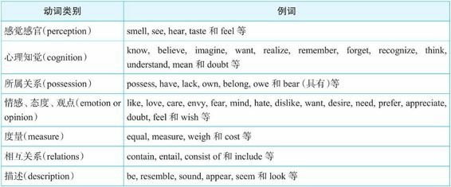

= new 张满胜_动词可以分成哪三类? → 1.延续状态. 2-1.短暂动作. 2-2.延续动作
:toc:

---

== 英语的每一个动词, 包含着哪三个特性? -> 时 / 态 / 体

[cols="1,3,3"]
|===
|Header 1 |用来表达 |

|时
|这个动作是: 固定不变的? /动态变化的?（fixed or changing）
|-> 因此, 英语把动词分为 : 状态 & 动作（state and action）
|===

[cols="1,3,3"]
|===
|Header 1 |用来表达 |

|体
|这个动作是: 固定不变的? /动态变化的?（fixed or changing）
|-> 因此, 英语把动词分为 : 状态 & 动作（state and action）

|
|这个动作是: 已经完成了的? /依然是在延续的?（complete or ongoing）
|-> 因此, 英语的时态中有: 进行体（continuous） & 完成体（perfect）

|
|这个动作是: 持续的时间是 很短? /很长? （lasting for only a moment or for a long time）
| -> 因此, 英语把动词分为 : 短暂动作 & 延续动作（punctual and durative）
|===

---

== "进行时态"的核心含义有哪些? -> 1.暂时的 + 2.持续中 + 3.未完成

[cols = "1,2a"]
|===
|"进行时态"用来表达出: |Header 2

|1．事件具有"持续性"（ongoing）
|事件/活动, 某个特定的时间, 正在"持续中".

|2．事件具有"短暂性"（temporary）
|
- 持续状态是"暂时, 有限"的, 而非永恒持续的; +
- 反过来说, 如果是长期的、恒久的事件(其实已经变成相对稳定的"状态"了), 那么就该用"一般现在时态"了.

|3．事件"未完成"（incomplete）
|事件既然还在持续中, 就是"未完成"的.
|===

---

====  进行体动作 (具体的/暂时存在的/未完成的/变化中的) VS 一般态动作 (笼统的/长久存在的/已完成的/不再变化的)

[cols="1a,1a"]
|===
|进行体 |一般时态

|表示"具体的活动"

- *I am thinking about* the answer.  我正在思考答案。
|与"长久的状态"有关

- *I think* it is 14. 我认为答案是14. <- 一般时态 : 表明think是表示思维"状态"。相当于说 have an opinion.

|表示"发生在说话时刻的一个具体动作"

- *Why are you wearing* glasses? 你怎么戴着眼镜啊？
|表示"一个习惯"

- *Why do you wear* glasses?  你为什么习惯戴眼镜？

|所指总是十分具体的.

- Weeds *are growing* like wildfire (in my garden). （在我家的花园里）杂草正疯长着。 <- 进行时态往往会表达"目前所见到的一个具体场景"

- *What are you doing* for Thanksgiving? 今年感恩节你打算怎么过？ <- *进行时态表示"计划好的"活动*，这里是针对一个具体的感恩节来说的.

|用于"概括"地叙述

- Weeds *grow like wildfire*. 杂草一般都会疯长。 <- 一般时态通常表示一个"一般情形"，这里是泛泛地在谈杂草的生长特点，而并没有具体所指。

- *What do you do* for Thanksgiving? 感恩节你一般都是怎么过的？ <- 一般时态则不是具体所指，而只是询问对方的习惯，这里是问每年的感恩节时对方要做什么。

|表示"暂时"的事件

- Joan *is singing well*. 琼这次唱得非常好。 <- 进行时态表示，在某一特定的场合，也就是在说话的时刻，琼唱歌发挥得很好; 或者指她在某一特定的演出季节中的唱歌表演。说明的是一次具体的活动。

- Mr. Smith *is standing by the Nile*. 史密斯先生正站在尼罗河边。 <- 一个人在尼罗河岸边站着只可能是短暂的.

- *They were living in Beijing* during the seventies. <- 进行时态表明他们生活在北京是阶段性的、暂时的，暗含后来他们就搬离北京了。

|往往表示一个"长期的状态"

- Joan *sings well*. 琼歌唱得很好。 <- 表明她有一副好嗓子，是一种比较永久的属性/状态，而不是指具体的演唱活动。

- The Sphinx *stands by the Nile*. 狮身人面像（斯芬克斯像）位于尼罗河边。

- *They lived in Beijing* all their lives. 他们一辈子都生活在北京。

|过去进行时 -> 表示动作"未完成"

- *He was drowning in the lake*, so the lifeguard raced into the water. 他当时在湖里溺水了，于是一名救生员立即跳进水里把他救了起来。 <- 进行时态, 表示drown的动作"尚未完成"，即他当时正在溺水，并没有死.

|一般过去时 -> 表示动作"已完成"

- *He drowned in the lake.* 他在这湖里淹死了。 <- 一般过去时态, 表示一个"完成的"过去动作，即他溺水且不再挣扎了——溺水身亡了。

|过去进行时 -> 表示事件已经开始进行，*并随着时间的推移在继续，因此它允许有变化*.

- *He was calling Mary* when I came in. 我进来时，他正在给玛丽打电话。 <-  过去进行时: 表示在“我”进来之后，他可能还在继续打电话，也可能立即结束打电话。*即“打电话”这一事件可以有变化*。即, “打电话”在先，“我进来”在后。

|一般过去时-> *把事件看作一个整体，没有变化的余地*.

- *He called Mary* when I came in. 我进来后，他给玛丽打了个电话。 <- 一般过去时 : *把“打电话”这一事件作为一个整体*，只是说明“他给玛丽打了个电话”，*而不能说明这个事件是继续持续的,还是立即停止了。*

|===

---

==== 如果一个动作的"持续不断性"被割断了, 就不能用"进行时"了 -> 场景: 1. 在同一段时间中做了几件不同的事; 2.事件发生了好几次(而不是一条线持续了).

进行时态, 强调了动作在一段时间里的持续性，即强调了这一活动必须是"连续不断"的。如果"持续性"被切断了, 就不能使用"进行时态"了.

[cols="1a,3a"]
|===
|"持续性"被切断的场景 |Header 2

|在同一时间内, 同时做的不同事情 <- "持续性"被切断, 就不能用"进行时"了.
|- I am painting the room and cooking dinner.* <- 错误. 你同时在做不同的两件事情了. *错误的关键是: 这两件事不可能同时在进行, 一定是"有先有后"的.*

所以你只能说:

- I am painting the room /and after that I will cook dinner. 我正在粉刷房间，
然后我就去做饭。

*只有在那些可以一个人一心二用, 并行处理几件事的情况下, 才能都用"进行时态"。*

- She was knitting and listening to the radio. 她一边编织一边听收音机。 <- 二者可以同时进行，所以可以用于进行时态。
- I was having dinner and watching the news. 我一边吃晚饭一边在看电视。

|即使是几件同样的事情, 在同时做，也不能用进行时态。
|- Tom was washing three cars.* <- 错误. 这个句子给人的感觉是汤姆有三只手，他是用三只手同时在擦洗三辆车，这不符合常理。所以，这个句子听起来很怪，被认为不正确。

你只能说:

- Tom was washing cars. 汤姆在洗车。
- Tom washed three cars. 汤姆洗了三辆车。

|当我们说到做一件事情的"次数"时，就是把动作割裂开来了，因而与“持续性”发生了语义冲突，所以就不能用"进行时态"表达。
|- I was ringing the bell six times.* <- 错误. 只能用"一般过去时"说：*I rang the bell* six times. 我按了六次铃。
|===

---

== 动词可以分成哪三类? -> 1.延续状态. 2-1.短暂动作. 2-2.延续动作

[cols="1a"]
|===
动词可以分成:

- 静态动词（stative verb）
- 动态动词（dynamic verb） -> 继续可以分成:
.. 短暂动词（punctual verb）
.. 延续动词（durative verb）
|===

*为什么要分清楚得这么细? 因为这些动作,在时间的"持续性"方面有很大不同, 就会影响到句子"时态"的使用。*

动词可以分成:

[cols="1a,1a,4a"]
|===
|Header 1 |Header 2 |Header 3

|- 静态动词（stative verb）
|
|与变化无关，描述的是一个稳定的状况. 这种状况会或长或短地持续下去.

一般，静态动词可包括下列几类：

如:

- We  *understand the questions*. 我们理解这些问题。
- And *we know the answers*. 所以我们知道答案。
- *We like* our English class. 我们喜欢英语课。
- But *we hate* the tests. 但是我们讨厌考试。
- *We are* intelligent people. 我们都是聪明人。
- And *we have opinions*. 因此我们有自己的见解。

需要注意的是，上述这些动词因为有多种意义，因而也可能
会成为"动态动词".

|- 动态动词（dynamic verb）
|1.短暂动词（punctual verb）
|- 往往表示一个"不能持续的"或"持续时间极短"的动作（acts which do not extend through time）
- 往往与"时间点(即一秒钟)"（point in time）有联系。

比如kick，hit 和 smash等。

- He *kicked the ball*. 他踢了球。
- It *hit the window*. 球打中了窗户。
- And it *smashed the glass*. 球把窗玻璃打碎了。

|
|2.延续动词（durative verb）
|- 表示一个"可以持续的"活动或过程
（activities or processes）
- 用来描述一个"可以延续"的场景（describe
situations that typically extend through time）。

比如 run，swim，walk，
work，write，become，change，grow 和 learn等等。
|===

---

==== 短暂动作:表示"质变"的转折点; / 延续动作:表示依然在"量变"的途中.

[cols="1,2a"]
|===
|Header 1 |Header 2

|*短暂动作 :  +
含有"状态改变了"的意味. 相当于发生了“质变”，从一种状态变到另一种状态。*
|- go to bed <- 是一个短暂动作，表示一个状态的改变——人从床下到床上了.
- fall asleep <- 是一个短暂动作，表示一个状态的改变——人从醒着转为睡着了。然后我们就“一直睡着”
- wake up <- 是一个短暂动作，是一个状态的改变——人从睡着转为醒来。

- *Get up*, Cousin, we are going to the zoo. 起床了，表哥！我们今天要去动物园！<- 用 get up，表示起床这个“动态动作”，而不是表示已经起来的“所处状态”。 +
如果你要表示已经起床的"状态", 比如, 你妈叫你起床，其实你已经起来了，这时你就要说成 : *I'm up*. 我已经起床了. 这就是一个"状态"的表达。而不能说成：I get up*.

|*延续动作 :  +
是一个"状态"的维持. 即依然处在"量变"中, 而还没有发生"质变".*
|- sleep
- be asleep <- 这两个表达都是延续状态，是一个状态的维持——一直睡着的状态。然后我们早晨“醒来”.

|延续状态: +
是一个状态的维持.
|- be awake <- 这是一个延续状态，是一个状态的维持——人处在一直醒着的状态。
- be up <- 是一个延续状态，是一个状态的延续——人一直在床下活动了, 新的一天开始了.

- *I am here* to visit Mr. Zhang Mansheng. 我来找张满胜老师。 <- 这里的am here就表示“我人现在在这里”的一个状态. 所以用的是"一般现在时态"。 +
而不能说成: I come here to visit Mr. Zhang Mansheng.*  因为你“来（come）”这个短暂动作在你说话时已经结束了，所以要改用其他时态来表达。 +
比如我们可以用"一般过去时"，说成：*I came here* to visit Mr. Zhang Mansheng. +
或者是用"现在完成时"，说成：*I've come here* to visit Mr. Zhang Mansheng.

这时，前台接待人员一般会问你：“你和他约好的吗？” +

- *Do you have an appointment* with him? <- 若是用"已经约好"的“状态”来表达，就要用"静态动词have". 并且要用"一般现在时态".
- *Have you made an appointment* with him? <- 若是用约的“动作”来表达，就要用"动态动词make", 并且要用"现在完成时态".

从上述例句中的 am here/have come 以及 do you have/have you made，
可以看出，*“状态／动作”的区分, 是与时态的选择密切相关的。*

|===

==== 进行时态的谓语,往往都是延续动词. <- 因为"延续动作"动词,表示延续中; "进行时"也表示动作在进行延续; 两者语义一拍即合.

"进行体"的核心意义是表示“动作有限的延续性”，"延续动词"也是表示动作的延续性，二者在语义上非常吻合。因此"进行时态"中的谓语,往往都是"延续动词"。

- What are you doing here? <- do 是"延续动作"动词
- it looks like you are watching television. <- watch 是"延续动作"动词.

---

==== "进行时"中用"短暂动作"动词时, 进行体会赋予短暂动词“反复（repetition）进行”的意义 <- 因为短暂动词只有"重复进行"了, 才能模拟"延续"的效果, 匹配到"进行时".

*即 : "短暂动词"用于"进行时态"，往往表示的是一系列重复的动作，而不是一个单一动作.*

也就是说, 通过让"短暂动作动词"的动作不断重复进行, 来模拟"延续动作动词"的"延续性"效果, 才能满足"进行时"的核心意义(“延续”).

- He *is nodding his head* in agreement. 他不断地点头表示同意。<- 不断地“点头”
- Someone *is coughing*. 有人在咳嗽。 <- 不断地“咳嗽”
- Henry *is kicking the soccer ball* around the backyard. 亨利正在后院里踢足球。<- 不断地“踢球”

---

== 英语中没有纯粹的静态动词 <- 因为所谓的静态动词,可以有多种意义 : 可表静态(就不能用于进行时), 也可表动态(就可以用于进行时).

一般，静态动词不能用于进行体, 因为"静态动词"表达的是一种"稳定的状态"，不符合"进行时"所要求的"在有限时间内持续"的这种意思.

因此, 我们不能说：

- I am knowing the answer.* <- 错误. 因为know是一个稳定的状态，不是表示know在有限时间内的持续。不可能你现在知道, 以后又不知道了.

但是,*很多静态动词有多种意义*：

- 表示静态意义时, -> 就不能用于"进行体"(进行时态)
- 表示"非静态意义"(其实已经转化为"动态动词"了)，-> 于是就可以用于进行时态.

所以这样看来, 其实英语中没有绝对的静态动词，只有静态“意义”的动词。  +
换句话说, 我们说某些动词是“静态动词”，主要是因为这些动词在其典型意义中是表示"静态"的，但它们也可能具有其他的"动态意义"。 -> 即, *常见的静态动词如果用在进行时态中, 往往就具有特殊的含义。*

---

==== 主动句中的谓语, 可以用进行时; 被动句中的谓语, 不能用进行时.

判断某个动词用于某一特定意义时, 是否可以用进行时态? 可以看它(作为谓语), 与主语之间, 是主动还是被动关系:

[cols="1,2a"]
|===
|Header 1 |Header 2

|主语(是动作发出者) + 谓语动词
|<- 是主动关系. 谓语一般都**可以**用进行时态.  +
<- 因为进行时态主要只用于有意识的动作。

|主语(是动作的承受着) + 谓语动词
|<- 是被动关系. 谓语一般都**不能**用进行时态. +
<- 在英文中，*一些表示无意识的、自发的动作的动词，如人们的心理活动（know，understand和believe等）、 感情状态（like，love和hate等）以及其他静态动词，均不能用于进行时态。*
|===

---

==== 感官动词(taste，smell，feel，look和appear等), 主谓之间是主动关系, 谓语(这里即感官动词)可以用进行时; 主谓之间是被动关系, 谓语就不能用进行时.

[cols="1a,1a"]
|===
|主语与谓语(感官动词)之间是"主动关系"(主动句含义) <- 谓语能用进行时|主谓之间是"被动关系"(被动句含义) <- 谓语不能用进行时

|- The chef is tasting the soup. 厨师正在尝这汤的味道。 <- ，taste 是谓语，表示“品尝”的动作。此时句子的主语chef是施动者，即有意识地发出taste这个动作的人，所以可以用于进行时态。
|- And it tastes good. <- taste是系动词，表示“尝起来”，是一个状态。此时句子的主语it（指the soup）并非施动者，而是受动者（只有人才可以taste），所以这里的taste不能用进行时态，即我们不能说 It is tasting good.*

|
|- I taste(v.) ginger in these spring rolls. 在这些春卷里，我尝到了生姜的味道。

<- 这里的主语是I，即人称主语，但I并不是施动者，因为这里的谓语taste并不是I“有意识”地发出的。*并不是"I"想有意识的去品尝生姜，而是无意识地“尝到”了生姜的味道。所以，这里的主语I是一个受动者*，因此该句不能用进行时态说成：I am tasting ginger in these spring rolls.*

所以, **区分施动者还是受动者的关键, 并不是根据主语是人还是物，**并不是说“人”作句子的主语就一定是施动者，*关键还是要看主语是否是“有意识”地发出某个动作。*

*所以在英文中，表示结果的动词往往是表示一个状态，因而不是主语有意识地发出的动作，所以不能用于进行时态。*

|===

其实我们借助taste为例, 区分了有些(而非全部的)感观动词, 能一个词包含三个不同方面的含义:

[cols="1a,1a"]
|===
| |主谓之间

|主语主动发出taste, 来品尝某物 (表主动过程)

- The chef is tasting(v.) the soup.
|主动关系 <- 可以用进行时

|主语无意中被迫taste尝到某物 (表最终结果)

- I taste(v.) ginger in these spring rolls.
|被动关系 <- 不能用进行时

|某物尝起来怎么样, taste做系动词(而非谓语)时

- it `系` tastes good.
|被动关系 <- 不能用进行时
|===

在英语中，与“味觉”有关的这三方面含义（即系动词、表示过程的vt., 和表示结果的vt.）, taste这个词都能表达出来，相当于taste能“身兼三职”。

同样, 表示“嗅觉”的三方面含义, 也是集中在smell身上的:

[cols="2a,1a "]
|===
|smell |主谓之间

|表主动去做的过程.

- He is smelling the chicken.
|主动关系 <- 可以用进行时

|表最终结果.

- I smell something burning in the kitchen. 我闻到厨房里有什么东西烧焦的味道。 <- 此时句子的主语I不是施动者，即并非有意识地发出smell这个动作，而是被动地接受了一个结果，所以不能用于进行时态.
|被动关系 <- 不能用进行时

|做系动词, 与主语It之间是被动关系

- And it `系` smells nice.
|被动关系 <- 不能用进行时
|===

但其他感观动词, 会分别用不同的动词来表达这三方面的含义。

比如，与“视觉”有关的三方面含义, 就用了独立的动词: look 和 see.

[cols="1,3a"]
|===
|主谓之间 |Header 2

|表主动
|- I am looking at the picture. <- 句子的主语I是施动者，即有意识地发出look这个动作，所以可以用于进行时态。

- I am seeing my doctor tomorrow. <- 这里**see不是“看见”的意思，即不表示结果，否则不能用于进行时态；而是表示主语I有意识地去“约见”**，即主语是施动者，所以可以用于进行时态。

|表被动
|- I see the picture. <- see 表示“看到”的结果，是一个状态。即并非 I 有意识地发出see这个动作，而是被动地接受了一个结果，所以不能用于进行时态.

- I see what you mean. <- 这里 see不是“看见”的意思，而是表示“理解，明白”，相当于understand，表示的是一种状态，而非主语I有意识的动作，所以不能用于进行时态，即不能说 I am seeing what you mean.*

|表被动
|- It `系` looks beautiful. <- It 是 look 的逻辑宾语.
|===

同样, 与“听觉”有关的三方面含义, 也用了不同的动词来表示: sound，hear 和 listen.

[cols="1,3a"]
|===
|主谓之间 |Header 2

|表主动
|- I am listening to the music. <- 句子的主语I是施动者，即有意识地发出listen这个动作，所以可以用于进行时态。

- I am hearing Prof. Smith's lectures. <- 这里的hear不是“听见”的意思，即**不表示结果，否则不能用于进行时态；而是表示主语I 有意识地去“参加”某个活动，**即主语是施动者，所以可以用于进行时态。该句中的hearing相当于attending，整个句子的意思表示“我目前正在听史密斯教授的课”。 +
这里的进行时态表示“重复性”，“临时性”，即“听课”这一活动可能持续一个学期或一两个月。

|表被动
|- I hear the music. <- hear 表示“听到”的结
果，是一个状态。句子的主语I不是施动者，即并非有意识地发出hear这个动作，而是被动地接受了一个结果，所以不能用于进行时态.

|表被动
|- It `系` sounds nice. <- It 是 sound 的逻辑宾语.
|===

总结:

-> 表示"动作过程"的动词, 可以用于进行时态。 +
-> "系动词"和"表示结果"的动词, 不能用于进行时态.

又例

[cols="1a,1a"]
|===
|表主动去做 <- 能用进行时 |表状态/结果/被动 <- 不能用进行时

|- He is appearing on the stage. <- 表示“正出现”的动作。此时句子的主语he是施动者，即有意识地发出appear这个动作，所以可以用于进行时态。他正出现在舞台上。
|- And he `系` appears to be nervous. 他此时显得很紧张。 <- appear是系动词，表示“显得”，是一个状态。此时句子的主语he并非施动者，即he并没有发出appear这个动作，而是受动者，所以这里的appear不能用进行时态，即我们不能说 And he is appearing to be nervous.*

|- The doctor was feeling her pulse. 医生正在为她号脉。
|- I feel we shouldn't do it. 我觉得我们不应该这样做。 <- feel表示“认为”，相当于think，表示某人的主观观点或看法。此时它表示的是一个心理状态，而不是主语有意识地发出的动作，所以这里的feel不能用进行时态，即我们不能说I am feeling we shouldn't do it.*

|- I am thinking of asking him to do me a favor. 我在考虑让他帮我个忙。 <- think表示有意识的思维活动，意为“正在考虑”，可以用于进行时态。
|- I think you're right. 我认为你是对的。 <- think 表示一个思维状态，意为“认为”，相当于have an opinion的意思，不能用于进行时态。

|- The butcher is weighing the steak. 这个屠夫在称牛排的重量。
|- The steak weighs 12 ounces. 这个牛排重12盎司。 <- weigh不表示动作，而是一个状态，表示一个结果，主语steak并非weigh的施动者，所以不能用进行时态。

|===

---

==== 静态动词用于进行时态时, 会产生各种含义上的变化

[cols="1,3a"]
|===
|Header 1 |Header 2

|会**加强动词所表达的感情**
|- I'm hating this assignment. 在语气上就要比说：I hate this assignment. 强得多。
- I'm loving it. <- 麦当劳的广告语. "我就喜欢。" 这里用“就”来表达出"进行时态 am loving" 所表达的强调含义。

|通过**强调随时间的流逝而发生的程度上的变化**，来表明状态的变化.
|- Yes, I understand you. <- 一般来说，understand 作为一个静态动词, 是不能用于进行时态的。
- I'm understanding less and less about life, the older I get. 我年龄越大，对生活就越发不能理解了。 <- 但是，当我们把understand用于进行时态，*表示的就是一个理解程度的变化中情形.* 所以，这里的understand指的不是一个状态，而是一个发展变化的过程.

|与一般性描述不同，进行时态表示"当前的行为"
|- He's being rude. 他现在的样子显得很粗鲁。
- He's rude. 他这人一向很粗鲁。

|强调有意识的参与
|- What we are seeing is a red dwarf star. 我们现在看到的是一颗红矮星。

|表明生动性 (意思就是让你身临其境,好像"现在"就在听到看到)
|- One night in the middle of the night, I'm hearing dripping. 在一天半夜里，我听到滴水声。

|使批评变得缓和 (意思就是只"现在阶段"不喜欢, 而不是"永恒地"不喜欢)
|- I like the first piano notes, but I'm not liking where the strings come in. 我喜欢前面的钢琴曲，后来的弦乐我不喜欢。
|===

---

====  延续状态（be＋adj.）与进行时态

英语中的延续状态, 一般都是由 "be动词+ adj./n." 构成的。我们这里主要讨论形容词的情形。

正如动词可以有静态与动态之分一样，英文中的形容词, 也可分为静态形容词（stative adjective）和动态形容词（dynamic adjective）。

[cols="1a,1a"]
|===
|静态形容词 <- 表示一种长久稳定的状态(江山易改,本性难移) |动态形容词 <- 表示一种暂时的状态, 会变化

|是指某一事物或现象, 所具有的**长时期内难以自然改变
的**性质特征或状态。 +
如：tall，red，long，big，beautiful和important等。

静态形容词, *不能用于进行时态*。

|是指某一事物或现象, 所具有的**随时可以被改变的**性质特征或状态。这些形容词, 主要是用来描写**人的性格特征**的. +
如: brave，calm，careful，careless，clever，cruel，foolish，friendly，funny，impatient，lazy，kind，naughty，nice，noisy，patient，polite，rude，shy，silly，stubborn 和 stupid等。

动态形容词, *可以用于进行时态*. 来描述主语的一个**暂时的**性质状态或特征，而非其本身所固有的或持久的特征。 +
此时主语是施动者，所以有时, 表示主语“有意如此”的含义。

|- He's rude. 他这人一向很粗鲁。
|- He's being rude. 他现在的样子显得很粗鲁。 <- 形容词rude是一个动态形容词

|
|- She was just being polite. 她那么说／那么做只是出于礼貌（只是为了给你面子）而已。  +
<- 这句话往往表示一个人为了顾及对方的面子, 或是出于礼貌，而装出很欣赏对方拥有的某件东西，比如她只是装作很羡慕你的房子／车子／家具／衣服／工作等，但实际上她并不欣赏这些。

|- Fred is silly. 弗雷德一向很傻气。 <- 一般时态is silly则表示主语Fred**惯有的性格特点**是“傻里傻气的”，而不是说话时刻的行为表现。*这里的主语Fred并不是一个施动者。*
|- Fred is being silly. 弗雷德现在正犯傻。 <- 动态形容词silly用于进行时态，表示的是弗雷德在说话时刻的行为表现，意思是“弗雷德现在表现得傻里傻气的”，相当于说Fred is acting in a silly manner. *这里的主语Fred 是一个施动者。*

|
|动态形容词用于进行时态, 往往**让表达显得非常生动，给人一个具体的、生动的场景。(即用进行时, 来表达犹如身临其境, 现在就在看他们进行中一样)**

|
|- The children are being very quiet; I wonder what they are up to. <- 在说话的时刻，这些孩子个个默不作声，也许他们平时其实非常吵闹。这先后两种表现形成鲜明的对比，不禁让人揣摩他们想干什么。

请仔细体会下列各例句所表达出来的生动场景：

- The peddler is being rude. 那小贩开始动起粗来。
- She is being careful at this moment. 此刻她正表现得小心翼翼。
- She was being stupid. Actually she had already known the whole story. 当时她在装傻，其实她早已知道了事情的经过。
- You're being difficult again. 你又和人为难、闹别扭了。

|- You are a fool. 你真笨。
|- You're being a fool. 你这是在装傻。 <- 其实名词也有类似的用法。
|===

---

440

