= new 张满胜  had done  : had done & 将来完成时 shall/will have done
:toc:

---

==  had done  : 更远的过去 <- (回顾) <- 过去(参照点)

完成时态的含义本质, 就是用来“回顾”。 +

[cols="1a,2a"]
|===
| have done  | had done 

|过去 <- (回顾) <- 现在(参照点) |更远的过去 ← (回顾) ← 过去(参照点)

|就是站在“现在时间”的角度, "回顾"过去. +
表示一个从"过去"持续到"现在"的事件。

|就是站在“过去时间”的角度, "回顾"更远的另一个过去.  +
表示一个事件从这个"更远的过去", 持续到"离现在较近的过去"。

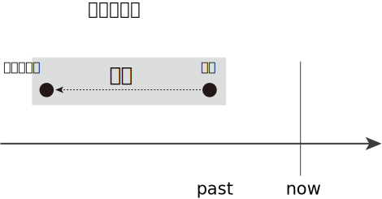

The Past Perfect indicates "the past before the past" -- what film-makers call a "flashback" in time.

|" have done "的参照时间“现在”, 往往潜含在语境中，并不需要明确地表达出来。

- I have been a school teacher for 28 years. +
-> 相当于说：I have been a school teacher for 28 years *now*. +
我当老师到现在有28年了。
|但是，*对于" had done "，其参照时间“过去”, 则一般是要明确地在上下文中给出来的。* +
即: 必须先有一个"过去时"，然后以这个"过去时"作为参照的时间点，来谈论更远的过去，此时这个更远的过去才能用" had done "。因此，*" had done "是一个不能独立使用的时态，它必须依附于一个在上下文中出现的" did "。*

- After many frustrating years, the man *grew tired of* looking for The Precious Present. He *had read* all the latest books. He *had looked* in the mirror and into the faces of other people. He *had looked for it* at the tops of mountains and in cold dark caves. ... +
-> grew表示过去，而接下来的一系列活动都是发生在grew之前的，所以都用了" had done "，说成had read, had looked in, had looked for, had searched, had gone, had wanted和had exhausted等。

|===

又例

[cols="1a,1a"]
|===
|Header 1 |Header 2

|- *This Was My Mother*. ... He *had left* for home that morning and would not be back, she was told. ... then told us that when she was 18 she *had loved* a young medical student with all her heart. ...

|作者说This Was My Mother，过去时was表明“母亲”已经不在人世，那么后面的经历都是过去的，这个was就为下文的" had done "奠定了“过去”的时间视角。 +
在翻译时，如果把This Was My Mother简单直白地译成“这是我的母亲”，那么显然没有译出was的含义。我们不妨把它译成“回忆母亲”，用“回忆”表明母亲已不在人世——与英语的was有异曲同工之妙。  +
*如果作者在文章的一开头用了"一般现在时"的is，向读者表明，他的祖母还没有去世，所以，说话的时间视角是“现在”，那么下文中要“回顾”过去的经历时，就自然会用到" have done "*（比如has been, have known, has discussed, has died, has kept和has ever seen），而不可能出现" had done "。

| - Once there she sat silent and thinking for many days, then *told* us that when she was 18 she *had loved* a young medical student with all her heart.
|这里的 had love 发生在过去的动作told之前，所以用了" had done "。

| - She *had never seen him* since and then she *had read* in a newspaper that he was going to attend the old settlers' convention.
|**含有since的主句中一般是用" have done "，但这里用了" had done " had never seen，这是因为这里的since所表示的时间段, 不是到目前说话时为止，而是到当时为止——即她去世时为止。**所以，要用" had done "。

|- "Only three hours before we *reached* that hotel he *had been* there," she mourned.
|这里的 had been 是发生在过去的动作reached之前的，所以用了" had done "。

| - She *had kept* that pathetic burden in her heart [64 years] without any of us suspecting it.
|这里的had kept是相对于was(去世前)而言的，是在was之前持续了64年，所以用了" had done "。

| - She *would write* letters to school-mates who *had been dead* 40 years and wonder why they never answered.
|这里的 had been dead 是相对于过去的动作would write而言的，所以用了" had done "。

|-  I *had* an idea of what being a member of Parliament was like. I *had been* on a local authority for four years, and as a journalist and as a political activist I *had visited* the House of Commons, so it's more or less what I expected.
|A：你担任下院议员到现在已有五六个星期了，当议员和你以前所想象的是一样的吗？ +
B：我以前就知道当议员会是什么样的，因为我在当地的政府部门工作过四年，而且曾经以记者和政治活动家的身份与国会下院打过交道。所以，议员的工作跟我以前想象的差不多。

先有了 had an idea，所以后文再往"更远过去"回顾, 就得用" had done " had been 和 had visited。

|- I *had* always *wondered* how the ewes knew their own lambs; now I *learned* that it was partly by voice, but chiefly by smell, looks not entering into it.
|过去我一直不明白母羊是怎样认出自己生的羊羔的，后来我才知道，它们一方面是靠听声音来辨认，但主要是靠闻气味，根本就不用看长相。

had wondered 是发生在 learned 之前的过去，即"过去的过去"，所以用了" had done "。

|- A: It was my grandmother's birthday yesterday. +
B: Is she old? +
A: Well, *by the time* we *lit up* the last candle on her birthday cake, the first one *had gone out*!
|*by the time常常可以与" had done "搭配使用*，具体结构是：* had done ＋ (by the time＋ did )*。

A：昨天是我奶奶的生日。 +
B：她年纪很大吗？ +
A：哦，等我们点完她生日蛋糕上的最后一支蜡烛时，第一支蜡烛都已经烧完了！

had gone out 发生在 lit 之前.

|- She *felt* suitably humble 方式状 just as she________when he *had first taken* a good look at her, hair waved and golden, nails red and pointed. +
A．had √ +
B．had had +
C．would have had +
D．has had

她举止谦逊、得体，就像他当初见到她时，她所表现的那样。她的头发依然是波浪形、金黄色的，指甲涂成了红色，尖尖的。
|主句谓语felt用的是" did ", when从句谓语had taken用的是" had done "。 说明 first take a good look 先发生, fell后发生. +
那么as引导的方式状语从句的谓语, 需要用什么时态? 显然，*as引导的从句的谓语动作, 发生在felt之前，故也要用" had done ".* 因而可以排除C和D选项。

-> A选项, 是一个省略形式，完整的谓语应该是had done，done可以省去。这里的done代替了felt。因此，真正的谓语是had felt，相当于说as she had felt humble，即表示“就像他当初见到她时，她感到谦卑那样”。

-> B选项, had had是一个完整的谓语，谓语动词是后一个had，但该句中没有“had（有）”的意思。于是本题只能填A选项即had。

|===

" had done "同" have done "一样，可以表示: 1.延续事件, 2.重复事件, 3.单一事件 这三种意义。 +
这里同样涉及两个时间点：一个事件从更远的过去开始发生，然后“延续”到另一个较近的过去，或者“重复”到另一个较近的过去，或者在过去的某一时刻已经结束.

---

==== 1. 更远的过去 ->(延续到)-> 过去 -> 还可能延续到未来

表示一个动作或状态, 在过去的某一时间B之前已经开始，这一动作或状态一直持续到时间B，并且还未结束并仍有可能继续持续下去。

[cols="1a,1a"]
|===
|Header 1 |Header 2

|- I *had stayed* in America for two years when he *moved here*. +
他搬到美国时，我在这里已经生活了两年了。
|stayed发生在moved之前，即过去的过去，并且在moved之后还将会继续下去，因此用" had done " had stayed。

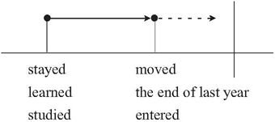

（图中的虚箭头表示: 动作可能继续持续下去）

|- We *had studied* English for six years when we *entered* college. +
进入大学的时候，我们已经学了六年英语了。
|studied在过去的动作entered之前已开始发生，并且继续延续，因此用" had done " had studied。

当然，也可以谈一般的情况，when从句的谓语可以用"一般现在时态"，主句就要改成" have done "了:

- We *have studied* English for six years when we *enter* college.

|- A: It's already 10 o'clock. I guess Bob and Amy won't be coming to the party. +
B: They *called* at nine to say that they'*d been held up*. +
B：他们9点钟来过电话说他们有事被耽误了，不来了。
|

|Why *Did* the Easter Islanders *Disappear*? This civilization *had lived* for 1,200 years on this small island. +
活节岛上的居民为何消失了？该文明在这座小岛上延续了1,200年。
|这里的" had done " had lived, 一直持续到另外一个过去的时间its discovery in 1772。

|- Former Japanese Prime Minister Keizo Obuchi, who *had been* in a coma（昏迷）for six weeks, *died of* a cerebral（大脑的）infarction（梗塞）at a Tokyo hospital. +
日本前首相小渊惠三，在昏迷了长达六个星期后，因患脑梗塞死于东京的一家医院。
|或由上下文明确告知动作或状态, 持续到过去这一时刻即停止。

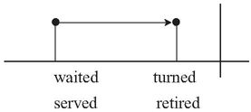

|- He *had served* in the army for ten years; then he *retired* and *married*. His children were now at school. +
他当过10年兵，后来退伍并结了婚。他的孩子当时都在上学。
|

|- There *had been* fifty colleges in our city up till 1993.  +
到1993年时，我们的城市里已经有了50所大学。
|
|===

---

==== 2.更远的过去 -> (重复到)-> 过去

" had done "可以表示在过去之前开始的动作，在过去之前的一段时间内重复发生。

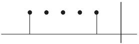

[cols="1a,1a"]
|===
|Header 1 |Header 2

|- 影星奥黛丽·赫本 ... She *had made* a total of 31 high quality movies.
|这里的" had done " had made 显然是表示"过去重复"的动作，且该动作只重复到过去，没有一直持续到现在，所以用" had done "。

如果说的是汤姆·克鲁斯, 他还活着，他拍电影这一活动就可能一直重复到现在,直至将来，因此就要用" have done " has made 了。

|- More than 10 severe acute respiratory syndrome (SARS) cases *had been reported* in the building before it *was sealed off* on April 24. ...  where some 38 families *had been isolated* since April 24. +自从4月24日起，这座楼里大约38户居民被隔离。
在该宿舍楼于4月24日被封锁之前，这里报告了十几个“非典”病例。 ... 自从4月24日起，这座楼里大约38户居民被隔离。
|-> 在过去的动作was sealed off之前，reported的动作“重复”发生了十多次，故该用" had done " had been reported。

-> 虽然与since搭配的主句一般是" have done "，但这里用了" had done "的 had been isolated，因为“被隔离”只持续到上文出现的yesterday afternoon，而没有持续到现在。这里的yesterday afternoon就相当于一个过去的参照时间。

|- I *had proposed to her* five times, but she still refused to marry me.  +
我已经向她求婚五次了，但还是被拒绝。
|

|===

---

==== 3.“单一事件(短暂动作)”在过去时间B之前已经结束 -> 但对时间B有后果影响

" had done "可以表示开始于过去B之前的动作, 到B这一时刻之前即已停止。 +
具体来说，就是表示: 一个动作或状态, 在过去的某一时间B之前已经开始，并在B之前即告结束，而没有持续到B时刻。这时" had done "的动作通常是短暂动作。

[cols="1a,1a"]
|===
|Header 1 |Header 2

|- She *had made* everything ready before I *came*. +
在我来之前，她已经把一切都准备好了。
|made的动作在came之前已经完成，故用" had done " had made。

|- Her baby *had fallen asleep* when she *went into* the room.
|fall的动作在went之前已经完成，故用" had done " had fallen。

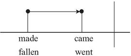

|- I *had just poured* myself a cup of tea when the phone *rang*. When I came back from answering it, the cup *was empty*. Somebody *had drunk* the tea or *thrown it away*. +
我刚刚给自己倒了一杯茶，这时电话铃响了。于是我去接电话，接完电话回来的时候，发现杯子空了。有人已经把茶喝了或者是倒掉了。
|-> 在过去的动作rang之前, pour的动作已经完成，故用" had done " had poured。 +
-> 在过去的状态was empty之前, drink和throw的动作已经完成，故两者都用" had done " had drunk 和（had）thrown。
|===

---

== ---------- ----------

---

==== 你在过去有一个想法或计划, 但最终未能按你所想实现(计划没有变化快), 则现在谈起当时的这个计划时, 你要用" had done "

*即, 这些词(intend, mean, hope, want, plan, suppose, expect, think, propose和wish等), 用" had done "来表达时, 就是表示这些过去的计划, 打算, 都未能实现.*

[cols="1a,1a"]
|===
|Header 1 |Header 2

|- I *had intended* to see you, but I was busy.
|我本打算去看你，但是我太忙了。

|- I *had planned* to go shopping with you, but my mother came to see me just when I was about to go.
|我本打算和你一起去逛街，但正当我要出门的时候，我妈妈过来看我了。
|===

---

==== 用于最高级句型 -> 用在“It was the＋序数词（first, second...）或最高级……that  had done ……”句型中。

[cols="1a,1a"]
|===
|Header 1 |Header 2

|- It was the *third* time that someone *had interrupted me* that night.
|那是那天晚上我第三次被打断。

|- As a gift, he *brought* a big fish and a quart of the *largest* oysters I *had ever seen*.
|为了答谢我们，他给我们带来了一条很大的鱼，还有一夸脱重的牡蛎，那是我所见过的最大的牡蛎。
|===

---

==== (1)几个动作按先后顺序发生 -> 用" did "; (2)在过去, “回顾”到更早的过去事情 -> 用" had done ".

[cols="1a,1a"]
|===
| did  | had done 

|*两个或两个以上相继发生的动作，用and或but, 按动作发生的先后顺序连接，此时要用" did ".*
|*如果在谈论过去某一事件时，又想到(回顾)在这之前已发生的某事，就要用" had done "。*

|- He *opened* the door and *entered*, but *found* nobody.  +
他打开门进去了，但一个人都没看见。
|

|- He *served* in the army for ten years; then *retired* and *married*. His children *are* now at school. +
他当过10年兵，然后退伍并结了婚。他的孩子**现在**都在上学。

-> 因为有了are表示现在的时间，作为现在的参照时间，所以在此之前的serve的动作，应该用" did " served。
|-  He *had served* in the army for ten years; then he *retired* and *married*. His children *were* now at school. +
他当过10年兵，后来退伍并结了婚。他的孩子**当时**都在上学。

-> 因为有了were表示过去的时间，作为过去的参照时间，所以回顾在此之前的serve的动作，应该用" had done "had served。

|- I *heard* voices and *realized* that there *were* several people in the next room. +
-> 我听见说话的声音，知道隔壁房间里有人。
|- I *saw* empty glasses and cigar butts on the table and *realized* that someone *had been* in the room. +
我看见桌子上有空杯子和烟蒂，知道了屋子里有人来过。

|
|- I *realized* that we *had met* before. +
我意识到我们以前见过面。
|===

---

==== 两个相继发生的动作A和B, (1)两者之间没有因果关系, 彼此独立发生, 就要用" had done "; (2)A导致了B的发生(即两者有因果关系), 要用" did "

[cols="1a,1a"]
|===
|A和B两件事, A完成后, B才开始, 并且AB之间没有因果关系 -> 用" had done " |A导致了B的发生, 即两者有因果关系 -> 用" did "

|- When I *had opened* all the windows, I *sat down* and *had* a cup of tea. <- 无因果关系 +
我把所有的窗子都打开后，就坐下来喝了杯茶。
|- When I *opened* the window the cat *jumped* in. <- 有因果关系 +
我刚把窗子一打开，就有只猫跳了进来。

|- When the singer *had sung* her song, she *sat down*. <- 无因果关系 +
这名歌手唱完歌以后，就坐下了。
|- When the singer *sang* her song, she *sat down*. <- 有因果关系 +
即, 如果这样说的话, 则可能给人造成这种印象：这位歌手喜欢坐着唱歌。(因为他坐着唱歌时更能发挥水平, 所以他坐了下来再唱.)
|===

---

== ---------- ----------

---

== 将来完成时 : 表示 从"将来之前"(过去, 现在, 将来A时刻) ->(延续,重复到)->  "将来"B时刻

将来完成时: 是以“将来B”作为“坐标时间”，来表示开始于将来B之前（可能是过去、现在或将来）的动作, 持续到将来B。

*注意，这里说动作开始于“将来之前”，意味着动作开始的时间, 可能是"过去"的某一时刻、可能是"现在"的某一时刻，或者也可能是"将来"的某一时刻。* +
但动作开始的时间并不重要，关键是说话人要站在将来的某一时间, 来谈某一动作的完成情况。

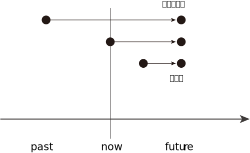

比如: +
到下个星期五之前，我们将完成五门考试。  +
起始时间? -> 五门考试 -> 下周五(终点时间)

那么"起始时间"就有下面三种可能:
[cols="1a,2a"]
|===
|Header 1 |Header 2

|起始时间, 可能是从"过去"开始的, 比如从"昨天"开始
|- We *started* our exam yesterday and we *will have taken* five exams *by next Friday*.

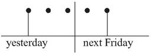

|起始时间, 可能是从"今天"开始的
|- We *have started* our exam today and we *will have taken* five exams by next Friday.

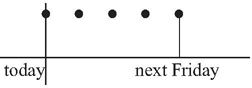

|起始时间, 可能是从"将来"某一时刻开始的, 比如从"明天"开始的
|- We *will start* our exam tomorrow and we *will have taken* five exams by next Friday.

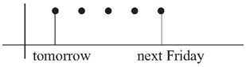

|===

*事实上, 事情从什么时候开始并不重要, 说话人想要强调的是: 事件在未来某一刻结束时, 一共耗时了多久.*

同前面其他的完成时态一样，"将来完成时态"也有三种基本用法:

---

==== 1.某事件 -> (延续到) 将来某时刻 -> 并可能继续延续下去

表示在将来某一时刻之前开始的动作，一直延续到该时刻，并可能继续延续下去。

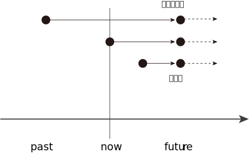

（虚线表示这一动作可能开始于"现在"或"过去"；虚箭头表示这一动作可能继续延续下去）

[cols="1a,1a"]
|===
|Header 1 |Header 2

|- I *will have taught English* in New Oriental School for five years *by the end of next month*.
|到下个月底之前，我在新东方学校教英语将满五年了。

|- I *will have waited for her* for two hours when she arrives *at 2 o'clock this afternoon*.
|她今天下午两点钟到达的时候，我就将已经等她两个小时了。

|===

---

==== 2.某事件 -> (重复到) 将来某时刻

表示事件是从"将来B时刻"之前就开始发生的，并到将来B时刻时, 这段时间中一直在重复发生。

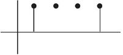

[cols="1a,1a"]
|===
|Header 1 |Header 2

|- By five o'clock this afternoon the spaceship *will have traveled eleven times* round the world.
|到今天下午五点钟之前，这艘宇宙飞船就将绕地球飞行11次了。

|===

---

==== 3. 事件在将来时间B之前已经结束, 但对时间B有后果影响

表示在将来的某一时刻之前开始的动作，到该时刻之前已经完成。

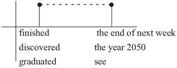

（虚线表示这一动作对将来有影响）

[cols="1a,1a"]
|===
|Header 1 |Header 2

|- We *will have finished* our exam by the end of next week.
|到下个周末为止，我们就将完成考试了。

|- I will graduate in July. I will see you in September. By the time I see you, I *will have graduated*.
|到我见到你的时候，我将已经毕业了。

|- By the year 2050, scientists probably *will have discovered* a cure for cancer.
|到2050年时，科学家们可能就会找到治愈癌症的方法。
|===

---

