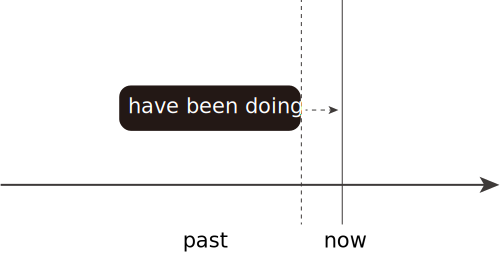
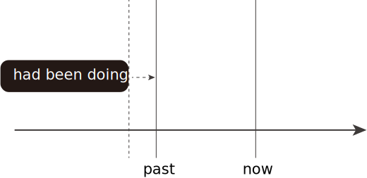
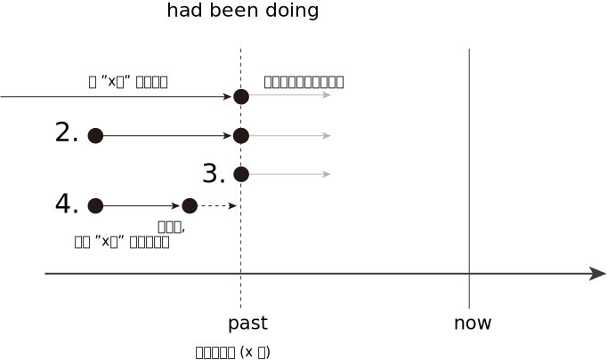
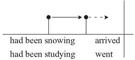
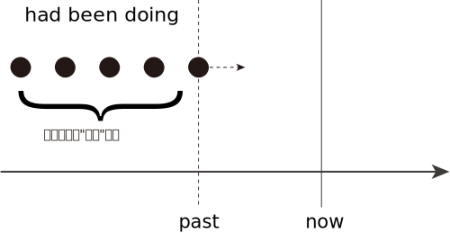
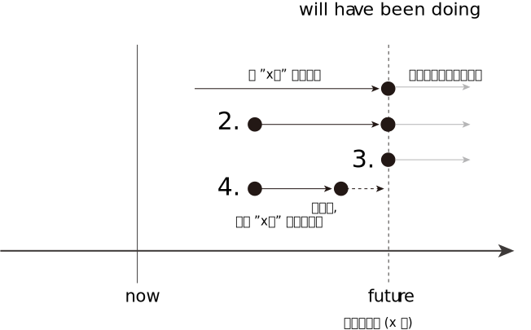
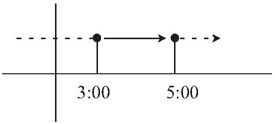

= new 07.张满胜_had been doing & will have been doing -- 过去完成进行时 & 将来完成进行时
:toc:

---

== had been doing 过去完成进行时

had been doing 与 have been doing 的用法在本质上是相同的，区别只是将说话的“参照时间”, 由"现在"移到"过去"。

即: had been doing 要首先确立一个过去时间，并以此为坐标时间, 来谈在那时间点之前发生的事件。

[cols="1a,1a"]
|===
|have been doing |had been doing

|- Your eyes *are* red. You'*ve been crying*, haven't you?

-> 由are可以知道，这里说话语境的时间, 是"现在". +
-> have been crying 就表示: 在说话时刻之前在延续, 但刚刚才结束的事件 (对现在有后果).

|-  Her eyes *were* red. It was obvious she *had been crying*.

-> 由were可以知道，这里说话语境的时间, 是"过去".

|
|- A: Don't you think Prof. Morison's test *was* not too difficult? +
B: Well, I must admit I *had been expecting* just a passing grade in biology. +
A：你不觉得莫里森教授上次的那个测验并不是太难吗？ +
B：是啊，我得承认，我当时还(以为考试很难,)想着那次生物考试我只要达到刚刚及格就可以了呢。

-> had been expecting 表达的是在was之前的一个近期延续事件，即在考试之前，他认为考试会很难.

|

|

|===

had been doing 与 have been doing 完全类似，可以表示:

- 延续事件（包括 1.长期延续、2.近期在延续、3.说话时刻在延续, 以及 4.在说话时刻之前在延续(但到说话时刻时已经停止, 并对此时有后果影响)的事件）

- 重复事件

---

==== 1. 开始于过去某个时刻之前的动作, 持续到过去这一时刻，并继续持续下去

had been doing 的这一语意表示: 开始于过去某个时刻之前的动作, 持续到过去这一时刻，并继续持续下去。

[cols="1a,1a"]
|===
|Header 1 |Header 2

|- She *had been studying* French for one year *before* she *went to* France. +
她去法国之前已经学习了一年法语。

|这里的went 确立了过去的坐标时间，然后谈论在此之前发生的一个延续活动“学习”，所以要用 had been doing 来表示这个意思。

|- When I *arrived* in Inner Mongolia, it *had been snowing* for half a month. +
那次在我到内蒙古之前，雪已经下了整整半个月了。
|
|===

---

==== ---- 在过去某一时间点(参照点)之前, 发生的"长期"延续事件

- The police *had been looking for* the murderer for two years *before* they *caught* him. +
警察抓住这个杀人犯之前，已经找了他两年了。

- I *had been looking for* jobs for nearly half a year *before* I finally *got* a position in this dot-com company. +
我找工作找了将近半年，最后得到了一家网络公司的聘用。

---

==== ---- 在过去某一时间点(参照点)之前, 发生的"近期"延续事件

- A: Don't you think Prof. Morison's test *was* too difficult? +
B: Well, I must admit I *had been expecting* more than just a passing grade in biology.

- He looked so tired. I knew he *had been studying* for the final exams. +
他当时看起来很累，我知道他一直在忙着准备期末考试。

---

==== ---- 在过去某一时间点(参照点)时, 依然在延续的事件

- When she *arrived*, I *had been waiting* in the cold for three hours. +
她到的时候，我已经在寒冷的天气里等了她三个小时了。

- He finally *showed up* at nine o'clock. I *had been waiting* for him since six o'clock. +
他最终在9点钟的时候出现了，我从6点钟开始就在等他。

- The plane, which *had been waiting* on the runway for hours, finally *got* clearance for take off. +
飞机已经在跑道上等了几个小时了，终于获准起飞。

---

==== ---- 在过去某一时间点(参照点)之前一会会, 延续的事件才刚刚结束, 但对该参照点时有后果影响

- There *was* nobody in the room but there was a smell of cigarettes. Somebody *had been smoking* in the room. +
当时房间里没人但是有烟味，我知道，房间里刚刚有人抽过烟。

- Mary's eyes *were* red. She *had been crying*.  +
当时玛丽的眼睛红红的，她刚刚哭过。

- She *answered* the door carrying a magazine she *had been reading*. +
她应声去开门，手里还拿着一本刚刚一直在看的杂志。

---

==== 2.事件在过去某一时刻之前的一段时间内, 重复发生

had been doing 的这种语意, 是表示: 事件在过去某一时刻之前的一段时间内, 重复发生。

同样，这里的重复动作不能说出具体的次数。你要表示出具体次数，就必须改用 had done 来表达.

[cols="1a,1a"]
|===
|Header 1 |Header 2

|- He *had been gambling* for two years *before* his wife *found out*. +
在他妻子发现之前，他赌博有两年了。
|Column 2, row 1

|- Sir Isaac Newton supposedly *discovered* gravity through the fall of an apple. Apples *had been falling* in many places for centuries and thousands of people *had seen them fall*.  +
据说牛顿是因为观察到了苹果落下，然后才发现万有引力的。苹果落地这一现象在许多地方发生了几个世纪了，成千上万的人也都看到过苹果落地。
|-> 这里的 had been falling 是表示一个长期的重复活动，而不是延续事件。 +
-> 这里had seen 也是表示重复活动，但由于主语thousands of people表明了具体次数，即动作被分割了，所以就只能用 had done了, 而不能用 had been doing.

|- I *had been trying five times* to get her on the phone. Finally she *gave* me a call. ×
|这句话错在那里? 这里的重复动作不能被分割! 即不能说出具体的次数. +
所以, 要表示具体次数，只能改用 had done 来表达才对.

- I *had tried five times* to get her on the phone *before* she finally *gave* me a call. √ +
我曾打了五次电话去找她，最后她终于给我回了电话。
|===

---

== ---------- ----------

---

== will have been doing 将来完成进行时

will have been doing 的用法与 have been doing 基本相同，只是将“坐标时间”移到了将来。 +
它同样是强调动作的"持续性"，表示: 开始于将来某个时刻之前的动作, 持续到将来这一时刻，并可能继续持续下去。

同样, will have been doing 必须与将来的一个时间坐标(参照点)搭配使用. +
*这个时间坐标, 通常用“by＋将来时间” 或 “by the time＋从句（从句谓语用一般现在时）”来给出.*

[cols="1a,1a"]
|===
|will have been doing |Header 2

|- I get home from school at 3:00 and he gets home from school at 5:00. I *will have been studying* for two hours *by the time* he *gets* home. +
我下午3点放学回家，他则是下午5点回家。所以，等他到家后，我将会已经一直学习了两个小时了。
|

|===

---

==== 一个长期延续的事件, 延续到将来某一时刻

- I'm retiring this fall. By then I'*ll have been teaching* for 30 years. +
我将于今年秋天退休，到那时，我教书就将有30年了。

- She *will have been taking care of* her blind husband for 20 years by then. +
到那时，她照顾她双目失明的丈夫就将有20年了。

---

==== 一个事件, 到将来某一时刻, 还在延续中

- By tomorrow I *will have been doing* morning exercises for 100 days. +
到明天，我坚持做早操就将有100天了。

- Do you realize that *by the time* we arrive in Beijing, we *will have been driving* for twenty straight hours? +
等我们到北京的时候，我们就将一直不停地开了20个小时车了？

---
