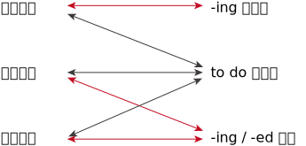

= 三大从句(名词从句, 定语从句, 状语从句)的简化形式
:toc:

---

== 总览/总结 :  "从句"与"非谓语动词"的相关性

我们可以把从句(名词从句, 定语从句, 状语从句), 简化为精炼的"非谓语形式".

三大从句, 和三类非谓语动词, 关系如下图:

- 红色箭头: 表示关系密切
- 黑色箭头: 表示关系不密切

[cols="1a,2a,2a,2a"]
|===
|Header 1 |-ing 动名词 |to do 不定式 |-ing / -ed 分词

|名词从句
|★
|☆
|

|定语从句
|
|☆
|★

|状语从句
|
|☆
|★

|
|"-ing 动名词"比较“单纯”，它只与"名词从句"发生关系，而且关系非常密切，二者可以互换。
|"to do 不定式"像是一个“万金油”，与三大从句都有联系，但联系都不是非常密切。这也就是它“不定（indefinite）”的真正含义。
|"-ing/-ed分词" 与英语中的两大重要从句("定语从句"和"状语从句")均有密切关系，可见"分词"的重要地位。 +
而"分词"与"名词从句"没有什么联系。
|===

---

== ---------- ----------

---

== 名词从句(主从, 宾从, 表从, 同位从) 的简化

....
名词从句 -> 能简化成 : ① -ing 动名词, ② to do 不定式. (因为它们能作为 n. 来用)
....

事实上, 名词从句(共4种), 它们能由三种句子转化而来 -- 即 : 陈述句, 一般疑问句, 特殊疑问句.

[cols="1a,2a,2a"]
|===
|句子 ->  |转换为"名词从句",  +
需要用的"引导词" -> |再简化为"非谓语"动词(非句子)

|陈述句
|that
| -ing 动名词

|一般疑问句
|if 或 whether
| to do 不定式

|特殊疑问句
|不需要另外添加连词，只需保留特殊疑问词（如what 或 who）即可。
|
|===

---

==== 1. that引导的"名词从句" -> 降级成"-ing 动名词"

- *It* surprised us *that John won* the marathon. +
-> 能简化成  : `动名词作主语` John's *winning* the marathon `谓` surprised us.

- *That he lost* the game `谓` came as a surprise to everybody. +
-> 简化成 : *His losing*(动名) the game `谓` came as a surprise to everybody.

---

==== 2. that引导的"同位语从句" -> 降级成"n. + of + -ing 动名词"

....
n. + that同位语从句 -> 简化成: n. + of + -ing 动名词
....

为什么简化后, 中间要添加个of ? 因为 *英文中没有“名词+ -ing 动名词”这样的结构*，所以要在"同位语从句"修饰的名词后面, 再加上一个"介词"，来连接"名词"与"-ing 动名词"，同时表达同位语关系。  +
*能担当此任的介词, 通常是 of，偶尔可以用 about 等。*

[cols="2a,1a"]
|===
|Header 1 |Header 2

|- There was no *chance 同位从 that Davy would come* from the battle alive. +
-> 简化成 :  There was no *chance of Davy coming*(`动名`) from the battle alive. +
大卫不可能从战场上生还。
|注意: *这里 chance 后的 of 是表示"同位说明"关系, 而不是定语关系.*

|- We were greatly encouraged by *the news 同位从 that China had launched* another man-made satellite. +
-> 简化成 : We were greatly encouraged by *the news of China having launched(动名)* another man-made satellite.
|动名词的复合结构 China having launched ...，放在介词 of 后面，来补充说明news。 +
*这里的of表示"同位说明"关系。*

|- Anyone [with half an eye on the unemployment figures] knew that {主 *the assertion 同位从 that economic recovery would be* just around the corner 谓 was untrue}. +
-> 简化成 : Anyone with half an eye on the unemployment figures knew that {*the assertion about 动名复合 economic recovery being (动名)* just around the corner 谓 was untrue}.

任何人只要稍稍看一眼目前的失业率就能知道，有关经济复苏即将到来的断言, 是不符合事实的。
|"动名词"的复合结构 economic recovery *being* just around the corner，*放在介词about后面，来补充说明 assertion。这里的 about 表示"同位说明"关系。*

|===

---

==== 3. that引导的"宾语从句" -> 降级成"-ing 动名词" 或 "to do 不定式"

到底是转换为"-ing 动名词"? 还是 "to do 不定式"? 主要与"*主句的谓语动词*"的用法密切相关。

==== ---- (1) 主句中的"谓语动词", 要求后面只能接"-ing 动名词"的话, -> 则该宾语从句就只能简化成 "-ing 动名词"

[cols="1a,1a"]
|===
|Header 1 |Header 2

|-  I *consider* that 宾从 I *will emigrate to* America in the future. +
-> 简化成 : I consider `宾` *emigrating(动名) to* America in the future.
|由于"主句"的谓语动词 consider 的后面, 要求接"动名词" (`=you are considering *doing* something`)，不能接不定式，所以其后的宾语从句就只能简化为"动名词"。

|- Jane's mother *insisted* that 宾从 she *should go swimming* with her brother.  +
-> 简化成 : Jane's mother *insisted on* `宾` her *going(动名) swimming* with her brother.
|有的"主句的谓语动词"后面, 还需添加一个"介词"，然后才能接"动名词"作宾语。

因为 *主句的谓语 insist 的后面, 要接介词on 之后, 才能接宾语(`=INSIST ON/UPON STH / INSIST ON DOING STH)*, 所以现在它后面的宾语, 从"宾语从句"改成"非谓语动词"时, 即要接"-ing 动名词"时, 也要转成 "insisted on + -ing 动名词"

|===

---

==== ---- (2) 主句中的"谓语动词", 要求后面只能接 "to do 不定式"的话, -> 则该宾语从句就只能简化成 "to do 不定式"

[cols="1a,1a"]
|===
|Header 1 |Header 2

|- I *hope* that 宾从 I *can drive* to work in my own car.  +
-> 简化成 : I hope `宾` *to drive* to work in my own car.
|主句的谓语 hope 后面, 要求接"to do 不定式"，不能接"-ing 动名词"，因此它后面的宾语从句, 要简化为"非句子"时, 就只能简化为" to do 不定式"。
|===

---

==== 4. 由 whether 或 what 等引导的"疑问句"名词从句(主要是"宾语从句") -> 降级成 "to do 不定式"

[cols="2a,1a"]
|===
|Header 1 |Header 2

|- She can't decide 宾从 *whether* she *should go* with him or stay home. +
-> 简化成 : She can't decide *whether to go* with him or（to）stay home.
|这里的"to do 不定式"具有“应该”的情态意义。

|- I don't know *what I should do*. +
-> 简化成 : I don't know *what to do*.
|这里的"to do 不定式"具有“应该”的情态意义。

|- Please tell me *how I can get to* the bus station.  +
-> 简化成 : Please tell me *how to get to* the bus station.
|这里的"to do 不定式"具有“能够”的情态意义。

|===

---

== ---------- ----------

---

== 定语从句的简化

*定语从句, 就相当于一个adj.的作用. +
那么所有可以起到adj.功能的成分, 都能用来代替定语从句, 或者说, 定语从句可以简化成这些成分.*

*哪些成分, 也相当于adj.呢, 能用做定语呢 ?*

- -ing, -ed 分词短语
- to do 不定式

*所以, 定语从句, 就能简化成 -ing/-ed 分词短语, 或 to do 不定式.*

其实, 用作"后置定语"的短语(adj.短语, -ing/-ed 分词短语, 介词短语), 都可以看作是"定语从句"简化后的结果，或者说, 都可以用"定语从句"来改写成。*把一个"定语从句"进行简化，简化的结果, 必然也可能是这样的一些短语.*

---

==== 把"定语从句"简化为"非谓语"的形式, 是以丧失"时态上"的精确性为代价的.

读者要牢记这一点：**把"定语从句"简化为"非谓语"的形式, 是以丧失"明晰性"（clarity）为代价的，即逻辑语义关系的明晰性降低了，并且会丢失"时态上"的精确性. 意思变得模糊了。**

[cols="1a,1a"]
|===
|Header 1 |Header 2

|- `主` The people *who were responsible for the incident* `谓` were all punished. +
-> 简化成: `主` The people *responsible for the incident* `谓` were all punished.
|responsible for the incident 是 adj.短语, 可以看做是原先"定语从句"简化后的结果。

|- the girl *who was standing in the corner*. +
-> 简化成: the girl *standing in the corner*.
|*注意: 完整定语从句时, 其谓语展现了清晰的时态 was standing, 即是一个"过去进行"的情形. +
但在简化后, 变成了分词短语 standing, 我们就看不出具体的动作时态了*, 到底是 is standing呢? 还是 was standing呢? 甚至还可能是一般情况如 who *stands* 或 who *stood* 等。

所以, "后置定语"与"被修饰名词"之间的逻辑语义关系, 变得模糊了，不像"定语从句"表达得那么明确。

---

还可进一步简化:

- the girl *in the corner*.

这样, 连分词standing 都没有了, 语意就更模糊了. 这女孩到底是以什么个动作呆在角落里的? 是 *sitting* in the corner, 还是 *standing* in the corner, 还是 *lying* in the corner 等等呢?

|===

所以, 一个"定语从句"简化后, 就成了"-ing/-ed 分词短语"、"介词短语"、"adj.短语", "to do 短语"等等. 但简化后, 原本定语从句中所含有的清晰的时态, 也会丢失.

更能反映这一问题的例子见下:

[cols="1a,1a"]
|===
|定语从句 |-> 简化为"非谓语动词之(分词)"

|- The person (who *writes* reports) +
- The person (who *is writing* reports) +
- The person (who *wrote* reports) +
- The person (who *was writing* reports) +
- The person (who *will write* reports) +
- The person (who *will be writing* reports) +
|- The person *writing* reports... +
-> 只有"主动/被动关系"能看出, 而"时态信息"全部丢失.

从这个例子, 我们能看出: *一个分词writing, 可以对应的多种时态的谓语形式*. (它们的共同点只是 "主动"关系 -- 这正是 "-ing 现在分词"所能够表达的)
|===

下表是 "-ing 现在分词", 和"-ed 过去分词", 在"状态上"(注意不是"时态"!)和"主动被动态"上, 能表达的范畴.

[cols="3a,1a,1a"]
|===
|Header 1 |主动态 |被动态

|一般 do
|-ing
| -ed

|进行中 ing
|-ing
|×

|已完成 ed
|-ed
|-ed

|↑ 注意: *这里都没有涉及动作的"具体时间"(是"过去"还是"现在"?), 因为"分词"动作的确切时间, 是要通过"句子谓语"的时态来表现出来的.* +
事实上, "分词动作"发生的时间, 和"主句谓语"动作发生的时间, 两者一般是一致的. 比如同样发生在"过去"，或同样发生在"现在"。
|
|
|===

---

==== "分词动作"发生的时间, 和"主句谓语"动作发生的时间, 两者一般是一致的: 你在哪个时间,我也在哪个时间 -> 因此, 分词动作的时间,与句子谓语的时间, 两者若不一致, 则不能使用分词来造句(即定语从句不能简化成分词)，而只能用完整的定语从句。 -> 因为两者时间不一致, 你强行简化(造成两者动作时间一致化, 两维变一维), 会造成句子意思的扭曲.

[cols="1a,2a"]
|===
|Header 1 |Header 2

|- The men *working* on the site *were* in some danger.
|分词无法表示出确切的时间概念, 所以只能看主句谓语的时态.  +
本句, 主句谓语were 表明时间是"过去"，所以分词working 的发生时间也是"过去".

所以本句的分词 working, 还原成完整的定语从句, 定语从句中的"谓语的时态"就是 were working:

- The men who *were working* on the site *were* in some danger.

|- The men *working* on the site *are* in some danger.
|"分词动作", 到底是在什么时间发生的? 看"主语谓语"的时态. 本句, 主句的谓语are 表明时间是"现在"，所以分词working的发生时间,也是"现在".

"分词短语"还原成完整的"定语从句", 从句中的时态就是:

- The men who *are working* on the site *are* in some danger.
|===

总之，对于分词, 我们现在就知道了两点:

1. 分词的动作, 是没有时间概念的. (*因为分词不是时态!* 光看分词本身, 不表达出任何时间概念. 因为分词只表达"主动/被动" 和 "状态(一般状态, 进行中, 已完成)").

2. *分词动作的发生时间, 只能通过"句子谓语"的时态体现出来，与它一致*. 即“分词动作的时间,与句子谓语的时间, 有一致性原则”。

*正因为把"定语从句"简化为"非谓语"的形式后, 会丢失"时态"和"逻辑语义"的明晰性（clarity）, 所以这就是某些"定语从句"不能简化成"分词短语"的一个重要原因。*

*因此，一个"定语从句"能否简化成"分词短语", 就看两者的发生时间是否一致. 如果"定语从句的谓语动作"的时间, 与"主句谓语"的时间不一致时，那么这个"定语从句"通常就不能改写成"分词短语", 因为你会把原本两个不同的时间, "一致化"成同一个时间, 造成句子意思被改变.*

如:

[cols="1a,2a"]
|===
|Header 1 |主从句两者的谓语时间不一致, 你强行简化(造成两者动作时间一致化, 两维变一维), 会造成句子意思的扭曲.

|- *Do* you know the boy who *broke* the window?
|-> 主句的谓语do, 是一般现在时态. +
-> 定义从句的谓语broke, 是一般过去时态. +
两者在时间上不一致, 所以不能把这个"定语从句"简化为"分词短语".

如果你强行简化, 变成:

- *Do* you know the boy *breaking* the window?

根据"动作时间看齐原则". 分词动作的发生时间, 就变成了和主句谓语一样的"现在时", 这样句子意思就变成了: "你认识现在正在那里砸窗户的那个男孩吗？" 完全扭曲了原意.

|- The man *who cooked* for the students *has died*.
|-> 从句的谓语cooked是"过去时态" +
主句的谓语has died 是"现在完成时态" +
两者时间不一致 (一个是"过去", 一个是"现在"), 就不能做简化.

你强行简化, 就变成:

- The man *cooking for* the students *has died*.

根据"分词时间,向主句谓语的时间看齐"原则, 还原成完整的定语从句, 就变成了：

- The man *who is cooking/cooks for* the students *has died*.  ×

从句谓语 is cooking或cooks, 表明这个人现在还活着，但主句的谓语has died 却说他已经死了，造成前后矛盾. 所以, 本句定语从句就不能简化.

|- *Do* you know the fire __ yesterday? +
A.which *broke* out √ +
B.*breaking* out
|这个句子, 主句谓语do 是现在时.

B选项, 用"分词"的话, 根据 "'分词动作时间'向'主句谓语时态'看齐原则", 该 breaking 的时间也应该是现在时, 具体就是 is breaking. 这和句子最后的时间 yesterday 相矛盾. 所以 B选项是错的.

所以,"分词"动作的时间, 与"句子"谓语动作的时间, 无法一致的话, 该定语从句就不能做简化, 只能使用完整的"定语从句"来表达. 所以 A选项是正确的. 因为定语从句中的谓语能保有自己的时态.

|===

---

==== 若"从句谓语动作"发生的时间, 早于"主句谓语动作"发生的时间 ->  则该"定语从句"不能简化为"分词". 因为两者的谓语发生时间, 不符合"一致性原则"

[cols="1a,2a"]
|===
|Header 1 |Header 2

|- The girl *who stood* at the gate yesterday *is* my sister.
|"从句谓语 stood" 早于 "主句谓语 is" 发生, 所以该定语从句不能简化. 因为两者的谓语发生时间, 不符合"一致性原则".

若你强行简化成 :

- The girl *standing* at the gate yesterday is my sister.

还原成完整的定语从句后, 根据"分词动作的发生时间, 向主句谓语的时态看齐"原则, 只会是 :

- The girl *who is standing* at the gate yesterday is my sister.

你就把从句的动作时间都变了!
|===

---

==== 如果"定语从句"的时态为"完成时态"时，也不能将从句简化为分词 -> 因为 having done 和 having been done 都不能做定语! 英美人从不这样用.

- Those *who have finished* their exercises may go now. +
-> 不能简化成 Those *having finished* their exercises may go now. × <- 英语中没有这样的句子构造形式。

---

==== 定语从句若含有情态动词, 则不能被简化 -> 因为简化后会失去情态的意味, 造成句子意思会被扭曲.

*如果定语从句中含有情态动词，具有特定的情态含义，简化为分词就会失去情态的意味，所以一般不能简化。*

- Is there anyone who *can* answer the question? +
-> 不能简化为分词说成：Is there anyone *answering* the question? × 因为简化后会导致"情态动词"意义丢失了

不过帮助构成"将来时"的 will和shall, 不在此列:

- The boy *who will come* to see you tomorrow will bring you that book. +
-> 可简化成 The boy *coming* to see you tomorrow will bring you that book.

---

==== 定语从句的谓语是 be 时, 就不能被简化 -> 因为英语中, "being + adj." 这种结构不能做后置定语

定语从句中是由be动词作谓语时, 就不能简化为分词.

- Those *who are* busy don't have to go. +
那些正在忙着的人不必去。

-> 不能简化为分词说成：Those *being busy* don't have to go.  × +
因为**英语中，“being+形容词”这样的结构, 不能作后置定语。**

---

==== 什么样的"定语从句", 才能简化为短语? -> 定语从句前的"关系词", 在逻辑上是作为定语从句的"主语"时.

[cols="1a,1a"]
|===
|Header 1 |Header 2

|- `主` The man *that I saw* at the party last night `系` is my teacher.
|这里, 关系词that, 作"定语从句"中谓语saw的宾语. +
*这种逻辑关系时, 我们可以把that省去, 但也就到此为止了. 我们无法进一步把它简化为短语形式.*

|===

所以一般的规律是：*如果关系词(假对象,如that) 在"定语从句"中充当"宾语"，这样的"定语从句"就无法简化成一个短语。* +
*只有当"关系词"在"定语从句"中作"主语"时，才能把该"定语从句"简化为短语。*

---

==== (1)定语从句的"主动式" -> 简化成 -ing短语; (2)定语从句的"被动式" -> 简化成 -ed短语

对于可以简化成"分词短语"的定语从句, 一般来说 :

- 定语从句的**主动式, 可以转换成 -ing 短语**，因为"现在分词"表示"主动"的动作；
- 定语从句的**被动式, 可以转换成 -ed短语**，因为"过去分词"通常表示"被动"的动作。

[cols="1a,3a"]
|===
|符合"时间一致性原则"后, "定语从句"才能进行简化成"分词短语" |定语从句 -> 简化成 -ing(主动) /-ed(被动)

|
- 主句谓语 : do 时态,
- 从句谓语 : do 时态
|-  China *is* a developing country *which belongs to* the third world. +
-> 简化成 China is a developing country *belonging to* the third world.

主从句的谓语时间一致, 都是"现在时", 可以进行简化. +
定语从句是"主动"语态，所以用 -ing
 来简化. +
*"-ing 现在分词"表示 ①主动的、②一般的 动作。*

---

- Books *which are written* in English *are* more expensive. +
-> 简化成 Books *written* in English are more expensive. +
英文书一般都较贵。

主从句的谓语时间一致, 都是"现在时", 可以进行简化. +
定语从句是"被动"语态，所以用 -ed
 来简化.  +
*"-ed 过去分词"表示 ① 被动的、 ②一般的 动作。*

|- 主句谓语 : do 时态,
- 从句谓语 : be doing 时态
|- *Do* you know the boy *who is playing* the violin? +
-> 简化成 Do you know the boy *playing* the violin?

主从句的谓语时间一致, 都是"现在时", 可以进行简化. +
*-ing现在分词表示 : ①主动的、②进行中的 动作。*

---

- The car *that is being repaired* is mine. +
-> 简化成  The car *being repaired* is mine.

*定语从句是"现在进行时"的"被动"语态，所以也用"-ing现在分词"的被动形式 being done 来简化. 表示 ①进行中的, ②被动的 动作.*

|- 主句谓语 : did 时态,
- 从句谓语 : did 时态
|
- The man *who stole* into the room *was caught* immediately. +
-> 简化成 The man *stealing* into the room was caught immediately. +

steal (v.) 偷偷地（或悄悄地）移动 /~ (sth) (from sb/sth) 偷；窃取

主从句的谓语时间一致, 都是"过去时", 可以进行简化. +
定语从句是"主动"语态，所以简化成 -ing 现在分词.

|主从句的谓语时间不一致
|在某些特殊情况下，尽管"主句"与"从句"谓语的时间不一致，但在不影响句子意思表达的情况下，可以把"定语从句"简化为"分词短语"。

- The girl *who is playing* basketball *used to be* very weak. +
-> 简化成 The girl *playing* basketball used to be very weak.

本句话, 主句谓语是 did时态, 从句谓语是 be doing 时态.

---

- The car *that was repaired* yesterday by him is mine. +
-> 简化成 The car *repaired* yesterday by him is mine.

本句话, 主句谓语是 do 时态, 从句谓语是 did 时态.

---

**但是，若简化后影响了句子意思的表达，则只能保留"定语从句"，而不能简化为"分词"。**比如这个句子 *Do* you know the boy *who broke* the window.

|===

---

==== 定语从句起(adj.)定语作用, to do 不定式也能起(adj.)定语作用

上面讨论的 -ing/-ed 分词, 具有 adj.功能, 主要用来作定语 (即 "定语从句"可简化成"分词短语")。 +
同样,  to do 不定式, 也可当作 adj. 来用，在句中作定语。

一般来说，*被 the only，the last，the next，序数词和最高级形容词修饰的名词，其后所接的"定语从句", 往往要用 "to do 不定式" 来替换。*

- You are *the only one that can understand* me. +
-> 简化成 You are *the only one to understand* me.

- *The next train that arrives* is from New York. +
-> 简化成  *The next train to arrive* is from New York.

- Clint was *the second person that fell* into this trap. +
-> 简化成  Clint was *the second person to fall* into this trap.

---

== ---------- ----------

---

== 状语从句的简化

==== 只有当"状语从句的主语"和"主句的主语"相同时，才能把状语从句简化成短语

什么情况下, "状语从句"才可能被简化? 一般来说，*只有当"状语从句的主语"和"主句的主语"相同时，才能把状语从句换成短语。否则，会引起句义的改变。*

- While *the teacher* was lecturing to the class, *I* fell asleep.

这里"从句的主语"是the teacher，而"主句的主语"是I，两者不一致，因此该"状语从句"不能简化成"短语"。 +
若强行简化成"现在分词短语", 说成：

- While *lecturing* to the class, *I* fell asleep.

意思就变成了 “当我在给这个班上课时，我睡着了”, 完全扭曲原意.

*在三大非谓语当中，只有 to do 不定式, 和 -ing /-ed 分词, 才可能作状语，因而"状语从句"自然也只能简化成这两种非谓语形式。*

---

==== 状语从句 -> 往往可以简化成"-ing /-ed 分词短语"

*由于 -ing /-ed 分词, 具有 adv. 的功能，可以在句中作"状语"，所以"状语从句"往往可以简化成"分词短语"。*

*具体的简化操作是：如果"状语从句"中含有be动词，只需把"从句主语"和"be动词"省去，即简化成短语。*

[cols="3a,1a"]
|===
|Header 1 |Header 2

|- A zero can have its meaning only *when it is used* with real numbers; thoughts can give off brilliant light only *when they are put* into actions. +
-> 简化成 A zero can have its meaning only *when used* with real numbers; thoughts can give off brilliant light only *when put* into actions. +
零，只有和实数用在一起才有意义；思想，只有付诸行动才能发出光芒。
|这里两个when引导的状语从句中, 分别省去了it is和they are。即简化为 -ing/-ed 分词短语.

|-  A tiger can't be tamed *unless it is caught* very young. +
-> 简化成 A tiger can't be tamed *unless caught* very young. +
老虎只有在年幼时抓来才能被驯服。
|unless引导的状语从句中, 省去了it is。即简化为 -ing/-ed 分词短语.

|- *Since I came* to Beijing, I have made many new friends. +
-> 简化成 *Since coming* to Beijing, I have made many new friends. +
来到北京之后我交了很多朋友。

- *After he jumped* out of a boat, the man was bitten by a shark. +
-> 简化成 *After jumping* out of a boat, the man was bitten by a shark.

|*如果"状语从句"中没有 be 动词，我们可把"从句的主语"省去, 并且把动词变成"现在分词-ing"形式。*

对于这种状语从句的简化，*其实就相当于分词作状语.*

|===

---

==== 目的状语从句 -> 能简化为 to do 不定式

*能够简化为 "to do不定式"的状语从句, 一般只有"目的状语从句"，因为在英语中，作"目的状语"几乎成了"to do不定式"的专属功能。*

-  I spoke slowly and clearly *so that/in order that* the audience could understand me. +
-> 简化成 I spoke slowly and clearly *in order for the audience to understand* me.

- They carved the words on the stone *so that/in order that* the future generation should remember what they had done. +
-> 简化成 They carved the words on the stone *in order for the future generation to remember* what they had done. +
他们在石头上刻字，以便后人记住他们做过的事情。

---

