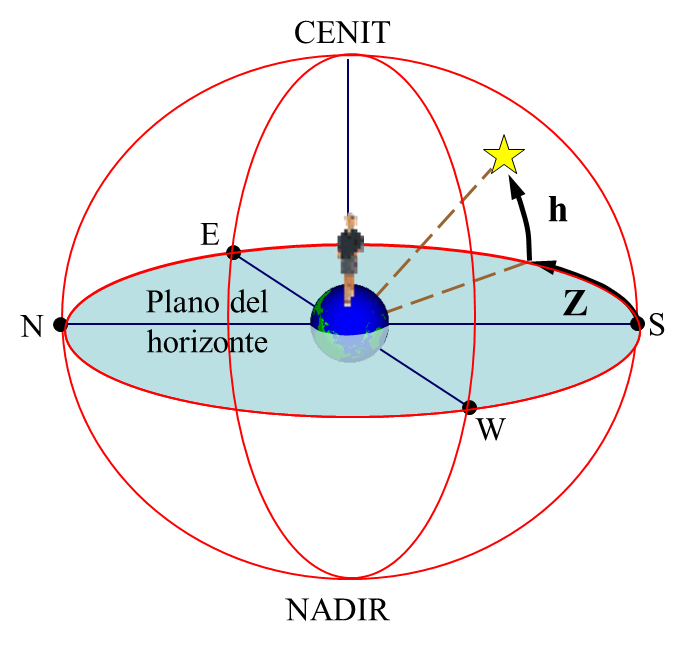

= 0101
:toc: left
:toclevels: 3
:sectnums:

'''

== China tries to stop academics from taking its constitution 宪法；章程 literally

中国试图阻止学者从字面上理解其宪法

A YEAR BEFORE Xi Jinping became China’s leader, a 47-year-old professor at Peking University, Zhang Qianfan 张千帆, *delivered(v.)发表；宣布 a talk* to mark(v.) the 100th anniversary of the collapse of China’s last *imperial 帝国的；皇帝的 dynasty* 王朝；朝代, in 1911, *charting 记录，跟踪（进展或发展） the history of* efforts [since then] *to instil 逐渐灌输，逐步培养（感受、思想或行为） respect for* constitutional principles.

Students unable to find seats in the packed(a.) 异常拥挤的；挤满人的 *lecture （通常指大学里的）讲座，讲课，演讲 theatre*(n.) 戏院；剧场；露天剧场 stood(v.) shoulder-to-shoulder 肩并肩地；齐心协力地 around the walls.

They grinned 露齿而笑；咧着嘴笑；龇着牙笑 and clapped when he started(v.) by saying: “I have written down my true feelings... *They may sound fierce* 狂热的；强烈的；猛烈的. Forgive me if they *cause offence*(n.) 冒犯；搅扰；侮辱.”

.标题
====
.deliver
/dɪˈlɪvər/ (v.) to give a speech, talk, etc. or other official statement 发表；宣布；发布

.mark
(v.) to celebrate or officially remember(v.) an event that you consider to be important 纪念；庆贺

.chart
(v.)to record or follow the progress or development of sb/sth 记录，跟踪（进展或发展）

.instil
/ɪnˈstɪl/ (v.) ~ sth (in/into sb) : to gradually make sb feel, think or behave in a particular way over a period of time 逐渐灌输，逐步培养（感受、思想或行为）

.dynasty
=> 来自希腊语dynamis, 力量，权力，统治者。引申词义朝代。

.offence
=>  of-对面 + -fenc-打击 + -e

在习近平成为中国领导人的前一年，北京大学(Peking University) 47岁的教授张千帆, 在纪念中国最后一个封建王朝1911年覆灭100周年的演讲中，描绘了自那以来, 中国在向民众灌输尊重宪法原则方面所做的努力的历史。挤得水泄不通的大讲堂里，学生们肩并肩地站在墙边。在学生们的微笑与鼓掌声中, 张千帆说:“我已经写下了我的真实感受……它们可能听起来带有强烈的个人情感。如果冒犯了你，请原谅我。”
====

The thin, bespectacled(a.) 戴眼镜的 academic `谓` *held his audience spellbound*(a.)入迷；出神；着魔.

Those who, unable to find space in the room, had crowded 挤满；塞满；使…拥挤 by the doorway, were still there when he finished, almost two hours later.

That was fortunate(a.) 幸运的；交好运的, because his final point 论点；观点；见解 was the most powerful in a lecture （通常指大学里的）讲座，讲课，演讲 packed with *indictments 控告；起诉 of* China’s failure(n.) *to implement (v.)使生效；贯彻；执行；实施 the guarantees 保证；担保 of* its constitution, including freedom of speech, of assembly (n.)集会；（统称）集会者 and of association 协会；社团；联盟.

Mr Zhang *wrapped up* 圆满完成，顺利结束（协议或会议等） by listing(v.) 12 places where *authoritarian (a.)威权主义的；专制的 rule had (at least briefly) crumbled*（使）破碎，成碎屑, from the Soviet Union to Taiwan to countries that had recently experienced the Arab spring.

“What their people can do,” he said, “the Chinese” -- and here he paused briefly while the audience began to laugh and clap -- “people can certainly do.”

Wild 感情炽烈的 applause(n.) 鼓掌；喝彩 ensued(v.)接着发生；因而产生. Someone cried, “Good!”

.标题
====
.bespectacled
=> 前缀be-, 强调。词根spect, 看，同spectacle,眼镜。

.spellbound
=> spell,符咒，咒语，bound,绑定的。

.fortunate
(a.) ~ (to do sth) /~ (in having...) /~ (for sb)(that...) : having or bringing an advantage, an opportunity, a piece of good luck, etc. 幸运的；交好运的；吉利的

.assembly
(n.) the meeting together of a group of people for a particular purpose; a group of people who meet together for a particular purpose 集会；（统称）集会者

.wrap up
to complete sth such as an agreement or a meeting in an acceptable way 圆满完成，顺利结束（协议或会议等）

.authoritarian
/əˌθɔːrəˈ-te-riən/ (a.) believing that people should obey authority and rules, even when these are unfair, and even if it means that they lose their personal freedom 威权主义的；专制的

.crumble
(v.)to break or break sth into very small pieces （使）破碎，成碎屑

.ensue
=> en-, 进入，使。-sue, 顺序，词源同suit, sequence.

他最后的观点是最有说服力的，因为他的演讲充斥着对中国未能履行宪法保障的控诉，包括言论、集会和结社自由。 +
最后，张列举了12个威权统治已经(至少短暂地)崩溃的地方，从苏联到台湾，再到最近经历过“阿拉伯之春”的国家。
====

But he kept his job. And remarkably(ad.) 非凡的；显著的；引人注目的 his textbook, “An Introduction to the Study of *Constitutional Law*”, first published in 2004, was republished in 2014 by Law Press 杂志；报刊；印刷媒体, which is controlled by *the Ministry of Justice*.

The preface（书的）前言，序言 *sets the tone*: “The study of constitutional law *must break down forbidden 禁止的；不准的 ideological 思想体系的，意识形态的 zones*, because the rights of Chinese citizens *accept no forbidden zones*.”

.标题
====
序言定下了基调: “宪法研究必须打破思想禁区，因为中国公民的权利不接受任何禁区。”
====

'''

==== <pure> China tries to stop academics from taking its constitution literally

A YEAR BEFORE Xi Jinping became China’s leader, a 47-year-old professor at Peking University, Zhang Qianfan, delivered a talk to mark the 100th anniversary of the collapse of China’s last imperial dynasty, in 1911, charting the history of efforts since then to instil respect for constitutional principles. Students unable to find seats in the packed lecture theatre stood shoulder-to-shoulder around the walls. They grinned and clapped when he started by saying: “I have written down my true feelings… They may sound fierce. Forgive me if they cause offence.”

The thin, bespectacled academic held his audience spellbound. Those who, unable to find space in the room, had crowded by the doorway, were still there when he finished, almost two hours later. That was fortunate, because his final point was the most powerful in a lecture packed with indictments of China’s failure to implement the guarantees of its constitution, including freedom of speech, of assembly and of association. Mr Zhang wrapped up by listing 12 places where authoritarian rule had (at least briefly) crumbled, from the Soviet Union to Taiwan to countries that had recently experienced the Arab spring. “What their people can do,” he said, “the Chinese” — and here he paused briefly while the audience began to laugh and clap --“people can certainly do.” Wild applause ensued. Someone cried, “Good!”

Such a scene was extraordinary even at the time. The authorities were determined to prevent any attempt to replicate the Arab uprisings;  anonymous calls online for public gatherings in support of them drew more police than protesters. Mr Zhang says he was reprimanded for his speech. Invitations for him to talk on campuses dried up. But he kept his job. And remarkably his textbook, “An Introduction to the Study of Constitutional Law”, first published in 2004, was republished in 2014 by Law Press, which is controlled by the Ministry of Justice. The preface sets the tone: “The study of constitutional law must break down forbidden ideological zones, because the rights of Chinese citizens accept no forbidden zones.”

'''

== Why so glum(a.)忧郁的；死气沉沉的；闷闷不乐的, China?

IT TOOK 125 years for *America’s Declaration 公告；宣告；宣言 of Independence* to reach a wide Chinese audience, and when it did, some *lofty 崇高的；高尚的 phrases* got lost.

主 The earliest known(a.)知名的；已知的 Chinese translation 翻译;译本 of the declaration, published in 1901 by young nationalists burning(v.) 有强烈的情感；渴望 to overthrow the Qing empire, 系 is an impatient, combative text.

The document’s name, noted(v.) the scholar who rediscovered it, Frank Li of the Chinese *Academy of Social Sciences*, became the “American War Proclamation 宣言；公告；声明 of Independence”.

The rights it deemed(=to have a particular opinion about sth 认为；视为；相信) inalienable(=that cannot be taken away from you 不可剥夺（或分割）的) -- “life, liberty and the pursuit of happiness” -- turned into something bleaker(a.)(=exposed, empty, or with no pleasant features 无遮掩的；荒凉的；索然无味的;/ not encouraging or giving any reason to have hope 不乐观的；无望的；暗淡的): “life, liberty and all interests”.

.标题
====
.lofty
(a.) very high and impressive 巍峨的；高耸的; / showing a belief that you are worth more than other people 傲慢的；高傲的; /deserving praise because of its high moral quality 崇高的；高尚的

.burn
(v.) (with sth) :to feel a very strong emotion or desire 有强烈的情感；渴望; / to make sb very angry 激怒；使大怒

.proclamation
[ CU] an official statement about sth important that is made to the public; the act of making an official statement 宣言；公告；声明

- bleak => 词源同bleach, 漂白，指苍白的，暗淡的。 +
-> bleak(a.)(=(of a place 地方) exposed, empty, or with no pleasant features 无遮掩的；荒凉的；索然无味的) concrete housing 索然乏味的混凝土住宅群 +
-> a bleak(=(of a situation 状况) not encouraging or giving any reason to have hope 不乐观的；无望的；暗淡的) outlook/prospect 暗淡的前景╱前途 +
-> a bleak(a.)(=(of the weather 天气) cold and unpleasant 阴冷的) winter's day 一个阴冷的冬日

《美国独立宣言》花了125年的时间才接触到广大的中国观众，当它到达时，一些崇高的短语就丢失了。该宣言最早的中文译本, 由渴望推翻清帝国的年轻民族主义者, 于1901年出版，是一篇不耐烦、好斗的文本。 重新发现该文件的学者，中国社会科学院的弗兰克·李（Frank Li）指出，该文件的名称成为“美国独立战争宣言”。它认为不可剥夺的权利——“生命、自由和追求幸福”——变成了更黯淡的东西：“生命、自由和一切利益”。 (happiness 被改成了 all interests)
====

It explores how China’s propaganda machine *devote (v.)把…用于 extraordinary efforts to promoting*  促进；推动 the idea that the Chinese people enjoy good and meaningful lives under Communism -- precisely （加强同意的语气）对，的确如此，一点也不错 because economic growth alone `谓` *does a poor job of* generating happiness.

[Back in 1974] Richard Easterlin, an American economist, *spotted 看出；注意到 a puzzle* 不解之谜；疑问.

Although richer countries are generally more contented(a.)（尤指因生活好而）满意的，惬意的，满足的, rising *material prosperity* does not necessarily lead to *ever不断地；总是；始终-higher levels of* self-reported well-being.

“Chinese Discourses 论文；演讲;语篇；话语” calls China a giant Easterlin 美国经济学家伊斯特林 Paradox 悖论.

Chinese *real GDP per person* grew more than fivefold between 1990 and 2015.

Yet, rather than *climbing [in lockstep*(n.) 齐步走（步伐）] with the economy, the self-reported happiness of the Chinese fell sharply from 1990, *reaching a nadir* (n.)最糟糕的时刻；最低点 in 2000-05 (a time of breakneck (a.)飞速惊险的;断颈 GDP growth) before recovering.

*It has probably yet(ad.)用于否定句和疑问句，谈论尚未发生但可能发生的事 to regain 回到（原位）；返回 the level of* 1990.

====
.DEVOTE STH TO STH :
to give an amount of time, attention, etc. to sth 把…用于

.ever
(=all the time or every time; always 不断地；总是；始终

.discourse
[ CU] (n.)) ( formal ) a long and serious treatment or discussion of a subject in speech or writing 论文；演讲

.paradox
=> 来源于希腊语中由para(在旁)和doxa(观点)组成的复合词paradoxon(相反的观点)。 词根词缀： para-侧面 + dox(-doc-)教

.Easterlin Paradox
伊斯特林悖论 : 由美国南加州大学经济学教授理查德·伊斯特林（R.Easterlin）在1974年的著作《经济增长可以在多大程度上提高人们的快乐》中提出, 即他发现一个令人迷惑的重要问题是：为什么更多的财富并没有带来更大的幸福？对此的解释性理论包括:

1. 经济学仅关注收入、财富和消费，而忽略了影响人们幸福的其他许多重要因素，包括：激励与创造、健康、政治参与、社会渴望、自由、利他主义的丧失、不平等、社会资本的减少和地位外部性。特别是，如果这些非经济因素与收入、财富和消费等经济因素呈负相关时，那么随着GDP的增长，许多影响幸福的非经济因素会下降，从而在不同程度上抵消经济因素带来的正面作用.  +
2. 个人效用与自己的收入水平正相关，但与社会的平均收入水平（攀比水平）负相关；当社会变得更富裕时，攀比水平随之提高，导致收入—幸福曲线下移，从而使得总效用水平保持不变。一个人的主观福利与其相对地位有关。因此，地位竞争仅仅导致个人福利的再分配，而作为一个整体的社会的幸福并没有增加。

.-fold :
乘以；…倍；由…部分组成

.nadir
/ˈneɪdər/ [ sing.] ( formal ) the worst moment of a particular situation 最糟糕的时刻；最低点 +
=> 来自阿拉伯语nazir,相反的，来自nazir as-samt,反方向的，与天顶相反的底点，词源同zenith.后引申词义最低点。

.breakneck
(a.)very fast and dangerous 飞速惊险的;断颈

.yet :
ad. used in negative sentences and questions to talk about sth that has not happened but that you expect to happen （用于否定句和疑问句，谈论尚未发生但可能发生的事） +
-> I haven't received a letter from him yet. 我还没有收到他的信呢。 +
-> ‘Are you ready?’ ‘No, not yet.’ “你准备好了吗？”“还没有。” +
-> We have yet to decide what action to take (= We have not decided what action to take) . 我们尚未决定采取何种行动。

它探讨了中国的宣传机器如何做出非凡的努力来宣传这样一种观念，即在共产主义制度下，中国人享受着美好而有意义的生活 ——正是因为经济增长本身在产生幸福感方面做得不够。

早在 1974 年，美国经济学家理查德·伊斯特林 (Richard Easterlin)就发现了一个谜题。尽管较富裕的国家通常更满足，但物质繁荣的增加并不一定会导致自我报告的幸福水平不断提高。《中国话语》称中国是一个巨大的伊斯特林悖论。从 1990 年到 2015 年，中国人均实际 GDP增长了五倍多。然而，中国人自我报告的幸福感并没有随着经济同步攀升，而是从 1990 年开始急剧下降，并在 2000-05 年达到最低点（这段时间GDP 的高速增长）在恢复之前。它可能还没有恢复到1990.
====

A chapter of the 2017 World Happiness Report, co-written by Mr Easterlin, *dug into 探究；细查 Chinese data* from the previous quarter-century /and *found(v.) weak correlations 相互关系；关联 between* happiness *and* several trends *commonly blamed for* （对坏事）负有责任 gloom.

Take 以…为例；将…作为例证 *inequality of income*, which in China *marched (v.)齐步走；行进 upwards* between 1980 and about 2010.

[During the same period] levels of self-reported happiness *fell and rose in a U-shape*.

The chapter studies(v.) other “predictors” 预测器；预示物 of happiness, including *the consumption 消耗，消耗量 of coal* 煤 (a proxy（测算用的）代替物，指标 for pollution), housing prices, *GDP per person*, *healthy-life expectancy*, self-reported levels of freedom to make big decisions /and corruption (measured by asking whether bribery is acceptable).

*None of these indicators tracks(v.) 跟踪；追踪* happiness *closely* in China.

Two others *are a good fit*: unemployment and *access to social safety nets*.

`主` *Misery* (n.) 痛苦；悲惨; 穷困, notably (ad.)尤其；特别 among low-income Chinese, `谓` *deepened*（使）变糟，恶化，严重 as unemployment spiked(v.) 迅速升值；急剧增值; /用尖物刺入（或扎破） /and *safety nets collapsed* in 2000-05, as *state-owned firms* were restructured 调整结构；改组；重建.

As employment 工作；职业；受雇 rebounded 价格等回升；反弹, so did happiness.

.标题
====
.dug into
dig deep (into sth) : to search thoroughly for information 探究；搜集；细查; /掘（地）；凿（洞）；挖（土）

.blame for
be to blame (for sth) : to be responsible for sth bad （对坏事）负有责任

.correlation +
~ (between A and B)~ (of A with B) a connection between two things in which one thing changes as the other does 相互关系；相关；关联 +
=> cor-共同 + re-回 + -lat-携带,拿取 + -ion名词词尾

.spike
[ VN] to push a sharp piece of metal, wood, etc. into sb/sth; to injure sth on a sharp point 用尖物刺入（或扎破） +
[V] ( especially NAmE ) to rise quickly and reach a high value 迅速升值；急剧增值 +
=>  可能来自中古瑞典语 spijk,钉子，来自 Proto-Germanicspikaz,钉子，来自 PIEspei,尖刺，尖 头，词源同 spire,spoke,pin.词义麦穗来自该印欧词根衍生的拉丁语 spica,麦穗，穗状花序。

伊斯特林与人合写的《2017年世界幸福报告》(2017 World Happiness Report)的一章, 深入研究了中国过去25年的数据，发现幸福与几个通常被认为是悲观的趋势之间, 存在微弱的相关性。

以收入不平等为例，从1980年到2010年，中国的收入不平等一直在上升。在同一时期，自我报告的幸福水平,呈u形下降和上升。这一章研究了其他幸福的“预测因素”，包括煤炭消费(污染的代表)、房价、人均GDP、健康预期寿命、自我报告的能做出重大决策的自由程度, 和腐败(通过询问被访者,贿赂是否可以被接受?)。这些指标中没有一个与中国人的幸福感密切相关。而另外两个却很适合:失业和社会保障。2000年至2005年，随着国有企业重组，失业率飙升，社会保障体系崩溃，中国人的苦难(尤其是低收入人群)进一步加深。而随着就业率的回升，幸福感也随之回升。
====

Even `主` people (normally considered *clear (a.)明显的；显然的；明确的 beneficiaries (n.) 受益者；受惠人 of* China’s economic opening -- the hundreds of millions of *rural migrants* who found work in cities over the past 30 years) -- `系`  *are not collectively 集体地，共同地 cheerier(a.)* 高兴的；兴高采烈的.

The most recent World Happiness Report, from 2018, finds that, on average, Chinese migrants *secure (v.)（尤指经过努力）获得，取得，实现 higher incomes* by moving to cities but, once there, say they are *less happy than* long-established 使立足；使稳固 *city folk* 人们,普通百姓.

More surprisingly, such migrants are also unhappier than cousins 远房亲戚；同辈表亲（或堂亲） who stayed in the countryside.

*Dig into the numbers*, and the jobs of the unhappiest migrants are unusually insecure (a.)不安全的；无保障的；不牢靠的, harsh 残酷的；严酷的；严厉的 and badly paid, *thrusting 猛推；冲；搡；挤；塞 them into an underclass* 社会底层；贫困阶层 made more painful by hukou 户口 *residency 居住；定居 laws* that limit their access to schooling (n.) 学校教育 for their children and other *public services*.

*Rising prosperity* cannot *compensate 补偿；弥补 for* a sense of *being left out* 忽视，不考虑；被遗忘; 排除在外.

.标题
====
.long-established
to hold a position for long enough or succeed in sth well enough to make people accept and respect you 确立；使立足；使稳固

.folk
( especially in NAmE also folks ) [ pl.] ( informal ) people in general 人们 /（某国、某地区或某生活方式的）普通百姓

即使是那些通常被认为是受益于中国经济开放的人 —— 在过去30年里, 在城市中找到工作的数亿农民工 ——总体上也并不乐观。最新的《世界幸福报告》(World Happiness Report)-- 从2018年开始发布 — 该报告发现，平均而言，中国的移民, 通过移居到城市中来获得更高的收入，但一旦移居完成之后，他们却表示，自己的幸福感不如那些早在城市中定居的人。更令人惊讶的是，这些农民工甚至比留在农村中的表亲们,更不快乐。深入研究这些数据，你会发现，最不幸福的农民工的工作, 通常缺乏安全感、工作条件苛刻、收入微薄，这将他们推入了一个更痛苦的社会底层中，因为户籍法律限制了他们子女上学和享受其他公共服务的机会。日益繁荣的经济无法弥补他们被排除在外的感觉。
====

'''

==== <pure> Why so glum, China?

IT TOOK 125 years for America’s Declaration of Independence to reach a wide Chinese audience, and when it did, some lofty phrases got lost. The earliest known(a.) Chinese translation of the declaration, published in 1901 by young nationalists burning to overthrow the Qing empire, is an impatient, combative text. 主 The document’s name, noted the scholar who rediscovered it, Frank Li of the Chinese Academy of Social Sciences, 谓 became the “American War Proclamation of Independence”. The rights it deemed inalienable — “life, liberty and the pursuit of happiness” — turned into something bleaker: “life, liberty and all interests”.

It explores how China’s propaganda machine devotes extraordinary efforts to promoting the idea that the Chinese people enjoy good and meaningful lives under Communism — precisely because economic growth alone does a poor job of generating happiness.

Back in 1974 Richard Easterlin, an American economist, spotted a puzzle. Although richer countries are generally more contented, rising material prosperity does not necessarily lead to ever-higher levels of self-reported well-being. “Chinese Discourses” calls China a giant Easterlin Paradox. Chinese real GDP per person grew more than fivefold between 1990 and 2015. Yet, rather than climbing [in lockstep] with the economy, the self-reported happiness of the Chinese fell sharply from 1990, reaching a nadir in 2000-05 (a time of breakneck GDP growth) before recovering. It has probably yet to regain the level of 1990.

A chapter of the 2017 World Happiness Report, co-written by Mr Easterlin, dug into Chinese data from the previous quarter-century and found weak correlations between happiness and several trends commonly blamed for gloom. Take inequality of income, which in China marched upwards between 1980 and about 2010. During the same period levels of self-reported happiness fell and rose in a U-shape. The chapter studies other “predictors” of happiness, including the consumption of coal (a proxy for pollution), housing prices, GDP per person, healthy-life expectancy, self-reported levels of freedom to make big decisions and corruption (measured by asking whether bribery is acceptable). None of these indicators tracks happiness closely in China. Two others are a good fit: unemployment and access to social safety nets. Misery, notably among low-income Chinese, deepened as unemployment spiked and safety nets collapsed in 2000-05, as state-owned firms were restructured. As employment rebounded, so did happiness.

Even people (normally considered clear beneficiaries of China’s economic opening) — the hundreds of millions of rural migrants who found work in cities over the past 30 years — are not collectively cheerier. The most recent World Happiness Report, from 2018, finds that, on average, Chinese migrants secure higher incomes by moving to cities but, once there, say they are less happy than long-established city folk. More surprisingly, such migrants are also unhappier than cousins who stayed in the countryside. Dig into the numbers, and the jobs of the unhappiest migrants are unusually insecure, harsh and badly paid, thrusting them into an underclass made more painful by hukou residency laws that limit their access to schooling for their children and other public services. Rising prosperity cannot compensate for a sense of being left out.

'''

== China says it wants more “independent” think-tanks

In Europe, think-tanks send staff into government as special advisers /and *work to shape (v.)决定…的形成；影响…的发展 public debate*.

主 *Assessing 评估，评定（性质、质量） influence* 系 is harder in China, where *the revolving 旋转的 door is one-way* 单行的；单向的: officials may retire （令）退职；（使）退休 into think-tanks, but seldom return to government. And the party in power never changes.

.标题
====
.assess
/əˈses/ (v.)
 ~ sb/sth (as sth) : to make a judgement about the nature or quality of sb/sth 评估，评定（性质、质量）

在欧洲，智库会派遣工作人员, 作为特别顾问, 进入政府，并努力影响公众辩论。 而在中国，评估智库的影响力则比较困难，因为中国的旋转门是单向的:官员们可退休并加入智库，但很少重返政府。并且掌权的执政党也从未改变。
====

During *the trade war* with America, scholars have been summoned 召唤; 召集，召开（会议） *to advise on* the wording 措辞；用词 of Chinese government announcements.

Smart think-tanks prepare (v.) public and neibu 内部 versions of papers.

They are also asked by officials *to advance 提出（想法、理论、计划） arguments* (n.) 论据；理由；论点 that bigwigs 要人；大人物 prefer not to make aloud.

*Distrust (v.)不信任；怀疑 any* policy wonk 一味苦干的人；书呆子 who claims to speak for a grandee  大人物；显要人物;（旧时西班牙或葡萄牙的）大公), though, says *a prominent  重要的；著名的；杰出的 researcher*. “*If he is really close to* those VVVIPs, he cannot tell you.”

.标题
====
在与美国的贸易战中，学者们被召集起来，就中国政府公告的措辞提出建议。聪明的智库们, 准备了公开版本和内部版本的文件。官员们还要求他们提出一些权贵们不愿大声说出的观点。不过，一位著名的研究人员表示，不要相信任何自称代表权贵来说话的政策书呆子。“如果他真的和那些vvvip们关系非常密切的话，他是不会告诉你那些权贵的内心真实想法的。”
====

'''

==== <pure> China says it wants more “independent” think-tanks

In Europe, think-tanks send staff into government as special advisers and work to shape public debate. Assessing influence is harder in China, where the revolving door is one-way: officials may retire into think-tanks, but seldom return to government. And the party in power never changes.

During the trade war with America, scholars have been summoned to advise on the wording of Chinese government announcements. Smart think-tanks prepare public and neibu versions of papers. They are also asked by officials to advance arguments that bigwigs prefer not to make aloud. Distrust any policy wonk who claims to speak for a grandee, though, says a prominent researcher. “If he is really close to those VVVIPs, he cannot tell you.”

'''

== Academic sexism

*In any case* 无论如何;不管怎样, the survey yielded  出产（作物）；产生（收益、效益等）；提供 more than enough reports of *sexual harassment* 骚扰.

Nearly 2,000 respondents said they had been embarrassed or offended by *inappropriate (a.)不适当的；不合适的 gestures* （表明感情或意图的）姿态，表示; 手势, 示意动作, remarks 言论；评述 or materials from other economists.

Hundreds reported(v.) experiences of *attempted (a.)犯罪等未遂的 or actual sexual assault* (n.)侵犯他人身体（罪） by a colleague or student in the past ten years.

And 267 reported(v.) that they would ① have been rewarded 条件状 had they co-operated with unwanted *sexual attention* 兴趣；关注;特别照料（或行动、处理）, or ② *threatened with retaliation* (n.) 报复 [had they not].

*A meta-analysis 荟萃分析；元分析 of studies* of the prevalence (n.)流行, 普遍盛行 of sexual harassment in 2003 *ranked* 把…分等级；属于某等级 academia *second only to* the armed forces.

.标题
====
.harassment
Harassment is behaviour which is intended to trouble or annoy someone, for example repeated attacks on them /or attempts to cause them problems. 骚扰

.assault
(n.)(=~ (on/upon sb) the crime of attacking sb physically 侵犯他人身体（罪）；侵犯人身罪

.Sexual attention
指的是不受欢迎的"性关注"或性骚扰。

.attention
interest that people show in sb/sth 兴趣；关注; /special care, action or treatment 特别照料（或行动、处理）

- the report's attention to detail 报告对细节的关注
- Please *pay attention (= listen carefully) to* what I am saying. 请注意听我讲的话。

.retaliation
/rɪˈtælieɪt/ (n.) ~ (against sb/sth) (for sth) : action that a person takes against sb who has harmed them in some way 报复 +
-> 来自拉丁语 retaliare,偿还，返还，来自 re-,向后，往回，talis,同样，同类，来自 PIE*tod,指 示代词，词源同 this,that.即**原样返还的**，后用于指报仇，以眼还眼，以牙还牙。

无论如何，调查得出的性骚扰报告已经足够多了。近2000名受访者表示，他们曾因其他经济学家不当示意姿势、言论或材料而感到尴尬或被冒犯。 +
报告说，在过去的十年里，有数百人遭遇过同事或学生的试图或实实在在的性侵犯经历。267人报告说，如果他们在不想要的性关注下合作，他们会得到奖励。或者, 如果他们不合作，就会受到报复的威胁.

2003年时,一项对性骚扰流行情况的荟萃分析显示，学术界仅次于军队。
====

Our interviewees found it much easier to name (v.) *prominent bullies* than notorious harassers 骚扰者.

A senior professor said that she had seen a special nastiness 不洁,污秽;肮脏,龌龊 (*reserved 保留；贮备 for* people regarded as 看待为, 视为 vulnerable （身体上或感情上）脆弱的，易受…伤害的, including women.)

Others claimed 宣称；声称；断言 only to have seen “assholes” 屁眼;混蛋,很讨厌的人 *who were indiscriminate(a.) 随意的；恣意的；不加选择的 in their aggression* 侵犯；挑衅；侵略.

.标题
====

.reserve
(v.) ~ sth (for sb/sth): to keep sth for sb/sth, so that it cannot be used by any other person or for any other reason 保留；贮备

- I'd prefer to reserve (my) judgement (= not make a decision) until I know all the facts. 在了解全部事实之前我不想发表意见。

.vulnerable
⇒ 来自拉丁语 vulnus,伤口，来自 PIE wele,拔，击打，词源同 wool,vulture.引申词义有伤口的， 脆弱的。

.indiscriminate
⇒ dis-, 分开，散开。-crim, 区分，词源同crime, crisis. 即区分开，区别对待，歧视。

我们的受访者发现，比起臭名昭著的骚扰者，说出有名的恶霸要容易得多。一位资深教授说，她发现了一种特别的肮脏，专门保留给并施加在那些被视为脆弱的人身上，包括女性。另一些人则声称, 他们只看到了那些不论对方身份为何人, 都无差别进行骚扰的“混蛋”。
====

*Unfair treatment* can be unwitting (a.)不知情的；糊里糊涂的；无意的. Senior professors *may be unconsciously 无意地；不知不觉地 drawn 吸引；招引；使感兴趣 to favour (v.)* students who look like their younger selves 自己.

They may like *chatting about work* over a drink, which young women may find uncomfortable. One PhD student said she felt that {female students found it harder to connect with male professors}. She suspected {*that was partly due to* unspoken worries about harassment}.

.标题
====
.unwitting
(a.) not aware of what you are doing or of the situation you are involved in 不知情的；糊里糊涂的；无意的

.selves
self的复数. 自己

不公平的待遇, 可能是无意识中造成的。资深教授可能会无意识地偏爱那些看起来像他们年轻时的自己的学生。他们可能喜欢边喝酒边谈工作，这可能会让年轻女性感到不舒服。一位博士生说，她觉得女学生很难与男教授沟通。她怀疑这在一定程度上是由于对骚扰的潜在担忧。
====

Then there is the style of seminars （大学教师带领学生作专题讨论的）研讨课, *for which economics is notorious*.

Interruptions and *intense  有强烈感情（或意见、想法）的；尖锐的；热切的 questioning* are supposed 据说的,误以为的 *to weed out 剔除，淘汰（不需要的或较差的人或物） errors* and *uncover 发现；揭露；揭发 sloppy 马虎的；凌乱的；草率的 thinking*.

And several interviewees *told of* supportive 给予帮助的；支持的；鼓励的；同情的 sub-fields and departments, where *the primary purpose* was not to tear down the speaker. But one said she felt like quitting after seeing how a female presenter was treated.

Another economist reported {being asked [during a presentation 展示会；介绍会；发布会] whether she knew any economics, and *being interrupted incessantly* 不停地，不间断地}.

Among macroeconomists 宏观经济学, whose field is both *particularly short of women* and *infamous 臭名远扬的；声名狼藉的 for* bare-knuckled 裸关节的,不用拳击手套的,不手软地 seminars 研讨课, `主` 40% of those (*responding 回答，回应 to* the AEA’s survey) `谓` felt “disrespected” 不尊敬；无礼；轻蔑; among female macroeconomists, 70% did.

.标题
====
.weed
(v.) 除（地面的）杂草.

.weed out :
to remove or get rid of people or things from a group because they are not wanted or are less good than the rest 清除，剔除，淘汰（不需要的或较差的人或物）

.sloppy
that shows a lack of care, thought or effort 马虎的；凌乱的；草率的 +
⇒ slop,泥浆，-y,形容词后缀。引申比喻义马虎的，草率的。

.knuckle
/ˈnʌkl/ 指关节,膝关节

.supportive sub-fields and departments
ChatGPT的解释是: 指的是支持性的领域和部门，它们提供了一个更为温和和鼓励性的环境，使得演讲者不会被批评或被质疑的方式打击士气。换句话说，这些领域和部门的主要目的不是批评或挑剔演讲者，而是为他们提供支持和鼓励，帮助他们更好地发挥自己的才能和创造力。

还有一种问题, 是研讨会的风格，经济学在这方面臭名昭著。打断他人发言, 和激烈的提问, 被看做是能排除错误，并发现马虎想法。 +
几位受访者谈到了支持性的子领域和部门，那里的主要目的不是诋毁演讲者。但其中一位表示，在看到一位女发言人遭受的待遇后，她想要退出。另一位经济学家报告说，她在一次演讲中被问及是否懂经济学，她的发言也不时被打断。

宏观经济学家的研究领域尤其缺乏女性，而且以不戴拳击手套的(不留情面的)研讨会而臭名昭著。在接受美国经济学会调查的人中，40%的人感到“不受尊重”；在女性宏观经济学家中，70%的人感到“不受尊重”。

====

'''

==== <prue> Academic sexism

In any case, the survey yielded more than enough reports of sexual harassment. Nearly 2,000 respondents said they had been embarrassed or offended by inappropriate gestures, remarks or materials from other economists. Hundreds reported experiences of attempted or actual sexual assault by a colleague or student in the past ten years. And 267 reported that they would have been rewarded [had they co-operated with unwanted sexual attention], or threatened with retaliation [had they not].

A meta-analysis of studies of the prevalence of sexual harassment in 2003 ranked academia second only to the armed forces.

Our interviewees found it much easier to name prominent bullies than notorious harassers. A senior professor said that she had seen a special nastiness (reserved for people regarded as vulnerable, including women). Others claimed only to have seen “assholes” who were indiscriminate in their aggression.

Unfair treatment can be unwitting. Senior professors may be unconsciously drawn to favour students who look like their younger selves. They may like chatting about work over a drink, which young women may find uncomfortable. One PhD student said she felt that female students found {it harder to connect with male professors}. She suspected {that was partly due to unspoken worries about harassment}.

Then there is the style of seminars, for which economics is notorious. Interruptions and intense questioning are supposed to weed out errors and uncover sloppy thinking. And several interviewees told of supportive sub-fields and departments, where the primary purpose was not to tear down the speaker. But one said she felt like quitting after seeing how a female presenter was treated. Another economist reported being asked during a presentation whether she knew any economics, and being interrupted incessantly.

Among macroeconomists, whose field is both particularly short of women and infamous for bare-knuckled seminars, 40% of those responding to the AEA’s survey felt “disrespected”; among female macroeconomists, 70% did.

'''

== 激光 核聚变点火 trans

Un peu d’histoire

主 The idea of harnessing(v.)控制，利用（以产生能量等） the process that powers(v.) the sun 谓 goes back almost as far as the discovery, in the 1920s and 1930s, of what that process is —namely the fusion  融合, 核聚变 of protons, the nuclei 核心, 原子核 of hydrogen atoms, to form(v.) helium 氦 nuclei (latexmath:[ ^4 He]), also known as alpha particles. This reaction yields(v.) 出产（作物）；产生（收益、效益等）；提供 something less than the sum of its parts, for an alpha particle is lighter than four free protons. But the missing mass has not disappeared; it has merely been transformed. As per 按照，依据；如同 Einstein’s equation, latexmath:[ E=mc^2], it has been converted into energy, in the form of heat.

.标题
====
.harness
/ˈhɑːrnɪs/ (v.)~ sth (to sth)to put a harness on a horse or other animal; to attach a horse or other animal to sth with a harness 给（马等）上挽具；用挽具把…套到…上 /控制，利用（以产生能量等）

.nuclei
/ˈnuːkliaɪ/n.核心，核子；原子核（nucleus 的复数形式）

.helium
/ˈhiːliəm/ 氦

.yield
/jiːld/
(v.)出产（作物）；产生（收益、效益等）；提供

- trees that no longer yield(v.) fruit 不再结果实的树

掌控"为太阳提供能量的过程"这种力量, 这个想法可以远溯到 1920 年代和 30 年代, 那时发现了其原理是什么 —— 即质子的聚变，即氢原子核转变成了氦核 ( latexmath:[ ^4 He] )，也称为阿尔法粒子。这个反应产生出的物质, 质量小于原先各部分的总和，因为一个 alpha 粒子比四个自由质子轻。但是丢失的质量并没有消失；它只是被转变了。根据爱因斯坦方程式 latexmath:[ E=m c^2]，它已经以热的形式, 转化成了能量。
====

This sounded(v.) technologically promising. But it was soon apparent 显而易见 that 主 doing it the way the sun does 系 is a non-starter(n.).

.标题
====
.non-starter
(n.)( informal ) a thing or a person that has no chance of success 无望取得成功的人（或事）/虽参赛但未上场跑的马

这在技术上听起来很有前景。但很快人们就发现，要想做到像太阳那样的过程, 是不可能的。
====

主 Persuading nuclei to fuse(v.)（使）融合 谓 requires heat, pressure or both. The pressure reduces(v.) the space between the nuclei, encouraging 促进；助长；刺激 them to meet. The heat keeps them travelling fast enough that when they do meet, they can overcome(v.) their mutual 相互的；彼此的 electrostatic 静电的 repulsion 强烈的反感, 排斥力；斥力 known as the Coulomb barrier 屏障；障碍物, and thus allow a phenomenon called the strong nuclear force 强核力, which works(v.) only at short range 范围, to take over (用武力) 接管,取代. The strong force holds(v.) protons and neutrons 中子 together to form(v.) nuclei, so once the Coulomb barrier is breached 违反；违背,在…上打开缺口, a new and larger nucleus quickly forms(v.).

.标题
====
.electrostatic
/ɪˌlektroʊ-ˈstætɪk/ ( physics 物) used to talk about electric charges that are not moving, rather than electric currents 静电的

. repulsion
/rɪˈpʌlʃ(ə)n/ (n.)
a feeling of very strong dislike of sth that you find extremely unpleasant 嫌恶感；强烈的反感；憎恶 +
( physics 物) the force by which objects tend to push each other away 排斥力；斥力

.Coulomb barrier
/ˈkuːlɑːmˌˈkuːloʊm/, /ˈbæriər/
 库仑障壁, 库仑势垒

.range
PHRASE If you see or hit something at close range or from close range, you are very close to it when you see it or hit it. If you do something at a range of half a mile, for example, you are half a mile away from it when you do it. 近距离内

让原子核发生聚变, 需要热量、压力, 或两者兼而有之。压力缩小了原子核之间的空间，促使它们相遇。热量使它们移动得足够快，以至于当它们相遇时，它们可以克服相互间的静电斥力，也就是所谓的库仑势垒，从而允许一种只在近距离内起作用的强核力现象发生。强作用力将质子和中子结合在一起形成原子核，因此一旦库仑势垒被突破，一个新的更大的原子核就会迅速形成。
====

主 The temperature at which solar fusion occurs(v.), though high (15.5m°C), 系 is well within engineers’ reach. Experimental 实验性的；试验性的 reactors 核反应堆 can manage(v.) 100m°C and there are hopes to go higher still. But the pressure (250bn atmospheres) eludes(v.)（尤指机敏地）避开，逃避，躲避 them. Moreover, solar fusion’s raw material is recalcitrant(a.)桀骜不驯的；难以控制的. The first step on the journey to helium 氦 — fusing(v.) two individual protons together to form(v.) a heavy isotope 同位素 of hydrogen called(v.) deuterium 氘 (a proton and a neutron) —is reckoned(v.)想；认为 to take, on average, 9bn years.

.标题
====
.elude
/ɪˈluːd/
(v.)to manage to avoid or escape from sb/sth, especially in a clever way （尤指机敏地）避开，逃避，躲避 /使达不到；使不记得；使不理解 +
-> e-, 向外。-lud, 玩耍，欺骗，词源同allude, collude.引申义逃走，逃避。

- He was extremely tired but sleep eluded(v.) him. 他累极了，却睡不着。

.recalcitrant
adj.   /rɪˈkæl-sɪ-trənt/
( formal ) unwilling to obey rules or follow instructions; difficult to control 不守规章的；不服从指挥的；桀骜不驯的；难以控制的 +
-> re-,向后，往回，-calc,脚跟，踢，词源同 calcaneus,decal,inculcate.引申词义难以控制的。

.isotope
n.   /ˈaɪsə-təʊp/ 同位素 +
-> iso-,等，同，-top,位置，地方，词源同topic,utopia.即等位置的，引申词义同位素。

.deuterium
/djuːˈtɪ-riəmˌduːˈtɪriəm/ 氘，重氢（氢的同位素） +
-> deuter-, 二，词源同two. 因这种物理元素其质量为氢的两倍而得名。比较tritium.

发生太阳聚变的温度虽然很高(15.5m°C)，但在工程师的能力范围内。实验反应堆的温度可以控制在1亿摄氏度，而且还有希望继续升高。但压力(2500亿大气压)却与他们无缘。此外，太阳核聚变的原料是难以驾驭的。到达氦的第一步——将两个单独的质子融合在一起，形成氢的重同位素氘(一个质子和一个中子)—— 据估计平均需要90亿年时间。
====

What engineers propose 系  is thus a simulacrum(n.)假象；模拟物；幻影 of the solar reaction. 主 The usual approach —that taken by General Fusion, Tokamak Energy, Commonwealth Fusion and First Light, as well as government projects like JET and ITER — 系  is to start with deuterium 氘 and fuse(v.) it with a yet（强调程度的增加）更-heavier (and radioactive(a.)放射性的；有辐射的) form of hydrogen called(v.) tritium 氚 (a proton and two neutrons) to form(v.) 4He and a neutron. (Fusing(v.) deuterium nuclei 氘核 directly, though sometimes done(v.) on test runs, is only a thousandth as efficient.)

.标题
====
.simulacrum
 /ˌsɪ-mjuˈ-leɪ-krəm/ (n.) ( formal ) something that looks like sb/sth else or that is made to look like sb/sth else 假象；模拟物；幻影

.tritium
/ˈtrɪ-tiəm/ 氚（氢的同位素） +
-> 来自希腊语 tritos,第三，词源同 three,third.-ium,化学元素后缀。比较 deuterium.

因此，工程师们提出的是一个太阳反应的模拟。通用核聚变公司、托卡马克能源公司、联邦核聚变公司和第一光公司, 以及JET和iter等政府项目, 采用的通常方法, 是从氘开始，将其与一种更重(具有放射性)的氢——氚(一个质子和两个中子)融合，形成4He和一个中子。(直接聚变氘核，虽然有时在试验中进行，但效率只有千分之一。)
====

In December 2022 /the NIF caused 使发生；造成；引起 a flutter 振动,挥动,紧张兴奋  by announcing it had reached ignition 点火；点燃. But the energy released 系  was less than 1% of that expended 花费,耗费, meaning it was nowhere 无处；哪里都不 near another sine qua non 必要条件 of commercial fusion, Q>1. Q is the ratio of the energy coming out of a machine to that going in. Different versions of Q have different definitions of “out” and “in”. But 主 the one most pertinent(a.)恰当的；相宜的 to commerce 贸易；商业  系  is “plug to plug” —the electricity drawn grid （输电线路、天然气管道等的）系统网络；输电网 to run(v.) the whole caboodle /versus(v.) the energy delivered  递送；传送 to back the grid. Focused(a.)注意力集中的；目标明确的, Marvel and Xcimer hope(v.) to match that definition of Q>1.

.标题
====
.sine qua non
/ˌsɪ-neɪ kwɑː ˈnəʊn/ ~ (of/for sth) ( from Latinformal ) something that is essential before you can achieve sth else 必要条件 +
-> From Latin sine qua non (“without which [cause] not”).

.pertinent
/ˈpɜːrt(ə)-nənt/ (a.) ~ (to sth) ( formal ) appropriate to a particular situation 有关的；恰当的；相宜的 +
-> per-贯穿 + -tin-握,持有 + -ent形容词词尾

- Please keep your comments pertinent(a.) to the topic under discussion. 请勿发表与讨论主题无关的言论。

.caboodle
/kəˈbuːdl/ THE WHOLE (KIT AND) CAˈBOODLE ( informal ) everything 全部；全体 +
-> 来自kit 和bundle的合成词。

- I had new clothes, a new hairstyle —the whole caboodle. 我身着新衣服，头理新发型—上下一身新。

2022 年 12 月，NIF宣布它已达到点火状态，引起了轰动。但释放的能量不到消耗能量的 1%，这意味着它离商业聚变的另一个必要条件Q >1 还很远。Q是机器输出的能量与输入的能量之比。不同版本的Q对“输出”和“输入”有不同的定义。但与商业最相关的是“即插即用”——即, 从电网获取能量以运行整个聚变反应器所需的电力，与将产生的能量输回电网的能量之间的比率。Marvel 和 Xcimer 专注于满足Q >1 的定义。

证明"可控核聚变"可行性的第一步, 就是“Q>1”，即输出的能量, 大于维持反应所需输入的能量，核聚变反应可以依靠自身产生的能量维持。这一临界状态被称作收支平衡，也叫“点火”。
====

'''

==== <pure> 激光 核聚变点火

Un peu d’histoire
The idea of harnessing the process that powers the sun goes back almost as far as the discovery, in the 1920s and 1930s, of what that process is—namely the fusion of protons, the nuclei of hydrogen atoms, to form helium nuclei (4He), also known as alpha particles. This reaction yields something less than the sum of its parts, for an alpha particle is lighter than four free protons. But the missing mass has not disappeared; it has merely been transformed. As per Einstein’s equation, E=mc2, it has been converted into energy, in the form of heat.

This sounded technologically promising. But it was soon apparent that doing it the way the sun does is a non-starter.

Persuading nuclei to fuse requires heat, pressure or both. The pressure reduces the space between the nuclei, encouraging them to meet. The heat keeps them travelling fast enough that when they do meet, they can overcome their mutual electrostatic repulsion, known as the Coulomb barrier, and thus allow a phenomenon called the strong nuclear force, which works only at short range, to take over. The strong force holds protons and neutrons together to form nuclei, so once the Coulomb barrier is breached, a new and larger nucleus quickly forms.

The temperature at which solar fusion occurs, though high (15.5m°C), is well within engineers’ reach. Experimental reactors can manage 100m°C and there are hopes to go higher still. But the pressure (250bn atmospheres) eludes them. Moreover, solar fusion’s raw material is recalcitrant. The first step on the journey to helium—fusing two individual protons together to form a heavy isotope of hydrogen called deuterium (a proton and a neutron)—is reckoned to take, on average, 9bn years.

What engineers propose is thus a simulacrum of the solar reaction. The usual approach—that taken by General Fusion, Tokamak Energy, Commonwealth Fusion and First Light, as well as government projects like JET and ITER—is to start with deuterium and fuse it with a yet-heavier (and radioactive) form of hydrogen called tritium (a proton and two neutrons) to form 4He and a neutron. (Fusing deuterium nuclei directly, though sometimes done on test runs, is only a thousandth as efficient.)

In December 2022 the NIF caused a flutter by announcing it had reached ignition. But the energy released was less than 1% of that expended, meaning it was nowhere near another sine qua non of commercial fusion, Q>1. Q is the ratio of the energy coming out of a machine to that going in. Different versions of Q have different definitions of “out” and “in”. But the one most pertinent to commerce is “plug to plug”—the electricity drawn grid to run the whole caboodle versus the energy delivered to back the grid. Focused, Marvel and Xcimer hope to match that definition of Q>1.

'''

