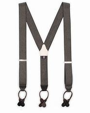
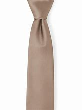

= 0102
:toc: left
:toclevels: 3
:sectnums:

'''

== Why governments move civil servants out of national capitals

Take Norway, which since 2006 has shifted 转移；挪动 1,600 civil-service jobs out of Oslo 挪威首都. **The competition 竞争；角逐 authority** 当局；官方；当权者 is in Bergen 挪威城市名, the second city.

The trend reflects (v.) how the world has changed.

In past eras, when information *travelled [at a snail’s 蜗牛 pace]*, civil servants had to *cluster 群聚；聚集) together*. But now desk-workers can ping  发送（电子邮件、手机短信） emails and video-chat around the world. Travel for face-to-face meetings *may be unavoidable*, but transport links, too, have improved.

主 Proponents 倡导者；支持者；拥护者 of moving civil servants around 谓 promise (v.)许诺；承诺 countless benefits. +
*It disperses （使）分散，散开；疏散；驱散) the risk* that a *terrorist attack* or *natural disaster* will cripple 严重毁坏（或损害）;使残废；使成瘸子 an entire government.  +
Wonks 一味苦干的人；书呆子 in the sticks 边远乡村地区 *will be inspired  赋予灵感；启发思考 by new ideas* that walled-off  用墙把…隔开 capitals cannot *conjure  变魔术；变戏法；使…变戏法般地出现（或消失） up* 使…呈现于脑际；使想起.

.标题
====
.proponent
⇒ pro-,向前，-pon,放置，词源同position,postpone.引申词义支持者，拥护者。

.CONJURE STH UP :
to make sth appear as a picture in your mind 使…呈现于脑际；使想起
conjure ⇒ con-, 强调。-jur, 发誓，念咒，词源同abjure, jurist.

以挪威为例，自2006年以来，该国已将1600个公务员岗位迁出奥斯陆。竞争管理机构设在卑尔根，第二大城市。 +
这一趋势反映了世界的变化。在过去，信息传播速度慢如蜗牛，公务员们不得不挤在一起。但现在，办公人员可以在世界各地发送电子邮件和进行视频聊天。面对面会议的旅行可能是不可避免的，但交通联系也得到了改善。

支持对公务员做调动的人, 承诺说, 这将带来数不尽的好处。它分散了恐怖袭击或自然灾害使整个政府瘫痪的风险。住在乡下的书呆子们也会受到新思想的启发，而这些新思想是被隔离的首都所无法带给人的。
====

主 Dispersing 使分散; 扩散 central-government functions 谓 *usually has three specific aims*: to improve the lives of both *civil servants* and those living in clogged 阻塞的；堵住的 capitals; to save money; and *to redress 纠正；矫正；改正 regional imbalances*  恢复公平合理的情况；恢复平衡. The trouble is that *these goals are not always realised* 实现.

The first aim — improving living conditions — *has a long pedigree* 家谱；门第；世系；起源. [After the second world war] Britain moved thousands of civil servants to “agreeable  愉悦的；讨人喜欢的；宜人的 English country towns” [as London was rebuilt]. But 主 *swapping*  用…替换；把…换成；掉换 the capital *for* somewhere smaller 系 is not always agreeable. *Attrition （尤指给敌人造成的）削弱，消耗;人员流失 rates* can exceed 超过（数量） 80%.

.标题
====
.pedigree
/ˈpedɪɡriː/ a person’s family history or the background of sth, especially when this is impressive 家谱；门第；世系；起源;/ 动物血统记录；动物纯种系谱 +
-> 英语单词pedigree（家谱）源自古法语中的pied de gru（foot of crane），因为鹤的脚丫形状与树状的家谱图很像。pedigree中的pe=foot，如impede（妨碍）。 pedigree：['pedɪgriː] n.家谱，血统adj.纯种的

.swap
(v.) ~ sb/sth (for sb/sth) /~ sb/sth (over) : ( especially BrE ) to replace one person or thing with another 用…替换；把…换成；掉换

.attrition
/əˈtrɪʃn/(n.)  a process of making sb/sth, especially your enemy, weaker by repeatedly attacking them or creating problems for them （尤指给敌人造成的）削弱，消耗 +
-> attrition ⇒ 前缀at-同ad-. -tri,同turn, 转，磨。 attuned 适应的 前缀at-同ad-. tune, 曲调。指舞曲一致。

- It was a war of attrition . 这是一场消耗战。

分散中央政府的职能, 通常有三个具体的目标: 1.改善公务员和那些住在拥堵的首都中的人的生活; 2.为了省钱; 3.并纠正地区失衡。问题是，这些目标并不总是能够实现。

第一个目标——改善生活条件—— 该目标其实由来已久。第二次世界大战后，伦敦重建时，英国把成千上万的公务员迁往“令人愉快的英国乡村小镇”。但是，将首都转移到更小的地方, 并不总是令人愉快的。雇员流失率可以超过80%。
====

主 The second reason *to pack bureaucrats off* 把…打发走 系 is to save money. Office space costs (v.) far more in capitals. [When London’s *property market* stagnated 停滞；不发展；不进步; 因不流动而变得污浊 in the late 1970s] the government *lost enthusiasm for* relocation. 主 Agencies that are moved elsewhere 谓 can often recruit 吸收（新成员）；征募（新兵） better workers on lower salaries than in capitals, where well-paying multinationals *mop (v.)拖把；墩布 up*  吸干净；吸去…的水分) talent 有才能的人；人才；天才.

.标题
====
.pack sb off (to…​)
to send sb somewhere, especially because you do not want them with you 把…打发走

.mop sth/sb up
to remove the liquid from sth using sth that absorbs it 吸干净；吸去…的水分

让官僚们搬离老首都的第二个原因, 是为了省钱。在首都，办公空间的成本要高得多。上世纪70年代末，伦敦房地产市场陷入停滞，政府失去了搬迁的热情。搬到其他地方的机构, 通常可以用比在首都更低的薪水来招聘到更好的员工，而在首都，能提供高薪的跨国公司, 会挖走人才(即政府能提供的薪资比不过跨国公司, 也就招不到人才)。
====

The third reason to shift 系 is to rebalance (v.) regional inequality.

When Britain moved 20% of London’s civil servants between 2003 and 2010, it often picked areas with high unemployment, *such as* Newport, a Welsh city *hit by industrial decline* that now houses (v.)给（某人）提供住处；收藏；安置 *the headquarters 将（组织的）总部设在某地；设立总部 of the Office* for *National Statistics* (ONS). Norway *treats federal jobs as a resource* every region *deserves to enjoy*, like profits from oil.

.标题
====
将公务员搬出首都的的第三个目的, 是重新平衡地区之间的不平等。 +
2003年至2010年间，当英国将伦敦20%的公务员迁出时，它经常选择那些失业率高的地区，比如威尔士的纽波特市，该市曾遭受工业衰退的打击，现在则是国家统计局(ONS)的总部所在地。挪威将联邦政府的工作视为是每个地区都应该享有的资源，就像石油带来的利润一样。
====

Where government jobs go, *private ones* follow. 主 A study of Berlin after Germany’s federal workforce  全体员工 was moved from Bonn in 1999 谓 found that the arrival of 100 government jobs in an area helped create 55 private-sector  (经济的) 私营部分 jobs. 主 A review  评审，审查，检查，检讨（以进行必要的修改） of Britain’s relocations 重新安置 in the 2000s 谓 found the same ratio 比率；比例.  +
The jobs (created) tend to be in services, often the law or consultancy 咨询公司.

.标题
====
哪里有政府的工作，哪里就有私人的工作随之而来。1999年, 德国联邦员工们从波恩转移到柏林后，一项对柏林的研究就发现，一个地区100个政府工作岗位的到来, 会帮助私营部门创造出55个工作岗位。一项对21世纪头10年英国迁徙情况的回顾，也发现了同样的比例。创造的就业机会往往在服务业，通常是法律或咨询行业。
====

*The dilemma （进退两难的）窘境，困境 is obvious.* 主 Pick small, poor towns, and areas of high unemployment 谓 get new jobs, but it is hard to attract *the most qualified workers*;  +
主 *opt for* 选择；挑选 larger cities with infrastructure and better-qualified residents, and （表示结果）结果是；那么；就 the country’s *most deprived  贫穷的；贫困的；穷苦的 areas* 谓 see little benefit.

.标题
====
.opt (for/against sth) :
to choose to take or not to take a particular course of action 选择；挑选

.deprive
⇒ de-, 夺去，损毁。-priv, 自己的，私人的，词源同private, property.

.and
as a result （表示结果）结果是；那么；就

这种两难境地是显而易见的。选择小的，贫穷的城镇，和高失业率的地区, 作为搬迁目的地, 能够为这些地方创造出新的工作岗位，但是却很难吸引最合格的员工; 而选择那些有基础设施和更合格居民的大城市为政府搬迁地，则会使国家中最贫困的地区几乎看不到什么受益。
====

'''

==== <pure> Why governments move civil servants out of national capitals

Take Norway, which since 2006 has shifted 1,600 civil-service jobs out of Oslo. The competition authority is in Bergen, the second city.

The trend reflects how the world has changed. In past eras, when information travelled at a snail’s pace, civil servants had to cluster together. But now desk-workers can ping emails and video-chat around the world. Travel for face-to-face meetings may be unavoidable, but transport links, too, have improved.

主 Proponents of moving civil servants around 谓 promise countless benefits. It disperses the risk that a terrorist attack or natural disaster will cripple an entire government. Wonks in the sticks will be inspired by new ideas that walled-off capitals cannot conjure up.

Dispersing central-government functions 谓 usually has three specific aims: to improve the lives of both civil servants and those living in clogged capitals; to save money; and to redress regional imbalances. The trouble is that these goals are not always realised.

The first aim — improving living conditions — has a long pedigree. [After the second world war] Britain moved thousands of civil servants to “agreeable English country towns” [as London was rebuilt]. But swapping the capital for somewhere smaller is not always agreeable. Attrition rates can exceed 80%.

主 The second reason to pack bureaucrats off 系 is to save money. Office space costs far more in capitals. [When London’s property market stagnated in the late 1970s] the government lost enthusiasm for relocation. 主 Agencies that are moved elsewhere 谓 can often recruit better workers on lower salaries than in capitals, where well-paying multinationals mop up talent.

Balancing act The third reason to shift is to rebalance regional inequality. [In Mexico] AMLO laments the “tragedy” of those who have to move to big cities to make a living. The day the culture ministry opened in Tlaxcala, 70 locals turned up with their CVs. When Britain moved 20% of London’s civil servants between 2003 and 2010, it often picked areas with high unemployment, such as Newport, a Welsh city hit by industrial decline that now houses the headquarters of the Office for National Statistics (ONS). Norway treats federal jobs as a resource (every region deserves to enjoy), like profits from oil.

Where government jobs go, private ones follow. 主 A study of Berlin after Germany’s federal workforce was moved from Bonn in 1999 谓 found that the arrival of 100 government jobs in an area helped create 55 private-sector jobs. A review of Britain’s relocations in the 2000s found the same ratio. The jobs (created) tend to be in services, often the law or consultancy.

Where government jobs go, private ones follow. 主 A study of Berlin after Germany’s federal workforce was moved from Bonn in 1999 谓 found that the arrival of 100 government jobs in an area helped create 55 private-sector jobs. A review of Britain’s relocations in the 2000s found the same ratio. The jobs (created) tend to be in services, often the law or consultancy.

The dilemma is obvious. 主 Pick small, poor towns, and areas of high unemployment 谓 get new jobs, but it is hard to attract the most qualified workers; opt for larger cities with infrastructure and better-qualified residents, and the country’s most deprived areas see little benefit.

'''

== How to reveal a country’s sense, over the years, of its own well-being

如何揭示一个国家多年来对自身福祉的感受

Overall, then, Dr Sgroi and Dr Proto found that *happiness does vary (v.)（根据情况）变化，变更，改变  with GDP*. But 主 the effect of health and *life expectancy*, which does not *have the episodic (a.)偶尔发生的；不定期的 quality* 质量；品质 of booms （贸易和经济活动的）激增，繁荣 , busts (n.)打破；摔碎,突袭,经济萧条时期  and** armed conflict**, 系 is larger, even 主 when the tendency of wealth to improve health 谓 *is taken into account*.

主 A one-year increase in longevity 长寿；长命；持久, for example, 谓 *has the same effect* on national happiness *as* 如同，像……一样 a 4.3% increase in GDP.

And, *as* the grand historical sweep 巡行；搜索；扫荡 *suggests*, 强调句 it is warfare 战争 that causes (v.) the biggest drops in happiness. [On average] it takes a 30% increase in GDP *to raise happiness by the amount* 后定 that a year of war causes (v.) it to fall.

*The upshot 最后结果；结局 appears to be that*, while 虽然；尽管 despite the fact that…​ 虽然；尽管 主 increasing national income 系 is important to happiness, *it is not as important as* ensuring the population is healthy *and* avoiding conflict.

====
.episodic :
ADJ Something that is episodic *occurs at irregular and infrequent intervals*. 偶然发生的; 不定期的

-  ...*episodic attacks* of fever. ...不定期的发烧。

总体而言，斯格罗伊和普罗图发现, 幸福感确实会随GDP的变化而改变。健康和预期寿命的影响, 不像繁荣、萧条和武装冲突那样断断续续，但它们的影响更大，即使把财富改善健康的趋势考虑在内。例如，寿命延长一年，对国民幸福感的影响, 与GDP增长4.3％的影响相同。而且，正如对漫长历史的探究所显示的那样，战争导致幸福感下降最多。平均而言，一年的战争所导致的幸福感降幅, 需要GDP增长30%才能拉平。结果似乎是，虽然增加国民收入对提升幸福感很重要，但确保人口健康和避免冲突的作用更大。
====

'''

==== <pure> How to reveal a country’s sense, over the years, of its own well-being

Overall, then, Dr Sgroi and Dr Proto found that {happiness does vary with GDP}. But 主 the effect of health and life expectancy, which does not have the episodic quality of booms, busts and armed conflict, 系 is larger, even when 主 the tendency of wealth to improve health 谓 is taken into account. 主 A one-year increase in longevity, for example, 谓 has the same effect on national happiness as a 4.3% increase in GDP. And, as the grand historical sweep suggests, it is warfare that causes the biggest drops in happiness. [On average] it takes a 30% increase in GDP to raise happiness by the amount (that a year of war causes it to fall). The upshot appears to be that, while increasing national income is important to happiness, it is not as important as {ensuring the population is healthy} and avoiding conflict.

'''

== China’s “maritime road”

To measure the maritime (a.)海的；海事的 road’s impact, we tested three benefits it could offer China. If the road were *a resource grab* 抓住,攫取, its projects should cluster in places that sell raw materials that China imports. If its aim were to boost (v.) trade, it should track the busiest routes used by Chinese shipping today, or where trade is likely to grow fastest. And if it were intended *to secure 保卫；使安全 current trade routes*, its ports should sit near *choke （掐住喉咙）使窒息 points* — areas whose closure （永久的）停业，关闭；倒闭 would force (v.) goods *to travel circuitously* 迂回地；曲折地  — or in places that offer (v.) alternative routes.

.标题
====
.maritime
adj./ˈmærɪtaɪm/ connected with the sea or ships 海的；海事的；海运的；船舶的/靠近海的 +
-> -mar-海 + itime

为衡量海上丝绸之路的影响，我们检验了它可能带给中国的三个好处: +
→ 如果这条“路”是为了抢夺资源，那么项目应集中在中国进口原材料的供应地。 +
→ 如果是为了促进贸易，那么项目应紧盯中国如今最繁忙的货运航线，或是对华贸易可能增长最快的地区。 +
→ 如果是为了保护现有贸易路线，那么项目建设的港口应靠近咽喉要道（一旦封锁将迫使货物绕行）, 或备选航道上的要地。
====

*We tested these explanations* by using them to predict {if countries host (v.) a BRI port}. *The results were conclusive* 结论性的；不容置疑的；确凿的 . *After holding other factors (constant 不变的；固定的；恒定的)*, *there was no statistically significant  有重大意义的；显著的 link between* having a BRI port *and* ① exporting (v.) raw materials that China wants, or ② having *high current or projected (a.)计划的，规划中的,推断的 trade* with it.

*In contrast* 相比之下 , 主 the “trade-protection benefit” —  [underline]#either# the value of Chinese trade (in a country’s waters) *multiplied (v.)乘以 by* the extra distance (goods would have to go *if those routes were shut*), [underline]#or# the amount of trade (*that would be diverted to a country* if shipping were disrupted elsewhere) — 系 *was a good predictor*. Given 假设事实;考虑到 two otherwise average countries, 主 one *with a high trade-protection benefit* (like Libya) 系 *is 2.7 times likelier* to host a BRI port *than* another with an average benefit (like Liberia).

.标题
====
.BRI
Belt and Road Initiative 一带一路倡议

.contrast
[ CU] ~ (between A and B) | ~ (to/with sb/sth) : a difference between two or more people or things that you can see clearly when they are compared or put close together; the fact of comparing two or more things in order to show the differences between them 明显的差异；对比；对照

- *There is an obvious contrast between* the cultures of East *and* West. 东西方文化之间存在着明显的差异。

为检验这些解释是否合理，我们利用它们来预测各个国家能否吸引到“一带一路”的港口项目。结论是明确的。在其他因素不变的情况下，建设“一带一路”港口, 与出口中国所需的原材料, 在统计上没有显著关联，与当前已存在或未来可能发生的大笔对华贸易的关联也不显著。 +
相比之下，*“有利于保护贸易”是个有效的预测根据*，其计算方式或者是 : 用"一国海域内的对华贸易额", 乘以"货物在现有路线封锁的情况下须绕行的额外里程数"，或是乘以"因货运在其他地区受阻, 而转移到一个国家的贸易量"。在其他条件相当的两个国家之间，更“有利于保护贸易”的国家（如利比亚）, 吸引“一带一路”港口项目的可能性, 是此方面优势不明显的国家（如利比里亚）的2.7倍。
====

'''

==== <pure> China’s “maritime road”

To measure the maritime road’s impact, we tested three benefits it could offer China. If the road were a resource grab, its projects should cluster in places that sell raw materials that China imports. If its aim were to boost trade, it should track the busiest routes used by Chinese shipping today, or where trade is likely to grow fastest. And if it were intended to secure current trade routes, its ports should sit near choke points—areas whose closure would force goods to travel circuitously — or in places that offer alternative routes.

We tested these explanations by using them to predict {if countries host a BRI port}. The results were conclusive. After holding other factors (constant), there was no statistically significant link between having a BRI port and ① exporting  raw materials that China wants, or ② having high current or projected trade with it. In contrast, 主 the “trade-protection benefit” — either the value of Chinese trade (in a country’s waters) multiplied by the extra distance (goods would have to go if those routes were shut), or the amount of trade (that would be diverted to a country if shipping were disrupted elsewhere) — 系 was a good predictor. Given two otherwise average countries, 主 one with a high trade-protection benefit (like Libya) 系 is 2.7 times likelier to host a BRI port than another with an average benefit (like Liberia).

'''

== Prices for many goods do not move the way economists think they should

Every first-year economics student *quickly becomes familiar with* charts of supply and demand, which place (v.) price on one axis /and quantity on the other. Given 假定事实,如果，倘若 a drop in demand, the charts show (v.), firms can [underline]#either# sell fewer items [at the prevailing 普遍的；盛行的；流行的 price] [underline]#or# cut prices *to prop up 支撑; 维持 sales*. But online retailing, which makes it easier to collect *fine-grained 有细密纹理的；详细的；深入的 price data*, reveals *how poorly* textbook models *reflect* real-world market dynamics. The prices of consumer goods, *it turns out, behave oddly* 古怪地；怪异地；反常地,令人奇怪地；令人惊奇地.

.标题
====
.prop
(v.) ~ sth/sb (up) (against sth)to support an object by leaning it against sth, or putting sth under it etc.; to support a person in the same way 支撑 +
(n.) 支柱；支撑物 +
-> 来自pro-,向前，-pag,固定，词源同page,compact.

每个经济学专业的新生, 很快都会熟悉供求关系图，图上两条轴线分别用来标示价格和数量。图表显示，如果需求下降，企业要么维持现价、少卖商品，要么降价以提振销量。但是，更容易收集到详细价格数据的在线零售业却揭示，教科书上的模型远不能正确反映现实的市场动态。事实证明，消费品价格的变动很是古怪。
====

*A forthcoming paper* by Diego Aparicio and Roberto Rigobon of the Massachusetts Institute of Technology *helps make the point* 证明一个论点. Firms that sell thousands of different items `谓` do not offer them at thousands of different prices, but rather *slot 把……投入窄孔中，把……放到指定位置 them into* a dozen 一打，十二个,一打，十二个 or two price points.

Visit the website for H&M, a fashion retailer, and you will find *a staggering 令人难以相信的 array of items* for £9.99: hats, scarves 围巾；头巾, jewellery, belts, bags, *herringbone （织物等的）人字形平行花纹 braces* 吊裤带；背带, *satin 缎子 neckties* 领带, *patterned shirts* 有图案的衬衫 for dogs and much more. Another *vast collection of items* cost £6.99, and another, £12.99. When sellers change an item’s price, they tend not *to nudge （用肘）轻推，轻触 it a little*, but rather to re-slot it into *one of the pre-existing price categories*. The authors *dub (v.)把…戏称为；给…起绰号 this phenomenon* “quantum pricing” (quantum mechanics *grew from the observation that* the properties  性质；特性 of *subatomic particles* do not *vary (v.) along a continuum* （相邻两者相似但起首与末尾截然不同的）连续体 , but rather *fall into discrete 分离的；互不相连的 states*).

.标题
====
.slot :
v.*to put sth into a space that is available or designed for it; to fit into such a space* 投放；插入；（被）塞进；（被）装入

- He *slotted* a cassette *into* the VCR. 他把录像带插入录像机中。
- The bed comes in sections *which can be quickly slotted together*. 这种床以散件出售，很快就可以组装起来。

.stagger
/ˈstæɡər/ to shock or surprise sb very much 使震惊；使大吃一惊 /摇摇晃晃地走；蹒跚；踉跄 +
-> 来自古诺斯语 stakra,推，挤，使打转，来自 Proto-Germanic*stakon,棍子，柱子，来自 PIE*steg, 棍子，柱子，词源同 stack,stick.-er,表反复。其字面意思可能是用棍子在后面追打或赶，引申 词义蹒跚，踉跄，及相关比喻义。

.herringbone
/ˈherɪŋ-bəʊn/  [ U] a pattern used, for example, in cloth consisting of lines of V-shapes that are parallel to each other （织物等的）人字形平行花纹 +
=> herring,鲱鱼，bone,骨头。比喻用法，因这种花纹图案如同鲱鱼骨而得名。

.herringbone braces

.satin neckties

.nudge
=> 词源不详。 nudie 裸体照片，裸体表演 来自nudist的口语。

.dub
=> 起绰号，来自古法语adober, 原义为封爵士。 2.配音，缩写自double. 即再次录制声音。

.dub
-> 1.起绰号，来自古法语adober, 原义为封爵士。 2.配音，缩写自double. 即再次录制声音。

.quantum mechanics
N the branch of mechanics, *based on the quantum theory* used for interpreting the behaviour of elementary particles and atoms, which do not obey Newtonian mechanics 量子力学

.continuum :
(n.) a series of similar items /in which each is almost the same as the ones next to it /but the last is very different from the first （相邻两者相似但起首与末尾截然不同的）连续体

- It is impossible to say *at what point along the continuum* a dialect becomes a separate language. 要说出同一语言的方言差异到什么程度就成为一种别的语言, 是不可能的。

.discrete
=> dis-, 分开，散开。-cret,区分，词源同crisis, critic, discern. 词义与discreet在17世纪前没有区别，后来才赋予不同的词义。

销售数千种不同物品的公司并不会以数千种不同的价格出售它们，而是将它们分成十几个或二十个价格点。访问时尚零售商H&M的网站，您会发现有大量售价为9.99英镑的物品：帽子、围巾、珠宝、皮带、包、人字背带、缎子领带、狗狗衬衫等等。另一大批物品的价格为6.99英镑，另一批为12.99英镑。当卖家改变一个物品的价格时，他们往往不会轻微调整价格，而是将其重新分配到现有价格类别之一。作者将这种现象称为“量子定价”，量子力学源于观察到亚原子粒子有这种性质: 它不沿着连续体变化，而是以离散状态的形式变化。
====

`主`  Just *as surprising as* the quantum way (*in which* prices adjust)  `系` is  `表`  *how rarely 罕有；很少 they move at all*. 主 Retailers, Messrs Aparicio and Rigobon suggest, 谓 seem to design products *to fit their preferred 更喜欢,更合意的 price points*. Given *a big enough shift* in market conditions, such as *an increase in labour costs*, firms often redesign a product to fit the price [underline]#rather than# *tweak 扭；拧；稍稍调整（机器、系统等） the price*. They may make a production process 宾补 less labour-intensive (a.)劳动密集型的  —  or *shave (v.)削减 a bit off* a chocolate bar.

.标题
====
.shave
(v.)剃（须），刮去（毛发）,（少量地）削减，调低

与量子式定价一样令人惊讶的是，价格根本就很少变动。阿帕里西奥和里哥本认为，零售商似乎是根据自己喜欢的价格点,来设计产品的。如果出现劳动力成本增加等较大的市场变化，企业常常会根据价格来重新设计产品，而不是微调价格。他们可能会减少生产过程中的用工量，或者把巧克力棒稍微刮掉一些。
====

Wages are notoriously 众所周知地，声名狼藉地 sticky 黏（性）的, especially downwards. In a world of *low inflation*, 主 the ability *to trim pay* by raising wages *less than* inflation 系 is *lost (a.) to firms*, with *serious macroeconomic consequences*. Facing *reduced demand*, firms (that cannot *cut pay* to maintain margins while 尽管,虽然 *slashing （用利器）砍，劈,大幅度削减 prices*) instead *reduce  output* — and *sack (v.)解雇 workers*.

But nimble 灵活的；敏捷的 firms *have other options*: the employment version of shaving a bit of chocolate from the bar. Some *cut (v.) costs* by *boosting output per worker*, often by driving workers harder. Tellingly 有效地；显著地 , growth in *output per worker* now tends (v.) to fall [in booms] /and rise [during busts 经济萧条时期 ], *precisely the opposite 相反的,对面的 of* the pattern 40 years ago, when inflation was high.

Firms can *respond to* market pressures by *reducing the benefits* available to workers; Asda, a supermarket, recently announced plans to slash（用利器）砍，劈  British workers’ holiday allowances 津贴；补贴. Or they can offer workers *more tortuous 含混不清的；冗长费解的 schedules*. Research published in 2017 suggests that {being able to vary(v.) workers’ hours from week to week `系`  is worth *at least 20% of* their wages}. *On the flipside* 另一面；反面, [during good times] firms often *opt to* reward workers with *office perks* （工资之外的）补贴 and *one-off 一次性的；非经常的 bonuses*, rather than pay rises that cannot easily *be clawed 抓，撕，挠 back* during downturns.

.标题
====
.notoriously
/noʊ-ˈtɔːriəsli/

.lost to firms
(ChatGPT 3.5) : 在这句英文中，"lost to firms"的意思是 "对于公司来说不再可用"。这里的"lost"表示某个事物已经不再存在或不再可用，这是一个常用的表达方式。在这个句子中，它表达的是在通货膨胀较低的情况下，通过"表面上提高工资, 但却幅度低于通货膨胀的水平, 来达到实质性的削减工资的目的", 这种手段已经不再可用于公司了。

."Facing reduced demand, firms that cannot cut pay to maintain margins while slashing prices instead reduce output — and sack workers." 在这句英文中, "while" 怎么理解?
(ChatGPT 3.5 的解释): 在这个句子中，*"while" 是一个连词，用于连接两个相对独立的部分。"while" 的意思是"尽管"或者"虽然"，它表示前后两个部分之间的对比或者对立。在这个句子中，它连接了两个相对矛盾的部分："不能削减工资以维持利润，而是要削减价格"和"减少产量并裁员"。*

.slash :
(v.) *to reduce sth by a large amount* 大幅度削减；大大降低 +
=> 来自辅音丛 sl-,砍，劈，分开，比较 slab,slip,slat,slit,slot.引申比喻义削减。 +

- to slash costs/prices/fares, etc. 大幅度降低成本、价格、车费等

.sack
=> 来自拉丁语 saccus,袋子，来自希腊语 sakkos,袋子，来自某闪族语词，比较希伯来语 saq,袋 子。通常指比较大的袋子，引申词义麻袋，购物袋等，后引申比喻义抢劫及现代词义解雇， 开除，卷包袱走人。

.nimble
=> 来自PIE*nem,分开，分配，拿，带，词源同number,numb.引申词义灵活的，敏捷的。

.telling :
(a.) *having a strong or important effect; effective* 强有力的；有明显效果的；显著的 +
-> a telling argument 有力的论据 +
(2) *showing effectively what sb/sth is really like, but often without intending to* 生动的；显露真实面目的，说明问题的（通常并非有意） +
-> The number of homeless people *is a telling comment* on the state of society. 无家可归者的数量是社会状况的生动写照。

.perk
=> 缩写自perquisite,津贴，额外补贴。

工资的粘性之大众所周知，尤其是在向下调整时。在低通胀的情况下，公司没法用让工资涨幅低于通胀的方式来削减薪资，这给宏观经济带来了严重后果。面对需求减少，那些无法在大幅降价时削减薪资以维持利润的公司,只能转而减产和裁员。

但灵活的公司还有其他选择，比如把刮掉一点巧克力这个办法挪到用工环节上。一些公司通过提高人均产量, 来削减成本 -- 通常是加大员工的劳动强度。很能说明问题的是，现在的人均产量增长往往在经济繁荣时下降，在衰退时上升，与40年前通胀高企时的规律正好相反。公司可以通过减少工人的福利来应对市场压力。阿斯达超市（Asda）最近就宣布了削减英国工人假期津贴的计划。或者公司也可以给员工安排更含混不清的工作时间。2017年发表的一项研究表明，如果可以每周调整员工的工作时间，便相当于至少节省了20%的工资支出。另一方面，在经济繁荣期，公司往往选择用办公室福利和一次性奖金来奖励员工，而不是给他们加薪，因为加好的薪水没法在衰退期轻易再降下来。

====

'''

==== <pure> Prices for many goods do not move the way economists think they should

Every first-year economics student quickly becomes familiar with charts of supply and demand, which place price on one axis and quantity on the other. Given a drop in demand, the charts show, firms can either sell fewer items [at the prevailing price] or cut prices to prop up sales. But online retailing, which makes it easier to collect fine-grained price data, reveals how poorly textbook models reflect real-world market dynamics. The prices of consumer goods, it turns out, behave oddly.

A forthcoming paper by Diego Aparicio and Roberto Rigobon of the Massachusetts Institute of Technology helps make the point. Firms that sell thousands of different items do not offer them at thousands of different prices, but rather slot them into a dozen or two price points. Visit the website for H&M, a fashion retailer, and you will find a staggering array of items for £9.99: hats, scarves, jewellery, belts, bags, herringbone braces, satin neckties, patterned shirts for dogs and much more. Another vast collection of items cost £6.99, and another, £12.99. When sellers change an item’s price, they tend not to nudge it a little, but rather to re-slot it into one of the pre-existing price categories. The authors dub this phenomenon “quantum pricing” (quantum mechanics grew from the observation that the properties of subatomic particles do not vary along a continuum, but rather fall into discrete states).

Just as surprising as the quantum way (in which prices adjust) is {how rarely they move at all}. 主 Retailers, Messrs Aparicio and Rigobon suggest, 谓 seem to design products to fit their preferred price points. Given a big enough shift in market conditions, such as an increase in labour costs, firms often redesign a product to fit the price rather than tweak the price. They may make a production process 宾补 less labour-intensive — or shave a bit off a chocolate bar.

Wages are notoriously sticky, especially downwards. In a world of low inflation, 主 the ability to trim pay [by raising wages less than inflation] 系 is lost  to firms, with serious macroeconomic consequences. Facing reduced demand, firms (that cannot cut pay to maintain margins while slashing prices) instead reduce output — and sack workers.

But nimble firms have other options: the employment version of shaving a bit of chocolate from the bar. Some cut costs by boosting output per worker, often by driving workers harder. Tellingly, growth in output per worker now tends to fall [in booms] and rise [during busts], precisely the opposite of the pattern 40 years ago, when inflation was high. Firms can respond to market pressures by reducing the benefits available to workers; Asda, a supermarket, recently announced plans to slash British workers’ holiday allowances. Or they can offer workers more tortuous schedules. Research published in 2017 suggests that {being able to vary  workers’ hours [from week to week] is worth at least 20% of their wages}. On the flipside, [during good times] firms often opt to reward workers with office perks and one-off bonuses, rather than pay rises that cannot easily be clawed back during downturns.

'''

== Gliding missiles that fly faster than Mach 5 are coming

...early missile development, *whose principal  最重要的；主要的 challenge was* hoisting  吊起；提升；拉高 the weapons into the sky. Gravity *did most of the rest*.

主 The first warheads （导弹的）弹头 *capable of* steering (v.) 驾驶（船、汽车等）；掌控方向盘 on descent (n.)下降；下倾 谓 did not arrive until the 1980s. Even they were limited in how much they could move around, *making it pretty easy* to predict their target area.

A new generation of *hypersonic 极超音速的 missiles* is changing all that. Some might be capable of *gliding (v.)滑行；滑动；掠过 across* continents at great speed, their target unpredictable until seconds before impact 冲击；撞击.

.标题
====
.principal
most important; main 最重要的；主要的

.hypersonic
极超音速的，超出五倍音速（5 马赫）的

当时导弹发展面临的主要挑战是将武器升上天空。剩下的大部分工作都是由地心引力完成的。直到 20 世纪 80 年代，第一批能够在下降过程中操纵方向的弹头，才出现。即使是它们，其活动范围也很有限，因此很容易预测它们落点的目标区域。

新一代的极超音速导弹, 正在改变这一切。其中一些可能能够以极快的速度横跨大陆，他们的目标直到撞击前几秒钟才能预测。
====

There are two basic designs: *cruise missiles* and gliders.

Hypersonic cruise missiles are essentially 本质上；根本上；基本上 faster versions of existing ones but powered(v.) 驱动，推动（机器或车辆）) by very different jet engines.

Gliders ... But unlike the old-fashioned projectiles （作为武器的）发射物；导弹, they do not follow *a predictable, parabolic 抛物线状的 arc* through the sky.

Instead, a hypersonic glide vehicle (HGV) 高超音速滑翔飞行器 *detache (v.)拆卸；（使）分开，脱离) from the rocket* while it is still ascending 上升；升高；登高 and either skips(v.) along the *upper atmosphere* or, having re-entered (v.), glides (v.)滑行 through it for hundreds or thousands of kilometres.

Such gliders have several advantages.

*Ballistic missiles* 弹道导弹 are *less agile* (a.)动作）敏捷的，灵活的 and tend not to be very accurate.

主 A Minuteman 即召民兵 III ICBM, the backbone  支柱；骨干；脊柱 of America’s *nuclear arsenal* （统称）武器, 谓 has a “*circular error probable*” 圆形概率误差  of roughly 120m, meaning only half the missiles fired *are expected* to land(v.) within 120m of the impact point.

*That is fine* for nuclear bombs *but useless for* hitting a ship or runway.

Today’s cruise missiles, on the other hand, are very accurate — one could be sent through a window — but much slower.

.标题
====
.parabolic
/ˌpærə-ˈbɑːlɪk / 抛物线状的 /比喻的; 寓言似的

.ballistic
/bəˈlɪstɪk/  弹道（学）的；发射的

.agile
/ˈædʒ(ə)l/ (a.) able to move quickly and easily （动作）敏捷的，灵活的 +
-> -ag-行动 + -ile形容词后缀

.minuteman
/ˈmɪ-nɪt-mæn/
 (n.)(during the American Revolution) a member of a group of men who were not soldiers but who were ready to fight immediately when they were needed （美国革命时期的）即召民兵 +
-> minute +‎ -man

.circular error probable :
圆形公算误差（英文简称CEP），是弹道学中的一种测量武器系统精确度的项目。其定义是 以目标为圆心划一个圆圈。如果武器命中此圆圈的机率最少有一半，则此圆圈的半径就是"圆形公算误差"。举例来说，美军三叉戟二型导弹的圆形公算误差是90米，则一枚此型导弹有50%的机率会落在目标90米以内。

.probable
(a.) likely to happen, to exist or to be true 很可能发生（或存在等）的

有两种基本设计:巡航导弹和滑翔机。高超音速巡航导弹,本质上是现有导弹的更快版本. 滑翔机...但与老式的抛射不同的是，它们在天空中, 并不遵循可预测的抛物线轨迹飞行。相反，高超音速滑翔飞行器(HGV), 在火箭仍在上升时, 就与火箭分离，要么沿着大气层上层进行跳跃，要么重新进入大气层, 并在大气层中滑行数百或数千公里。

这样的滑翔机有几个优点。弹道导弹不太灵活，而且往往不太精确。美国核武库的支柱—​民兵III型洲际弹道导弹的“圆形误差可能”约为120米，这意味着预计只有一半发射的导弹, 能落在落点120米以内。这对核弹来说很好，但对于想要击中船只或跑道来说, 就没什么用了。另一方面，今天的巡航导弹非常精确 — 它可以通过窗口发射, 但速度要慢得多。
====

'''

==== <pure> Gliding missiles that fly faster than Mach 5 are coming

...early missile development, whose principal challenge was hoisting the weapons into the sky. Gravity did most of the rest. 主 The first warheads capable of steering on descent 谓 did not arrive until the 1980s. Even they were limited in how much they could move around, making it pretty easy to predict their target area.

A new generation of hypersonic missiles is changing all that. Some might be capable of gliding across continents at great speed, their target unpredictable until seconds before impact.

There are two basic designs: cruise missiles and gliders.

Hypersonic cruise missiles are essentially  faster versions of existing ones but powered by very different jet engines.

Gliders ... But unlike the old-fashioned projectiles, they do not follow a predictable, parabolic arc through the sky.

Instead, a hypersonic glide vehicle (HGV)  detache from the rocket while it is still ascending  and either skips along the upper atmosphere or, having re-entered, glides through it for hundreds or thousands of kilometres.

Such gliders have several advantages.

Ballistic missiles are less agile and tend not to be very accurate. 主 A Minuteman  III ICBM, the backbone  of America’s nuclear arsenal  谓 has a “circular error probable”  of roughly 120m, meaning only half the missiles fired are expected to land within 120m of the impact point. That is fine for nuclear bombs but useless for hitting a ship or runway.

Today’s cruise missiles, on the other hand, are very accurate — one could be sent through a window — but much slower.

'''
