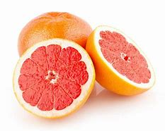

= Lesson 10
:toc: left
:toclevels: 3
:sectnums:
:stylesheet: ../../+ 000 eng选/美国高中历史教材 American History ： From Pre-Columbian to the New Millennium/myAdocCss.css

'''

== Section 1

==== A. Dialogues.

Dialogue 1: +
—Can I help you? +
—Yes, please. I'd like some *instant 立即的；立刻的;速食的；即食的；速溶的；方便的 coffee*. +
—Certainly. How much would you like? +
—A large jar, please.

---

Dialogue 2: +
—That's a very nice cardigan （无领）开襟毛衣. Is it new? +
—Yes. It was very cheap. I got it in a sale. +
—I like it very much. It suits (v.)(尤指服装、颜色等) 相配；合身;对（某人）方便；满足（某人）需要；合（某人）心意 you very well. +
—Oh, thank you.

[.my1]
.案例
====

.cardigan
（无领）开襟毛衣 +
image:../img/cardigan.jpg[,10%]
====

---

Dialogue 3: +
—Do you read many novels? +
—Yes. I suppose I've read about four novels this year. +
—I see. And what was the last novel （长篇）小说 you read? +
—Let me see. It was A Man in Havana. +
—And when did you read it? +
—I read it on Tuesday evening. +
—Why did you read it? +
—Well ...

---

Dialogue 4: +
—Do you smoke? +
—Yes, I do. +
—How long have you been smoking for? +
—Six years. +
—And how many cigarettes have you smoked during that time? +
—Thousands!

---

Dialogue 5: +
—I was just about to have a swim when I saw the shark! +
—That's nothing 没什么, 这没有什么. I was in the middle of swimming when I saw the shark. +
—What happened? +
—I started swimming for the shore, of course.

我正要游泳时看见了鲨鱼! +
这没什么, 当我看见鲨鱼时，我正在游泳。 +
然后发生了什么? +
理所当然, 我开始向岸边游去。

---

==== B. Hotel English

Yvonne Deraine is staying at the Hotel Neptune 海王星. She goes to the *Reception 接待处 Desk*  and asks: +
Yvonne: Can I have breakfast in my room? +
Clerk: Certainly, madam. Breakfast is served in your room from 7 o'clock until 10. Here is
the menu. +
Yvonne: Thank you. (looks at the menu) I'd like to have the Continental 欧洲大陆的（不包括英国和爱尔兰）;北美大陆的 Breakfast. +

[.my1]
.案例
====

.Nep·tune

====

Clerk: Yes, madam. And at what time would you like it? +
Yvonne: About half past eight, I think. +
Clerk: 8:30. Very good, madam. And what kind of fruit juice would you like? We have pineapple 菠萝；凤梨, orange, grapefruit 葡萄柚；柚子；西柚 ... +
Yvonne: I think I'd like the pineapple please. +
Clerk: Pineapple juice. And would you prefer tea or coffee? +
Yvonne: Coffee please. +
Clerk: Thank you very much. Goodnight.

[.my1]
.案例
====

.grapefruit

====

* * *

(At 8:30 the next morning, there is a light tap 轻敲；轻拍；轻叩 at Yvonne's door.) +
Yvonne: Y-es. Come in. +
Maid: I've brought you your breakfast, madam. +
Yvonne: Oh yes. Thank you. Could you put it on the desk over there please? +
Maid: Shall I pour you a cup of coffee *straight away* 立即, 马上, madam? +
Yvonne: No, thanks. I'll pour it myself *in a minute* 一会儿, 过一会儿. +
Maid: Is there anything else, madam? +
Yvonne: No-no, I don't think so, thank you.

---

== Section 2

==== A. Discussion.

Eddie is talking to Tom. +

Eddie: Have you ever been really frightened? +
Tom: I suppose so, once or twice. +
Eddie: Can you remember when you were most frightened? +
Tom: That isn't difficult. +
Eddie: What happened? +
Tom: Well, we used to have a favorite (a.)特别受喜爱的 picnic 野餐 place beside a lake. We had a boat there. I was there with some friends and I decided to swim to a little island. It didn't look far and I
started swimming ... but half way across I realised it was a lot further than I thought. I was getting very tired. I shouted. Luckily my friends heard me and brought （bring的过去分词） the boat. I thought I
was going to drown (v.)（使）淹死，溺死. I've never been more frightened in my life

---

==== B. Forum.

Should school children take part-time jobs?
This is a discussion which will appear in a magazine.

Editor: This month our panel 专家咨询组；（广播、电视上的）讨论小组 looks at part-time jobs. Are they good for school children or
not?

Headmaster: Definitely not. The children have got two full-time jobs already: growing up
and going to school. Part-time jobs make them so tired they *fall asleep* 入睡, 睡着了 in class.

Mrs. Barnes: I agree. I know school hours are short, but there's homework as well. And
children need a lot of sleep.

Mr. Barnes: Young children perhaps, but some boys stay at school until they're eighteen
or nineteen. A part-time job can't harm them. In fact, it's good for them. They earn their
pocket-money instead of asking their parents for it. And they see something of the world
outside school.

Businessman: You're absolutely right. Boys learn a lot from a part-time job. And we
mustn't forget that some families need the extra money. If the pupils didn't take part-time
jobs they couldn't stay at school.

Editor: Well, we seem to be equally divided: two for 支持；拥护, and two against. What do our readers
think?

[.my1]
.案例
====

.for
支持；拥护 +
- Are you for or against the proposal? 你支持还是反对这个建议？ +
- They voted for independence in a referendum. 他们在全民公决投票中赞成独立。
====

---

== Section 3

Dictation.

Spot Dictation 1:

Philip Andrew is 16 and he is about to leave school. He comes to me for advice every
week. He is looking for an interesting job and he would like good wages （通常指按周领的）工资，工钱. One of his friends
works in a supermarket. Another friend works in a factory. Philip thinks supermarket jobs
are not well paid. And factory jobs are boring.

---

Spot Dictation 2:

And finally, some news from the United States.  +
David Thomas, the Californian pop singer, is sixteen today and he is giving 举办；举行 a party for sixty guests. His young friends have bought him a Rolls-Royce, the most expensive one they could find.

David is famous because he is the fastest driver and the youngest pop star in the state of California. He is
flying to Paris tomorrow.

[.my1]
.案例
====

.give
(v.) if you give a party, you organize it and invite people 举办；举行 +
- he is giving a party for sixty guests. 他要举行一个六十人的宴会。
====

---
