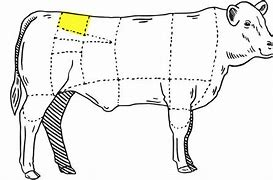
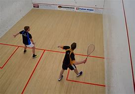

= Lesson 11
:toc: left
:toclevels: 3
:sectnums:
:stylesheet: ../../+ 000 eng选/美国高中历史教材 American History ： From Pre-Columbian to the New Millennium/myAdocCss.css

'''

---

== Section 1

==== A. Dialogues.

Dialogue 1: +
—What are you going to do after this lesson? +
—I'm probably going to have a cup of tea. What about you? +
—Oh, I'm going to the post office. +
—I see.

---

Dialogue 2: +
—Can you come and see me at nine o'clock? +
—I'm afraid not. You see, I'm meeting Mr. Green at nine.

---

Dialogue 3: +
—I hear you are playing at a concert 音乐会；演奏会 tomorrow. How do you feel about it? +
—Oh, I'm really worried about it. +
—I'm not surprised. So would I be.

---

Dialogue 4: +
—What are your plans for tomorrow, Brenda? +
—Well, first, I'm going to do the *washing up* 刷饭后的杯盘等;洗脸和手. +
—Poor you 可怜的你; 真可怜! While you're doing the washing up, I'll be having breakfast in bed. +
—It's alright for some people.

---

Dialogue 5: +
—I'd like to withdraw 提，取（银行账户中的款） fifty pounds from my deposit 存款;将（钱）存入银行；存储 account 定期存款账户. +
—Certainly. Would you please sign this form? +
—Oh, yes. There you are. +
—How would you like the money 你想要什么面值的钱? +
—In fives, please. +
—Fine. Here you are. +
—Thanks. Goodbye.

[.my1]
.案例
====

.How would you like the money?
你想要什么面值的钱？  +
It would be asking what bills you would like. For instance if you asked for 20 dollars: would you like two "ten dollar" bills, four "five dollar " bills, or twenty "one dollar" bills?

====

---

Dialogue 6: +
—How are you, Brenda? +
—Fine, *apart from* 除了…外（都）；要不是 the backache. +
—Oh, dear （惊奇、不安、烦恼、担忧等时说）啊，哎呀，糟糕，天哪, I'm sorry to hear that. +
—Yes. My back's killing me. +
—Oh, I hope you'll soon feel better. +
—Thanks.

---

==== B. Restaurant English.

Dialogue 1:

Man: Waitress （餐馆等的）女服务员，女侍者! This meat is like old leather! It's enough to break every tooth in your head. +
Waitress: Perhaps you'd like to change your order, sir. The sirloin 牛里脊肉；牛上腰肉 is very tender 嫩的；柔软的.

[.my1]
.案例
====

.sirloin
牛里脊肉；牛上腰肉  +
=> sir-,改写自 sur-,在上，loin,腰部，腰肉。 +

====

---

Dialogue 2:

Woman: John, look *what that waiter's gone and done* 竟然, 居然(做出某事)! Spilt(v.)(尤指液体)（使）洒出，泼出，溢出 soup *all over* 到处，遍及；浑身 my new dress! +
Waiter: I'm terribly 非常；很  sorry, madam. Perhaps if I could sponge(v.)用湿布（或海绵）擦；揩拭;海绵块  it with a little warm water... +
Man: Leave it alone, man. You'll only make it worse. +
Woman: I want to speak to the Manager! +
Waiter: Very good, madam. +

[.my1]
====
.have gone and done something
spoken used when you are surprised or annoyed by what someone has done. +
*have been and done sth = have gone and done sth* : 表示"惊异, 气愤, 烦恼, 抗议"等语气, 中文相当于"竟然, 居然(做出某事)"的意思. +
- And who has gone and  told him about it? 谁竟然把这件事告诉了他? +
- She went and won first prize! (惊异)

.terribly
非常；很 +
- I'm terribly sorry —did I hurt you? 非常抱歉，我伤着您了吗？

====

Manager: I do apologize for this unfortunate accident, madam. If you would like to have
the dress cleaned and send the bill 账单 to us, we will be happy to *take care of* 为某物付款（尤在请客时） it. +
Woman: Oh no, it doesn't matter. Forget it. It probably won't stain (v.)（被）玷污；留下污渍;给…染色（或着色） very much.

---

Dialogue 3:

Man: Waiter, *this just won't do*. This wine's 酒 got a most peculiar 怪异的；奇怪的；不寻常的 flavor. +
Waiter: Yes, sir. I'll *take it back* 拿回去. Perhaps you would like to choose another wine instead,
sir?

[.my1]
.案例
====
.this just won't do
等于 This is not acceptable /This will have to change (be changed).
====

---

== Section 2

==== A. Telephone Conversation.

—Hello. +
—Hello. Who's that? +
—It's me. +
—Who's me? +
—Why, me, of course. +
—Yes, I know. It's you. But who are you? +
—I've told you who I am. I am ME. +
—I know you are you, but I still don't know who you are. Anyway, I don't want to talk to you
whoever you are. I really wanted Mrs. Jones. +
—Who do you want? +
—Mrs. Jones! +
—Mrs. Jones? Who's Mrs. Jones? +
—Why, Mrs. Jones lives where you are, doesn't she? +
—There is no Mrs. Jones here. What number do you want? +
—I want Bournemouth, 650283. +
—This is Bournemouth, 650823. +
—Oh, dear, I am sorry. I must have dialed the wrong number. +
—It's quite alright. +
—I'll try dialing again. Sorry to have troubled you. +
—*It's quite alright* 好吧,可接受（的）, 没关系. Goodbye. +
—Goodbye.

---

==== B. Discussion. Remembering with regret 感到遗憾；惋惜；懊悔.

Two old men are talking about the days gone by. Listen. +

—The beer's just like water. They don't make it as strong as they used to. +
—No. Things aren't what they used to be, are they? +
—The pubs aren't any good nowadays. +
—No. But they used to be good when we were young. +
—The trouble is that the young people don't work hard. +
—No, but they used to work hard when we were young.

---

==== C. Monologue.

Ten years ago, I loved watching television and listening to pop records. I hated classical music. But I liked playing tennis.  +
Five years ago I still liked playing tennis, but I loved classical music. Now I prefer classical music. I like playing squash 壁球. But I hate television.

[.my1]
.案例
====

.squash
a game for two players, played in a court surrounded by four walls, using rackets and a small rubber ball （软式）墙网球；壁球 +

====

---

==== D. Music or Money?

Mr. Davies is talking to his son Martin. +

Mr. Davies: (quietly) Why aren't you doing your homework? +
Martin: I'll do it later, Dad. I must get these chords 弦 right first. Our group's playing in a
concert on Saturday. +
Mr. Davies: (laughs) Oh, is it? You'll be *making records* 录唱片 next, will you? +
Martin: We hope so. The man from 'Dream Discs' 圆盘；圆片 is coming to the concert. So I'd better
play well. +

Mr. Davies: You'd better *get on with* （尤指中断后）继续做某事 your homework! You can practise all day Saturday. +
Martin: Oh, Dad. You don't understand at all. This concert could change my life. +
Mr. Davies: It certainly could! You've got exams next month. Important ones. If you don't
get a good certificate, you won't get a decent job. +
Martin: (rudely) I don't need a certificate 文凭；结业证书；合格证书 to play the guitar. And I don't want a boring old
job in a bank either. +
Mr. Davies: (angrily) Oh, don't you? Whose boring old job paid for this house? And for that guitar? +
Martin: (sighs 叹气；叹息) Yours, I know. But I'd rather be happy than rich.

[.my1]
.案例
====

.GET ON WITH SB | GET ON (TOGETHER)
（与某人）和睦相处，关系良好

.GET ON WITH STH
（尤指中断后）继续做某事 /（谈及或问及工作情况）进展，进步 +
- I'm not getting on very fast with this job. 我这个工作进展不太快。
====

---

== Section 3

Dictation.

Dictation 1:

Letter Dictation. Write your address, your phone number and the date. +
The letter is to Winnipeg Advanced Education College. Winnipeg, W-I-double N-I-P-E-G, Advanced Education College, Hillside Drive, Winnipeg. +
Dear Sir or Madam. Please send me details of your courses in Computer Programming.  +
New line. Thanking you *in advance* 预先感谢您. Yours faithfully, and then sign(v.)签（名）；署（名）；签字；签署 your name.

---

Dictation 2:

Write your address, your phone number and the date. To Sea View Hotel. Sea View,
S-E-A V-I-E-W Hotel, Harbor 海港 Road, Cork, Ireland.
 +
Dear Sir or Madam. I would like to book(v.)（向旅馆、饭店、戏院等）预约，预订 a double room 双人房间 with bath for two weeks *from*
the first *to* the fourteenth of August *inclusive* 包括提到的所有的天数（或月、数目等）在内.  +
New line. I look forward to receiving your confirmation 证实；确认书；证明书. Yours faithfully and then sign your name.

[.my1]
.案例
====

.from... to... inclusive
( BrE ) including all the days, months, numbers, etc. mentioned 包括提到的所有的天数（或月、数目等）在内 +
- We are offering free holidays for children aged two to eleven inclusive. 我们提供的度假活动，两岁至十一岁的儿童免费。 +
- The castle is open daily from May to October inclusive. 这个古堡从五月起每天开放，直至十月底。
====

'''
