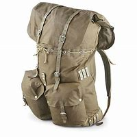

= Lesson 12
:toc:

---

== Section 1

==== A. Dialogues.

Dialogue 1:

—Do you think you could stop whistling? I'm trying to write an essay. +
—Oh, I'm sorry. I thought you were in the other room.

-  whistle 口哨
- essay （用来刊登的）论说文；小品文 / （作为课程作业，学生写的）文章，短文

---

Dialogue 2: +

—Is it alright if I leave my rucksack on the back seat? +
—Yes, of course. Go ahead. +
—And would you mind if I took off my shoes? My feet are killing me. +
—Well, I'd rather you didn't. It's a rather hot day.

- rucksack （尤指登山者或远足者使用的）背包，旅行包 +

- back seat （车辆的）后座
- take sth off 脱下（衣服）；摘掉
- kill (通常用于进行时，不用于被动语态 ) 使痛苦；使疼痛；使受折磨

---

Dialogue 3: +

—Hello, Charles, I haven't seen you all day. What have you been doing? +
—Actually I've been working on my first novel. +
—Oh, yes. How far have you got with it? +
—Well, I thought of a good title, and I made a list of characters, and I've designed the front
cover. +
—Have you started writing it yet? +
—Oh, yes. I've written two pages already. +
—Only two? +
—Well, yes. I haven't quite decided yet what happens next.

- How far have you got with it?
- character （人、集体的）品质，性格；（地方的）特点，特性 / （有趣的或不同寻常的）人
- front cover 封面

---

Dialogue 4: +
—I saw an accident yesterday. +
—What were you doing at the time? +
—I was queuing for the cinema. +
—And what did you do when you saw the accident? +
—I rushed forward to see if I could help.

- queue (v.) ~ (up) (for sth) （人、车等）排队等候

---

Dialogue 5: +
—Hmm. You are a good squash player. How long have you been playing? +
—I have been playing since the beginning of the last term. What about you? +
—Me? Oh, I've been playing about two years now. But I'm still not very good.

- squash（软式）墙网球；壁球 / ( BrE ) a drink made with fruit juice, sugar and water 果汁饮料
- term 期；期限；任期

---

Dialogue 6: +
—I've got a watch with a silver strap. +
—That's nothing. I've got one with a gold strap. +
—I've got a watch that tells you the date. +
—That's nothing. I've got one that tells you the date and the day.

- strap : a strip of leather, cloth or other material that is used to fasten sth, keep sth in place, carry sth or hold onto sth 带子 +
-> a watch with a leather strap 皮表带的手表

- That's nothing 这没有什么

---

==== B. Restaurant English.

Dialogue 1: +
Woman: Look at these glasses, this one's even got lipstick on it. +
Waiter: I'm very sorry, madam. I'll bring you clean ones right away.

- glass 玻璃杯；酒杯
- lipstick 口红；唇膏 => lip,唇，stick,棍子。引申词义口红。

---

Dialogue 2: +
Man: Ah, Head Waiter, I want to have a word with you.
Head Waiter: Yes, sir. Is there something wrong, sir? +
Man: Something wrong? *I should think* there is something wrong. My wife and I have been
kept here waiting nearly an hour for our meal! +
Head Waiter: I'm terribly sorry about that, sir. Our staff has been kept unusually busy this evening. I'll see to it personally myself. Now, if you wouldn't mind just telling me what you ordered.

- Head Waiter : N a waiter who supervises the activities of other waiters and arranges the seating of guests 服务员领班
- have a word with sb 与...谈话; 与...略谈

- I should think/imagine/hope
a) used to say that you think or hope something is true, when you are not certain::
-> I shouldn’t think they’ve gone far. 我不认为他们走得太远。 +
-> ‘I suppose there’ll be a lot of complaints?’ ‘I should imagine so.’ “我想会有很多抱怨吧?”“我想是的。”
b) used to emphasize that you are not surprised by what someone has told you because you have moral reasons to expect it::
-> ‘She doesn’t like to hear me swearing.’ ‘I should think not.’ “她不喜欢听我骂人。“我想的确是不会的。” +
-> ‘He did apologize.’ ‘I should hope so, after the way he behaved.’ ”他道歉了。"看他那副样子，我也希望如此。"

- staff 全体职工（或雇员） /（大、中、小学的）管理人员，行政人员

---

Dialogue 3: +
Woman: This coffee is practically cold. +
Waiter: I am sorry, madam. I'll bring you a fresh pot straight away.

- practically  几乎；差不多；很接近 / 实事求是地；实际地 +
-> There's practically no difference between the two options. 这两种选择几乎没什么差别。
- straight away 立即

---

== Section 2

==== A. Description.

This table shows the number of commuters into central London between 7:00 am and
10:00 am daily.

The total number is 1,023,000. Of these, 405,000 travel by underground —that's 29% of the total, and 28% travel by British Rail —that's 391,000 people daily. 10% use both rail and underground, and 10%, 99,000 people, travel by bus. +
That means a total of 788,000 people, 77%, on public transport. The remainder use private transport.

197,000 come by car and the rest come either by motorbike or bicycle. +
This means 4% come by motorbike or bicycle, and 19% by car.

- commuter （远距离）上下班往返的人
- am 上午 => a.m. 全称 ante meridiem，
- underground （城市的）地下铁路系统，地铁
- British Rail  英国铁路公司
- transport 交通运输系统 /交通车辆；运输工具；旅行方式
- remainder  : ( usually the remainder )  the remaining people, things or time : 其他人员；剩余物；剩余时间
- motorbike 摩托车

---

==== B. Conversation.

Mrs. Nicholas went away for a fortnight. Before she went, she called in at the local police
station and talked to the policeman on duty. +
Mrs. Nicholas: I'm going away to the seaside for a few days and I'd like you to keep an eye
on my home while I'm away. +
Policeman: Certainly, Madam. What's your name and address? +
Mrs. Nicholas: The name's Nicholas, and the address is 14 Spring Vale. +
Policeman: Thank you. You'll lock all the doors, and make sure all the windows are shut,
won't you? +
Mrs. Nicholas: Of course. +

- go away  (尤指作为度假) 去别地度过一段时间
- call in 短暂访问 / (给工作单位、电台或电视台) 打电话 / call someone in 叫…来 (帮忙)
- on duty 值班，上班

Policeman: And you'll remember to cancel the milk. +
Mrs. Nicholas: Yes, I've already done that. +
Policeman: And the papers. +
Mrs. Nicholas: Yes. +
Policeman: And you won't leave any ladders about. +
Mrs. Nicholas: No, we haven't got a big ladder. +
Policeman: That's fine. Are you friendly with the people next door? +
Mrs. Nicholas: Yes, we are. +
Policeman: Well, I think you'd better tell them you're going away, too. Ask them to give us
a ring if they see or hear anything suspicious(a.). +
Mrs. Nicholas: Yes, I will. Thank you.

- friendly (a.)~ (with sb) treating sb as a friend 朋友似的
- suspicious (a.)~ (of/about sb/sth)  感觉可疑的；怀疑的

---

==== C. A Party.

There is a party in progress and one person A is standing by the drinks table serving
drinks. B approaches and A offers her a drink. +

-  in progress 正在进行；在发展中
- approach (v.)（在距离或时间上）靠近，接近 +
=> 前缀ap-同ad-. 词根pro, 向前，同approximate, 大约。

有一个聚会正在进行中，一个人a站在饮料桌旁提供饮料。B走过来，A请她喝一杯。

B: Aha, I thought you might be here. +
A: Ah, hello. How are you? +
B: Not bad. How are you? +
A: All right, I suppose. +
B: What are you drinking? +
A: Some sort of wine. Do you want some? +
B: No, I think I'd prefer beer. Have they got any? +
A: Yes, there's some over there.

(B pours out a drink.) +
B: Well, what do you think of the party? +
A: It's not bad. I'm not really in the mood for a party, though. +
B: Why's that?' +
A: I don't know, really. I suppose I'm a bit tired.

- mood 情绪；心情 +
-> I'm just not in the mood for a party tonight. 我今晚就是没心情参加聚会。
- though （用于主句后，引出补充说明，使语气变弱）不过，可是，然而

(During the last exchange C has approached the table to get a drink. A offers C a drink but
accidentally drops it.) +
A: Oh, sorry about that. +
C: (annoyed) I should think so! +
A: Don't worry. It's not too bad. +
C: What do you mean? It's gone all over my trousers —I only bought them last week. +
A: There's no need to shout. +
C: (loudly) I'm not shouting. +
A: Yes, you are. +
C: (very loudly) No, I'm not! +

- exchange 交谈；对话；争论 +
-> There was only time for a brief exchange. 只有简短的交谈时间。

B: (wanting to calm the situation) Look, look, why don't you dry them with this? +
C: (ignoring B) You should watch what you're doing! +
A: What do you mean? It was your fault! +
B: How about another drink? (C ignores B.) +
C: Anyway, don't I know you?  不管怎么说，我是不是认识你？ +
B: Do you want another drink? (C ignores B.) +
A: You might do. +
C: You didn't go to St. Mark's School, did you? +
A: Yes, I did actually. +
C: Yes, I remember now. You were going out with that awful girl, weren't you? +
A: What do you mean? +
C: You know, the one with the big nose. What happened to her? +
A: We got married, actually. In fact, that's her over there. +
C: Yes ...

- go out with 和…出去；与某人约会; 和某人交往
- awful  很坏的；极讨厌的

---

== Section 3

==== Dictation.

1.
A woman went into a bar and asked for a glass of water. The barman pointed a gun at
her. She thanked him and went out.

- barman  酒吧男招待；酒吧男侍

---

2.
A man was found lying dead in the middle of a desert. He had a pack on his back.

---

3.
A woman dialed the number on the telephone. Someone answered and said, "Hello."
She put the phone down with a happy smile.

---

4.
A man is found dead in the room. There is no furniture, and all the doors and windows
are locked from the inside. There is a pool of water on the floor.

---

5.
There is a man on the bed and a piece of wood on the floor. The second man comes
into the room with sawdust on his hands, smiles and goes out again.

- piece ~ (of sth) (尤与of和不可数名词连用 )an amount of sth that has been cut or separated from the rest of it; a standard amount of sth 片；块；段；截；标准的量 +
-> a piece of string/wood 一截绳子；一块木头 +
-> She wrote something on a small piece of paper. 她在一小片纸上写了点什么。 +
-> a large piece of land 一大片土地 +
-> a piece of cake/cheese/meat 一块蛋糕╱奶酪╱肉

- sawdust :  very small pieces of wood that fall as powder when wood is cut with a saw 锯末

---
