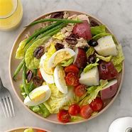
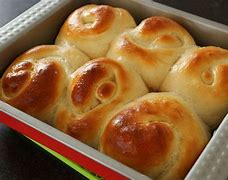
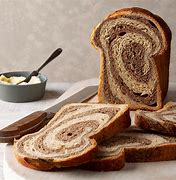

= Lesson 13
:toc:

---

== Section 1

==== A. Dialogues.

Dialogue 1: +

—Can I help you, sir? +
—We want a meal. +
—What sort of meal? A hot one or a cold one? +
—A salad, I think. +
—Which one, sir? A ham or a beef salad? +
—What's this sort of salad in English? +
—Which one are you looking at, sir? +
—That one over there, next to the bread rolls. +
—That's a beef salad, sir. +
—Thank you. Is there any rye bread? +
—No, I'm sorry. There are plenty of rolls.

- salad : a mixture of raw vegetables such as lettuce , tomato and cucumber , usually served with other food as part of a meal （生吃的）蔬菜色拉，蔬菜沙拉 +

=> 主要有三类，分别为水果沙拉、蔬菜沙拉、其他沙拉。 +
沙律是用各种凉透的熟料, 或是可以直接食用的生料加工成较小的形状后，再加入调味品, 或浇上各种冷沙司, 或冷调味汁, 拌制而成的。 +
沙拉的原料选择范围很广，各种蔬菜、水果、海鲜、禽蛋、肉类等均可用于沙拉的制作。

- ham :  the top part of a pig's leg that has been cured (= preserved using salt or smoke) and is eaten as food; the meat from this 火腿；火腿肉

- bread roll 圆面包, 面包卷, 小面包. +
=> 面包，在英文中被分为面包（bread）与卷（roll）两种. 其实，这是美国与英国的区分方式。人们将面包重量1/2磅（约225g）以上者, 称之为面包（bread），而重量小于1/2磅（约225g）以上者, 称之为卷（roll）。

- rye 黑麦；黑麦粒 +
- rye bread 黑麦面包 +

---

Dialogue 2: +

—Excuse me, sir, where do you come from? +
—We come from Copenhagen. +
—You speak English very well. +
—Thank you. +
—What are you doing at the moment? +
—We're visiting London. +
—What do you both do? +
—We are teachers.

- Copenhagen  （丹麦首都）
- at the moment 此刻,现在,目前,此时
- What do you both do? 你们都是做什么的?

---

Dialogue 3: +

—Do you like your salad? +
—Yes. It's nice and fresh. Is yours good, too? +
—No. Mine is rather tasteless. +
—You need some salt and some olive oil.

- tasteless (a.)having little or no flavour 无味的；不可口的 /不雅的；粗俗的；不得体的；杀风景的
- olive 橄榄

---

Dialogue 4: +

—Allow me to fetch you a chair. +
—Thank you, but I've just asked the waiter to get me one. +
—Let me get you a drink, then. +
—Thank you again, but look, John's bringing me one now. +
—I don't seem to be very useful, do I? +
—Don't say that. There's always another time, you know.

- Allow me to  请允许我... （用以礼貌地表示为某人提供服务） +
-> Allow me to propose a toast. 请充许我祝酒。
- fetch  （去）拿来；（去）请来

-让我给你拿把椅子来。 +
-谢谢，不过我已经叫服务员给我拿了。 +
-那我给你拿杯喝的吧。 +
-再次谢谢你，但是你看，约翰正在给我拿。 +
-我好像不是很有用，是吗? +
不要这么说。你知道，总有另一个时间的。

---

==== B. Restaurant English.

Dialogue 1: +

Man: Three gin and tonics please.
Waitress: I'm sorry, sir, but we're not allowed to serve drinks before twelve o'clock midday.
Would you like me to bring you something else? Some coffee?

- gin = geneva 杜松子酒;琴酒; 金酒 (属于烈酒. 是鸡尾酒中使用最多的一种酒.)

- tonic : ( also tonic water ) [ UC ] a clear fizzy drink (= with bubbles in it) with a slightly bitter taste, that is often mixed with a strong alcoholic drink, especially gin or vodka 奎宁水，汤力水（一种味微苦、常加于烈性酒中的有气饮料）
=> tonic 是苏打水与糖、水果提取物和奎宁调配而成的。现在一般用来作为酒吧调酒液之用。 +
奎宁，Quinine，又称金鸡纳碱，金鸡纳树皮中的主要生物碱。用于治疗和预防各种疟疾。孕妇禁用, 会引起胎儿听力损害及中枢神经系统、四肢的先天缺损。 +
奎宁毕竟是一种药物，使用过量会有副作用（例如造成流产或胎儿成长不全），因此某些国家会限制境内贩售的通宁水，其奎宁含量必须低于某特定的安全标准（例如美国食品药品监督管理局就规定其含量不得高于83ppm）。

- midday 中午；正午

---

Dialogue 2: +

Man: Waiter, this table-cloth is a disgrace. It's covered with soup stains. +
Waiter: Oh, I'm so sorry, sir. It should have been changed before. If you'll just wait one
moment ...

- table-cloth 桌布
- disgrace (n.)(v.)丢脸；耻辱；不光彩
- stain 污点；污渍
- soup stains 汤渍

- Should have done...  表示"本来应该做什么，但事实上没做成"的事。 +
-> I shouldn’t have trusted that man. 我本来就不该信任那个人。

---

Dialogue 3: +

Man: Waiter. I can't quite understand how you manage(v.) to get ten marks plus(v.) twelve marks plus(v.) sixty-five marks fifty pennies *to add up to* one hundred and seventy-seven marks fifty pennies. +
Waiter: One moment, I'll just check it, sir. You're quite right, sir. I can't understand how
such a mistake could have been made. I do apologize, sir.

- mark 德国货币

---

== Section 2

==== A. Discussing Past Events.

Interviewer: Now let's go back to your first novel, Rag Doll. When did you write that? +
Writer: Rag Doll, yes. I wrote that in 1960, a year after I left school. +
Interviewer: How old were you then? +
Writer: Um, eighteen? Yes, eighteen, because a year later I went to Indonesia. +
Interviewer: Mm. And of course it was your experience in Indonesia that inspired your film(v.) Eastern Moon. +
Writer: Yes, that's right, although I didn't actually make Eastern Moon until 1978. +

- inspire (v.)赋予灵感；引起联想；启发思考 /~ sb (to sth) 激励；鼓舞
- film (v.)拍摄电影

Interviewer: And you worked in television for a time too. +
Writer: Yes, I started making documentaries for television in 1973, when I was thirty. That
was after I gave up farming(n.). +
Interviewer: Farming? +
Writer: Yes, that's right. You see, I stayed in Indonesia for eight years. I met my wife there
in 1965, and after we came back we bought a farm in the West of England, in 1970. A kind
of experiment, really. +

-  for a time 一度, 一段时期, 一段时间
- documentary 纪录片
- farming (n.) the business of managing or working on a farm 务农；农场经营

Interviewer: But you gave it up three years later. +
Writer: Well, yes. You see it was very hard work, and I was also very busy working on my
second novel, The Cold Earth, which came out in 1975. +
Interviewer: Yes, that was a best-seller, wasn't it? +
Writer: Yes, it was, and that's why only two years after that I was able to give up television work and concentrate(v.) on films and that sort of thing. And after that ...

- later  后来；以后；其后；随后 +
-> I met her again three years later. 三年后我又遇见她了。
- come out 上市 /为大家所知 +
-> The book comes out this week.  该书本周上市。
- best-seller 畅销书

---

==== B. Telephone Conversation.

Shop Assistant: Harling's Hardware. +
Customer: Hello. I'd like to buy a new fridge. I can't afford a very expensive one, and it
mustn't be more than 140 cm high. +
Shop Assistant: Right. I think I have one here. Wait a moment. Yes, here we are. It's 50
cm wide and 130 cm high. +
Customer: Oh. And how much is it? +
Shop Assistant: It's one hundred and twenty-nine pounds, very cheap. +
Customer: I'll come over and have a look at it.

- fridge  冰箱
- come over 拜访

---

==== C. Conversation at Perfect Partners Ltd, a Dating Agency.

A: Good morning. Can I help you? +
B: Yes. I'd like to find my perfect partner. +
A: I see. Well, if you could just answer a few questions? +
B: Certainly. +
A: First of all, what age would you like your partner to be? +
B: About twenty. Not more than twenty-five, anyway. +

- Dating Agency 婚姻介绍所

A: Okay. And what sort of build? +
B: What do you mean? +
A: Well, would you like someone who is very slim or would you prefer someone rather more plump(a.)? +
B: Ah, I see what you mean. I don't think I mind, actually. +

- build 体形；体格；身材
- plump (a.)丰腴的；微胖的

A: And what about height? +
B: Oh, not too tall. +
A: So, medium-height? +
B: Yes, and long hair. +
A: Any particular color? +
B: No. As long as it's long, it doesn't matter what color. +

- As long as 如果，只要， 相当于 so long as, only if，on (the) condition that +
-> We’ll go as long as the weather is good. 只要天气好我们就去。

A: Good. Now, is there anything else at all? +
B: Well, obviously I'd like someone good-looking. +
A: Well, we'll see what we can do. Would you like to fill in this form in the next room and I'll call you soon.

- Well, obviously I'd like someone good-looking. 显然我想找个好看的。

(enters C) +
C: Hello. Is this the Perfect Partners office? +
A: That's right. +
C: I'm interested in meeting someone new. +
A: Well, you've certainly come to the right p1ace. What sort of person are you looking for? +
C: Oh, someone tall, dark and handsome. +
A: I see. And what sort of age? +
C: Oh, mid-twenties, I suppose. +
A: Well, I might have just the person for you. Could I just ask how old you are? +
C: Twenty-four. +
A: Good. Could you just wait here a minute?

- handsome ( of men 男子 ) 英俊的；漂亮的；有魅力的 /( of women 女子 ) 健美的
-  mid-twenties 二十多岁

(C puzzled)
(A goes and fetches B) +
A: This doesn't usually happen, but I think I've found just the person for you. +
B: Oh, no! +
C: Not you! +
B: What are you doing here? +
C: I think I should be asking you that. +
B: Well, I just wanted to ... (interrupted by A) +
A: Excuse me, but what's going on? +
C: That's my husband. +
B: And that's my wife. +
A: But you're just right for each other, from what you told me.

(Pause) +
B: Yes ... I see what you mean. +
C: I suppose it's true. You are what I'm looking for. +
B: Oh, darling. Why did we ever leave each other? +
C: I don't know, but it's not too late, is it? +
B: No. (they embrace) +
A: Excuse me.
B & C: (surprised) Sorry? +
A: That'll be twenty-five pounds please!

---

== Section 3

==== Dictation. A Letter.

47 Riverside Road, London SE1 4LP. +
10th May, 1989 +

Dear Chris, +
Thanks for your letter. I'm sorry I haven't answered it sooner but writing is difficult at
the moment. I fell off my bike last week and broke my arm. It isn't anything very serious
and I'll be OK in a few weeks.

Your holiday sounds fantastic. I'm sure you'll enjoy it. Someone at work went to Jamaica last year and had a wonderful time. When are you going exactly? I hope you'll have good weather.

There isn't really much more news from here. I'll write a longer letter in a few weeks.
Send me a postcard and give my regards to everyone.

Yours +
Kim

- sooner adv. 更快地，更早地

---

