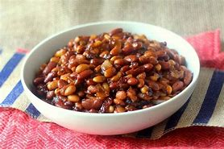
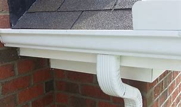

= Lesson 14
:toc: left
:toclevels: 3
:sectnums:
:stylesheet: ../../+ 000 eng选/美国高中历史教材 American History ： From Pre-Columbian to the New Millennium/myAdocCss.css

'''
---

== Section 1

Dialogue 1:

—I want to fly to Geneva on or about the first. +
—I'll just see what there is. +
—I want to go economy (n.)节约；节省；节俭, and I'd prefer the morning. +
—Lufthansa Flight LH 203 leaves at 0920. +
—What time do I have to be there? +
—The coach （客机的）经济舱;长途汽车；长途客车 leaves for the airport at 0815. +

[.my2]
====
-我想在1号或一号左右飞往日内瓦。 +
-我去看看有什么(航班)。 +
-我想要经济舱，而且我更想要早上飞的。 +
-汉莎航空公司LH203航班于上午9点20分起飞。 +
-我必须几点到那里？ +
-大巴于8点15分出发前往机场。
====

[.my1]
.案例
====

.economy
(n.) 节约；节省；节俭 +
- an economy fare (= the cheapest) 经济舱票价
====

---

Dialogue 2: +

—You must have some more chicken. +
—No, thanks. I'm supposed （按规定、习惯、安排等）应当，应，该，须 to be slimming(v.)（靠节食等）变苗条，减肥. +
—Can't I tempt (v.)劝诱；鼓动；怂恿；利诱;引诱；诱惑 you? +
—Well, maybe I could manage a very small piece. +

[.my1]
.案例
====

.BE SUPPOSED TO DO/BE STH
to be expected or required to do/be sth according to a rule, a custom, an arrangement, etc. （按规定、习惯、安排等）应当，应，该，须 +
- You were supposed to be here an hour ago! 你本该在一小时以前就到这儿！

.manage
(v.) ~ (with/without sb/sth) 能解决（问题）；应付（困难局面等） / ~ (on sth) （在某一时间）能办到，能做成
====

---

Dialogue 3: +

—I expect you *could do with* 需要，想要 a cup of tea, couldn't you? +
—I'd rather have a cup of coffee, if you don't mind. +
—Milk and sugar? +
—A milky  奶制的；含奶多的；奶的 one without sugar, please, +

[.my1]
.案例
====

.could do with
to need or want something 需要，想要 +
- You look as if you *could do with* a good night's sleep.  你看来似乎需要好好睡上一夜。 +

Could do with 表示"需要"的意思, 源于 “do”作不及物动词时有表示“合适，足够，行”的意思。例如： +
- There isn’t much food, but it will *do* for the three of us. 食物不多，但够我们三个人吃的。 +

*Could 在这里表示虚拟语气，无实质意义*，所以 could do with 表示一种"需求", 而不是“可以handle”的状态。 +
所以当 If something could do with something, it needs it very much. 时，意思是"很想要…"
====

---

Dialogue 4: +

—What would you like to drink? +
—A *black coffee* 不加牛奶(或奶油和糖)的咖啡，清咖啡 for me, please. +
—How about something to eat? +
—Yes, I'd love *a portion （食物的）一份，一客  of* that strawberry tart 甜果馅饼. +
—Right. I'll see if I can *catch* the waitress's *eye* 引起某人的注意，吸引某人视线，引人注目. +

[.my2]
====
吃点什么如何? +
是的，我想要一份草莓馅饼。 +
（表示同意或遵从）是的，好的。我看看能不能引起服务员的注意。
====

[.my1]
.案例
====

.tart
an open pie filled with sweet food such as fruit 甜果馅饼 +
- a strawberry tart 草莓馅饼 +

.Catch one's eye
引起某人的注意，吸引某人视线，引人注目
====

---

Dialogue 5: +

—Can I take your order 点菜；所点的饮食菜肴, sir? +
—Yes. I'd like to try the steak 牛排, please. +
—And to follow 接着是；然后是；下一道是? +
—Ice cream, please. +

[.my1]
.案例
====

.order
点菜；所点的饮食菜肴 +
- May I take your order ? 您现在点菜吗？ +
- an order for steak and fries 点一份牛排炸薯条

.follow
to come or be eaten after another part 接着是；然后是；下一道是 +
- I'll have soup and fish to follow . 我要汤，然后要鱼。 +
- And to follow 还要什么?
====

---

Dialogue 6: +

—Can I help you, madam? +
—Is there a bank at this hotel? +
—Yes, madam, the International Bank has an office on the ground floor of the hotel. +
—Is it open yet? +
—Yes, madam, the bank is open from Monday to Friday from 9:30 am till 3 pm. +
—Thank you. +

---

Dialogue 7: +

—Can I still get breakfast in the brasserie 法式（廉价）餐馆? +
—Yes, sir, if you hurry you can just make （尽力）赶往，到达，达到 it —breakfast is served until 10:30. +

[.my1]
.案例
====

.brasserie
=> 自法语。brass, 啤酒，词源同brew, 酿造。

.make
(v.) to manage to reach or go to a place or position  （尽力）赶往，到达，达到 +
-  Do you think we'll *make Dover* by 12? 你觉得我们12点前能到多佛吗？ +
- The story *made (= appeared on) the front pages* of the national newspapers. 这件事登在了全国性报纸的头版。 +
- I'm sorry I couldn't *make your party* last night. 很抱歉，昨晚没能参加你们的聚会。
====

---

Dialogue 8: +

—How soon  早；快 do I have to leave my room? +
—Normally it's by 12 noon on the day of your departure 离开；起程；出发;（在特定时间）离开的飞机（或火车等）. +
—Well, you see, my plane doesn't go till half past five tomorrow afternoon. +
—I see. Which room is it, madam? +
—Room 577 —the name is Browning. +
—Ah yes, Mrs. Browning. You may keep the room till 3 pm if you wish. +
—Oh, that's nice. Thank you very much. +

[.my1]
.案例
====
.soon
early; quickly 早；快 +
- Please send it as soon as possible . 请尽快把它寄出去。 +
- They arrived home sooner than expected. 他们很快就到家了，比预料的要早。

.departure
~ (from...): 离开；起程；出发 /（在特定时间）离开的飞机（或火车等） +
- arrivals and departures 到站和离站班次 +
- All departures are from Manchester. 所有离站班次都从曼彻斯特出发。 +
- the departure lounge/time/gate 候机（或车）室；离站时间；登机（或上车）口
====

---

== Section 2

==== A. Telephone Conversations.

Conversation 1: +

Mrs. Henderson has just answered the telephone. Frank wasn't in so she had to *take a message for* 为…带口信 him. Listen to the conversation and look at the message she wrote. +

Julie: 789 6443. Who's calling, please? +
Paul: Paul Clark here. Can I speak to Mr. Henderson, please? +
Julie: Sorry, he's out at the moment. Can I take a message? +
Paul: Yes, please. Could you tell him that his car will be ready by 6 pm on Thursday? +
Julie: Yes, of course. I'll do that. What's your number, in case he wants to ring you? +
Paul: 2748 double 53. +
Julie: (repeating) 2 ... 7 ... 4, 8 ... double 5 ... 3. Thank you. Goodbye. +

---

Conversation 2: +

Male: 268 7435. Who's calling? +
Female: This is Helen Adams. Could I speak to my husband? +
Male: Sorry, Mr. Adams is out. Can I take a message? +
Female: Could you tell him that my mother is arriving on Thursday? At about 1 pm. +
Male: Right, Mrs. Adams. I'll do that. Where are you, in case he wants to ring you? +
Female: I'm not at home. The number here is 773 3298. +
Male: (repeating the number) 773 3298. Thank you. Goodbye. +

---

Conversation 3: +

Female: 575 4661. Who's calling, please? +
Male: This is Mr. Jones from the Daily （除星期日外每日发行的）日报 Star. I'd like to talk to Mr. Henderson. +
Female: Sorry, I'm afraid he isn't in. Can I take a message? +
Male: Yes... Please tell him that the advertisement will definitely be in Friday's paper. That's Friday, the 13th of this month. +

[.my2]
请告诉他这个广告一定会登在星期五的报纸上。

Female: Certainly, Mr. Jones. What's the phone number, in case he has forgotten. +
Male: My number? (astounded(a.)感到震惊的；大吃一惊的) The number of the Daily Star? Everyone knows it. +
(chanting) 123 4567. +
Female: (laughing and repeating) 1-2-3 4-5-6-7. Thank you. Mr. Jones. +

[.my1]
.案例
====

.Daily Star
每日星报（英国报纸名）
====

---

==== B. Shopping.

Shopkeeper （通常指小商店的）店主: Yes, Mrs. Davies? What could we do for you today? +
Mrs. Davies: I want to order some foods. +
Shopkeeper: Well, I thought that might be the reason you came here, Mrs. Davies. Ha, ha, +
ha, ha, ha. +
Mrs. Davies: But I want rather （与动词连用以减弱语气）有点儿，稍微 a lot, so you'll have to deliver 递送；传送；交付；运载 it. +
Shopkeeper: That's perfectly 完全地；非常；十分 all right. You just order whatever you like /and we'll send it
straight round 到某地，在某地（尤指居住地） to your house this afternoon. +

[.my2]
====
戴维斯太太:但我要的很多，所以你得送货。 +
店家:完全可以。您只要点您喜欢的菜，我们今天下午会直接送到您家里。
====

[.my1]
.案例
====

.round
(ad.)to or at a particular place, especially where sb lives 到某地，在某地（尤指居住地） +
- I'll be round in an hour. 我过一个小时就到。 +
- We've invited the Frasers round this evening. 我们已经邀请了弗雷泽一家今晚过来。
====

Mrs. Davies: Right. Well, first of all I want two boxes of baked beans. +
Shopkeeper: You mean two tins? +
Mrs. Davies: No, I mean two boxes. Two boxes of tins of baked beans 豆；菜豆；豆荚；豆科植物. +
Shopkeeper: But each box contains forty-eight tins. Are you really sure you want so many?
I mean, it would take a long time to eat so many. +
Mrs. Davies: Who said anything about eating them? I'm saving them. +
Shopkeeper: Saving them? +
Mrs. Davies: Yes, for the war. +

[.my1]
.案例
====

.baked beans
番茄酱烘豆（常制成罐头） +

====

Shopkeeper: War? Are we going to have a war? +
Mrs. Davies: *You never know*  （非正式）很难说，不可预知, 你永远无法预料到. I'm not taking any chances 冒险. I read the papers. You're not going to catch 当场发现（或发觉） me stuck in the house without a thing to eat. So put down two boxes of baked beans, will you? And three boxes of rice, five boxes of spaghetti 意大利细面条 and you'd better send me a hundred tins of tomato sauce to go with it. Have you got that? +
Shopkeeper: Yes, two boxes of baked beans, three boxes of rice, five boxes of spaghetti
and a hundred tins of tomato sauce. But I'm not sure we have all these things in stock （商店的）现货，存货，库存. I mean not that amount. +

[.my1]
.案例
====
.take a chance (on sth)
冒险

.catch
当场发现（或发觉）  +
- You wouldn't catch me working (= I would never work) on a Sunday! 你绝对不会看到我在星期日工作！
====

Mrs. Davies: How soon can you get them, then? +
Shopkeeper: Well, within the next few days. I don't suppose （根据所知）认为，推断，料想 you'll be needing them before then, will you? +

Mrs. Davies: You never can tell. It's *touch and go* 情况非常的紧急,一触即发的. I was watching the nice man on the television last night. You know, the one with the nice 令人愉快的；宜人的；吸引人的 teeth. Lovely smile he's got. And he said, 'Well, you never can tell. And that set me thinking, you see. Anyway, you just deliver them as soon as you can. I shan't be going out again after today. Now ... now what else? Ah yes, tea and sugar. I'd better have a couple 几个人；几件事物  of boxes of each of those. No ... no make if four of sugar. I've got a *sweet tooth* 嗜好甜食.  +

[.my1]
.案例
====
.touch and go
表示 It is a very critical and risky situation. 情况非常的紧急（critical），一触即发的, 同时非常的高风险（risky）以及没有把握的。 +
- It'll be touch-and-go for the first three days after the operation. 手术后的前三天，是风险最高的时候（任何坏事都可能发生）。

.nice
~ (to do sth)~ (doing sth)~ (that...) pleasant, enjoyable or attractive 令人愉快的；宜人的；吸引人的 +
- You look very nice. 你很好看。

.couple
~ (of sth) a small number of people or things 几个人；几件事物 +
- I've seen her a couple of times before. 我以前见过她几次。

.I've got a sweet tooth
= I have a sweet tooth 我爱吃甜食

====

Shopkeeper: So two boxes of tea and four boxes of sugar. Anything else? It doesn't sound a very interesting diet 日常饮食；日常食物. How about half a dozen boxes of tinned fish? +
Mrs. Davies: Fish? No, I can't stand fish. Oh, but that reminds me, eight boxes of cat food. +
Shopkeeper: Cat food? +
Mrs. Davies: Yes. Not for me. You don't think I'm going to sit there on my own, do you? +

---

== Section 3

==== Dictation.

*Spot 地点；场所；处所 Dictation* (听写) 填空听写 1: +

A sailor 水手；海员 once went into a pub in a very dark street in Liverpool. He got very drunk(a.)（酒）醉 there and staggered (v.)摇摇晃晃地走；蹒跚；踉跄 out around 11 pm.  +
Around midnight, one of his friends found him on his hands and knees in the gutter 路旁排水沟；阴沟. "What are you doing there?" he inquired. "I'm looking for my wallet. I think I lost it in that dark street down there," he said.  +
"Well, if you lost it in that street, why are you looking for it here?" the friend demanded 强烈要求. The sailor thought(v.) for a moment." Because the light is better here," he answered.  +

[.my1]
.案例
====

.gutter
路旁排水沟；阴沟 / a long curved channel made of metal or plastic that is fixed under the edge of a roof to carry away the water when it rains 檐沟；天沟 +

====

---

Spot Dictation 2: +

A famous 85-year-old millionaire once gave a lecture （通常指大学里的）讲座，讲课，演讲 at an American university. "I'm going to tell you how to live a long, healthy life and how to get very rich at the same time," he announced. "The secret is very simple. All you have to do is avoid bad habits like drinking and smoking. But you have to get up early every morning, work at least 10 hours a day and save every penny, as well," he said.

A young man in the audience stood up. "My father did all those things and yet he died a very poor man at the age of only 39. How do you explain that?" he asked.

The millionaire thought for a moment. "It's very simple. He didn't do them for long enough," he answered.

'''
