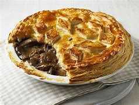
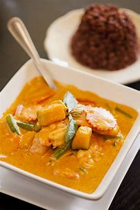
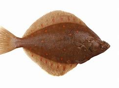
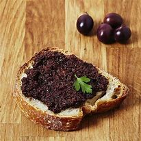
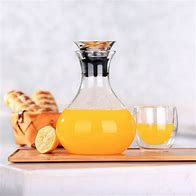

= Lesson 15
:toc:

---

== Section 1

Dialogue 1: +
—What flights are there from London to Vienna tomorrow? +
—If you'd like to take a seat, I'll find out for you. +
—I'd like to travel first class, please. +
—BEA Flight BE 502 takes off from Heathrow at 0925, and flies direct. +
—What time have I got to get there? +
—You'll have to be at West London Air Terminal by 0810 at the latest.

- flight 航班飞机；班机
- first class 头等座位（或车厢、舱）
- take off  (飞机) 起飞
- to fly direct 直飞

---

Dialogue 2: +
—Another piece of meat pie? +
—No, thanks, really. I'm on a diet. +
—Please do. You've hardly eaten anything. +
—It's delicious, but I don't think l ought to.

- meat pie 肉馅饼,肉饼 +

- on a diet 节食（减肥）

---

Dialogue 3: +
—How about a nice cup of tea before you go? +
—Yes, I'd love one. +
—How do you like it? +
—A strong one with three spoons for me, please.

- How do you like ...? +
1.在泡茶或咖啡时，用来询问对方的要求或征求对方意见 (也说 How would you like...? )，意为：你喜欢喝什么样的茶(或咖啡)?::
-> *How do you like* your tea? 你喜欢喝什么样的茶? +
I like it strong. 我喜欢浓茶。
2.用于饭店等场合，询问顾客对饭菜的煮法。::
-> *How would you like* your steak? 你喜欢吃什么样的牛排? +
Rare. 嫩一点

- spoon 勺；匙；调羹

---

Dialogue 4: +
—What are you going to have to drink? +
—I'd like something cool. +
—*Would you care for* some cake? +
—Yes, I'll try a piece of cheese cake. +
—It certainly looks tempting. I wouldn't mind some myself.

- What are you going to have to drink? 你要喝点什么?
- *would you care for... | would you care to...* : ( formal ) used to ask sb politely if they would like sth or would like to do sth, or if they would be willing to do sth （礼貌问语）您喜欢，您愿意，您要 +
-> *Would you care for* another drink? 您再来一杯好吗？ +
-> *If you'd care to* follow me, I'll show you where his office is. 如果您愿意跟我走，我会把您领到他的办公室去。

- cheese 干酪；奶酪
- 这看起来当然很诱人。我自己也不介意来点。

---

Dialogue 5: +
—Have you chosen something, sir? +
—Yes, I think I'll have the curry, please. +
—What would you like afterwards? +
—I'd like some fruit if you have any.

- curry : a S Asian dish of meat, vegetables, etc. cooked with hot spices, often served with rice 咖喱菜 +
=> 咖喱是由多种香料调配而成的酱料，常见于印度菜、泰国菜和日本菜等菜系，一般伴随肉类和饭一起吃。 +

---

Dialogue 6: +
—Would you like a cigarette? +
—No, thanks. I'm trying to cut down. +
—Go on. I owe you one from yesterday. +
—OK, but next time you must have one of mine.

- cut down : If you cut down on something or cut down something, you use or do less of it. 减少
->  He cut down on coffee and cigarettes, and ate a balanced diet.  他少喝咖啡，少抽烟，饮食均衡。

- I owe you one 我欠你个人情。

---

Dialogue 7: +
—I wonder if you could help me —I'm looking for a room. +
—I have got a vacancy, yes. +
—What sort of price are you asking? +
—Eight pounds fifty a week excluding laundry. +
—Would it be convenient to see the room? +
—Can you call back later? We're right in the middle of lunch.

- vacancy （旅馆等的）空房，空间 /~ (for sb/sth)（职位的）空缺；空职；空额 +
-> I'm sorry, we have no vacancies. 对不起，我们这里客满。
- laundry 洗衣物；洗衣物的活 / 洗衣店；洗衣房 +
-> The hotel has a laundry service. 旅馆提供洗衣服务。

-现在来看房方便吗？ +
-你能晚点再打来吗？我们正吃午饭呢。

---

Dialogue 8: +
—Will Dr. Black be able to see me at about 9:15 tomorrow? +
—Sorry, but he's fully booked till eleven unless there's a cancellation. +
—Would ten to one be convenient? +
—Yes, he's free then.

 - Dr.  医生
- cancellation 取消；撤销

---

Dialogue 9: +
—Can you fix me up with a part-time job? +
—Anything in particular that appeals to you? +
—I was rather hoping to find something in a school. +
—Have you done that kind of thing before? +
—Yes, I was doing the same job last summer. +
—I might be able to help you, but I'd need references.

- fix  ~ sth (up) (for sb) 安排；组织  +
-> I've fixed up (for us) to go to the theatre next week. 我已安排好（我们）下星期去看戏。 +
-> I'll fix a meeting. 我要安排一次会议。
- reference (找工作)推荐信；介绍信

---

== Section 2

==== A. Quick Lunch.

Mr. Radford has just *dropped in* for a quick lunch. +

Waitress: A table for one, sir? +
Mr. Radford: Yes, please. +
Waitress: Are you having the set lunch? +
Mr. Radford: Yes. +
Waitress: What would you like to start with? +
Mr. Radford: What's the soup of the day? +
Waitress: Mushroom. +
Mr. Radford: Yes, please. I'll have that. +
Waitress: And for your main course? +
Mr. Radford: The plaice, I think, and apple tart to follow. +
Waitress: Would you like something to drink with your meal? +
Mr. Radford: Yes. A lager please. +
Waitress: Thank you.

- drop ˈby/ˈin/ˈroundˌ| drop ˈin on sbˌ | drop ˈinto sth 顺便访问；顺便进入
-> Drop by sometime. 有空儿来坐坐。
- set lunch 午餐套餐
- course  一道菜
- plaice 比目鱼, 鲽（一种可食用的比目海鱼）+

- tart : an open pie filled with sweet food such as fruit 甜果馅饼
- lager 拉格啤酒，贮陈啤酒，贮藏啤酒（味淡，通常多泡沫）

---

==== B. Dinner.

Waiter: Good afternoon. +
Mr. Blackmore: Good afternoon. I have a table for two under the name of Blackmore. +
Waiter: Yes, sir. Would you like to come this way?
Mr. Blackmore: Thank you. +
Waiter: Can I take your coat, madam? +
Mrs. Blackmore: Thank you. +
Waiter: Will this table do for you?
Mr. Blackmore: That will be fine, thanks. +

- I have a table for two under the name of Blackmore. 我以Blackmore的名义, 订了一张可容纳双人就餐的餐桌。
-  Will this table do for you? 服务员带领你进餐厅，然后问你坐这里可以吗？

Waitress: Would you like a drink before your meal? +
Mrs. Blackmore: Yes. A dry sherry, please. +
Mr. Blackmore: Half of bitter for me. +

- sherry 雪利酒（烈性葡萄酒，原产自西班牙南部）
-  bitter  苦啤酒（在英国很受欢迎）

Waiter: Are you ready to order?
Mr. Blackmore: Yes, I think so. +
Waiter: What would you like for starters, madam? +
Mrs. Blackmore: I can't decide. What do you recommend? +
Waiter: Well, the prawns are always popular. The patè is very good ... +
Mrs. Blackmore: The prawns then please, for me. +
Waiter: And for you, sir?
Mr. Blackmore: I think I'll try the soup. +

- starter （主菜之前的）开胃小吃，开胃品 /（发动机的）启动装置，启动器
- prawn 对虾；大虾；明虾
- patè : a soft mixture of very finely chopped meat or fish, served cold and used for spreading on bread, etc. 鱼酱，肉酱（用作冷盘，涂于面包等上） +

Waiter: Very good, sir. And to follow? +
Mrs. Blackmore: Rack of lamb, I think. +
Waiter: And for you, sir? +
Mr. Blackmore: I'll have the steak. +
Waiter: How would you like your steak done, sir?
Mr. Blackmore: Medium rare, please. +
Waiter: Thank you. Would you like to see the wine list?
Mr. Blackmore: Do you have a house wine? +
Waiter: Yes, sir. Red or white?
Mr. Blackmore: Do you have half bottles or half carafes? +
Waiter: Yes, sir.
Mr. Blackmore: One of each then, please.

- rack :~ of lamb/pork : a particular piece of meat that includes the front ribs and is cooked in the oven （羊、猪等带前肋的）颈脊肉 +
image:../img/Rack of lamb.jpg[]

- steak 牛排
- house wine 招牌酒, 特选葡萄酒
- Medium rare 三分熟, 三分熟牛排
- medium 五分熟
- medium well 七分熟
- carafe : a glass container with a wide neck in which wine or water is served at meals; the amount contained in a carafe （餐桌上盛酒或水的）喇叭口玻璃瓶，饮料瓶；一瓶（的量） +

---

==== C. Interview.

Reporter: Now, Susan. You've had a few minutes to rest. Can you tell us something about
yourself? How old are you and what do you do? +
Susan: I'm twenty-two and I'm a bus conductress. +
Reporter: A bus conductress! So you're used to collecting money. Who taught you to
cycle? +
Susan: Nobody. I taught myself. I've been cycling since I was five. +
Reporter: And who bought that beautiful racing cycle for you? +
Susan: I bought it myself. I worked overtime. +

- conductress （公共汽车的）女售票员
- be used to doing 适应了/习惯于做某事. be 可以用 become 或者 get 替代。 +
-> I am used to getting up early.
- BE WORKING OVERTIME 非常活跃；过分活跃 +
-> There was nothing to worry about. It was just her imagination working overtime. 没什么可担心的。那只是她的想象力太丰富了。

Reporter: Good for you! And what are you going to do now?
Susan; Now? If you mean this minute, I'm going to have a long hot bath. +
Reporter: You must need to relax. Again, congratulations. That was Susan James, winner
of this year's London to Brighton cycle race.

---

==== D. Why can't I do what I like?

I hope I never grow old! My grandfather lives with us and he's making my life a misery.

When I was small he was kind and cheerful. But now he's always complaining and
criticising. I mustn't interrupt when he's talking. It's rude.

He doesn't like my clothes. 'Nice girls don't dress like that.' I shouldn't wear make-up. 'Natural beauty is best.'

- misery 痛苦；悲惨
- MAKE SB'S LIFE A MISERY : to behave in a way that makes sb else feel very unhappy 使别人遭殃；让人痛苦
- cheerful 令人愉快的
- criticize (v.)~ sb/sth (for sth) 批评；批判；挑剔；指责
- make-up 化妆品 +
-> She never wears make-up . 她从来不化妆。

Sometimes he interferes(v.) with my homework. 'When I was young we used to do maths differently,' he says. Honestly, he's so old he doesn't know anything. But that doesn't stop him criticising me.

He doesn't like my friends or my favorite records. 'You're making too much noise,' he calls. 'I can't get to sleep.'

When he's not complaining he's asking questions. 'Where are you going? Where have you been? Why aren't you helping your mother?' He thinks I'm six, not sixteen.

Anyway, why can't I do what I like? It's my life, not his.

- interfere (v.)~ (in sth)  干涉；干预；介入
- used to do : 过去常常做某事，现在不再做了 +
-> She used to help me clean the room.她过去常常帮我扫地。
- call (v.)~ (sth) (out) | ~ (out) to sb (for sth) :  大声呼叫，大声说（以吸引注意力） +
-> Did somebody call my name? 有人叫我的名字吗？

---

== Section 3

==== Dictation.

Philip is a very interesting boy. He is clever but he doesn't like school. He hates
studying but he is very keen on learning new practical skills. In his spare time he often
repairs motorbikes. He likes helping the neighbours in their vegetable gardens, too.

- clever : quick at learning and understanding things 聪明的；聪颖的
- practical skills 实用技能, 实践技能
- practical ( 想法、方法或行动 ) 切实可行的
- spare (时间)空闲的；空余的

---
