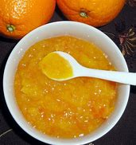
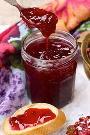
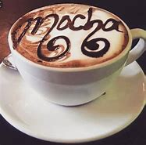
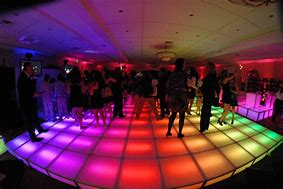

= Lesson 17
:toc: left
:toclevels: 3
:sectnums:
:stylesheet: ../../+ 000 eng选/美国高中历史教材 American History ： From Pre-Columbian to the New Millennium/myAdocCss.css

'''

== Section 1

Dialogue 1: +

—What's the postage on these letters to Thailand, please? +
—I'll have to check. Do you need anything else? +
—Yes. A three pence stamp, please. +
—That'll be eighty-five pence in all.

[.my1]
.案例
====

- postage 邮资；邮费
- pence = penny 便士（英国的小硬币和货币单位，1英镑为100便士） /( NAmE ) a cent 分
====

---

Dialogue 2: +

—I wish you wouldn't have your TV so loud. +
—Sorry! Were you trying to sleep? +
—Yes, and while I think of it 同时我还想起一件事 —please ask when you borrow the iron 熨斗. +
—I really ought to have known better. Sorry!

[.my1]
.案例
====

.should/ought to have done
表示“过去本应该做某事却未做。”  +
其否定结构 oughtn't to have done 表示 “过去本不该做某事却做了。” +

PHRASE You use *ought to have* with a past participle to indicate that although it was best or correct for someone to do something in the past, they did not actually do it. (某人) 本应该 (表示虚拟语气) +
-  I realize *I ought to have told you* about it.  我意识到我本该告诉你这件事的。 +
-  *I ought not to have asked you* a thing like that. I'm sorry.  我本不应该问你这样一件事。对不起。

====

---

Dialogue 3: +

—Wendy, I'd like you to meet my brother, Sam. +
—How do you do? +
—How do you do? +
—What do you think of life in England? +
—I'm still feeling pretty homesick(a.)思乡的；想家的；患怀乡病的. +
—It's bound(a.)一定会；很可能会 to be strange 陌生的；不熟悉的 at first.

[.my1]
.案例
====
.I'd like to
= I would like to =I want : 我想要

.bound
(a.)~ to do/be sth : certain or likely to happen, or to do or be sth 一定会；很可能会 +
- *It was bound to happen* sooner or later (= we should have expected it) . 这事迟早都是要发生的。

.bound
(v.)跳跃着跑

.strange
(a.)~ (to sb)  陌生的；不熟悉的 +
- a strange city 陌生的城市
====

---

Dialogue 4: +

—It's time we were off. +
—So soon? Can't you stay a little longer? +
—I wish I could, but I'm late already. +
—What a shame! +
—Thank you for a wonderful meal. +
—I'm glad you enjoyed it.

[.my1]
====
- It's time we were off 这是虚拟的用法, 本句翻译为"我们该走了"，但隐含之意为说话时已经晚了！
- So soon 如此快，这么快
- What a shame 真遗憾; 多可惜; 真可惜
- a shame [ sing. ] used to say that sth is a cause for feeling sad or disappointed 令人惋惜的事；让人遗憾的事
====

---

Dialogue 5: +

—Sorry, but I didn't quite catch that. +
—I said, 'Can I give you a lift?' +
—Isn't it out of your way? +
—No, it's on my way home.

[.my1]
====
- catch [ VN ] ( informal, especially NAmE ) to see or hear sth; to attend sth 看见；听到；出席；参加 / 听清楚；领会 +
-> Sorry, I didn't quite catch what you said. 对不起，我没听清楚你的话。
- lift (n.)免费搭车；搭便车 +
-> I'll give you a lift to the station. 我用车顺便送你去车站。

- out of your ˈway : not on the route that you planned to take 不在计划走的路线上 +
-> I'd love a ride home —if it's not out of your way. 我很想搭你的车回家，如果这不叫你绕路的话。
- out of the ˈway 不再挡路；不再碍事
====

---

Dialogue 6: +

—I feel shivery(a.) and I've got a pain in my stomach. +
—How long have you had it? +
—The best part of a week. +
—By the sound of it, you've caught a chill. +
—What should I do? +
—I'll give you something for it, and come to see you in a couple of days.

[.my1]
====
- shivery (a.)颤抖的，战栗的，哆嗦的（因寒冷、恐惧、患病等）
-  **the best/better part of sth** : most of sth, especially a period of time; more than half of sth （事物、时间的）绝大部分，多半 +
->  The journey took her *the better part of an hour*. 旅程花去了她半个多小时
- chill  着凉；受寒. A chill is a mild illness which can give you a slight fever and headache. 风寒

- I'll give you something for it 我给你开点药
====

---

== Section 2

==== A. Restaurant English.

Dialogue 1: +

Woman: I'd like the continental breakfast, please. +
Waiter: Yes, madam. What sort of fruit juice would you like to start with? +
Woman: The pineapple juice. +
Waiter: Would you prefer honey, marmalade or jam? +
Woman: Oh, marmalade, please. +
Waiter: And what would you like to drink, madam? +
Woman: Coffee, please, black coffee.

[.my1]
====
- pineapple  菠萝；凤梨
- honey 蜂蜜
- mar·ma·lade :  jam/jelly made from oranges, lemons, etc., eaten especially for breakfast 橘子酱；酸果酱 +

- jam :[ UC ] a thick sweet substance made by boiling fruit with sugar, often sold in jars and spread on bread 果酱 +

- black coffee  黑咖啡（什么都不加的纯咖啡）
- white coffee 加了牛奶或者稀奶油的咖啡

-  es·presso  : /eˈspresəʊ/  [ U ] strong black coffee made by forcing steam or boiling water through ground coffee 蒸馏咖啡（让蒸汽或开水通过磨碎的咖啡豆制成的浓咖啡） +
=> espresso是意大利语，是与咖啡相关的单词，有on the spur of the moment与“for you”（立即为您现煮）的意思。

- latte 拿铁(+牛奶)咖啡 +
=> “拿铁”不是咖啡。拿铁（Latte）在意大利语里是“牛奶”的意思. 意大利语的 Caffè Latte 指的才是拿铁咖啡。现在很多冷饮店都会推出自己的“拿铁”系列，像“红茶拿铁”“抹茶拿铁”等等，其实就是奶茶, 而并没有咖啡的成分。 +
*拿铁咖啡（Coffee Latte）, 是意大利浓缩咖啡（Espresso）与牛奶的混合.* +

- mocha 摩卡(+巧克力)咖啡 :  a drink made or flavoured with this, often with chocolate added 加巧克力的摩卡咖啡饮料 +
=> *cafe mocha （摩卡咖啡），指混合巧克力的咖啡.* +

- cappuccino :  a type of coffee made with hot frothy milk and sometimes with chocolate powder on the top 卡普契诺咖啡，卡布奇诺咖啡（加热奶，有时上面撒有巧克力粉） +
=> 是一种加入以同量的意大利特浓咖啡, 和蒸汽泡沫牛奶, 相混合的意大利咖啡。传统的卡布奇诺咖啡, 是三分之一浓缩咖啡，三分之一蒸汽牛奶, 和三分之一泡沫牛奶，并在上面撒上小颗粒的肉桂粉末。 +
卡布奇诺咖啡, 是意大利咖啡的一种变化，即在偏浓的咖啡上，倒入以蒸汽发泡的牛奶，此时咖啡的颜色, 就像卡布奇诺教会(Capuchin)修士深褐色外衣上覆的头巾一样，咖啡因此得名。 +

- instant coffee 速溶咖啡
- brewed coffee 现煮的咖啡
====

---

Dialogue 2:

Head Waiter: "Deep Sea Restaurant". Head Waiter. Good morning. +
Woman: I'd like to reserve a table for five. +
Head Waiter: And was that today, madam? +
Woman: Of course. +
Head Waiter: At what time, madam? +
Woman: Oh, about three o'clock, I suppose. +
Head Waiter: I'm afraid we only serve lunch until 3 pm, madam. +
Woman: Oh well, two o'clock then, and it must be by a window. +
Head Waiter: Very good, and what name, please? +
Woman: Bellington, Mrs. Martha Bellington. +
Head Waiter: Very good, Mrs. Bellington. A table for five at 2 pm today.

---

Dialogue 3:

Head Waiter: "Deep Sea Restaurant." Good morning. +
Man: Do you have a table for two this evening? +
Head Waiter: Certainly, sir. At what time was it? +
Man: What time does the band start playing? +
Head Waiter: At 8 pm, sir. +
Man: Right. Make it 7:30 then, and near the dance floor if possible. +
Head Waiter: Very good, sir. And what name, please? +
Man: Kryzkoviak. +
Head Waiter: Could you just repeat that, please? +
Man: Kryzkoviak, that's Polish, you know. K-R-Y-Z-K-O-V-I-A-K. +
Head Waiter: Yes. Thank you, Mr. Kryzkoviak. We look forward to seeing you.

[.my1]
====
- dance floor :an area where people can dance in a hotel, restaurant, etc. （旅馆、餐厅供客人跳舞的）舞场，舞池 +

====

---

==== B. In the Cinema. +

—What shall we do tonight? +
—How about the cinema? +
—That's a good idea. We haven't been for ages. +
—What would you like to see? +
—Oh, I don't know. Spy Story? +
—Spy Story? That terrible, old film? +
—But it's got James Perevelle in it. I'm still trying to write a story about him, you know. +
—But I've seen it before. +
—Never mind. Perhaps you'll like it better the second time.

[.my1]
====
- We haven't been for ages 我们好久没做了 +
- ages [pl.] ( also an age [ sing. ] ) ( informal especially BrE ) a very long time 很长时间 +
-> I waited for ages . 我等了好长时间。 +
-> Carlos left ages ago . 卡洛斯老早就离开了。 +
-> It's been an age since we've seen them. 我们有很长一段时间没有见到他们了。
====

(In the cinema) +
—(You look so beautiful in that dress. Why do you have to die?) +
—Would you like an ice cream? +
—Shhhh. No, thank you. +

[.my1]
====
- Shhhh 嘘（语气词）
====

—(Let's run away together and forget about the whole world.) +
—What about some chocolates? +
—Shut up! I'm watching the film. +
—Well, I'm gonna get myself some chocolates. +

[.my1]
====
- run away 私奔 /出走
- gonna 将要（等于 going to）
====

—(Just you and me and nobody else.)
(After the film) +
—That was really wonderful. +
—Wonderful? Don't be silly. +
—He's a fantastic actor. +
—Do you feel alright? +
—Of course, I do. +
—I just wondered. You don't usually like rubbish films like that. +
—It wasn't rubbish at all. Some of the films you like are really terrible, though.

[.my1]
====
- Do you feel alright? 您觉得还好吗?
- wonder : V-T/V-I If you wonder about something, you think about it, either because it interests you and you want to know more about it, or because you are worried or suspicious about it.  想知道
====

---

==== C. A Science Fiction Story.

The spaceship flew around the new planet several times. The planet was blue and
green. They couldn't see the surface of the planet because there were too many white
clouds. The spaceship descended slowly through the clouds and landed in the middle of a
green forest. The two astronauts put on their space suits, opened the door, climbed
carefully down the ladder, and stepped onto the planet.

[.my1]
====
- descend (v.)下来；下去；下降 +
-> The plane began to descend. 飞机开始降落。
====

The woman looked at a small control unit on her arm. 'It's all right,' she said to the
man. 'We can breathe the air ... it's a mixture of oxygen and nitrogen.' Both of them took
off their helmets and breathed deeply. +
They looked at everything carefully. All the plants and animals looked new and
strange. They could not find any intelligent life.

[.my1]
====
- nitrogen  氮；氮气
- helmet 头盔；防护帽
- intelligent 有智力的；有理解和学习能力的 /智能的 / 有才智的；悟性强的；聪明的
====

After several hours, they returned to their spaceship. Everything looked normal. The
man switched on the controls, but nothing happened. 'Something's wrong,' he said. 'I don't understand ... the engines aren't working.' He switched on the computer, but that didn't work either. 'Eve,' he said, 'we're stuck here ... we can't take off!'
'Don't worry, Adam,' she replied. 'They'll rescue us soon.'

[.my1]
====
- switch off/on | switch sth off/on 关╱开（电灯、机器等） +
-> How do you switch this thing on? 这东西怎么开？

- take off  (飞机) 起飞 / 脱去
====

---

== Section 3

==== Dictation.

There were angry scenes yesterday /outside No. 10 Downing Street /as London school
teachers protested(v.) about their salaries and conditions. London teachers are now in the
second week of their strike(n.) for better pay. Tim Burston, BBC correspondent for education
was there.

[.my1]
====
- scene : A scene in a play, movie, or book is part of it in which a series of events happen in the same place. 场面; 片断 /景象 /场面; 事件
- Downing Street 唐宁街(英国首相及财政大臣所居住的位于伦敦的街道); 英国首相及其手下官员
- protest (v.)~ (against sth) 抗议；抗议书（或行动）；反对
- strike 罢工；罢课；罢市
- correspondent 记者；通讯员
====

---
