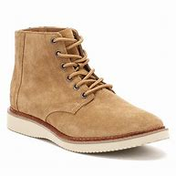

= Lesson 18
:toc: left
:toclevels: 3
:sectnums:
:stylesheet: ../../+ 000 eng选/美国高中历史教材 American History ： From Pre-Columbian to the New Millennium/myAdocCss.css

'''

== Section 1

Dialogue 1: +

—Cigarette? +
—No, thanks. Not before lunch. +
—Please have one. It's a new brand. +
—I honestly don't feel like one at the moment, thanks.

---

Dialogue 2: +

—I believe you take in foreign students. +
—Yes, if you don't mind sharing. +
—How much is it? +
—Nine pounds per week including heating. +
—Do you think I could have a look at it, please? +
—We're having it decorated at the moment. Will Friday do?

[.my1]
====
- take sb in : to allow sb to stay in your home 留宿；收留 /欺骗；蒙骗
- heating (n.) 供暖；供暖系统；暖气设备

-我想你们是收外国学生寄宿的。 +
-是的，如果你不介意合住。
====

---

Dialogue 3: +

—I wonder whether the dentist could fit me in early tomorrow. +
—I'm afraid there's nothing before midday. +
—How about 12:45? +
—Sorry, but that's taken, too.

[.my1]
====
- dentist 牙科医生
- *fit sb/sth in | fit sb/sth in/into sth* 找到时间（见某人、做某事） +
-> I'll try and *fit you in* after lunch. 我尽量午饭后抽时间见你。

-  take :
1.就（座）；占据（座位）::
-> Are these seats taken? 这些座位有人吗？ +
-> Come in; take a seat . 进来，坐下。
~ sth (from sb) to capture a place or person;
2.to get control of sth 夺取；攻占；抓获；控制::
-> The state has taken control of the company. 政府已经接管了这家公司。
====

---

Dialogue 4: +

—I was wondering whether you needed any part-timers. +
—What were you thinking of? +
—A hotel job of some sort. +
—Have you ever done anything similar? +
—Not so far, no. +
—There's nothing at present, but look back in a week.

[.my1]
====
-我想知道你们是否需要兼职。 +
- Not so far 迄今尚未; 尚没有过
====

---

Dialogue 5: +

—How do you want it, sir? +
—Just a trim, please. +
—Would you like it washed? +
—No, thank you. Just leave it as it is.

[.my1]
====
- trim (v.)to make sth neater, smaller, better, etc., by cutting parts from it  修剪；修整 / (n.) （尤指毛发的）修剪 +
-> to trim your hair 理发 +
-> a wash and trim 洗头理发
====

---

Dialogue 6: +

—Are you being served? +
—No. What have you got in the way of brown suede jackets, size forty-two? +
—Sorry, but we're sold right out. +
—Are you likely to be getting any more in? +
—I should think so, yes. If you leave your phone number, I'll ring you.

[.my1]
====
- What have you got in the way of brown suede jackets : ... 你们有没有货？  in the way of 是指在。。。。方面；关于的意思。

- suede (n.)soft leather with a surface like velvet on one side, used especially for making clothes and shoes 绒面革；仿麂皮 +
=> 词源同 Sweden,瑞典。可能因这种皮革产自瑞典而得名。 +

- sell out 销售一空 /售完; 不再有存货
- get   （定期）买，购买 SYN take +
-> Which newspaper do you get? 你订阅什么报纸？
====

---

Dialogue 7: +

—Eastbourne 54655. +
—Hello. John here. Can I speak to Mary, please? +
—Hold the line, please. +
—OK. +
—Sorry, but she's out. +
—Would you tell her I rang? +
—I'd be glad to.

[.my1]
====
- Hold the line 别断挂电话; 坚持下去，保持不变
====

---

Dialogue 8: +

—4864459. +
—Hello. David Black speaking. May I have a word with June? +
—I'll just see if she's in. +
—Right you are. +
—I'm afraid she's not here. +
—Could you take a message? +
—Yes, of course.

[.my1]
====
- Right you are : said to show that you understand and agree 我同意；没问题
- take a message 捎口信，带口信
====

---

== Section 2

==== A. Interview.

(Elina Malinen was in fact invited for an interview at the "Bon Appetit Restaurant". Here is part of the interview.) +

[.my1]
====
- appetite (n.)食欲；胃口
====

Johnson: Good evening, Miss Malinen. Won't you sit down? +
Elina: Good evening. Thank you. +
Johnson: Now, I notice you left the Hotel Scandinavia in l980. What are you now doing in
England? +
Elina: I'm spending a few months *brushing up* my English and getting to know the country
better. +
Johnson: And you want to work in England too. Why? +
Elina: I'm keen on getting some experience abroad, and I like England and English
people. +

[.my1]
====
- Won't you sit down 请坐.  +
*Won't you + 动词原型 : 代表指示或命令，是一固定用法。*
- brush sth upˌ| brush up on sth 奋起直追（重温生疏了的技术等） +
-> I must brush up on my Spanish before I go to Seville. 我去塞维利亚之前一定得好好温习我的西班牙语。
====

Johnson: Good. Now, I see from the information you sent me that you've worked in your
last employment for nearly four years. Was that a large restaurant? +
Elina: Medium-size for Finland, about forty tables. +
Johnson: I see. Well, you'd find it rather different here. Ours is much smaller, we have only ten tables. +
Elina: That must be very cosy. +

[.my1]
====
- employment :  work, especially when it is done to earn money; the state of being employed 工作；职业；受雇 +
-> full-time/part-time employment 全职╱兼职工作
- cosy 温暖舒适的（尤指狭小的室内地方） /亲密无间的；密切的
====

Johnson: We try to create a warm, intimate atmosphere. Now, *as to* the job, you would be
expected to look after five tables normally, though we get in extra staff for peak periods. +
Elina: I see. +
Johnson: I'm the Restaurant Manager and Head Waiter, so you'd be working directly
under me. You'd be responsible for bringing in the dishes from the kitchen, serving the
drinks, and if necessary looking after the bills. So you'd be kept pretty busy. +
Elina: I'm used to(prep.) that. In my last position we were busy most of the time, especially in
summer. +

[.my1]
====
- intimate :( of people 人 ) having a close and friendly relationship 亲密的；密切的 /个人隐私的（常指性方面的） +
/ ( of a place or situation 地方或情形 ) encouraging close, friendly relationships, sometimes of a sexual nature 宜于密切关系的；温馨的；便于有性关系的  +
-> We're not on intimate terms with our neighbours. 我们和邻居来往不多。 +
-> the most intimate parts of her body 她的身体的最隐私部位 +
-> an intimate restaurant 幽静温馨的餐厅

-  as to 至于，关于；就……而论
- expect (v.) 预料；预期；预计
- BE (ONLY) TO BE EXPECTED : to be likely to happen; to be quite normal 可能发生；可以预料；相当正常 +
-> A little tiredness after taking these drugs *is to be expected*. 服用这些药后有点倦意是正常的。

- though we get in extra staff for peak periods. 不过, 在旺季我们会增加人手。

- dish 一道菜；菜肴 +
-> a vegetarian/fish dish 一道素菜；一盘鱼
- drinks [ pl. ] ( BrE ) a social occasion where you have alcoholic drinks 酒宴；酒会 +
-> Would you like to come for drinks on Sunday? 星期天来参加酒宴好吗？
- bill 账单

- be used to(prep.) V-ing/sth:表示 人 习惯做某事/东西 +
=> Get used to V-ing/sth 开始习惯于（从不习惯到习惯的一个过程）. +
Be used to doing 和 get used to doing 主要的不同在于时间节点上，be used to doing 一般是用在习惯之后，是”已经“习惯了，而 get used to doing 是习惯之前，”还没“习惯，要花时间去习惯.
====

Johnson: Good. Now, is there anything you'd like to ask about the job? +
Elina: Well, the usual question —what sort of salary were you thinking of paying? +
Johnson: We pay our waiters forty pounds a week, and you would get your evening meal
free. +
Elina: I see. +

Johnson: Now, you may have wondered why I asked you here so late in the day. The fact
is, I would like to see you in action, *so to speak*. Would you be willing to act as a waitress here this evening for half-an-hour *or so*? Our first customer will be coming in, let me see, in about ten minutes' time. +
Elina: Well, I'm free this evening otherwise. +
Johnson: Good. And in return perhaps you will have dinner with us? Now, let me show
you the kitchen first. This way, please ...

[.my1]
====
-  so to speak 可以这么说, 话说回来.  +
用一句话概括或整理自己的想法或状况时, 可以用这个短语。类似中文 “一句话”。 +
-> So to speak, she's a maniac. 总之，她就是个疯子。 +
-> I really want to get out of here, so to speak. 说真的，我真想离开这里。

- or so 大约, 左右, 大概, 差不多
-  otherwise 1.否则；不然(表转折). 2.除此以外(表补充说明) +
-> Shut the window, otherwise it'll get too cold in here. 把窗户关好，不然屋子里就太冷了。 +
-> He was slightly bruised but otherwise unhurt. 他除了一点青肿之外没有受伤。
- I'm free this evening otherwise : 既然otherwise 有两种意思, 这句话似乎也有两种理解了: 1. 不然的话，我今晚就有空了。  2. 另外我今天晚上正好也是闲着. +

- in return 作为回报, 作为报答, 交换
====

---

==== B. Discussion.

（sound of kettle whistling） +
Tom: Well, what's the forecast? Are we going to have more snow? And ... is your mother
awake? +
Helen: Hang on, Dad. The first answer is 'yes' and the second is 'no'. Let's have a cup of
tea. +
Tom: That's a good idea. ... Where's Jean? Where's your mother? Jean, how about some
breakfast? +
Helen: Shh. Mother's still asleep, as I've told you. +
Tom: And what about the twins? Where are Peter and Paul? +
Helen: They were sick(a.) all night. That's why Mum is so tired today. And ... they're having a birthday party tomorrow. Remember? +
Tom: Another birthday? Helen, look at the clock. It's 8:45. Let's go. We're going to be late.

[.my1]
====
- kettle （烧水用的）壶，水壶
- whistle (v.)(n.) 哨子/哨子声 / 汽笛声；警笛声；呼啸声
- forecast  预测；预报
- hang on 等一会儿 +
-> Can you *hang on* for a minute?  你能等一会儿吗？
- sick (a.) （身体或精神）生病的，有病的 +
-> Her mother's very sick. 她母亲病得很厉害。
====

---

==== C. Past Mistakes. +

—Me, officer? You're joking! +
—Come off it, Mulligan. For a start, you spent three days watching the house. You
shouldn't have done that, you know. The neighbors got suspicious and phoned the
police ... +
—But I was only looking, officer. +

[.my1]
====
- come off it （粗鲁地表示不同意）别胡扯，别胡说，住口 +
-> Come off it! We don't have a chance. 别胡扯了！我们没机会。
====

—... and on the day of the robbery, you really shouldn't have used your own car. We got
your number. And if you'd worn a mask, you wouldn't have been recognized. +
—I didn't go inside! +

[.my1]
====
- robbery (n.)盗窃；抢劫；掠夺
- shouldn't have done 表示“本不应做某事, 却做了”
====

—Ah, there's another thing. You should've worn gloves, Mulligan. If you had, you wouldn't
have left your fingerprints all over the house. We found your fingerprints on the jewels, too. +
—You mean ... you've found the jewels? +
—Oh yes. Where you ... er ... 'hid' them. Under your mattress. +

—My God! You know everything! I'll tell you something, officer —you shouldn't have joined
the police force. If you'd taken up burglary, you'd have made a fortune!

[.my1]
====
- jewel 宝石;  珠宝首饰
- mattress 床垫
- take up 开始从事; 开始工作 +
-> He did not particularly want to take up a competitive sport.   他并没有特别想要开始从事竞技性运动项目。
- burglary   入室偷盗罪
- make a fortune 发财，赚大钱
====

---

==== D. Monologue.

Why do people play football? It's a stupid game, and dangerous too. Twenty-two men
fight for two hours to kick a ball into a net. They get more black eyes than goals. On dry,
hard pitches(n.) they break their bones. On muddy ones they sprain(v.) their muscles. +
Footballers must be mad. And why do people watch football? They must be mad too.
They certainly shout and scream like madmen.

[.my1]
====
- black eye （被打成的）青肿眼眶, 黑眼圈
- pitch  （体育比赛的）场地；球场
- sprain 扭伤（关节）
====

In fact I'm afraid to go out when there's a
football match. The crowds are so dangerous. I'd rather stay at home and watch TV.  +
But what happens when I switch on? They're showing a football match. So I turn on the radio. What do I hear? 'The latest football scores.'  +
And what do I see when I open a newspaper?
Photos of footballers, interviews with footballers, reports of football matches.

Footballers are the heroes of the twentieth century. They're rich and famous. Why? Because they can kick a ball around. How stupid! Everyone seems to be mad about football, but I'm not. +
*Down with* football, I say.

[.my1]
====
- around (adv.)active and well known in a sport, profession, etc. （体育运动、专业等中）走红的，活跃的 +
-> She's been around as a film director since the 1980s. 自20世纪80年代以来她一直是活跃在影坛的著名导演。
- down with sb/sth : used to say that you are opposed to sth, or to a person 打倒 +
-> The crowds chanted ‘Down with NATO!' 人群有节奏地反复高喊“打倒北约！”
====

---

== Section 3

==== Dictation.

(sound of knocking at door)

Mrs. Brink: Come in. Oh, it's you again, Tom. What have you done this time? +
Tom: I've cut my finger and it's bleeding a lot.
Mrs. Brink: Let me see, Tom ... Hmmm, that is a bad cut. I can clean it and put a plaster on
it, but you'll have to see the doctor.

[.my1]
====
- finger  手指
- plaster 膏药；创可贴；护创胶布 /熟石膏
====

---
