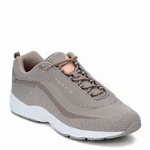
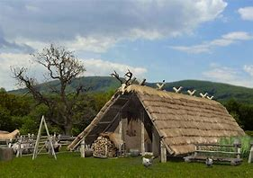
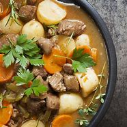
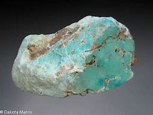

= Lesson 20
:toc: left
:toclevels: 3
:sectnums:
:stylesheet: ../../+ 000 eng选/美国高中历史教材 American History ： From Pre-Columbian to the New Millennium/myAdocCss.css

'''

== Section 1

Dialogue 1:  +

—Excuse me, but could you tell me the way to the cinema, please?  +
—No, I'm sorry I can't. I'm a stranger in these parts. But why don't you ask that man with a
beard? He'll be able to tell you, I'm sure.  +
—Which one do you mean?  +
—Look, the one over there, by the lamp-post.  +
—Ah, yes. I can see him now. Thank you very much.  +
—Not at all.

[.my1]
====
- beard （人的）胡须，络腮胡子，髯；（动物的）颔毛，须
- lamppost 灯杆; 路灯柱
- post : [ C ] ( often in compounds 常构成复合词 ) a piece of wood or metal that is set in the ground in a vertical position, especially to support sth or to mark a position 柱；杆；桩；标志杆 +
-> corner posts (= that mark the corners of a sports field) 运动场的角杆
====

---

Dialogue 2:  +

—You are not eating your breakfast.  +
—I don't feel very well.  +
—Oh, dear, what's the matter?  +
—I got a terrible headache.  +
—You must go back to bed. You look quite ill.  +
—I don't want to cause any bother. I'd rather work it off.  +
—Out of the question. You must go to bed and keep warm.

[.my1]
====
- work sth off : If you work off an unpleasant feeling, you get rid of it by doing something energetic. +
-> She works off stress by running for at least half an hour every day.

- Out of the question 不可能的, 毫无可能的, 谈不上的, 不值得讨论的 +
= 注意区别: 如果没有the, 而说成  Out of question , 指的是“毫无疑问” +
-> It is *out of the question* to arrive there on time. 准时到达那里是不可能的。
====

---

Dialogue 3:  +

—I'm sorry to bother you. Can you tell me where War and Peace is showing?  +
—Yes. At the Empire Cinema.  +
—Would you know when it starts?  +
—No. I can't tell you when it begins. But I know how you can find out. It's here in this
Entertainment's Guide.  +
—Can you show me which page is it on?  +
—Certainly. But I'm not sure whether you want to go early or late.

---

Dialogue 4:  +

—You are up early this morning.  +
—Yes. I've been out and bought a paper.  +
—Good. Then you'll be able to tell me what the weather's like.  +
—It's raining.  +
—Oh, dear, not again.  +
—Don't worry, it's not nearly as wet as it was yesterday.  +
—Thank goodness for that.

[.my1]
====
- not again. 在口语中的意思“不会吧” . 具体语境是, 不好的事情或者意想不到的事情再次发生时，老外就会说 Not again 不会吧。
- Thank goodness for that 谢天谢地
====

---

Dialogue 5:  +

—Good morning. Can I see Mr. Baker, please?  +
—Have you an appointment?  +
—Yes, at ten o'clock.  +
—What's your name, please.  +
—Jones, Andrew Jones.  +
—Ah, yes. Mr. Baker is expecting you. Will you come this way, please? Mr. Baker's office
is along the corridor.

[.my1]
====
- appointment (n.)~ (with sb)  约会；预约；约定
- corridor （建筑物内的）走廊，过道，通道
====

---

Dialogue 6:  +

—What does your friend do for a living?  +
—She is one of those persons who look after people in a hospital.  +
—Oh, I see. She is a nurse, you mean.  +
—Yes. That's the word I was looking for. My vocabulary is rather poor, I'm afraid.  +
—Never mind. You explained that very well.

[.my1]
====
- vocabulary 某人掌握或使用的）词汇，词汇量
====

---

Dialogue 7:  +

—What shall we do this weekend?  +
—Let's go for a swim.  +
—Where shall we go for it?  +
—Let's go to Long Beach. We haven't been there for a long time.  +
—That's a splendid idea. I'll call for you in a car at eleven o'clock. Is that alright for you?  +
—Yes. That'll be perfect. See you tomorrow, then. Goodbye.

[.my1]
====
-  call for  前往接某人
====

---

Dialogue 8:  +

—You have some black, walking shoes in the window. Would you show me a pair in size
seven, please?  +
—Oh, dear, what a pity! There are none left in size seven. Here is a pair in a slightly
different style.  +
—Can I try them on?  +
—Yes, of course.  +
—I like these very much. What do they cost?  +
—They cost 4.25 pounds.  +
—Good. I'll have them, then.

[.my1]
====
- walking shoe 休闲鞋；散步鞋，走路鞋 +

====

---

Dialogue 9:  +

—Excuse me, but I must say goodbye now.  +
—Can't you stay a little longer?  +
—No, I'm sorry, but I really must go. I shall miss my bus if I don't hurry.  +
—When does your bus go?  +
—At ten o'clock. Good gracious, it's already 10:15. I'll have to ask you to drive me home.  +
—That's alright, but I hope to see you again soon.  +
—That's most kind of you.

[.my1]
====
-  Good gracious : Some people say *good gracious* or *goodness gracious* in order to express surprise or annoyance. 天啊
====

---

== Section 2

==== A. Preferences.

Woman: Which do you prefer: driving a car yourself or being a passenger?
Man: Well —that depends. I enjoy driving, especially on long empty roads where I can go
nice and fast. But I'm not very fond of sitting in traffic jams waiting for lights to change, and
things like that. I suppose I don't mind being a passenger, but only if I'm sure that the other
person really can drive properly.
Woman: So you don't really like being in other people's cars, then?
Man: Well, as I say, it's all right with a good driver. Then I can relax, sit back and enjoy the
scenery. But yes, you're right —on the whole I certainly *prefer* driving *to* being a
passenger.

[.my1]
====
- traffic jam 交通堵塞
- scenery 风景; 景色
====

---

==== B. Telephone Call.

M: Hello, Allen. This is Collin speaking. How are you？ And how's Bob feeling after his holiday？ +
W: Fine. How about you？ +
M: Good. I've got quite a lot to tell you. I've just got engaged! It's good news for your guys, right？ But we haven't fixed the date yet. +
W: What's she like？ +
M: Lovely girl! We met on a bus, believe it or not. +
W: On the bus？ +
M: Yes. We just happened to be sitting together and got into the conversation. And we made a date for the same evening, and discovered we've got a lot in common, you know, same interests and, we laugh at the same things. +

[.my1]
====
- engaged (a.) ~ (to sb) 已订婚 +
/(电话线 ) being used 被占用的；使用中的 +
/~ (in/on sth) ( formal ) busy doing sth 忙于；从事于 +
-> I can't come to dinner on Tuesday —I'm otherwise engaged(a.) (= I have already arranged to do something else) . 我星期二不能来参加宴会—我另有安排。

- believe it or not 信不信由你
====

W: I know her？ +
M: No. You don't know her. Hmm. At least she doesn't know you or Bob. +
W: When did you meet？ +
M: Oh, about three weeks ago. +
W: It's soon. +
M: Well, yes. It was quite a sudden decision, but I feel really happy. In fact, I'd like you both to meet her. Ok, now, how about a meal together one evening soon？ I will be free later. +
W: Ok. +
M: Would you ask Bob to ring me？ Or, ask me to ring Bob？ And tell me where shall we meet and tell me where shall we eat. I always feel hungry these days. Oh, I must go now. My boss has just come into the office. In case of my security, I think I must be off now. Talk to you later, ok？ Bye. +
W: Oh, thanks. Bye.

[.my1]
====
-  in case of 如果发生……；若在……情况下；防备; 万一; +
-> In case of my absence some one else will take my place. 万一我缺席，会有人代理的。
- security 安全；平安
====

---

==== C. Old Arthur.

Everyone knows him as Old Arthur. He lives in a little hut in the middle of a small
wood, about a mile from the village. He visits the village store twice a week to buy food
and paraffin, and occasionally he collects letters and his pension from the post office. A few weeks ago, a reporter from the local newspaper interviewed him. This is what he said:

[.my1]
====
- Arthur 亚瑟王; 传说中 6世纪带领凯尔特人抵抗撒克逊人的英国国王，历史上或有其人。卡米洛的圆桌骑士的首领。
- hut  (木头、泥、草或石头搭成的) 小屋（或棚、舍） => 词源同hide,house +

- wood  ( also woods [ pl. ] ) 树林；林地 +
-> a large wood 一大片树林
- par·af·fin   煤油
- pension 养老金；退休金；抚恤金
====

I get up every morning with the birds. There is a stream near my hut and I fetch water
from there. It's good, clear, fresh water, better than you get in the city. Occasionally, in the
winter, I have to break the ice. I cook simple food on my old paraffin stove, mostly stews(n.)
and things like that. Sometimes I go to the pub and have a drink, but I don't see many
people. I don't feel lonely. I know this wood very well, you see. I know all the little birds and
animals that live here and they know me. I don't have much money, but I don't need much.
I think I'm a lucky man.

[.my1]
====
- fetch (v.) to go to where sb/sth is and bring them/it back （去）拿来；（去）请来
- stew (n.)[ UC ] a dish of meat and vegetables cooked slowly in liquid in a container that has a lid 炖的菜，煨的菜（有肉和蔬菜） +

- pub 酒吧；酒馆
====

---

==== D. The Man Who Missed the Plane.

James wrote a play for television, about an immigrant(n.) family who came to England
from Pakistan, and the problems they had settling down in England. The play was
surprisingly successful, and it was bought by an American TV company.

[.my1]
====
- immigrant (n.)（外来）移民；外侨
====

James was invited to go to New York to help with the production. He lived in Dulwich,
which is an hour's journey away from Heathrow. The flight was due to leave at 8:30 am, so
he had to be at the airport about 7:30 in the morning. He ordered a mini-cab for 6:30, set
his alarm for 5:45, and went to sleep. Unfortunately he forgot to wind the clock, and it stopped shortly after midnight. Also the driver of the mini-cab had to work very late that night and overslept(v.).

[.my1]
====
- production  生产；制造；制作 /（电影、戏剧或广播节目的）上映，上演，播出，制作 +
-> a new production of ‘King Lear' 新制作的《李尔王》
- mini-cab  迷你出租车
- wind (v.)给（钟表等）上发条；通过转动把手等操作；可上发条；可通过转动把手（等）操作
- shortly 不多时；不久 /立刻；马上
- also : in addition; too 而且；此外；也；同样 +
-> I didn't like it that much. Also, it was much too expensive. 我并不怎么喜欢它。再说它太贵了。
- oversleep (v.)睡过头；睡得太久
====

James woke with that awful feeling that something was wrong. He looked at his alarm
clock. It stood there silently, with the hands pointing to ten past twelve. He turned on the
radio and discovered that it was, in fact, ten to nine. He swore(v.) quietly and switched on the electric kettle.

[.my1]
====
- swear (v.)~ (at sb/sth) 咒骂；诅咒；说脏话 / ~ (on sth)  （尤指在法庭上）发誓，郑重承诺
- kettle （烧水用的）壶，水壶
====

He was just pouring the boiling water into the teapot when the nine o'clock pips(n.)
sounded on the radio. The announcer began to read the news: "... reports(n.) are coming in of a crash near Heathrow Airport. A Boeing 707 *bound(a.) for* New York crashed shortly after taking off this morning. Flight number 2234 ..." James turned pale(a.). +
"My flight," he said out loud. "If I hadn't overslept, I'd have been on that plane."

[.my1]
====
- the pips [ pl. ] ( old-fashioned ) ( BrE ) a series of short high sounds, especially those used when giving the exact time on the radio 嘟嘟声；（尤指电台的）报时信号
- announcer  （广播、电视的）广播员，播音员，节目主持人
- report (n.)~ (on/of sth) 报道 / 汇报；报告；记述

- bound (a.)~ (for...) ( also in compounds 亦构成复合词 ) 正旅行去（某地）；准备前往（某地） +
-> homeward bound (= going home) 在回家途中 +
-> a plane bound(a.) for Dublin 开往都柏林的飞机 +
-> Paris-bound 前往巴黎的 +
-> northbound/southbound/eastbound/westbound 向北╱向南╱向东╱向西行进的 +

- turn pale 变得苍白（脸色）; 因惊恐而面色变白
- pale (a.)( of a person, their face, etc. 人、面孔等 ) having skin that is almost white; having skin that is whiter than usual because of illness, a strong emotion, etc. 灰白的；苍白的；白皙的 +
-> to go/turn pale 变得苍白
====

---

==== E. Dangerous Illusions.

Interviewer: Do you mind if I ask you why you've never got married?  +
Dennis: Uh ... well, that isn't easy to answer.  +
Interviewer: Is it that you've never met the right woman? Is that it?  +
Dennis: I don't know. Several times I have met a woman who seemed right, as you say.  +
But for some reason it's never worked out.  +
Interviewer: No? Why not?  +
Dennis: Hmm. I'm not really sure.  +

[.my1]
====
- worked out  进展顺利 +
-> Things just didn't work out as planned.
 事情没有像计划的那样进展顺利。 +
VERB If a process *works* itself *out*, it reaches a conclusion or satisfactory end. 有满意的结果
====

Interviewer: Well, could you perhaps describe what happened with one of these women?  +
Dennis: Uh ... yes, there was Cynthia, for example.  +
Interviewer: And what kind of woman was she?  +
Dennis: Intelligent. Beautiful. She came from the right social background, as well. I felt I  really loved her. But then something happened.  +
Interviewer: What?  +
Dennis: I found out that she was still seeing an old boyfriend of hers.  +

[.my1]
====
- see [ VN ] ( often used in the progressive tenses *常用于进行时* ) to spend time with sb 与（某人）待在一起；交往 +
-> Are you seeing anyone (= having a romantic relationship with anyone) ? 你是不是跟什么人好上了？ +
-> They've been seeing a lot of each other (= spending a lot of time together) recently. 他们近来老泡在一起。
====

Interviewer: Was that so bad? I mean, why did you ... why did you feel that ...  +
Dennis: She had told me that her relationship was all over, which ... uh ... which was a lie.  +
Interviewer: Are you saying that it was because she had lied to you that you decided to  break off the relationship?  +
Dennis: Yes, yes, exactly ... Obviously, when I found out that she had lied to me, I simply
couldn't ... uh ... well, I simply couldn't trust her any more. And *of course* that meant that  we couldn't possibly get married.  +

Interviewer: Uh, huh. I see. At least, I think I do. But ... you said there were several women  who seemed 'right.'  +
Dennis: Yes.  +
Interviewer: Well, ... what happened the other times?  +
Dennis: Well, once I met someone who I think I loved very deeply but ... unfortunately she
didn't share my religious views.  +

[.my1]
====
-  she  didn't share my religious views. 她并不和我有相同的宗教观点
====

Interviewer: Your religious views?  +
Dennis: Yes, I expect the woman I finally marry to agree with me on *such* ... such basic things *as* that.  +
Interviewer: I see.  +
Dennis: Does that sound old-fashioned?  +
Interviewer: Uh ... no. Not necessarily. What was her name, by the way?  +
Dennis: Sarah.  +

[.my1]
====
- such as 例如; 像; 象…这样; 诸如…之类;
- Not necessarily 不见得, 未必, 不一定, 并不一定
====

Interviewer: Do you think you'll ever meet someone who meets ... uh ... how shall I say it ...  who meets all your ... requirements?  +
Dennis: I don't know. How can I? But I do feel it's important not to ... not to just drift into ...  a relationship, simply because I might be lonely.  +
Interviewer: Are you lonely?  +
Dennis: Sometimes. Aren't we all? But I know that I can live alone, if necessary. And I
think I would far *prefer* to do that ... to live alone ... *rather than* to marry somebody who  isn't really ... uh ... well, really what I'm looking for ... what I really want.

[.my1]
====
- meet (v.)满足；使满意 +
-> Until these conditions are met(v.) we cannot proceed with the sale. 除非这些条件得到满足，否则我们不能进行这项交易。
- requirement  所需的（或所要的）东西 / 必要条件；必备的条件 +
-> to meet/fulfil/satisfy the requirements 符合╱满足必备的条件

- drift (v.)~ in/into sth : to go from one situation or state to another without realizing it 无意间进入；不知不觉陷入 +
-> The injured man tried to speak but soon drifted into unconsciousness. 受伤的男人想说点什么，但一会儿就不省人事了。
- drift (v.) 漂流；漂移；飘
====

---

== Section 3

==== Dictation

Every color has a meaning. And as you choose a color, you might like to remember
that it's saying something. We've said that red is lovable. Green, on the other hand, stands
for hope; it is tranquil. Pink is romantic, while brown is serious. White is an easy
one —white is pure. Orange is generous. Violet is mysterious, turquoise is strong and blue
is definitely feminine.

[.my1]
====
- lovable : ( love·able ) having qualities that people find attractive and easy to love, often despite any faults 可爱的；惹人爱的；讨人喜欢的 +
-> a lovable rogue 可爱的淘气鬼
- generous 慷慨的；大方的；慷慨给予的 /丰富的；充足的；大的
- tur·quoise   /ˈtɜːrkwɔɪz/ a blue or greenish-blue semi-precious stone 绿松石 / 绿松石色；青绿色 +
=> 来自古法语 pierre turqueise,来自土耳其的石头，来自 pierre,石头，词源同 petrol,turqueise,土 耳其的，词源同 Turkish. +

- feminine (a.)（指气质或外貌）女性特有的，女性的，妇女的 / 阴性的 +
-> That dress makes you look very feminine(a.). 那件衣服你穿起来很有丽人风韵。
====

---

