= Lesson 21
:toc:

---

== Section 1

Dialogue 1:  +

—Can I see Zulu on Sunday?  +
—I'm not sure.

---

Dialogue 2:  +

—Do you like football?  +
—Yes, very much.  +
—Would you like to go to a match on the 18th of December?

---

Dialogue 3:  +

—I'd like to see Coming Home at the Royal Theatre.  +
—What a good idea! Do you know what time it starts?  +
—I think it starts at 8 pm.

====
- Coming Home 回家, 返乡
====

---

Dialogue 4:  +

—Tomorrow is the Third of December. It's my birthday and I'm going to the George and
Dragon. Would you like to come?  +
—To celebrate your birthday? Of course I would. What group's playing?  +
—The Riverside Stompers, I think.

====
- the+序数词+ of +月 : 是日期的表示法 +
-> the third of March 三月三日 +
->  the 25th of December 12月25日
- group （尤指流行音乐的）演奏组，乐团，乐队
- river·side 河畔；河岸
- stomper : N a rock or jazz song with a particularly strong and danceable beat 顿足爵士舞乐曲
====

---

Dialogue 5:  +

—I like organ music. Do you know where I can hear a recital?  +
—Try St. Mary's Church. I know they have a beautiful organ.

====
- organ 风琴 /（人体或动植物的）器官 +
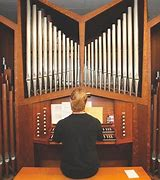

- recital : (n.) a public performance of music or poetry, usually given by one person or a small group 音乐演奏会；诗歌朗诵会 /（口述）逐一列举；赘述 => 来自 recite,背诵，朗诵。 +
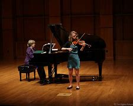
====

---

Dialogue 6:  +

—I'd like to go to a recital on the 16th of December, but I'm working from ten to four. Do
you know what time the recital begins?  +
—Sorry, I'm afraid I don't. Why don't you look at your "What's on"?

====
- What's on 在展览什么
====

---

== Section 2

==== A. Intentions.

1st Student: Well, first of all, I'm intending to have a good holiday abroad, just traveling
round Europe, and then when I get *tired(a.) of* traveling I'm going to —well, come back and
start looking for a job. I haven't quite decided yet what job, but I'm probably going to try
and get a job in advertising of some kind.

====
- in·ten·tion ~ (of doing sth)~ (to do sth)~ (that...) what you intend or plan to do; your aim 打算；计划；意图；目的
- tired (a.)~ of sb/sth |~ of doing sth 厌倦；厌烦
====

2nd Student: Well, eventually I'm planning to open my own restaurant. Only I haven't got
enough money to do that at the moment, of course, so I've decided to get a temporary job
for a year *or so*, and I'm going to work really hard and try and save *as much* money *as possible*. Actually, I'm thinking of working as a waiter, or some job in a restaurant anyway ...

---

==== B. Annual Presentation:

Male Voice: Good evening, ladies and gentlemen. Welcome to the Victoria Hall for our
annual presentation of the Nurse of the Year Award. First I'd like to introduce Dame Alice
Thornton. Dame Alice is now retired after more than forty years of dedicated(a.) service to the
public and the nursing profession. Dame Alice Thornton.

====
- pre·sen·ta·tion :
1.展示会；介绍会；发布会::
2.the act of showing sth or of giving sth to sb 提交；授予；颁发；出示::
-> Members will be admitted *on presentation of* a membership card. 会员出示会员证便可入场。 +
3.a ceremony or formal occasion during which a gift or prize is given 颁奖仪式；赠送仪式::
 +

- hall  礼堂；大厅 /门厅；正门过道 / a building or large room for public meetings, meals, concerts, etc.  +
-> a concert/banqueting/sports/exhibition, etc. hall 音乐厅、宴会厅、体育馆、展厅等 +

====

Male Voice: Dame Alice, you were the first nurse of the year. That was thirty years ago. Would you now announce this year’s winner?  +
Dame Alice: Good evening. It gives me great pleasure to introduce our nurse of the year, Miss Helen Taylor.  +
Dame Alice: Miss Taylor, you have been awarded this prize as a result of recommendations from your senior officers, your colleagues and the parents of the children you nurse. Here are some of the recommendations: 'efficient but patient(a.)', 'helpful and happy', 'strict but caring(a.)', 'human(a.) and interested'. These are the greatest recommendations any nurse could receive. I congratulate you!

====
- recommendation (n.)~ (to sb) (for/on/about sth) an official suggestion about the best thing to do 正式建议；提议 /推荐；介绍 +
-> to accept/reject a recommendation 接受╱拒绝一项建议 +
-> We chose the hotel *on their recommendation* (= because they recommended it) . 我们根据他们的推荐选了这家酒店。

- nurse (v.) 看护，照料（病人或伤者）
- but : however; despite this 然而；尽管如此 +
-> By the end of the day we were tired but happy. 一天结束时，我们很累，但很高兴。
- patient (n.)(a.)~ (with sb/sth) 有耐心的；能忍耐的
- caring (a.) 乐于助人的；关心他人的；体贴人的 +
-> He's a very caring person. 他是个非常体贴人的人。
- human (a.)有人情味的；通人情的
====

---

==== C. Discussions.

Discussion 1:  +

Jerry: Could I speak to you for a few minutes, Mr. Sherwin?  +
Sherwin: I'm very busy at the moment. Can't it wait until tomorrow?  +
Jerry: Uh, ... well, it's rather urgent. And it won't take long.  +
Sherwin: Oh, all right, then. What is it?  +
Jerry: It's a personal matter. Uh, you see, my wife is ill and has to go into hospital.  +
Sherwin: Sorry to hear that. But why do you want to talk to me about it?  +
Jerry: Because ... because we have a baby and there's nobody to look after her while
she's in hospital.  +
Sherwin: Who? Your wife?  +
Jerry: No, no. My daughter.  +

Sherwin: Oh, I see. But I still don't understand what all this has to do with me.  +
Jerry: But that's what I'm trying to explain. I'd like to stay at home for a few days.  +
Sherwin: But why?  +
Jerry: To look after my daughter, of course.  +
Sherwin: I thought you said she was going to hospital. They'll look after her there, won't
they?  +
Jerry: No, no, no! It's my wife who's going to hospital! Not my daughter.  +
Sherwin: Really? I thought you said it was your daughter. You are not explaining this very well.

====
- I'd like to : 是“I would like to ...”的缩写. 是一种客气的表达自己想法的说法。 我想…
- have to do with 与…有关; 和…有关系 +
-> Don't *have* too much *to do with* him. 别跟他扯上太多关系。 +
- In the following example, there is really very little difference in meaning: +
-> I'*m going to the cinema* tonight. +
-> I'*m going to go to the cinema* tonight.
====

---

Discussion 2:

Here is an alternative dialogue between Jerry and Mr. Sherwin. Listen.  +
Jerry: Uh ... excuse me, Mr. Sherwin, but I was wondering if I could speak to you for a few minutes.  +
Sherwin: Well, I'm rather busy at the moment, Jerry. Is it urgent?  +
Jerry: Uh, yes, I ... I'm afraid it is. It's a personal matter.  +
Sherwin: Oh, well, then, we'd better discuss it now. Sit down.  +
Jerry: Thank you. Uh ... you see, it's about my wife. She ... uh ... well ... she ...  +
Sherwin: Yes, go on, Jerry. I'm listening.  +

Jerry: She's ill and has to go to hospital tomorrow. But we have a young baby, you know.  +
Sherwin: Yes, I know that, Jerry. You must be rather worried. Is it anything serious? Your
wife's illness, I mean?  +
Jerry: The doctors say it's just a minor operation. But it has to be done as soon as possible.
And ... well ... the problem is my daughter. The baby. That's the problem.  +

Sherwin: In what way, Jerry? I'm not quite sure if I understand.  +
Jerry: Well, as I said, my wife'll be in hospital for several days, so there's nobody to look after her.  +
Sherwin: You mean, nobody to look after your daughter, is that it?  +
Jerry: Yes, exactly. Both our parents live rather far away, and ...and that's why I'd like to have a few days off. From tomorrow.  +

====
- In what way
- off (adv.) away from a place; at a distance in space or time 离开（某处）；（在时间或空间上）距，离 +
-> I must be off soon (= leave) . 我必须很快离开这里。
-> Off you go! 你走吧！ +
-> Summer's not far off now. 夏天已近在眼前了。 +
-> A solution is still some way off. 解决办法尚需时日。 +
-> Sarah's off in India somewhere. 萨拉远在印度某地。
====

Sherwin: I see. I think I understand now. You need a few days off to look after your
daughter while your wife is in hospital.  +
Jerry: Yes, yes. That's it. I'm not explaining this very well.  +
Sherwin: No, no. On the contrary. I just want to be sure I understand completely. That's
all.  +

Jerry: Will ... will that be all right?  +
Sherwin: Yes, I'm sure it will, Jerry. All I want to do now is make sure that there's someone to *cover for* you while you're away. Uh ... how long did you say you'll need?  +
Jerry: Just a few days. She ... my wife, I mean ... should be out of hospital by next
Thursday, so I can be back on Friday.  +
Sherwin: Well, perhaps you'd better stay at home on Friday, as well. Just to give your wife a few extra days to rest after the operation.  +
Jerry: That's very kind of you, Mr. Sherwin.  +
Sherwin: Don't mention it.

====
- On the contrary 正相反, 反而
- cover (v.)~ for sb : 代替，顶替，替补（某人工作或履行职责）
- don't ˈmention it （别人道谢时回答）不客气
- mention (v.)~ sth/sb (to sb) 提到；写到；说到
====

---

==== D. Telephone Conversation.

Landlady: 447 4716.  +
Student: Hello. Is that Mrs. Davies?  +
Landlady: Speaking.  +
Student: Good afternoon. My name's Stephen Brent. I was given your address by the
student accommodation agency. I understand you have a room to let.  +

====
- land·lady  女房东；女地主 / （酒吧或招待所的）女店主，女老板
- accommodation : a place to live, work or stay in  住处；办公处；停留处 /accommodations 住宿；膳宿 +
-> *Hotel accommodation* is included in the price of your holiday. 你度假的价款包括**旅馆住宿**在内。 +
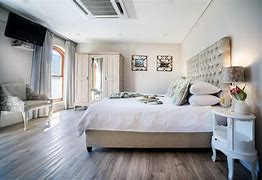

- let (v.) ~ sth (out) (to sb) 出租（房屋、房间等） +
-> I let the spare room. 我把那间空房出租了。
====

Landlady: Yes, that's right. I've just got one room still vacant. It's an attic(n.) room, on the
second floor. It's rather small, but I'm sure you'll find it's very comfortable.  +
Student: I see. And how much do you charge for it?  +
Landlady: The rent's twenty-five pounds a week. That includes electricity, but not gas.  +
Student: Has the room got central heating?  +
Landlady: No, it's got a gas fire which keeps the room very warm.  +

====
- attic : a room or space just below the roof of a house, often used for storing things （紧靠屋顶的）阁楼，顶楼 +
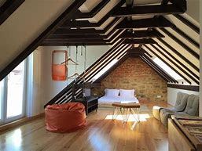
-  central heating : a system for heating a building from one source which then sends the hot water or hot air around the building through pipes 集中供热；中央供暖（系统） +
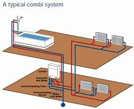
- gas fire : A gas fire is a fire that produces heat by burning gas. 燃气炉 +
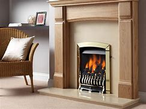
====

Student: I see ... And what about furniture? It is furnished(a.), isn't it?  +
Landlady: Oh yes ... Er ... There's a divan(n.) bed in the corner with a new mattress on it. Er ...
Let me see ... There's a small wardrobe, an armchair, a coffee table, a bookshelf ...  +
Student: Is there a desk?  +
Landlady: Yes, there's one under the window. It's got plenty of drawers and there's a lamp
on it.  +

====
- furnished (a.) (房屋、房间出租时)配有家具的
- divan : ( also *divan bed* ) ( both BrE ) a bed with a thick base and a mattress 厚垫睡榻 / a long low soft seat without a back or arms （无靠背和扶手的）矮长沙发 +

- mattress 床垫
- wardrobe 衣柜；衣橱；（英国）放置衣物的壁橱
- armchair : a comfortable chair with sides on which you can rest your arms 扶手椅 +
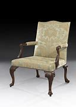 +
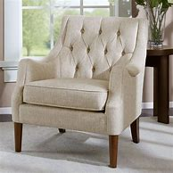 +

- drawer 抽屉
====

Student: Oh good ... Is there a washbasin in the room?  +
Landlady: No, I'm afraid there isn't a washbasin. But there's a bathroom just across the corridor, and that's got a washbasin and a shower as well as a bath. You share the
bathroom with the people in the other rooms. The toilet is separate, but unfortunately it's
on the floor below.  +

====
- washbasin （浴室内固定在墙上有水龙头的）洗脸盆
- bathroom : a room in which there is a bath/ bathtub , a washbasin and often a toilet 浴室；盥洗室 / 洗手间；卫生间 +

- across from : opposite 在对面；在对过 +
-> There's a school just across from our house. 有一所学校就在我们房子对面。
- corridor  （建筑物内的）走廊，过道，通道
====

Student: Oh, that's all right. ... What about cooking? Can I cook my own meals?  +
Landlady: Well, there's a little kitchenette(n.) next to your room. It hasn't got a proper cooker in it, but there's a *gas ring* and an electric kettle by the sink. I find my students prefer to eat at the university.  +

====
- kit·chen·ette  : a small room or part of a room used as a kitchen, for example in a flat/apartment 小厨房；套房里用作厨房的一角 +

- proper 真正的；像样的；名副其实的 / 符合习俗（或体统）的；正当的；规矩的 / 严格意义上的；狭义的 +
-> When are you going to get a proper job? 你想什么时候去找一份正经的工作呀？

- cooker : ( BrE ) ( NAmE range ) ( NAmE BrE stove ) a large piece of equipment for cooking food, containing an oven and gas or electric rings on top （带烤箱、燃气炉或电炉的）厨灶，炉具 +
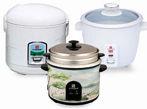

- gas ring : ( especially BrE ) a round piece of metal with holes in it on the top of a gas cooker/stove, where the gas is lit to produce the flame for cooking 煤气灶火圈 +
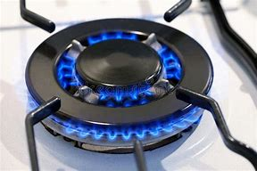

- kettle （烧水用的）壶，水壶
- sink （厨房里的）洗涤池，洗碗槽
====

Student: I see. And is the room fairly quiet?  +
Landlady: Oh yes. It's at the back of the house. It looks onto the garden and it faces south,
so it's bright and sunny, too. It's very attractive, really. And it's just under the roof, so it's
got a low, sloping ceiling. Would you like to come and see it? I'll be in for the rest of the day.  +

====
- quiet (a.)轻声的；轻柔的；安静的
- sloping 倾斜的；有坡度的；成斜坡的
- ceiling the top inside surface of a room 天花板；顶棚
====

Student: Yes, I'm very interested. It sounds like the kind of room I'm looking for. Can you
tell me how to get there?  +
Landlady: Oh, it's very easy. The house is only five minutes' walk from Finchley Road tube station. Turn right outside the station, and then it's the third street on the left. You can't miss it. It's got the number on the gate. It's exactly opposite the cemetery.

====
- the tube [ sing. ] ( BrE )伦敦地下铁道
- cemetery  （尤指不靠近教堂的）墓地，坟地，公墓 +
=> 先说home（家），这个词的根义是“躺”，最初“家”是指人们躺下睡觉的地方。把home进行h/c辅音音变，就成了词根cem“躺”，et是语法变化产生的词尾，后缀-ery表地点。墓地就是“躺”着的地方。
====

---

==== E. Monologue.

Frankly, I've been delighted(a.). As you know, I decided to give it up ten years ago. I put
them all in the attic —all fifty or sixty of them —to gather(v.) dust, and forgot about them.

Then I just happened to meet him one day in a bar, entirely(adv.) by chance, and we *got talking about* this and that, and, well —to cut a long story short —he went to have a look at them, and this
is the result. It's for two weeks. And it's devoted entirely to my work. Doing very well, too, as you can see from the little tickets on about half of them.

====
- frankly 坦率地；直率地 /（表示直言）老实说
- delighted (a.)~ (to do sth) |~ (that...) |~ (by/at/with sth) : 高兴的；愉快的；快乐的
- attic （紧靠屋顶的）阁楼，顶楼
- entirely : (adv.)in every way possible; completely 全部地；完整地；完全地 +
->  I entirely agree with you. 我完全同意你的看法。 +
-> That's an entirely different matter. 那完全是另一码事。

- get doing something : to begin doing something
-> We *got talking about* the old days. +
-> I think we should *get going* quite soon. +
-> What are we all waiting for? *Let’s get moving*!

- to cut a long story short 长话短说
====

You know, *now that* they're hanging on the wall like this, with all the clever lighting, and glossy(a.) catalogue, and the smart people, they really don't seem anything to do with me. It's a bit like seeing old friends in new circumstances where they fit and you don't.

====
- clever (a.)showing intelligence or skill, for example in the design of an object, in an idea or sb's actions 精巧的；精明的 +
-> a clever little gadget 精巧的小器具 +
-> What a clever idea! 多么精明的主意！

- glossy : smooth and shiny 光滑的；光彩夺目的；有光泽的 / giving an appearance of being important and expensive 浮华的；虚有其表的；虚饰的
- catalogue 目录；目录簿 +
-> glossy hair 光亮的头发 +
-> a glossy brochure/magazine (= printed on shiny paper) 用亮光纸印刷的小册子╱杂志 +
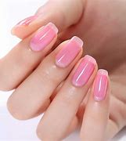

- fit in (with sb/sth) : to live, work, etc. in an easy and natural way with sb/sth （与…）合得来；适应 +
-> He's never done this type of work before; I'm not sure how he'll fit in with the other people. 他过去从未干过这种工作，很难说他是否会与其他人配合得好。
====

Now, you see her? She's already bought three. Heard her saying one day she's 'dying to meet the man'. Afraid she'd be very disappointed if she did. Interesting, though, some of the things you overhear. +
Some know something about it. Others know nothing and admit it. Others know nothing
and don't. By the way, I heard someone say the other day that the 'Portrait of a Woman'
reminded her of you, you know. So you see, you're not only very famous, but —as I keep
on telling you —you haven't changed a bit.

====
- be dying to 渴望，切望，Be dying to do sth/for sth： 非常想得到或想做某事
- she'd be very disappointed : *'d be =  would be*
- overhear  (v.) 偶然听到；无意中听到
- the other day 前几天, 在不久前某天
- por·trait 肖像；半身画像；半身照
- remind (v.)~ sb (about/of sth) : 提醒；使想起 +
REMIND SB OF SB/STH 使想起（类似的人、地方、事物等） +
-> You remind me of your father when you say that. 你说这样的话，使我想起了你的父亲。
====

---

== Section 3

==== Dictation.

Ours is a very expensive perfume. When people see it or hear the name we want them to think of luxury. There are many ways to do this. You show a woman in a fur coat, in a silk evening dress, maybe covered in diamonds. You can show an expensive car, an expensive restaurant, or a man in a tuxedo.  +
We decided to do something different. We show a beautiful woman, simply but elegantly dressed, beside a series of paintings(n.) by Leonardo da Vinci, and it works. Because she is wearing the perfume, and because she is next to expensive and beautiful paintings, our perfume must be beautiful and expensive too. It does work.

====
- fur coat 皮毛大衣 / fur （动物浓厚的）软毛;毛皮 / coat 外套；外衣；大衣 +

- silk 丝织物；丝绸
- tuxedo :  /tʌkˈsiːdoʊ/  A tuxedo is a suit, usually black, that is worn by men for formal social events. 男式礼服 /男式无尾礼服上装 +

- wear perfume 喷香水

- 我们决定做些不同的事情。我们在列奥纳多·达·芬奇(Leonardo da Vinci)的一系列画作旁展示了一位穿着简单而优雅的美丽女子，效果不错。因为她身上喷着香水，因为她旁边是昂贵而美丽的画作，所以我们的香水也一定是美丽而昂贵的。这种做法是生效的。
====

---
