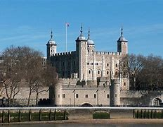
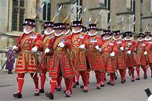
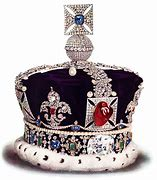
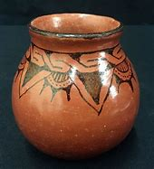
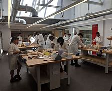

= Lesson 22
:toc:

---

== Section 1

Dialogue 1: +

—Is that the Manager? +
—Speaking. Can I be of any assistance? +
—Could you speed up your switchboard a bit, please? I booked a call to Brussels a good
twenty minutes ago and I haven't had a reply yet. +
—Well, perhaps they are rather busy at this time of the day. After all, we are an hour
ahead of Belgium. +
—I know that, but I could have dialed myself direct *in no time* at all. +

====
- assistance  (n.) ~ (with sth)~ (in doing sth/to do sth) ( formal ) help or support 帮助；援助；支持 +
-> Can I be of any assistance ? 我能帮上忙吗？ +
-> Despite his cries, no one came to his assistance . 尽管他喊叫，却没有人来帮助他。

- 接到电话，如果别人找的正是我，我要说：This is 我名字 speaking. 或直接简单粗暴说 Speaking。 类似中文意思: "我就是".

- switchboard : the central part of a telephone system used by a company, etc., where telephone calls are answered and put through (= connected) to the appropriate person or department; the people who work this equipment （电话的）交换机，交换台， 总机
- book (v.)（向旅馆、饭店、戏院等）预约，预订 / 给（某人）预订飞机等座位
- good （数量或程度）相当大的，相当多的 +
-> a good many people 相当多的人 +
-> The kitchen is a good size. 这厨房相当大。 +
-> We spent a good while (= quite a long time) looking for the house. 我们花了好长时间找这房子。
- dial (v.) 拨（电话号码）
- in no time 立即, 立刻, 马上, 很快
- in no time at all. 完全不费时间, 立刻
====

—We do like to route(v.) the calls through the operator and then there can be no
misunderstanding about the charges, I'm sure you understand. +
—No, I suppose it would be difficult to check the cost of directly-dialed calls, but
nevertheless I do强调 have to *put through* an important call to Brussels. +
—I'll *get on to* them myself and see what the delay is, then call you back as soon as I
know anything.

====
- route (v.) to send sb/sth by a particular route 按某路线发送 / (n.)~ (from A to B) : a way that you follow to get from one place to another 路线；路途 +
-> Satellites route(v.) data all over the globe. 卫星向全球各地传递信息。
- operator 操作人员；技工 / 电话员；接线员 / (常构成复合词)（某企业的）经营者，专业公司 +
-> a tour operator 经营旅游业者

- misunderstanding (n.) ~ (of/about sth)~ (between A and B) 误解；误会 / a slight disagreement or argument  意见不一；不和；争执 +
-> We had a little misunderstanding over the bill. 我们对这个提案的看法有点分歧。
- charge （商品和服务所需的）要价，收费

- suppose (v.)（根据所知）认为，推断，料想 +
-> Prices will go up, I suppose . 我觉得物价将会上涨。

- put through :  When someone *puts through* someone who is making a telephone call, they make the connection that allows the telephone call to take place. 给…接通电话 +
-> The operator will put you through.  接线员将为你接通电话。

-  GET ON TO SB （用电话、书信或电子邮件）与某人联系 / 觉察，察觉，识破（某人的不法行为） +
-> The heating isn't working; I'll *get on to* the landlord about it. 暖气不热，我得与房东联系一下。  +
-> He had been stealing money from the company for years before they *got on to* him. 他一直窃取公司的钱，多年后他们才发觉。
====

---

Dialogue 2: +

—And what seems to be the trouble, sir? +
—They don't want to let me into the nightclub. +
—Well, I'm afraid there is an entrance charge, sir. +
—But damn it all —I am a resident. It's ridiculous. +
—I'm very sorry, sir, but you see it is something of a special evening. Our guest star this
evening is Sammy Davis Junior and I'm afraid that the tickets do cost 250 marks each. I
could see if there are any left if you would like one. We generally try to keep a few back for
the residents. +
—Good Lord. That's nearly thirty-five pounds. No, on second thoughts, I don't think I'll
bother. Could you have them send up a bottle of scotch to my room. I'll entertain myself
instead. +
—Very good, sir. That is room 634, isn't it?

====
- damn it all
- resident  居民；住户 /（旅馆的）住宿者，旅客，房客
- ridiculous (a.)very silly or unreasonable 愚蠢的；荒谬的；荒唐的
- guest star 客座明星, 客串明星

-我很抱歉，先生，但你知道这是一个特别的夜晚。我们今晚的客座嘉宾是小萨米·戴维斯, 恐怕每张票要250马克。如果您想要的话，我可以看看还有没有剩。我们通常会留一些给住户。

- Good Lord 我的老天爷啊, 上帝
- on second thoughts 经重新考虑, 经再三考虑之后
- scotch 苏格兰;苏格兰人; 格兰威士忌

- 你能让他们送一瓶苏格兰威士忌到我的房间吗？我要自娱自乐。
====

---

Dialogue 3: +

—Good evening, sir. I'm the Assistant Manager. +
—How nice! +
—Yes, I'm afraid we've had a complaint about the noise from your neighbor across the
corridor. He's trying to get some sleep as he has an early start tomorrow. I'm sure you
understand. +
—Oh, I see. +
—Do you think it might be possible to ask your friends to be a little quieter? We do like to
give our guests a chance of getting a good night's sleep. It is well after eleven. +

====
-  assistant Manager : An assistant manager works with the manager to organize, plan and implement strategy 协理; 助理经理

-  I have an early start tomorrow 我明天早上还要起早
- chance : ~ of doing sth |~ that... |~ of sth happening |~ of sth : a possibility of sth happening, especially sth that you want （尤指希望发生的事的）可能性 +
-> There is no chance that he will change his mind. 他不可能改变主意。 +
-> an outside chance (= a very small one) 非常小的可能性
====

—Oh, I'm so sorry. I do apologize. I suppose we were talking rather loudly. It's just that
we've signed a very important contract. We were having a bit of celebration. +
—I'm pleased(a.) to hear it. Shall I ask Room Service to bring you some coffee? +
—No, that won't be necessary. We were just about to *pack up* anyway. +
—Thank you, sir, and good night to you.

====
- contract :  ~ (with sb) |~ (between A and B) |~ (for sth/to do sth) : an official written agreement 合同；合约；契约
- pleased (a.)~ (with sb/sth) |~ that... : feeling happy about sth 高兴；满意；愉快 +
-> She was very pleased with her exam results. 她对考试成绩非常满意。
-  pack up | pack sth up :   to put your possessions into a bag, etc. before leaving a place 打行李；收拾行装
====

---

Dialogue 4: +

—Could I see the Manager, please? I have a complaint. +
—Can I help you, madam? +
—Yes. Did you have this room checked before we moved in? There's not a scrap of lavatory(n.)  paper and the toilet doesn't flush properly, the water doesn't run away in the
shower and I would like an extra pillow. What have you to say to that? +

====
- scrap  [ sing. ] ( usually with a negative 通常与否定式连用 ) a small amount of sth 丝毫；一丁点 / 碎片，小块（纸、织物等） +
-> It won't make a scrap of difference . 这不会有丝毫的差别。
- lavatory :( especially BrE ) a toilet, or a room with a toilet in it 抽水马桶；厕所；卫生间；洗手间；盥洗室 =>  -lav-洗 + -atory名词词尾
- shower 淋浴器；淋浴间
- pillow 枕头
====

—I'm extremely sorry to hear that. I'll *attend to* it right away. The housekeeper usually
checks every room before new guests move in. We have been extremely busy with a
large conference. +
—That's no way to run a hotel. One doesn't expect this sort of thing in a well-run hotel. +
—No, madam. I do apologize. It's most unusual. We do try to check the rooms as thoroughly as possible. Just the one pillow, was it? Is there anything else? +

====
- attend (v.)~ (to sb/sth) ( formal ) to pay attention to what sb is saying or to what you are doing 注意；专心
- ATTEND TO SB/STH : to deal with sb/sth; to take care of sb/sth 处理；对付；照料；关怀 +
-> Are you being attended to, Sir? (= for example, in a shop) 先生，有人接待你吗？

- housekeeper （旅馆的）房间清洁工 / a person, usually a woman, whose job is to manage the shopping, cooking, cleaning, etc. in a house or an institution  管家，杂务主管（通常为女性）

- That's no way to do ...  不能那样来做..., 那不是正确做...的方法 +
-> That's no way to speak to your mother! 不能那样跟你妈妈说话！ +
-> That's no way to live! 那根本不是生活！ +
-> That's no way to sell. To sell more - you have to see more people. 这是没法卖东西的，你必须见更多的人。

- well-run  经营有方, 经营良好
- thoroughly adv. 完全地，彻底地
====

—Well, your thermostatically-controlled air-conditioning doesn't seem to be working too
well. It's as hot as hell up there. +
—I'll just adjust the regulator for you and I think you'll find it a little cooler in a short time. I'll
also send someone along(ad.) right away to look at the toilet and shower.

====
- thermostatically adv. 恒温地；自动调节温度地
- up :  completely 完全；彻底地 +
-> We ate all the food up. 我们把食物吃光了。 +
-> The stream has dried up. 小溪已经干涸了。
- regulator （速度、温度、压力的）自动调节器 /（某行业等的）监管者，监管机构
- along (ad.)forward 向前 /with sb （与某人）一道，一起 +
-> I was just walking along singing to myself. 我独自唱着歌向前走着。  +
-> I'll be along (= I'll join you) in a few minutes. 过一会儿我就来。
====

---

== Section 2

==== A. Presenting Tour Packages.

Salesman: Good evening, all you holiday dreamers. It's holiday planning time again and
we're here with suggestions as usual. We know what you want ... something more
interesting, something less expensive.  +
So ... what about America? New York from 199
pounds. Or Canada? Or Hawaii? Ah ... Hawaii. And from only 372 pounds. Or the
beautiful Bahamas? From just 400 pounds. Nearer home we suggest Wales or Scotland. +
And if you would like an easy package holiday, you could visit Minorca from 103 pounds,
Ceylon from 343 pounds, Mombasa from 311 and sunny Florida from 243 pounds.  +
Is time
a problem? Is money a problem? Just send for our brochure and both problems will
disappear.

====
- tour : ~ (of/round/around sth) 旅行；旅游
- Tour Packages 旅游套餐
 package : ( also ˈpackage deal ) a set of items or ideas that must be bought or accepted together （必须整体接收的）一套东西，一套建议；一揽子交易 +
-> a benefits package 一套福利措施

- 纽约起价199英镑。
- Ceylon 锡兰（印度以南一岛国，现以更名为斯里兰卡 Srilanka）
- brochure 资料（或广告）手册
====

---

== B. Discussing a Holiday.

Peggy: Bob, can we really afford a holiday? We're paying for this house and the furniture
is on HP and ... +
Bob: Now listen, Peggy. You work hard and I work hard. We're not talking about whether
we can have a holiday. We're talking about where and when. +
Peggy: Shall we go to Sweden? +
Bob: Sweden's colder than Sheffield. I'd rather not go to Sweden. +
Peggy: What about Florida? Florida's warmer than Sheffield. +
Bob: Yes, but it's a long way. How long does it take to get from here to Florida? +
Peggy: All right. Let's go to Hawaii. +
Bob: You must be joking. How much would it cost for the two of us? +
Peggy: But the brochure says the problem of money will disappear. Bob, where do you
really want to go? +
Bob: I'm thinking of Wales or Scotland. Do you know why? +
Peggy: Yes. 'They're right on our doorstep and so close to home.'

====
- HP : hire purchase : 分期付款购买法 (HP)
- doorstep 门阶
====

---

== C. Obtaining Information.

Jill: Now, let me see. Blue Skies Travel Agency. Ah, yes, it's a London number. 01 748
9932. I think I'll ring now. +

====
- ring : (v.) ( BrE ) ( NAmE BrE also call ) ~ sb/sth (up)  给…打电话
====

(sound of dialing and ringing) +
Voice: Hello. +
Jill: Uh ... good morning. Is that 748 9932? +
Voice: No, it isn't. It's 738 9932. +
Jill: Sorry. I must have dialed the wrong number. +

(sound of dialing and ringing tone) +
Telephonist: Blue Skies Travel Agency. Can I help you? +
Jill: Could you give me some information about holidays in North America?
Telephonist: Just one moment. I'll put you through to our North American department. +

====
- telephonist = operator 电话接线员 : N a person who operates a telephone switchboard 话务员 (Also called (esp US) telephone operator)
====

Miss Jones: North American department. Miss Jones speaking. Can I help you? +
Jill: Yes, please. I'm planning my holiday and I'd like some information about holidays in
New York. +
Miss Jones: Certainly. What would you like to know? +
Jill: First, how much is the cheapest return flight to New York? And what will the weather
be like? +
Miss Jones: I see. When do you want to go? +
Jill: In May ... and I'd like to know about the inclusive holidays and good hotels and ... +
Miss Jones: (interrupts) Certainly. Just give me your name and address. I'll send you all
the information you want. +
Jill: My name is Jill Adams. Miss J. Adams. And my address is ...

====
- inclusive (a.)(ad.) 包括一切费用在内的 +
-> ...all prices are inclusive(a.) of delivery.
 …所有价格包括运费。
====

---

== D. A Bus Tour.

Traveller: Hello. I'd like some information about your trips to Kathmandu. +
Travel Agent: Yes, of course. What can I tell you? +
Traveller: Well, how, how do we travel? +
Travel Agent: It's a specially adapted(a.) bus with room for sleeping and ... +
Traveller: And, and, er, how many people in a group? +
Travel Agent: Well, the bus sleeps ten. Usually there are eight travellers and two drivers, a
guide to look after you. +

====
- Bus Tour 乘公共汽车旅行; 巴士观光
- trip （尤指短程往返的）旅行，旅游，出行 /journey  尤指长途旅行. +
=> trip较journey常用，用于较广的语境。 **trip通常为往返旅行，journey通常为单程旅行。** trip的行程常较journey短，尽管不一定如此.
- Kathmandu 尼泊尔的首都

- adapted : (a.)ADJ If something is adapted to a particular situation or purpose, it is especially suitable for it. 适合的 +
-> The camel's feet, well adapted for dry sand, are useless on mud.
 骆驼的脚十分适合干旱沙地，但在泥地上毫无用处。
====

Traveller: So, so we sleep, um, normally, in, in the bus? +
Travel Agent: Yes, and it's fully equipped for cooking and it's got a shower system that we
put up every evening, weather permitting. +
Traveller: Er, um ... We leave from, from London? +
Travel Agent: Yes, and return to London. +
Traveller: Is there anything special we'd have to bring? +
Travel Agent: Oh, we give everyone a list of suitable clothes, etc. to bring. Of course,
space is limited. +

====
- put up 建造；搭建；竖立 +
-> to put up a building/fence/memorial/tent 盖楼房；架篱笆；修纪念碑；搭帐篷
- Is there anything special we'd have to bring? 我们需要带什么特别的东西吗?
====

Traveller: Oh, oh yes, I understand that. Now, how, how long in advance would I have to
book? +
Travel Agent: Well, it depends. Usually six or eight months. It's amazing the number of
people who are interested. +
Traveller: Well, I'm interested in the ten-week trip next spring. +
Travel Agent: Um, that one leaves on the fourth of April. +

====
- It's amazing the number of people who are interested. 感兴趣的人多得惊人。
====

Traveller: Yeah. That's right, yeah. It'll be for two people. +
Travel Agent: That'd be fine. Could you come in and we can *go over* all the details. +
Traveller: Yes, I think that'd be best, um, but can you give me some idea of how much
that'll cost. +
Travel Agent: Spring for ten weeks ... Um, we haven't got the exact figures at the moment,
but, er, something like, er, 1,100 pounds per person. +
Traveller: OK. Um, I'll come and see you one day next week. +
Travel Agent: Yes. Thanks for ringing. +
Traveller: Thank you. Bye. +
Travel Agent: Bye bye.

====
-  go over : If you go over a document, incident, or problem, you examine, discuss, or think about it very carefully. 仔细检查 +
->  I won't know how successful it is until an accountant has gone over the books.
 我要等到会计仔细查看了账目后, 才会知道盈利状况如何。
====

---

== E. Tour of London.

Woman: So you have a half day, a full day and a day and evening tour of London? +
Man: That's correct. +
Woman: Well, as we're only here for a few days, I think perhaps we should take the full
day and evening tour. Give my children the opportunity to see everything. +
Man: Won't that be a bit tiring(a.) for them? +
Woman: Yes, you're right. It's probably better if we don't include them on the evening part of the program. +
Man: Not the theatre and the dinner entertainment? +
Woman: Yes, that's what I mean. The hotel will take care of them. +
Man: Yes, I'm sure that can be arranged. +

====
- tiring (a.)令人困倦的；使人疲劳的；累人的
- theatre  戏院；剧场；露天剧场
- dinner （中午或晚上吃的）正餐，主餐
- entertainment 招待；款待；娱乐 +
-> a budget for the entertainment of clients 用于招待客户的专项开支
====

Woman: Now, can you tell me what the cost will be? +
Man: For the full tour? Seventy pounds per head. +
Woman: So that would be 140 pounds for myself and my husband. What about the
children, is there any reduction for them? +
Man: Certainly, we have half price for children and if they're not going to the theatre or the
dinner, I think we could let them have the full day tour for thirty pounds each. +

====
- reduction 减价；折扣
====

Woman: That's fine. Could you tell me more details of the tour? I mean, what will we be
actually seeing *and so forth*? +
Man: Well, here's a brochure for you to read, but I can quickly *run through* the main items
of the tour with you. Now, as you see, you're picked up from your hotel at 8:30, so you
must be sure to order(v.) an early breakfast. +
Woman: Yes ... +

====
- *and so forth : and so on*; and other such things; et cetera 等等; 及诸如此类;
- run through : If you *run through* a list of items, you read or mention all the items quickly. 过一遍 / 排练 +
-> I *ran through* the options with him.
 我和他过了一遍那些选项。
- order (v.) ~ (sb sth) |~ (sth) (for sb)  订购；订货；要求提供服务 / 点（酒菜等） /组织；安排；整理
====

Man: Then you're taken to see the Changing of the Guard and you'll see Buckingham
Palace at the same time of course.  +
After that you'll be taken down Whitehall to see the
House of Parliament, Big Ben, you know the famous clock, and nearby Westminster
Abbey.  +
Now from there we have a river trip down the Thames towards the Tower of London. During the river trip you'll be provided with sandwiches and coffee, orange juice
for the kiddies. When you get to the Tower, you'll see the Beefeaters, the traditional
guards of the Tower and then you'll be shown the Crown jewels. +

====
-  Changing(change ) of the Guard  卫兵交接
- Buckingham Palace 白金汉宫（在伦敦的英国王室官邸）
- Whitehall 伦敦的一条街，政府机关所在地 / 白厅（指英国政府）
- House of Parliament 国会大厦, 议会大厦

- Westminster Abbey  威斯敏斯特教堂 +

- Abbey : a large church together with a group of buildings in which monks or nuns live or lived in the past （大）隐修院；（曾为大隐修院的）大教堂

- Tower of London 伦敦塔（位于英国伦敦泰晤士北岸的古堡，古代曾先后作为皇宫及监狱，现为兵械库和博物馆） +

- kiddie： n. 小孩（等于kiddy）
- beef·eater : a guard who dresses in a traditional uniform at the Tower of London 伦敦塔卫兵（穿传统制服） +

- crown  王冠；皇冠；冕
- crown jewels : [ pl. ] the crown and other objects worn or carried by a king or queen on formal occasions 御宝（国王或女王在正式场合佩戴的饰物等） +

====

Woman: And will we have a guide during all this? +
Man: Of course. There's an official guide who will explain the sights to you and give a
short account of their historic associations in three languages, English, German and
French. If you have any further questions he'll be only too pleased to answer them. +
Woman: Oh, that sounds perfect. +

====
- sights [ pl. ] the interesting places, especially in a town or city, that are often visited by tourists 名胜；风景
- [ C ] a thing that you see or can see 看见（或看得见）的事物；景象；情景 +
-> He was a sorry sight , soaked to the skin and shivering. 他浑身湿透，打着寒战，一副凄惨的样子。

- account  描述；叙述；报告

- association :
1.an idea or a memory that is suggested by sb/sth; a mental connection between ideas 联想；联系::
-> The seaside had all sorts of *pleasant associations* with childhood holidays for me. 海滨使我联想起童年假期的各种愉快情景。
2.a connection between things where one is caused by the other 因果关系::
-> *a proven association* between passive smoking and cancer 已被证实的被动吸烟与癌症之间的因果关系
====

Man: Now in the afternoon, you'll be taken to London Zoo for a couple of hours. We try to
arrange this to coincide(v.) with the monkeys' tea party. The children always enjoy that. +
Woman: Oh, I'm sure mine will. +

====
- coincide (v.)
1.(两件或更多的事情)同时发生::
-> *It's a pity* our trips to New York don't coincide. 真遗憾我们不能同一时间去纽约旅行。
2.( of objects or places 物品或地方 ) to meet; to share the same space 相接；相交；同位；位置重合；重叠::
3.( of ideas, opinions, etc. 想法、意见等 ) to be the same or very similar 相同；相符；极为类似::
-> The interests of employers and employees do not always coincide. 雇主和雇员的利益并不总是一致的。
====

Man: And from there we just go round the corner to Madame Tussaud's to see the
waxworks and after that right next door to the London Planetarium where you'll see the
stars simulated by laser beams. +
Woman: That sounds very exciting. What a full day. +
Man: Yes, well we do let you have a couple of hours' rest before taking you on to the
theatre and dinner in the evening. +

====
- go round = go around 造访
- Madame Tussaud 杜莎夫人
- waxwork 蜡像；蜡人 /*wax·works* ( especially BrE ) ( NAmE usually also *wax museum* )   蜡像馆
- London Planetarium  伦敦天文馆
- plan·et·arium   天文馆；天象馆
- simulate (v.) 假装；冒充；装作 /（用计算机或模型等）模拟
====

Woman: Oh, that's good. I'll be able to get the children off to bed or settled down watching television or something. Well, that sounds marvellous(a.). Thank you very much. +
Man: Not at all. Er ... there is just one thing, madam. +
Woman: Oh, what's that? +
Man: The cheque. +
Woman: (laughs) Of course.

====
- settle down  舒适地坐下（或躺下） /（在某地）定居下来，过安定的生活
- settle down | settle sb down （使某人）安静下来，平静下来
- settle (down) to sth 开始认真对待；定下心来做
- marvellous :  extremely good; wonderful 极好的；非凡的 SYN fantastic splendid
====

---

== Section 3

===== Dictation.

I have always been interested in making things. When I was a child I used to enjoy painting, but I also liked making things out of clay. I managed to win a prize for one of my paintings when I was fourteen. That is probably the reason that I managed to get into art college four years later. But I studied painting at first, not pottery.  +

I like being a potter because I like to work with my hands and feel the clay; I enjoy working on a potter’s wheel. I’m happy working by myself and being near my home. +
I don’t like mass-produced things. I think crafts and craftspeople are very important.

When I left college I managed to get a grant from the Council, and I hope to become a full-time craftswoman. This workshop is small, but I hope to move to a larger one next year.

====
- make out of 用某物制造出
- clay  黏土；陶土
- get into :  If you *get into* a school, college, or university, you are accepted there as a student. 被录取
- pottery : pots, dishes, etc. made with clay that is baked in an oven, especially when they are made by hand 陶器（尤指手工制的） /陶土 +

- potter 陶工
- mass-produced  (a.)(v.) 大批量生产; 大批量生产的

- craft :  an activity involving a special skill at making things with your hands 手艺；工艺 / all the skills needed for a particular activity 技巧；技能；技艺
- craftspeople : Craftspeople are people who make things skilfully with their hands. 手艺人; 工匠

- grant (n.)~ (to do sth)（政府、机构的）拨款
- council （市、郡等的）政务委员会，地方议会  +
/ the organization that provides services in a city or county, for example education, houses, libraries, etc. 市政（或地方管理）服务机构 +
/ a group of people chosen to give advice, make rules, do research, provide money, etc. （顾问、立法、研究、基金等）委员会

- crafts·woman  女工匠；女手艺人；女巧匠；女工艺师
- workshop : a room or building in which things are made or repaired using tools or machinery 车间；工场；作坊 +
 +
/ a period of discussion and practical work on a particular subject, in which a group of people share their knowledge and experience 研讨会；讲习班
====

---

