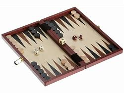

= Lesson 26
:toc: left
:toclevels: 3
:sectnums:
:stylesheet: ../../+ 000 eng选/美国高中历史教材 American History ： From Pre-Columbian to the New Millennium/myAdocCss.css

'''

== Section 1

==== A. Dates.

1. Four, nine, seventy-seven
Fourth of September, nineteen seventy-seven +
2. Twenty-four, eight, sixty-three
Twenty-fourth of August, nineteen sixty-three +
3. Seven, seven forty-three
Seventh of July, nineteen forty-three

---

==== B. Years.

1. Ten sixty-six +
2. Seventeen seventy-six +
3. Eighteen one +
4. Nineteen eighteen +
5. Two thousand +
6. Fifty-five B.C.

[.my1]
====
- 英文口语说年份: +
-> 2018:  twenty eighteen +
-> 2020 : twenty twenty
-> 984 : nine eighty-four

- B.C. 公元前（Before Christ）
====

---

==== C. Telephone Numbers.

1. O-two-o-two, two-seven-four-one-four +
2. O-one-four-eight-three-two-nine-double one +
3. O-three-o-four-two-three-eight-double seven +
4. O-one-double four-one-double four-double six +
5. O-four-seven-three-five-eight-nine-o-five

====
- 电话中, 0 可以读为zero,也可以读作字母 O（ou）或 nought  /nɔːt/ . +
-> nought point one (= written 0.1) 零点一
====

---

==== D. Common Abbreviations.

1. R.S.V.P. (French, meaning "Please reply.") +
2. et cetera (Latin, meaning "and so on") +
3. care of +
4. approximately +
5. p.p. (Production Phase) +
6. i.e. (Latin, meaning "that is") +
7. e.g. (Exempli gratia. = For example.) +
8. P.T.O. (Please turn over.) +
9. Limited +
10. Co. (Company) +
11. versus +
12. P.S. (postscript) +
13. VIP (Very Important Person) +
14. Great +
15. Avenue +
16. Road +
17. Street +
18. Gardens +
19. Square +
20. Park +
21. Crescent +
22. A.D. (Anno Domini) +
23. B.C. (Latin, before Christ) +
24. a.m. (ante meridiem) +
25. p.m. (post meridiem) +
26. MP (Member of Parliament) +
27. BBC (the British Broadcasting Corporation) +
28. VAT (Value-Added Tax) +
29. TUC (Trades Union Congress) +
30. AA (Automobile Association/Atomic Age/Associate in Arts) +
31. RAC (Royal Aero Club) +
32. PC (Personal Computer) +
33. EEC (European Economic Community)

[.my1]
====
- R.S.V.P : abbr. （法）请答复（Répondez S'il Vous PlaÎt）
- approximately (ad.) 大概；大约；约莫 +
-> The journey took approximately seven hours. 旅程大约花了七个小时。
- p.p. : abbr. 过去分词（past participle）

- i.e. :  (from Latin 'id est' ) 也就是，亦即（源自拉丁文id est） +
-> the basic essentials of life, *i.e.* housing, food and water 生活的基本需要，即住房、食物和水

- e.g. : for example (from the Latin 'exempli gratia' ) 例如（源自拉丁文exempli gratia） +
-> popular pets, e.g. cats and dogs 很多人喜爱的宠物，如猫和狗

- P.T.O. : abbr. 请翻阅次页（Please Turn Over）/ 家长教师联谊组织（Parent Teacher Organization）

- Co. :  company 公司；商号；商行 +
-> Pitt, Briggs & Co. 皮特—布里格斯公司

-  P.S. : abbr. 常务秘书（Permanent Secretary）；附言（postscript）；每秒（Per Second）；客轮（Passenger Steamer）
- postscript : (abbr. PS ) an extra message that you add at the end of a letter after your signature （加于信末的）附言，又及 / extra facts or information about a story, an event, etc. that is added after it has finished 补充；补编；后话；跋

- avenue :(abbr. [ "Ave.", "Av." ] ) a street in a town or city （城镇的）大街

- cres·cent : [ C ] a curved shape that is wide in the middle and pointed at each end 新月形；月牙形 +
=> 来自PIE*ker , 创造，生长，词源同create。-esce, 表起始。最早指月相由亏转盈的阶段，但后来错误的用来指这一阶段的形状。 +
image:../img/crescent.jpg[,10%]

- A.D. : abbr. （拉）公元（耶稣诞生之后，用于年代）（Anno Domini） +
=> Anno是“年”, Domini是“主”的意思. 在英语中是“in the year of our Lord”.

- a.m. :abbr. 上午，午前（ante meridiem） +
=> ante- 作前缀,表示 "在...之前". meridiem  正午

- p.m. :abbr. 下午（post meridiem）

- MP : abbr. 国会议员（Member of Parliament）；

- VAT :[ U ] ( BrE ) a tax that is added to the price of goods and services (abbreviation for '*value added tax*' ) 增值税（全写为value added tax） +
-> ￡27.50 + VAT 27.50英镑加增值税 +
-> Prices include VAT. 价格中含增值税。

- TUC : Trades Union Congress . The TUC is an organization to which many British trade/labor unions belong. 英国职工大会（下设英国许多工会）

- AA : abbr. 嗜酒者互诫协会（Alcoholics Anonymous）；汽车协会（Automobile Association）；瘾君子互诫协会（Addicts Anonymous）；会计学准学士（Associate in Accounting）

- RAC : abbr. 英国皇家飞行俱乐部（Royal Aero Club）；英国皇家汽车俱乐部（Royal Automobile Club）；美国研究分析公司（Research Analysis Corporation）；加拿大铁路协会（Railway Association of Canada）；雷达进场控制（Radar Approach Control）

- EEC :abbr. 汽车废气排放系统（Exhaust Emission Control）；欧洲经济共同体（European Economic Community）
====

---

== Section 2

==== A. Different Opinions about Women.

Man: I see that dreadful women's liberation group was out in Trafalgar Square yesterday.
Hmm. In my opinion, they all talk rubbish. +
Woman: But you can't really believe they all talk rubbish. +

Man: Of course, I can. I consider that it is unfeminine(a.) to protest. +
Woman: But you can't really believe it's unfeminine to protest. +

[.my1]
====
- dreadful (a.) very bad or unpleasant 糟糕透顶的；讨厌的；令人不快的 / causing fear or suffering 可怕的；令人畏惧的；使人痛苦的 +
-> What a dreadful thing to say! 话说得太难听了！ +
-> Jane looked dreadful (= looked ill or tired) . 简看上去脸色很不好。 +
-> a dreadful accident 可怕的事故

- unfeminine adj. 不温柔的；不适于妇女的；不象女性的
====

Man: Women should be seen and not heard. +
Woman: But you can't really believe that women should be seen and not heard. +

Man: Certainly. It's my belief that a woman's place is in the home. +
Woman: But you can't really believe that a woman's place is in the home. +

Man: Yes. And she should stay there. Women should look after men. +
Woman: But you can't really believe women should look after men. +

Man: Created to feed and support them. That's what they were. I'm certain that women
are intellectually inferior(a.) to men. +
Woman: But you can't really believe women are intellectually inferior to men. +

Man: *Not only* inferior, *but* I know they can't do a man's job. +
Woman: But you can't really believe they can't do a man's job. +
Man: Yes, Maggie. That's my firm belief. But don't tell your mother I said that.

[.my1]
====
- intellectually adv. 智力上；理智地；知性上
- inferior (a.)~ (to sb/sth) not good or not as good as sb/sth else 较差的；次的；比不上…的 / of lower rank; lower 级别低的；较低的 +
-> of inferior quality 劣质的 +
-> an inferior officer 下级军官
====

---

==== B. George.

George's mother was worried about him. One evening, when her husband came
home, she spoke to him about it. +
"Look, dear," she said, "you must talk to George. He left school three months ago. He
still hasn't got a job, and he isn't trying to find one. All he does is smoke, eat and play
records." +
George's father sighed. It had been a very tiring(a.) day at the office. +
"All right," he said, "I'll talk to him. +

[.my1]
====
- sigh (v.) 叹气；叹息
- tiring (a.)令人困倦的；使人疲劳的；累人的
====

"George," said George's mother, knocking at George's door, "your father wants to
speak to you." +
"Oh!" +
"Come into the sitting room, dear." +
"Hello, old man," said George's father, when George and his mother joined him in the
sitting-room. +
"Your father's very worried about you," said George's mother. "It's time you found a
job." +
"Yes," replied George without enthusiasm. +

[.my1]
====
- old man : ( informal ) a person's husband or father 老公；老爸
- enthusiasm (n.)[ U ] ~ (for sth/for doing sth) : a strong feeling of excitement and interest in sth and a desire to become involved in it 热情；热心；热忱
====

George's mother looked at her husband. +
"Any ideas?" he asked hopefully. +
"Not really," said George. +
"What about a job in a bank?" suggested George's mother, "or an insurance company perhaps?" +
"I don't want an office job," said George. +
George's father nodded sympathetically. +

"Well, what do you want to do?" asked George's mother. +
"I'd like to travel," said George. +
"Do you want a job with a travel firm then?" +
"The trouble is," said George," I don't really want a job at the moment. I'd just like to
travel and see a bit of the world." +
George's mother raised her eyes to the ceiling. "I give up," she said.

[.my1]
====
- Any ideas 有何想法?
- Not really :used to say "no" in a way that is not very forceful or definite +
-> "Do you want to go to a movie?" "No, not really."
- sympathetically 悲怜地，怜悯地；富有同情心地
====

---

==== C. Shoplifting.

A manager is talking about the prevention of shoplifting.

Well, I manage a small branch of a large supermarket, and we lose a lot of money
through shoplifting. I have to try to prevent it, or else I'll lose all my profits.

A lot of
shoplifting is done by young people, teenagers in groups. They do it for fun. They're not
frightened so we have to make it difficult for them.

Obviously a supermarket can't have
chains or alarms on the goods, so we have store detectives(n.), who walk around like
ordinary shoppers, otherwise they'll be recognized.

[.my1]
====
- shoplifting (n.)冒充顾客在商店行窃（罪） +
=> shop,商店，lift,小偷小摸。
- branch :  树枝 / a local office or shop/store belonging to a large company or organization 分支；分部；分行；分店

- They're not frightened so we have to make it difficult for them.  他们不害怕，所以我们得给他们制造点困难。

- store detective : a person employed by a large shop/store to watch customers and make sure they do not steal goods 商店专抓行窃者的雇员
- detective  侦探；警探
- otherwise they'll be recognized.  否则他们就会被认出来。
====

We have big signs up, saying
'shoplifters will be prosecuted(v.),' but that doesn't help much. We've started putting cash
desks at all the exits, we've found we have to do that, or else the shoplifters will walk
straight out with things. Of course, that worries the ordinary shopper who hasn't found
what he wanted.

We also use closed-circuit television, but that's expensive. In fact, all
good methods of prevention are quite expensive, and naturally, they make our prices
more expensive, but it has to be done, otherwise shoplifting itself will make all the prices
much higher, and the public doesn't want that!

[.my1]
====
- prosecute (v.)~ (sb) (for sth/doing sth) : to officially charge sb with a crime in court 起诉；控告；检举
- cash desk 收款处；收银台
- closed-circuit : ADJ A closed-circuit television or video system is one that operates within a limited area such as a building. 闭路式的
====

---

==== D. Discussion.

Principal: We are very honored to have Tania Matslova here today. It is only ten o'clock
and Tania has already done two hours of practice. And she kindly agreed to watch your
rehearsal(n.) after that. She is very interested in the training of young dancers and wants to
ask questions. Don't forget, however, that Miss Matslova has two performances today.
She must not get too tired ... Miss Tania Matslova. +

[.my1]
====
- principal :大学校长；学院院长 / 主要演员；主角 /  ( technical 术语 ) a person that you are representing, especially in business or law （尤指商务或法律事务的）当事人，委托人
- 今天我们很荣幸邀请到塔尼亚·马特斯洛娃。
- practice 实践；实际行动
- re·hearsal (n.)  time that is spent practising a play or piece of music in preparation for a public performance  排演；排练 /预演；演习
- informal 不拘礼节的；友好随便的；非正规的
- remember (v.)回想起; 想起；记起
- It all depends 要看情况而定; 视情形而定
====

Tania: Good morning. We're going to be very informal, aren't we? Why are you standing?
Move some chairs. Let's sit in a circle.
(sound of chairs being moved, excited voices and piano music)  +

Tania: That's better. I can see you now. And I want to congratulate you. Your rehearsal
was very professional. I was impressed by your technique and your feeling for the music. I
remembered myself twenty years ago.  +
Do you think twenty years is a long time? It all
depends. You must look forward to twenty years of practising six hours every day. Twenty
years of traveling uncomfortably. Twenty years of going to bed instead of going to parties.
 +
Do you look forward to this discipline? I didn't know how difficult my life was going to be,
but I wouldn't change it. The important thing is ... I'm still dancing. For me, dancing is living. +
I'm so sorry. I'm talking too much. Would you like to ask me some questions?  +

James: I would. I'm really worried about my career, Miss Matslova. +
Tania: Please call me Tania. What's your name? + +
James: James, Tania. +
Tania: So, James. Why are you worried? +
James: I love dancing but I hate changing in cold dressing rooms. I don't mind practising
every day. In fact, I like it, I enjoy exercising. But *I'm fed up with* going to bed early every
night and refusing invitations to parties. I like travelling ... but not if it's uncomfortable. I'm confused. Do you think I should carry on? +

[.my1]
====
- but I hate changing in cold dressing rooms. 但我讨厌在冷冰的更衣室里换衣服。
- dressing room : a room for changing your clothes in, especially one for actors or, in British English, for sports players （演员的）化装间；（英国英语，运动员的）更衣室
- be fed up with 感到厌烦; 受够了, 腻了
- carry on :  If you carry on doing something, you continue to do it. 继续
====

Tania: It depends what you want, James. Would you rather go on dancing or would you
rather live a normal, ordinary life? +
James: I want to do both. +
Tania: That, my dear James, is impossible. *I'm fed up with* getting up early. I'm tired(a.) of
travelling. I've always hated leaving my family for weeks or months. But ... I'm a dancer
and I look forward to dancing as long as I can. What can I say? If you don't want to be a
professional dancer more than anything else, you'd better change your plans. +

James: Thank you, Miss M ... er, Tania. Your advice was really helpful. I can see now that
`主` just being keen(a.) on dancing `系` isn't enough for a career. +

[.my1]
====
- would rather... (than) 宁愿；更喜欢
- tired (a.)~ of sb/sth |~ of doing sth 厌倦；厌烦
- `主` just being keen on dancing `系` isn't enough for a career. 仅仅热衷于跳舞对职业来说是不够的。
====

Principal: I'm quite sure you are all grateful to Miss Matslova for spending so much time
with you. +
Tania: James, please let me know what you decide to do. I think you are very talented(a.) but
that isn't enough. It depends what you want. And that applies to all of you. You must make
up your minds.

[.my1]
====
- grateful (a.)~ (to sb) (for sth) |~ (to do sth) |~ (that...) :  感激的；表示感谢的
- talented 有才能的；天才的；有才干的
- And that applies to all of you. You must make
up your minds. 这也适用于你们所有人。你们必须拿定主意。
- make up ones mind 下定决心
====

---

== Section 3

==== Dictation.

Jacqueling *got out of* the bus and *looked around* her. It was typical(a.) of the small
villages of that part of the country.  +
The houses stood in two long lines on either side of the dusty road which led to the capital. In the square, the paint was *peeling off* the Town Hall, and some small children were running up and down its steps, laughing.  +
On the other side there were a few old men sitting outside a cafe playing backgammon and smoking their pipes.  +
A lonely donkey was quietly munching(v.) the long dry grass at the foot of the statue that stood in the center of the square.  +
Jacqueling sighed.

[.my1]
====
- Jacqueling got out of the bus and looked around her. : Jacqueling 下了车，环顾四周。

- typical (a.)
1.~ (of sb/sth) 典型的；有代表性的::
-> This meal is typical of local cookery. 这是有当地风味的饭菜。
2.~ (of sb/sth) ( often disapproving ) behaving in the way that you expect 不出所料；特有的::
-> It was typical of her to forget. 她这个人就是爱忘事。

- The houses stood in two long lines on either side of the dusty road which led to the capital.  这些房子, 在通往首都的尘土飞扬的道路两边, 排成两长队。

- paint 油漆；油漆涂层
- *peel (v.)~ (sth) away/off/back* : to remove a layer, covering, etc. from the surface of sth; to come off the surface of sth 剥掉；揭掉；剥落

- Town Hall :  a building containing local government offices and, in Britain, usually a hall for public meetings, concerts, etc. 镇公所；市政厅；（英国）市镇集会所

- cafe  咖啡馆，小餐馆（供应饮料和便餐，在英美国家通常不供应酒类）
- backgammon : 十五子棋戏（棋盘上有楔形小区，两人玩，掷骰子决定走棋步数） +
=> 这是一种双方各有十五枚棋子、掷骰子决定行棋格数的游戏。人们曾在古代巴比伦王国一位王后的墓穴中发掘出一块已有五千年历史的镶底精美的十五子棋的棋盘。 Backgammon的字面含义是“回子游戏”。*早期英语的“游戏”不写作game，而是写作gamen*，因此，backgammon即back game，因为玩这种游戏时，棋子常被“送回”对方，再重新放入棋盘。 +

- munch (v.)~ (on/at) sth : to eat sth steadily and often noisily, especially sth crisp 大声咀嚼，用力咀嚼（脆的食物） +
-> She munched on an apple. 她在大口啃苹果。

- Jacqueling sighed. :  Jacqueling 叹了口气。
====

---
