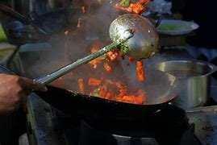
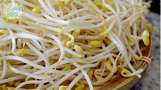
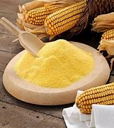
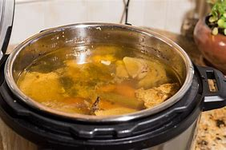
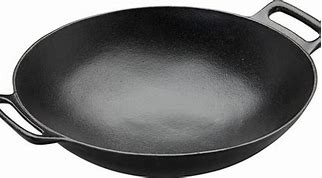
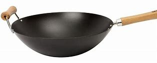
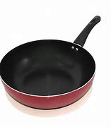
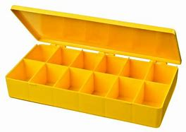
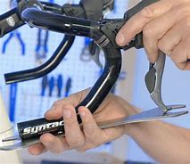

= Lesson 27
:toc: left
:toclevels: 3
:sectnums:
:stylesheet: ../../+ 000 eng选/美国高中历史教材 American History ： From Pre-Columbian to the New Millennium/myAdocCss.css

'''

== Section 1

==== A. Announcement.

Due to fog /we regret that changes have been made to the scheduled(a.) departures. +
Flight LH302 is now due to leave at 10:00. Frankfurt airport is closed and this fight will be diverted to Wiesbaden.  +
Flight BA314 will now leave at 10:20 and Flight AI411 at 10:25. +
Please await further announcements.
Now correct the timetable in your book.

[.my1]
====
- scheduled (a.) (根据节目、时间表等)事先安排的; 事先计划的 +
->  a scheduled meeting
- departure (n.)~ (from...)  离开；起程；出发 +
-> Flights should be confirmed 48 hours before departure. 航班应在起飞前48小时予以确认。 +
-> His sudden departure threw the office into chaos. 他的突然离去使这个部门陷入一片混乱。

- divert : (v.)to make sb/sth change direction 使转向；使绕道；转移 /改变（资金、材料等）的用途 /转移（某人）的注意力；使分心 +
-> Northbound traffic will have to be diverted onto minor roads. 北行车辆将不得不绕次要道路行驶。
- Wiesbaden 德国城市
====

---

==== B. Telephone Message.

"Hello. This is John. I'm afraid I can't make it this evening. I've asked Peter to meet
you but he can't get away from work until twenty past six. It seems better if you met at 6:50
at the entrance to Waterloo Station."
Now correct the written “phone message”.

[.my2]
“你好。这是约翰。恐怕我今晚去不了。我已叫彼得来见你，但他要到六点二十分才能下班。如果你们6点50分在滑铁卢车站入口处见面，似乎会好些。”现在改正你写的“电话留言”。

---

== Section 2

==== A. Changes.

...Well, you know there have been a lot of changes over the last few years. In fact, since 1978 the population has increased to about a quarter of a million. Unemployment is much better than in some cities. Now it's about five and a half per cent. Yes, but in 1978 it was only about three per cent. It's not bad, as I said.

But there have been changes at the airport since we found oil. Since 1978 the number of aeroplane passengers has increased from 980,000 to 1,400,000.  +
And over these last few years, from 1978 until now, the number of helicopter passengers has also increased enormously. It was 220,000 in 1978, but since then it's increased to 600,000.

[.my1]
====
- un·employ·ment   失业；失业人数
====

---

==== B. Bus Conductor Wins Fortune on Pools.

This time last week Roy Woods, a bus conductor from Streatham, in South London, was worried about money. He owed twenty pounds to his landlady in rent. Today he is rich, for last Saturday he won 120,000 pounds on the football pools. Last night he was interviewed on television by reporter Stan Edwards.

Edwards: Well, Mr. Woods, what are you going to do now? Are you going to give up your
job on the buses? +
Woods: Yes, I'm going to finish at the end of the week. +
Edwards: And what other plans have you got? +
Woods: Well, I'm going to buy a house. +
Edwards: Have you got a house of your own now? +
Woods: No, no, we live in a furnished(a.) flat. +
Edwards: Have you got a car? +
Woods: Yes, I've got an old Ford, but I'm going to buy a new car ... and my wife says she's
going to have driving lessons!

[.my1]
====
- football pools : ( the pools ) [ pl. ] a form of gambling in Britain in which people try to win money by saying what the results of football ( soccer ) matches will be 赌球，足球普尔（猜足球赛输赢的赌博）
- furnished  (a.)配备家具的
====

---

==== C. Cooking.

Today, I'm going to tell you how to make stir-fried beef with ginger. This typically Guangzhou dish is one of the quickest and tastiest ways to cook beef. The ginger adds spiciness. Serve it with ham and *bean sprouts* soup. See page 64.

[.my1]
====
- stir-fry (v.)[ VN ] to cook thin strips of vegetables or meat quickly by stirring them in very hot oil 翻炒；炒；煸 +

- dish 一道菜；菜肴 +
-> a vegetarian/fish dish 一道素菜；一盘鱼
- tastiest 美味的（tasty 的最高级）
- spicy :  (a.) ( of food 食物 ) having a strong taste because spices have been used to flavour it 加有香料的；用香料调味的  +
/ ( of a story, piece of news, etc. 故事、新闻等 ) exciting and slightly shocking 刺激的；粗俗的
- bean 豆；菜豆；豆荚；豆科植物
- sprout  苗；新芽；嫩枝
- bean sprouts  :[ pl. ] seeds that are just beginning to grow, often eaten raw bean 豆芽（常生食） +

====

Ingredients: 350 grams of lean(a.) *beef steak*. +
Quarter of a teaspoon of salt. +
Two teaspoons of light *soy sauce*. +
Two teaspoons of *dry wine*. +
Half a teaspoon of *sesame oil*. +
One teaspoon of *corn flour*. +
One slice of fresh ginger. +
One *table spoon* of oil. +
One table spoon of *chicken stock* or water. +
And half a teaspoon of sugar. +

[.my1]
====
- in·gre·di·ent 成分；（尤指烹饪）原料 /（成功的）因素，要素
- lean (a.)肉少的；瘦且健康的
- steak =  beef·steak 牛排 /肉排；肉块
- soy = soy sauce 酱油.  也可以表示用来制造酱油的大豆或黄豆（soy bean）。
-  dry wine 干葡萄酒, 白干, 无甜味的葡萄酒
- sesame  芝麻
- corn flour :  Cornflour is a fine white powder made from corn that is used to make sauces thicker. 玉米淀粉 +

- flour 面粉
- ginger  姜
- table spoon : A tablespoon is a fairly large spoon used for serving food and in cooking. 大汤匙

- stock : a liquid made by cooking bones, meat, etc. in water, used for making soups and sauces 高汤；原汤 +
=> 高汤是烹饪中常用的一种辅助原料，以往通常是指鸡汤，经过长时间熬煮，其汤水留下，用于烹制其他菜肴时，在烹调过程中代替水，加入到菜肴或汤羹中，目的是为了提鲜，使味道更浓郁。 +
高汤是烹饪中最常用的辅料之一。高汤的做法很多，有荤有素，主要有鸡高汤、猪高汤、牛高汤、鱼高汤、蔬菜高汤等。 +
-> vegetable stock 菜汤 +

====

First, you put the beef in the *freezing compartment* of the refrigerator for twenty minutes. This will allow the meat to harden slightly for easier cutting. +
Then cut it into thin slices of about one and a half inches, that's three and a half centimetres long. +

Put the *beef slices* into a bowl. And add the salt, soy sauce, wine, sesame oil, and corn flour, and mix well. +
Let the slices soak(v.) for about fifteen minutes. +
Meanwhile, finely shred(v.) the ginger slice and set it aside. +
Heat a wok(n.) or large *frying pan* and add the oil. +

When it is very hot, stir-fry(v.) the beef for about two minutes. +
When all the beef is cooked, remove it, wipe(v.) the wok or pan clean and re-heat it. +
Add a little oil and stir-fry(v.) the ginger for a few seconds. +
Then add the stock or water and sugar. +
Quickly return the meat to the pan, and stir(v.) well. +
Turn the mixture onto a plate, and serve at once.

[.my1]
====
- freezing (a.)极冷的 +
-> It's freezing in here! 这儿冷得不得了！ +
-> I'm freezing! 我要冻僵了！

- freezing compartment  冷冻室
- soak (v.)~ (sth) (in sth) : 浸泡；浸湿；浸透；湿透 / 使湿透；把…浸湿 +
-> I'm going to go and soak(v.) in the bath. 我要去泡个澡。
- shred (v.)to cut or tear sth into small pieces 切碎；撕碎

-  set it aside 将其搁置一旁 , 把它放在一边
- wok (n.)( Chinese ) a large pan shaped like a bowl, used for cooking food, especially Chinese food 炒菜锅；镬子 +
=> 广东话 +
 +

- frying pan : ( NAmE also [ "fry·pan", "skil·let" ] ) a large shallow pan with a long handle, used for frying food in 长柄平底煎锅 +

- stir-fry (v.)[ VN ] to cook thin strips of vegetables or meat quickly by stirring them in very hot oil 翻炒；炒；煸

- wipe (v.)~ sth (on/with sth) : to rub sth against a surface, in order to remove dirt or liquid from it; to rub a surface with a cloth, etc. in order to clean it 擦；拭；抹；揩；蹭 +
-> He wiped his hands on a clean towel. 他用一块干净的手巾擦了擦双手。 +

- stir (v.)~ sth (into sth) |~ sth (in) : to move a liquid or substance around, using a spoon or sth similar, in order to mix it thoroughly 搅动；搅和；搅拌

====

---

==== D. How to Use a Camera.

Julie has just arrived at Bob's house. She has bought a new camera. She wants Bob
to show her how it works. +
Julie: You're a good photographer, Bob. Can you have a look at this camera and show me
how it works? +
Bob: Yes, of course. It isn't difficult. But first you have to buy a film. +
Julie: (scornfully) I know that. Here's the film. +

Bob: Right. Now first you have to open the film compartment. Just press the release. Then
you have to put a film cartridge in the compartment. Close it carefully. After that you have
to push the lever until you see number 1 in the counter window. And then all you have to
do is this look through the viewfinder and press the button. It's very easy. +
Julie: Thank you, Bob. Let's try it. I'm going to take your photograph, so say 'cheese'.

[.my1]
====
- scornfully 轻蔑地；藐视地
- compartment （铁路客车车厢分隔成的）隔间 /（家具或设备等的）分隔间，隔层 +

- lever : （车辆或机器的）操纵杆，控制杆 /杠杆 +

- counter : an electronic device for counting sth （电子）计数器，计算器
- view·find·er  : the part of a camera that you look through to see the area that you are photographing （照相机的）取景器
- take your photograph 照一张相, 拍...的照片
====

---

==== E. Monologue.

Yes, I agree. Lovely breakfast. Very nice. Excellent coffee, especially, don't you think? Anyway, as I was telling you, it happens to me every time I go to a new place: I always *end up* paying twice or three times as much as I should for the first ride.

But last night was the worst ever. The train got in at about eleven, so I felt lucky to get one —though it looked a bit old and battered(a.).

[.my1]
====
- end up + doing :  到头来 +
-> If you don't know what you want, you might *end up* getting something you don't want.
 如果你不知道自己想要什么，你可能会到头来得到自己不想要的东西。
- times （用于比较）倍 +
-> three times as long as sth 某物的三倍长
- battered  (a.)old, used a lot, and not in very good condition 破旧不堪的  +
/ attacked violently and injured; attacked and badly damaged by weapons or by bad weather  受到严重虐待的；受到（炮火、恶劣天气）重创的 +
=> 词源同beat, 击，打。-er, 表反复。 +
-> battered women/children 受虐待的妇女╱儿童
====

But he was so polite —and you don't get much of that these days: 'Let me take your bags,' he says. 'No trouble,' he says. 'It's a hot, sticky night,' he says, 'but don't worry, madam, it's air-conditioned,' —and it was, surprisingly — 'just relax and I'll get you there in no time.'

So we went for miles down this road and that road and he pointed out all sorts of buildings and other sights that he said I'd appreciate when I could see them properly in the morning.

[.my1]
====
- sticky  黏（性）的 /  (天气)闷热的 / 难办的；棘手的；让人为难的 +
-> a sticky situation 棘手的局面
-  in no time 立即, 立刻, 马上
- appreciate (v.) to recognize the good qualities of sb/sth 欣赏；赏识；重视
====

And he told me that though this was one of the few cities in the world where a woman could go [at that time of night] [on her own] and nothing to fear, even so, it was a good thing I'd taken a registered vehicle, because you never knew, did you?

Though I couldn't see any special *registration number* of anything, and I didn't think to make a note of his *licence plate* —and it wouldn't have made any difference, I don't suppose.

So here I am. And as you can see, if you look out of the window, that's the station! Just across the road! Anyway. Well, it's a lovely hotel, isn't it? Are you on holiday too?

[.my1]
====
- registration number  车辆的登记号码；牌照的号码
- make a note of 把…记下来
- licence plate : It's a plate mounted on the front and back of a motor vehicle bearing the *registration number*. 是指安装在汽车前后的、带有号码的车辆牌照。 车牌 (注意不是"车牌号", 是刻有车号的那块牌子)
====

[.my2]
====
+

是的,我同意。可爱的早餐。很好。尤其是咖啡，你不觉得吗?不管怎样，就像我告诉你的那样，每次我去一个新地方都会遇到这种情况:我总是要为第一次旅行付两到三倍的钱。但昨晚是最糟糕的一晚。火车大约在11点进站，所以我觉得很幸运能坐到一辆——尽管它看起来有点旧又破旧。

但他很有礼貌，他说，让我帮你拿包，这在如今已经不常见了。他说:“不麻烦。”“今天晚上又热又粘，”他说，“但别担心，夫人，有空调。”——令人惊讶的是，确实有空调——“放松点，我很快就会把你送到那儿的。”所以我们沿着这条路和那条路走了好几英里，他指给我看了各种各样的建筑和其他景点，他说，如果我能在早上好好看看，我会很感激的。和他告诉我,尽管这是世界上为数不多的城市,一个女人可能会在那个时候晚上自己和无所畏惧,即便如此,这是一件好事我注册的车辆,因为你永远不知道,你呢?虽然我看不出任何特殊的车牌号码，我也没想记下他的车牌——我想这也不会有什么区别。所以我来了。正如你所看到的，如果你往窗外看，那就是车站!就在马路对面!无论如何。这家酒店很不错，不是吗?你也在度假吗?
====

---

== Section 3

==== Dictation.

My problem is with my mother, who is now well(adv.) over seventy and a widow and becoming very fragile, and she really needs my help. But where she lives, in the country, there's no work available for me —I'm a designer —and she can't come and live with me because she says she doesn't like the climate because it's too bad for her rheumatism, which is actually true —it's very cold here. And if I go and work there *as* something else where she lives, perhaps *as* a secretary, it means we have to take drastic drop in salary. So I don't really know what to do.

[.my1]
====
- well :(adv.) to a great extent or degree 很；相当；大大地；远远地 +
-> He was driving at well(adv.) over the speed limit. 他当时开车的速度远远超过了限制。 +
-> a well-loved tale 深受喜爱的故事

- over  多于（某时间、数量、花费等） +
-> over 3 million copies sold 售出三百多万册 +
-> He's over sixty. 他六十多岁了。

- rheuma·tism : /ˈruːmətɪzəm/ [ U ] a disease that makes the muscles and joints painful, stiff and swollen 风湿（病） +
=> 古人认为人体内含有大量体液，在希腊语中将其称为rheum，来自动词rhein（流动）(想想 river 河流)。古人认为风湿病是因为太多体液流入关节，导致关节内韧带被拉 伸，所以古希腊人将风湿病称为rheumatismos，字面意思就是“rheum造成的毛病”。该词经由拉丁语后进入英语，拼写演变为 rheumatism。 +
=> 风湿病是一组侵犯关节、骨骼、肌肉、血管及有关软组织或结缔组织为主的疾病，其中多数为自身免疫性疾病。发病多较隐蔽而缓慢，病程较长，且大多具有遗传倾向。

- And if I go and work there *as* something else where she lives, perhaps *as* a secretary, it means we have to take drastic drop in salary. 如果我去她住的地方做别的工作，比如做秘书，那就意味着我们的薪水会大幅下降。
====

---
