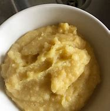
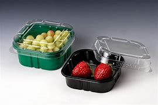
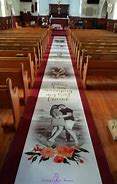
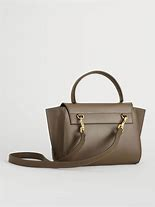

= Lesson 28
:toc:

---

== Section 1

==== A. Functions and Happenings:

(a) +
Tomatoes! Tomatoes! Forty p a pound. Yer lovely salad tomatoes today. Lots o'lovely
mush. Fifty p half pound, and a punnet o'strawberries ... for one pound.

====
- Yer （书写时用，表示口语的you或your） ( informal non-standard ) +
-> What's yer name? 你叫什么名字？
- o' （在书面英语中，代替of的非正式说法） +
->  a couple o' times 几次
- mush : a soft thick mass or mixture 软稠的一摊；糊状物 /玉米粥 +
-> The vegetables had turned to mush. 蔬菜都烂成了一堆。 +
-> His insides suddenly felt like mush. 他内心突然伤感起来 +

- punnet  /ˈpʌnɪt/ a small box or basket that soft fruit is often sold in  （盛软质水果的）小果盒，小果篮 +
=> 来自pun,磅，来自pound的方言变体。-et,小词后缀。因该果篮原用于一种测量工具。 +

====

---

(b) +
You have exactly three and a half hours before *polling stations* close. Three and a half hours, which means, obviously that you’ve got three and a half hours in which to cast(v.) your vote, a vote which I know you’re all going to cast for Mary Hargreaves, the future member of Parliament. Mary Hargreaves has campaigned(v.) furiously and industriously over ...

====
- polling station : ( especially BrE ) ( NAmE usually ˈ**polling place** ) a building where people go to vote in an election 投票站；投票点
- cast (v.)to throw sb/sth somewhere, especially using force 扔；掷；抛 +
-> They cast anchor at nightfall. 他们傍晚抛锚停泊。
- campaign (v.)V-I If someone *campaigns(v.) for* something, they carry out a planned set of activities over a period of time in order to achieve their aim. 从事运动 +
/(n.)（有计划的）活动，运动；战役，战斗
- furiously adv. 猛烈地；狂暴地
- industriously adv. 勤奋地，努力地

====

---

(c) +
Welcome to Tescos. May we inform(v.) our customers that today we have English strawberries on *special offer* at only sixty-five p a pound and raspberries at only forty-nine p a pound and loganberries at thirty-eight p a pound. We hope you will *avail(v.) yourselves of* our special offers.

====
- inform (v.) ~ sb (of/about sth) 知会；通知；通告
- special offer  : [ CU ] a product that is sold at less than its usual price, especially in order to persuade people to buy it; the act of offering goods in this way 特价商品；特价销售

- rasp·berry : a small dark red soft fruit that grows on bushes 覆盆子；山莓；悬钩子 +

- avail (v.)有帮助；有益；有用
- *avail yourself of sth* :
( formal ) to make use of sth, especially an opportunity or offer 利用（尤指机会、提议等） +
=> 前缀a-同ad-, 去，往. 词根val, 力量，词源同value, valiant. 指有益的，有力量的。 +
-> Guests are encouraged to avail themselves of the full range of hotel facilities. 旅馆鼓励旅客充分利用各种设施。
====

---

(d) +
(sound of applause and cheering in background)  +
We can’t continue the concert until people have cleared the central aisle. The space … We’ve got to keep the path clear for emergency services and we can’t continue the music until it is cleared. Now, please, clear the central aisle!

====
- concert 音乐会；演奏会
- clear (v.) to make people leave a place 使人离开
- aisle :  /aɪl/ a passage between rows of seats in a church, theatre, train, etc., or between rows of shelves in a supermarket （教堂、戏院、火车等座位间或超级市场货架间的）走道，过道 +
-> 

- (背景掌声和欢呼声) +
在把中间过道的人群清走之前，我们无法继续进行音乐会。中间的通道,…我们是留作为紧急情况服务的, 必须保持畅通，在它保持畅通之前, 我们不会继续播放音乐。所以, 现在，请大家离开中间通道!
====

---

(e) +
End Apartheid! End Apartheid! Apartheid! Out! Out! Out! Free Africa! Free Africa! Black and white together! Black and white together! Apartheid out! Apartheid out! Out! Out! Out!

====
- apart·heid  /əˈpɑːtaɪt/  种族隔离（前南非政府推行的政策） +
=> 由apart（分离、隔离）+heid（=hood）构成
====

---

(f) +
Er, now, a, a few points for all the stewards and demonstrators before we move off. Er … er … Can you be quiet, please! Now, will all the stewards please remember to walk on the outside of the column, on the outside, very important, and the demonstrators, please *pay particular attention to* the route. +
Now, we will be walking down Park Lane to, to Piccadilly and we will be going through Piccadilly Circus(n.) and Leicester Square and from then on into Trafalgar Square. No right turns, no left turns, straight on into Trafalgar Square. Is that OK?

====
- point 论点；观点；见解
- steward （轮船、飞机或火车上的）乘务员，服务员 /（私人家中的）管家
- demonstrator （集会或游行的）示威者 /示范者；演示者
- cir·cus ( BrE ) (used in some place names) a round open area in a town where several streets meet （用于某些地名）圆形广场，环形交叉路口 +

- 呃，现在，在我们出发之前，我要给所有的工作人员和示威者一点建议。你能安静点吗，拜托!现在，请所有的工作人员记住走在圆柱外面，在外面，非常重要，而示威者们，请特别注意路线。 +
现在，我们将沿着公园巷走到皮卡迪利大街，我们将穿过皮卡迪利广场和莱斯特广场，然后进入特拉法加广场。不要右转，不要左转，一直直线走到特拉法加广场。这样可以吗?
====

---

(g) +
Any old iron? Any old iron? Anybody, iron? Any old iron?

---

== Section 2

==== A. Kinds of People.

He’s quite a solitary(a.) type of person, really. You know, he spends most of his time at home, reading, listening to the radio, things like that. He goes out to the pub occasionally, and he does quite a lot of singing, too —he belongs to the local choir, I believe —but you never see him at weekends. He’s always off somewhere in the country, walking or fishing. He does a lot of fishing, actually —but always on his own. Funny sort of bloke.

====
- solitary (a.) 喜欢（或惯于）独处的 / 单个的；孤单的；孤零零的
- choir :a group of people who sing together, for example in church services or public performances（教堂的）唱诗班；（公开演出的）合唱团，歌唱队
- actually （在口语中用于强调事实）的确，真实地，事实上
- bloke :( BrE informal ) a man 人；家伙 +
=> 词源不详。可能来自block的变体，指大块头的家伙。
====

---

==== B. Career Woman and Marriage.

Miss Barbara Pream, the Head of Pushet *Advertising Agency*, is being interviewed for a
radio program on women and work.  +
Interviewer: So, here you are, Miss Pream, right at the top of the profession in advertising.
I suppose you have quite a lot of men working under you, don't you?  +
Pream: Yes, I do. Most of my employees are men, in fact.  +
Interviewer: I see. And they don't mind having a woman boss?  +
Pream: No. Why should they? I'm good at my job.  +

Interviewer: Yes, of course. But, tell me, Miss Pream, have you never thought ... about
getting married? I mean, most women do think about it from time to time.  +
Pream: But, I am married.  +
Interviewer: I'm sorry. I didn't realize, Mrs. ...  +
Pream: I prefer not to use my married name in the office.  +

Interviewer: And your husband, how does he like being married to a career woman?  +
Pream: He has nothing to complain about.  +
Interviewer: No, of course not. By the way, what does he do?  +
Pream: Well, he prefers to stay at home and run the house. He enjoys doing that as a
matter of fact.

====
- career   生涯；职业
- Career Woman and Marriage. 职业女性与婚姻
- advertising agency  广告代理商, 广告公司
- think about doing sth. 考虑做某事
- from time to time : sometimes, but not regularly 有时, 偶尔
- as a matter of fact 确切地说;事实上
====

---

==== C. The Uncle I Hardly Knew.

Beale: Well, uh ... I'll *come straight to the point*. As you know, your uncle, Eduardo Gatto,
died last December.  +
Bruno: Yes. I was very sorry to hear that, even though I hadn't heard from him for a long
time.  +
Beale: Hmm. Did you know that he was a very rich man?  +
Bruno: Uh ... n ... no ... I didn't.  +
Beale: Yes. That's why I've come to see you. I ... I have some news for you.  +
Bruno: What?  +
Beale: He's left everything to you.  +
Bruno: What?!  +
Beale: Yes. The sum comes to more than two million Australian dollars.  +
Bruno: What?! I ... I can't believe it.  +

====
- come straight to the point 开门见山, 单刀直入, 谈正题
====

Beale: It's all true. In his will, Mr. Gatto left clear instructions that I should come to London
personally to see you.  +
Bruno: I ... I just can't *get over* it. I ... I feel it's just ... just too good to be true.  +
Beale: Oh, it's true all right. Believe me. However, there are certain restrictions about how
you can use the money. Would you like me to go through them with you now?  +
Bruno: Yes, yes. Please do!  +

====
- GET OVER STH/SB 从疾病（或震惊、断绝关系等）中恢复常态 / GET OVER STH  解决；克服；控制 +
-> I think the problem can be got over without too much difficulty. 我认为这个问题不太难解决。
====

Beale: Well, first of all, you mustn't spend it all at once. The money will be paid to you
gradually, over a period of ten years.  +
Bruno: Yes, yes ... I understand, but, before you go on, could you tell me how my uncle
made all this money?  +
Beale: Pizza.  +
Bruno: Pardon?  +
Beale: Pizza. You know, the thing people eat, with cheese and ...  +
Bruno: Yes, yes, of course! But how could he make so much money with pizza?  +
Beale: Well, he introduced it into Australia just before it became very popular. And he set
up a chain of pizza restaurants. They're very successful. He was a very intelligent, good
businessman.  +

====
- gradually 逐渐地；逐步地；渐进地
- chain : a group of shops/stores or hotels owned by the same company 连锁商店
====

Bruno: It's strange that he never wrote to us. Never. I know he was very fond of me.  +
Beale: But he couldn't. That was his problem.  +
Bruno: Pardon? He couldn't what?  +
Beale: Write.  +
Bruno: He couldn't ... Do you really mean he couldn't ...  +
Beale: Write. Even though he was very intelligent. And that brings me to the other restriction in his will. You must use part of the money for your own further education. Mr. Gatto was a great believer in it. He always regretted he didn’t get one himself.

====
- And that brings me to the other restriction in his will. 这让我想到了他遗嘱中的另一个限制。
- BRING STH BACK 使回忆起；使想起
- BRING SB TO = bring sb round : ( BrE ) ( NAmE also ˌ**bring sb aˈround** ) ( also ˌ**bring sb ˈto** ) to make sb who is unconscious become conscious again 使苏醒
====

---

==== D. Bargains.

Cathy: I'm fed up with sitting on packing cases, Joe. Don't you think we could buy at least
two chairs?  +
Joe: Do you know how much new chairs cost? One cheap comfortable armchair ... eighty
pounds.  +
Cathy: Yes, I know. It's terrible. But I have an idea. Why don't we look for chairs at a street
market? I've always wanted to see one.  +
Joe: All right. Which one shall we go to?  +
Cathy: Portobello Road, I think. There are a lot of second-hand things there. But we'll
have to go tomorrow. It's only open on Saturdays.  +
Joe: What time do you want to go? Not too early I hope.  +
Cathy: The guide-book says the market is open from nine to six. It's a very popular market
so we'd better be there when it opens.  +
Joe: Right. I'll set the alarm.

====
- packing case 装运货物的箱子
- street market 街市, 集市
- I've always wanted to see one. 我一直想去看看
- alarm = alarm clock
====

\***  +

Cathy: Oh, Joe. Look at the crowd.  +
Joe: They must have the same guide-book that we have.  +
Cathy: But it's very exciting ... look at that old table-cloth and those beautiful curtains.  +
Joe: Aren't we looking for chairs?  +
Cathy: Yes, but we need curtains. Come on.

\***  +

Cathy: Whew. I'm so tired that I can't even remember what we've bought.  +
Joe: I can. A lot of rubbish. I'll make some tea. You can have a look at our 'bargains'.  +
Cathy: Joe, the curtains are beautiful but they're very dirty.  +
Joe: What did you say?  +
Cathy: I said the curtains were very dirty.  +
Joe: Why don't you wash them?  +
Cathy: I can't. They're too big. I'll have them dry-cleaned.  +
Joe: And what are you going to do about those holes. Can you mend(v.) them?  +
Cathy: I can't. I can't sew. I'll have them mended.  +
Joe: How much will all that cost? I never want to see another bargain ... and we still
haven't got any chairs.

====
- Whew : a sound that people make to show that they are surprised or relieved about sth or that they are very hot or tired （惊讶、宽慰或感到很热、疲劳时发出的声音）哟，噢
- mend (v.) 修理；修补 /缝补；织补 / 弥合（分歧）；解决（争端）+
-> Could you mend my bike for me? 你能帮我修一下自行车吗？
====

---

== Section 3

==== A. A Mugging.

One night, Mrs. Riley, an elderly widow, was walking along a dark, London street. She was carrying her handbag in one hand and a plastic *carrier bag* in the other.

There was nobody else ill the street except two youths. They were standing in a dark shop doorway. One of them was very tall with fair hair; the other was short and fat with a beard and moustache.

The youths waited for a few moments, and then ran quickly and quietly towards Mrs. Riley. The tall youth held her from behind while the other youth tried to snatch her handbag.

Suddenly, Mrs. Riley threw the tall youth over her shoulder. He crashed into the other youth and they both landed on the ground. Without speaking, Mrs. Riley struck both of them on the head with her handbag, and walked calmly away.

The two surprised youths were still sitting on the ground when Mrs. Riley crossed the street towards a door with a lighted sign above it. Mrs. Riley paused, turned round, smiled at the youths and walked into the South West London Judo Club.

====
- mug·ging  (n.) 公然行凶抢劫案；拦路抢劫罪
- carrier  搬运人；运送人；运输工具 / （尤指经营空运的）运输公司
- carrier bag (纸或塑料的）购物袋，手提袋
- fair 浅色的；白皙的
- beard （下巴上的）胡须；颌毛
- moustache 上唇的胡子；髭
- land (v.)to come down to the ground after jumping, falling or being thrown 跳落，跌落，被抛落（地面）
- handbag :( NAmE also purse ) a small bag for money, keys, etc., carried especially by women 小手提包；（尤指）坤包 +

- Judo 柔道
- 当莱利夫人穿过街道走向一扇门的时候，两个吃惊的年轻人还坐在地上。莱利夫人停顿了一下，转过身来，对这些年轻人笑了笑，然后走进了伦敦西南柔道俱乐部。
====

---

==== B. Bank Robbery.

(The scene is in a bank. A clerk is sitting behind the desk and a customer is writing out a
cheque.)  +
Clerk: Would you mind showing me your cheque card?  +
Customer: Certainly. Here you are.

(Suddenly a robber bursts in, he is holding a gun.)  +
Robber: This is a hold-up(n.)! (points gun at Clerk) Hands up! *Hand over* the money or I'll
shoot.  +
Clerk: Just a minute. Would you mind waiting your turn(n.)? This lady was before you.  +
Robber: All right, but hurry up!  +
Clerk: (to the customer) How would you like the money?  +
Customer: In fives, please.

====
- clerk : a person whose job is to keep the records or accounts in an office, shop/store etc. 职员；簿记员；文书
- cheque card 支票（保付）卡（用支票付款时出示，证明本人的开户银行会支付该支票）
- hold-up (n.) a situation in which sth is prevented from happening for a short time 停顿；阻滞；阻碍  +
/( especially in NAmE also ˈ**stick-up** )持枪抢劫 +
-> What's the hold-up? 遇到什么障碍了？

- hand sth over (to sb) | hand ˈover (to sb) | hand sth ˈover (to sb)  把（权力或责任）移交给（某人）
- hand sb/sth over (to sb) 把某事物╱某人正式交给（某人） +
-> They handed the weapons over to the police. 他们把武器交给了警方。

- turn （依次轮到的）机会 +
-> Please wait your turn . 请等着轮到你。 +
-> Whose turn is it to cook? 轮到谁做饭了？ +
-> Steve took a turn driving while I slept. 我睡觉时，史蒂夫接着开车。
====

(Clerk *counts out* the money and hands it to the Customer, who goes to the side to count
the money.)  +
Clerk: (to the Robber) Now then, sir. What can I do for you?  +
Robber: I've just told you. This is a hold-up and I want some money.  +
Clerk: Well, I'm afraid it's not that easy. If you want me to give you some money, you'll
have to open account first.  +
Robber: Do you mean that if I open all account, then you'll give me some money?  +
Clerk: That would be the first step.  +
Robber: Okay, I'll open an account. Hand over the form. Quickly.  +
Clerk: (gets a form) Here we are. Just fill it in and sign at the bottom.  +
Robber: I haven't got a pen!  +
Customer: You could borrow mine if you like.  +
Robber: Thanks.

====
- count out 逐一数出
- form 表格
====

(The Robber tries to fill in the form, but has difficulties because he is holding the gun in his
right hand and is unable to write with his left hand.)  +
Customer: If it would make things easier, I'll hold that for you (points to gun).  +
Robber: Okay.

(The Customer holds the gun while the Robber fills in the form. When the Robber has
finished, the Customer hands back the gun. )  +
Robber: Right. Now *hand over* the money. Quickly.  +
Clerk: I'm sorry, but before we can open the account you'll need referees.  +
Robber: (points to Customer) Will she do?  +
Customer: I'd be happy to write a reference.  +
Clerk: No, she doesn't know you well enough.  +
Robber: What about my doctor?  +
Clerk: Yes, that'll be fine for one. And the other?  +

====
- referee 介绍人; 推荐人 /裁判员
- reference 推荐信；介绍信 ./~ (to sb/sth) 说到（或写到）的事；提到；谈及；涉及 +
-> She made no reference to her illness but only to her future plans. 她没有提到她的病，只说了她未来的计划。
====

Robber: (thinks hard) Would my *probation officer* do?  +
Clerk: Yes, I should think so. Would you like to ask him to fill in these forms and then bring
them back next week?  +
Robber: So, if I bring back these forms next week, you'll give me some money?  +
Clerk: Well, we'll see what we can do.  +
Robber: (holds up forms and puts gun away) Right, then, I'll see you next week. Thanks for being so helpful.  +
Clerk: It's all part of the service. Good morning.  +
Robber: Good morning.  +
Customer: Good morning.

====
- probation  缓刑制；缓刑 /试用期；见习期；考察期  +
-> The prisoner was put on probation . 犯人已获缓刑。
- probation officer : a person whose job is to check on people who are on probation and help them 缓刑监督官
====

---
