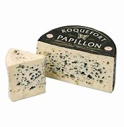
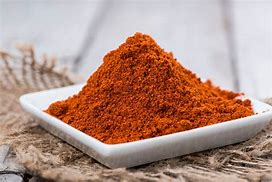

= Lesson 31
:toc:

---

== Section 1

Dialogue 1: +
Passenger: West London Air Terminal, please. I have to be there by 11:10.
Taxi Driver: I can't promise, but I'll do my best. +
Taxi Driver: You're just in time. Seventy pence, please. +
Passenger: Thanks a lot. Here's eighty pence. You can keep the change.

====
- air terminal :
1. a building at an airport that provides services for passengers travelling by plane （机场）候机大楼；机场大楼 +
2. ( BrE ) an office in a city from which passengers can catch buses to the airport 民航班车站（设在市区，向乘客提供民航班车去机场）
- just in time 正好；分秒不差 +
-> They arrived at the station *just in time*. 他们刚好及时赶到了火车站。

====

---

Dialogue 2: +
Passenger: Do you think you can get me to Victoria by half past? +
Taxi Driver: We should be OK if the lights are with us. +
Taxi Driver: You've still got five minutes to spare. Seventy pence, please. +
Passenger: Thanks very much indeed. Here's a pound, give me twenty pence, please.

====
-  half past : half 为 “……半”的意思，past “过了……”的意思，因此连在一起表示“……点半”。比如：half past 6 六点半
- be with us,站在我们同一边,支持我们 +
-> if the lights are with us  如果这些路灯都帮忙的话, 都是一路都是绿灯的话

- *spare (v.)~ sth/sb (for sb/sth) |~ (sb) sth* :to make sth such as time or money available to sb or for sth, especially when it requires an effort for you to do this 抽出；拨出；留出；匀出 +
-> I'd love to have a break, but I can't spare the time just now. 我是想休息一下，可眼下找不出时间。 +
-> We can only spare one room for you. 我们只能给你腾出一个房间。
====

---

Dialogue 3: +
Passenger: Piccadilly, please. I have an appointment at 10:30. +
Taxi Driver: I think we can make it if we *get a move on*. +
Taxi Driver: Here we are, sir. Eighty pence, please. +
Passenger: Many thanks. Let's call it a pound.

====
- Piccadilly 街道名
- get a move on : 快点;抓紧点
- Let's call it a pound （差不多一磅，）算一磅吧！
====

---

Dialogue 4: +
Passenger: Paddington, please. I want to catch the 11:15. +
Taxi Driver: We'll be all right if there are no hold-ups. +
Taxi Driver: This is it, sir. Seventy pence, please. +
Passenger: Thank you. Here's the fare, and this is for you. +

====
- hold-ups n. 停顿；耽误；劫持
- fare : the money that you pay to travel by bus, plane, taxi, etc. 车费；船费；飞机票价
====

---

== Section 2

==== A. Probability.

—No luck then, John? +
—Afraid not, sir. Not yet, anyhow. We're still checking on stolen cars. +
—Mm. +
—Where do you think he'll *head for*, sir? +
—Well, he definitely won't try to leave the country yet. He may try to get a passport, and
he'll certainly need clothes and money. He'll probably *get in touch with* Cornfield for those,
so I expect he'll *make for* Birmingham. +
—Right. I'll put some men on the house. +
—Yes, do that. Mind you, I doubt if he'll show up there *in person*. Hammond's no fool, you
know. I should think he'll probably telephone. +

====
- check on sb/sth : 核实，检查（是否一切正常）
- head for : V to go or cause to go (towards) 朝...进发
- get in touch with 与……联系；和……接触
- make for : VERB If you make for a place, you move toward it. 前往
- Mind you 听着, 请注意, 注意
- in person 亲自；亲身

- *PUT SB ˈONTO SB/STH* : 告诉；提供信息 / 向（警方等）揭发，告发，举报 +
-> Who put you onto this restaurant —it's great! 谁告诉你这家餐馆的？真棒极了！ +
-> What first put the police onto the scam? 警方当初怎么得知这个骗局的？
====

—What about his wife? +
—Mm. I shouldn't think he'll go anywhere near her —though he might get her to join him
after he's left the country. And when he does leave, he probably won't use a major airport,
either. So you'd better alert the coastguard, and keep an eye on the private airfields. +

—Right, sir. I'd better get his description circulated. +
—Yes. He may change his appearance, of course, but I don't expect he'll be able to do much about the tattoos ... And John —be careful. He could be armed. And if I know Hammond, he certainly won't *give himself up* without a fight.

====
- get sb to do：使某人做某事。
- either :
1. （用于否定词组后）也 +
-> Pete can't go and *I can't either*. 皮特不能去，我也不能 +
2. （补充时说）而且 +
-> I know a good Italian restaurant. It's not far from here, *either*. 我知道一家很好的意大利餐馆，而且离这儿不远。

-  the coastguard  :an official organization (in the US a branch of the armed forces) whose job is to watch the sea near a coast in order to help ships and people in trouble, and to stop people from breaking the law 海岸警卫队（在美国隶属于军队）
- airfield : an area of flat ground where *military or private planes* can take off and land飞机场

- give oneself up 自首,投降
- 好的，先生，我最好让大家都知道他的长相。 +
 是的。当然，他可能会改变他的外表，但我不认为他能对纹身做什么……还有约翰，小心点。他可能带着武器。以我对哈蒙德的了解，他肯定不会不战而降。
====

---

==== B. Job Hunting.

A lot of young people today find it difficult to get a job, especially in the first few months after they leave school. This is *much more* of a problem now *than* it has ever been in the past. In some parts of the country/ `主` sixty or even seventy per cent of young people in the last years of school `谓` will be without a job for a whole year after leaving school.

====
- job hunting 求职找工作
====

Our Jobs Information Service has been *in touch with* thousands of young people over the last two or three years, talking to them about their hopes and their fears, and we have in fact been able to give a lot of help and advice to young people who have just left school.

Are you recently out of school and still without a job? Or are you still at school and worried about getting a job when you leave? We have found that many people don't know who to talk to and sometimes don't know what questions to ask. That is why our experience at Jobs Information Service is so important. It will cost you nothing —just a phone call. If you would like to talk to us —and we are here to talk to you —then please phone 24987 any day between 9:00 and 5:30.

---

==== C. The Movies.

Man: I want to do something tonight for a change, let's go out. +
Brian: All right, let's go to the movies. +
Woman: In this heat? Are you joking? +
Brian: We can go to an outdoor movie. Do you think I'd suggest an indoor one in the middle of the summer in San Diego? +
Man: I'd rather go out for a meal. +
Woman: Yes, that sounds a better idea. The outdoor movies are so uncomfortable. +
Brian: Why don't we do both at the same time? We could pick up some take-away food and eat it in the movie. +
Man: That sounds like fun. What a good idea. +

====
- heat 温度 /炎热天气；（建筑物、车辆等中的）高温，热的环境 +
-> You should not go out in the heat of the day (= at the hottest time) . 你不应该在天最热的时候外出。
- take-away n. 熟食 /adj. 供应外带的；可带走的
====

Woman: But they never show any good films in the summer. At least not any of the new ones. All you get is the old classics. +
Brian: And what's wrong with them? +
Woman: Oh nothing, it's just that we've seen them all half a dozen times. +
Brian: But that's why they're classics. They're worth seeing again and again. +
Man: You've got a point there, Brian. My main objection to outdoor movies is that you can never hear properly. You hear all the traffic from outside. +
Brian: Well, we can find a foreign film with subtitles, then you don't need to hear the sound. +
Woman: Supposing it's a musical. +
Brian: Oh trust you to say that! I think it would be fun to sit watching an old film and eating a meal at the same time. +

====
- we've seen them all half a dozen times. 这些电影我们已经看过五六次了。
- objection (n.)~ (to sth/to doing sth) |~ (that...) : a reason why you do not like or are opposed to sth; a statement about this 反对的理由；反对；异议 +
->  I have no objection to him coming to stay. 我不反对他来小住。
- My main objection(n.) to outdoor movies is that you can never hear properly. You hear all the traffic from outside. 我反对户外电影的主要原因是你永远听不清楚。你只能听到外面的车流声。
- subtitle （电影或电视上的）字幕
- musical 音乐剧
- Oh trust you to say that!  哦，相信你会这么说的!
====

Woman: Last time I went to an outdoor movie, I bought a bar of chocolate to eat as I went in. It was a horror film /and I was *so* shocked /I just sat there holding my bar of chocolate until the interval /when I found it had melted(v.) in my hand /and run all down my dress. That was an expensive evening out. +
Man: Well, we won't go and see a horror film, darling, and take-away meals don't melt.

====
-  That was an expensive evening out.  那是一次昂贵的外出之夜。
====

---

==== D. Radio Program.

Presenter: Good evening and welcome to "Interesting Personalities." Tonight we've got a real treat *in store for* you. We have here in the studio Mrs. Annie Jarman of Bristol. +
Mrs. Jarman: Hello. That's me. +
Presenter: Say hello to the listeners, Mrs. Jarman. +
Mrs. Jarman: I just did. Hello again. +

====
- presenter（广播、电视）节目主持人 /演讲人；发言人
- personality  性格；个性；人格 / 性格鲜明的人；有突出个性的人 / 名人，风云人物（尤指娱乐界或体育界的） +
-> Their son is a real personality. 他们的儿子真是有个性。 +
-> a TV/sports personality 电视圈╱体育界名人

- *in store (for sb)* : waiting to happen to sb 即将发生（在某人身上）；等待着（某人） +
-> We don't know what life holds *in store for us*. 我们不知道等待我们的将是什么样的生活。 +
-> They think it'll be easy but they have a surprise *in store* . 他们以为事情容易，到时候他们会吃惊的。

- studio （广播、电视的）录音室，录像室，演播室，制作室；（音乐）录音棚
- Tonight we’ve got a real treat in store for you. We have here in the studio Mrs. Annie Jarman of Bristol.
今晚我们为你准备了真正的款待。我们请到了布里斯托尔的安妮·贾曼夫人。
====

Presenter: Now Mrs. Jarman is eighty-four years old. +
Mrs. Jarman: Nearly eighty-four. +
Presenter: Sorry, nearly eighty-four years old and she holds ... +
Mrs. Jarman: Not quite. +
Presenter: Yes, I explained. Now Mrs. Jarman holds the English record ... +
Mrs. Jarman: Eighty-three years, ten months and fifteen days. +
Presenter: Good, well, *now that* we've got that out of the way. Mrs. Jarman holds the English record for having failed her driving test the most times. +
Mrs. Jarman: I'm still trying. +
Presenter: Quite. Now precisely how many times have you failed your driving test, Mrs. Jarman? +

====
- Not quite 不完全, 那可未必, 不太
- Quite （表示赞同或理解）对，正是 +
-> ‘He's bound to feel shaken after his accident.’ ‘*Quite*.’ “那次事故之后，他一定是像惊弓之鸟。”“可不是。
====

Mrs. Jarman: Well, the last attempt last Wednesday brought it up to fifty-seven times. +
Presenter: Over how long a period? +
Mrs. Jarman: Twenty-eight years. +
Presenter: What do you think is the cause of this record number of failures? +
Mrs. Jarman: Bad driving. +
Presenter: Yes, quite. Well, it would be. But in what way do you drive badly? +
Mrs. Jarman: Every way. +
Presenter: Every way? +
Mrs. Jarman: Yes. I hit thing. That's the really big problem, but I'm working on that. Also I
can't *drive round* corners. Each time I come to a corner I just drive straight on. +
Presenter: Ah, yes, that would be a problem. +

====
- cause 原因；起因
- *work on sth*  努力改善（或完成） +
-> ‘Have you sorted out a babysitter yet?’ ‘No, but **I'm working on it**.’ “你找到临时看孩子的保姆了吗？”“还没有，我正在找呢。”
====

Mrs. Jarman: It causes havoc(n.) at roundabouts. +
Presenter: I can imagine. And how many examiners have you had in all this time? +
Mrs. Jarman: Fifty-seven. None of them would examine me twice. Several left the job, said it was too dangerous. One of them got out of the car at the end of the test, walked away and was never seen again. +

====
- havoc :  a situation in which there is a lot of damage, destruction or confusion 灾害；祸患；浩劫 +
-> Continuing strikes are beginning to *play havoc with* the national economy. 持续的罢工开始严重破坏国家经济。
- roundabout : ( NAmE also ˈtraffic circlero·tary ) a place where two or more roads meet, forming a circle that all traffic must go around in the same direction （交通）环岛 +
image:../img/roundabout.jpg[]

- examiner 主考人；考官
====

Presenter: Oh dear. But why do you drive so badly? +
Mrs. Jarman: I blame the examiners. It's all their fault. They don't do their job properly. +
Presenter: Really? In what way? +
Mrs. Jarman: They distract my attention. They keep talking to me. Turn left, turn right, park
here. By the time I've turned round to ask them what they said /we're half way through a
field /or slowly sinking into a pond surrounded by ducks. They should keep quiet /and let
me concentrate. +

====
- distract (v.) ~ sb/sth (from sth)  转移（注意力）；分散（思想）；使分心
- surround : (v.)  sth/sb (with sth)  围绕；环绕
- 等我转过身去问他们说了些什么时，我们已经穿过了一块田地的一半，或者正在慢慢沉入一个被鸭子包围的池塘。他们应该保持安静，让我集中注意力。
====

Presenter: But they have to tell you where to go, Mrs. Jarman. +
Mrs. Jarman: Then they should give me time to stop /each time before speaking to me.
Why do you think they have those notices(n.) on the buses, 'Do not speak to the driver', eh?
I'm surprised there aren't more accidents. +

====
- 那他们每次跟我说话之前, 都应该给我停下来的时间。你觉得他们为什么在公共汽车上贴“不要和司机说话”的告示呢?我很惊讶竟然没有更多的事故发生。
====

Presenter: How long do your tests(n.) usually last(v.), Mrs. Jarman? +
Mrs. Jarman: Two or three minutes. Not longer. They've usually jumped out by then. Except the last one. +
Presenter: And how long did that last? +
Mrs. Jarman: Four hours and twenty-five minutes, exactly, from beginning to end. +
Presenter: Four hours and twenty-five minutes? +
Mrs. Jarman: Yes. You see, I'd got on the motorway and as I told you I can't turn right or
left, so we didn't stop until I hit a post box just outside London. +
Presenter: And was the examiner still with you? +
Mrs. Jarman: Oh, yes, he'd fainted(v.) much earlier on. +

====
- How long do your tests(n.) usually last(v.)? 你的测验通常要持续多长时间?
- Except the last one 除了最后一个外.
- motorway （英国）高速公路
- post box 邮箱
- faint (v.)昏厥
- early on 在初期；在开始阶段；早先 +
-> I knew quite **early on **that I wanted to marry her. 我老早就知道我想娶她。
- 主考官还和你在一起吗? +
Jarman夫人:哦，是的，他早就昏倒了。
====

Presenter: Well, there we are. That's the end of "Interesting Personalities" for this week.
Thank you Mrs. Jarman for coming along and telling us about your experiences with cars. +
Mrs. Jarman: Can I just say a word? +
Presenter: Er ... yes. Go ahead. +
Mrs. Jarman: I'd just like to say /if there are any driving instructors(n.) in the Bristol area
listening in, well, I'd like to say thank you very much /and `主` my offer to pay(v.) double `谓` still *holds good* /if any of them will come back. Thank you. +
Presenter: Thank you, Mrs. Jarman, and good night. +
Mrs. Jarman: I won't give up. +

====
-  coming along  一起来 /偶然出现; 不期而至 +
-> There's a barbecue tonight and you're very welcome to come along.  今晚有个烧烤野餐，非常欢迎你一起来。
- instructor 教练; 导师
- hold good : to be true 正确；适用 +
-> The same argument does not *hold good* in every case. 同样的论点, 并非在所有的情况下都正确。
- 我想说的是，如果布里斯托尔地区有任何驾驶教练在听，我想说非常感谢，如果他们中有人回来的话，我付双倍的钱仍然有效。
====

---

== Section 3

==== A. A Little Crime.

`主` A psychiatrist who has studied the legend of Bonnie and Clyde `谓` compares the
characters of the two. +
Interviewer: So in your book why do you focus *more* on Bonnie *than* you have on Clyde? +
Shivel: Bonnie had something which Clyde completely lacked. Style. And she was also far
more intelligent than he was. Without her, there never would have a legend. He was just a
rather stupid hoodlum who got into difficult situations almost by accident and then started
shooting wildly. She was a much warmer, more generous person. +

====
- psychiatrist 精神病学家；精神科医生
- 一位研究过 Bonnie and Clyde 传说的精神病医生, 对这两个人物进行了比较。
- Bonnie 有 Clyde 完全没有的东西 -- 风格。她也比他聪明得多。
- rather （常用于表示轻微的批评、失望或惊讶）相当，在某种程度上 +
-> She fell and hurt her leg rather badly. 她跌倒了，腿伤得相当重。

- hoodlum   : ( also slang especially in NAmE also hood ) a violent criminal, especially one who is part of a gang 暴徒，恶棍（尤指属于某团伙者） /a violent and noisy young man 小阿飞；小流氓
====

Interviewer: But she could be very ruthless(a.), couldn't she? I mean what about that
policeman she shot in Grapevine, Texas? Didn't she laugh about it? +
Shivel: Well, first of all, we don't know if that's what actually happened. A farmer says he
saw her shoot the second policeman and then laugh. That's the only evidence we have
that she actually did that. But even if the story is true, the whole incident illustrates(v.) *this
warmer, almost motherly(a.), side* to her character. +

====
- ruthless (a.)残酷无情的；残忍的
- That's the only evidence we have
that she actually did that. 这是我们掌握的唯一证据证明她真的这么做了。 +
- motherly (a.)慈母般的；母亲的
但即使这个故事是真的，整个事件也显示出了她性格中更温暖、更像母亲的一面。
====

Interviewer: Motherly? How does the incident of shooting a policeman illustrate that she
was motherly? +
Shivel: Well ... uh ... just let me finish. You see, the day before the shooting, Bonnie and
Clyde were driving about with a pet rabbit in the car. Bonnie's pet rabbit. Clyde started
complaining because the rabbit stank(v.). So they stopped and washed the rabbit in a stream.
The rabbit almost died because of the shock of the very cold water. Bonnie got very
worried, and wrapped the rabbit in a blanket and held it close to her as they drove on.
Then, the next morning, when the rabbit still wasn't any better, she made Clyde stop and
build a fire. She was sitting in front of that fire, trying to get the rabbit warm when the two
policemen drove up and got out. Probably the policemen had no idea who was there.

====
- about  在…到处；在…各处 /在…四处 +
-> We wandered about the town for an hour or so. 我们在城里到处游逛了一个小时左右

- stink (v.)有臭味；有难闻的气味 /to seem very bad, unpleasant or dishonest 让人觉得很糟糕；令人厌恶；似乎有不正当行为 +
=> stink的同源词是stench（臭气），这就很像drink（喝）和drench（浸湿）同源一样。 它音似单词sting（刺），臭味是一种刺激性的气味。 +
-> It stinks(v.) of smoke in here. 这儿有股烟味。 +
-> The whole business stank of corruption. 这件事从头到尾都有腐败嫌疑。  +
-> ‘What do you think of the idea?’ ‘*I think it stinks* .’ “你觉得这个主意怎么样？”“我觉得是个馊主意。”

- stream 小河；溪
- 那只兔子差点被冰冷的水吓死。邦妮非常担心，用毯子把兔子裹了起来，紧紧地抱在怀里，继续赶路。
- drove up  开车赶到
====

They just wanted to see who was burning a fire and why. A moment later, as we know,
they were both dead. All because of that pet rabbit which Bonnie wanted to mother(v.).
And ...uh ... perhaps ... in a strange way, Clyde was something like a pet rabbit, too. She
was attracted to him /because he was weaker than she was /and needed someone to mother him. It’s strange, you know, but strong, intelligent women are often attracted to such men ... weaker than they are ... men who are like children, or pet rabbits.

====
- mother (v.)to care for sb/sth because you are their mother, or as if you were their mother 给以母亲的关爱；像母亲般地照顾
-
====

---

==== B. Psychiatrist.

Psychiatrist: Goodbye Mr. er ... um ... er ... Just keep taking those tablets(n.) and you'll be all
right *in no time*. Next please. Good morning, Mrs. er ... your first visit, is it? +
Mrs. Parkinson: Yes, doctor. +
Psychiatrist: I see. Well, let me just *fill in* this form. Name? +
Mrs. Parkinson: Parkinson. Enid Parkinson. (Crunch) Mrs. +

====
- in no time 立即, 立刻, 马上, 很快
- crunch  压碎声；碎裂声
====

Psychiatrist: So you're married, Mrs. Parkinson. +
Mrs. Parkinson: (Crunch) Yes. +
Psychiatrist: I see. Now, your date of birth, please. +
Mrs. Parkinson: Wednesday the twelfth of June. +
Psychiatrist: No, not your birthday, Mrs. Parkinson. Your date of birth. +
Mrs. Parkinson: (Crunch) Twelfth of June 1946. But not a word to my husband, mind, he thinks it was 1956. +
Psychiatrist: 1946. Right. Now, What seems to be the trouble? +

====
- twelfth 第十二的，第十二个的；十二分之一的
- But not a word to my husband 但别告诉我丈夫，记住。
====

Mrs. Parkinson: (Crunch) Well, it's nothing very much, doctor. It's just that (crunch) I can't
stop (crunch) eating these crisps(n.) (crunch). +
Psychiatrist: Yes, I had noticed that you seemed to be *getting through* rather a lot of them.
Er ... do you mind picking up those two empty bags off the floor, please? Thank you. Now,
when did this problem start? +
Mrs. Parkinson: (Crunch) About six months ago. My husband and I won a. huge box of
crisps in a talent competition. And we've not been able (crunch) to stop eating them ever
since. It's costing us a fortune. (Crunch) +

====
- crisp 油炸土豆片，炸薯片（有多种风味，袋装）
- get through : If you get through a task or an amount of work, especially when it is difficult, you complete it. 完成; 干完（尤指难做的任务或工作）; 熬过（困难或不快的时期）; 消耗（大量某物）/（法案、提案）正式通过 +
->  I think you can get through the first two chapters.
 我想你能完成前两章。
- talent ~ (for sth) 天才；天资；天赋 +
-> a talent competition/contest/show (= in which people perform, to show how well they can sing, dance, etc.) 才艺选拔赛╱大奖赛╱演出
====

Psychiatrist: I see. Now, what do you think about when you're eating these crisps? +
Mrs. Parkinson: More (crunch) crisps. +
Psychiatrist: I see. And what do the crisps remind you of? +
Mrs. Parkinson: (Crunch) Potatoes. (Crunch) Potato crisps. (Crunch) All nice, crisp(a.) and
golden brown with plenty of salt on them. +
Psychiatrist: I see. But don't they remind you of anything else? +
Mrs. Parkinson: (Crunch) Cheese. Cheese crisps. Cheddar crisps. Roquefort crisps. Edam crisps. Oh, I'd definitely say they remind me of cheese. +
Psychiatrist: Yes, they certainly seem to do that. Does anything else come to mind when you're eating these vast amounts of crisps? +
Mrs. Parkinson: Not much, apart from crisps, doctor. (Crunch) If I'm really *on form* /I can *work up* an appetite for, oh, paprika crisps, or shrimp crisps or even ham and bacon crisps. +

====
- crisp (a.)(食物)脆的；酥脆的
- Cheddar :  ( ˌCheddar ˈcheese ) [ U ] a type of hard yellow cheese 切德干酪（一种黄色硬奶酪）
- Roquefort [ U ] a type of soft French cheese with blue marks and a strong flavour 罗克福尔干酪（浓味的法国蓝斑软干酪） +

- definitely  确切地；明确地；清楚地 +
-> Please say definitely whether you will be coming or not. 请说清楚，你来还是不来。
- on form 发挥正常水平；精力充沛

- form [ U ] ( BrE ) how fit and healthy sb is; the state of being fit and healthy 体能；良好的健康状态 +
-> I really need to *get back in form* . 我实在需要恢复状态。 +
-> The horse was clearly *out of form* . 这匹马显然状态不佳。

- work sth up : to develop or improve sth with some effort 逐步发展；努力改进 +
-> She went for a long walk to work up an appetite. 她为了增加食欲散了很长时间的步。

- paprika 红辣椒粉 +

- shrimp 虾；小虾
====

Psychiatrist: And have you made any effort to stop eating these crisps? +
Mrs. Parkinson: Oh, no. I wouldn't want to (crunch) eat anything else. I like my crisps. +
Psychiatrist: But if you don't want to stop eating them, why come to a psychiatrist? +
Mrs. Parkinson: (Crunch) Well, it's the noise, doctor. (Crunch) My husband complains he
can't hear the telly(n.). And the neighbors bang on the walls late at night. (Crunch) Say they
can't sleep. I've offered them a whole box so that ... so that they can do the same, but +
(crunch) they say they'd rather sleep. +

====
- telly  电视机 /电视节目 +
-> daytime telly 日间电视节目
====

Psychiatrist: I should have thought earplugs would have been a more sensible thing to offer them. +
Mrs. Parkinson: Earplugs! That's it! The problem's solved. (Crunch) Thank you. Thank you very much, doctor. +
Psychiatrist: Er ... Mrs ... um ... +
Mrs. Parkinson: Parkinson. +
Psychiatrist: Parkinson, yes. Er ... could I have a crisp? +
Mrs. Parkinson: Certainly, (crunch) doctor. Here, have a couple of bags. +
Psychiatrist: Oh, thank you, Mrs. Parkinson. Oh, paprika with cheese. (Crunch) Thank you so much and good day. (Crunch, crunch, crunch, crunch, crunch)

====
- earplug 耳塞（用以挡噪音、防水）
- Here, have a couple of bags.  给，拿几个包。
====

---
