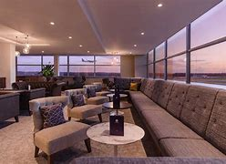
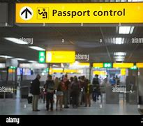
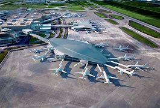
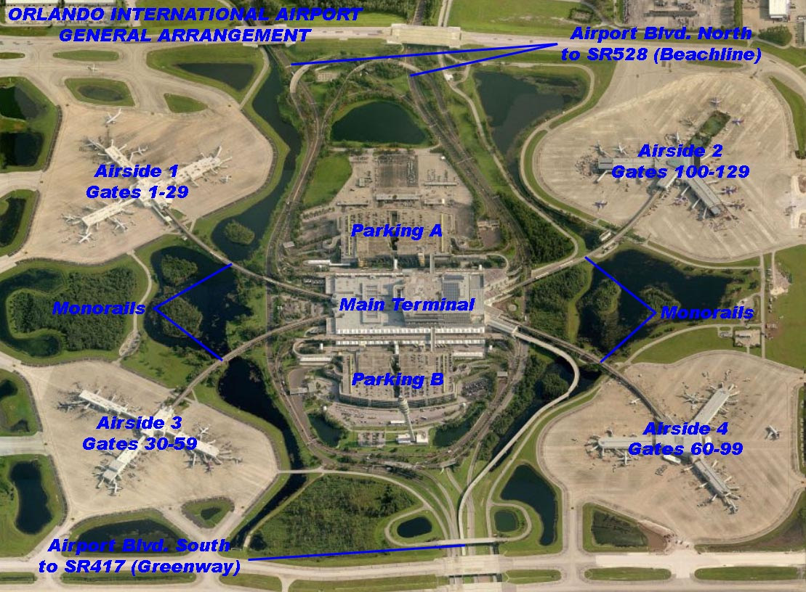
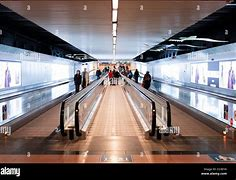
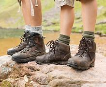
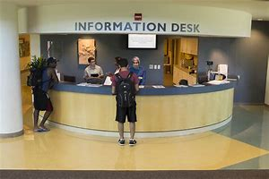
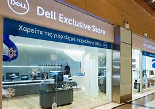
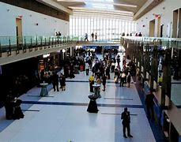

= Lesson 33
:toc: left
:toclevels: 3
:sectnums:
:stylesheet: ../../+ 000 eng选/美国高中历史教材 American History ： From Pre-Columbian to the New Millennium/myAdocCss.css

'''

== Section 1

==== News Item 1:

Actress Virginia Darlington, who plays Judy in the TV *soap opera* 肥皂剧 Texas, got married yesterday surrounded by armed bodyguards (受雇的)保镖，警卫（队） at the most luxurious hotel in Texas, the Mansion 公馆；宅第. The 39-year-old star *exchanged* 交换；交流；掉换 vows (n.) （尤指宗教的）誓，誓言，誓约 *with* *plastic surgeon* 整形外科医生 Henry Jones under a bough 大树枝 of ivy 常春藤 and gardenias 栀子, wearing a wedding-dress 婚纱 designed by Britain’s Saunders. Because this is the second time she has married a flautist 长笛手 marked (v.)纪念；庆贺 the celebrations 庆典；庆祝活动 by playing 'Love is Wonderful *the Second Time Around* 转弯；掉转；掉头. 第二次, 第二回合.'

[.my2]
因为这是她第二次嫁给长笛演奏家，为了庆祝这场庆典，她演奏了“第二次爱是美妙的”。

[.my1]
.案例
====

.gardenia
/ɡɑːrˈdiːniə/  栀子 +
image:../img/gardenia.jpg[,10%]
====

---

==== News Item 2:

The Football Association 协会；社团；联盟 Secretary  秘书,助理,部长 Mr. John Gamer says he’s delighted with the decision to lift the worldwide ban on English soccer clubs. As a result of serious incidents of hooliganism 流氓行为 in European and international matches  比赛, football’s international *ruling body* FIFA decided last June that English teams should not be allowed to play outside Britain. FIFA announced its new decision *to lift the* worldwide *ban* this morning, but the ban on European matches still stands. Now, the Football Association Secretary says it’s *up to* 直到 the English fans to improve themselves /and if they do behave (v.)表现得体；有礼貌 /the ban could be lifted *in as short a time as twelve months*.

[.my2]
====
足球协会秘书John Gamer先生表示，他对解除对英国足球俱乐部的全球禁令的决定, 感到高兴。由于在欧洲和国际比赛中发生了严重的足球流氓事件，足球的国际统治机构国际足联, 去年6月决定，不允许英格兰球队在英国以外的地方比赛。国际足联今天早上宣布了取消全球禁赛的新决定，但对欧洲比赛的禁令仍然有效。现在，英足总秘书表示，这取决于英国球迷的自我提高，如果他们表现良好，禁令可能会在12个月内解除。
====

---

==== News Item 3:

A group of twelve women are working hard to become the first all-female crew （轮船、飞机等上面不包括高级职员的）全体船员，全体工作人员 to sail around the world. At the moment 现在，当前时间 the crew are busy trying to raise 筹募；征集；召集；组建 the three hundred and fifty thousand pounds needed to buy and equip a sixty-two foot yacht to make the record attempt 企图；试图；尝试. As part of their fund-raising (n.)筹募基金活动 the crew have been repainting 重新绘制；重涂 the famous boat Gipsy Moth 飞蛾 4, *on show* at Greenwich, which has raised one thousand two hundred and fifty pounds from the British Yachting Association 游艇协会. The crew are also busy training to get ship-shape 整齐而状况良好的,井井有条的 for their round-the-world sailing race which starts in September. The crew skipper (小型商船或渔船的) 船长 says she doesn’t think the fact the crew are all women *will lessen (v.)（使）缩小，（使）减少 their chances of winning*.

[.my2]
====
一组12名女性正在努力成为第一个全女性环球航行的全体船员。目前，船员们正忙着筹集35万英镑，购买并装备一艘62英尺长的游艇，以创造纪录。作为筹款的一部分，船员们一直在重新粉刷著名的帆船“吉普赛蛾4号”，这艘船在格林威治展出，从英国游艇协会筹集了1500英镑。船员们也在忙于训练，为九月份开始的环球帆船赛做好准备。船长说，她不认为全体船员都是女性的事实, 会减少她们获胜的机会。
====

---

== Section 2

==== A. Eskimos 爱斯基摩人（Eskimo 的复数）.

— Well, it's got two big wheels *one behind the other*, and there's a kind of metal frame between the wheels that holds them together. And there's a little seat above the back wheel that you can sit on, and above the front wheel there's a sort of metal bar that sticks out on both sides. And you sit on the seat you see, and you *put your hands on* this metal bar thing — and the whole thing moves forwards — it's amazing. +
— What makes it move forward, then? +
— Ah well, in the middle you see, between the two wheels, there are these other bits 小量；小块;（事物的）一部分，一段 of metal and you can *put your feet on* these and *turn them round* and that makes the wheels go round. +
— Hang on 紧紧抓住,等一会儿 — if it's only got two wheels why doesn't the whole thing *fall over* 倒下? +
— Well, you see, um, well I'm not sure actually ... +

[.my2]
====
爱斯基摩人。 +
-嗯，它有两个大轮子，一个在另一个后面，轮子之间有一种金属框架把它们固定在一起。在后轮上面有一个小座位，你可以坐在上面，在前轮上面有一个金属条，在两边伸出来。你坐在座位上，把你的手放在这个金属棒上，整个东西就会向前移动，太神奇了。 +
那是什么让它向前发展的呢? +
-嗯，在中间，你看，在两个轮子之间，还有一些其他的金属片，你可以把脚放在这些金属片上，转动它们，这样轮子就转动了。+
-等一下，如果它只有两个轮子，为什么不会整个倒下来? +
-嗯，你看，嗯，其实我不确定… +

====

---

==== B. Shoplifting (n.)入店行窃.

Speaker A: Well, to be honest, I'm not sure what I would have done. I mean, it would have depended on various things. +
Interviewer 主持面试者；采访者: On what, for instance? +
Speaker A: Well, on ... hmm ... on how valuable the things the boys stole were. The text doesn't ... it doesn't say whether they had just stolen *a tin  罐；罐头盒 of* peas or something like that. So, I can't really say ... except well, ... I think *I would have told* the shopkeeper *if* they had stolen something really valuable. Otherwise, I suppose I would have just ... I don't know ... minded my own business, I suppose. +

[.my1]
====

.would have done
虚拟语气

-  *I would have done……, but…… 我本想做……但由于一些原因，没有做成* +
l would have called, but there was no phone service.我本来想给你打电话，但那里没有电话服务。

- **I would have done…… if sth had done…… 如果那时……我就会…… (现实情况是：假设的情况没有发生，我也没有那样做) ** +
- *I wouldn't have done....if sth had done.... 如果那时……我就不会……(现实情况是：假设的情况没有发生)* +
lf I had worked hard, I wouldn't have failed the final exam. 如果我好好学习了，我就不会挂科了。(现实情况:没好好学习，挂科了)
====

Speaker B: Well, I think it's quite clear *what I should have done*. The boys had broken the law. You can't allow that sort of thing to go on, can you? After all, it affects all of us. If you let boys or anybody else *get away with* 逃脱惩罚 theft, they'll just go on stealing! So, I think the woman *should have told* —what's his name? —the shopkeeper. +
Interviewer: Mr. Patel. +

[.my1]
====
.*should have done*
表示**过去本应该做某事，但实际没做** +
You should have told her the truth.你本应该告诉她真相。 +
You shouldn't have told her the truth.你本不应该告诉她真相。

====

Speaker B: Patel. She *should have* told him /and [if necessary] she *should have* held the boys while he got the police, or she *should have* gone for the police herself. +
Interviewer: So you're saying that *that's what you would have done*? +
Speaker B: Exactly. If I had been in that situation, that's exactly what I would have done. +
At least ... at least, that's what I ought to have done. That's what I hope I would have done. +

[.my2]
====
入店行窃。

说话者A:嗯，老实说，我不确定我会怎么做。我的意思是，这取决于很多事情。 +
采访者:比如说，关于什么? +
主讲人A:嗯，就……嗯…孩子们偷的东西有多值钱。文本没有…上面没说他们是不是偷了一罐豌豆之类的东西。
所以，我真的不能说…除了……如果他们真的偷了贵重的东西，我想我会告诉店主的。否则，我想我会……我不知道……
我想是我自己的事吧。 +
说话者B:嗯，我想我应该怎么做已经很清楚了。这些男孩触犯了法律。你不能让这种事情继续下去，对吧?毕竟，它影响着我们所有人。如果你让男孩子或其他人偷东西不受惩罚吧，他们只会继续偷!所以，我觉得那个女人应该告诉我——他叫什么名字?——店主。 +
采访者:帕特尔先生。 +
发言人B:帕特尔。她应该告诉他，如果有必要的话，她应该在他去叫警察的时候抓住孩子们，或者她自己去叫警察。 +
采访者:所以你是说你会这么做? +
说话者B:没错。如果我在那种情况下，我也会这么做。 +
至少……至少，那是我应该做的。我也希望我能这么做。 +

====

---

==== C. Frogs.

Fred: A funny thing happened to me the other night. +
Man: Oh, yes? What happened, Fred? +
Fred: Well, you know I usually go out for a walk every night just *after dark* 天黑以后. Well, I was out *the other night* 最近的某个晚上,前两天的夜里 taking my usual walk and I heard a funny noise coming out of the *building site* 建筑工地 down the road, you know, the one where they *dug a big hole* lately. Going to *make it into* 把...做成..., 使转变为 an underground garage 地下停车库, I believe. +
Man: Yes, I know it, go on. +
Fred: Well, as I said, I heard this funny noise and I thought perhaps there was a kid down there, you know how kids go playing on building sites. But *as I got nearer* I could tell it wasn't a kid, it sounded more like an animal. I thought it must be some dog or cat that had got itself trapped 使落入险境,陷阱；使陷入困境 or something. +
Man: So, what did you do? +
Fred: Well, I *went down there* to investigate. I climbed down, ruined my trousers *because of* all the mud. You see it had been raining heavily for three or four days. +
Man: Yeah. +
Fred: Well, when I got down there I found the hole was full of water and the water was full of frogs. +
Man: Frogs? +
Fred: Yes. You know, those green things that jump up and down and go croak 发出（像青蛙的）低沉沙哑声；呱呱地叫 croak. So I thought '*What are they going to do* when the bulldozers 推土机 come to work tomorrow?' So I climbed back out, went home and got some plastic bags, big ones, like *you use for the rubbish*. +
Man: What for? +
Fred: I'll tell you. I went back and started collecting the frogs and putting them into the plastic bags. I thought I'd take them to the pond in the park. They'd be happy there. +
Man: I suppose they would. +
Fred: *Next thing I know* there are sirens (n.)汽笛；警报器 screaming and bright lights everywhere. +
Man: *What was going on* 发生什么事了 then? +
Fred: It was the police. Two cars full of police with flashlights 手电筒 and dogs. Somebody had reported seeing me going into the building site and thought I was a burglar 破门盗贼；入室窃贼. +
Man: Well, what happened? +
Fred: They put me in one of the cars and *took me down* 打败某人;拉某人下马, 制服某人，将其绳之以法 to the Station. +
Man: Why didn't you tell them what you were doing? +
Fred: I tried to in the car, but they just told me I would have to talk to the inspector （警察）巡官;检查员；视察员；巡视员 on duty. Luckily I still had one of the bags on me full of frogs. A couple of them got out while the inspector was questioning me and you can imagine what it was like trying to catch them. +
Man: So what happened in the end? +
Fred: Oh, the inspector *turned out to be* 结果是；证明是,被发现是 a bit of 一点点；一些 an animal lover himself /and he sent the two cars back to the building site /and told his men to help me collect all the frogs. We did that /and then they drove me home /and I *invited* them all *in* for a cup of tea /and we all had a good laugh. +
Man: Well, I never. If you wrote that in a book /they'd say you made it up. +

[.my2]
====
青蛙。

弗雷德:那天晚上我遇到了一件有趣的事情。 +
男:哦，是吗?发生什么事了，弗雷德? +
弗雷德:嗯，你知道我每天晚上天黑后都会出去散步。嗯，有一天晚上, 我像往常一样出去散步，我听到一个奇怪的声音从路那头的建筑工地传来，你知道的，就是最近他们在那里挖了一个大洞的地方。我相信它会被放进地下车库。 +
男:是的，我知道，接着说。 +
弗雷德:就像我说的，我听到了奇怪的声音，我想可能是有孩子在下面，你知道孩子们都在建筑工地玩耍。但当我走近时，我知道那不是一个孩子，听起来更像是一只动物。我想一定是什么狗或猫被困住了。 +
男:那么，你做了什么? +
弗雷德:嗯，我去那里调查了一下。我爬了下来，把裤子都弄脏了。你看，大雨已经下了三四天了。 +
男:是的。 +
弗雷德:嗯，我下去的时候发现洞里全是水，水里全是青蛙。 +
男:青蛙吗? +
弗雷德:是的。你知道的，那些绿色的东西上蹦下跳，呱呱呱呱。所以我想，‘明天推土机来的时候他们会怎么做?’所以我爬了出来，回家拿了一些塑料袋，就像你用来装垃圾的那种大塑料袋。 +
男:为什么? +
弗雷德:我来告诉你。我回去开始收集青蛙，把它们放进塑料袋里。我想带他们去公园的池塘。他们在那里会很开心的。 +
男:我想他们会。 +
弗雷德:接下来我所知道的就是到处都是警笛尖叫和明亮的灯光。 +
男:当时发生了什么事? +
弗雷德:是警察。两辆车里都是拿着手电筒和警犬的警察。有人报告说看到我进入建筑工地，以为我是窃贼。 +
男:发生什么事了? +
弗雷德:他们把我放在一辆车里，把我带到车站。 +
男:你为什么不告诉他们你在做什么? +
弗雷德:我在车上试过，但是他们告诉我，我必须和值班的检查员谈谈。
幸运的是，我身上还有一个装满青蛙的袋子。当探长审问我的时候, 有几个青蛙跑了出来, 你可以想象抓到他们是什么感觉。 +
男:那最后发生了什么? +
弗雷德:哦，原来检查员自己也是个动物爱好者，他把那两辆车开回工地，让他的手下帮我收集所有的青蛙。我们这样做了，然后他们开车送我回家，我邀请他们都进来喝杯茶，我们都笑得很开心。 +
男:嗯，我从来没有。如果你把这些写进书里，他们会说你瞎编的。 +

====

---

==== D. Newspaper Editors.

A newspaper has a complex hierarchy 等级制度（尤指社会或组织）. The easiest way to show this is in the form of a chart.

At the top of the chart there are four major positions. These are the Executive 行政领导，领导层 Editor, who talks to the unions 工会,同盟,联邦 and deals with legal 与法律有关的；法律的 and financial questions. Then there is the actual  真实的；实际的 Editor of the paper and his deputy 副手；副职；代理. The Editor makes decisions about what goes into the paper. The deputy has close contact with 与……密切接触 *the House of Commons* 下议院 and the political content 政治内容. Finally there is the Managing Editor, who sees that everything runs smoothly.

Below this there are three Assistant 助理；助手 Editors and the heads of the five departments. Each of the three Assistant Editors has a different responsibility. For example, one is responsible for design. The five departments are City News, which deals with financial matters, then the Home, Foreign, Sports and Features 特色；特征；特点; （报章、电视等的）特写，专题节目. Features are the special sections including films, books and the Woman’s page. So on the second level there are three Assistant Editors and the five Department Heads. Also on this level is the Night Editor 夜班编缉. He looks after 负责照管 the paper, especially the front page, in the afternoon and evening, preparing material for publication the next morning.

Below the second level there are the reporters and specialists 专家, who write the reports and articles, and the sub-editors 副编辑, who check and prepare the copy for the printer. There is also full secretarial 秘书的，有关秘书工作的 back-up 援助，帮助；后备人员.

[.my2]
====
报纸编辑。

报纸有复杂的等级制度。最简单的方法就是用图表的形式来表示。

在图表的顶端有四个主要位置。 +
-> 这些是执行编辑，他们与工会谈判, 并处理法律和财务问题。 +
-> 然后是报纸真正的编辑和他的副手。编辑决定报纸的内容。议员与下议院的政治内容有着密切的联系。 +
-> 最后是总编辑，他负责确保一切顺利进行。 +

下面是三位助理编辑和五个部门的负责人。 +
-> 三位助理编辑各有不同的职责。例如，一个人负责设计。 +
-> 五个部门分别是处理财经事务的城市新闻，然后是国内、国外、体育和专题。特色是特别的部分，包括电影、书籍和女性页面。 +
第二层有三位助理编辑和五位部门主管。在这个关卡中还有Night Editor。他在下午和晚上照看报纸，尤其是头版，准备第二天早上出版的材料。 +
在第二层以下的是记者和专家，他们负责撰写报道和文章，还有副编辑，他们负责检查和准备打印稿件。还有完整的秘书支持。

====

---

== Section 3

==== A. A Tour of the Airport.

This lift 电梯；升降机 is taking us to departures 离开；起程；出发 on the first floor.

We are now in departures. Arrivals and departures are carefully separated, as you have seen. Just to the left here we find a 24-hour banking service, and one of three skyshops 店名而已 on this floor —there are two in *the departure lounge* （机场等的）等候室. And here, as you can see, you can buy newspapers, magazines, confectionery  甜食（糖果、巧克力等）, souvenirs 纪念品 and books. If you will *turn around* 转向反方向 now and look in front of you, you can see the seventy-two *check-in  登机手续办理处 desks*, sixty-four of which are for British Airways. The airline desks, for enquiries 询问，打听, are next to the entrances on the far left 最左边 and far right, and straight ahead is the entrance to *the departure lounge* 候机室 and *passport control* 护照检查. Shall we go airside 机场空侧（专供机场和航空公司工作人员通行）；登机区（通过安全检查、护照检验等后进入的机场）；机场周边活动区?

[.my1]
====
.lounge

.confectionery

.passport control

.airside +

====

We have now cleared （无接触地）跃过，越过，通过 passport control and security, and you can see that security is very tight 严密的；严格的；严厉的 indeed. You are about to enter a departure lounge which is a quarter of a mile in length. But don’t worry. There are *moving walkways* 移动人行道 the length of the building, so you don’t have to put on your *hiking 远足；徒步旅行 boots* 徒步旅行靴.

[.my1]
====

.moving walkways

.hiking boots

====

Straight ahead of you is a painting by Brendan Neiland. As you can see it is a painting of Terminal 4  航空站；航空终点站 and it measures (v.)（指尺寸、长短、数量等）量度为 twenty feet by eight feet. On the other side of it are the airline *information desks* 服务台，问询处. Let’s walk around 四处走动；绕走 to those. Now, if you face the windows you can see *the duty-free 免关税的 shops*. There is one on your left and one on your right. They have been decorated to a very high standard, to make you feel like you are shopping in London’s most *exclusive （个人或集体）专用的，专有的，独有的，独占的  shops* 专卖店. The duty-free shops sell the usual things but they also have outlets 出口；排放管; 专营店；经销店  for fine wines and quality cigars.

[.my1]
====
.information desk

.exclusive shop

====

If we turn to the right and walk along in front of the duty-free shops, we will come to a buffet 自助餐 and bar opposite. You see, this one is called the Fourth Man Inn （通常指乡村的，常可夜宿的）小酒店,小旅馆，客栈  — all the bars, restaurants and cafeterias 自助餐厅；自助食堂 have names (n.) including the number four /and many of them have jokey  逗乐的；可笑的；滑稽的  signboards （商店、旅馆等的）招牌，告示牌，广告牌  like this one, *to brighten (v.) up* a traveller’s day.

If we turn left out of here and go back along the concourse  （尤指机场或火车站的）大厅，广场, we come to the plan-ahead  提前计划 insurance desk, on the far side of the first duty-free shop, with public telephones alongside. Notice that here we can see what is going on outside, through the windows. Opposite the insurance desk, next to the other duty-free shop, is the international telephone bureau 办事处，办公室，机构;（美国政府部门）局，处，科. Let’s just go across 横穿，横过 there. Across from this duty-free shop is an area just like the one we have just seen, with a buffet 自助餐,（火车）饮食柜台；（车站）快餐部, bar and skyshops, and now let’s go along  继续前进 the moving walkway to the gates, shall we?

[.my1]
====
.concourse

====

[.my2]
====
机场之旅

电梯会把我们带到一楼的出入口。

我们现在在出发。正如你所看到的，到达和离开是小心分开的。就在这里的左边，我们可以看到24小时营业的银行服务，这层楼有三间空中商店，其中一间在候机室。在这里，你可以买到报纸、杂志、糖果、纪念品和书籍。如果您现在转过身来，看看前方，您可以看到72个值机柜台，其中64个是英国航空公司的。航空公司的咨询台位于最左边和最右边的入口旁边，正前方是候机室和护照检查处的入口。我们去空中好吗?

我们现在已经通过了护照检查和安全检查，你可以看到安全措施确实非常严格。您即将进入一个候机室，长四分之一英里。不过别担心。有和大楼一样长的移动走道，所以你不必穿登山靴。

你的正前方是Brendan Neiland的一幅画。正如你所看到的，这是一幅4号航站楼的油画，它长20英尺，宽8英尺。另一边是航空公司的问讯处。我们来看看这些。现在，如果你面向窗户，你可以看到免税店。一个在你的左边，一个在你的右边。它们的装饰非常高标准，让你感觉你是在伦敦最高档的商店里购物。免税店出售一般的东西，但也有高档葡萄酒和优质雪茄的经销点。

如果我们向右拐，从免税店前面往前走，对面就是自助餐厅和酒吧。你看，这个叫“第四人旅馆”——所有的酒吧、餐馆和自助餐厅的名字里都有数字“4”，其中许多都有像这样有趣的招牌，以照亮旅行者的一天。

如果我们从这里左转，沿着广场往回走，就会来到提前投保柜台，在第一家免税店的另一边，旁边有公用电话。注意，在这里我们可以通过窗户看到外面发生的事情。保险柜台对面，另一家免税店旁边是国际电话局。我们到那边去吧。免税店对面是一个和我们刚才看到的一样的区域，有自助餐厅、酒吧和空中商店，现在让我们沿着移动通道去大门，好吗?
====

---

==== B. Lost Handbag.

Mary Jones: Excuse me. Excuse me. +
Man: Yes, madam? +
Mary Jones: Can you help me. Please, look, I'm desperate （因绝望而）不惜冒险的，不顾一切的，拼命的;非常需要；极想；渴望. *Are you responsible for* lost property? +
Man: Yes, I am. +
Mary Jones: Well, *I've got something to report*. +

[.my1]
====
.I've got
表示拥有某个物品, 或经历了某个情况。**在口语中，这个短语**通常用于表达个人的感受或状态，**而且这个短语通常用于肯定句，否定句和疑问句中。 +
*I've got* a headache. (我头疼。) +
*Have you got* any plans for the weekend? (你周末有什么安排吗？) +
*She's got* a lot of experience. (她有很多经验。)
====

Man: What is it you've lost? +
Mary Jones: I've lost my handbag. +
Man: Your handbag? +
Mary Jones: Well, it's terrible. I don't know what to do. +
Man: Where did you lose your handbag, madam? +
Mary Jones: On the train, on the train. Look, we've got to stop the train. +
Man: Which train? +
Mary Jones: I've just come off the tube 伦敦地下铁道, this last train, in from Paddington 帕丁顿 (伦敦西敏市的一个地区). +
Man: Yes, the last train tonight. There isn't another one. +
Mary Jones: On the circle line 环线, on the circle line. +
Man: Yes, yes. +
Mary Jones: Oh, it's terrible. We haven't got much time, I mean I have got so many
valuable things in that bag. +
Man: Will you ... will you please explain ... +
Mary Jones: I was asleep on the train. I must have *dropped off* 睡着. I woke up, almost missed my station, so I rushed off the train and then I realized my handbag was still on it. +
Man: Yes? +
Mary Jones: By that time the doors were shut and it was too late. +
Man: So your handbag is still on the train.
Mary Jones; It's on the train travelling 巡回的；流动的 ... +
Man: Yes. All right. All right, just a moment. Now, can I have your name and address? +
Mary Jones: Well, look the thing I've got to tell you is that there's money in that handbag. +
Man: Yes, we realize this, madam. We need your name and address first. +
Mary Jones: OK. My name's Mary Jones. +
Man: Mary Jones. Address? +
Mary Jones: 16 ... +
Man: 16 ... +
Mary Jones: Craven 胆小的；胆怯的；怯懦的 Road. +
Man: Craven Road. That's C-R-A-V-E-N? +
Mary Jones: Yes. +
Man: Now, can you tell me exactly what was in the handbag? +
Mary Jones: Well, there was money ... +
Man: How much? +
Mary Jones: Nearly thirty pounds. I had my *driving licence* ... +
Man: So, thirty pounds, driving licence, yes ... +
Mary Jones: I had my keys, and I had the office keys, they'll kill me when I go to work
tomorrow, and I'd just been to the travel agent 旅行社,旅行代办人；旅行代理商, I had my ticket to Athens 雅典（希腊首都） ... +
Man: Just ... *just one moment* 稍等片刻. House and office keys, ticket to Athens. +
Mary Jones: Yes, hurry please. You've got to phone the next station... +
Man: Yes, all right, just a moment. Anything else? +
Mary Jones: I had my season ticket. +
Man: Your season ticket for travelling on the tube. +
Mary Jones: And a very expensive bottle of perfume, and ... and ... and I had a ... +
Man: Yes, well, I'll get the guard to look in ... the train ...

[.my2]
====
丢失的手提包。 +
玛丽·琼斯:打扰一下。原谅我。 +
男士:什么事，女士? +
玛丽·琼斯:你能帮我吗?求你了，我走投无路了。你对丢失的物品负责吗? +
男:是的，我是。 +
玛丽·琼斯:嗯，我有些事情要报告。 +
男:你丢了什么? +
玛丽·琼斯:我的手提包丢了。 +
男士:你的手提包? +
玛丽·琼斯:嗯，太糟糕了。我不知道该怎么办。 +
女士，您的手提包在哪里丢的? +
玛丽·琼斯:在火车上，在火车上。听着，我们得让火车停下来。 +
男:哪列火车? +
玛丽·琼斯:我刚下地铁，这是最后一班从帕丁顿来的火车。 +
男:是的，今晚的最后一班火车。没有别的了。 +
玛丽·琼斯:在环线上，在环线上。 +
男:是的，是的。 +
玛丽·琼斯:哦，太糟糕了。我们时间不多了，我的意思是我的包里有那么多贵重的东西。 +
男:你能解释一下吗? +
玛丽·琼斯:我在火车上睡着了。我一定是下车了。我醒了，差一点就到站了，所以我冲下了火车，然后我意识到我的手提包还在车上。 +
男:是吗? +
玛丽·琼斯:到那时门已经关上了，已经太晚了。 +
男:所以你的手提包还在火车上。玛丽琼斯;这是在火车上旅行…… +
男:是的。好吧。好的，请稍等。现在，能告诉我您的姓名和地址吗? +
玛丽·琼斯:嗯，听着，我要告诉你的是，那个手提包里有钱。 +
男:是的，我们意识到了，夫人。我们先要知道你的姓名和地址。 +
玛丽·琼斯:好的。我叫玛丽·琼斯。 +
男:玛丽·琼斯。地址吗? +
玛丽·琼斯:16…… +
男:16…… +
玛丽·琼斯:克雷文路。 +
克雷文路。这是C-R-A-V-E-N ? +
玛丽·琼斯:是的。 +
男:现在，你能确切地告诉我手提包里有什么吗? +
玛丽·琼斯:嗯，有钱…… +
男:多少钱? +
玛丽·琼斯:将近30磅。我有驾照…… +
男:那么，30英镑，驾照，是的…… +
玛丽·琼斯:我有我的钥匙，我有办公室的钥匙，明天去上班的时候他们会杀了我的，我刚去了旅行社，我有去雅典的机票…… +
男:等一下。房子和办公室的钥匙，去雅典的机票。 +
玛丽·琼斯:是的，请快点。你得给下一站打电话…… +
男:好的，请稍等。还有别的事吗? +
玛丽·琼斯:我有季票。 +
男:你的地铁季票。 +
玛丽·琼斯:还有一瓶很贵的香水，还有……还有……还有…… +
男:是的，好吧，我会让警卫去看看……火车…… +

====

---
