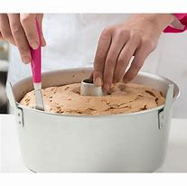
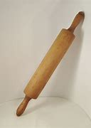
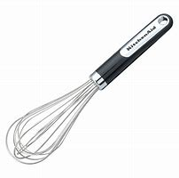
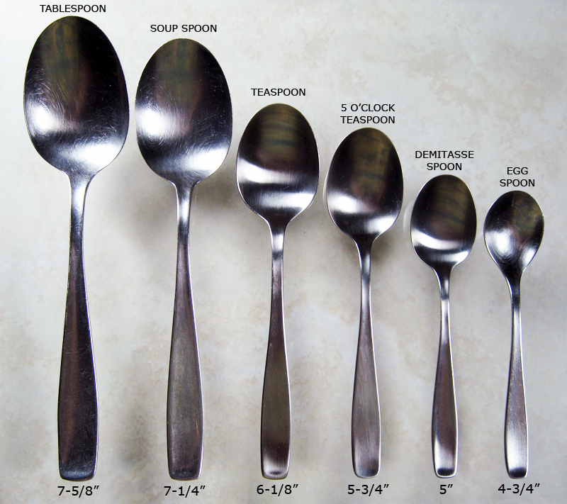
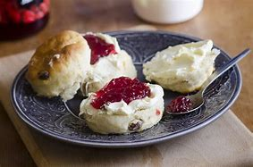
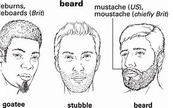

= Lesson 35
:toc: left

---

== Section 1

==== A. Tastes in Common. +

Woman A: I can't stand （尤用于否定句和疑问句，强调不喜欢）容忍，忍受 places like Majorca or the Costa Brava （西班牙沿海地区）. +
Man: No, nor can I. +
Woman A: You know, where you have to share the beach 海滩；沙滩 with thousands of other people and everyone speaks English. +
Woman B: Oh, I don't mind that. +
Man: Oh, I do. I never go to places like that. I like to *get right away 立即、马上、毫不犹豫地 from* all the tourists  旅游者；观光者, go somewhere that's really quiet and peaceful, like an island or something. +
Woman A: Yes, so do I —where no one speaks English. +
Woman B: What's wrong with people speaking English? I like meeting people when I'm on
holiday. I like places with a good night life  夜生活, and plenty of men around, and ... well, you know, where you can have a good time ... +

品味相同。 +
女甲:我受不了马略卡岛和布拉瓦海岸这样的地方。 +
男:不，我也不会。 +
乙:是啊。 +
男:哦，是的。我从来不去那种地方。我喜欢远离所有的游客，去非常安静和平的地方，比如岛屿之类的地方。 +
我的意思是，我的意思是。在没有人说英语的地方。 +
女乙:人们说英语有什么不对吗?我喜欢在度假的时候和人见面。我喜欢夜生活丰富的地方，周围有很多男人，而且……嗯，你知道，在那里你可以玩得很开心…… +

---

==== B. Monologue 独白. +

I remember sailing on a pond that used to be by my grandfather's sawmill 锯木厂 —we had a boat, and we used to go sailing on this. Also, we used to do a lot of climbing trees. We used to climb these trees for apples, which we then ate and made ourselves very sick （身体或精神）生病的，有病的. +
And my mother would come along 一起来 and complain very strongly, but I don't think that stopped us at all. And of course in those days I had a bike, too, and I remember I used to push it up this very long hill near our house and then I'd get on 继续做; 开始做 and ride down as fast as I could go. My mother used to complain about that, too. +

.案例
====
- I'd的全写是I would/could/should/had。一般would用得最多。 +
would ，意思是：愿意、将、将要、会、打算、大概 。也是will的过去式。比如： I would like a cheeseburger, please.我想要一个奶酪汉堡包。 +
should , 意思是：应该，将会，可能，本应。也是shall得过去式。比如：He shouldn’t be so selfish.他不该这么自私。
====

独白。 +
我记得在一个池塘上航行，那个池塘以前是我祖父的锯木厂旁边的——我们有一艘船，我们常常乘这个去航行。此外，我们过去经常爬树。我们过去常常爬上这些树摘苹果，然后我们吃了苹果，把自己弄得很不舒服。 +
我母亲会过来，非常强烈地抱怨，但我认为这一点也阻止不了我们。当然，那时候我也有一辆自行车，我记得我常常把它推到我家附近的一座很长的山上，然后我骑上自行车，以最快的速度骑下去。我妈妈过去也经常抱怨这一点。

---

== Section 2

==== A. Recipe. +

Doris: Hello. What's all this then, Harry? +
Harry: What's all what? I'm making a cake. +
Doris: Yes. We can see *what you're up to*. Obviously you're making a cake. *What else
would you be doing* with a cake tin 罐；罐头盒 and a *rolling pin* 擀面杖 on the table and the place absolutely
covered in flour. Yes, we can see what you're doing. But why are you doing it? +
Man: Yes, it's rather unlike you, Harry. +

.案例
====
.What are you up to?   +
这个口语表达使用很普遍，一般有以下三个意思:

1.你最近在忙啥呢？相当于：What's up? +
- It's been a while. *What are you up to?* 好久不见啊，你最近在忙啥呢？

2.你在做什么？相当于：What are you doing? +
- *What are you up to?* Are you listening?  你在干什么？你在用心听讲吗？

3.你打算干嘛？相当于：What are you going to do? +
- It's Friday. *What are you up to?* 今天是周五，你准备干嘛去？

4.语气不同所要表达的意思也不一样。What are you up to? 也可以表示：你正在搞什鬼？

.cake tin

.rolling pin

====

Harry: Well, I just decided I'd try and make one for a change *instead of* buying one. +
Anyway *this is going to be* 这将是 a rather special sort of cake. You can't buy them like this. And while you're here, Doris, do you mind *beating up* 殴打 half a dozen eggs in that blue bowl over there? You'll find a fork 餐叉 and *egg whisk* 打蛋器；搅拌器, *whichever 无论哪个；无论哪些 you prefer*, in the drawer 抽屉 on the left. +
Doris: OK. I don't mind. But what's so special about this cake? +

.案例
====
.whisk

====

Harry: It's a surprise cake. +
Man: A surprise cake? +
Harry: Yes. Doris, don't forget to add five tablespoons  餐匙，汤匙（尤用于分食物） of sugar. +
Doris: No 不会忘, dear （表示亲昵喜爱）亲爱的. But tell us about this surprise cake. +

.案例
====
.tablespoon +
Tablespoon:大汤匙,Teaspoon:小汤匙,茶匙。 +

====

Harry: Well, it was an idea I had /while I was lying in bed last night. +
Man: Do you usually think of food in bed? +
Harry: I wasn't thinking of food. I decided to have a party for some old friends of mine, but I want to give them a surprise. +
Man: What kind of surprise? +
Harry: Can you add a half of a pint 品脱（容量单位，为⅛加仑) of cream to that, Doris? That's right, *drip 滴下 it in* slowly and
then *beat it up again* until it becomes all sticky  黏（性）的. That's the way. +

.案例
====
.pint

====

Doris: I have made a cake before, you know. Now, come on, what's the surprise? +
Harry: Well, it's quite simple, really. You see I serve the cake with candles 蜡烛 on it. Then I *switch out 开关断开 the lights* and I slip 悄悄疾行；溜 out of the room. But before this I tell them that they must count to twenty before trying to blow out the candles and they'll get a surprise. +
Man: And then? (Explosion 爆炸,（感情，尤指愤怒的）突然爆发，迸发 effect) +

配方。 +
桃乐丝:你好。这是怎么回事，哈利? +
哈利:什么是什么?我在做蛋糕。 +
桃乐丝:是的。我们可以看到你在做什么。很明显你在做蛋糕。你把蛋糕罐和擀面杖放在桌子上还能做什么?桌子上到处都是面粉。是的，我们能看到你在做什么。但你为什么要这么做? +
男:是的，它很不像你，哈利。 +
哈利:嗯，我只是决定试着做一个，而不是买一个。 +
不管怎样，这将是一种非常特别的蛋糕。你不能这样买。既然你来了，多丽丝，你介意在那边的蓝碗里打六个鸡蛋吗?你可以在左边的抽屉里找到叉子和打蛋器，随便你喜欢哪一个。 +
桃乐丝:好的。我不介意。但是这个蛋糕有什么特别之处呢? +
哈利:这是一个惊喜蛋糕。 +
惊喜蛋糕? +
哈里:是的。多丽丝，别忘了加五汤匙糖。 +
桃瑞丝:不，亲爱的。跟我们说说这个惊喜蛋糕吧。 +
哈利:嗯，这是我昨晚躺在床上时的一个想法。 +
男:你通常在床上想食物吗? +
哈利:我不是在想食物。我决定为我的一些老朋友举办一个聚会，但是我想给他们一个惊喜。 +
什么样的惊喜? +
哈利:多丽丝，你能加半品脱奶油吗?没错，慢慢滴进去，然后再次搅拌，直到它变得粘稠。就是这样。 +
桃瑞丝:你知道，我以前做过蛋糕。来吧，有什么惊喜吗? +
哈利:嗯，其实很简单。你看，我把蜡烛插在蛋糕上。然后我关掉灯，溜出了房间。但在这之前，我告诉他们，他们必须数到20才能吹灭蜡烛，他们会得到一个惊喜。 +
男:然后呢?(爆炸效应) +

---

==== B. Waiting. +

—Listen! *I'm terribly 非常；很 sorry* I'm late. +
—Oh, that's all right. It doesn't really matter, does it? I haven't got anything better to do, have I? +
—Just let me explain, will you? +
—I've only been waiting for over an hour, that's all. +
—Yes, I know, and I would have got ... +
—After all, my time isn't really that important, is it? +

.案例
====
.I would have got …
通常情况下，这个短语用来解释迟到的原因或提供解释。 would have got 就是 would have.
====

—Please don't be like that. Just let me explain. I ... I tried to get here in time but just after I left home, the car *broke down*. (机器、车辆等) 出故障, (系统) 瘫痪. +
—The car broke down? +
—Yes, and ... well ... luckily ... there was a garage 车库 near me. And ... and it took them a while to repair it. +
—Why didn't you *at least* 至少 phone (v.)? +
—*I would have!* But I didn't know the number of the restaurant. +
—You could have looked it up in the telephone book! +

.案例
====
.I would have
would have done 是虚拟语气中出现频率最高的.

-  *I would have done..., but… 我本想做…… 但由于一些原因，没有做成* +
I would have loaned you the money, but l didn't have any.我本来想借给你钱，但我自己也一穷二白。

- *I would have done… if sth had done…  如果那时…我就会…(现实情况是：假设的情况没有发生，我也没有那样做)* +
I would have told you the truth if you had been nice to me.如果你那时对我友好点儿，我就告诉你真相了。 注意: **if从句中的谓语动词用had done形式，表示对与过去相反事实的一种假设。**

- *I wouldn't have done....if sth had done.... 如果那时……我就不会……(现实情况是：假设的情况没有发生)* +
lf I had worked hard, I wouldn't have failed the final exam.如果我好好学习了，我就不会挂科了。
====

—Yes, but ... you'll never believe this ... I couldn't remember the name of the restaurant. I knew where it was, but forgot the name. +
—I see. Well, at least it was lucky you found a garage to repair your car. +
—Yes. It was something I couldn't do myself. It didn't take too long, but that's why I'm late, you see. +
—Hu huh. Which garage, by the way? +
—Pardon? +
—Which garage did you take it to? +
—Uh ... the one near my flat. You know. Lewis Brothers. +
—Yes, I know that garage. It's the only one near your flat. +
—Hmm. Well now, let's have something to eat. Uh, what about some ... +
—I know the garage very well! +
—Yes. Let's see now. Yes, I think I'll have some ... +
—*A pity* 遗憾的事 it's Sunday. +
—Pardon? +
—*A pity* it's Sunday. That garage is closed on Sunday! +

.案例
====
.pity 同情心 +
- If you say that it is *a pity* that something is the case, you mean that you feel disappointment or regret about it. 遗憾的事 +
*It's a pity* you've arrived so late in the year.  真遗憾，你这一年来得太迟了。

====

等待。 +
着!非常抱歉，我迟到了。 +
-哦，没关系。这真的不重要，不是吗?我没有别的事可做了，不是吗? +
-听我解释，好吗? +
-我只等了一个多小时，仅此而已。 +
-是的，我知道，我会得到… +
-毕竟，我的时间并没有那么重要，不是吗? +
-请不要那样。让我解释一下。我想及时赶到这里，但我刚离开家，车就抛锚了。 +
-车坏了? +
-是的，而且……嗯……幸运的是……我附近有一家汽车修理厂。他们花了一段时间才修好。 +
-你为什么不打个电话? +
-我会的!但是我不知道那家餐馆的电话号码。 +
你可以在电话簿里查一下! +
-是的，但是…你绝对不会相信…我记不起那家餐馆的名字了。我知道它在哪儿，但忘了名字。 +
我明白了。好吧，至少你很幸运找到了一家修车厂来修理你的车。 +
-是的。这是我自己做不到的事。没花太长时间，但这就是我迟到的原因。 +
京沪啊。顺便问一下，哪个车库? +
再说一遍吗? +
-你把它开到哪个修车厂了? +
-我公寓附近的那个。你知道的。刘易斯兄弟。 +
-是的，我知道那个车库。这是你公寓附近唯一的一家。 +
嗯。好了，现在我们吃点东西吧。呃，来点…… +
我对车库很熟悉! +
-是的。让我们看看。是的，我想我要一些…… +
-可惜今天是星期天。 +
再说一遍吗? +
-可惜今天是星期天。那个汽车修理厂星期天关门了! +

---

==== C. Hiking. +

Donald: Isn't it a relief （不快过后的）宽慰，轻松；解脱;（焦虑、痛苦等的）减轻，消除，缓和 to see people and lights, Walter? Now, let me see. Where are we exactly? According to my map, this must be Chagford. +
Walter: You're right, Don. That sign says Chagford Town Hall. But there's a more
interesting notice 公告牌；警示牌 on the other side of the square （通常为方形的）广场. Do you see what it says? 'Open for Devon Cream Teas'. +

\* * * +

Donald: Oh, yes, so it does. Hold on a moment. I must get a newspaper. There's a
newsagent 报刊经销店；书报亭;报刊经销人；报刊经销商 next door. +
Walter: What do you want a newspaper for? +
Donald: To find out what's been happening, of course. +
Walter: I don't need a newspaper to find out what's been happening. We must have been
walking for at least six hours. My feet have been hurting for about four hours and I've been starving (a.)极饿的 since we shared that tin of cold beans 豆. +
Donald: *You don't mean* you're hungry again? I see what you mean. That tea shop does
look interesting. We could *plan (v.) to* 打算,计划 morrow's 次日；明天 walk while we were having tea, couldn't we? +

.案例
====
.We could plan  to  morrow’s  walk while we were having tea, couldn’t we?
这句话里面,  plan to 后面不是应该接动词么? 应该是 paln to do sth. 为什么上面句子里, plan to 后面接的是名词 morrow’s  walk 呢?

chatGpt回答: +
您的观察是正确的，通常情况下，"plan to" 后面应该接动词，形式是 "plan to do something"，表示计划做某事。然而，这句话中的结构 "plan tomorrow's walk" 采用了一种略微不同的语法结构，其中 "tomorrow's walk" 是一个名词短语，表示“明天的散步”或“明天的行程”。 +
这种结构在口语和书面语中也可以出现，尤其是在上下文中已经清楚指代了要做的事情时。在这种情况下，"plan tomorrow's walk" 意思是“计划明天的散步”或“安排明天的行程”。虽然它的结构不是传统的 "plan to do something"，但它在特定上下文中仍然有效，并且被理解为计划明天的特定活动。
====

\* * * +

Walter and Donald have just finished their Devon Cream Tea, but they don't seem to want
to leave. +
Waitress 女服务员；女侍者: I really don't know what to do, Mrs. Adams. The two gentlemen at table four have had complete Devon cream teas, with additional sandwiches and cakes, and another order 订购；订单 of scones 司康饼. They don't seem to want to leave and it's a quarter past five and I should be *going off* 离去; (电气设备) 停止运作 ... +
Mrs. Adams: Never mind, Mary. You go. Poor lads 男孩，小伙子. They must have been walking all day by the look of them. They must have been starving. +

.案例
====
.scone

====

Walter: I feel *a hundred per cent* 百分之百;全然,完全 better. How about you, Donald? +
Donald: I must admit that a Devon cream tea is better than a tin of cold beans. In fact, it's better than almost anything I can think of ... except a good newspaper. Do you ever buy a newspaper? +
Walter: Not often. But I watch television a lot. +
Donald: Television! It only *scratches 挠，搔（痒处） the surface*  作肤浅的探讨；浅尝辄止；隔靴搔痒. +
Walter: I don't know what you mean by that. Television coverage 新闻报道 is very dramatic 戏剧的,激动人心的；引人注目的；给人印象深刻的. +
Donald: Dramatic, yes. You learn *what happened* but never *why it happened*. +
Walter: Rubbish. The television pictures show you what happened and then the people
concerned 相关的， 关于（某个主题）的;担心的；忧虑的;感兴趣的；关切的；关注的 are interviewed and they tell you why it happened. +
Donald: They say what they saw, but they aren't in a position to *fill in* 提供详情 the background. +
Walter: Yes, they are. They were there. +
Donald: That doesn't mean they're in a position to *fill in* the background. Anyway, the
television pictures don't show you the whole truth. They only show you the bits that
happened while the cameraman was filming. Very often he missed the most important
bits. +

Mrs. Adams: Excuse me. I'm afraid it's almost half past five and we must close. Could I
just give you your bill? +
Donald: Yes, of course. See to it, will you, Walter. I must get a newspaper before the
newsagent closes. +
Walter: ... Er ... Don ... +
Donald: Yes? +
Walter: Could you get me a paper, too? +
Donald: What do you want a paper for? +
Walter: To find out what's on television. +

徒步旅行。 +
唐纳德:沃尔特，看到人们和灯光不是很轻松吗?现在，让我看看。我们到底在哪里?根据我的地图，这里一定是查格福德。 +
沃尔特:你说得对，唐。那个牌子上写着查格福德市政厅。但是在广场的另一边有一个更有趣的告示。你看到上面写什么了吗?德文奶油茶营业. +
 +
\* * * +
 +
唐纳德:哦，是的，确实如此。请稍等。我必须买份报纸。隔壁有一家报刊亭。 +
沃尔特:你要报纸干什么? +
唐纳德:当然是为了知道发生了什么事。 +
沃尔特:我不需要报纸来了解发生了什么事。我们至少走了六个小时。我的脚疼了大约四个小时，自从我们分享了那罐冷豆子后，我就一直在挨饿。 +
唐纳德:你不是说你又饿了吧?我明白你的意思。那家茶馆看起来确实很有趣。我们可以一边喝茶一边计划明天的散步，好吗? +
 +
\* * * +
 +
沃尔特和唐纳德刚刚喝完他们的德文奶油茶，但他们似乎不想离开。 +
女服务员:我真不知道该怎么办，亚当斯太太。四号桌的两位先生喝了全套德文郡奶油茶，外加三明治和蛋糕，还点了一份司康饼。他们似乎不想离开，现在是五点一刻，我该走了…… +
亚当斯太太:不要紧，玛丽。你走。可怜的小伙子。从他们的样子看，他们一定走了一整天。他们一定是饿坏了。 +
沃尔特:我感觉好多了。你呢，唐纳德? +
唐纳德:我必须承认德文郡的奶油茶比一听冷豆子要好。事实上，它比我能想到的任何东西都好，除了一份好报纸。你买过报纸吗? +
沃尔特:不经常。但是我经常看电视。 +
唐纳德:电视!它只触及表面。 +
沃尔特:我不明白你的意思。电视报道非常戏剧化。 +
唐纳德:戏剧性的，是的。你知道发生了什么，但永远不会知道为什么会发生。 +
沃尔特:垃圾。电视画面告诉你发生了什么，然后相关人员接受采访，他们告诉你为什么会发生。 +
唐纳德:他们说他们看到了什么，但他们不能填补背景。 +
沃尔特:是的。他们就在那里。 +
唐纳德:这并不意味着他们可以填补背景。不管怎么说，电视图片并没有告诉你全部的真相。它们只向你展示摄影师拍摄时发生的一些片段。他经常漏掉最重要的部分。 +
亚当斯太太:打扰一下。恐怕已经快五点半了，我们必须关门了。我能把账单给你吗? +
唐纳德:是的，当然。你一定要注意，好吗，沃尔特。我必须在报刊亭关门前买份报纸。 +
沃尔特:呃，堂…… +
唐纳德:是吗? +
沃尔特:你能帮我也拿一份报纸吗? +
唐纳德:你要报纸干什么? +
沃尔特:看看电视上在播什么。 +

---

==== D. Giving Directions. +

Alan: Yes, well ... good ... that sounds great ... thanks a lot ... haven't been to a party *for ages* 很长时间. I'll *drop （意外地）落下，掉下，使落下 round* 顺便走访,短暂访问 then. Er ... tell me how I get there. +
Caller: I just told you, Alan. +
Alan: You didn't. You just reminded me it was somewhere near Willesden Green. +
Caller: I told you exactly how to get here. +
Alan: Then I wasn't listening. Tell me again and I'll write it down. +
Caller: All right. Take a 46 bus. +
Alan: A what? +
Caller: A 46. +
Alan: It can't be a 46. +
Caller: It is, it is. +
Alan: Look, the 46 goes in the opposite direction. It goes towards the Elephant and Castle. +
Caller: No, it doesn't. +
Alan: It does. +
Caller: Listen, it may go towards the Elephant and Castle *on its way back* 在回来的路上 but before that it's headed in the opposite direction /because I happen to catch 赶上（公共汽车、火车、飞机等）  it every day on my way home from work. +
Alan: All right, but I've seen the 46 going the opposite way, I'm sure. I didn't want to *end up* 到头来,最终到达/陷入 at the wrong end of town, that's all. +
Caller: In any case 无论如何, what you may have seen is the 46B. That goes from here down to the Elephant on its return journey. +
Alan: But *I seem to remember* 似乎记得 coming to your house *one time* on the 28. Am I right? I used to catch it at Marble Arch. +
Caller: Yes. It's discontinued (a.)停止使用的;停止；中断. It used to run *from* Tooting 地名 straight through *to* here. It's a pity. +
Alan: OK, so I catch the 46. Now where do I *get off* 下车? +
Caller: Get off at Boots the chemist's 药店 on the corner 街角；拐角,（道路的）急转弯,（有时指偏僻或难以到达的）区域，地区, two stops 车站 after the railway bridge. +
Turn right and walk on /until you come to the second set of traffic lights then turn right into Hartington Road. +
Alan: *Hang on* 等一会儿 ... let me write that down. So I get off at Boots the chemist's after the railway bridge. +
Caller: Two stops after you've gone under the railway bridge. +
Alan: All right. Then what? +
Caller: Then turn right and turn right again at the second set of traffic lights. +
Alan: Right at the second set of lights. +
Caller: Then first *right into* 直接进入 Hartington Road and I'm number one, second floor. +
Alan: OK, I've got all that. Where do you think is the nearest place for me to catch the 45? +
Caller: 46. The 45 would take you *up to* Wembley and you wouldn't get here till the middle of next week. +
Alan: All right the 46. Where do I catch it? +
Caller: I should think Piccadilly Circus 圆形广场 or Green Park would be the nearest to you. +
Alan: Oh well, they're both within walking distance. Have you any idea how often they
run? +
Caller: What? +
Alan: The 46, do you know how often it runs? +
Caller: I've no idea. I should think every ten or fifteen minutes. I never have to wait long. +
Alan: Good. I should be there in about an hour. Thanks for the invitation. Cheers <非正式>谢谢；<非正式>再见. +
Caller: Cheers. See you later. +

指示方向。 +
艾伦:嗯，很好，听起来不错，非常感谢，好久没参加派对了。到时我会顺道拜访的。告诉我怎么去那里。 +
打电话者:我刚告诉你了，艾伦。 +
艾伦:你没有。你刚提醒我是在威尔斯登格林附近。 +
打电话者:我告诉过你怎么来这里。 +
艾伦:那我没在听。再说一遍，我就记下来。 +
打电话者:好的。乘46路公共汽车。 +
艾伦:什么? +
来电者:a46。 +
艾伦:不可能是46。 +
打电话者:是的，是的。 +
艾伦:看，46路是反方向的。它通向大象和城堡。 +
打电话者:不，没有。 +
艾伦:是的。 +
打电话者:听着，它在回来的路上可能会去大象城堡，但在那之前它是朝相反的方向行驶的，因为我每天下班回家的路上碰巧都能赶上它。 +
艾伦:好吧，但我肯定我见过46号公路往相反的方向走。我只是不想走错路，仅此而已。 +
打电话者:无论如何，你看到的可能是46B。从这里一直到 +
大象在返程途中。 +
艾伦:但我好像记得有一次在28号去你家。我说的对吗?我以前在大理石拱门钓过。 +
打电话者:是的。这是停止。它曾经从图廷一直延伸到这里。真遗憾。 +
艾伦:好，那我搭46路车。现在我在哪里下车? +
打电话者:在拐角的Boots药店下车，过了铁路桥两站就到了。 +
向右拐，一直走到第二个红绿灯处，然后向右拐 +
Hartington道路。 +
艾伦:等一下，让我写下来。所以我在铁路桥后的Boots药店下车。 +
打电话者:过了铁路桥下两站后。 +
艾伦:好吧。然后呢? +
打电话者:然后向右拐，在第二个红绿灯处再向右拐。 +
艾伦:就在第二组红绿灯处。 +
打电话者:然后右转进入哈廷顿路，我在二楼1号。 +
艾伦:好的，我都记下来了。你认为我在哪里可以乘45路公交车? +
打电话者:46。45分钟会把你带到温布利，你要到下周中才能到这里。 +
艾伦:好吧。我在哪里抓到它? +
打电话者:我想皮卡迪利广场或格林公园离你最近。 +
艾伦:哦，好吧，它们都在步行距离之内。你知道他们多久开一次吗? +
调用者:什么? +
艾伦:46路车，你知道它多久开一次吗? +
打电话者:我不知道。我想每十分钟或十五分钟一次。我从来不用等太久。 +
艾伦:好。我大概一小时后到。谢谢你的邀请。欢呼。 +
打电话者:干杯。再见。 +

---

== Section 3

==== A. Burglary 入室盗窃，入室盗窃罪. +

Fred: Are you sure this is the right house? +
Harry: Course I'm sure. I used to live next door, didn't I? It's easy and safe. She's not been out for twenty years. Frightened (a.) to go out *in case* someone pinches 捏住；夹紧;偷摸；行窃 her money. +
Fred: That's just what we're going to do, isn't it? Except 除了,除…之外 she's in. What if she hears us? +
Harry: She won't. Deaf 聋的; 听不清的 as a post 柱；杆；桩. Probably half blind, too. Living in the dark all those years. +
Come on, get in this window. Stand on my back and *give me a hand up* 帮我一把. Right, now come
on. Let's have a look around. +

\* * * +

Wendy: Ah, good evening, you've come at last. +
Fred: Blimey  天哪; 表示“吃惊”或“恼怒”! +
Harry: Oh. ... er ... good evening. Yeah ... er ... sorry to be late. +
Wendy: Late! Oh, you are naughty  顽皮的；淘气的；不听话的;粗俗的；下流的. Keeping me waiting here twenty years. And then
trying to surprise me by coming in the window. And you've brought a friend, I see. Good
evening. I hope you didn't damage your clothes coming in the window like that. Harry's
such a silly boy. *Still up to* 至今仍在 his tricks 诡计；花招；骗局；把戏. Do take a chair. And you Harry, sit down and we can all have a nice cup of tea. You'd like that, wouldn't you? +
Fred: Oh ... er ... yeah, er ... thanks very much. Er ... thank you. +
Wendy: Lovely 美女；美人；佳人. Now, won't be a minute 我马上就回来. Harry, entertain your friend, ha, ha, ha, ha, ha, ha. +

Fred: A right mess 肮脏；杂乱；不整洁;麻烦，困境，混乱 this is. Quick, back out of the window. +
Harry: No. Calm down. Can't you see? It's even easier. She thinks I'm her old boyfriend. +
Must've been waiting for him for twenty years. All I have to do is ask her for the money and she'll give it to me. She's *off her head* 神经错乱的,疯的. +
Fred: Do you think so? Reckon 想；认为 it'll be as easy as that? +
Harry: Course it will. Now shut up. She's coming back. +
Fred: She didn't even notice our masks. +
Harry: Oh, shut up. +

Wendy: Here we are. A nice cup of tea and a bun  小圆甜蛋糕；小圆甜饼;圆面包. Now, Harry, you haven't introduced your friend. +
Harry: Oh, no. Sorry. Er ... this is Fred. Yeah ... 'Fred'. Fred, this is ... +

.案例
====
.bun
image:../img/bun.jpg[,15%]
====

Wendy: Hello, Fred. So pleased to meet you. I'm Wendy. Wendy Hartfelt. +
Fred: Oh, very pleased (a.)高兴；满意；愉快, I'm sure. +
Harry: Wendy, I wanted to talk to you about money. +
Wendy: Ah yes, Harry. I wondered 想知道. I wasn't going to mention it quite so soon, but that `主` ten thousand pounds I lent you `谓` must have acquired (v.)（通过努力、能力、行为表现）获得，得到 quite a lot of interest 利息；利益 by now, and *times are rather hard*. Now, drink your tea like a good boy /and we'll discuss how you can pay it back. Twenty years is a long time to wait, after all. Harry? Harry, what are you doing? +
Come back in here at once. Oh dear. He is a naughty boy. But I know he'll come back. +
Always did. But I'm afraid his tea will be cold. Ah ... +

入室盗窃。 +
弗雷德:你确定是这所房子吗? +
哈利:当然，我敢肯定。我以前住在你隔壁，不是吗?它既简单又安全。她有二十年没出门了。害怕出门，以防有人偷她的钱。 +
弗雷德:那正是我们要做的，不是吗?但她加入了。如果她听到了怎么办? +
哈利:她不会的。聋得像个傻瓜。可能也是半盲的。这些年都生活在黑暗中。 +
快点，从窗户进来。站到我背上，扶我一把。好了，来吧。让我们四处看看。 +
 +
\* * * +
 +
温迪:啊，晚上好，你终于来了。 +
弗雷德:啊呀! +
哈里:哦。嗯，晚上好。嗯，抱歉来晚了。 +
温迪:迟了!哦，你真淘气。让我在这里等了二十年。然后试图从窗户进来给我一个惊喜。你还带了个朋友来。晚上好。我希望你那样从窗口进来时没有把衣服弄坏。哈里真是个傻孩子。他还在耍花招。请坐吧。而你，哈利，坐下，我们都可以喝杯好茶。你会喜欢的，不是吗? +
弗雷德:哦，嗯，非常感谢。呃…谢谢。 +
温迪:可爱。好了，马上就来。哈利，招待你的朋友，哈哈哈，哈哈哈。 +
弗雷德:这真是一团糟。快，退到窗外去。 +
哈利:没有。冷静下来。你看不出来吗?这甚至更容易。她以为我是她以前的男朋友。 +
一定等了他二十年了。我所要做的就是向她要钱，她会给我的。她疯了。 +
弗雷德:你这么认为吗?你觉得会这么简单吗? +
哈利:当然会。现在闭嘴。她要回来了。 +
弗雷德:她甚至没有注意到我们的面具。 +
哈利:哦，闭嘴。 +
温迪:我们到了。一杯好茶和一个小圆面包。哈利，你还没介绍你的朋友呢。 +
哈利:哦，不。对不起。呃，我是弗雷德。对……弗雷德。弗雷德，这是…… +
温迪:你好，弗雷德。很高兴见到你。我是温迪。温迪Hartfelt。 +
弗雷德:哦，非常高兴，我确定。 +
哈利:温迪，我想和你谈谈钱的事。 +
温迪:啊，是的，哈利。我想知道。我本来不打算这么快就提的，不过我借给你的那一万英镑现在一定赚了不少利息了，而现在的日子实在不好过。现在，像个好孩子一样把茶喝了我们再来讨论你怎么还钱。毕竟，二十年的等待是一段很长的时间。哈利?哈利，你在干什么? +
马上回来。哦亲爱的。他是一个顽皮的男孩。但我知道他会回来的。 +
总是做的。但恐怕他的茶要凉了。啊… +

---

==== B. The Empty Chair. +

A friend of mine, Rob Jenkins, almost had a *nervous breakdown* （车辆或机器的）故障，损坏;**神经衰弱** last year. I told him
to go to the doctor. +
Doctor: Hello, Mr. Jenkins. What can I do for you? +
Mr. Jenkins: Well, doctor ... I'm very tense and nervous. I haven't been able to sleep for several days. +
Doctor: Hmm ... have you been working hard? +
Mr. Jenkins: Oh, yes. I've been very busy. I've been working twelve hours a day. +

.案例
====
.has/have + been doing  +
强调过去发生的动作“一直持续”到现在。 +
- *I have been waiting for you* for almost 2 hours. 我一直在等你，快两个小时了。 +
- We have been looking all over for you. 我们到处在找你。

====

Doctor: Have you been taking any pills? +
Mr. Jenkins: No, but I've been smoking too much, and I've been drinking a lot of coffee. +
Doctor: Well, you should take a holiday. You should go somewhere quiet and peaceful,
like Cornwall. Why don't you go there? +

\* * * +

Rob decided to go to Cornwall the next weekend. Penquay was a very small fishing
village on the north coast of Cornwall. There were no trains 火车；列车 or buses to Penquay, so he had to drive. It was a long journey, and Rob arrived late on Friday evening. The landlady 女房东；女地主,女店主 of the *guest house* 小旅馆,客房, Mrs. Doone, answered the door and *showed* 引；带；领 him *to* his room. Rob was very tired and went straight to bed. He slept well and didn't wake up until nine o'clock the next morning. +
Rob went downstairs for breakfast. Because there were no other guests, Mrs. Doone
invited him to have breakfast with her and her daughter, Catherine. Catherine was already sitting in the dining room. She was about thirteen years old, with long, black hair and clear,
grey eyes. Mrs. Doone went to the kitchen to prepare breakfast. Rob and Catherine
looked at each other nervously for a few seconds. +

Mr. Jenkins: There are four places at the table. Is there another guest? +
Catherine: Oh, no ... we never talk about the empty place. +
Mr. Jenkins: The empty place? What do you mean? +
Catherine: Well, that used to be my father's place. +
Mr. Jenkins: 'Used to be?' I don't understand. +
Catherine: My father was a fisherman. Three years ago he went out in his boat, and he
never returned. +
Mr. Jenkins: What happened to him? +
Catherine: Nobody knows. They searched everywhere, but they found nothing. My mother
always keeps that place for him, and she makes his breakfast every morning. She thinks
he'll come back. That's a photograph of him ... over there, on the wall. My mother's been waiting for him for three years. +

\* * * +

Rob said nothing, but he looked very worried. At that moment Mrs. Doone returned. +
She poured four cups of tea, and put one cup in the empty place. Rob looked more
worried and he stared at the empty chair. Suddenly, he heard footsteps outside the door
and a tall man, with a black beard 胡须,络腮胡子, walked into the room. Rob looked terrified (a.) 恐惧；很害怕. It was the
man in the photograph! He jumped up and ran out of the room. +

.案例
====
.beard

====

Man: Who was that? What's the matter? +
Mrs. Doone: I don't know. I don't understand. He's a guest from London. He arrived last
night while you were asleep. +
Man: Catherine! Do you know anything about this? +
Catherine: No, I don't, father. But he's here because he's very nervous. He says he's
hiding here because a tall man with a black beard is trying to kill him. +
Man: Catherine, have you been telling stories again? +
Catherine: Stories, father? Me? (laughing)

空椅子。+ +
 +
我的一个朋友，罗伯·詹金斯，去年差点精神崩溃。我告诉他 +
去看医生。+ +
医生:你好，詹金斯先生。我能为您做些什么?+ +
詹金斯先生:嗯，医生……我非常紧张和紧张。我都睡不着觉了 +
好几天。+ +
医生:嗯……你一直在努力工作吗?+ +
詹金斯先生:哦，是的。我一直很忙。我每天工作12个小时。+ +
医生:你吃过什么药吗?+ +
詹金斯先生:没有，但是我抽烟太多了，而且我喝了很多咖啡。+ +
医生:嗯，你应该休个假。你应该去一个安静祥和的地方， +
像康沃尔。你为什么不去那里呢?+ +
 +
\* * * + +
 +
罗布决定下个周末去康沃尔。彭基是一个非常小的渔场 +
康沃尔北部海岸的一个村庄。没有火车或公共汽车去彭基，所以他 +
我得开车。旅途很长，罗布星期五晚上很晚才到。房东太太 +
客房的女主人杜恩太太开了门，把他带到他的房间。抢劫 +
我很累，就直接上床睡觉了。他睡得很好，直到九点才醒来 +
第二天早上。+ +
罗布下楼吃早饭。因为没有其他客人，杜恩太太 +
邀请他与她和她的女儿凯瑟琳共进早餐。凯瑟琳已经 +
坐在餐厅里。她大约十三岁，有一头又长又黑的头发， +
灰色的眼睛。杜恩太太去厨房准备早餐。罗布和凯瑟琳 +
他们紧张地对视了几秒钟。+ +
詹金斯先生:桌子上有四个位子。还有别的客人吗?+ +
凯瑟琳:哦，不……我们从不谈论空的地方。+ +
詹金斯先生:空的地方?你是什么意思?+ +
凯瑟琳:嗯，那以前是我父亲住的地方。+ +
詹金斯先生:“以前是吗?”我不明白。+ +
凯瑟琳:我父亲是个渔夫。三年前他乘船出海，然后他 +
再也没有回来。+ +
詹金斯先生:他怎么了?+ +
凯瑟琳:没人知道。他们到处找，但什么也没找到。我的母亲 +
总是为他保留那个地方，她每天早上给他做早餐。她认为 +
他会回来的。那是他的一张照片……在那边，在墙上。我母亲一直 +
等了他三年。+ +
 +
\* * * + +
 +
罗布什么也没说，但他看起来很担心。这时，杜恩太太回来了。+ +
她倒了四杯茶，把一杯放在空地方。罗布看得更多 +
他忧心忡忡地盯着那张空椅子。突然，他听到门外有脚步声 +
一个留着黑胡子的高个子男人走进了房间。罗布看起来吓坏了。这是 +
照片里的人!他跳起来跑出了房间。+ +
男:那是谁?怎么了?+ +
杜恩太太:我不知道。我不明白。他是从伦敦来的客人。他最后一个到 +
当你睡着的时候。+ +
男:凯瑟琳!你知道这件事吗?+ +
凯瑟琳:不，我不知道，爸爸。但他来这里是因为他很紧张。他说他 +
躲在这里是因为一个黑胡子的高个男人想杀他。+ +
男:凯瑟琳，你又在讲故事了吗?+ +
凯瑟琳:讲故事，爸爸?我吗?(笑着说) +

---

