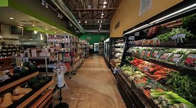
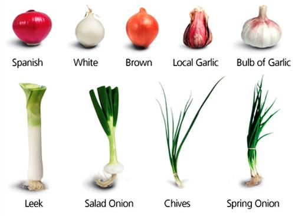
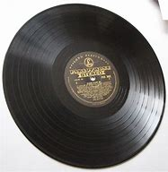
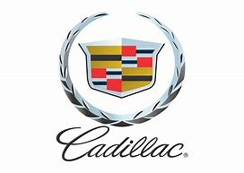

= Lesson 36
:toc: left
:toclevels: 3
:sectnums:
:stylesheet: ../../+ 000 eng选/美国高中历史教材 American History ： From Pre-Columbian to the New Millennium/myAdocCss.css

'''

== Section 1

==== A. Making a Reservation (n.) 预订；预约.（美国为土著美洲人划出的）保留地，居留地 +

Robert Gordon is phoning *to book (v.) a hotel room* in Paris. +
Receptionist 接待员: 45-21-64. Allo? +
Robert: Is that the Saint-Martine Hotel? +
Receptionist: Oui 是的，是. Yes, it is. Can I help you? +
Robert: *Have you got a double room* 双人间 for the night of 23rd July? +
Receptionist: One moment please. I'll just have a look. Yes, we have got a double room
on that date. +
Robert: Has it got a double bed or two singles? +
Receptionist: Two singles, monsieur （法）先生；绅士. +
Robert: And is that with or without bath 浴缸；浴盆? +
Receptionist: It's a room with shower and toilet, monsieur. +
Robert: That sounds fine. Is there a TV? +
Receptionist: Could you repeat that, please? +
Robert: Is there a color television in the room? +
Receptionist: Yes, but of course. And a video （指制品）录像，录影, if you choose. +

Robert: *How much will it be* for one night? +
Receptionist: About four hundred francs  法郎. +
Robert: And what does that include? +
Receptionist: It includes morning newspaper, continental 欧洲大陆的,随（西、南欧国家）大陆风俗的 breakfast and service. +

[.my1]
.案例
====
.continental breakfast
a light breakfast, usually consisting of coffee and bread rolls with butter and jam 欧陆式早餐，简易早餐（通常包括咖啡和黄油果酱圆面包） +

====

Robert: Where is the nearest metro 地铁? +
Receptionist: Opera  歌剧团；歌剧院, monsieur. It's only five minutes from here. +
Robert: And is there an extra charge for children? +
Receptionist: If the child is under sixteen and we put an extra bed in your room, the charge is seventy-five francs. Do you want the room? +
Robert: Yes, for one night —23rd July 七月. +
Receptionist: Oui, monsieur. May I have your name, please? +
Robert: Actually, it's for my wife and two daughters —Mrs. Jean Gordon, Linda and +
Maggie. +
Receptionist: Yes, monsieur. So you need an extra bed. And what time will they be
arriving on July 23rd ... +

[.my2]
====
预订房间。 +
罗伯特·戈登打电话来是想在巴黎订一个旅馆房间。 +
接待员:45-21-64。喂? +
罗伯特:那是圣马丁酒店吗? +
接待员:是的。是的，它是。我能帮你吗? +
罗伯特:你们有7月23日晚上的双人房吗? +
接待员:请稍等。我就看看。是的，那天我们有一间双人房。 +
罗伯特:有一张双人床还是两张单人床? +
接待员:两间单人房，先生。 +
罗伯特:那是带浴还是不带浴? +
接待员:这是一间带淋浴和卫生间的房间，先生。 +
罗伯特:听起来不错。有电视吗? +
接待员:您能再说一遍吗? +
罗伯特:房间里有彩色电视机吗? +
接待员:是的，当然可以。还有视频，如果你愿意的话。 +
罗伯特:一晚要多少钱? +
接待员:大约四百法郎。 +
罗伯特:那包括什么呢? +
接待员:包括晨报、欧陆式早餐和服务。 +
罗伯特:最近的地铁在哪里? +
接待员:歌剧，先生。离这儿只有五分钟的路程。 +
罗伯特:小孩要额外收费吗? +
接待员:如果孩子不满16岁，而我们在您的房间加床的话，费用是75法郎。你要房间吗? +
罗伯特:是的，一个晚上，7月23日。 +
接待员:好的，先生。请问您贵姓? +
罗伯特:实际上，这是给我妻子和两个女儿的。让·戈登，琳达和 +
玛吉。 +
接待员:好的，先生。所以你需要一张额外的床。7月23日他们什么时候到?
====

---

==== B. Vet 兽医,兽医诊所. +

Interviewer: Now you've been a veterinary  (a.)兽医的 doctor for some thirty years, what was it that made you become a vet *in the first place* 首先，最初? +
Vet: Well, I studied as an ordinary doctor in the beginning, but I slowly realized that I liked animals very much. I almost prefer animals to people. So I took an extra course （有关某学科的系列）课程，讲座 in animal medicine. It's as simple as that really. +
Interviewer: And you still enjoy working with animals? +
Vet: Oh, yes, very much so. In fact, more than ever 超越任何时候 now. I've got *to know* animals *much better*, you see, and I *get on better with them*  （与某人）和睦相处，关系良好 in every way 在各个方面；完全地. Their owners sometimes get on my nerves, though. +

[.my1]
.案例
====
.GET ˈON WITH SB ˌGET ˈON (TOGETHER)
( both BrE ) ( NAmEBrE also ˌ**get aˈlong with sb**ˌ/ **get aˈlong (together)**) to have a friendly relationship with sb （与某人）和睦相处，关系良好 +
- She and her sister *have never really got on*. 她与妹妹一直合不来。  +
- We *get along* just fine *together*. 我们相处得很融洽。

====

Interviewer: Oh ... why is that? +
Vet: Well, some people know very little about animals and keep them in the wrong
conditions. +
Interviewer: What sort of conditions? +
Vet: Oh, you know, some people buy a large dog and then try to keep it in a small flat 一套房间；公寓；单元房; they don't take it out enough to give it proper exercise. Other people have a cat and try to keep it in the house all day, but a cat needs to get out and be free *to come and go* as it pleases. +
A lot of people don't feed their animals properly. It's very common to give pets too much food which is very bad for them, especially if they're not getting enough exercise. Or not to feed them regularly, which is equally bad. An animal is a responsibility which is something many people don't seem to realize. +

Interviewer: You mean people keep 养；饲养 pets for the wrong reasons? +
Vet: Yes, some people want a pet because they're lonely, or simply for decoration, or just to show how rich they are. +
Interviewer: And just how do you deal with these people? +
Vet: Well, I try to tell them what the animal needs, what is the right sort of food, the proper
exercise. I try to teach them that animals are not toys and if they're to be healthy (a.), they
have to be happy. +
Interviewer: Yes, I suppose you're right. In your thirty years as a vet you must have *come across* 偶然发现; 偶然遇见,留下印象 some interesting cases? +
Vet: Oh yes, there are lots of interesting cases. I was once called to a lioness 母狮 who was giving birth and having difficulty. Now that was really interesting. +

[.my2]
====
兽医。 +
采访者:现在你已经做了30年的兽医了，是什么让你成为一名兽医的呢? +
兽医:嗯，一开始我学的是普通的医生，但慢慢地我意识到我非常喜欢动物。比起人，我更喜欢动物。所以我额外选修了一门动物医学课程。就这么简单。 +
采访者:你还喜欢和动物打交道吗? +
兽医:哦，是的，非常喜欢。事实上，现在比以往任何时候都要多。你看，我对动物有了更多的了解，我和它们在各方面都相处得更好了。不过，它们的主人有时会让我心烦。 +
采访者:哦，为什么呢? +
兽医:嗯，有些人对动物知之甚少，把它们养在错误的环境里。 +
面试官:什么样的条件? +
兽医:哦，你知道，有些人买了一只大狗，然后把它养在一个小公寓里;他们没有拿出足够的时间给它适当的锻炼。有些人养了一只猫，整天把它关在家里，但是猫需要出去，需要自由来去。 +
许多人没有正确地喂养他们的动物。给宠物太多食物是很常见的，这对它们非常有害，尤其是如果它们没有得到足够的锻炼。或者不定期给它们喂食，这同样不好。动物是一种责任，这是许多人似乎没有意识到的。 +
采访者:你是说人们养宠物是出于错误的原因? +
兽医:是的，有些人想养宠物是因为他们很孤独，或者只是为了装饰，或者只是为了显示他们有多有钱。 +
面试官:那你是怎么和这些人打交道的呢? +
兽医:嗯，我试着告诉他们动物需要什么，什么是正确的食物，适当的运动。我试着告诉他们，动物不是玩具，如果它们想要健康，就必须快乐。 +
面试官:是的，我想你是对的。在你30年的兽医生涯中，你一定遇到过一些有趣的病例吧? +
兽医:哦，是的，有很多有趣的病例。有一次，我被召唤去看望一头正在分娩却难产的母狮。这真的很有趣。
====

---

== Section 2

==== A. Monologue. +

Well, now, ladies and gentlemen, that was our last item 项目, and all that remains for me to do is to *thank* our performers 表演者；演出者；演员 sincerely 真诚地；诚实地 on behalf of 代表某人 us all *for* the pleasure they have given us this evening. And of course *I must express thanks to* those who've worked behind the scenes. And especially our producer 生产商;制作人，监制人.

But most of all *I want to say thank you to* all of you for coming here this evening and supporting this event, especially in such weather. I think perhaps *I should take this opportunity* to renew (v.)重申；重复强调; 使继续有效；延长…的期限 my sincere apologies to those sitting in the back rows. We've made temporary repairs to the roof, but unfortunately the rain tonight was unexpectedly heavy, and *we're grateful  感激的；表示感谢的 to you for* your understanding and cheerful 令人愉快的 good humor.

I may say that *we had hoped that* 表示"过去某一时间前"就已经发生或完成了的动作 temporary repairs would suffice (v.)足够；足以. But we were recently informed by our surveyor 检验员；检验官;（建筑物质量）鉴定人 that the whole roof will have to be replaced: which is of course *a severe blow* （用手、武器等的）猛击;打击；挫折 when you think it's only five years since we replaced the roof of the church 教堂 itself. And so *we shall be having another concert  音乐会；演奏会 soon*, I hope.

[.my2]
====
独白。

好了，女士们，先生们，这是我们的最后一个项目，我要做的就是代表我们大家衷心感谢我们的表演者, 今晚给我们带来的快乐。当然，我必须感谢那些在幕后工作的人。尤其是我们的制片人。但最重要的是，我要感谢大家今晚来到这里，特别是在这样的天气里支持这次活动。我想也许我应该借此机会, 向坐在后排的各位再次表示诚挚的歉意。我们对屋顶进行了临时修理，但不幸的是今晚的雨出乎意料地大，我们感谢你的理解和愉快的幽默。我可以说，我们曾希望暂时的修理就足够了。但是，最近我们的测量员通知我们，整个屋顶都必须更换。这当然是一个沉重的打击，因为我们才更换了教堂本身的屋顶才五年。我希望我们很快就能再开一场音乐会。
====

[.my1]
.案例
====

.will/shall be doing
用于表示我们认为，*"猜测"或"预期"现在或将来会发生的事情*，和打算无关。 +
- Don't call my wife now, she'll be working.对现在的猜测
====

---

==== B. Wrinkles 皱纹. +

Manager: Good morning, madam. And what can we do for you? +
Woman: What can you do for me? +
Manager: Yes, madam, what can we do for you? +
Woman: You've already done it, thank you very much. And I want something done about
what you've done for me. +
Manager: Is something the matter 有什么事吗, madam? +
Woman: I'll say there is, I want to see the manager. +
Manager: I'm the manager, madam. Now ... now *what seems to be the trouble*? 有什么麻烦吗,有哪里不舒服 +
Woman: Look at my face! +
Manager: Your face? Ah yes. Oh dear. Well, never mind. What's wrong with your face? +
What exactly am I supposed 一般认为；人们普遍觉得会;（按规定、习惯、安排等）应当，应，该，须 to be looking at? +
Woman: My lines 总体外观; 总体外形, my Wrinkles. +

[.my1]
.案例
====
.BE SUPPOSED TO DO/BE STH
(1) to be expected or required to do/be sth according to a rule, a custom, an arrangement, etc. *（按规定、习惯、安排等）应当，应，该，须* +
- *You were supposed to be here* an hour ago! 你本该在一小时以前就到这儿！

(2) to be generally believed or expected to be/do sth *一般认为；人们普遍觉得会* +
- I haven't seen it myself, but *it's supposed to be* a great movie. 这部电影我没看过，不过人们普遍认为很不错。
====

Manager: Well, we can soon *put* that *right* 使恢复正常；校正, Madam. You need a bottle of our New Generation *Wrinkle Cream* 抗皱霜. With this wonderful new cream 奶油，乳脂；霜，膏 your lines and wrinkles just ... +
Woman: Shut up! +
Manager: ... just disap ... I beg your pardon? +
Woman: I said shut up! *I was silly enough* to listen to you before. I'll listen to no more of it. +
Manager: You say you've been here before, madam. I'm afraid I don't recognize you. +
Woman: Of course you don't recognize me! Last time I came in here I was a very
attractive middle-aged woman. Now I look old enough to be even your grandmother. +
Manager: Well, yes ... er ... some of us do age (v.) quicker than others. +
Woman: It's not a question of age, my man 朋友(一种非正式的称呼，用于称呼男性朋友), it's a question of your cream. I used it for two small lines under my eyes and I woke up next morning looking like Lady Frankenstein. +
Your advertisement says 'Lose ten years overnight. For only five pounds /you can look
young and attractive again. Tried (v.)(即try)试用；试验 by thousands. Money back  退款 guarantee (v.)保证；担保；保障.' Well, I want
more than my money back. I want you to pay 付费；付酬 for me to have *plastic 可塑的；有塑性的 surgery* 整形手术；整形外科. +
Manager: But, madam, there must be some mistake. +
Woman: *I'll say* 很有同感，非常同意 there's been a mistake. My mistake was believing your advert 广告 and buying your silly cream. 'It can do the same for you, too,' it said. Well, it's certainly done something for me, but now what it did for the lady in the picture. +
Manager: But our product is tested and approved by doctors. It was thoroughly tested on
thousands of volunteers by experts before it was allowed to be sold on the market. This is the first complaint 抱怨，投诉 we've had. +
Woman: I told you, I want you to pay for a *face lift*  拉皮除皱手术 or I'm taking you to court 法院；法庭! So there! +

[.my1]
.案例
====
.I'm taking you to court!
be doing 表示近期、眼下就要发生的事情; 表示安排好要做的事情.
====

Manager: Er, do you happen to have a ... a recent photograph, madam? +
Woman: What ... whatever do you want with a photograph? You can see the way I look. +
Manager: I mean a photograph of you /just before you used the cream. +
Woman: Do you think I go to the photographers everyday? (Pause) Look, Just give me the
five pounds, will you? +
Manager: Do you have your receipt 收据；收条 with you, madam? +
Woman: Er ... just a minute ... let me have a look. (Rummages (v.)翻寻；乱翻；搜寻 in bag) Er ... no. No, I seem to have lost it? +
Manager: Then there's nothing I can do, madam. Sorry. +
Woman: (furious  狂怒的；暴怒的) I'll take you to court. I'll take you to court. +
Manager: You can do as you please, madam. Good morning. +

[.my2]
====
皱纹。 +
经理:早上好，女士。我们能为您做些什么? +
女:你能为我做些什么? +
经理:是的，夫人，我们能为您做些什么? +
女:你已经做了，非常感谢。我希望你能弥补你为我所做的一切。 +
经理:有什么事吗，夫人? +
女:我会说有，我要见经理。 +
经理:我就是经理，女士。现在……现在有什么问题吗? +
看我的脸! +
经理:你的脸?哦,是的。哦亲爱的。好吧，没关系。你的脸怎么了? +
我到底该看什么? +
我的线条，我的皱纹。 +
经理:嗯，我们很快就能修好，夫人。你需要一瓶我们的New +
一代抗皱霜。有了这种神奇的新面霜，你的皱纹就…… +
闭嘴! +
经理:就这样消失了，你说什么? +
女:我说了闭嘴!我以前真傻，听了你的话。我不想再听了。 +
经理:您说您以前来过这里，夫人。恐怕我不认识你。 +
女:你当然不认识我了!上次我来这里的时候还是个很有魅力的中年女人。现在我看起来老得可以当你奶奶了。 +
经理:嗯，是的，我们中的一些人确实比其他人老得快。 +
女人:这不是年龄的问题，伙计，这是你的奶油的问题。我用它在我的眼睛下面画了两条细纹，第二天早上醒来我就像弗兰肯斯坦夫人一样。 +
你的广告上写着“一夜消瘦十岁”。只要花五英镑，你就能再次显得年轻迷人。成千上万的人尝试过。保证退款。”我想要的不仅仅是钱。我想让你出钱让我做整形手术。 +
经理:但是，夫人，一定是搞错了。 +
女:我会说是搞错了。我的错误是相信了你的广告，买了你那愚蠢的面霜。“它也可以为你做同样的事，”它说。它确实对我起了作用，但现在它对照片中的女士起了什么作用。 +
经理:但是我们的产品是经过医生测试和认可的。在允许在市场上销售之前，专家对数千名志愿者进行了彻底的测试。这是我们收到的第一个投诉。 +
女:我告诉过你，我要你付钱做整容手术，否则我就告你上法庭!所以在那里! +
经理:嗯，夫人，您有近照吗? +
女:你要照片干什么?你可以看到我的样子。 +
经理:我是说你用面霜之前的照片。 +
女:你以为我每天都去找摄影师吗?(停顿)听着，给我五英镑，好吗? +
经理:夫人，您带收据了吗? +
女:嗯，等一下，让我看看。(在包里翻找)嗯，不。没有，我好像把它弄丢了。 +
经理:那我就无能为力了，夫人。对不起。 +
女:(愤怒地)我要把你告上法庭。我会把你告上法庭。 +
经理:夫人，您可以随心所欲。早上好。
====

---

==== C. Shopping. +

—Right, what do you want me to get then? +
—Right, er ... well, go to the *green grocer*'s (食物杂货店,食物杂货商),蔬菜水果商 first. +
—Yeah, the green grocer's. (Right.) OK. +
—Right, let me see, potatoes 土豆, but new potatoes, not mottled 斑驳的；杂色的 ones. I mean they're really not very good any more. Urm, three pounds ... +

[.my1]
.案例
====
.green grocer

.mottled +
adj. marked with shapes of different colours without a regular pattern 斑驳的；杂色的
====

—Hang on. I'm trying to write this down. New potatoes. +
—Right. +
—... three pounds. +
—Three pounds. Yes. +
—**Spring onions** 大葱, one bunch. +
—One bunch of spring onions. +
—Yeah. +
—OK. +

[.my1]
.案例
====
.spring onion

====

—And ... a pound of bananas. +
—And a pound of bananas. Right. +
—And then, could you go to the supermarket as well? +
—Yes, yes. +
—Mm, let me see. A packet of *sugar cubes* 糖块, 方糖 . +
—A packet of sugar cubes. +
—Yeah. Cubes, *mind you* （口语中用以强调陈述）你要明白，要知道，不过要注意, not the other stuff. +
—Right. +

[.my1]
.案例
====
.sugar cubes

====

—Coffee, *instant coffee* 即溶咖啡, but yeah, get Nescafe 雀巢咖啡, Nescafe gold blend （不同类型东西的）混合品，混合物. +
—Nescafe? +
—Yeah. I don't really like any other kinds. +
—OK. Nescafe ... what did you say? +
—Gold blend. +
—Gold blend. Yeah. +
—You know one of those eight-ounce jars （玻璃）罐子；广口瓶. +
—Eight ounces. Yes, yes. +

—Cooking oil 烹饪油. +
—Cooking oil. +
—Sunflower 向日葵 ... you see, I need it for ... +
—What is it? What's that? +
—Sunflower. +
—Sunflower? +
—I need it for a special recipe 烹饪法；食谱;方法；秘诀；诀窍. +
—Never heard of that. +
—Sunflower cooking oil. +
—Yeah. +
—Right. +
—Wine. +
—Any special kind? +
—Any *dry white* 干白葡萄酒. +
—Dry white wine. Yeah. +

[.my1]
.案例
====
.dry white

干白葡萄酒(le vin blanc)，“干”是从香槟酒酿造中借用的一个词，即不添加任何水、香料、酒精等添加剂，直接用纯葡萄汁酿造的酒。 +
葡萄榨汁后，立即将葡萄皮核过滤出去，葡萄汁酿成酒后基本无色或有淡黄色为干白酒. +

- *"红酒"就是用"红葡萄"酿的酒.* 酒的红色均来自葡萄皮中的红色素，绝不可使用人工合成的色素。
- "白葡萄酒"就是用"白葡萄"或"红皮白肉的葡萄"酿的酒。*
====

—And some bread. +
—Some bread. Any, again, any particular kind? +
—No. +
—Any kind? +
—Any kind, yeah. +
—OK. Yeah. Anything else? +
—No, I don't think. Oh yes, hang on. I forget apples. Golden delicious 苹果的品牌名, urm, from the green grocer's. +
—Golden delicious  美味的；可口的；芬芳的 apples. How many? +
—Two pounds. +
—Two pounds. +
—Yes. +

\* * * +
—Hi, I'm back. +
—Ah, good. Right, well, let's see what you've got then. +
—Right, let's see what we have got here. Three pounds of potatoes. +
—Oh look. These're old potatoes. I did say new potatoes. These, these are no good. +
—Oh, I'm sorry. It doesn't make much difference. +
—Yes, it does. +
—I'm sorry. Well, actually, I couldn't, I didn't see any new potatoes. +
—Mm, alright. What are these, onions? +
—Onions, yes. +
—But these are not spring onions. +
—Oh, they are nice, nice big ones, though, aren't they? +
—Yeah, but not spring onions. +
—Oh, sorry. I didn't, *I didn't really know* what spring onions were. +
—Well, you know, there's long ones ... +
—Oh, they have all sorts. +
—... and thin ones. +
—Right. Some bananas. +
—That, yeah, they are fine. Great. +
—Good. Two pounds of apples. +
—Cooking apples? I did say golden delicious. Look, these are for cooking. I wanted some
for eating. You know, for ... oh well ... +
—Oh well, I didn't know. I thought they would do. They look nice. +
—Mm, no. +
—Right. A bottle of wine. Riesling 雷司令（一种干白葡萄酒的商标名称）, OK? +
—Yeah, fine, great. That's fine. And sugar cubes here. Great. +
—Yes, yes. +
—OK. +
—Right. Now they didn't have any Nescafe Gold Blend, so I got Maxwell House 麦斯威尔咖啡. That's all
they had. +
—Alright, alright. Never mind. +
—Yeah. And oil. +
—But not Sunflower oil. +
—I couldn't see that. I got this. I think it's good stuff, good quality. +
—Yes, it is good, but it's *olive oil* 橄榄油 and that's not what my recipe wanted. I need Sunflower oil. +
—Well, I don't think you'll find it. And a loaf of bread. +
—That's fine. All right. Well, I suppose I'll have to go out myself again then. +
—Well, sorry, but I don't think it's my fault. +
—Mm. +

[.my2]
====
购物。 +
-好吧，那你想让我买什么? +
-好吧，先去蔬菜食品店。 +
-是的，绿色食品杂货店。(右)。好的。 +
-好的，让我看看，土豆，但是新土豆，不是有斑点的土豆。我的意思是他们真的不太好了。嗯，三磅…… +
挂了。我试着把它写下来。新土豆。 +
-对。 +
-…三磅。 +
3磅。是的。 +
葱，一串。 +
-一束葱。 +
-是的。 +
-好的。 +
-还有一磅香蕉。 +
-还有一磅香蕉。正确的。 +
-然后，你能去超市吗? +
-是的,是的。 +
-让我看看。一包方糖。 +
一包方糖。 +
-是的。注意，是方块，不是其他东西。 +
-对。 +
-咖啡，速溶咖啡，但是，是的，雀巢咖啡，雀巢黄金混合咖啡。 +
雀巢咖啡吗? +
-是的。其他的我都不喜欢。 +
-好的。雀巢，你说什么? +
黄金混合。 +
黄金混合。是的。 +
-你知道那种8盎司的罐子。 +
8盎司。是的,是的。 +
——煮饭石油。 +
——煮饭石油。 +
-向日葵，你看，我需要它… +
-这是什么?那是什么? +
向日葵。 +
向日葵吗? +
我需要它来做一个特别的食谱。 +
-从来没听说过。 +
-葵花籽食用油。 +
-是的。 +
-对。 +
比如美酒。 +
-有什么特别的吗? +
-任何干白。 +
-干白葡萄酒。是的。 +
还有一些面包。 +
有些面包。还是那句话，有什么特别的吗? +
-不。 +
——每一种? +
-任何一种都可以。 +
-好的。是的。还有别的事吗? +
-不，我不这么认为。哦，是的，稍等。我忘了苹果。黄金美味，嗯，从绿色食品杂货店买的。 +
-金黄可口的苹果。有多少? +
两磅。 +
两磅。 +
-是的。 +
* * * +
-嗨，我回来了。 +
——啊,很好。好吧，让我们看看你有什么能耐。 +
-好的，让我们看看这里都有什么。三磅土豆。 +
-哦。这些是老土豆。我说的是新土豆。这些，这些不好。 +
-哦，对不起。这没什么区别。 +
-是的。 +
我很抱歉。事实上，我没看到，我没看到新的土豆。 +
嗯,好吧。这些是什么，洋葱吗? +
洋葱,是的。 +
但这些不是小葱。 +
-哦，它们很漂亮，很漂亮，很大，不是吗? +
-是的，但不是葱。 +
-哦,抱歉。我真的不知道小葱是什么。 +
-嗯，你知道的，有很长的… +
-哦，他们有各种各样的。 +
-还有瘦的。 +
-对。一些香蕉。 +
-是的，他们很好。太好了。 +
改善情况。两磅苹果。 +
——煮饭苹果吗?我说的是金灿灿的。看，这些是做饭用的。我想要一些吃的。你知道，对于…… +
-哦，我不知道。我想他们能行。它们看起来不错。 +
嗯,不。 +
-对。一瓶酒。雷司令,好吗? +
-好，很好。这很好。这里还有方糖。太好了。 +
-是的,是的。 +
-好的。 +
-对。现在他们没有雀巢黄金混合咖啡，所以我买了麦斯威尔之家。这就是他们所有的。 +
-好的,好的。不要紧。 +
-是的。和石油。 +
但不是葵花籽油。 +
-我看不出来。我来吧。我觉得这是好东西，质量好。 +
是的，很好，但这是橄榄油，这不是我的食谱想要的。我需要葵花籽油。 +
-我觉得你找不到。还有一条面包。 +
——很好。好吧。好吧，那我想我又得自己出去了。 +
-嗯，对不起，但我不认为这是我的错。 +
毫米。
====

---

== Section 3 +

==== A. Success and Failure. +

Hugh is on the telephone. Listen to his conversation with Herr Kohler. +
Secretary 秘书: I have a call for you /on line one, Mr. Gibbs. It's Mandred Kohler in Dusseldorf. +
Hugh: Oh, yes. *Put him through* 为某人接通电话. Hello, Herr Kohler. How are you? +
Kohler: Very well, thank you. And you? +
Hugh: Just fine 非常好；完全没问题. +
Kohler: Glad to hear it ... uh ... I'll come straight to the point, if you don't mind. I'm sure you
know why I'm phoning. +
Hugh: Yes, of course. About the ... +
Kohler: Exactly. Are you in a position  处境；地位；状况 to give us a definite assurance that the goods will be
delivered on time? +
Hugh: Well, um ... you can  **count on** 指望,依靠 us to do our very best, however ... +
Kohler: Hmm. Excuse me, Mr. Gibbs, but I'm afraid that really isn't good enough ... *I beg your pardon* 请原谅, I don't mean *your best （人或事物所能达到的）最高标准 isn't good enough*, but will you *meet the deadline* 按期完成,满足最后期限; 赶上最后期限 or won't you? +
Hugh: I ... I was coming to that 我刚才正要说到那一点, Herr Kohler. I must be frank 坦率的；直率的 with you. We've run into a few problems. +
Kohler: Problems? What kind of problems? +
Hugh: Technical problems. Nothing very serious. There's no need to worry. +
Kohler: I hope not, Mr. Gibbs, *for your sake* 为了某人（或某事）起见；因某人（或某事）的缘故 as well as ours. I'm sure you're aware (a.)知道；意识到；明白 that there's a penalty 惩罚；处罚；刑罚 in your contract with us for late delivery and we'll ... +

[.my1]
.案例
====
.FOR THE SAKE OF SB/STH ,  FOR SB'S/STH'S SAKE
in order to help sb/sth or because you like sb/sth 为了某人（或某事）起见；因某人（或某事）的缘故 +
- They stayed together *for the sake of the children*. 为了孩子，他们还待在一起。  +
- You can do it. Please, *for my sake*. 这个你是能做的。求你了，就算为了我。  +
- I hope you're right, *for all our sakes* (= because this is important for all of us) . 我希望你没事，这对我们大家都好。
====

Hugh: Yes, Herr Kohler, I'm perfectly aware of that. But do you need the whole order by
the 24th? +
Kohler: We would certainly prefer  (v.)较喜欢；喜欢…多于… the whole order to be delivered by then, yes. +
Hugh: Yes, but do you need the whole order then? +
Kohler: What exactly are you suggesting? +
Hugh: You can *count on us* to get half of the order to you by then. +
Kohler: Hmm ... and how long before the other half is delivered? +
Hugh: Another week at the most! +
Kohler: Hmm ... you're sure that's all? +
Hugh: Yes, absolutely! You can depend on us to get half the order to you by the 24th and the other half within a week. +
Kohler: Hmm ... yes, that should be all right ... but there must be no further delays! +
Hugh: There won't be! You can count on that. +
Kohler: Very well, Mr. Gibbs. +
Hugh: Thank you! You've been very understanding. +
Kohler: Goodbye, Mr. Gibbs. +
Hugh: Goodbye, Herr Kohler. And thank you again! Phew! Well, ... that's at least one
problem out of the way! +

[.my2]
====
成功与失败。 +
休正在打电话。请听他与科勒先生的对话。 +
秘书:吉布斯先生，一号线有您的电话。我是杜塞尔多夫的曼德雷德·科勒。 +
休:哦，是的。给他接过来。你好，科勒先生。你好吗？ +
科勒:很好，谢谢。你呢? +
休:还好。 +
科勒:很高兴听你这么说，嗯，如果你不介意的话，我就开门见山了。你肯定知道我打电话的原因。 +
休:是的，当然。关于…… +
科勒:没错。你方能否向我方保证货物能按时交货? +
休:嗯，你可以相信我们会尽力的，不过…… +
科勒:嗯。对不起，吉布斯先生，恐怕这还不够好……对不起，我不是说你尽力了不够好，但你到底能不能赶上最后期限? +
休:我正要说这个，科勒先生。我必须坦率地告诉你。我们遇到了一些问题。 +
科勒:问题?什么样的问题? +
休:技术问题。没什么严重的。没有必要担心。 +
科勒:我希望不会，吉布斯先生，这是为了你，也是为了我们。我相信你知道，在你与我们的合同中，交货迟了是要罚款的，我们会…… +
休:是的，科勒先生，我非常清楚。但是你需要在24号之前完成全部订单吗? +
科勒:是的，我们当然希望所有的订单都能在那之前送到。 +
休:是的，但是你需要整个订单吗? +
科勒:你到底想说什么? +
休:你可以放心，到那时我们会把一半的订单交给你。 +
另一半要多久才能送到? +
休:最多再一周! +
你确定就这些吗? +
休:是的，当然!你可以放心，我们会在24号前把一半的订单交给你，另一半在一周内交给你。 +
科勒:嗯，是的，应该没问题，但是不能再延误了! +
休:不会的!你可以放心。 +
科勒:好的，吉布斯先生。 +
休:谢谢!你一直很善解人意。 +
再见，吉布斯先生。 +
休:再见，科勒先生。再次感谢大家!唷!好吧，这至少解决了一个问题!
====

---

==== B. Elvis Presley 人名. +

When Elvis Presley died on 16th August, 1977, radio and television programs all over the world were interrupted to give the news of his death. President Carter was asked to declare a day of national mourning (n.)伤逝；哀悼. Carter said: 'Elvis Presley changed the face of American popular culture ... He was unique and irreplaceable （因贵重或独特）不能替代的.' Eighty thousand people attended his funeral. The streets were jammed with cars, and Elvis Presley films were shown on television, and his records were played on the radio all day. In the year after his death, one hundred million Presley LPs were sold.

[.my1]
.案例
====
.LP
the abbreviation for ‘long-playing record' (a record that plays for about 25 minutes each side and turns 33 times per minute) 密纹唱片（全写为**long-playing record**，每面约25分钟、每分钟33转的唱片） +

====

Elvis Presley was born on January 8th, 1935, in Tupelo 城市名, Mississippi. His twin brother, Jesse Garon, died at birth. His parents were very poor and Elvis never had music lessons, but he was surrounded by music from an early age. His parents were very religious 虔诚的; 笃信宗教的, and Elvis regularly sang at *church services* 教堂礼拜. In 1948, when he was thirteen, his family moved to Memphis, Tennessee. He left school in 1953 and got a job as a truck driver.

In the summer of 1953 Elvis paid four dollars and recorded two songs for his mother's birthday at Sam Phillips' Sun Records studio. Sam Phillips heard Elvis and asked him to record "That's All Right" in July 1954. Twenty thousand copies were sold, mainly in and around Memphis 城市名. He made five more records for Sun, and in July 1955 he met Colonel Tom Parker, who became his manager in November. Parker *sold* Elvis's contract 合同，契约 *to* RCA Records. Sun Records got thirty-five thousand dollars and Elvis got five thousand dollars.

With the money he bought a pink Cadillac 卡迪拉克车 for his mother. On January 10th, 1956, Elvis recorded "Heartbreak Hotel", and a million copies were sold. In the next fourteen months he made another fourteen records, and they were all big hits  很受欢迎的人（或事物）;风行一时的流行歌曲（或唱片）. In 1956 he also made his first film in Hollywood.

[.my1]
.案例
====
.Cadillac

====

In March 三月, 1958, Elvis had to join the army. He wanted to be an ordinary soldier. When his hair was cut thousands of women cried. He spent the next two years in Germany, where he met Priscilla Beaulieu, who became his wife eight years later on May 1st, 1967. In 1960 he left the army and went to Hollywood where he made several films during the next few years.

By 1968 many people had become tired (a.)厌倦；厌烦 of Elvis. He hadn't performed 做；履行；执行;演出；表演 live since 1960. But he recorded a new LP 密纹唱片 "From Elvis in Memphis" and appeared 出现；呈现；显现;演出 in a special television program. He became popular again, and went to Las Vegas, where he was paid seven hundred fifty thousand dollars for four weeks. In 1972 his wife left him, and they were divorced in October, 1973. He died from a heart attack. He had been working too hard, and eating and drinking too much for several years. He left all his money to his only daughter, Lisa Marie Presley. She became one of the richest people in the world when she was only nine years old.

[.my2]
====
猫王。+

1977年8月16日，当埃尔维斯·普雷斯利去世时，全世界的广播和电视节目都中断了播出他去世的消息。卡特总统被要求宣布全国哀悼日。卡特说:“猫王改变了美国流行文化的面貌……他是独一无二的，不可替代的。”八万人参加了他的葬礼。街道上挤满了汽车，电视上播放着埃尔维斯·普雷斯利的电影，收音机里整天播放着他的唱片。在他死后的一年里，普雷斯利唱片的销量达到了1亿张。

埃尔维斯·普雷斯利于1935年1月8日出生在密西西比州的图珀洛。他的双胞胎兄弟杰西·加隆出生时就去世了。他的父母很穷，埃尔维斯从未上过音乐课，但他从小就被音乐包围着。他的父母非常虔诚，埃尔维斯经常在教堂做礼拜时唱歌。1948年，当他13岁时，他的家人搬到了田纳西州的孟菲斯。1953年，他离开学校，找到了一份卡车司机的工作。

1953年夏天，埃尔维斯花了4美元，在山姆·菲利普斯的太阳唱片工作室为他母亲的生日录制了两首歌。1954年7月，山姆·菲利普斯(Sam Phillips)听到了埃尔维斯的歌声，并请他录制了《没关系》(That 's All Right)。这本书卖出了2万册，主要是在孟菲斯及其周边地区。他又为Sun创造了5张唱片。1955年7月，他遇到了Tom Parker上校，后者于11月成为Sun的经纪人。帕克把猫王的合同卖给了RCA唱片公司。太阳唱片公司得到了三万五千美元，猫王得到了五千美元。

他用这笔钱给母亲买了一辆粉红色的凯迪拉克。1956年1月10日，埃尔维斯录制了《心碎旅馆》，卖出了100万张。在接下来的14个月里，他又出了14张唱片，都是大获成功。1956年，他在好莱坞拍摄了他的第一部电影。

1958年3月，埃尔维斯不得不参军。他想成为一名普通的士兵。当他的头发被剪掉时，成千上万的女人哭了。他在德国度过了接下来的两年，在那里他遇到了普丽西拉·博留，八年后的1967年5月1日，她成为了他的妻子。1960年，他离开军队去了好莱坞，在接下来的几年里他拍了几部电影。

到1968年，许多人已经厌倦了猫王。自1960年以来，他就没有进行过现场表演。但他录制了一张新的LP《埃尔维斯在孟菲斯》，并出现在一个特别的电视节目中。他再次走红，并去了拉斯维加斯，在那里他四周的报酬是75万美元。1972年，他的妻子离开了他，他们于1973年10月离婚。他死于心脏病发作。几年来，他工作太辛苦，吃得太多，喝得太多。他把所有的钱都留给了他唯一的女儿丽莎·玛丽·普雷斯利。她在九岁时就成为了世界上最富有的人之一。
====

[.my1]
.案例
====
单看“猫王”这两个字怎么都跟他的本名Elvis Presley没啥关系，那为什么大家都习惯性的叫他“猫王”呢？能查到的比较靠谱的说法是以下几种：

美国南部的歌迷给Elvis的一个昵称是“The Hillbilly Cat”，大概意思就是“来自乡村的小子”，除此之外他还有一个绰号是“the King of Western Pop”，即西部流行之王。分别取这两个绰号中的cat和king简化组合而成就是“猫王”这一称呼的由来了。

另外还有一种说法是因为Elvis标志性的舞台演绎动作像只发了情的公猫，每当他演唱情歌的时候，总会吸引一堆女性歌迷，就像公猫会吸引一堆母猫一样，因此称他为：“猫王”。

50年代后期，朝鲜战争和冷战使美国军队兵员紧缺，为了补充军队，当时美国所有适龄青年都会收到军方发出的应征通知书。时年22岁的猫王也接到了美国军队的征兵通知。 +
海军和空军都打起了猫王的主意。*海军提出要建立一个“埃尔维斯·普雷莉斯连（猫王连）”，而空军则想让他出任征兵大使，吸引年轻人。*

尽管普莉希拉有外遇，猫王也与他合作电影的女主角断断续续有过各种关系，但他们结婚的头几年对这对夫妇来说似乎是一段幸福的时光。然而，当猫王的职业生涯在1968年的电视特别节目之后再次起飞时，也遇到越来越多的其他女人。猫王一直在拉斯维加斯巡回演出因此经常把妻儿丢在家中。 +
*因为猫王经常不在家，这段婚姻渐渐的变质了。* +
1971年，猫王与乔伊斯·波娃（Joyce Bova）的婚外情导致了猫王夫妇的婚姻彻底破裂。

音乐界的大明星跨界到电影是很正常的事情，在猫王声名鹊起的时候，他也选择进入好莱坞发展。猫王的梦想是成为一名好演员.

他的唱片销量一直直线下降，他的电影也难以激起人们的兴趣，当时他也对自己的事业非常不满。

猫王的实际死因虽然是心力衰竭，但导致其心脏出现问题的原因现在被认为是长期滥用药物以及吸毒的结果。

====

---

