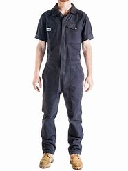
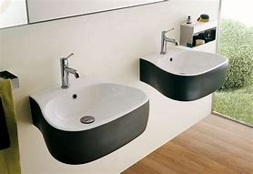

= Lesson 4
:toc:

---

== Section 1

==== Dialogues 1:

Sophie: Here's some coffee. +
George: Oh, fantastic ... er ... is there any sugar? +
Sophie: Sugar ... yes, of course ... here you are. +
George: Thanks ... er ... +
Sophie: What's the matter now? +
These: Er ... are there any chocolate biscuits? +
Sophie: No, there aren't. +
George: Oh ...

- fantastic : extremely good; excellent 极好的；了不起的 +
=>来自fantasy, 幻想。即幻想中的，极美妙的。 +
-> a fantastic achievement 了不起的成就

- What's the matter  发生了什么事?

---

==== Dialogues 2:

Kathy: Where do you live? +
David: Near Victoria Station. +
Kathy: In a flat or a house? +
David: In a flat. Houses are terribly expensive. +
Kathy: What's your flat like? +
David: It's small and the building is old, but it's comfortable. It's very near my office.

---

==== Dialogues 3:

Christine: When did you buy that new necklace? +
Libby: I didn't buy it. It was a present. +
Christine: Oh, who gave it to you? +
Libby: A friend. +
Christine: Anybody I know? +
Libby: Don't ask so many questions. +

---

==== Dialogues 4:

Tom and Anna saw a film yesterday. +
Tom: It was exciting, wasn't it? +
Anna: Yes, it was. +
Tom: Charles Bronson was good, wasn't he? +
Anna: Yes, he always is. +
Tom: I thought the girl was good too. +
Anna: Did you?

---

== Section 2

==== A. Conversation 1:

Eustace: What are you doing? +
Luanda: I'm packing(v.). +
Eustace: Why? +
Luanda: Because I'm leaving. +
Eustace: You're not. +
Lucinda: Yes, I am. I'm catching the first train tomorrow. +
Instance: But, I ... +
Luanda: ... and I'm not coming back. +
Eustace: Oh, oh ... where are you going? +
Lucinda: To ... to ... Hawaii. +
Eustace: Oh darling.

- pack (v.) 收拾（行李）；装（箱）
- darling : ( informal ) a way of addressing sb that you love 亲爱的；宝贝

---

==== B. Conversation 2:

Phillip: Excuse me, Mr. Jones. Can you help me? +
Mr. Jones: Of course. What's the problem? +
Pall: Well, I have to wear an overall but I can't find one. +
Mr. Jones: That's easy. Why don't you look in the cupboard besides the washbasin? You'll find one there. +

- overall : ( BrE ) [ C ] a loose coat worn over other clothes to protect them from dirt, etc. 外套；罩衣 /overalls 工装连衣裤；工装服 +

- besides 除…之外（还）

- washbasin （浴室内固定在墙上有水龙头的）洗脸盆 +

---

==== C. Conversation 3:

(sound of phone ringing)  +
Jean: 7824145. Jean Williamson speaking. +
Tom: Oh, it's you, Jean. Sorry I had to rush off this morning. How are the boys? +
Jean: I'm taking them to the doctor at twelve o'clock, but I'm sure they're going to be all
right. +
Tom: That's good. What about you? +
Jean: Oh, I'm fine now. I'm going to bake a birthday cake for tomorrow. And ... I've got a
camera for Peter and some records for Paul. +
Tom: You spoil(v.) them. I'm going to open a savings account for them. They need to learn how to save money.

- rush off 仓促离开;  匆忙走掉
- bake (v.)~ sth (for sb)~ (sb) sth : to cook food in an oven without extra fat or liquid; to be cooked in this way （在烤炉里）烘烤；焙
- 我给彼得买了一架照相机，给保罗买了一些唱片。
- spoil (v.) 溺爱；娇惯；宠坏 /   ( of food 食物 ) 变坏；变质；腐败 / ~ sb/yourself : to make sb/yourself happy by doing sth special 善待；格外关照 +
-> He really spoiled me on my birthday. 我过生日那天他真让我受宠若惊。

- savings account [金融] 储蓄帐户; 存款帐户

---

== Section 3

==== Dictation.

Dictation 1:

My grandfather lives with us. He is seventy years old and I like talking to him. Every day I go for a walk with him in the park. My grandfather has a dog. The dog's name is Nelson. Nelson is old and he has very short legs and bad eyes. But my grandfather likes him very much.

- go for a walk 去散步

---

Dictation 2:
I have a small black and white television and I can get a good picture. But my brother has got a color television. It is bigger, heavier and more complicated than mine. My brother gets a better picture on his television than I do on mine. So when there is something very good on TV, I usually go and see my brother.

- picture 电视图像

---
