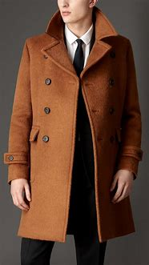
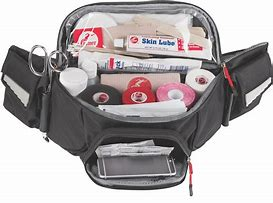
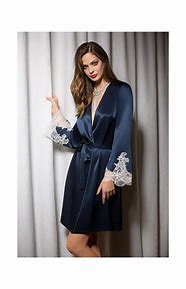
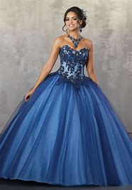
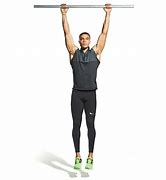

= Lesson 6
:toc:

---

== Section 1

==== Dialogue 1:

—Is that Mr. Smith's son? +
—No, it isn't. It's Mr. Morgan's son. +
—Is he Irish? +
—No, he isn't. He is Welsh.

- Mr （用于男子的姓氏或姓名前）先生

---

==== Dialogue 2:

—Where are your parents now? +
—They are in Zagreb. +
—Is that in Austria? +
—No. It's in Yugoslavia.

- Austria  奥地利 +

- Yugoslavia  南斯拉夫 +

---

==== Dialogue 3:

—Who is the girl by the door? +
—It's Jone Smith. +
—Is she a nurse? +
—No. She's a librarian. +

---

==== Dialogue 4:

—My hat and coat, please. Here is my ticket. +
—Thank you, sir. Here they are. +
—These not mine. They are Mr. West's. +
—I'm sorry, sir. Are these yours? +
—Yes, they are. Thank you. +

- coat 外套；外衣；大衣 +

---

==== Dialogue 5:

—Whose handbag is that? +
—Which one? +
—The big leather one. +
—Oh, that's Miss Clark's.

- leather 皮革 /leathers  （尤指骑摩托车人穿的）皮衣，皮外套

---

==== Dialogue 6:

—What are you looking at? +
—I'm looking at some stamps. +
—Are they interesting? +
—Yes. They are very rare ones.

- rare (a.)~ (for sb/sth to do sth)~ (to do sth) 稀少的；稀罕的; /稀罕的；珍贵的

---

==== Dialogue 7:

—Where's Miss Green at the moment? +
—In her office. +
—What's she doing there? +
—She's typing, I think.

---

==== Dialogue 8:

—Are there any pencils in the drawer? +
—No, I'm sorry. There aren't any. +
—Are there any ball-point pens then. +
—Yes. There are lots of ball-points.

- ball-point : A ballpoint or a ballpoint pen 圆珠笔

---

==== Dialogue 9:

—I need some oil, please. +
—How much do you need, sir? +
—Three pounds, please. +
—Thank you, sir.

---

==== Dialogue 10:

—Is there any shampoo in the cupboard? +
—No, I'm sorry. There isn't any. +
—Is there any soap, then? +
—Yes. There is a whole pack of soap.

- shampoo : a liquid soap that is used for washing your hair; a similar liquid used for cleaning carpets, furniture covers or a car 洗发剂；香波；（洗地毯、家具罩套、汽车等的）洗涤剂

- pack : a container, usually made of paper, that holds a number of the same thing or an amount of sth, ready to be sold  （商品的）纸包，纸袋，纸盒; / 一捆，一包（尤指适于携带的东西） / 大背包 +
-> a pack of cigarettes/gum 一盒香烟╱口香糖

---

==== Dialogue 11:

—Where does Miss Sue come from? +
—She comes from Tokyo. +
—What language does she speak, then? +
—She speaks Japanese. +

---

==== Dialogue 12:

—What does Miss Jenkins do? +
—She is a nurse. +
—Where does she work? +
—At the Westminster Hospital.

---

==== Dialogue 13:

—Do you like your manager? +
—Yes. He is nice and kind. Is yours kind, too? +
—No. Mine is rather a brute. +
—Oh, I'm sorry about that.

- rather :
1.（常用于表示轻微的批评、失望或惊讶）相当，在某种程度上::
-> It was rather a difficult question. 这真是个难题。

2.（纠正所说的话或提供更确切的信息）更确切地讲，更准确地说::
-> She worked as a secretary, or *rather*, a personal assistant. 她当了秘书；确切地讲，是私人助理。

3.（提出不同或相反的观点）相反，反而，而是::
-> The walls were *not* white, *but rather* a sort of dirty grey. 墙面不是白的，而是灰不溜秋的。

- brute : a man who treats people in an unkind, cruel way 残酷的人；暴君

---

==== Dialogue 14:

—Is anyone *attending to* you, sir? +
—No. I should like to see some dressing gowns. +
—What sort are you looking for, sir? +
—I fancy a red, silk one.

- ATTEND(v.) TO SB/STH : to deal with sb/sth; to take care of sb/sth 处理；对付；照料；关怀 +
-> Are you being attended to, Sir? (= for example, in a shop) 先生，有人接待你吗？ +
-> I have some urgent business to attend to. 我有一些急事要处理。

- attend (v.) ~ (to sb/sth) ( formal ) to pay attention to what sb is saying or to what you are doing 注意；专心  +
=> at-临近 + -tend-延伸 → 延伸过来 → (腿脚延伸过来)出席,(心神延伸过来)看管 +
-> She hadn't been attending during the lesson. 上课时她一直不专心。

- dressing gown : ( BrE ) ( NAmE [ "bath·robe", "robe" ] ) a long loose piece of clothing, usually with a belt, worn indoors over night clothes (night clothes 睡衣), for example when you first get out of bed 晨衣， 晨袍 （起床后套于睡衣外在室内穿的宽松长罩衫，通常有束带） +

- gown （尤指特别场合穿的）女裙；女长服；女礼服 / （尤指在医院穿的）罩衣，外罩 +

- fancy (v.) ( BrE informal ) to want sth or want to do sth 想要；想做  +
-> Fancy a drink? 想喝一杯吗？

---

== Section 2

==== A. Telephone Conversation 1.

Instructor: Henry wants tickets for Romeo and Juliet so he tries to telephone(v.) the box of
office. First he hears: (wrong number tone). He has dialed the wrong number. Then he
tries again. (busy tone) Henry *is fed up* but he must get some tickets. He tries again and
finally, he gets through.

- Romeo 罗密欧 /a young male lover or a man who has sex with a lot of women 年轻的男情人；风流放荡的男子
- tone （打电话时听到的）声音信号 / （尤指乐器或电子音响设备的）音质，音色
- dial (v.)拨（电话号码）

- feed sb up （用大量食物）养肥，养壮
- be fed up : v.吃得过饱；极厌倦，不耐烦，受够了
- be fed up with 对…感到厌烦，腻了

- gets through :  +
1. If you *get through a task* or an amount of work, especially when it is difficult, you complete it. 完成; /熬过; / (法律或提案) 被通过
3. If you *get through to someone*, you succeed in contacting them on the telephone. 用电话联系上

(sound of phone ringing, receiver picked up)
Clerk: Cambridge Theatre. Box Office. +
Henry: Have you got any tickets for Romeo and Juliet for this Saturday evening?' +
Clerk: Which performance? 5 pm or 8:30 pm? +
Henry: 8:30 pm please. +
Clerk: Sorry, that performance is sold out. +
Henry: Well, have you got any tickets for the 5 pm performance? +
Clerk: Yes, we have tickets at 4.50 pounds, 5.50 pounds and 6 pounds. +
Henry: I'd like to reserve(v.) two seats at 4.50 pounds, please. +
Clerk: Right. That's two tickets at 4.50 pounds. Saturday, 5 pm performance. What's the
name please? +
Henry: Bishop. Henry Bishop. +
Clerk: Thank you. You'll collect the tickets before 3 pm on Saturday, won't you? +
Henry: Yes, of course. Thank you. Goodbye.

- Box Office 售票处
- box : a small shelter used for a particular purpose 小亭；岗亭 +
-> a telephone box 电话亭
- pm : 下午（post meridiem，等于afternoon）

- reserve : (v.) ~sth (for sb/sth)  预订，预约（座位、席位、房间等） / 保留；贮备 +
-> I'd prefer to reserve (my) judgement (= not make a decision) until I know all the facts. 在了解全部事实之前我不想发表意见。

- collect : (v.)~ sb/sth (from...) : to go somewhere in order to take sb/sth away 领取；收走；接走 +
-> The package is waiting to be collected. 这包裹在等人领取。( BrE )
-> She's gone to collect her son from school. 她到学校接她儿子去了。

- You'll collect the tickets before 3 pm on Saturday, won't you? 你会在星期六下午3点以前取票，对吗?

---

==== B. Telephone Conversation 2:

Clara: That number has been engaged for ages. Nobody can be that popular. I wonder if her number has been changed. I think I'll try again. +
(Sound of dialing and ringing(a.) tone.) +
Sue: 3346791. +
Clara: Is that you, Sue? +
Sue: Who's calling? +
C1ara: This is Clara. Clara Ferguson. Don't you remember me? +
Sue: Clara! Of course I remember you. How are you? I haven't heard from you for at least two years. What are you doing? +
Clara: Nothing very exciting. That's one reason I'm ringing(v.). I need some advice. +
Sue: Advice. Hmm. That's a good one. I've just been sacked. +

- engage (v.)吸引住（注意力、兴趣） / ~ (with sth) （使）衔接，啮合
- ages : a very long time 很长时间 +
-> I waited for ages . 我等了好长时间。

- That number has been engaged for ages. 这个号码已经占线很久了。

- popular 受喜爱的；受欢迎的；当红的

- ringing : ( of a sound 声响 ) loud and clear 响亮的；清晰的 /( of a statement, etc. 陈述等 ) powerful and made with a lot of force 有力的；强劲的

- ring (v.)  ~ sb/sth (up)  给…打电话
- advice (n.)~ (on sth)   劝告；忠告；建议；意见
- sack (v.) to dismiss sb from a job 解雇；炒鱿鱼 /（尤指旧时军队等）破坏，劫掠

- I've just been sacked.  我刚刚被解雇了

Clara: There are the pips. Hang on, Sue. +
Clara: What do you mean ... you've just been sacked? Sue, you're the most successful woman I know. +
Sue: That's probably why I've been sacked. But let's talk about you. You said you needed some advice. +
Clara: I certainly do. I wanted to ask you about interviews. Have you had a lot of them?
Sue: Yes, I have. Too many. +
Clara: So, could you tell me the sort of questions you're usually asked? +
Sue: Let me think. The first ten questions are almost always the same. I call them the 'whys', 'hows' and 'wheres'. +

- the pips : [ pl. ] ( old-fashioned ) ( BrE ) a series of short high sounds, especially those used when giving the exact time on the radio 嘟嘟声；（尤指电台的）报时信号

- hang (v.) 悬浮（在空中）
- hang on 坚持下去；不挂断；握住不放
- hang on sb's words/on sb's every word : to listen with great attention to sb you admire 专心致志地听所崇拜的人讲话；洗耳恭听某人的话

- interview (n.)(v.)面试；面谈
- them : 可以用于"物" (things) .

(Sound of pips.) +
Clara: Not again. Don't go away, Sue. I've got one more coin. +
Clara: Are you there, Sue? +
Sue: Yes, I'm still here. +
Clara: Sorry, I didn't understand what you were telling me. Could you repeat it? +
Sue: It's very boring, but here you are: +
I'm always asked:  +

Why I want to leave my present job? +
Why I am interested in the new job? +
How I intend to get to work? +
How long I intend to stay in the job? +
Where I live? +
Where I went to school? +
How much I'm paid in my present job? +
How much I expect to be paid in the new job? +
Oh yes. I'm always asked if I'm married. +
(Sound of pips.) +

Clara: That's it, Sue. No more coins. I'll write to you soon ... and many thanks.

- present 现存的；当前的
- many thanks 多谢, 非常感谢

---

== Section 3

==== Dictation.

Dictation 1:

I am not going out with George again. Last week he invited me to go to a football
match. I do not like football, so it was silly of me to say yes. We did not have seats, so we
had to stand for two hours in the rain. I was cold and wet and I could not see a thing. So I
asked George to take me home. He got very angry and said some very unpleasant things.

- silly (a.) 愚蠢的；不明事理的；没头脑的；傻的

---

Dictation 2:

Last week the sun shone(v.) and it got quite hot. I decided to put on my light grey
summer trousers. But I got a shock. I could not put them on. They were too small. It is possible that they got smaller during the winter, but I do not think so. I am afraid I got bigger. So I am going to eat less and I am going to take more exercise. I am definitely
going to lose some weight.

- shone : （shine 的过去式及过去分词）
- shine (v.) to produce or reflect light; to be bright 发光；反光；照耀 +
-> Her eyes were shining with excitement. 她兴奋得两眼放光。

---
