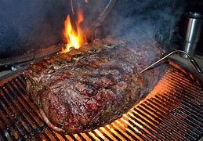
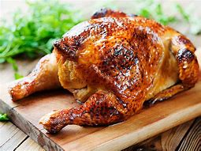
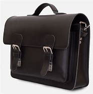
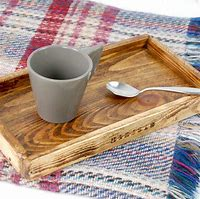
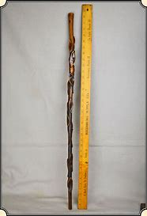
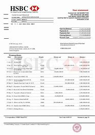

= Lesson 8
:toc:

---

== Section 1

Dialogue l:

—Here comes my secretary. She is an extremely good-looking young woman, don't you
think? +
—Yes, but she isn't very good at her work. +
—Perhaps you are right. But I like her all the same.

- sec·re·tary : a person who works in an office, working for another person, dealing with letters and telephone calls, typing, keeping records, arranging meetings with people, etc. 秘书
- all the same 仍然, 照样地

---

Dialogue 2:

—I'm going to buy a new carpet. +
—But you can't do that. +
—Why can't I? +
—We haven't got enough money.

- carpet 地毯 / （尤指铺满房间的一块）地毯

---

Dialogue 3:

—What are you going to do this afternoon? +
—I'm going to weed(v.) the garden. +
—Are you going to weed the garden tomorrow afternoon, too? +
—No. I'm going to paint the front door.

- weed (v.) 除（地面的）杂草
- paint (v.)在…上刷油漆

---

Dialogue 4:

—I'm going to sit on this chair. +
—But you mustn't. +
—Why not? +
—Because it's broken.

---

Dialogue 5:

—Do you like roast chicken? +
—Yes. I love it. Thank you. +
—Do you prefer brown meat or white meat? +
—I really don't mind(v.). Thank you.

- roast (v.)to cook food, especially meat, without liquid in an oven or over a fire; to be cooked in this way 烘，烤，焙（肉等） +

- chicken 鸡肉
- roast chicken 烧鸡 +

- red meat : [ U ] meat that is dark brown in colour when it has been cooked, such as beef and lamb 红肉（指牛肉、羊肉等）
-  white meat  白肉（烹煮后呈白色的肉，如鸡肉）

- don't mind 不介意, 不在乎
- mind (v.)( used especially in questions or with negatives; not used in the passive 尤用于疑问句或否定句，不用于被动句 ) to be upset, annoyed or worried by sth 对（某事）烦恼，苦恼，焦虑；介意

---

Dialogue 6:

—Did you buy anything when you went to Paris? +
—Yes. I bought a briefcase. +
—What's it like? +
—It's a large, leather one.

- brief·case 公文包；公事包 +

---

Dialogue 7:

—Did you take a bus to the meeting place? +
—No. I went in Richard's car. +
—Did Susan go in Richard's car, too? +
—No. She took a taxi.

---

Dialogue 8:

—Excuse me, sir, is this your cigarette lighter? +
—I beg your pardon? +
—I said "Is this your cigarette lighter". +
—Oh, yes, it is. Thank you so much. +
—Not at all. It's a pleasure.

- cigarette lighter = lighter  打火机
- pleasure : [ C ] a thing that makes you happy or satisfied 乐事；快事 +
-> It's a pleasure to meet you. 很高兴认识你。 +
-> ‘Thanks for doing that.’ ‘It's a pleasure.’  “这事真劳您大驾了。”“不客气。”

---

Dialogue 9:

—Are you engaged(a.), Margaret? +
—Of course I'm not. Why do you ask, Nicholett? +
—I only wanted to practice my English. +
—Oh, I see. You want to make use of me.

- engaged (a.)~ (in/on sth) ( formal ) busy doing sth 忙于；从事于
- make use of sb./sth. : to use sb./sth., especially in order to get an advantage 使用；利用（以谋私利）

---

Dialogue l0:

—Good evening, and how have you spent the day? +
—I serviced and cleaned the car till lunch time. +
—And what did you do after lunch? +
—I took the family into the country for a picnic.

- ser·vice :  检修；维护；维修；保养
- take (v.)to go with sb from one place to another, especially to guide or lead them 带去；引领 / ~ sth (with you)~ sth (to sb)~ (sb) sth 携带；拿走；取走；运走
- pic·nic  (n.)(v.) 野餐

---

Dialogue l1:

—Hello, Tony, where have you been? +
—Swimming. +
—Who did you go with? +
—I went with Mark and Elizabeth.

- where have you been 你去哪了?

---

Dialogue l2:

—Hello, why haven't you lit your cigar? +
—I haven't brought my lighter. +
—I would lend you mine, if you like. +
—Thank you. That's very kind of you.

- lit : （light 的过去式和过去分词） 点燃；点火
- cigar 雪茄烟

---

Dialogue l3:

—Good evening. Can I help you? +
—Yes. I have injured my ankle. +
—What happened? +
—I fell off a ladder last night.

---

Dialogue l4:

—What are those trays made of? +
—They are made of plastic. +
—Are trays always made of plastic? +
—No. They are sometimes made of wood or metal.

- tray : a flat piece of wood, metal or plastic with raised edges, used for carrying or holding things, especially food 盘；托盘；碟 / （各种用途的）浅塑料盒 +
=> 来自古英语 treg,木板，木盘，来自 Proto-Germanic*trawja,木制容器，来自 PIE*deru,树，词 源同 tree,dendrite. +
-> a tea tray 茶盘 +
-> a cat's litter tray 猫的便盆

---

Dialogue l5:

—What's wrong? +
—I'm very thirsty. +
—Why not buy a cup of coffee, then? +
—Yes. That's a good idea. I will.

- thirsty 渴的；口渴的

---

Dialogue l6:

—Excuse me. But is it half past four yet? +
—I'm sorry, but I haven't got a watch. Try the man with the walking stick. He has one. +
—Thank you. I will.

- watch 手表；（旧时的）怀表
- walking stick 手杖；拐棍
- stick : a thin piece of wood that has fallen or been broken from a tree 枝条；枯枝；柴火棍儿 +

---

== Section 2

==== A. Likes and Dislikes.

Listen to these people talking about things they like, things they don't like and things they sometimes like.

Kurt is talking to Georgina.

Male: Do you like chocolates? +
Female: It depends. +

- It depends 看情况而定

Instructor: Now look at the boxes. Listen again to the conversation and listen carefully to the question. Then put a tick in the correct box.

Male: Do you like chocolates? +
Female: It depends. +
Instructor: Here is the question: Does she like chocolates?  +
Is the tick under "sometimes"? +
"Sometimes" is the correct answer. +

- in·struct·or   教练；导师 /（大学）讲师
- tick : ( BrE ) [C] ( NAmE also ˈcheck markcheck ) a mark (✓) put beside a sum or an item on a list, usually to show that it has been checked or done or is correct 核对号；对号；钩号；记号

Now listen to the next example and do the same. +
Male: Would you like a chocolate? +
Female: Not at the moment, thanks. +
Instructor: Here is the question: Does she like chocolates? +
Is the tick under "Don't know"? +
"Don't know" is the correct answer. +

- Not at the moment 现在不要; 至少不是现在; 现在不是时候

Here are more conversations. Listen and tick the correct boxes.

(a)
Female: Do you like pop music? +
Male: It depends. +
Instructor: Does he like pop music?

(b)
Male: Would you like to come to a concert tonight? +
Female: Sorry. I'm afraid I can't. +
Instructor: Does she like pop concerts?

- con·cert 音乐会；演奏会 => con-, 强调。-cert, 唱

(c)
Male: Do you like good coffee? +
Female: Mmmm. It's delicious. +
Instructor: Does she like good coffee?

(d)
Female: Do you like English food? +
Male: Not all of it. +
Instructor: Does he like English food?

(e)
Male: Would you like a cup of tea? +
Female: I'd rather have a cool drink, please. +
Instructor: Does she like tea?

- cool drink : any soft drink 软饮料(不含酒精)

(f)
Female: Would you like an ice cream? +
Male: Well ... I never eat ice cream. +
Instructor: Does he like ice cream?

(g)
Male: Would you like to come to a football match tomorrow? +
Female: Football matches are usually awful. +
Instructor: Does she like football matches?

- awful : very bad or unpleasant 很坏的；极讨厌的 / very shocking 骇人听闻的；可怕的

(h)
Male: Would you like to come to the cinema this evening? +
Female: That would be lovely. +
Instructor: Does she like the cinema? Does she like the boy?

- lovely (a.)beautiful; attractive 美丽的；优美的；有吸引力的；迷人的 /  very enjoyable and pleasant; wonderful 令人愉快的；极好的 +
-> She looked particularly lovely that night. 她那天晚上特别妩媚动人。

---

==== B. Window-shopping.

Bob and Angela are window-shopping. The shop is closed, but they are talking about the
sales next week. They are planning to buy a lot of things.

- window-shop (v.) 在商店橱窗外看衣服, 但光看不买

Bob: Look at that, Angela. True-Value are going to sell hi-fi's for 72.64 pounds. I'm going
to buy one. We can save at least twenty pounds. +
Angela: Yes, and look at the washing machines. They're going to sell some washing
machines for 98.95 pounds. So we can save twenty-two pounds. A washing machine is
more important than a hi-fi. +

- Hi-Fi : High-Fidelity 高保真音响系统

- fi·del·ity (n.)
1.~ (to sth) ( formal ) the quality of being loyal to sb/sth 忠诚；忠实；忠贞::
=>  -fid-信任 + -el名词词尾 + -ity名词词尾 +
-> marital/sexual fidelity 婚姻╱性的忠贞
2.~ (of sth) (to sth) ( formal )  准确性；精确性::
-> the fidelity of the translation to the original text 对原文翻译的准确性

Bob: By the way, Angela. Do you know how much money we've got? About two hundred
pounds, I hope. +
Angela: Here's the bank statement. I didn't want to open it. Oh, dear. +
Bob: What's the matter? +
Angela: We haven't got two hundred pounds, I'm afraid. +
Bob: Well, come on. How much have we got? +
Angela: Only 150 pounds 16.

- bank statement : ( state·ment ) a printed record of all the money paid into and out of a customer's bank account within a particular period 银行结单（某时期内存户存取款项的清单） +

- statement (n.)(v.)声明；陈述；报告 / a printed record of money paid, received, etc. 结算单；清单；报表

- How much have we got? 我们有多少钱?

---

==== C. Discussion

Susan is talking to Christine.

Susan: I hear you and James are engaged(a.) at last. +
Christine: Yes, we are. +
Susan: When are you getting married? +
Christine: In the spring. +
Susan: Oh, lovely. Where's the wedding going to be? +
Christine: Well ... We're not sure yet, probably in St. Albans. +
Susan: Oh, yes, your parents live there, don't they? +
Christine: Yes, that's right. +
Susan: Where are you going to live? +
Christine: We're going to buy a flat or a small house somewhere in South London. +
Susan: Are you going to give up your job? +
Christine: Yes, probably, but I may look for another one when we've settled in.

- engaged (a.) ~ (to sb) having agreed to marry sb 已订婚 +
-> They are engaged(a.) to be married (= to each other) . 他们已经订婚。

- settle (v.)to decide or arrange sth finally （最终）决定，确定，安排好 / 定居 +
-> It's all settled —we're leaving on the nine o'clock plane. 一切都定下来了—我们乘九点的航班走。 +
-> Bob will be there? That settles it . I'm not coming. 鲍勃会去吗？那好，我就不去了。

---

== Section 3

Dictation.

Dictation 1:

I have a watch. It is a Swiss watch. It is not new and my friends are sometimes a little
rude about it. They tell me to buy a new one. But I do not want a new one. I am very happy
with my old watch. Last week it stopped. So I took it to the shop. I did not ask for an
estimate. Today I went to get it. Do you know how much I had to pay? Five pounds. Five
pounds just for cleaning(v.) a watch.

- estimate （对数量、成本等的）估计；估价

---

Dictation 2:

Have you ever thought(v.) what it is like to be one of those beautiful girls that you see on
the front of fashion magazines? They meet interesting people, they travel to exciting
places, and sometimes they make a lot of money. But they have to work hard. They often
have to get up very early in the morning, and of course they have to be very careful about
what they eat.

- 你有没有想过, 成为时尚杂志封面上的漂亮女孩是什么感觉?

---
