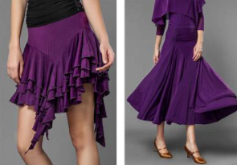
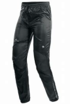
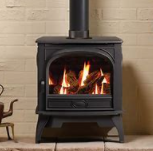

= Preparatory Lesson 1
:toc: left
:toclevels: 3
:sectnums:
:stylesheet: ../../+ 000 eng选/美国高中历史教材 American History ： From Pre-Columbian to the New Millennium/myAdocCss.css

'''

==== Section 1

A.
Listen to the recording and write down what you have heard on the tape. The first one of each group has been done for you.

a. Numbers:
1. forty
2. fifteen
3. a hundred and fifteen
4. three hundred and eighty
5. three thousand four hundred and eighty
6. twenty a
7. thirty b
8. fourteen d

b. Telephone numbers:
1. four eight two six three four
2. seven two one five o six
3. six nine seven double two four
4. five six four three eight o

c. Years:
1. nineteen eighty-two
2. nineteen eighty-seven
3. nineteen seventy-one
4. fourteen ninety-two
5. ten sixty-six
6. eighteen thirty-two

d. Days:
1. the fourteenth of July
2. the second of October
3. the twenty-third of March
4. April the tenth
5. the thirty-first of January

e. Addresses:
1. thirty-two High Street
2. a hundred and fifty-two Piccadilly
3. forty-eight Sutton Road
4. eighteen Bristol Square

f. Times:
1. nine thirty
2. ten forty-five
3. eleven ten
4. three fifteen
5. six forty-five

g. Abbreviations:
1. Doctor Smith
2. Saint Thomas
3. Bond Street
4. Mrs. Archer
5. Eton Avenue
6. Eden Square

h. Spelling:
1. C-H-E-S-T
2. D-I-Z-Z-Y
3. F-L-O-W-E-R
4. J-O-K-I-N-G
5. L-E-M-O-N
6. Q-U-I-E-T
7. W-A-V-E
8. G-R-E-A-T

i. Contractions (n.)词的缩约形式; 收缩；缩小:
1. Don't go.
2. I can't see.
3. It isn't true.
4. I'll tell you.

---

B.
Listen to the tape and complete the following statements.

a. Dr. Blake wasn't born until 1934. b.
I'll see you at nine forty-five. 我9点45分见你。
c. She doesn't live in Oxford Street.
d. You weren't with us on the twenty-first of May. 5月21日你没和我们在一起。
e. I'd like to phone(v.) Eastleigh, that's E-A-S-T-L-E-I-G-H. Six eight two *double four* eight.
f. Mrs. Jones has an appointment at eight am.
g. A northeast wind will bring rain to the London area tomorrow.

[.my1]
====
- I'd like是I would like 的缩写。would like = want.  “I'd like to...”是“I would like to ...”的缩写，是一种客气的表达自己想法的说法。
- 77088 可以说 seven seven o eight eight 也可以说 *double seven* o *double eight*.
====

---

C.
Look at the boxes. Listen to the numbers. *Put* the numbers you hear *in* the boxes. Then add the numbers.

Look at Example 1. +
Put number 1 in box A. Put number 2 in box B. Now put number 3 in box C. Now add the numbers. 1 plus 2 plus 3 make 6. Now listen carefully.

Look at Practice 1.  +
Put number 3 in box A. *Put* number 6 *in* box B. *Put* number 7 *in* box C. Now add the numbers.

Look at Practice 2. +
*Put* number 8 *in* box A. *Put* number 2 *in* box C. Put number 1 in box B. Add the numbers.

Look at Practice 3. +
Put number 7 in box B. Put number 2 in box C. Put number 4 in box A. Add the numbers.

[.my2]
看这些方格。听数字。把你听到的数字写在方格里。然后把数字相加。看例子1。把1放在a方格里，把2放在b方格里，现在把3放在c方格里，现在把数字相加。1加2加3等于6。现在仔细听。

---

D.
Listen to the statements and fill in the blanks.
1. Does she work in a supermarket?
2. Does she work in a bank?
3. Does he work in a chemist?
4. Does he work in a big shop?
5. Does she work in a hotel?
6. Does she work in a shoe shop?
7. Does he work in a shoe shop?

[.my1]
====
- statement :  (n.) something that you say or write that gives information or an opinion 说明；说法；表白；表态（文字）陈述，表述
====

---

==== Section 2

Dialogue 1:  +
— My name's King. +
— How do you spell that? +
— K-I-N-G. I live in Hampstead. +
— How's that spelt? +
— H-A-M-P-S-T-E-A-D.

[.my1]
====
- King人名(金)
- spelt v. 拼写（spell的过去式）
====

---

Dialogue 2: +
— What do you do for a living?  +
— I'm a journalist.  +
— Really? Do you like it?  +
— Yes, I do. It's very interesting.

[.my1]
====
- What do you do : 询问对方的“职业”，它相当于What’s your job? 你是做什么的？
====

---

Dialogue 3:  +
Woman: This is John, Mother. +
Mother: How do you do? +
John: How do you do? +
Woman: John's a journalist. +
Mother: Are you? Do you like it? +
John: Well, it's alright. +

[.my1]
====
- how do you do是相对比较正式的问候，常见于60、70年代.
- alright = all right : acceptable可接受（的）；满意（的）; 尚可；还算可以
====

---

Dialogue 4:  +
—Hello, where are you from? +
—Oh, I'm English. +
—Really? Which part do you come from? +
—Well, I live in London, but I was born in Manchester. +
—Oh! +

[.my1]
====
- English 英格兰人
====

---

Dialogue 5:  +
—Can you speak French? +
—A little. +
—Where did you learn it? +
—At school. +
—Can you speak any other languages? +
—I'm afraid not. +

---

==== Section 3

Dictation. Dictate(v.) five groups of words. *Pay close attention to* the singular and plural forms of nouns.

[.my2]
听写。口述五组单词。密切注意单数和复数形式.

Group 1:  +
1. shirt
2. skirt
3. socks
4. shirt and tie
5. blouse and skirt
6. pants and shirt
7. shoes and socks
8. shoes, socks and pants
9. pants, shirt and socks
10. skirt, blouse and sweater

[.my1]
====
- dictation : the act of speaking or reading so that sb can write down the words 口述;听写
- dictate (v.) ~ (sth) (to sb) 口述
- shirt（尤指男式的）衬衫 +

- skirt女裙;  skirts（连衣裙、外衣等的）下摆 +

- sock短袜
- blouse（女式）短上衣，衬衫 +

- pants  : ( BrE )内裤；短裤; ( especially NAmE )裤子 +

====

---

Group 2:

1. key
2. toothbrush
3. comb
4. key and door
5. table and chair
6. toothbrush and comb
7. bicycle and tire
8. comb, toothbrush and key
9. bed, table and chair

[.my1]
====
- comb梳子；篦子；压发梳；（作为装饰物的）发插
====

---

Group 3: +
1. letter
2. show
3. something
4. read
5. cigarettes
6. taxi
7. bookcase
8. none
9. magazine
10. any
11. policeman
12. policewoman

[.my1]
====
- cigarette 香烟
====

---

Group 4: +
1. shoes
2. shut
3. window
4. lamp
5. bottle
6. refrigerator
7. newspaper
8. purse
9. clothes
10. bed
11. plate
12. stove
13. radio
14. first
15. second
16. third
17. fourth
18. fifth

[.my1]
====
- lamp灯
- purse钱包，皮夹子（尤指女用的）
- plate盘子；碟子
- stove（用于取暖的）炉子，火炉 +

====

---

Group 5: +
1. talking
2. another
3. listening
4. worrying
5. glasses
6. holding
7. walking
8. pointing to
9. looking at

---

