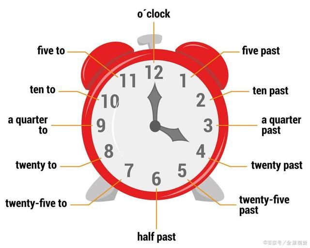
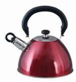

= Preparatory Lesson 2
:toc: left
:toclevels: 3
:sectnums:
:stylesheet: ../../+ 000 eng选/美国高中历史教材 American History ： From Pre-Columbian to the New Millennium/myAdocCss.css

'''

==== Section 1
A.
Numbers. Write the numbers you hear on the tape. The first one has been done for you.  +
1. eighteen
2. ninety
3. seventeen
4. seven hundred and eight
5. seventy-eight
6. a hundred and eighty
7. fourteen
8. seventy-six
9. fifty
10. sixty-five
11. a hundred and twelve
12. twenty-three
13. two and a half 两个半
14. three and a quarter 三又四分之一
15. forty-five percent

---

B.
Numbers. Are these numbers the same or different from those on the tape? Mark the correct ones with "√" and the wrong ones with "×".

1. twenty-five
2. thirteen
3. fifteen
4. sixteen
5. six hundred and fifty
6. a hundred and eighteen
7. five and a half
8. four five three double one nine

---

C.
Letters. Write down the letters you hear on the tape. The first has been done for you. J-K-X-E-Y-A-I-G-H-V-W-R

---

D.
Letters. Are these words the same as those spelled on the tape? Mark the correct ones with "√" and the wrong ones with "×".
1. S-A-D
2. J-A-M
3. F-R-Y
4. R-E-D
5. B-R-E-N-T

---

E.
Times. Are these times the same or different from those on the tape? Mark the correct ones with "√" and the wrong ones with "×".

1. twelve fifteen  12:15
2. twenty-five past two  2:25
3. a quarter to five  4:45
4. half past ten  10:30
5. a quarter to nine  8:45
6. It's about twenty past one.  大约1:20
7. It's almost a quarter to two.  1:45
8. It's almost eleven.
9. It's exactly four.
10. It's nine thirty.  9:30

[.my1]
====
- 表盘左侧用to,右侧用past
-> ten past nine = 9:10 +
-> fifteen past nine 或 a quarter past nine = 9:15 +
-> half past eleven = 11:30 +
-> twenty-five to nine = 8:35  <= *(相差的)分钟＋to＋(下一)小时 : 是差几分种就到几点了* +
-> fifteen to ten 或 a quarter to ten = 9:45
-> ten to twelve = 11:50 +

其实, 能简单用就不要复杂！ +
-> five fifty = 5:50 +
-> four twenty = 4:20 +
-> 9:15 = nine fifteen ; fifteen past nine ; a quarter past nine  +
-> 3:45 = three forty-five ; fifteen to four ; a quarter to four

====

---

==== Section 2

Dialogue l: +
Robert: Hello, I'm Robert. What's your name? +
Sylvia: My name's Sylvia. +
Robert: Are you French? +
Sylvia: No, I'm not. I'm Swiss.

---

Dialogue 2:  +
Ronnie: Where do you come from? +
Susie: From Switzerland. +
Ronnie: What do you do? +
Susie: I work in a travel agency. +
Ronnie: Do you? I work in a bank.

---

Dialogue 3:  +
Tony: Who's that girl over there? +
George: Which one? +
Tony: The tall one with fair hair. +
George: That's Lisa. +
Tony: She's nice, isn't she?

[.my1]
====
- fair浅色的；白皙的; ( especially BrE ) quite good 相当好的；不错的 +

- nice : ~ (to do sth)~ (doing sth)~ (that...) pleasant, enjoyable or attractive 令人愉快的；宜人的；吸引人的; ~ (to sb)~ of sb (to do sth)~ (about sth) kind; friendly 好心的；和蔼的；友好的
====

---

Dialogue 4:  +
Frank wants a new jacket. He and Sally see some in a shop window. +
Frank: I like that brown one. +
Sally: They're cheaper in the other shop. +
Frank: Yes, these are more expensive, but they're better quality. +
Sally: Let's go in and look at some.

---

Dialogue 5:  +
Kurt: Georgina ... +
Georgina: Yes? +
Kurt: Would you like to come to the cinema this evening? +
Georgina: Oh, that would be lovely. +
Kurt: Fine. ... *I'll call for you* at about six o'clock.

[.my1]
====
- Georgina乔治娜（女子名，Georgia的昵称）
- that would be lovely. 那太好了!一般可用于感谢、感叹
- lovely令人愉快的；极好的; beautiful; attractive 美丽的；优美的；有吸引力的；迷人的 +
-> ‘Can I get you anything?' ‘A cup of tea would be lovely.' “要我给你来点什么？”“一杯茶就很好了。”
- call for 前往接某人
====

---

Dialogue 6:  +
Peter and Anne are at a party. +
Anne: Who's that man over there? +
Peter: That's Tim Johnson. +
Anne: What does he do? +
Peter: He's an airline pilot. +
Anne: That's an interesting job. +
Peter: Yes, but airline pilots spend a lot of time away from home. +
Anne: They see a lot of interesting places. +
Peter: Yes, but they have a lot of responsibility. +
Anne: Well, they earn a good salary, don't they? +
Peter: That's true. But they have to retire when they are quite young.

[.my2]
但是航空公司的飞行员有很多时间不在家。

---

==== Section 3

Dictation. Dictate the following seven groups of words and phrases.

Group 1: +
1. kitchen
2. sink
3. under
4. over
5. beside
6. tea kettle
7. chair
8. curtain
9. plant
10. above
11. left
12. right

[.my1]
====
- kitchen厨房
- sink （厨房里的）洗涤池，洗碗槽
- teakettle烧水壶  kettle（烧水用的）壶，水壶 +

- curtain窗帘
- plant植物
====

---

Group 2: +
1. lying down
2. reading
3. drinking
4. milk
5. typing letter
6. turning on
7. water
8. turning off
9. light
10. making
11. eating
12. bone
13. cooking
14. someone
15. finished

[.my1]
====
- bone 挑掉…的鱼刺；剔去…的骨头
- cooking (n.) 烹饪；烹调
====

---

Group 3: +
1. holding
2. son
3. friend
4. wife
5. husband

---

Group 4: +
1. want
2. hungry
3. tired
4. bedroom
5. thirsty
6. dinner

[.my1]
====
- thirsty (a.)渴的；口渴的; /渴望；渴求；热望
- dinner (n.) （中午或晚上吃的）正餐，主餐 ; /宴会
====

---

Group 5: +
1. living room
2. wall
3. above
4. behind
5. TV
6. radio
7. rug
8. floor
9. under
10. door
11. corner
12. left
13. right
14. between

[.my1]
====
- rug小地毯；垫子; /（盖腿的）厚毯子
====

---

Group 6: +
1. wait for
2. bus
3. sleep
4. hot
5. cold
6. dirty
7. look
8. happy

---

Group 7: +
1. to be about
2. weather
3. housewife
4. garden
5. automobile
6. mechanic
7. show
8. outdoors
9. winter
10. summer
11. indoors
12. spring
13. flowers

[.my1]
====
- mechanic : a person whose job is repairing machines, especially the engines of vehicles 机械师；机械修理工；技工 / mechanics机械学 +

====

---
