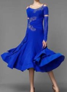
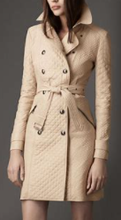
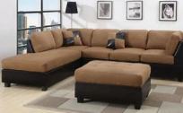

= Preparatory Lesson 3
:toc: left
:toclevels: 3
:sectnums:
:stylesheet: ../../+ 000 eng选/美国高中历史教材 American History ： From Pre-Columbian to the New Millennium/myAdocCss.css

'''

==== Section 1

A.
Numbers. Listen to the tape and write down the numbers. Please use "," to divide the long numbers. (eg. 158,020)

1. seventeen
2. seventy
3. a hundred and forty-eight
4. two *thousand* and seventy
5. three *thousand* four hundred and ninety-two  = 3,492
6. twenty-one
7. thirty-nine
8. four hundred and twenty-two *thousand*
9. three hundred and six
10. nineteen *thousand*
11. ninety *thousand*
12. two hundred and twenty-two *thousand* two hundred and twenty-nine
13. a hundred and forty-six *thousand*
14. thirty-eight *thousand*
15. two thousand six *hundred* and sixty
16. five hundred and four *thousand*
17. a hundred and eighty-five *thousand* six hundred and sixty   185, 660
18. twenty-three percent

[.my1]
====
- *英语的数字三位(hundred)一级 ( xxx hundred trillion, xxx hundred billion, xxx hundred million, xxx hundred thousand, xxx )*,   +
+
即: *万亿trillion - 十亿billion - 百万million - 千thousand - 个* +

[.my3]
[options="autowidth"]
|===
|Header 1 |Header 2

|3,503,456
|three *million*, five hundred and three *thousand*, four hundred and fifty six

|2,134,658
|two *million*, one hundred _and thirty-four *thousand*, six hundred _and fifty-eight

|1,234,567,890
|one *billion*, two hundred and thirty four *million*, five hundred and sixty seven *thousand*, eight hundred and ninty

|4,302,000,000
|four *billion*, three hundred and two *million*
|===

====

---

B.
*Fill in* your Easyway shopping list. The first one has been done for you. (A television advertisement) Do you want a new dress, a coat, a pair of shoes? See what you can order from your Easyway Catalogue(n.). Now fill in your Easyway shopping list.  +
You can find women's sweaters on Page 4. You can find women's shoes on Page 7. You can find men's suits on Page 13. Now women's coats, Page 5. Men's coats, Page 15. Children's coats, Page 55. Men's trousers, Page 14. Baby clothes, Page 40. Children's dresses, Page 44, Men's sweaters, Page 16. Children's shoes, Page 60. Look at the Catalogue. You can find clothes for all the family.  +
Welcome to Easyway Shopping. We'll send you another catalogue next month.

[.my1]
====
- Easyway 公司名
- shopping list : a list that you make of all the things that you need to buy when you go shopping 购物单；采购单
- dress 连衣裙; 衣服 +

- coat 外套；外衣；大衣; /（套装的）上装 +

- order (v.) ~ (sb) sth~ sth (for sb) 订购；订货；要求提供服务 ; /点（酒菜等）
- catalogue 目录；目录簿
- sweater 毛衣，线衣（英国英语指套头无扣的；美国英语可指开襟有扣的）
- suit 套装；西装；西服 +

====

---

==== Section 2

A.
Dialogues.

Dialogue 1:  +
Joanna: Where did you go yesterday? +
Frank: I went to Croydon 地名. +
Joanna: Did you go shopping? +
Frank: No, I went for an interview. +
Joanna: Oh, did you get a job? +
Frank: Yes, I got a job as a Management Trainee. +
Joanna: Fantastic.

[.my1]
====
- interview 面试；面谈
- trainee : a person who is being taught how to do a particular job 接受培训者；实习生；见习生 +
-> a management trainee 管理实习生 +
-> a trainee teacher 实习教师 +
- fantastic 极好的；了不起的
====

---

Dialogue 2:  +
Angela: How did you *get on* in your exam? +
Bob: I failed. +
Angela: Oh, I am sorry. What are you going to do now? +
Bob: I'm going to take it again, of course. +
Angela: When are you going to take it? +
Bob: I'm definitely not going to take it until next year.

[.my1]
====
- GET ON :  ( also ˌget along )（谈及或问及某人）进展，进步 /对付；应付；活下来；过活 +
-> *How did you get on* at the interview? 你面试的情况怎么样？ +
-> *We can get on perfectly well* without her. 没有她我们也能过得很好。 +

- definitely 肯定；没问题；当然；确实 / 确切地；明确地；清楚地 +
-> ‘Was it what you expected?' ‘Yes, definitely.' “那是你所期待的吗？”“当然是。”
====

---

Dialogue 3: +
Assistant: Good morning. +
Tim: Good morning. Would you have a look at this watch, please? It doesn't keep good time. +
Assistant: Yes, of course.

[.my1]
====
- assistant 助手，助理，助教
- keep good time （钟、表）走得准
====

---

Dialogue 4:  +
Gaby: Let's have a party. +
Edward: What a good idea. When shall we have it? +
Gaby: What about Saturday evening? +
Edward: Fine, and where shall we have it? +
Gaby: In your flat. +
Edward: Oh, you know what my landlady's like. She won't let us have a party there. +
Gaby: Let's ask Doris. Perhaps we can have it in her flat.

[.my1]
====
- landlady 女房东；女地主
====

---

B.
Monologue.

My husband and I don't like the schools in our area. We don't think the teachers are very good, and the children don't learn very much. Some children at these schools can't read, it's terrible. Go to the schools and look: the children fight(v.); some of them even smoke and drink. No, our children can have a better education at home with us. After all, we are both teachers.

[.my1]
====
- monologue (n.) （戏剧、电影等的）独白 ;/ 滔滔不绝的讲话；个人的长篇大论

我丈夫和我不喜欢我们地区的学校。我们认为老师不是很好，孩子们也学不到很多东西。这些学校的一些孩子不识字，这太可怕了。
====

---

==== Section 3

Dictation. Dictate the following five groups of words or phrases.

Group 1: +
1. object
2. get dark
3. music
4. grow
5. sunshine
6. bright
7. place
8. electricity
9. coffee
10. evening
11. relax
12. expensive
13. cheap
14. repair

---

Group 2: +
1. someone
2. chase
3. brush
4. teeth
5. throw out
6. sharpen
7. homework
8. bathroom
9. run
10. warm
11. trash
12. go to bed

---

Group 3 +
1. glasses
2. indoors
3. outdoors
4. grass
5. food

---

Group 4: +
1. more
2. between
3. beside
4. refrigerator
5. below
6. on the left
7. egg
8. next to the last
9. shelf
10. pillow
11. pair of

[.my1]
====
- next to the last 倒数第二的; 倒数第二
- shelf （固定在墙上的或橱柜、书架等的）架子，搁板
====

---

Group 5: +
1. put
2. sheet
3. lying down
4. eye
5. using
6. smiling
7. below
8. older
9. couch

[.my1]
====
- sheet 床单；被单
- couch 长沙发；长榻 ; /（尤指诊室内的）诊察台 +

====

---

Group 6: +
1. family
2. father
3. mother
4. husband
5. pair of shorts
6. tree
7. backyard
8. son
9. daughter
10. sister
11. flowers
12. chase
13. sun
14. cloud
15. children
16. call
17. supper
18. time

[.my1]
====
- shorts短裤
- chase (v.) ] ~ (after) sb/sth追赶；追逐；追捕
- supper晚饭；晚餐；夜宵
====

---
