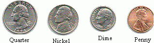
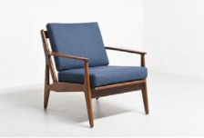

= Preparatory Lesson 4
:TOC:

---

==== Section 1

A.
Numbers. Look at the questions listed below and *fill in* the correct mileage. Please use "," to divide the long numbers. The first one has been done for you.

1. Los Angeles to Chicago: two *thousand* and fifty-four
2. Houston to Miami: one *thousand* one hundred and ninety
3. Detroit to New York: six hundred thirty-seven
4. Miami to Los Angeles: two *thousand* six hundred and eighty-seven
5. Detroit to Houston: one *thousand* two hundred and sixty-five
6. New York to Los Angeles: two *thousand* seven hundred and eighty-six
7. Houston to New York: one *thousand* six hundred and eight
8. Chicago to Miami: one *thousand* three hundred and twenty-nine
9. Detroit to Chicago: two hundred and sixty-six
10. Chicago to Houston: one *thousand* sixty-seven

- mileage 英里里程数
- Detroit 底特律

---

B.
Numbers. Answer the following questions according to what you hear on the tape. Please use "," to divide the long numbers. The first one has been done for you.

1. Cairo: five *million* four hundred *thousand*
2. London: six *million* nine hundred *thousand*
3. New York: seven *million*
4. Tokyo: eight *million* five hundred *thousand*
5. Sao Paulo: twelve *million* six hundred *thousand*
6. Peking: nine *million*
7. Bombay: eight *million* two hundred *thousand*
8. Moscow: eight *million* eleven *thousand*

- Cairo 埃及首都
- Peking 北京的旧称，现在称Beijing

---

C.
Numbers. Dictate the names of coins to get yourself familiarized with these terms. The first one has been done for you.

1. one dime
2. one nickel and one penny
3. one quarter and one dime  一个25美分和一个10美分
4. two nickels
5. two quarters and a penny
6. two dimes and a penny
7. two dimes and two nickels
8. two pennies, two nickels and two dimes
9. one penny, one nickel and two dimes
10. two quarters, two nickels and two dimes

- coin （一枚）硬币；金属货币
- dime （美国、加拿大的）十分硬币，十分钱 =>来自拉丁语decima, 十，十分之一，词源同ten, December. 用于货币单位。比较dinar.
- 美国货币中还有: penny也叫cent (1分), nickel(5分), dime(10分; 角), quarter(25分; 两毛五分).

- nickel （美国和加拿大的）5分镍币
- penny : (abbr. p ) a small British coin and unit of money. There are 100 pence in one pound (￡1). 便士（英国的小硬币和货币单位，1英镑为100便士）
- quarter : a coin of the US and Canada worth 25 cents （美国和加拿大的）25分硬币

口述硬币的名称，使自己熟悉这些术语。第一个已经为你完成了。

---

==== Section 2

Dialogue l:

—Do you like my new shoes? +
—Oh, yes. Aren't they smart? +
—Thank you.

- smart: ( of clothes, etc. 衣服等 ) clean, neat and looking new and attractive 整洁而漂亮的；光鲜的 +
/ ( of people 人 ) looking clean and neat; well dressed in fashionable and/or formal clothes 衣冠楚楚的；衣着讲究的

---

Dialogue 2:  +
—Did you remember to get the bread? +
—Well, I remember walking past the Baker's shop. +
—But you forgot to get the bread. +
—I'm afraid so. I don't remember you telling me to get it. +
—Well, I certainly did. In fact, I reminded you to get it at lunch time.

- lunch午餐；午饭

---

Dialogue 3:  +
—I've *run out of* money. +
—How much money do you need? +
—Oh, about ten pounds. +
—Can't you make do with five pounds? +
—No. That's not enough.

- run out of 用完, 用尽, 用光
- make do (with sth) : to manage with sth that is not really good enough 凑合；将就 +
-> We were in a hurry so we had to *make do with* a quick snack. 我们很匆忙，只好将就着来了点小吃。

---

Dialogue 4:  +

Speaker: Welcome to our conference, ladies and gentlemen. Can you tell me where you come from? First, the girl over there with the fair hair. Your name's Lisa, isn't it? +
Lisa: That's right. I'm Lisa. I come from Germany. I'm German. +
Speaker: Thank you, Lisa. Now the tall man with the black hair. Is your name Tony? +
Tony: That's right. I'm Tony. I come from Italy. I'm Italian. +
Speaker: Welcome, Tony. And now, the small girl on the left. What's your name? +
Francoise: Francoise. +
Speaker: And where do you come from? +
Francoise: I'm French. I come from France. +
Speaker: Welcome to the conference, Francoise. And now it's time for coffee. Can you please come back in half an hour? +
Speaker: Now the coffee break is over. We have people from ten different countries here.

- conference（通常持续几天的大型正式）会议，研讨会
- coffee break工间喝咖啡休息时间

Please write their countries and nationalities. You know Lisa and Tony and Francoise.

1. Lisa comes from Germany. She's German.
2. Tony comes from Italy. He's Italian.
3. Francoise comes from France. She's French.
4. Carmen comes from Spain. She's Spanish.
5. Hans comes from Holland. He's Dutch.
6. George comes from Brazil, He's Brazilian.
7. Ingrid comes from Sweden. She's Swedish.
8. Maria comes from Venezuela. She's Venezuelan.
9. Skouros comes from Greece. He's Greek.
10. Ahmad comes from Egypt. He's Egyptian.

- Dutch  n. 荷兰人；荷兰语 / (a.)荷兰的；荷兰人的；荷兰语的
- Venezuela委内瑞拉

---

==== Section 3

Dictation. Dictate the following four groups of words and phrases.

Group 1:

1. dictionary
2. to clean house
3. cleaning lady
4. housewife
5. different
6. younger
7. older
8. pillow
9. sheet
10. blanket
11. easy chair

- cleaning lady（办公室、房屋等的）清洁女工
- easy chair : a large comfortable chair 安乐椅

---

Group 2:

1. to drink with
2. to eat with
3. youngest
4. oldest
5. busiest
6. heaviest  最重的（heavy的最高级）
7. sharpest
8. to the left
9. to the right

---

Group 3:

1. sell
2. ice cream
3. ice cream cone
4. cents
5. lady
6. park
7. bench
8. typist
9. young
10. office
11. story
12. next
13. tell

- cone（实心或空心的）圆锥体; /（盛冰激凌的）锥形蛋卷筒 =>来自PIE*ak, 尖，刺，词源同acid, coin, cuneiform.
- cent分（辅币单位，相当于许多国家主币面值的1%，如美元或欧元的1%）；分币
- bench  （通常木制的）长凳，长椅 / the bench法官；法官席位；法官（或裁判官）的职位
- typist 打字员; 打字者

---

Group 4:

1. older
2. younger
3. little
4. student
5. teacher
6. want
7. old
8. draw
9. beautiful
10. adult
11. children

---
