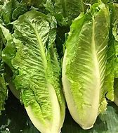
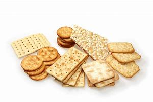
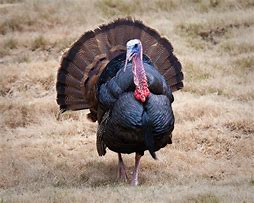
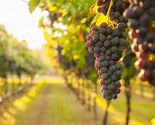
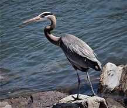

= step 2 - Lesson 02
:toc: left
:toclevels: 3
:sectnums:
:stylesheet: ../../+ 000 eng选/美国高中历史教材 American History ： From Pre-Columbian to the New Millennium/myAdocCss.css

'''

Lesson 2 +

== 01

Interviewer: Is *film editing* 电影剪辑 a complicated job? +
Film Editor: Oh yes, a lot of people probably don't know how complicated a job it can be. It's far more than just sticking (v.) pieces of film together. +
Interviewer: How long does it take to edit a film? +
Film Editor: Well, it depends. You can probably expect 预料；预期；预计 to edit a 10-minute film in about a week. A 35-minute documentary 纪录片, like the one I'm editing at present, takes a minimum of four to five weeks to edit. +
Interviewer: Can you explain to me how film editing works? +
Film Editor: There are different steps. '*Synching 同步 up*', for example. +
Interviewer: What do you mean by synching up? +
Film Editor: It means matching 配对;找相称（或相关）的人（或物） sound and pictures and that is usually done by my assistant. The film and the sound tape have numbers (n.) stamped along the edge which have to be matched. The details of the film and the sound are also recorded in a log book, so it's quick and easy to find a particular take （不停机一次连续拍摄的）场景，镜头 and its soundtrack. This operation is called logging把…载入正式记录；记录  and is again done by my assistant. +
Interviewer: So what do you usually do yourself? +
Film Editor: A lot of things, of course. First, I have to view all the material to make a first selection of the best takes. There's a lot of film to *look through* 逐一查看;浏览；翻阅 because *to make* a sequence *work (v.) the way you want*, you need a lot of shots to choose from. +
Interviewer: Does that mean that you have to discard 丢弃；抛弃 sequences? +
Film Editor: Oh yes. On average for every foot 英尺长的东西 of edited film, you need twelve times as much unedited film and therefore you have to compromise 妥协；折中 and, of course, discard some of it. +
Interviewer: What do you do after selecting the material? +
Film Editor: First of all, I prepare an initial version of the film, a 'rough cut' as it is called. That means that I actually *cut the film into pieces* and stick them together again in the new order. +
Interviewer: And after this 'rough cut' what happens? +
Film Editor: Well, after the 'rough cut' comes the 'fine cut' when the film takes its final form. The producer 制造商,制片人,监制人 and the director come in for a viewing. Some small changes may then be necessary, but when the 'fine cut' has been approved by everyone, this is the final version of the film. +
Interviewer: At this point is the film ready for distribution? +
Film Editor: Oh no. After the final version of the film has been approved, there is the dubbing 配音, there are voices, music, background noises and sometimes special effects to be put together for the soundtrack. And after the dubbing, the edited film is sent to the 'neg' 底片 cutters. +
Interviewer: What do the 'neg' cutters do? +
Film Editor: They cut the original negatives 底片；负片 on the films, so that these match the edited film exactly. And after all that comes the best part —I can sit down quietly with my feet up and enjoy watching the film!

[.my2]
====
采访者:电影剪辑是一项复杂的工作吗? +
电影剪辑师:哦，是的，很多人可能不知道这是一项多么复杂的工作。这远不只是把几片胶片粘在一起那么简单。 +
采访者:剪辑一部电影需要多长时间? +
电影剪辑师:嗯，这要看情况。你大概可以在一周内编辑一部10分钟的电影。一部35分钟的纪录片，比如我现在正在剪辑的这部，至少需要四到五周的时间来剪辑。 +
采访者:你能给我解释一下电影剪辑是如何工作的吗? +
电影剪辑师:有不同的步骤。例如，'Synching up'。 +
采访者:你说的同步是什么意思? +
电影剪辑师:这意味着声音和画面的匹配，这通常是由我的助理完成的。胶片和磁带的边缘都印着数字，需要匹配。电影和声音的细节也被记录在日志中，所以很容易找到一个特定的镜头和它的配乐。这个操作称为日志记录，同样由我的助手完成。 +
采访者:那你平时都做些什么呢? +
电影剪辑师:当然有很多事情。首先，我必须浏览所有的材料，选出最好的镜头。有很多片子要看，因为要让一个序列按照你想要的方式工作，你需要从很多镜头中选择。 +
采访者:这是否意味着你必须放弃序列? +
电影剪辑师:哦，是的。平均来说，每一英尺剪辑过的电影，你需要12倍的未剪辑的电影，因此你必须妥协，当然，丢弃一些。 +
面试官:选好材料后你会做什么? +
电影剪辑师:首先，我会准备一个电影的初始版本，也就是所谓的“粗剪”。这意味着我实际上把电影剪成碎片，然后按照新的顺序把它们重新粘在一起。 +
采访者:在这个“粗剪”之后会发生什么? +
电影剪辑师:嗯，在“粗剪”之后是“精剪”，也就是电影最终成型的时候。制片人和导演进来观看。一些小的改动可能是必要的，但当“精剪”得到所有人的认可时，这就是电影的最终版本。 +
记者:现在电影准备好发行了吗? +
电影剪辑师:哦，不。在电影的最终版本被批准后，配音、配音、音乐、背景噪音，有时还有特效要放在一起制作配乐。配音后，剪辑后的影片被送到“负片”剪辑师那里。 +
采访者:“底片”剪影器是做什么的? +
电影剪辑师:他们剪掉底片上的原始底片，以便与剪辑后的影片完全匹配。在这之后，最棒的部分来了——我可以安静地坐下来，翘起脚，欣赏这部电影! +
====

---

== 02

Man: Hi. +
Woman: Hi. +
Man: What'd you do last night? +
Woman: I watched TV. There was a really good movie called Soylent Green. +
Man: Soylent Green? +
Woman: Yeah. Charlton Heston was in it. +
Man: What's it about? +
Woman: Oh, it's about life in New York in the year 2022. +
Man: I wonder if New York will still be here in 2022. +
Woman: In this movie, in 2022 ... +
Man: Yeah? +
Woman: ... New York has forty 四十 million people. +
Man: Ouch! +
Woman: And twenty million of them are unemployed. +
Man: How many people live in New York now? About seven or eight million? +
Woman: Yeah, I think that's right. +
Man: Mm-hmm. You know, if it's hard enough to find an apartment now in New York City, what's it going to be like in 2022? +
Woman: Well, in this movie most people have no apartment. So thousands sleep on the steps of buildings. (Uh-huh.) People who do have a place to live have to crawl 爬行；匍匐行进 over sleeping people to get inside. And there are shortages (n.)不足；缺少；短缺 of everything. The soil is so polluted 污染；弄脏 that nothing will grow. (Ooo.) And the air is so polluted they never see the sun. It's really awful 很坏的；极讨厌的. +
Man: I think I'm going to avoid going to New York City in the year 2022. +
Woman: And there was this scene where the star, Charlton Heston, goes into a house where some very rich people live. +
Man: Uh-huh. +
Woman: He can't believe it, because they have *running water* 自来水 and they have soap. +
Man: Really? +
Woman: And then he goes into the kitchen and they have tomatoes and lettuce  生菜；莴苣 and beef 牛肉. He almost cries because he's never seen real food in his life, you know, especially the beef. It was amazing for him. +

[.my1]
====
.lettuce

====

Man: Well, if most people have no real food, what do they eat? +
Woman: They eat something called soylent. +
Man: Soylent? +
Woman: Yeah. There's soylent red and soylent yellow and soylent green. The first two are *made out of* 由……制成 soybeans 大豆；黄豆. But the soylent green is made out of ocean plants. (Ugh.) The people eat it like crackers 薄脆饼干. That's all they have to eat. +
Man: That sounds disgusting. +

[.my1]
====
.soybean

.cracker

====

Woman: Well, you know, it really isn't that (ad.)（用以强调程度）那么 far from reality. +
Man: No? +
Woman: Yeah. Because, you know the greenhouse effect that's beginning now and heating up the earth ... +
Man: Oh, yeah, I've heard about that. +
Woman: ... because we're putting the pollutants  污染物；污染物质 in the atmosphere, you know? +
Man: Mm-hmm. +
Woman: I mean, in this movie New York has ninety degrees weather all year long. And it could really happen. Uh ... like now, we ... we have fuel shortages (n.)不足；缺少；短缺. And in the movie there's *so* little electricity *that* people have to ride bicycles to make it. +
Man: You know something? I don't think that movie is a true prediction of the future. +
Woman: I don't know. It scares me. I think it might be. +
Man: Really? +
Woman: Well, yeah.

[.my2]
====
男:嗨。 +
女人:嗨。 +
男:你昨晚做什么了? +
女:我看电视了。有一部非常好的电影叫《绿色Soylent Green》。 +
男:Soylent Green? +
女人:是的。查尔顿·赫斯顿在里面。 +
男:是关于什么的? +
女:哦，是关于2022年纽约的生活。 +
男:我想知道2022年纽约是否还在这里。 +
女:在这部电影里，2022年…… +
男:是吗? +
纽约有四千万人口。 +
男:哎呀! +
女:其中有2000万人失业。 +
男:现在有多少人住在纽约?七百万还是八百万? +
女:是的，我想是这样。 +
男:嗯。你知道，如果现在在纽约很难找到一套公寓，那么到2022年会是什么样子? +
女:嗯，在这部电影中，大多数人都没有公寓。所以成千上万的人睡在建筑物的台阶上。(嗯)。有地方住的人必须从睡着的人身上爬进去。而且什么都短缺。土壤被严重污染，什么也长不了。(已坏)。空气污染如此严重，他们从未见过太阳。真的很糟糕。 +
男:我想我不会在2022年去纽约。 +
女:有这样一个场景，主演查尔顿·赫斯顿(Charlton Heston)走进一所非常富有的人居住的房子。 +
男:嗯。 +
女:他简直不敢相信，因为他们有自来水和肥皂。 +
男:真的吗? +
女:然后他走进厨房，那里有西红柿、生菜和牛肉。他几乎要哭了，因为他这辈子都没见过真正的食物，尤其是牛肉。这对他来说太神奇了。 +
男:嗯，如果大多数人没有真正的食物，他们吃什么? +
女:他们吃一种叫soylent的东西。 +
男:Soylent吗? +
女人:是的。有红色的，黄色的和绿色的。前两种是用大豆做的。但这种绿色是由海洋植物制成的。(啊)。人们把它当饼干吃。它们只能吃这个。 +
男:听起来很恶心。 +
女:嗯，你知道，这离现实并不远。 +
男:没有? +
女人:是的。因为，你知道现在开始的温室效应正在使地球变暖…… +
男:哦，是的，我听说过。 +
女:因为我们把污染物排放到大气中，你知道吗? +
男:嗯。 +
女:我的意思是，在这部电影中，纽约全年都是90度的天气。这可能真的会发生。就像现在，我们有燃料短缺。在电影中，电力非常少，人们不得不骑自行车来发电。 +
你知道吗?我不认为那部电影是对未来的真实预测。 +
女:我不知道。这让我害怕。我想可能是吧。 +
男:真的吗? +
女:嗯，是的。 +
====

---

== 03

The native Americans, the people we call the 'Indians', had been in America for many thousands of years before Christopher Columbus arrived in 1492. Columbus thought he had arrived in India, so he called the native people 'Indians'. +
 +
The Indians were *kind (a.)体贴的；慈祥的；友好的；宽容的 to* the early settlers. They were not afraid of them and they wanted to help them. They showed the settlers the new world around them; they taught 教授 them about the local crops like *sweet potatoes* 红薯, corn and peanuts; they *introduced* the Europeans *to* chocolate and *to* the turkey 火鸡; and the Europeans did business with the Indians. +
 +

[.my1]
====
.sweet potatoes

The most common sweet potato in the U.S. has bright-orange 明亮橙色 flesh 肉, a brown or reddish  微红的；略带红色的 skin, and a shape that bulges 鼓起；凸起 in the middle and tapers （使）逐渐变窄 at the ends. Sweet potatoes also can have purple — or even white — flesh. +eet potatoes
As the name implies, these tubers 块茎 are sweet. One of the best ways to prepare 预备（饭菜）；做（饭） them is to roast 烘，烤，焙（肉等） them because when they caramelize (v.)变成焦糖, they become even sweeter.

在美国最常见的红薯有亮橙色的果肉，棕色或红色的外皮，形状是中间凸起，末端逐渐变细。红薯也可以有紫色甚至白色的果肉。 +
顾名思义，**这些块茎是甜的。**最好的方法之一是烘烤，因为当它们变成焦糖时，会变得更甜。

.sweet potatoes VS yams  红薯和山药的区别
和红薯(sweet potatoes)一样，山药 (yams) 也是块茎植物. 山药有白色，淀粉和干燥的果肉和树皮一样的皮。*它的味道是中性的，不甜.* 真正的山药看起来一点也不像红薯。*它们有白色的肉和树皮一样的皮肤。*

.yams

.turkey

====

But soon the settlers wanted bigger farms and more land for themselves and their families. More and more immigrants were coming from Europe and all these people needed land. So the Europeans started to take the land from the Indians. The Indians had to move back into the centre of the continent because the settlers were taking all their land. +
 +
The Indians couldn't understand this. They had a very different idea of land from the Europeans. For the Indians, the land, the earth, was their mother. Everything came from their mother, the land, and everything went back to it. The land was for everyone and it was impossible for one man to own it. How could the White Man divide the earth into parts? How could he put fences round it, buy it and sell it? +
 +
Naturally, when the White Man started taking all the Indians' land, the Indians started fighting back. They wanted to keep their land, they wanted to stop the White Man taking it all for himself. But the White Man was stronger and cleverer. Slowly he pushed the Indians into those parts of the continent that he didn't want —the parts where it was too cold or too dry or too mountainous 多山的 to live comfortably. +
 +
By 1875 the Indians had lost the fight: they were living in special places called 'reservations 保留地'. But even here the White Man took land from them — perhaps he wanted the wood, or perhaps the land had important minerals 矿物 in it, or he even wanted to make national parks there. So even on their reservations the Indians were not safe from the White Man. +
 +
There are many Hollywood films about the fight between the Indians and the White Man. Usually in these films the Indians are bad and the White Man is good and brave. But was it really like that? What do you think? Do you think the Indians were right or wrong to fight the White Man?

[.my2]
====
美洲原住民，也就是我们所说的“印第安人”，在1492年克里斯托弗·哥伦布到达美洲之前，已经在美洲生活了数千年。哥伦布以为他到达了印度，所以他称当地居民为“印第安人”。 +
 +
印第安人对早期的定居者很友好。他们不害怕他们，他们想帮助他们。他们向殖民者展示了他们周围的新世界;他们教孩子们当地的作物，比如红薯、玉米和花生;他们向欧洲人介绍了巧克力和火鸡;欧洲人与印第安人做生意。 +
 +
但很快，定居者们想为自己和家人提供更大的农场和更多的土地。来自欧洲的移民越来越多，所有这些人都需要土地。所以欧洲人开始从印第安人手中夺取土地。印第安人不得不搬回大陆的中心，因为殖民者夺走了他们所有的土地。 +
 +
印第安人无法理解这一点。他们对土地的看法与欧洲人截然不同。对印第安人来说，土地，地球，是他们的母亲。一切都来自他们的母亲，土地，一切都回到了土地。土地是属于所有人的，一个人不可能拥有它。白人怎么能把地球分成几个部分呢?他怎么能把它围起来，买卖呢? +
 +
自然地，当白人开始占领印第安人的土地时，印第安人开始反击。他们想要保住自己的土地，他们想要阻止白人把土地据为己有。但是白人更强壮更聪明。慢慢地，他把印第安人推进了他不想要的大陆地区——那些太冷、太干或多山而无法舒适生活的地区。 +
 +
到1875年，印第安人已经输掉了这场战斗:他们住在被称为“保留地”的特殊地方。但即使在这里，白人也从他们手中夺走了土地——也许他想要木材，也许这片土地上有重要的矿物质，或者他甚至想在那里建立国家公园。因此，即使在印第安人的保留地，他们也不安全。 +
 +
有许多好莱坞电影讲述印第安人和白人之间的斗争。通常在这些电影中，印第安人是坏人，白人是善良和勇敢的。但真的是这样吗?你觉得呢?你认为印第安人与白人作战是对还是错? +
====

---

== 04

Interviewer: Today, there are more than 15 million people living in Australia. Only 160,000 of these are Aborigines 原住居民；土著；土人, so where have the rest come from? Well, until 1850 most of the settlers came from Britain and Ireland and, as we know, many of these were convicts 已决犯；服刑囚犯. Then in 1851 something happened which changed everything. Gold was discovered in southeastern Australia. During the next ten years, nearly 700,000 people went to Australia to find gold and become rich. Many of them were Chinese. China is quite near to Australia. Since then many different groups of immigrants have gone to Australia for many different reasons. Today I'm going to talk to Mario whose family came from Italy and to Helena from Greece. Mario, when did the first Italians arrive in Australia? +
Mario: The first Italians went there, like the Chinese, in the gold-rushes, hoping to find gold and become rich. But many also went there for political reasons. During the 1850s and 1860s different states in Italy were fighting for independence 独立 and some Italians were forced to leave their homelands because they were in danger of being put in prison for political reasons. +

Interviewer: I believe there are a lot of Italians in the sugar industry. +
Mario: Yes, that's right. In 1891 the first group of 300 Italians went to work in the sugarcane 甘蔗；糖蔗 fields of northern Australia. They worked very hard and many saved enough money to buy their own land. In this way they came to dominate the sugar industry on many parts of the Queensland coast 海岸，海滨. +

Interviewer: But not all Italians work in the sugar industry, do they? +
Mario: No. A lot of them are in the fishing industry. Italy has a long coastline, as you know, and Italians have always been good fishermen. At the end of the nineteenth century some of these went to western Australia to make a new life for themselves. Again, many of them, including my grandfather, were successful. +

Interviewer: And what about the Greeks, Helena? +
Helena: Well, the Greeks are the fourth largest national group in Australia, after the British, the Irish and the Italians. Most Greeks arrived after the Second World War but in the 1860s there were already about 500 Greeks living in Australia. +

Interviewer: So when did the first Greeks arrive? +
Helena: Probably in 1830, they went to work in vineyards （为酿酒而种植的）葡萄园；（以葡萄园自种葡萄进行生产的）酿酒厂 in southeastern Australia. The Greeks have been making wine for centuries so their experience was very valuable 很有用的；很重要的；宝贵的. +

[.my1]
====
.vineyard

====

Interviewer: But didn't some of them go into the coalmines 煤矿? +
Helena: Yes, they weren't all able to enjoy the pleasant 令人愉快的；可喜的；宜人的；吸引人的 outdoor life of the vineyards. Some of them went to work in the coalmines in Sydney. Others started cafes and bars and restaurants. By 1890 there were Greek cafes and restaurants all over Sydney and out in the countryside (or the bush 灌木;（尤指非洲和澳大利亚的）荒野；（新西兰未被砍伐的）林区, as the Australians call it) as well. +

Interviewer: And then, as you said, many Greeks arrived after the Second World War, didn't they? +
Helena: Yes, yes, that's right. Conditions in Greece were very bad: there was very little work and many people were very poor. Australia needed more workers and so offered 主动提出；自愿给予 to pay the boat fare 车费；船费；飞机票价. People who already had members of their family in Australia *took advantage of* this offer and went to find a better life there. +

Interviewer: Well, thank you, Mario and Helena. Next week we will be talking to Juan from Spain and Margaret from Scotland.

[.my2]
====
采访者:今天，有超过1500万人生活在澳大利亚。其中只有16万人是土著居民，那么其余的人来自哪里呢?直到1850年，大多数移民都来自英国和爱尔兰，正如我们所知，其中许多是囚犯。1851年发生的一件事改变了一切。在澳大利亚东南部发现了金矿。在接下来的十年里，近70万人前往澳大利亚寻找黄金并致富。其中许多是中国人。中国离澳大利亚很近。从那时起，许多不同的移民群体出于不同的原因来到澳大利亚。今天我要和马里奥谈谈，他的家人来自意大利，海伦娜来自希腊。马里奥，第一批意大利人是什么时候到达澳大利亚的? +
马里奥:像中国人一样，第一批意大利人是在淘金热中去那里的，他们希望能找到金子，变得富有。但也有许多人是出于政治原因去那里的。在19世纪50年代和60年代，意大利的不同州都在为独立而战，一些意大利人被迫离开自己的家园，因为他们有可能因为政治原因被关进监狱。 +
记者:我相信有很多意大利人从事制糖业。 +
马里奥:对，没错。1891年，第一批300名意大利人前往澳大利亚北部的甘蔗田工作。他们工作非常努力，许多人攒够了钱买了自己的土地。就这样，他们统治了昆士兰海岸许多地区的制糖业。 +
采访者:但并不是所有的意大利人都在制糖业工作，是吗? +
马里奥:没有。他们中的许多人从事渔业。你知道，意大利有很长的海岸线，而且意大利人一直都是很好的渔民。19世纪末，他们中的一些人去了西澳大利亚，开始了自己的新生活。同样，他们中的许多人，包括我的祖父，都取得了成功。 +
采访者:那希腊人呢，海伦娜? +
海伦娜:嗯，希腊人是澳大利亚的第四大民族，仅次于英国人、爱尔兰人和意大利人。大多数希腊人是在第二次世界大战后来到澳大利亚的，但在19世纪60年代，已经有大约500名希腊人生活在澳大利亚。 +
采访者:那么第一批希腊人是什么时候到达的呢? +
海伦娜:大概在1830年，他们去澳大利亚东南部的葡萄园工作。希腊人酿造葡萄酒已有几个世纪的历史，所以他们的经验非常宝贵。 +
采访者:但是他们中的一些人不是去了煤矿吗? +
海伦娜:是的，他们并不是都能享受到葡萄园的户外生活。他们中的一些人去悉尼的煤矿工作。其他人开了咖啡馆、酒吧和餐馆。到1890年，悉尼和郊外(澳大利亚人称之为丛林)到处都是希腊咖啡馆和餐馆。 +
采访者:然后，正如你所说，许多希腊人在第二次世界大战后来到这里，是吗? +
海伦娜:对，没错。希腊的情况非常糟糕:几乎没有工作，很多人都很穷。澳大利亚需要更多的工人，因此愿意支付船费。那些已经有家人在澳大利亚的人利用这个机会去那里寻找更好的生活。 +
采访者:嗯，谢谢你们，马里奥和海伦娜。下周我们将与来自西班牙的胡安和苏格兰的玛格丽特进行对话。 +
====

---

== 05

(1) A: It doesn't sound much like dancing to me. +
B: It is; it's great. +
A: More like some competition 竞争；角逐 in the Olympic Games. +
C: Yeah. It's (pause) good exercise. Keeps you fit. +

(2) A: But you can't just start dancing in the street like that. +
B: Why not? We take the portable  便携式的；手提的；轻便的 cassette recorder 录音机；录像机 and when we find a nice street, we (pause) turn the music up really loud and start dancing. +

(3) A: We have competitions to see who can do it the fastest without falling over. Malc's the winner so far. +
B: Yeah, I'm the best. I teach the others but (pause) they can't do it like me yet. +

(4) A: You're reading a new book, John? +
B: Yes. Actually, (pause) it's a very old book. +

(5) A: Now, can you deliver 递送；传送；交付；运载 all this to my house? +
B: Certainly. Just (pause) write your address and I'll get the boy to bring them round 到某地，在某地（尤指居住地）. +

[.my1]
====
.round
(ad.)( informal ) to or at a particular place, especially where sb lives 到某地，在某地（尤指居住地） +
• *I'll be round* in an hour. 我过一个小时就到。
====

(6) A: Good. I've made a nice curry 咖喱菜. I hope you do like curry? +
B: Yes, I love curry, I used to work in India, as a matter of fact. +
A: Really? How interesting. You must (pause) tell us all about it *over dinner* 在晚餐期间.

[.my1]
====
.curry

====

[.my2]
====
+

A:听起来不太像跳舞。 +
B:是的;太棒了。 +
A:更像是奥运会的比赛。 +
C:是的。这是很好的锻炼。让你保持健康。 +
 +
但是你不能就这样在街上跳舞。 +
B:为什么?我们带着便携式卡式录音机，当我们找到一条不错的街道时，我们(暂停)把音乐开得很大，开始跳舞。 +
 +
我们要比赛看谁做得最快而不摔倒。到目前为止，苹果是赢家。 +
B:是的，我是最棒的。我教其他人，但他们还不能像我这样做。 +
 +
约翰，你在看一本新书吗? +
B:是的。实际上，(停顿一下)这是一本非常古老的书。 +
 +
现在，你能把这些都送到我家吗? +
B:当然可以。(停顿一下)把你的地址写下来，我会叫仆人把他们带来的。 +
 +
(6) A:好。我做了美味的咖喱。我希望你喜欢咖喱? +
B:是的，我喜欢咖喱，事实上，我曾经在印度工作过。 +
答:真的吗?多么有趣。你必须在吃饭时(停顿一下)把一切都告诉我们。 +
====

---

== The Foolish Frog +

Once upon a time a big, fat frog lived in a tiny shallow pond. He knew every plant and stone in it, and he could swim across it easily. He was the biggest creature in the pond, so he was very important. When he croaked 发出（像青蛙的）低沉沙哑声；呱呱地叫, the water snails 蜗牛 listened politely. And the water beetles 甲虫 always swam behind him. He was very happy there. +

One day, while he was catching flies, a pretty *dragon fly* 蜻蜓 passed by. 'You're a very fine frog,' she sang, 'but why don't you live in a bigger pond? Come to my pond. You'll find a lot of frogs there. You'll meet some fine fish, and you'll see the dangerous ducks. And you must see our lovely *water lilies* (百合花) 睡莲. Life in a large pond is wonderful!' +

[.my1]
====
.lilies

.water lilies

====

'Perhaps it is rather dull here,' thought the foolish frog. So he hopped after the dragon fly. +
 +
But he didn't like the big, deep pond. It was full of strange plants. The water snails were rude to him, and he was afraid of the ducks. The fish didn't like him, and he was the smallest frog there. He was lonely and unhappy. +
 +
He sat on a water lily leaf 叶子 and croaked sadly to himself, 'I don't like it here. I think I'll go home tomorrow.' +
 +
But a hungry heron 鹭，苍鹭 flew down and swallowed him up for supper 晚餐.

[.my1]
====
.heron

====

[.my2]
====
+

愚蠢的青蛙 +
从前，有一只又大又胖的青蛙住在一个又小又浅的池塘里。他知道里面的每一棵植物和石头，他可以轻松地游过去。他是池塘里最大的生物，所以他很重要。当他呱呱叫的时候，水蜗牛礼貌地听着。水甲虫总是在他身后游。他在那里过得很开心。 +
一天，当他在抓苍蝇的时候，一只漂亮的蜻蜓经过。“你是一只很好的青蛙，”她唱道，“但是你为什么不住在一个大一点的池塘里呢?”到我的池塘来。你会发现那里有很多青蛙。你会遇到一些很好的鱼，你会看到危险的鸭子。你一定要看看我们可爱的睡莲。大池塘里的生活太美妙了!” +
“也许这里太无聊了，”愚蠢的青蛙想。于是他跳着追赶蜻蜓。 +
但是他不喜欢又大又深的池塘。那里长满了奇怪的植物。水蜗牛对他很粗鲁，他害怕鸭子。鱼不喜欢他，他是那里最小的青蛙。他感到孤独和不快乐。 +
他坐在一片睡莲的叶子上，伤心地低声对自己说:“我不喜欢这里。我想我明天就回家。” +
但是一只饥饿的苍鹭飞了下来，把他吞了下去当晚餐。 +
====

---
